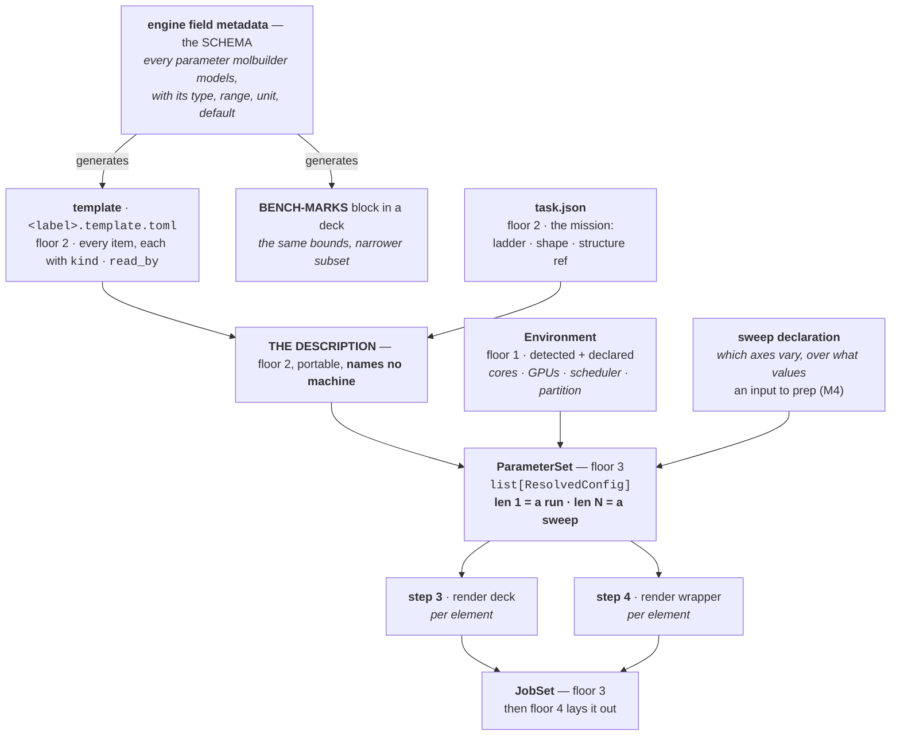
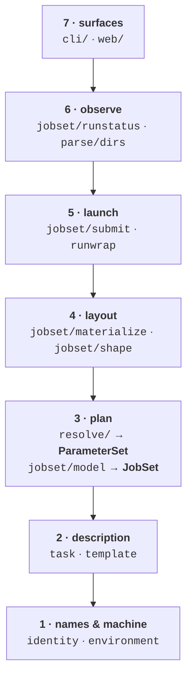

# The generator — one pipeline from template to decks

**Role:** contract
**Domain:** execution

**Companions:**
[`execution/architecture.md`](?doc=execution/architecture.md) — the floors, the
routes, and the four axes this adds a fifth to;
[`engines/template.md`](?doc=engines/template.md) — the item model this reads;
[`execution/project-layout.md`](?doc=execution/project-layout.md) — `prep`'s five
steps, and § 2.3.1a's *framework vs specialisation* split, which this makes
executable;
[`execution/job-contracts.md`](?doc=execution/job-contracts.md) — the file
formats it writes;
[`roadmap.md`](?doc=roadmap.md) — how much of this the code holds today.

> **This document says how declared data becomes a job set.** It is the authority
> for the *generating* half of execution: what data exists, who bounds it, who
> reads it, and the one object that makes benchmarking and running the same code.
> It says nothing about *when* any of it gets built — that is
> [`roadmap.md`](?doc=roadmap.md) and the staged-runs plan.

---

## 1. What this owns, and what it does not

| owns | does not own |
|---|---|
| the **data spine** — schema → template → description → parameter set → jobs | what a project directory *is* (`project-layout.md`) |
| **`ParameterSet`**, and why it is a list | the item format (`template.md`) |
| **what bounds a sweep**, and from which source | the deck's block syntax (`job-contracts.md` § 3) |
| the **engine seam** — what an engine supplies, and what it may not | the ladder and its overrides (`stages.md`) |

---

## 2. The one idea: a run is a sweep of length one

[`architecture.md`](?doc=execution/architecture.md) § 0 names four axes and one
property that makes them work:

> *every axis is a **value read at one point**, never a branch that grows a
> second code path.*

**There is a fifth axis, and today it is the one that is a branch.**

| axis | the value | where it is read |
|---|---|---|
| surface | — | you |
| environment | `Environment` | `prep` step 1 |
| shape | `task.json`'s `shape` | floor 4, once |
| engine | an item's `kind` | the deck writer |
| **kind** — run · bench · study | **`ParameterSet`'s length** | **`prep` step 2** |

`project-layout.md` § 2.3.1a already states the resolution in words —
*"benchmarking is `prep` whose parameters are a set rather than a point"* — and
this document makes it an object:

> **`prep` step 2 always produces a list of resolved configurations.** A
> production run is that list with **one** element. A benchmark is the same list
> with **N**. Steps 3, 4 and 5 loop over it without asking which they are in.

**Everything follows from that sentence.** There is no `if benchmark:` anywhere
below floor 7, because there is nothing to ask: the code that renders one deck
and the code that renders sixteen is the same loop over a list whose length was
decided by data.

> **Why a *third* kind costs nothing.** § 2.3.1a asks what happens when a
> convergence study or a set of trial geometries appears. The answer is now
> mechanical: it is a `ParameterSet` with a different axis. **Nothing new is
> needed at the top**, which is the test of whether this design is real.

---

## 3. The spine, in one picture

**Read the two `generates` edges as the load-bearing ones.** The schema is the
single source of every bound in the system, and both the template and a deck's
BENCH-MARKS block are emitted from it —
[`template.md`](?doc=engines/template.md) § 5 already makes that a rule, *"because
two hand-maintained copies of `default` would drift silently."* This document
adds the consequence: **a sweep needs no bounds of its own**, because the bounds
it needs are already declared upstream of it.

---

## 4. What bounds a sweep — and why nothing new is invented

A sweep axis is a pair: **an item, and a set of values.** There are exactly two
families, and they differ in *who is allowed to bound them*:

| family | example | candidate values declared by | bounded by | why that source |
|---|---|---|---|---|
| **parameter** | `BlockSize` · `mesh_cutoff` · `energy_shift` | the template item's own `range` · `choices` · `type` | **the schema** | it is a parameter, and § 7 of `template.md` makes every schema parameter an item |
| **machine** | `mpi_np` · `cpus_per_task` · `gpu_mode` | not a template item at all | **`Environment`'s capability** | floor 2 must never name a machine (`template.md` § 7; `project-layout.md` M1) |

**Both bounds already exist as data.** The template carries `range` and `choices`
for every parameter; `Environment` carries what this machine actually has, under
`project-layout.md` § 2.3.1b's M1–M6. So *"is this sweep point legal?"* is
answered by reading data that was declared for other reasons — never by a table
inside the generator.

> **The worked case, because it is the one that goes wrong.** `BlockSize` is a
> parameter axis whose legal ceiling is **orbitals ÷ ranks** — and ranks are a
> *machine* fact. So a sweep over `BlockSize` × `mpi_np` has a bound that spans
> both families. **This is not a special case and must not become one:** the
> ceiling is computed once, where both values are in hand, which is inside the
> resolver at step 2. It is not the sweep's job, not the deck writer's, and not
> the wrapper's. See [`tuning.md`](?doc=engines/tuning.md) § 2.11.

### 4.1 Where a sweep is declared

**A sweep is an input to `prep`, never a field of the description.** This is
forced, not chosen: `project-layout.md` M4 says allocation is a `prep` input and
not part of the description, and a machine axis *is* an allocation. Putting a
parameter axis in the description while a machine axis arrives at `prep` would
split one concept across two floors for no reason.

> **The exact surface a person types is [`roadmap.md`](?doc=roadmap.md)'s open
> decision 31**, and this document deliberately stops short of it. What is fixed
> here is the *shape*: a sweep is `{axis: [values]}`, it arrives at `prep`, and
> its legality is checked against the two sources in the table above.

---

## 5. `ParameterSet` — the object that makes `kind` a value

| | |
|---|---|
| **floor** | 3 |
| **the question it answers, once** | *what configurations are we about to render?* |
| **who may build one** | the resolver, at `prep` step 2 |
| **shape** | an ordered `list[ResolvedConfig]`, plus the axes that produced it |

**Each element is a complete, validated configuration** — the template's values,
this stage's `overrides` on top, then this sweep point's values on top of that.
Precedence is that order and it is total: every element is renderable on its own,
and no downstream reader ever re-derives a value or asks *"was this a benchmark?"*

**What each element carries beyond its values:**

| field | why it exists |
|---|---|
| `values` | the resolved parameters — what the deck writer renders |
| `point` | which sweep coordinate this is (`{}` for a run) — what names the trial directory |
| `label` | the `SystemLabel` in force. **A trial's is relabelled**, which is what structurally prevents a benchmark from reading the real run's warm files (`project-layout.md` § 2.3.2) |
| `provenance` | which source set each value — template · stage override · sweep point. This is what makes `M3`'s *"the numbers were wrong"* answerable |

> **`point` is why a trial directory needs no naming rule of its own.**
> `bench-G<g>K<k>C<c>` (`job-contracts.md` § 6.3) is `point` rendered — one
> function, fed by data, rather than a format string in the benchmark module.

---

## 6. The module map — one direction, no cycles

**Top-down, and each module is named for the floor it serves.** A module may
import downward and never upward, which is
[`architecture.md`](?doc=architecture.md) § 1's floor rule expressed as files:

**Two modules do not exist today and are the whole of the new code:**

| module | floor | what it owns | what it replaces |
|---|:--:|---|---|
| **`template/`** | 2 | read and write `<label>.template.toml`; the `Item` type; emit from schema | a template that is written by a CLI command and read back by nothing |
| **`resolve/`** | 3 | template + task + environment + sweep → **`ParameterSet`** | the missing floor-2 → floor-3 edge, and `bench/`'s parallel grid builder |

**`resolve/` is the hinge, and it is where the duplication dies.** Everything
`bench/` does that is not measurement-specific is one of `prep`'s five steps; once
the resolver returns a list, the benchmark's build-and-lay-out half has nothing
left to implement.

### 6.1 What each floor may know

| floor | may read | must never |
|---|---|---|
| 2 · `template` · `task` | its own files | know a machine exists |
| 3 · `resolve` | template · task · `Environment` · the sweep | write a file |
| 3 · `model` | a `ParameterSet` | re-read the template |
| 4 · `materialize` | a `JobSet` · `Shape` | re-resolve a parameter |
| 5 · `submit` · `runwrap` | the built directory · `read_by` items | decide anything (M5) |

---

## 7. The engine seam — a plugin, not a branch

**An engine supplies exactly two things**, and adding one touches no shared file:

1. **its schema** — every parameter it models, with `type`, `range`, `unit`,
   `default`, `anchor`, `kind`, `read_by`. This generates its template and its
   BENCH-MARKS block.
2. **a deck writer** — a function from `ResolvedConfig` to deck text, which maps
   `kind="engine"` items through `anchor` and `kind="deck"` items through
   molbuilder's own rule.

**Everything else is shared**: resolution, sweeps, layout, wrappers, submission,
status. `template.md` § 6 already makes this checkable — a producer *"must not
try to emit a `wrapper` item as a keyword"*, and an item says on its own face
which layer owns it.

> **The test of the seam:** adding an engine adds files and edits none. If a new
> engine requires a change inside `resolve/`, `materialize` or `submit`, the seam
> has leaked and the leak is the bug — not the engine.

---

## 8. What this design deletes

A design that only adds is not a design. **This one is only worth building if it
removes the places where two things can disagree:**

| deleted | because |
|---|---|
| the second lifecycle in `bench/` — build, lay out, name | it is `prep` steps 2–5 with a list of length N |
| every `if` on *"is this a benchmark"* below floor 7 | length is data |
| the trial-name format string | `point`, rendered by one function |
| the wrapper reading the **deck text** to find ELPA | `read_by` tells it (`template.md` § 6.1) |
| a second copy of every bound | the schema generates both the template and BENCH-MARKS |

**The size test** (`staged-runs-implementation-plan.md` § 9.4): a change made
under this document that does not delete more than it adds, or remove a place
where two things can disagree, is not this work.

---

## 9. Open, and recorded rather than guessed

| # | question | why it is not decided here |
|---|---|---|
| **31** | how a person *states* an allocation and a sweep | a surface decision, and the user's — § 4.1 fixes the shape without it |
| **G3** | whether `bench` keeps a positional in the grammar | `architecture.md` § 0 settles the *mechanism* (a merge); the word is P9's |
| — | whether `transport`'s chained runs become a `ParameterSet` or need edges | a `JobSet` carries no edges; this is the one shipped thing the model cannot express (`transport.md` § 8) |
