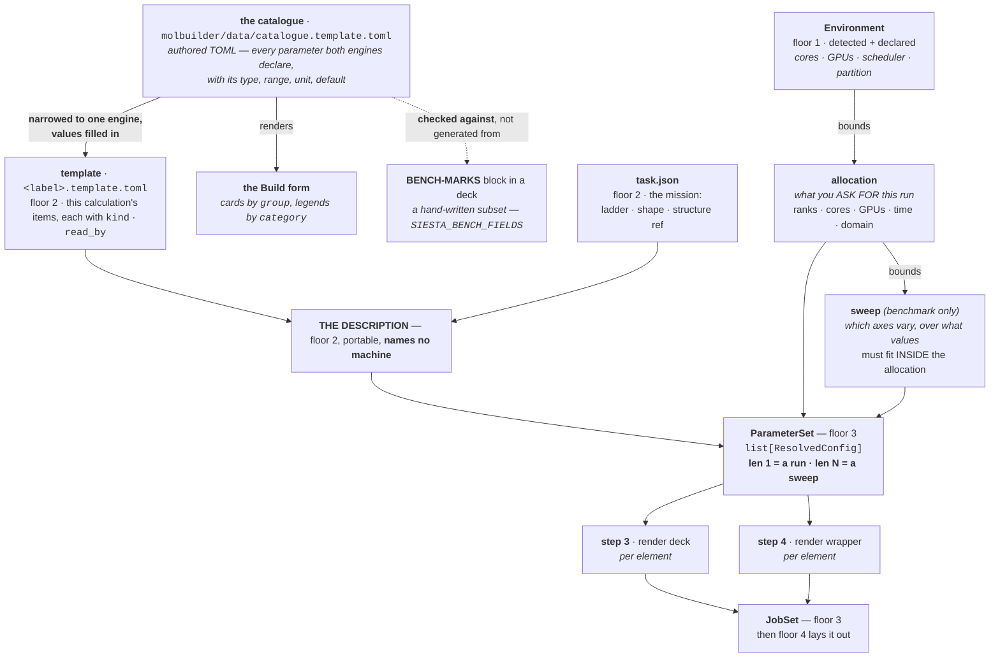
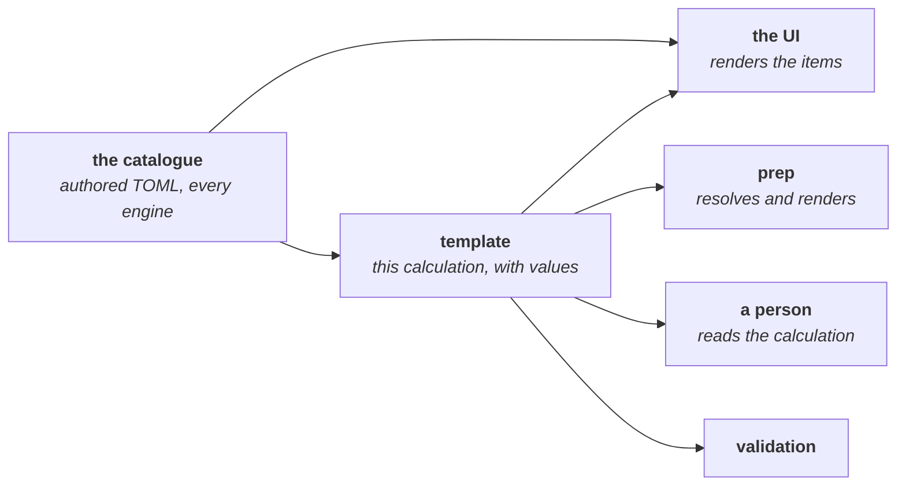
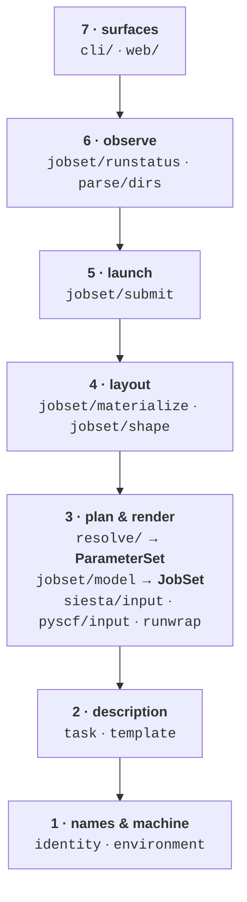

# The generator — one pipeline from template to decks

**Role:** contract
**Domain:** execution

**Companions:**
[`execution/architecture.md`](?doc=execution/architecture.md) — the floors, the
routes, and the axes this adds the fifth to;
[`engines/template.md`](?doc=engines/template.md) — the item model this reads;
[`execution/project-layout.md`](?doc=execution/project-layout.md) — `prep`'s five
steps, and § 2.3.1a's *framework vs specialisation* split, which this makes
executable;
[`execution/job-contracts.md`](?doc=execution/job-contracts.md) — the file
formats it writes;
[`roadmap.md`](?doc=roadmap.md) — how much of this the code holds today.

> **This document says what every value is, and where it came from.** It is the
> authority for the *data spine* of execution — catalogue → template →
> description → parameter set → jobs — for who bounds a sweep, and for the one
> object that makes benchmarking and running the same code.
>
> **It is not the authority for how those values become files.** That is
> [`script-preparation.md`](?doc=execution/script-preparation.md): the steps, the
> order, and what each engine supplies at each one. Values here, files there —
> and the two have different readers, which is why they are two documents.
> It says nothing about *when* any of it gets built — that is
> [`roadmap.md`](?doc=roadmap.md) and the staged-runs plan.

---

## 1. What this owns, and what it does not

> **The normal case is one parameter set, and this contract is built for it**
> *(user, 2026-08-11)*. A structure optimization, a relaxation, a spectra run —
> *"takes only one set of parameters to set up and then formulate the actual
> job"*. That is a `ParameterSet` of **length one**, and nothing about sweeps
> appears on that path. The list exists so that a benchmark is the *same*
> pipeline rather than a second one — not because the ordinary job needs it.
>
> **Transport is deliberately not here.** It is a **multi-component job** — several
> results that must be combined — and therefore its own kind (§ 9, decision 37).

| owns | does not own |
|---|---|
| the **data spine** — catalogue → template → description → parameter set → jobs | what a project directory *is* (`project-layout.md`) |
| **`ParameterSet`**, and why it is a list | the item format (`template.md`) |
| **what bounds a sweep**, and from which source | the deck's block syntax (`job-contracts.md` § 3) |
| the engine seam's **catalogue half** — which rows an engine declares | the seam's **code half**, and the preparation steps (`script-preparation.md`) |
| — | the ladder and its overrides (`stages.md`) |

---

## 2. The one idea: a run is a sweep of length one

[`architecture.md`](?doc=execution/architecture.md) § 0 names the axes and one
property that makes them work:

> *every axis is a **value read at one point**, never a branch that grows a
> second code path.*

**The fifth is the one this document adds, and today it is the only one that is
a branch rather than a value.**

| axis | the value | where it is read |
|---|---|---|
| surface | — | you |
| environment | `Environment` | `prep` step 1 |
| shape | `task.json`'s `shape` | floor 4, once |
| engine | an item's `kind` | the deck writer |
| **kind** — run · bench · study | **`ParameterSet`'s length** | **`prep` step 2** |

`project-layout.md` § 2.3.1a already states the resolution in words —
*"benchmarking is `prep` whose parameters are a set rather than a point"* — and
this document makes it an object:

> **`prep` step 2 always produces a list of resolved configurations.** A
> production run is that list with **one** element. A benchmark is the same list
> with **N**. Steps 3, 4 and 5 loop over it without asking which they are in.

**Everything follows from that sentence.** There is no `if benchmark:` anywhere
below floor 7, because there is nothing to ask: the code that renders one deck
and the code that renders sixteen is the same loop over a list whose length was
decided by data.

> **Why a *third* kind costs nothing.** § 2.3.1a asks what happens when a
> convergence study or a set of trial geometries appears. The answer is now
> mechanical: it is a `ParameterSet` with a different axis. **Nothing new is
> needed at the top**, which is the test of whether this design is real.

---

## 3. The spine, in one picture



**Read the edges out of the catalogue as the load-bearing ones.** The catalogue
is the single source of every bound in the system —
[`template.md`](?doc=engines/template.md) § 2.1 makes it the master and the
config classes translators on the way out. This document adds the consequence:
**a sweep needs no bounds of its own**, because the bounds it needs are already
declared upstream of it.

> **The two solid edges and the dashed one are three different relationships,
> and the difference is worth keeping straight.**
>
> | edge | what actually happens |
> |---|---|
> | catalogue → **template** | `template.template_with_values(config, engine=…)` narrows the file to one engine and writes in the values a person answered. One file in, one file out; nothing is invented on the way |
> | catalogue → **the form** | `_shared.catalogue_to_form_schema(engine)` reads the same file and emits the Build form's sections — so the form and the template cannot describe different parameters |
> | catalogue ⇢ **BENCH-MARKS** | **not a generator.** `script_emit.SIESTA_BENCH_FIELDS` is a hand-written list of five fields, and `tests/test_template_declarations.py` matches each `field` line to the catalogue item that anchors its keyword, refusing a disagreement on `type`. `job-contracts.md` § 3.3 states it in those words: *"emitted from ONE source" was an intention, not a mechanism* |
>
> *(All three edges read `schema` — the engine's own dataclass — until
> 2026-08-16. That is the direction `template.md` § 2.1 forbids: it makes the
> Python class the master and the file its printout. `render_template(config)`,
> which did exactly that, was deleted on 2026-08-14.)*

### 3.1 ⭐ The template's other reader — the UI is built *from* it

*Raised by the user, 2026-08-11: the UI was static then, and should be
constructed from the file instead. **✅ It is, since 2026-08-15** — the SIESTA
and PySCF Build forms are emitted by `catalogue_to_form_schema`, and a
parameter is on the form because the catalogue carries it. The paragraph below
described this as a future plan until 2026-08-16.*

**The shift is small to state and large in consequence.** The template and the
form are *"generated from one source and cannot drift apart"* — but the source
is the **catalogue**, not an engine's Python class, so the chain is
**catalogue → template → UI**. Editing the catalogue changes the interface, and
that is a file a person can open.



> **Why a UI can render a form at all, when a new calculation has no template.**
> A blank form is the **catalogue itself** — every item at its default, no
> values chosen. Opening an existing calculation renders *its* template. **One
> format, one renderer, two states.** There is no separate "form schema" to keep
> in step.

#### 3.1a ✅ Three keys the template must carry for its UI reader — CARRIED
since 2026-08-11 (plan step 1, `4aeba915`)

**Checked against `web/form-schema.md` § 1a and `script_emit.BenchField`; the
template was losing all three until the TOML writer landed:**

| key | what it is | status |
|---|---|---|
| **`label`** | the human name — *"MPI ranks (np)"*, *"Max memory (per rank)"* | ✅ carried (`template.py` Item; was lost — `BenchField.name` held the *field* name) |
| **`category`** | which panel — one of the closed six (`system` · `method` · `accuracy` · `convergence` · `procedure` · `execution`) | ✅ carried. **Was `section`** — a free-text fieldset name per engine (*"Compute & budget"*, *"SCF"*), read once to decide exposure and then discarded. `section` is **RETIRED at `@2`**: two engines expressing one idea disagreed on the label, so no surface could group across them ([`engines/template.md`](?doc=engines/template.md) § 6.2) |
| **`null_label`** | what *unset* is called — *"(single-process)"*, *"(auto)"* | ✅ carried (was lost; `optional` said unset is a real state, nothing said how to show it) |

**A template with these three missing produces a UI that cannot name its own
fields or group them** — which is why they are in `template.md § 5`'s key set
and round-trip losslessly with the rest.

> **So the rule for the TOML key set is: carry what every reader needs, and
> decide it once.** `template.md` § 5's key table is the authority and gains
> `label`, `category` and `null_label`; this section is why.

---

## 4. What bounds a sweep — and why nothing new is invented

A sweep axis is a pair: **an item, and a set of values.** There are exactly two
families, and they differ in *who is allowed to bound them*:

| family | example | candidate values declared by | bounded by | why that source |
|---|---|---|---|---|
| **parameter** | `block_size` · `mesh_cutoff` · `pao_energy_shift` | the template item's own `range` · `choices` · `type` | **the catalogue** | it is a parameter, and § 7 of `template.md` makes every parameter of the calculation an item |
| **machine** | `mpi_np` · `cpus_per_task` · `gpu_mode` (including *none*) | **the item is declared, valueless**, and marked as one the machine answers (`template.md` § 6.4) | **the allocation** — see § 4.1 | floor 2 must never assert a machine's VALUE (`template.md` § 7; `project-layout.md` M1) |

**Both bounds already exist as data.** The template carries `range` and `choices`
for every parameter; the allocation is stated for this run and is itself bounded
by what the cluster has. So *"is this sweep point legal?"* is answered by reading
data that was declared for other reasons — never by a table inside the generator.

> **⚠ Two corrections to this table, both recorded rather than silently
> applied.** (1) It said machine axes were bounded by *capability* until
> 2026-08-11 — a sweep is bounded by **what you asked for**, not by what the
> machine has, which is § 4.1's whole point. (2) It said a machine axis is
> *"not a template item at all"* until 2026-08-14, which `@2` changed: the
> **item** is declared and stays **valueless**, marked as one the machine will
> answer (`template.md` § 6.4). The VALUE is still forbidden on floor 2 —
> that never moved — and a reader refuses one.

> **The worked case, because it is the one that goes wrong.** `block_size` (the
> item; `BlockSize` is the SIESTA keyword it anchors) is a
> parameter axis whose legal ceiling is **orbitals ÷ ranks** — and ranks are a
> *machine* fact. So a sweep over `block_size` × `mpi_np` has a bound that spans
> both families. **This is not a special case and must not become one:** the
> ceiling is computed once, where both values are in hand, which is inside the
> resolver at step 2. It is not the sweep's job, not the deck writer's, and not
> the wrapper's. See [`tuning.md`](?doc=engines/tuning.md) § 2.11.

### 4.1 Capability, allocation, sweep — three things, and why they must stay three

*Specified by the user, 2026-08-11. The reason matters as much as the rule, so it
is recorded with it.*

**`project-layout.md` § 2.3.1b already separates the first two** (M1–M6:
*capability* is what the machine has, *allocation* is what you ask for, and M4
makes the allocation an input to `prep`). **This section adds the third and the
containment between them:**

```
capability    what the cluster HAS            declared in molbuilder.json, per cluster,
    ⊇                                          plus what floor 1 detects
allocation    what you ASK FOR, this run      your choice — and asking for less is
    ⊇                                          often the better choice (see below)
sweep         the points a benchmark tries    must FIT INSIDE the allocation
```

> **The rule:** a sweep point that exceeds the allocation is refused, **not**
> silently clamped and **not** checked against capability instead. *"The sweep …
> should not exceed that allowable resource. It should be compatible."*
>
> **Which allocation?** The one for *this* `prep`. A benchmark and the run it
> informs are two separate preps, usually on two different domains (§ 4.4a), so
> each has its own allocation and the sweep is checked against the benchmark's —
> never against the one the real run will later ask for.

**Why the allocation is not just "the capability" — and this is the part a
design would get wrong by collapsing them:**

> **How a job is scheduled depends on how much you ask for.** Ask for the
> maximum every time and your job sits at very low priority; ask for less and it
> starts sooner. **Which trade you want is yours to make, and it changes per
> run** — so the allocation is a *decision*, not a fact to be derived, and
> nothing may helpfully fill it in from what the machine happens to have.

**That is also the argument for the whole benchmark → run sequence.** You sweep
to find out *what this machine is actually fastest at*; then **you** decide the
configuration the real run asks for, knowing both the speed and the queue cost.
`summarize` writing *a recommendation, not a decision*
(`project-layout.md` § 2.3.2) is the same principle one step earlier.

#### 4.1a Where each of the three is stated

| | stated in | shape |
|---|---|---|
| **capability** | `molbuilder.json` — the clusters available in this environment and **the hardware of each** — plus floor-1 detection on a workstation (M6: a workstation needs no file) | the domain menu (probed into `environment.json`; a declared `scheduler.routing` is the workstation fallback) carries **limits** (`max_time`, `max_mem_gb`) and, since 2026-08-21, the **probed GPU inventory and `max_cores`** of each row's own node group — the two facts § 4.3a's GPU family and per-family cap read |
| **allocation** | the command, at `prep` — *"the actual run would then also provide this parameter for the resources"* | ranks, cores per rank, GPUs (or none), time, and the domain |
| **sweep** | the command, at benchmark time — *"can we speed through these different combinations … block size, CPU numbers, GPU, and how they combine, or no GPU at all"* | `{axis: [values]}`, checked against the allocation |

### 4.2 The third `prep` input: a parameter **pin**

**`prep` takes three inputs, not two** — an allocation, a sweep, and a set of
**pins**: template parameters given a value for *this* prep, overriding what the
description carries. **`block_size` is the only member today**, and it is a member
by rule rather than by exception:

> **A parameter belongs in the pin channel when its right value depends on the
> allocation.** `block_size`'s ceiling is orbitals ÷ ranks, and ranks are an
> allocation — so it cannot be finally decided in a description that names no
> machine. **Anything else that varies belongs in a stage's `overrides`**, where
> the description can carry it.

It is a science parameter — a template item — *and* something a benchmark
measures and a person then pins for the real run.

**Its precedence is three-deep, and each level is a real state:**

| given | source | meaning |
|---|---|---|
| stated at `prep` | the command | you benchmarked it and chose |
| not stated | **the template's value** | whatever the description carries |
| template carries none | **SIESTA's own automatic** | the keyword is not emitted at all — `tuning.md` § 2.11's second state, and the default. *(This row read "`tuning.md` § 2.11's *unset → proposed*" until 2026-08-16; nothing proposes one.)* |

> **The pin channel is bounded by that rule, not by a list**, which is what stops
> it becoming a general "override anything at `prep`" back door. A second member
> would have to argue the same dependency; none does today.

### 4.3 Neither one ever enters the description

**A sweep and an allocation are both inputs to `prep`, never fields of the
description.** This is forced, not chosen: M4 already says so for the allocation,
and a machine axis *is* an allocation. Putting a parameter axis in the
description while a machine axis arrives at `prep` would split one concept
across two floors for no reason.

**The consequence worth stating plainly:** the same portable folder is what you
benchmark, what you then run at the configuration you chose, and what someone
else runs on a different cluster at a configuration of their own. **None of
those three edits it.** That is what floor 2's *names no machine* is actually
buying.

#### 4.3a A sweep is per STAGE, and it is DECLARED in the description

> **Settled by the user, 2026-08-17**, closing a disagreement between this
> document and [`engines/stages.md`](?doc=engines/stages.md) § 6.8: *"sweep is
> decided at prep, not in the description, and it is specifically tied to a
> stage because a stage chooses its run parameters based on bench results."*

**Read "decided at prep" as WHERE IT IS RESOLVED, not where it is asked for**,
because both halves are real and they are different acts:

| | | |
|---|---|---|
| **what to measure** | `task.json`'s `bench` — *"try 4, 8, 16 ranks"* | **declared**, floor 2, portable |
| **what is chosen outright** | a `bench` entry with **one** point — *"enable_gpu: [true]"* | **declared**, and applied at prep as a **pin** over the template, for the bench's trials and the run alike *(user rule, 2026-08-20: every non-machine `bench` entry is an override lane — several points = try them, one = the value in force; the machine-answered axes can never be "in force")* |
| **what those points mean on this machine** | `prep bench <stage>` | **resolved**, floor 3, on the target |
| **what was fastest** | `<stage>/bench/bench-result.json` | **measured**, and offered back to that stage's next `prep run` |

> **Precedence when three sources name one knob** *(weakest to strongest)*:
> the template → a one-point `bench` declaration → the benchmark verdict's
> `run-config.toml` pins → explicit CLI flags.  The measured verdict refines
> the declaration (the decision file is yours to edit or delete), and flags
> beat everything, exactly as they do today.  A **multi-point** non-machine
> entry is a **value axis** — the rule below *(built 2026-08-21; it was
> refused by name until then)*.  At `prep run` a multi-point entry pins
> nothing: the verdict's `run-config.toml` answers, and without one the
> template's value stands.

> **§ 4.3 above forbids a MACHINE'S OPINION in the description, not a
> QUESTION.** *"Use 16 ranks"* is true on one cluster and is refused. *"Try 4,
> 8 and 16"* is true on every cluster, so it is portable and belongs with the
> calculation — § 6.8's argument, and it holds. The sentence *"a machine axis
> IS an allocation"* conflates the two; an axis is the set you want measured,
> and the allocation is what you then ask for.
>
> **The declaration DRIVES the sweep** *(wired 2026-08-19 — until then
> `_bench_inputs` enumerated from the probed topology regardless, so the
> machine chose the points and the user had no input)*: declared axes become
> exactly those trials, a point the machine cannot hold is refused by name
> (never clamped — a clamped point measures a configuration nobody
> declared), and an ABSENT declaration keeps the machine's enumeration as
> the proposal. On a GPU description a declared `mpi_np` is the point's
> total rank count, and the device count is **declared with `gpu_count`**
> — exactly those counts, one shelf each; an uneven `(mpi_np, G)` pair is
> dropped by name (the equal-share rule), a count beyond the machine's
> record refuses, and an ABSENT `gpu_count` keeps the divisor enumeration
> as the proposal *(user, 2026-08-21: "explicit is what we need"; the
> divisors were the only lane until then)*.

**A value axis multiplies the grid, and the point carries its coordinates**
*(user-settled 2026-08-21: GPU-vs-CPU measured under ONE bench, split
submission so neither side's resources idle while the other runs; a
framework rule, not a script patch)*:

- **Enumeration.** The trials are the machine grid × the cartesian product
  of the value axes, in declaration order.  Each point carries its value
  coordinates **on the point itself**, and the resolver's existing split
  applies them to that trial's config exactly like any parameter axis
  (provenance `sweep`) — no second lane exists, which is the point: a value
  axis is the sweep the resolver always understood, fed by the declaration.
- **The measurement pins still win** (capped SCF, forced cold, run-once):
  they are applied *over* the point's coordinates, so a trial stays a
  measurement whatever it measures — and the cold start is **verified at
  the submission door** against the rendered deck itself (a warm or
  group-stripped deck refuses by name; user, 2026-08-21: prep bakes the
  intent, submission determines the run's actual starting state).  A value axis that **names a
  measurement pin** is refused by name — its trials would render identical
  decks under different labels, the same measurement twice.
- **`enable_gpu` with two points is the grid-family axis.**  The machine
  grid is enumerated once per flag: the CPU family holds the device count
  at `G = 0` (plain ranks), the GPU family ranges `G` over each rank
  count's divisors, and the flag rides each point as an ordinary value
  coordinate — so the deck's answer and the point's family agree by
  construction, and `launch`'s placement (below) needs no new declaration.
  The GPU family's device count and type come from the probed topology
  when this node has one, else from the **domain menu's GPU inventory**
  (`jobset probe` records each partition's `gres` types on its domain row)
  — a login node can therefore enumerate the GPU family for the cluster
  behind it.  Several inventory types on the row is a question the machine
  may not answer: refused by name, with the remedy of curating the row.
- **Caps at prep, per family.**  When the menu's gpu-capable row carries
  `max_cores`, a GPU-family cell whose `ranks × cores` exceeds it is
  **dropped by name** (echoed, never silent) rather than refusing the
  prep — refusal would deny the CPU family a rank count that only the GPU
  nodes cannot hold.  `max_cores` is **probed** *(2026-08-21, user: "why
  not autodetected?" — the scheduler reports one row per node group, so a
  mixed partition's GPU nodes state their own core count; a gpu-capable
  row records its GPU nodes' cores, a cpu-only row its widest node's; the
  row stays yours to edit — on Sol, GPU nodes take 48 cores where
  standard nodes take 128)*.  The
  probe-topology refusal for a cell no core count here can hold stands
  unchanged.  *(Known edge, recorded: that refusal reads the probing
  node's shape, so a mixed matrix prepped ON a GPU node over-refuses the
  CPU family; prep on a login/standard node.)*
- **Submission splits by the deck's own answer** (`_job_wants_gpu`, the
  one door) **and then by RESOURCE SHELF** *(user, 2026-08-21: "lighter
  tasks scheduled for heavy resource idling for hours is not a good use
  of cpu time")*: trials sharing one exact ask — the same ranks, cores
  and GPU request (`gres`) — share one grouped job sized to fit them
  exactly, so **nothing idles inside a group** —
  neither the cores a narrow trial would leave of a wide envelope nor
  the devices a G1 trial would hold of a `gres:4` one.  The value-axis
  cartesian shares shelves by construction, which is what keeps queue
  waits at #shelves instead of #trials — the point of the 2026-08-20
  grouping, kept.  Naming: qualifiers appear only when needed —
  `bench-group`, then `-cpu`/`-gpu` when the sweep spans both sides,
  then a shelf token (`-g2n32c1`) when a side spans several shelves.
  The CPU side's groups ask **no `gres`**, so devices are never held
  while CPU trials run — the waste the split exists to stop.  **Routing** *(user, 2026-08-21)*:
  a CPU group MAY run on a gpu-capable cluster, but when the menu holds a
  cpu-only domain it is **preferred** — idle devices cost — and the GPU
  group prefers the first gpu-capable row (its `gpu_partition` when
  declared); the menu's own order rule applies (cheapest ceiling first).
  `--domain` **overrides** the preference for both sides through the one
  resolution, and `--only cpu|gpu` submits one side — so `--only` +
  `--domain` places each side wherever the user says.  A side this
  machine cannot launch stays pending, and a later `submit bench`
  collects exactly the unlaunched side — which is the cross-cluster lane:
  each machine submits what it reaches, results ride the folder back.
  **The shelves submit widest-first, per side** *(user, 2026-08-21)*:
  the CPU side's shelves submit first, then the GPU side's, and within
  each side by descending footprint — cores (ranks × cores-per-rank),
  device count breaking ties.  Only the WITHIN-side order carries the
  rule; across sides the jobs are independent and often target different
  domains, so their relative entry order decides nothing.  An exact-fit
  group costs the same whenever it runs, so the order is free —
  it banks the expensive measurements first and lets a person watch the
  trend (`bench-group*.log`; `summarize` mid-flight) and stop early — an
  early `scancel` of the remaining shelves still summarizes to a verdict
  over what completed, and the queue may even run shelves concurrently.
  *(An early stop's un-run riders are already stamped `launched`, so the
  remainder is re-measured per trial by name — the move-aside path —
  never by re-submitting the group.)*
- **`summarize` is unchanged in kind** — allocation-blind, spanning
  whichever trials have landed.  What it gains is data: `job-set.json`
  records each trial's point (the coordinate as data, never parsed back
  from a name), the winner is matched by its label, and the proposal's
  `[pins]` carry the winner's value coordinates — already pin-shaped for
  the precedence overlay above.
- **Comparability is stated, not assumed**: CPU trials compare across
  same-silicon partitions; GPU numbers are the GPU build's own; the
  verdict reports per-combination facts and choosing stays yours
  (`run-config.toml` is a proposal).

> **Designing the matrix — the background with references** (what the GPU
> actually accelerates, ranks-per-device and MPS, and how to cut points
> without losing the answer) is
> [`engines/tuning.md § 2.12`](?doc=engines/tuning.md).

**Per stage, and that is the second half of the decision.** What runs fastest
changes between a coarse stage and a tight one — different mesh cutoff and
basis size mean a different grid and matrix, so a different best rank count
([`project-layout.md § 2.3.2`](?doc=execution/project-layout.md)). `prep bench`
therefore takes a stage name, writes into that stage's own `bench/` container,
and that stage's next run reads the proposal `summarize` wrote there (`run-config.toml` — `project-layout.md` § 2.3.3).

---

### 4.4 What a benchmark actually produces — a scaling rule, measured elsewhere

*Specified by the user, 2026-08-11.*

**A benchmark is not a stopwatch, it is a scaling rule.** The monitor already
records what it needs: node CPU percent, memory in use, per-GPU SM and memory
utilisation, sampled through the run (`monitor.py`), and the SCF timing at the
end. **Averaged across a trial, those numbers say what happens if you spend
more** — which combination goes faster, where the returns stop, what block size
suits this shape of problem.

**And it answers only half the question.** The other half — *should we ask for
the maximum?* — is § 4.1's priority trade, and no measurement settles it:

> **The configuration a real run asks for sits somewhere between *fastest* and
> *soonest*.** The benchmark tells you the first. The queue tells you the second.
> **The person picks the point between them**, which is why `summarize` writes a
> recommendation and not a decision (`project-layout.md` § 2.3.2).

#### 4.4a The benchmark normally runs on a *different* cluster

**This is the ordinary workflow, not an edge case:**

| | typically runs on | why |
|---|---|---|
| **the benchmark** | a short, high-priority domain | trials are minutes — SCF capped, MD steps zeroed — so they fit a short limit and get scheduled quickly |
| **the real run** | a long domain — on Sol, `public`/`general` at 7 days, `highmem` at 2, or `long` QOS at 14 | the calculation needs the time; and the more resources it asks for, the longer it waits |

**So the two halves of `bench-result@1` are not a nicety — they are what makes
this work**, and the existing split is already the right one:

| half | what it is | crosses to another cluster? |
|---|---|---|
| **`choice`** | the **mechanism** — which engine build, ranks per GPU, block size | **yes, unchanged** — provided the node type is comparable |
| **`recommend`** | **sizing measured on that machine** — memory from peak + 15%, walltime from seconds-per-iteration × assumed iterations | **no.** It is a measurement of a specific node, and it is labelled as a starting point for exactly this reason |

> **⭐ And on ASU Sol the condition is checkable, which is the proof this design
> is not abstract.** `public`, `general` and `htc` draw from **uniformly AMD EPYC**
> nodes, so a benchmark on `htc` (4 h, fast queue) and a run on `public` (7 days)
> are the same silicon and `choice` carries. Where it breaks is visible in the
> same table: a **GPU node has 48 cores against a standard node's 128**, so a
> GPU-measured choice does not carry to a CPU run. **The comparison is by node
> type, not partition name** — [`asu-sol.md`](?doc=execution/asu-sol.md) § 5.2.
>
> **This is what makes decision 38 load-bearing, and for a second reason.** Knowing
> each cluster's hardware is not only *"does my allocation fit?"* — it is
> **"are these two domains comparable enough for `choice` to carry, and by what
> factor does `recommend` scale?"** Without per-domain hardware in config, a
> result measured on the short queue is applied to the long queue on trust.
>
> **Until that lands, the honest behaviour is to say where a result came from**,
> not to silently transfer it. `BenchResult` already carries `environment` and
> `system`, so the provenance exists; what is missing is the comparison.


## 5. `ParameterSet` — the object that makes `kind` a value

| | |
|---|---|
| **floor** | 3 |
| **the question it answers, once** | *what configurations are we about to render?* |
| **who may build one** | the resolver, at `prep` step 2 |
| **shape** | an ordered `list[ResolvedConfig]`, plus the axes that produced it |

**Each element is a complete, validated configuration** — the template's values,
this stage's `overrides` on top, this sweep point's values on top of that, and any
**pin** (§ 4.2) last. Precedence is that order and it is total: every element is
renderable on its own, and no downstream reader ever re-derives a value or asks
*"was this a benchmark?"*

> **An element carries its allocation as well as its parameters, and that is the
> point.** The deck writer needs the rank count (`block_size`'s ceiling is orbitals
> ÷ ranks) and the wrapper writer needs the whole of it. **Both read one object**,
> resolved once, instead of one reading a config and the other re-deriving.

**What each element carries beyond its values:**

| field | why it exists |
|---|---|
| `values` | the resolved parameters — what the deck writer renders |
| **`resources`** | **this element's own allocation** — ranks, cores per rank, GPUs, time, domain. **Per element, because a sweep over `mpi_np` gives each trial a different rank count**, and because this is the field that structurally ends § 5h's finding B: `Job.resources` is copied from here, so it can no longer be read out of an engine config |
| `point` | which sweep coordinate this is (`{}` for a run) — what names the trial directory |
| `label` | the `SystemLabel` in force. **A trial's is relabelled**, which is what structurally prevents a benchmark from reading the real run's warm files (`project-layout.md` § 2.3.2) |
| `provenance` | which source set each value — template · stage override · sweep point. This is what makes `M3`'s *"the numbers were wrong"* answerable |

> **`point` is why a trial directory needs no naming rule of its own.**
> `bench-G<g>K<k>C<c>` (`job-contracts.md` § 6.3) is `point` rendered — one
> function, fed by data, rather than a format string in the benchmark module.

> **And it settles an asymmetry the code carries today.**
> `materialize.shape_of` returns `None` for a sweep, on the stated grounds that
> *"a benchmark bundle carries no description and needs none"* — true now,
> because a benchmark is a separate lifecycle. **Under this design it stops being
> true:** a sweep is a `ParameterSet` inside a described calculation, so it has a
> description like anything else, and its trials nest inside the stage they
> measure — in its `bench/` **container**: `<seq>_<name>/bench/bench-<point>/`
> (`job-contracts.md` § 6.3's Directories table, the cross-layer authority).
> The container gives a stage's bench state ONE home — its trials, its own
> `bench/job-set.json` (the sweep's record; the root `job-set.json` stays the
> RUN plan, merged per stage and never overwritten), and its verdict
> `bench/bench-result.json`. The two directory conventions become
> one question (*does this element have a `point`?*) instead of two kinds.

---

## 6. The module map — one direction, no cycles

**Top-down, and each module is named for the floor it serves.** A module may
import downward and never upward, which is
[`execution/architecture.md`](?doc=execution/architecture.md) § 1's floor rule
expressed as files *(the link said bare `architecture.md`, which resolves to
the ROOT doc of that name — a wrong page, worse than a dead one; F-9,
2026-08-13)*:



**Two modules are the whole of the new code — both LANDED 2026-08-11
(plan steps 1 and 3):**

| module | floor | what it owns | what it replaced |
|---|:--:|---|---|
| **`template.py`** | 2 | read and write `<label>.template.toml`; the `Item` type; narrow the catalogue to one engine and fill in values (`template_with_values`) | a template that was written by a CLI command and read back by nothing — `prep` now rebuilds the config from it |
| **`resolve.py`** | 3 | template + task + `Environment` + **allocation** + sweep + pins (+ the specialisation's `MachineTranslation`) → **`ParameterSet`** | the missing floor-2 → floor-3 edge, and `bench/`'s parallel grid builder (folding at step 6) |

**`resolve/` is the hinge, and it is where the duplication dies.** Everything
`bench/` does that is not measurement-specific is one of `prep`'s five steps; once
the resolver returns a list, the benchmark's build-and-lay-out half has nothing
left to implement.

### 6.1 What each floor may know

| floor | may read | must never |
|---|---|---|
| 2 · `template` · `task` | its own files | know a machine exists |
| 3 · `resolve` | template · task · `Environment` · the allocation · the sweep · the pins | write a file |
| 3 · `model` | a `ParameterSet` | re-read the template |
| 4 · `materialize` | a `JobSet` · `Shape` | re-resolve a parameter |
| 3 · the script writers · `runwrap` | a resolved config · the rendered script · `read_by` items | **re-decide a value it was handed** |
| 5 · `launch` | the built directory | decide anything (M5) |

### 6.2 The five steps — where they are

§ 6.1 is the **spatial** rule: who may read what. The **temporal** one — what must
already have happened at each step, what it leaves behind, and what it may not do
— is [`script-preparation.md`](?doc=execution/script-preparation.md) § 3, which
states it at three resolutions.

Two of its rules bear directly on § 6.1 above. **Step 4 follows step 3 as a data
dependency, not a convention**: the wrapper reads the rendered deck for the
environment and the rank clamp, and a wrapper written first gets both wrong
*silently, because both wrong answers are also the defaults*. **Step 5 links; it
never copies and never renders**: everything under the tree points at what steps
3 and 4 wrote at the root.

> **Why the artifacts land at the root and the tree holds links** — the same
> reason § 3.1 gives for objects. One home for a fact, and a reference to it
> everywhere else. A copy per attempt would be a second home that drifts the
> first time somebody edits one.

---

## 7. The engine seam — a plugin, not a branch

An engine supplies two kinds of thing, and
[`script-preparation.md § 4`](?doc=execution/script-preparation.md) enumerates
both — it has to, because the point of that enumeration is that a gap in either
half is visible against the step that asks for it.

**This document owns the first half: an engine's rows in the catalogue** —
every parameter it models, each declaring `type`, `range`, `unit`, `default`,
`anchor`, `kind`, `read_by`, and an `engines` list naming itself. It adds rows
to the one shared file; it does not bring a file of its own
([`template.md § 6.3`](?doc=engines/template.md)). § 7.2 counts where each
engine stands on it.

### 7.1 What the seam asks for — where it is

The **code half** of the seam is
[`script-preparation.md`](?doc=execution/script-preparation.md) § 4, indexed by
the preparation step that asks for it. That indexing is the point: members listed
as a flat bag cannot answer *"what does this engine still owe?"*; listed against
the steps, a gap is a blank row. **Fifteen questions — one asked at step 2,
fourteen inside step 3**, and both engines have an answer to every one.

**Four of PySCF's answers are *nothing*, and that is W5 working rather than a
gap.** It ships its basis sets inside the library, so it needs no data file and
puts nothing in the shared package; its decks instruct no sibling script; and it
declares no benchmark anchors. Written down, each of those is a decision a
reader can check. Left silent, they are indistinguishable from an arm nobody
thought about — which is the state PySCF reached a full review in.

| the question | SIESTA | PySCF |
|---|:--:|:--:|
| what it cannot start without (`provide_data`) | pseudopotentials | **nothing** |
| the shared package (`shared_package`) | the `.psml` files | **nothing** |
| benchmark anchors (`spec.bench_marks`) | block size, ranks | **nothing** |
| files its deck's text promises (`sibling_artifacts`) | the Makov-Payne script | **nothing** |
| the record's resolved defaults (`spec.provenance_defaults`) | GPU, block size, ranks | threads, memory, fitting |
| what a finished deck must satisfy (`spec.check_rules`) | ✓ | ✓ |

### 7.2 Where the two engines stand — the catalogue half

*(Counts are **engine-exclusive rows** — items naming only that engine. Three
further items name no engine at all and so belong to both, and one —
`restart` — names both explicitly because each engine answers it with a
different mechanism; [`template.md`](?doc=engines/template.md) § 6.3's rule is
that an absent `engines` key means every engine.)*

| | SIESTA | PySCF |
|---|---|---|
| catalogue rows | 44 items | **54 items** | *(each engine's EXCLUSIVE rows; `net_charge` now names both and so counts in neither, `template.md` § 6.3)*
| every row maps to a config field | yes | **yes** |
| `warm-files.toml` in its package | yes | **yes** — `base` · `optimization` · `vibration` |
| identity literal declared | `SystemLabel` | **`JOB`** (`config/pyscf.py`) |
| the seam's form-builder (`spec_for`) | `(structure, config, stage_token=)` | **matches** |

**The `stage_token` argument is what makes one writer serve a ladder.** It
suffixes a script, an engine stdout and a trajectory log so that two stages never
write to one file, and a PySCF ladder is N scripts and N jobs
([`stages.md` § 1.1a](?doc=engines/stages.md)) — so its writer uses the token
exactly as SIESTA's does.

**On this half PySCF is complete**: the catalogue drives both engines and its
rows map cleanly onto `PySCFConfig`. Where each engine stands on the **code**
half is [`script-preparation.md`](?doc=execution/script-preparation.md) § 4.

---

## 8. What this design deletes

A design that only adds is not a design. **This one is only worth building if it
removes the places where two things can disagree:**

| deleted | because |
|---|---|
| the second lifecycle in `bench/` — build, lay out, name | it is `prep` steps 2–5 with a list of length N |
| every `if` on *"is this a benchmark"* below floor 7 | length is data |
| the trial-name format string | `point`, rendered by one function |
| the wrapper knowing which keyword means what | `read_by` names the items it depends on (`template.md` § 6.1). *(The ELPA half of this row was deleted outright in 2026-08-13 rather than replaced — the premise that only the source build has ELPA was measured false, so there was no read left to move. `enable_gpu` is the live case.)* |
| a second copy of every bound | the catalogue is the one place a bound is stated; the template is it narrowed and answered, and BENCH-MARKS is checked against it (§ 3) |

**The size test** (`staged-runs-implementation-plan.md` § 9.4): a change made
under this document that does not delete more than it adds, or remove a place
where two things can disagree, is not this work.

---

## 9. Open, and recorded rather than guessed

| # | question | why it is not decided here |
|---|---|---|
| **38** | ~~`scheduler.routing` has no cores, GPU count or GPU type per entry~~ **Closed 2026-08-21**: the probed domain rows carry the GPU inventory and `max_cores` (the node group's own `sinfo` row), and § 4.3a's cap and GPU family consume them | the row stays hand-editable; a declared workstation row may state the same columns |
| ~~**G3**~~ | ~~whether `bench` keeps a positional in the grammar~~ — **CLOSED 2026-08-17.** It does: `jobset prep <run\|bench> [STAGE]`, and the same positional on `launch` and `summarize`. The `bench` command's four duplicate verbs were deleted in the 2026-08-12 fold, leaving it one unrelated subcommand (`probe-scheduler`); [`process/conventions.md`](?doc=process/conventions.md) carries the before/after. **STAGE is required for `bench`**, because a sweep belongs to one stage rather than to the calculation (§ 4.3a) | — |
| **37** | ~~whether `transport`'s chained runs become a `ParameterSet`~~ — **decided 2026-08-11 (user): they do not.** Transport is a **separate kind — a multi-component job**: *"it involves multiple results and the transportation needs to combine all of them… a different kind of beast"* | it is not a sweep and not a ladder. **This contract covers single-parameter-set jobs** — structure, optimization, spectra — and a multi-component kind is designed on its own, not folded in here |

---

## 10. How a value is decided — who, when, and from what default

*(Added 2026-08-12, user order: the workflow must state how parameters are
decided and where their defaults come from, in one place.  The mechanics all
exist in the sections above and in the companion contracts; this section is the
cross-cutting answer, and it points rather than copies — a value stated twice
is a value that drifts, which is § 3's whole argument.)*

**Every parameter in the system belongs to exactly one of five classes, and
the class answers three questions at once: WHO decides the value, WHEN it is
decided, and WHERE its default comes from.**  A parameter that seems to belong
to two classes is the smell § 4 warns about — the same fact decided on two
floors.

| class | examples | decided at | by | default comes from |
|---|---|---|---|---|
| **1 · physics** | `mesh_cutoff`, k-grid, XC functional, basis, `restart` | **describe** (floor 2) | the user, per stage | the **catalogue** — the single source § 3 draws; the template carries the answer |
| **2 · structure facts** | cell, **vacuum**, frozen atoms, regions | before describe (the structure file), or **at describe** (`--vacuum`) | whoever built the structure | *unset* — a cell is resolved from the structure at render, with a named default and a warning when nobody chose |
| **3 · machine / allocation** | `mpi_np`, `omp_threads`, `max_memory_mb`, domain, partition, time | **prep** (floor 3), on the machine that runs it | the resolver, from Environment + config + what you asked for | the detected **Environment** and the scheduler config — never floor 2 ([`engines/template.md`](?doc=engines/template.md) § 7 forbids it) |
| **4 · runtime overrides** | `-np` / `-omp` flags, `MB_NP`, `OMP_NUM_THREADS`, `--mps` / `--no-mps` | **launch**, inside the wrapper | the person or scheduler launching | the values class 3 baked; see the chain below |
| **5 · policy** | `continue_retries`, stage `restart` policy | **describe** (floor 2) | the user | the catalogue, like class 1 — a policy is portable, which is why it is *not* class 3 |

### 10.1 Class 1 — physics: the catalogue is the only default table

The catalogue declares every parameter molbuilder models, **with its type,
range, unit and default** — § 3's edges make it the single source, and
[`engines/template.md`](?doc=engines/template.md) § 5's rule (*"two
hand-maintained copies of `default` would drift silently"*) is why no other list
of defaults exists anywhere in this design, this section included.  To read the
defaults, read the catalogue, or the template a describe writes from it: every
item at its default IS the blank form (§ 3.1).  A stage changes a value by
**override** (`task.json`, [`engines/stages.md`](?doc=engines/stages.md) § 2) —
the ladder is differences against the template, never a second copy of it.

**Engine scope is a column, not a file.**  There is ONE catalogue and every
engine's parameters live in it, so *"is this parameter meaningful for this
engine?"* is answered by the item's own `engines` list: `mesh_cutoff` declares
`engines = ["siesta"]` and so does not apply to PySCF, while an item that
declares no list — `max_memory_mb` is one of three — applies to every engine.
No shared name is resolved through a branch (see § 7 — the engine seam is a
plugin, not an `if`), and `select(t, engine=…)` is the one read that answers
the question ([`template.md`](?doc=engines/template.md) §§ 6.3, 8.0).

*(This section said each engine had **its own field schema** until 2026-08-16.
That was true before the unification and is the reason the sentence survived —
it describes a real past arrangement, not a misreading. One file serving every
engine is the whole point of `§ 6.3`, and it is what makes a merged item like
the GPU flag expressible at all.)*

### 10.2 Class 2 — structure facts: they ride the structure, and engines read what they read

The cell, the vacuum, frozen atoms and regions live **on the structure**, not
in any engine's config — one structure, every surface seeing the same facts.
They travel with the calculation as the structure document plus its
`.molstruct.json` sidecar (a bare `.xyz` has nowhere to put a vacuum; describe
writes the pair whenever the structure carries metadata — 2026-08-12, the
`--vacuum` fix).

**A structure fact is meaningful only to an engine that reads that fact.**
The vacuum is a *cell* concern: SIESTA is periodic, so its deck must state a
box, and the vacuum decides the box for an isolated molecule.  A PySCF
molecular calculation has no box — the fact rides along unread, and that is
correct behaviour, not loss.  The rule generalises: an engine consumes the
structure facts its input format expresses, and no fact is an error for the
engine that cannot express it.

**The default is a warning, not a value.**  Nobody chose a vacuum → the cell
resolver (`molbuilder/cell.py`, the one line every surface asks) applies its
named default and prep says so out loud — *"axis 0 (3 Å — the default, none
set)"*.  A silent default here would be a scientific choice made by omission.

### 10.3 Class 3 — machine and allocation: decided at prep, bounded by the Environment

§ 3's spine: the **Environment** (detected: cores, GPUs, scheduler, conda)
bounds the **allocation** (asked: ranks, cores, GPUs, time, domain), and both
enter resolution at **prep, on the machine that will run it** — which is the
whole reason describe and prep are two verbs
([`execution/project-layout.md`](?doc=execution/project-layout.md) § 2.3.1).
There is no catalogue default for `mpi_np` — its item is declared **valueless**
and marked as one the machine answers ([`template.md`](?doc=engines/template.md)
§ 6.4) — so the default is **derived from the
machine standing under the command** (physical cores, clamped — see
[`execution/running-a-job.md`](?doc=execution/running-a-job.md) § 3.1), which
is why it may not appear in a floor-2 template at all.

### 10.4 Class 4 — runtime: the wrapper's chain, highest wins

[`execution/running-a-job.md`](?doc=execution/running-a-job.md) § 3 owns the
full chain; it is stated once there and only summarised here:

```
flag (-np / -omp)  >  MB_NP / OMP_NUM_THREADS  >  scheduler env  >  baked default
```

GPU mode adds a **regime policy** (rank count and OMP width differ with and
without MPS): flipping the regime at launch (`--mps` / `--no-mps`) re-derives
the *defaults* for the new regime, and the auto-OMP width divides the core
budget by the **effective** rank count once flags are parsed — an explicit
`-np` or `-omp` is never clobbered by the re-derivation (fixed 2026-08-12;
the flags always win, now genuinely).

### 10.5 Reading a decision back

Every resolved value states its source: the deck's provenance block and
`STAGE-PLAN.md` name **which file supplied each setting** (config, template,
override, environment), and jobset decisions land in `jobset-decisions.log`
via `jobset/ledger.py` — so *"why is this value 4?"* is answered by reading
the plan, not by re-deriving the chain by hand.
