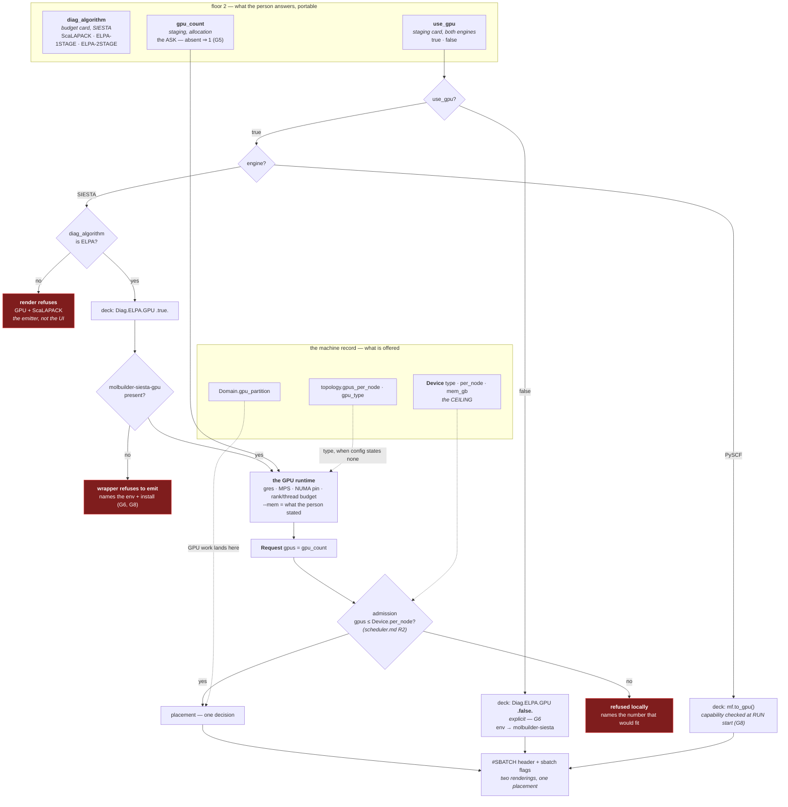

# How a GPU decision travels — one question, ten names

**Role:** contract
**Domain:** execution

**Companions:**
[`engines/siesta.md`](?doc=engines/siesta.md) § 7 — the two orthogonal
decisions and what each emits, which stays there;
[`engines/overview.md`](?doc=engines/overview.md) — the SIESTA/PySCF
comparison table;
[`execution/scheduler.md`](?doc=execution/scheduler.md) — what a queue
offers and whether a request fits;
[`engines/template.md`](?doc=engines/template.md) § 6.1 — `read_by`, the
declaration that a value leaves the deck;
[`web/task-setup.md`](?doc=web/task-setup.md) § 6.2 — the ruling that
makes this a person's choice.

A GPU decision starts as **one tick-box** and ends as an environment, a
scheduler flag, an MPI launch, a memory cap and a NUMA pin. Between those
two points it is read under ten different names, and no document drew the
path. This one does.

> **Why it exists.** Five defects in the GPU path in one month, and every
> one of them was a GPU fact with more than one home: an eigensolver enum
> spelled two ways; GPU groups routed into a 15-minute queue because two
> emitters decided separately; a GPU node's 48-core cap declared and never
> read; the record's device inventory written two ways and read two ways;
> and a field that redirects GPU work riding in the record's *uninterpreted*
> bag. They were fixed one at a time, as five bugs. They are one bug.
>
> **And the tree disagrees with itself in four places today** — § 6. Two of
> them put the person's choice on the machine's side of the line, which is
> the single distinction everything else here depends on.

---

## 0. What this document owns

**Owns:** which GPU question each name answers, who answers it, where the
answer is read, and the one walk from the tick-box to the running job. The
**unification** of `use_gpu` and `use_gpu` into one item, and the
transition that lands it.

**Does not own:** what a GPU *does* for a calculation
([`engines/tuning.md`](?doc=engines/tuning.md) § 2.12), how the
`molbuilder-siesta-gpu` environment is *built* (`ops/`), or whether a
request fits a queue ([`scheduler.md`](?doc=execution/scheduler.md) § 3).

---

## 1. The vocabulary — every GPU fact, and who answers it

**Three answerers, and the whole document turns on telling them apart.**

| name | answered by | lives in | decides |
|---|---|---|---|
| **`use_gpu`** | **the person** | catalogue · `staging` · `read_by=[wrapper]` | run the solve on a GPU or not |
| `diag_algorithm` | **the person** | catalogue · `budget` · SIESTA only | the eigensolver — **and nothing else** |
| `gpu_count` | **the machine** | catalogue · `allocation` · `staging` | how many devices this trial **asks** for |
| `gres` | **derived at prep** | `Resources` | the `--gres=gpu:<type>:<n>` string |
| `Diag.ELPA.GPU` | *(rendered)* | the SIESTA deck | the keyword `use_gpu` becomes |
| `gpu4pyscf` / `to_gpu()` | *(rendered)* | the PySCF deck | the same, for PySCF |
| `Device(type, per_node, mem_gb)` | **the probe, or the operator** | `environment.json` · `Domain.gpu` | what one node of a queue **offers** — the ceiling |
| `Domain.gpu_partition` | **the probe, or the operator** | `environment.json` | where GPU work lands when that differs |
| `topology.gpus_per_node` · `gpu_type` | **the probe** | `environment.json` | what *this* machine has |
| `scheduler.gpu.{partition,default_type,exclusive,mem}` | **the person's config** | `molbuilder.json` | site policy for GPU jobs |

> **The ask and the ceiling are different variables, and the names hide it.**
> `gpu_count` is what a trial asks for. The ceiling is `Device.per_node`, which
> `admit._devices_offered` reads as *"the most devices one node of this
> domain offers"*, and
> `topology.gpus_per_node` for the local machine. The bench reads them
> together: leave `gpu_count` out and prep proposes the divisors of each rank
> count **bounded by the recorded device count**. Ask ≤ ceiling; two
> variables, one bounding the other. A reader who assumes `gpu_count` is the
> ceiling will size a run to the hardware and call it a request.

---

## 2. The rules

**G1 — One question, one item.** *"Does this run want a GPU?"* is one
question with one answer, named `use_gpu`, for every engine. Each engine's
writer renders its own keyword; the item never learns either spelling.
*(Ruled 2026-08-13, restated 2026-08-14, marked do-not-re-open;
`template.md` § 6.3. § 5 is the transition.)*

**G2 — The person answers it, and nothing derives it from the machine.**
`use_gpu` is an ordinary explicit option with a real default (`false`).
It is **not** in the `allocation` set — that set is exactly `mpi_np`,
`gpu_count`, `omp_threads`, `max_memory_mb`, `threads`, and membership is a
flag on the catalogue item read through one door. *A document that calls
`use_gpu` a machine fact is wrong, not shorthand.*

**G3 — The solver is not the accelerator.** `diag_algorithm` chooses the
eigensolver and decides **no environment and no resource** — the packaged
SIESTA carries ELPA through ELSI and runs both stages on CPU, measured.
Only `Diag.ELPA.GPU true` re-routes anything. The two are easy to confuse
and sit on different cards on purpose.

**G4 — The ask is bounded by the ceiling, and they are different names.**
A request states `gpu_count`; a record states `Device.per_node`. Admission
compares them ([`scheduler.md`](?doc=execution/scheduler.md) R2). Neither
may be read as the other.

**G5 — One default for an absent ask.** When `gpu_count` is not stated the
default is **1 device**, in one place. *"One rank per GPU"* is a retired
model (2026-08-13) and may not survive as a second default anywhere,
including in a test.

**G6 — No silent fallback, in either direction.** A GPU deck that cannot
run on a GPU **refuses**: SIESTA at prep (the wrapper gates env presence and
names the install), PySCF at run start (the script exits with the reason).
A CPU-ELPA deck writes `Diag.ELPA.GPU .false.` **explicitly** — source ELPA
defaults to the GPU codepath, so an omitted flag crashes a CPU run.

**G7 — The value travels; the deck is not re-read for it.** `use_gpu`
declares `read_by = ["wrapper"]` precisely so the wrapper can be *handed* the
value. **Landed 2026-08-23:** the answer rides `Resources.use_gpu` — the
allocation that already travels there whole (A8) — and one door,
`runwrap._wants_gpu`, prefers it. The deck scan remains only for a caller that
states nothing, which is not re-deriving: that path has no allocation to ask.
*The scan matched a SIESTA keyword, so a PySCF GPU run could not route at all;
that is what this bought beyond tidiness.*

**G8 — Capability is checked where it can be seen.** SIESTA's GPU capability
is an **environment** — visible on the prepping machine, so checked at prep.
PySCF's is a **device** — not visible from a login node, so checked at run
start. This asymmetry is a fact about the two stacks, not an inconsistency.

---

## 3. The decision graph

### 3.1 The bench walks the same graph, once per family

`use_gpu` with **two points** is not a knob being optimised — it is the
**grid-family axis**. The machine grid is enumerated once per flag: the CPU
family holds the device count at `G = 0`, the GPU family ranges `G` over each
rank count's divisors, and the flag rides each point as an ordinary
coordinate, so a trial's deck and its family agree by construction.
Submission then groups trials by their exact resource ask, so **a CPU trial
never holds a device**.

With **one point** it is a chosen value, applied at prep as a pin over the
template — for the bench's trials and the run alike.

*(This is § 4.3a of [`generator.md`](?doc=execution/generator.md); it is
drawn here only because the graph is the same walk.)*

---

## 4. The unification — one item, and what it costs

`use_gpu` (SIESTA) and `use_gpu` (PySCF) are **one question with two
spellings**, until 2026-08-23. The merge was ruled 2026-08-13 and the rename
had not landed; it could not land on its own, because TOML cannot hold
`[item.use_gpu]` twice — the rename *was* the merge, one unit.

It is one item now: `kind = "deck"`, no anchor, `expands` naming both reaches,
and the check gate demanding only the keyword the emitted line actually names.
`net_charge` is the worked example, merged the same way on 2026-08-19.

**The surviving name is `use_gpu`**, per the ruling.

| | sites |
|---|---|
| `use_gpu` | 42 code · 90 test · 51 live-doc |
| `use_gpu` (already correct) | 37 code · 5 test |

A merged item carries the **answer**; each engine's writer renders its own
keyword. SIESTA emits `Diag.ELPA.GPU` behind its ELPA gate; PySCF emits the
backend selection. The template learns neither. No shared vocabulary is
invented and nothing is derived — this is what `kind = "deck"` has always
meant.

---

## 5. The corrections

Four places where the tree disagrees with itself. Each is stated as *what it
says now* → *what is true*, because a correction that only asserts the truth
leaves the reader unable to recognise the wrong version.

| # | where | says | true |
|---|---|---|---|
| **C1** | `engines/tuning.md` § 2.11 | *"`use_gpu` and `mpi_np` … are **machine facts** and bench axes"* | `use_gpu` is the person's (G2). The `allocation` set is `mpi_np`, `gpu_count`, `omp_threads`, `max_memory_mb`, `threads` |
| **C2** | `config/siesta.py` card comment | `use_gpu` on the **Budget card** | `group = "staging"` — the field's own metadata, 1 230 lines below, and the catalogue |
| **C3** | `runwrap.render_sbatch` | absent `gpu_count` ⇒ `ntasks` (*"one GPU per rank"*) | 1 device (G5). `_render_sbatch_for` already defaults to 1, so the two disagree one function apart |
| **C4** | `tests/test_sbatch_emit.py` | pins the `ntasks` default as *"1 rank/GPU default"* | that model was retired 2026-08-13; the test is the only thing keeping it alive |
| **C5** | `runwrap._render_sbatch_for`, the no-config branch | a machine with **probed** domains and a **probed** `topology.gpu_type` cannot emit a GPU header at all — *"no gpu type resolved"* | the type is on disk and one path cannot see it |

> **C5 was found by writing C4's replacement test**, which is the argument for
> the test rather than a note about it. When a machine states no `scheduler`
> block, `_render_sbatch_for` hand-builds
> `{"kind": "slurm", "directives": {partition, qos}}` from the probed menu — and
> that dict carries **no `gpu` key**, so the fill-in that copies
> `topology.gpu_type` into `scheduler.gpu.default_type` never runs. The
> measurement is in the record, the header path is a different path, and the
> job refuses. **Same class as C1–C4** — a GPU fact reachable by one route and
> not the other — which is why it is listed here rather than filed as its own
> bug.

**C1 and C2 are the same error and the important one.** Both put the
person's choice on the machine's side of the only line that matters. C1 is
the exact reading that `engines/stages.md` carries a dated 2026-08-07
clarification to prevent — *"the wording invited the other reading"* — which
means this correction has been made once already, in one document, and the
restatement elsewhere was never swept.

---

## 6. The transition

Smallest risk first; each phase separately testable and revertable.

| # | phase | what lands |
|---|---|---|
| **1** | **the contradictions** | C1–C4. No rename, no behaviour change except C3's default. Pins: the `allocation` set read from the catalogue rather than typed; one `gpu_count` default with one test |
| **2** | **the graph is the only picture** | this document joins the doc set; the restatements in `siesta.md` § 7, `overview.md`, `stages.md` § 6 and `task-setup.md` § 6.2 keep their *engine-specific* halves and point here for the walk |
| **3** | **the rename** — `use_gpu` → `use_gpu` | 183 sites, mechanical, **no compatibility shim** (rename = delete old everywhere). The catalogue item merges: one `[item.use_gpu]` with no `engines` list, two writers |
| **4** | **G7 — the wrapper is handed the value** | the four `_fdf_requests_gpu` call sites stop grepping a rendered deck for a value the item already declares it needs |

Phase 3 is the one that must not be split: while two names exist, every
caller asking the question must name an engine, and a half-done rename adds
a third state.

---

## 7. The tests

**Retired** — each asserts a model the design has replaced:

| test | why it goes |
|---|---|
| `test_sbatch_emit.py` — the `ntasks`-default case | pins the retired *one rank per GPU* model (C4). Its replacement asserts the **single** default of G5 |
| any test naming `use_gpu` as the question rather than the SIESTA spelling | after phase 3 there is one name; a test that asserts the pair is asserting the gap |

**Added** — each pins a rule that could not previously be checked:

| test | the rule |
|---|---|
| `test_gpu_answerers.py` — the `allocation` set is read from the catalogue and `use_gpu` is not in it | **G2.** The one door, so a document cannot disagree with the data |
| the solver decides no environment and no resource | **G3.** Mutate `diag_algorithm` and assert env, gres and partition are unchanged |
| one default for an absent `gpu_count`, asserted through **both** sbatch entries | **G5.** The assertion neither function could make alone |
| a CPU deck writes `.false.` explicitly | **G6.** Absence crashes a CPU run; this is the test that would have caught it |
| every name in § 1's table resolves to exactly one answerer | **the document's own integrity** — a tenth GPU name arrives with its row or it does not arrive |

The last one is this document's `max_mem_gb` guard: the defect that produced
every entry in § 5 was a fact with two homes, and the only durable protection
is a test that fails when a new one appears.
