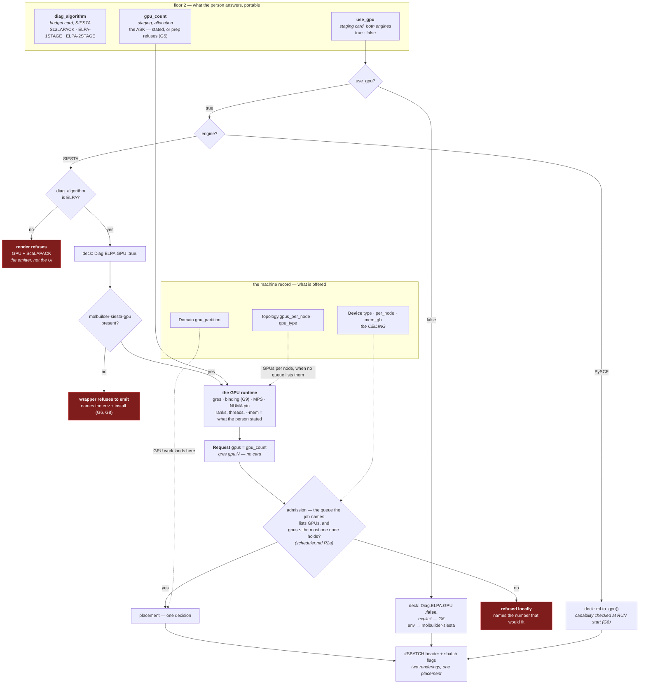

# How a GPU decision travels — one question, ten names

**Role:** contract
**Domain:** execution

**Companions:**
[`engines/siesta.md`](?doc=engines/siesta.md) § 7 — the two orthogonal
decisions and what each emits, which stays there;
[`engines/overview.md`](?doc=engines/overview.md) — the SIESTA/PySCF
comparison table;
[`execution/scheduler.md`](?doc=execution/scheduler.md) — what a queue
offers and whether a request fits;
[`engines/template.md`](?doc=engines/template.md) § 6.1 — `read_by`, the
declaration that a value leaves the deck;
[`web/task-setup.md`](?doc=web/task-setup.md) § 6.2 — the ruling that
makes this a person's choice.

A GPU decision starts as **one tick-box** and ends as an environment, a
scheduler flag, an MPI launch, a memory cap and a NUMA pin. Between those
two points it is read under ten different names, and no document drew the
path. This one does.

> **Why it exists.** Five defects in the GPU path in one month, and every
> one of them was a GPU fact with more than one home: an eigensolver enum
> spelled two ways; GPU groups routed into a 15-minute queue because two
> emitters decided separately; a GPU node's 48-core cap declared and never
> read; the record's device inventory written two ways and read two ways;
> and a field that redirects GPU work riding in the record's *uninterpreted*
> bag. They were fixed one at a time, as five bugs. They are one bug.
>
> **And the tree disagrees with itself in four places today** — § 6. Two of
> them put the person's choice on the machine's side of the line, which is
> the single distinction everything else here depends on.

---

## 0. What this document owns

**Owns:** **which GPU questions are molbuilder's and which are the
machine's** (§ 1); which GPU question each name answers, who answers it,
where the answer is read, and the one walk from the tick-box to the running
job. The **unification** of `use_gpu` and `use_gpu` into one item, and the
transition that lands it.

**Does not own:** what a GPU *does* for a calculation
([`engines/tuning.md`](?doc=engines/tuning.md) § 2.12), how the
`molbuilder-siesta-gpu` environment is *built* (`ops/`), or whether a
request fits a queue ([`scheduler.md`](?doc=execution/scheduler.md) § 3).

---

## 1. Whose business each GPU question is

*(User, 2026-10-01, asking for this section: which part of the GPU
configuration is molbuilder's business — and "need to be explicit and
accurate/accommodating" — "and which part is none of your business".)*

### 1.1 molbuilder's — stated explicitly, done exactly

| question | answered by, where | what molbuilder does with it |
|---|---|---|
| **Does this run use a GPU?** | the person — `use_gpu` on the run card (`execution`), over the template's value; an axis of a bench | renders each engine's keyword (`Diag.ELPA.GPU`, gpu4pyscf), takes SIESTA to its GPU build, asks the scheduler for GPUs. Not said, no GPU is asked for |
| **How many GPUs?** | the person — `gpu_count` on the run card, both engines, or `--gpus N` on the prep | asks `--gres=gpu:N`. **No default:** a run that uses a GPU and states no count is refused at prep, naming where to write it (G5). A bench that names no `gpu_count` measures each count that divides its rank counts, up to the most one node holds (§ 3.1) |
| **Which queue may take it?** | the target's record, written by `jobset probe` | only a queue whose record lists GPUs, where one node holds at least N — the queue the job names (`allocation.domain`, the run card, `--domain`). That is the whole of the GPU check ([`scheduler.md`](?doc=execution/scheduler.md) R2a). A GPU job's cores are checked against the widest node that HAS GPUs (R3) |
| **Where is GPU work submitted?** | the target's record — a queue's `gpu_partition` column, where the record carries one (the probe does not write it) | `-p` names it when the record does, else the queue's own partition |
| **Are the job's cores bound to its GPUs?** | molbuilder: yes — and the person may turn it off, `"gpu_binding": false` in `task.json`'s `allocation` | sends `--gres-flags=enforce-binding` with every GPU ask, unless turned off (G9) |
| **How do the ranks share the GPUs?** | molbuilder's launch script, at run time | spreads the ranks over the GPUs the scheduler GAVE the job (counted from `CUDA_VISIBLE_DEVICES`), starts MPS when ranks outnumber GPUs, pins each rank to its GPU's NUMA node ([`running-a-job.md`](?doc=execution/running-a-job.md) § 3.3). The rank and thread counts are the stated ones — a GPU job that states none is refused at prep, like any job ([`architecture.md`](?doc=execution/architecture.md) § 5.2) |
| **Can the deck run on a GPU there?** | the target's record — which environments exist | SIESTA: refused at prep when the target has no GPU build of SIESTA; PySCF: checked at run start, because a login node cannot see a device (G6, G8) |

**Every fact comes from the target's own record.** A target is known only
through its `environment.json`, written by `jobset probe` on that machine —
this machine's at `~/.config/molbuilder/environment.json`, another's at
`environments/<name>.json`. A prep reads that record and nothing else about
the machine: `molbuilder.json` supplies no GPU fact and no GPU ask for any
target, this machine included ([`configuration.md`](?doc=configuration.md)
§ 5, M-1, M-3).

**What a record says is taken as it says it.** The GPUs of a queue are read
in both of the record's spellings — the probe's `{"a100": 4}` and a
hand-written `{"type": "a100", "per_node": 4}` (`scheduler.md` § 4,
*Device*); any card name, MIG slices included, counts as GPUs; a record
whose probe ran on a login node that sees none gives the count from its
queues; and a queue whose record marks GPUs — a `gpu` column or a
`gpu_partition` — without saying how many is never refused on the number
(R3: silence never bars).

### 1.2 The machine's — never asked, compared, chosen or configured

- **Which card** — the model, its memory, a MIG slice. A GPU ask is a
  count. The record keeps the card the probe saw (`jobset machines` shows
  it) and nothing decides by it; the card a job LANDED on is recorded in its
  run log, to compare runs by the hardware they ran on (`scheduler.md` R11,
  R12) — measured, never asked for.
- **Whether the GPU is there and works when the job lands** — drivers,
  CUDA, the card's memory, whether the calculation fits on it. The target's
  scheduler and the job itself answer that: admission owns only what the
  scheduler would refuse (`scheduler.md` § 0).
- **Which node the scheduler picks, and whether it can enforce the
  binding.** `enforce-binding` asks; a scheduler that does not know which
  cores sit near which GPU cannot honour it.
- **Anything about this machine, when this machine is not the target.**

**Gone, 2026-10-01: `molbuilder.json`'s `scheduler.gpu` block**, refused by
name — with the rest of the `scheduler` block since 2026-10-02
([`configuration.md`](?doc=configuration.md) § 4). Its `default_type` named a card, and its `partition`, `exclusive` and
`mem` wrote this machine's settings into every GPU job — `partition`
overriding the target's own `gpu_partition`. A GPU job's memory is asked
exactly as a CPU job's (`running-a-job.md` § 5.3.1), and nothing asks for a
whole node.

### 1.3 The vocabulary — every GPU name, and who answers it

| name | answered by | lives in | decides |
|---|---|---|---|
| **`use_gpu`** | **the person** | catalogue · `staging` · `read_by=[wrapper]` | run the solve on a GPU or not |
| `diag_algorithm` | **the person** | catalogue · `budget` · SIESTA only | the eigensolver — **and nothing else** |
| `gpu_count` | **the person** | catalogue · `allocation` · `staging` · both engines | how many GPUs a run or a trial **asks** for — no default (G5) |
| `gres` | **derived at prep** | `Resources` | the `--gres=gpu:<n>` string — a count; molbuilder names no card (`scheduler.md` R2a) |
| `gpu_binding` | **the person**, to turn it off | `task.json` · `allocation` → `Resources` | whether the ask carries `--gres-flags=enforce-binding` (G9) |
| `Diag.ELPA.GPU` | *(rendered)* | the SIESTA deck | the keyword `use_gpu` becomes |
| `gpu4pyscf` / `to_gpu()` | *(rendered)* | the PySCF deck | the same, for PySCF |
| `Device(type, per_node, mem_gb)` | **the probe, or the operator** | `environment.json` · `Domain.gpu` | what one node of a queue **offers** — the ceiling; its `type` is shown, never compared |
| `Domain.gpu_partition` | **the record** — the probe does not write it; honoured where a record carries it | `environment.json` | where GPU work lands when that differs |
| `topology.gpus_per_node` · `gpu_type` | **the probe** | `environment.json` | what the probed node has — the count bounds a bench's GPU counts; the card is shown, never compared |

> **The ask and the ceiling are different variables, and the names hide it.**
> `gpu_count` is what a trial asks for. The ceiling is `Device.per_node`, which
> `admit._devices_offered` reads as *"the most devices one node of this
> domain offers"*, and
> `topology.gpus_per_node` for the probed node. The bench reads them
> together: leave `gpu_count` out and prep proposes the divisors of each rank
> count **bounded by the recorded device count**. Ask ≤ ceiling; two
> variables, one bounding the other. A reader who assumes `gpu_count` is the
> ceiling will size a run to the hardware and call it a request.

---

## 2. The rules

**G1 — One question, one item.** *"Does this run want a GPU?"* is one
question with one answer, named `use_gpu`, for every engine. Each engine's
writer renders its own keyword; the item never learns either spelling.
*(Ruled 2026-08-13, restated 2026-08-14, marked do-not-re-open;
`template.md` § 6.3. § 5 is the transition.)*

**G2 — The person answers it, and nothing derives it from the machine.**
`use_gpu` is an ordinary explicit option with a real default (`false`).
It is **not** in the `allocation` set — that set is exactly `mpi_np`,
`gpu_count`, `omp_threads`, `max_memory_mb`, `threads`, and membership is a
flag on the catalogue item read through one door. *A document that calls
`use_gpu` a machine fact is wrong, not shorthand.*

**G3 — The solver is not the accelerator.** `diag_algorithm` chooses the
eigensolver and decides **no environment and no resource** — the packaged
SIESTA carries ELPA through ELSI and runs both stages on CPU, measured.
Only `Diag.ELPA.GPU true` re-routes anything. The two are easy to confuse
and sit on different cards on purpose.

**G4 — The ask is bounded by the ceiling, and they are different names.**
A request states `gpu_count`; a record states `Device.per_node`. Admission
takes a GPU job only to a queue whose record lists GPUs and compares the
count with the most one node holds — on the queue the job names
([`scheduler.md`](?doc=execution/scheduler.md) R2a). Neither may be read as
the other.

**G5 — No default for the count.** A run that uses a GPU states how many —
`gpu_count` on its run card, or `--gpus N` on its prep — or `prep` refuses
and says where to write it; a header asked to render a GPU job with no count
refuses too. *(User, 2026-10-01: "there is no default. all resources are
explicit". It was one device, in one place, until then — and before
2026-08-23 a second default, one GPU per rank, a model retired 2026-08-13.)*
A bench is not a run: a bench that names no `gpu_count` measures the counts
§ 3.1 describes.

**G6 — No silent fallback, in either direction.** A GPU deck that cannot
run on a GPU **refuses**: SIESTA at prep (the wrapper gates env presence and
names the install), PySCF at run start (the script exits with the reason).
A CPU-ELPA deck writes `Diag.ELPA.GPU .false.` **explicitly** — source ELPA
defaults to the GPU codepath, so an omitted flag crashes a CPU run.

**G7 — The value travels; the deck is not re-read for it.** `use_gpu`
declares `read_by = ["wrapper"]` precisely so the wrapper can be *handed* the
value. **Landed 2026-08-23:** the answer rides `Resources.use_gpu` — the
allocation that already travels there whole (A8) — and one door,
`runwrap._wants_gpu`, prefers it. The deck scan remains only for a caller that
states nothing, which is not re-deriving: that path has no allocation to ask.
*The scan matched a SIESTA keyword, so a PySCF GPU run could not route at all;
that is what this bought beyond tidiness.*

**G8 — Capability is checked where it can be seen.** SIESTA's GPU capability
is an **environment** — visible in the target's record, so checked at prep.
PySCF's is a **device** — not visible from a login node, so checked at run
start. This asymmetry is a fact about the two stacks, not an inconsistency.

**G9 — The job's cores are bound to its GPUs, unless the calculation says
not.** Every GPU ask carries `--gres-flags=enforce-binding`: the scheduler is
asked to give the job cores on the socket its GPUs are attached to, which the
launch script's per-rank NUMA pin relies on. It never makes a submission
fail; it can delay the start while such cores free up. `"gpu_binding":
false` in `task.json`'s `allocation` turns it off for the whole calculation —
its benchmark and its runs alike, so a benchmark measures the layout the run
will use ([`stages.md`](?doc=engines/stages.md) § 6.8a). *(User, 2026-10-01:
"keep 3, but make an option to turn it off - some task never needs this and
some task may benefit, i believe sol never guarantees this anyway".)*

---

## 3. The decision graph

```mermaid
flowchart TB
    subgraph ASK["floor 2 — what the person answers, portable"]
        SOLVER["<b>diag_algorithm</b><br/><i>budget card, SIESTA</i><br/>ScaLAPACK · ELPA-1STAGE · ELPA-2STAGE"]
        WANT["<b>use_gpu</b><br/><i>staging card, both engines</i><br/>true · false"]
        COUNT["<b>gpu_count</b><br/><i>staging, allocation</i><br/>the ASK — stated, or prep refuses (G5)"]
    end

    subgraph MACH["the machine record — what is offered"]
        DEV["<b>Device</b> type · per_node · mem_gb<br/><i>the CEILING</i>"]
        TOPO["topology.gpus_per_node · gpu_type"]
        PART["Domain.gpu_partition"]
    end

    WANT --> Q1{"use_gpu?"}
    Q1 -->|false| CPU["deck: Diag.ELPA.GPU <b>.false.</b><br/><i>explicit — G6</i><br/>env → molbuilder-siesta"]
    Q1 -->|true| Q2{"engine?"}

    Q2 -->|SIESTA| Q3{"diag_algorithm<br/>is ELPA?"}
    Q3 -->|no| REFUSE1["<b>render refuses</b><br/>GPU + ScaLAPACK<br/><i>the emitter, not the UI</i>"]
    Q3 -->|yes| DECK["deck: Diag.ELPA.GPU .true."]
    Q2 -->|PySCF| PYDECK["deck: mf.to_gpu()<br/><i>capability checked at RUN start (G8)</i>"]

    DECK --> ENV{"molbuilder-siesta-gpu<br/>present?"}
    ENV -->|no| REFUSE2["<b>wrapper refuses to emit</b><br/>names the env + install (G6, G8)"]
    ENV -->|yes| RT["<b>the GPU runtime</b><br/>gres · binding (G9) · MPS · NUMA pin<br/>ranks, threads, --mem = what the person stated"]

    COUNT --> RT
    TOPO -.->|"GPUs per node, when no queue lists them"| RT
    RT --> REQ["<b>Request</b> gpus = gpu_count<br/><i>gres gpu:N — no card</i>"]

    REQ --> ADMIT{"admission — the queue the job names<br/>lists GPUs, and<br/>gpus ≤ the most one node holds?<br/><i>(scheduler.md R2a)</i>"}
    DEV -.-> ADMIT
    ADMIT -->|no| REFUSE3["<b>refused locally</b><br/>names the number that would fit"]
    ADMIT -->|yes| PLACE["placement — one decision"]
    PART -.->|"GPU work lands here"| PLACE
    PLACE --> OUT["#SBATCH header + sbatch flags<br/><i>two renderings, one placement</i>"]

    CPU --> OUT
    PYDECK --> OUT

    classDef refuse fill:#7f1d1d,stroke:#ef4444,color:#fff
    class REFUSE1,REFUSE2,REFUSE3 refuse
```

### 3.1 The bench walks the same graph, once per family

`use_gpu` with **two points** is not a knob being optimised — it is the
**grid-family axis**. The machine grid is enumerated once per flag: the CPU
family holds the device count at `G = 0`, the GPU family ranges `G` over each
rank count's divisors, and the flag rides each point as an ordinary
coordinate, so a trial's deck and its family agree by construction.
Submission then groups trials by their exact resource ask, so **a CPU trial
never holds a device**.

With **one point** it is the trials' value, applied at prep as a pin over the
template for the bench's trials; the run's GPU choice is its run card's
(`execution`, [`stages.md`](?doc=engines/stages.md) § 6.8d).

*(This is § 4.3a of [`generator.md`](?doc=execution/generator.md); it is
drawn here only because the graph is the same walk.)*

---

## 4. The unification — one item, and what it costs

`use_gpu` (SIESTA) and `use_gpu` (PySCF) are **one question with two
spellings**, until 2026-08-23. The merge was ruled 2026-08-13 and the rename
had not landed; it could not land on its own, because TOML cannot hold
`[item.use_gpu]` twice — the rename *was* the merge, one unit.

It is one item now: `kind = "deck"`, no anchor, `expands` naming both reaches,
and the check gate demanding only the keyword the emitted line actually names.
`net_charge` is the worked example, merged the same way on 2026-08-19.

**The surviving name is `use_gpu`**, per the ruling.

| | sites |
|---|---|
| `use_gpu` | 42 code · 90 test · 51 live-doc |
| `use_gpu` (already correct) | 37 code · 5 test |

A merged item carries the **answer**; each engine's writer renders its own
keyword. SIESTA emits `Diag.ELPA.GPU` behind its ELPA gate; PySCF emits the
backend selection. The template learns neither. No shared vocabulary is
invented and nothing is derived — this is what `kind = "deck"` has always
meant.

---

## 5. The corrections

Four places where the tree disagrees with itself. Each is stated as *what it
says now* → *what is true*, because a correction that only asserts the truth
leaves the reader unable to recognise the wrong version.

> **G5 itself changed on 2026-10-01**: an absent count is refused, not one
> device — C3's "true" column is the rule as it stood until then.
>
> **All four are corrected** *(re-read against the tree 2026-09-29)*: C1 —
> `engines/tuning.md` quotes the old sentence only inside its correction; C2 —
> `config/siesta.py`'s card comment says it had `use_gpu` on the Budget card and
> why that was wrong; C3 — corrected then to one device, and since 2026-10-01
> a refusal (G5); the rank count it implied is stated or refused since
> 2026-10-02 (`architecture.md` § 5.2); C4 — `test_sbatch_emit.py` no longer
> pins one rank per GPU. The table below is the record of what they said.

| # | where | says | true |
|---|---|---|---|
| **C1** | `engines/tuning.md` § 2.11 | *"`use_gpu` and `mpi_np` … are **machine facts** and bench axes"* | `use_gpu` is the person's (G2). The `allocation` set is `mpi_np`, `gpu_count`, `omp_threads`, `max_memory_mb`, `threads` |
| **C2** | `config/siesta.py` card comment | `use_gpu` on the **Budget card** | `group = "staging"` — the field's own metadata, 1 230 lines below, and the catalogue |
| **C3** | `runwrap.render_sbatch` | absent `gpu_count` ⇒ `ntasks` (*"one GPU per rank"*) | 1 device (G5). `_render_sbatch_for` already defaults to 1, so the two disagree one function apart |
| **C4** | `tests/test_sbatch_emit.py` | pins the `ntasks` default as *"1 rank/GPU default"* | that model was retired 2026-08-13; the test is the only thing keeping it alive |
| **C5** | `runwrap._render_sbatch_for`, the no-config branch | a machine with **probed** domains and a **probed** `topology.gpu_type` cannot emit a GPU header at all — *"no gpu type resolved"* | gone 2026-10-01 with the card itself: a GPU header asks `gpu:N` and needs no type |

**C1 and C2 are the same error and the important one.** Both put the
person's choice on the machine's side of the only line that matters. C1 is
the exact reading that `engines/stages.md` carries a dated 2026-08-07
clarification to prevent — *"the wording invited the other reading"* — which
means this correction has been made once already, in one document, and the
restatement elsewhere was never swept.

---

## 6. The transition

Smallest risk first; each phase separately testable and revertable.

| # | phase | what lands |
|---|---|---|
| **1** | **the contradictions** | C1–C4. No rename, no behaviour change except C3's default. Pins: the `allocation` set read from the catalogue rather than typed; one `gpu_count` default with one test |
| **2** | **the graph is the only picture** | this document joins the doc set; the restatements in `siesta.md` § 7, `overview.md`, `stages.md` § 6 and `task-setup.md` § 6.2 keep their *engine-specific* halves and point here for the walk |
| **3** | **the rename** — `use_gpu` → `use_gpu` | 183 sites, mechanical, **no compatibility shim** (rename = delete old everywhere). The catalogue item merges: one `[item.use_gpu]` with no `engines` list, two writers |
| **4** | **G7 — the wrapper is handed the value** | the four `_fdf_requests_gpu` call sites stop grepping a rendered deck for a value the item already declares it needs |

Phase 3 is the one that must not be split: while two names exist, every
caller asking the question must name an engine, and a half-done rename adds
a third state.

> **Where the phases stand** *(re-read 2026-09-29)*: **1 done** (§ 5's note);
> **3 done** — one name, `use_gpu`, which is why its own row now reads as a
> rename to itself; **2** not re-derived; **4 open to question** —
> `runwrap._fdf_requests_gpu` still has call sites while the plan records G7 as
> reached on 2026-08-23 by carrying the answer on `Resources`
> (`plans/plan.md` § 5p.3p.1): which reads win is the M11 review's to say
> (plan W50).

---

## 7. The tests

**§ 1's cases are one table, run down the road** *(2026-10-01)*:
`tests/data/gpu_contract.toml`, each row what a person or a probe writes and
what molbuilder must answer, and `tests/test_gpu_contract.py` driving every
row through `init → prep → launch --dry-run` — and, on a machine with no
queue, the run script's own dry run, given the GPUs a stand-in `nvidia-smi`
reports. Three layers: allowed or refused, with the words; what is produced
(the header, the `sbatch` line, the deck, the run script, a benchmark's
trials); what the run script does with the GPUs it is given. A rule here
changes; its rows change. It replaced 54 hand-written tests in 13 files,
most of them checks of an internal step a row now reaches through the road
([`testing.md`](?doc=process/testing.md) § 6). The page's half — that the
queue card's box writes `allocation.gpu_binding` — is one browser test,
`test_task_setup_prep_e2e.py::test_the_gpu_binding_box_writes_the_switch`.

**Retired** — each asserts a model the design has replaced:

| test | why it goes |
|---|---|
| `test_sbatch_emit.py` — the `ntasks`-default case | pins the retired *one rank per GPU* model (C4). G5 has no default since 2026-10-01, and a rank count none since 2026-10-02: the table's rows refuse both |
| any test naming `use_gpu` as the question rather than the SIESTA spelling | after phase 3 there is one name; a test that asserts the pair is asserting the gap |

**Added** — each pins a rule that could not previously be checked:

| test | the rule |
|---|---|
| `test_gpu_answerers.py` — the `allocation` set is read from the catalogue and `use_gpu` is not in it | **G2.** The one door, so a document cannot disagree with the data |
| the solver decides no environment and no resource | **G3.** Mutate `diag_algorithm` and assert env, gres and partition are unchanged |
| a GPU run with no count is refused at prep, naming where to write it — rows of the table | **G5** |
| a calculation that turns the binding off asks without it, in the header, on the launch line and in a benchmark's trials — rows of the table | **G9** |
| a CPU deck writes `.false.` explicitly | **G6.** Absence crashes a CPU run; this is the test that would have caught it |
| every name in § 1's table resolves to exactly one answerer | **the document's own integrity** — a tenth GPU name arrives with its row or it does not arrive |

The last one is this document's `max_mem_gb` guard: the defect that produced
every entry in § 5 was a fact with two homes, and the only durable protection
is a test that fails when a new one appears.
