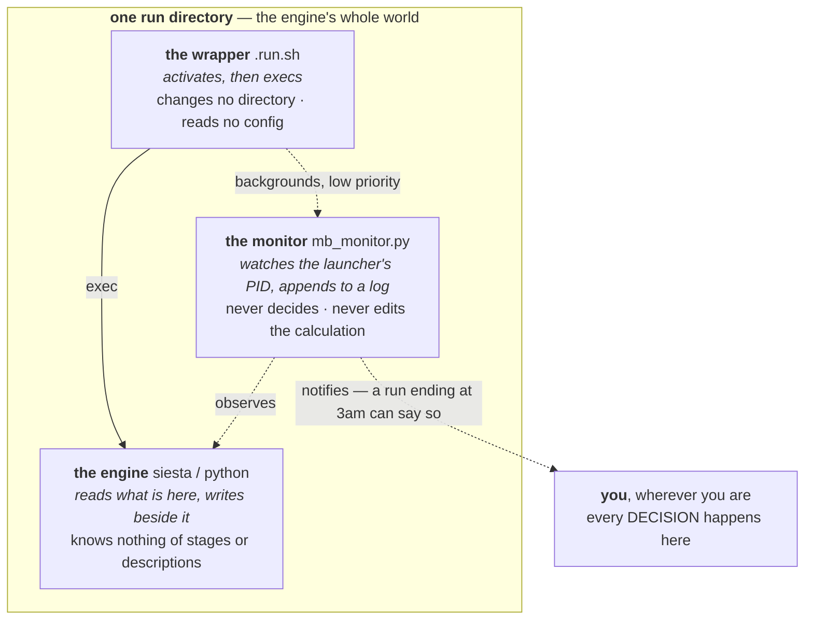
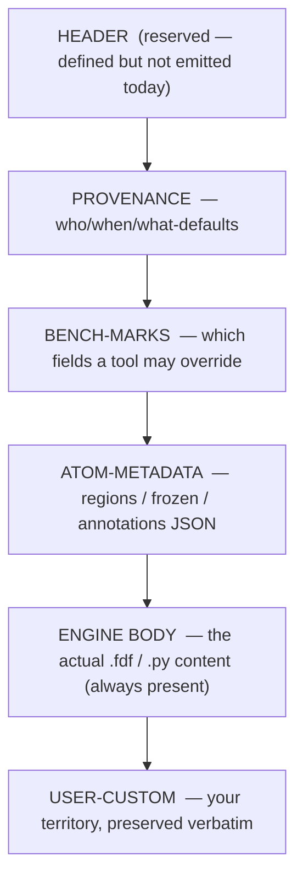

# Job contracts — the on-disk formats and shared vocabulary

**Role:** contract
**Domain:** execution

**Companions:**
[`execution/running-a-job.md`](?doc=execution/running-a-job.md) — how you
actually run and watch **one** job today (the run wrapper, `molbuilder.json`,
checkpoints, the decoded-run view);
[`execution/job-system.md`](?doc=execution/job-system.md) — the JobSet batch /
staged / HPC framework;
[`execution/overview.md`](?doc=execution/overview.md) — the map plus the
current → target status picture.

**Settled contracts this doc leans on:**
[`model/structure-molstruct.md`](?doc=model/structure-molstruct.md) (the
`.molstruct.json` sidecar it round-trips with),
[`model/structure-annotations.md`](?doc=model/structure-annotations.md)
(`regions` / `frozen_atoms` / annotation channels),
[`model/overview.md`](?doc=model/overview.md) (the 0-based-internal /
1-based-user atom-index rule), and
[`engines/overview.md`](?doc=engines/overview.md) (the UI → config → script
boundary contract and the script-wrapper contract that this doc's script
blocks physically implement).

This document is the sole source of truth for the **stable on-disk shapes**
that every other part of molbuilder rests on: where a run's files live and
what they are called, the reserved comment blocks inside a generated script,
how a script resumes (or refuses to resume) from a previous run, the object
that carries a finished run forward into the next calculation, and the
system-wide vocabulary for persisted files and parameters.

These formats are deliberately **surface-agnostic and workflow-agnostic**.
The same run directory, the same `.fdf` blocks, and the same handoff object
are produced whether you clicked *Generate* in the web UI, typed
`molbuilder fdf`, or let the JobSet framework fan a batch across a cluster.
That is the point of pinning them here once: the surfaces above (single-job,
JobSet, CLI, web) all read and write to this contract instead of inventing
their own.

---

## 1. What this document owns — a reader's map

| If you need to know… | Read § |
|---|---|
| Where a job's files go and what they are named | **§ 2 — The run directory** |
| The `project / topic / structure` folder tree and its fixed topic names | **§ 2.5** |
| The comment blocks molbuilder reserves inside a `.fdf` / `.py` / `.run.sh` | **§ 3 — The generated-script contract** |
| What "warm restart", `--continue`, and `--cold` actually do | **§ 4 — Warm & cold restart** |
| How a finished run flows into Transport / a continuation / a spectrum | **[`handoff-bundle.md`](?doc=execution/handoff-bundle.md)** — its own contract |
| What a persisted file is called system-wide, and how a config value becomes a SLURM flag | **§ 6 — The shared data vocabulary** |

Two conventions bind everything below and are stated once here:

- **Atom indices are 0-based internally, 1-based only at the human edge.**
  Every JSON payload in this doc (`regions`, `frozen_atoms`, ATOM-METADATA,
  the sidecar) uses **0-based** indices. Engine input *coordinate blocks* use
  the engine's own convention (SIESTA `.fdf` is 1-based). The full rule and
  its single conversion boundary live in
  [`model/overview.md`](?doc=model/overview.md).
- **Schema versions are checked, never guessed.** Persisted artifacts carry a
  version; a reader that meets a newer major refuses with a clear message
  rather than mis-parsing. The one shared helper is `molbuilder/persist.py`
  (§ 6.2).

---

## 2. The run directory

### 2.1 What the engine assumes, and the two rules that serve it

Both rules below are consequences of one premise, so it is worth stating first.
Everything molbuilder does around a run exists to make it true.

> **The engine runs inside one directory, and that directory is its whole world.**
> It needs the right environment and every file it will read to be reachable from
> there. It has **no knowledge of how the directory came to be** — no notion of a
> stage, a description, a benchmark, a checkpoint or a previous run — and it does
> not care. It reads what is there and writes its output beside it.

Three things follow immediately, and each is a rule elsewhere in these documents:

| Because the engine… | …molbuilder must |
|---|---|
| has no notion of a **stage** | resolve every stage parameter **before** the deck is written. A deck that needed a reader to understand the word "stage" would not run (`engines/stages.md § 1`) |
| cannot fetch anything | put **everything the run will read in place before it starts** — which is why a carried restart file is copied at prep rather than resolved later (`project-layout.md § 1.6`), and why a stage may **declare** what it needs (below) |
| assumes the environment is already correct | give the wrapper exactly two jobs — **activate, then exec** — and do every decision and arrangement in Python beforehand (`running-a-job.md § 2.2a`) |

**"Reachable from there" is the precise word, not "physically present."** A
symlink to `../Au.psml` opens as a real file from inside the directory, and the
engine cannot tell the difference — so sharing one copy of a large
pseudopotential across stages is invisible to it, and legitimate.

#### A stage may declare what it needs: `required`

*Added 2026-08-08 (user).* Continuing a relaxation implies a known set —
`.XV`, `.DM`, `.CG` — because that is what *continuing* means. Some runs need
something else: a TranSIESTA scattering calculation cannot start without the
`.TSHS` an electrode run produced, and nothing about `restart: continue` says so.

**`required` is an ordinary config field**, so a stage sets it through
`overrides` like `mesh_cutoff`, and `stages.md § 2`'s *"a stage is a name, an
enabled flag, and the cells that differ — and no others"* stays exactly as it
was. No new stage mechanism, no fourth key in the description.

```jsonc
{ "name": "scattering",
  "overrides": { "restart": "continue", "required": [".TSHS", ".TSDE"] } }
```

Extensions, not filenames: molbuilder prepends the run id, so a stage cannot
name another calculation's file by accident — which is the mixing this document
spends § 2.1 Rule 1 preventing.

**It is a claim, not an instruction**, and that is the whole reason it is worth
having. *"Carry this for me"* can only be obeyed; *"this stage cannot run
without this"* can be **checked** — see § 4.4, which is the only place with a
definite answer.

> **What it does NOT change.** In the flat shape nothing is carried at all: every
> stage shares one directory, so a declared file is either there or it is not.
> In the hierarchical shape `prep` links it in beside the standard set. Same
> declaration, two different pieces of work behind it, and the *check* is
> identical in both — which is what makes it a property of the stage rather than
> of a layout.

> ⚠ **Which is why the transportable unit is the calculation folder, not the run
> directory.** Completeness here is a property of *what resolves*, not of what
> sits in the directory. Archive a lone `run-0/` and its links to the deck and
> the shared package dangle — it was never self-contained, only self-contained
> *in place*. Move the whole calculation folder and every link stays inside it.

**Who puts the engine in that directory: the launcher, and only the launcher.**
Both deployment paths do the same one thing, and neither the wrapper nor the
engine ever navigates:

| Path | How the directory is established |
|---|---|
| **workstation** | the launcher runs the job's `.run.sh` **with its working directory set to the job's directory** |
| **SLURM** | the launcher runs `sbatch` **from** that directory, and SLURM lands the job in `SLURM_SUBMIT_DIR` — the same place |

So one rule covers both: **the caller's working directory is the contract.** The
wrapper inherits it and changes it for nothing; outputs land where the wrapper
was invoked. A wrapper that navigated would break the property the engine depends
on — that *here* is where everything is — and it would break it differently under
the two launchers, which is worse than breaking it consistently.

This is not a rule the design is asking for. It is how the shipped submit path
already works, in one line per mode, and the generated wrapper says so in its own
header: *"this wrapper does NOT change cwd… the caller's cwd is the contract."*
It is written down here because it was true everywhere and stated nowhere — and
because the one place it was broken (a rendered block that `cd`s into an attempt
it created) was retired for exactly this reason
([`web/staged-runs-architecture.md`](?doc=web/staged-runs-architecture.md)
item 12a). ✅ **Since 2026-08-10 the rule has no exception**: no generated
wrapper contains a `cd` on either engine, which is `project-layout.md`
invariant 6a.

#### The third party in the directory: the monitor observes, and only observes

A wrapper activates and execs. An engine reads and writes. There is one more
thing in that directory, and it has the narrowest job of all.

**`mb_monitor.py` runs beside the engine and watches it.** It is backgrounded by
the wrapper at low priority, follows the launcher's **PID** — so it knows
authoritatively when the run ended, rather than guessing from output markers —
parses the run's artifacts as they grow, and appends what it learns to a log
beside them. It carries a **notifier hook** (`register_notifier`, or a webhook
via `MB_NOTIFY_URL`), which is the deliberate customization point: what should
happen when something notable occurs is the user's to decide, not molbuilder's.

**That hook is why nobody has to be at the cluster.** A run that ends at 3am can
say so.

> **And the boundary that makes it safe: the monitor observes and notifies. It
> never decides, and never mutates the calculation.**
>
> This is the same rule the wrapper has — activate and exec, nothing more — one
> layer further out, and the reason is the same. A compute node is where work
> happens, not where decisions are made. So the monitor does not take
> checkpoints, does not prepare the next stage, does not retry, and does not edit
> the description, even where it is the only thing present and would technically
> be able to. Something that both watches and acts would be deciding on your
> behalf, on a machine you are not at, about a calculation whose worth only you
> can judge.
>
> Three parties, three verbs: **the wrapper activates and execs, the engine reads
> and writes, the monitor watches and tells.** Everything that *decides* runs
> where the user is (`checkpointing.md § 9`).



**Three parties, three verbs: the wrapper activates and execs, the engine reads
and writes, the monitor watches and tells.** Nothing in that directory decides
anything — a compute node is where work happens, not where judgement happens.

**Rule 1 — one job per directory.** Every job lives in its own directory. A
directory may hold *several inputs* (one per stage of a staged relaxation,
§ 2.3) plus the engine's outputs and restart files, but never inputs for a
**different** job (a different molecule, a different `SystemLabel`). This is
not just tidiness — SIESTA's restart files (`<basename>.XV`, `.DM`, `.CG`)
are unprefixed within the directory, so a second job's `SystemLabel` would
overwrite them. PySCF inherits the same one-job rule through its inlined
trajectory writer and checkpoint file.

**Rule 2 — every file shares one basename.** Each file the generator writes
and a reader later opens carries the same **basename**:

- **SIESTA** — the basename **is** the `.fdf`'s `SystemLabel`.
- **PySCF** — the basename **is** the script's `JOB = "…"` literal.

The basename must be a single token matching `[A-Za-z0-9_-]+` — no spaces,
dots, or slashes. Generators reject anything else at the form / CLI boundary
(`molbuilder/projects.py`, `_NAME_PATTERN`). Across the stages of one staged
relaxation the basename **stays identical** (only parameters change); that is
exactly what lets SIESTA pick up `<basename>.XV` / `.DM` from the previous
stage. (The run *wrapper* accepts a slightly wider set, `[A-Za-z0-9._-]+`, at
`molbuilder/runwrap.py`, because a `SystemLabel` may legitimately carry a
dot.)

### 2.2 The file catalogue

For a job with basename `my-job` (`N` is the auto-advancing run index, § 2.6):

| File | Written by | Read by | Purpose |
|---|---|---|---|
| `my-job.fdf` | Build tab / `molbuilder fdf` | SIESTA | input deck (SIESTA) |
| `my-job.py` | Build tab / `molbuilder pyscf` | Python | input script (PySCF) |
| `my-job.run.sh` | `molbuilder run` | shell / SLURM | wrapper: activates the env and runs the engine (§ 2.6) |
| `my-job.sbatch` | `molbuilder run` (SLURM path) | `sbatch` | outer resource header that inner-execs the `.run.sh` (§ 2.6) |
| `my-job.molwatch.log` | both generators (initial preview) + live frames (PySCF's inlined emitter; SIESTA via the parser-on-stdout path) | the run viewer, `molbuilder watch parse` / `tail` | **canonical trajectory source** — preferred by every reader |
| `my-job-runN.out` | the SIESTA wrapper's stdout redirect | the run viewer (fallback) | SIESTA engine stdout, one file per run index |
| `my-job-runN.pyscf.log` | the PySCF wrapper's stdout redirect | the run viewer (fallback) | PySCF process stdout, one file per run index |
| `my-job.log` / `my-job_geom_<stage>.log` | the generated PySCF script | geomeTRIC parser fallback | geomeTRIC's own optimizer log |
| `my-job_geom_optim.xyz` | the generated PySCF script | trajectory parser fallback | PySCF trajectory frames |
| `my-job.STRUCT_OUT` | SIESTA | next stage / end user | final relaxed coordinates |
| `my-job.ANI` | SIESTA | external trajectory tools | per-step trajectory (SIESTA's own `.ANI` format) |
| `my-job.XV` / `.DM` / `.CG` | SIESTA | next stage (warm restart) | coords+velocities / density matrix / CG state |
| `my-job_optimized.xyz` | the PySCF script | next stage (warm restart) | latest converged geometry |
| `my-job.chk` | the PySCF script | next stage (warm restart) | SCF checkpoint |

The single `.molwatch.log` is **the** canonical trajectory. It is written at
file-emission time — the initial-geometry preview at "step 0" — *before* the
engine starts, so pointing a viewer at the directory works immediately after
you generate the input, before `siesta` / `python my-job.py` has finished one
SCF cycle.

> **Drift corrected (2026-07-27):** the old catalogue listed engine stdout as
> a static `my-job.out` / `my-job.log`. The wrapper now writes a **run-indexed**
> `my-job-runN.out` (SIESTA) and `my-job-runN.pyscf.log` (PySCF); the `.log`
> family is geomeTRIC's own logging (§ 2.6).

**Why PySCF's stdout is `.pyscf.log` and not `.out`.** It used to be `.out`, and
that collided with SIESTA's `.out` — which is not stdout at all, but a structured
text format SIESTA's Fortran writes. The Results tab picks a viewer by suffix, so
a PySCF log got handed to the SIESTA trajectory reader, which rendered garbage.
The rename fixes it three ways: `.log` is honest (the file *is* a capture of
stdout + stderr, not a calculation output), the `.pyscf.` infix pins which engine
produced it for anyone scanning a directory, and the distinct suffix lets the
viewer dispatch correctly. Worth knowing before anyone "tidies" the extension
back.

### 2.3 Multi-stage runs

A staged relaxation (coarse → tight) keeps its stages together, and the
`SystemLabel` / `JOB` basename stays **unsuffixed** — so SIESTA's `.XV` / `.DM`
/ `.CG` restart files transfer cleanly between stages (`MD.UseSaveXV`,
`DM.UseSaveDM`, `MD.UseSaveCG`). Only per-stage *derived* files carry a suffix,
and **there is one convention for it**:

- **The staged ladder** — the ladder from `task.json` (an engine config carries
  no stage list; that field was **deleted** 2026-08-07 —
  [`engines/stages.md`](?doc=engines/stages.md) § 1.1) rendered by
  `siesta/input.py::render_siesta_stage_fdfs` (the decks) and
  `siesta/stages.py::stages_to_jobset` (the JobSet) — names each stage's input `.fdf`
  and stdout `.out` **`<label>_<NN>_<name>`**: an **underscore** joining the
  label, the stage's assigned ordinal and its name (the shipped ladder's names
  are `coarse` / `medium` / `tight`):

  ```
  bundle-or-dir/
  ├── my-job_01_coarse.fdf   my-job_01_coarse.out
  ├── my-job_02_medium.fdf   my-job_02_medium.out
  ├── my-job.XV / .DM / .CG          ← unsuffixed, carried between stages
  └── my-job.STRUCT_OUT              ← final geometry, after the last stage
  ```

  > **The deck, the stdout and the monitor log all carry the same token.**
  > `molwatch_log_basename` takes it, and the decoder reads it back through
  > `identity.parse_stage_token` rather than keeping a second regex — so a
  > stage's files can always be matched to each other by name
  > (`identity.stage_token`; § 6.3's Files table).
  >
  > **The underscore is load-bearing.** A hyphen announces *a counter follows*
  > on this document's own terms, and a stage is not a counter — it is a name
  > with an assigned ordinal.

**Two multi-stage execution shapes exist, deliberately:**

- **Per-stage processes (SIESTA run stage-by-stage, and the PySCF `cfg.stage`
  marker path)** — each stage is a separate process invocation writing its own
  `.molwatch.log`. A directory with **more than one** `.molwatch.log` is merged
  by the viewer: all logs are parsed in mtime order (oldest first) into one
  trajectory with a dashed boundary line per stage; live polling pins to the
  newest log.
- **PySCF in-script ladder (`cfg.stages`)** — all stages run inside **one**
  Python process (`for stage in STAGES:`), which writes a **single, unified**
  `<basename>.molwatch.log`. There is no per-stage suffix in this mode.

### 2.4 Resolving a directory — the discovery chain

When a reader (the Watch/run viewer) is handed a **directory** instead of a
specific file, it resolves the trajectory with this chain — first hit wins
(`molbuilder/web/blueprints/watch.py::_resolve_run_directory`):

1. `*.molwatch.log` — if several, the most recently modified.
2. `*.fdf` — parse `SystemLabel`; try `<label>.molwatch.log`, then
   `<label>.out`.
3. `*.py` — grep for a `job_name = "…"` assignment; try `<job>.molwatch.log`,
   then `<job>.log`, then `<job>_geom_optim.xyz`. *(Current generated PySCF
   scripts emit the label as `JOB = "…"`, not `job_name = "…"`, so this step
   matches none of them today — such a directory still resolves via step 1's
   `*.molwatch.log` or step 4's content-sniff. The regex/emit mismatch is a
   code follow-up.)*
4. `run.out` / `siesta.log` / `*.out` / `*_geom_optim.xyz` — content-sniff via
   the trajectory-parser registry.

> **Note on the `.out` / `.log` fallbacks (steps 2–3):** they look for the
> **non-indexed** `<label>.out` / `<job>.log`, not the run-indexed
> `<label>-runN.out` the wrapper now writes (§ 2.6). In practice the
> `.molwatch.log` at step 1 wins for any molbuilder-generated run, so the
> non-indexed fallbacks only match a hand-redirected legacy stdout. A reader
> that wants a specific run's stdout should open `<label>-runN.out` directly.

If nothing matches, the reader returns a clear error naming every filename it
tried. A path that resolves to a regular **file** is loaded directly — the
chain only runs for directories.

### 2.5 The project tree and the canonical topics

A single run directory sits at the bottom of a three-level tree under the
(git-ignored) `projects/` root:

```
projects/
└── <project>/            e.g. "Au-thiol-junctions"
    └── <topic>/          one of the fixed names below
        └── <structure>/  ← the one-job directory (§ 2.1–2.4 live here, flat)
```

The hierarchy is **organisational only**; the innermost `<structure>/` is
exactly the flat one-job-per-directory shape of § 2.1 (no sub-directories, no
nesting of restart files).

Each path segment must match `[A-Za-z0-9_-]+`, and `<topic>` must be one of a
**fixed set of nine** canonical topics (`molbuilder/projects.py::
CANONICAL_TOPICS`). An open topic vocabulary is rejected on purpose: it would
fragment the tree across users and break the "compare the same analysis
across structures" intuition that motivated topic-first ordering.

| Topic | Kind | Used for |
|---|---|---|
| `structure` | storage | flat store of `.xyz` / `.pdb` / `.cif` inputs |
| `pseudopotential` | storage | project-local cache of SIESTA `.psml` pseudos |
| `optimization` | run | geometry relaxation |
| `frequency` | run | Hessian / vibrational frequencies + rigid-rotor–harmonic-oscillator (RRHO) thermochemistry |
| `spectrum` | run | Raman / IR / UV-Vis at an optimised geometry |
| `transport` | run | non-equilibrium Green's function (NEGF) / TranSIESTA device calculations |
| `single-point` | run | energy at a fixed geometry |
| `scan` | run | potential-energy-surface scans |
| `user` | free-form | a workspace with no rules inside it |

> **Drift corrected (2026-07-27):** the source doc said "six" (the run topics
> only). The set is now **nine** — two storage topics (`structure`,
> `pseudopotential`) and a free-form `user` workspace were added.

`molbuilder/projects.py` exposes the tree API: `validate_name`,
`validate_topic`, `project_dir` / `topic_dir` / `structure_dir`,
`ensure_structure_dir` (mkdir -p), `list_projects` / `list_topics` /
`list_structures`, and `find_geom_candidates(project=…)`. The last scans the
tree for reusable geometries matching `*_optimized.xyz`, `*.STRUCT_OUT`, and
`*_geom_optim.xyz` (sorted newest-first) — deliberately **not** bare `*.xyz` /
`*.pdb`, which would sweep up user inputs and noise.

### 2.6 The run wrapper — `.run.sh` and `.sbatch`

`molbuilder run my-job.fdf` (or `.py`) emits a sibling `my-job.run.sh` that
activates the routed conda env and executes the tool
(`molbuilder/runwrap.py::render_run_wrapper`). Routing is by extension:

- **`.fdf` → `molbuilder-siesta`**, run as `mpirun -np N siesta …` (or serial
  if `N < 2`). A `.fdf` that requests **ELPA or GPU** eigensolving is re-routed
  to a third env, **`molbuilder-siesta-gpu`**.
- **`.py` → `molbuilder-pySCF`**, run as `python my-job.py` (OMP-only; the
  script writes its own `.molwatch.log` / `.pyscf.log`).

The wrapper is **plain, readable bash**. Two properties are load-bearing:

- **Activation is a configurable line, not `conda run`.** The wrapper emits an
  activation statement of its own (typically `conda activate <env>`) drawn
  from `runtime_config.require_activation`, so a site can substitute its own
  module-load / venv scheme. (The old illustrative `conda run -n … --no-capture-output`
  example is outdated.)
- **Outputs are run-indexed and never clobbered.** stdout goes to
  `my-job-runN.out` (SIESTA) / `my-job-runN.pyscf.log` (PySCF). The first run
  is `-run0`; **re-running auto-advances** to `max(N)+1` (default since
  2026-06-26), so running the script again never errors and never overwrites a
  prior result. `--force` restarts the sequence at `-run0` (clobbering it);
  `--continue` warm-resumes into the next index (§ 4).

  > **`--force` is retired under the staged layout** (proposed —
  > [`execution/project-layout.md`](?doc=execution/project-layout.md) § 1.2).
  > There, each invocation gets its own `run-<n>/` directory, immutable once
  > written, so there is nothing for a reset to overwrite: a redo is `run-2`.
  >
  > **`run-` becomes a reserved directory prefix there**, and its members are
  > numbers. Nothing else lives under it.
  >
  > **The attempt directory is created when the stage is *prepared*, in
  > Python** — not at submit and not by the wrapper
  > (`project-layout.md § 1.6`). The wrapper is launched *inside* it and is
  > otherwise
  > unchanged: it activates an environment and execs an engine in whatever
  > directory it was handed, which is what
  > [`running-a-job.md`](?doc=execution/running-a-job.md) § 2.2a states in
  > general.
  > A flag whose only purpose is to destroy a previous result has no place once
  > results cannot collide. A flat run directory keeps today's behaviour.

**Two-layer SLURM.** On a cluster the `.run.sh` is the *inner* launcher. The
same `molbuilder run` also emits an outer `my-job.sbatch` — the `#SBATCH`
resource header — which simply `bash`-execs the `.run.sh`. You submit the
outer file: `sbatch my-job.sbatch`. On a workstation there is no `.sbatch`;
you run the `.run.sh` directly (`bash my-job.run.sh`, or backgrounded with
`nohup`). This is one implementation: `runwrap.py::write_run_wrapper(…,
emit_sbatch=True)` → `render_sbatch`. **The JobSet framework reuses this exact
function** (`jobset/prep.py`) rather than reimplementing wrappers — see
`execution/job-system.md`.

molbuilder does **not** manage the launched process. Monitoring is by pointing
the run viewer at the directory (§ 2.4); the resource header's SLURM flags
come from your `molbuilder.json` (§ 6.3).

### 2.7 What the layout does not govern

- **Pseudopotential files** (`<Element>.psml`) sit next to the `.fdf`; their
  names follow the chemical element, not the basename, and are shared across
  jobs (a Au pseudo is the same everywhere). The `--psml-lib` CLI flag copies
  them into the run directory at generate time, but the layout does not
  *require* co-location.
- **Post-processing outputs** (`<basename>.MullikenPop`, `<basename>.bands`,
  PDOS files) follow SIESTA's own naming and inherit the basename
  automatically because they are SIESTA's own output.
- **Analysis pickle / cache files** a user creates after the run are out of
  scope.

---

## 3. The generated-script contract

molbuilder generates engine input that gets **copied** out of the edit
directory into project/run directories and travels onward — often away from
its originating `.molstruct.json` sidecar. To keep provenance and label
metadata attached to the script itself, molbuilder reserves **comment-block
regions** of every generated file for its own use, plus one clearly-marked
zone the user owns.

The payoff: `head -50 my-job.fdf` answers "which molbuilder made this, with
what defaults"; a `.fdf` carries the same region/frozen labels as the sidecar
that produced it (no coordination needed); tools read a stable contract
surface instead of scraping the engine body; and user edits survive
regeneration.

### 3.1 The reserved blocks

Blocks appear top-to-bottom in this order. **Every reserved block is
optional** — a file with none of them is still a valid engine input. Only the
ENGINE BODY is always present (it is the file's actual content, not a
"block"). A tool that needs a specific block refuses cleanly when it is
absent, rather than guessing.



Every reserved block is delimited by literal marker lines
(`molbuilder/script_emit.py`); parsers find blocks by scanning for them:

```
# === molbuilder <block-name> BEGIN ===
...comment-prefixed content...
# === molbuilder <block-name> END ===
```

**Which generator emits which block** (verified against code — not every
block is emitted by every engine):

| Block | SIESTA `.fdf` | PySCF `.py` | TranSIESTA `.fdf` | wrapper `.run.sh` |
|---|:--:|:--:|:--:|:--:|
| HEADER | — | — | — | — |
| PROVENANCE | ✅ | ✅ | — | ✅ |
| BENCH-MARKS | ✅ | — | — | — |
| ATOM-METADATA | ✅¹ | ✅¹ | ✅¹ | — |
| USER-CUSTOM | ✅ | ✅ | — | ✅ |

¹ Conditional — emitted only when the structure carries labels (§ 3.4).

> **HEADER is reserved but not currently emitted.** The grammar reserves a
> HEADER block and `script_emit.emit_header` exists, but no generator calls it
> today; run instructions instead ride in the engine-body banner. The slot is
> kept in the ordering so tools that *parse* for it degrade cleanly.
> **BENCH-MARKS is SIESTA-only today** — the PySCF `.py` bench block is a known
> gap (§ 3.3).

### 3.2 PROVENANCE — the generation snapshot

A static, always-parseable key/value snapshot of the generator state at
generation time:

```
# === molbuilder provenance BEGIN ===
#   generator-version    git e8a4f81
#   generated-at         2026-06-16T17:30:00-07:00
#   form-config-hash     sha256:7c4d…            # optional
#   resolved-defaults:
#     mpi_np            auto -> 4 (gpu+mps policy)
#     BlockSize         auto -> 256 (10 * 212 atoms / mpi_np, capped pow2)
#     kgrid             1x1x1 (auto-from-cell-vacuum)
# === molbuilder provenance END ===
```

- `generator-version` is the molbuilder git SHA (short); `git log <sha>` in the
  repo recovers the full generator state.
- `generated-at` is ISO-8601 with timezone.
- `resolved-defaults` lists a fixed set of parallel/resource knobs — `mpi_np`,
  `omp_threads`, `BlockSize`, `enable_gpu` (and the PySCF equivalents:
  `use_gpu`, `density_fit`, `threads`, `max_memory_mb`) — each annotated with
  either what the auto-policy chose (`auto -> 4`) **or** the user-set value
  (`user-set -> 256`, or the raw number). It is not a "what the user left on
  auto" list; the knobs always appear, tagged auto-or-user. Scientific
  keywords the user set live in the engine body where the engine reads them,
  not here. For a `.run.sh`, provenance carries form-state at generation time
  only; the *runtime*-resolved values (actual ranks after a hardware probe)
  belong to the wrapper's runtime banner, not here.
- Keys are additive and forward-compatible: PROVENANCE has no version tag, and
  an old parser simply ignores keys it does not know.

### 3.3 BENCH-MARKS — the override surface (SIESTA `.fdf`)

A machine-readable declaration of which engine-body fields a tool (e.g. the
benchmark generator, § `execution/job-system.md`) may override, and within
what limits:

```
# === molbuilder bench-marks BEGIN ===
#   version v1
#   n_atoms             212
#   n_orbitals_est      2120       # 10 * n_atoms, rough DZP heuristic
#   gpu_mode            true
#   mpi_np              4          # the launch BlockSize was derived from
#
#   field BlockSize        anchor=BlockSize        type=pow2  range=[8,256]  default=256
#   field MaxSCFIterations anchor=MaxSCFIterations type=int   default=500
#   field MD.NumCGsteps    anchor=MD.NumCGsteps    type=int   default=200
#   field MeshCutoff       anchor=MeshCutoff       type=float unit=Ry  default=400.0
#   field Diag.Algorithm   anchor=Diag.Algorithm   type=enum
# === molbuilder bench-marks END ===
```

- `version v1` is the block-format version; a higher version makes an old
  parser refuse rather than guess.
- Top-level keys (`n_atoms`, `gpu_mode`, …) are informational.
- `field <name> …` lines declare the **only** parameters a tool may override.
  `anchor=<text>` is the literal token a parser greps for at the start of an
  engine-body line (`^\s*<anchor>\b`) to find the override site — **anchor-based,
  not line-number-based**, so it survives layout drift above it. For a `.fdf`
  the anchor is the SIESTA keyword; for a `.py` it would be the Python
  identifier.
- `type` ∈ `{int, float, str, pow2, enum}` (`pow2` = power of two; `enum` was
  added for `Diag.Algorithm`). `range=[a,b]` and `unit=…` are advisory bounds
  for validating a requested override.
- **A bound on a derived field is derived too, and `default` is always inside
  it** *(2026-08-10)*. `BlockSize` is the one field here computed from a
  **launch** quantity rather than read off the config, so its window is a fact
  about *this deck's* rank count — `[1, floor(n_atoms / mpi_np)]` rounded to
  powers of two on CPU, the ELPA-CUDA window on GPU. It was a fixed
  `[16,256]` until this date, which the emitted `default` contradicted
  routinely rather than exceptionally: at 200 atoms on 16 ranks the generator
  writes `BlockSize 8`, below the floor it declared legal. A reader could
  neither validate the block against itself nor trust the advice, and the
  advice erred **upward** — past the point where ranks start receiving no
  block at all. The rule now: whatever derives the value derives the bound, so
  there is one number in the system and not two that can drift.
- **The metadata carries what a derived field was derived FROM.** `mpi_np`
  joins `n_atoms` and `gpu_mode` for exactly this reason
  ([`engines/stages.md`](?doc=engines/stages.md) § 5.2 — the block exists so a
  later change of launch can *re-derive* the coupled lines instead of leaving
  them stale, and re-derivation needs every input). PROVENANCE has recorded
  the rank count since the beginning; that block is the record a **human**
  reads, and this is the one a **tool** parses.

> **Gap:** the PySCF `.py` does not yet carry a BENCH-MARKS block. When it
> lands, its `field` declarations get listed here.

### 3.4 ATOM-METADATA — labels that ride with the script (`.fdf` / `.py`)

Embeds the region/frozen/annotation metadata that a `.molstruct.json` sidecar
carries next to an `.xyz`, so a script copied to a run directory does not
strand it. The payload follows the sidecar schema (see
[`model/structure-molstruct.md`](?doc=model/structure-molstruct.md)); this
block cites that schema rather than duplicating it.

```
# === molbuilder atom-metadata BEGIN ===
# format: molstruct-json/v4
# {
#   "schema_version": 4,
#   "n_atoms_total":  212,
#   "regions":     { "L-electrode": [11,12,…], "R-electrode": [200,…], "bridge": [60,…] },
#   "frozen_atoms": [88, 89, …, 211],
#   "annotations": { … },              # v4 channel; optional
#   "created_by":  "molbuilder modify",
#   "created_at":  "2026-05-20T14:23:00Z"
# }
# === molbuilder atom-metadata END ===
```

**Rules (reconciled to code — the block is now v4, not v3):**

- **Format is `molstruct-json/v4`, `schema_version: 4`.** v4 added the
  per-atom **`annotations`** channel additively (see
  [`model/structure-annotations.md`](?doc=model/structure-annotations.md)).
  The on-disk `.molstruct.json` sidecar itself is now schema **v6**; the
  read-side accepts sidecar/in-body versions `(3, 4, 5, 6)`
  (`molbuilder/parse/sidecars/molstruct.py`).
- **Emission is conditional.** The generator emits the block **only** when
  `regions` **or** `frozen_atoms` **or** `annotations` is non-empty. A
  label-free generation has *no* block at all (not an empty one) — absence is
  the honest signal "this generation had no labels", so it cannot later
  suppress a sidecar the user adds afterward. (The old rule said regions/frozen
  only; the annotations channel was added to the trigger with v4.)
- **Indices are 0-based** (matching the sidecar and `Structure.regions` /
  `Structure.frozen_atoms`). SIESTA's engine-body `%block Geometry.Constraints`
  is **1-based** by SIESTA convention. The two coexist in one file on purpose;
  a tool must not assume one indexing for both.
- **`structure_hash` is not emitted in-body.** The metadata and the
  coordinates are written by the same generator pass, so they cannot drift
  apart — a hash would be tautological.
- **In-body wins over the sidecar.** When a `.fdf` / `.py` with an
  ATOM-METADATA block sits next to a `.molstruct.json`, downstream code reads
  the in-body block and ignores the sidecar
  (`_shared.py::apply_companion_labels_if_present` runs before the sidecar
  branch of `apply_sidecar_if_possible`). The sidecar is the fallback for plain
  `.xyz` loads and for pre-contract scripts.

### 3.5 USER-CUSTOM — your territory

A zone molbuilder reads during regeneration only to learn where it is, then
copies **byte-for-byte** into the new output:

```
# === molbuilder user-custom BEGIN ===
# Your own additions go here. molbuilder preserves this section verbatim.
# === molbuilder user-custom END ===
```

molbuilder does not validate its contents (engine-invalid text there will be
rejected by the engine, not by molbuilder). The block may be missing; on
regenerate an empty one is emitted.

### 3.6 Versioning and what a tool may assume

Each structured block versions **independently**: BENCH-MARKS carries
`version v1`, ATOM-METADATA carries `format: molstruct-json/v4`, PROVENANCE is
additive-keys-only (no tag), HEADER is free-form prose. There is **no
autodetection and no silent upgrade** — a parser reads the version tag and
either handles it or refuses, pointing the user at "regenerate with the
current molbuilder". Given a conforming file, a tool may assume: PROVENANCE
answers who/when/what-defaults; BENCH-MARKS lists the overridable fields and
their bounds; ATOM-METADATA round-trips (its dict feeds the same
`apply_to_structure` path the sidecar uses); USER-CUSTOM survives
regeneration.

---

### 3.7 The template's item blocks — one file that is both the reference and the source

*Specified by the user, 2026-08-07.* The **template** (`engines/stages.md § 4`)
is the science backbone a generating tab writes: everything a script owns, with
the value the user set or the default they did not touch. This is its format.

**The rule in one line: every item appears exactly as it will be copied, wrapped
in markers, with its explanation beside it.**

```fdf
# === molbuilder item mesh_cutoff BEGIN ===
#   field mesh_cutoff  anchor=MeshCutoff  type=float  unit=Ry
#                      range=[50,2000]  default=300.0  group=stage
#   Mesh cutoff — the real-space integration grid, in Ry.  Higher is finer
#   and slower; convergence is checked, not assumed.
#   Tier ladder: 150 screening · 300 publishable · 500 tight.
MeshCutoff   300.0 Ry
# === molbuilder item mesh_cutoff END ===
```

**Each block carries a `field` declaration line and then prose**, and the
declaration is **the grammar § 3.3 already defines** — `field <name>
anchor=… type=… range=[a,b] unit=… default=…`, `type ∈ {int, float, str, pow2,
enum}` — extended with `group=` (the `workflow_group`) and `choices=` for enums.
Not a parallel notation: the same shape, in the same file, parsed the same way.

**That declaration is what makes the template enough on its own.** A surface
holding this file needs nothing else to work:

| From the declaration | What it lets a surface do |
|---|---|
| `type`, `choices` | pick the control — number box, dropdown, checkbox |
| `range`, `unit` | bound it and label it |
| `default` | show what "untouched" means, and **tell whether the payload is the user's or the default** — they are the same value or they are not, so no extra marker is needed |
| `group` | decide whether the *vary per stage* box starts ticked |
| `anchor` | **find the substitution site** when a stage overrides the item — anchor-based, not line-number-based, so it survives layout drift above it (§ 3.3's own rationale) |

**So constructing `task.json` from the UI needs only the template.** When a user
ticks an item, the tab already knows its type, its bounds and its default from
the block itself — enough to render the per-stage cells and to validate what is
typed into them, without asking the server what the field is. That is what makes
the whole package portable in the sense `project-layout.md § 2.1` means: the
calculation travels with its own catalogue.

Four properties, and each buys something specific:

1. **The payload is what lands in the final deck, and that is a *checked*
   property.** *(Decided 2026-08-07 — this rule was written as "producing that
   deck is a scan and a copy, never a re-render", and three fields of the
   shipped schema cannot be served that way.)*

   `prep` rebuilds an ordinary config from the blocks, resolves the stage
   (`stages.md § 4`), and renders through the **same emitter every other deck
   goes through**. A test then asserts that for every item no stage overrode,
   the rendered line is byte-identical to the template's payload. So *a value
   cannot change shape between what a person read and what the engine got*
   survives as the guarantee — it is enforced by a guard rather than by the
   copy being literal.

   > **Why the literal copy could not hold.** A stage that overrides
   > `relax_type` from `CG` to `Verlet` moves the step budget's site from
   > `MD.NumCGsteps` to `MD.FinalTimeStep` — the *anchor itself* is chosen by
   > another field's value, so there is no fixed site to substitute at.
   > `spin_total` writes **two** lines (`Spin.Fix` + `Spin.Total`) from one
   > field. And ten fields write **no** line at their defaults. Re-rendering
   > handles all three for free; substitution handles none of them.
   >
   > The alternative considered and rejected was to allow only
   > single-anchor, always-emitted fields to be varied — which would make
   > *which settings may vary* a fixed list again, the exact arrow § 1.2 of
   > [`engines/stages.md`](?doc=engines/stages.md) exists to reverse.

   **`anchor=` therefore stops being load-bearing.** It still says where the
   value lands, which is worth knowing and is what BENCH-MARKS uses it for
   (§ 3.3); nothing reads it to produce a deck.
2. **The markers carry the field's name, and the declaration carries its
   value.** That is what lets `prep` walk the file and rebuild an ordinary
   `SiestaConfig` — *without an fdf parser*. **This is the whole reason the
   design works**: nothing in molbuilder can read an `.fdf` back into a config,
   and with named blocks nothing needs to.

   The declaration gains **`value=`** beside `default=`, and the reader takes
   the value from there rather than from the payload. Same grammar, one more
   key — and it is what makes the read total: a payload can be absent (the
   field emits no line), several lines (`spin_total`), or a `%block`, and none
   of those change how the value is read. `default=` stays, because the pair
   is what tells a surface whether the user set this or left it alone.
3. **The block holds what we know about the item** — what it is, what it is
   validated against, how the engine uses it, any hint worth having. It is
   generated from the field's own metadata (`web/form-schema.md § 1a`:
   `help`, `range`, `unit`, `choices`, `engine_key`, `workflow_group`), so the
   documentation and the form are the same source and cannot drift.
4. **Every allowed, validated item has a place in the file** — not only the ones
   a user touched. The template is the engine's whole surface, instantiated.

   > **This is the premise, not an aspiration, and it settles a class of
   > question before it is asked.** The template is built from what molbuilder
   > *knows*: every field the engine's config declares, every one validated, each
   > with what we have learned about it. There is no "what about a keyword we do
   > not model" case to design for — a keyword molbuilder does not model is
   > **work not done yet**, and the answer is to model it, not to invent a slot
   > for it. § 3.5's USER-CUSTOM is not that slot either: it is a zone copied
   > **byte-for-byte and never validated**, for a user's own text.


**So one artifact serves four readers.** A person opens it and learns the
calculation *and* the reasoning. The UI renders it. `prep` extracts the deck.
The validator gets a real config out of it. That is why it is worth being a
real, readable `.fdf` rather than a serialised blob — which was the alternative,
and it would have been none of those four things but the last.

> **The marker convention is the one that already ships**, not a new one:
> `# === molbuilder <name> BEGIN ===` / `# === molbuilder <name> END ===`
> (`script_emit.py`), the same shape as HEADER, PROVENANCE, BENCH-MARKS and
> USER-CUSTOM above. The comment character is the engine's — `#` for `.fdf` and
> `.py`; an engine whose comment is `!` uses `!`.
>
> **Multi-line items come free.** A `%block ChemicalSpeciesLabel` or a coordinate
> block is several lines, and the markers delimit it exactly as they delimit a
> one-liner. A format that keyed on "one line per setting" could not have carried
> those at all.

**Both of the questions this format was leaving open are answered above**
(2026-08-07): `engine_key` is not an anchor for every field, and ten fields emit
no line at their defaults — and re-rendering makes both harmless, which is why
the rule changed rather than the schema.

**How a stage's override lands:** `prep` reads every block's `value=` into an
ordinary config, applies the stage's `overrides` on top (`stages.md § 4`), and
renders. A field the stage did not name keeps the template's value — that is
`overrides ⊆ varies` seen on disk, the quiet cell in the table.

> **Two things this format leaves to be decided when it is built**, recorded
> rather than guessed:
>
> - **Items whose default is *derived*, not literal.** Some defaults come from
>   the compute resources — `BlockSize` from the rank count is the example — and
>   the rank count is not known when the template is written. **These still get a
>   block**, and the rule is (user, 2026-08-07): **an explicit user setting is
>   honoured; otherwise the value is derived at generation, and at generation
>   time both are available.** So the block's declaration says the default is
>   derived rather than naming a number, and the payload is either what the user
>   set or supplied by `prep`. *How* that is spelled — a `default=derived` marker
>   with the payload line absent until `prep` writes it, or a placeholder payload
>   — is the remaining detail, and it is small.
>
>   ⚠ **`Diag.Algorithm` is not one of these**, and it was wrong to file it here.
>   It is **an ordinary explicit option**: a user chooses it, it gets a plain
>   block with a plain payload, and nothing derives it. **Whether the engine can
>   deliver the choice is the engine's business, not the generator's** — an
>   `.fdf` asking for an ELPA solver that the build does not have fails when
>   SIESTA runs, and that is the correct place for it to fail. The generator does
>   not check, and does not need to.
> - **A hand-edited payload that no longer matches its block name.** The file is
>   meant to be edited; someone will change `MeshCutoff 300.0` to `400.0` by
>   hand. Reading the value back out is what makes that work — but it also means
>   the payload, not the metadata, is the authority. Worth stating explicitly.
> - ~~**A user-set value that equals the default** is indistinguishable from an
>   untouched one~~ — **closed, no consequence** (user, 2026-08-07). **Every item
>   is explicitly instantiated**: § 7 of [`engines/stages.md`](?doc=engines/stages.md)
>   already requires *every value the description determined, written rather than
>   left to an engine default*, and § 3.7 extends that to the whole surface — every
>   allowed item has a block, with a payload. So a deliberate `300.0` and an
>   untouched `300.0` produce **the same bytes** in the deck. There is nothing for
>   the distinction to change.
>
>   **And the payload being the authority makes that hold over time, too.** If a
>   molbuilder release changes a field's default, an existing calculation
>   regenerates from *its template's payload*, not from the new schema — so the
>   number a user saw is the number they keep. A design where the deck was rebuilt
>   from defaults would have made this distinction load-bearing and dangerous;
>   this one makes it moot.
>
> **And one relationship to keep straight:** these item blocks and BENCH-MARKS
> (§ 3.3) share a grammar and answer different questions. The item blocks live in
> the **template** and declare **every** field. BENCH-MARKS lives in a
> **generated deck** and declares the subset a *tool* may override. **Both must be
> emitted from the same field metadata** (`web/form-schema.md § 1a`) — two hand-
> maintained copies of `default=` would drift, and the drift would be silent.

## 4. Warm & cold restart

This is the **per-job** resume contract, and it is designed to be the same to
the user across engines even though the machinery differs (SIESTA resumes
inside its binary from `.DM`/`.XV`; PySCF resumes via an `if exists →` branch
the generated script contains). Its extension to multi-stage / multi-job sets
— and the rule that *molbuilder informs but the user decides to continue* — is
owned by `execution/job-system.md`.

### 4.1 The four behaviors

| Behavior | What happens |
|---|---|
| **Project ID** | Every script declares its ID in one literal (`SystemLabel` / `JOB = "…"`). This ID keys all warm files as `<ID>.<ext>`. |
| **Warm-restart (auto)** | If warm files named by the ID exist in the directory, the engine resumes from them — no flag. Absent files ⇒ clean cold start. |
| **`--continue`** | Same as auto, but *asserts* the warm files must be present: if none exist it prints "…starting cold by necessity" rather than silently cold-starting. |
| **`--cold`** | Forces a clean start regardless of on-disk state. Warm files are **moved aside** (never deleted) into `<basename>-restart-aside-<UTC-timestamp>/`. |

The critical safety property of `--cold` is unchanged — **nothing the engine
could read may survive it**, or `--cold` silently leaks prior state into a
"clean" run — but **how that is achieved changed on 2026-08-08, and the reason
is the one below.**

> **`--cold` sweeps by NAME, not by a list of extensions.** Everything matching
> the run's id goes aside, except the files molbuilder itself wrote (the deck,
> the template, the pseudopotentials).
>
> An enumeration cannot be complete and never could be: **SIESTA's output set
> depends on its version and on which options are on.** A list is a snapshot of
> one build's behaviour, and the failure is silent in the worst direction — a
> file nobody listed is a file `--cold` walks past, in the one operation whose
> entire purpose is leaving nothing behind. Sweeping by name is complete by
> construction, has nothing to drift, and needs no maintenance when an option
> starts writing something new.
>
> The checkpoint history is the safety net for the other direction: `--cold`
> **moves** files aside rather than deleting them, and a checkpoint can recover
> anything the sweep took that the user wanted.

### 4.2 Per-engine warm-file inventory

**Read this as the files that *drive* a warm start, not as an inventory of what
an engine writes.** The distinction is the whole of § 4's design, and it was
stated 2026-08-08 after a list-shaped reading of it produced two defects:

> **molbuilder is not the engine. It is a setup and automation program, and its
> job is to give the engine the right hint.**

Three different questions get asked about a run directory, and only the first
one wants a list:

| Question | Answered by | Why |
|---|---|---|
| *Which flags do we write, and what does `prep` carry between stages?* | **the short list below** | These are documented restart files whose names are fixed by the engine. They are a **hint**, and a hint is allowed to be a small stable set |
| *Has anything run here? Is there state to continue from?* | **by name** — anything matching the run's id that molbuilder did not write | We know exactly what we wrote. Everything else under that name came from the engine, whatever version it was, whatever options were on |
| *Is this directory clean after `--cold`?* | **by name** (§ 4.1) | Completeness matters here and only a name sweep can provide it |

**Nothing should enumerate an engine's outputs in order to detect them.** A
timestamp, a name match, or the checkpoint history answers *"is something here"*
without ever claiming to know what an engine produces. The lists below exist to
be **written into a deck**, not to be matched against a directory.

**SIESTA (13 suffixes):** `.DM` (density matrix), `.CG` (CG optimizer state),
`.XV` (coords+velocities), `.LWF` (Wannier), `.ZM` (Z-matrix), `.Bonds`,
`.PARTIAL`, `.EIG`, `.HSX` (Hamiltonian+overlap, TranSIESTA restart), `.WFSX`
(saved wavefunctions), `.STRUCT_NEXT_ITER` (next-iter geometry), `.TSHS` /
`.TSDE` (TranSIESTA self-energy H / NEGF density). SIESTA reads these itself
when the matching `MD.UseSave*` / `DM.UseSaveDM` flags are set.

**Of those, three do the work `prep` cares about** — `.XV` (the geometry),
`.DM` (the density) and `.CG` (the optimizer's history). They are what a stage
hands to the next one, and they are the short stable set the paragraph above
means by *hint*. The rest are read by SIESTA when present and need no help from
molbuilder to be found: they sit in the directory under the same id, which is
the only arrangement the engine requires.

⚠ **This list is not what `--cold` matches against** (§ 4.1), and it is not how
*"has anything run here"* is answered. Reading it as either is what produced the
2026-08-08 defects: three copies of it in `runwrap.py`, one of which had drifted
to ten entries under a comment claiming it matched the others.

**Those three flags are one group, and one field sets them.** A description
carries `restart` — `clean` or `continue` — and the renderer expands it into
`DM.UseSaveDM` / `MD.UseSaveCG` / `MD.UseSaveXV` together
(`run-identity.md § 4` rule 2). They are not individually settable, because the
two ways they can disagree with each other are both silent: the deck claiming a
resume the engine will not perform, and warm files sitting unread beside a run
that was told to start clean. The group is declared in code as
`config/siesta.py::SIESTA_RESTART_GROUP`, and PySCF's counterpart —
same idea, generated control flow instead of declared keys — as
`config/pyscf.py::PYSCF_RESTART_GROUP`.

**PySCF (5 files):** `<JOB>.chk` (SCF init guess), `<JOB>_optimized.xyz`
(latest converged geometry), `<JOB>_geom_optim.xyz` (geomeTRIC trajectory),
`<JOB>_geom_optim.tmp`, `<JOB>_geom.tmp` (geomeTRIC temporaries). Unlike
SIESTA, the *generated PySCF script* contains the warm-restart logic
explicitly:

```python
# SCF init guess from a prior checkpoint, if present:
mf.chkfile = _mb_outfile(JOB + ".chk")
_chk = _mb_outfile(JOB + ".chk")
if _os.path.exists(_chk) and _os.path.getsize(_chk) > 0:
    mf.init_guess = "chkfile"
    print(f"[molbuilder] continuation: SCF init guess from {_chk}")

# Geometry resume from a prior optimization, if present:
#   <JOB>_optimized.xyz overrides the literal _atom_block before gto.M(...)
```

> **Lesson pinned in code:** any new warm-restart hook must land its `--cold`
> glob entry **in the same commit** as its read-side. A parity test
> (`_PYSCF_WARM_RESTART_INVENTORY` in `tests/test_runwrap.py`) fails if a hook
> gains a read-side but forgets the glob.

### 4.3 Project-ID extraction

For `--cold` to move aside the *right* files, the wrapper must read the ID
from **inside** the script — `<basename>-stage2.fdf` may carry `SystemLabel
foo` (not `foo-stage2`). At runtime the wrapper `awk`s the `SystemLabel`
(SIESTA) or `JOB = "…"` (PySCF) line, **sanitizes** the value to
`[A-Za-z0-9._-]` before interpolation (blocking shell injection from a hostile
script), and falls back to the wrapper basename if it cannot parse one. The
`--cold` glob uses **both** the ID-derived name and the wrapper basename, so a
job where `SystemLabel == basename` is covered either way.

### 4.4 The status banner

Before the engine starts, the wrapper prints one MODE line so the user sees
what is about to happen. The wording is engine-agnostic (the same mode means
the same thing for SIESTA and PySCF):

| Mode line | Meaning |
|---|---|
| `initial-run (clean state)` | no warm files, no flags — cold from the script literal |
| `WARM-RESTART (silent; engine will load existing <files>. Pass --cold to discard them.)` | warm files present, no flag — auto-resume |
| `WARM-RESUME (--continue; engine will load <files>)` | `--continue` + warm files present |
| `WARM-RESUME REQUESTED but no prior state found -- starting cold by necessity` | `--continue` but no warm files — degraded to cold |
| `COLD (--cold; warm-start files moved aside)` | `--cold` — warm files moved to `-restart-aside-<UTC>/` |

(The flag spellings: `--continue` / `-c`; `--force` / `-f` resets the run
index to `-run0`; `--cold` / `--from-scratch`.)

#### The required-file check, beside the banner

*Added 2026-08-08 (user): **"based on how the job is run inside the stage run
subdir, that's where the check is done."*** A stage's `required` list (§ 2.1) is
verified **in the directory the job runs in, immediately before the engine
starts** — the same moment and the same place the MODE line above is computed.

**Why not earlier, stated so nobody moves it:**

| when | why not |
|---|---|
| at produce | the files do not exist yet, and a `.TSHS` may arrive from a different calculation entirely — so *"does an earlier stage produce this?"* is unanswerable and is deliberately not asked |
| at prep | for the same reason as the row above, which does not stop applying: a declared file may come from **a different calculation entirely**, so at prep it may legitimately not exist yet and its absence proves nothing. *(This row used to rest on `Carry`'s symlink being meant to dangle until the producer ran. That is no longer why — no producer emits a `Carry` since 2026-08-10, and prep copies real files. The row's conclusion is unchanged; its reason is now the one above it.)* |
| **in the run directory** | **a definite answer, at the last moment before cluster time is spent** |

**Warn by name, offer abort, `MOLBUILDER_FORCE=1` to proceed:** a missing
`.TSHS` is the same kind of problem the MODE line above exists for — the run
starts, and produces something wrong.

> ⚠ **This paragraph described the check by a function that no longer exists,
> and by a two-emitter design that no longer exists either.** It read *"it
> reuses the shipped pattern rather than adding one: `_warm_check` in the staged
> runner already does exactly this class of thing"*, and *"both emitters carry
> it — the staged runner for the flat shape, and the per-job wrapper for the
> hierarchical one."*
>
> `render_siesta_stages_runner` and its `_warm_check` were **deleted on
> 2026-08-10** (decision 29: the shape branches at `prep`, so **both shapes run
> through the same wrapper** — flat is not a second emitter, it is the same one
> in a directory laid out differently). **There is exactly one emitter**,
> `runwrap.render_run_wrapper`, and it is where this check belongs — it already
> reads the `SystemLabel` and computes the MODE line in the run directory.
>
> **The check is unbuilt.** Saying it "reuses a shipped pattern" was true of a
> pattern that has since been removed, so what it reuses now is the MODE line's
> own machinery, and nothing more has been written.

---

## 5. The handoff bundle — moved

**Its own document:**
[`handoff-bundle.md`](?doc=execution/handoff-bundle.md).

It carries a **finished run into the next calculation** — the engine's final
coordinates fused with the labels from the script that started it, written as an
ordinary `.xyz` + `.molstruct.json` pair.

It moved out on 2026-08-10 because plain "bundle" belongs to the JobSet
framework (a batch of jobs), and holding both senses in one document meant this
section had to open with a warning about its own container. `README.md` R5
already named `execution/handoff-bundle.md` as the home; now it exists.

---

## 6. The shared data vocabulary

If two subsystems name the same concept, they use the name defined here; every
persisted artifact follows one schema convention. This section is the
"what is this called, system-wide?" reference — maintained because the names
*did* drift once (a job-set field read `omp`/`walltime` while every other
exchange file said `cpus_per_task`/`time`). One language prevents that.

### 6.1 Persisted artifacts

| Artifact | File | Schema string | Authoritative code | Key top-level fields |
|---|---|---|---|---|
| User config | `molbuilder.json` / `.molbuilder.json` | *(validated, no `@N`)* | `runtime_config.py` | `scheduler{kind,directives,gpu,defaults,mem_model,routing}`, `execution`, `script_generation`, `envs` |
| Detected environment | `environment.json` | `molbuilder/environment@1` | `environment.py` | `scheduler`, `topology`, `site` |
| Benchmark manifest | `bench-manifest.json` | `molbuilder/bench-manifest@2` | `bench/generate.py` | `points.{cpu,gpu}` |
| Benchmark result | `bench-result.json` | `molbuilder/bench-result@1` | `bench/result.py` | `points`, `choice`, `recommend` |
| Job-set plan | `job-set.json` | `molbuilder/job-set@1` | `jobset/model.py` | `name`, `engine`, `kind`, `shared`, `jobs[]` |
| Task description | `task.json` | `molbuilder/task@1` | `task.py` | `engine`, `shape`, `run`, `structure`, `varies`, `stages[]` — **what changes**; what does not is in `<label>.fdf.template` |
| Workflow handoff | `<stem>.xyz` + `<stem>.molstruct.json` | *(sidecar pair, bare-int `schema_version` = 6)* | `bundle_writer.py`, `sidecars/molstruct.py` | geometry; `regions` / `frozen_atoms` / `structure_hash` |
| Checkpoint archive | `.binsnapshots/<digest>/MANIFEST.do_not_edit` | *(3-col tab-separated `<sha256>\t<bytes>\t<key>`)* | `checkpoint.py` | the directory is the sha256 of this file (§ 6.1) |
| Run launch record | `<attempt>/run.json` | `molbuilder/run-launch@1` | *(proposed — `project-layout.md` § 1.6)* | `mode`, `command`, `job_id`, `launched_at`, `continued_from` |
| Decoded run | *(served, not written to disk)* | bare-int `schema_version` | `parse/dirs/job.py` | see below |

> **The MANIFEST's third column is a repo-relative path, not a basename**
> (2026-08-06). It was a bare basename, and the parser rejected a separator. It
> could not be: `.gitignore` receives the raw archive globs (`*.DM`), and a
> gitignore pattern with no slash matches at **every** level, while the archive
> walk matched only the top one — so a big binary in a subdirectory was
> gitignored *and* unarchived, in no snapshot at all, and silently absent after a
> restore. The key space **widened**: a bare basename is a valid relative path,
> so every archive written before this reads unchanged. What stays rejected is
> anything that could direct a restore out of the run directory — absolute paths,
> `..` or `.` components, empty components, backslashes, and dot-prefixed
> components — but **not** dot-prefixed components in general: a `.scratch/`
> directory is an ordinary directory and its files are stored like any other, so
> only a component naming a store (`.git`, `.binsnapshots`) is refused. Pinned by
> `tests/test_checkpoint_manifest.py`; the reasoning is
> [`execution/checkpointing.md`](?doc=execution/checkpointing.md), S1 and L2.

**The MANIFEST's canonical format, in full.** Every rule below exists so that
**one set of files has exactly one possible MANIFEST**, byte for byte. That is
not tidiness: the archive's directory name is the sha256 of this file
([`checkpointing.md`](?doc=execution/checkpointing.md) § 3), so any two ways of
writing the same content would be two different archives. The parser accepts
exactly this and refuses everything else — no field-count fallback, no header, no
comments, no BOM tolerance. A reader that guesses is a reader that restores the
wrong bytes.

```text
<sha256>\t<bytes>\t<key>\n
```

| | | |
|---|---|---|
| **Encoding** | plain ASCII, LF only, no BOM | one byte sequence per content |
| **Terminator** | every line ends `\n`, including the last; no blank lines | same |
| **Separator** | a single **tab** | a tab is a control character and the `key` rule forbids those, so a tab can never occur inside a key — the line is unambiguous by construction, with no "split on the first N" rule to remember |
| **Field order** | `sha256`, `bytes`, `key` | `key` is the only field of unbounded length with arbitrary content, so it must be last |
| **`sha256`** | 64 lowercase hex characters | one spelling per digest |
| **`bytes`** | decimal integer, no leading zeros | one spelling per value |
| **`key`** | repo-relative POSIX path, ASCII printable | **Rejected:** absolute paths, `.` / `..` / empty components, backslashes, and any component naming a **store** (`.git`, `.binsnapshots`) — a restore must not be steerable out of the folder, nor into the history it is restoring from. Other dot-prefixed names are ordinary files and **are** stored: `.gitignore` and a `.scratch/` directory are part of the folder, and [`checkpointing.md`](?doc=execution/checkpointing.md) S1 exempts no category but the two stores |
| **Ordering** | sorted by `key` | two machines archiving the same files must produce identical bytes, or they produce different archives |
| **Duplicates** | a key appears once | a key names one file, or a restore has to choose |
| **Empty file** | legal — *this state archived nothing* | distinct from a **missing** archive directory, which means the archive was lost |

**There is no version field, and there is no legacy form.** A version line would
be a header, which the format forbids, and it would change the digest that names
the archive. If this format ever changes, every archive is rebuilt from the
working tree — there is no older data to preserve, and building a migration path
for data that does not exist is how a format acquires a legacy before it has
users.

> **The decoded run is not a file.** `decode_run_dir(run_dir)` returns an
> in-memory `JobResult` dataclass served to the Results tab and consumed by
> `jobset/runstatus.py`; nothing writes a `decoded.json`. Its bare-integer
> `schema_version` predates the `@major` convention — do not copy that for
> anything new. Its full field set and the run-monitoring story live in
> `execution/running-a-job.md`.

**Schema-string convention:** `molbuilder/<name>@<major>`. A reader checks the
**major only** — tolerating same-major minor bumps, rejecting a different
major — through the single shared helper `molbuilder/persist.py`
(`schema_major`, `check_schema_major`, `read_json`, `write_json`), now adopted
by `environment.py`, `bench/result.py`, and `jobset/model.py` (it was
hand-rolled three times with a subtle missing-`@` inconsistency before). New
persisted artifacts must use it. The two bare-integer exceptions
(`.molstruct.json` = 6, the decoded run = 1) predate the convention.

### 6.2 The parameter vocabulary — config ↔ scheduler

There are **two layers** with a deliberate, documented translation between
them; within a layer, one concept has exactly one name.

- **config layer** — the scientific dataclasses the user sets (`SiestaConfig` /
  `PySCFConfig`), vocabulary tuned for the scientist.
- **exchange / scheduler layer** — the persisted artifacts (`job-set.json`,
  manifests) and the SLURM flags they become, tuned for the scheduler.
  Persisted files and `jobset.Resources` use this column.

| Concept | config-layer name | exchange / SLURM name | translated at |
|---|---|---|---|
| MPI ranks | `mpi_np` | `mpi_np` → `-n` | *(same name)* |
| OMP cores / rank | `omp_threads` | **`cpus_per_task`** → `-c` | `siesta/stages.py::stages_to_jobset` |
| Walltime | `defaults.time` | **`time`** → `-t` | — |
| Memory | `max_memory_mb` / `defaults.mem` | `mem` → `--mem` | `render_sbatch` (estimate) |
| Whole-node | `gpu.exclusive` | `exclusive` → `--exclusive` | — |
| Partition | `directives.partition` | `partition` → `-p` | resolved from `domain` |
| QoS | `directives.qos` | `qos` → `-q` | resolved from `domain` |
| Routing domain | `routing[].name` / `execution.domain` | `domain` (in `jobset.Resources`) | `--domain` → `-p`/`-q` |
| GPU request | `enable_gpu` + `diag_algorithm` | `gres` → `--gres` | derived from `.fdf` + GPU type |
| Eigensolver | `diag_algorithm` (`ScaLAPACK` / `ELPA-1STAGE` / `ELPA-2STAGE`) | `.fdf`: `Diag.Algorithm` | `render_fdf` |
| Non-convergence policy (**PySCF only**) | `on_nonconvergence` | *(no scheduler name)* | the emitted `.py`'s own control flow — PySCF's ladder runs as a loop in one process, so the policy is a branch inside the script. SIESTA's stages are separate jobs a person starts, so it has no equivalent; `engines/stages.md § 3` keeps the field out of the shared stage schema for that reason |
| Warm-retry budget | `continue_retries` (1–5) | `continue_retries` — **not a SLURM flag** | `stages_to_jobset` |

> **One row in this table becomes no scheduler flag at all, and it is not an
> oversight.** `continue_retries` rides `jobset.Resources` because that is the
> road every *"field the deck never carries"* already rides
> (`engines/stages.md § 5`, third row, which groups it with `mpi_np` and
> `omp_threads`) — but where those two resolve to `-n` and `-c`, this one is
> **baked into the wrapper at install time** (`running-a-job.md § 3.5`) and
> never reaches an `sbatch` line.
>
> Decided 2026-08-07. The alternative was a second road from a stage to its
> wrapper, which would have meant two ways for a per-job value to travel and a
> mapping maintained by hand — the thing § 5's *"the routing is derivable, never
> a second list"* exists to prevent. Written down here **and** in `Resources`'
> docstring, because a field sitting in a class called *a per-job scheduler ask*
> is otherwise an invitation to render it into a directive.

**The translation rule:** persisted/exchange files use the exchange name; a
*producer* maps config → exchange at its boundary (e.g. `stages_to_jobset`
maps `SiestaConfig.omp_threads` → `cpus_per_task`). Never mix the two within
one file. `render_sbatch` is a *consumer* — it receives `cpus_per_task`
already translated and does not re-derive it from `omp_threads`. (In the
wrapper these are two distinct knobs that *coincide* on SLURM, where `-c` sets
`SLURM_CPUS_PER_TASK`, which the wrapper uses as its OMP default — the "one
concept, one name" framing here is the SLURM mapping, not a Python rename.)

The `jobset.Resources` dataclass holds exactly **seven** fields — `domain`,
`time`, `exclusive`, `mem`, `gres`, `mpi_np`, `cpus_per_task`. `partition` and
`qos` are **not** `Resources` fields; they are config `directives.*` resolved
from `domain` by the submit engine.

**Everything else a `Job` carries is `warm` and `traits`** — which files it
would take from a run it is continued from, and the values a condition on one is
compared against. Neither is a resource, and neither names another job: which
run this one continues is named by a person at `prep`.

### 6.3 Identifier & path conventions — every name in the system

**This table is the cross-layer authority.** Other documents explain *why* a
name is shaped as it is; if any of them disagrees with a row here, this row wins
and the other is a bug.

#### The four separators, and what each one means

Read a molbuilder filename left to right and the punctuation tells you the
structure. That is not decoration — it is what lets a reader (or a glob, or a
parser) split a name without knowing what is in it.

| | Means | Example |
|:-:|---|---|
| `_` | **joins parts of one name.** Neither side names the thing on its own | `bdt_au_relax`, `<label>_<NN>_<stage>`, `01_coarse` |
| `-` | **attaches a counter or qualifier** to a name that stands alone without it | `run-0`, `bench-G1K4C6`, `<label>-restart-aside-<UTC>` |
| `.` | **introduces a type suffix** — what the file *is* | `.fdf`, `.XV`, `.molwatch.log`, `.fdf.template` |
| `/` | **separates levels of a path** | `01_coarse/run-0/`, `02_tight/run-1/` |

**This is why a stage name may not contain a hyphen** (`engines/stages.md § 2`):
a hyphen announces *"a counter follows"*, so one inside a name makes it
impossible to tell where the name ends. Names use `_`; the system uses `-` to
append to them.

#### Character sets

| What | Set | Fixed by |
|---|---|---|
| **label** — the stem of every emitted file | `[A-Za-z0-9_-]+`, single token | `run-identity.md § 3` — normalised **once**, refused rather than truncated |
| **run id** — a record, never a filename | `<label>_<formula>`, same set | `run-identity.md §§ 2–3` |
| **stage name** | `[A-Za-z0-9_]+` — **no hyphen** | `engines/stages.md § 2` |
| **project-tree path segment** | `[A-Za-z0-9_-]+`, topic from the fixed nine | § 2.5 |
| **basename the wrapper accepts** | `[A-Za-z0-9._-]+` — wider, because a `SystemLabel` may carry a dot; sanitising here also blocks shell injection | § 4.3 |

#### `<label>` is what is in a filename; the id is not

Three names are easy to confuse and only one of them is ever a file stem:

| Token | What it is | Where it lives |
|---|---|---|
| **`<label>`** | what the user typed, normalised — the engine's identity literal (`SystemLabel` for SIESTA, `JOB` for PySCF) | **every filename below**, and the `SystemLabel` line inside the deck |
| **the id** | `<label>_<formula>` — which calculation this is | the `run` block of `task.json`. Nothing derives a filename from it |
| **the folder** | whatever the user called the directory | the path. `checkpoint.py` reads it for the `Calculation:` trailer |

*Decided 2026-08-09 (user).* Every emitted name derives from the **label**, and
sequence or attempt information is attached to it — *"from there, the SystemLabel
becomes one consistent scheme, and other information is simply attached to it."*

#### Files

`<label>` below is the stem defined above. **Every name carries its stage in both
shapes** — what the shape changes is only where the file sits, and whether the
attempt has to be spelled out (the stdout row is the single exception, and the
last paragraph says why).

| What | Name | Where it sits |
|---|---|---|
| **description** | `task.json` | the calculation root, both shapes |
| **deck template** | `<label>.fdf.template` | the calculation root, both shapes |
| **deck** | `<label>_<NN>_<stage>.fdf` | flat: the root · hierarchical: inside `<NN>_<stage>/` |
| **wrapper** | `<label>_<NN>_<stage>.run.sh` / `.sbatch` | beside its deck |
| **trajectory log** | `<label>_<NN>_<stage>.molwatch.log` | beside its deck |
| **stdout** | flat `<label>_<NN>_<stage>-run<N>.out` · hierarchical `<label>_<NN>_<stage>.out` | flat: beside the deck · hierarchical: inside `run-<n>/` |
| **warm-restart state** | `<label>.XV` `.DM` `.CG` — **bare** | flat: shared at the root · hierarchical: inside the attempt |
| **launch record** | `run.json` | hierarchical only, inside the attempt |

**One rule generates the whole Name column: who names the file decides whether
it carries the stage.** A file **SIESTA** names is bare, because SIESTA looks for
`<SystemLabel>.XV` and molbuilder has no say. A file **molbuilder** names carries
`_<stage>` — in the hierarchy that repeats what the directory says, and the
repetition is the point: without it every stage directory holds an
identically-named deck, and two swapped by a bad copy or a resumed `prep`
disagree with nothing (`run-identity.md § 3.2`). **The trajectory log takes the
deck's basename in both shapes**, which is why it needs no convention of its own.

**`<NN>_<stage>` is one token, not two fields** — a stage's *artifact token*,
built by `identity.stage_token` and used verbatim as a path segment in the
hierarchy and as part of a filename in both shapes. The ordinal is there so a
flat listing of a long ladder sorts into the order it ran; it is assigned once
and never reassigned, which is what keeps it clear of `engines/stages.md` R5
(*decided 2026-08-10 — the plan's decision 27*).

**The one thing still shape-dependent is the attempt**, and only because one
shape has a directory for it: flat separates attempts with the `-run<N>` counter
the wrapper assigns (§ 2.6), the hierarchy with `run-<n>/`. That is a mechanism
for not clobbering a previous output, not a name for a stage.

#### Directories

| What | Form | Why that shape |
|---|---|---|
| **calculation** | whatever the user types, `[A-Za-z0-9_-]+` | **the folder is not derived** — it holds `task.json`, and that is what says which calculation it is (`run-identity.md § 3.0`) |
| **stage** *(hierarchical)* | `<seq>_<stage>` — zero-padded to two digits | `seq` **orders**, so it pads and sorts; assigned once and never reassigned (`project-layout.md § 4.2`) |
| **attempt** *(hierarchical)* | `run-<n>` — **not** padded | a counter of invocations that happened, not a designed sequence; `run-` is reserved and its members are numbers, full stop |
| **benchmark** | `bench/` inside the stage it measures | a benchmark nests in what it measures (`project-layout.md § 3`) |
| **trial** | `bench-G<gpus>K<ranks-per-gpu>C<cores>` | a sweep has no order, so the name carries **what was tried** — which is what lets `summarize` map a directory back to its point |
| **warm state moved aside** | `<label>-restart-aside-<UTC>/` | `--cold` moves, never deletes (`checkpointing.md` I3) |

#### History

| What | Form | Example |
|---|---|---|
| **a state's message** | your note, then the trailers | `relaxation converged, 41 steps` + `Calculation: bdt_au` + `Manifest-SHA256: <sha256>` |
| **UTC stamp** | `YYYYMMDDThhmmssZ` — compact, because a ref forbids colons | `20260806T221403Z` |

The label's character set was chosen to survive a filename, a shell line and a
scheduler argument — and **it is therefore already git-ref-safe**, so no second
sanitiser exists for tags (`run-identity.md § 3`). The id shares the set, so a
ref may carry either.

#### Scheduler

| What | Form |
|---|---|
| **SLURM job name** | a directly-submitted `.sbatch` carries `-J <script-stem>`; via the submit engine it is **overridden** per job on the command line — a stage is its bare stage name, a trial is `job-gpu-G<g>K<k>C<c>` / `job-cpu` |

#### Persisted-file schema strings

`molbuilder/<name>@<major>`, checked **major-only** through `molbuilder/persist.py`
— a reader meeting a newer major refuses rather than mis-parsing (§ 6.1, § 6.2).

> **Two rows corrected 2026-08-07.** This table used to give the per-job
> directory as `point-<name>/` for everything — *"benchmark `point-G<g>K<k>C<c>/`;
> stage ladder `point-stage<N>/`"*. Both are now wrong. A stage directory is
> `<seq>_<stage>` (`01_coarse`), because a stage is ordered and a sweep point is
> not, and the two should not share a shape that hides the difference. And the
> trial prefix is **`bench-`**, not `point-`: a trial belongs to a benchmark, and
> *point* is grid vocabulary that names nothing a user would recognise in a
> directory listing. Both are renames with a parser cost — `summarize` maps trial
> directories back to their settings — and both are worth it, because this table
> is what other layers copy from.

> **The Files table was one table with two columns until 2026-08-09**, giving a
> hierarchical deck as `01_coarse/<id>.fdf` against flat's `<id>_coarse.fdf`, on
> the rule *a name says what its location does not*. Two things were wrong with
> it, decided a day apart and by the same person.
>
> **The stage belongs in both** (decision 21, 2026-08-08): that rule is about
> **noise**, and the repetition here is a **self-check** — *"precisely a
> self-checking to make sure no mixing."* One artifact having two names depending
> on where it sits is also what forced the second column in the first place.
>
> **And `<id>` was never what was in those names** (decision 26, 2026-08-09). The
> emitter has always written `f"{cfg.system_label}{suffix}.fdf"` and the label it
> is handed is `normalise_id(typed_name)` — a single string, with the formula
> nowhere in it. The composite `run_id(label, formula)` this table's `<id>`
> described is called from thirteen places, **every one a test**. The token is now
> `<label>` and the id is a record in `task.json`.
>
> The **calculation-directory** row went the same way and had been stale since
> 2026-08-07: it still read *"the folder is the id"* after `run-identity.md § 3.0`
> gave that level back to the user. Because this table declares itself the winner
> in a disagreement, a stale row here does not merely disagree — it **overrules
> the corrected document**, which is how the contradiction survived two days.

---

## 7. Change process

A change to any format in this document requires, in the **same commit**: the
code change, a test pinning the new invariant, and this document updated to
match. A generator that changes a filename, a parser that changes a discovery
rule, or a new warm-restart hook without its `--cold` glob entry is a bug, not
a feature — the whole point of pinning these shapes here is that the surfaces
above can rely on them without re-checking the code.
