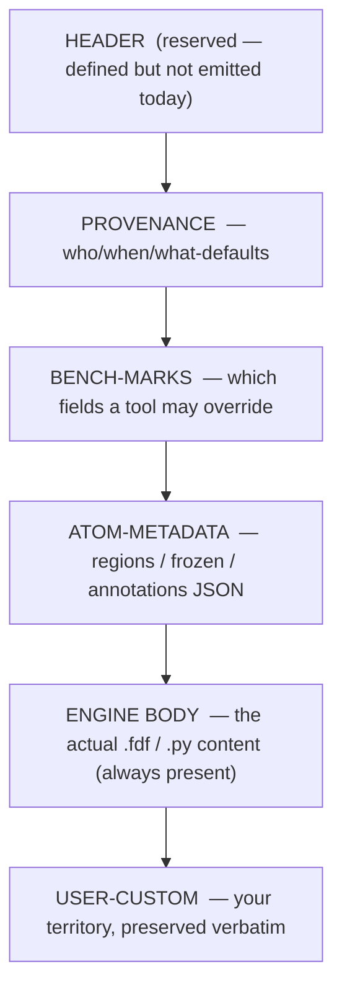

# Job contracts — the on-disk formats and shared vocabulary

> **Role:** contract · **Domain:** `execution/`
>
> **Companions:**
> [`execution/running-a-job.md`](?doc=execution/running-a-job.md) — how you
> actually run and watch **one** job today (the run wrapper, `molbuilder.json`,
> checkpoints, the decoded-run view);
> [`execution/job-system.md`](?doc=execution/job-system.md) — the JobSet batch /
> staged / HPC framework;
> [`execution/overview.md`](?doc=execution/overview.md) — the map plus the
> current → target status picture.
>
> **Settled contracts this doc leans on:**
> [`model/structure-molstruct.md`](?doc=model/structure-molstruct.md) (the
> `.molstruct.json` sidecar it round-trips with),
> [`model/structure-annotations.md`](?doc=model/structure-annotations.md)
> (`regions` / `frozen_atoms` / annotation channels),
> [`model/overview.md`](?doc=model/overview.md) (the 0-based-internal /
> 1-based-user atom-index rule), and
> [`engines/overview.md`](?doc=engines/overview.md) (the UI → config → script
> boundary contract and the script-wrapper contract that this doc's script
> blocks physically implement).

This document is the sole source of truth for the **stable on-disk shapes**
that every other part of molbuilder rests on: where a run's files live and
what they are called, the reserved comment blocks inside a generated script,
how a script resumes (or refuses to resume) from a previous run, the object
that carries a finished run forward into the next calculation, and the
system-wide vocabulary for persisted files and parameters.

These formats are deliberately **surface-agnostic and workflow-agnostic**.
The same run directory, the same `.fdf` blocks, and the same handoff object
are produced whether you clicked *Generate* in the web UI, typed
`molbuilder fdf`, or let the JobSet framework fan a batch across a cluster.
That is the point of pinning them here once: the surfaces above (single-job,
JobSet, CLI, web) all read and write to this contract instead of inventing
their own.

---

## 1. What this document owns — a reader's map

| If you need to know… | Read § |
|---|---|
| Where a job's files go and what they are named | **§ 2 — The run directory** |
| The `project / topic / structure` folder tree and its fixed topic names | **§ 2.5** |
| The comment blocks molbuilder reserves inside a `.fdf` / `.py` / `.run.sh` | **§ 3 — The generated-script contract** |
| What "warm restart", `--continue`, and `--cold` actually do | **§ 4 — Warm & cold restart** |
| How a finished run flows into Transport / a continuation / a spectrum | **§ 5 — The workflow handoff bundle** |
| What a persisted file is called system-wide, and how a config value becomes a SLURM flag | **§ 6 — The shared data vocabulary** |

Two conventions bind everything below and are stated once here:

- **Atom indices are 0-based internally, 1-based only at the human edge.**
  Every JSON payload in this doc (`regions`, `frozen_atoms`, ATOM-METADATA,
  the sidecar) uses **0-based** indices. Engine input *coordinate blocks* use
  the engine's own convention (SIESTA `.fdf` is 1-based). The full rule and
  its single conversion boundary live in
  [`model/overview.md`](?doc=model/overview.md).
- **Schema versions are checked, never guessed.** Persisted artifacts carry a
  version; a reader that meets a newer major refuses with a clear message
  rather than mis-parsing. The one shared helper is `molbuilder/persist.py`
  (§ 6.2).

---

## 2. The run directory

### 2.1 The two rules

**Rule 1 — one job per directory.** Every job lives in its own directory. A
directory may hold *several inputs* (one per stage of a staged relaxation,
§ 2.3) plus the engine's outputs and restart files, but never inputs for a
**different** job (a different molecule, a different `SystemLabel`). This is
not just tidiness — SIESTA's restart files (`<basename>.XV`, `.DM`, `.CG`)
are unprefixed within the directory, so a second job's `SystemLabel` would
overwrite them. PySCF inherits the same one-job rule through its inlined
trajectory writer and checkpoint file.

**Rule 2 — every file shares one basename.** Each file the generator writes
and a reader later opens carries the same **basename**:

- **SIESTA** — the basename **is** the `.fdf`'s `SystemLabel`.
- **PySCF** — the basename **is** the script's `JOB = "…"` literal.

The basename must be a single token matching `[A-Za-z0-9_-]+` — no spaces,
dots, or slashes. Generators reject anything else at the form / CLI boundary
(`molbuilder/projects.py`, `_NAME_PATTERN`). Across the stages of one staged
relaxation the basename **stays identical** (only parameters change); that is
exactly what lets SIESTA pick up `<basename>.XV` / `.DM` from the previous
stage. (The run *wrapper* accepts a slightly wider set, `[A-Za-z0-9._-]+`, at
`molbuilder/runwrap.py`, because a `SystemLabel` may legitimately carry a
dot.)

### 2.2 The file catalogue

For a job with basename `my-job` (`N` is the auto-advancing run index, § 2.6):

| File | Written by | Read by | Purpose |
|---|---|---|---|
| `my-job.fdf` | Build tab / `molbuilder fdf` | SIESTA | input deck (SIESTA) |
| `my-job.py` | Build tab / `molbuilder pyscf` | Python | input script (PySCF) |
| `my-job.run.sh` | `molbuilder run` | shell / SLURM | wrapper: activates the env and runs the engine (§ 2.6) |
| `my-job.sbatch` | `molbuilder run` (SLURM path) | `sbatch` | outer resource header that inner-execs the `.run.sh` (§ 2.6) |
| `my-job.molwatch.log` | both generators (initial preview) + live frames (PySCF's inlined emitter; SIESTA via the parser-on-stdout path) | the run viewer, `molbuilder watch parse` / `tail` | **canonical trajectory source** — preferred by every reader |
| `my-job-runN.out` | the SIESTA wrapper's stdout redirect | the run viewer (fallback) | SIESTA engine stdout, one file per run index |
| `my-job-runN.pyscf.log` | the PySCF wrapper's stdout redirect | the run viewer (fallback) | PySCF process stdout, one file per run index |
| `my-job.log` / `my-job_geom_<stage>.log` | the generated PySCF script | geomeTRIC parser fallback | geomeTRIC's own optimizer log |
| `my-job_geom_optim.xyz` | the generated PySCF script | trajectory parser fallback | PySCF trajectory frames |
| `my-job.STRUCT_OUT` | SIESTA | next stage / end user | final relaxed coordinates |
| `my-job.ANI` | SIESTA | external trajectory tools | per-step trajectory (SIESTA's own `.ANI` format) |
| `my-job.XV` / `.DM` / `.CG` | SIESTA | next stage (warm restart) | coords+velocities / density matrix / CG state |
| `my-job_optimized.xyz` | the PySCF script | next stage (warm restart) | latest converged geometry |
| `my-job.chk` | the PySCF script | next stage (warm restart) | SCF checkpoint |

The single `.molwatch.log` is **the** canonical trajectory. It is written at
file-emission time — the initial-geometry preview at "step 0" — *before* the
engine starts, so pointing a viewer at the directory works immediately after
you generate the input, before `siesta` / `python my-job.py` has finished one
SCF cycle.

> **Drift corrected (2026-07-27):** the old catalogue listed engine stdout as
> a static `my-job.out` / `my-job.log`. The wrapper now writes a **run-indexed**
> `my-job-runN.out` (SIESTA) and `my-job-runN.pyscf.log` (PySCF); the `.log`
> family is geomeTRIC's own logging (§ 2.6).

### 2.3 Multi-stage runs

A staged relaxation (coarse → tight) keeps its stages together, and the
`SystemLabel` / `JOB` basename stays **unsuffixed** — so SIESTA's `.XV` / `.DM`
/ `.CG` restart files transfer cleanly between stages (`MD.UseSaveXV`,
`DM.UseSaveDM`, `MD.UseSaveCG`). Only per-stage *derived* files carry a suffix,
and the codebase uses **two distinct suffix conventions** for two different
paths — do not conflate them:

- **The staged ladder** — the `cfg.stages` ladder rendered by
  `siesta/input.py::render_siesta_stage_fdfs` plus its `.run.sh` stage runner,
  and the `stages_to_jobset` JobSet producer — names each stage's input `.fdf`
  and stdout `.out` **`<label>_<stagename>`**: an **underscore** plus the
  stage's *name* (the default names are `stage1` / `stage2` / `stage3`):

  ```
  bundle-or-dir/
  ├── my-job_stage1.fdf   my-job_stage1.out
  ├── my-job_stage2.fdf   my-job_stage2.out
  ├── my-job.XV / .DM / .CG          ← unsuffixed, carried between stages
  └── my-job.STRUCT_OUT              ← final geometry, after the last stage
  ```

- **The single-stage overlay** (`molbuilder fdf --stage N`, which emits *one*
  stage's `.fdf` on its own) and the **molwatch log** basename use
  **`<label>-stage<N>`**: a **hyphen** plus the stage *number*. The log name is
  produced by `trajectory_log/format.py::molwatch_log_basename(system_label,
  stage)` → `<label>-stage<N>.molwatch.log`. The run decoder's stage regex
  (`parse/dirs/job.py::_STAGE_RE`) keys on this hyphen `-stage<N>` form.

**Two multi-stage execution shapes exist, deliberately:**

- **Per-stage processes (SIESTA run stage-by-stage, and the PySCF `cfg.stage`
  marker path)** — each stage is a separate process invocation writing its own
  `.molwatch.log`. A directory with **more than one** `.molwatch.log` is merged
  by the viewer: all logs are parsed in mtime order (oldest first) into one
  trajectory with a dashed boundary line per stage; live polling pins to the
  newest log.
- **PySCF in-script ladder (`cfg.stages`)** — all stages run inside **one**
  Python process (`for stage in STAGES:`), which writes a **single, unified**
  `<basename>.molwatch.log`. There is no per-stage suffix in this mode.

### 2.4 Resolving a directory — the discovery chain

When a reader (the Watch/run viewer) is handed a **directory** instead of a
specific file, it resolves the trajectory with this chain — first hit wins
(`molbuilder/web/blueprints/watch.py::_resolve_run_directory`):

1. `*.molwatch.log` — if several, the most recently modified.
2. `*.fdf` — parse `SystemLabel`; try `<label>.molwatch.log`, then
   `<label>.out`.
3. `*.py` — grep for a `job_name = "…"` assignment; try `<job>.molwatch.log`,
   then `<job>.log`, then `<job>_geom_optim.xyz`. *(Current generated PySCF
   scripts emit the label as `JOB = "…"`, not `job_name = "…"`, so this step
   matches none of them today — such a directory still resolves via step 1's
   `*.molwatch.log` or step 4's content-sniff. The regex/emit mismatch is a
   code follow-up.)*
4. `run.out` / `siesta.log` / `*.out` / `*_geom_optim.xyz` — content-sniff via
   the trajectory-parser registry.

> **Note on the `.out` / `.log` fallbacks (steps 2–3):** they look for the
> **non-indexed** `<label>.out` / `<job>.log`, not the run-indexed
> `<label>-runN.out` the wrapper now writes (§ 2.6). In practice the
> `.molwatch.log` at step 1 wins for any molbuilder-generated run, so the
> non-indexed fallbacks only match a hand-redirected legacy stdout. A reader
> that wants a specific run's stdout should open `<label>-runN.out` directly.

If nothing matches, the reader returns a clear error naming every filename it
tried. A path that resolves to a regular **file** is loaded directly — the
chain only runs for directories.

### 2.5 The project tree and the canonical topics

A single run directory sits at the bottom of a three-level tree under the
(git-ignored) `projects/` root:

```
projects/
└── <project>/            e.g. "Au-thiol-junctions"
    └── <topic>/          one of the fixed names below
        └── <structure>/  ← the one-job directory (§ 2.1–2.4 live here, flat)
```

The hierarchy is **organisational only**; the innermost `<structure>/` is
exactly the flat one-job-per-directory shape of § 2.1 (no sub-directories, no
nesting of restart files).

Each path segment must match `[A-Za-z0-9_-]+`, and `<topic>` must be one of a
**fixed set of nine** canonical topics (`molbuilder/projects.py::
CANONICAL_TOPICS`). An open topic vocabulary is rejected on purpose: it would
fragment the tree across users and break the "compare the same analysis
across structures" intuition that motivated topic-first ordering.

| Topic | Kind | Used for |
|---|---|---|
| `structure` | storage | flat store of `.xyz` / `.pdb` / `.cif` inputs |
| `pseudopotential` | storage | project-local cache of SIESTA `.psml` pseudos |
| `optimization` | run | geometry relaxation |
| `frequency` | run | Hessian / vibrational frequencies + rigid-rotor–harmonic-oscillator (RRHO) thermochemistry |
| `spectrum` | run | Raman / IR / UV-Vis at an optimised geometry |
| `transport` | run | non-equilibrium Green's function (NEGF) / TranSIESTA device calculations |
| `single-point` | run | energy at a fixed geometry |
| `scan` | run | potential-energy-surface scans |
| `user` | free-form | a workspace with no rules inside it |

> **Drift corrected (2026-07-27):** the source doc said "six" (the run topics
> only). The set is now **nine** — two storage topics (`structure`,
> `pseudopotential`) and a free-form `user` workspace were added.

`molbuilder/projects.py` exposes the tree API: `validate_name`,
`validate_topic`, `project_dir` / `topic_dir` / `structure_dir`,
`ensure_structure_dir` (mkdir -p), `list_projects` / `list_topics` /
`list_structures`, and `find_geom_candidates(project=…)`. The last scans the
tree for reusable geometries matching `*_optimized.xyz`, `*.STRUCT_OUT`, and
`*_geom_optim.xyz` (sorted newest-first) — deliberately **not** bare `*.xyz` /
`*.pdb`, which would sweep up user inputs and noise.

### 2.6 The run wrapper — `.run.sh` and `.sbatch`

`molbuilder run my-job.fdf` (or `.py`) emits a sibling `my-job.run.sh` that
activates the routed conda env and executes the tool
(`molbuilder/runwrap.py::render_run_wrapper`). Routing is by extension:

- **`.fdf` → `molbuilder-siesta`**, run as `mpirun -np N siesta …` (or serial
  if `N < 2`). A `.fdf` that requests **ELPA or GPU** eigensolving is re-routed
  to a third env, **`molbuilder-siesta-gpu`**.
- **`.py` → `molbuilder-pySCF`**, run as `python my-job.py` (OMP-only; the
  script writes its own `.molwatch.log` / `.pyscf.log`).

The wrapper is **plain, readable bash**. Two properties are load-bearing:

- **Activation is a configurable line, not `conda run`.** The wrapper emits an
  activation statement of its own (typically `conda activate <env>`) drawn
  from `runtime_config.require_activation`, so a site can substitute its own
  module-load / venv scheme. (The old illustrative `conda run -n … --no-capture-output`
  example is outdated.)
- **Outputs are run-indexed and never clobbered.** stdout goes to
  `my-job-runN.out` (SIESTA) / `my-job-runN.pyscf.log` (PySCF). The first run
  is `-run0`; **re-running auto-advances** to `max(N)+1` (default since
  2026-06-26), so running the script again never errors and never overwrites a
  prior result. `--force` restarts the sequence at `-run0` (clobbering it);
  `--continue` warm-resumes into the next index (§ 4).

**Two-layer SLURM.** On a cluster the `.run.sh` is the *inner* launcher. The
same `molbuilder run` also emits an outer `my-job.sbatch` — the `#SBATCH`
resource header — which simply `bash`-execs the `.run.sh`. You submit the
outer file: `sbatch my-job.sbatch`. On a workstation there is no `.sbatch`;
you run the `.run.sh` directly (`bash my-job.run.sh`, or backgrounded with
`nohup`). This is one implementation: `runwrap.py::write_run_wrapper(…,
emit_sbatch=True)` → `render_sbatch`. **The JobSet framework reuses this exact
function** (`jobset/prep.py`) rather than reimplementing wrappers — see
`execution/job-system.md`.

molbuilder does **not** manage the launched process. Monitoring is by pointing
the run viewer at the directory (§ 2.4); the resource header's SLURM flags
come from your `molbuilder.json` (§ 6.3).

### 2.7 What the layout does not govern

- **Pseudopotential files** (`<Element>.psml`) sit next to the `.fdf`; their
  names follow the chemical element, not the basename, and are shared across
  jobs (a Au pseudo is the same everywhere). The `--psml-lib` CLI flag copies
  them into the run directory at generate time, but the layout does not
  *require* co-location.
- **Post-processing outputs** (`<basename>.MullikenPop`, `<basename>.bands`,
  PDOS files) follow SIESTA's own naming and inherit the basename
  automatically because they are SIESTA's own output.
- **Analysis pickle / cache files** a user creates after the run are out of
  scope.

---

## 3. The generated-script contract

molbuilder generates engine input that gets **copied** out of the edit
directory into project/run directories and travels onward — often away from
its originating `.molstruct.json` sidecar. To keep provenance and label
metadata attached to the script itself, molbuilder reserves **comment-block
regions** of every generated file for its own use, plus one clearly-marked
zone the user owns.

The payoff: `head -50 my-job.fdf` answers "which molbuilder made this, with
what defaults"; a `.fdf` carries the same region/frozen labels as the sidecar
that produced it (no coordination needed); tools read a stable contract
surface instead of scraping the engine body; and user edits survive
regeneration.

### 3.1 The reserved blocks

Blocks appear top-to-bottom in this order. **Every reserved block is
optional** — a file with none of them is still a valid engine input. Only the
ENGINE BODY is always present (it is the file's actual content, not a
"block"). A tool that needs a specific block refuses cleanly when it is
absent, rather than guessing.



Every reserved block is delimited by literal marker lines
(`molbuilder/script_emit.py`); parsers find blocks by scanning for them:

```
# === molbuilder <block-name> BEGIN ===
...comment-prefixed content...
# === molbuilder <block-name> END ===
```

**Which generator emits which block** (verified against code — not every
block is emitted by every engine):

| Block | SIESTA `.fdf` | PySCF `.py` | TranSIESTA `.fdf` | wrapper `.run.sh` |
|---|:--:|:--:|:--:|:--:|
| HEADER | — | — | — | — |
| PROVENANCE | ✅ | ✅ | — | ✅ |
| BENCH-MARKS | ✅ | — | — | — |
| ATOM-METADATA | ✅¹ | ✅¹ | ✅¹ | — |
| USER-CUSTOM | ✅ | ✅ | — | ✅ |

¹ Conditional — emitted only when the structure carries labels (§ 3.4).

> **HEADER is reserved but not currently emitted.** The grammar reserves a
> HEADER block and `script_emit.emit_header` exists, but no generator calls it
> today; run instructions instead ride in the engine-body banner. The slot is
> kept in the ordering so tools that *parse* for it degrade cleanly.
> **BENCH-MARKS is SIESTA-only today** — the PySCF `.py` bench block is a known
> gap (§ 3.3).

### 3.2 PROVENANCE — the generation snapshot

A static, always-parseable key/value snapshot of the generator state at
generation time:

```
# === molbuilder provenance BEGIN ===
#   generator-version    git e8a4f81
#   generated-at         2026-06-16T17:30:00-07:00
#   form-config-hash     sha256:7c4d…            # optional
#   resolved-defaults:
#     mpi_np            auto -> 4 (gpu+mps policy)
#     BlockSize         auto -> 256 (10 * 212 atoms / mpi_np, capped pow2)
#     kgrid             1x1x1 (auto-from-cell-vacuum)
# === molbuilder provenance END ===
```

- `generator-version` is the molbuilder git SHA (short); `git log <sha>` in the
  repo recovers the full generator state.
- `generated-at` is ISO-8601 with timezone.
- `resolved-defaults` lists a fixed set of parallel/resource knobs — `mpi_np`,
  `omp_threads`, `BlockSize`, `enable_gpu` (and the PySCF equivalents:
  `use_gpu`, `density_fit`, `threads`, `max_memory_mb`) — each annotated with
  either what the auto-policy chose (`auto -> 4`) **or** the user-set value
  (`user-set -> 256`, or the raw number). It is not a "what the user left on
  auto" list; the knobs always appear, tagged auto-or-user. Scientific
  keywords the user set live in the engine body where the engine reads them,
  not here. For a `.run.sh`, provenance carries form-state at generation time
  only; the *runtime*-resolved values (actual ranks after a hardware probe)
  belong to the wrapper's runtime banner, not here.
- Keys are additive and forward-compatible: PROVENANCE has no version tag, and
  an old parser simply ignores keys it does not know.

### 3.3 BENCH-MARKS — the override surface (SIESTA `.fdf`)

A machine-readable declaration of which engine-body fields a tool (e.g. the
benchmark generator, § `execution/job-system.md`) may override, and within
what limits:

```
# === molbuilder bench-marks BEGIN ===
#   version v1
#   n_atoms             212
#   n_orbitals_est      2120       # 10 * n_atoms, rough DZP heuristic
#   gpu_mode            true
#
#   field BlockSize        anchor=BlockSize        type=pow2  range=[16,256]  default=256
#   field MaxSCFIterations anchor=MaxSCFIterations type=int   default=500
#   field MD.NumCGsteps    anchor=MD.NumCGsteps    type=int   default=200
#   field MeshCutoff       anchor=MeshCutoff       type=float unit=Ry  default=400.0
#   field Diag.Algorithm   anchor=Diag.Algorithm   type=enum
# === molbuilder bench-marks END ===
```

- `version v1` is the block-format version; a higher version makes an old
  parser refuse rather than guess.
- Top-level keys (`n_atoms`, `gpu_mode`, …) are informational.
- `field <name> …` lines declare the **only** parameters a tool may override.
  `anchor=<text>` is the literal token a parser greps for at the start of an
  engine-body line (`^\s*<anchor>\b`) to find the override site — **anchor-based,
  not line-number-based**, so it survives layout drift above it. For a `.fdf`
  the anchor is the SIESTA keyword; for a `.py` it would be the Python
  identifier.
- `type` ∈ `{int, float, str, pow2, enum}` (`pow2` = power of two; `enum` was
  added for `Diag.Algorithm`). `range=[a,b]` and `unit=…` are advisory bounds
  for validating a requested override.

> **Gap:** the PySCF `.py` does not yet carry a BENCH-MARKS block. When it
> lands, its `field` declarations get listed here.

### 3.4 ATOM-METADATA — labels that ride with the script (`.fdf` / `.py`)

Embeds the region/frozen/annotation metadata that a `.molstruct.json` sidecar
carries next to an `.xyz`, so a script copied to a run directory does not
strand it. The payload follows the sidecar schema (see
[`model/structure-molstruct.md`](?doc=model/structure-molstruct.md)); this
block cites that schema rather than duplicating it.

```
# === molbuilder atom-metadata BEGIN ===
# format: molstruct-json/v4
# {
#   "schema_version": 4,
#   "n_atoms_total":  212,
#   "regions":     { "L-electrode": [11,12,…], "R-electrode": [200,…], "bridge": [60,…] },
#   "frozen_atoms": [88, 89, …, 211],
#   "annotations": { … },              # v4 channel; optional
#   "created_by":  "molbuilder modify",
#   "created_at":  "2026-05-20T14:23:00Z"
# }
# === molbuilder atom-metadata END ===
```

**Rules (reconciled to code — the block is now v4, not v3):**

- **Format is `molstruct-json/v4`, `schema_version: 4`.** v4 added the
  per-atom **`annotations`** channel additively (see
  [`model/structure-annotations.md`](?doc=model/structure-annotations.md)).
  The on-disk `.molstruct.json` sidecar itself is now schema **v6**; the
  read-side accepts sidecar/in-body versions `(3, 4, 5, 6)`
  (`molbuilder/parse/sidecars/molstruct.py`).
- **Emission is conditional.** The generator emits the block **only** when
  `regions` **or** `frozen_atoms` **or** `annotations` is non-empty. A
  label-free generation has *no* block at all (not an empty one) — absence is
  the honest signal "this generation had no labels", so it cannot later
  suppress a sidecar the user adds afterward. (The old rule said regions/frozen
  only; the annotations channel was added to the trigger with v4.)
- **Indices are 0-based** (matching the sidecar and `Structure.regions` /
  `Structure.frozen_atoms`). SIESTA's engine-body `%block Geometry.Constraints`
  is **1-based** by SIESTA convention. The two coexist in one file on purpose;
  a tool must not assume one indexing for both.
- **`structure_hash` is not emitted in-body.** The metadata and the
  coordinates are written by the same generator pass, so they cannot drift
  apart — a hash would be tautological.
- **In-body wins over the sidecar.** When a `.fdf` / `.py` with an
  ATOM-METADATA block sits next to a `.molstruct.json`, downstream code reads
  the in-body block and ignores the sidecar
  (`_shared.py::apply_companion_labels_if_present` runs before the sidecar
  branch of `apply_sidecar_if_possible`). The sidecar is the fallback for plain
  `.xyz` loads and for pre-contract scripts.

### 3.5 USER-CUSTOM — your territory

A zone molbuilder reads during regeneration only to learn where it is, then
copies **byte-for-byte** into the new output:

```
# === molbuilder user-custom BEGIN ===
# Your own additions go here. molbuilder preserves this section verbatim.
# === molbuilder user-custom END ===
```

molbuilder does not validate its contents (engine-invalid text there will be
rejected by the engine, not by molbuilder). The block may be missing; on
regenerate an empty one is emitted.

### 3.6 Versioning and what a tool may assume

Each structured block versions **independently**: BENCH-MARKS carries
`version v1`, ATOM-METADATA carries `format: molstruct-json/v4`, PROVENANCE is
additive-keys-only (no tag), HEADER is free-form prose. There is **no
autodetection and no silent upgrade** — a parser reads the version tag and
either handles it or refuses, pointing the user at "regenerate with the
current molbuilder". Given a conforming file, a tool may assume: PROVENANCE
answers who/when/what-defaults; BENCH-MARKS lists the overridable fields and
their bounds; ATOM-METADATA round-trips (its dict feeds the same
`apply_to_structure` path the sidecar uses); USER-CUSTOM survives
regeneration.

---

## 4. Warm & cold restart

This is the **per-job** resume contract, and it is designed to be the same to
the user across engines even though the machinery differs (SIESTA resumes
inside its binary from `.DM`/`.XV`; PySCF resumes via an `if exists →` branch
the generated script contains). Its extension to multi-stage / multi-job sets
— and the rule that *molbuilder informs but the user decides to continue* — is
owned by `execution/job-system.md`.

### 4.1 The four behaviors

| Behavior | What happens |
|---|---|
| **Project ID** | Every script declares its ID in one literal (`SystemLabel` / `JOB = "…"`). This ID keys all warm files as `<ID>.<ext>`. |
| **Warm-restart (auto)** | If warm files named by the ID exist in the directory, the engine resumes from them — no flag. Absent files ⇒ clean cold start. |
| **`--continue`** | Same as auto, but *asserts* the warm files must be present: if none exist it prints "…starting cold by necessity" rather than silently cold-starting. |
| **`--cold`** | Forces a clean start regardless of on-disk state. Warm files are **moved aside** (never deleted) into `<basename>-restart-aside-<UTC-timestamp>/`. |

The critical safety property of `--cold`: the move-aside glob **must cover
every file the warm-start branch reads**, or `--cold` silently leaks prior
state into a "clean" run. This is enforced per engine and pinned by tests
(`molbuilder/runwrap.py::_cold_restart_aside_block`).

### 4.2 Per-engine warm-file inventory

Every file below is in that engine's `--cold` move-aside glob.

**SIESTA (13 suffixes):** `.DM` (density matrix), `.CG` (CG optimizer state),
`.XV` (coords+velocities), `.LWF` (Wannier), `.ZM` (Z-matrix), `.Bonds`,
`.PARTIAL`, `.EIG`, `.HSX` (Hamiltonian+overlap, TranSIESTA restart), `.WFSX`
(saved wavefunctions), `.STRUCT_NEXT_ITER` (next-iter geometry), `.TSHS` /
`.TSDE` (TranSIESTA self-energy H / NEGF density). SIESTA reads these itself
when the matching `MD.UseSave*` / `DM.UseSaveDM` flags are set; the wrapper
only moves them aside for `--cold`.

**PySCF (5 files):** `<JOB>.chk` (SCF init guess), `<JOB>_optimized.xyz`
(latest converged geometry), `<JOB>_geom_optim.xyz` (geomeTRIC trajectory),
`<JOB>_geom_optim.tmp`, `<JOB>_geom.tmp` (geomeTRIC temporaries). Unlike
SIESTA, the *generated PySCF script* contains the warm-restart logic
explicitly:

```python
# SCF init guess from a prior checkpoint, if present:
mf.chkfile = _mb_outfile(JOB + ".chk")
_chk = _mb_outfile(JOB + ".chk")
if _os.path.exists(_chk) and _os.path.getsize(_chk) > 0:
    mf.init_guess = "chkfile"
    print(f"[molbuilder] continuation: SCF init guess from {_chk}")

# Geometry resume from a prior optimization, if present:
#   <JOB>_optimized.xyz overrides the literal _atom_block before gto.M(...)
```

> **Lesson pinned in code:** any new warm-restart hook must land its `--cold`
> glob entry **in the same commit** as its read-side. A parity test
> (`_PYSCF_WARM_RESTART_INVENTORY` in `tests/test_runwrap.py`) fails if a hook
> gains a read-side but forgets the glob.

### 4.3 Project-ID extraction

For `--cold` to move aside the *right* files, the wrapper must read the ID
from **inside** the script — `<basename>-stage2.fdf` may carry `SystemLabel
foo` (not `foo-stage2`). At runtime the wrapper `awk`s the `SystemLabel`
(SIESTA) or `JOB = "…"` (PySCF) line, **sanitizes** the value to
`[A-Za-z0-9._-]` before interpolation (blocking shell injection from a hostile
script), and falls back to the wrapper basename if it cannot parse one. The
`--cold` glob uses **both** the ID-derived name and the wrapper basename, so a
job where `SystemLabel == basename` is covered either way.

### 4.4 The status banner

Before the engine starts, the wrapper prints one MODE line so the user sees
what is about to happen. The wording is engine-agnostic (the same mode means
the same thing for SIESTA and PySCF):

| Mode line | Meaning |
|---|---|
| `initial-run (clean state)` | no warm files, no flags — cold from the script literal |
| `WARM-RESTART (silent; engine will load existing <files>. Pass --cold to discard them.)` | warm files present, no flag — auto-resume |
| `WARM-RESUME (--continue; engine will load <files>)` | `--continue` + warm files present |
| `WARM-RESUME REQUESTED but no prior state found -- starting cold by necessity` | `--continue` but no warm files — degraded to cold |
| `COLD (--cold; warm-start files moved aside)` | `--cold` — warm files moved to `-restart-aside-<UTC>/` |

(The flag spellings: `--continue` / `-c`; `--force` / `-f` resets the run
index to `-run0`; `--cold` / `--from-scratch`.)

---

## 5. The workflow handoff bundle

> **Vocabulary:** the object that carries a **finished run into the next
> calculation** is the *handoff bundle*. Plain "bundle" belongs to the JobSet
> framework (a bundled batch of jobs, `execution/job-system.md`) — do not use
> the bare word for this object.

### 5.1 Purpose

molbuilder writes an input script into a run directory; the run produces
outputs (SIESTA `.XV`, a PySCF `_optimized.xyz`). Historically the originating
`.xyz` + `.molstruct.json` were **not** copied into the run dir, so when a user
wanted to continue — Transport (needs `L`/`R`/`bridge` regions), a restart from
converged coords, a spectrum at the optimised geometry — the next stage had no
clean source for the labels that defined the run. The handoff bundle closes
that gap. It fuses:

1. the **final structure** (coords + elements) read from the converged engine
   output, with
2. the **labels** (regions, frozen atoms) from the originating script's in-body
   ATOM-METADATA (§ 3.4), and
3. **provenance** from that script.

Materialised to a destination, it writes an `.xyz` + `.molstruct.json` pair —
a format the next tab's existing load path already understands. No new load
primitive is needed downstream.

### 5.2 The handoff object

Assembly returns a typed, frozen `BundleResult`
(`molbuilder/parse/types.py`; produced by
`molbuilder/parse/dirs/bundle.py::BundleDirParser.parse(run_dir)`):

```python
@dataclass(frozen=True)
class BundleResult(ParseResult):      # + base: schema_version, parsed_at, parser_name, source
    structure:         Structure                 # final coords + elements
    cell:              Optional[...]             # lattice, when present
    regions:           Dict[str, List[int]]      # 0-based; may be {}
    frozen_atoms:      List[int]                 # 0-based; may be []
    source_engine:     Literal["siesta", "pyscf"]
    source_script:     Optional[str]             # abs path to the .fdf / .py that fed extraction
    final_coords_from: Literal["xv", "fdf-initial", "py-opt", "py-initial"]
    block_schema_versions: ...                   # the ATOM-METADATA versions seen
    notes:             List[str]                 # never None; diagnostics
```

`final_coords_from` is load-bearing: it tells a consumer whether the bundle
reflects a **converged** optimization (`"xv"`, `"py-opt"`) or **fell back** to
initial coordinates because the optimization output was missing
(`"fdf-initial"`, `"py-initial"`). `notes` carries non-fatal diagnostics
(schema-version mismatch, fallback reason, missing provenance) and is always a
(possibly empty) list.

> **Naming reconciled to code:** the old contract called this `RunBundle` with
> `user_custom_lines` + `provenance` fields and a free `assemble_from_run_dir`
> function. The shipped object is **`BundleResult`** (user-custom and
> provenance live on the sibling **`ScriptResult`**, the per-script
> extraction), and the entry point is the class method
> **`BundleDirParser.parse`** (the free `_assemble_from_run_dir` is private and
> returns a dict).

The per-script extraction feeding the bundle is `ScriptResult`
(`ScriptSourceTextParser.parse`), whose fields distinguish three states on
purpose: `None` = block absent/unparseable, `[]`/`{}` = block present but
deliberately empty. The bundle-layer convenience `_extract_script_source(text)
→ dict` is re-exported for back-compat as
`molbuilder.script_emit.extract_script_source`.

### 5.3 Source priority and conflict policy

**Final coordinates — first hit wins:**

| Engine | Source | Mark | When |
|---|---|---|---|
| SIESTA | `<SystemLabel>.XV` | `xv` | any run that wrote `.XV` (`SystemLabel` read from the in-body directive, not the filename); falls back to `<fdf-stem>.XV`, then to the sole `*.XV` in the directory (a `note` records the fallback; multiple `*.XV` are left ambiguous and drop to initial coords) |
| SIESTA | `.fdf` initial coords | `fdf-initial` | `.XV` absent/malformed — bundle still emits; `notes` records "NOT converged geometry" |
| PySCF | `<JOB>_optimized.xyz` | `py-opt` | geom-opt success (`JOB` read from the `JOB = "…"` line) |
| PySCF | `.py` initial atom-block | `py-initial` | `_optimized.xyz` absent — bundle still emits; `notes` records the fallback. Only the generator's whitespace atom-block is parsed; a hand-written list-of-tuple `.py` must be re-rendered through molbuilder first |

**Labels:** in-body ATOM-METADATA is authoritative; where a `.xyz` load has
both a sibling script *and* a `.molstruct.json`, **in-body wins** (§ 3.4).

**Conflict rules:** multiple scripts in a dir ⇒ pick the largest by atom count
(tie: lexicographic); both a `.fdf` **and** a `.py` present ⇒
`BundleError("dir contains both …; ambiguous")`; the script's
`n_atoms_total` not matching the final structure's atom count ⇒ `BundleError`
(no silent reconciliation). A left-handed cell (det < 0) assembles but adds a
loud `notes` warning (the check now lives in
`molbuilder/parse/dirs/_assembler_helpers.py`).

### 5.4 Materialisation and errors

```python
def write_bundle_as_handoff(bundle, target_dir, *, stem,
                            overwrite=False) -> Tuple[Path, Path]:
    """Write <target>/<stem>.xyz + <target>/<stem>.molstruct.json."""
```

(`molbuilder/bundle_writer.py`.) Each file is written atomically (tmp + fsync +
`os.replace`, mirroring the sidecar writer); the **pair** is best-effort
(`.xyz` lands first, then the sidecar). With `overwrite=False` (default) it
raises **`BundleWriteError`** if **either** the `.xyz` or the
`.molstruct.json` already exists at that stem — stricter than checking the XYZ
alone, because overwriting a stale sidecar that points at a different XYZ would
corrupt the structure↔sidecar pairing invariant. (Note the two distinct
exceptions: `BundleError` for *assembly* problems, `BundleWriteError` for
*write* problems.) The `overwrite=False` check is not a lock: two writers
racing on the same target stem can each pass the existence check before either
writes, so the pair could land mixed (`.xyz` from one, sidecar from the
other). The per-file atomic rename keeps each file internally consistent, and
the sidecar's `structure_hash` lets the next loader detect the mismatch — but
a UI that writes a handoff SHOULD warn before targeting a stem that already
exists.

On schema: the reader handles ATOM-METADATA **v3 and v4**; a version below 3
raises `BundleError` ("re-render with current molbuilder"); above 4 loads with
a `notes` warning ("molbuilder expects 4").

### 5.5 Surfaces

- **Web** — the Results panel's "Bundle for next stage →" button posts to
  `POST /api/results/bundle` (`molbuilder/web/blueprints/results.py`); the
  frontend wiring is `lib/results/bundle-handoff.js`. The endpoint resolves the
  target inside the project sandbox and then navigates the sidebar to it so the
  new pair appears without manual refresh.
- **CLI** — `BundleDirParser.parse` + `write_bundle_as_handoff` are the same
  entry points a script or future CLI command calls directly.

---

## 6. The shared data vocabulary

If two subsystems name the same concept, they use the name defined here; every
persisted artifact follows one schema convention. This section is the
"what is this called, system-wide?" reference — maintained because the names
*did* drift once (a job-set field read `omp`/`walltime` while every other
exchange file said `cpus_per_task`/`time`). One language prevents that.

### 6.1 Persisted artifacts

| Artifact | File | Schema string | Authoritative code | Key top-level fields |
|---|---|---|---|---|
| User config | `molbuilder.json` / `.molbuilder.json` | *(validated, no `@N`)* | `runtime_config.py` | `scheduler{kind,directives,gpu,defaults,mem_model,routing}`, `execution`, `script_generation`, `envs` |
| Detected environment | `environment.json` | `molbuilder/environment@1` | `bench/environment.py` | `scheduler`, `topology`, `site` |
| Benchmark manifest | `bench-manifest.json` | `molbuilder/bench-manifest@2` | `bench/generate.py` | `points.{cpu,gpu}` |
| Benchmark result | `bench-result.json` | `molbuilder/bench-result@1` | `bench/result.py` | `points`, `choice`, `recommend` |
| Job-set plan | `job-set.json` | `molbuilder/job-set@1` | `jobset/model.py` | `name`, `engine`, `kind`, `shared`, `jobs[]` |
| Workflow handoff | `<stem>.xyz` + `<stem>.molstruct.json` | *(sidecar pair, bare-int `schema_version` = 6)* | `bundle_writer.py`, `sidecars/molstruct.py` | geometry; `regions` / `frozen_atoms` / `structure_hash` |
| Checkpoint archive | `.binsnapshots/<sha>/MANIFEST` | *(3-col `<sha256>  <bytes>  <name>`)* | `checkpoint.py` | — |
| Checkpoint config | `.mbcheckpoint.json` | `molbuilder/checkpoint-config@1` | `checkpoint.py` | `engine`, `archive_globs` |
| Decoded run | *(served, not written to disk)* | bare-int `schema_version` | `parse/dirs/job.py` | see below |

> **The decoded run is not a file.** `decode_run_dir(run_dir)` returns an
> in-memory `JobResult` dataclass served to the Results tab and consumed by
> `jobset/runstatus.py`; nothing writes a `decoded.json`. Its bare-integer
> `schema_version` predates the `@major` convention — do not copy that for
> anything new. Its full field set and the run-monitoring story live in
> `execution/running-a-job.md`.

**Schema-string convention:** `molbuilder/<name>@<major>`. A reader checks the
**major only** — tolerating same-major minor bumps, rejecting a different
major — through the single shared helper `molbuilder/persist.py`
(`schema_major`, `check_schema_major`, `read_json`, `write_json`), now adopted
by `bench/environment.py`, `bench/result.py`, and `jobset/model.py` (it was
hand-rolled three times with a subtle missing-`@` inconsistency before). New
persisted artifacts must use it. The two bare-integer exceptions
(`.molstruct.json` = 6, the decoded run = 1) predate the convention.

### 6.2 The parameter vocabulary — config ↔ scheduler

There are **two layers** with a deliberate, documented translation between
them; within a layer, one concept has exactly one name.

- **config layer** — the scientific dataclasses the user sets (`SiestaConfig` /
  `PySCFConfig`), vocabulary tuned for the scientist.
- **exchange / scheduler layer** — the persisted artifacts (`job-set.json`,
  manifests) and the SLURM flags they become, tuned for the scheduler.
  Persisted files and `jobset.Resources` use this column.

| Concept | config-layer name | exchange / SLURM name | translated at |
|---|---|---|---|
| MPI ranks | `mpi_np` | `mpi_np` → `-n` | *(same name)* |
| OMP cores / rank | `omp_threads` | **`cpus_per_task`** → `-c` | `siesta/stages.py::stages_to_jobset` |
| Walltime | `defaults.time` | **`time`** → `-t` | — |
| Memory | `max_memory_mb` / `defaults.mem` | `mem` → `--mem` | `render_sbatch` (estimate) |
| Whole-node | `gpu.exclusive` | `exclusive` → `--exclusive` | — |
| Partition | `directives.partition` | `partition` → `-p` | resolved from `domain` |
| QoS | `directives.qos` | `qos` → `-q` | resolved from `domain` |
| Routing domain | `routing[].name` / `execution.domain` | `domain` (in `jobset.Resources`) | `--domain` → `-p`/`-q` |
| GPU request | `enable_gpu` + `diag_algorithm` | `gres` → `--gres` | derived from `.fdf` + GPU type |
| Eigensolver | `diag_algorithm` (`ScaLAPACK` / `ELPA-1STAGE` / `ELPA-2STAGE`) | `.fdf`: `Diag.Algorithm` | `render_fdf` |
| Non-convergence policy | `on_nonconvergence` (`proceed`/`continue`/`halt`) | `dep_kind` (`afterany`/`afterok`) | `stages_to_jobset` |

**The translation rule:** persisted/exchange files use the exchange name; a
*producer* maps config → exchange at its boundary (e.g. `stages_to_jobset`
maps `SiestaConfig.omp_threads` → `cpus_per_task`). Never mix the two within
one file. `render_sbatch` is a *consumer* — it receives `cpus_per_task`
already translated and does not re-derive it from `omp_threads`. (In the
wrapper these are two distinct knobs that *coincide* on SLURM, where `-c` sets
`SLURM_CPUS_PER_TASK`, which the wrapper uses as its OMP default — the "one
concept, one name" framing here is the SLURM mapping, not a Python rename.)

The `jobset.Resources` dataclass holds exactly **seven** fields — `domain`,
`time`, `exclusive`, `mem`, `gres`, `mpi_np`, `cpus_per_task`. `partition` and
`qos` are **not** `Resources` fields; they are config `directives.*` resolved
from `domain` by the submit engine. `dep_kind` is a per-**job** edge field, not
a resource.

### 6.3 Identifier & path conventions

| Convention | Form | Used for |
|---|---|---|
| **Project ID** | `SystemLabel` (SIESTA) / `JOB = "…"` (PySCF) | keys warm-restart files `<ID>.<ext>` (§ 4); also the basis for the SLURM `-J` name (row below) |
| **Warm-restart files** | `<ID>.XV`/`.DM`/`.CG` (SIESTA); `<ID>.chk`/`<ID>_optimized.xyz` (PySCF) | engine-native resume (§ 4.2) |
| **Per-job directory** | `point-<name>/` | benchmark `point-G<g>K<k>C<c>/`; stage ladder `point-stage<N>/` |
| **SLURM job name** | a directly-submitted `.sbatch` carries `-J <script-stem>` (= the Project ID only when `SystemLabel == basename`); via `jobset submit` the engine **overrides** it on the command line with `-J <job-name>` — a ladder job is the bare stage name (`stage1`), a bench point is `job-gpu-G<g>K<k>C<c>` / `job-cpu` | `squeue` differentiation |
| **Dependency kind** | `afterok` / `afterany` | stage chaining (§ `execution/job-system.md`) |

The `point-<name>/` directory naming, the sweep/ladder identifiers, and
`dep_kind` are produced by the JobSet framework (`jobset/materialize.py`,
`jobset/model.py`, `bench/adapters.py`) — `execution/job-system.md` is where
they are used in anger.

---

## 7. Change process

A change to any format in this document requires, in the **same commit**: the
code change, a test pinning the new invariant, and this document updated to
match. A generator that changes a filename, a parser that changes a discovery
rule, or a new warm-restart hook without its `--cold` glob entry is a bug, not
a feature — the whole point of pinning these shapes here is that the surfaces
above can rely on them without re-checking the code.
