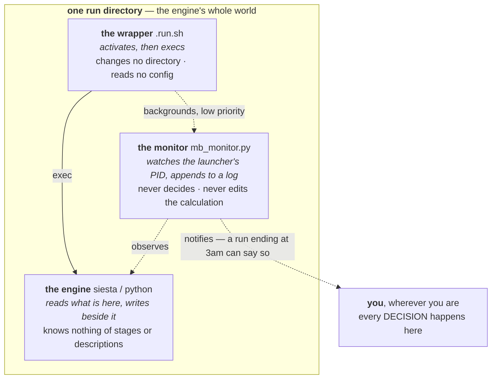
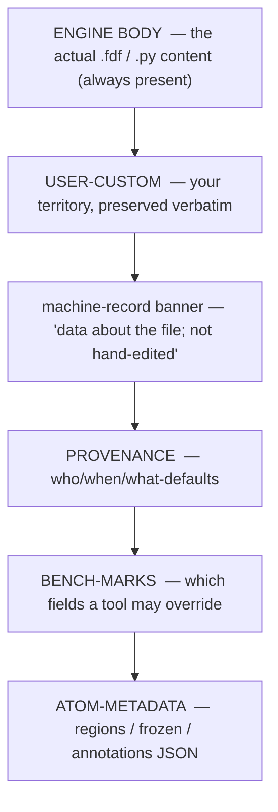
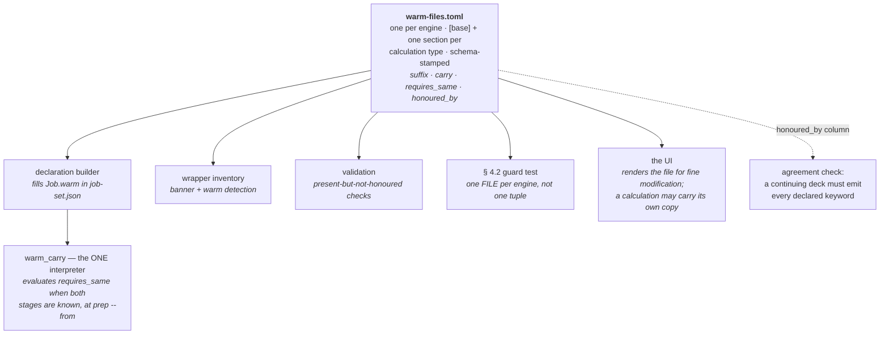

# Job contracts — the on-disk formats and shared vocabulary

**Role:** contract
**Domain:** execution

**Companions:**
[`execution/running-a-job.md`](?doc=execution/running-a-job.md) — how you
actually run and watch **one** job today (the run wrapper, `molbuilder.json`,
checkpoints, the decoded-run view);
[`execution/job-system.md`](?doc=execution/job-system.md) — the JobSet batch /
staged / HPC framework;
[`execution/overview.md`](?doc=execution/overview.md) — the map plus the
current → target status picture.

**Settled contracts this doc leans on:**
[`model/structure-molstruct.md`](?doc=model/structure-molstruct.md) (the
`.molstruct.json` sidecar it round-trips with),
[`model/structure-annotations.md`](?doc=model/structure-annotations.md)
(`regions` / `frozen_atoms` / annotation channels),
[`model/overview.md`](?doc=model/overview.md) (the 0-based-internal /
1-based-user atom-index rule), and
[`engines/overview.md`](?doc=engines/overview.md) (the UI → config → script
boundary contract and the script-wrapper contract that this doc's script
blocks physically implement).

This document is the sole source of truth for the **stable on-disk shapes**
that every other part of molbuilder rests on: where a run's files live and
what they are called, the reserved comment blocks inside a generated script,
how a script resumes (or refuses to resume) from a previous run, the object
that carries a finished run forward into the next calculation, and the
system-wide vocabulary for persisted files and parameters.

These formats are deliberately **surface-agnostic and workflow-agnostic**.
The same run directory, the same `.fdf` blocks, and the same handoff object
are produced whether you described the calculation in the web UI or from a
terminal, and whether it is one stage or a hundred. That is the point of pinning
them here once: every surface reads and writes to this contract instead of
inventing its own.

---

## 1. What this document owns — a reader's map

| If you need to know… | Read § |
|---|---|
| Where a job's files go and what they are named | **§ 2 — The run directory** |
| The `project / topic / structure` folder tree and its fixed topic names | **§ 2.5** |
| The comment blocks molbuilder reserves inside a `.fdf` / `.py` / `.run.sh` | **§ 3 — The generated-script contract** |
| What "warm restart", `--continue`, and `--cold` actually do | **§ 4 — Warm & cold restart** |
| How a finished run flows into Transport / a continuation / a spectrum | **[`handoff-bundle.md`](?doc=execution/handoff-bundle.md)** — its own contract |
| What a persisted file is called system-wide, and how a config value becomes a SLURM flag | **§ 6 — The shared data vocabulary** |

Two conventions bind everything below and are stated once here:

- **Atom indices are 0-based internally, 1-based only at the human edge.**
  Every JSON payload in this doc (`regions`, `frozen_atoms`, ATOM-METADATA,
  the sidecar) uses **0-based** indices. Engine input *coordinate blocks* use
  the engine's own convention (SIESTA `.fdf` is 1-based). The full rule and
  its single conversion boundary live in
  [`model/overview.md`](?doc=model/overview.md).
- **Schema versions are checked, never guessed.** Persisted artifacts carry a
  version; a reader that meets a newer major refuses with a clear message
  rather than mis-parsing. The one shared helper is `molbuilder/persist.py`
  (§ 6.2).

---

## 2. The run directory

### 2.1 What the engine assumes, and the two rules that serve it

Both rules below are consequences of one premise, so it is worth stating first.
Everything molbuilder does around a run exists to make it true.

> **The engine runs inside one directory, and that directory is its whole world.**
> It needs the right environment and every file it will read to be reachable from
> there. It has **no knowledge of how the directory came to be** — no notion of a
> stage, a description, a benchmark, a checkpoint or a previous run — and it does
> not care. It reads what is there and writes its output beside it.

Three things follow immediately, and each is a rule elsewhere in these documents:

| Because the engine… | …molbuilder must |
|---|---|
| has no notion of a **stage** | resolve every stage parameter **before** the deck is written. A deck that needed a reader to understand the word "stage" would not run (`engines/stages.md § 1`) |
| cannot fetch anything | put **everything the run will read in place before it starts** — which is why a carried restart file is copied at prep rather than resolved later (`project-layout.md § 1.6`), and why a stage may **declare** what it needs (below) |
| assumes the environment is already correct | give the wrapper exactly two jobs — **activate, then exec** — and do every decision and arrangement in Python beforehand (`running-a-job.md § 2.2a`) |

> **One carve-out, stated rather than smuggled** *(U-program follow-up,
> 2026-08-12 — § 2.6's wrapper carried this while the rule above read as
> absolute, and the two documents conflicted)*: the wrapper may probe **the
> engine build it is about to run** — `siesta --version` for its
> MPI/OpenMP parallelisations, deciding the launcher form (`mpirun` vs
> direct). That fact does not exist before the run: the binary on the
> target's PATH at run time may have been rebuilt since `prep`, and baking
> the answer would pin yesterday's build to today's launch. The carve-out
> is bounded by what it reads: the probe consults the ENGINE itself, never
> a config file, the description, or anything molbuilder wrote — those all
> had their one moment earlier, and § 8 of `running-a-job.md` still holds
> (**nothing reads config at run time**).

**"Reachable from there" is the precise word, not "physically present."** A
symlink to `../Au.psml` opens as a real file from inside the directory, and the
engine cannot tell the difference — so sharing one copy of a large
pseudopotential across stages is invisible to it, and legitimate.

#### A stage may declare what it needs: `required`

*Added 2026-08-08 (user).* Continuing a relaxation implies a known set —
`.XV`, `.DM`, `.CG` — because that is what *continuing* means. Some runs need
something else: a TranSIESTA scattering calculation cannot start without the
`.TSHS` an electrode run produced, and nothing about `restart: continue` says so.

**`required` is to be an ordinary config field**, so a stage sets it through
`overrides` like `mesh_cutoff`, and `stages.md § 2`'s *"a stage is a name, an
enabled flag, and the cells that differ — and no others"* stays exactly as it
was. No new stage mechanism, no fourth key in the description.

> ⚠ **Neither half of this is built, and the design is stated here in full so
> the two halves land together** *(recorded 2026-08-16)*. § 4.4 has said since
> 2026-08-11 that the **check** is unbuilt. The **field** is unbuilt too, which
> is the more basic gap and was nowhere stated: the catalogue carries no
> `required` item, so `resolve` refuses the example below — *"override(s)
> 'required' name no field of `SiestaConfig`. A stage may override any field of
> the shared schema, but only a field of it."* That refusal is correct
> behaviour (`stages.md` § 6.1: a description names fields, it never defines
> them), which is exactly why the field has to be **added to the catalogue**
> before a stage can carry one — a stage cannot introduce it. Building the
> check without the item would give the wrapper a list nothing can produce;
> building the item without the check would let a description declare a
> requirement nobody verifies.

```jsonc
{ "name": "scattering",
  "overrides": { "restart": "continue", "required": [".TSHS", ".TSDE"] } }
```

Extensions, not filenames: molbuilder prepends the run id, so a stage cannot
name another calculation's file by accident — which is the mixing this document
spends § 2.1 Rule 1 preventing.

**It is a claim, not an instruction**, and that is the whole reason it is worth
having. *"Carry this for me"* can only be obeyed; *"this stage cannot run
without this"* can be **checked** — see § 4.4, which is the only place with a
definite answer.

> **What it does NOT change.** In the flat shape nothing is carried at all: every
> stage shares one directory, so a declared file is either there or it is not.
> In the hierarchical shape `prep` links it in beside the standard set. Same
> declaration, two different pieces of work behind it, and the *check* is
> identical in both — which is what makes it a property of the stage rather than
> of a layout.

> ⚠ **Which is why the transportable unit is the calculation folder, not the run
> directory.** Completeness here is a property of *what resolves*, not of what
> sits in the directory. Archive a lone `run-0/` and its links to the deck and
> the shared package dangle — it was never self-contained, only self-contained
> *in place*. Move the whole calculation folder and every link stays inside it.

**Who puts the engine in that directory: the launcher, and only the launcher.**
Both deployment paths do the same one thing, and neither the wrapper nor the
engine ever navigates:

| Path | How the directory is established |
|---|---|
| **workstation** | the launcher runs the job's `.run.sh` **with its working directory set to the job's directory** |
| **SLURM** | the launcher runs `sbatch` **from** that directory, and SLURM lands the job in `SLURM_SUBMIT_DIR` — the same place |

So one rule covers both: **the caller's working directory is the contract.** The
wrapper inherits it and changes it for nothing; outputs land where the wrapper
was invoked. A wrapper that navigated would break the property the engine depends
on — that *here* is where everything is — and it would break it differently under
the two launchers, which is worse than breaking it consistently.

This is not a rule the design is asking for. It is how the shipped submit path
already works, in one line per mode, and the generated wrapper says so in its own
header: *"this wrapper does NOT change cwd… the caller's cwd is the contract."*
It is written down here because it was true everywhere and stated nowhere — and
because the one place it was broken (a rendered block that `cd`s into an attempt
it created) was retired for exactly this reason
([`project-layout.md`](?doc=execution/project-layout.md) invariant 6a). ✅ **Since 2026-08-10 the rule has no exception**: no generated
wrapper contains a `cd` on either engine, which is `project-layout.md`
invariant 6a.

#### The third party in the directory: the monitor observes, and only observes

A wrapper activates and execs. An engine reads and writes. There is one more
thing in that directory, and it has the narrowest job of all.

**`mb_monitor.py` runs beside the engine and watches it.** It is backgrounded by
the wrapper at low priority, follows the launcher's **PID** — so it knows
authoritatively when the run ended, rather than guessing from output markers —
parses the run's artifacts as they grow, and appends what it learns to a log
beside them. It carries a **notifier hook** (`register_notifier`, or a webhook
via `MB_NOTIFY_URL`), which is the deliberate customization point: what should
happen when something notable occurs is the user's to decide, not molbuilder's.

**That hook is why nobody has to be at the cluster.** A run that ends at 3am can
say so.

> **And the boundary that makes it safe: the monitor observes and notifies. It
> never decides, and never mutates the calculation.**
>
> This is the same rule the wrapper has — activate and exec, nothing more — one
> layer further out, and the reason is the same. A compute node is where work
> happens, not where decisions are made. So the monitor does not take
> checkpoints, does not prepare the next stage, does not retry, and does not edit
> the description, even where it is the only thing present and would technically
> be able to. Something that both watches and acts would be deciding on your
> behalf, on a machine you are not at, about a calculation whose worth only you
> can judge.
>
> Three parties, three verbs: **the wrapper activates and execs, the engine reads
> and writes, the monitor watches and tells.** Everything that *decides* runs
> where the user is (`checkpointing.md § 9`).



**Three parties, three verbs: the wrapper activates and execs, the engine reads
and writes, the monitor watches and tells.** Nothing in that directory decides
anything — a compute node is where work happens, not where judgement happens.

**Rule 1 — one job per directory.** Every job lives in its own directory. A
directory may hold *several inputs* (one per stage of a staged relaxation,
§ 2.3) plus the engine's outputs and restart files, but never inputs for a
**different** job (a different molecule, a different `SystemLabel`). This is
not just tidiness — SIESTA's restart files (`<basename>.XV`, `.DM`, `.CG`)
are unprefixed within the directory, so a second job's `SystemLabel` would
overwrite them. PySCF inherits the same one-job rule through its inlined
trajectory writer and checkpoint file.

**Rule 2 — every file shares one basename.** Each file the generator writes
and a reader later opens carries the same **basename**:

- **SIESTA** — the basename **is** the `.fdf`'s `SystemLabel`.
- **PySCF** — the basename **is** the script's `JOB = "…"` literal.

The basename must be a single token matching `[A-Za-z0-9_-]+` — no spaces,
dots, or slashes. Generators reject anything else at the form / CLI boundary
(`molbuilder/projects.py`, `_NAME_PATTERN`). Across the stages of one staged
relaxation the basename **stays identical** (only parameters change); that is
exactly what lets SIESTA pick up `<basename>.XV` / `.DM` from the previous
stage. (The run *wrapper* accepts a slightly wider set, `[A-Za-z0-9._-]+`, at
`molbuilder/runwrap.py`, because a `SystemLabel` may legitimately carry a
dot.)

### 2.2 The file catalogue

For a job with basename `my-job` (`N` is the auto-advancing run index, § 2.6):

| File | Written by | Read by | Purpose |
|---|---|---|---|
| `my-job.fdf` | **`prep`** (§ 2.6), from the template | SIESTA | input deck (SIESTA) |
| `my-job.py` | **`prep`** (§ 2.6), from the template; `molbuilder pyscf` for a standalone deck | Python | input script (PySCF) |
| `my-job.run.sh` | **`prep`** (§ 2.6) | shell / SLURM | wrapper: activates the env and runs the engine |
| `my-job.sbatch` | **`prep`**, on a cluster (§ 2.6) | `sbatch` | outer resource header that inner-execs the `.run.sh` |
| `my-job.molwatch.log` | both generators (initial preview) + live frames (PySCF's inlined emitter; SIESTA via the parser-on-stdout path) | the run viewer, `molbuilder watch parse` / `tail` | **canonical trajectory source** — preferred by every reader |
| `my-job-runN.out` | the SIESTA wrapper's stdout redirect | the run viewer (fallback) | SIESTA engine stdout, one file per run index |
| `my-job-runN.pyscf.log` | the PySCF wrapper's stdout redirect | the run viewer (fallback) | PySCF process stdout, one file per run index |
| `my-job.log` / `my-job_geom_<stage>.log` | the generated PySCF script | geomeTRIC parser fallback | geomeTRIC's own optimizer log |
| `my-job_geom_optim.xyz` | the generated PySCF script | trajectory parser fallback | PySCF trajectory frames |
| `my-job.STRUCT_OUT` | SIESTA | next stage / end user | final relaxed coordinates |
| `my-job.ANI` | SIESTA | external trajectory tools | per-step trajectory (SIESTA's own `.ANI` format) |
| `my-job.XV` / `.DM` / `.CG` | SIESTA | next stage (warm restart) | coords+velocities / density matrix / CG state |
| `my-job_optimized.xyz` | the PySCF script | next stage (warm restart) | latest converged geometry |
| `my-job.chk` | the PySCF script | next stage (warm restart) | SCF checkpoint |

The single `.molwatch.log` is **the** canonical trajectory. It is written at
file-emission time — the initial-geometry preview at "step 0" — *before* the
engine starts, so pointing a viewer at the directory works immediately after
you generate the input, before `siesta` / `python my-job.py` has finished one
SCF cycle.

> **Drift corrected (2026-07-27):** the old catalogue listed engine stdout as
> a static `my-job.out` / `my-job.log`. The wrapper now writes a **run-indexed**
> `my-job-runN.out` (SIESTA) and `my-job-runN.pyscf.log` (PySCF); the `.log`
> family is geomeTRIC's own logging (§ 2.6).

**Why PySCF's stdout is `.pyscf.log` and not `.out`.** It used to be `.out`, and
that collided with SIESTA's `.out` — which is not stdout at all, but a structured
text format SIESTA's Fortran writes. The Results tab picks a viewer by suffix, so
a PySCF log got handed to the SIESTA trajectory reader, which rendered garbage.
The rename fixes it three ways: `.log` is honest (the file *is* a capture of
stdout + stderr, not a calculation output), the `.pyscf.` infix pins which engine
produced it for anyone scanning a directory, and the distinct suffix lets the
viewer dispatch correctly. Worth knowing before anyone "tidies" the extension
back.

### 2.3 Multi-stage runs

A staged relaxation (coarse → tight) keeps its stages together, and the
`SystemLabel` / `JOB` basename stays **unsuffixed** — so SIESTA's `.XV` / `.DM`
/ `.CG` restart files transfer cleanly between stages (`MD.UseSaveXV`,
`DM.UseSaveDM`, `MD.UseSaveCG`). Only per-stage *derived* files carry a suffix,
and **there is one convention for it**:

- **The staged ladder** — the ladder from `task.json` (an engine config carries
  no stage list; that field was **deleted** 2026-08-07 —
  [`engines/stages.md`](?doc=engines/stages.md) § 1.1), each stage's deck
  rendered by `prep` step 3 through the engine seam (`jobset/prep.py`, calling
  `siesta/input.py::render_fdf` per resolved element) and the plan written as
  `job-set.json` by the same `prep` *(until 2026-08-12 this named
  `render_siesta_stage_fdfs` and `stages_to_jobset` as the renderers — both
  deleted in the fold, step 6 u5; the JobSet is derived from the description,
  never emitted beside it)* — names each stage's input `.fdf`
  and stdout `.out` from the stem **`<label>_<NN>_<name>`**: an **underscore**
  joining the label, the stage's assigned ordinal and its name (the shipped
  ladder's names are `coarse` / `medium` / `tight`).  The stdout additionally
  carries the wrapper's run counter — `<stem>-run<N>.out` — in EVERY shape
  (one emitter; the attempt directory disambiguates in the hierarchy and the
  counter does in flat, but the filename is the same in both — D18d,
  2026-08-12):

  ```
  bundle-or-dir/
  ├── my-job_01_coarse.fdf   my-job_01_coarse.out
  ├── my-job_02_medium.fdf   my-job_02_medium.out
  ├── my-job.XV / .DM / .CG          ← unsuffixed, carried between stages
  └── my-job.STRUCT_OUT              ← final geometry, after the last stage
  ```

  > **The deck, the stdout and the monitor log all carry the same token.**
  > `molwatch_log_basename` takes it, and the decoder reads it back through
  > `identity.parse_stage_token` rather than keeping a second regex — so a
  > stage's files can always be matched to each other by name
  > (`identity.stage_token`; § 6.3's Files table).
  >
  > **The underscore is load-bearing.** A hyphen announces *a counter follows*
  > on this document's own terms, and a stage is not a counter — it is a name
  > with an assigned ordinal.

**One multi-stage execution shape, both engines** *(since 2026-08-18 —
`stages.md § 1.1a`)*: each stage is a separate process invocation writing its
own `<label>_<token>.molwatch.log`. A directory with **more than one**
`.molwatch.log` is merged by the viewer: all logs are parsed in mtime order
(oldest first) into one trajectory with a dashed boundary line per stage;
live polling pins to the newest log. *(A second shape existed until then —
PySCF's in-script ladder, `cfg.stages`, one process writing a single
unsuffixed log. The field, the loop, and the `cfg.stage` marker are all
retired; the viewer's merge behaviour above is unchanged and still handles
the old runs' files.)*

### 2.4 Resolving a directory — the discovery chain

When a reader (the Watch/run viewer) is handed a **directory** instead of a
specific file, it resolves the trajectory with this chain — first hit wins
(`molbuilder/web/blueprints/watch.py::_resolve_run_directory`):

1. `*.molwatch.log` — if several, the most recently modified.
2. `*.fdf` — parse `SystemLabel`; try `<label>.molwatch.log`, then
   `<label>.out`.
3. `*.py` — grep for a `job_name = "…"` assignment; try `<job>.molwatch.log`,
   then `<job>.log`, then `<job>_geom_optim.xyz` — **each also tried on the
   deck filename's stem** when it differs, because a staged deck is
   `<job>_<token>.py` and its stdout / molwatch siblings carry that token
   (§ 6.3) while `job_name` stays bare; then the rung-aware trajectory glob
   `<job>_geom_*_optim.xyz`, newest first. *(Current generated PySCF
   scripts emit the label as `JOB = "…"`, not `job_name = "…"`, so this step
   matches none of them today — such a directory still resolves via step 1's
   `*.molwatch.log` or step 4's content-sniff. The regex/emit mismatch is a
   code follow-up.)*
4. `run.out` / `siesta.log` / `*.out` / `*_geom*_optim.xyz` — content-sniff via
   the trajectory-parser registry.  The trajectory glob has the inner star
   because a staged trajectory carries the rung token between `_geom` and
   `_optim` (`<job>_geom_<token>_optim.xyz`); the tokenless spelling that
   stood here matched only unstaged runs (found 2026-08-19).

> **Note on the `.out` / `.log` fallbacks (steps 2–3):** they look for the
> **non-indexed** `<label>.out` / `<job>.log`, not the run-indexed
> `<label>-runN.out` the wrapper now writes (§ 2.6). In practice the
> `.molwatch.log` at step 1 wins for any molbuilder-generated run, so the
> non-indexed fallbacks only match a hand-redirected legacy stdout. A reader
> that wants a specific run's stdout should open `<label>-runN.out` directly.

If nothing matches, the reader returns a clear error naming every filename it
tried. A path that resolves to a regular **file** is loaded directly — the
chain only runs for directories.

### 2.5 The project tree and the canonical topics

A calculation sits at the bottom of a three-level tree under the (git-ignored)
`projects/` root:

```
projects/
└── <project>/              e.g. "Au-thiol-junctions"
    └── <topic>/            one of the fixed names below
        └── <calculation>/  ← what the user typed. Its INSIDE is
                              project-layout.md § 1 — flat or hierarchical
```

> **`projects/` lives INSIDE the checkout, and that is load-bearing.**
> `.gitignore` carries `projects/*`, so the tree is a git-ignored directory
> *of the repository*, not an arbitrary location a user picks. Two
> consequences follow, and the second is why this is stated here rather than
> left as folklore:
>
> * walking up from any calculation to the directory named `projects` finds
>   the tree — this is `find_projects_root` and the anchor rule in § 2.5a;
> * **its parent is the molbuilder checkout.** So the same single walk that
>   locates the tree also locates the package, which means a calculation can
>   work out where molbuilder is *without being told* — no install into the
>   environment, no baked path, no `$MOLBUILDER_ROOT`.
>
> That second point is what makes a bundle portable to a machine where you
> may not be permitted to install anything, which is the normal condition on
> a cluster (user, 2026-08-22). A deployment that puts `projects/` somewhere
> else keeps the first consequence and loses the second; the launcher
> therefore still accepts `$MOLBUILDER_ROOT` as an override, and that is the
> only thing that override is for.

**The three levels above are organisational only.** What is *inside* the
innermost one is not this section's to say: it is
[`project-layout.md`](?doc=execution/project-layout.md) § 1, and it has **two
shapes**. Flat is one directory — the one-job shape of § 2.1, which is what
§§ 2.1–2.4 describe. Hierarchical gives each stage a directory and each attempt
a directory inside it.

> ⚠ **Corrected 2026-08-11.** This read *"the innermost `<structure>/` is exactly
> the flat one-job-per-directory shape of § 2.1 (**no sub-directories**, no
> nesting of restart files)"* — written when the flat shape was the only one, and
> never revisited. It is not a stale detail: **§ 6.3 declares this document the
> winner in any disagreement**, so a contract saying *no sub-directories* did not
> merely disagree with `project-layout.md`'s three-level tree — it **overruled
> it**, and by that reading the hierarchical shape was forbidden by the very
> document the rest of the design rests on.
>
> **The segment is also renamed here.** `<structure>/` said what the level held
> when a directory was one job about one structure; the level is the
> **calculation**, the name is what the user typed, and what makes it a
> calculation is the `task.json` inside it
> ([`run-identity.md § 3.0`](?doc=execution/run-identity.md), level ③).
> `projects.py` still spells the API `structure_dir` / `list_structures`; that is
> a code follow-up, not a second meaning.

Each path segment must match `[A-Za-z0-9_-]+`, and `<topic>` must be one of a
**fixed set of nine** canonical topics (`molbuilder/projects.py::
CANONICAL_TOPICS`). An open topic vocabulary is rejected on purpose: it would
fragment the tree across users and break the "compare the same analysis
across structures" intuition that motivated topic-first ordering.

| Topic | Kind | Used for |
|---|---|---|
| `structure` | storage | flat store of `.xyz` / `.pdb` / `.cif` inputs |
| `pseudopotential` | storage | project-local cache of SIESTA `.psml` pseudos |
| `optimization` | run | geometry relaxation |
| `frequency` | run | Hessian / vibrational frequencies + rigid-rotor–harmonic-oscillator (RRHO) thermochemistry |
| `spectrum` | run | Raman / IR / UV-Vis at an optimised geometry |
| `transport` | run | non-equilibrium Green's function (NEGF) / TranSIESTA device calculations |
| `single-point` | run | energy at a fixed geometry |
| `scan` | run | potential-energy-surface scans |
| `user` | free-form | a workspace with no rules inside it |

> **Drift corrected (2026-07-27):** the source doc said "six" (the run topics
> only). The set is now **nine** — two storage topics (`structure`,
> `pseudopotential`) and a free-form `user` workspace were added.

#### 2.5a A relative path says which anchor it means

A user types a path in one of three places — a template field, a CLI flag, a
form — and the same string has to mean the same folder on the workstation that
wrote it and the cluster that runs it. **The spelling declares the anchor.**

| The user wrote | It is resolved against | Because |
|---|---|---|
| `/data/psml` or `~/psml` | itself | an absolute path is already an answer |
| `./psml` or `../../psml` | **the calculation folder** | the leading dot is the user saying *"from here"* — and "here", for a path stored in a calculation, is that calculation. It survives the whole folder being copied to a cluster, which a path anchored anywhere else does not |
| `pseudopotential` (bare) | **the `projects/` tree this calculation lives in**, found by walking up from the calculation folder | a bare name is the tree's own vocabulary — the same word the topic table above uses. Walking up is what makes it machine-independent: the tree is found from the calculation's position, not from where the user was standing |

**Nothing is tried and discarded.** A spelling names exactly one anchor, and if
the folder is not there the answer is a refusal that names *that* anchor — not
a second guess against a different one. A resolver that tries candidates in
turn makes the same string mean different folders on different machines, and
reports failures against a place the user never chose (`architecture.md` § 7,
**A10**).

**A caller with no calculation folder** — server-side validation, which runs
before anything is written anywhere — has no *"here"* and no tree to walk up
from. It anchors bare and dotted spellings alike at its own `projects_root()`,
which for the server process is the working directory it was started in. That
is the one place a working directory is a legitimate anchor, because it is the
server's own declared root rather than an accident of where a user stood.

> **A claim that did not survive checking, recorded so it is not re-inherited.**
> The old resolver justified trying the calculation folder FIRST as *"the form
> the Save-to-current-dir button persists"*. That button's path-writing helper
> (`static/lib/path-utils.js::relativeFromDir`) has had **no caller since
> `d1c8a871`**, the migration that took deck-rendering out of the browser — so
> the flow the rule was bent around had already gone. The dotted spelling
> stands on its own: *"from here"* is a thing a person means when they type it,
> whether or not any button writes it.

#### 2.5b Naming a calculation: from the root, and inside it

§ 2.5a is about a path that points at **data** — a pseudopotential library
may legitimately live anywhere, so its spellings can leave the tree. A path
that points at a **calculation** is a different question, and it gets a
different answer (user, 2026-08-22):

| `--bundle` | means |
|---|---|
| omitted | the working directory |
| anything else | read from the **projects root**, uniformly — `<project>/<topic>/<calculation>` |

**And either way it must be inside the projects root.** `..` segments and
absolute paths are resolved and then checked, so no spelling reaches out of
the tree. A calculation outside the tree is not a calculation molbuilder
manages.

**One fence, not two.** The check is `projects.contain`, and the sidebar
backend's `_resolve_within_roots` calls the same function — it keeps only
what is genuinely its own (several allowed roots, first match wins, an
HTTP-shaped refusal naming them all). The rules that must not vary between
the two — refuse `..` on the raw spelling, expand `~` but never variables
(a 2026-06-14 disclosure fix), resolve **both** sides before comparing —
live in the primitive with their reasons attached. Two doors onto one tree
that disagreed about what is reachable would be one door too many.

The consequence worth stating: **you no longer have to stand in a
calculation to act on it.** `jobset launch bench coarse --bundle
Au-BDT-Au/optimization/Relax` works from anywhere, which is what lets the
CLI be run from wherever molbuilder happens to be importable rather than
from the job directory.

*(An earlier cut gave `--bundle` § 2.5a's dotted escape hatch, borrowing
`psml_lib`'s rule. That was the wrong borrowing: same shape of string,
different kind of thing.)*

##### Two kinds of citation, and only one starts at the root

A verb is handed two different sorts of path, and reading them as one rule
is the mistake to avoid:

| | what it addresses | measured from | example |
|---|---|---|---|
| **tree address** | a thing that lives in the tree — a calculation, a project, a structure file | the **projects root** | `--bundle Au-BDT-Au/optimization/Relax` |
| **inside-bundle address** | a part of one calculation — a stage, an attempt, a warm file | the **bundle** | `--from 01_coarse/run-0` |

**The second is not an oversight, and must not be "fixed" to match the
first.** A calculation is self-contained and travels: copy the folder to a
cluster and `01_coarse/run-0` still names the same attempt, while a path
from the projects root would name a tree that may not exist there. The
rule is therefore *what is the thing being addressed*, not *what shape is
the string*.

##### Where each verb stands today

| verb | takes | citation |
|---|---|---|
| `init`, `plan`, `prep`, `launch`, `status`, `summarize` | `--bundle` | **tree address**, fenced to the root |
| `init` | `--structure` | **tree address** — a structure lives in `<project>/structure/` |
| `prep` | `--from STAGE/run-N` | inside-bundle |
| `init` | `--psml-lib` | § 2.5a's rule — a data library may leave the tree |
| `probe` | `--out` | a machine record, not tree content |

**Every verb names a calculation the same way, through one declaration.**
`--bundle` is a single `click.option` shared by all six; the rule, the
fence and the refusal text exist once. `init` differs from the other five
in exactly one respect — its bundle **may not exist yet**, because it is
the verb that creates one — and that is a parameter of the shared option,
not a second option with its own semantics.

> **`init` was called `describe` until 2026-08-22.** Two things were wrong
> with the old form. The name: it is the only verb that was named after its
> output rather than its action, which is why a verb that creates a whole
> calculation read like one that prints a summary — `prep` does not write
> "a prep", `launch` does not write "a launch". And the addressing: it took
> two bare `click.Path` positionals read from the working directory, so it
> could create a calculation **outside** the tree that every other verb
> then refused to act on — a state reachable by following the tool's own
> help.
>
> The artifact keeps its name. What `init` writes is still **the
> description**, floor 2 is still the description floor, and
> `write_description` is still what writes it. A verb names an action; an
> artifact keeps its own noun.


> ⚠ **Do not write the `projects/` prefix.** `projects/pseudopotential` is a
> bare spelling that *starts with the tree's own name*, so walking up to the
> tree and joining it produces `projects/projects/pseudopotential`. The tree
> is what the walk-up finds; the path is what you want *inside* it. Say
> `pseudopotential`. *(Hint texts taught the prefixed form until 2026-08-21 —
> it is the spelling that cannot work.)*

`molbuilder/projects.py` exposes the tree API: `validate_name`,
`validate_topic`, `project_dir` / `topic_dir` / `structure_dir`,
`ensure_structure_dir` (mkdir -p), `projects_root` / `find_projects_root`,
`list_projects` / `list_topics` / `list_structures`, and
`find_geom_candidates(project=…)`. The last scans the
tree for reusable geometries matching `*_optimized.xyz`, `*.STRUCT_OUT`, and
`*_geom_optim.xyz` (sorted newest-first) — deliberately **not** bare `*.xyz` /
`*.pdb`, which would sweep up user inputs and noise.

### 2.6 The run wrapper — `.run.sh` and `.sbatch`

**`prep` writes the wrapper**, on the machine that will run the job, and on
the described route it is the only thing that does.  *(One recorded side
door calls the same emitter: transport's driver, which emits wrappers for
its own kind and renders them no different way.  The web install-wrapper
endpoint — the other side door this note used to record — retired
2026-08-21 with zero browser callers.)*  The wrapper activates the
routed conda env and
executes the tool (`molbuilder/runwrap.py::render_run_wrapper`). Routing is by
extension:

> **One writer, and that is the design rather than an implementation detail.**
> `running-a-job.md` § 2.1 fixes tool availability, modules and config at
> **prep** and bakes them into the wrapper as literals; at runtime the wrapper
> may read only the allocation and the hardware. So the wrapper can only be
> written by something that knows the target machine — which is `prep`, and
> nothing else is in a position to.
>
> ⚠ **There is no `molbuilder run`** *(decided 2026-08-11, user)*. Everything
> about running a job is `molbuilder jobset …` — `prep` builds the directory and
> its wrapper, `launch` runs it (`--mode direct` locally, `--mode submit` on a
> scheduler). `run` was the pre-job-system entry point and is **deleted, not
> deprecated**: a second way in is a second way to lose your results.

- **`.fdf` → `molbuilder-siesta`**, run as `mpirun -np N siesta …` (or serial
  if `N < 2`). A `.fdf` that requests **GPU** eigensolving (`Diag.ELPA.GPU
  true`) is re-routed to a third env, **`molbuilder-siesta-gpu`** — the one
  built from source. CPU-ELPA stays on the packaged build, which has ELPA
  ([`engines/siesta.md`](?doc=engines/siesta.md) § 7.2).
- **`.py` → `molbuilder-pySCF`**, run as `python my-job.py` (OMP-only; the
  script writes its own `.molwatch.log` / `.pyscf.log`).

#### What a wrapper is made of

**The wrapper activates and execs** (`running-a-job.md` § 2.2a) — these are the
blocks that serve those two jobs, and the list is exhaustive. A generated
wrapper contains these and nothing else:

| block | what it is for |
|---|---|
| **Per-run log file** | where this invocation's log goes — emitted FIRST, before the gate, so even a refused launch leaves a record *(row order corrected 2026-08-13: it sat 8th while emitting first)* |
| **Launch-door gate** | one launch door (`job-system.md` § 5.3): `launch` sets `MB_LAUNCHED_BY` (direct: child env; sbatch: `--export=ALL,MB_LAUNCHED_BY=jobset-submit`, robust to site export policy). Without it a terminal call warns and asks (a **yes is exported**, so the warm-retry re-exec keeps the answer; **EOF refuses** with the verdict line); a non-interactive call refuses with exit 2 and the fix; `-h`/`--help` is **scanned** before the gate (§ 5.5's verb — the gate steps aside; the usage text itself prints later, in the args loop) with no bootstrap run. `MB_LAUNCHED_BY=manual` is the deliberate, logged override — the verdict is recorded in the job's `.out` **and the runwrap log** either way *(user 2026-08-12; edges repaired U10)* |
| **Baked preamble** | the site's own lines, verbatim from `script_generation.preamble` |
| **Activation** | the one activation statement, verbatim |
| **Continuation flags** | the shared `--continue` / `--cold` / `--force` handling |
| **SIESTA-specific argument parsing** | `-np` / `-omp` and friends |
| **OpenMP thread sizing** | PySCF only. Resolves the thread count — `-omp` flag, else `OMP_NUM_THREADS`, else the scheduler's allocation, else this node's physical cores — and **exports** it, so the wrapper and the script cannot disagree. Deciding, not computing: the node is the last resort, never the first answer. Added 2026-08-13 (P1b) because the wrapper deliberately left the variable unset and the script counted the whole node, so a job holding 8 cores of a 128-core node started 128 threads and time-sliced them onto its 8. PySCF is OpenMP-only, so `-np` is accepted, reported and ignored — `launch` passes it to every run script |
| **Run index resolution** | picks `-runN` so a re-run never overwrites |
| **Cold restart: SAY WHAT WOULD BE LOST, THEN STOP** | what `--cold` does — NAMES everything the id names, minus what molbuilder wrote (§ 4.1, U17), and refuses; `--force` proceeds and the engine overwrites them. It moved them into an aside directory until 2026-08-18; keeping a state is `molbuilder checkpoint save` and it is never automatic |
| **Runtime status banner** | prints what it found — warm files, ranks |
| **Probe SIESTA build at runtime** | reads the build's own capabilities |
| **Record resolved launch command + placement** | writes down what it is about to do |
| **What the engine will read** | *(SIESTA decks only)* echoes the deck into the log with comments and blanks stripped — exactly the lines libfdf parses — followed by the catalogue items the deck does **not** carry, each with the default that therefore applies. Read at launch rather than baked at generation, so a deck edited after `prep` records what the engine will really see. It is the `effective-parameters` fence, shared with the block PySCF's script prints for itself, so one reader serves either engine. Activating and execing is still all the wrapper does: this writes down what it is about to hand over, and decides nothing |
| **SCF per-iteration timing instrument** | the benchmark sampler |
| **Thread / BLAS pinning** | the OMP/MKL/OpenBLAS thread exports (and, hybrid GPU builds, the OMP bind vars) — real compute-node policy, headered and listed since 2026-08-13 (E-6: it rendered headerless, structurally invisible to the guard below) |
| **GPU load-balance: rank <-> GPU matching** | *(GPU decks only)* maps MPI ranks onto visible GPUs (K ranks per device via MPS) so a 2-GPU node does not stack every rank on device 0 |
| **MPS daemon** | *(GPU decks only)* starts the per-job Hyper-Q daemon when ranks share a GPU — per-job pipe/log dirs, readiness poll with a no-MPS fallback, torn down by the one EXIT trap (same E-6 repair as the pinning row) |
| **GPU mode: ELPA-CUDA defaults** | *(GPU decks only)* the researched rank/thread policy for the ELPA-CUDA build, overridable by every knob the usage names |
| **GPU<->CPU socket co-location** | *(GPU decks only)* pins ranks beside the GPU's own NUMA node so host<->device traffic stays on-socket |
| **Geometry-cap check + warm-retry** | *(`continue_retries` > 0)* bounded re-exec with `--continue` on a geometry-step cap hit — the retry budget the deck records |
| **PySCF wrapper argument parsing** | *(PySCF wrappers)* the same flag handling for the `.py` route |
| **Background job monitor** | launches the self-contained `mb_monitor.py` beside the run (nice 19, self-exits with the wrapper; opt out `MB_MONITOR=0`) — real compute-node work, headered and listed since 2026-08-13 (it was structurally invisible to the guard) |
| **Dry-run preview** | the `--dry-run` inspection: resolved command, each value's SOURCE, the sbatch-header cross-check — then exit 0, nothing launched |
| **Launch SIESTA + capture exit** | the exec, and the exit code |

*(Amended 2026-08-12, R9: the table claimed exhaustiveness while listing
only the blocks of a minimal CPU wrapper — the five conditional rows above
were emitted, headered, and undocumented, and the equality guard rendered
only the minimal wrapper so it could not see them.  The guard now renders
a maximal wrapper too.)*

**Adding a block is a contract change, not an implementation detail**, because
each one is work happening on a compute node — the place this design keeps
narrow on purpose. Anything that computes, decides or arranges files belongs to
Python on the host instead. Pinned by
`tests/test_jobset.py::test_a_wrapper_is_made_of_exactly_these_blocks`, which
reads this table.

The wrapper is **plain, readable bash**. Two properties are load-bearing:

- **Activation is a configurable line, not `conda run`.** The wrapper emits an
  activation statement of its own (typically `conda activate <env>`) drawn
  from `runtime_config.require_activation`, so a site can substitute its own
  module-load / venv scheme. (The old illustrative `conda run -n … --no-capture-output`
  example is outdated.)
- **Outputs are run-indexed and never clobbered.** stdout goes to
  `my-job-runN.out` (SIESTA) / `my-job-runN.pyscf.log` (PySCF). The first run
  is `-run0`; **re-running auto-advances** to `max(N)+1` (default since
  2026-06-26), so running the script again never errors and never overwrites a
  prior result. `--force` restarts the sequence at `-run0` (clobbering it);
  `--continue` warm-resumes into the next index (§ 4).

  > **`--force` is retired under the staged layout** (proposed —
  > [`execution/project-layout.md`](?doc=execution/project-layout.md) § 1.2).
  > There, each invocation gets its own `run-<n>/` directory, immutable once
  > written, so there is nothing for a reset to overwrite: a redo is `run-2`.
  >
  > **`run-` becomes a reserved directory prefix there**, and its members are
  > numbers. Nothing else lives under it.
  >
  > **The attempt directory is created when the stage is *prepared*, in
  > Python** — not at submit and not by the wrapper
  > (`project-layout.md § 1.6`). The wrapper is launched *inside* it and is
  > otherwise
  > unchanged: it activates an environment and execs an engine in whatever
  > directory it was handed, which is what
  > [`running-a-job.md`](?doc=execution/running-a-job.md) § 2.2a states in
  > general.
  > A flag whose only purpose is to destroy a previous result has no place once
  > results cannot collide. A flat run directory keeps today's behaviour.

**Two-layer SLURM.** On a cluster the `.run.sh` is the *inner* launcher. The
same `prep` step also emits an outer `my-job.sbatch` — the `#SBATCH`
resource header — which simply `bash`-execs the `.run.sh`. You submit the
outer file: `sbatch my-job.sbatch`. On a workstation there is no `.sbatch`;
you run the `.run.sh` directly (`bash my-job.run.sh`, or backgrounded with
`nohup`). This is one implementation: `runwrap.py::write_run_wrapper(…,
emit_sbatch=True)` → `render_sbatch`. **The JobSet framework reuses this exact
function** (`jobset/prep.py`) rather than reimplementing wrappers — see
`execution/job-system.md`.

molbuilder does **not** manage the launched process. Monitoring is by pointing
the run viewer at the directory (§ 2.4); the resource header's SLURM flags
come from your `molbuilder.json` (§ 6.3).

### 2.7 What the layout does not govern

- **Pseudopotential files** (`<Element>.psml`) sit next to the `.fdf`; their
  names follow the chemical element, not the basename, and are shared across
  jobs (a Au pseudo is the same everywhere). The `--psml-lib` CLI flag copies
  them into the run directory at generate time, but the layout does not
  *require* co-location.
- **Post-processing outputs** (`<basename>.MullikenPop`, `<basename>.bands`,
  PDOS files) follow SIESTA's own naming and inherit the basename
  automatically because they are SIESTA's own output.
- **Analysis pickle / cache files** a user creates after the run are out of
  scope.

---

## 3. The generated-script contract

molbuilder generates engine input that gets **copied** out of the edit
directory into project/run directories and travels onward — often away from
its originating `.molstruct.json` sidecar. To keep provenance and label
metadata attached to the script itself, molbuilder reserves **comment-block
regions** of every generated file for its own use, plus one clearly-marked
zone the user owns.

The payoff: `tail -40 my-job.fdf` answers "which molbuilder made this, with
what defaults" *(this said `head -50` while the record blocks led the file —
see the order note below)*; a `.fdf` carries the same region/frozen labels
as the sidecar that produced it (no coordination needed); tools read a
stable contract surface instead of scraping the engine body; and user edits
survive regeneration.

### 3.1 The reserved blocks

Blocks appear top-to-bottom in this order — **the physics first**. *(Amended
2026-08-12, R11: this section still drew the record blocks LEADING the file
— H→P→B→A→E→U — an order the emitter deliberately left: a scientist opening
a generated input scrolled past ~95 record lines (a real 212-atom junction:
nearer 300) before the first SIESTA keyword.  The record is data ABOUT the
file, so it follows the calculation behind the machine-record banner;
USER-CUSTOM stays on the science side of that line because it is the one
block a person is meant to edit.  The code carried this rationale; the
contract now does too.)* **Every reserved block is optional** — a file with
none of them is still a valid engine input. Only the ENGINE BODY is always
present (it is the file's actual content, not a "block"). A tool that needs
a specific block refuses cleanly when it is absent, rather than guessing —
and parsers find blocks by MARKERS, never by position, so the order is
ergonomics, not interface.


*(HEADER remains reserved-but-unemitted.)*

Every reserved block is delimited by literal marker lines
(`molbuilder/script_emit.py`); parsers find blocks by scanning for them:

```
# === molbuilder <block-name> BEGIN ===
...comment-prefixed content...
# === molbuilder <block-name> END ===
```

**Which generator emits which block** (verified against code — not every
block is emitted by every engine):

| Block | SIESTA `.fdf` | PySCF `.py` | TranSIESTA `.fdf` | wrapper `.run.sh` |
|---|:--:|:--:|:--:|:--:|
| HEADER | — | — | — | — |
| PROVENANCE | ✅ | ✅ | — | ✅ |
| BENCH-MARKS | ✅ | — | — | — |
| ATOM-METADATA | ✅¹ | ✅¹ | ✅¹ | — |
| USER-CUSTOM | ✅ | ✅ | — | ✅ |

¹ Conditional — emitted only when the structure carries labels (§ 3.4).

> **HEADER is reserved but not currently emitted.** The grammar reserves a
> HEADER block and `script_emit.emit_header` exists, but no generator calls it
> today; run instructions instead ride in the engine-body banner. The slot is
> kept in the ordering so tools that *parse* for it degrade cleanly.
> **BENCH-MARKS is SIESTA-only today** — the PySCF `.py` bench block is a known
> gap (§ 3.3).

### 3.2 PROVENANCE — the generation snapshot

A static, always-parseable key/value snapshot of the generator state at
generation time:

```
# === molbuilder provenance BEGIN ===
#   generator-version    git e8a4f81
#   generated-at         2026-06-16T17:30:00-07:00
#   form-config-hash     sha256:7c4d…            # optional
#   resolved-defaults:
#     mpi_np            auto -> 4 (gpu+mps policy)
#     BlockSize         auto -> 256 (n_orbitals_est 2120 / mpi_np, capped pow2)
#     kgrid             1x1x1 (auto-from-cell-vacuum)
# === molbuilder provenance END ===
```

- `generator-version` is the molbuilder git SHA (short); `git log <sha>` in the
  repo recovers the full generator state.
- `generated-at` is ISO-8601 with timezone.
- `resolved-defaults` lists a fixed set of parallel/resource knobs — `mpi_np`,
  `omp_threads`, `BlockSize`, `use_gpu` (and the PySCF equivalents:
  `use_gpu`, `density_fit`, `threads`, `max_memory_mb`) — each annotated with
  either what the auto-policy chose (`auto -> 4`) **or** the user-set value
  (`user-set -> 256`, or the raw number). It is not a "what the user left on
  auto" list; the knobs always appear, tagged auto-or-user. Scientific
  keywords the user set live in the engine body where the engine reads them,
  not here. For a `.run.sh`, provenance carries form-state at generation time
  only; the *runtime*-resolved values (actual ranks after a hardware probe)
  belong to the wrapper's runtime banner, not here.
- Keys are additive and forward-compatible: PROVENANCE has no version tag, and
  an old parser simply ignores keys it does not know.

### 3.3 BENCH-MARKS — the override surface (SIESTA `.fdf`)

A machine-readable declaration of which engine-body fields a tool (e.g. the
benchmark generator, § `execution/job-system.md`) may override, and within
what limits:

```
# === molbuilder bench-marks BEGIN ===
#   version v1
#   n_atoms             212
#   n_orbitals_est      2120       # 10 * n_atoms, rough DZP heuristic
#   gpu_mode            true
#   mpi_np              4          # the launch BlockSize was derived from
#
#   field BlockSize        anchor=BlockSize        type=pow2  range=[8,256]  default=256
#   field MaxSCFIterations anchor=MaxSCFIterations type=int   default=1000
#   field MD.Steps    anchor=MD.Steps    type=int   default=200
#   field MeshCutoff       anchor=MeshCutoff       type=float unit=Ry  default=300.0
#   field Diag.Algorithm   anchor=Diag.Algorithm   type=enum
# === molbuilder bench-marks END ===
```

*(The example is a deck whose `block_size` was **set**. The default render omits
that `field` line entirely — `block_size` unset means SIESTA's own automatic, so
there is no value to offer for override; see the two-state note below. The
shipped `default=` values shown are the real ones as of 2026-08-16:
`MaxSCFIterations` read `500` and `MeshCutoff` `400.0` here until then, against
a catalogue that says `1000` and `300.0`.)*

- `version v1` is the block-format version; a higher version makes an old
  parser refuse rather than guess.
- Top-level keys (`n_atoms`, `gpu_mode`, …) are informational.
- `field <name> …` lines declare the **only** parameters a tool may override.
  `anchor=<text>` is the literal token a parser greps for at the start of an
  engine-body line (`^\s*<anchor>\b`) to find the override site — **anchor-based,
  not line-number-based**, so it survives layout drift above it. For a `.fdf`
  the anchor is the SIESTA keyword; for a `.py` it would be the Python
  identifier.
- `type` ∈ `{int, float, str, pow2, enum}` (`pow2` = power of two; `enum` was
  added for `Diag.Algorithm`). `range=[a,b]` and `unit=…` are advisory bounds
  for validating a requested override.
- **A bound on a derived field is derived too, and `default` is always inside
  it** *(2026-08-10)*. `BlockSize` is the one field here computed from a
  **launch** quantity rather than read off the config, so its window is a fact
  about *this deck's* rank count — **`[1, floor(n_orbitals_est / mpi_np)]`**
  rounded to powers of two on CPU, the ELPA-CUDA window on GPU. It was a fixed
  `[16,256]` until this date, which the emitted `default` contradicted routinely
  rather than exceptionally: **a 20-atom molecule on 16 ranks** has 200
  estimated orbitals, so the ceiling is `200/16 = 12.5 → 8` — below the floor
  the block declared legal. A reader could neither validate the block against
  itself nor trust the advice, and the advice erred **upward** — past the point
  where ranks start receiving no block at all. The rule now: whatever derives
  the value derives the bound, so there is one number in the system and not two
  that can drift.

  **The quantity is `n_orbitals_est`, not `n_atoms`** *(settled 2026-08-11,
  user)*. ScaLAPACK and ELPA distribute the **Hamiltonian**, and its dimension is
  the orbital count — which is why this block records `n_orbitals_est` beside
  `n_atoms` in the first place, and why the guidance is *"the total number of
  orbitals divides reasonably well into the chosen block segments"*
  ([`tuning.md § 2.11`](?doc=engines/tuning.md)). The atom count is not a
  distribution quantity at all; it reached this bound by being the number that
  happened to be to hand.

  **When the ceiling actually bites:** it falls under the old `16` floor once
  `10·n_atoms / mpi_np < 16` — roughly **when the rank count passes ~0.6× the
  atom count**. That is a small molecule on a big node, which is ordinary, and
  it stays inside the regime `running-a-job.md § 3.1` allows (the wrapper caps
  auto ranks at `n_atoms`). It is the same *"small systems → load imbalance"*
  case `tuning.md § 2.11` warns about, arriving as a number.
  > ### ⚠ This document stated that derivation twice, a factor of ten apart
  >
  > *Found 2026-08-11 in the third review pass, by writing
  > [`tuning.md § 2.11`](?doc=engines/tuning.md) against it. **Resolved the same
  > day (user): orbitals.** Recorded because the two readings are not
  > interchangeable and code may still hold the wrong one.*
  >
  > | where | the quantity per rank | |
  > |---|---|---|
  > | § 3.2's PROVENANCE example | `10 * 212 atoms / mpi_np` — ten times the atom count, i.e. `n_orbitals_est` | ✅ right all along |
  > | the paragraph above, until today | `floor(n_atoms / mpi_np)` — the atom count | ❌ **a tenfold-tight bound** |
  >
  > **The section's own rule is *"whatever derives the value derives the bound,
  > so there is one number in the system and not two that can drift"* — and it
  > printed two.** This was the drift it exists to prevent, in the paragraph that
  > prevents it.
  >
  > **The old anecdote went with the old bound.** It read *"at 200 atoms on 16
  > ranks the generator writes `BlockSize 8`"* — which is `200/16`, the atom
  > reading. Under orbitals those numbers give `2000/16 = 125 → 64`, comfortably
  > inside the `[16,256]` window, so they could never have been the case that
  > motivated widening it. **The lesson was real and the numbers were a tenth of
  > the system they needed to be**; the corrected paragraph uses a 20-atom
  > molecule, where the ceiling genuinely lands at 8.
  >
  > **The code follow-up, with the test that settles it:** derive the value and
  > the bound from **one** call, assert the emitted `default` is inside its own
  > declared `range`, and mutate the divisor from `n_orbitals_est` to `n_atoms`
  > to watch it fail. A test that only reads the emitted block cannot catch this
  > — both readings produce a well-formed block.

  > **`BlockSize` is *proposed*, not dictated — clarified 2026-08-11 (user).**
  > The rule above is unchanged and is exactly why it survives: whatever derives
  > the value derives the bound. What changed is that deriving it is the
  > **fallback**, not the only path. `BlockSize` is a tunable knob a person may
  > set and a benchmark may measure
  > ([`tuning.md § 2.11`](?doc=engines/tuning.md)), so this block's `field` line
  > may declare either of **two** states: a value the user set or a benchmark
  > measured, or — when the keyword is deliberately omitted so SIESTA uses its own
  > automatic — **no `field BlockSize` line at all**. A tool reading this block must
  > treat an absent field as *"not offered for override"* rather than as an error,
  > which § 3.1's *"every reserved block is optional"* already requires of it.
  >
  > *(A third state sat between those two until 2026-08-16 — "a value `prep`
  > proposed". It was retired on 2026-08-15: `render_fdf` no longer derives a
  > block size at all, because unset means SIESTA's own automatic
  > ([`tuning.md § 2.11`](?doc=engines/tuning.md), which owns the rule). What
  > `prep` still does is **realign** an explicit value to a power of two when the
  > target is GPU-ELPA, and record that it did — reconciling, not inventing.)*

- **The metadata carries what a derived field was derived FROM.** `mpi_np`
  joins `n_atoms` and `gpu_mode` for exactly this reason
  ([`engines/stages.md`](?doc=engines/stages.md) § 5.2 — the block exists so a
  later change of launch can *re-derive* the coupled lines instead of leaving
  them stale, and re-derivation needs every input). PROVENANCE has recorded
  the rank count since the beginning; that block is the record a **human**
  reads, and this is the one a **tool** parses.

> **BENCH-MARKS and the template are emitted from ONE source, and that is a
> rule rather than a convenience.** Both declare `type`, `range`, `unit` and
> `default` for the same fields — this block for the subset a tool may override,
> [`engines/template.md`](?doc=engines/template.md) for every parameter there is
> — and both are generated from the field's own metadata
> ([`web/form-schema.md`](?doc=web/form-schema.md) § 1a). **Two hand-maintained
> copies of `default=` would drift, and the drift would be silent**: a tool would
> validate an override against a bound the deck no longer honours.
>
> **Their `type` vocabularies are not the same size, and that is deliberate.**
> This block's is `{int, float, str, pow2, enum}` — enough for the numeric knobs a
> benchmark harness turns. A template must describe *every* parameter, so it adds
> `bool`, `int3`, `float3`, `strlist`, `intlist` and `text` (`template.md` § 5).
> The narrower set is a subset of the wider one, never a competing definition.
>
> ~~⚠ **`script_emit.DECL_TYPES` is wider than the five named here**~~
> **Closed 2026-08-23.** It carried `bool` and `int3`, added 2026-08-07 when
> § 3.7 reused this grammar for a template's **in-deck** item blocks; § 3.7
> moved out on 2026-08-11 and a template became its own TOML file, leaving
> both as residue of a sharing that had ended.
>
> **And the list itself is gone, which is the larger fix.** It read as a
> second vocabulary and never was one: this document already requires a
> `field` line's type to *equal* its catalogue item's, so there has only ever
> been one vocabulary and the tuple said which members of it a benchmark may
> be told about — a permission list wearing a vocabulary's clothes, which is
> how it came to drift. `script_emit.benchmark_declarable_types()` now derives
> the answer from `template.TYPES` by a stated rule: **a benchmark varies a
> scalar it can order or enumerate**, so a shape (`int3`, the lists), verbatim
> text, or a family (`bool`) is not declarable, each with its reason beside it
> in the code. The derived set is exactly the five named above.
>
> *`str` survives the rule and is declared by no `field` line either — a free
> string has no ordering, so no harness can sweep one. It stays because this
> section names it; narrowing further is a change to this paragraph first.*
>
> **And *"emitted from ONE source"* was an intention, not a mechanism:**
> `SIESTA_BENCH_FIELDS` is a hand-written list. It is now checked —
> `tests/test_template_declarations.py` matches each `field` line to the config
> item that anchors its keyword and refuses a disagreement on `type`.

> **Gap:** the PySCF `.py` does not yet carry a BENCH-MARKS block. When it
> lands, its `field` declarations get listed here.

### 3.4 ATOM-METADATA — labels that ride with the script (`.fdf` / `.py`)

Embeds the region/frozen/annotation metadata that a `.molstruct.json` sidecar
carries next to an `.xyz`, so a script copied to a run directory does not
strand it. The payload follows the sidecar schema (see
[`model/structure-molstruct.md`](?doc=model/structure-molstruct.md)); this
block cites that schema rather than duplicating it.

```
# === molbuilder atom-metadata BEGIN ===
# format: molstruct-json/v7
# {
#   "schema_version": 7,
#   "n_atoms_total":  212,
#   "regions":     { "L-electrode": [11,12,…], "R-electrode": [200,…],
#                    "bridge": [60,…], "frozen_atoms": [88, 89, …, 211] },
#   "annotations": { … },              # optional
#   "created_by":  "molbuilder modify",
#   "created_at":  "2026-05-20T14:23:00Z"
# }
# === molbuilder atom-metadata END ===
```

*(Amended 2026-08-12, R11: the example taught v4 with ``frozen_atoms`` as a
key of its own beside ``regions`` — the retired shape.  Frozen atoms are an
ordinary label INSIDE ``regions`` now; the version number rides the
sidecar's one authority (`sidecars/molstruct.SCHEMA_VERSION`, 7 today) so
this block and the ``.molstruct.json`` cannot disagree, and the read side
accepts the CURRENT version only — an old block, its ``frozen_atoms`` key
included, is REFUSED with the regenerate message, never silently
upgraded.)*

**Rules (reconciled to code):**

- **Format is `molstruct-json/v<SCHEMA_VERSION>`** — the version number is
  READ from the sidecar's one authority (`sidecars/molstruct.SCHEMA_VERSION`,
  **7** today), never typed here or in the emitter, so this block, the
  `.molstruct.json` and this bullet cannot drift apart.  The read side
  accepts the CURRENT version only (`_READABLE_SCHEMA_VERSIONS`); an old
  block — its `frozen_atoms` key included — is **refused** with the
  regenerate message.  Every reader refuses the retired key
  (`transport/bundle.py`, the molstruct sidecar loader,
  `apply_metadata_dict`): *no translation exists*, and the sentence that
  stood here promised one the tree never performed (final review F-5,
  2026-08-13).  *(Until 2026-08-12 this bullet taught
  "`v4`, `schema_version: 4` … sidecar itself v6 … read-side accepts
  (3, 4, 5, 6)" — three version claims, all stale, ten lines under the
  amendment that corrected the example above it.)*
- **The frozen label's NAME is `structure.FROZEN_LABEL`, not a string typed
  here.** It is `"frozen_atoms"` today. The example above spelled it `"frozen"`
  until 2026-08-14 — the SHAPE was right (frozen is an ordinary label *inside*
  `regions`, per the amendment above) and the NAME was not, which matters
  because this example is what a reader of these labels would be written from:
  **transport** looks up electrode / bridge / frozen membership here, and a
  reader built from the old example would find no frozen atoms and conclude the
  run froze none. Same one-authority rule as the version number two bullets up
  — cite the constant, never re-spell it.
- **Emission is conditional.** The generator emits the block **only** when
  `regions` **or** `annotations` is non-empty — frozen atoms ARE a
  `regions` label now, not a trigger of their own.  A label-free
  generation has *no* block at all (not an empty one) — absence is the
  honest signal "this generation had no labels", so it cannot later
  suppress a sidecar the user adds afterward.
- **Indices are 0-based** (matching the sidecar and `Structure.regions` /
  `Structure.frozen_atoms`). SIESTA's engine-body `%block Geometry.Constraints`
  is **1-based** by SIESTA convention. The two coexist in one file on purpose;
  a tool must not assume one indexing for both.
- **`structure_hash` is not emitted in-body.** The metadata and the
  coordinates are written by the same generator pass, so they cannot drift
  apart — a hash would be tautological.
- **In-body wins over the sidecar.** When a `.fdf` / `.py` with an
  ATOM-METADATA block sits next to a `.molstruct.json`, a reader takes the
  in-body block and ignores the sidecar. The sidecar is the fallback for
  plain `.xyz` loads and for pre-contract scripts.  *(The web helpers that
  once implemented this ordering — `apply_companion_labels_if_present` /
  `apply_sidecar_if_possible` — retired 2026-08-21 when the emitting doors
  moved to the envelope; the parse layer's own readers keep the rule.)*

### 3.5 USER-CUSTOM — your territory

A zone molbuilder reads during regeneration only to learn where it is, then
copies **byte-for-byte** into the new output:

```
# === molbuilder user-custom BEGIN ===
# Your own additions go here. molbuilder preserves this section verbatim.
# === molbuilder user-custom END ===
```

molbuilder does not validate its contents (engine-invalid text there will be
rejected by the engine, not by molbuilder). The block may be missing; on
regenerate an empty one is emitted.

> **Which paths actually preserve it, because "on regeneration" is not one
> path.** `merge_user_custom_from_target` has a single caller — the web file
> save, and only on a fresh regenerate (an edit-save skips it deliberately, so
> that committing your own text is not undone by a merge).
>
> | path | your text |
> |---|---|
> | the web Build tab, regenerating | **preserved**, read back from the target |
> | `molbuilder pyscf` at the terminal | **lost** — the CLI writes and never reads the old file |
> | `jobset prep` (the staged path) | **lost** — see below |
>
> **`prep` cannot use this mechanism at all**, and that is structural rather
> than unfinished: it renders on the target machine where there is usually no
> previous deck, it renders one deck *per stage* so *"the target"* names
> nothing, and it must be reproducible — harvesting whatever is on disk would
> make the same description produce different decks.
>
> The design that closes it is a template item carrying the text
> ([`engines/template.md`](?doc=engines/template.md) § 9.2), which also makes
> per-stage custom text free rather than a new mechanism. **It is not built** —
> no engine config has a `user_custom` field — so today the staged path emits
> an empty zone. Tracked as row 1 of that document's § 12.1.

### 3.6 Versioning and what a tool may assume

Each structured block versions **independently**: BENCH-MARKS carries
`version v1`, ATOM-METADATA carries `format: molstruct-json/v<SCHEMA_VERSION>`
(the sidecar authority's number — see § 3.4's rules; hand-typing it here is
how this sentence went stale at "v4" until 2026-08-12), PROVENANCE is
additive-keys-only (no tag), HEADER is free-form prose. There is **no
autodetection and no silent upgrade** — a parser reads the version tag and
either handles it or refuses, pointing the user at "regenerate with the
current molbuilder" — there is NO translation anywhere: § 3.4's readers
refuse the retired `frozen_atoms` key with the same regenerate message
(F-5, 2026-08-13). Given a conforming file, a tool may assume: PROVENANCE
answers who/when/what-defaults; BENCH-MARKS lists the overridable fields and
their bounds; ATOM-METADATA round-trips (its dict feeds the same
`apply_to_structure` path the sidecar uses); USER-CUSTOM survives
regeneration **on the paths § 3.5's table marks preserved** — a tool must not
assume it on the staged path, where nothing carries it yet.

---

### 3.7 The template — moved to `engines/template.md`

**A template is not a generated script**, and § 3 is the generated-script
contract. **It is also not a deck** — and this document called it *"the deck
template"* in the registry, in § 6.3's file table and in this heading until
2026-08-17, which is a fossil of the retired design described below: the file
genuinely *was* an `.fdf` once. Since it stopped being one the phrase has named
a floor-2 description after the floor-3 product it feeds. **It is *the
template*.** Dated entries in [`design.md`](?doc=design.md)'s decision ledger
keep the words used on the day, as ledger entries should.

It is the *description* a deck is rendered **from**: a floor-2 object
([`architecture.md`](?doc=execution/architecture.md) § 2.1) that names no
machine, written by a generating surface and read by `prep`.

Its format, its items, the `kind` vocabulary that says which layer owns each one,
and what *complete* and *lossless* mean for it are
**[`engines/template.md`](?doc=engines/template.md)** — in `engines/`, because a
template is nothing but parameters, which is the same rule that puts a stage
there ([`execution/overview.md`](?doc=execution/overview.md) § 1).

**Two things about it stay here**, because this document is the cross-layer
authority for them:

| what | where |
|---|---|
| its **name** — `<label>.template.toml` | § 6.3 |
| its **registry row** — schema string, who writes it, who reads it | § 6.1 |

> **Moved 2026-08-11, and the move corrected the section rather than only
> relocating it.** It had specified the template as an `.fdf` carrying its
> metadata in comments, on the grounds that `prep` *substitutes a stage's
> overrides at their anchors*. `prep` rebuilds a config and renders — which
> `engines/stages.md` § 4 and this section's own property 1 both already said —
> and with substitution gone, the argument for the engine's own format went with
> it. Being an `.fdf` had a cost of its own: the value was stored twice, in the
> declaration and in the payload line beside it, so the file could disagree with
> itself. Retired text:
> [`archive/2026-08-11-template-item-blocks.md`](?doc=archive/2026-08-11-template-item-blocks.md).

## 4. Warm & cold restart

This is the **per-job** resume contract, and it is designed to be the same to
the user across engines even though the machinery differs (SIESTA resumes
inside its binary from `.DM`/`.XV`; PySCF resumes via an `if exists →` branch
the generated script contains). Its extension to multi-stage / multi-job sets
— and the rule that *molbuilder informs but the user decides to continue* — is
owned by `execution/job-system.md`.

### 4.1 The four behaviors

| Behavior | What happens |
|---|---|
| **Project ID** | Every script declares its ID in one literal (`SystemLabel` / `JOB = "…"`). This ID keys all warm files as `<ID>.<ext>`. |
| **Warm-restart (auto)** | If warm files named by the ID exist in the directory, the engine resumes from them — no flag, and this is the default (`run-identity.md` § 4 rule 3). Absent files ⇒ clean cold start. |
| **`--continue`** | Same as auto, but *asserts* the warm files must be present: if none exist it prints "…starting cold by necessity" rather than silently cold-starting. |
| **`--cold`** | Forces a clean start regardless of on-disk state, **overwriting** the prior state as the run proceeds. It NAMES those files and **refuses**; `--force` proceeds. |

The critical safety property of `--cold` is unchanged — **nothing the engine
could read may survive it**, or `--cold` silently leaks prior state into a
"clean" run. Which is why what it must get right is the SWEEP, and why the
sweep changed on 2026-08-08 for the reason below.

> **`--cold` sweeps by NAME, not by a list of extensions.** Everything matching
> the run's id is named, except the files molbuilder itself wrote (the deck,
> the template, the pseudopotentials).
>
> An enumeration cannot be complete and never could be: **SIESTA's output set
> depends on its version and on which options are on.** A list is a snapshot of
> one build's behaviour, and the failure is silent in the worst direction — a
> file nobody listed is a file `--cold` walks past, in the one operation whose
> entire purpose is leaving nothing behind. Sweeping by name is complete by
> construction, has nothing to drift, and needs no maintenance when an option
> starts writing something new.
>
> **The safety net for the other direction is a REFUSAL, not a copy**
> *(user, 2026-08-18)*. `--cold` names every file it would overwrite and exits
> without changing anything; `--force` proceeds. It moved them into a
> timestamped `<basename>-restart-aside-<UTC>/` instead, until it was pointed
> out that this is the launcher deciding to keep something nobody asked it to
> keep — and that it left two mechanisms for preserving a state, with different
> shapes and different names. Keeping one is `molbuilder checkpoint save`, and
> [`checkpointing.md § 2`](?doc=execution/checkpointing.md) says it is never
> automatic.
>
> **The exception is anchored on the run's id, and that is load-bearing**
> *(2026-08-17)*. *"What molbuilder wrote"* is derived from the one enumeration
> — `identity.OUR_FILE_PATTERNS` — and each pattern's `{label}` becomes **this
> run's id**, never `*`. Widening it to a star protects every file of that
> *shape*, which is a different and much larger set: `{label}.xyz` read as
> `*.xyz` claimed PySCF's `<JOB>_optimized.xyz`, so `--cold` walked past warm
> state in the operation whose entire purpose is leaving nothing behind.
>
> The widening had been defended as harmless because *the sweep's own globs
> already anchor on the id* — which is an argument that widening cannot make
> the sweep **visit** more files, and says nothing about the exception
> **matching** more of them. It held only while every pattern ended in a suffix
> nobody but molbuilder writes; `.xyz` was the first that an engine writes too.
> Pinned by `test_the_exception_is_anchored_on_the_id_not_widened_to_a_star`.
>
> **`OUR_FILE_PATTERNS` has two readers who need different precision** — one
> asks *"has anything run here?"* at the bundle root, where an engine's output
> is absent, and this one runs where it is present. Adding a pattern for one
> reader is a change to both.

### 4.2 Per-engine warm-file inventory

**Read this as the files that *drive* a warm start, not as an inventory of what
an engine writes.** The distinction is the whole of § 4's design, and it was
stated 2026-08-08 after a list-shaped reading of it produced two defects:

> **molbuilder is not the engine. It is a setup and automation program, and its
> job is to give the engine the right hint.**

Three different questions get asked about a run directory, and only the first
one wants a list:

| Question | Answered by | Why |
|---|---|---|
| *Which flags do we write, and what does `prep` carry between stages?* | **the short list below** | These are documented restart files whose names are fixed by the engine. They are a **hint**, and a hint is allowed to be a small stable set |
| *Has anything run here? Is there state to continue from?* | **by name** — anything matching the run's id that molbuilder did not write | We know exactly what we wrote. Everything else under that name came from the engine, whatever version it was, whatever options were on |
| *Is this directory clean after `--cold`?* | **by name** (§ 4.1) | Completeness matters here and only a name sweep can provide it |

**Nothing should enumerate an engine's outputs in order to detect them.** A
timestamp, a name match, or the checkpoint history answers *"is something here"*
without ever claiming to know what an engine produces. The lists below exist to
be **written into a deck**, not to be matched against a directory.

**SIESTA:** the authoritative rows are `siesta/warm-files.toml` (§ 4.2a
— since U3, 2026-08-13, this document lists none of them: a prose copy of
the file's rows would be the drifting second listing this whole section
exists to retire).  Illustratively: the geometry/density/history trio the
carry cares about, the inventory-only rows (Wannier, Z-matrix,
eigenvalues, wavefunctions, …), and transport's `.TSHS`/`.TSDE` in their
own section.  SIESTA reads these itself when the matching `MD.UseSave*` /
`DM.UseSaveDM` flags are set — the file's `honoured_by` column, checked
by the § 4.2a agreement test.

**Of those, three do the work `prep` cares about** — `.XV` (the geometry),
`.DM` (the density) and `.CG` (the optimizer's history). They are what a stage
hands to the next one, and they are the short stable set the paragraph above
means by *hint*. The rest are read by SIESTA when present and need no help from
molbuilder to be found: they sit in the directory under the same id, which is
the only arrangement the engine requires.

⚠ **This list is not what `--cold` matches against** (§ 4.1), and it is not how
*"has anything run here"* is answered. Reading it as either is what produced the
2026-08-08 defects: three copies of it in `runwrap.py`, one of which had drifted
to ten entries under a comment claiming it matched the others.

**Those three flags are one group, and one field sets them.** A description
carries `restart` — `clean` or `continue` — and the renderer expands it into
`DM.UseSaveDM` / `MD.UseSaveCG` / `MD.UseSaveXV` together
(`run-identity.md § 4` rule 2). They are not individually settable, because the
two ways they can disagree with each other are both silent: the deck claiming a
resume the engine will not perform, and warm files sitting unread beside a run
that was told to start clean. The group is declared in code as
`config/siesta.py::SIESTA_RESTART_GROUP`, and PySCF's counterpart —
same idea, generated control flow instead of declared keys — as
`config/pyscf.py::PYSCF_RESTART_GROUP`.

**PySCF:** the authoritative rows are `pyscf/warm-files.toml` (§ 4.2a) —
the checkpoint in `[base]`, the geomeTRIC files under `[optimization]`,
`[vibration]` deliberately empty (base only).  Unlike SIESTA, the
*generated PySCF script* contains the warm-restart logic explicitly (which
is why those rows carry no `honoured_by` — there is no deck keyword to
agree with; the parity guard for its hooks stands instead):

```python
# SCF init guess from a prior checkpoint, if present:
mf.chkfile = _mb_outfile(JOB + ".chk")
_chk = _mb_outfile(JOB + ".chk")
if _os.path.exists(_chk) and _os.path.getsize(_chk) > 0:
    mf.init_guess = "chkfile"
    print(f"[molbuilder] continuation: SCF init guess from {_chk}")

# Geometry resume from a prior optimization, if present:
#   <JOB>_optimized.xyz overrides the literal _atom_block before gto.M(...)
```

> **Lesson pinned in code:** any new warm-restart hook must land its `--cold`
> glob entry **in the same commit** as its read-side. A parity test
> (`_PYSCF_WARM_RESTART_INVENTORY` in `tests/test_runwrap.py`) fails if a hook
> gains a read-side but forgets the glob.

### 4.2a The warm-file rules file — the inventory as data *(contract 2026-08-13; user decision — implementation tracked in `roadmap.md`)*

**The concrete problem this solves.** When SIESTA's next version adds a
restart file, or a stage gains a new optimizer, or PySCF changes what its
checkpoint carries, *today* three separate pieces of Python must be edited in
agreement: the engine's declaration builder (`siesta/stages.py::_warm_declaration`),
the wrapper's suffix inventory (`runwrap.py`), and the deck emitter's keyword
gating.  Nothing but discipline keeps them agreeing — § 4.2's own history
records the day one of three copies drifted to ten entries under a comment
claiming it matched the others.  A hidden disagreement does not crash: it
silently carries a file the deck will not honour, or withholds one it would —
the two failures `run-identity.md § 4` calls the silent pair.

**The rule: each engine ships its warm-state vocabulary as ONE data file,**
`<engine>/warm-files.toml`, schema-stamped like every persisted artifact
(§ 6.1), and every consumer derives from it.  "Where do I check?" gets a
filename for an answer, and an engine-version change becomes one labeled edit.

**The structure is hierarchical — per engine, per CALCULATION TYPE** *(user
decision 2026-08-13)*: what a SIESTA **optimization** hands forward (`.XV`,
`.DM`, `.CG`) is not what a SIESTA **transport** run does (`.TSHS`, `.TSDE`
— the TranSIESTA self-energy and NEGF density), and a PySCF **vibration**
shares the checkpoint story of a PySCF optimization while another PySCF
calculation may write different result files entirely.  So the file holds a
`[base]` section — what every calculation of this engine shares — plus one
section per calculation type, extending it:

```toml
schema = "molbuilder/warm-files@1"
engine = "siesta"

# -- every SIESTA calculation ------------------------------------
[[base.file]]
suffix       = ".XV"              # relaxed coordinates
carry        = "when-continuing"  # follows the stage's restart policy
honoured_by  = "MD.UseSaveXV"     # the deck keyword that reads it

[[base.file]]
suffix       = ".DM"
carry        = "when-continuing"
honoured_by  = "DM.UseSaveDM"

# -- optimization: extends base ----------------------------------
[[optimization.file]]
suffix        = ".CG"
carry         = "when-continuing"
requires_same = "optimizer"       # the PAIR condition — see the example
honoured_by   = "MD.UseSaveCG"

# -- transport: a different vocabulary, same format --------------
[[transport.file]]
suffix = ".TSHS"                  # TranSIESTA self-energy Hamiltonian
[[transport.file]]
suffix = ".TSDE"                  # NEGF density
# (inventory-only rows: banner + cold sweep know them; nothing carries)
```

**The growth rule — expand by section, never by branch.**  A new calculation
type, a new engine version's extra file, a new result artifact: each is a new
SECTION or a new row in this file, reviewed as data.  The reader resolves
`base` + the calculation's own type section (the type comes from the
description, the same place the engine does) and **refuses an unknown type by
naming the sections that exist** — the same unknown-key discipline as every
other loader.  Code changes only when the VOCABULARY below cannot express a
new situation, and that is the signal to design, not to patch.

**The closed vocabulary — three keys, and it stays three.**  `carry`
(`when-continuing` | absent = inventory-only), `requires_same` (a trait name
the pair must agree on), `honoured_by` (the deck keyword that reads the file).
The moment a rules file grows conditionals it becomes a worse programming
language; anything this vocabulary cannot say belongs in the ONE interpreter
(`jobset/model.py::warm_carry`), which stays code on purpose.



**Worked example — the shipped ladder, both directions.**  `coarse` relaxes
with the CG optimizer, `medium` and `tight` with Broyden.  Prep `medium
--from 01_coarse/run-0`: the `.XV` and `.DM` carry (the destination
continues), but `.CG` is **withheld** — its `requires_same = "optimizer"`
compares `cg` against `broyden`, and a CG history handed to a Broyden stage
would corrupt the restart while the run still reports success.  Prep `tight
--from 02_medium/run-0`: both stages are Broyden, the traits agree, and the
history **carries**.  Every fact in that paragraph is readable from data
today — the stage policy in `task.json`, the declaration and traits in
`job-set.json` — and this section moves the last hard-coded layer (the
engine's rule table) into the same readable form.

**A template like any other — and the UI's door to it** *(user decision
2026-08-13)*.  The engine's file is the schema-emitted DEFAULT, and the same
two-state mechanism the parameter template uses
([`generator.md`](?doc=execution/generator.md) § 3.1: *one format, one
renderer, two states*) applies here:

* **Default state**: no copy in the calculation folder — `prep` reads the
  engine's own `warm-files.toml`.  This is almost every calculation.
* **Fine-tuned state**: `describe` (or the UI) copies the file INTO the
  calculation, beside `task.json`, and that copy wins for this calculation —
  the same nearest-file precedence as `.molbuilder.json`.  The edit that
  motivates it is surgical: withhold `.DM` for one debugging ladder, declare
  an extra result file a new engine build writes, tighten a pair condition.
* **The UI exposes the file itself** for that fine modification — rendered
  from the same artifact, the § 3.1 direction (the template IS the
  interface), never a second hand-maintained form.

Two guards keep a fine-tuned copy honest: the `honoured_by` agreement check
runs against WHICHEVER copy is in effect, and the provenance block +
`STAGE-PLAN.md` name which file supplied the vocabulary — so a machine
difference or a surprising carry is debuggable from the plan alone, the
ledger rule this design already follows everywhere else.

**The derivation order — who reads the file, in dependency order.**  This is
the contract's own structure, not a schedule: each reader depends on the ones
before it, so the order is forced, and any implementation that walks it
differently has misread the design.

1. **The loader + schema** (`molbuilder/warm-files@1`) — everything below is
   its client.
2. **The declaration builder** (`_warm_declaration`'s successor) — turns the
   calculation's type section into `Job.warm` + the traits, the data
   `warm_carry` already evaluates unchanged.
3. **The wrapper inventories** — banner and warm-detection derive from the
   same rows (the § 4.2 hint/list distinction stands: the cold sweep stays a
   NAME SWEEP and reads no list).
4. **The `honoured_by` agreement check** — mandatory before anything ships,
   because it is what makes 2 and 3 safe against a drifting file.
5. **The § 4.2 guard** flips from "one tuple per engine" to "one file per
   engine".
6. **The per-calculation copy + the UI door** — last, because it is the same
   mechanism at a second precedence level, and it inherits every guard above.

**What stays code, and why** *(the closed doors, each with its reason)*:

* **`warm_carry` stays the one interpreter** — the pair evaluation needs both
  stages in hand, which only exists at `prep --from`; an interpreter in config
  is a contradiction in terms.
* **A separate file, not a section of the engine field schema** — warm files
  are not parameters: the schema's rows are things a user tunes with bounds
  and units, and its readers (the template, the UI, BENCH-MARKS) have no use
  for suffixes.  Mixing them would put a second kind of row into every
  schema reader.  What the two share is the discipline, not the artifact:
  stamped, single-source, derived-never-copied.
* **The `honoured_by` agreement check is mandatory, not optional** — a rules
  file whose keywords the emitter stopped gating is § 4's silent pair
  reborn as config drift; the check is the fingerprint idea applied here.
* **The restart policy itself stays in `task.json`** — which files exist is
  the engine's vocabulary; whether THIS stage continues is the calculation's
  choice.  Two different owners, two different files.

### 4.3 Project-ID extraction

For `--cold` to NAME the *right* files, the wrapper must read the ID
from **inside** the script — `<basename>-stage2.fdf` may carry `SystemLabel
foo` (not `foo-stage2`). At runtime the wrapper `awk`s the `SystemLabel`
(SIESTA) or `JOB = "…"` (PySCF) line, **sanitizes** the value to
`[A-Za-z0-9._-]` before interpolation (blocking shell injection from a hostile
script), and falls back to the wrapper basename if it cannot parse one. The
`--cold` glob uses **both** the ID-derived name and the wrapper basename, so a
job where `SystemLabel == basename` is covered either way.

### 4.4 The status banner

Before the engine starts, the wrapper prints one MODE line so the user sees
what is about to happen. The wording is engine-agnostic (the same mode means
the same thing for SIESTA and PySCF):

| Mode line | Meaning |
|---|---|
| `initial-run (clean state)` | no warm files, no flags — cold from the script literal |
| `WARM-RESTART (silent; engine will load existing <files>. Pass --cold to discard them.)` | warm files present, no flag — auto-resume |
| `WARM-RESUME (--continue; engine will load <files>)` | `--continue` + warm files present |
| `WARM-RESUME REQUESTED but no prior state found -- starting cold by necessity` | `--continue` but no warm files — degraded to cold |
| `COLD (--cold --force; prior state overwritten)` | `--cold` was confirmed with `--force`; the files it named are overwritten as the run proceeds |

(The flag spellings: `--continue` / `-c`; `--force` / `-f` resets the run
index to `-run0`; `--cold` / `--from-scratch`.)

#### The required-file check, beside the banner

*Added 2026-08-08 (user): **"based on how the job is run inside the stage run
subdir, that's where the check is done."*** A stage's `required` list (§ 2.1) is
verified **in the directory the job runs in, immediately before the engine
starts** — the same moment and the same place the MODE line above is computed.

**Why not earlier, stated so nobody moves it:**

| when | why not |
|---|---|
| at produce | the files do not exist yet, and a `.TSHS` may arrive from a different calculation entirely — so *"does an earlier stage produce this?"* is unanswerable and is deliberately not asked |
| at prep | for the same reason as the row above, which does not stop applying: a declared file may come from **a different calculation entirely**, so at prep it may legitimately not exist yet and its absence proves nothing. *(This row used to rest on `Carry`'s symlink being meant to dangle until the producer ran. That is no longer why — no producer emits a `Carry` since 2026-08-10, and prep copies real files. The row's conclusion is unchanged; its reason is now the one above it.)* |
| **in the run directory** | **a definite answer, at the last moment before cluster time is spent** |

**Warn by name, offer abort, `MOLBUILDER_FORCE=1` to proceed:** a missing
`.TSHS` is the same kind of problem the MODE line above exists for — the run
starts, and produces something wrong.

> ⚠ **This paragraph described the check by a function that no longer exists,
> and by a two-emitter design that no longer exists either.** It read *"it
> reuses the shipped pattern rather than adding one: `_warm_check` in the staged
> runner already does exactly this class of thing"*, and *"both emitters carry
> it — the staged runner for the flat shape, and the per-job wrapper for the
> hierarchical one."*
>
> `render_siesta_stages_runner` and its `_warm_check` were **deleted on
> 2026-08-10** (decision 29: the shape branches at `prep`, so **both shapes run
> through the same wrapper** — flat is not a second emitter, it is the same one
> in a directory laid out differently). **There is exactly one emitter**,
> `runwrap.render_run_wrapper`, and it is where this check belongs — it already
> reads the `SystemLabel` and computes the MODE line in the run directory.
>
> **The check is unbuilt.** Saying it "reuses a shipped pattern" was true of a
> pattern that has since been removed, so what it reuses now is the MODE line's
> own machinery, and nothing more has been written.

---

## 5. The handoff bundle — moved

**Its own document:**
[`handoff-bundle.md`](?doc=execution/handoff-bundle.md).

It carries a **finished run into the next calculation** — the engine's final
coordinates fused with the labels from the script that started it, written as an
ordinary `.xyz` + `.molstruct.json` pair.

It moved out on 2026-08-10 because plain "bundle" belongs to the JobSet
framework (a batch of jobs), and holding both senses in one document meant this
section had to open with a warning about its own container. `README.md` R5
already named `execution/handoff-bundle.md` as the home; now it exists.

---

## 6. The shared data vocabulary

If two subsystems name the same concept, they use the name defined here; every
persisted artifact follows one schema convention. This section is the
"what is this called, system-wide?" reference — maintained because the names
*did* drift once (a job-set field read `omp`/`walltime` while every other
exchange file said `cpus_per_task`/`time`). One language prevents that.

### 6.1 Persisted artifacts

| Artifact | File | Schema string | Authoritative code | Key top-level fields |
|---|---|---|---|---|
| User config | `molbuilder.json` / `.molbuilder.json` | *(validated, no `@N`)* | `runtime_config.py` | `scheduler{kind,directives,gpu,defaults}`, `execution`, `script_generation`, `envs` — **what you want**, never what a machine reports ([`configuration.md`](?doc=configuration.md) § 5 M-1); `scheduler.routing` and `scheduler.gpu.default_type` moved to the row below 2026-08-17 |
| Machine record | `environment.json` — the calculation's, a **named target**, then this machine's; first found wins ([`configuration.md`](?doc=configuration.md) § 5 M-3) | `molbuilder/environment@2` | `scheduler/record.py`, and only `scheduler/record.py` — the door is § 5 M-4's table | `scheduler`, `topology`, `site`, `domains` — **what the target machine is**, in one shape whether it is a cluster or a workstation |
| ~~Benchmark manifest~~ | ~~`bench-manifest.json`~~ | ~~`molbuilder/bench-manifest@2`~~ | *(retired — no writer, no reader; note below)* | ~~`points.{cpu,gpu}`~~ |
| Benchmark result | `<seq>_<stage>/bench/bench-result.json` — in the stage's container (§ 6.3) | `molbuilder/bench-result@1` | `bench/result.py` | `points`, `choice`, `recommend` |
| Bench group | `<seq>_<stage>/bench/launch/bench-group.run.sh` + `bench-group.log` (+ its `.sbatch` and SLURM's own `slurm.%j.out` — all four in `launch/` since 2026-08-24, roadmap 7.10 L3, so the container holds trial directories and one folder rather than the group's machinery mixed among them) — the grouped submission's sequencer and its log (user, 2026-08-20): regenerated at each `submit bench --mode submit` from the trials still unlaunched, runs each under its per-trial time bound from the container (the parent that sees every trial), and exits nonzero when any trial failed so `squeue` prompts a look at the log. **One group per side AND resource shelf** (`generator.md` § 4.3a, 2026-08-21): qualifiers appear only when needed — `bench-group`, `-cpu`/`-gpu` when the sweep spans both sides, a shelf token when a side spans several exact resource asks (`-G2K16C1` = 2 GPUs, 16 ranks **per GPU**, 1 core per rank) — **the same spelling its trials carry**, read off a trial rather than derived a second way. It was `-g2n32c1` (lowercase, `n` = TOTAL ranks) until 2026-08-24, while the very directories that job launches were named `bench-G2K16C1…`: same three facts, two vocabularies, side by side in one listing — which is what § 6.3 exists to prevent. Same files per group, each an exact-fit allocation so nothing idles inside it. | *(bash + text)* | `jobset/submit.py` | one `run_trial` line per pending trial |
| Run proposal | `<seq>_<stage>/bench/run-config.toml` — beside the record it is built from; **the user's editable half**: `summarize bench` writes it from the winner, `prep run <stage>` applies it to unstated allocation fields, deleting it declines the verdict (`project-layout.md` § 2.3.3) | `molbuilder/run-config@1` | `jobset/summarize.py` | `[resources]`, `[pins]` |
| Job-set plan | `job-set.json` at the root — the RUN plan, **merged per stage, never overwritten**; a sweep's own record is `<seq>_<stage>/bench/job-set.json` (§ 6.3) | `molbuilder/job-set@1` | `jobset/model.py` | `name`, `engine`, `kind`, `shared`, `jobs[]` |
| Warm-file vocabulary | `<engine>/warm-files.toml`, shipped IN the engine's package (§ 4.2a); a calculation may carry its own copy (U6a) | `molbuilder/warm-files@1` | `warmfiles.py` | `[base]` + one section per calculation type; rows of `suffix` · `carry` · `requires_same` · `honoured_by` |
| Task hand-over | `task.1st.json` — beside where `task.json` will go; **removed** when the description is saved | `molbuilder/task-handover@1` | `web/blueprints/build.py` (`api_task_setup_handover`) | `_what` (a line saying what the file is, since JSON has no comments), `engine`, `run`, `structure`, `awaiting` — the keys it is missing and who supplies them. **Deliberately not `molbuilder/task@1`**: it has no `shape`, so it would fail that schema's own reader, and `check_schema` refuses a wrong artifact by name. The extension is last (`task.1st.json`, not `task.json.1st`) so the editor highlights it as JSON and so nothing looking for `task.json` finds it — `checkpoint.py::_BUNDLE_DESCRIPTORS` treats that name as the marker that a folder is a calculation root |
| Task description | `task.json` | `molbuilder/task@1` | `task.py` | `engine`, `shape`, `run`, `structure`, `varies`, `stages[]`, `calculation` (the KIND — absent means `optimization`), `bench` (the declared benchmark lane: pins, machine axes and value axes — `generator.md` § 4.3a), `allocation` (what this calculation ASKS THE SCHEDULER FOR — `domain` / `time` / `mem`, each optional, absent meaning unstated; `engines/stages.md` § 6.8a) — **what changes**; what does not is in `<label>.template.toml` |
| Template | `<label>.template.toml` | `molbuilder/template@2` | `template.template_with_values`, from the catalogue `molbuilder/data/catalogue.template.toml` ([`template.md`](?doc=engines/template.md) § 4.3) | `schema`, `engines`, `item.<name>` — *(`fingerprint` was a third top-level key until 2026-08-14; retired, `template.md` § 10)* — **every parameter of the calculation, each on a `category` and declaring which `engines` it applies to.** A value is *not* required: an item may state the question and leave the answer to a later floor (the `execution` category does exactly that — `prep` resolves it from `environment.json`). TOML because a person reads and edits it ([`engines/template.md`](?doc=engines/template.md)); the warm-file vocabulary two rows up shares the format for the same reason (§ 4.2a's UI-edit door) |
| Workflow handoff | `<stem>.xyz` + `<stem>.molstruct.json` | *(sidecar pair, bare-int `schema_version` from `sidecars/molstruct.SCHEMA_VERSION` — never typed in a doc)* | `bundle_writer.py`, `sidecars/molstruct.py` | geometry; `regions` (frozen atoms are a label inside it) / `structure_hash` |
| Checkpoint archive | `.binsnapshots/<digest>/MANIFEST.do_not_edit` | *(3-col tab-separated `<sha256>\t<bytes>\t<key>`)* | `checkpoint.py` | the directory is the sha256 of this file (§ 6.1) |
| Run launch record | `<attempt>/run.json` — a trial dir is its own attempt, so a launched trial carries one too; written at process **start** (a running job must read as launched) | `molbuilder/run-launch@1` | `jobset/materialize.py` (`write_run_launch`) | `mode`, `command`, `job_id`, `launched_at`, `continued_from` |
| Decision ledger | `jobset-decisions.log` — append-only JSONL at the bundle root; every verb records each decision it makes (config provenance, mode + its source, trial pick, run-config applied or absent), so a machine's behaviour is explained by reading the file, hours later, without the terminal | *(one JSON object per line, `at`/`verb`/`decision` + facts)* | `jobset/ledger.py` | `at`, `verb`, `decision` |
| Pipeline log | `<label>_<token>.<engine>.<flat\|hierarchical>.pipeline.log` — beside this prep's `STAGE-PLAN.md` (bundle root for a run, the stage's `bench/` container for a sweep). **Written only when `prep --pipeline-log` asks**, and with it on every generated artifact is byte-identical. What each step RECEIVED, DECIDED and PRODUCED, so *where did this value come from* is answered by reading one file rather than re-running ([`script-preparation.md`](?doc=execution/script-preparation.md) § 4.5) | *(text; `in` / `⊕` / `out` in the first column, banner per step — W14)* | `pipeline_log.py` | `⊕ <name> <value> <- <source>` is the row that carries it |
| Decoded run | *(served, not written to disk)* | bare-int `schema_version` | `parse/dirs/job.py` | see below |

> **The bench-manifest row is retired, struck rather than deleted**
> *(2026-08-12, step 6 u5)*. `bench-manifest.json` recorded the shipped
> benchmark bundle's two comparable CPU/GPU points and its source deck's hash;
> its writer `bench/generate.py` and every reader died with that bundle
> lifecycle in the fold — a trial is now **rendered from the description with
> pins** (`template.md § 8.1`: rebuild and render, never splice), so there is
> no spliced deck for a manifest to describe. Nothing writes
> `molbuilder/bench-manifest@2` today. The row stays visible because this
> table is the artifact registry, and an artifact that shipped is history a
> reader of old bundles may still meet, not noise.
> **Why a checkpoint MANIFEST key is a relative path, not a basename**
> (2026-08-06)  *(this note's lead-in was clobbered by the bench-manifest
> retirement insert above and is reconstructed from its own content,
> 2026-08-13)*. It was a bare basename, and the parser rejected a separator. It
> could not be: `.gitignore` receives the raw archive globs (`*.DM`), and a
> gitignore pattern with no slash matches at **every** level, while the archive
> walk matched only the top one — so a big binary in a subdirectory was
> gitignored *and* unarchived, in no snapshot at all, and silently absent after a
> restore. The key space **widened**: a bare basename is a valid relative path,
> so every archive written before this reads unchanged. What stays rejected is
> anything that could direct a restore out of the run directory — absolute paths,
> `..` or `.` components, empty components, backslashes, and dot-prefixed
> components — but **not** dot-prefixed components in general: a `.scratch/`
> directory is an ordinary directory and its files are stored like any other, so
> only a component naming a store (`.git`, `.binsnapshots`) is refused. Pinned by
> `tests/test_checkpoint_manifest.py`; the reasoning is
> [`execution/checkpointing.md`](?doc=execution/checkpointing.md), S1 and L2.

**The MANIFEST's canonical format, in full.** Every rule below exists so that
**one set of files has exactly one possible MANIFEST**, byte for byte. That is
not tidiness: the archive's directory name is the sha256 of this file
([`checkpointing.md`](?doc=execution/checkpointing.md) § 3), so any two ways of
writing the same content would be two different archives. The parser accepts
exactly this and refuses everything else — no field-count fallback, no header, no
comments, no BOM tolerance. A reader that guesses is a reader that restores the
wrong bytes.

```text
<sha256>\t<bytes>\t<key>\n
```

| | | |
|---|---|---|
| **Encoding** | plain ASCII, LF only, no BOM | one byte sequence per content |
| **Terminator** | every line ends `\n`, including the last; no blank lines | same |
| **Separator** | a single **tab** | a tab is a control character and the `key` rule forbids those, so a tab can never occur inside a key — the line is unambiguous by construction, with no "split on the first N" rule to remember |
| **Field order** | `sha256`, `bytes`, `key` | `key` is the only field of unbounded length with arbitrary content, so it must be last |
| **`sha256`** | 64 lowercase hex characters | one spelling per digest |
| **`bytes`** | decimal integer, no leading zeros | one spelling per value |
| **`key`** | repo-relative POSIX path, ASCII printable | **Rejected:** absolute paths, `.` / `..` / empty components, backslashes, and any component naming a **store** (`.git`, `.binsnapshots`) — a restore must not be steerable out of the folder, nor into the history it is restoring from. Other dot-prefixed names are ordinary files and **are** stored: `.gitignore` and a `.scratch/` directory are part of the folder, and [`checkpointing.md`](?doc=execution/checkpointing.md) S1 exempts no category but the two stores |
| **Ordering** | sorted by `key` | two machines archiving the same files must produce identical bytes, or they produce different archives |
| **Duplicates** | a key appears once | a key names one file, or a restore has to choose |
| **Empty file** | legal — *this state archived nothing* | distinct from a **missing** archive directory, which means the archive was lost |

**There is no version field, and there is no legacy form.** A version line would
be a header, which the format forbids, and it would change the digest that names
the archive. If this format ever changes, every archive is rebuilt from the
working tree — there is no older data to preserve, and building a migration path
for data that does not exist is how a format acquires a legacy before it has
users.

> **The decoded run is not a file.** `decode_run_dir(run_dir)` returns an
> in-memory `JobResult` dataclass served to the Results tab and consumed by
> `jobset/runstatus.py`; nothing writes a `decoded.json`. Its bare-integer
> `schema_version` predates the `@major` convention — do not copy that for
> anything new. Its full field set and the run-monitoring story live in
> `execution/running-a-job.md`.

**Schema-string convention:** `molbuilder/<name>@<major>`. A reader checks the
**name and the major** — tolerating same-major minor bumps, rejecting a
different major *and* rejecting the wrong artifact by name — through the
single shared helper `molbuilder/persist.py` (`schema_major`, `check_schema`,
`read_json`, `write_json`), adopted by `scheduler/record.py`, `bench/result.py`,
`jobset/model.py`, `task.py`, `template.py`, and `checkpoint.py` (it was
hand-rolled three times with a subtle missing-`@` inconsistency before). New
persisted artifacts must use it. The two bare-integer exceptions predate the
convention: `.molstruct.json`, whose number lives in
`sidecars/molstruct.SCHEMA_VERSION` and is never typed in a doc (the "= 6"
this sentence carried had already drifted from the code — exactly the drift
the registry row above forbids), and the decoded run (= 1).
*(Amended 2026-08-12, U9: this said "the major only" and named the helper
`check_schema_major` — and the check implemented "major only" literally, so
any `@1` artifact parsed as any other `@1` artifact. § 6.3's own amendment
records the same correction: "major-only" was always about tolerating minors
within one artifact, never about ignoring which artifact.)*

### 6.1a Machine facts — moved

The rules that decide **which file a machine fact belongs in** — probed facts to
`environment.json`, chosen preferences to `molbuilder.json`, a probe never
writing a preference, one door reading and writing the record, and the bump to
`molbuilder/environment@2` — are M-1 through M-5 of
[`configuration.md` § 5](?doc=configuration.md).

They lived here from 2026-08-17 until later the same day. They moved because
this section is the **artifact registry** — *what is this file called, what
schema does it carry, which module owns it* — and the machine-facts split
answers a different question: *who writes it, and who wins.* Holding both made
the registry answer two questions, which is the overlap
[`configuration.md`](?doc=configuration.md) exists to remove. The registry rows
for `environment.json` and `molbuilder.json` stay above, where a reader looking
up a schema will find them.

### 6.2 The parameter vocabulary — config ↔ scheduler

There are **two layers** with a deliberate, documented translation between
them; within a layer, one concept has exactly one name.

- **config layer** — the scientific dataclasses the user sets (`SiestaConfig` /
  `PySCFConfig`), vocabulary tuned for the scientist.
- **exchange / scheduler layer** — the persisted artifacts (`job-set.json`,
  manifests) and the SLURM flags they become, tuned for the scheduler.
  Persisted files and `jobset.Resources` use this column.

| Concept | config-layer name | exchange / SLURM name | translated at |
|---|---|---|---|
| MPI ranks | `mpi_np` | `mpi_np` → `-n` | *(same name)* |
| OMP cores / rank | `omp_threads` | **`cpus_per_task`** → `-c` | `resolve.py` — the allocation is assembled at `prep` in exchange names (`--cpus-per-task`); a sweep's `C` axis reaches it through `MachineTranslation` |
| Walltime | `defaults.time` | **`time`** → `-t` | `ask.canonical_time` at every human edge (the tab's box, `--time`, a hand-edited file), and `Resources.__post_init__` enforces it for the four roads that reach the class. **The exchange side is SLURM's spelling and nothing else** — `engines/stages.md` § 6.8a |
| Memory | `defaults.mem` | `mem` → `--mem` | `ask.canonical_mem`, the same way. *(This cell said `render_sbatch` (estimate) until 2026-08-24. There is no estimate: the baked memory model was **deleted, not unwired** in the estimation purge — `runwrap.py` says so at its own site — and a table still pointing at it is how a reader learns that a deleted mechanism is live.)* |
| Per-rank memory cap | `max_memory_mb` | `max_memory_mb` — **not a SLURM flag** | the wrapper's `ulimit -v`. A different question from `mem`, which asks the *scheduler*; they shared a row until 2026-08-24 and the row could not describe either translation correctly |
| Whole-node | `gpu.exclusive` | `exclusive` → `--exclusive` | — |
| Partition | `directives.partition` | `partition` → `-p` | resolved from `domain` |
| QoS | `directives.qos` | `qos` → `-q` | resolved from `domain` |
| Routing domain | `routing[].name` / `execution.domain` | `domain` (in `jobset.Resources`) | `--domain` → `-p`/`-q` |
| GPU request | `use_gpu` | `gres` → `--gres`, and `use_gpu` itself rides `Resources` | the GPU type comes from the record; the ANSWER is carried, not read back out of the deck (2026-08-23, `execution/gpu.md` G7). *(This row named `diag_algorithm` as a second source until 2026-08-14. The solver choice decides no resource and no environment — the packaged SIESTA runs ELPA on CPU, `engines/siesta.md` § 7.2 — so `Diag.ELPA.GPU` is the one keyword read.)* |
| Eigensolver | `diag_algorithm` (`ScaLAPACK` / `ELPA-1STAGE` / `ELPA-2STAGE`) | `.fdf`: `Diag.Algorithm` | `render_fdf` |
| Non-convergence policy (**PySCF only**) | `on_nonconvergence` | *(no scheduler name)* | the emitted `.py`'s own control flow — PySCF's ladder ran as a loop in one process, so the policy was a branch inside the script (⚠ that loop is retired, [`stages.md § 1.1a`](?doc=engines/stages.md)). SIESTA's stages are separate jobs a person starts, so it has no equivalent; `engines/stages.md § 3` keeps the field out of the shared stage schema for that reason |
| Warm-retry budget | `continue_retries` (1–5) | `continue_retries` — **not a SLURM flag** | `resolve.py` — rides the element's `Resources`; `prep` bakes it into the wrapper |

> **One row in this table becomes no scheduler flag at all, and it is not an
> oversight.** `continue_retries` rides `jobset.Resources` because that is the
> road every *"field the deck never carries"* already rides
> (`engines/stages.md § 5`, third row, which groups it with `mpi_np` and
> `omp_threads`) — but where those two resolve to `-n` and `-c`, this one is
> **baked into the wrapper at install time** (`running-a-job.md § 3.5`) and
> never reaches an `sbatch` line.
>
> Decided 2026-08-07. The alternative was a second road from a stage to its
> wrapper, which would have meant two ways for a per-job value to travel and a
> mapping maintained by hand — the thing § 5's *"the routing is derivable, never
> a second list"* exists to prevent. Written down here **and** in `Resources`'
> docstring, because a field sitting in a class called *a per-job scheduler ask*
> is otherwise an invitation to render it into a directive.

**The translation rule:** persisted/exchange files use the exchange name;
**floor 3 maps config → exchange at its boundary** — since 2026-08-12 that
boundary is `resolve.py` (`prep` step 2): the allocation is assembled in
exchange names and rides the `ParameterSet` element, and a sweep axis reaches
`Resources` only through its declared `MachineTranslation` *(the producer
`stages_to_jobset` owned this map, and this sentence named it, until the
fold deleted it)*. Never mix the two within
one file. `render_sbatch` is a *consumer* — it receives `cpus_per_task`
already translated and does not re-derive it from `omp_threads`. (In the
wrapper these are two distinct knobs that *coincide* on SLURM, where `-c` sets
`SLURM_CPUS_PER_TASK`, which the wrapper uses as its OMP default — the "one
concept, one name" framing here is the SLURM mapping, not a Python rename.)

> **Two names, one delivery — and the second half is not optional.** The
> paragraph above says the two knobs are legitimately distinct. It has been read
> as saying a caller may supply one of them, and that reading produced two
> defects: a `.run.sh` whose OMP default was `1` while its own `.sbatch` asked
> for `-c 8`, and a `.sbatch` with no `-c` at all beside a correct `.run.sh`
> (2026-08-17). **The coincidence on SLURM rescues only the scheduled path** —
> off a scheduler the baked default is the whole answer.
>
> So the distinction stands and the delivery is fixed:
> [`architecture.md` § 3.1 and rule A8](?doc=execution/architecture.md) —
> **a `Resources` crosses a boundary whole**. A door that renders from one takes
> the object; which of the two names it uses inside is its own business, and no
> caller can pass a subset. Rule A9 checks the pair it produces.

The `jobset.Resources` dataclass holds exactly **ten** fields — `domain`,
`time`, `exclusive`, `mem`, `gres`, `mpi_np`, `cpus_per_task`, plus the three
riders that become no scheduler flag: `continue_retries` (the warm-retry
budget, this table's last row), `max_memory_mb` (the wrapper's
`ulimit -v` cap — the runtime guard against a runaway allocation, applied
in the wrapper itself, distinct from `mem` which asks the scheduler), and
`use_gpu` (**added 2026-08-23**, `execution/gpu.md` G7 — *does this run use a
GPU*, carried rather than re-derived. The wrapper depends on that answer
(`read_by = ["wrapper"]`) and satisfied it by **grepping the rendered deck for
`Diag.ELPA.GPU`** at four sites: a layer re-deriving what this object already
held, and matching a SIESTA keyword to do it, so a PySCF GPU run could not
route at all. It rides the allocation for the reason `continue_retries` does —
*carried there, it cannot be forgotten by one of them.*).
*(This sentence said "exactly seven" while its own table already carried
`continue_retries` — amended U19, 2026-08-12, and pinned by an equality
test in both directions.)*  `partition` and `qos` are **not** `Resources`
fields; they are config `directives.*` resolved from `domain` by the
submit engine.

**Everything else a `Job` carries is `resources`, `warm` and `traits`** — which files it
would take from a run it is continued from, and the values a condition on one is
compared against. Neither is a resource, and neither names another job: which
run this one continues is named by a person at `prep`.

### 6.3 Identifier & path conventions — every name in the system

**This table is the cross-layer authority.** Other documents explain *why* a
name is shaped as it is; if any of them disagrees with a row here, this row wins
and the other is a bug.

#### The four separators, and what each one means

Read a molbuilder filename left to right and the punctuation tells you the
structure. That is not decoration — it is what lets a reader (or a glob, or a
parser) split a name without knowing what is in it.

| | Means | Example |
|:-:|---|---|
| `_` | **joins parts of one name.** Neither side names the thing on its own | `bdt_au_relax`, `<label>_<NN>_<stage>`, `01_coarse` |
| `-` | **attaches a counter or qualifier** to a name that stands alone without it | `run-0`, `bench-G1K4C6`, `<label>-restart-aside-<UTC>` |
| *(within a trial token)* | the coordinate concatenates with NO inner separator, and repeats nothing its data states: riders the `G` coordinate encodes are dropped, string values self-name (`G0K48C1ELPA1STAGE`), and a label past 48 characters is refused — SIESTA truncates at ~50 and merged two real identities (`project-layout.md` § 4.4, roadmap 7.10 M2) | `bench-G0K48C1ELPA1STAGE` |
| `.` | **introduces a type suffix** — what the file *is* | `.fdf`, `.XV`, `.molwatch.log`, `.template.toml` |
| `/` | **separates levels of a path** | `01_coarse/run-0/`, `02_tight/run-1/` |

**This is why a stage name may not contain a hyphen** (`engines/stages.md § 2`):
a hyphen announces *"a counter follows"*, so one inside a name makes it
impossible to tell where the name ends. Names use `_`; the system uses `-` to
append to them.

**And it is why the description's own structure pair is
`<label>.source.xyz` + `<label>.source.molstruct.json`.** Every identity — a
calculation label, a `SystemLabel`, a PySCF job name — is validated to
`[A-Za-z0-9_-]`, no `.`, so a dotted segment like `.source` names something
**no engine output can ever take**: an engine stems every file it writes on an
identity (`WriteCoorXmol` writes `<SystemLabel>.xyz`, PySCF writes
`<job>_optimized.xyz`), and an identity cannot spell the dot. Before the
reservation the hand-over wrote the source as `<label>.xyz`, and a flat SIESTA
relaxation whose label matched the structure's stem — the natural naming —
**overwrote its own input** with the relaxed coordinates on the first run
(found 2026-08-19); `task.json` then pointed at a geometry the description
never described. The writers mark the pair (the hand-over and `jobset
describe`); every reader follows `task.json`'s `structure.source`, so folders
written before the reservation keep working unchanged. *(The guarantee
covers what molbuilder validates: a hand-edited deck may spell a dotted
`SystemLabel` — the wrapper tolerates one, § 4.3 — and a person who renames
their label to `<x>.source` by hand has aimed at their own foot.)*

**And it is why a sweep coordinate renders as ONE qualifier.** The token is the
point's axes in declaration order, each as `<axis><value>`, **concatenated with
no separator** (`G1K4C6`); a value's `.` is spelled `p`, and every other
character outside `[A-Za-z0-9_]` is **dropped** (`ELPA-1Stage` renders
`ELPA1Stage` — a value axis carries an engine's own spelling, which the user
cannot re-spell, so refusing it would be unactionable). What makes dropping
safe is the guard beside it: two points whose rendered labels collide refuse
the whole sweep by name at resolve. Built by `resolve.point_token`, and
by nothing else: the token is an identifier, never a parser target — what
varied travels as data on the `ParameterSet` and, per trial, in
`job-set.json`'s `point`. *(Until 2026-08-21 an out-of-set value was refused,
not spelled — value axes are what made refusal unactionable.)*

#### Character sets

| What | Set | Fixed by |
|---|---|---|
| **label** — the stem of every emitted file | `[A-Za-z0-9_-]+`, single token | `run-identity.md § 3` — normalised **once**, refused rather than truncated |
| **run id** — a record, never a filename | `<label>_<formula>`, same set | `run-identity.md §§ 2–3` |
| **stage name** | `[A-Za-z0-9_]+` — **no hyphen** | `engines/stages.md § 2` |
| **project-tree path segment** | `[A-Za-z0-9_-]+`, topic from the fixed nine | § 2.5 |
| **basename the wrapper accepts** | `[A-Za-z0-9._-]+` — wider, because a `SystemLabel` may carry a dot; sanitising here also blocks shell injection | § 4.3 |

#### `<label>` is what is in a filename; the id is not

Three names are easy to confuse and only one of them is ever a file stem:

| Token | What it is | Where it lives |
|---|---|---|
| **`<label>`** | what the user typed, normalised — the engine's identity literal (`SystemLabel` for SIESTA, `JOB` for PySCF) | **every filename below**, and the `SystemLabel` line inside the deck |
| **the id** | `<label>_<formula>` — which calculation this is | the `run` block of `task.json`. Nothing derives a filename from it |
| **the folder** | whatever the user called the directory | the path. `checkpoint.py` reads it for the `Calculation:` trailer |

*Decided 2026-08-09 (user).* Every emitted name derives from the **label**, and
sequence or attempt information is attached to it — *"from there, the SystemLabel
becomes one consistent scheme, and other information is simply attached to it."*

#### Files

`<label>` below is the stem defined above. **Every name carries its stage in both
shapes** — what the shape changes is only where the file sits, and whether the
attempt has to be spelled out (the stdout row is the single exception, and the
last paragraph says why).

| What | Name | Where it sits |
|---|---|---|
| **description** | `task.json` | the calculation root, both shapes |
| **template** | `<label>.template.toml` | the calculation root, both shapes |
| **deck** | `<label>_<NN>_<stage>.fdf` | flat: the root · hierarchical: inside `<NN>_<stage>/` |
| **wrapper** | `<label>_<NN>_<stage>.run.sh` / `.sbatch` | beside its deck |
| **trajectory log** | `<label>_<NN>_<stage>.molwatch.log` | beside its deck |
| **stdout** | `<label>_<NN>_<stage>-run<N>.out` — the wrapper's run counter rides the name in EVERY shape (§ 2.3, D18d: one emitter; this row said the hierarchy dropped the counter, against the section that owns the rule AND the code) | flat: beside the deck · hierarchical: inside `run-<n>/` |
| **warm-restart state** | `<label>.XV` `.DM` `.CG` — **bare** | flat: shared at the root · hierarchical: inside the attempt |
| **launch record** | `run.json` | inside the attempt (hierarchy) — and inside a LAUNCHED TRIAL's dir in every shape: a trial dir is its own attempt (`project-layout.md` § 1.6; the registry row) |

**One rule generates the whole Name column: who names the file decides whether
it carries the stage.** A file **SIESTA** names is bare, because SIESTA looks for
`<SystemLabel>.XV` and molbuilder has no say. A file **molbuilder** names carries
`_<stage>` — in the hierarchy that repeats what the directory says, and the
repetition is the point: without it every stage directory holds an
identically-named deck, and two swapped by a bad copy or a resumed `prep`
disagree with nothing (`run-identity.md § 3.2`). **The trajectory log takes the
deck's basename in both shapes**, which is why it needs no convention of its own.

**`<NN>_<stage>` is one token, not two fields** — a stage's *artifact token*,
built by `identity.stage_token` and used verbatim as a path segment in the
hierarchy and as part of a filename in both shapes. The ordinal is there so a
flat listing of a long ladder sorts into the order it ran; it is assigned once
and never reassigned, which is what keeps it clear of `engines/stages.md` R5
(*decided 2026-08-10 — the plan's decision 27*).

**The one thing still shape-dependent is the attempt**, and only because one
shape has a directory for it: flat separates attempts with the `-run<N>` counter
alone, the hierarchy with `run-<n>/` directories — the counter still rides the
filename there too (§ 2.3, D18d: one emitter, one name). That is a mechanism
for not clobbering a previous output, not a name for a stage.

#### Directories

| What | Form | Why that shape |
|---|---|---|
| **calculation** | whatever the user types, `[A-Za-z0-9_-]+` | **the folder is not derived** — it holds `task.json`, and that is what says which calculation it is (`run-identity.md § 3.0`) |
| **stage** *(hierarchical)* | `<seq>_<stage>` — zero-padded to two digits | `seq` **orders**, so it pads and sorts; assigned once and never reassigned (`project-layout.md § 4.2`) |
| **attempt** *(hierarchical)* | `run-<n>` — **not** padded | a counter of invocations that happened, not a designed sequence; `run-` is reserved and its members are numbers, full stop |
| **benchmark** | `bench/` inside the stage it measures; **flat**, where no stage directory exists, `bench_<seq>_<stage>/` at the root | a benchmark nests in what it measures (`project-layout.md § 3`) — and in flat the token qualifies the container's own name, or two stages' benchmarks would share one directory and overwrite each other (2026-08-12 plan A5).  Underscore-joined, so it cannot be read as a trial's dash-joined `bench-<point>` |
| **trial** | `bench-G<gpus>K<ranks-per-gpu>C<cores>` | a sweep has no order, so the name carries **what was tried** — which is what lets `summarize` map a directory back to its point |
| ~~**warm state moved aside**~~ | ~~`<label>-restart-aside-<UTC>/`~~ | **RETIRED 2026-08-18 (user).** `--cold` moved prior state here rather than overwriting it; keeping a state is `molbuilder checkpoint save` and it is never automatic, so a second preservation mechanism with its own name was one too many. `--cold` names what it would overwrite and refuses; `--force` proceeds. The name stays reserved: folders written before the change still hold one, and the sweep skips it |

#### History

| What | Form | Example |
|---|---|---|
| **a state's message** | your note, then the trailers | `relaxation converged, 41 steps` + `Calculation: bdt_au` + `Manifest-SHA256: <sha256>` |
| **UTC stamp** | `YYYYMMDDThhmmssZ` — compact, because a ref forbids colons | `20260806T221403Z` |

The label's character set was chosen to survive a filename, a shell line and a
scheduler argument — and **it is therefore already git-ref-safe**, so no second
sanitiser exists for tags (`run-identity.md § 3`). The id shares the set, so a
ref may carry either.

#### Scheduler

| What | Form |
|---|---|
| **SLURM job name** | a directly-submitted `.sbatch` carries `-J <script-stem>`; via the submit engine it is **overridden** per job on the command line as **`<calculation>/<job>`** — `bdt_au/coarse`, `bdt_au/G1K2C4`. The calculation comes first because that is what you are telling apart when several are queued at once; the stage qualifies it |

#### Persisted-file schema strings

`molbuilder/<name>@<major>`, checked **name + major** through
`molbuilder/persist.py` (`check_schema`) — a reader meeting a newer major
refuses rather than mis-parsing, and a reader handed the WRONG artifact
refuses by name (§ 6.1, § 6.2). *Amended 2026-08-12, U9: this said
"major-only", and the check implemented it literally — any `@1` artifact
parsed as any other `@1` artifact, so a `task.json` handed to the
Environment reader sailed through the gate. "Major-only" was always about
tolerating minors within one artifact, never about ignoring which artifact.*

> **Two rows corrected 2026-08-07.** This table used to give the per-job
> directory as `point-<name>/` for everything — *"benchmark `point-G<g>K<k>C<c>/`;
> stage ladder `point-stage<N>/`"*. Both are now wrong. A stage directory is
> `<seq>_<stage>` (`01_coarse`), because a stage is ordered and a sweep point is
> not, and the two should not share a shape that hides the difference. And the
> trial prefix is **`bench-`**, not `point-`: a trial belongs to a benchmark, and
> *point* is grid vocabulary that names nothing a user would recognise in a
> directory listing. Both are renames with a parser cost — `summarize` maps trial
> directories back to their settings — and both are worth it, because this table
> is what other layers copy from.

> **The Files table was one table with two columns until 2026-08-09**, giving a
> hierarchical deck as `01_coarse/<id>.fdf` against flat's `<id>_coarse.fdf`, on
> the rule *a name says what its location does not*. Two things were wrong with
> it, decided a day apart and by the same person.
>
> **The stage belongs in both** (decision 21, 2026-08-08): that rule is about
> **noise**, and the repetition here is a **self-check** — *"precisely a
> self-checking to make sure no mixing."* One artifact having two names depending
> on where it sits is also what forced the second column in the first place.
>
> **And `<id>` was never what was in those names** (decision 26, 2026-08-09). The
> emitter has always written `f"{cfg.system_label}{suffix}.fdf"` and the label it
> is handed is `normalise_id(typed_name)` — a single string, with the formula
> nowhere in it. The composite `run_id(label, formula)` this table's `<id>`
> described is called from thirteen places, **every one a test**. The token is now
> `<label>` and the id is a record in `task.json`.
>
> The **calculation-directory** row went the same way and had been stale since
> 2026-08-07: it still read *"the folder is the id"* after `run-identity.md § 3.0`
> gave that level back to the user. Because this table declares itself the winner
> in a disagreement, a stale row here does not merely disagree — it **overrules
> the corrected document**, which is how the contradiction survived two days.

---

## 7. Change process

A change to any format in this document requires, in the **same commit**: the
code change, a test pinning the new invariant, and this document updated to
match. A generator that changes a filename, a parser that changes a discovery
rule, or a new warm-restart hook without its `--cold` glob entry is a bug, not
a feature — the whole point of pinning these shapes here is that the surfaces
above can rely on them without re-checking the code.
