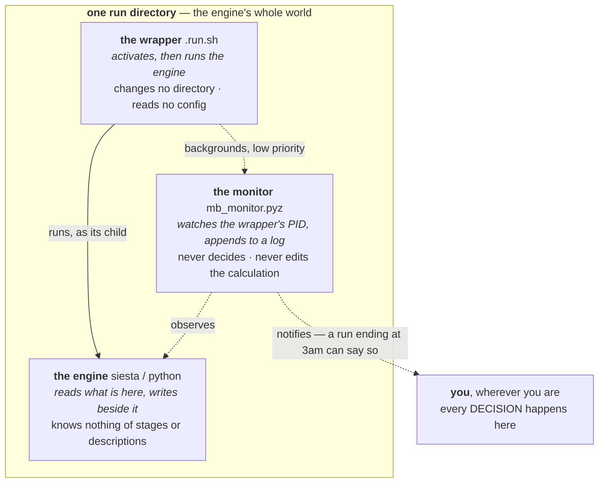
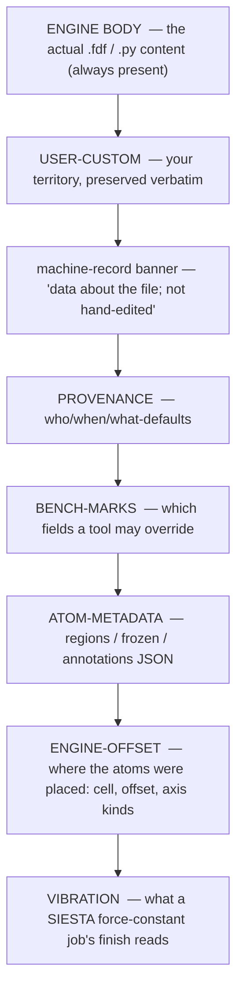
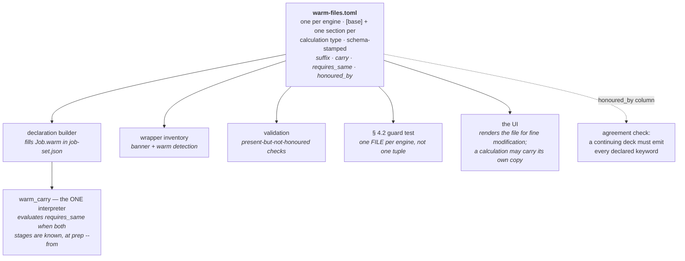

# Job contracts — the on-disk formats and shared vocabulary

**Role:** contract
**Domain:** execution

**Companions:**
[`execution/running-a-job.md`](?doc=execution/running-a-job.md) — how you
actually run and watch **one** job today (the run wrapper, `molbuilder.json`,
checkpoints, how a run directory is read back);
[`execution/job-system.md`](?doc=execution/job-system.md) — the JobSet batch /
staged / HPC framework;
[`execution/overview.md`](?doc=execution/overview.md) — the map plus the
current → target status picture.

**Settled contracts this doc leans on:**
[`model/structure-molstruct.md`](?doc=model/structure-molstruct.md) (the
`.molstruct.json` sidecar it round-trips with),
[`model/structure-annotations.md`](?doc=model/structure-annotations.md)
(`regions` / `frozen_atoms` / annotation channels),
[`model/overview.md`](?doc=model/overview.md) (the 0-based-internal /
1-based-user atom-index rule), and
[`engines/overview.md`](?doc=engines/overview.md) (the UI → config → script
boundary contract and the script-wrapper contract that this doc's script
blocks physically implement).

This document is the sole source of truth for the **stable on-disk shapes**
that every other part of molbuilder rests on: where a run's files live and
what they are called, the reserved comment blocks inside a generated script,
how a script resumes (or refuses to resume) from a previous run, the object
that carries a finished run forward into the next calculation, and the
system-wide vocabulary for persisted files and parameters.

These formats are deliberately **surface-agnostic and workflow-agnostic**.
The same run directory, the same `.fdf` blocks, and the same handoff object
are produced whether you described the calculation in the web UI or from a
terminal, and whether it is one stage or a hundred. That is the point of pinning
them here once: every surface reads and writes to this contract instead of
inventing its own.

---

## The short version

**Every stable on-disk shape, one section each.** The files you will
actually open, and who writes them:

| file | what it is | writer | section |
|---|---|---|---|
| `task.json` (`molbuilder/task@1`) | the description: engine, shape, stages, bench axes | `init` / Task-setup save | § 2 |
| `<label>.template.toml` | the answers, narrowed to one engine | `init` | § 2 |
| `environment.json` (`environment@2`) | what a machine IS: topology, domains, ceilings | `jobset probe` | § 6.1 |
| `job-set.json` | floor 3 — the derived work list | `prep`, on the target | § 2 |
| `<label>.run.sh` / `.sbatch` | the wrapper + submission script, with reserved `=== molbuilder ... ===` blocks | `prep` | § 3 |
| `run.json` (`run-launch@1`) | where an attempt was SENT (domain/partition/qos, job id) | `launch` | § 6.1 registry |
| `<basename>-runN.concluded` | the wrapper's last act on its main line: *run N is over*, its rc inside — one per run index, none after a forced stop | the wrapper's main path | `project-layout.md` § 1.6 |
| `<basename>-runN.monitor.log` · `-runN.util.csv` | what the job LANDED on (`[MACHINE]` first), how it went, and what it used | the monitor | § 2.2; `run-reports.md` § 2.5 |
| `bench-result.json` | the measured sweep — the archival record (the report is PRINTED, not written: `job-system.md` § 7.1) | `summarize` | § 2 |

Reserved script blocks (provenance, bench-marks, resume) are § 3; the
warm-file vocabulary (what carries a run into the next) is § 4.

---

## 1. What this document owns — a reader's map

| If you need to know… | Read § |
|---|---|
| Where a job's files go and what they are named | **§ 2 — The run directory** |
| The `project / topic / structure` folder tree and its fixed topic names | **§ 2.5** |
| The comment blocks molbuilder reserves inside a `.fdf` / `.py` / `.run.sh` | **§ 3 — The generated-script contract** |
| What "warm restart", `--continue`, and `--cold` actually do | **§ 4 — Warm & cold restart** |
| How a finished run flows into the next calculation | **it is CITED** (`archive/2026-09-01-transport-design.md` § 4.1) — the handoff-bundle contract retired 2026-08-29 |
| What a persisted file is called system-wide, and how a config value becomes a SLURM flag | **§ 6 — The shared data vocabulary** |

Two conventions bind everything below and are stated once here:

- **Atom indices are 0-based internally, 1-based only at the human edge.**
  Every JSON payload in this doc (`regions`, `frozen_atoms`, ATOM-METADATA,
  the sidecar) uses **0-based** indices. Engine input *coordinate blocks* use
  the engine's own convention (SIESTA `.fdf` is 1-based). The full rule and
  its single conversion boundary live in
  [`model/overview.md`](?doc=model/overview.md).
- **Schema versions are checked, never guessed.** Persisted artifacts carry a
  version; a reader that meets a newer major refuses with a clear message
  rather than mis-parsing. The one shared helper is `molbuilder/persist.py`
  (§ 6.2).

---

## 2. The run directory

### 2.1 What the engine assumes, and the two rules that serve it

Both rules below are consequences of one premise, so it is worth stating first.
Everything molbuilder does around a run exists to make it true.

> **The engine runs inside one directory, and that directory is its whole world.**
> It needs the right environment and every file it will read to be reachable from
> there. It has **no knowledge of how the directory came to be** — no notion of a
> stage, a description, a benchmark, a checkpoint or a previous run — and it does
> not care. It reads what is there and writes its output beside it.

Three things follow immediately, and each is a rule elsewhere in these documents:

| Because the engine… | …molbuilder must |
|---|---|
| has no notion of a **stage** | resolve every stage parameter **before** the deck is written. A deck that needed a reader to understand the word "stage" would not run (`engines/stages.md § 1`) |
| cannot fetch anything | put **everything the run will read in place before it starts** — which is why a carried restart file is copied at prep rather than resolved later (`project-layout.md § 1.6`), and why a stage may **declare** what it needs (below) |
| assumes the environment is already correct | give the wrapper exactly two jobs — **activate, then exec** — and do every decision and arrangement in Python beforehand (`running-a-job.md § 2.2a`) |

> **One carve-out, stated rather than smuggled** *(U-program follow-up,
> 2026-08-12 — § 2.6's wrapper carried this while the rule above read as
> absolute, and the two documents conflicted)*: the wrapper may probe **the
> engine build it is about to run** — `siesta --version` for its
> MPI/OpenMP parallelisations, deciding the launcher form (`mpirun` vs
> direct). That fact does not exist before the run: the binary on the
> target's PATH at run time may have been rebuilt since `prep`, and baking
> the answer would pin yesterday's build to today's launch. The carve-out
> is bounded by what it reads: the probe consults the ENGINE itself, never
> a config file, the description, or anything molbuilder wrote — those all
> had their one moment earlier, and § 8 of `running-a-job.md` still holds
> (**nothing reads config at run time**).

**"Reachable from there" is the precise word, not "physically present."** A
symlink to `../Au.psml` opens as a real file from inside the directory, and the
engine cannot tell the difference — so sharing one copy of a large
pseudopotential across stages is invisible to it, and legitimate.

#### A stage may declare what it needs: `required`

*Added 2026-08-08 (user).* Continuing a relaxation implies a known set —
`.XV`, `.DM`, `.CG` — because that is what *continuing* means. Some runs need
something else: a TranSIESTA scattering calculation cannot start without the
`.TSHS` an electrode run produced, and nothing about `restart: continue` says so.

**`required` is to be an ordinary config field**, so a stage sets it through
`overrides` like `mesh_cutoff`, and `stages.md § 2`'s *"a stage is a name, an
enabled flag, and the cells that differ — and no others"* stays exactly as it
was. No new stage mechanism, no fourth key in the description.

> ⚠ **Neither half of this is built, and the design is stated here in full so
> the two halves land together** *(recorded 2026-08-16)*. § 4.4 has said since
> 2026-08-11 that the **check** is unbuilt. The **field** is unbuilt too, which
> is the more basic gap and was nowhere stated: the catalogue carries no
> `required` item, so `resolve` refuses the example below — *"override(s)
> 'required' name no field of `SiestaConfig`. A stage may override any field of
> the shared schema, but only a field of it."* That refusal is correct
> behaviour (`stages.md` § 6.1: a description names fields, it never defines
> them), which is exactly why the field has to be **added to the catalogue**
> before a stage can carry one — a stage cannot introduce it. Building the
> check without the item would give the wrapper a list nothing can produce;
> building the item without the check would let a description declare a
> requirement nobody verifies.

```jsonc
{ "name": "scattering",
  "overrides": { "required": [".TSHS", ".TSDE"] },
  "execution": { "restart": "continue" } }
```

Extensions, not filenames: molbuilder prepends the run id, so a stage cannot
name another calculation's file by accident — which is the mixing this document
spends § 2.1 Rule 1 preventing.

**It is a claim, not an instruction**, and that is the whole reason it is worth
having. *"Carry this for me"* can only be obeyed; *"this stage cannot run
without this"* can be **checked** — see § 4.4, which is the only place with a
definite answer.

> **What it does NOT change.** In the flat shape nothing is carried at all: every
> stage shares one directory, so a declared file is either there or it is not.
> In the hierarchical shape `prep` links it in beside the standard set. Same
> declaration, two different pieces of work behind it, and the *check* is
> identical in both — which is what makes it a property of the stage rather than
> of a layout.

> ⚠ **Which is why the transportable unit is the calculation folder, not the run
> directory.** Completeness here is a property of *what resolves*, not of what
> sits in the directory. Archive a lone `run-0/` and its links to the deck and
> the shared package dangle — it was never self-contained, only self-contained
> *in place*. Move the whole calculation folder and every link stays inside it.

**Who puts the engine in that directory: the launcher, and only the launcher.**
Both deployment paths do the same one thing, and neither the wrapper nor the
engine ever navigates:

| Path | How the directory is established |
|---|---|
| **workstation** | the launcher runs the job's `.run.sh` **with its working directory set to the job's directory** |
| **SLURM** | the launcher runs `sbatch` **from** that directory, and SLURM lands the job in `SLURM_SUBMIT_DIR` — the same place |

So one rule covers both: **the caller's working directory is the contract.** The
wrapper inherits it and changes it for nothing; outputs land where the wrapper
was invoked -- the wrapper's own files because it writes them there, the
engine's because SIESTA writes where it runs and the wrapper runs a PySCF deck
by its bare name from there, and a PySCF deck writes beside itself (§ 4.2).
A wrapper that navigated would break the property the engine depends on — that *here* is where everything is — and it would break it differently under
the two launchers, which is worse than breaking it consistently.

This is not a rule the design is asking for. It is how the shipped submit path
already works, in one line per mode, and the generated wrapper says so in its own
header: *"this wrapper does NOT change cwd… the caller's cwd is the contract."*
It is written down here because it was true everywhere and stated nowhere — and
because the one place it was broken (a rendered block that `cd`s into an attempt
it created) was retired for exactly this reason
([`project-layout.md`](?doc=execution/project-layout.md) invariant 6a). ✅ **Since 2026-08-10 the rule has no exception**: no generated
wrapper contains a `cd` on either engine, which is `project-layout.md`
invariant 6a.

#### The third party in the directory: the monitor observes, and only observes

A wrapper activates and runs the engine as its child. An engine reads and writes. There is one more
thing in that directory, and it has the narrowest job of all.

**The monitor runs beside the engine and watches it** — every engine's, from one
file, `mb_monitor.pyz`, which holds the framework's own readers and travels
with the job ([`run-reports.md`](?doc=execution/run-reports.md) § 2.3). The
wrapper backgrounds it at low priority, and it follows the wrapper's **PID** —
so it knows authoritatively when the run ended, rather than guessing from
output markers. It reads the run's files as they grow and appends what it
learns to its own log beside them. The wrapper stops it and says why — SIGTERM
at the job's end, SIGUSR1 before a warm retry, which is not an ending — and
waits for its closing lines ([`run-reports.md`](?doc=execution/run-reports.md)
§ 2.4).

**It carries the notifier, and that is why nobody has to be at the cluster**: a
run that ends at 3 am can say so. The calculation states *when* to speak and to
*which channels, by name*, in `task.json`'s `notify` block
([`stages.md`](?doc=engines/stages.md) § 6.9); what a name resolves to is the
user's own file on the machine that runs the job, which never travels with the
description ([`run-reports.md`](?doc=execution/run-reports.md) §§ 1, 3). What
should happen when something notable occurs, and how often, is the user's to
decide, not molbuilder's.

> **And the boundary that makes it safe: the monitor observes and notifies. It
> never decides, and never mutates the calculation.**
>
> This is the same rule the wrapper has — activate and exec, nothing more — one
> layer further out, and the reason is the same. A compute node is where work
> happens, not where decisions are made. So the monitor does not take
> checkpoints, does not prepare the next stage, does not retry, and does not edit
> the description, even where it is the only thing present and would technically
> be able to. Something that both watches and acts would be deciding on your
> behalf, on a machine you are not at, about a calculation whose worth only you
> can judge.


```mermaid
flowchart TB
    subgraph DIR["<b>one run directory</b> — the engine's whole world"]
      direction TB
      W["<b>the wrapper</b> .run.sh<br/><i>activates, then runs the engine</i><br/>changes no directory · reads no config"]
      E["<b>the engine</b> siesta / python<br/><i>reads what is here, writes beside it</i><br/>knows nothing of stages or descriptions"]
      M["<b>the monitor</b> mb_monitor.pyz<br/><i>watches the wrapper's PID, appends to a log</i><br/>never decides · never edits the calculation"]
      W -->|"runs, as its child"| E
      W -.->|"backgrounds, low priority"| M
      M -.->|"observes"| E
    end
    U["<b>you</b>, wherever you are<br/>every DECISION happens here"]
    M -.->|"notifies — a run ending at 3am can say so"| U
```

**Three parties, three verbs: the wrapper activates and runs, the engine reads
and writes, the monitor watches and tells.** Nothing in that directory decides
anything; everything that *decides* runs where the user is
(`checkpointing.md § 9`).

**Rule 1 — one job per directory.** Every job lives in its own directory. A
directory may hold *several inputs* (one per stage of a staged relaxation,
§ 2.3) plus the engine's outputs and restart files, but never inputs for a
**different** job (a different molecule, a different `SystemLabel`). This is
not just tidiness — SIESTA's restart files (`<basename>.XV`, `.DM`, `.CG`)
are unprefixed within the directory, so a second job's `SystemLabel` would
overwrite them. PySCF inherits the same one-job rule through its
trajectory writer and checkpoint file.

**Rule 2 — every file shares one basename.** Each file the generator writes
and a reader later opens carries the same **basename**:

- **SIESTA** — the basename **is** the `.fdf`'s `SystemLabel`.
- **PySCF** — the basename **is** the script's `JOB = "…"` literal.

**Same kind, one validator, two mechanisms — and the difference decides how
each is READ BACK.** `config/siesta.py::_validate_basename` serves both
`SiestaConfig.system_label` and `PySCFConfig.job_name`, so *what a basename may
be* is one rule. *How it is written* is not: a `SystemLabel` is an fdf
directive holding a bare token, a `JOB` is a **Python string literal where the
quotes are syntax, not value**. A SIESTA reader therefore never strips quotes
— the alphabet below admits none, so one in a deck is a hand-edit this
validator would have refused — while a PySCF reader always does, because there
they are how Python spells a string. That asymmetry is the two formats', not a
disagreement between two readers, and it is stated here because it has been
re-derived from the regexes more than once.

**Prefer verifying to extracting.** `pyscf/layout.py` does not parse the name
out of a deck; it takes the identity the deck was written FOR and checks the
deck states it. That tolerates both emitted spellings by construction (the
optimization deck writes `JOB = "name"`, the vibration deck an aligned
`JOB   = 'name'`) and answers the question that matters — *did we get the right
result* — rather than *what token is in there*.

The basename must be a single token matching `[A-Za-z0-9_-]+` — no spaces,
dots, or slashes. Generators reject anything else at the form / CLI boundary
(`molbuilder/projects.py`, `_NAME_PATTERN`). Across the stages of one staged
relaxation the basename **stays identical** (only parameters change); that is
exactly what lets SIESTA pick up `<basename>.XV` / `.DM` from the previous
stage. (The run *wrapper* accepts a slightly wider set, `[A-Za-z0-9._-]+`, at
`molbuilder/runwrap.py`, because a `SystemLabel` may legitimately carry a
dot.)

### 2.2 The file catalogue

**The manifesto is `molbuilder/runfiles.py::WRITTEN`**, and this section is its
reading. It declares **every file molbuilder writes into a calculation
folder** — the run's files and the calculation's own, `task.json` to the
conclusion marker — one row each *(B13, user, 2026-10-04)*:

| column | what it says |
|---|---|
| the name | a **role** on the label (`.molwatch.log`, composed by § 2.2a's grammar), or a **fixed name** (`task.json`, `calcdir.json`) |
| where it sits | the level — the calculation root, a stage, a run, a benchmark, a launch folder — and **its spelling in each shape** where the two differ: an attempt's `run.json` and `.continued-from` are a flat stage's `<base>.run.json` and `<base>.continued-from` |
| what it holds | one line a person reads |
| who writes it, and when | the verb or the program, and the moment — setup, prep, launch, run, summarize |
| its door | the one function its readers ask (`architecture.md` § 3.2) |
| its kind | source · input · derived · record · result · transient (`project-layout.md` § 5) |

and, as before, whether it carries a stage token and the run index, which engine
and which calculation write it, and whether it is evidence of how a run went
(§ 5.5 of `model/parse.md`). **A fixed name's owner takes it from the
catalogue** — `task.json`'s from the row `task.py` reads, `calcdir.json`'s from
the row `calcdirs` reads — so a name is spelled once.

Its readings, and nothing else may hold a copy:

* `runfiles.patterns()` — the glob family, which **is**
  `identity.OUR_FILE_PATTERNS` and from which `runwrap`'s `--cold` sweep derives
  its *"except what molbuilder wrote"* exception;
* `runfiles.manifest(label, stage, engine, when, calculation, shape)` — the
  concrete names a stage will have, in the shape it has, which is what the
  Task-setup tab shows a person before they spend a queue slot;
* `about(path)`, the run door's (`architecture.md` § 3.2) — what one file is: its
  row, read back with its run's label, or *not written by molbuilder* — which
  the Results tab's file card shows (`web/results.md` § 3b);
* [`project-layout.md`](?doc=execution/project-layout.md) § 5 — the manifest,
  rendered from the rows (`tools/manifest.py`); a check fails when the two
  differ, so a row is edited in the catalogue and never in the document.

**Only our half can be complete, and that is the point.** An engine's output set
depends on its version and on which options are on, so enumerating *that* is a
snapshot pretending to be a rule. What we write is knowable, because we write
it — so *"did the engine leave something here"* is answered by **subtraction**
(§ 4.2): anything named after the label that is not ours came from the run.

That makes an *omission* a real defect, not untidiness. Measured 2026-09-07 by
rendering both PySCF decks and asking `identity.is_ours` of every name they
choose: `_initial.xyz`, `.constraints.txt` and `.spectra.json` were on neither
list, so a run's own spectrum was classified as the engine's restart state and
`--cold` offered to clobber it. The same sweep found geomeTRIC's opt log listed
under `{label}_geom_*.log` — the spelling from before § 2.2a fixed the token's
position, matching nothing that is written.

**Every file, with who writes it and the one door that reads it, is the
manifest — [`project-layout.md`](?doc=execution/project-layout.md) § 5** —
both shapes, every level, the engines' own files beside ours. This section
keeps the catalogue's rules; the rows are the catalogue's, and a list here
would be the second copy this section exists to prevent.

What molbuilder writes is declared in `WRITTEN`; the restart files an engine
writes — SIESTA's `.XV` / `.DM` / `.CG`, PySCF's `_optimized.xyz` / `.chk` —
are declared in each engine's `warm-files.toml` instead, and the two
declarations are **disjoint by construction** (a file is the engine's restart
state *or* one we wrote, never both; the suite checks it).

The `.molwatch.log` is the progress channel every run has. Prep seeds it — the
initial geometry as step 0 — before the engine starts, so a viewer pointed at a
prepped run finds something; PySCF's deck writes each step into it, and SIESTA
never does, so a SIESTA run's trajectory is its `.out`, which a viewer is
offered first (`runfiles.result_roles`, `model/parse.md` § 5.5).

> **Drift corrected (2026-07-27):** the old catalogue listed engine stdout as
> a static `my-job.out` / `my-job.log`. The wrapper now writes a **run-indexed**
> `my-job-runN.out` (SIESTA) and `my-job-runN.pyscf.log` (PySCF); `my-job.log`
> is PySCF's own logger (`mol.output`, `model/parse.md` § 5.5) and
> geomeTRIC's is `_geom.log`. *(This note said "the `.log` family is
> geomeTRIC's own logging" until 2026-10-04.)*

**Why PySCF's stdout is `.pyscf.log` and not `.out`.** It used to be `.out`, and
that collided with SIESTA's `.out` — which is not stdout at all, but a structured
text format SIESTA's Fortran writes. The Results tab picks a viewer by suffix, so
a PySCF log got handed to the SIESTA trajectory reader, which rendered garbage.
The rename fixes it three ways: `.log` is honest (the file *is* a capture of
stdout + stderr, not a calculation output), the `.pyscf.` infix pins which engine
produced it for anyone scanning a directory, and the distinct suffix lets the
viewer dispatch correctly. Worth knowing before anyone "tidies" the extension
back.

### 2.2a The name grammar — one form, composed and parsed in one place

§ 2.1's rule 2 says every file shares one basename, and § 2.3 says only
per-stage derived files carry the stage token. Both were true and neither was
**sayable**: the catalogue above listed the names as literals, and every writer
and reader built its own by concatenating strings. So the same file had several
spellings, each correct at the site that wrote it.

**Measured, 2026-09-07 — one file, six beliefs, one of them right:**

| where | thought geomeTRIC's trajectory was |
|---|---|
| `pyscf/input.py` (the writer) | `<label>_geom_<stage>_optim.xyz` |
| `pyscf/warm-files.toml` | `<label>_geom_optim.xyz` |
| `parse/engines/pyscf.py`, the message shown to the user | `<stem>_geom_optim.xyz` |
| `parse/engines/pyscf.py`, module docstring | `<JOB>_geom_optim.xyz` |
| `parse/engines/pyscf.py`, the reader's format hint | `<job>_geom_optim.xyz` |
| § 2.2's own catalogue, one row above | `my-job_geom_optim.xyz` |

Only the writer was right, so on a staged run the parser told a person to open
a file that does not exist, and the warm-file carry looked for one too. Nothing
failed: a missing warm file is a legitimate state, so the ladder simply started
cold and said nothing.

**The grammar.** Four segments, and every run file is some of them:

```
<label>[_<stage>][-run<N>]<role>

my-job.chk                        carried: no stage, no attempt
my-job_optimized.xyz              carried, role-style separator
my-job_01_coarse.molwatch.log     this rung's
my-job-run2.out                   this attempt's
my-job_01_coarse-run2.out         this rung's second attempt
```

**The two separators are the grammar.** § 6.3 already said half of it — *"a
hyphen announces `a counter follows`"* — and this section supplies the other
half: a stage is not a counter, it is a name. So
`_` introduces the stage and a hyphen a counter, and neither can be read as the
other. That rule is what makes the name reversible; without it `parse` would be
guessing, which is what the call sites doing their own splitting were.

**A counter is a CLASS, not one keyword** (`runfiles.QUALIFIERS`). The hyphen's
meaning is *"a declared keyword and a number follow"*, and the declaration holds
one entry today — `run`, the wrapper's attempt. It was a literal `-run(\d+)`
written into the parser in three places until 2026-09-07, which made a second
counter a parser edit; it is now a line in that tuple, and `compose`, `tail` and
`parse` all read the class off it. Counters are emitted in declared order, so
one name has one spelling, and a name whose counters arrive in another order is
not read as counters at all — it would otherwise produce a `RunFile` whose own
`name` differs from the string it came from.

**A bench point is deliberately not a counter.** It is a whole *label*
(`bdt-G1K4C6`), because a trial's warm files must never meet the run's
(`project-layout.md` § 2.3.2), and a qualifier would put them back in one
name-space. Measured: `bdt-G1K4C6_01_coarse-run2.out` parses as that label with
the same three segments one level down, and returns None against `bdt`. The
same measurement is why the name carries no **engine** segment either — the two
engines' roles are already disjoint, in both what they leave behind (`.XV` /
`.DM` against `.chk` / `_optimized.xyz`) and what molbuilder writes for them
(`.fdf` against `.py` / `.pyscf.log` / `_geom.log`), so a segment would restate
what the suffix says; and the files that are genuinely shared belong to the one
wrapper that runs both engines, so a token on `.run.sh` would be a claim about
the file that is not true of it. A carried file settles it: it is found *by
name* by the next rung, which may be the other engine (a SIESTA relaxation into
a PySCF spectrum), so a name saying which engine wrote it would be invisible to
the rung that wants it (user asked, 2026-09-07).

- **`<label>`** is § 2.1's basename — the `SystemLabel` / `JOB` literal.
- **`<stage>`** is the artifact token (`01_coarse`), and it sits **immediately
  after the label**, never inside the role. That position is not a preference:
  every other per-stage file already used it (`.py`, `.run.sh`, `.out`,
  `.molwatch.log`, `.validation.txt`), so the geomeTRIC pair was the single
  exception, and moving one file is cheaper than moving five (user ruling,
  2026-09-07).
- **`<role>`** is what the file IS, and it begins with `.` or `_`. A role is
  declared once per engine in that engine's `warm-files.toml` vocabulary; it is
  never spelled at a call site.

**A carried file has no stage token, and that is what carrying means.** SIESTA's
`.XV` / `.DM` / `.CG` and PySCF's `.chk` / `_optimized.xyz` are how one rung
hands the next its geometry and density, so a token in them would make every
rung look for a file only its own stage ever wrote.

### Which door to call — before you write code that names a file

**Rule A14** (`architecture.md` § 7). If you are about to build, find, glob or
split the name of a file a run produces, you are calling `runfiles`. There is no
case where concatenating one is right, and the table says which door each case
is:

| you have… and you want… | call |
|---|---|
| a label, a role, maybe a stage and an attempt → **the name** | `compose(label, role, stage=None, run=None, **counters)` |
| a filename → **its segments back** | `parse(filename, label, roles=())` — pass your engine's roles when a role of yours begins with `_` |
| a label and a stage → **the part every role attaches to** (your tail is not a role: a log suffix, a directory) | `stem(label, stage=None)` |
| a role, but the label only exists at **run time** (you are emitting it *into* a generated script, next to its own `JOB` / `SystemLabel`) | `tail(role, stage=None, run=None, **counters)` |
| a name → **does it cross rungs?** | `is_carried(name_or_runfile, label="")` — takes a `RunFile` or a filename |
| a label and a rung → **every file that will appear, with a line each** | `manifest(label, stage, engine, when, calculation, shape)` |
| **all the files molbuilder writes**, as globs | `patterns()` — and `identity.OUR_FILE_PATTERNS` already *is* this |
| a folder and a label → **which of its files are that label's** — molbuilder's, and the engine's own named on it | `find(directory, label, role=, stage=, run=)` — read back through `parse`; which of them molbuilder wrote is `about`'s (§ 4.2: the rest, under the run's name, is the engine's); `latest_run` for the newest run index |
| a folder and a dotted role, before anything has said whose it is | `find_by_role(directory, role)` |
| **a file → the run it belongs to**, its label, stage and run index, and that run's other files | `run_of(path, stage=)` → `Run` — `stage` when a folder several stages share is asked about one of them — and its files: `Run.file(role, run)`, `.deck`, `.stdout`, `.outputs`, `.session_log`. The run door (`architecture.md` § 3.2), which reads the label from the description, never from a deck or the name |
| **a file → what it is**: its row, or *not written by molbuilder* | `about(path)`, on the run door |
| a name you already know is one of your run's outputs → its role | `role_of(name)` — never for a name met in a folder: that one is read back with its label (`about`), or SIESTA's `fdf.<stamp>.log` reads as a log of ours |
| a new kind of file | add a row to `WRITTEN`; do not spell its suffix at the call |
| a new counter (`-try2`, `-seg3`) | add the keyword to `QUALIFIERS`; the parser needs no edit |

**Never do these**, each of which has cost us a defect that is written up in
this section: build a name with `f"{label}_{token}{suffix}"`; write a role
literal (`".molwatch.log"`, `"_geom_optim.xyz"`) at a call site; glob for one
with a star you placed by hand; split a name on `_`; key a name on a stage's
*position* rather than its token; or read `""` as "no ladder" — say
`token or None` and mean it.

**A name is correct because it came out of a checked generator**, not because a
search of the output failed to find something wrong. That is why the suite for
this is one file driving `compose`/`parse` over the product of their segments,
and not a check beside each writer.

**One module owns the grammar and the catalogue** — `molbuilder/runfiles.py`:

```python
QUALIFIERS                                  # the counters a `-` may introduce
compose(label, role, stage=None, run=None, **counters) -> str
parse(filename, label, roles=())             -> RunFile | None
stem(label, stage=None)                     -> str        # what a role attaches to
tail(role, stage=None, run=None, **counters) -> str       # for a script that
                                                          # knows its label only
                                                          # at run time
is_carried(name_or_runfile, label="")       -> bool
find(directory, label, role=, stage=, run=) -> list[(Path, RunFile)]
find_by_role(directory, role)               -> list[Path]  # dotted roles only
latest_run(directory, label, stage=, role=) -> int | None
role_of(name)                               -> str | None  # a known output's
WRITTEN                                     # the catalogue (§ 2.2)
patterns()                                  -> tuple[str] # the glob family
manifest(label, stage, engine, when, calculation, shape) -> list # the names,
                                                          # with a line each
```

`tail` exists because a generated deck names its own outputs from its own `JOB`
/ `SystemLabel` variable, so the emitter can only supply what follows the label.
Cutting that off a real `compose` result is what keeps it honest — assembling it
beside one is how geomeTRIC's prefix ended up with the token in the wrong place,
in *two* decks (the optimization deck, fixed 2026-09-02; the vibration deck,
which nothing checked, fixed 2026-09-07).

`parse` **takes the label**, and that is what makes it exact rather than
heuristic: a role may contain underscores (`_geom_optim.xyz`) and so may a
label, so nothing can find the boundary between them by looking at the string.
Sites that split on `_` disagreed — one read `my-job_01_coarse_geom_optim.xyz`
as stage `01`, another as `01_coarse_geom`.

**The generator is the guarantee, and it is tested as one.**
`tests/test_runfile_names.py` drives `compose`/`parse` across the product of
their segments and asserts the round trip, plus what each segment refuses — a
label that could not be read back, a malformed stage, a stage *position* (the
old `-stage<N>` habit, refused as a wrong type), a run that is not an attempt
count. A name is then correct because it came out of a checked generator, not
because someone searched the output for a pattern and found nothing.

**And the resolved names are shown before anything runs.** The Task-setup tab
asks `manifest` for each rung and lists what will appear, with a line saying what
each file holds (`task-setup.md` § 7.1). It is a *reading* of the catalogue, not
a copy of it: nothing is written to disk that a reader would then have to keep in
step. A reader that wants the names calls `manifest` with the label, the token
and the engine, which is cheaper than a stored list and cannot go stale.

### 2.3 Multi-stage runs

A staged relaxation (coarse → tight) keeps its stages together, and the
`SystemLabel` / `JOB` basename stays **unsuffixed** — so SIESTA's `.XV` / `.DM`
/ `.CG` restart files transfer cleanly between stages (`MD.UseSaveXV`,
`DM.UseSaveDM`, `MD.UseSaveCG`). Only per-stage *derived* files carry a suffix,
and **there is one convention for it**:

- **The staged ladder** — the ladder from `task.json` (an engine config carries
  no stage list; that field was **deleted** 2026-08-07 —
  [`engines/stages.md`](?doc=engines/stages.md) § 1.1), each stage's deck
  rendered by `prep` step 3 through the engine seam (`jobset/prep.py`, calling
  `siesta/input.py::render_fdf` per resolved element) and the plan written as
  `job-set.json` by the same `prep` *(until 2026-08-12 this named
  `render_siesta_stage_fdfs` and `stages_to_jobset` as the renderers — both
  deleted in the fold, step 6 u5; the JobSet is derived from the description,
  never emitted beside it)* — names each stage's input `.fdf`
  and stdout `.out` from the stem **`<label>_<NN>_<name>`**: an **underscore**
  joining the label, the stage's assigned ordinal and its name (the shipped
  ladder's names are `coarse` / `medium` / `tight`).  The stdout additionally
  carries the wrapper's run counter — `<stem>-run<N>.out` — in EVERY shape
  (one emitter; the attempt directory disambiguates in the hierarchy and the
  counter does in flat, but the filename is the same in both — D18d,
  2026-08-12):

  ```
  bundle-or-dir/
  ├── my-job_01_coarse.fdf   my-job_01_coarse.out
  ├── my-job_02_medium.fdf   my-job_02_medium.out
  ├── my-job.XV / .DM / .CG          ← unsuffixed, carried between stages
  └── my-job.STRUCT_OUT              ← final geometry, after the last stage
  ```

  > **The deck, the stdout and the monitor log all carry the same token.**
  > `molwatch_log_basename` takes it, and every reader reads it back through
  > § 2.2a's `parse`, with the run's label from the run door
  > (`architecture.md` § 3.2) — so a stage's files can always be matched to
  > each other by name (`identity.stage_token` composes the token). **There is
  > no second grammar**: a reader that cuts the token out of a name its own
  > way reads no stage from `<base>-run0.scf-timing.log`,
  > `<base>.runwrap-<stamp>.log` or `<base>.continued-from`, and a stage
  > `coarse_geom` from geomeTRIC's log *(measured 2026-10-04; none reads a
  > name its own way now -- `runstatus._label_of` went with plan W56 3b.3, the
  > PySCF parser's `_resolve_job_token` with 4d)*. *(This
  > named `identity.parse_stage_token` as the reader until 2026-10-04.)*
  >
  > **The underscore is load-bearing.** A hyphen announces *a counter follows*
  > on this document's own terms, and a stage is not a counter — it is a name
  > with an assigned ordinal.

**One multi-stage execution shape, both engines** *(since 2026-08-18 —
`stages.md § 1.1a`)*: each stage is a separate process invocation writing its
own `<label>_<token>.molwatch.log`. *(A second shape existed until then —
PySCF's in-script ladder, `cfg.stages`, one process writing a single
unsuffixed log. The field, the loop, and the `cfg.stage` marker are all
retired.)*

**STAGES ARE SEPARATE RUNS, AND NOTHING JOINS THEM** *(user ruling,
2026-09-05)*. A ladder is separated **by filename** in a flat directory
(`<label>_<NN>_<name>.molwatch.log`) or **by directory name** in a
hierarchical one. The person picks one stage, inspects it, and judges what it
means — which stage to look at, and what to do next, is theirs to decide.
There is no combined view, and the viewer offers none: a directory resolves
to exactly ONE file (§ 2.4).

Comparison across runs is a different question with a different answer — the
bench summary, where comparing IS the point (`web/bench-summary.md`).

*(A merge stood here from 2026-05-10 until 2026-09-05: a directory with more
than one `.molwatch.log` was stitched into one trajectory in mtime order,
with a dashed divider per stage. It was written before the Results tab had a
file picker, and it was never reachable from that tab — only by typing a
directory into the Watch loader bar. Deleted with its cache, its `stages`
wire key, its `step_indices` key that nothing read, and its plot dividers.
Three defects went with it: mtime is not ladder order, because prep seeds
every stage's log up front, so unrun stages sorted FIRST and a part-run
ladder opened with its real curve last and its dividers labelled `02 | 03 |
01`; the chained elapsed double-counted the queue wait, reading 61 minutes
for a job that spanned 41 and computed 12; and a failed middle stage's error
was erased by the next stage's silence.)*

### 2.4 Resolving a directory

When a reader (the Results tab's viewer, or `molbuilder watch`) is handed a
**directory** instead of a specific file, the run door answers which ONE file
opens (`runs.openable`, `runs.folder_answer`; the rule is `model/parse.md`
§ 5.1–§ 5.2, the door `execution/architecture.md` § 3.2). What the folder is
decides it (`project-layout.md` § 1.4a):

* **a run of ours** — its files are read back with the label its description
  gives it (§ 2.2a); the run it speaks for is the highest stage launched, then
  that stage's newest run index (with none launched, its one prepped stage);
  and it opens at the first role its calculation produces
  (`runfiles.result_roles`) in which that run has a file a parser claims;
* **a container** — the calculation's own product at its root, when it has
  one; its runs are the folders below it;
* **a folder no calculation claims** — it holds no run of ours: the
  catalogue's dotted roles are tried, the calculations' products and the
  progress log first, then the engines' stdout, newest file first, each
  vetted by the registry; no label is read off a deck.

The search's trail (`attempts`) is the body of the refusal a person reads
when nothing matched. A path that is a regular **file** is loaded directly.

*(Until 2026-10-04 this section was a four-step chain — the newest
`*.molwatch.log`, then a label read off a `.fdf`'s `SystemLabel` or a `.py`'s
`JOB =`, then generic names: a search for a run molbuilder's wrapper did not
run, plan B11.)*

### 2.5 The project tree and the canonical topics

A calculation sits at the bottom of a three-level tree under the (git-ignored)
`projects/` root:

```
projects/
└── <project>/              e.g. "Au-thiol-junctions"
    └── <topic>/            one of the fixed names below
        └── <calculation>/  ← what the user typed. Its INSIDE is
                              project-layout.md § 1 — flat or hierarchical
```

> **`projects/` lives INSIDE the checkout, and that is load-bearing.**
> `.gitignore` carries `projects/*`, so the tree is a git-ignored directory
> *of the repository*, not an arbitrary location a user picks. Two
> consequences follow, and the second is why this is stated here rather than
> left as folklore:
>
> * walking up from any calculation to the directory named `projects` finds
>   the tree — this is `find_projects_root` and the anchor rule in § 2.5a;
> * **its parent is the molbuilder checkout.** So the same single walk that
>   locates the tree also locates the package, which means a calculation can
>   work out where molbuilder is *without being told* — no install into the
>   environment, no baked path, no `$MOLBUILDER_ROOT`.
>
> That second point is what makes a bundle portable to a machine where you
> may not be permitted to install anything, which is the normal condition on
> a cluster (user, 2026-08-22). A deployment that puts `projects/` somewhere
> else keeps the first consequence and loses the second; the launcher
> therefore still accepts `$MOLBUILDER_ROOT` as an override, and that is the
> only thing that override is for.

**The three levels above are organisational only.** What is *inside* the
innermost one is not this section's to say: it is
[`project-layout.md`](?doc=execution/project-layout.md) § 1, and it has **two
shapes**. Flat is one directory — the one-job shape of § 2.1, which is what
§§ 2.1–2.4 describe. Hierarchical gives each stage a directory and each attempt
a directory inside it.

> ⚠ **Corrected 2026-08-11.** This read *"the innermost `<structure>/` is exactly
> the flat one-job-per-directory shape of § 2.1 (**no sub-directories**, no
> nesting of restart files)"* — written when the flat shape was the only one, and
> never revisited. It is not a stale detail: **§ 6.3 declares this document the
> winner in any disagreement**, so a contract saying *no sub-directories* did not
> merely disagree with `project-layout.md`'s three-level tree — it **overruled
> it**, and by that reading the hierarchical shape was forbidden by the very
> document the rest of the design rests on.
>
> **The segment is also renamed here.** `<structure>/` said what the level held
> when a directory was one job about one structure; the level is the
> **calculation**, the name is what the user typed, and what makes it a
> calculation is the `task.json` inside it
> ([`run-identity.md § 3.0`](?doc=execution/run-identity.md), level ③).
> `projects.py` still spells the API `structure_dir` / `list_structures`; that is
> a code follow-up, not a second meaning.

Each path segment must match `[A-Za-z0-9_-]+`, and `<topic>` must be one of a
**fixed set of nine** canonical topics (`molbuilder/projects.py::
CANONICAL_TOPICS`). An open topic vocabulary is rejected on purpose: it would
fragment the tree across users and break the "compare the same analysis
across structures" intuition that motivated topic-first ordering.

| Topic | Kind | Used for |
|---|---|---|
| `structure` | storage | flat store of `.xyz` / `.pdb` / `.cif` inputs |
| `pseudopotential` | storage | project-local cache of SIESTA `.psml` pseudos |
| `optimization` | run | geometry relaxation |
| `frequency` | run | Hessian / vibrational frequencies + rigid-rotor–harmonic-oscillator (RRHO) thermochemistry |
| `spectrum` | run | Raman / IR / UV-Vis at an optimised geometry |
| `transport` | run | non-equilibrium Green's function (NEGF) / TranSIESTA device calculations |
| `single-point` | run | energy at a fixed geometry |
| `scan` | run | potential-energy-surface scans |
| `user` | free-form | a workspace with no rules inside it |

> **Drift corrected (2026-07-27):** the source doc said "six" (the run topics
> only). The set is now **nine** — two storage topics (`structure`,
> `pseudopotential`) and a free-form `user` workspace were added.

#### 2.5a `psml_lib` is a path inside the projects tree

*(One rule since 2026-08-28 — user: "psml-lib is always inside the
project directory"; the three-anchor spelling cascade that stood here is
retired. Resolution and containment go through the same `projects` door
the sidebar API uses, so the browser, the CLI, and a template cannot
disagree about what a path means.)*

| You wrote | It means | Refused when |
|---|---|---|
| `pseudopotential` (any relative path) | **that folder under the tree root** — the tree the calculation lives in, walked up from the calculation folder; the server's own `projects_root()` when validating before any folder exists | the folder is not there (the refusal names the tree it searched) |
| `/home/you/molbuilder/projects/pseudopotential` (absolute) | itself — a convenience spelling of the same fact | it lies **outside** the tree: there is no folder that spelling can honestly name under this rule |
| `./psml`, `../psml` | nothing — **retired** | always, with the reason: pseudopotentials already beside the calculation are used *without* this field (prep adopts them), so the dotted anchor had no remaining job |

Do not write the `projects/` prefix: paths are measured from the tree
root already, so `projects/pseudopotential` looks for a `projects/`
*inside* the tree — the refusal says so rather than silently stripping
it.

**Nothing is tried and discarded** (`architecture.md` § 7, A10): a
spelling names exactly one folder, and a miss is reported against that
folder — never a second guess against a different anchor.

**Which files are checked is which files are opened.** `prep` and the
settings gate read the pseudopotentials by one rule, `pseudos.psml_sources`:
the calculation's own folder first (`pseudos/`, then any left at its root),
then the `psml_lib` folder for what the calculation lacks. So a calculation
whose files sit beside it needs no `psml_lib`, and a library that lacks a
species the calculation already has refuses nothing. Before a calculation
folder exists (the Build tab's live check) only the library can answer, and an
unset one is a warning there — naming the tree's `pseudopotential` folder when
that folder covers the structure; the Send, which knows the folder it writes
into, asks the same rule of it and refuses until every species is covered
([`science/pseudopotentials.md`](?doc=science/pseudopotentials.md) § 1, plan
§ 5w K20). *(Until 2026-09-25 the gate read the library
alone and `prep` never told it the folder, so every transport rung — whose
files come with the citation — was told `psml_lib` was unset.)*

#### 2.5b Naming a calculation: from the root, and inside it

§ 2.5a is about a path that points at **data** inside the tree. A path
that points at a **calculation** is a different question, and it gets its
own answer (user, 2026-08-22):

| `--bundle` | means |
|---|---|
| omitted | the working directory |
| anything else | read from the **projects root**, uniformly — `<project>/<topic>/<calculation>` |

**And either way it must be inside the projects root.** `..` segments and
absolute paths are resolved and then checked, so no spelling reaches out of
the tree. A calculation outside the tree is not a calculation molbuilder
manages.

**One fence, not two.** The check is `projects.contain`, and the sidebar
backend's `_resolve_within_roots` calls the same function — it keeps only
what is genuinely its own (several allowed roots, first match wins, an
HTTP-shaped refusal naming them all). The rules that must not vary between
the two — refuse `..` on the raw spelling, expand `~` but never variables
(a 2026-06-14 disclosure fix), resolve **both** sides before comparing —
live in the primitive with their reasons attached. Two doors onto one tree
that disagreed about what is reachable would be one door too many.

The consequence worth stating: **you no longer have to stand in a
calculation to act on it.** `jobset launch bench coarse --bundle
Au-BDT-Au/optimization/Relax` works from anywhere, which is what lets the
CLI be run from wherever molbuilder happens to be importable rather than
from the job directory.

*(An earlier cut gave `--bundle` § 2.5a's dotted escape hatch, borrowing
`psml_lib`'s rule. That was the wrong borrowing: same shape of string,
different kind of thing.)*

##### Two kinds of citation, and only one starts at the root

A verb is handed two different sorts of path, and reading them as one rule
is the mistake to avoid:

| | what it addresses | measured from | example |
|---|---|---|---|
| **tree address** | a thing that lives in the tree — a calculation, a project, a structure file | the **projects root** | `--bundle Au-BDT-Au/optimization/Relax` |
| **inside-bundle address** | a part of one calculation — a stage, an attempt, a warm file | the **bundle** | `--from 01_coarse/run-0` |

**The second is not an oversight, and must not be "fixed" to match the
first.** A calculation is self-contained and travels: copy the folder to a
cluster and `01_coarse/run-0` still names the same attempt, while a path
from the projects root would name a tree that may not exist there. The
rule is therefore *what is the thing being addressed*, not *what shape is
the string*.

##### Where each verb stands today

| verb | takes | citation |
|---|---|---|
| `init`, `prep`, `launch`, `status`, `summarize`, `migrate` | `--bundle` | **tree address**, fenced to the root |
| `init` | `--structure` | **tree address** — a structure lives in `<project>/structure/` |
| `prep` | `--from STAGE/run-N` | inside-bundle |
| `init` | `--psml-lib` | § 2.5a's rule — a path inside the tree, measured from its root |

*(`probe --out DIR` stood here — a directory for the record — until
2026-10-02, when it was removed (user: "probe --out goes away"): the record's
place is its resolver's, `machine_scope_path` or `named_environment_path`,
and a probe run elsewhere is copied there, never written beside it.)*

**Every verb names a calculation the same way, through one declaration.**
`--bundle` is a single `click.option` shared by all six; the rule, the
fence and the refusal text exist once. `init` differs from the other five
in exactly one respect — its bundle **may not exist yet**, because it is
the verb that creates one — and that is a parameter of the shared option,
not a second option with its own semantics.

> **`init` was called `describe` until 2026-08-22.** Two things were wrong
> with the old form. The name: it is the only verb that was named after its
> output rather than its action, which is why a verb that creates a whole
> calculation read like one that prints a summary — `prep` does not write
> "a prep", `launch` does not write "a launch". And the addressing: it took
> two bare `click.Path` positionals read from the working directory, so it
> could create a calculation **outside** the tree that every other verb
> then refused to act on — a state reachable by following the tool's own
> help.
>
> The artifact keeps its name. What `init` writes is still **the
> description**, floor 2 is still the description floor, and
> `write_description` is still what writes it. A verb names an action; an
> artifact keeps its own noun.


> ⚠ **Do not write the `projects/` prefix.** `projects/pseudopotential` is a
> bare spelling that *starts with the tree's own name*, so walking up to the
> tree and joining it produces `projects/projects/pseudopotential`. The tree
> is what the walk-up finds; the path is what you want *inside* it. Say
> `pseudopotential`. *(Hint texts taught the prefixed form until 2026-08-21 —
> it is the spelling that cannot work.)*

`molbuilder/projects.py` exposes the tree API: `validate_name`,
`validate_topic`, `project_dir` / `topic_dir` / `structure_dir`,
`ensure_structure_dir` (mkdir -p), `projects_root` / `find_projects_root`,
and `list_projects` / `list_topics` / `list_structures`. *(A
`find_geom_candidates` scanned the tree for files named like a converged
geometry until 2026-10-05; no surface called it, and a run's files are read
through its run door, never by name across the tree.)*

### 2.6 The run wrapper — `.run.sh` and `.sbatch`

**`prep` writes the wrapper**, on the machine that will run the job, and on
the described route it is the only thing that does.  *(One recorded sibling writes beside it: a transport bias SCAN's launch
regenerates the chain-walker script `launch/<stem>-chain.run.sh` — the one
submission that walks the points — through the same emit conventions
(`jobset/submit.py::submit_transport_chain`).  The old side doors — the
pre-composite transport driver and the web install-wrapper endpoint —
retired 2026-08-29 / 2026-08-21.)*  The wrapper activates the
routed conda env and
executes the tool (`molbuilder/runwrap.py::render_run_wrapper`). Routing is by
extension:

> **One writer, and that is the design rather than an implementation detail.**
> `running-a-job.md` § 2.1 fixes tool availability, modules and config at
> **prep** and bakes them into the wrapper as literals; at runtime the wrapper
> may read only the allocation and the hardware. So the wrapper can only be
> written by something that knows the target machine — which is `prep`, and
> nothing else is in a position to.
>
> ⚠ **There is no `molbuilder run`** *(decided 2026-08-11, user)*. Everything
> about running a job is `molbuilder jobset …` — `prep` builds the directory and
> its wrapper, `launch` runs it (`--mode direct` locally, `--mode submit` on a
> scheduler). `run` was the pre-job-system entry point and is **deleted, not
> deprecated**: a second way in is a second way to lose your results.

- **`.fdf` → `molbuilder-siesta`**, run as `mpirun -np N siesta …` (or serial
  if `N < 2`). A `.fdf` that requests **GPU** eigensolving (`Diag.ELPA.GPU
  true`) is re-routed to a third env, **`molbuilder-siesta-gpu`** — the one
  built from source. CPU-ELPA stays on the packaged build, which has ELPA
  ([`engines/siesta.md`](?doc=engines/siesta.md) § 7.2).
- **`.py` → `molbuilder-pySCF`**, run as `python my-job.py` (OMP-only; the
  script writes its own `.molwatch.log` / `.pyscf.log`).

#### What a wrapper is made of

**The wrapper activates and runs the engine as its child** (`running-a-job.md` § 2.2a) — these are the
blocks that serve those two jobs, and the list is exhaustive. A generated
wrapper contains these and nothing else:

| block | what it is for |
|---|---|
| **Per-run log file** | where this invocation's log goes — emitted FIRST, before the gate, so even a refused launch leaves a record *(row order corrected 2026-08-13: it sat 8th while emitting first)* |
| **Launch-door gate** | one launch door (`job-system.md` § 5.3): `launch` sets `MB_LAUNCHED_BY` (direct: child env; sbatch: `--export=ALL,MB_LAUNCHED_BY=jobset-launch`, robust to site export policy). Without it a terminal call warns and asks (a **yes is exported**, so the warm-retry re-exec keeps the answer; **EOF refuses** with the verdict line); a non-interactive call refuses with exit 2 and the fix; `-h`/`--help` is **scanned** before the gate (§ 5.5's verb — the gate steps aside; the usage text itself prints later, in the args loop) with no bootstrap run. `MB_LAUNCHED_BY=manual` is the deliberate, logged override — the verdict is recorded in the job's `.out` **and the runwrap log** either way *(user 2026-08-12; edges repaired U10)* |
| **Baked preamble** | the target machine's own lines, verbatim from its record's preamble ([`running-a-job.md` § 5.2](?doc=execution/running-a-job.md)) |
| **Activation** | the one activation statement, verbatim |
| **Continuation flags** | the shared `--continue` / `--cold` / `--force` handling |
| **SIESTA-specific argument parsing** | `-np` / `-omp` and friends |
| **OpenMP thread sizing** | PySCF only. Resolves the thread count — `-omp` flag, else `OMP_NUM_THREADS`, else the scheduler's allocation, else the stated value baked at prep (an unstated one is refused at prep; the node's physical cores stood in until 2026-10-02 — `running-a-job.md` § 3.2) — and **exports** it, so the wrapper and the script cannot disagree. Added 2026-08-13 (P1b) because the wrapper deliberately left the variable unset and the script counted the whole node, so a job holding 8 cores of a 128-core node started 128 threads and time-sliced them onto its 8. PySCF is OpenMP-only, so `-np` is accepted, reported and ignored — `launch` passes it to every run script |
| **Run index resolution** | picks `-runN` so a re-run never overwrites |
| **Cold restart: SAY WHAT WOULD BE LOST, THEN STOP** | what `--cold` does — NAMES everything the id names, minus what molbuilder wrote (§ 4.1, U17), and refuses; `--force` proceeds and the engine overwrites them. It moved them into an aside directory until 2026-08-18; keeping a state is `molbuilder checkpoint save` and it is never automatic |
| **Runtime status banner** | prints what it found — warm files, ranks |
| **Probe SIESTA build at runtime** | reads the build's own capabilities |
| **Record resolved launch command + placement** | writes down what it is about to do |
| **What the engine will read** | *(SIESTA decks only)* echoes the deck into the log with comments and blanks stripped — exactly the lines libfdf parses — followed by the catalogue items the deck does **not** carry, each with the default that therefore applies. Read at launch rather than baked at generation, so a deck edited after `prep` records what the engine will really see. It is the `effective-parameters` fence, shared with the block PySCF's script prints for itself, so one reader serves either engine. Activating and execing is still all the wrapper does: this writes down what it is about to hand over, and decides nothing |
| **SCF per-iteration timing instrument** | the benchmark sampler |
| **Thread / BLAS pinning** | the OMP/MKL/OpenBLAS thread exports (and, hybrid GPU builds, the OMP bind vars) — real compute-node policy, headered and listed since 2026-08-13 (E-6: it rendered headerless, structurally invisible to the guard below) |
| **GPU load-balance: rank <-> GPU matching** | *(GPU decks only)* maps MPI ranks onto visible GPUs (K ranks per device via MPS) so a 2-GPU node does not stack every rank on device 0 |
| **MPS daemon** | *(GPU decks only)* starts the per-job Hyper-Q daemon when ranks share a GPU — per-job pipe/log dirs, readiness poll with a no-MPS fallback, torn down by the one EXIT trap (same E-6 repair as the pinning row) |
| **GPU mode: placement** | *(GPU decks only)* whether NVIDIA's MPS is on the machine, and the NUMA node GPU 0 sits on — probed at prep, `MOLBUILDER_GPU_NUMA` overrides — for the socket wrap below.  It sets no rank or thread count: those are the stated ones (`running-a-job.md` § 3.3).  A policy that worked out its own stood here until 2026-10-02 |
| **GPU<->CPU socket co-location** | *(GPU decks only)* pins ranks beside the GPU's own NUMA node so host<->device traffic stays on-socket |
| **Geometry-cap check + warm-retry** | *(`continue_retries` > 0)* bounded re-exec with `--continue` on a geometry-step cap hit — the retry budget the deck records; the cap is asked of `_mb_ending` (below), never grepped |
| **PySCF wrapper argument parsing** | *(PySCF wrappers)* the same flag handling for the `.py` route |
| **Background job monitor** | launches `mb_monitor.pyz` beside the run at `nice 19`, watching the wrapper's own PID — the monitor and the framework readers it reads the run through, one file; the EXIT trap stops it and waits for its closing lines (`run-reports.md` §§ 2.4, 2.6). Opt out with `MB_MONITOR=0` |
| **Dry-run preview** | the `--dry-run` inspection: resolved command, each value's SOURCE, the sbatch-header cross-check — then exit 0, nothing launched |
| **Launch SIESTA + capture exit** | the engine, run as a child, and its exit code; on a failure, how the run ended — asked of `_mb_ending` (below) and printed — and the `propor` hint and the warm retries its answers gate; then — after the job's finish, when it has one (the next two rows) — the conclusion marker, on the main line |
| **Can the job finish itself?** | *(a job with a finish — a SIESTA force-constant stage, [`engines/vibration.md`](?doc=engines/vibration.md) § 5.5)* before the engine starts, once the run index is known: the finish bundle's `loads` verb on the job's own python (`$_mb_py`, probed by the monitor block). A job env that cannot run it stops here, before the run it would throw away, and says so in the conclusion marker (`rc=1 at …; finish cannot load (<bundle>)`), which reads `failed` (`running-a-job.md` § 4.2). A dry run has already exited |
| **The calculation's own result** | *(a job with a finish)* after the engine exits cleanly: logs `finish started:` and runs the bundle on the job's python, which derives the result beside the run. Its failure is the job's — the marker records its exit status and names the failed finish (`…; finish failed (<bundle>)`), and the wrapper exits with it; an output that ended, beside that log line and no marker yet, reads `running` (`running-a-job.md` § 4.2) |

*(Amended 2026-08-12, R9: the table claimed exhaustiveness while listing
only the blocks of a minimal CPU wrapper — the five conditional rows above
were emitted, headered, and undocumented, and the equality guard rendered
only the minimal wrapper so it could not see them.  The guard now renders
a maximal wrapper too.)*

**Adding a block is a contract change, not an implementation detail**, because
each one is work happening on a compute node — the place this design keeps
narrow on purpose. Anything that computes, decides or arranges files belongs to
Python on the host instead. Pinned by
`tests/test_jobset.py::test_a_wrapper_is_made_of_exactly_these_blocks`, which
reads this table.

#### `_mb_ending` — the wrapper asks how a run ended, it does not grep

The wrapper decides its failure hint and its warm retries from **how the run
ended**, and it asks the framework's reader of that — `_run_ending`, which
travels in `mb_monitor.pyz` beside the job — with the job's own python:
`mb_monitor.pyz ending OUTPUT --stderr LOG [QUESTION [ARG]]`. The markers keep
their one home, the SIESTA family's table (`parse/engines/siesta_grammar.py`);
the wrapper types none of them.

| call | answers | used for |
|---|---|---|
| `_mb_ending` | the ending in words — *how it ended: …* | printed after a failure |
| `_mb_ending stopped-by MARKER` | exit 0 when the run's cause is that marker | the `propor` hint; the warm retry after an SCF that SIESTA made fatal (`SCF_NOT_CONV … (required)`) |
| `_mb_ending relaxation-capped` | exit 0 when a relaxation used its moves without converging | the geometry-cap warm retry |
| any, with no python or no `mb_monitor.pyz` beside the job | exit 2 — cannot read | no hint and no warm retry, said once in the wrapper's log |
| any, with `mb_monitor.pyz` there but not loadable on the job's python | exit 2 — cannot read. The wrapper asks the bundle ONCE, before its first question (`mb_monitor.pyz loads`, remembered by `_mb_ending_able`), so its load error — one `ERROR` line and the traceback — prints once, to the session log and the job's stderr *(user, 2026-09-28: "ask the bundle once")* | no hint and no warm retry, said once in the wrapper's log; the monitor's own start said why first ([`run-reports.md`](?doc=execution/run-reports.md) § 2.6) |

**It reads the output and SIESTA's stderr**, which the wrapper's session log
holds: SIESTA's `die` flushes stdout on node 0 alone
(`Src/siesta_handlers_m.F90`), so a rank other than 0 may say why it died only
there. **The cause is the first fatal line**; the `Stopping Program from Node`
lines after it are `die`'s cascade. What the retries then do is
[`running-a-job.md`](?doc=execution/running-a-job.md) § 3.5's; the monitor
reports the same ending through `run_status`
([`run-reports.md`](?doc=execution/run-reports.md) § 2.3).

The wrapper is **plain, readable bash**. Two properties are load-bearing:

- **Activation is a configurable line, not `conda run`.** The wrapper emits an
  activation statement of its own (typically `conda activate <env>`) drawn
  from the target machine's record, so a site can substitute its own
  module-load / venv scheme ([`running-a-job.md` § 5.2](?doc=execution/running-a-job.md)). (The old illustrative `conda run -n … --no-capture-output`
  example is outdated.)
- **Outputs are run-indexed and never clobbered.** stdout goes to
  `my-job-runN.out` (SIESTA) / `my-job-runN.pyscf.log` (PySCF). The first run
  is `-run0`; **re-running auto-advances** to `max(N)+1` (default since
  2026-06-26), so running the script again never errors and never overwrites a
  prior result. `--force` restarts the sequence at `-run0` (clobbering it);
  `--continue` warm-resumes into the next index (§ 4).

  > **`--force` is retired under the staged layout** (proposed —
  > [`execution/project-layout.md`](?doc=execution/project-layout.md) § 1.2).
  > There, each invocation gets its own `run-<n>/` directory, immutable once
  > written, so there is nothing for a reset to overwrite: a redo is `run-2`.
  >
  > **`run-` becomes a reserved directory prefix there**, and its members are
  > numbers. Nothing else lives under it.
  >
  > **The attempt directory is created when the stage is *prepared*, in
  > Python** — not at submit and not by the wrapper
  > (`project-layout.md § 1.6`). The wrapper is launched *inside* it and is
  > otherwise
  > unchanged: it activates an environment and runs an engine in whatever
  > directory it was handed, which is what
  > [`running-a-job.md`](?doc=execution/running-a-job.md) § 2.2a states in
  > general.
  > A flag whose only purpose is to destroy a previous result has no place once
  > results cannot collide. A flat run directory keeps today's behaviour.

**Two-layer SLURM.** On a cluster the `.run.sh` is the *inner* launcher. The
same `prep` step also emits an outer `my-job.sbatch` — the `#SBATCH`
resource header — which simply `bash`-execs the `.run.sh`. You submit the
outer file: `sbatch my-job.sbatch`. On a workstation there is no `.sbatch`;
you run the `.run.sh` directly (`bash my-job.run.sh`, or backgrounded with
`nohup`). This is one implementation: `runwrap.py::write_run_wrapper(…,
emit_sbatch=True)` → `render_sbatch`. **The JobSet framework reuses this exact
function** (`jobset/prep.py`) rather than reimplementing wrappers — see
`execution/job-system.md`.

molbuilder does **not** manage the launched process: the monitor beside it
watches and tells (§ 2.1), and the Results tab reads the directory back (§ 2.4;
`running-a-job.md` § 4.2). The resource header's SLURM flags are the job's own
stated values, its queue bound on the target's record
([`architecture.md` § 5.2](?doc=execution/architecture.md)).

### 2.7 What the layout does not govern

- **Pseudopotential files** (`<Element>.psml`) sit next to the `.fdf`; their
  names follow the chemical element, not the basename, and are shared across
  jobs (a Au pseudo is the same everywhere). The `--psml-lib` CLI flag copies
  them into the run directory at generate time, but the layout does not
  *require* co-location.
- **Post-processing outputs** (`<basename>.MullikenPop`, `<basename>.bands`,
  PDOS files) follow SIESTA's own naming and inherit the basename
  automatically because they are SIESTA's own output.
- **Analysis pickle / cache files** a user creates after the run are out of
  scope.

---

## 3. The generated-script contract

molbuilder generates engine input that gets **copied** out of the edit
directory into project/run directories and travels onward — often away from
its originating `.molstruct.json` sidecar. To keep provenance and label
metadata attached to the script itself, molbuilder reserves **comment-block
regions** of every generated file for its own use, plus one clearly-marked
zone the user owns.

The payoff: `tail -40 my-job.fdf` answers "which molbuilder made this, with
what defaults" *(this said `head -50` while the record blocks led the file —
see the order note below)*; a `.fdf` carries the same region/frozen labels
as the sidecar that produced it (no coordination needed); tools read a
stable contract surface instead of scraping the engine body; and user edits
survive regeneration.

### 3.1 The reserved blocks

Blocks appear top-to-bottom in this order — **the physics first**. *(Amended
2026-08-12, R11: this section still drew the record blocks LEADING the file
— H→P→B→A→E→U — an order the emitter deliberately left: a scientist opening
a generated input scrolled past ~95 record lines (a real 212-atom junction:
nearer 300) before the first SIESTA keyword.  The record is data ABOUT the
file, so it follows the calculation behind the machine-record banner;
USER-CUSTOM stays on the science side of that line because it is the one
block a person is meant to edit.  The code carried this rationale; the
contract now does too.)* **Every reserved block is optional** — a file with
none of them is still a valid engine input. Only the ENGINE BODY is always
present (it is the file's actual content, not a "block"). A tool that needs
a specific block refuses cleanly when it is absent, rather than guessing —
and parsers find blocks by MARKERS, never by position, so the order is
ergonomics, not interface.


```mermaid
flowchart TD
    E["ENGINE BODY  — the actual .fdf / .py content (always present)"]
    U["USER-CUSTOM  — your territory, preserved verbatim"]
    M["machine-record banner — 'data about the file; not hand-edited'"]
    P["PROVENANCE  — who/when/what-defaults"]
    B["BENCH-MARKS  — which fields a tool may override"]
    A["ATOM-METADATA  — regions / frozen / annotations JSON"]
    O["ENGINE-OFFSET  — where the atoms were placed: cell, offset, axis kinds"]
    V["VIBRATION  — what a SIESTA force-constant job's finish reads"]
    E --> U --> M --> P --> B --> A --> O --> V
```
*(HEADER remains reserved-but-unemitted.)*

Every reserved block is delimited by literal marker lines; parsers find
blocks by scanning for them.  **The grammar has one home, `molbuilder/deck_record.py`**
— the block names, the markers and the one reader of a block's JSON payload —
below `script_emit`, which writes the blocks: a job reads two of them beside
itself (`engines/vibration.md` § 5.5), where `script_emit` cannot be imported
*(split out 2026-09-28)*:

```
# === molbuilder <block-name> BEGIN ===
...comment-prefixed content...
# === molbuilder <block-name> END ===
```

**Which generator emits which block** (verified against code — not every
block is emitted by every engine):

| Block | SIESTA `.fdf` | PySCF `.py` | TranSIESTA `.fdf` | wrapper `.run.sh` |
|---|:--:|:--:|:--:|:--:|
| HEADER | — | — | — | — |
| PROVENANCE | ✅ | ✅ | — | ✅ |
| BENCH-MARKS | ✅ | — | — | — |
| ATOM-METADATA | ✅¹ | ✅¹ | ✅¹ | — |
| ENGINE-OFFSET | ✅ | ✅ | ✅ | — |
| VIBRATION | ✅² | — | — | — |
| USER-CUSTOM | ✅ | ✅ | — | ✅ |

¹ Conditional — emitted only when the structure carries labels (§ 3.4).
² A force-constant deck only (`engines/vibration.md` § 5.3): the stationarity
criterion, the person's statement and the relax stage's relaxation record,
which the job's finish reads — written by `script_emit.emit_vibration_record`,
read by `deck_record.extract_vibration_record`.

> **HEADER is reserved but not currently emitted.** The grammar reserves a
> HEADER block and `script_emit.emit_header` exists, but no generator calls it
> today; run instructions instead ride in the engine-body banner. The slot is
> kept in the ordering so tools that *parse* for it degrade cleanly.
> **BENCH-MARKS is SIESTA-only, and stays that way** *(retired 2026-09-03,
> user: "retire all of them")*. A PySCF bench block was named in the design and
> never built; it is not a gap awaiting a fix. The bench lane speaks SIESTA
> (`stages.md` § 6.8) — its measurement pins are SIESTA catalogue fields —
> so a block declaring overrides for an engine the lane refuses would be the
> deck advertising something nothing can use.

### 3.2 PROVENANCE — the generation snapshot

A static, always-parseable key/value snapshot of the generator state at
generation time:

```
# === molbuilder provenance BEGIN ===
#   engine               siesta
#   generator-version    git e8a4f81
#   generated-at         2026-06-16T17:30:00-07:00
#   form-config-hash     sha256:7c4d…            # optional
#   resolved-defaults:
#     mpi_np            auto -> 4 (gpu+mps policy)
#     BlockSize         auto
# === molbuilder provenance END ===
```

- `engine` is **which engine this deck was generated for** — `siesta` or
  `pyscf`, taken from `DeckSpec.engine`, which is the field that chose the
  catalogue rows and the layout that produced the body below it. It is the
  **sole source of truth for engine identity** in a run directory
  (`running-a-job.md` § 4.2 states how the declarations are weighed and what
  is sniffed when there are none).

  **A TranSIESTA run declares `siesta`** — same engine, same `.fdf`
  contract, different task — but **not from its deck**: § 3.1's table above
  is right that a TranSIESTA `.fdf` carries no PROVENANCE, because
  `jobset/prep.py` writes those decks with a bare `write_text` instead of
  through `prepare_deck`. Its `.run.sh` carries the declaration, and is the
  only artifact of that run that does.

  This key is why the block exists at all. § 3 opens by saying generated
  input "gets **copied** out of the edit directory into project/run
  directories and travels onward" — and until 2026-09-04 the one fact that
  travel destroys, and that every reader needs first, was the one fact the
  snapshot did not carry. Readers guessed it from file extensions instead,
  and the directory decoder simply answered `siesta` for everything.
- `generator-version` is the molbuilder git SHA (short); `git log <sha>` in the
  repo recovers the full generator state.
- `generated-at` is ISO-8601 with timezone.
- `resolved-defaults` lists a fixed set of parallel/resource knobs — `mpi_np`,
  `omp_threads`, `BlockSize`, `use_gpu` (and the PySCF equivalents:
  `use_gpu`, `density_fit`, `threads`, `max_memory_mb`) — each annotated with
  either what the auto-policy chose (`auto -> 4`) **or** the user-set value
  (`user-set -> 256`, or the raw number). It is not a "what the user left on
  auto" list; the knobs always appear, tagged auto-or-user. Scientific
  keywords the user set live in the engine body where the engine reads them,
  not here. For a `.run.sh`, provenance carries form-state at generation time
  only; the *runtime*-resolved values (actual ranks after a hardware probe)
  belong to the wrapper's runtime banner, not here.
- Keys are additive and forward-compatible: PROVENANCE has no version tag, and
  an old parser simply ignores keys it does not know.

### 3.3 BENCH-MARKS — the override surface (SIESTA `.fdf`)

A machine-readable declaration of which engine-body fields a tool (e.g. the
benchmark generator, § `execution/job-system.md`) may override, and within
what limits:

```
# === molbuilder bench-marks BEGIN ===
#   version v1
#   n_atoms             212
#   n_orbitals_est      2120       # 10 * n_atoms, rough DZP heuristic
#   gpu_mode            true
#   mpi_np              4          # the launch BlockSize was derived from
#
#   field BlockSize        anchor=BlockSize        type=pow2  range=[8,256]  default=256
#   field MaxSCFIterations anchor=MaxSCFIterations type=int   default=1000
#   field MD.Steps    anchor=MD.Steps    type=int   default=200
#   field MeshCutoff       anchor=MeshCutoff       type=float unit=Ry  default=300.0
#   field Diag.Algorithm   anchor=Diag.Algorithm   type=enum
# === molbuilder bench-marks END ===
```

*(The example is a deck whose `block_size` was **set**. The default render omits
that `field` line entirely — `block_size` unset means SIESTA's own automatic, so
there is no value to offer for override; see the two-state note below. The
shipped `default=` values shown are the real ones as of 2026-08-16:
`MaxSCFIterations` read `500` and `MeshCutoff` `400.0` here until then, against
a catalogue that says `1000` and `300.0`.)*

- `version v1` is the block-format version; a higher version makes an old
  parser refuse rather than guess.
- Top-level keys (`n_atoms`, `gpu_mode`, …) are informational.
- `field <name> …` lines declare the **only** parameters a tool may override.
  `anchor=<text>` names the keyword a value belongs to. It once described a
  **deck splicer**: a parser would find `^\s*<anchor>\b` in the engine body and
  rewrite that line in place. *(Retired — a trial is rendered from the
  description with pins, never spliced; § 6.1 and `engines/template.md` § 8.1.
  Nothing compiles this into a regex today: `anchor` is written into the
  BENCH-MARKS block, read back by `_extract_bench_marks_dict` as a string, and
  compared with `==`. The pattern is kept here only to say what the field
  meant; do not build a splicer on it.)*
- `type` ∈ `{int, float, str, pow2, enum}` (`pow2` = power of two; `enum` was
  added for `Diag.Algorithm`). `range=[a,b]` and `unit=…` are advisory bounds
  for validating a requested override.
- **A bound on a derived field is derived too, and `default` is always inside
  it** *(2026-08-10)*. `BlockSize` is the one field here computed from a
  **launch** quantity rather than read off the config, so its window is a fact
  about *this deck's* rank count — **`[1, floor(n_orbitals_est / mpi_np)]`**
  rounded to powers of two on CPU, the ELPA-CUDA window on GPU. It was a fixed
  `[16,256]` until this date, which the emitted `default` contradicted routinely
  rather than exceptionally: **a 20-atom molecule on 16 ranks** has 200
  estimated orbitals, so the ceiling is `200/16 = 12.5 → 8` — below the floor
  the block declared legal. A reader could neither validate the block against
  itself nor trust the advice, and the advice erred **upward** — past the point
  where ranks start receiving no block at all. The rule now: whatever derives
  the value derives the bound, so there is one number in the system and not two
  that can drift.

  **The quantity is `n_orbitals_est`, not `n_atoms`** *(settled 2026-08-11,
  user)*. ScaLAPACK and ELPA distribute the **Hamiltonian**, and its dimension is
  the orbital count — which is why this block records `n_orbitals_est` beside
  `n_atoms` in the first place, and why the guidance is *"the total number of
  orbitals divides reasonably well into the chosen block segments"*
  ([`tuning.md § 2.11`](?doc=engines/tuning.md)). The atom count is not a
  distribution quantity at all; it reached this bound by being the number that
  happened to be to hand.

  **When the ceiling actually bites:** it falls under the old `16` floor once
  `10·n_atoms / mpi_np < 16` — roughly **when the rank count passes ~0.6× the
  atom count**. That is a small molecule on a big node, which is ordinary, and
  nothing lowers a stated rank count to avoid it (`running-a-job.md § 3.1`).
  It is the same *"small systems → load imbalance"*
  case `tuning.md § 2.11` warns about, arriving as a number.
  > ### ⚠ This document stated that derivation twice, a factor of ten apart
  >
  > *Found 2026-08-11 in the third review pass, by writing
  > [`tuning.md § 2.11`](?doc=engines/tuning.md) against it. **Resolved the same
  > day (user): orbitals.** Recorded because the two readings are not
  > interchangeable and code may still hold the wrong one.*
  >
  > | where | the quantity per rank | |
  > |---|---|---|
  > | § 3.2's PROVENANCE example | `10 * 212 atoms / mpi_np` — ten times the atom count, i.e. `n_orbitals_est` | ✅ right all along |
  > | the paragraph above, until today | `floor(n_atoms / mpi_np)` — the atom count | ❌ **a tenfold-tight bound** |
  >
  > **The section's own rule is *"whatever derives the value derives the bound,
  > so there is one number in the system and not two that can drift"* — and it
  > printed two.** This was the drift it exists to prevent, in the paragraph that
  > prevents it.
  >
  > **The old anecdote went with the old bound.** It read *"at 200 atoms on 16
  > ranks the generator writes `BlockSize 8`"* — which is `200/16`, the atom
  > reading. Under orbitals those numbers give `2000/16 = 125 → 64`, comfortably
  > inside the `[16,256]` window, so they could never have been the case that
  > motivated widening it. **The lesson was real and the numbers were a tenth of
  > the system they needed to be**; the corrected paragraph uses a 20-atom
  > molecule, where the ceiling genuinely lands at 8.
  >
  > **The code follow-up, with the test that settles it:** derive the value and
  > the bound from **one** call, assert the emitted `default` is inside its own
  > declared `range`, and mutate the divisor from `n_orbitals_est` to `n_atoms`
  > to watch it fail. A test that only reads the emitted block cannot catch this
  > — both readings produce a well-formed block.

  > **`BlockSize` is *proposed*, not dictated — clarified 2026-08-11 (user).**
  > The rule above is unchanged and is exactly why it survives: whatever derives
  > the value derives the bound. What changed is that deriving it is the
  > **fallback**, not the only path. `BlockSize` is a tunable knob a person may
  > set and a benchmark may measure
  > ([`tuning.md § 2.11`](?doc=engines/tuning.md)), so this block's `field` line
  > may declare either of **two** states: a value the user set or a benchmark
  > measured, or — when the keyword is deliberately omitted so SIESTA uses its own
  > automatic — **no `field BlockSize` line at all**. A tool reading this block must
  > treat an absent field as *"not offered for override"* rather than as an error,
  > which § 3.1's *"every reserved block is optional"* already requires of it.
  >
  > *(A third state sat between those two until 2026-08-16 — "a value `prep`
  > proposed". It was retired on 2026-08-15: `render_fdf` no longer derives a
  > block size at all, because unset means SIESTA's own automatic
  > ([`tuning.md § 2.11`](?doc=engines/tuning.md), which owns the rule). What
  > `prep` still does is **realign** an explicit value to a power of two when the
  > target is GPU-ELPA, and record that it did — reconciling, not inventing.)*

- **The metadata carries what a derived field was derived FROM.** `mpi_np`
  joins `n_atoms` and `gpu_mode` for exactly this reason
  ([`engines/stages.md`](?doc=engines/stages.md) § 5.2 — the block exists so a
  later change of launch can *re-derive* the coupled lines instead of leaving
  them stale, and re-derivation needs every input). PROVENANCE has recorded
  the rank count since the beginning; that block is the record a **human**
  reads, and this is the one a **tool** parses.

> **BENCH-MARKS and the template are emitted from ONE source, and that is a
> rule rather than a convenience.** Both declare `type`, `range`, `unit` and
> `default` for the same fields — this block for the subset a tool may override,
> [`engines/template.md`](?doc=engines/template.md) for every parameter there is
> — and both are generated from the field's own metadata
> ([`web/form-schema.md`](?doc=web/form-schema.md) § 1a). **Two hand-maintained
> copies of `default=` would drift, and the drift would be silent**: a tool would
> validate an override against a bound the deck no longer honours.
>
> **Their `type` vocabularies are not the same size, and that is deliberate.**
> This block's is `{int, float, str, pow2, enum}` — enough for the numeric knobs a
> benchmark harness turns. A template must describe *every* parameter, so it adds
> `bool`, `int3`, `float3`, `strlist`, `intlist` and `text` (`template.md` § 5).
> The narrower set is a subset of the wider one, never a competing definition.
>
> ~~⚠ **`script_emit.DECL_TYPES` is wider than the five named here**~~
> **Closed 2026-08-23.** It carried `bool` and `int3`, added 2026-08-07 when
> § 3.7 reused this grammar for a template's **in-deck** item blocks; § 3.7
> moved out on 2026-08-11 and a template became its own TOML file, leaving
> both as residue of a sharing that had ended.
>
> **And the list itself is gone, which is the larger fix.** It read as a
> second vocabulary and never was one: this document already requires a
> `field` line's type to *equal* its catalogue item's, so there has only ever
> been one vocabulary and the tuple said which members of it a benchmark may
> be told about — a permission list wearing a vocabulary's clothes, which is
> how it came to drift. `script_emit.benchmark_declarable_types()` now derives
> the answer from `template.TYPES` by a stated rule: **a benchmark varies a
> scalar it can order or enumerate**, so a shape (`int3`, the lists), verbatim
> text, or a family (`bool`) is not declarable, each with its reason beside it
> in the code. The derived set is exactly the five named above.
>
> *`str` survives the rule and is declared by no `field` line either — a free
> string has no ordering, so no harness can sweep one. It stays because this
> section names it; narrowing further is a change to this paragraph first.*
>
> **And *"emitted from ONE source"* was an intention, not a mechanism:**
> `SIESTA_BENCH_FIELDS` is a hand-written list. It is now checked —
> `tests/test_template_declarations.py` matches each `field` line to the config
> item that anchors its keyword and refuses a disagreement on `type`.

> **The PySCF `.py` carries no BENCH-MARKS block, by decision** *(retired
> 2026-09-03)*. See § 3.1: the bench lane is SIESTA's, so there is nothing for
> a PySCF block to declare. Extending the lane to another engine means giving
> that engine its own measurement pins first; the block would follow, not
> lead.

### 3.4 ATOM-METADATA — labels that ride with the script (`.fdf` / `.py`)

Embeds the region/frozen/annotation metadata that a `.molstruct.json` sidecar
carries next to an `.xyz`, so a script copied to a run directory does not
strand it. The payload follows the sidecar schema (see
[`model/structure-molstruct.md`](?doc=model/structure-molstruct.md)); this
block cites that schema rather than duplicating it.

```
# === molbuilder atom-metadata BEGIN ===
# format: molstruct-json/v9
# {
#   "schema_version": 9,
#   "n_atoms_total":  212,
#   "regions":     { "L-electrode": [11,12,…], "R-electrode": [200,…],
#                    "bridge": [60,…], "frozen_atoms": [88, 89, …, 211] },
#   "annotations": { … },              # optional
#   "created_by":  "molbuilder modify",
#   "created_at":  "2026-05-20T14:23:00Z"
# }
# === molbuilder atom-metadata END ===
```

*(Amended 2026-08-12, R11: the example taught v4 with ``frozen_atoms`` as a
key of its own beside ``regions`` — the retired shape.  Frozen atoms are an
ordinary label INSIDE ``regions`` now; the version number rides the
sidecar's one authority (`sidecars/molstruct.SCHEMA_VERSION`) so this block
and the ``.molstruct.json`` cannot disagree.)*

*(Amended 2026-09-05: this said "7 today", the read side "accepts the CURRENT
version only", and an old block "is REFUSED".  All three are wrong — see the
rules below, and `structure-molstruct.md` § 2, which owns the schema.)*

**Rules (reconciled to code):**

- **Format is `molstruct-json/v<SCHEMA_VERSION>`** — the version number is
  READ from the sidecar's one authority (`sidecars/molstruct.SCHEMA_VERSION`),
  never typed here or in the emitter, so this block, the `.molstruct.json` and
  this bullet cannot drift apart.  *(This bullet typed **7** four times while
  saying not to, and the constant was 9.)*  There is **ONE reader**,
  `script_emit.apply_atom_metadata`, and it applies **no version gate at
  all**: the block is read as written today, a retired layout is not
  translated, and the run still opens with whatever it does still spell the
  current way.  Its one refusal is a block whose `n_atoms_total` disagrees
  with the structure — `MolstructPairingError`.  The `.molstruct.json` FILE is
  the other surface and keeps its version gate (`READABLE_VERSIONS`); the two
  answers differ because a file the caller named is a file they expect read.
  The retired key is simply not a field
  (the molstruct sidecar loader, `apply_metadata_dict`; a third,
  `transport/bundle.py`, was deleted with the pre-composite driver): *no translation exists*, and the sentence that
  stood here promised one the tree never performed (final review F-5,
  2026-08-13).  *(Until 2026-08-12 this bullet taught
  "`v4`, `schema_version: 4` … sidecar itself v6 … read-side accepts
  (3, 4, 5, 6)" — three version claims, all stale, ten lines under the
  amendment that corrected the example above it.)*
- **The frozen label's NAME is `structure.FROZEN_LABEL`, not a string typed
  here.** It is `"frozen_atoms"` today. The example above spelled it `"frozen"`
  until 2026-08-14 — the SHAPE was right (frozen is an ordinary label *inside*
  `regions`, per the amendment above) and the NAME was not, which matters
  because this example is what a reader of these labels would be written from:
  **transport** looks up electrode / bridge / frozen membership here, and a
  reader built from the old example would find no frozen atoms and conclude the
  run froze none. Same one-authority rule as the version number two bullets up
  — cite the constant, never re-spell it.
- **Emission is conditional.** The generator emits the block **only** when
  `regions` **or** `annotations` is non-empty — frozen atoms ARE a
  `regions` label now, not a trigger of their own.  A label-free
  generation has *no* block at all (not an empty one) — absence is the
  honest signal "this generation had no labels", so it cannot later
  suppress a sidecar the user adds afterward.
- **Indices are 0-based** (matching the sidecar and `Structure.regions` /
  `Structure.frozen_atoms`). SIESTA's engine-body `%block Geometry.Constraints`
  is **1-based** by SIESTA convention. The two coexist in one file on purpose;
  a tool must not assume one indexing for both.
- **`structure_hash` is not emitted in-body.** The metadata and the
  coordinates are written by the same generator pass, so they cannot drift
  apart — a hash would be tautological.
- **In-body wins over the sidecar.** When a `.fdf` / `.py` with an
  ATOM-METADATA block sits next to a `.molstruct.json`, a reader takes the
  in-body block and ignores the sidecar. The sidecar is the fallback for
  plain `.xyz` loads and for pre-contract scripts.  *(The web helpers that
  once implemented this ordering — `apply_companion_labels_if_present` /
  `apply_sidecar_if_possible` — retired 2026-08-21 when the emitting doors
  moved to the envelope; the parse layer's own readers keep the rule.)*

### 3.5 USER-CUSTOM — your territory

**The one zone in a generated deck that is yours.** molbuilder writes every
other block and will overwrite it on the next generation. This one it reads
only to find where it is, then copies **byte-for-byte** into the new output.

```
# === molbuilder user-custom BEGIN ===
# Your own additions go here.  molbuilder will preserve
# this section verbatim across regenerations.
# === molbuilder user-custom END ===
```

#### The format you follow

There is deliberately almost none, and that is the contract:

| rule | why |
|---|---|
| **Anything between the markers is yours.** Comments, engine keywords, a `%block`, a path to a Lua script — molbuilder does not read it. | The engine judges it, not molbuilder. Engine-invalid text is rejected at run time with the engine's own message, which is more useful than one molbuilder could invent. |
| **Do not write the marker lines yourself**, and do not nest a second pair. | They are how the zone is found. `MARKER_RE` matches `# === molbuilder <block> BEGIN/END ===`; a stray copy makes the boundary ambiguous and the merge refuses rather than guessing. |
| **Comment syntax is the host file's**, not molbuilder's — `#` in a `.fdf` and in a `.py` alike, because both use `#`. | The zone is plain text in a file the engine parses. |
| **The zone may be absent.** A deck written before it existed, or hand-edited to remove it, is still valid; a regeneration emits an empty one. | Absence is ordinary (§ 2.2's rule). |
| **It is not versioned.** Every other structured block carries a version (§ 3.6); this one cannot, because its content is not molbuilder's to version. | A version tag on free text would be a promise nobody can keep. |

#### Which paths preserve it — measured 2026-09-05

`write_script` performs the merge, and every deck-writing path that goes
through `prepare_deck` reaches it: both engines' CLI entry points, `jobset
prep` for every kind, and the wrapper writer. `web/blueprints/files.py`
additionally chains `merge_user_custom_from_target` on a fresh regenerate.

**Transport too.** Its rungs render through `spec_for` and `prepare_deck`
like every other kind's, so the framework emits the zone in every TranSIESTA
deck and `write_script` keeps it *(since 2026-09-16, TR4; before that its arm
wrote plain text with no zone, and this paragraph said so until 2026-10-05,
when that arm went — `script-preparation.md` § 3.0)*.

| path | your text |
|---|---|
| the web Build tab, regenerating | **preserved** — merged twice over, harmlessly |
| the web Build tab, edit-save | **preserved** — the merge is skipped on purpose, because you are committing your own text and a merge would undo edits *inside* the zone |
| `jobset prep` (SIESTA / PySCF), re-prepping over an existing deck | **preserved** — `prepare_deck` → `write_script` |
| `jobset prep` (SIESTA / PySCF), into a directory with no previous deck | **empty** — there is nothing to read back |
| `jobset prep` **(transport)** | **preserved** — the same `prepare_deck` → `write_script` |

> **This table listed `prep` and the CLI as LOSING the text until 2026-09-05,
> and its first correction was wrong in the other direction.** The original
> counted callers of `merge_user_custom_from_target` and found one — the web
> save — missing `write_script`, the internal caller. The correction then
> counted callers of `write_script` and said "every deck-writing path goes
> through it", missing the transport arm, which reaches neither. Counting
> callers of one function answers "who calls this", not "what happens to a
> deck"; the question is answered by following each ROUTE to what it writes.
> `engines/template.md` § 9.2's note has the same reach and the same blind
> spot.

> **This table said `jobset prep` and the CLI both LOSE the text, until
> 2026-09-05.** It reached that by counting callers of
> `merge_user_custom_from_target` and finding one — the web save — which misses
> `write_script`, the internal caller every generated file passes through.
> `engines/template.md` § 9.2 had it right and re-counted correctly on
> 2026-08-19; the two documents disagreed for three weeks. Re-derived here from
> the call chain: `jobset/prep.py:1020` → `prepare_deck` → `write_script` →
> `merge_user_custom_from_target`.

**The remaining gap is the last row, and it is structural.** A first prep on a
target machine has no previous deck to read, `prep` renders one deck *per
stage* so *"the target"* names nothing, and `prep` must be reproducible —
harvesting whatever is on disk would make the same description produce
different decks. The design that closes it is a template item carrying the
text ([`engines/template.md`](?doc=engines/template.md) § 9.2, `kind="deck"`,
`type="text"`), which also makes per-stage custom text free rather than a new
mechanism. **It is not built** — no engine config has a `user_custom` field
(checked 2026-09-05) — and it is row 1 of that document's § 12.1.

#### What this zone is for, and where it is heading

Today it is a hand-edit escape hatch, and it is unused: of 93 real decks under
`projects/` carrying the zone, **none has anything but the placeholder**
(counted 2026-09-05).

It exists for the things an engine supports that molbuilder's forms do not yet
model — a SIESTA `%block` for a feature with no UI, a PySCF call, **a Lua
script driving a SIESTA run**. Those are the cases where a person needs to say
something the generator has no field for, and the alternative to this zone is
editing a generated file that the next regeneration overwrites.

**The intended shape is an editor in the UI** — its own card, so the text is
typed where the rest of the job is described rather than by opening the deck
afterwards. Two things follow from the contract above and should not be
re-litigated when it is built:

- **The card writes the template item, not the deck.** Editing the deck
  directly works today and stays working, but it is the path that loses the
  text on a fresh prep. The item is what makes the text survive to a target
  machine, and per-stage overrides come free with it.
- **The card does not validate.** No linting, no keyword completion that
  implies approval. A card that appears to check the text would be claiming
  molbuilder understands it; the whole point of the zone is that it does not.
  Show it as free text, say plainly that the engine is the judge.

### 3.6 Versioning and what a tool may assume

Each structured block versions **independently**: BENCH-MARKS carries
`version v1`, ATOM-METADATA carries `format: molstruct-json/v<SCHEMA_VERSION>`
(the sidecar authority's number — see § 3.4's rules; hand-typing it here is
how this sentence went stale at "v4" until 2026-08-12), PROVENANCE is
additive-keys-only (no tag), HEADER is free-form prose. There is **no
autodetection and no silent upgrade** — a parser reads the version tag and
either handles it or refuses, pointing the user at "regenerate with the
current molbuilder" — there is NO translation anywhere.  For the
`.molstruct.json` FILE that means refusal; for the in-script ATOM-METADATA
block it means the retired key is simply not read, and the run opens without
it (`structure-molstruct.md` § 2; the translation that briefly existed on one
of the two readers was deleted 2026-09-05 along with the second reader).
Given a conforming file, a tool may assume: PROVENANCE
answers who/when/what-defaults; BENCH-MARKS lists the overridable fields and
their bounds; ATOM-METADATA round-trips (its dict feeds the same
`apply_atom_metadata` reader the transport composite uses); USER-CUSTOM survives
regeneration **on the paths § 3.5's table marks preserved** — a tool must not
assume it on the staged path, where nothing carries it yet.

---

### 3.7 The template — moved to `engines/template.md`

**A template is not a generated script**, and § 3 is the generated-script
contract. **It is also not a deck** — and this document called it *"the deck
template"* in the registry, in § 6.3's file table and in this heading until
2026-08-17, which is a fossil of the retired design described below: the file
genuinely *was* an `.fdf` once. Since it stopped being one the phrase has named
a floor-2 description after the floor-3 product it feeds. **It is *the
template*.** Dated entries in [`design.md`](?doc=design.md)'s decision ledger
keep the words used on the day, as ledger entries should.

It is the *description* a deck is rendered **from**: a floor-2 object
([`architecture.md`](?doc=execution/architecture.md) § 2.1) that names no
machine, written by a generating surface and read by `prep`.

Its format, its items, the `kind` vocabulary that says which layer owns each one,
and what *complete* and *lossless* mean for it are
**[`engines/template.md`](?doc=engines/template.md)** — in `engines/`, because a
template is nothing but parameters, which is the same rule that puts a stage
there ([`execution/overview.md`](?doc=execution/overview.md) § 1).

**Two things about it stay here**, because this document is the cross-layer
authority for them:

| what | where |
|---|---|
| its **name** — `<label>.template.toml` | § 6.3 |
| its **registry row** — schema string, who writes it, who reads it | § 6.1 |

> **Moved 2026-08-11, and the move corrected the section rather than only
> relocating it.** It had specified the template as an `.fdf` carrying its
> metadata in comments, on the grounds that `prep` *substitutes a stage's
> overrides at their anchors*. `prep` rebuilds a config and renders — which
> `engines/stages.md` § 4 and this section's own property 1 both already said —
> and with substitution gone, the argument for the engine's own format went with
> it. Being an `.fdf` had a cost of its own: the value was stored twice, in the
> declaration and in the payload line beside it, so the file could disagree with
> itself. Retired text:
> [`archive/2026-08-11-template-item-blocks.md`](?doc=archive/2026-08-11-template-item-blocks.md).

## 4. Warm & cold restart

This is the **per-job** resume contract, and it is designed to be the same to
the user across engines even though the machinery differs (SIESTA resumes
inside its binary from `.DM`/`.XV`; PySCF resumes via an `if exists →` branch
the generated script contains). Its extension to multi-stage / multi-job sets
— and the rule that *molbuilder informs but the user decides to continue* — is
owned by `execution/job-system.md`.

### 4.1 The four behaviors

| Behavior | What happens |
|---|---|
| **Project ID** | Every script declares its ID in one literal (`SystemLabel` / `JOB = "…"`). This ID keys all warm files as `<ID>.<ext>`. |
| **Warm-restart (auto)** | If warm files named by the ID exist in the directory, the engine resumes from them — no flag, and this is the default (`run-identity.md` § 4 rule 3). Absent files ⇒ clean cold start. |
| **`--continue`** | Same as auto, but *asserts* the warm files must be present: if none exist it prints "…starting cold by necessity" rather than silently cold-starting. |
| **`--cold`** | Forces a clean start regardless of on-disk state, **overwriting** the prior state as the run proceeds. It NAMES those files and **refuses**; `--force` proceeds. |

The critical safety property of `--cold` is unchanged — **nothing the engine
could read may survive it**, or `--cold` silently leaks prior state into a
"clean" run. Which is why what it must get right is the SWEEP, and why the
sweep changed on 2026-08-08 for the reason below.

> **`--cold` sweeps by NAME, not by a list of extensions.** Everything matching
> the run's id is named, except the files molbuilder itself wrote (the deck,
> the template, the pseudopotentials).
>
> An enumeration cannot be complete and never could be: **SIESTA's output set
> depends on its version and on which options are on.** A list is a snapshot of
> one build's behaviour, and the failure is silent in the worst direction — a
> file nobody listed is a file `--cold` walks past, in the one operation whose
> entire purpose is leaving nothing behind. Sweeping by name is complete by
> construction, has nothing to drift, and needs no maintenance when an option
> starts writing something new.
>
> **The safety net for the other direction is a REFUSAL, not a copy**
> *(user, 2026-08-18)*. `--cold` names every file it would overwrite and exits
> without changing anything; `--force` proceeds. It moved them into a
> timestamped `<basename>-restart-aside-<UTC>/` instead, until it was pointed
> out that this is the launcher deciding to keep something nobody asked it to
> keep — and that it left two mechanisms for preserving a state, with different
> shapes and different names. Keeping one is `molbuilder checkpoint save`, and
> [`checkpointing.md § 2`](?doc=execution/checkpointing.md) says it is never
> automatic.
>
> **The exception is anchored on the run's id, and that is load-bearing**
> *(2026-08-17)*. *"What molbuilder wrote"* is derived from the one enumeration
> — `identity.OUR_FILE_PATTERNS` — and each pattern's `{label}` becomes **this
> run's label**, never `*`. (It read *"id"* until 2026-09-08. The id is
> `<label>_<formula>` and § 2.0a keeps it out of filenames entirely, so
> substituting it here would build a glob that matches nothing on disk.) Widening it to a star protects every file of that
> *shape*, which is a different and much larger set: `{label}.xyz` read as
> `*.xyz` claimed PySCF's `<JOB>_optimized.xyz`, so `--cold` walked past warm
> state in the operation whose entire purpose is leaving nothing behind.
>
> The widening had been defended as harmless because *the sweep's own globs
> already anchor on the id* — which is an argument that widening cannot make
> the sweep **visit** more files, and says nothing about the exception
> **matching** more of them. It held only while every pattern ended in a suffix
> nobody but molbuilder writes; `.xyz` was the first that an engine writes too.
> Pinned by `test_the_exception_is_anchored_on_the_id_not_widened_to_a_star`.
>
> **`OUR_FILE_PATTERNS` has two readers who need different precision** — one
> asks *"has anything run here?"* at the bundle root, where an engine's output
> is absent, and this one runs where it is present. Adding a pattern for one
> reader is a change to both.

### 4.2 Per-engine warm-file inventory

**Read this as the files that *drive* a warm start, not as an inventory of what
an engine writes.** The distinction is the whole of § 4's design, and it was
stated 2026-08-08 after a list-shaped reading of it produced two defects:

> **molbuilder is not the engine. It is a setup and automation program, and its
> job is to give the engine the right hint.**

Three different questions get asked about a run directory, and only the first
one wants a list:

| Question | Answered by | Why |
|---|---|---|
| *Which flags do we write, and what does `prep` carry between stages?* | **the short list below** | These are documented restart files whose names are fixed by the engine. They are a **hint**, and a hint is allowed to be a small stable set |
| *Has anything run here? Is there state to continue from?* | **by name** — anything matching the run's id that molbuilder did not write | We know exactly what we wrote. Everything else under that name came from the engine, whatever version it was, whatever options were on |
| *Is this directory clean after `--cold`?* | **by name** (§ 4.1) | Completeness matters here and only a name sweep can provide it |

**Nothing should enumerate an engine's outputs in order to detect them.** A
timestamp, a name match, or the checkpoint history answers *"is something here"*
without ever claiming to know what an engine produces. The lists below exist to
be **written into a deck**, not to be matched against a directory.

**SIESTA:** the authoritative rows are `siesta/warm-files.toml` (§ 4.2a
— since U3, 2026-08-13, this document lists none of them: a prose copy of
the file's rows would be the drifting second listing this whole section
exists to retire).  Illustratively: the geometry/density/history trio the
carry cares about, the inventory-only rows (Wannier, Z-matrix,
eigenvalues, wavefunctions, …), transport's `.TSHS`/`.TSDE` in their
own section (the device stage's own H lands in `<label>.TS.HSX` — SIESTA
5.x, inventory-only: produced and read by tbtrans via the deck's `TBT.HS`
line, never carried forward), and the force-constant run's `.FC`/`.FCC`
under `[vibration]`, inventory-only *(2026-09-23)*.  **One base row means
something different under that section**: an FC run writes its *last
displacement* to `.XV` (measured), not a geometry to continue from, and
the vocabulary cannot withhold a base row per section — so the
force-constant deck writes `MD.UseSaveXV .false.` whatever the description
says and reads only the density (`siesta/vibration_deck.py::start_state_lines`;
the catalogue offers `restart` to optimizations only).  SIESTA reads these itself when the matching `MD.UseSave*` /
`DM.UseSaveDM` flags are set — the file's `honoured_by` column, checked
by the § 4.2a agreement test.

**Of those, three do the work `prep` cares about** — `.XV` (the geometry),
`.DM` (the density) and `.CG` (the optimizer's history). They are what a stage
hands to the next one, and they are the short stable set the paragraph above
means by *hint*. The rest are read by SIESTA when present and need no help from
molbuilder to be found: they sit in the directory under the same id, which is
the only arrangement the engine requires.

⚠ **This list is not what `--cold` matches against** (§ 4.1), and it is not how
*"has anything run here"* is answered. Reading it as either is what produced the
2026-08-08 defects: three copies of it in `runwrap.py`, one of which had drifted
to ten entries under a comment claiming it matched the others.

**Those three flags are one group, and one field sets them.** A description
carries `restart` — `clean` or `continue` — and the renderer expands it into
`DM.UseSaveDM` / `MD.UseSaveCG` / `MD.UseSaveXV` together
(`run-identity.md § 4` rule 2). They are not individually settable, because the
two ways they can disagree with each other are both silent: the deck claiming a
resume the engine will not perform, and warm files sitting unread beside a run
that was told to start clean. The group is declared in code as
`config/siesta.py::SIESTA_RESTART_GROUP`, and PySCF's counterpart —
same idea, generated control flow instead of declared keys — as
`config/pyscf.py::PYSCF_RESTART_GROUP`.

**PySCF:** the authoritative rows are `pyscf/warm-files.toml` (§ 4.2a) —
the checkpoint in `[base]`, the optimized geometry under `[optimization]`,
`[vibration]` deliberately empty (base only). geomeTRIC's trajectory and its
scratch are not warm state — the trajectory is rewritten every run, the
scratch is never read back — and have no row
([`engines/stages.md`](?doc=engines/stages.md) § 1.1a, consequence 4).  Unlike SIESTA, the
*generated PySCF script* contains the warm-restart logic explicitly (which
is why those rows carry no `honoured_by` — there is no deck keyword to
agree with; the parity guard for its hooks stands instead):

```python
# SCF init guess from a prior checkpoint, if present:
mf.chkfile = _mb_outfile(JOB + ".chk")
_chk = _mb_outfile(JOB + ".chk")
if _os.path.exists(_chk) and _os.path.getsize(_chk) > 0:
    mf.init_guess = "chkfile"
    print(f"[molbuilder] continuation: SCF init guess from {_chk}")

# Geometry resume from a prior optimization, if present:
#   <JOB>_optimized.xyz overrides the literal _atom_block before gto.M(...)
```

Every path above is `_mb_outfile`'s: a PySCF deck writes and reads its files
**beside itself** — the attempt directory the wrapper runs it in — whatever
the working directory, through the one definition every PySCF deck carries
(`pyscf/input.emit_outfile_helper`; the vibration deck resolved against the
working directory until 2026-09-28, plan W36 ⑩).

> **Pinned in code:** `--cold` names every file a re-run would overwrite —
> a sweep by NAME since U17 (§ 4.1), so a new warm-restart hook needs no glob
> of its own. `tests/test_runwrap.py` plants what a PySCF optimization leaves
> (`_PYSCF_WARM_RESTART_INVENTORY`: its warm state, and geomeTRIC's trajectory
> and scratch) and fails if `--cold` leaves one unnamed.

### 4.2a The warm-file rules file — the inventory as data *(contract 2026-08-13; user decision — **built**: `molbuilder/warmfiles.py` is the one reader and both engines ship `warm-files.toml`)*

**The concrete problem this solves.** When SIESTA's next version adds a
restart file, or a stage gains a new optimizer, or PySCF changes what its
checkpoint carries, *today* three separate pieces of Python must be edited in
agreement: the engine's declaration builder (`siesta/stages.py::_warm_declaration`),
the wrapper's suffix inventory (`runwrap.py`), and the deck emitter's keyword
gating.  Nothing but discipline keeps them agreeing — § 4.2's own history
records the day one of three copies drifted to ten entries under a comment
claiming it matched the others.  A hidden disagreement does not crash: it
silently carries a file the deck will not honour, or withholds one it would —
the two failures `run-identity.md § 4` calls the silent pair.

**The rule: each engine ships its warm-state vocabulary as ONE data file,**
`<engine>/warm-files.toml`, schema-stamped like every persisted artifact
(§ 6.1), and every consumer derives from it.  "Where do I check?" gets a
filename for an answer, and an engine-version change becomes one labeled edit.

**The structure is hierarchical — per engine, per CALCULATION TYPE** *(user
decision 2026-08-13)*: what a SIESTA **optimization** hands forward (`.XV`,
`.DM`, `.CG`) is not what a SIESTA **transport** run does (`.TSHS`, `.TSDE`
— the TranSIESTA self-energy and NEGF density), and a PySCF **vibration**
shares the checkpoint story of a PySCF optimization while another PySCF
calculation may write different result files entirely.  So the file holds a
`[base]` section — what every calculation of this engine shares — plus one
section per calculation type, extending it:

```toml
schema = "molbuilder/warm-files@1"
engine = "siesta"

# -- every SIESTA calculation ------------------------------------
[[base.file]]
suffix       = ".XV"              # relaxed coordinates
carry        = "when-continuing"  # follows the stage's restart policy
honoured_by  = "MD.UseSaveXV"     # the deck keyword that reads it

[[base.file]]
suffix       = ".DM"
carry        = "when-continuing"
honoured_by  = "DM.UseSaveDM"

# -- optimization: extends base ----------------------------------
[[optimization.file]]
suffix        = ".CG"
carry         = "when-continuing"
requires_same = "optimizer"       # the PAIR condition — see the example
honoured_by   = "MD.UseSaveCG"

# -- transport: a different vocabulary, same format --------------
[[transport.file]]
suffix = ".TSHS"                  # TranSIESTA self-energy Hamiltonian
[[transport.file]]
suffix = ".TSDE"                  # NEGF density
# (inventory-only rows: banner + cold sweep know them; nothing carries)
```

**The growth rule — expand by section, never by branch.**  A new calculation
type, a new engine version's extra file, a new result artifact: each is a new
SECTION or a new row in this file, reviewed as data.  The reader resolves
`base` + the calculation's own type section (the type comes from the
description, the same place the engine does) and **refuses an unknown type by
naming the sections that exist** — the same unknown-key discipline as every
other loader.  Code changes only when the VOCABULARY below cannot express a
new situation, and that is the signal to design, not to patch.

**The closed vocabulary — three keys, and it stays three.**  `carry`
(`when-continuing` | absent = inventory-only), `requires_same` (a trait name
the pair must agree on), `honoured_by` (the deck keyword that reads the file).
The moment a rules file grows conditionals it becomes a worse programming
language; anything this vocabulary cannot say belongs in the ONE interpreter
(`jobset/model.py::warm_carry`), which stays code on purpose.

**And one fact about a whole section, `resumes`** *(2026-09-29, plan § 5w
K6)*: whether a re-run of this kind of run continues from what the last one
left — true unless stated, a section without it answering as `[base]` does
(`warmfiles.warm_list`'s `resumes`). It is a fact, not a conditional, and no row can say
it. SIESTA's force-constant run does not resume: SIESTA restarts it at its
reference step (`siesta_init.F`, idyn 6 starts at step 0) and reloads the
density it saved at that step before every displacement (`m_new_dm.F90`) — so a
retry continues an SCF that stopped the reference step, and meets the same SCF
again after one that stopped at a displacement — and `[vibration]` states
`resumes = false`.
`prep` asks it (`warm_list(engine, kind, base).resumes`) of the section the rung's OWN kind
reads — a vibration's `relax` rung is an optimisation and reads
`[optimization]`, `.CG` among it; its force-constant rungs read `[vibration]` —
and bakes the answer into the rung's job (`Job.resumes`), so the wrapper says
what a retry of that rung will do — re-run it from its reference step, not
resume it — while the budget stays the person's ([`running-a-job.md`](?doc=execution/running-a-job.md)
§ 3.5). *(The carry was read from the calculation's kind until 2026-09-29, so a
vibration's `relax` rung lost its `.CG` — the M11 review, SS-C14.)*


```mermaid
flowchart TB
    RF["<b>warm-files.toml</b><br/>one per engine · [base] + one section per<br/>calculation type · schema-stamped<br/><i>suffix · carry · requires_same · honoured_by</i>"]
    RF --> DECL["declaration builder<br/><i>fills Job.warm in job-set.json</i>"]
    RF --> INV["wrapper inventory<br/><i>banner + warm detection</i>"]
    RF --> VAL["validation<br/><i>present-but-not-honoured checks</i>"]
    RF --> GUARD["§ 4.2 guard test<br/><i>one FILE per engine, not one tuple</i>"]
    RF --> UI["the UI<br/><i>renders the file for fine modification;<br/>a calculation may carry its own copy</i>"]
    RF -. "honoured_by column" .-> EMIT["agreement check:<br/>a continuing deck must emit<br/>every declared keyword"]
    DECL --> WC["warm_carry — the ONE interpreter<br/><i>evaluates requires_same when both<br/>stages are known, at prep --from</i>"]
```

**Worked example — the shipped ladder, both directions.**  `coarse` relaxes
with the CG optimizer, `medium` and `tight` with Broyden.  Prep `medium
--from 01_coarse/run-0`: the `.XV` and `.DM` carry (the destination
continues), but `.CG` is **withheld** — its `requires_same = "optimizer"`
compares `cg` against `broyden`, and a CG history handed to a Broyden stage
would corrupt the restart while the run still reports success.  Prep `tight
--from 02_medium/run-0`: both stages are Broyden, the traits agree, and the
history **carries**.  Every fact in that paragraph is readable from data
today — the stage policy in `task.json`, the declaration and traits in
`job-set.json` — and this section moves the last hard-coded layer (the
engine's rule table) into the same readable form.

**A template like any other — and one door to the list in effect** *(user
decisions 2026-08-13, and 2026-09-27, plan W36 ⑧: "keep customization, make
every reader use it. provide information on the task setup web ui, and make
sure the template for such list has enough comment where use knows how to and
where to edit it")*.  The engine's file is the schema-emitted DEFAULT, and the
same two-state mechanism the parameter template uses
([`generator.md`](?doc=execution/generator.md) § 3.1: *one format, one
renderer, two states*) applies here:

* **Default state**: no copy in the calculation folder — the engine's own
  `warm-files.toml` answers.  This is almost every calculation.
* **Fine-tuned state**: a copy of the engine's file beside the calculation's
  `task.json`, edited there, answers for that calculation instead.  The copy
  is made by hand — the shipped files open with how: where the copy goes, what
  each key means, what an edit does — and the Task setup page says which list
  is in effect and where a custom copy goes
  ([`web/task-setup.md`](?doc=web/task-setup.md)).  The edit that motivates
  it is surgical: withhold `.DM` for one debugging ladder, declare an extra
  result file a new engine build writes, tighten a pair condition.  *(A
  `describe` or UI door that copied the file in was promised here and never
  built; the person's copy is the door.)*

**ONE door, every reader** *(W36 ⑧, built 2026-10-03)*.
`warmfiles.warm_list(engine, kind, base)` is the list in effect — the
calculation's own copy in `base` first, else the engine's file — for a
`kind`'s section over `[base]`, or, asked with no kind, every section; asked
with no folder, the engine's file alone, which is the question a folder no
calculation describes poses.  It answers which file it read and whether that
is the calculation's own, its rows, and the two views every reader takes:
**what carries** (the `carry` rows) and **every restart file** (all of them).
Its readers, each asking with the calculation's folder:

* the **declaration builder** — `Job.warm`, the kind's carry rows, and
  `Job.resumes`, the section's one fact;
* `jobset status`'s **warm-files column** — what carries, every section;
* the **run script** — its banner's warm detection and its `--cold` help, a
  list written into the script when `prep` renders it, never read at import;
* the **bias scan's hand-forward** — each point takes what a continuing
  device takes from the point before it: the device job's own declaration,
  which `prep` recorded from this door (it spelled `.TSDE` by hand until
  2026-10-03);
* `STAGE-PLAN.md`'s **warm-files line** — which file answered;
* and, asked with no folder, the engine-sniff of a folder molbuilder did not
  write (`parse.contract`) and the dormant prior-state check
  (`validation.identity`).

*(Until 2026-10-03 there were two doors onto one list: `rules_for` was told
the calculation, `inventory` / `carry_inventory` were not, and the copy rule
had been added to the first only — so the run script's `Mode :` line, the
status column and the prior-state notice read the shipped list while prep
followed the calculation's copy.)*

Two guards keep a fine-tuned copy honest: the `honoured_by` agreement check
runs against WHICHEVER copy is in effect, and the provenance block +
`STAGE-PLAN.md` name which file supplied the vocabulary — so a machine
difference or a surprising carry is debuggable from the plan alone, the
ledger rule this design already follows everywhere else.

**The derivation order — who reads the file, in dependency order.**  This is
the contract's own structure, not a schedule: each reader depends on the ones
before it, so the order is forced, and any implementation that walks it
differently has misread the design.

1. **The loader + schema** (`molbuilder/warm-files@1`) — everything below is
   its client.
2. **The declaration builder** (`_warm_declaration`'s successor) — turns the
   calculation's type section into `Job.warm` + the traits, the data
   `warm_carry` already evaluates unchanged.
3. **The wrapper inventories** — banner and warm-detection derive from the
   same rows (the § 4.2 hint/list distinction stands: the cold sweep stays a
   NAME SWEEP and reads no list).
4. **The `honoured_by` agreement check** — mandatory before anything ships,
   because it is what makes 2 and 3 safe against a drifting file.
5. **The § 4.2 guard** flips from "one tuple per engine" to "one file per
   engine".
6. **The per-calculation copy, through the one door** — last, because it is
   the same mechanism at a second precedence level, and it inherits every
   guard above; every reader asks `warm_list` with the calculation's folder.

**What stays code, and why** *(the closed doors, each with its reason)*:

* **`warm_carry` stays the one interpreter** — the pair evaluation needs both
  stages in hand, which only exists at `prep --from`; an interpreter in config
  is a contradiction in terms.
* **A separate file, not a section of the engine field schema** — warm files
  are not parameters: the schema's rows are things a user tunes with bounds
  and units, and its readers (the template, the UI, BENCH-MARKS) have no use
  for suffixes.  Mixing them would put a second kind of row into every
  schema reader.  What the two share is the discipline, not the artifact:
  stamped, single-source, derived-never-copied.
* **The `honoured_by` agreement check is mandatory, not optional** — a rules
  file whose keywords the emitter stopped gating is § 4's silent pair
  reborn as config drift; the check is the fingerprint idea applied here.
* **The restart policy itself stays in `task.json`** — which files exist is
  the engine's vocabulary; whether THIS stage continues is the calculation's
  choice.  Two different owners, two different files.

### 4.3 Project-ID extraction

For `--cold` to NAME the *right* files, the wrapper must read the ID
from **inside** the script — `<basename>-stage2.fdf` may carry `SystemLabel
foo` (not `foo-stage2`). At runtime the wrapper `awk`s the `SystemLabel`
(SIESTA) or `JOB = "…"` (PySCF) line, **sanitizes** the value to
`[A-Za-z0-9._-]` before interpolation (blocking shell injection from a hostile
script), and falls back to the wrapper basename if it cannot parse one. The
`--cold` glob uses **both** the ID-derived name and the wrapper basename, so a
job where `SystemLabel == basename` is covered either way.

### 4.4 The status banner

Before the engine starts, the wrapper prints one MODE line so the user sees
what is about to happen. The wording is engine-agnostic (the same mode means
the same thing for SIESTA and PySCF):

| Mode line | Meaning |
|---|---|
| `initial-run (clean state)` | no warm files, no flags — cold from the script literal |
| `WARM-RESTART (silent; engine will load existing <files>. Pass --cold to discard them.)` | warm files present, no flag — auto-resume |
| `WARM-RESUME (--continue; engine will load <files>)` | `--continue` + warm files present |
| `WARM-RESUME REQUESTED but no prior state found -- starting cold by necessity` | `--continue` but no warm files — degraded to cold |
| `COLD (--cold --force; prior state overwritten)` | `--cold` was confirmed with `--force`; the files it named are overwritten as the run proceeds |

(The flag spellings: `--continue` / `-c`; `--force` / `-f` resets the run
index to `-run0`; `--cold` / `--from-scratch`.)

#### The required-file check, beside the banner

*Added 2026-08-08 (user): **"based on how the job is run inside the stage run
subdir, that's where the check is done."*** A stage's `required` list (§ 2.1) is
verified **in the directory the job runs in, immediately before the engine
starts** — the same moment and the same place the MODE line above is computed.

**Why not earlier, stated so nobody moves it:**

| when | why not |
|---|---|
| at produce | the files do not exist yet, and a `.TSHS` may arrive from a different calculation entirely — so *"does an earlier stage produce this?"* is unanswerable and is deliberately not asked |
| at prep | for the same reason as the row above, which does not stop applying: a declared file may come from **a different calculation entirely**, so at prep it may legitimately not exist yet and its absence proves nothing. *(This row used to rest on `Carry`'s symlink being meant to dangle until the producer ran. That is no longer why — no producer emits a `Carry` since 2026-08-10, and prep copies real files. The row's conclusion is unchanged; its reason is now the one above it.)* |
| **in the run directory** | **a definite answer, at the last moment before cluster time is spent** |

**Warn by name, offer abort, `MOLBUILDER_FORCE=1` to proceed:** a missing
`.TSHS` is the same kind of problem the MODE line above exists for — the run
starts, and produces something wrong.

> ⚠ **This paragraph described the check by a function that no longer exists,
> and by a two-emitter design that no longer exists either.** It read *"it
> reuses the shipped pattern rather than adding one: `_warm_check` in the staged
> runner already does exactly this class of thing"*, and *"both emitters carry
> it — the staged runner for the flat shape, and the per-job wrapper for the
> hierarchical one."*
>
> `render_siesta_stages_runner` and its `_warm_check` were **deleted on
> 2026-08-10** (decision 29: the shape branches at `prep`, so **both shapes run
> through the same wrapper** — flat is not a second emitter, it is the same one
> in a directory laid out differently). **There is exactly one emitter**,
> `runwrap.render_run_wrapper`, and it is where this check belongs — it already
> reads the `SystemLabel` and computes the MODE line in the run directory.
>
> **The check is unbuilt.** Saying it "reuses a shipped pattern" was true of a
> pattern that has since been removed, so what it reuses now is the MODE line's
> own machinery, and nothing more has been written.

---

## 5. The handoff bundle — RETIRED (2026-08-29)

It carried a **finished run into the next calculation** — final coordinates
fused with the script's labels, written as a `.xyz` + `.molstruct.json` pair
for the next tab to load.  That whole model retired with the user's ruling:
**one kind of job never bundles itself up for another.**  A calculation that
builds on a finished result CITES it — the transport composite names its
junction attempt explicitly and prep does the fuse, richer than the bundle
ever was and inside the job system
([`archive/2026-09-01-transport-design.md`](?doc=archive/2026-09-01-transport-design.md) § 4.1).
Structure → execution hand-overs (builder/modify → parameter tab → Task
setup) are a different thing and remain.  History:
`docs/archive/2026-08-29-handoff-bundle.md` (it had moved out of this
section on 2026-08-10 because plain "bundle" belongs to the JobSet
framework).

---

## 6. The shared data vocabulary

If two subsystems name the same concept, they use the name defined here; every
persisted artifact follows one schema convention. This section is the
"what is this called, system-wide?" reference — maintained because the names
*did* drift once (a job-set field read `omp`/`walltime` while every other
exchange file said `cpus_per_task`/`time`). One language prevents that.

### 6.1 Persisted artifacts

| Artifact | File | Schema string | Authoritative code | Key top-level fields |
|---|---|---|---|---|
| User config | `molbuilder.json` | *(validated, no `@N`)* | `runtime_config.py` | `launch`, `envs`, `paths`, and the server's `tls`, `auth`, `admin`, `rate_limit`, `checkpoint` — **what you want**, never a value of a job — and `env_init`, how a shell enters an environment on THIS machine, which `jobset probe` copies into the row below; every key and what it is for is [`configuration.md`](?doc=configuration.md) § 4. The `scheduler` block is refused by name since 2026-10-02, `script_generation` there was renamed `env_init`, and `execution` `launch` |
| Machine record | `environment.json` — the calculation's, a **named target**, then this machine's; first found wins ([`configuration.md`](?doc=configuration.md) § 5 M-3) | `molbuilder/environment@2` | `scheduler/record.py`, and only `scheduler/record.py` — the door is § 5 M-4's table | `scheduler`, `topology`, `site`, `domains`, `env_init` (the activation and preamble, copied from that machine's `molbuilder.json`) — **what the target machine is**, in one shape whether it is a cluster or a workstation |
| ~~Benchmark manifest~~ | ~~`bench-manifest.json`~~ | ~~`molbuilder/bench-manifest@2`~~ | *(retired — no writer, no reader; note below)* | ~~`points.{cpu,gpu}`~~ |
| Benchmark result | `<seq>_<stage>/bench/bench-result.json` — in the stage's container (§ 6.3) | `molbuilder/bench-result@1` | `bench/result.py` | `schema`, `generated_at`, `environment`, `system`, `points`, `choice`, `tool` — *this row said `points`, `choice`, `recommend` until 2026-09-05; `recommend_resources` was deleted 2026-08-24 (user) and `to_dict()` has not emitted it since, though records written before then still carry the key on disk* |
| Bench group | `<seq>_<stage>/bench/launch/bench-group.run.sh` + `bench-group.log` (flat: `bench_<seq>_<stage>/launch/`) (+ its `.sbatch` and SLURM's own `slurm.%j.out` — all four in `launch/` since 2026-08-24, roadmap 7.10 L3, so the container holds trial directories and one folder rather than the group's machinery mixed among them) — the grouped submission's sequencer and its log (user, 2026-08-20): regenerated at each `launch bench <stage> --mode submit` from the trials still unlaunched, runs each under its per-trial time bound from the container (the parent that sees every trial), and exits nonzero when any trial failed so `squeue` prompts a look at the log. **One group per side AND resource shelf** (`generator.md` § 4.3a, 2026-08-21): qualifiers appear only when needed — `bench-group`, `-cpu`/`-gpu` when the sweep spans both sides, a shelf token when a side spans several exact resource asks (`-G2K16C1` = 2 GPUs, 16 ranks **per GPU**, 1 core per rank) — **the same spelling its trials carry**, read off a trial rather than derived a second way. It was `-g2n32c1` (lowercase, `n` = TOTAL ranks) until 2026-08-24, while the very directories that job launches were named `bench-G2K16C1…`: same three facts, two vocabularies, side by side in one listing — which is what § 6.3 exists to prevent. Same files per group, each an exact-fit allocation so nothing idles inside it. | *(bash + text)* | `jobset/submit.py` | one `run_trial` line per pending trial |
| Bench report | **not a file.** `jobset summarize` PRINTS what was measured and the `execution` block that would use it; a run uses it only once someone has written that block. It was `<seq>_<stage>/bench/bench-recommendation.txt` until 2026-09-04 — zero were ever written across the project tree (`job-system.md` § 7.1) — and `run-config.toml`, `molbuilder/run-config@1`, an editable TOML `prep run` folded in, until 2026-09-02. | *(no file)* | `jobset/summarize.py` | — |
| Job-set plan | `job-set.json` at the root — the RUN plan, **merged per stage, never overwritten**; a sweep's own record is `<seq>_<stage>/bench/job-set.json` (§ 6.3) | `molbuilder/job-set@1` | `jobset/model.py` | `name`, `engine`, `kind`, `shared`, `jobs[]` |
| Warm-file vocabulary | `<engine>/warm-files.toml`, shipped IN the engine's package (§ 4.2a); a calculation may carry its own copy (U6a) | `molbuilder/warm-files@1` | `warmfiles.py` | `[base]` + one section per calculation type; rows of `suffix` · `carry` · `requires_same` · `honoured_by` |
| Task hand-over | `task.1st.json` — beside where `task.json` will go; **removed** when the description is saved | `molbuilder/task-handover@1` | `web/blueprints/build.py` (`api_task_setup_handover`) | `_what` (a line saying what the file is, since JSON has no comments), `engine`, `run`, `structure`, `awaiting` — the keys it is missing and who supplies them. **Deliberately not `molbuilder/task@1`**: it has no `shape`, so it would fail that schema's own reader, and `check_schema` refuses a wrong artifact by name. The extension is last (`task.1st.json`, not `task.json.1st`) so the editor highlights it as JSON and so nothing looking for `task.json` finds it — `checkpoint.py::_BUNDLE_DESCRIPTORS` treats that name as the marker that a folder is a calculation root |
| Task description | `task.json` | `molbuilder/task@1` | `task.py` | `engine`, `shape`, `run`, `structure`, `varies`, `stages[]`, `calculation` (the KIND — absent means `optimization`), `bench` (the declared benchmark lane: pins, machine axes and value axes — `generator.md` § 4.3a), `allocation` (what this calculation ASKS THE SCHEDULER FOR — `domain` / `time` / `mem`, each optional, absent meaning unstated; `engines/stages.md` § 6.8a), `notify` (WHEN to speak, never where — the destination lives on the running machine), and the transport composite's pair: `slots` (exactly one `junction` citation: a tree-relative DIRECTORY path whose files satisfy [`engines/transport.md`](?doc=engines/transport.md) § 3.1 — a finished relaxation's `.fdf`+`.XV`, or a labeled `.xyz`+`.molstruct.json` pair) + `bias` (the voltage list; >1 is a scan) — **what changes**; what does not is in `<label>.template.toml` (a transport calculation's too: its `jobset init` and the Transport tab write one, defaulted from the cited run, and prep refuses one without it — `engines/transport.md` § 2a.3) |
| Template | `<label>.template.toml` | `molbuilder/template@2` | `template.template_with_values`, from the catalogue `molbuilder/data/catalogue.template.toml` ([`template.md`](?doc=engines/template.md) § 4.3) | `schema`, `engines`, `item.<name>` — *(`fingerprint` was a third top-level key until 2026-08-14; retired, `template.md` § 10)* — **every parameter of the calculation, each on a `category` and declaring which `engines` it applies to.** A value is *not* required: an item may state the question and leave the answer to a later floor (the `execution` category does exactly that — `prep` resolves it from `environment.json`). TOML because a person reads and edits it ([`engines/template.md`](?doc=engines/template.md)); the warm-file vocabulary two rows up shares the format for the same reason (§ 4.2a's UI-edit door) |
| Workflow handoff | `<stem>.xyz` + `<stem>.molstruct.json` — the structure→execution pair (a built/modified structure travelling into a description); the run→calculation use of this pair retired 2026-08-29 with `bundle_writer.py` (§ 5 — citations replaced it) | *(sidecar pair, bare-int `schema_version` from `sidecars/molstruct.SCHEMA_VERSION` — never typed in a doc)* | `workingcopy_structure.StructureCodec`, `sidecars/molstruct.py` | geometry; `regions` (frozen atoms are a label inside it) / `structure_hash` |
| Checkpoint archive | `.binsnapshots/<digest>/MANIFEST.do_not_edit` | *(3-col tab-separated `<sha256>\t<bytes>\t<key>`)* | `checkpoint.py` | the directory is the sha256 of this file (§ 6.1) |
| Run launch record | `<attempt>/run.json` — a trial keeps attempts as a stage does (`project-layout.md` § 1.5a), so a launched trial's attempt carries one too; a flat stage's own `<basename>.run.json` beside its deck (`project-layout.md` § 1.6.3); written at process **start** (a running job must read as launched) | `molbuilder/run-launch@1` | `runrecord.py` (`write_launch`, through `persist`; read by `launch_record` — one that does not read is an error naming the file) | `mode`, `command`, `job_id`, `launched_at`, `continued_from` |
| Decision ledger | `jobset-decisions.log` — append-only JSONL at the bundle root; every verb records each decision it makes (config provenance, mode + its source, trial pick, the run's declared condition), so a machine's behaviour is explained by reading the file, hours later, without the terminal | *(one JSON object per line, `at`/`verb`/`decision` + facts)* | `jobset/ledger.py` | `at`, `verb`, `decision` |
| Pipeline log | `<label>_<token>.<engine>.<flat\|hierarchical>.pipeline.log` — beside this prep's `STAGE-PLAN.md` (bundle root for a run, the stage's `bench/` container for a sweep). **Written by every prep, from either door**; it observes the steps and no generated artifact depends on it. What each step RECEIVED, DECIDED and PRODUCED, so *where did this value come from* is answered by reading one file rather than re-running ([`script-preparation.md`](?doc=execution/script-preparation.md) § 4.5) | *(text; `in` / `⊕` / `out` in the first column, banner per step — W14)* | `pipeline_log.py` | `⊕ <name> <value> <- <source>` is the row that carries it |
| Slot provenance | `slot-provenance.json` at the transport calculation's root — which attempt the composed junction came from, with content hashes; part of the § 4.1 travelling copy (`transport-design.md`). `files` names **every** file the junction was composed from, the one carrying its electrode labels included — on a form-A citation those may live in a `.molstruct.json` beside the deck, which is in none of the other slots and is the file the label rename rewrites | `molbuilder/slot-provenance@1` | `transport/compose.py` | `slot`, `citation`, `form`, `files` (name → sha256), `evidence` |
| Vibration result | `<label>.spectra.json` in the attempt that computed it — frequencies, both eigenvector forms, the removed motions, the strengths the engine computes, thermochemistry, the stationarity verdict; written by the run itself on both engines (`engines/vibration.md` § 5.5, § 6, where § 6.8 says how to read it) | `schema_version` 6 | `spectra/results.py` (`SpectraResults`), `sidecars/spectra.py` (`dump_spectra_json`, `parse_spectra_json`) | § 6.2 of `engines/vibration.md` |
| Displacement sweep | `<label>.fc-sweep.json` at the calculation root — a SIESTA vibration's force-constant stages compared; each stage's own files stay in its attempt and are named by path (`engines/vibration.md` § 5.9) | `molbuilder/fc-displacement-sweep@1` | `spectra/displacement_sweep.py` (`collect_sweep`, `write_sweep`) | `label`, `reference_stage`, `tolerance_cm1`, `stages[]`, `modes[]`, `force_constants[]`, `pending[]`, `failed[]` |
| Atom permutation | `atom-permutation.json` beside it — the sort the deck was rendered from, recorded, so every downstream index (forces, Mulliken, a mode's rows, the 1-based numbers in the files) maps back to the input's identities (`model/overview.md` § 2.2). Two kinds write it: a transport composite (the categorical order, `transport-design.md` § 4.1a) and a SIESTA vibration (the `held-first` order, so the free atoms are one FC range); `key` names which. One writer and one reader — `write_permutation` / `read_permutation` — and a SIESTA vibration job's finish is the first reader that inverts it, from the copy every attempt of the calculation holds (the shared package) | `molbuilder/atom-permutation@1` | `transport/sort.py` (`SortResult.sidecar`, `write_permutation`); `atom_permutation.py` (`Permutation`, `read_permutation`) | `original_to_sorted`, `sorted_to_original`, `key` |
| Transport result | `<label>.transport.json` at the calculation root — T(E) per bias point, the I–V table (the CURRENT is the junction's total, both spin channels, beside TBtrans's own printed integral — parsed, never recomputed — and the factor between them in words, [`engines/transport.md`](?doc=engines/transport.md) § 2a.4), and the provenance naming the citation + the permutation record; `summarize run` writes it, asynchronously like the bench reader (a point not yet run reads as `pending`). `@2` since 2026-10-03: an `@1` record's `current_a` was the printed figure, so it is refused by its version and written again | `molbuilder/transport-result@2` | `transport/record.py` | `label`, `points[]` (`bias_v`, `energy_ev`, `transmission`, `conductance_g0`, `current_a`, `current_a_printed`, `spin`, `attempt`), `iv`, `current_means`, `provenance`, `pending` |
| Run status | *(served, not written to disk)* | **none — the answer carries no version** | `parse/dirs/job.py` | `state`, `detail`, `last_change_at`, `active_source`. *Listed as “Decoded run” with a bare-int `schema_version` until 2026-09-05: `run_status` returns four keys and none of them is a version, so a consumer writing a version check against this row finds nothing to check* |

> **The bench-manifest row is retired, struck rather than deleted**
> *(2026-08-12, step 6 u5)*. `bench-manifest.json` recorded the shipped
> benchmark bundle's two comparable CPU/GPU points and its source deck's hash;
> its writer `bench/generate.py` and every reader died with that bundle
> lifecycle in the fold — a trial is now **rendered from the description with
> pins** (`template.md § 8.1`: rebuild and render, never splice), so there is
> no spliced deck for a manifest to describe. Nothing writes
> `molbuilder/bench-manifest@2` today. The row stays visible because this
> table is the artifact registry, and an artifact that shipped is history a
> reader of old bundles may still meet, not noise.
> **Why a checkpoint MANIFEST key is a relative path, not a basename**
> (2026-08-06)  *(this note's lead-in was clobbered by the bench-manifest
> retirement insert above and is reconstructed from its own content,
> 2026-08-13)*. It was a bare basename, and the parser rejected a separator. It
> could not be: `.gitignore` receives the raw archive globs (`*.DM`), and a
> gitignore pattern with no slash matches at **every** level, while the archive
> walk matched only the top one — so a big binary in a subdirectory was
> gitignored *and* unarchived, in no snapshot at all, and silently absent after a
> restore. The key space **widened**: a bare basename is a valid relative path,
> so every archive written before this reads unchanged. What stays rejected is
> anything that could direct a restore out of the run directory — absolute paths,
> `..` or `.` components, empty components, backslashes, and dot-prefixed
> components — but **not** dot-prefixed components in general: a `.scratch/`
> directory is an ordinary directory and its files are stored like any other, so
> only a component naming a store (`.git`, `.binsnapshots`) is refused. Pinned by
> `tests/test_checkpoint_manifest.py`; the reasoning is
> [`execution/checkpointing.md`](?doc=execution/checkpointing.md), S1 and L2.

**The MANIFEST's canonical format, in full.** Every rule below exists so that
**one set of files has exactly one possible MANIFEST**, byte for byte. That is
not tidiness: the archive's directory name is the sha256 of this file
([`checkpointing.md`](?doc=execution/checkpointing.md) § 3), so any two ways of
writing the same content would be two different archives. The parser accepts
exactly this and refuses everything else — no field-count fallback, no header, no
comments, no BOM tolerance. A reader that guesses is a reader that restores the
wrong bytes.

```text
<sha256>\t<bytes>\t<key>\n
```

| | | |
|---|---|---|
| **Encoding** | plain ASCII, LF only, no BOM | one byte sequence per content |
| **Terminator** | every line ends `\n`, including the last; no blank lines | same |
| **Separator** | a single **tab** | a tab is a control character and the `key` rule forbids those, so a tab can never occur inside a key — the line is unambiguous by construction, with no "split on the first N" rule to remember |
| **Field order** | `sha256`, `bytes`, `key` | `key` is the only field of unbounded length with arbitrary content, so it must be last |
| **`sha256`** | 64 lowercase hex characters | one spelling per digest |
| **`bytes`** | decimal integer, no leading zeros | one spelling per value |
| **`key`** | repo-relative POSIX path, ASCII printable | **Rejected:** absolute paths, `.` / `..` / empty components, backslashes, and any component naming a **store** (`.git`, `.binsnapshots`) — a restore must not be steerable out of the folder, nor into the history it is restoring from. Other dot-prefixed names are ordinary files and **are** stored: `.gitignore` and a `.scratch/` directory are part of the folder, and [`checkpointing.md`](?doc=execution/checkpointing.md) S1 exempts no category but the two stores |
| **Ordering** | sorted by `key` | two machines archiving the same files must produce identical bytes, or they produce different archives |
| **Duplicates** | a key appears once | a key names one file, or a restore has to choose |
| **Empty file** | legal — *this state archived nothing* | distinct from a **missing** archive directory, which means the archive was lost |

**There is no version field, and there is no legacy form.** A version line would
be a header, which the format forbids, and it would change the digest that names
the archive. If this format ever changes, every archive is rebuilt from the
working tree — there is no older data to preserve, and building a migration path
for data that does not exist is how a format acquires a legacy before it has
users.

> **A run's status is not a file.** `run_status(run_dir)` answers it in
> memory, from the parsers' own `run_state` plus the two facts only the
> filesystem holds; nothing writes a `decoded.json`. It is consumed by
> `jobset/runstatus.py` per stage. *(A `decode_run_dir` returning an
> eleven-field `JobResult` stood here until 2026-09-04 — ten of its fields
> had no reader; see `running-a-job.md` § 4.2.)*

**Schema-string convention:** `molbuilder/<name>@<major>`. A reader checks the
**name and the major** — tolerating same-major minor bumps, rejecting a
different major *and* rejecting the wrong artifact by name — through the
single shared helper `molbuilder/persist.py` (`schema_major`, `check_schema`,
`read_json`, `write_json`), adopted by `scheduler/record.py`, `bench/result.py`,
`jobset/model.py`, `task.py`, `template.py`, and `checkpoint.py` (it was
hand-rolled three times with a subtle missing-`@` inconsistency before). New
persisted artifacts must use it. The one bare-integer exception predates the
convention: `.molstruct.json`, whose number lives in
`sidecars/molstruct.SCHEMA_VERSION` and is never typed in a doc — a number
typed here drifts from the code, which is what the registry row above forbids.
(`run_status`'s answer carries no version at all; see its row.)
*(Amended 2026-08-12, U9: this said "the major only" and named the helper
`check_schema_major` — and the check implemented "major only" literally, so
any `@1` artifact parsed as any other `@1` artifact. § 6.3's own amendment
records the same correction: "major-only" was always about tolerating minors
within one artifact, never about ignoring which artifact.)*

### 6.1a Machine facts — moved

The rules that decide **which file a machine fact belongs in** — facts to
`environment.json`, preferences to `molbuilder.json` (and `env_init`, declared
there and copied into every record by the probe), a probe never writing a
preference, one door reading and writing the record, the bump to
`molbuilder/environment@2`, and the probe asking before it overwrites — are
M-1 through M-6 of
[`configuration.md` § 5](?doc=configuration.md).

They lived here from 2026-08-17 until later the same day. They moved because
this section is the **artifact registry** — *what is this file called, what
schema does it carry, which module owns it* — and the machine-facts split
answers a different question: *who writes it, and who wins.* Holding both made
the registry answer two questions, which is the overlap
[`configuration.md`](?doc=configuration.md) exists to remove. The registry rows
for `environment.json` and `molbuilder.json` stay above, where a reader looking
up a schema will find them.

### 6.2 The parameter vocabulary — config ↔ scheduler

There are **two layers** with a deliberate, documented translation between
them; within a layer, one concept has exactly one name.

- **config layer** — the scientific dataclasses the user sets (`SiestaConfig` /
  `PySCFConfig`), vocabulary tuned for the scientist.
- **exchange / scheduler layer** — the persisted artifacts (`job-set.json`,
  manifests) and the SLURM flags they become, tuned for the scheduler.
  Persisted files and `jobset.Resources` use this column.

| Concept | config-layer name | exchange / SLURM name | translated at |
|---|---|---|---|
| MPI ranks | `mpi_np` | `mpi_np` → `-n` | *(same name)* |
| OMP cores / rank | `omp_threads` (SIESTA), `threads` (PySCF) | **`cpus_per_task`** → `-c` | `resolve.py` — the allocation is assembled at `prep` in exchange names (`--cpus-per-task`); a sweep's `C` axis reaches it through `MachineTranslation` |
| Walltime | `time` (`allocation`, the run card) | **`time`** → `-t` | `ask.canonical_time` at every human edge (the tab's box, `--time`, a hand-edited file), and `Resources.__post_init__` enforces it for the four roads that reach the class. **The exchange side is SLURM's spelling and nothing else** — `engines/stages.md` § 6.8a |
| Memory | `mem` (`allocation`) | `mem` → `--mem` | `ask.canonical_mem`, the same way. *(This cell said `render_sbatch` (estimate) until 2026-08-24. There is no estimate: the baked memory model was **deleted, not unwired** in the estimation purge — `runwrap.py` says so at its own site — and a table still pointing at it is how a reader learns that a deleted mechanism is live.)* |
| Per-rank memory cap | `max_memory_mb` | `max_memory_mb` — **not a SLURM flag** | the wrapper's `ulimit -v`. A different question from `mem`, which asks the *scheduler*; they shared a row until 2026-08-24 and the row could not describe either translation correctly |
| Whole-node | — *(`gpu.exclusive` until 2026-10-01; nothing asks for one since)* | `exclusive` → `--exclusive` | — |
| GPU binding | `allocation.gpu_binding` (`task.json`) | `gpu_binding` → `--gres-flags=enforce-binding` beside a GPU ask, unless `false` | `prep`'s fold of the description (`execution/gpu.md` G9) |
| Partition | — *(the target's record)* | `partition` → `-p` | resolved from `domain` |
| QoS | — *(the target's record)* | `qos` → `-q` | resolved from `domain` |
| Routing domain | `domain` (`allocation`, the run card) | `domain` (in `jobset.Resources`) | `--domain` → `-p`/`-q` |
| GPU request | `use_gpu`, `gpu_count` | `gres` → `--gres=gpu:<count>`, and `use_gpu` itself rides `Resources` | a COUNT, stated (`gpu_count`, `--gpus N`) and never defaulted, naming no card (`execution/gpu.md` G5, `scheduler.md` R2a); the ANSWER is carried, not read back out of the deck (2026-08-23, `execution/gpu.md` G7). *(This row named `diag_algorithm` as a second source until 2026-08-14. The solver choice decides no resource and no environment — the packaged SIESTA runs ELPA on CPU, `engines/siesta.md` § 7.2 — so `Diag.ELPA.GPU` is the one keyword read.)* |
| Eigensolver | `diag_algorithm` (`ScaLAPACK` / `ELPA-1STAGE` / `ELPA-2STAGE`) | `.fdf`: `Diag.Algorithm` | `render_fdf` |
| Non-convergence policy (**PySCF only**) | `on_nonconvergence` | *(no scheduler name)* | the emitted `.py`'s own control flow — PySCF's ladder ran as a loop in one process, so the policy was a branch inside the script (⚠ that loop is retired, [`stages.md § 1.1a`](?doc=engines/stages.md)). SIESTA's stages are separate jobs a person starts, so it has no equivalent; `engines/stages.md § 3` keeps the field out of the shared stage schema for that reason |
| Warm-retry budget | `continue_retries` (0–5) | `continue_retries` — **not a SLURM flag** | `resolve.py` — rides the element's `Resources`; `prep` bakes it into the wrapper |

> **One row in this table becomes no scheduler flag at all, and it is not an
> oversight.** `continue_retries` rides `jobset.Resources` because that is the
> road every *"field the deck never carries"* already rides
> (`engines/stages.md § 5`, third row, which groups it with `mpi_np` and
> `omp_threads`) — but where those two resolve to `-n` and `-c`, this one is
> **baked into the wrapper at install time** (`running-a-job.md § 3.5`) and
> never reaches an `sbatch` line.
>
> Decided 2026-08-07. The alternative was a second road from a stage to its
> wrapper, which would have meant two ways for a per-job value to travel and a
> mapping maintained by hand — the thing § 5's *"the routing is derivable, never
> a second list"* exists to prevent. Written down here **and** in `Resources`'
> docstring, because a field sitting in a class called *a per-job scheduler ask*
> is otherwise an invitation to render it into a directive.

**The translation rule:** persisted/exchange files use the exchange name;
**floor 3 maps config → exchange at its boundary** — since 2026-08-12 that
boundary is `resolve.py` (`prep` step 2): the allocation is assembled in
exchange names and rides the `ParameterSet` element, and a sweep axis reaches
`Resources` only through its declared `MachineTranslation` *(the producer
`stages_to_jobset` owned this map, and this sentence named it, until the
fold deleted it)*. Never mix the two within
one file. `render_sbatch` is a *consumer* — it receives `cpus_per_task`
already translated and does not re-derive it from `omp_threads`. (In the
wrapper these are two distinct knobs that *coincide* on SLURM, where `-c` sets
`SLURM_CPUS_PER_TASK`, which the wrapper uses as its OMP default — the "one
concept, one name" framing here is the SLURM mapping, not a Python rename.)

> **Two names, one delivery — and the second half is not optional.** The
> paragraph above says the two knobs are legitimately distinct. It has been read
> as saying a caller may supply one of them, and that reading produced two
> defects: a `.run.sh` whose OMP default was `1` while its own `.sbatch` asked
> for `-c 8`, and a `.sbatch` with no `-c` at all beside a correct `.run.sh`
> (2026-08-17). **The coincidence on SLURM rescues only the scheduled path** —
> off a scheduler the baked default is the whole answer.
>
> So the distinction stands and the delivery is fixed:
> [`architecture.md` § 3.1 and rule A8](?doc=execution/architecture.md) —
> **a `Resources` crosses a boundary whole**. A door that renders from one takes
> the object; which of the two names it uses inside is its own business, and no
> caller can pass a subset. Rule A9 checks the pair it produces.

The `jobset.Resources` dataclass holds exactly **sixteen** fields: eight the
scheduler reads, and eight riders that become no scheduler flag. A rider rides
here because the alternative is a second hand-kept road from a job to its
wrapper, and a copied argument list has lost fields on that road before.

| field | read by | what it carries |
|---|---|---|
| `domain` · `time` · `exclusive` · `mem` · `gres` · `gpu_binding` · `mpi_np` · `cpus_per_task` | the submit engine | the ask the scheduler reads (the table above); `gpu_binding` is the calculation's switch for the binding a GPU ask carries (`execution/gpu.md` G9) |
| `program` | the wrapper | WHICH binary it launches; unset is the engine's own. The transmission stage runs tbtrans over the device stage's deck text, so the deck cannot carry it (transport-design.md § 4.2) |
| `continue_retries` | the wrapper | the warm-retry budget — the table's last row above; running-a-job.md § 3.5 |
| `max_memory_mb` | the wrapper | its `ulimit -v` cap — a runtime guard against a runaway allocation, distinct from `mem`, which asks the scheduler |
| `use_gpu` | the wrapper | *does this run use a GPU* — carried, so a PySCF GPU run routes too; a SIESTA deck's own GPU keywords answer only where nothing is carried — a wrapper for a deck someone points at, which has no allocation (`execution/gpu.md` G7) |
| `notify_on_scf` · `notify_every_hours` | the monitor's command line | WHEN the calculation speaks (run-reports.md § 2) |
| `notify_channels` | the monitor's command line | WHICH of the running machine's channels, by name. Unset renders no flag and means every channel; an empty tuple renders one and means none (run-reports.md § 3.0) |
| `notify_report` | the monitor's command line | WHICH report fields a chat card shows — the name is always sent. Unset is every field; an empty tuple is the summary line alone (stages.md § 6.9) |

**Where to send a report never rides here**: a wrapper is a file in the run
directory, readable by anyone who can see the filesystem, so an address and
its credential stay in the user's own file on the machine that runs the job
(run-reports.md § 1). A channel name may ride, because it grants nothing.
*(This sentence said "exactly seven" once while its own list carried more; an
equality test now holds it to the dataclass in both directions.)*  `partition`
and `qos` are **not** `Resources` fields; they are the target record's,
resolved from `domain`.

**Everything else a `Job` carries is `resources`, `warm` and `traits`** — which files it
would take from a run it is continued from, and the values a condition on one is
compared against. Neither is a resource, and neither names another job: which
run this one continues is named by a person at `prep`.

### 6.3 Identifier & path conventions — every name in the system

**This section is the cross-layer authority on the naming RULES.** Other
documents explain *why* a name is shaped as it is; if any of them disagrees with
a rule here, this rule wins and the other is a bug. **Which files exist, and
each one's name, is the manifest** —
[`project-layout.md`](?doc=execution/project-layout.md) § 5 — every name in it
composed by these rules.

#### The four separators, and what each one means

Read a molbuilder filename left to right and the punctuation tells you the
structure. That is not decoration — it is what lets a reader (or a glob, or a
parser) split a name without knowing what is in it.

| | Means | Example |
|:-:|---|---|
| `_` | **joins parts of one name.** Neither side names the thing on its own | `bdt_au_relax`, `<label>_<NN>_<stage>`, `01_coarse` |
| `-` | **attaches a counter or qualifier** to a name that stands alone without it | `run-0`, `bench-G1K4C6`, `<label>_01_coarse-run2.out` |
| *(within a trial token)* | the coordinate concatenates with NO inner separator, and repeats nothing its data states: riders the `G` coordinate encodes are dropped, string values self-name (`G0K48C1ELPA1STAGE`), and a label past 48 characters is refused — SIESTA truncates at ~50 and merged two real identities (`project-layout.md` § 4.4, roadmap 7.10 M2) | `bench-G0K48C1ELPA1STAGE` |
| `.` | **introduces a type suffix** — what the file *is* | `.fdf`, `.XV`, `.molwatch.log`, `.template.toml` |
| `/` | **separates levels of a path** | `01_coarse/run-0/`, `02_tight/run-1/` |

**This is why a stage name may not contain a hyphen** (`engines/stages.md § 2`):
a hyphen announces *"a counter follows"*, so one inside a name makes it
impossible to tell where the name ends. Names use `_`; the system uses `-` to
append to them.

**And it is why the description's own structure pair is
`<label>.source.xyz` + `<label>.source.molstruct.json`.** Every identity — a
calculation label, a `SystemLabel`, a PySCF job name — is validated to
`[A-Za-z0-9_-]`, no `.`, so a dotted segment like `.source` names something
**no engine output can ever take**: an engine stems every file it writes on an
identity (`WriteCoorXmol` writes `<SystemLabel>.xyz`, PySCF writes
`<job>_optimized.xyz`), and an identity cannot spell the dot. Before the
reservation the hand-over wrote the source as `<label>.xyz`, and a flat SIESTA
relaxation whose label matched the structure's stem — the natural naming —
**overwrote its own input** with the relaxed coordinates on the first run
(found 2026-08-19); `task.json` then pointed at a geometry the description
never described. The writers mark the pair (the hand-over and `jobset
describe`); every reader follows `task.json`'s `structure.source`, so folders
written before the reservation keep working unchanged. *(The guarantee
covers what molbuilder validates: a hand-edited deck may spell a dotted
`SystemLabel` — the wrapper tolerates one, § 4.3 — and a person who renames
their label to `<x>.source` by hand has aimed at their own foot.)*

**And it is why a sweep coordinate renders as ONE qualifier.** The token is the
point's axes in declaration order, each as `<axis><value>`, **concatenated with
no separator** (`G1K4C6`); a value's `.` is spelled `p`, and every other
character outside `[A-Za-z0-9_]` is **dropped** (`ELPA-1Stage` renders
`ELPA1Stage` — a value axis carries an engine's own spelling, which the user
cannot re-spell, so refusing it would be unactionable). What makes dropping
safe is the guard beside it: two points whose rendered labels collide refuse
the whole sweep by name at resolve. Built by `resolve.point_token`, and
by nothing else: the token is an identifier, never a parser target — what
varied travels as data on the `ParameterSet` and, per trial, in
`job-set.json`'s `point`. *(Until 2026-08-21 an out-of-set value was refused,
not spelled — value axes are what made refusal unactionable.)*

#### Character sets

| What | Set | Fixed by |
|---|---|---|
| **label** — the stem of every emitted file | `[A-Za-z0-9_-]+`, single token | `run-identity.md § 3` — normalised **once**, refused rather than truncated |
| **run id** — a record, never a filename | `<label>_<formula>`, same set | `run-identity.md §§ 2–3` |
| **stage name** | `[A-Za-z0-9_]+` — **no hyphen** | `engines/stages.md § 2` |
| **project-tree path segment** | `[A-Za-z0-9_-]+`, topic from the fixed nine | § 2.5 |
| **basename the wrapper accepts** | `[A-Za-z0-9._-]+` — wider, because a `SystemLabel` may carry a dot; sanitising here also blocks shell injection | § 4.3 |

#### `<label>` is what is in a filename; the id is not

Three names are easy to confuse and only one of them is ever a file stem:

| Token | What it is | Where it lives |
|---|---|---|
| **`<label>`** | what the user typed, normalised — the engine's identity literal (`SystemLabel` for SIESTA, `JOB` for PySCF) | **every filename below**, and the `SystemLabel` line inside the deck |
| **the id** | `<label>_<formula>` — which calculation this is | the `run` block of `task.json`. Nothing derives a filename from it |
| **the folder** | whatever the user called the directory | the path. `checkpoint.py` reads it for the `Calculation:` trailer |

*Decided 2026-08-09 (user).* Every emitted name derives from the **label**, and
sequence or attempt information is attached to it — *"from there, the SystemLabel
becomes one consistent scheme, and other information is simply attached to it."*

#### Files

`<label>` is the stem defined above. **Every file is in the manifest,
[`project-layout.md`](?doc=execution/project-layout.md) § 5**, with where it
sits in each shape, who writes it and the one door that reads it; this table
listed eight of them until 2026-10-04, and the launch record's row named the
attempt's `run.json` alone, a day after the flat stage's own
`<basename>.run.json` was built — the table that declares itself the winner was
the stale one. The rules that generate every name there:

**Who names the file decides whether it carries the stage.** A file **SIESTA**
names is bare, because SIESTA looks for `<SystemLabel>.XV` and molbuilder has no
say. A file **molbuilder** names for a stage carries `_<stage>` — in the
hierarchy that repeats what the directory says, and the repetition is the point:
without it every stage directory holds an identically-named deck, and two
swapped by a bad copy or a resumed `prep` disagree with nothing
(`run-identity.md § 3.2`). **The trajectory log takes the deck's basename in
both shapes**, which is why it needs no convention of its own. A file that
belongs to the calculation rather than to a stage — `task.json`, the template,
the structure pair, `job-set.json` — carries no stage, and neither does a run's
own record inside its attempt (`run.json`, `.continued-from`), whose folder
already names the run.

**`<NN>_<stage>` is one token, not two fields** — a stage's *artifact token*,
built by `identity.stage_token` and used verbatim as a path segment in the
hierarchy and as part of a filename in both shapes. The ordinal is there so a
flat listing of a long ladder sorts into the order it ran; it is assigned once
and never reassigned, which is what keeps it clear of `engines/stages.md` R5
(*decided 2026-08-10 — the plan's decision 27*).

**The one thing still shape-dependent is the attempt**, and only because one
shape has a directory for it: flat separates attempts with the `-run<N>` counter
alone, the hierarchy with `run-<n>/` directories — the counter still rides the
filename there too (§ 2.3, D18d: one emitter, one name). That is a mechanism
for not clobbering a previous output, not a name for a stage.

#### Directories

| What | Form | Why that shape |
|---|---|---|
| **calculation** | whatever the user types, `[A-Za-z0-9_-]+` | **the folder is not derived** — it holds `task.json`, and that is what says which calculation it is (`run-identity.md § 3.0`) |
| **stage** *(hierarchical)* | `<seq>_<stage>` — zero-padded to two digits | `seq` **orders**, so it pads and sorts; assigned once and never reassigned (`project-layout.md § 4.2`) |
| **attempt** *(hierarchical)* | `run-<n>` — **not** padded | a counter of invocations that happened, not a designed sequence; `run-` is reserved and its members are numbers, full stop |
| **benchmark** | `bench/` inside the stage it measures; **flat**, where no stage directory exists, `bench_<seq>_<stage>/` at the root | a benchmark nests in what it measures (`project-layout.md § 3`) — and in flat the token qualifies the container's own name, or two stages' benchmarks would share one directory and overwrite each other (2026-08-12 plan A5).  Underscore-joined, so it cannot be read as a trial's dash-joined `bench-<point>` |
| **trial** | `bench-G<gpus>K<ranks-per-gpu>C<cores>` | a sweep has no order, so the name carries **what was tried** — which is what lets `summarize` map a directory back to its point |
| ~~**warm state moved aside**~~ | ~~`<label>-restart-aside-<UTC>/`~~ | **RETIRED 2026-08-18 (user).** `--cold` moved prior state here rather than overwriting it; keeping a state is `molbuilder checkpoint save` and it is never automatic, so a second preservation mechanism with its own name was one too many. `--cold` names what it would overwrite and refuses; `--force` proceeds. *(The name stayed reserved, the sweep skipping it, until 2026-10-04 -- for folders written before the change: old runs are not a design input, user 2026-10-03; plan D27.)* |

#### History

| What | Form | Example |
|---|---|---|
| **a state's message** | your note, then the trailers | `relaxation converged, 41 steps` + `Calculation: bdt_au` + `Manifest-SHA256: <sha256>` |
| **UTC stamp** | `YYYYMMDDThhmmssZ` — compact, because a ref forbids colons | `20260806T221403Z` |

The label's character set was chosen to survive a filename, a shell line and a
scheduler argument — and **it is therefore already git-ref-safe**, so no second
sanitiser exists for tags (`run-identity.md § 3`). The id shares the set, so a
ref may carry either.

#### Scheduler

| What | Form |
|---|---|
| **SLURM job name** | a directly-submitted `.sbatch` carries `-J <script-stem>`; via the submit engine it is **overridden** per job on the command line as **`<calculation>/<job>`** — `bdt_au/coarse`, `bdt_au/G1K2C4`. The calculation comes first because that is what you are telling apart when several are queued at once; the stage qualifies it |

#### Persisted-file schema strings

`molbuilder/<name>@<major>`, checked **name + major** through
`molbuilder/persist.py` (`check_schema`) — a reader meeting a newer major
refuses rather than mis-parsing, and a reader handed the WRONG artifact
refuses by name (§ 6.1, § 6.2). *Amended 2026-08-12, U9: this said
"major-only", and the check implemented it literally — any `@1` artifact
parsed as any other `@1` artifact, so a `task.json` handed to the
Environment reader sailed through the gate. "Major-only" was always about
tolerating minors within one artifact, never about ignoring which artifact.*

> **Two rows corrected 2026-08-07.** This table used to give the per-job
> directory as `point-<name>/` for everything — *"benchmark `point-G<g>K<k>C<c>/`;
> stage ladder `point-stage<N>/`"*. Both are now wrong. A stage directory is
> `<seq>_<stage>` (`01_coarse`), because a stage is ordered and a sweep point is
> not, and the two should not share a shape that hides the difference. And the
> trial prefix is **`bench-`**, not `point-`: a trial belongs to a benchmark, and
> *point* is grid vocabulary that names nothing a user would recognise in a
> directory listing. Both are renames with a parser cost — `summarize` maps trial
> directories back to their settings — and both are worth it, because this table
> is what other layers copy from.

> **The Files table was one table with two columns until 2026-08-09**, giving a
> hierarchical deck as `01_coarse/<id>.fdf` against flat's `<id>_coarse.fdf`, on
> the rule *a name says what its location does not*. Two things were wrong with
> it, decided a day apart and by the same person.
>
> **The stage belongs in both** (decision 21, 2026-08-08): that rule is about
> **noise**, and the repetition here is a **self-check** — *"precisely a
> self-checking to make sure no mixing."* One artifact having two names depending
> on where it sits is also what forced the second column in the first place.
>
> **And `<id>` was never what was in those names** (decision 26, 2026-08-09). The
> emitter has always written `f"{cfg.system_label}{suffix}.fdf"` and the label it
> is handed is `normalise_id(typed_name)` — a single string, with the formula
> nowhere in it. The composite `run_id(label, formula)` this table's `<id>`
> described is called from thirteen places, **every one a test**. The token is now
> `<label>` and the id is a record in `task.json`.
>
> The **calculation-directory** row went the same way and had been stale since
> 2026-08-07: it still read *"the folder is the id"* after `run-identity.md § 3.0`
> gave that level back to the user. Because this table declares itself the winner
> in a disagreement, a stale row here does not merely disagree — it **overrules
> the corrected document**, which is how the contradiction survived two days.

---

## 7. Change process

A change to any format in this document requires, in the **same commit**: the
code change, a test pinning the new invariant, and this document updated to
match. A generator that changes a filename, a parser that changes a discovery
rule, or a new warm-restart hook without its `--cold` glob entry is a bug, not
a feature — the whole point of pinning these shapes here is that the surfaces
above can rely on them without re-checking the code.
