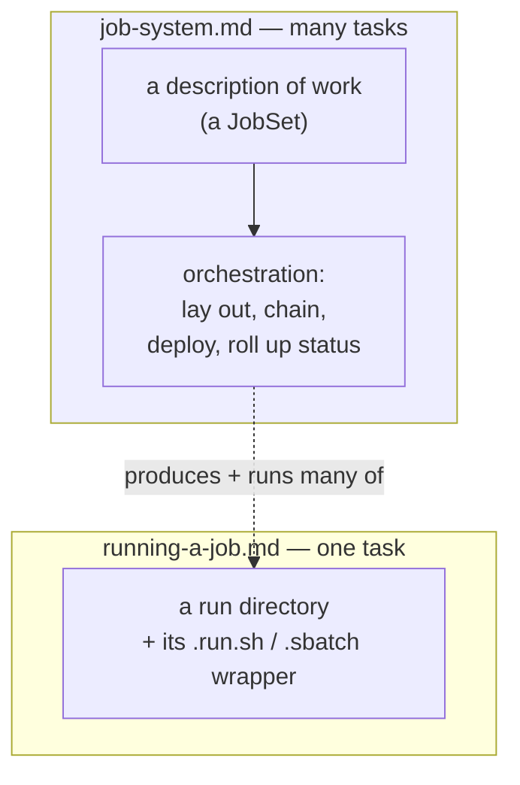
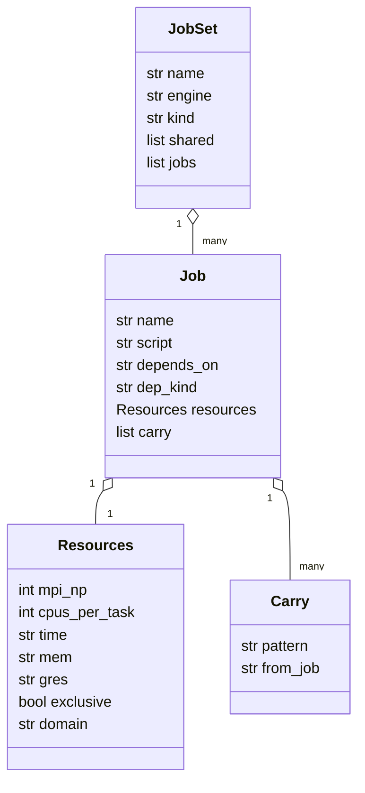
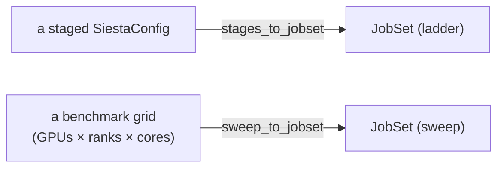
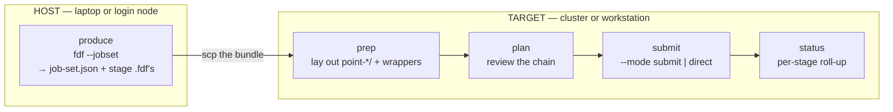
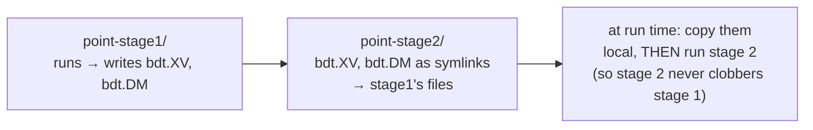
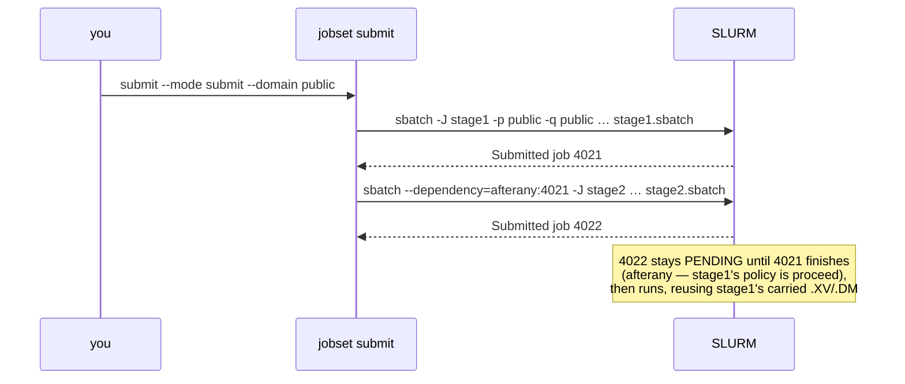
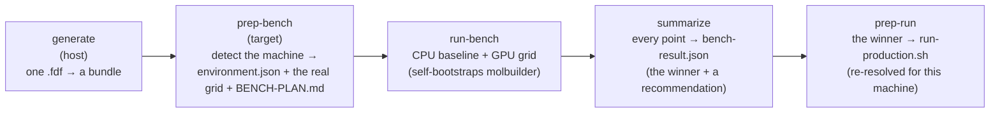

# The job system — batches, ladders, and HPC deployment

**Role:** guide
**Domain:** execution

**Companions:** [`execution/running-a-job.md`](?doc=execution/running-a-job.md)
— the single-job wrapper this framework runs many of;
[`execution/job-contracts.md`](?doc=execution/job-contracts.md) — the run-dir
layout, the wrapper files, and the `job-set.json` / parameter vocabulary this
framework produces;
[`execution/overview.md`](?doc=execution/overview.md) — the execution-domain
map and the current → target status picture;
[`engines/tuning.md`](?doc=engines/tuning.md) — the scientific *values* behind
the staged ladders (this page covers only how they are *scheduled*).

---

## 1. What the job system is, and why it exists

### The problem it solves

[`running-a-job.md`](?doc=execution/running-a-job.md) covers running **one**
calculation: you generate an input, the wrapper activates the right software
environment, runs the engine, and you watch it. That is the whole story for a
single task — and for a long time it was the only story molbuilder told.

Real research is not one task. A single result usually needs a **sequence** of
runs (relax a molecule loosely first, then tightly), and a project needs
**many** such sequences (the same analysis across dozens of structures). Getting
those onto a supercomputer adds its own chores: writing scheduler headers,
chaining jobs so stage 2 only starts after stage 1 succeeds, carrying restart
files forward between stages, and — before any of that — figuring out how many
GPUs and CPU cores actually make a given calculation fastest on a given machine.

Done by hand, that is a pile of error-prone shell scripting that every user
re-invents. The **job system** exists to make it a described, repeatable thing:
you say *what* you want as data, and molbuilder handles *how* to lay it out,
chain it, deploy it, and watch it — the same way whether it runs on your laptop
or a cluster.

### The mental model, in one picture

The job system sits **above** the single-job wrapper. It never replaces the
wrapper — it produces many of them and orchestrates them.



Concretely, three kinds of "many jobs" all reduce to the same object:

- a **staged ladder** — one molecule, relaxed in increasingly tight stages, each
  stage a separate job that depends on the one before it;
- a **parameter sweep** — the same calculation run at many resource settings to
  find the fastest (this is what benchmarking is);
- (planned) a **device workflow** — e.g. a transport junction assembled from two
  separately-relaxed electrodes.

The object they all reduce to is a **`JobSet`** (§ 3).

### A one-paragraph scenario (what a user actually does)

You have a molecule `bdt.xyz` and want a publication-quality relaxed geometry on
your cluster. You run **one** command to produce a *bundle* — a self-contained
directory holding a coarse stage and a tight stage plus a `job-set.json`
describing the chain. You `scp` the bundle to the cluster and run three verbs:
`prep` (lay out the per-stage folders and wrappers), `plan` (review the chain
and the resources), `submit` (hand it to the scheduler). The scheduler runs
stage 1; stage 2 starts automatically only if stage 1 converged, reusing stage
1's relaxed coordinates. You check `status` whenever you like. You never wrote a
`#SBATCH` header or a dependency flag.

### Where it stands today (read this before the details)

> **The job system is shipped on the command line and pending on the web.**
> Everything in this document — the `JobSet` model, the `molbuilder jobset`
> verbs, SLURM submission with dependency chains and routing domains, and the
> whole benchmark workflow — works today from a terminal. The **web UI does not
> drive any of it yet**; it still generates and runs one task at a time. Moving
> the job system into the browser is the target migration, laid out in § 8.

> ### ⚠ Automatic stage-to-stage chaining is being retired for staged calculations
>
> **This affects the ladder only, and only the *automatic* part of it.** Read this
> before building on `depends_on` or `Carry`.
>
> Everything below describes a ladder as a **chain**: stage 2 is a separate job
> that `depends_on` stage 1, the scheduler starts it automatically when stage 1
> succeeds, and a `Carry` edge hands stage 1's relaxed geometry across. That is
> what `stages_to_jobset` builds today and what SLURM submits.
>
> **The staged-runs design removes that for a staged calculation.** The reason is
> not technical — it is that *a stage is a long job*:
>
> > A chain that continues by itself can spend a week computing from a geometry
> > you would have rejected in a minute.
>
> So each stage becomes **its own prep and its own submission**, done after you
> have looked at the previous one. Whatever a run continues from is a **real file
> copied in at prep time**, and *which* run it comes from is something **you
> say** — by then it has already finished, so there is nothing to resolve later
> and nothing to point at that does not yet exist.
>
> | | Ladder as a chain (this document) | Staged calculation (the new design) |
> |---|---|---|
> | Who starts stage 2 | the scheduler, automatically | **you**, after looking |
> | How stage 1's geometry arrives | a `Carry` edge resolved at run time | a **file copy**, made at prep |
> | `Job.depends_on` between stages | set | **not emitted** |
> | If stage 1 converged to something wrong | stage 2 is already running | you never started it |
>
> **The mechanism is not being deleted.** `JobSet`, `depends_on`, `Carry` and
> `carry_deref` all stay, and `jobset` can still build a chained ladder — a
> benchmark sweep and an explicitly-chained workflow both still want them. What
> changes is that **`stages_to_jobset` stops emitting those edges between the
> stages of one calculation.**
>
> Not done yet: this is item 12b in
> [`web/staged-runs-architecture.md`](?doc=web/staged-runs-architecture.md), and
> the contract is
> [`execution/project-layout.md`](?doc=execution/project-layout.md) § 1.6.
> Until it lands, what this document describes is what the code does.

---

## 2. The design logic — why it is built this way

Six decisions shape everything below. Understanding them makes the rest obvious.

**1. Describe work as data; keep the engine out of it.** A `JobSet` is a plain
data object (a JSON file), not code. Producers turn engine configs *into* a
`JobSet`; the orchestration verbs (`prep`/`plan`/`submit`/`status`) operate on
the `JobSet` **without knowing or caring which engine it targets**. This is why
one small set of verbs can drive SIESTA ladders and benchmark sweeps alike, and
why adding a new engine later means writing one new *producer*, not a new
orchestrator.

**2. Reuse the single-job wrapper unchanged.** The job system does not invent a
new way to run a job. Each job in a `JobSet` is launched by exactly the
`.run.sh` / `.sbatch` wrapper from
[`running-a-job.md`](?doc=execution/running-a-job.md), built by the same
function. So everything true of a single run — env routing, warm/cold restart,
GPU pinning, the monitor — is automatically true of every job in a batch. The
framework adds *orchestration around* the wrapper, never *inside* it.

**3. The machine's knowledge lives on the machine, not in the user's head
("target isolation").** The bundle you produce on your laptop is
target-agnostic. The cluster-specific facts — which activation command, how many
cores a node has, which partition — are resolved on the **target** at `prep`
time and baked into the scripts there. You do not need to know the cluster's
layout to submit to it.

**4. Fail early, never guess.** A malformed chain (a job depending on a
non-existent one, a cycle, a missing partition) is rejected at produce/validate
time with a clear message, not discovered halfway through a cluster run. The
framework refuses to emit an incomplete SLURM header rather than submitting
something that will bounce.

**5. molbuilder informs; the user decides.** The framework never silently
auto-resumes a failed or interrupted run. `status` tells you which stage is
incomplete and what restart files exist; **you** choose to re-submit. This keeps
a surprising re-run from quietly overwriting hours of results.

**6. Keep the dependency graph simple until a real case needs more.** A job has
**one** parent (or none). That makes every `JobSet` either a straight chain (a
ladder) or an independent set (a sweep) — always ordered, never cyclic. A
branching/merging graph (a "diamond", needed for a two-electrode device) is a
deliberately-deferred extension, not an accident (§ 8).

---

## 3. The data structure — a `JobSet`, piece by piece

A `JobSet` is the whole description of a batch, saved as `job-set.json`
(`molbuilder/jobset/model.py`, schema `molbuilder/job-set@1`). It is deliberately
small — five concepts:



Walk through it with the *why* for each piece:

- **`JobSet.kind`** is `"ladder"` or `"sweep"` — the two shapes decision #6
  allows. A **ladder** is a chain where each job depends on the previous one; a
  **sweep** is a set of independent jobs with no dependencies. The kind tells the
  submitter whether to thread a dependency between jobs or fire them all at once.
- **`JobSet.shared`** lists files that every job needs but that never change
  between jobs — the pseudopotentials, the geometry, the monitor helper. They
  are stored **once** and symlinked into each job's folder, so a 20-point sweep
  does not carry 20 copies of a large pseudopotential.
- **`Job.name`** does double duty: it is the job's folder (`point-<name>/`) *and*
  its scheduler job name (`-J`), so a `squeue` listing reads the way the layout
  does. **`Job.script`** is the input file inside that folder.
- **`Job.depends_on` + `Job.dep_kind`** are the single-parent edge (decision #6).
  `dep_kind` is `afterok` ("run me only if my parent **succeeded**") or
  `afterany` ("run me once my parent **finished**, pass or fail"). This is how a
  ladder's per-stage convergence policy becomes a scheduler rule (§ 4.1).
- **`Job.resources`** (`Resources`) are the per-job scheduler asks — all optional,
  `None` meaning "inherit / resolve at submit". They use the **scheduler's
  vocabulary** (`mpi_np` for MPI ranks → `-n`; `cpus_per_task` for cores/rank →
  `-c`; `time`, `mem`, `gres`, `exclusive`, `domain`), the same names the
  persisted files and SLURM flags use — the full mapping is pinned in
  [`job-contracts.md § 6.2`](?doc=execution/job-contracts.md). Per-job resources
  matter because a coarse first stage and a tight final stage want very
  different node sizes.
- **`Job.carry`** (a list of `Carry`) is how a job inherits a restart file from
  an earlier one. `pattern` is a **concrete filename** (not a wildcard) and
  `from_job` names the producer — e.g. "stage 2 carries `bdt.XV` from stage 1".
  Carry is what lets a tight stage start from the coarse stage's relaxed
  geometry instead of the original coordinates.

Every `JobSet` is checked by **`validate()`** before it is used: the `kind` must
be known, names unique, `dep_kind` valid, and every `depends_on` / `from_job`
must point at a **job listed earlier** — which guarantees the graph is ordered
and has no cycles.

A complete 2-stage ladder `job-set.json`:

```json
{
  "schema": "molbuilder/job-set@1",
  "name": "bdt", "engine": "siesta", "kind": "ladder",
  "shared": ["Au.psml", "S.psml", "C.psml", "H.psml", "mb_monitor.py"],
  "jobs": [
    { "name": "stage1", "script": "bdt_stage1.fdf",
      "resources": { "domain": "htc", "time": "0-04:00:00" },
      "depends_on": null, "dep_kind": "afterok", "carry": [] },

    { "name": "stage2", "script": "bdt_stage2.fdf",
      "resources": { "domain": "public", "time": "7-00:00:00", "exclusive": true },
      "depends_on": "stage1", "dep_kind": "afterany",
      "carry": [ { "pattern": "bdt.XV", "from_job": "stage1" },
                 { "pattern": "bdt.DM", "from_job": "stage1" } ] }
  ]
}
```

Read it back in plain language: *a SIESTA ladder named `bdt`; four
pseudopotentials and the monitor are shared by both stages; stage 1 runs on the
`htc` domain for up to 4 hours with no dependency; stage 2 runs on the `public`
domain (the whole node) once stage 1 **finishes**, reusing stage 1's `.XV`
coordinates and `.DM` density matrix.* The edge is `afterany` (not `afterok`)
because stage 1's policy is `proceed` — a loose first stage is *meant* to hand
its geometry forward even if it did not fully converge (§ 4.1). A ladder whose
first stage had `halt` would instead produce `afterok` ("stage 2 only on
success").

---

## 4. Where `JobSet`s come from — the two producers

A `JobSet` is never written by hand; a **producer** builds it from a higher-level
input. There are exactly two producers today, and this is the one place engine
knowledge lives.



### 4.1 The SIESTA staged ladder (`stages_to_jobset`)

`molbuilder/siesta/stages.py::stages_to_jobset(cfg)` turns a `SiestaConfig` that
has stages into a **ladder** — one job per enabled stage, script
`<label>_<stage>.fdf`. Three things are *derived* from the config, and each
encodes a design decision:

- **The dependency edge comes from each stage's non-convergence policy.** A stage
  declares what to do if it hits its step cap without converging:
  `proceed` (go on anyway), `halt` (stop the chain), or `continue` (intended:
  retry the stage up to `continue_retries` times before giving up). These become
  the scheduler edge: `proceed → afterany` (next stage runs regardless),
  `halt`/`continue → afterok` (next stage runs only on success). So the
  scientific policy and the scheduler behaviour are the *same* setting — you
  never configure them twice. (This is the shared staged-optimization contract in
  [`engines/overview.md`](?doc=engines/overview.md).)
- **The carry-forward set is chosen for correctness, not convenience.** `.XV`
  (coordinates) is carried **always** — a later stage
  must continue from the geometry the earlier one reached. `.DM` (density matrix)
  is carried only if the config saves it. `.CG` (conjugate-gradient optimizer
  state) is carried **only when consecutive stages use the same relaxation
  method** — a CG state is meaningless to a Broyden stage, so blindly carrying it
  would corrupt the restart.
- **Resources are per-stage**, defaulting to inherit the config's ranks/threads
  and otherwise resolved at submit — so a coarse stage and a tight stage can be
  sized differently.

**The shipped default ladder** (the *structure*; the *values* and their
scientific rationale live in [`engines/tuning.md`](?doc=engines/tuning.md)):

| Stage | Enabled by default | Relaxation | Steps | On non-convergence | Edge to next |
|---|:--:|---|--:|---|---|
| stage1 | ✅ | CG | 600 | **proceed** | `afterany` |
| stage2 | ✅ | Broyden | 200 | **halt** | `afterok` |
| stage3 | — | Broyden | 100 | **halt** | — |

The three **strategy presets** flip only the enable flags:
`loose-only` = (✅, —, —), `publishable` = (✅, ✅, —),
`vib-quality` = (✅, ✅, ✅). The `continue` policy's per-stage retry budget
(`continue_retries`, 1–5) is honored in two places today: the **PySCF**
in-script ladder (the `not a JobSet` note under § 4) loops inside the
generated Python, and a **single SIESTA run** whose wrapper was installed
with a retry budget auto-retries itself with `--continue` on SCF-abort or
geometry-step-cap (see `?doc=execution/running-a-job.md` § 3.5; today only
the web install-wrapper door passes the budget). The **SIESTA staged
runner/JobSet edge** still does *not* implement it — a `continue` stage
takes the same `afterok` edge as `halt` and each stage is submitted once
(a code follow-up: the ladder would need the budget threaded through
`stages_to_jobset` → `jobset/prep`).

There is also a pure, side-effect-free **`build_siesta_stage_bundle(struct,
cfg)`** that returns a ready-to-write stage bundle by reusing the stage `.fdf`
renderers plus `stages_to_jobset`. It exists as the clean seam a future **web**
Build producer will call (§ 8).

### 4.2 The benchmark sweep (`sweep_to_jobset`)

`molbuilder/bench/to_jobset.py::sweep_to_jobset(...)` builds a **sweep** — one
independent job per point of a `(GPUs, ranks-per-GPU, cores-per-rank)` grid,
**no carry** (the points don't depend on each other). It is the producer behind
the benchmark workflow (§ 6). Because a sweep is just another `JobSet`, the same
`jobset` verbs run it — benchmarking is not a separate machine, it is the job
system pointed at a resource grid.

> **A ladder that is *not* a JobSet — PySCF.** PySCF also supports staged
> relaxation, but it runs its stages as an **in-script loop inside the single
> `.py`** (see [`engines/tuning.md`](?doc=engines/tuning.md)), not as separate
> scheduled jobs — `molbuilder pyscf` has no `--jobset` flag. So "a ladder
> scheduled as a dependency chain" is a **SIESTA-only** reality right now.
> PySCF, transport, and spectra producers are planned (§ 8).

---

## 5. The workflow — produce, prep, plan, submit, watch

The lifecycle has one step on the **host** (where you design the calculation) and
four verbs on the **target** (where it runs). They mirror the design: the host
step is pure file-writing; scheduler contact happens only at `submit`.



### 5.1 Produce (host)

```bash
# Render the stage .fdf's + job-set.json into ./bundle
molbuilder fdf bdt.xyz bundle/bdt.fdf --stage-strategy publishable --jobset \
    --psml-lib ~/pseudos \
    --stage-resources '{"stage1": {"domain": "htc",    "time": "0-04:00:00"},
                        "stage2": {"domain": "public", "time": "7-00:00:00", "exclusive": true}}'
```

`--jobset` requires a multi-stage config (a single deck has nothing to chain);
`--stage-resources` requires `--jobset`, and its stage names and fields are
validated against the actual ladder — a typo like `"stage9"` fails here, on your
laptop, not on the cluster (design decision #4).

### 5.2 What `prep` lays out on disk

`prep` turns the flat bundle into the materialized tree the scheduler runs. Two
ideas make it safe and small:

- **Wrappers are rendered once, from the real input file.** Each distinct
  `script` gets its `.run.sh` / `.sbatch` built one time in the bundle root, by
  the *same* single-job wrapper builder — so a batch job's wrapper is
  byte-identical to a hand-run one.
- **Shared and carried files are symlinked, not copied.** Each job folder links
  back to the shared files and to its carried restart files in the *producer's*
  folder.

```
bundle/
├── job-set.json
├── STAGE-PLAN.md                 ← human-readable plan, written at prep
├── bdt_stage1.run.sh  bdt_stage1.sbatch   ← wrappers, rendered once
├── bdt_stage2.run.sh  bdt_stage2.sbatch
├── Au.psml  S.psml  …  mb_monitor.py      ← the shared files (stored once)
├── point-stage1/
│   ├── bdt_stage1.fdf → ../bdt_stage1.fdf
│   ├── Au.psml → ../Au.psml   …           ← shared, symlinked in
│   └── (stage 1 writes bdt.XV / bdt.DM here when it runs)
└── point-stage2/
    ├── bdt_stage2.fdf → ../bdt_stage2.fdf
    ├── bdt.XV → ../point-stage1/bdt.XV     ← carried (dangling until stage 1 runs)
    └── bdt.DM → ../point-stage1/bdt.DM
```

The carry symlinks are **deliberately dangling** until stage 1 actually produces
those files. And there is a subtle safety step at run time: before stage 2
starts, its wrapper **replaces the inherited symlink with a real local copy**.
Without that, stage 2 writing to `bdt.XV` would write *through* the link and
overwrite stage 1's result — the "localize-on-run" rule closes that trap.



### 5.3 plan, submit, status

```bash
molbuilder jobset plan   ./bundle                    # read-only table: chain, per-job resources, carry
molbuilder jobset submit ./bundle --mode submit --domain public --dry-run   # preview the exact sbatch lines
molbuilder jobset submit ./bundle --mode submit --domain public             # go: hand the chain to SLURM
#   or on a workstation with no scheduler:
molbuilder jobset submit ./bundle --mode direct      # run the stages in order, locally
molbuilder jobset status ./bundle                    # per-stage state + the first incomplete stage
```

- **`plan`** prints the chain, each job's resources, and its carry set. It
  changes nothing — it is the "look before you leap" step.
- **`submit`** takes a **required** `--mode`:
  - **`submit`** hands each job to SLURM, threading the dependency
    (`--dependency=afterany:<stage1-job-id>` for the example) by capturing each
    `sbatch`'s returned job id and feeding it to the next.
  - **`direct`** runs the jobs in order **locally** (`bash …run.sh`), reproducing
    the same dependency meaning without a scheduler: an `afterok` job whose parent
    failed is skipped along with everything below it; an `afterany` job runs
    regardless. This is the workstation path.
  - `--dry-run` prints the exact command it *would* run per job, without
    launching — the safe way to see what will happen.
- **`status`** reads the run directory (reusing the run decoder from
  [`running-a-job.md § 4.2`](?doc=execution/running-a-job.md)) and reports each
  stage's state, its restart files, and the first incomplete stage — then stops.
  It prints resume guidance but **never auto-resumes** (design decision #5); you
  re-submit the incomplete stage yourself, and the engine warm-starts from its
  own `.XV`.

### 5.4 The dependency chain, as a sequence

For the 2-stage ladder, `--mode submit` does this:



### 5.5 Watching a stage while it runs

`status` is a roll-up you pull on demand. To watch a *single* stage live, point
the run viewer (the web run view, or `molbuilder watch`) at its
`point-<name>/` folder — it resolves and streams the trajectory exactly as for a
stand-alone job ([`running-a-job.md § 4`](?doc=execution/running-a-job.md)).
Every job also carries **`mb_monitor.py`** (one of the `shared` files, symlinked
into each folder): its wrapper launches it in the background to sample GPU/CPU
utilisation into a `.util.csv` while the stage runs, so an under-utilised or
stalled stage is visible without waiting for it to finish.

Because each `point-<name>/` is a self-contained run directory, it can also be
**checkpointed on its own** — `molbuilder snapshot` treats a stage folder like
any other run dir ([`running-a-job.md § 6`](?doc=execution/running-a-job.md)), so
you can tag a converged stage or branch a what-if from it independently of the
rest of the ladder.

---

## 6. Running on a cluster — SLURM deployment

The wrapper file shapes (`.run.sh` inner + `.sbatch` outer) and the meaning of
each `#SBATCH` line are owned by
[`running-a-job.md § 5.3`](?doc=execution/running-a-job.md) and
[`job-contracts.md § 2.6`](?doc=execution/job-contracts.md). What the **job
system** adds is submission, dependency threading, and routing:

- **The two layers.** The outer `.sbatch` is a thin `#SBATCH` header whose body
  is a single line — `bash <base>.run.sh "$@"`. The inner `.run.sh` owns
  activation and launch. You submit the outer file; it hands off to the inner
  one. This split means the scheduler header and the run logic evolve
  independently, and the exact same `.run.sh` works with or without a scheduler.
- **One `sbatch` per job, per-job flags win.** The submitter passes each job's
  resources as command-line `sbatch` flags (`-J`, `-n`, `-c`, `--gres`, `-t`,
  `--exclusive`), which **override** the rendered header — so a whole sweep can
  share one `.sbatch` file while each point still gets its own ranks and cores.
- **Routing domains.** Instead of hard-coding a partition, you name a **domain**
  (`--domain public`, or `execution.domain` in config). A domain is a friendly
  name for a `(partition, qos)` pair (with an optional separate GPU partition);
  `submit` resolves it and refuses an unknown name with the list of configured
  ones. Partition and qos are **required** for a SLURM site — the framework
  refuses to emit a header it knows will be rejected (design decision #4).
- **Job names read well.** A ladder job's `-J` is its bare stage name (`stage2`);
  a benchmark point's is `job-gpu-G1K2C5` / `job-cpu`, so a `squeue` listing is
  self-describing.

A workstation with no `scheduler` block configured simply gets `.run.sh` files
and runs with `--mode direct`; the `.sbatch` is emitted only when a scheduler is
configured.

---

## 7. Benchmarking — measuring the fastest resources

Before you commit a long production run to a node, you want to know: for *this*
calculation on *this* machine, how many GPUs, how many MPI ranks per GPU, and how
many CPU cores per rank actually run it fastest? Guessing wastes allocation. The
benchmark workflow measures it, and it is just the job system pointed at a
resource grid.

Its guiding idea (**target isolation**, design decision #3): you generate a
benchmark *bundle* on your laptop; everything machine-specific is discovered on
the target. Five steps: `generate` on the host (`molbuilder bench generate`),
then the bundle's own baked **`prep-bench`** and **`run-bench`** executables on
the target (they self-bootstrap molbuilder and shim to the CLI), then
`summarize` and `prep-run` back under `molbuilder bench`:



- **Detect the machine → `environment.json`** (`molbuilder/environment@1`): the
  scheduler, the site, and the topology — resolved to the **compute node's**
  real core and GPU counts (read from the scheduler via `scontrol show node`,
  not from whatever login node you happen to be on), so the numbers are the ones
  the job will actually run against.
- **Two comparable points → `bench-manifest.json`** (`molbuilder/bench-manifest@2`).
  This is the clever bit: to compare CPU vs GPU **hardware** fairly, both points
  use the *same solver* (`ELPA-1STAGE`) and run in the *same environment*
  (`molbuilder-siesta-gpu`); the only difference is one flag toggling the GPU on.
  Both are trimmed to 5 SCF iterations with convergence checks off — you are
  timing the machine, not converging the chemistry. (The CPU point sets the GPU
  flag *explicitly off*, because the GPU-linked build defaults to on.)
- **The `(G, K, c)` grid** — the shape of the sweep, and why: `G` = number of
  GPUs (1 up to the node's count); `K` = MPI ranks per GPU, tried at the divisors
  of the socket's core count (so ranks divide evenly); `c` = CPU cores per rank,
  tried as a **starved / one-socket / cross-socket** triple
  (`{1, cores//K, 2·cores//K}`) to bracket the useful range. Each point runs in
  its own `point-G<g>K<k>C<c>/` folder.
- **Measure → `bench-result.json`** (`molbuilder/bench-result@1`): each point is
  parsed for its SCF wall-time **per iteration** (averaged over iterations 3–5 to
  skip warm-up), plus a utilisation reading and peak memory. The **winner is the
  fastest completed point**; the tool also recommends a memory request (peak ×
  1.15) and a walltime (per-iteration time × a nominal iteration count × a safety
  factor). The recorded choice is **portable** — `prep-run` re-resolves the
  concrete rank and core counts for whatever machine it is later run on.

`molbuilder bench probe-scheduler` is a companion that reads a live cluster
(`sinfo`/`sacctmgr`) and proposes a `scheduler` block + routing menu you can
merge into your config with `--write`.

> **One honest gap.** The benchmark already
> *produces* a `JobSet` (`bench prep` writes `job-set.json`), but it still
> *executes* through its original, proven inline-shell sweep rather than
> `jobset submit`. Both paths use the identical `(G,K,c)` grid, so results match;
> retiring the inline path once it is cluster-validated is the open follow-up.

---

## 8. Where it stands, and where it is going

### Shipped today (command line)

The `JobSet` model and persistence; the SIESTA ladder producer (`fdf --jobset`)
and the benchmark sweep producer; all four verbs (`plan` / `prep` / `submit` /
`status`) in both `submit` and `direct` modes; SLURM submission with dependency
chains and routing domains; the full benchmark workflow; and checkpoint
branching (`molbuilder snapshot branch`, see
[`running-a-job.md § 6`](?doc=execution/running-a-job.md)).

### Not built yet — the web, and other engines

This is the migration the project is undertaking, planned in
[`roadmap.md`](?doc=roadmap.md) (workstream 1, "Batch execution reaches the
web"). Today there is **no `jobset` web blueprint, no `/api/jobset/*` route**,
the web Build tab still renders a single `.fdf` (it drops the stage table), and
there is **no `/api/checkpoint/branch`** route.

- **Phase 1 — a web bundle producer.** The Build tab's stage table becomes a real
  `JobSet` producer, calling the same `build_siesta_stage_bundle` seam (§ 4.1).
- **Phase 2 — web Plan + Status (read-only) + a checkpoint-branch control.**
  Reusing the *already-shipped* run decoder in the browser (no new parser) and
  exposing `snapshot branch` over HTTP.
- **Phases 3–4 — other engines, gated on a cluster-validation milestone.**
  `transport --jobset`, `pyscf --jobset`, and `spectra --jobset` producers (with
  their tab mirrors), behind a hard gate: prove the SIESTA ladder end-to-end
  (produce → prep → submit → monitor) on a real cluster *before* broadening.
  Reaching transport is also where the single-parent limit (§ 2, design decision
  #6) is lifted to a branching graph.

Also out of scope for now: **multi-node MPI** (v1 fixes one node), a
`molbuilder config init --site` command (a site preset ships only as a JSON
example file today), and wiring the notifier hook to a real messaging service
(a proof-of-concept stub exists).

The through-line: the CLI framework on this page is the settled foundation, and
the web work is *additive on top of it* — it reuses these exact producers,
decoders, and wrappers rather than reinventing them.

---

## 9. A developer's map

Where each responsibility lives, for someone extending the framework:

| Concern | Module |
|---|---|
| The data model + `job-set.json` read/write + `validate()` | `molbuilder/jobset/model.py` |
| SIESTA ladder producer + the pure `build_siesta_stage_bundle` seam | `molbuilder/siesta/stages.py` |
| Benchmark sweep producer | `molbuilder/bench/to_jobset.py` |
| Lay out the materialized tree (`point-*/` + symlinks) | `molbuilder/jobset/materialize.py` |
| Render wrappers once + carry-in + `STAGE-PLAN.md` | `molbuilder/jobset/prep.py` |
| The human-readable plan table | `molbuilder/jobset/plan.py` |
| Submit (SLURM chain / direct) + dependency threading + domain routing | `molbuilder/jobset/submit.py` |
| Per-stage status roll-up (reuses `decode_run_dir`) | `molbuilder/jobset/runstatus.py` |
| The CLI verbs (`molbuilder jobset …`) | `molbuilder/jobset/_cli.py` |
| The `.sbatch` header emission (shared with single-job) | `molbuilder/runwrap.py::render_sbatch` |
| The benchmark workflow (detect / manifest / grid / summarize) | `molbuilder/bench/*` |

**To add a new engine to the job system**, you write **one producer** —
a function that turns that engine's config into a `JobSet` — and nothing else.
The verbs, the materializer, the submitter, and the status layer are all
engine-agnostic and pick it up for free. That is the whole payoff of decision #1.
