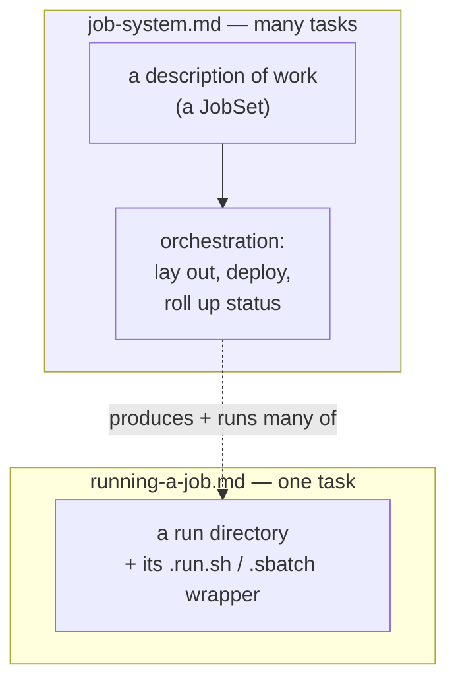
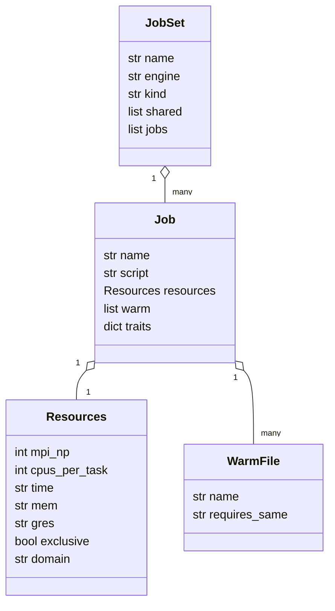
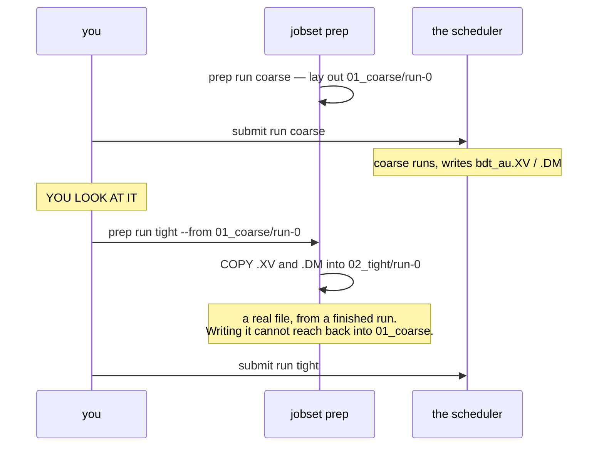
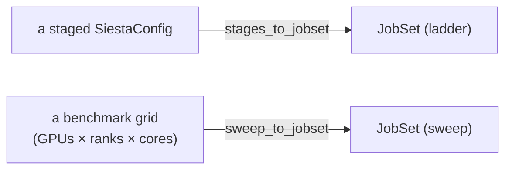
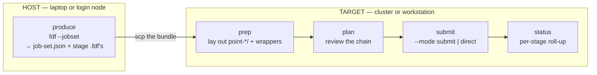
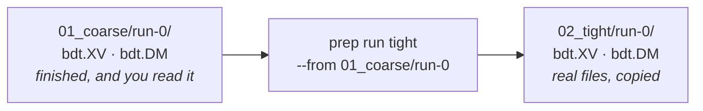
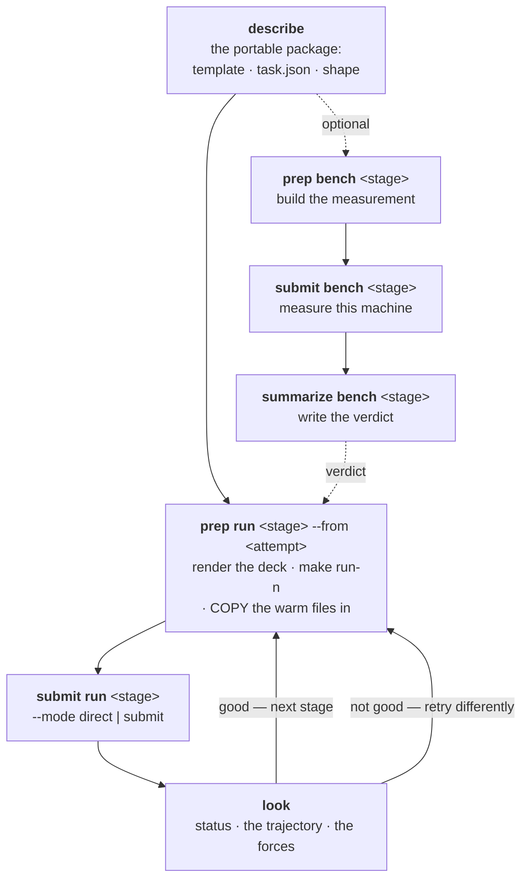
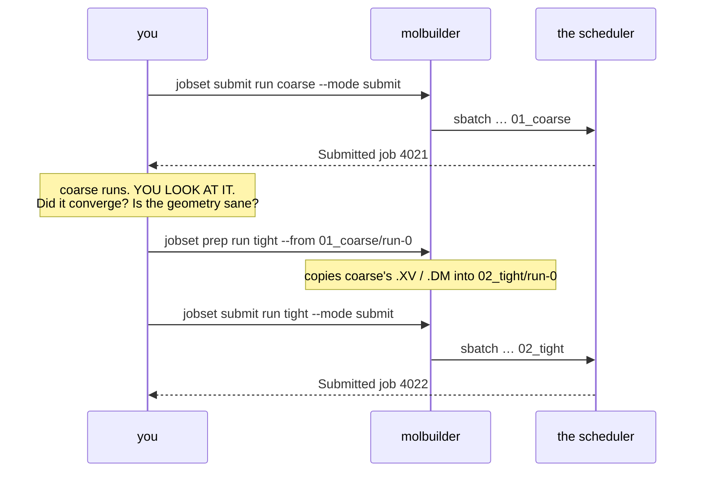
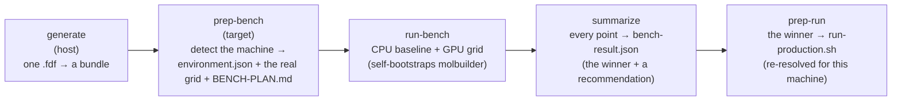

# The job system — batches, ladders, and HPC deployment

**Role:** guide
**Domain:** execution

**Companions:** [`execution/running-a-job.md`](?doc=execution/running-a-job.md)
— the single-job wrapper this framework runs many of;
[`execution/job-contracts.md`](?doc=execution/job-contracts.md) — the run-dir
layout, the wrapper files, and the `job-set.json` / parameter vocabulary this
framework produces;
[`execution/overview.md`](?doc=execution/overview.md) — the execution-domain
map and the current → target status picture;
[`engines/tuning.md`](?doc=engines/tuning.md) — the scientific *values* behind
the staged ladders (this page covers only how they are *scheduled*).

---

## 1. What the job system is, and why it exists

### The problem it solves

[`running-a-job.md`](?doc=execution/running-a-job.md) covers running **one**
calculation: you generate an input, the wrapper activates the right software
environment, runs the engine, and you watch it. That is the whole story for a
single task — and for a long time it was the only story molbuilder told.

Real research is not one task. A single result usually needs a **sequence** of
runs (relax a molecule loosely first, then tightly), and a project needs
**many** such sequences (the same analysis across dozens of structures). Getting
those onto a supercomputer adds its own chores: writing scheduler headers,
laying out each stage so it can start from the last one's results, carrying
restart files forward between stages, and — before any of that — figuring out
how many GPUs and CPU cores actually make a given calculation fastest on a
given machine.

Done by hand, that is a pile of error-prone shell scripting that every user
re-invents. The **job system** exists to make it a described, repeatable thing:
you say *what* you want as data, and molbuilder handles *how* to lay it out,
deploy it, and watch it — the same way whether it runs on your laptop or a
cluster. **What it does not handle is deciding that one stage should follow
another; that is yours** (§ 2, decision 6).

### The mental model, in one picture

The job system sits **above** the single-job wrapper. It never replaces the
wrapper — it produces many of them and orchestrates them.



Concretely, three kinds of "many jobs" all reduce to the same object:

- a **staged ladder** — one molecule, relaxed in increasingly tight stages, each
  stage a separate job that you start once you have looked at the one before it;
- a **parameter sweep** — the same calculation run at many resource settings to
  find the fastest (this is what benchmarking is);
- (planned) a **device workflow** — e.g. a transport junction assembled from two
  separately-relaxed electrodes.

The object they all reduce to is a **`JobSet`** (§ 3).

### A one-paragraph scenario (what a user actually does)

You have a molecule `bdt.xyz` and want a publication-quality relaxed geometry on
your cluster. You run **one** command to produce a *bundle* — a self-contained
directory holding a coarse stage and a tight stage plus a `job-set.json`
describing both. You `scp` the bundle to the cluster, then work **one stage at a
time**: `prep run coarse` (lay out its folder and wrapper), `plan` (review the
resources), `submit run coarse` (hand that one job to the scheduler). When it
finishes you **look at it**, then `prep run tight --from 01_coarse/run-0` —
which copies coarse's relaxed coordinates in — and submit that. You check
`status` whenever you like. You never wrote a `#SBATCH` header.

### Where it stands today (read this before the details)

> **The job system is shipped on the command line and pending on the web.**
> Everything in this document — the `JobSet` model, the `molbuilder jobset`
> verbs, one-job-at-a-time SLURM submission with routing domains, and the whole
> benchmark workflow — works today from a terminal. The **web UI does not
> drive any of it yet**; it still generates and runs one task at a time. Moving
> the job system into the browser is the target migration, laid out in § 8.

> ### How a ladder advances
>
> **You prepare one stage, look at what it produced, and prepare the next.**
> Nothing starts a stage but a person — there is no flag and no field that
> makes one follow another (§ 2, decision 6).
>
> What a stage continues from is a **real file, copied in at `prep`**, from a
> run **you name**. By then it has finished and you have read it, so there is
> nothing to resolve later and nothing pointing at a file that does not exist.
>
> | | |
> |---|---|
> | Who starts stage 2 | **you**, after looking |
> | How stage 1's geometry arrives | a **file copy**, made at prep from the attempt you name |
> | If stage 1 converged to something wrong | you never started stage 2 |
>
> The earlier scheduler-chained design is recorded in
> `archive/2026-08-10-stage-chaining.md`.

---

## 2. The design logic — why it is built this way

Six decisions shape everything below. Understanding them makes the rest obvious.

**1. Describe work as data; keep the engine out of it.** A `JobSet` is a plain
data object (a JSON file), not code. Producers turn engine configs *into* a
`JobSet`; the orchestration verbs (`prep`/`plan`/`submit`/`status`) operate on
the `JobSet` **without knowing or caring which engine it targets**. This is why
one small set of verbs can drive SIESTA ladders and benchmark sweeps alike, and
why adding a new engine later means writing one new *producer*, not a new
orchestrator.

**2. Reuse the single-job wrapper unchanged.** The job system does not invent a
new way to run a job. Each job in a `JobSet` is launched by exactly the
`.run.sh` / `.sbatch` wrapper from
[`running-a-job.md`](?doc=execution/running-a-job.md), built by the same
function. So everything true of a single run — env routing, warm/cold restart,
GPU pinning, the monitor — is automatically true of every job in a batch. The
framework adds *orchestration around* the wrapper, never *inside* it.

**3. The machine's knowledge lives on the machine, not in the user's head
("target isolation").** The bundle you produce on your laptop is
target-agnostic. The cluster-specific facts — which activation command, how many
cores a node has, which partition — are resolved on the **target** at `prep`
time and baked into the scripts there. You do not need to know the cluster's
layout to submit to it.

**4. Fail early, never guess.** A malformed `JobSet` — duplicate job names, an
unknown `kind`, a warm-file condition naming a trait the job never declares, a
missing partition — is rejected at produce/validate time with a clear message,
not discovered halfway through a cluster run. The framework refuses to emit an
incomplete SLURM header rather than submitting something that will bounce.

**5. molbuilder informs; the user decides.** The framework never silently
auto-resumes a failed or interrupted run. `status` tells you which stage is
incomplete and what restart files exist; **you** choose to re-submit. This keeps
a surprising re-run from quietly overwriting hours of results.

**6. The order is a person's, not the data's.** Every job in a `JobSet` is
independent as far as the framework is concerned: **nothing in a `JobSet` says
"start this one after that one."** A *ladder* and a *sweep* differ in how their
directories are named and whether a person is meant to take them in order —
neither waits for the other.

**Why the ordering lives with the person.** Whether stage 2 should start is a
judgement about stage 1's result, and nothing in the data can make it. A stage
is a long job; one that continues by itself can spend a week refining a geometry
you would have rejected in a minute. So the order lives where the judgement
lives — one `prep` and one `submit` at a time.

**What this costs, stated plainly.** A branching graph (a "diamond", for a
two-electrode device) has no representation. If one is ever needed it comes back
as something a person asks for at launch, never as a field a description stores.

---

## 3. The data structure — a `JobSet`, piece by piece

A `JobSet` is the whole description of a batch, saved as `job-set.json`
(`molbuilder/jobset/model.py`, schema `molbuilder/job-set@1`). It is deliberately
small — five concepts:



**There is no edge anywhere in this picture.** No job names another job. That is
decision #6, and it is the single most important thing about the shape.

Walk through it with the *why* for each piece:

- **`JobSet.kind`** is `"ladder"` or `"sweep"`. **Both are sets of independent
  jobs**; the kind says how their folders are named and whether they have an
  order a *person* should follow — a ladder's stages are meant to be run in
  sequence, a sweep's points are not. It does **not** mean one job waits for
  another: neither does. The kind drives the directory convention
  (`<seq>_<name>` versus `point-<name>`) and nothing about scheduling.
- **`JobSet.shared`** lists files that every job needs but that never change
  between jobs — the pseudopotentials, the geometry, the monitor helper. They
  are stored **once** and symlinked into each job's folder, so a 20-point sweep
  does not carry 20 copies of a large pseudopotential.
- **`Job.name`** does double duty: it is the job's folder (`point-<name>/`) *and*
  its scheduler job name (`-J`), so a `squeue` listing reads the way the layout
  does. **`Job.script`** is the input file inside that folder.

  > **`point-<name>/` is today's naming for every job, and it splits.** A sweep
  > point keeps a settings-based name; a **stage** becomes `<seq>_<stage>`
  > (`01_coarse`), because a stage is ordered and a sweep point is not, and one
  > shape for both hides the difference. The full table, for every layer, is
  > [`job-contracts.md`](?doc=execution/job-contracts.md) § 6.3.
- **`Job.resources`** (`Resources`) are the per-job scheduler asks — all optional,
  `None` meaning "inherit / resolve at submit". They use the **scheduler's
  vocabulary** (`mpi_np` for MPI ranks → `-n`; `cpus_per_task` for cores/rank →
  `-c`; `time`, `mem`, `gres`, `exclusive`, `domain`), the same names the
  persisted files and SLURM flags use — the full mapping is pinned in
  [`job-contracts.md § 6.2`](?doc=execution/job-contracts.md). Per-job resources
  matter because a coarse first stage and a tight final stage want very
  different node sizes.
- **`Job.warm`** (a list of `WarmFile`) is what this job would take **from
  whatever run it is continued from** — not from a named job. `name` is a
  concrete filename; `requires_same` names a key both runs must agree on for the
  file to mean anything, looked up in `Job.traits`.

  > **It says WHAT, never FROM WHOM**, and that is the whole design. Which
  > run this job is continued from is named by a person at `prep`, with
  > `--from`, after they have looked at it — so the producer, which runs long
  > before anyone has looked at anything, is not asked to know.
  >
  > `.CG` is why `requires_same` exists: a conjugate-gradient history is
  > meaningless to a Broyden stage, so carrying it blindly corrupts the restart.
  > SIESTA puts its optimizer in `traits`; the framework compares two strings
  > and knows nothing else about either engine.

- **`Job.traits`** are opaque per-job strings a `requires_same` is compared
  against. The framework never interprets them.

Every `JobSet` is checked by **`validate()`** before it is used: the `kind` must
be known, names unique, and every `WarmFile.requires_same` must name a trait the
job actually declares — a condition on a key that is not there is a condition
that can never be tested, so it is refused rather than silently ignored.

### 3.1 A real `job-set.json`, field by field

Descriptions of a format are easy to nod along to and hard to check. Here is an
actual two-stage ladder for benzene-dithiol on gold, with every field annotated:

```jsonc
{
  "schema": "molbuilder/job-set@1",   // versioned: a reader refuses a major it
                                      // does not know, rather than guessing
  "name":   "bdt_au",                 // the calculation's id — also the SIESTA
                                      // SystemLabel every deck shares
  "engine": "siesta",
  "kind":   "ladder",                 // how the folders are named + whether a
                                      // PERSON should run them in order.  Neither
                                      // kind makes one job wait for another.

  "shared": ["C.psml", "H.psml", "S.psml", "Au.psml", "mb_monitor.py"],
                                      // stored ONCE in the bundle root and
                                      // symlinked into every job's folder

  "jobs": [
    {
      "name":   "coarse",             // → folder 01_coarse/ AND squeue -J name
      "script": "bdt_au_01_coarse.fdf",  // the deck, in the bundle root.  The
                                      // TOKEN in this filename is where the
                                      // directory's `01` comes from -- it is
                                      // read back off the deck, never counted
                                      // (decision 27).  A ladder job whose
                                      // script carries no token falls back to
                                      // `point-<name>`, because inventing a
                                      // seq would be guessing at the one
                                      // number that must never be guessed.
      "resources": {                  // ALL seven fields are always written,
        "domain":        null,        // nulls included — see the note below
        "time":          "04:00:00",
        "exclusive":     null,
        "mem":           null,
        "gres":          null,
        "mpi_np":        8,
        "cpus_per_task": 4
      },
      "warm":   [],                   // takes nothing from an earlier run --
                                      // starts from the .fdf's own coordinates
      "traits": {"optimizer": "CG"}   // opaque; only compared against another
                                      // job's, never interpreted
    },
    {
      "name":   "tight",
      "script": "bdt_au_02_tight.fdf",
      "resources": {
        "domain":        null,
        "time":          "24:00:00",
        "exclusive":     null,
        "mem":           null,
        "gres":          "gpu:a100:1",
        "mpi_np":        32,          // 4× the ranks: the tight stage is the
        "cpus_per_task": 4            // expensive one, and per-job resources
      },                              // are the whole reason they are per-job
      "warm": [                       // WHAT it would take from a run it is
                                      // continued from -- never WHICH run.
        { "name": "bdt_au.XV" },                            // relaxed geometry
        { "name": "bdt_au.DM" },                            // density matrix
        { "name": "bdt_au.CG",                              // optimizer history
          "requires_same": "optimizer" }   // ...only if both used the same one
      ],
      "traits": {"optimizer": "CG"}
    }
  ]
}
```

*(Produced by building that `JobSet` and dumping `to_dict()`, so the shape and
the key order are the real ones, not a sketch.)*

> **`null` is a value here, and it does not mean "zero" or "off".** It means
> **"not decided yet — resolve it at submit"**. A `mem` of `null` lets the
> scheduler config's default apply; a `mem` of `"0"` is SLURM's *"give me the
> whole node's memory"*. The fields are written out even when null so the file
> shows you the complete set of questions that will be answered, rather than
> hiding the ones nobody answered yet. This is the *assistant, not nanny* rule in
> file form: molbuilder does not quietly pick a node size for you.

**What that file becomes on disk.** `molbuilder jobset prep` reads it and lays
out the tree. Every arrow below is a **symlink**, which is the point: nothing is
copied, so a 4 GB pseudopotential set exists once no matter how many jobs there
are.

```
bdt_au-bundle/                       ← the bundle root: the real files live here
├── job-set.json                     the description above
├── bdt_au_01_coarse.fdf             the two decks, each carrying its token
├── bdt_au_02_tight.fdf
├── C.psml  H.psml  S.psml  Au.psml  the shared package
├── mb_monitor.py
├── bdt_au_01_coarse.run.sh .sbatch  wrappers, rendered once per distinct deck
├── bdt_au_02_tight.run.sh  .sbatch
├── STAGE-PLAN.md                    a human-readable review of the jobs
│
├── 01_coarse/                       ← <seq>_<name> for a LADDER's stages
│   ├── bdt_au_01_coarse.fdf  → ../bdt_au_01_coarse.fdf
│   ├── bdt_au_01_coarse.run.sh → ../…
│   └── run-0/                   ← one directory per ATTEMPT, made by `prep run`
│       ├── run.json                 written by submit: how, when, and what
│       │                            this run continued from
│       └── bdt_au.XV  bdt_au.DM     what the run produced
│
└── 02_tight/
    ├── bdt_au_02_tight.fdf   → ../bdt_au_02_tight.fdf
    └── run-0/               ← made only when you say `prep run tight --from …`
        ├── bdt_au.XV            a real COPY of 01_coarse/run-0/bdt_au.XV
        └── bdt_au.DM            a real COPY — not a link, not dangling
```

**Nothing in `02_tight/` exists until you ask for it.** `prep` with no stage
lays out the stage folders and the wrappers; the `run-<n>` attempt inside one is
made by `prep run <stage>`, and that is the command where you name what it
continues from. So the tree above is what a ladder looks like **after** you have
run coarse, looked at it, and set tight up.

> **A SWEEP's tree differs in two ways**: its folders are `point-<name>` (its
> points have no order, so no ordinal), and there is no attempt layer — a point
> is prepped and run in its own folder. Nothing is copied between points.
>
> ```text
> point-G1K2C4/                     ← G<gpus>K<ranks-per-gpu>C<cores-per-rank>,
> │                                   named by its SETTINGS, not a position
> │   bdt_au.fdf  →  ../bdt_au.fdf
> │   C.psml      →  ../C.psml      (and the other three)
> └── bdt_au.run.sh → ../bdt_au.run.sh
> ```

**Nothing dangles, because nothing points at a file that has not been written.**
Every path in that tree either belongs to the job or is a link to the shared
package one level up. **No job's directory reaches into another's.**

What a stage continues from is copied by `prep run tight --from
01_coarse/run-0`, out of an attempt that has already finished and that you have
already looked at:



**The copy is the thing a person can check** — it is a real file, present
before the stage starts, from a run named on the command line.

A complete 2-stage ladder `job-set.json`:

```json
{
  "schema": "molbuilder/job-set@1",
  "name": "bdt", "engine": "siesta", "kind": "ladder",
  "shared": ["Au.psml", "S.psml", "C.psml", "H.psml", "mb_monitor.py"],
  "jobs": [
    { "name": "stage1", "script": "bdt_01_stage1.fdf",
      "resources": { "domain": "htc", "time": "0-04:00:00" },
      "warm": [], "traits": { "optimizer": "CG" } },

    { "name": "stage2", "script": "bdt_02_stage2.fdf",
      "resources": { "domain": "public", "time": "7-00:00:00", "exclusive": true },
      "warm": [ { "name": "bdt.XV" },
                { "name": "bdt.DM" },
                { "name": "bdt.CG", "requires_same": "optimizer" } ],
      "traits": { "optimizer": "CG" } }
  ]
}
```

Read it back in plain language: *a SIESTA ladder named `bdt`; four
pseudopotentials and the monitor are shared by both stages; stage 1 runs on the
`htc` domain for up to 4 hours; stage 2 runs on the `public` domain (the whole
node), and **if you continue it from something**, it will take that run's `.XV`
coordinates and `.DM` density matrix — plus its `.CG` optimizer history, but
only if that run also used CG.*

**Notice what the file does not say: when stage 2 runs, or after what.** It
cannot. Both jobs are described, neither is scheduled, and the order is
something you carry out one command at a time.

---

## 4. Where `JobSet`s come from — the two producers

A `JobSet` is never written by hand; a **producer** builds it from a higher-level
input. There are exactly two producers today, and this is the one place engine
knowledge lives.



### 4.1 The SIESTA staged ladder (`stages_to_jobset`)

`molbuilder/siesta/stages.py::stages_to_jobset(cfg, stages)` turns a **template**
(one ordinary `SiestaConfig`) plus a **ladder** (a list of `task.py::Stage`, from
`task.json`) into a **ladder** JobSet — one job per enabled stage, script
`<label>_<stage>.fdf`. An engine config carries no stage list, so the ladder is
an argument rather than a field ([`engines/stages.md`](?doc=engines/stages.md)
§ 1.1). Three things are *derived*, and each encodes a design decision:

- **A stage that runs out of steps without converging simply stops**, and you
  decide what to do about it — which is what you were doing between stages
  anyway.

  > **PySCF is different, and the asymmetry is real.** Its ladder runs as a
  > loop inside one process (§ 4.2), so its `on_nonconvergence` is ordinary
  > control flow in the emitted script. SIESTA's stages are separate jobs
  > started by a person, so there is no equivalent for it to control.
- **The warm-file declaration is chosen for correctness, not convenience.**
  Each stage declares what it would take from a run it is continued from — and
  **a stage whose description says `restart: clean` declares nothing at all**,
  because it is not continuing from anything. For a continuing stage, `.XV`
  (coordinates) and `.DM` (density matrix) are unconditional; `.CG`
  (conjugate-gradient optimizer state) carries `requires_same: "optimizer"` —
  a CG state is meaningless to a Broyden stage, so carrying it blindly corrupts
  the restart. The comparison is made at `prep`, between **this stage and the
  attempt you named with `--from`**, over each one's resolved config. Note what
  changed: the old rule compared *consecutive* stages, which silently assumed
  **this stage and the attempt you named with `--from`**, over each one's
  resolved config.
- **Resources are per-stage**, defaulting to inherit the config's ranks/threads
  and otherwise resolved at submit — so a coarse stage and a tight stage can be
  sized differently.

**The shipped default ladder** (the *structure*; the *values* and their
scientific rationale live in [`engines/tuning.md`](?doc=engines/tuning.md)):

| Stage | Enabled by default | Relaxation | Steps |
|---|:--:|---|--:|
| stage1 | ✅ | CG | 600 |
| stage2 | ✅ | Broyden | 200 |
| stage3 | — | Broyden | 100 |

*(Whether to go on after a stage runs out of steps is a question you answer by
looking at it.)*

The three **strategy presets** flip only the enable flags:
`loose-only` = (✅, —, —), `publishable` = (✅, ✅, —),
`vib-quality` = (✅, ✅, ✅).

**The warm-retry budget now travels the whole way** (fixed 2026-08-07).
`continue_retries` is an ordinary field of the shared schema; `stages_to_jobset`
carries it into `jobset.Resources` — the same road `mpi_np` and `omp_threads`
ride — and `jobset/prep` hands it to `write_run_wrapper`, which bakes it into
the wrapper's own retry loop (`?doc=execution/running-a-job.md` § 3.5). It
becomes **no `sbatch` flag**, which is why it is the one row of
`job-contracts.md § 6.2`'s translation table with no SLURM name.

**The retries happen inside the one job the scheduler ran.** `continue_retries`
is a loop in a single job's wrapper — it is not a between-jobs mechanism, and
`job-contracts.md § 6.2` marks it as the one row of the translation table with
no SLURM name.

> **`on_nonconvergence` is a PySCF field.** `engines/stages.md` § 3 keeps it out
> of the shared stage schema: it controls a loop inside one emitted script, and
> SIESTA has no such loop to control.

### 4.2 The benchmark sweep (`sweep_to_jobset`)

`molbuilder/bench/to_jobset.py::sweep_to_jobset(...)` builds a **sweep** — one
independent job per point of a `(GPUs, ranks-per-GPU, cores-per-rank)` grid,
**nothing carried between points** (they do not depend on each other, and never
did — this is why the sweep was never a reason to keep the edge machinery). It
is the producer behind
the benchmark workflow (§ 6). Because a sweep is just another `JobSet`, the same
`jobset` verbs run it — benchmarking is not a separate machine, it is the job
system pointed at a resource grid.

> **A ladder that is *not* a JobSet — PySCF.** PySCF also supports staged
> relaxation, but it runs its stages as an **in-script loop inside the single
> `.py`** (see [`engines/tuning.md`](?doc=engines/tuning.md)), not as separate
> scheduled jobs — `molbuilder pyscf` has no `--jobset` flag. So "a ladder
> scheduled as a dependency chain" is a **SIESTA-only** reality right now.
> PySCF, transport, and spectra producers are planned (§ 8).

---

## 5. The workflow — produce, prep, plan, submit, watch

The lifecycle has one step on the **host** (where you design the calculation) and
four verbs on the **target** (where it runs). They mirror the design: the host
step is pure file-writing; scheduler contact happens only at `submit`.



### 5.1 Produce (host)

```bash
# Render the stage .fdf's + job-set.json into ./bundle
molbuilder fdf bdt.xyz bundle/bdt.fdf --stage-strategy publishable --jobset \
    --psml-lib ~/pseudos \
    --stage-resources '{"stage1": {"domain": "htc",    "time": "0-04:00:00"},
                        "stage2": {"domain": "public", "time": "7-00:00:00", "exclusive": true}}'
```

`--jobset` requires a multi-stage config (a single deck has nothing to chain);
`--stage-resources` requires `--jobset`, and its stage names and fields are
validated against the actual ladder — a typo like `"stage9"` fails here, on your
laptop, not on the cluster (design decision #4).

### 5.2 What `prep` lays out on disk

> **The tree below is a ladder's.** A **sweep** differs in two ways: its folders
> are `point-<name>` — its points have no order, so no ordinal — and there is no
> attempt layer, because a point is prepped and run in its own folder. Nothing
> is copied between points; they are independent.

`prep` turns the portable bundle into a tree you can run. Two ideas make it
safe and small:

- **Wrappers are written once, from the real input file.** Each distinct
  `script` gets its `.run.sh` / `.sbatch` built one time in the bundle root, by
  the *same* single-job wrapper builder — so a batch job's wrapper is
  byte-identical to a hand-run one.
- **Shared files are linked, never copied.** Each job folder links back to the
  pseudopotentials, the geometry and the monitor in the bundle root, so a
  20-point sweep holds one copy of a 4 GB pseudopotential set, not twenty.

**A job folder holds its own inputs and links to the shared package. Nothing
else.** In particular it holds no link into a sibling's folder:

```
bundle/
├── job-set.json
├── STAGE-PLAN.md                         ← human-readable plan, written at prep
├── bdt_01_coarse.fdf   bdt_02_tight.fdf  ← the decks, each carrying its token
├── bdt_01_coarse.run.sh   .sbatch        ← wrappers, written once
├── bdt_02_tight.run.sh    .sbatch
├── Au.psml  S.psml  …  mb_monitor.py     ← the shared package (stored once)
│
├── 01_coarse/
│   ├── bdt_01_coarse.fdf → ../bdt_01_coarse.fdf
│   ├── Au.psml → ../Au.psml   …          ← shared, linked in
│   └── run-0/                            ← made by `prep run coarse`
│       ├── run.json                          how and when it was started
│       └── bdt.XV  bdt.DM                    what the run produced
│
└── 02_tight/
    ├── bdt_02_tight.fdf → ../bdt_02_tight.fdf
    └── run-0/                            ← made only when you ask for it
        ├── bdt.XV                        ← a real COPY of 01_coarse/run-0/bdt.XV
        └── bdt.DM                            made by `prep run tight --from …`
```

**Why a copy and not a link.** Stage 2 writes to `bdt.XV` — that very filename.
A link would carry the write back into stage 1's folder and destroy the result
you chose to build on. The copy is made at `prep`, out of a run that has already
finished, so there is never a window where anything points at a file that does
not exist yet.



### 5.3 The execution loop — one grammar, one stage at a time

> **This section is the authority for what you type.** `project-layout.md` § 1.6
> owns *what happens on disk*; this owns *the commands*.

#### The grammar

```
molbuilder jobset <verb> <kind> [<stage>]  [options]
                    │      │        │
                    │      │        └─ which stage — by its NAME (`tight`), its
                    │      │           NUMBER (`3`, or `03`), or the whole token
                    │      │           (`03_tight`), whichever you have in front
                    │      │           of you.  All three reach one resolver
                    │      └────────── what is being prepped or submitted:
                    │                  `run` (the calculation) or `bench`
                    │                  (the measurement of it)
                    └───────────────── describe · prep · submit · summarize
                                       · status · plan
```

**A number here is the stage's `seq`, never its row.** With stage 2 disabled the
ladder is `01_coarse` and `03_tight`, so `3` means *tight* and there is no `2`
to type — the same number you see in the directory, in the deck's filename, and
in the `seq` column of `plan` and `status`. That is what
[`engines/stages.md`](?doc=engines/stages.md) R5 is protecting: a
position shifts when the ladder changes, and an assigned ordinal does not.

A **sweep** has no ordinals — its points are independent and have no order — so
its points resolve by name, and a refusal there does not offer you numbers it
does not have.

`describe`, `status` and `plan` take no *kind* — they are about the calculation,
not about one run of it. **The kind is a positional, not a `--bench` flag**, because
`prep bench` and `prep run` are peers: measuring and running are the same act
over different parameters (`project-layout.md § 2.3.1a`).

> **What of this grammar runs today**, checked against the CLI on 2026-08-10.
> The grammar is the target; three of its cells are not built, and a reader
> should not have to discover that by typing.
>
> | | `run` | `bench` | no kind |
> |---|:--:|:--:|:--:|
> | `prep` | ✅ | ⛔ `molbuilder bench generate` + `bench prep` | ✅ (lays out every container) |
> | `submit` | ✅ | ⛔ `molbuilder bench siesta-gpu` | — |
> | `summarize` | — | ⛔ `molbuilder bench summarize` | — |
> | `describe` | — | — | ⛔ **not built** — today `molbuilder fdf … --stages-json --jobset` writes the bundle, and it emits *both* shapes at once |
> | `status` | — | — | ✅ whole calculation · ✅ per-stage (`status <stage>`) |
> | `plan` | — | — | ✅ |
>
> `prep|submit bench` refuse with a pointer at the bench command that works,
> rather than reporting an unknown word — the fold-in is designed
> (`web/staged-runs-architecture.md` step 1c), not done.
>
> **`status <stage>` landed 2026-08-10**, and with it the last inconsistency in
> this grammar: `plan` and `status` took the *folder* as their positional while
> `prep` and `submit` took `--bundle`, so one word meant a path on two verbs and
> a stage on the other two. `jobset status tight` answered *"Directory 'tight'
> does not exist"* — a complaint about a path the user never meant to type. All
> four verbs now take `--bundle`, and the positional is always a stage.
>
> ⚠ **That is a breaking change** to `jobset plan <dir>` / `jobset status <dir>`;
> write `--bundle <dir>`, or run from inside the folder, which needs neither.

#### Three ideas, in plain language

**1. A stage at a time.** A ladder is not a pipeline. You run `coarse`, you
*look* at what it produced, and only then do you set up `tight`. `submit run`
names **one** stage.

**Why there is no flag for the whole ladder, not even an opt-in one.** The cost
is money and time: a stage is a long job, and a run that continues on its own
can spend a week refining a geometry you would have rejected in a minute. An
opt-in flag does not fix that — it moves the mistake to the moment you type it,
before any stage has run, when you have least information. The judgement belongs
*between* two stages, where the evidence is.

A **sweep** differs in one respect only: its points are independent, so which
one you mean must still be named, but the order you take them in carries no
meaning.

> ### A scheduler is handed ONE job at a time
>
> > *"SLURM should never submit jobs in parallel. Submission is manual and one
> > by one. It is a disaster to do parallel job submission on HPC."*
>
> Two reasons, and the second is scientific:
>
> - **On a shared cluster it is antisocial.** N jobs entering the queue
>   together start together if there is room, and the allocation goes with
>   them.
> - **For a benchmark it is not merely rude, it is invalid.** Points that run
>   concurrently contend for the same cores, memory bandwidth and interconnect,
>   so the sweep measures **contention rather than scaling** — and reports a
>   number that looks fine.
>
> So `--mode submit` refuses more than one job per invocation, whatever the
> kind, and names which jobs it refused. **`--mode direct` is untouched**: it
> runs each job here, in order, waiting for each, which is not submission at
> all. The refusal lives in `submit_jobset`, not in the CLI, so the web surface
> and any other caller get it too.
>
> The benchmark already worked this way by hand — `bench generate` **emits**
> `job-cpu.sbatch` and tells you to `sbatch` it yourself — so this makes the
> framework agree with the workflow it already recommends.

**2. What a stage continues from is something you say.** `--from
01_coarse/run-0` names the attempt whose results this run starts from. Those
files are **copied** into the new attempt, not linked — the engine writes to
those very filenames, and writing through a link would destroy the result you
started from. `--cold` means *start clean*, which with a directory per attempt is
simply **skip the copy**; there is nothing to move aside.

Continuing from `run-0` and from `run-2` are different scientific choices, so
molbuilder does not guess between them.

**3. `--mode` is the channel, and it is not the layout.** This is the one people
conflate, so it is worth saying flatly:

| | what it decides | where it comes from |
|---|---|---|
| **`--mode direct` / `submit`** | *how the job is launched* — a local `bash`, or the machine's submission system | the machine you are on |
| **`shape: flat` / `hierarchical`** | *how the results are kept on disk* | the **description** (`task.json`), and it is never inferred (`engines/stages.md § 6.7`) |

They are independent, and every combination is ordinary. **A workstation running
`hierarchical` is a normal thing to want** — you get a directory per stage and per
attempt, so an earlier stage's geometry is still openable after a later one has
run. Equally, an HPC job can be `flat`. Nothing in molbuilder infers one from the
other.

> `--mode` is **required** today. `molbuilder.json` already carries an
> `execution.mode`, and `runtime_config.get_execution()` reads, validates and
> returns it — but **only `bench` consults it**, and wiring `submit` to fall
> back on it (flag, then config, then detected scheduler) is recorded work
> rather than shipped behaviour.
>
> ⚠ **That key has no live contract.** It is validated by code and cited
> throughout `molbuilder/bench/` as *"job-execution.md § 8.13"* — a document
> **retired in the 2026-07 migration** (`audit-2026-07-28-document-migration.md`
> maps it to `execution/running-a-job.md`, whose section numbers did not
> survive). So `execution` is a config section the code enforces and no live
> document defines. Writing that contract is the first half of wiring `submit`
> to it; you cannot resolve against a rule nobody has written down.

#### The loop



**`prep` prints what it resolved, which is what makes `submit` a plain yes.** It
is the only place the measured numbers, the chosen starting geometry and the
rendered deck appear together — exactly where a person should be looking before
committing cluster time.

#### Examples

A two-stage relaxation on a **workstation**, `shape: hierarchical`:

```bash
molbuilder jobset prep   run coarse                  # 01_coarse/run-0, nothing carried in
molbuilder jobset submit run coarse --mode direct    # runs here, locally
molbuilder jobset status                             # look before deciding

molbuilder jobset prep   run tight --from 01_coarse/run-0
#   reading from 01_coarse/run-0  (finished, converged)
#   02_tight/<label>_02_tight.fdf   rendered   BlockSize 256
#   02_tight/run-0/                 ready      copied in: <label>.XV  <label>.DM
molbuilder jobset submit run tight --mode direct
```

The same calculation on a **cluster** — same words, different channel:

```bash
molbuilder jobset submit run tight --mode submit --domain public --dry-run
molbuilder jobset submit run tight --mode submit --domain public
```

Redoing a stage differently — a new attempt, and `run-0` is untouched:

```bash
molbuilder jobset prep   run tight --from 01_coarse/run-0   # -> 02_tight/run-1
molbuilder jobset prep   run tight --cold                   # -> a clean attempt
```

And the whole ladder unattended, when you have decided you want that — **flat
#### The read-only verbs

```bash
molbuilder jobset plan   --bundle ./bundle   # the jobs, resources and carry set — changes nothing
molbuilder jobset status --bundle ./bundle   # per-stage state + which stage is next
molbuilder jobset status                     # the same, from inside the folder

molbuilder jobset status tight               # ...and what happened to ONE stage
molbuilder jobset status 3                   # the same stage, by its ordinal
```

The per-stage form answers a different question from the table. The table says
*where is this calculation up to*; `status <stage>` says *what happened to this
one* — which attempt it is on, whether it was launched and how, what geometry it
continued from, and what it left behind:

```text
STAGE 03_tight -- running

  attempt         run-1   (of run-0, run-1)
  launched        submit as job 481923 at 2026-08-10T19:04:08Z
  command         sbatch -J tight -p public … tight.sbatch
  continued from  01_coarse/run-0
  warm files      bdt_relax.XV, bdt_relax.DM
  detail          running

Directory: 03_tight/run-1
```

None of that is inferred. It is only answerable because a try is a directory and
a launch is a record (§ 1.5, § 1.6) — before those, *"has this been launched?"*
had no honest answer and *"which try am I looking at?"* had no answer at all.
A line is printed only when there is something to print: a run that started from
the structure has **no** `continued from` line, because `continued_from` is
*absent* rather than null, and absent is a different claim from *"continued from
nothing"* (`checkpointing.md` S3).

- **`plan`** prints the jobs, each one's resources, and what each would take
  from a run it is continued from. It changes nothing — the "look before you
  leap" step.
- **`submit`** names **one** stage and takes a **required** `--mode`:
  - **`submit`** hands that one job to SLURM. One `sbatch`, one invocation, no
    dependency flag, nothing queued behind it.
  - **`direct`** runs that one job **locally** (`bash …run.sh`) and waits for
    it. This is the workstation path.
  - `--dry-run` prints the exact command it *would* run, without launching —
    the safe way to see what will happen.
- **`status`** reads the run directory (reusing the run decoder from
  [`running-a-job.md § 4.2`](?doc=execution/running-a-job.md)) and reports each
  stage's state, its restart files, and the first incomplete stage — then stops.
  It prints resume guidance but **never auto-resumes** (design decision #5); you
  re-submit the incomplete stage yourself, and the engine warm-starts from its
  own `.XV`.

### 5.4 How a ladder advances



**The gap in the middle of that diagram is the feature.** It is where the
judgement goes that no data structure can hold: *is this result worth building
on?*

### 5.5 Watching a stage while it runs

`status` is a roll-up you pull on demand. To watch a *single* stage live, point
the run viewer (the web run view, or `molbuilder watch`) at its
`point-<name>/` folder — it resolves and streams the trajectory exactly as for a
stand-alone job ([`running-a-job.md § 4`](?doc=execution/running-a-job.md)).
Every job also carries **`mb_monitor.py`** (one of the `shared` files, symlinked
into each folder): its wrapper launches it in the background to sample GPU/CPU
utilisation into a `.util.csv` while the stage runs, so an under-utilised or
stalled stage is visible without waiting for it to finish.

Because each `point-<name>/` is a self-contained run directory, it can also be
**checkpointed on its own** — `molbuilder snapshot` treats a stage folder like
any other run dir ([`running-a-job.md § 6`](?doc=execution/running-a-job.md)), so
you can tag a converged stage or branch a what-if from it independently of the
rest of the ladder.

---

## 6. Running on a cluster — SLURM deployment

The wrapper file shapes (`.run.sh` inner + `.sbatch` outer) and the meaning of
each `#SBATCH` line are owned by
[`running-a-job.md § 5.3`](?doc=execution/running-a-job.md) and
[`job-contracts.md § 2.6`](?doc=execution/job-contracts.md). What the **job
system** adds is submission and routing:

- **The two layers.** The outer `.sbatch` is a thin `#SBATCH` header whose body
  is a single line — `bash <base>.run.sh "$@"`. The inner `.run.sh` owns
  activation and launch. You submit the outer file; it hands off to the inner
  one. This split means the scheduler header and the run logic evolve
  independently, and the exact same `.run.sh` works with or without a scheduler.
- **One `sbatch` per invocation, per-job flags win.** The submitter passes each job's
  resources as command-line `sbatch` flags (`-J`, `-n`, `-c`, `--gres`, `-t`,
  `--exclusive`), which **override** the rendered header — so a whole sweep can
  share one `.sbatch` file while each point still gets its own ranks and cores.
- **Routing domains.** Instead of hard-coding a partition, you name a **domain**
  (`--domain public`, or `execution.domain` in config). A domain is a friendly
  name for a `(partition, qos)` pair (with an optional separate GPU partition);
  `submit` resolves it and refuses an unknown name with the list of configured
  ones. Partition and qos are **required** for a SLURM site — the framework
  refuses to emit a header it knows will be rejected (design decision #4).
- **Job names read well.** A ladder job's `-J` is its bare stage name (`stage2`);
  a benchmark point's is `job-gpu-G1K2C5` / `job-cpu`, so a `squeue` listing is
  self-describing.

A workstation with no `scheduler` block configured simply gets `.run.sh` files
and runs with `--mode direct`; the `.sbatch` is emitted only when a scheduler is
configured.

---

## 7. Benchmarking — measuring the fastest resources

Before you commit a long production run to a node, you want to know: for *this*
calculation on *this* machine, how many GPUs, how many MPI ranks per GPU, and how
many CPU cores per rank actually run it fastest? Guessing wastes allocation. The
benchmark workflow measures it, and it is just the job system pointed at a
resource grid.

Its guiding idea (**target isolation**, design decision #3): you generate a
benchmark *bundle* on your laptop; everything machine-specific is discovered on
the target. Five steps: `generate` on the host (`molbuilder bench generate`),
then the bundle's own baked **`prep-bench`** and **`run-bench`** executables on
the target (they self-bootstrap molbuilder and shim to the CLI), then
`summarize` and `prep-run` back under `molbuilder bench`:



- **Detect the machine → `environment.json`** (`molbuilder/environment@1`): the
  scheduler, the site, and the topology — resolved to the **compute node's**
  real core and GPU counts (read from the scheduler via `scontrol show node`,
  not from whatever login node you happen to be on), so the numbers are the ones
  the job will actually run against.
- **Two comparable points → `bench-manifest.json`** (`molbuilder/bench-manifest@2`).
  This is the clever bit: to compare CPU vs GPU **hardware** fairly, both points
  use the *same solver* (`ELPA-1STAGE`) and run in the *same environment*
  (`molbuilder-siesta-gpu`); the only difference is one flag toggling the GPU on.
  Both are trimmed to 5 SCF iterations with convergence checks off — you are
  timing the machine, not converging the chemistry. (The CPU point sets the GPU
  flag *explicitly off*, because the GPU-linked build defaults to on.)
- **The `(G, K, c)` grid** — the shape of the sweep, and why: `G` = number of
  GPUs (1 up to the node's count); `K` = MPI ranks per GPU, tried at the divisors
  of the socket's core count (so ranks divide evenly); `c` = CPU cores per rank,
  tried as a **starved / one-socket / cross-socket** triple
  (`{1, cores//K, 2·cores//K}`) to bracket the useful range. Each point runs in
  its own `point-G<g>K<k>C<c>/` folder.
- **Measure → `bench-result.json`** (`molbuilder/bench-result@1`): each point is
  parsed for its SCF wall-time **per iteration** (averaged over iterations 3–5 to
  skip warm-up), plus a utilisation reading and peak memory. The **winner is the
  fastest completed point**; the tool also recommends a memory request (peak ×
  1.15) and a walltime (per-iteration time × a nominal iteration count × a safety
  factor). The recorded choice is **portable** — `prep-run` re-resolves the
  concrete rank and core counts for whatever machine it is later run on.

`molbuilder bench probe-scheduler` is a companion that reads a live cluster
(`sinfo`/`sacctmgr`) and proposes a `scheduler` block + routing menu you can
merge into your config with `--write`.

> **One honest gap.** The benchmark already
> *produces* a `JobSet` (`bench prep` writes `job-set.json`), but it still
> *executes* through its original, proven inline-shell sweep rather than
> `jobset submit`. Both paths use the identical `(G,K,c)` grid, so results match;
> retiring the inline path once it is cluster-validated is the open follow-up.

---

## 8. Where it stands, and where it is going

### Shipped today (command line)

The `JobSet` model and persistence; the SIESTA ladder producer (`fdf --jobset`)
and the benchmark sweep producer; all four verbs (`plan` / `prep` / `submit` /
`status`) in both `submit` and `direct` modes; SLURM submission with dependency
chains and routing domains; and the full benchmark workflow. Saving and
re-entering a calculation's states is `molbuilder snapshot`
([`running-a-job.md § 6`](?doc=execution/running-a-job.md)).

### Not built yet — the web, and other engines

This is the migration the project is undertaking, planned in
[`roadmap.md`](?doc=roadmap.md) (workstream 1, "Batch execution reaches the
web"). Today there is **no `jobset` web blueprint, no `/api/jobset/*` route**,
and the web Build tab still renders a single `.fdf` (it drops the stage table).

- **Phase 1 — a web bundle producer.** The Build tab's stage table becomes a real
  `JobSet` producer, calling the same `build_siesta_stage_bundle` seam (§ 4.1).
- **Phase 2 — web Plan + Status (read-only).** Reusing the *already-shipped*
  run decoder in the browser, with no new parser. **A branch control was
  planned here and is not needed**: the checkpoint rework removed the verb, and
  forking is restore-then-save — both already routed and both already in the
  sidebar panel ([`checkpointing.md`](?doc=execution/checkpointing.md) § 7.1).
- **Phases 3–4 — other engines, gated on a cluster-validation milestone.**
  `transport --jobset`, `pyscf --jobset`, and `spectra --jobset` producers (with
  their tab mirrors), behind a hard gate: prove the SIESTA ladder end-to-end
  (produce → prep → submit → monitor) on a real cluster *before* broadening.
  Reaching transport is also where the single-parent limit (§ 2, design decision
  #6) is lifted to a branching graph.

Also out of scope for now: **multi-node MPI** (v1 fixes one node), a
`molbuilder config init --site` command (a site preset ships only as a JSON
example file today), and wiring the notifier hook to a real messaging service
(a proof-of-concept stub exists).

The through-line: the CLI framework on this page is the settled foundation, and
the web work is *additive on top of it* — it reuses these exact producers,
decoders, and wrappers rather than reinventing them.

---

## 9. A developer's map

Where each responsibility lives, for someone extending the framework:

| Concern | Module |
|---|---|
| The data model + `job-set.json` read/write + `validate()` | `molbuilder/jobset/model.py` |
| SIESTA ladder producer + the pure `build_siesta_stage_bundle` seam | `molbuilder/siesta/stages.py` |
| Benchmark sweep producer | `molbuilder/bench/to_jobset.py` |
| Lay out the materialized tree (`point-*/` + symlinks) | `molbuilder/jobset/materialize.py` |
| Render wrappers once + carry-in + `STAGE-PLAN.md` | `molbuilder/jobset/prep.py` |
| The human-readable plan table | `molbuilder/jobset/plan.py` |
| Submit (SLURM chain / direct) + dependency threading + domain routing | `molbuilder/jobset/submit.py` |
| Per-stage status roll-up (reuses `decode_run_dir`) | `molbuilder/jobset/runstatus.py` |
| The CLI verbs (`molbuilder jobset …`) | `molbuilder/jobset/_cli.py` |
| The `.sbatch` header emission (shared with single-job) | `molbuilder/runwrap.py::render_sbatch` |
| The benchmark workflow (detect / manifest / grid / summarize) | `molbuilder/bench/*` |

**To add a new engine to the job system**, you write **one producer** —
a function that turns that engine's config into a `JobSet` — and nothing else.
The verbs, the materializer, the submitter, and the status layer are all
engine-agnostic and pick it up for free. That is the whole payoff of decision #1.
