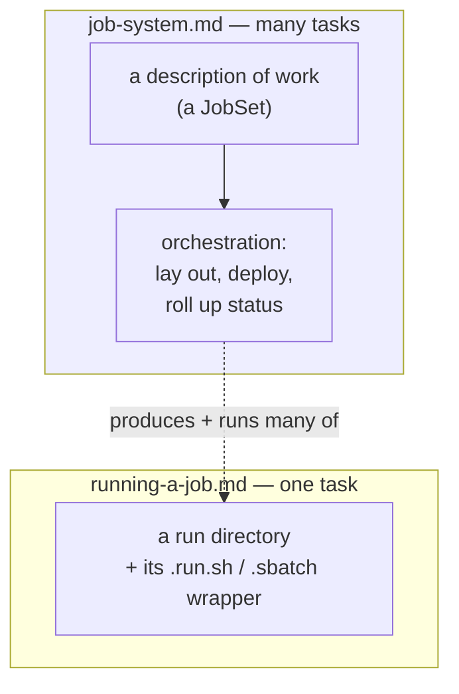
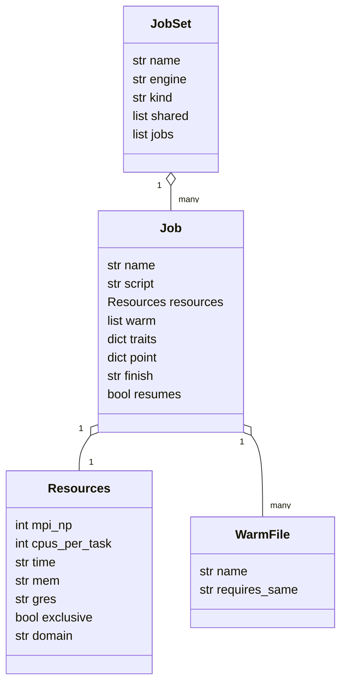
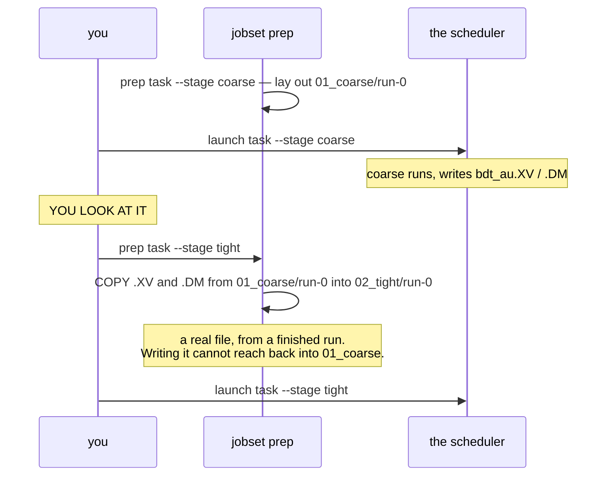
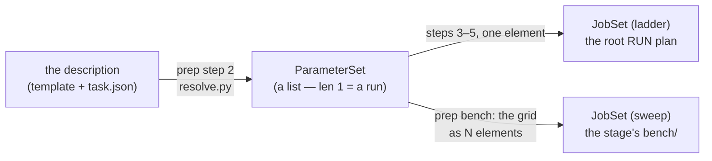
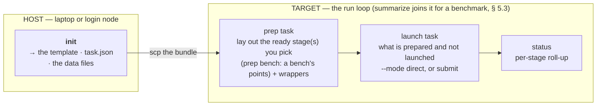
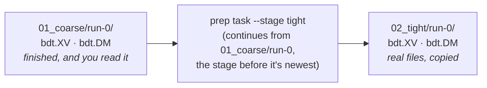
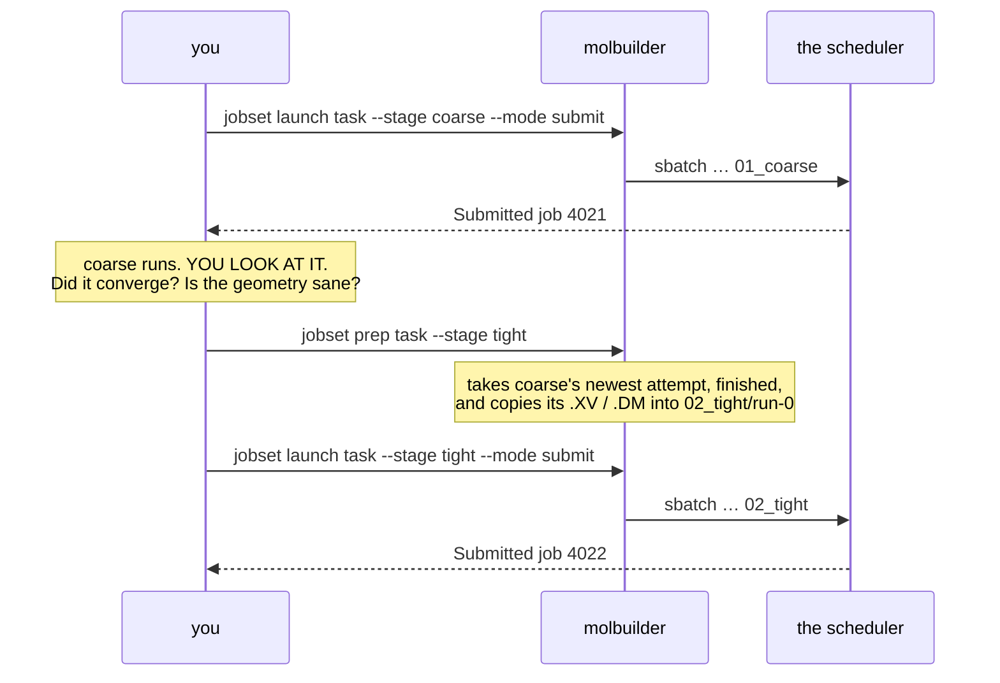
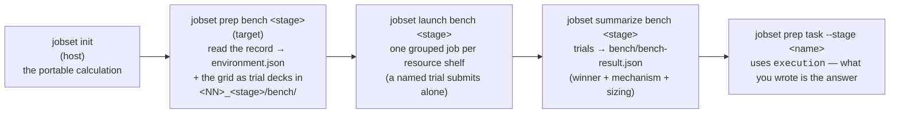
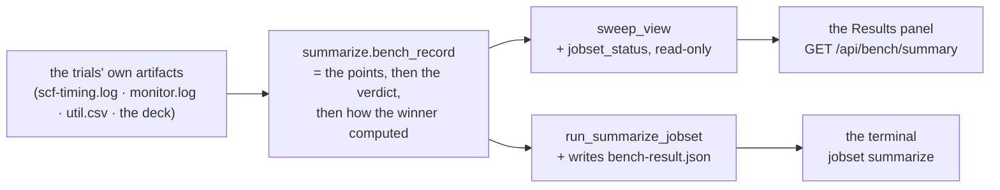

# The job system — batches, ladders, and HPC deployment

**Role:** guide
**Domain:** execution

**Companions:** [`execution/running-a-job.md`](?doc=execution/running-a-job.md)
— the single-job wrapper this framework runs many of;
[`execution/job-contracts.md`](?doc=execution/job-contracts.md) — the run-dir
layout, the wrapper files, and the `job-set.json` / parameter vocabulary this
framework produces;
[`execution/overview.md`](?doc=execution/overview.md) — the execution-domain
map and the current → target status picture;
[`engines/tuning.md`](?doc=engines/tuning.md) — the scientific *values* behind
the staged ladders (this page covers only how they are *scheduled*).

---

## The short version

**Everything is a job set** — one calculation is a job set of one; a
ladder or a benchmark sweep is a bigger one. Same verbs, no shortcuts:

```
jobset init        write the portable description        (your laptop)
jobset prep        derive decks + scripts FOR this machine   (the target)
jobset launch      ONE job per invocation -- run or submit
jobset summarize   summarize results that exist: a sweep's trials -> the
                   record + the report, PRINTED; a transport calculation's
                   bias points -> its I-V record; a SIESTA vibration's
                   force-constant stages -> its displacement sweep
                   (engines/vibration.md 5.9).  It never makes a run's
                   result: every run writes its own (a SIESTA vibration's
                   job derives its modes itself, engines/vibration.md 5.5)
jobset status      every stage of the description: where it stands + the
                   resume point; with a stage, that stage in full -- its
                   deck, what it carries, its resources, its attempts
```

| key rule | one line | where |
|---|---|---|
| **floor 3 is derived** | `job-set.json` is computed at prep ON the target — never produced on one host and shipped to another | § 4 |
| **one grouped job** | a bench sweep is ONE submission that runs trials in sequence, each recording its own `run.json` | § 7 |
| **refuse before the scheduler** | a header the record says will bounce is not emitted (design decision #4 — the mechanism is `scheduler.md`) | § 6 |
| **ladder = stages** | coarse feeds tight through declared warm files; the resume point is read, not guessed | § 3, § 5 |
| **the task** | `prep task` shows which stages are ready and prepares the one(s) you pick; `launch task` sends what is prepared — one job | *The task* |
| **runs are yours** | any stage launched again, warm or `--cold`, however it ended; molbuilder keeps every run, says how each ended, and saves the folder's state before every prep — going back or branching is a `checkpoint restore` | *Runs, stages and checkpoints* |

---

## Runs, stages and checkpoints — what molbuilder does for you, and what stays yours

> *"the contract really should be a rule for the user: what you should do and
> what you should not do otherwise things could be broken, and here are the
> tools for you to keep track of intermediate known good states"* · *"run
> continue warm or cold is user's decision, and error or not, that's user's
> responsibility"* · *"checkpoint is used for the rollover and branching"*
> (user, 2026-10-07)

**molbuilder is a research tool, not a guard.** It keeps your runs apart, tells
you truthfully where each stands and how it ended, and keeps the states you can
go back to. It never decides for you whether a result is good, whether to run
again, or how. This section is the whole contract for runs and stages; the
sections after it say how each part works, and none of them adds a rule this
one does not state.

### The words

| word | what it is |
|---|---|
| **calculation** | one folder, described once by `task.json` and its template |
| **task** | the calculation, as the verbs name it: `jobset prep task`, `launch task`, `summarize task` |
| **stage** | one step of the calculation's ladder — `coarse`, `relax`, `device` — named in the description, prepared once, when you pick it (*The task*, below) |
| **group** | stages that share one job — prepared together, or named together at launch — none building on another, walked in the ladder's order (`project-layout.md` § 1.6.6) |
| **run** | one launch of a stage (`jobset launch task`). Every launch is a new run, numbered on from the last: on the hierarchical layout its own folder, `01_coarse/run-0`, `run-1`, …; on the flat layout its own numbered files in the calculation's folder, `H2_01_coarse-run0.out`, `-run1.out`, … A stage that sweeps the bias (transport, `low_bias_approximation: false`) holds a folder per voltage inside its run (`transport.md` § 2a.11). Inside a run, each start of its wrapper is a **try**, its files carrying `-run<N>` (`project-layout.md` § 1.6.1) |
| **warm / cold** | what a run starts from. **Warm**: the restart files (density, geometry, optimiser history — the restart-file list, [`job-contracts.md`](?doc=execution/job-contracts.md) § 4.2a) a run left. **Cold**: none of them — the engine starts from the deck alone |
| **saved state** | a checkpoint of the whole calculation folder ([`checkpointing.md`](?doc=execution/checkpointing.md)): an id, a note, the time. `molbuilder checkpoint save / list / restore / tag` |

### The task — prepared and launched, stage by stage

> *"we can let prep to prep the whole task and ask the user which stage it
> intend to do. this way it can do the correct carry over of previous stage
> files when needed and when that is ready"* · *"i would just say … prep
> task"* · *"we need one unified framework and protocol and verb design and
> api"* (user, 2026-10-07; the design, D1–D5, agreed 2026-10-08)

**The verbs act on the task** — the calculation `task.json` describes — and
the task tells you, each time, which of its stages can go next:

```
jobset prep task      # the ladder, which stages are ready; prepare the one(s) you pick
jobset launch task    # send what is prepared and not launched -- one job
jobset status         # every stage: where it stands, and what is next
jobset summarize task # read a result that gathers stages (a transport I-V, a sweep)
jobset prep bench <stage> · launch bench <stage> · summarize bench <stage>
                      # a benchmark measures ONE stage -- named, as before
```

**A stage's states, each answered by one door** (`architecture.md` § 3.2) —
`status`, `prep`, `launch` and the Results and Task setup tabs ask the same:

| state | what it means | answered by |
|---|---|---|
| **described** | a stage of `task.json` | the description |
| **ready** | not prepared, and what it builds on is there: the one door that decides what a stage takes (its continuation, or a transport rung's gather, § 5.4) answers without refusing — the stage before it, `relax`, or the rungs upstream have a newest run that finished; a stage that builds on nothing (the first, one set `restart: clean`, a transport ladder's seed and leads) is ready at once | computed each time, never stored |
| **waiting** | not prepared and not ready — the door's refusal says for what (`device waits for electrode_R, which is running`) | the same door |
| **prepared** | its deck, run script and header rendered **from the description as it stood when you prepared it**, its attempt opened with what it carries, recorded in `job-set.json` — `status` reads it `pending` until it is launched | the prepared door (until 2026-10-08 called *prepped*) |
| **launched**, then **ended** | as every run: queued, running, finished, failed — a run stopped before its end (killed, out of time, out of memory) reads failed, the stop in its detail | the run doors |

**`prep task`**, in order — one entry, which the terminal and Task setup's Prep
both call (§ 5.3, *One prep, two doors*):

1. **It reads the description and shows the ladder** — every stage, where it
   stands, and for each one not prepared whether it is ready or what it
   waits for. The description's own checks run every time (§ 5.0, checkpoint
   3), whichever stage is picked.
2. **It asks which ready stage(s) to prepare.** `--stage NAME` answers without
   a terminal (repeat it for several); with no terminal and none named, the
   prep is refused, naming the ready stages and the line that picks them.
   *What is offered pre-selected*: the first ready stage — and, for a kind
   whose stages have roles (transport, a vibration: `template.KIND_ROLES`),
   every ready stage that builds on nothing (D2): a transport ladder's seed
   and both leads; a vibration's force-constant stages when its structure is
   stated relaxed.
3. **Several picked together are a group** — they share one job (`project-
   layout.md` § 1.6.6). Refused, by name, before anything is written: a pick in
   which one stage builds on another, or whose stages cannot share one
   allocation (another queue, ranks, cores per rank, GPUs) — prepare those in
   separate preps.
4. **Each picked stage passes every checkpoint of § 5.0** — the machine and
   its placement, what it builds on (`--from` names another run, `--cold`
   none, for a single picked stage), its decks planned and checked — **then the
   folder is saved once, and every picked stage is written**: its deck rendered
   now, its attempt opened with what it carries, its row in `job-set.json`; a
   group's one header in the calculation's `launch/` folder.
5. **A prepared stage is not prepared again.** Its deck is what its runs run
   with, so every run's record stays true. To change it — a setting, its
   resources, the run it builds on — restore the state saved before its prep
   and prepare it anew; the stages prepared before it keep their runs.
   **A stage not yet prepared is the description's**: change it in Task setup
   or `task.json` until you prepare it (D1).

**`launch task`** — the plan, shown, asked once, sent (§ 6.0):

* **It sends what is prepared and not launched** — one stage, or one group as
  one job. When more than one is waiting it asks which (`--stage`), so it is
  one job per invocation (D3).
* **When nothing new is prepared, it offers the stages launched before**, to
  launch one again: warm by default, or `--cold` (*What molbuilder does for
  you*, 3). `--stage NAME` names it. A group's member is launched again alone
  if you name it alone — a group only ever shared one queue wait (D4) — and
  stages named together with `--stage` go as one group, held to the same two
  checks as at prep.

**What a stage takes, by default, is one rule for every kind** (D5): the
**newest** run of what it builds on, which **must have finished** — an older one
never stands in, because a run launched again to tighten is the one you mean;
`--from` names any other, taken as said (§ 5.4). A transport rung's gather keeps
its own second check — the upstream run ran the deck that rung's description
renders now — and refuses, naming it, when it did not.

*(Until 2026-10-08 the verbs named the kind `run` — `prep run <stage>`,
`launch run <stage>`, `summarize run` — and a stage at each; a group was named
by listing stages at prep.)*

### What molbuilder does for you

1. **Before every prep, it saves the folder's state** — always, the note led by
   the time it was taken (`2026-10-03 14:05:12 · before prep task tight`) — and
   tells you which (§ 5.0, checkpoint 5). So whatever a prep or the runs after
   it do, the state before it is one `checkpoint restore` away.
2. **It keeps every run.** A new launch never writes into an earlier run's
   folder (hierarchical) or over its numbered files (flat): its output, logs,
   launch record and conclusion stay what they were. *On the flat layout the
   restart files are the exception, by what flat is:* they carry the label's
   name, `H2.DM`, `H2.XV`, so every run and every stage in that folder reads
   and writes the same ones — a later run replaces them.
3. **It launches any stage again, however its last run ended** — finished,
   failed, stopped, or still running — **warm by default, or cold when you say
   `--cold`**:
   * warm, it continues from **that stage's own latest run**: on the
     hierarchical layout the next `run-<n>` is opened with the restart files
     the latest one left; on the flat layout the run runs again where its
     files lie. A stage that takes nothing from a run (its run card says
     `restart: clean`) or whose kind restarts from the beginning anyway (a
     force-constant run, a PySCF vibration) starts over: nothing is handed on
     from a run of its own;
   * cold, it takes nothing from a run of its own: the next `run-<n>` is opened
     with none of them; on the flat layout its run script is started with
     `--cold --force`, which **removes** the restart files lying in the folder
     before the engine starts (a deck that reads them would otherwise read
     them);
   * either way a transport rung keeps the inputs its prep gathered (the
     leads' Hamiltonians, the seed's density), copied with their record;
   * **a stage that sweeps the bias** reads "its own latest run" at the point:
     warm, each point **done** in the latest run is taken over into the new
     run and only the points not done are run; cold, every point is run
     ([`engines/transport.md`](?doc=engines/transport.md) § 2a.11).

   Before anything is sent, `launch` shows you the exact line, which run it
   follows, **how that run ended**, and what is copied — and asks once
   (§ 6.0). It does not refuse because of how a run ended, and it does not
   ask a second question about it.
4. **It tells you where each stage and run stands, from one check.** `jobset
   status`, the Results tab's ladder and every reader that needs a run's state
   ask the same door ([`architecture.md`](?doc=execution/architecture.md)
   § 3.2): not launched, queued, running, finished, or failed — with the reason
   the run gave, or that it stopped before its end (killed, out of time) — and,
   in a column of its own, whether it converged: `SCF yes` / `NO`, or for a
   relaxation `geometry yes` / `NO` — read from the same scan of its output,
   never folded into the state (a run can finish and not converge). It says what launching again would do; it
   does not tell you whether to.
5. **It writes every decision down** — what each prep and launch found, what
   each run continued from, what you were asked and what you answered — in the
   calculation's `jobset-decisions.log`.
6. **It continues a run that used up its budget only as your template says.**
   A SIESTA template's `continue_retries` (the catalogue's default is 1; set
   `0` and the run script has no retry) lets one job re-run its stage warm, as
   its next run, when the engine stopped because it used its budget without
   converging — the SCF's
   iteration limit under `SCF.MustConverge`, or a relaxation's step limit —
   never after a crash ([`running-a-job.md`](?doc=execution/running-a-job.md)
   § 3.5).

### What stays yours

* **Whether a run is good enough to use** — its convergence, its geometry, its
  physics. molbuilder reports; you judge.
* **Whether to launch again, warm or cold, and when.** Launching again while
  the last run is still running is not stopped: both run.
* **Which stage to prepare next, and which run it builds on.** `prep task`
  offers the ready stages and takes, by default, the newest run of what each
  builds on, which must have finished, and says which; you can name any run
  with `--from` (taken as said — prep states what it sees there, failed or not
  converged) or none with `--cold` (§ 5.4).
* **Keeping a state you trust** — `molbuilder checkpoint save -m "…"` at any
  moment, and `checkpoint tag` to name it.

### How the checkpoint supports you

A prepared stage keeps the deck and scripts its runs ran with, so every run's
record stays true to what ran — `prep` does not rewrite a stage it prepared. To
change something about a stage — a setting, its resources, the machine, the run
it builds on — **go back to the state saved before its prep and prep it anew**:

```
molbuilder checkpoint list                 # the states, newest first, each with its time
molbuilder checkpoint restore <id>         # the folder as it was before that prep
molbuilder jobset prep task --stage <stage> ...   # prepared as you now want it
```

Going back is not losing: restoring a state and working from it is how you
**branch** — the state you left stays listed, and you can restore it again. Use
it the same way to try two settings side by side, to undo a stage you no longer
want, or to return to a result you tagged.

A stage you remove from the description leaves its files where they are,
untouched, and its number stays taken (`tight` stays `03_tight`); nothing lists,
preps or launches it. To have it back, restore a state saved before you removed
it ([`project-layout.md`](?doc=execution/project-layout.md) § 4.2).

### Use the jobset commands

These promises hold for what the `jobset` commands do. A deck or run script run
by hand, a file edited in a run's folder, a folder copied elsewhere — molbuilder
reads what it finds and says what it sees, but it did not write it and cannot
vouch for it. Use the checkpoint verbs rather than bare `git` in a calculation
folder ([`checkpointing.md`](?doc=execution/checkpointing.md) § 2.0).

---


## 1. What the job system is, and why it exists

> **Everything is a job set** *(decided 2026-08-11, user)*. One calculation is
> not a smaller, different thing than a ladder or a sweep — **it is a job set of
> one**, and it goes through these commands, not a shortcut beside them. There
> is no `molbuilder run`.

### The problem it solves

[`running-a-job.md`](?doc=execution/running-a-job.md) covers running **one**
calculation: you generate an input, the wrapper activates the right software
environment, runs the engine, and you watch it. That is the whole story for a
single task — and for a long time it was the only story molbuilder told.

Real research is not one task. A single result usually needs a **sequence** of
runs (relax a molecule loosely first, then tightly), and a project needs
**many** such sequences (the same analysis across dozens of structures). Getting
those onto a supercomputer adds its own chores: writing scheduler headers,
laying out each stage so it can start from the last one's results, carrying
restart files forward between stages, and — before any of that — figuring out
how many GPUs and CPU cores actually make a given calculation fastest on a
given machine.

Done by hand, that is a pile of error-prone shell scripting that every user
re-invents. The **job system** exists to make it a described, repeatable thing:
you say *what* you want as data, and molbuilder handles *how* to lay it out,
deploy it, and watch it — the same way whether it runs on your laptop or a
cluster. **What it does not handle is deciding that one stage should follow
another; that is yours** (§ 2, decision 6).

### The mental model, in one picture

The job system sits **above** the single-job wrapper. It never replaces the
wrapper — it produces many of them and orchestrates them.


```mermaid
flowchart TB
    subgraph single["running-a-job.md — one task"]
      W["a run directory<br/>+ its .run.sh / .sbatch wrapper"]
    end
    subgraph system["job-system.md — many tasks"]
      direction LR
      D["a description of work<br/>(a JobSet)"] --> O["orchestration:<br/>lay out, deploy,<br/>roll up status"]
    end
    O -.->|"produces + runs many of"| W
    classDef s fill:#eef;
    class system s;
```

Concretely, three kinds of "many jobs" all reduce to the same object:

- a **staged ladder** — one molecule, relaxed in increasingly tight stages, each
  stage a separate job that you start once you have looked at the one before it;
- a **parameter sweep** — the same calculation run at many resource settings to
  find the fastest (this is what benchmarking is);
- a **device workflow** — the transport composite (shipped 2026-08-29):
  one CITED junction relaxation, five derived stages — the electrodes are
  DERIVED from the junction's own labeled blocks, never separately relaxed
  ([`archive/2026-09-01-transport-design.md`](?doc=archive/2026-09-01-transport-design.md) ruling Q5).

The object they all reduce to is a **`JobSet`** (§ 3).

### A one-paragraph scenario (what a user actually does)

You have a molecule `bdt.xyz` and want a publication-quality relaxed geometry on
your cluster. You run **one** command to produce a *bundle* — a self-contained
directory holding a coarse stage and a tight stage plus a `job-set.json`
describing both. You `scp` the bundle to the cluster, then work **one stage at a
time**: `prep task --stage coarse` (lay out its folder and wrapper), `status coarse` (review
its deck and resources), `launch task --stage coarse` (hand that one job to the scheduler). When it
finishes you **look at it**, then `prep task --stage tight --from 01_coarse/run-0` —
which copies coarse's relaxed coordinates in — and submit that. You check
`status` whenever you like. You never wrote a `#SBATCH` header.

### Where it stands today (read this before the details)

> **The job system is shipped on the command line; the web describes,
> prepares and observes.** Everything in this document — the `JobSet` model,
> the `molbuilder jobset` verbs, one-job-at-a-time SLURM submission with
> routing domains, and the whole benchmark workflow — works today from a
> terminal. The web's half is the description (the Task setup tab writes
> `task.json` + the template — [`web/task-setup.md`](?doc=web/task-setup.md)),
> `prep` through the same entry the terminal calls (§ 5.3, *One prep, two
> doors*), and the Results tab; `launch` stays on the terminal **by design**:
> it spends a queue slot, one job per invocation, by hand. The Results tab shows
> `status`'s ladder (§ 5.3); a web plan view was dropped (W14, § 8).

> ### How a ladder advances
>
> **You prepare one stage, look at what it produced, and prepare the next.**
> Nothing starts a stage but a person — there is no flag and no field that
> makes one follow another (§ 2, decision 6).
>
> What a stage continues from is a **real file, copied in at `prep`** — by
> default from the newest attempt of the stage before it, which must have
> finished, or from a run **you name** (§ 5.4). By then it has finished and
> you have read it, so there is nothing to resolve later and nothing pointing
> at a file that does not exist.
> That is a ladder of **independent** stages; in a **linked** one — a
> vibration's `freq`, transport's device and transmission — `prep` takes a
> stage's input from the stages before it, because the calculation fixes it
> (§ 5.4).
>
> | | |
> |---|---|
> | Who starts stage 2 | **you**, after looking |
> | How stage 1's geometry arrives | a **file copy**, made at prep from stage 1's newest attempt, or the one you name |
> | If stage 1 converged to something wrong | you never started stage 2 |
>
> The earlier scheduler-chained design is recorded in
> `archive/2026-08-10-stage-chaining.md`.

---

## 2. The design logic — why it is built this way

Six decisions shape everything below. Understanding them makes the rest obvious.

**1. Describe work as data; keep the engine out of it.** A `JobSet` is a plain
data object (a JSON file), not code. Producers turn engine configs *into* a
`JobSet`; the orchestration verbs (`prep`/`launch`/`status`) operate on
the `JobSet` **without knowing or caring which engine it targets**. This is why
one small set of verbs can drive SIESTA ladders and benchmark sweeps alike, and
why adding a new engine later means writing one new *producer*, not a new
orchestrator.

**2. Reuse the single-job wrapper unchanged.** The job system does not invent a
new way to run a job. Each job in a `JobSet` is launched by exactly the
`.run.sh` / `.sbatch` wrapper from
[`running-a-job.md`](?doc=execution/running-a-job.md), built by the same
function. So everything true of a single run — env routing, warm/cold restart,
GPU pinning, the monitor — is automatically true of every job in a batch. The
framework adds *orchestration around* the wrapper, never *inside* it.

**3. The machine's knowledge lives on the machine, not in the user's head
("target isolation").** The bundle you produce on your laptop is
target-agnostic. The cluster-specific facts — which activation command, how many
cores a node has, which partition — are resolved on the **target** at `prep`
time and baked into the scripts there. You do not need to know the cluster's
layout to submit to it.

**4. Fail early, never guess.** A malformed `JobSet` — duplicate job names, an
unknown `kind`, a warm-file condition naming a trait the job never declares, a
missing partition — is rejected at produce/validate time with a clear message,
not discovered halfway through a cluster run. The framework refuses to emit an
incomplete SLURM header rather than submitting something that will bounce.

**5. molbuilder informs; the user decides.** The framework never silently
auto-resumes a failed or interrupted run. `status` tells you which stage is
incomplete and what restart files exist; **you** choose to re-submit. This keeps
a surprising re-run from quietly overwriting hours of results.

**6. The order is a person's, not the data's.** Every job in a `JobSet` is
independent as far as the framework is concerned: **nothing in a `JobSet` says
"start this one after that one."** A *ladder* and a *sweep* differ in how their
directories are named and whether a person is meant to take them in order —
neither waits for the other.

**Why the ordering lives with the person.** Whether stage 2 should start is a
judgement about stage 1's result, and nothing in the data can make it. A stage
is a long job; one that continues by itself can spend a week refining a geometry
you would have rejected in a minute. So the order lives where the judgement
lives — one `prep` and one `launch` at a time.

**What this costs, stated plainly.** A branching graph (a "diamond", for a
two-electrode device) has no representation. If one is ever needed it comes back
as something a person asks for at launch, never as a field a description stores.

---

## 3. The data structure — a `JobSet`, piece by piece

A `JobSet` is the whole description of a batch, saved as `job-set.json`
(`molbuilder/jobset/model.py`, schema `molbuilder/job-set@1`). It is deliberately
small — five concepts:


```mermaid
classDiagram
    class JobSet {
      str name
      str engine
      str kind
      list shared
      list jobs
    }
    class Job {
      str name
      str script
      Resources resources
      list warm
      dict traits
      dict point
      str finish
      bool resumes
    }
    class Resources {
      int mpi_np
      int cpus_per_task
      str time
      str mem
      str gres
      bool exclusive
      str domain
    }
    class WarmFile {
      str name
      str requires_same
    }
    JobSet "1" o-- "many" Job
    Job "1" o-- "1" Resources
    Job "1" o-- "many" WarmFile
```

**There is no edge anywhere in this picture.** No job names another job. That is
decision #6, and it is the single most important thing about the shape.

Walk through it with the *why* for each piece:

- **`JobSet.kind`** is `"ladder"` or `"sweep"`. **Both are sets of independent
  jobs**; the kind says how their folders are named and whether they have an
  order a *person* should follow — a ladder's stages are meant to be run in
  sequence, a sweep's points are not. It does **not** mean one job waits for
  another: neither does. The kind drives the directory convention
  (`<seq>_<name>` versus `bench/bench-<point>` inside the stage it measures,
  `job-contracts.md` § 6.3) and nothing about scheduling.
- **`JobSet.shared`** lists files that every job needs but that never change
  between jobs — the pseudopotentials and the geometry, and the
  atom-permutation record when the decks come from a sorted copy
  (`engines/vibration.md` § 5.2). (The monitor travels beside each wrapper
  instead, `run-reports.md` § 2.3, and so does a job's finish.) They
  are **copied** into each job's folder as real files (user, 2026-08-24): a run
  directory holds everything it needs, and a link holds nothing
  ([`project-layout.md § 1.0`](?doc=execution/project-layout.md)).
- **`Job.finish`** names the bundle the wrapper runs after the engine when the
  engine alone leaves no result — a SIESTA force-constant stage's
  `mb_vibration.pyz` (`engines/vibration.md` § 5.5) — copied from the deck's
  spec and born beside the job's deck; absent for every other job and for a
  benchmark trial.
- **`Job.resumes`** says whether a re-run of the job continues from what the
  last one left — the rung's own kind's warm-files fact
  ([`job-contracts.md`](?doc=execution/job-contracts.md) § 4.2a), false for a
  SIESTA force-constant stage — and the wrapper reads it for every text that
  speaks of a retry; absent from `job-set.json` when true.
- **`Job.name`** does double duty: it keys the job's folder *and*
  its scheduler job name (`-J`), so a `squeue` listing reads the way the layout
  does. **`Job.script`** is the input file inside that folder.

  > **The naming split landed** *(this note used to say "point-<name>/ is
  > today's naming for every job, and it splits")*: a **stage** is
  > `<seq>_<stage>` (`01_coarse`) because a stage is ordered; a **trial** is
  > `bench-<point>` inside its stage's `bench/` container, named by its
  > settings because a sweep has no order. The full table, for every layer,
  > is [`job-contracts.md`](?doc=execution/job-contracts.md) § 6.3.
- **`Job.resources`** (`Resources`) are the per-job scheduler asks — all optional,
  `None` meaning *unstated*, which nothing fills in: a launch value stated
  nowhere is refused ([`architecture.md`](?doc=execution/architecture.md)
  § 5.2). They use the **scheduler's
  vocabulary** (`mpi_np` for MPI ranks → `-n`; `cpus_per_task` for cores/rank →
  `-c`; `time`, `mem`, `gres`, `exclusive`, `domain`), the same names the
  persisted files and SLURM flags use — the full mapping is pinned in
  [`job-contracts.md § 6.2`](?doc=execution/job-contracts.md). Per-job resources
  matter because a coarse first stage and a tight final stage want very
  different node sizes.
- **`Job.warm`** (a list of `WarmFile`) is what this job would take **from
  whatever run it is continued from** — not from a named job. `name` is a
  concrete filename; `requires_same` names a key both runs must agree on for the
  file to mean anything, looked up in `Job.traits`.

  > **It says WHAT, never FROM WHOM**, and that is the whole design. Which
  > run this job is continued from is decided at `prep` — the stage before it,
  > newest, by default, or a run a person names with `--from` (§ 5.4) — so the
  > producer, which runs long before anyone has looked at anything, is not
  > asked to know.
  >
  > `.CG` is why `requires_same` exists: a conjugate-gradient history is
  > meaningless to a Broyden stage, so carrying it blindly corrupts the restart.
  > SIESTA puts its optimizer in `traits`; the framework compares two strings
  > and knows nothing else about either engine.

- **`Job.traits`** are opaque per-job strings a `requires_same` is compared
  against. The framework never interprets them.

Every `JobSet` is checked by **`validate()`** before it is used: the `kind` must
be known, names unique, and every `WarmFile.requires_same` must name a trait the
job actually declares — a condition on a key that is not there is a condition
that can never be tested, so it is refused rather than silently ignored.

### 3.1 A real `job-set.json`, field by field

Descriptions of a format are easy to nod along to and hard to check. Here is an
actual two-stage ladder for benzene-dithiol on gold, with every field annotated:

```jsonc
{
  "schema": "molbuilder/job-set@1",   // versioned: a reader refuses a major it
                                      // does not know, rather than guessing
  "name":   "bdt_au",                 // the calculation's id — also the SIESTA
                                      // SystemLabel every deck shares
  "engine": "siesta",
  "kind":   "ladder",                 // how the folders are named + whether a
                                      // PERSON should run them in order.  Neither
                                      // kind makes one job wait for another.

  "shared": ["C.psml", "H.psml", "S.psml", "Au.psml"],
                                      // copied into every job's folder,
                                      // as real files

  "jobs": [
    {
      "name":   "coarse",             // → folder 01_coarse/ AND squeue -J bdt_au/coarse
      "script": "bdt_au_01_coarse.fdf",  // the deck, in the bundle root.  The
                                      // TOKEN in this filename is where the
                                      // directory's `01` comes from -- it is
                                      // read back off the deck, never counted
                                      // (decision 27).  A ladder job whose
                                      // script carries no token falls back to
                                      // `bench-<name>`, because inventing a
                                      // seq would be guessing at the one
                                      // number that must never be guessed.
      "resources": {                  // EVERY field is always written; the
                                      // count lives in job-contracts.md
                                      // § 6.2 and nowhere else (it was
                                      // stated as seven here and as nine
                                      // in this comment, against fifteen)
                                      // (§ 4.1 and job-contracts § 6.2, U19:
                                      // seven scheduler asks plus the two
                                      // no-flag riders, continue_retries and
                                      // max_memory_mb -- this comment said
                                      // "seven" while its own § 4.1 named
                                      // the eighth),
        "domain":        null,        // nulls included — see the note below
        "time":          "0-04:00:00",
        "exclusive":     null,
        "mem":           null,
        "gres":          null,
        "mpi_np":        8,
        "cpus_per_task": 4
      },
      "warm":   [],                   // takes nothing from an earlier run --
                                      // starts from the .fdf's own coordinates
      "traits": {"optimizer": "CG"}   // opaque; only compared against another
                                      // job's, never interpreted
    },
    {
      "name":   "tight",
      "script": "bdt_au_02_tight.fdf",
      "resources": {
        "domain":        null,
        "time":          "1-00:00:00",
        "exclusive":     null,
        "mem":           null,
        "gres":          "gpu:1",
        "mpi_np":        32,          // 4× the ranks: the tight stage is the
        "cpus_per_task": 4            // expensive one, and per-job resources
      },                              // are the whole reason they are per-job
      "warm": [                       // WHAT it would take from a run it is
                                      // continued from -- never WHICH run.
        { "name": "bdt_au.XV" },                            // relaxed geometry
        { "name": "bdt_au.DM" },                            // density matrix
        { "name": "bdt_au.CG",                              // optimizer history
          "requires_same": "optimizer" }   // ...only if both used the same one
      ],
      "traits": {"optimizer": "CG"}
    }
  ]
}
```

*(Abridged from a dump of that `JobSet`'s `to_dict()`: the key order and the
value forms are the real ones — a time is SLURM's `D-HH:MM:SS` — and a real dump
writes every `Resources` field, null or not; job-contracts § 6.2 counts them.
It claimed to be the dump itself until 2026-10-01, beside seven of fifteen
fields and a time in a form the model never stores.)*

> **`null` is a value here, and it does not mean "zero" or "off".** It means
> **unstated**, and prep never leaves a launch value the job needs unstated: a
> missing rank count, cores per rank or GPU count — and, on a target with a
> scheduler, a missing queue, wall or memory — is refused at prep
> ([`architecture.md` § 5.2](?doc=execution/architecture.md)). What stays `null`
> is what this job does not use. A `mem` of `"0"` is SLURM's *"give me the
> whole node's memory"*. The fields are written out even when null so the file
> shows you the complete set of questions that will be answered, rather than
> hiding the ones nobody answered yet. This is the *assistant, not nanny* rule in
> file form: molbuilder does not quietly pick a node size for you.

**What that file becomes on disk.** `molbuilder jobset prep` reads it and lays
out the tree — drawn, for both shapes, in
[`project-layout.md § 1.1`](?doc=execution/project-layout.md), which owns it.
Every job's folder holds **real copies** of its inputs, never links.

> ⚠ **The root drawn below is the *calculation* directory**
> (`projects/<project>/<topic>/<calculation>/`), not a folder of its own. This
> page called it a *bundle* and put it nowhere in particular; the two are the
> same directory, and **`calculation` is the name that wins** — `task.json` is
> the source and `job-set.json` is derived from it, so naming the folder after
> the derived file names it after something you can delete and regenerate. The
> reasoning is [`project-layout.md § 1.0`](?doc=execution/project-layout.md); the
> `-bundle` spelling is kept in the trees below only because it is what the code
> writes today. *Corrected 2026-08-11.*


**Nothing in `02_tight/` exists until you ask for it.** `prep task --stage <stage>`
lays out that stage's folder, its wrappers and its `run-<n>` attempt, and copies
in what it continues from — by default the newest run of the stage before it,
which must have finished, or the run `--from` names (§ 5.4). So tight's
`run-0/` appears in a ladder's tree
([`project-layout.md § 1.1`](?doc=execution/project-layout.md)) only **after**
you have run coarse, looked at it, and set tight up.

> **A SWEEP's tree differs in two ways**: its folders are named by their
> **settings** rather than by a position (its points have no order, so no
> ordinal), and a point's attempt is a measurement, made once — a trial is
> launched once; measuring it again is the state saved before the
> benchmark's prep, restored, and a prep anew
> ([`project-layout.md § 1.5`](?doc=execution/project-layout.md)). Nothing is
> copied between points.
>
> ```text
> bench-G1K2C4/        ← G<gpus>K<ranks-per-gpu>C<cores-per-rank>,
>                        named by its SETTINGS, not a position;
>                        its deck, wrapper and pseudopotentials are its own
> ```
>
> **The prefix is `bench-`, and since 2026-08-12 a described trial lives in
> its stage's `bench/` container** — `<NN>_<stage>/bench/bench-<point>/`
> ([`job-contracts.md § 6.3`](?doc=execution/job-contracts.md), the
> cross-layer authority; landed with the fold, C6 + U1). *(This note said
> "the shipped code still writes `point-`" while that was true; it stopped
> being true when the fold landed the rename, and `summarize` maps a trial
> back to its point through the job-set's own data, never by parsing the
> directory name.)*

**Nothing dangles, because nothing points anywhere**: every file in a job's
folder is its own. **No job's directory reaches into another's.**

What a stage continues from is copied by `prep task --stage tight` — by default out of
the newest attempt of the stage before it, which must have finished and which
you have already looked at, or out of the one `--from` names (§ 5.4):


```mermaid
sequenceDiagram
    participant U as you
    participant P as jobset prep
    participant S as the scheduler
    P->>P: prep task --stage coarse — lay out 01_coarse/run-0
    U->>S: launch task --stage coarse
    Note over S: coarse runs, writes bdt_au.XV / .DM
    Note over U: YOU LOOK AT IT
    U->>P: prep task --stage tight
    P->>P: COPY .XV and .DM from 01_coarse/run-0 into 02_tight/run-0
    Note over P: a real file, from a finished run.<br/>Writing it cannot reach back into 01_coarse.
    U->>S: launch task --stage tight
```

**The copy is the thing a person can check** — it is a real file, present
before the stage starts, from the run `prep` said it took (§ 5.4).

A complete 2-stage ladder `job-set.json`:

```json
{
  "schema": "molbuilder/job-set@1",
  "name": "bdt", "engine": "siesta", "kind": "ladder",
  "shared": ["Au.psml", "S.psml", "C.psml", "H.psml"],
  "jobs": [
    { "name": "stage1", "script": "bdt_01_stage1.fdf",
      "resources": { "domain": "htc", "time": "0-04:00:00" },
      "warm": [], "traits": { "optimizer": "CG" } },

    { "name": "stage2", "script": "bdt_02_stage2.fdf",
      "resources": { "domain": "public", "time": "7-00:00:00", "exclusive": true },
      "warm": [ { "name": "bdt.XV" },
                { "name": "bdt.DM" },
                { "name": "bdt.CG", "requires_same": "optimizer" } ],
      "traits": { "optimizer": "CG" } }
  ]
}
```

Read it back in plain language: *a SIESTA ladder named `bdt`; four
pseudopotentials are shared by both stages; stage 1 runs on the
`htc` domain for up to 4 hours; stage 2 runs on the `public` domain (the whole
node), and **if you continue it from something**, it will take that run's `.XV`
coordinates and `.DM` density matrix — plus its `.CG` optimizer history, but
only if that run also used CG.*

**Notice what the file does not say: when stage 2 runs, or after what.** It
cannot. Both jobs are described, neither is scheduled, and the order is
something you carry out one command at a time.

---

## 4. Where `JobSet`s come from — derived at `prep`, from the description

A `JobSet` is never written by hand — and it is never emitted *beside* the
description either. **`prep`, on the target machine, derives it from the
description** (the template + `task.json`, floor 2) as part of its five steps
([`project-layout.md § 2.3.1`](?doc=execution/project-layout.md)): step 2
resolves the description against this machine into a `ParameterSet`
(`molbuilder/resolve.py`) — **always a list**, a production run being the list
with one element and a benchmark the same list with N
([`generator.md § 5`](?doc=execution/generator.md)) — and steps 3–5 render one
deck and wrapper per element and write the plan down. The root `job-set.json`
is the RUN plan, merged per stage and never overwritten; a sweep's own record
lives in the stage's `bench/` container (`job-contracts.md` § 6.1).


```mermaid
flowchart LR
    D["the description<br/>(template + task.json)"] -->|"prep step 2<br/>resolve.py"| PS["ParameterSet<br/>(a list — len 1 = a run)"]
    PS -->|"steps 3–5, one element"| L["JobSet (ladder)<br/>the root RUN plan"]
    PS -->|"prep bench: the grid<br/>as N elements"| S["JobSet (sweep)<br/>the stage's bench/"]
```

> **This section was titled "the two producers" until 2026-08-12** and walked
> `stages_to_jobset` (the SIESTA ladder) and `sweep_to_jobset` (the benchmark
> grid) as today's builders. Both were **deleted in the 2026-08-12 fold** (plan
> step 6 u5), along with `build_siesta_stage_bundle` and `bench/to_jobset.py`:
> they took an in-memory config assembled from CLI flags and emitted the
> `JobSet` *beside* the description instead of deriving it *from* it — the one
> defect the 2026-08-11 source read named (*every floor writes its artifact
> and reads none*). The engine knowledge they held did not vanish: what a
> SIESTA stage *is* still lives in `molbuilder/siesta/stages.py`, consumed by
> `prep`'s engine seam instead of by a producer.

### 4.1 The SIESTA staged ladder

`molbuilder/siesta/stages.py` holds SIESTA's stage knowledge — the shipped
ladder (`default_siesta_stages`), what a stage's warm restart means, and the
traits a warm condition is compared against — consumed at `prep` through the
engine seam (`jobset/engines.py`): one job per stage of the description's
ladder, script `<label>_<NN>_<stage>.fdf`. An engine config carries no stage
list, so the ladder lives in `task.json`, never in the config
([`engines/stages.md`](?doc=engines/stages.md)
§ 1.1). Three things are *derived*, and each encodes a design decision:

- **A stage that runs out of steps without converging simply stops**, and you
  decide what to do about it — which is what you were doing between stages
  anyway.

  > **PySCF was different while its ladder ran as a loop inside one process**
  > (§ 4.2): its `on_nonconvergence` was ordinary control flow in the emitted
  > script, where SIESTA's stages are separate jobs started by a person and so
  > have no equivalent for it to control.
  >
  > ⚠ **The asymmetry is retired 2026-08-18**
  > ([`stages.md § 1.1a`](?doc=engines/stages.md)): both engines run N decks as
  > N jobs, so what happens after a rung fails to converge is once again the gap
  > between two jobs for both of them.
- **The warm-file declaration is chosen for correctness, not convenience.**
  Each stage declares what it would take from a run it is continued from — and
  **a stage whose description says `restart: clean` declares nothing at all**,
  because it is not continuing from anything. For a continuing stage, `.XV`
  (coordinates) and `.DM` (density matrix) are unconditional; `.CG`
  (conjugate-gradient optimizer state) carries `requires_same: "optimizer"` —
  a CG state is meaningless to a Broyden stage, so carrying it blindly corrupts
  the restart. The comparison is made at `prep`, between **this stage and the
  attempt you named with `--from`**, over each one's resolved config.

  > **What changed, and why the old rule could not survive `--from`.** It
  > compared *consecutive* stages in the ladder — which silently assumed the
  > previous rung is what this one continues from. Once you name the source
  > yourself, that assumption is simply false: `prep task --stage tight
  > --from 01_coarse/run-2` may continue a stage two rungs back, or an earlier attempt
  > of this same stage. So the comparison moved to the pair that actually
  > matters.
- **Resources are per-stage** — each stage's run card (`execution`) states its
  own over the calculation's, and nothing is filled in
  ([`architecture.md` § 5.2](?doc=execution/architecture.md)) — so a coarse
  stage and a tight stage can be sized differently.

**The shipped default ladder** (the *structure*; the *values* and their
scientific rationale live in [`engines/tuning.md`](?doc=engines/tuning.md)):

| Stage | Enabled by default | Relaxation | Steps |
|---|:--:|---|--:|
| coarse | ✅ | CG | 600 |
| medium | ✅ | Broyden | 200 |
| tight | — | Broyden | 100 |

*(The rows said `stage1/2/3` — positional names the P4 rename retired;
the shipped ladder names its rungs `coarse` / `medium` / `tight`.)*

*(Whether to go on after a stage runs out of steps is a question you answer by
looking at it.)*

The three **strategy presets** flip only the enable flags:
`loose-only` = (✅, —, —), `publishable` = (✅, ✅, —),
`vib-quality` = (✅, ✅, ✅).

**The warm-retry budget now travels the whole way** (fixed 2026-08-07).
`continue_retries` rides `jobset.Resources` on the resolved element — the same
road every machine-side value takes since the fold — and `jobset/prep` hands it
to `write_run_wrapper`, which bakes it into the wrapper's own retry loop
(`?doc=execution/running-a-job.md` § 3.5). It becomes **no `sbatch` flag**,
which is why it is the one row of `job-contracts.md § 6.2`'s translation table
with no SLURM name. *(Until 2026-08-12 this sentence named `stages_to_jobset`
as the carrier and called the field "an ordinary field of the shared schema" —
the producer died in the fold, and the machine facts left floor 2 with it:
the budget is part of the allocation `resolve.py` puts on the element, not of
the template.)*

**The retries happen inside the one job the scheduler ran.** `continue_retries`
is a loop in a single job's wrapper — it is not a between-jobs mechanism, and
`job-contracts.md § 6.2` marks it as the one row of the translation table with
no SLURM name.

> **`on_nonconvergence` is a PySCF field.** `engines/stages.md` § 3 keeps it out
> of the shared stage schema: it controls a loop inside one emitted script, and
> SIESTA has no such loop to control.

### 4.2 The benchmark sweep

`jobset prep bench <stage>` builds a **sweep** — one independent job per point
of a `(GPUs, ranks-per-GPU, cores-per-rank)` grid enumerated from *this*
machine's probed topology (`molbuilder/bench/grid.py::sweep_grid`), handed to
the same five steps as a longer `ParameterSet`, **nothing carried between
points** (they do not depend on each other, and never did — this is why the
sweep was never a reason to keep the edge machinery). Because a sweep is just
another `JobSet`, the same `jobset` verbs run it — benchmarking is not a
separate machine, it is `prep` whose parameters are a set rather than a point
([`project-layout.md § 2.3.1a`](?doc=execution/project-layout.md)). *(This
heading named `bench/to_jobset.py::sweep_to_jobset` as the builder until
2026-08-12 — deleted with the fold, § 4's note.)*

> **Both engines' ladders are the same object** — N decks, N jobs, a person
> looks between the rungs ([`stages.md § 1.1a`](?doc=engines/stages.md)).
> *(PySCF's ran as an in-script loop inside a single `.py` until 2026-08-18 —
> genuinely a different object then: its stages advanced in memory while
> SIESTA's advanced because a person prepared the next one. The loop is
> retired; the history and the reasoning live in § 1.1a.)* The spectra and
> transport producers migrated too (2026-08-21 / 2026-08-29 — `archive/2026-09-01-roadmap.md`'s
> migration box records both).

---

## 5. The workflow — init, prep, launch, summarize, status

**One verb on the host** (where you design the calculation) and **four on the
target** (where it runs). They mirror the design: the host step writes files and
nothing else, and scheduler contact happens only at `launch`.

| where | verb | what it does |
|---|---|---|
| **host** | `init` | write the portable description — § 5.1 |
| target | `prep` | resolve this machine, render the deck and wrapper, build the run directory |
| target | `launch` | start **one** job — `--mode direct` or `--mode submit` |
| target | `summarize` | summarize results that exist: a benchmark's trials into a verdict; a transport calculation's bias points into its I–V record; a SIESTA vibration's force-constant stages into its displacement sweep (`engines/vibration.md` § 5.9). Never a run's own result — every run writes that itself (§ 5.5 there) |
| target | `status` | every stage of the description, where it stands, and the one to resume from; with a stage, that stage in full |

> **This section's title and its count were both stale** *(corrected
> 2026-08-11)*. It read *"produce, prep, plan, submit, watch"* over *"four verbs
> on the target"* — the set from before `describe` (now `init`) and `summarize` joined the
> grammar in § 5.3, and *produce* is the undefined noun
> [`architecture.md`](?doc=execution/architecture.md) § 4 retired in favour of
> the verb people actually type. A section that names its own verbs is the last
> place the list should lag.


```mermaid
flowchart LR
    subgraph host["HOST — laptop or login node"]
      P["<b>init</b><br/>→ the template · task.json<br/>· the data files"]
    end
    subgraph target["TARGET — the run loop (summarize joins it for a benchmark, § 5.3)"]
      direction LR
      PR["prep task<br/>lay out the ready stage(s) you pick<br/>(prep bench: a bench's points) + wrappers"]
      SU["launch task<br/>what is prepared and not launched<br/>--mode direct, or submit"]
      ST["status<br/>per-stage roll-up"]
      PR --> SU --> ST
    end
    P -->|"scp the bundle"| PR
```

### 5.0 The prep protocol — the agreement, and every checkpoint in order

> **This is the one statement of the protocol.** What follows in § 5 — and the
> documents linked from each row — says how each step works; this section says
> what it is, in order, and who decides what. Both doors run it — the command
> line's `jobset prep` and Task setup's **Prep** (the task's) / **Prep bench** —
> through one entry, `jobset/prep.py::prep_task` (§ 5.3, *One prep, two doors*).

#### Before prep: a described calculation

A calculation is described **once**, and prep only ever reads that description.

| | what happens | what is refused |
|---|---|---|
| **the hand-over** | a parameter tab sends its work to Task setup: the structure pair, the template and `task.1st.json` — a description still missing what only you can say ([`web/handover-procedure.md`](?doc=web/handover-procedure.md)) | — |
| **the description** | Task setup shows what came over and what is still needed; you complete it and save: `task.json` is written beside the template, and `task.1st.json` is removed ([`web/task-setup.md`](?doc=web/task-setup.md) § 2, § 8). From the command line, `jobset init` writes the same pair (§ 5.1) | a folder holding **another** calculation's `task.json` (Task setup § 2); `jobset init` on a folder already described — change it in Task setup or in `task.json` |
| **changing it later** | Task setup opens a described calculation **as it is** — the file is loaded, never merged — and saves what you change, offering to save the folder's state first ([`checkpointing.md`](?doc=execution/checkpointing.md); Task setup § 8) | what the calculation **is** — its name, engine, structure and label — is read-only there (Task setup § 3); its shape is fixed once it has produced (§ 4 there) |

#### The agreement

1. **You state; molbuilder checks.** Every value a run is launched with — its
   ranks and threads, a GPU run's GPU count (asked of the scheduler; with none,
   the run spreads over the GPUs it is given, [`gpu.md`](?doc=execution/gpu.md)
   § 1.1), and where a `.sbatch` is written its queue, wall and memory — is
   stated by you, in the description or on the command line
   ([`architecture.md`](?doc=execution/architecture.md) § 5.2 lists them). The
   target's record **checks** each one and supplies none.
2. **You choose the machine, once.** A calculation is set to the machine of its
   first prep, and that does not change; preparing it for another machine is a
   new prep from a saved state ([`configuration.md`](?doc=configuration.md)
   M-3). Prep never measures a machine: its record is there, or prep refuses
   and prints the probe that writes it.
3. **Everything is decided before anything is written** *(W55 B1,
   2026-10-03)*. Prep first makes its whole plan — every check, every value,
   the text of every file, every folder and what goes into it — with nothing
   written in the calculation (checkpoints 1–4b; a transport junction's
   record is round-tripped through its codec in a scratch folder outside it,
   [`script-preparation.md`](?doc=execution/script-preparation.md) § 3.0). A
   refusal can only come from there, and it
   writes nothing but its line in the ledger, so there is nothing to put
   back. Then the folder's state is saved (5); then the plan is written, which
   decides nothing and refuses nothing (6). Every refusal says why in your
   words and names what to do.
4. **A prepared stage is not prepared again — a redo is a rollback** *(user,
   2026-10-02: "refuse it, redo via rollback")*: go back to the state saved
   before the stage's prep and prepare it anew
   ([`checkpointing.md`](?doc=execution/checkpointing.md) § 7). So that the
   state is there, prep saves the folder's state before it writes anything —
   always, once its checks have passed, the note led by the time it was taken
   — and tells you (checkpoint 5; user, 2026-10-03: "always save through
   checkpoint, notify user").
5. **You advance it, a step at a time.** Prep shows which stages are ready and
   prepares the one you pick — or a group you pick, sharing one job; `launch`
   starts one job and shows it before sending it; nothing starts a stage but
   you (*The task*, at the top; § 5.3, *Three ideas*).
6. **Every decision is written down** — each check that refused, each
   question and its answer, what each stage continues from — in the
   calculation's `jobset-decisions.log`.

#### The checkpoints, in order

| # | checkpoint | passes when | otherwise |
|:--:|---|---|---|
| | ***the plan — nothing is written*** | | |
| 1 | **a described calculation** | the folder holds `task.json` and its template — the one template, named for the label | refused: `jobset init` first — or, from one of its stage or attempt folders, the calculation's own folder named |
| 2 | **the stages picked** — one, or a group | the ladder shown, each stage not yet prepared ready or waiting (*The task*, at the top); the stages picked — `--stage NAME`, repeatable, or the answer to the question — each one the description holds, by its name or `#N` (its folder's number), and **ready**; several picked are a group that will share one job ([`project-layout.md`](?doc=execution/project-layout.md) § 1.6.6): none builds on another of them, and they share one allocation — one queue, one count of ranks, cores per rank and GPUs. For `prep bench <stage>`, the stage named, a calculation the benchmark can measure, and no `--from` / `--cold` (a trial starts from its deck: the structure, or a force-constant stage's relaxed geometry, § 5.4) | refused, naming the ready stages and the line that picks them; a stage that is waiting, in its door's words; a group, naming the stage another builds on, or what the stages do not share |
| 2a | **not prepared before** | the calculation's plan holds no job for the stage — what `status` calls prepared; for `prep bench`, the stage's bench folder holds no sweep (one door, [`architecture.md`](?doc=execution/architecture.md) § 3.2) | refused: a prepared stage is not prepared again. The refusal names the way back — the folder's saved states (`molbuilder checkpoint list`), the one before the stage's prep restored (`molbuilder checkpoint restore`), and the prep anew |
| 3 | **the description's own checks** — the preflight ([`engines/stages.md`](?doc=engines/stages.md) § 6.6) | no error | refused, with the errors; warnings are shown and carried in the answer |
| 4 | **the machine, and the job's placement** | the calculation's own copy of its machine's record answers — or, at its first prep, the record of the machine you named (`--target`; the machine you are on when none other is on file); it says how a shell enters an environment there; the stage resolves — its parameters and the job they make, once ([`script-preparation.md`](?doc=execution/script-preparation.md) § 3.0, steps 1–2: the record, the description and the template each read once, and every step after reads what was read); every launch value is stated; and a run **fits** the queue it names — wall, memory, ranks, cores, GPUs — admitted on the target's record by the binding launch asks too (§ 6.0, *the placement*). A benchmark's cells are checked where its grid is enumerated, against the target's queues and against this prep's own ask; a cell either refuses is crossed out by name ([`generator.md`](?doc=execution/generator.md) § 4.3a) | refused, naming what is missing or what does not fit: which machine, when several are on file and none is named; the probe that writes a record; the machine the calculation is set to; the setting that does not resolve; the file and key where each value is stated; what was asked and what the queue offers |
| 4a | **what the stage builds on** (§ 5.4) — one `Continuation`: the run and what it was; the files it carries are counted where the plan's row is merged (4b), since what a pair carries is the jobs' to say | the stage before it — its newest attempt, which finished (the status door's answer: exit code 0, and its output saying no stop) — or the run you name with `--from`, or none with `--cold`. A first stage, or one whose run card says `restart: clean`, starts from the structure; a linked stage's inputs are continuations too — a frequency stage's, a run of `relax`, the newest or the one named ([`engines/vibration.md`](?doc=engines/vibration.md) § 5.2a's table); a transport rung's, fixed by its kind (`gather_sources`) | refused, naming what to do: launch it, let it finish, or name another run |
| 4b | **the steps, planned** — the machine's copy, the structure, the decks, the wrappers, the directory ([`script-preparation.md`](?doc=execution/script-preparation.md) § 3) | the structure loads and matches what was described; the data files are there; every deck passes its two gates — **validate** the resolved values, and **check** the text exactly as it will be written, the reader's own section merged in; every wrapper renders; the plan's new row merges; the attempt and what it receives are known; a kind's own steps pass (a transport junction composed, a relaxed geometry read) | refused: the first that fails, in its own words |
| | ***the save*** | | |
| 5 | **the save** ([`checkpointing.md`](?doc=execution/checkpointing.md) § 9) | the folder's state is saved, always, once the whole plan stands: a new state when anything changed since the one it stands at — its first when it has none — its note led by the time it was taken (`2026-10-03 14:05:12 · before prep task tight`); nothing new when nothing changed, and the state it stands at is named. Both doors say which | refused when the state cannot be saved: that state is the one a redo restores |
| | ***the writing — nothing is decided*** | | |
| 6 | **the plan written** | every file of the plan; the attempt opened ([`project-layout.md`](?doc=execution/project-layout.md) § 1.6.2) with what step 4a decided copied in, never linked; at the calculation's first prep, its copy of the machine's record, naming the machine; the pipeline log; `job-set.json` last — the moment the stage is prepared; a group's one header in the calculation's `launch/` folder. A later attempt is `launch`'s: launching the stage again opens the next, continuing from its own latest run | — nothing here refuses. An error writing (a full disk) leaves the stage not prepared, and the state saved at 5 is the way back |
| 7 | **the record** | the ledger, after the save — so the state saved holds no line of this prep: the preflight's notes, the save, what the stage continues from (a benchmark of a force-constant stage: the relax run its trials are written at) or a transport rung gathered, the deck's agreement with its launch, *prepared* with which config files answered (as read at 4) | — |

**What you get back** is the whole of what was found and decided — the table in
§ 5.3, *One prep, two doors*: the terminal prints it, Task setup shows it.

**A preview is the same entry, stopping before the save** *(W55 B3)*: the
plan, shown — the answer a prep gives, said as what it would do: what it found
(the deck's own checks among it), what the stage continues from and what the
attempt would receive, whether the deck agrees with its launch, which config
files answered, every file it would write, the launch values the job would be
launched with (A13, from the text it rendered: the header where a scheduler
runs it, else the run script) — or the refusal prep would give, with what it
found, and nothing saved, written or recorded. Task setup's **Preview** is this, and its
**Prep** runs the entry again with the preview's plan named — its identity,
the plan less the moment it was made (`jobset.planned.Plan.identity`: every
file it would write with its stamps masked — when and by which build it was
written, the rule two decks are compared by — and what each copy or move takes,
by its file's path, size and time when planned): when the plan it makes now
differs — the folder, the machine's record or a library file it takes, or
molbuilder itself, changed between — it refuses, saying to preview again; a
Prep naming no plan is not taken. *(Until 2026-10-05 the tab's preview was
assembled by its route from pieces of the entry, and disagreed with it on a
missing record, an unlisted queue, a GPU run with no count and the queue it
named.)*

#### After prep

`launch` acts on a prepared stage — one described and not prepared is refused by
name, with its prep and its launch, as `status` says of it. It is built as prep
is — a plan, shown, asked, then sent (§ 6.0): it shows the exact command of
everything it will send — for `submit`, the `sbatch` line with the queue, wall
and memory as sent; for a run here, the line it runs — and asks before sending
it
([`submission.md`](?doc=execution/submission.md) S4); `--yes` skips the
question, never the output. One job per invocation (§ 5.3). Then you look —
`status`, the Results tab — and decide what to prep next.

### 5.1 Describe (host)

**`molbuilder jobset init` writes the portable package** — the template,
`task.json`, and the data files — into the calculation folder. Nothing in it
names a machine, so it means the same thing wherever you copy it
([`project-layout.md § 2.1`](?doc=execution/project-layout.md)).

```bash
molbuilder jobset init --structure BDT-Au/structure/bdt.xyz \
    --bundle BDT-Au/optimization/bdt-relax --engine siesta \
    --calculation optimization --stage-strategy publishable \
    --shape hierarchical --psml-lib pseudopotential
```

Every path is an address from the projects root, so the line works from
anywhere (`job-contracts.md` § 2.5b) — the pseudopotential library too, which
lives in the tree. *(The example passed the structure and the folder as
positionals and the library from `~` until 2026-10-01; `init` takes neither.)*
**The engine and the kind are stated, every time** (`--engine`, `--calculation`
— W57, 2026-10-06): a calculation described without one became a SIESTA
optimization until then, a folder named for a frequency calculation included.

Names and values are validated **here, on your laptop, not on the cluster**
(design decision #4): a stage name outside `[A-Za-z0-9_]+`, a duplicate stage, an
`overrides` key the schema does not know, or a value outside its bounds is
refused with the field named ([`stages.md § 6.6`](?doc=engines/stages.md)).

> ✅ **This verb LANDED 2026-08-11** (`b7ca09d7`, plan step 2) — `jobset
> describe`, since renamed `init`, writes the template + `task.json` + data files, floor 2 only.
> What it replaces —
> `molbuilder fdf … --jobset`, which wrote a finished flat bundle of decks — is
> **gone** *(decided 2026-08-11, user: "obsolete residue from the flat-dir
> design")*. It skipped the description, so nothing recorded what was asked for,
> and it finished the decks on a machine that could not know the rank count. The
> rule and the reasoning are [`process/conventions.md § 3`](?doc=process/conventions.md).
>
> **Per-stage resources are not part of describing.** They were
> `--stage-resources` on the old verb, which put a walltime and a queue inside a
> folder that is supposed to name no machine. An allocation is an **input to
> `prep`** ([`project-layout.md § 2.3.1b`](?doc=execution/project-layout.md), M4).

### 5.2 What `prep` lays out on disk

> **The tree below is a ladder's.** A **sweep** differs in two ways: its trials
> live in the measured stage's container as `<NN>_<stage>/bench/bench-<point>/`
> — named by their **settings**, because points have no order — and a trial
> keeps attempts as a stage does: `bench-<point>/run-<n>/` in the hierarchy, the
> filename index in flat ([`project-layout.md § 1.5a`](?doc=execution/project-layout.md)),
> each launched one carrying its `run.json`. Nothing is copied between points;
> they are independent. *(Amended 2026-08-12, when it still named `point-<name>`
> folders; and 2026-10-01, when it still said a trial directory "is its own
> attempt, with no `run-<n>` layer inside" — § 1.5a gave trials attempts on
> 2026-08-27; the W52 review.)*

`prep` turns the portable bundle into a tree you can run. Two ideas make it
safe and small:

- **Wrappers are written from the real input file, beside it.** Each job's
  `script` gets its `.run.sh` / `.sbatch` built in that job's own folder, by
  the *same* single-job wrapper builder — so a batch job's wrapper is
  byte-identical to a hand-run one. *(This said "one time in the bundle root"
  until 2026-10-01; wrappers have rendered in the job's folder since
  2026-09-16 — `prep.prep_jobset`.)*
- **Shared files are copied in, never linked** (user, 2026-08-24): a job's
  folder holds everything it runs from, so a copied tree still runs; the
  price is one copy of the pseudopotentials per folder.

**A job folder holds its own inputs, the shared package among them. Nothing
else.** In particular it holds no link into a sibling's folder:

Each stage folder holds its own deck, wrapper, pseudopotentials and the
bundles that travel beside the deck — `mb_monitor.pyz` always, a finish's,
and beside a PySCF deck the code it imports, `mb_pyscf.pyz` (one list,
`runwrap.bundles_for`) — each a real copy; a `run-<n>/` attempt inside it holds its
`run.json` once launched and copies of what it continues from — the tree is
[`project-layout.md § 1.1`](?doc=execution/project-layout.md)'s.


**Why a copy and not a link.** Stage 2 writes to `bdt.XV` — that very filename.
A link would carry the write back into stage 1's folder and destroy the result
you chose to build on. The copy is made at `prep`, out of a run that has already
finished, so there is never a window where anything points at a file that does
not exist yet.


```mermaid
flowchart LR
    A["01_coarse/run-0/<br/>bdt.XV · bdt.DM<br/><i>finished, and you read it</i>"]
    P["prep task --stage tight<br/>(continues from 01_coarse/run-0,<br/>the stage before it's newest)"]
    B["02_tight/run-0/<br/>bdt.XV · bdt.DM<br/><i>real files, copied</i>"]
    A --> P --> B
```

### 5.3 The execution loop — one grammar, one stage at a time

> **This section is the authority for what you type.** `project-layout.md` § 1.6
> owns *what happens on disk*; this owns *the commands*.

#### The grammar

```
molbuilder jobset <verb> task  [--stage NAME ...]  [options]
molbuilder jobset <verb> bench <stage> [<trial>]   [options]
                    │      │       │        │
                    │      │       │        └─ launch bench only: WHICH trial
                    │      │       │           to launch, by its point's NAME
                    │      │       │           (`G1K4C6` — the directory adds
                    │      │       │           the `bench-` prefix, § 6.3).
                    │      │       │           Omitted, the sweep's
                    │      │       │           still-unlaunched trials ride
                    │      │       │           their shelves' grouped jobs
                    │      │       └─ which stage — by its NAME (`tight`) or
                    │      │          its NUMBER with a `#` (`#3` — the NN of
                    │      │          its `03_tight` directory).  Both reach
                    │      │          one resolver (user-settled 2026-08-21:
                    │      │          a bare number and the token are legal
                    │      │          stage NAMES, so neither can double as
                    │      │          an ordinal spelling).  On `task` it is
                    │      │          `--stage`, the answer to the question
                    │      │          prep and launch ask -- repeated, a group
                    │      │          (*The task*, at the top)
                    │      └────────── what is being prepared or launched:
                    │                  `task` (the calculation) or `bench`
                    │                  (the measurement of one stage)
                    └───────────────── init · prep · launch · summarize
                                       · status
```

**A name is matched in any case** — `TIGHT` is `tight`, as every stage name
compares ([`engines/stages.md`](?doc=engines/stages.md) § 2). **Quote `#N` in
bash**: an unquoted `#` begins a comment there, so `--stage #3` reaches
molbuilder as `--stage` with no value and is refused — type `'#3'`.

**What molbuilder prints, you can type** *(plan § 5w K12)*: a command it prints
— a deck's header, a *next:* line, a remedy, a refusal's list — names the stage
by its NAME. Never the token: `03_tight` is itself a legal name, of another
stage, and the SIESTA and PySCF relaxation decks' headers printed it until K12
(the M11 review's SS-C11); never `#N`, which a pasted line would lose to bash. A
deck's header holds only the token, so it prints the name through
`identity.command_stage`; every other line already holds a name. A benchmark
trial's deck names its own launch, `launch bench <stage> <trial>`.

**And every printed command is composed in one place** *(W52, 2026-10-01)*:
`jobset/commands.py` for what the verbs and their refusals print — the
calculation named by its address from the projects root (`--bundle`, quoted
as a shell needs it) every time, as `checkpoint`'s folder (`-p`) is: a line is
pasted where its reader is, and an omitted `--bundle` means the working folder
([`job-contracts.md`](?doc=execution/job-contracts.md) § 2.5b) *(left out when
the line was printed inside the calculation until 2026-10-06)*; a launch's mode stated
unless the calculation is launched on this machine and this machine's
`launch.mode` names one — a calculation set to another machine is launched
there, where this machine's file does not speak *(its lines leaned on it
until 2026-10-06)* — as one line per mode its machine takes — the queue's
only where the machine names one; a refusal
that asks for a stage offering the stages the verb takes (`'#N'` quoted) and
the command for the first — a bench verb's, the stages with a prepared
benchmark, and a calculation that has no benchmark says so before it asks; one
command a line, any prose after `#`; a launch offered again in another mode —
an ask's answer, a refusal for want of a mode or of a header — as the whole
command, its flags as typed that the mode reads (`commands.launch_with`), never
*"the same command with `--mode X`"*, an edit to a line a bare launch, its mode
from config, never had *(four such lines stood until 2026-10-06, `probe`'s
"Re-run with --write" among them)*; a name only the person knows (a machine's)
asked for in words, never a `<placeholder>`. A text read later — a deck's
header, a result's remedy — says a launch through `identity.launch_as_typed`,
the same for every engine: as typed from the calculation's folder — it is read
wherever it was copied, so it names no folder — with what the mode means
beside it. A layer below `jobset` (a machine record's refusal, a wrapper's
banner) cannot import the composer and prints plain text by the same rules. *(Until 2026-10-01 the same lines
were spelled in a dozen modules: some named no calculation, so a pasted line
acted on another; one printed `--mode submit|direct`, which bash runs as a
pipe; others ended in a `(note)` or held a `<stage>` nobody can type.)*

**`#N` is the stage's `seq`, never its row.** With stage 2 disabled the
ladder is `01_coarse` and `03_tight`, so `#3` means *tight* and there is no `#2`
to type — the same number you see in the directory, in the deck's filename, and
in the `seq` column of `status`. That is what
[`engines/stages.md`](?doc=engines/stages.md) R5 is protecting: a
position shifts when the ladder changes, and an assigned ordinal does not.

A **sweep** has no ordinals — its points are independent and have no order — so
its points resolve by name, and a refusal there does not offer you numbers it
does not have.

`init` and `status` take no *kind* — they are about the calculation,
not about one run of it. **The kind is a positional, not a `--bench` flag**, because
`prep bench` and `prep task` are peers: measuring and running are the same act
over different parameters (`project-layout.md § 2.3.1a`).

> **What of this grammar runs today**, re-checked against the CLI on
> 2026-08-12, after the fold landed. **The whole grammar now runs** — the
> `bench` column shipped with plan step 6.
>
> | | `task` | `bench` | no kind |
> |---|:--:|:--:|:--:|
> | `prep` | ✅ `prep task` — shows the ladder and asks which ready stage(s) to prepare; `--stage NAME`, repeated for a group, answers without a terminal; with no terminal and none named, refused, naming the ready stages (*The task*) | ✅ **LANDED 2026-08-12** (step 6) — `prep bench <stage>`: read the target's record, enumerate the grid, render the trials into the stage's `bench/` | — the kind is required |
> | `launch` | ✅ | ✅ **LANDED 2026-08-12** (step 6) — `launch bench <stage> [<trial>]`: under `submit`, the whole sweep as one grouped job per resource shelf (2026-08-21, `generator.md § 4.3a`), under `direct` each trial here in turn; a named trial launches alone | — |
> | `summarize` | ✅ a transport calculation's bias points into `<label>.transport.json` ([`engines/transport.md`](?doc=engines/transport.md) § 2a.12), and a SIESTA vibration's force-constant stages compared into `<label>.fc-sweep.json` ([`engines/vibration.md`](?doc=engines/vibration.md) § 5.9); any other calculation is refused, naming those two — its outputs *are* the results, read by `status` and the Results tab *(this cell said only "refuses" until 2026-09-29)* | ✅ **LANDED 2026-08-12** (step 6 u4) — discovery keyed by `job-set.json`, results through the ordinary artifacts, async | — |
> | `init` | — | — | ✅ **LANDED 2026-08-11** as `describe` (plan step 2). Its predecessor `molbuilder fdf … --jobset` is **deleted** (§ 5.1) — it wrote a finished flat bundle and emitted *both* directory shapes at once |
> | `status` | — | — | ✅ whole calculation · ✅ per-stage (`status <stage>`) |
> | ~~`plan`~~ | — | — | folded into `status <stage>` 2026-10-01 |
>
> *(Until 2026-08-12 the `bench` cells read ⛔ with pointers at `molbuilder
> bench generate` / `bench prep` / `bench siesta-gpu`, and this note called
> the grammar "the target, not built". `bench generate` and `bench prep`
> were deleted with the fold — the pointers would now name commands that do
> not exist. The bare-`prep` cell then read "laying out every container is
> `prep run` with no stage"; that was corrected on 2026-08-16, when
> [`engines/stages.md`](?doc=engines/stages.md) § 6.5 made every description
> carry a ladder. It described a form that did not run —
> `resolve` refused a stage-less `prep` before the listing was reached, so a
> three-rung bare `prep run` exited 1 and created nothing. The unreachable
> branch is deleted and the stage was required -- until 2026-10-08, when a
> bare `prep task` came to ask which ready stage(s), *The task*. The
> standalone `bench siesta-gpu` np/omp/BlockSize sweep and `bench
> probe-scheduler` remained as companions outside this grammar. **Both names are
> now dead**: the sweep was deleted 2026-08-13, and the prober is
> `molbuilder jobset probe` since the group was deleted 2026-08-17.)*
>
> **`status <stage>` landed 2026-08-10**, and with it the last inconsistency in
> this grammar: `plan` and `status` took the *folder* as their positional while
> `prep` and `launch` took `--bundle`, so one word meant a path on two verbs and
> a stage on the other two. `jobset status tight` answered *"Directory 'tight'
> does not exist"* — a complaint about a path the user never meant to type. All
> four verbs now take `--bundle`, and the positional is always a stage.
>
> ⚠ **That is a breaking change** to `jobset plan <dir>` / `jobset status <dir>`;
> write `--bundle <dir>`, or run from inside the folder, which needs neither.

#### Three ideas, in plain language

**1. A stage at a time.** A ladder is not a pipeline. You run `coarse`, you
*look* at what it produced, and only then do you set up `tight`. `launch task`
sends **one** job — one stage, or a group of stages that build on none of
each other.

**Why there is no flag for the whole ladder, not even an opt-in one.** The cost
is money and time: a stage is a long job, and a run that continues on its own
can spend a week refining a geometry you would have rejected in a minute. An
opt-in flag does not fix that — it moves the mistake to the moment you type it,
before any stage has run, when you have least information. The judgement belongs
*between* two stages, where the evidence is.

A **sweep** differs in one respect only: its points are independent, so which
one you mean must still be named, but the order you take them in carries no
meaning.

> ### A scheduler is handed ONE job at a time
>
> > *"SLURM should never submit jobs in parallel. Submission is manual and one
> > by one. It is a disaster to do parallel job submission on HPC."*
>
> Two reasons, and the second is scientific:
>
> - **On a shared cluster it is antisocial.** N jobs entering the queue
>   together start together if there is room, and the allocation goes with
>   them.
> - **For a benchmark it is not merely rude, it is invalid.** Points that run
>   concurrently contend for the same cores, memory bandwidth and interconnect,
>   so the sweep measures **contention rather than scaling** — and reports a
>   number that looks fine.
>
> So `--mode submit` hands the scheduler few, deliberate jobs — for a TASK,
> one job per invocation (a stage, or a group of stages); for a BENCH, one grouped
> job per resource shelf (`generator.md § 4.3a`) — never a queue flood. **`--mode direct` is untouched**: it
> runs each job here, in order, waiting for each, which is not submission at
> all. The rule lives in the launch entry (`submit.plan_launch`), not in the
> CLI — a whole ladder is refused there, and a sweep sent to a scheduler
> planned by shelf — so any other caller meets it too.
>
> The benchmark already worked this way by hand — the old `bench generate`
> emitted `job-cpu.sbatch` and told you to `sbatch` it yourself — so the rule
> made the framework agree with the workflow it already recommended. *(That
> verb is gone — 2026-08-12, step 6 u5 — and what survives of its manner is
> the deliberate hand-over: `launch bench` under `submit` groups the
> unlaunched trials by resource shelf and hands each group over as one job; a
> named trial still goes alone.)*

**2. What a stage continues from is the stage before it, or what you say.**
By default `prep` takes the newest attempt of the stage before it, which must
have finished (§ 5.4); `--from 01_coarse/run-0` names another attempt whose
results this run starts from. Those files are **copied** into the new attempt,
not linked — the engine writes to those very filenames, and writing through a
link would destroy the result you started from. `--cold` means *start clean*,
which with a directory per attempt is simply **skip the copy**; there is
nothing to move aside.

Continuing from `run-0` and from `run-2` are different scientific choices, so
molbuilder takes the newest — the run you just looked at — and says which, and
an older one only when you name it.

**3. `--mode` is the channel, and it is not the layout.** This is the one people
conflate, so it is worth saying flatly:

| | what it decides | where it comes from |
|---|---|---|
| **`--mode direct` / `submit`** | *how the job is launched* — a local `bash`, or the machine's submission system | the machine you are on |
| **`shape: flat` / `hierarchical`** | *how the results are kept on disk* | the **description** (`task.json`), and it is never inferred (`engines/stages.md § 6.7`) |

They are independent, and every combination is ordinary. **A workstation running
`hierarchical` is a normal thing to want** — you get a directory per stage and per
attempt, so an earlier stage's geometry is still openable after a later one has
run. Equally, an HPC job can be `flat`. Nothing in molbuilder infers one from the
other.

> `--mode` falls back to `launch.mode` in `molbuilder.json` **(C11, landed
> 2026-08-11; the key was spelled `execution.mode` until 2026-10-02)**: flag,
> then config — and the chain ends there. Unset in both is a **refusal**, not
> a derivation from the detected scheduler: deciding `launch` from detection
> would gate submission on where you happen to be standing, which
> `running-a-job.md` § 5.4 forbids (*the mode, not the detected scheduler,
> gates submission*). The key's contract is
> [`configuration.md` § 4](?doc=configuration.md) and `running-a-job.md` § 5.4.

#### The loop

```mermaid
flowchart TD
    D["<b>init</b><br/>the portable package:<br/>template · task.json · shape"]
    PB["<b>prep bench</b> &lt;stage&gt;<br/>build the measurement"]
    SB["<b>launch bench</b> &lt;stage&gt;<br/>measure the target"]
    SM["<b>summarize bench</b> &lt;stage&gt;<br/>a report: its execution block<br/>is yours to copy into task.json"]
    PR["<b>prep task</b><br/>the ready stage(s) you pick<br/>render the deck · make run-n<br/>· COPY what it continues from"]
    SR["<b>launch task</b><br/>what is prepared and not launched<br/>--mode direct, or submit"]
    L["<b>look</b><br/>status · the trajectory · the forces"]
    D --> PR
    D -.optional.-> PB --> SB --> SM -.you write task.json.-> PR
    PR --> SR --> L
    L -->|"good — next stage"| PR
    L -->|"not good — restore the state saved before its prep, then prep it anew"| PR
```

**`prep` prints what it resolved, and `launch` shows what it decides.** `prep`
is the only place the measured numbers, the chosen starting geometry and the
rendered deck appear together; `launch` then shows the exact `sbatch` line — the
queue, wall and memory as sent, prep's unless a launch flag changed them — and
asks before anything is sent
([`submission.md`](?doc=execution/submission.md) S4, every door; ruled
2026-10-01).

#### One prep, two doors *(plan W38 F7, agreed 2026-09-27: "yes, one prep entry for both")*

`prep` has two doors — this command, and the Task setup tab's **Prep** (the
task's, over its ladder) / **Prep bench** buttons
([`web/task-setup.md`](?doc=web/task-setup.md) § 11) — and **one entry**,
`jobset/prep.py::prep_task`, which both call once the stage(s) are picked:
one stage through `prep_stage`, several as one group through `prep_group`;
§ 5.0 is the order of its checkpoints. It does the
whole act and returns what it found and decided **as data** (a `PrepAnswer`
per stage),
and it asks nothing: the asking is each door's. The five steps inside it still
say, as each deck renders, what that deck's checks found — on the terminal's
stderr and in the deck's `<deck>.validation.txt` — and the answer carries those
findings too, for the door that has no stderr.
[`architecture.md`](?doc=execution/architecture.md) A12 — one assembly per
route — is this, for the whole verb.

| in the answer | what it is |
|---|---|
| `findings` | the description's preflight notes (`engines/stages.md` § 6.6); an error refuses instead |
| `notes` | what the inputs said: a bench's grid — enumerated, crossed out, kept. *(A run card's `gpu_count` with `use_gpu` off was a note here until 2026-10-03; it is refused now, `gpu.md` G5)* |
| `saved` | the folder's state, saved before the five steps wrote (§ 5.0, checkpoint 5): the state saved now, or the one it already stood at, and its note |
| `dirs` | the folders this prep's jobs run in — its stage's, or its trials' (a prep listed every prepared stage's until 2026-10-05) |
| `provenance` | which configuration file supplied each setting, as read with the machine's record at checkpoint 4 (`configuration.md` § 2.2) — a preview's too |
| `machine` | the machine it is prepared for: the one named, else the one the calculation's copy of its record names |
| `deck_findings` | what each deck's checks said, one of each (a sweep's trials repeat them) |
| `flat` | a flat run: its wrappers are rendered and there is no attempt to open |
| `attempt` | the attempt it opened, what it brought in, what it copied and from where (`--from`, `--cold`) |
| `continuation` | which run the stage continues from — by default or named — what it was (its conclusion, state and convergence) and the line both doors print (§ 5.4); a benchmark of a force-constant stage, the relax run its trials are written at |
| `points` | a transport bias scan's attempts instead — one per point, each with what it gathered |
| `gathered` | a transport rung's inputs, copied into its one attempt from the newest finished upstream attempts ([`engines/transport.md`](?doc=engines/transport.md) § 2a.11) |
| `placement` | a stage prepared for a queue: the queue it was admitted on and where each value came from, as its job records it (§ 6.0), and the line both doors print |
| `resources` · `deck` · `agreement` | what the stage will launch with, its deck, and whether that deck agrees (`launch` refuses a deck rendered for another width); no agreement when the deck makes no claim |
| `pipeline_log` | the step-by-step record of the plan and the writing — always written, whichever door called ([`script-preparation.md`](?doc=execution/script-preparation.md) § 4.5) |

**The save is the entry's own, and it asks nothing** — the one function every
act that changes the folder calls first (`checkpoint.save_before`,
[`checkpointing.md`](?doc=execution/checkpointing.md) § 9). It runs once the
whole plan stands and before anything is written (§ 5.0); a save that fails
refuses the prep, since that state is the one a redo restores. The terminal
prints the state and its note, the tab shows them, and the ledger records it
(`saved`). Everything prep reads of the target is read in the plan, so every
refusal about that machine comes before the save. Every decision the entry makes lands in
`jobset-decisions.log` whichever door called it — the preflight's notes first.
*(Until 2026-10-03 the save was offered and answered — no by default at the
terminal, an unticked box on the tab; until 2026-10-02 the one question was
*already under way here — re-render?*; user, 2026-10-03: "always save through
checkpoint".)*

**A refusal carries what the entry had found** (`PrepError`'s `findings` and
`notes`): the preflight's notes and what the inputs said — a bench refused
because *no cell survived* points at its crossed-out cells. A refused prep
wrote nothing (§ 5.0, rule 3), so there is nothing else to show *(until
2026-10-05 it carried `partial` too, what the steps had written before they
were refused)*. The command line prints them before the refusal's sentence;
the tab's route returns them beside it. The plain
`ValueError` / `KeyError` the steps raise for what is the person's to fix (a
template naming an item its schema does not declare) are refused the same way
on both doors; a `TypeError` is a bug, and looks like one.

**A bench with no declared axes is the machine's proposal on both doors**
([`generator.md`](?doc=execution/generator.md) § 4.3a: an absent declaration
keeps the machine's enumeration), and the tab offers its bench button whether
or not axes are declared. The tab refused it until 2026-09-29 while the
command line prepared it — one of the four things the page skipped, with the
preflight, the question and the agreement. **Where `prep bench` refuses the
description itself** — a transport calculation, an engine the bench lane does
not speak — one function says so for every door (`prep_inputs.bench_refusal`):
the entry's gate, the bench's assembly before it reads any machine, and the
folder answer, whose `bench_refusal` hides the tab's Measure step.

#### Examples

A two-stage relaxation on a **workstation**, `shape: hierarchical`:

```bash
molbuilder jobset prep   task --stage coarse                  # 01_coarse/run-0, nothing carried in
molbuilder jobset launch task --stage coarse --mode direct    # runs here, locally
molbuilder jobset status                                      # look before deciding

molbuilder jobset prep   task --stage tight                   # the stage before it, newest
#   prepared tight: 02_tight/run-0
#   continues from 01_coarse/run-0 (the stage before it; concluded rc=0 at …; converged): copied <label>.XV, <label>.DM
molbuilder jobset launch task --stage tight --mode direct
```

The same calculation on a **cluster** — same words, different channel:

```bash
molbuilder jobset launch task --stage tight --mode submit --domain public --dry-run
molbuilder jobset launch task --stage tight --mode submit --domain public
```

Redoing a stage — a prepared stage is not prepared again (§ 5.0), so you go
back to the state saved before its prep and prep it anew; the run you went
back from stays in the folder's history
([`checkpointing.md`](?doc=execution/checkpointing.md) § 7.1):

```bash
molbuilder checkpoint list                    # the folder's states, newest first
molbuilder checkpoint restore 4f9ca71         # the one saved before tight's prep
molbuilder jobset prep task --stage tight --cold   # tight anew -- here from the structure
```

**And there is no command for the whole ladder unattended, in either shape.**
`--chain` was deleted on 2026-08-10, in both modes — see the box above on
handing a scheduler one job at a time, and `project-layout.md § 1.6` for why
the judgement belongs *between* two stages rather than in a flag typed before
either has run.

#### The read-only verb

```bash
molbuilder jobset status --bundle BDT-Au/optimization/bdt-relax   # every stage, where it stands, which is next
molbuilder jobset status                     # the same, from inside the folder

molbuilder jobset status tight               # ...and ONE stage in full
molbuilder jobset status '#3'                # the same stage, by its number
```

**The table is the description's ladder** *(2026-10-01)*: one row per stage
`task.json` names, in its order and with its number, from the moment `init`
writes it — so it lists the stages before anything is prepared, and a ladder
prepared one stage at a time (transport) shows every stage, the ones not prepared
yet as the ready door answers them — `ready`, with what its prep would take, or
`waiting`, with what for (*The task*). A stage removed from the
description after its prep is not listed; its folder is kept, untouched
([`project-layout.md`](?doc=execution/project-layout.md) § 4.2). The table
ends with the stage to resume from. When nothing has prepared it, the next step
is the `prep task` line for the ready stages it would offer pre-selected (D2),
each with what it takes; when none is ready, what the stage waits for, whole,
its commands included (§ 5.4). A prepared one is told what its state calls for: not
launched — launch it; queued or running — let it finish; stopped or failed —
launch it again, warm or `--cold`, or change it first by going back to the
state saved before its prep (§ 5.4, *A stage launched again*). `status
<stage>` asks the same door for the stage it names. The Results tab's ladder is
this same answer ([`web/results.md`](?doc=web/results.md) § 2.4) — its wire form,
`JobSetStatus.to_dict`, the stages `prep task` would offer (`offer`) included. A job set with no
description beside it — a hand-built one, a benchmark's sweep — lists its own
jobs; a benchmark's sweep is read against the calculation it measures, from
its bench folder too, and its next step is its own verbs for that stage —
launch the sweep, then read what it measured (§ 7) *(W52: it was read from
the bench folder, every trial "not prepped", and told a ladder's `launch run
<trial>`, which a sweep refuses)*. A folder inside a calculation — a stage's, an attempt's — is answered with
the calculation it belongs to.

The per-stage form answers a different question from the table. The table says
*where is this calculation up to*; `status <stage>` says *what this stage is* —
the deck it runs, what it takes from a run it continues from, the resources it
asks for — and *what happened to it*: which attempt it is on, whether it was
launched and how, what geometry it continued from, and what it left behind:

```text
STAGE 03_tight -- running

  deck            bdt_relax_03_tight.fdf
  declares        bdt_relax.XV, bdt_relax.DM, bdt_relax.MD.nc, bdt_relax.MD, bdt_relax.MDE, bdt_relax.ANI, bdt_relax.CG
  resources       n=32, c=2
  attempt         run-1   (of run-0, run-1)
  launched        submit as job 481923 at 2026-08-10T19:04:08Z
  command         sbatch -J bdt_relax/tight -p public … bdt_relax_03_tight.sbatch
  continued from  01_coarse/run-0
  warm files      bdt_relax.XV, bdt_relax.DM
  detail          running

Directory: 03_tight/run-1
```

None of that is inferred. It is only answerable because a try is a directory and
a launch is a record (§ 1.5, § 1.6) — before those, *"has this been launched?"*
had no honest answer and *"which try am I looking at?"* had no answer at all.
`continued from` is said every time: a run that started from the structure
reads *nothing -- it started from the structure*, from the launch record's
`continued_from: null` (`checkpointing.md` S3).

- **`status <stage>`** is where a stage's deck, what it carries and its
  resources are read before a launch — the "look before you leap" step. That
  was a verb of its own, `plan`, until 2026-10-01: the two read the same
  `job-set.json`, and two verbs listing one ladder answered *what is here*
  twice. Prep still writes the whole table into the folder (`STAGE-PLAN.md`).
- **`launch`** sends **one** job — what is prepared and not launched: a stage,
  or a group as one job, asking which when several wait (`--stage` names it) —
  and takes a `--mode` (falling back to
  `launch.mode` — C11, 2026-08-11; unset in both is a refusal, § 5.3):
  - **`submit`** hands that one job to SLURM — shown first, and asked (S4). One
    `sbatch`, one invocation, no dependency flag, nothing queued behind it.
  - **`direct`** runs that one job **locally** (`bash …run.sh`) and waits for
    it. This is the workstation path.
  - `--dry-run` prints the exact command it *would* run — or the refusal the
    launch would meet — without launching and writing nothing: the safe way to
    see what will happen (§ 6.0).
- **`status`** reads the run directory (asking `run_status`,
  [`running-a-job.md § 4.2`](?doc=execution/running-a-job.md)) and reports each
  stage of the description — its state, its restart files — and the first
  incomplete stage, then stops.
  It prints the next step, by the stage's state, but **never auto-resumes**
  (design decision #5): you launch the incomplete stage again yourself, and it
  continues from its own latest run.

### 5.4 How a ladder advances

**Two kinds of ladder, one way to run them** *(2026-10-01)*. Every ladder runs
the same way — `prep task`, then `launch task`, a stage (or a group of stages
that build on none of each other) at a time — and nothing starts a stage but
you. What differs is **what a stage
starts from**:

| | **independent stages** | **linked stages** |
|---|---|---|
| what they are | one calculation tuned several ways — an optimization's `coarse → medium → tight` | different jobs, each using another's output — a SIESTA vibration's `relax → freq`; transport's seed and leads → device → transmission |
| the stages | named by you, as many as you like ([`engines/stages.md`](?doc=engines/stages.md) § 2) | the kind's own, each by its role ([`engines/template.md`](?doc=engines/template.md) § 6.4) |
| what a stage starts from | **the stage before it, by default**: `prep task --stage medium` takes the newest attempt of the stage before it and copies that run's geometry, its density and — for the same optimiser — its history ([`project-layout.md`](?doc=execution/project-layout.md) § 2.3.4). A stage whose `restart` is `clean`, and the first stage, start from the calculation's structure | the stages before it, **taken by `prep` itself**: `freq` builds on `relax`'s newest attempt, which must have finished (the status door's answer) — its relaxed coordinates, and its restart files as any hand-over's ([`engines/vibration.md`](?doc=engines/vibration.md) § 5.2a); the device the seed's density and the leads' Hamiltonians, the transmission the device's, each from the newest attempt that ended so and ran the deck that stage renders now ([`engines/transport.md`](?doc=engines/transport.md) § 2a.11) |
| when the stage before has not finished | `prep` refuses before writing anything, says why in the status door's words, and names what to do: launch it, let it finish, or run it again — or choose: `--from` an earlier run of it that finished, `--cold` the structure (on the flat layout, the stage's run card's `restart: clean`). One that finished without converging is taken, with a warning; one that failed is refused | `prep` refuses before writing anything — its preview gives the same refusal (§ 5.0) — and names the stage to run first |
| another source | yours to choose — any attempt by `--from`, none by `--cold` | the frequency stage: a `relax` run you name with `--from`, taken as said (W38 F9) — no other run, and no `--cold`, while the ladder holds a `relax`; or no `relax` at all, the structure stated relaxed (`already_relaxed`) — every case in [`engines/vibration.md`](?doc=engines/vibration.md) § 5.2a's table. The kind's first rung — a vibration's `relax` — builds on the structure: `--from` naming a run of another stage is refused. A transport rung: none — what it takes is its kind's, gathered from the rungs upstream, and to change it you run the stage before again; `--from` and `--cold` are refused *(until 2026-10-05 they were meant for an earlier attempt of the same rung, which a rung prepared once never has at prep — § 5.0 — and `--from` took another rung's run, whose files and the gather's were copied into one attempt)* |

**One rule for a run to build on, and one record of it** *(W55 B1/B8,
2026-10-03; user: "yes, … but user can force a structure still")*. Whatever
the ladder, **by default** a stage builds on a run only when that run
**finished** — the one status door's answer, as `status` gives it: it ended on
its own with exit code 0 (molbuilder's conclusion marker, the wrapper's last
act — never the engine's own end mark) and nothing in its output says the
engine stopped ([`architecture.md`](?doc=execution/architecture.md) § 3.2,
`usable`; user, 2026-10-06). Otherwise the refusal says why, in that door's
words. A run
that concluded with an error is never taken by default: a frequency stage and
a transport rung took one until 2026-10-03 while an independent stage refused
it. **The person can still force one**, two ways, both stated rather than
refused: a run named with `--from` (the tab's *Continue from*) is taken as
said — prep states what it sees there, *failed* or *not converged*, and
refuses only what cannot be done: no such run, nothing in it to carry — the
frequency stage's relax run included; and a structure can be stated relaxed
(`already_relaxed`, [`engines/vibration.md`](?doc=engines/vibration.md)
§ 2.2), so the frequency stage takes it as given — the record it carries
(`info.relaxation`) is shown and checked against this calculation, never
required. **What a stage builds on is decided once, in prep's plan, and
recorded where it lands.** A run it continues from — the stage before it, or a
force-constant stage's `relax` — is one `Continuation`: the run, what it was,
the files it carried, written as the attempt's `.continued-from`, copied into
its `run.json` at launch and recorded in the ledger (`continues`). A transport
rung's inputs are its kind's gather — each file and the run it came from, per
attempt — written as `.gathered-from` and recorded in the ledger (`gathers`).
Nothing picks the source again later: a force-constant stage's deck carries the
relaxation it was measured at (its `vibration` block,
[`engines/vibration.md`](?doc=engines/vibration.md) § 5.3), which its finish and
`summarize` read. `STAGE-PLAN.md` says it under its table — the line both doors
print, with the files this prep's hand-over carried — while the table lists
what each stage declares it may take *(D28: the table alone read as what was
copied)*. `.continued-from` has one writer, `runrecord.write_continued_from`
(prep's attempt and flat arms; launch when it opens a stage's next attempt,
and its flat re-launch), and one reader, `read_continued_from` — launch's,
writing `run.json`.

**A stage launched again** *(user, 2026-10-07: "let's just let all run
continue warm or cold, the user knows the consequence and we just manage the
flow ... run continue warm or cold is user's decision, and error or not, that's
user's responsibility")*. Any prepared stage that has run is launched again,
however its run ended — never prepared again (§ 5.0) — and each launch is its
next run, numbered on from the last. **Warm**, by default, it continues from
**its own latest run**, when its kind resumes (the restart-file list's
`resumes`, [`job-contracts.md`](?doc=execution/job-contracts.md) § 4.2a — a
force-constant run's does not: a rerun restarts at `FC.First`,
[`engines/vibration.md`](?doc=engines/vibration.md) § 5.3; nor a PySCF
vibration's) and it takes something from a run (a stage set `restart: clean`
takes nothing) — `Job.relaunch_continues`; one that does not
starts over, nothing handed on from a run of its own. **Cold** (`launch --cold`) it takes nothing from a run of its own.
The plan says which, and how the run it follows ended, before you are asked
(§ 6.0). On the hierarchical layout the next `run-<n>` is opened through the one
opener — warm with the restart files the latest run left, cold with none; a
transport rung's gathered inputs are copied with their record
(`.gathered-from`) either way, never gathered again. On the flat layout the run
runs again where its files lie — cold, its run script told `--cold --force`,
which removes the files its runs left before the engine starts. A warm
hand-over is one `Continuation`, as prep's is — the run, what it was, what it
carried — written as `.continued-from`, copied into `run.json`, recorded in the
ledger (`continues`). To change what a stage starts from, or anything else
about it, restore the state saved before its prep and prep it anew (§ 5.0).
**A stage that sweeps the bias** follows this rule at the point: warm, the next
run takes over the points done in the latest one and runs the rest; cold, it
runs every point ([`engines/transport.md`](?doc=engines/transport.md) § 2a.11).

**What an independent stage continues from** *(W37, agreed 2026-09-27; built
2026-10-01)*. **By default** a continuing stage — `restart` is `continue`
unless its run card says `clean` — continues from **the newest attempt** of the
stage before it, and that attempt **must have finished** (the status door's
answer, above): an older one
never stands in, because a stage re-launched to tighten is the run you mean
(the vibration's rule, [`engines/vibration.md`](?doc=engines/vibration.md)
§ 5.2a). `prep` reads it before writing anything, and refuses an attempt still
running or stopped without its conclusion marker, and one that failed, naming
the commands; one that concluded without converging is taken, with a warning.
**An explicit choice is taken as said**: `--from <attempt>` names any run —
`prep` says what it sees there (still running, stopped, failed, not converged)
and refuses only what cannot be done (no such attempt, no restart files in it)
— and `--cold` starts from the calculation's structure. What cannot be taken is
refused **before anything is written** too: a run that is not an attempt of
this calculation, `--from` with `--cold`, either on the flat layout or on a
transport rung, either on a bench — and the attempt is opened once, with what it carries,
so a refusal leaves an attempt an earlier prep set up as it was *(W52; until
2026-10-01 these refusals came after the five steps had written, one of them
after an earlier carry had been taken away)*. Either way `prep` prints which run
the stage continues from, and the decision ledger records it:

```text
  continues from 01_coarse/run-0 (the stage before it; concluded rc=0 at Thu Sep 24 02:38:51 PM MST 2026; converged): copied H2.XV, H2.DM, H2.MD.nc, H2.MD, H2.MDE, H2.ANI
```

(The optimiser's `H2.CG` is carried only between stages that use the same
algorithm — the shipped ladder's coarse is CG and its medium Broyden.)

`.continued-from` in the attempt and `continued_from` in its `run.json` keep it
beside the run, and the Results tab's Run panel shows it (*Continued from*). The
flat layout records it too *(ruled 2026-10-01)*: each run's own
`<basename>-run<N>.continued-from` and `<basename>-run<N>.run.json` name the run
it continues from by what every file of that run carries — `H2_01_coarse-run0`
— since flat keeps no directory per run (the run's number on both since
2026-10-06, plan W57 decision 2).
**Both doors offer the same choice**: the terminal's flags, and Task setup's
**Continue from** in the rung's tab, which shows the default — or why prep
refuses it — before anything is written
([`web/task-setup.md`](?doc=web/task-setup.md) § 11). **In the `flat` layout** every stage shares one folder, so the
files the stage before it left are where this one reads them and nothing is
copied — the same rule holds all the same: its latest run must have finished,
and `prep` says which run that was, by the name every file of it carries
(`coarse's latest run, H2_01_coarse-run1, whose files lie in this folder`) —
the name its `.continued-from` records. There is no attempt there for `--from` to
name, nor an attempt-less start for `--cold` to make: a flat stage starts clean
by its run card's `restart: clean`.

An independent ladder, advancing:


```mermaid
sequenceDiagram
    participant U as you
    participant M as molbuilder
    participant S as the scheduler
    U->>M: jobset launch task --stage coarse --mode submit
    M->>S: sbatch … 01_coarse
    S-->>U: Submitted job 4021
    Note over U: coarse runs. YOU LOOK AT IT.<br/>Did it converge? Is the geometry sane?
    U->>M: jobset prep task --stage tight
    Note over M: takes coarse's newest attempt, finished,<br/>and copies its .XV / .DM into 02_tight/run-0
    U->>M: jobset launch task --stage tight --mode submit
    M->>S: sbatch … 02_tight
    S-->>U: Submitted job 4022
```

**The gap in the middle of that diagram is the feature.** It is where the
judgement goes that no data structure can hold: *is this result worth building
on?*

### 5.5 Watching a stage while it runs

`status` is a roll-up you pull on demand. To watch a *single* stage live, point
the run viewer (the Results tab, or `molbuilder watch`) at the directory the
engine is running in — `<NN>_<stage>/run-<n>/` in the hierarchy, the calculation
directory itself when flat. It resolves and streams the trajectory exactly as for
a stand-alone job ([`running-a-job.md § 4`](?doc=execution/running-a-job.md)).
Every job also carries **`mb_monitor.pyz`** — the monitor and the framework
readers it reads the run through, one file, written beside the wrapper and
copied into every attempt ([`run-reports.md`](?doc=execution/run-reports.md)
§ 2.3). Its wrapper launches it in the background: it samples CPU, GPU and
memory into the run's `-runN.util.csv`, so how the stage uses what it holds is
visible without waiting for it to finish, and it tells your channels when the
run starts, as it goes, and when it ends (§ 2 there).

> **What you cannot do is checkpoint one stage on its own**, and that is a
> contract rather than a missing feature. **The history is rooted at the
> calculation** ([`project-layout.md § 6`](?doc=execution/project-layout.md),
> [`checkpointing.md`](?doc=execution/checkpointing.md) **L1**) — one repository,
> covering the root and every stage beneath it — because a history rooted inside
> `01_coarse/` cannot restore the pseudopotentials that live one level up, and
> *"go back to coarse and try a different tight"* needs a history containing
> both. Tagging a converged stage is `molbuilder checkpoint tag` at the
> calculation; the tag names a state of the whole folder, which is the only thing
> a restore can put back.

---

## 6. Launching — one entry, here or on a cluster

### 6.0 Plan, show, ask, send, record *(W55 B5, 2026-10-03)*

`launch` is built as `prep` is (§ 5.0): **one entry decides everything before
anything is sent, and the send decides nothing.**

| # | step | what happens |
|:--:|---|---|
| 1 | **the plan** — nothing is written | the work: a prepared stage, a group — stages prepared together, or named together at launch — a benchmark's pending trials, a bias scan's points. Its **submissions** — each one scheduler job, or one process here, walking one or more **members**, each a prepared attempt: a run is one member; a group, its stages in the ladder's order, the header its prep wrote for it (rendered at launch for stages first named together there) ([`project-layout.md`](?doc=execution/project-layout.md) § 1.6.6); a benchmark's resource shelf, its pending trials; a bias scan, its points. For each member: the attempt it runs in (a re-launch's next one), and what it continues from — warm, one `Continuation`, as prep's: its own latest run and how that run ended; cold, nothing (§ 5.4, *A stage launched again*). The gates: the deck agrees with its launch; a trial starts cold. The placement — the job's own, recorded at prep, under what a launch flag changes, admitted: its queue the one `--domain` names, else the one its prep admitted, decided here and refused here when named nowhere *(the verb worked it out until 2026-10-05)*. The exact lines and scripts to send |
| 2 | **show** | the exact command of every submission (S4, [`submission.md`](?doc=execution/submission.md)) |
| 3 | **ask** | one question for the whole plan — a run here asked as a submission is *(user, 2026-10-05)*; `--yes` is the answer given in advance, and with nobody to ask (no terminal) nothing goes and the launch is refused, so a script is never told it went. `--dry-run` stops here and writes nothing, the ledger included — a refused dry run too, as a refused preview (§ 5.0). `--mode ask` puts the plan's lines to the scheduler instead (`sbatch --test-only`) and writes down what it asked |
| 4 | **send** — nothing is decided | the folder is checked against the one the plan was made from — the plan made again from the folder as it is, and compared line by line: each submission's line and where it runs, each member and what it follows and how that run ended, every file the send writes or copies and every file read where it lies, each by its size and write time. A member launched, a run ended or a file changed since is refused, saying which and to launch again to see the new plan. Then each attempt is opened through the one opener ([`project-layout.md`](?doc=execution/project-layout.md) § 1.6.2), a submission with several members gets its sequencer's script, every script on disk before anything goes, and each submission goes out — `sbatch`, or the process here — through one function, each member's `run.json` written by the one writer |
| 5 | **the record** | the ledger: every refusal, the question and its answer, each submission sent and its job id — a run here when it starts — with what the verb was told on each line (the kind, the stage, the mode and where it came from, the queue's source, which config files answered). The entry writes them (`submit.plan_launch`, `send_launch`, `ask_launch`, [`architecture.md`](?doc=execution/architecture.md) § 2.1); the verb writes the refusals it says before it calls the entry — a flag that means nothing for the mode, a stage not prepared |

*(Built 2026-10-05, unit 11b. Until then each of the three doors — a stage, a
benchmark's shelves, a bias chain — planned once to show and again to send,
the second plan compared with nothing; four places sent, each with its own
record; a dry run wrote `trial-picked` and `planned` lines and opened no
attempt only because it planned less than a launch — a header it would need
was never asked for, so a launch to a queue on a machine with none printed a
line nobody could send; and the refusals the verb said before the send, and a
run here until it had ended, left no line — W55 B5, D14.)*

**A benchmark's walk.** A benchmark's trials sent together — a resource shelf
on a queue ([`generator.md`](?doc=execution/generator.md) § 4.3a), or its
unlaunched trials run here — go as one submission walking them in order, through
the benchmark's own script (`launch/<name>.run.sh`, written by
`submit._bench_walk`): each trial `cd`ed into and its own run script run with its
own counts, timed, under the per-trial bound when one is given
(`--trial-timeout`, here as on a queue); a trial that fails leaves the rest to
run, and the walk exits nonzero when any failed. Stopped by the person —
Ctrl-C, a lost terminal, a cancel — it starts no further trial (one under a
per-trial bound ends at it); what it did not reach is measured again from the
state saved before the benchmark's prep. *(Built 2026-10-05, unit 11d:
the trials run here went as one process after another from Python until then.)*
**A transport bias sweep is not a benchmark** *(user, 2026-10-05: "bias scan is
its own mechanism — this is parameter sweep, not some … computation resource
experiment")*: it is one calculation swept over a parameter — one run, its
points done or not done, read from each point's own files
([`engines/transport.md`](?doc=engines/transport.md) § 2a.11). What it shares
with a benchmark's walk and a group's is the **walk script** alone — one
generator for every job that runs several members in order — each with its
own settings: a device sweep stops at a point that does not finish and hands
each point the one before's `.TSDE`; a benchmark, a group and a transmission
sweep walk on.

**The placement is decided once, at prep, and recorded** *(W38 F1/F6, restated
2026-10-03 against [`architecture.md`](?doc=execution/architecture.md) § 5.2)*.
Prep decides each job's queue — `prep --domain`, else the run card's `domain`,
else `allocation.domain` (a benchmark's: `prep --domain`, else
`allocation.domain`) — and its wall, memory, ranks, cores and GPUs, each value
with its source, and **admits the whole request** against the target's record:
a GPU run naming a queue with no GPUs, a wall longer than the queue allows,
more memory than its node holds is refused at prep, naming what was asked and
what the queue offers (checkpoint 4, `placement.admitted`, built
2026-10-05). The answer and its sources are written on the job in
`job-set.json` — its `placement`: the queue it was admitted on, bound on the
record (name, partition, qos), and where each value came from, the flag, the
run card or the description ([`job-contracts.md`](?doc=execution/job-contracts.md)
§ 6.1) — and both doors say it. The `.sbatch` header renders that queue, never
binding the name a second time; `launch` sends to it, and the Task setup card
shows it. One request is asked of a queue, by every caller
(`placement.request_of`: a SIESTA run's ranks, a PySCF run's one process, the
cores each runs on, its GPUs, memory and wall). A launch flag changes one
value — admitted again, and recorded: `run.json`'s `placed_on` keeps the
queue, wall and memory the run was sent with, and the ledger's lines the
flags as typed *(the wall and memory were in `run.json`'s line alone until
2026-10-06)*. *(Until 2026-10-03 the header placed the job with an empty
request — a GPU run's header named a CPU queue — and a run's first fit check
was at launch, until 2026-10-05. The record on the job, and the readers of it,
are unit 11's ([`plans/plan.md`](?doc=plans/plan.md)).)* **A benchmark's queue
is its launch's**: its shelves' headers are written at launch, and its sides
are named there (`--domain`, `--gpu-domain`) and admitted there, as what it
sends (`scheduler.md` R9).

### 6.1 On a cluster — SLURM

The wrapper file shapes (`.run.sh` inner + `.sbatch` outer) and the meaning of
each `#SBATCH` line are owned by
[`running-a-job.md § 5.3`](?doc=execution/running-a-job.md) and
[`job-contracts.md § 2.6`](?doc=execution/job-contracts.md). What the **job
system** adds is submission and routing:

- **The two layers.** The outer `.sbatch` is a thin `#SBATCH` header whose body
  is a single line — `bash <base>.run.sh "$@"`. The inner `.run.sh` owns
  activation and launch. You submit the outer file; it hands off to the inner
  one. This split means the scheduler header and the run logic evolve
  independently, and the exact same `.run.sh` works with or without a scheduler.
- **The `.sbatch` is not always written.** The `.run.sh` is always there; the
  header beside it is withheld only where **the target's record says
  `workstation`** — that machine has no queue, so a header for it would be a
  file nobody can submit — or where you asked for none (`prep --no-sbatch`). A
  target with a scheduler gets one, and every value in it is stated: a run
  that names no queue, wall or memory is refused at prep, never given a header
  that picks one ([`architecture.md` § 5.2](?doc=execution/architecture.md)).

  So *"I prepared and got no `.sbatch`"* has two answers: the machine's record
  says `workstation`, or you said `--no-sbatch`.
- **One `sbatch` per invocation, per-job flags win.** The submitter passes each job's
  resources as command-line `sbatch` flags (`-J`, `-n`, `-c`, `--gres`, `-t`,
  `--exclusive`), which **override** the rendered header — so a whole sweep can
  share one `.sbatch` file while each point still gets its own ranks and cores.
- **One request, one sender.** Every submission — a stage, a benchmark's
  shelf, a bias scan, a transport group — builds its `sbatch` line the same way
  (`submit._sbatch_request`): the placement `prep` recorded, under what was
  said at launch (`--time`, `--mem`; `0` is the whole node); **admitted**
  against the whole of it — wall, cores, memory, the GPU count — on the queue
  it is sent to, against what this machine's record says now
  ([`scheduler.md`](?doc=execution/scheduler.md) R9). *(Until
  2026-10-01 the stage's door sent the launch queue's `-p/-q` under the wall
  `prep`'s header had worked out for its own queue, and admitted nothing.)* The
  queue itself is named once, for the work being launched: `--domain`, else
  what `prep` baked for **this** stage — for `--mode ask` as for `submit`.
- **Every run is handed its own ranks and threads.** Every launch passes each
  run script its `-np` and `-omp` — a run here; a stage sent to the queue,
  after the `.sbatch` name, which forwards them (`bash <base>.run.sh "$@"`);
  each trial of a benchmark's shelf and each point of a bias scan, inside
  their sequencer's script — so a launched run's counts are its own, never
  the submitting shell's `OMP_NUM_THREADS` or the allocation's `SLURM_*`
  ([`running-a-job.md` § 3.2](?doc=execution/running-a-job.md): the flag comes
  first). *(A stage sent to the queue alone was the one launch that passed
  neither, until 2026-10-05 — user: "Make all calling consistent with —omp
  and settle it".)*
- **Routing domains.** Instead of hard-coding a partition, you name a **domain**
  — in the description (`allocation.domain`, or the run card's `domain`), on
  `prep --domain`, or on `launch --domain`. A domain is a friendly name for a
  `(partition, qos)` pair of the target's record (with an optional separate GPU
  partition); an unknown name is refused with the record's list — and a named
  one on a machine whose record lists no queues at all. The framework refuses
  to emit a header it knows will be rejected (design decision #4).
- **Render every job, then submit them.** A grouped submission (the bench
  sweep, § 7) writes **all** its shelf scripts before it sends the first one,
  and **one scheduler refusal does not cancel the rest**: the shelves are
  independent jobs the queue may run concurrently, so a refusal is recorded
  on that shelf's result and the loop goes on. Its trials keep no launch
  record, so the launched door (`runrecord.launch_record`) leaves them pending and the next `launch` picks
  up exactly them. The command reports what went out and what did not.

  > **Both halves were one fault, found 2026-08-30.** Rendering and
  > submitting were interleaved per shelf, so when a Sol bench had its
  > 4-GPU group refused — for a gres type that partition does not stock —
  > the raise unwound the loop: the CPU group had gone out, and the 2-GPU
  > group behind it was *neither written nor sent*, though its ask was
  > perfectly valid. The printed recovery command then answered *Unable to
  > open file*, because the script it named had never been written.
  > `--dry-run` still writes nothing at all: it is the launch's plan, shown
  > and dropped (§ 6.0), and the question shows the same plan before the
  > person has said yes.
- **Job names read well.** A job's `-J` is `<calculation>/<job>` —
  `bdt_au/coarse`, `bdt_au/G1K2C4`, `bdt_au/bench-group-cpu-G0K4C1` — on every door,
  so a `squeue` listing tells you which of your calculations each row belongs
  to, not just which stage.

A workstation — a machine whose record says so — simply gets `.run.sh` files
and is run with `--mode direct` (or `launch.mode: direct` set once — the
mode is always stated, never derived).

---

## 7. Benchmarking — measuring the fastest resources

Before you commit a long production run to a node, you want to know: for *this*
calculation on *this* machine, how many GPUs, how many MPI ranks per GPU, and how
many CPU cores per rank actually run it fastest? Guessing wastes allocation. The
benchmark workflow measures it, and it is just the job system pointed at a
resource grid.

Its guiding idea (**target isolation**, design decision #3) survived its
machinery: everything machine-specific is discovered on the target. The
machinery is the ordinary jobset loop since the 2026-08-12 fold — *(this
section walked the shipped-bundle lifecycle — `bench generate`, baked
`prep-bench`/`run-bench` executables, `bench summarize`/`prep-run` — until
U19; those verbs died in step 6 u5, and benchmarking is `prep` whose
parameters are a set, `project-layout.md` § 2.3.1a)*:


```mermaid
flowchart LR
    D["jobset init<br/>(host)<br/>the portable calculation"]
    P["jobset prep bench &lt;stage&gt;<br/>(target)<br/>read the record → environment.json<br/>+ the grid as trial decks in<br/>&lt;NN&gt;_&lt;stage&gt;/bench/"]
    R["jobset launch bench &lt;stage&gt;<br/>one grouped job per resource shelf<br/>(a named trial submits alone)"]
    S["jobset summarize bench &lt;stage&gt;<br/>trials → bench/bench-result.json<br/>(winner + mechanism + sizing)"]
    PR["jobset prep task --stage &lt;name&gt;<br/>uses <code>execution</code> — what you wrote is the answer"]
    D --> P --> R --> S --> PR
```

- **Detect the machine → `environment.json`** (`molbuilder/environment@2`): the
  scheduler, the site, the topology, and the domains you can actually reach —
  resolved to the **compute node's** real core and GPU counts (read from the
  scheduler via `scontrol show node`, not from whatever login node you happen to
  be on), so the numbers are the ones the job will actually run against. The
  record holds only the machine's **facts** — what was probed, and the
  `env_init` declared in that machine's `molbuilder.json` and copied in by the
  probe there; what you want stays in
  `molbuilder.json` ([`configuration.md` § 4–5](?doc=configuration.md)).
- **Trials are the stage's science, made measurable — by pins, not by
  splicing.** Each trial's deck is **rendered from the description** like any
  deck, with the benchmark's pins laid over the resolved values
  (`template.md § 8.1`: rebuild and render, never splice): SCF capped at 3
  iterations, relaxation steps zeroed (a single point — you are timing an
  iteration, not converging the chemistry), restart forced clean, and a
  **per-trial relabel** so no trial can read or overwrite the real run's warm
  files. **The GPU and the eigensolver are NOT pinned** — they are what the
  description says, because *"use GPU or not is set up only at the Job Prep
  UI"* ([`web/task-setup.md`](?doc=web/task-setup.md) § 6.2), and a benchmark
  measures what was described
  ([`project-layout.md § 2.3.2`](?doc=execution/project-layout.md), corrected
  2026-08-17). *(Until 2026-08-12 this bullet described
  `bench-manifest.json` (`molbuilder/bench-manifest@2`) and its two
  comparable CPU/GPU points — the shipped-bundle machinery deleted in step 6
  u5. Nothing writes or reads a manifest now; the pair-of-points comparison
  went with it, and the sweep is the GPU grid below.)*
- **The `(G, K, c)` grid** — `G` devices, `K` MPI ranks per device, `c`
  cores per rank; each point runs in its own `bench-…/` folder named by its
  coordinate. **What the points ARE is the declaration's question, and
  [`generator.md § 4.3a`](?doc=execution/generator.md) is the owner**:
  declared `bench` entries (`mpi_np`, `gpu_count`, `omp_threads`, and any
  value settings) drive the trials exactly; only an ABSENT declaration
  keeps the machine's own enumeration as the proposal (`K` from the probed
  core ladder, `c` as a starved / one-socket / cross-socket bracket, `G`
  over each rank count's divisors).

  **`G` is there only when the description asks for the GPU** (2026-08-17).
  A CPU-family point holds the device coordinate at `G = 0` — plain ranks,
  no `gres` — so a CPU trial does not queue behind a GPU node it never
  uses; a single-family CPU sweep drops `G` from its coordinates entirely
  (the points are `(K, c)`, the folders `bench-K<k>C<c>/`).

  > **`BlockSize` belongs on this grid too** *(decided 2026-08-11, user; not yet
  > built)*. It is a parallel-efficiency knob whose right value depends on the
  > matrix, the rank count, the interconnect and the node's memory layout at once
  > — so no formula reaches it and **a short test job does**
  > ([`tuning.md § 2.11`](?doc=engines/tuning.md)). It is a fourth axis of exactly
  > the same kind as the three above: powers of two, bounded above by the point
  > where a rank receives no block at all, and reported in `choice` beside the
  > rank and GPU counts so `prep` consumes it the same way. **The name of a trial
  > directory grows with the grid**, which § 6.3's *a sweep has no order, so the
  > name carries what was tried* already anticipates.
- **Measure → `bench-result.json`** (`molbuilder/bench-result@1`): each point is
  parsed for its SCF wall-time **per iteration** (the first inter-iteration
  delta is dropped as warm-up and the rest averaged — under the capped
  3-iteration trial that is iteration 3's one clean sample, the user's
  2026-08-21 economy: the bench reads scaling, not tight rankings), plus a
  utilisation reading and peak memory.
  > **A trial is also asked what it actually ran, and a trial that ran
  > something else cannot win** *(2026-08-13)*. Each point's own artifacts are
  > read back — SIESTA's `* Running on N nodes in parallel.`, its
  > `* ProcessorY, Blocksize:` and `diag: Algorithm` lines, and the wrapper's
  > `ranks / omp` record (the only witness to the thread count) — into the
  > point's `effective` block, and compared against what it was asked for into
  > its `mismatch` block. Both travel in the record. **The reason is that the
  > fallbacks are silent**: an ELPA/GPU build that cannot initialise drops to
  > the CPU solver and says so only in its output, a launcher may hand back
  > fewer ranks than requested, and an `OMP_NUM_THREADS` in the environment
  > overrides the scheduler's `-c`. Without the comparison the row keeps the
  > label it asked for and is ranked against the others as though it measured
  > that configuration. A mismatched point stays in the record and is named in
  > the rationale; it is barred only from winning, and if **every** timed
  > point mismatches there is no winner at all rather than the least-wrong of
  > them -- `choice` then says why (`{"none": ...}`, `project-layout.md`
  > § 2.3's summary). *(This restores, on the current design, the `effective_np` /
  > `effective_omp` / `effective_bs` / `effective_diag` readback that the
  > deleted legacy `bench` module carried.)*

  The **winner is the fastest completed point** that ran what it was asked to
  run. *(It also recommended a memory request — peak × 1.15 — and a walltime —
  per-iteration time × a nominal iteration count × a safety factor — until
  2026-08-24. Both are DELETED: the iteration count was a default in a function
  signature, `summarize` wrote them into `run-config.toml`, and `prep` folded
  them into an allocation that reached `sbatch`. The wall and the memory are
  the person's to state, `submission.md` S1/S2.)* The recorded choice is a
  **report, applied by nobody**: its `execution` block is yours to copy into
  `task.json`, and the next `prep task` reads what you wrote, and nothing else
  (§ 7.1 — there is no second rung). *(Until 2026-10-01 this said "`prep run`
  finds the verdict, asks, and re-resolves" — the asker retired with the fold,
  and the reading of a verdict at prep on 2026-09-02; the W52 review.)*

`molbuilder jobset probe` is the companion that asks a live cluster
(`sinfo`/`sacctmgr`) what it is — the GPU type, the partitions and QoS you can
actually reach, and their wall limits — and writes that to `environment.json`
with `--write`, so every calculation on this machine reads one probed answer
instead of each re-probing its own.

It writes **facts only** — what it measured, and the activation and preamble
that machine's `molbuilder.json` declares, copied in. Which queue a job uses
is that job's own statement ([`architecture.md` § 5.2](?doc=execution/architecture.md));
`molbuilder.json` holds no scheduler settings — the split is
[`configuration.md` § 4–5](?doc=configuration.md) M-1.
*(Until 2026-08-17 this verb proposed a whole `scheduler` config block, defaulting
your partition to the cheapest one it found; a probe choosing on your behalf is
what that rule removes.)*

> **The gap this box used to record is closed** *(2026-08-12)*. It read: *"the
> benchmark already produces a `JobSet` (`bench prep` writes `job-set.json`),
> but it still executes through its original, proven inline-shell sweep rather
> than `jobset launch`; retiring the inline path once it is cluster-validated
> is the open follow-up."* The fold retired the inline path — and `bench prep`
> itself — in step 6 u5: a trial now executes only through `jobset launch
> bench` (since 2026-08-21 as a rider of its resource shelf's grouped job,
> or alone when named; since 2026-10-05, run here, in the benchmark's one
> walk), with its launch recorded in the trial's
> own `run.json`.

---

### 7.1 One analysis, two presentations, nothing in between

**The measurement is composed once and shown twice.** There is no third
implementation and no file between the composer and either reader.


```mermaid
flowchart LR
    A["the trials' own artifacts<br/>(scf-timing.log · monitor.log · util.csv · the deck)"]
    C["summarize.bench_record<br/>= the points, then the verdict,<br/>then how the winner computed"]
    V["sweep_view<br/>+ jobset_status, read-only"]
    R["run_summarize_jobset<br/>+ writes bench-result.json"]
    W["the Results panel<br/>GET /api/bench/summary"]
    T["the terminal<br/>jobset summarize"]
    A --> C
    C --> V --> W
    C --> R --> T
```

**Both readers ask the same composer**, and the composer is `bench_record`.
Its own docstring is the authority: *"Both readers of a sweep come through
here, and that is the whole point"* — the two paths each used to compose the
record themselves and then differed, only the writing one enriching `choice`
with `_winner_mechanism`, so one sweep gave two verdicts depending on which
door you came through.

**They differ AFTER it, and only in what they do with the record.**
`sweep_view` adds live per-trial status and returns; it opens no saved file,
so the panel recomputes on every request and can show a sweep mid-flight,
which a snapshot cannot. `run_summarize_jobset` writes `bench-result.json`
(for the Bench card) and hands back a report the CLI PRINTS.

| reader | how it gets the summary | writes a file? |
|---|---|---|
| the Results panel | `/api/bench/summary?path=<job-set.json>` → `sweep_view` → `bench_record` | **no** |
| the terminal | `jobset summarize bench <stage>` → `run_summarize_jobset` → `bench_record` | **`bench-result.json`**, then prints the report |

> *This section named `sweep_view` as the composer for BOTH readers and said
> "it writes nothing", until 2026-09-05. `jobset summarize` has never called
> `sweep_view` — that function's only caller is `web/blueprints/bench.py` —
> and the terminal path does write. Stated wrong in the one section written
> to stop this being re-derived.*

**Why this is stated here rather than re-derived.** Answering *"where does
the bench summary come from"* has cost two full re-derivations, each of
which walked the same five modules to reach the same answer. The relation is
three facts — one composer, two presentations, no intermediate file — and
they are cheap to write down and expensive to rediscover.

> **What the terminal used to do, and why it stopped** *(2026-09-04, user
> ruling: "that can be simplified by integrating that into the CLI, which
> basically prints out instead of writing to a text… I don't see the bench
> summary dot text is a necessary function to keep")*. `jobset summarize`
> wrote `bench-recommendation.txt` beside the sweep. Measured across the
> whole project tree: **zero** of them had ever been written. The use it was
> built for — submit a sweep to a cluster, come back to the directory and
> read the answer — is served by asking, which is what a terminal is for.
> A report nothing consumes is a print.

#### The one thing still persisted, and its reader

`bench-result.json` is the sweep's **archival record**: the trials, their
measured numbers, the machine each ran on, and the verdict. It is what
survives if the trials' artifacts are archived or deleted, and it is the
only thing that does.

**Nothing reads it.** It had one reader, `_cli.py::_measured_on`, whose one
caller was `_cli.py::_refuse_if_measured_elsewhere`, whose only caller was a
test — so a green suite proved a rule the product never applied.
`submission.md` § S3 documented that refusal as active. Both functions and
the test are deleted (2026-09-04) and § S3 now says so.

The premise it guarded is gone, and the code says where:
`prep_inputs.prep_run_inputs`' step 2, *"THERE IS NO SECOND RUNG. A benchmark's verdict was folded in here
until 2026-09-02… what the run uses is what that person then wrote in
`execution`."* Nothing carries a verdict into a launch any more, so there is
no boundary left to cross.

So the record is kept for the archival reason and **for that reason alone**;
the dead refusal that pretended to read it is deleted.

**Settled 2026-09-06 (user): keep it — archiving a sweep IS a use.** The
condition this paragraph left open — *"if archiving a sweep is not a use
anybody has, this file is the next thing to retire"* — is answered, and the
answer is no retirement. `bench-result.json` stays for the reason stated
above, and **"nothing reads it" is not a reason to revisit that**: the record
exists to outlive the artifacts it was computed from, so having no live
reader is its normal condition rather than evidence against it. The question
was re-derived once more on 2026-09-06 and brought back as if open, which is
what this whole section exists to prevent.


## 8. Where it stands, and where it is going

### Shipped today (command line)

The `JobSet` model and persistence; the description-to-plan derivation at
`prep` (§ 4 — the `ParameterSet`, one deck and wrapper per element); all five
verbs (`init` / `prep` / `launch` / `summarize` / `status`) in
both `submit` and `direct` modes; SLURM submission with routing domains, **one
job per invocation**; and the full benchmark workflow through the same loop
(§ 7). Saving and re-entering a calculation's states is `molbuilder checkpoint`
([`running-a-job.md § 6`](?doc=execution/running-a-job.md)). *(Until
2026-08-12 this paragraph shipped "the SIESTA ladder producer
(`stages_to_jobset`) and the benchmark sweep producer" and counted four verbs
— the producers died in the fold and `describe`/`summarize` joined the
grammar; § 4's note has the story.)*

> **Not "dependency chains" — that line said so until 2026-08-11 and had been
> wrong since 2026-08-10.** `Carry`, `depends_on`, `dep_kind`, `carry_deref` and
> `--chain` were all deleted that day (§ 2, decision 6; § 3's *"there is no edge
> anywhere in this picture"*). What ships is one `sbatch` per invocation with the
> job's own resources as flags.

### Where the web stands, and what other engines wait on

This is the migration the project is undertaking, planned in
[`plans/plan.md`](?doc=plans/plan.md) (**E7** the cluster half; the web plan view, W14, was dropped on 2026-09-10) — and its first phase shipped:

- **✅ Phase 1 — the browser writes the description** *(shipped; proven end
  to end 2026-08-19)*. The parameter tabs hand over to the shared **Task
  setup** tab, which writes the same template + `task.json` the CLI verb
  writes ([`web/task-setup.md`](?doc=web/task-setup.md),
  [`web/handover-procedure.md`](?doc=web/handover-procedure.md)); the
  target's `prep` derives the `JobSet` from it as ever (§ 4). *(An earlier
  shape of this phase — "a web bundle producer, calling the same
  `build_siesta_stage_bundle` seam" — died 2026-08-12: a browser writing
  floor 3 is exactly what the describe/prep split forbids.)*
- **Phase 2 — web Plan + Status (read-only), still open.** Reusing the
  *already-shipped* run decoder in the browser, with no new parser. **A
  branch control was planned here and is not needed**: the checkpoint rework
  removed the verb, and forking is restore-then-save — both already routed
  and both already in the sidebar panel
  ([`checkpointing.md`](?doc=execution/checkpointing.md) § 7.1).
- **Phases 3–4 — transport and spectra, gated on the cluster milestone.**
  One engine seam each (§ 9), teaching `prep` to render that engine's decks
  from a description, with their tab mirrors — behind the hard gate: prove
  the ladder end-to-end (describe → prep → submit → monitor) **on a real
  cluster** before broadening. *(PySCF was listed here and crossed early: it
  shares the deck pipeline, its seam landed 2026-08-18, and the 2026-08-19
  workstation E2E drove it — see `archive/2026-09-01-roadmap.md`'s migration box.  The
  SPECTRA half opened 2026-08-20 by user ruling, workstation-scoped:
  `docs/archive/2026-08-20-spectra-migration-plan.md` — not a new seam but the PySCF
  seam learning the `vibration` calculation kind, which is why it may
  precede the cluster milestone: it touches no submit-layer code.)* *(Transport
  crossed 2026-08-29 as the composite — and WITHOUT lifting the
  single-parent limit: the citation composes at prep, so the job set still
  carries no edges; a bias scan chains inside ONE submission's walker.)*

Also out of scope for now: **multi-node MPI** (v1 fixes one node), and a
`molbuilder config init --site` command (a site preset ships only as a JSON
example file today).

Run reports — the monitor telling Slack, Discord or molbuilder's own listener
how a run is going — are [`run-reports.md`](?doc=execution/run-reports.md)'s.

The through-line: the CLI framework on this page is the settled foundation, and
the web work is *additive on top of it* — it reuses the same five-step
`prep` (the producers this sentence once named died in the 2026-08-12 fold),
decoders, and wrappers rather than reinventing them.

---

## 9. A developer's map

Where each responsibility lives, for someone extending the framework:

| Concern | Module |
|---|---|
| The data model + `job-set.json` read/write + `validate()` | `molbuilder/jobset/model.py` |
| The description + this machine → `ParameterSet` (`prep` step 2; the config ↔ exchange translation boundary) | `molbuilder/resolve.py` |
| SIESTA's stage knowledge — the shipped ladder, the warm-file declaration, the traits — consumed by the engine seam | `molbuilder/siesta/stages.py` |
| The benchmark grid — the `(G × K × c)` enumeration `prep bench` consumes | `molbuilder/bench/grid.py` |
| Lay out the materialized tree — job folders with their copies; a stage's number and folder, read off the disk (`stage_home`); the one opener of every run folder (`open_run`: a stage's attempt, a trial's, a bias point's — each stamped with the containers above it; a submission's `launch/` stamped by `open_container`) | `molbuilder/jobset/materialize.py` |
| The prep verb's one entry (`prep_task` — one stage through `prep_stage`, several through `prep_group` — → `PrepAnswer`, § 5.3), which the command line and the Task setup tab both call; the prepared door (`prepared_already`, `prepared_stages`): the plan (`plan_prep` → `PrepPlan` — the steps of [`script-preparation.md`](?doc=execution/script-preparation.md) § 3, decided with nothing written), the save, the writing (`write_plan`), the ledger | `molbuilder/jobset/prep.py` |
| The engine seam — an engine's deck writer, its data files, its warm declaration and traits, its config class (one map for every caller) | `molbuilder/jobset/engines.py` |
| A job's placement — queue, wall, memory, ranks, cores, GPUs with their sources, admitted (§ 6.0); the launch-value check | `molbuilder/jobset/placement.py` |
| The refusal type every floor raises (`PrepError`) | `molbuilder/jobset/errors.py` |
| The calculation's machine — its record read (`machine_record`), checked (`require_activation`), and set at the first prep (`set_machine`, `configuration.md` M-3) | `molbuilder/jobset/machine.py` |
| A run's own records — `run.json` read and written through `persist`, how a run ended (its conclusion marker), `.continued-from`, `.gathered-from` | `molbuilder/runrecord.py` |
| What a prep receives, assembled once (A12) — the run's `(allocation, pins, chosen)` and the bench's `(points, pins, translation)`, the bench grid's cell checks, and the notes a person is told; the conductor's own assembly, beside it | `molbuilder/jobset/prep_inputs.py` |
| The human-readable plan table | `molbuilder/jobset/plan.py` |
| The launch verb's one entry — the plan (`plan_launch` → `LaunchPlan`: submissions, members, attempts, continuations, placements, the exact lines), then the send: the one sender, a benchmark's walk, the one launch request (`_sbatch_request`); a sweep sent to a scheduler goes one job per shelf, never one per trial (§ 6.0) | `molbuilder/jobset/submit.py` |
| Per-stage status roll-up (reuses `run_status`) | `molbuilder/jobset/runstatus.py` |
| What a run continues from — the default, a named run, or why prep refuses — as one `Continuation`, the files it carries included; the one rule for a run to build on (§ 5.4) | `molbuilder/jobset/continuation.py` |
| Every command a verb or a refusal prints for a person to type; a launch as a text read later says it (a deck's header, a result's remedy) | `molbuilder/jobset/commands.py`; `molbuilder/identity.py::launch_as_typed` |
| The sweep's reader — trials' artifacts → `bench-result.json` (the pure timing parsers are `molbuilder/bench/result.py`) | `molbuilder/jobset/summarize.py` |
| The decision ledger (`jobset-decisions.log`, one JSON object per decision) | `molbuilder/jobset/ledger.py` |
| The CLI verbs (`molbuilder jobset …`) | `molbuilder/jobset/_cli.py` |
| The `.sbatch` header emission (shared with single-job) | `molbuilder/runwrap.py::render_sbatch` |

*(Three rows changed 2026-08-12 with the fold: "SIESTA ladder producer + the
pure `build_siesta_stage_bundle` seam", "benchmark sweep producer —
`bench/to_jobset.py`", and "the benchmark workflow (detect / manifest / grid /
summarize) — `bench/*`" named modules and functions deleted in step 6 u5.
Their live successors are the `resolve.py`, `bench/grid.py`,
`jobset/summarize.py` and `jobset/ledger.py` rows above.)*

**To add a new engine to the job system**, you write **one engine seam** — the
plugin that teaches `prep` step 3 to render that engine's decks from a resolved
config ([`generator.md § 7`](?doc=execution/generator.md)) — and nothing else.
The verbs, the materializer, the submitter, and the status layer are all
engine-agnostic and pick it up for free. That is the whole payoff of decision
#1. *(Until 2026-08-12 this read "you write one producer — a function that
turns that engine's config into a `JobSet`" — the producer seam died with the
fold, and what an engine now owns is rendering, not planning.)*
