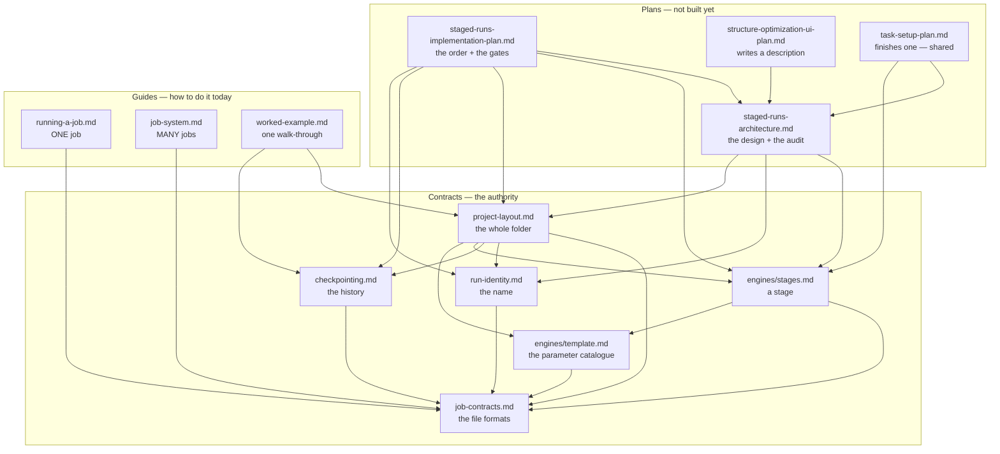
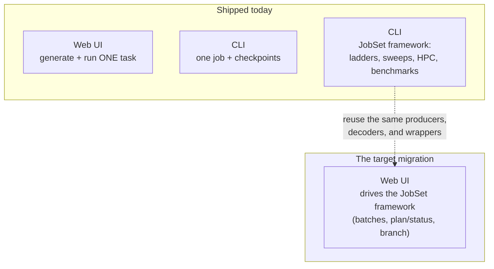

# Execution — running jobs, from one task to a job system

**Role:** overview
**Domain:** execution

This is the **start-here map** for everything about turning a generated input
into a finished result: where a run's files live, how the wrapper runs and
resumes it, how you configure and checkpoint it, and how batches of jobs are
staged, deployed, and benchmarked. Read this page to learn *which* doc answers
your question and to understand the one transition the whole domain is built
around.

---

## 1. The map — which doc to open

Eleven documents live here, and they come in **three kinds**. Knowing which kind
you are reading tells you how much to trust it and what to do when two disagree.

- A **contract** says what a thing *is*. It is the authority. When a contract and
  anything else disagree, the contract wins and the other is a bug.
- A **guide** says how you *do* it with what exists today. It describes shipped
  behaviour and points at the contract for the rules.
- A **plan** says what we will *build*, and in what order. It is the only kind
  that is allowed to describe something that does not exist yet.

### Contracts — what things are

| You want to know… | Open |
|---|---|
| **Who decides what** — the seven floors, the four routes, which function is the entry point at each floor, and the rules that must never break | **[`architecture.md`](?doc=execution/architecture.md)** |
| **Which config setting reaches which part of the system**, and at which step | **[`architecture.md`](?doc=execution/architecture.md)** § 8 |
| **What differs between a workstation and a cluster** — and what does not | **[`architecture.md`](?doc=execution/architecture.md)** § 9 |
| **What language is spoken where, and who translates** — the nine vocabularies and every point one becomes another | **[`architecture.md`](?doc=execution/architecture.md)** § 10 |
| Where a run's files go, what they are named, what a `.fdf`'s reserved comment blocks are, what warm/cold restart means, or what any persisted file's format is | **[`job-contracts.md`](?doc=execution/job-contracts.md)** |
| What a whole project directory looks like — the **two shapes** (flat and hierarchical), what `prep` does, and why the browser cannot finish a deck | **[`project-layout.md`](?doc=execution/project-layout.md)** |
| Why a calculation's files all share one name, and what actually makes a run *continue* from an earlier one | **[`run-identity.md`](?doc=execution/run-identity.md)** |
| What a saved history must always guarantee — the 31 rules behind `molbuilder snapshot` | **[`checkpointing.md`](?doc=execution/checkpointing.md)** |
| How a **finished run** becomes the starting point of the next calculation | **[`handoff-bundle.md`](?doc=execution/handoff-bundle.md)** |
| What a **stage** is (it is molbuilder's idea, not the engine's) and the file that describes one | **[`engines/stages.md`](?doc=engines/stages.md)** — in `engines/`, because a stage is about parameters |
| What a **template** is — the file that carries every parameter with its value, and which layer owns each one | **[`engines/template.md`](?doc=engines/template.md)** — in `engines/`, by the same rule: a template is nothing but parameters |

### Guides — how you do it today

| You want to… | Open |
|---|---|
| Run **one** job: the wrapper, MPI/GPU resolution, `molbuilder.json`, watching it, checkpointing it | **[`running-a-job.md`](?doc=execution/running-a-job.md)** |
| Run **many** jobs: a staged ladder, a parameter sweep, an HPC deployment, a benchmark | **[`job-system.md`](?doc=execution/job-system.md)** |
| See the whole design done once, with a real molecule, in the order a person actually works | **[`worked-example.md`](?doc=execution/worked-example.md)** |

### Plans — what is being built

| You want to know… | Open |
|---|---|
| **What gets built first, and how each step is checked** — the milestones, the gates, and the three reviews at each one | **[`staged-runs-implementation-plan.md`](?doc=execution/staged-runs-implementation-plan.md)** |
| The design behind that work, the code audit that grades it, and each item's *"done when"* | **[`web/staged-runs-architecture.md`](?doc=web/staged-runs-architecture.md)** |
| What the Structure-optimization tab will look like — the page that **writes** a description | **[`web/structure-optimization-ui-plan.md`](?doc=web/structure-optimization-ui-plan.md)** |
| The shared tab that **finishes** one — starts from a folder, fills in the per-stage values | **[`web/task-setup-plan.md`](?doc=web/task-setup-plan.md)** |

**Where the design itself lives has changed.** It is
[`architecture.md`](?doc=execution/architecture.md), a contract, because it says
what the system *is*. `staged-runs-architecture.md` is what remains: the work
item by item, and a dated audit of the code against the design. The plan says in
what order it gets built and how each step is checked. **Three documents, three
jobs** — the contract states the design, the draft holds the work list, the plan
holds the order.

### How they stack

Everything rests on the formats; each layer uses the one below and never
reaches past it. Arrows point from a document to the ones it depends on.



**Read the arrows as *"is defined in terms of"*.** `job-contracts.md` has no
outgoing arrow, which is what makes it the ground: it defines the file formats in
terms of nothing but themselves. Nothing points *down* from a contract into a
plan — a contract that needed a plan to be true would not be a contract.

**The three guides build on each other bottom-up**: the formats are the ground
both surfaces rest on, running one job is the primitive, and the job system runs
many of that primitive. Nothing in the job system replaces the single-job wrapper
— it orchestrates around it.

---

## 2. The one transition to understand

molbuilder is mid-way through a deliberate shift in how jobs are organised and
executed, and the whole `execution/` domain is shaped by it:

- **Where it started (and where the web still is): one task at a time.** You
  generate a single calculation, and a self-contained wrapper runs it. This is
  what the **web UI** does today — it focuses on one generated task.
- **Where the command line already is: a job system.** A real result needs a
  *sequence* of runs (coarse → tight), a project needs *many* such sequences,
  and HPC adds scheduler headers, queue routing, and the question of how many
  GPUs/cores actually run fastest. The **JobSet framework** answers all of that —
  and it is **shipped on the CLI today**.
- **Where it's going — and it is narrower than it used to be** (decided
  2026-08-07). The browser gets to **describe a staged calculation and observe
  one**; it does not get to run one. **The browser describes and observes; the
  terminal acts.** That is not a limitation of the UI, it is
  `project-layout.md § 2.2`: a deck carries values that depend on how it will be
  launched, so it cannot be finished before the machine is known. Two tabs are
  planned — a generating tab that writes the description, and one **shared** tab
  that starts from a folder and fills in each stage's values. Neither is built.

So the honest one-line status of the whole domain: **single-task works
everywhere; the job system works from the command line; the browser's half of it
is describing and observing, and it is the target.**



### The status matrix

| Capability | CLI | Web | Where |
|---|:--:|:--:|---|
| Generate + run one task | ✅ | ✅ | `running-a-job.md` |
| Watch a run's live trajectory + monitor | ✅ | ✅ | `running-a-job.md § 4` |
| `molbuilder.json` config (envs, activation, scheduler) | ✅ | — | `running-a-job.md § 5` |
| Checkpoint / restore a run (`molbuilder snapshot`) | ✅ | ✅ | `running-a-job.md § 6` |
| Staged relaxation ladder | ✅ | ⏳ | `job-system.md § 3` |
| Parameter / resource sweep | ✅ | — | `job-system.md § 4.2` |
| Benchmark → recommended resources | ✅ | — | `job-system.md § 7` |
| SLURM deployment (routing domains; **one job per submission**) | ✅ | ⏳ | `job-system.md § 6` |
| Checkpoint **branch** (explore a what-if tail) | ✅ | ⏳ | `job-system.md § 8` |

`✅` shipped · `⏳` planned (see [`roadmap.md`](?doc=roadmap.md) workstream 1) ·
`—` not applicable / not planned for that surface.

Two facts keep the picture honest:

- **The job system's web front-end is genuinely unbuilt** — there is no web
  route that drives a JobSet, and the web Build tab still emits a single deck.
  The forward plan reuses the *already-shipped* CLI producers, decoders, and
  wrappers in the browser rather than reinventing them (`job-system.md § 8`).
- **"A ladder scheduled as dependent jobs" is SIESTA-only today.** PySCF's
  staged relaxation runs as an in-script loop, not a JobSet; PySCF/transport
  producers are planned. (Details in `job-system.md § 4`.)

### 2.1 The second transition — one folder shape becomes a choice of two

The status matrix above is about *which surface* can run a job. There is a second
change in flight, about *what the folder looks like*, and it is the reason four of
the nine documents here were written in August 2026.

**What ships today is the flat shape.** One directory holds everything. Several
stages live side by side, told apart by a suffix in the filename
(`job_01_coarse.fdf`, `job_02_medium.fdf`); several attempts at one stage are told apart
by a number in the output name (`job-run0.out`, `job-run1.out`); and the warm
files a run continues from — `job.XV`, `job.DM` — carry **no suffix at all** and
are shared by every stage.

That sharing is the shape's whole design, good and bad at once. It is what lets
stage 2 pick up stage 1's geometry with nobody instructing it: SIESTA looks for
`job.XV`, and there it is. It is *also* exactly why stage 2 overwrites stage 1 —
same filename, same directory.

**The proposed hierarchical shape** gives each stage a directory and each attempt
a subdirectory inside it, so nothing overwrites anything.

```
FLAT (ships today)                    HIERARCHICAL (proposed)
bdt_au/                               bdt_au/
├── bdt_au_01_coarse.fdf                 ├── task.json
├── bdt_au_02_tight.fdf               ├── bdt_au.psml
├── bdt_au_01_coarse-run0.out         ├── 01_coarse/
├── bdt_au_02_tight-run0.out          │   ├── bdt_au.fdf
├── bdt_au.XV     ← SHARED, and       │   └── run-0/
├── bdt_au.DM        overwritten      │       ├── bdt_au.out
└── bdt_au.psml      every stage      │       └── bdt_au.XV
                                      └── 02_tight/
                                          ├── bdt_au.fdf
                                          └── run-0/
                                              └── bdt_au.out
```

**The question that decides between them is not which is tidier.** It is: *after
three stages have run, what do you still have?*

| | Flat | Hierarchical |
|---|---|---|
| Stage 1's converged geometry, after stage 3 | **gone from disk** — overwritten | on disk, openable |
| Where the history lives | **in time** — only in the checkpoint | in space — in the folder |
| A checkpoint is… | **the mechanism.** The only way back | insurance. Useful, not load-bearing |
| Continuing to the next stage | free — the engine just finds the file | a deliberate copy you asked for |

So a missed checkpoint means two different things. In the hierarchical shape it
is a thinner history. **In the flat shape it is a state that no longer exists
anywhere** — which is why `checkpointing.md` matters far more than a
convenience feature normally would, and why the checkpoint work was done first.

**Neither shape is wrong, and the choice is a field in the description**
(`engines/stages.md § 6.7`) — declared when you describe the calculation, read by
`prep` on the machine
that will run the job, not in the browser. `project-layout.md` § 1 is the
contract for both; `checkpointing.md` marks every invariant `[both]` or
`[hierarchical]`, because a check written for one shape that fails the other is
worse than no check: it fails a directory that is working correctly.

---

## 3. The three surfaces, and how they share

Read across the domain, there are three ways a job runs, and they deliberately
share one foundation:

1. **The web single-task path** — generate in the browser, install a run
   wrapper, run and watch.
2. **The CLI single-job path** — `molbuilder fdf` / `pyscf` → `molbuilder run` →
   watch; plus checkpoints.
3. **The CLI job system** — `molbuilder fdf --shape flat|hierarchical`
   (or a benchmark) →
   `molbuilder jobset prep / plan / submit / status`.

All three produce the **same run directory** (`job-contracts.md § 2`), the
**same wrapper files** built by the same function (`running-a-job.md § 2`), and
read/write the **same formats and vocabulary** (`job-contracts.md`). That shared
foundation is exactly why the target — the *web* job system — is additive rather
than a rewrite: it will drive the same producers and decoders that already work
from the terminal.

---

## 4. Shared foundations (one place each)

When two docs need the same fact, it lives once, in `job-contracts.md`:

- **Run-directory layout, filenames, the project/topic tree** — `job-contracts.md § 2`.
- **The generated-script reserved blocks** (provenance, atom-metadata, …) —
  `job-contracts.md § 3`.
- **Warm / cold restart semantics** — `job-contracts.md § 4`.
- **The handoff bundle** (a finished run → the next calculation) —
  [`handoff-bundle.md`](?doc=execution/handoff-bundle.md), its own contract.
- **The persisted-artifact registry, the `@major` schema rule, and the
  config ↔ scheduler parameter vocabulary** — `job-contracts.md § 6`.

A note on one overloaded word: a **handoff bundle** (one finished run carried
into the next calculation) is *not* a **JobSet bundle** (a directory of many
parameterised jobs). Different objects, different documents —
`handoff-bundle.md`
vs `job-system.md`.
