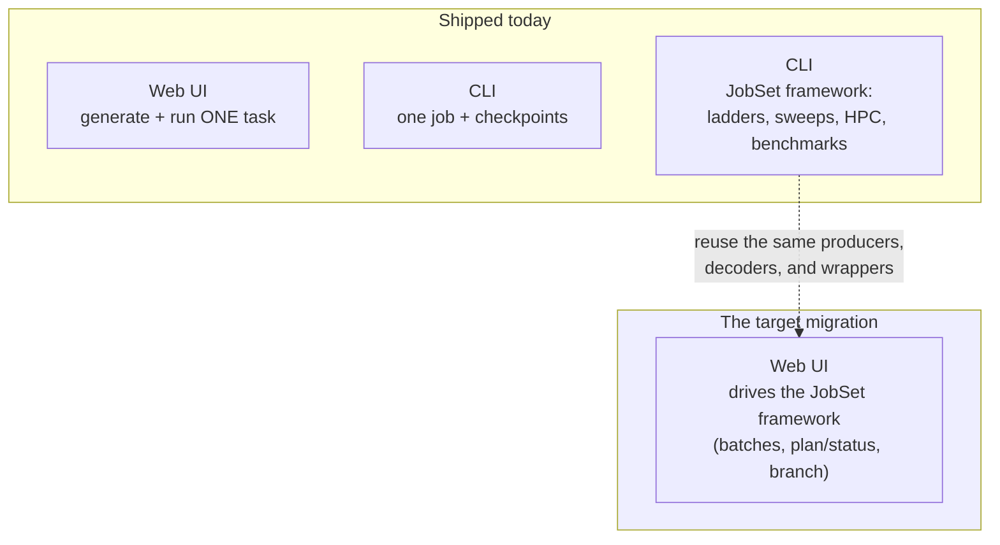

# Execution — running jobs, from one task to a job system

> **Role:** overview · **Domain:** `execution/`
>
> **The docs this maps:**
> [`job-contracts.md`](?doc=execution/job-contracts.md) — the stable on-disk
> formats + shared vocabulary; [`running-a-job.md`](?doc=execution/running-a-job.md)
> — how you run and watch **one** job today; [`job-system.md`](?doc=execution/job-system.md)
> — the JobSet framework for running **many** jobs and deploying them to HPC.

This is the **start-here map** for everything about turning a generated input
into a finished result: where a run's files live, how the wrapper runs and
resumes it, how you configure and checkpoint it, and how batches of jobs are
staged, deployed, and benchmarked. Read this page to learn *which* doc answers
your question and to understand the one transition the whole domain is built
around.

---

## 1. The map — which doc to open

| You want to… | Open |
|---|---|
| Know where a run's files go, what they're named, or what a `.fdf`'s reserved comment blocks / the handoff bundle / the config vocabulary *are* | **[`job-contracts.md`](?doc=execution/job-contracts.md)** (the formats) |
| Actually run **one** job — the wrapper, MPI/GPU resolution, `molbuilder.json`, checkpoints, watching a run | **[`running-a-job.md`](?doc=execution/running-a-job.md)** (the single-job guide) |
| Run **many** jobs — a staged ladder, a parameter sweep, an HPC deployment, a benchmark | **[`job-system.md`](?doc=execution/job-system.md)** (the JobSet framework) |

The three build on each other bottom-up: the **formats** are the ground both
surfaces rest on; **running one job** is the primitive; the **job system** runs
many of that primitive. Nothing in the job system replaces the single-job
wrapper — it orchestrates around it.

---

## 2. The one transition to understand

molbuilder is mid-way through a deliberate shift in how jobs are organised and
executed, and the whole `execution/` domain is shaped by it:

- **Where it started (and where the web still is): one task at a time.** You
  generate a single calculation, and a self-contained wrapper runs it. This is
  what the **web UI** does today — it focuses on one generated task.
- **Where the command line already is: a job system.** A real result needs a
  *sequence* of runs (coarse → tight), a project needs *many* such sequences,
  and HPC adds scheduler headers, dependency chains, and the question of how many
  GPUs/cores actually run fastest. The **JobSet framework** answers all of that —
  and it is **shipped on the CLI today**.
- **Where it's going: the job system in the browser.** The target is to bring
  batches, staged ladders, HPC deployment, and benchmarking into the web UI, so
  the browser moves beyond a single task. That work is planned but **not built
  yet**.

So the honest one-line status of the whole domain: **single-task works
everywhere; the job system works from the command line; the job system in the
browser is the target.**

### The status matrix

| Capability | CLI | Web | Where |
|---|:--:|:--:|---|
| Generate + run one task | ✅ | ✅ | `running-a-job.md` |
| Watch a run's live trajectory + monitor | ✅ | ✅ | `running-a-job.md § 4` |
| `molbuilder.json` config (envs, activation, scheduler) | ✅ | — | `running-a-job.md § 5` |
| Checkpoint / restore a run (`molbuilder snapshot`) | ✅ | ✅ | `running-a-job.md § 6` |
| Staged relaxation ladder | ✅ | ⏳ | `job-system.md § 3` |
| Parameter / resource sweep | ✅ | — | `job-system.md § 4.2` |
| Benchmark → recommended resources | ✅ | — | `job-system.md § 7` |
| SLURM deployment (dependency chains, routing domains) | ✅ | ⏳ | `job-system.md § 5` |
| Checkpoint **branch** (explore a what-if tail) | ✅ | ⏳ | `job-system.md § 8` |

`✅` shipped · `⏳` planned (see [`roadmap.md`](?doc=roadmap.md) workstream 1) ·
`—` not applicable / not planned for that surface.

Two facts keep the picture honest:

- **The job system's web front-end is genuinely unbuilt** — there is no web
  route that drives a JobSet, and the web Build tab still emits a single deck.
  The forward plan reuses the *already-shipped* CLI producers, decoders, and
  wrappers in the browser rather than reinventing them (`job-system.md § 8`).
- **"A ladder scheduled as dependent jobs" is SIESTA-only today.** PySCF's
  staged relaxation runs as an in-script loop, not a JobSet; PySCF/transport
  producers are planned. (Details in `job-system.md § 4`.)

---

## 3. The three surfaces, and how they share

Read across the domain, there are three ways a job runs, and they deliberately
share one foundation:

1. **The web single-task path** — generate in the browser, install a run
   wrapper, run and watch.
2. **The CLI single-job path** — `molbuilder fdf` / `pyscf` → `molbuilder run` →
   watch; plus checkpoints.
3. **The CLI job system** — `molbuilder fdf --jobset` (or a benchmark) →
   `molbuilder jobset prep / plan / submit / status`.

All three produce the **same run directory** (`job-contracts.md § 2`), the
**same wrapper files** built by the same function (`running-a-job.md § 2`), and
read/write the **same formats and vocabulary** (`job-contracts.md`). That shared
foundation is exactly why the target — the *web* job system — is additive rather
than a rewrite: it will drive the same producers and decoders that already work
from the terminal.

---

## 4. Shared foundations (one place each)

When two docs need the same fact, it lives once, in `job-contracts.md`:

- **Run-directory layout, filenames, the project/topic tree** — `job-contracts.md § 2`.
- **The generated-script reserved blocks** (provenance, atom-metadata, …) —
  `job-contracts.md § 3`.
- **Warm / cold restart semantics** — `job-contracts.md § 4`.
- **The workflow handoff bundle** (a finished run → the next calculation) —
  `job-contracts.md § 5`.
- **The persisted-artifact registry, the `@major` schema rule, and the
  config ↔ scheduler parameter vocabulary** — `job-contracts.md § 6`.

A note on one overloaded word: a **handoff bundle** (one finished run carried
into the next calculation) is *not* a **JobSet bundle** (a directory of many
parameterised jobs). Different objects, different docs — `job-contracts.md § 5`
vs `job-system.md`.
