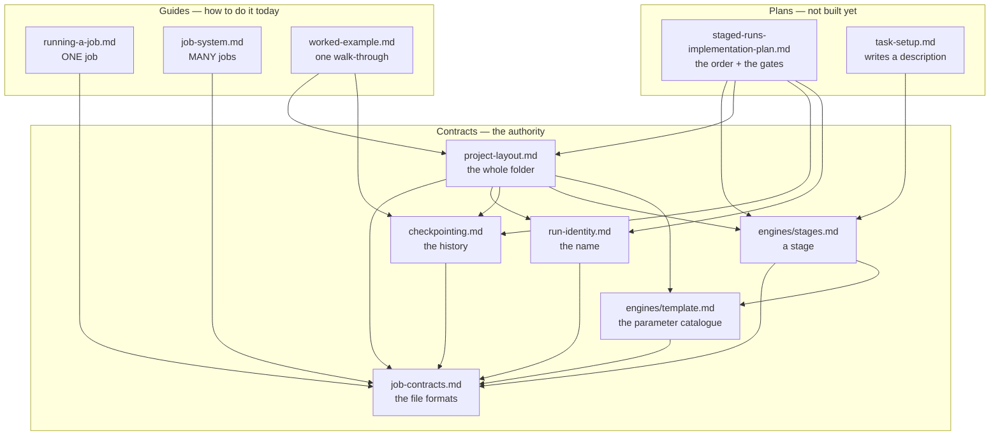
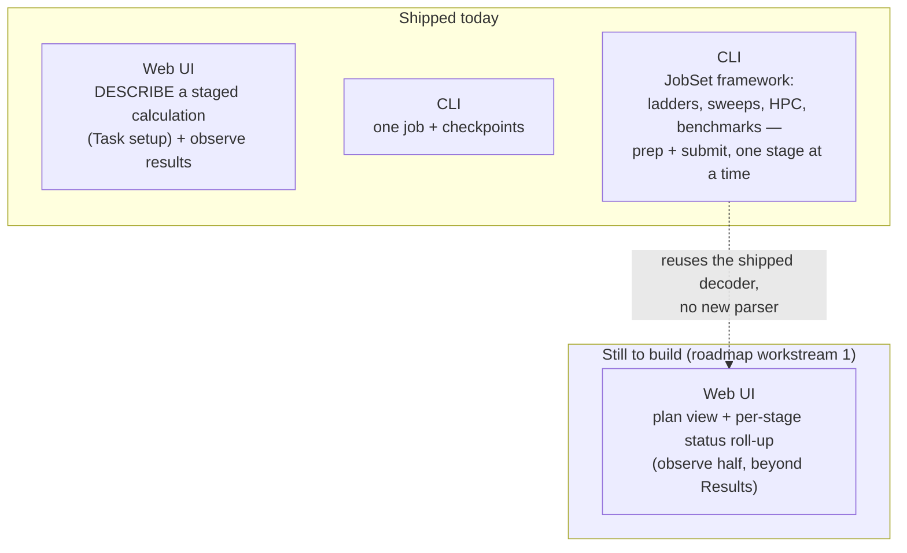

# Execution — running jobs, from one task to a job system

**Role:** overview
**Domain:** execution

**Companions:**
[`docs/README.md`](?doc=README.md) — the tree-wide index and the R-rules this
header follows; every doc this overview routes is its own companion (§ 1's
table names them all).

This is the **start-here map** for everything about turning a generated input
into a finished result: where a run's files live, how the wrapper runs and
resumes it, how you configure and checkpoint it, and how batches of jobs are
staged, deployed, and benchmarked. Read this page to learn *which* doc answers
your question and to understand the one transition the whole domain is built
around.

---

## 1. The map — which doc to open

The documents here come in **three kinds**. Knowing which kind
you are reading tells you how much to trust it and what to do when two disagree.

- A **contract** says what a thing *is*. It is the authority. When a contract and
  anything else disagree, the contract wins and the other is a bug.
- A **guide** says how you *do* it with what exists today. It describes shipped
  behaviour and points at the contract for the rules.
- A **plan** says what we will *build*, and in what order. It is the only kind
  that is allowed to describe something that does not exist yet.

### Contracts — what things are

| You want to know… | Open |
|---|---|
| **Who decides what** — the seven floors, the four routes, which function is the entry point at each floor, and the rules that must never break | **[`architecture.md`](?doc=execution/architecture.md)** |
| **What ASU Sol actually provides** — node types, partitions, QOS, and how to ask for resources | **[`asu-sol.md`](?doc=execution/asu-sol.md)** |
| **What every value is and where it came from** — schema → template → `ParameterSet`, and why benchmarking and running are one pipeline | **[`generator.md`](?doc=execution/generator.md)** |
| **How a value becomes a file** — the preparation steps, in order, and what each engine supplies at each one | **[`script-preparation.md`](?doc=execution/script-preparation.md)** |
| **Which config setting reaches which part of the system**, and at which step | **[`architecture.md`](?doc=execution/architecture.md)** § 8 |
| **What differs between a workstation and a cluster** — and what does not | **[`architecture.md`](?doc=execution/architecture.md)** § 9 |
| **What language is spoken where, and who translates** — the nine vocabularies and every point one becomes another | **[`architecture.md`](?doc=execution/architecture.md)** § 10 |
| Where a run's files go, what they are named, what a `.fdf`'s reserved comment blocks are, what warm/cold restart means, or what any persisted file's format is | **[`job-contracts.md`](?doc=execution/job-contracts.md)** |
| What a whole project directory looks like — the **two shapes** (flat and hierarchical), what `prep` does, and why the browser cannot finish a deck | **[`project-layout.md`](?doc=execution/project-layout.md)** |
| Why a calculation's files all share one name, and what actually makes a run *continue* from an earlier one | **[`run-identity.md`](?doc=execution/run-identity.md)** |
| What a saved history must always guarantee — the 31 rules behind `molbuilder checkpoint` | **[`checkpointing.md`](?doc=execution/checkpointing.md)** |
| How a **finished run** becomes the starting point of the next calculation | **[`handoff-bundle.md`](?doc=execution/handoff-bundle.md)** |
| What a **stage** is (it is molbuilder's idea, not the engine's) and the file that describes one | **[`engines/stages.md`](?doc=engines/stages.md)** — in `engines/`, because a stage is about parameters |
| What a **template** is — the file that carries every parameter with its value, and which layer owns each one | **[`engines/template.md`](?doc=engines/template.md)** — in `engines/`, by the same rule: a template is nothing but parameters |

### Guides — how you do it today

| You want to… | Open |
|---|---|
| Run **one** job: the wrapper, MPI/GPU resolution, `molbuilder.json`, watching it, checkpointing it | **[`running-a-job.md`](?doc=execution/running-a-job.md)** |
| Run **many** jobs: a staged ladder, a parameter sweep, an HPC deployment, a benchmark | **[`job-system.md`](?doc=execution/job-system.md)** |
| See the whole design done once, with a real molecule, in the order a person actually works | **[`worked-example.md`](?doc=execution/worked-example.md)** |

### Plans — what is being built

| You want to know… | Open |
|---|---|
| **What gets built first, and how each step is checked** — the milestones, the gates, and the three reviews at each one | **[`staged-runs-implementation-plan.md`](?doc=archive/2026-08-19-staged-runs-implementation-plan.md)** |

*(The Task-setup tab graduated out of this kind: it shipped, and
[`web/task-setup.md`](?doc=web/task-setup.md) is a **contract** — the tab that
writes a description.)*

**Where the design itself lives has changed.** It is
[`architecture.md`](?doc=execution/architecture.md), a contract, because it says
what the system *is*.

> **⚠ `staged-runs-architecture.md` was archived 2026-08-11**
> (`archive/2026-08-11-staged-runs-architecture.md`). It was written against the
> **flat** shape before the hierarchical one existed, so its design sections are
> the pre-job-system picture: one tab writing one flat directory. **Two
> documents now do its job** — the contract states the design, the plan holds the
> items, the order and the gates. What is left in the archive is its **dated code
> audits** (2026-08-07), which are history.

### How they stack

Everything rests on the formats; each layer uses the one below and never
reaches past it. Arrows point from a document to the ones it depends on.



**Read the arrows as *"is defined in terms of"*.** `job-contracts.md` has no
outgoing arrow, which is what makes it the ground: it defines the file formats in
terms of nothing but themselves. Nothing points *down* from a contract into a
plan — a contract that needed a plan to be true would not be a contract.

**The three guides build on each other bottom-up**: the formats are the ground
both surfaces rest on, running one job is the primitive, and the job system runs
many of that primitive. Nothing in the job system replaces the single-job wrapper
— it orchestrates around it.

---

## 2. The one transition to understand

molbuilder is mid-way through a deliberate shift in how jobs are organised and
executed, and the whole `execution/` domain is shaped by it:

- **Where it started: one task at a time.** You generate a single
  calculation, and a self-contained wrapper runs it. *(This bullet described
  the web UI's present tense until 2026-08-19; the web now describes staged
  calculations — the third bullet.)*
- **Where the command line already is: a job system.** A real result needs a
  *sequence* of runs (coarse → tight), a project needs *many* such sequences,
  and HPC adds scheduler headers, queue routing, and the question of how many
  GPUs/cores actually run fastest. The **JobSet framework** answers all of that —
  and it is **shipped on the CLI today**.
- **Where the browser landed — narrower than first planned, by decision**
  (2026-08-07). The browser gets to **describe a staged calculation and observe
  one**; it does not get to run one. **The browser describes and observes; the
  terminal acts.** That is not a limitation of the UI, it is
  `project-layout.md § 2.2`: a deck carries values that depend on how it will be
  launched, so it cannot be finished before the machine is known. **The two
  tabs this needed are built and shipped**: the generating tabs hand over, and
  the shared **Task setup** tab writes the description
  ([`web/task-setup.md`](?doc=web/task-setup.md)); the whole loop ran end to
  end on 2026-08-19. *(This bullet ended "Neither is built" until then.)*

So the honest one-line status of the whole domain: **describe in the browser,
act on the terminal, observe on either — shipped and proven for structure
optimization on a workstation; the cluster proof and a web plan/status view
remain (`roadmap.md` workstream 1), and spectra/transport still run their
pre-framework paths (the roadmap's migration box).**



### The status matrix

| Capability | CLI | Web | Where |
|---|:--:|:--:|---|
| Generate + run one task | ✅ | ✅ | `running-a-job.md` |
| Watch a run's live trajectory + monitor | ✅ | ✅ | `running-a-job.md § 4` |
| `molbuilder.json` config (envs, activation, scheduler) | ✅ | — | `running-a-job.md § 5` |
| Checkpoint / restore a run (`molbuilder checkpoint`) | ✅ | ✅ | `running-a-job.md § 6` |
| Describe a staged calculation (shape · stages · bench) | ✅ | ✅ | `web/task-setup.md`, `job-system.md § 5.1` |
| Prep / submit a staged ladder (one stage at a time) | ✅ | — *(by design: the terminal acts)* | `job-system.md § 3` |
| Parameter / resource sweep | ✅ | — | `job-system.md § 4.2` |
| Benchmark → recommended resources | ✅ | — | `job-system.md § 7` |
| SLURM deployment (routing domains; **one job per submission**) | ✅ | ⏳ | `job-system.md § 6` |
| Fork a what-if tail (save from a restored state — there is no `branch` verb) | ✅ | ⏳ | `checkpointing.md § 7.1` |

`✅` shipped · `⏳` planned (see [`roadmap.md`](?doc=roadmap.md) workstream 1) ·
`—` not applicable / not planned for that surface.

Two facts keep the picture honest:

- **The web's describe half is built; the act half stays on the terminal by
  design.** The parameter tabs write no deck at all — the old deck-rendering
  routes were deleted (2026-08-18) — they hand over to Task setup, which
  writes the description; `prep`/`launch` run where the machine is. What the
  web still lacks is the observe half beyond the Results tab: a plan view
  and a per-stage status roll-up (`roadmap.md` workstream 1).
- **Both engines' ladders are N decks, N jobs.** A PySCF ladder is declared
  in `task.json` and executes one rung per job, exactly as SIESTA's does
  ([`stages.md § 1.1a`](?doc=engines/stages.md), decided 2026-08-18 — the
  in-script loop this bullet used to describe is retired). Transport and
  spectra producers are still pre-framework (the roadmap's migration box).

### 2.1 The second transition — one folder shape becomes a choice of two

The status matrix above is about *which surface* can run a job. There is a second
change in flight, about *what the folder looks like*, and it is the reason four of
the eleven documents here were written in August 2026.

**The flat shape** is the simpler of the two. One directory holds everything. Several
stages live side by side, told apart by a suffix in the filename
(`job_01_coarse.fdf`, `job_02_medium.fdf`); several attempts at one stage are told apart
by a number in the output name (`job-run0.out`, `job-run1.out`); and the warm
files a run continues from — `job.XV`, `job.DM` — carry **no suffix at all** and
are shared by every stage.

That sharing is the shape's whole design, good and bad at once. It is what lets
stage 2 pick up stage 1's geometry with nobody instructing it: SIESTA looks for
`job.XV`, and there it is. It is *also* exactly why stage 2 overwrites stage 1 —
same filename, same directory.

**The hierarchical shape** — shipped and selectable beside flat, the
description's required `shape` field choosing between them — gives each stage
a directory and each attempt a subdirectory inside it, so nothing overwrites
anything.  *(This paragraph called it "proposed" long after it shipped —
the wrong side of history for an overview, found by the 2026-08-12 review.)*

```
FLAT                                  HIERARCHICAL
bdt_au/                               bdt_au/
├── bdt_au_01_coarse.fdf                 ├── task.json
├── bdt_au_02_tight.fdf               ├── bdt_au.psml
├── bdt_au_01_coarse-run0.out         ├── 01_coarse/
├── bdt_au_02_tight-run0.out          │   ├── bdt_au.fdf
├── bdt_au.XV     ← SHARED, and       │   └── run-0/
├── bdt_au.DM        overwritten      │       ├── bdt_au.out
└── bdt_au.psml      every stage      │       └── bdt_au.XV
                                      └── 02_tight/
                                          ├── bdt_au.fdf
                                          └── run-0/
                                              └── bdt_au.out
```

**The question that decides between them is not which is tidier.** It is: *after
three stages have run, what do you still have?*

| | Flat | Hierarchical |
|---|---|---|
| Stage 1's converged geometry, after stage 3 | **gone from disk** — overwritten | on disk, openable |
| Where the history lives | **in time** — only in the checkpoint | in space — in the folder |
| A checkpoint is… | **the mechanism.** The only way back | insurance. Useful, not load-bearing |
| Continuing to the next stage | free — the engine just finds the file | a deliberate copy you asked for |

So a missed checkpoint means two different things. In the hierarchical shape it
is a thinner history. **In the flat shape it is a state that no longer exists
anywhere** — which is why `checkpointing.md` matters far more than a
convenience feature normally would, and why the checkpoint work was done first.

**Neither shape is wrong, and the choice is a field in the description**
(`engines/stages.md § 6.7`) — declared when you describe the calculation, read by
`prep` on the machine
that will run the job, not in the browser. `project-layout.md` § 1 is the
contract for both; `checkpointing.md` marks every invariant `[both]` or
`[hierarchical]`, because a check written for one shape that fails the other is
worse than no check: it fails a directory that is working correctly.

---

## 3. Everything is a job set

> **Decided 2026-08-11 (user): there is no separate single-job path. A single
> job is a job set of one, and it goes through the same commands as a hundred.**

**One calculation, one ladder of stages, or a benchmark sweep are the same
thing at different sizes**, so there is one way in and one vocabulary:

```
describe it   →  molbuilder jobset describe <structure> <dir> --shape flat|hierarchical [--stage-strategy …]
set it up     →  molbuilder jobset prep     run <stage> [--from <run>]
run it        →  molbuilder jobset launch   run <stage> [--mode direct|submit]
look at it    →  molbuilder jobset status
```

`--mode direct` runs it here and you wait; `--mode submit` queues it. **That is
the only difference between a workstation and a cluster at this level**
([`architecture.md`](?doc=execution/architecture.md) § 9).

**There is no `molbuilder run`.** It was the pre-job-system entry point — a
wrapper for one hand-made deck — and a second way in is a second way to lose
your results: it skips the description, so nothing records what was run, nothing
can reproduce it, and the folder stops being able to tell you what happened.

**Why this is worth stating as a rule rather than a tidy-up:** every surface
then reads and writes the **same run directory** (`job-contracts.md § 2`), the
**same wrapper** built by the same function, and the **same formats**
(`job-contracts.md`). That is exactly why the *web* job system is additive
rather than a rewrite — it drives the producers and decoders that already work
from the terminal, instead of a parallel single-task path that would have to be
kept in step.

---

## 4. Shared foundations (one place each)

When two docs need the same fact, it lives once, in `job-contracts.md`:

- **Run-directory layout, filenames, the project/topic tree** — `job-contracts.md § 2`.
- **The generated-script reserved blocks** (provenance, atom-metadata, …) —
  `job-contracts.md § 3`.
- **Warm / cold restart semantics** — `job-contracts.md § 4`.
- **The handoff bundle** (a finished run → the next calculation) —
  [`handoff-bundle.md`](?doc=execution/handoff-bundle.md), its own contract.
- **The persisted-artifact registry, the `@major` schema rule, and the
  config ↔ scheduler parameter vocabulary** — `job-contracts.md § 6`.

A note on one overloaded word: a **handoff bundle** (one finished run carried
into the next calculation) is *not* a **JobSet bundle** (a directory of many
parameterised jobs). Different objects, different documents —
`handoff-bundle.md`
vs `job-system.md`.
