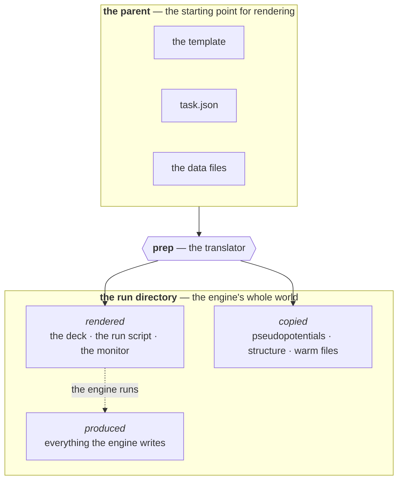
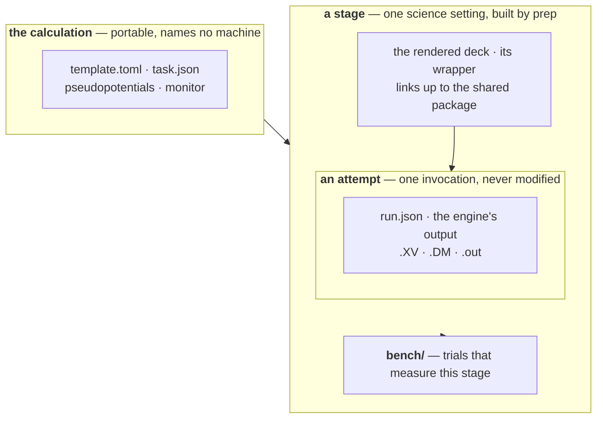
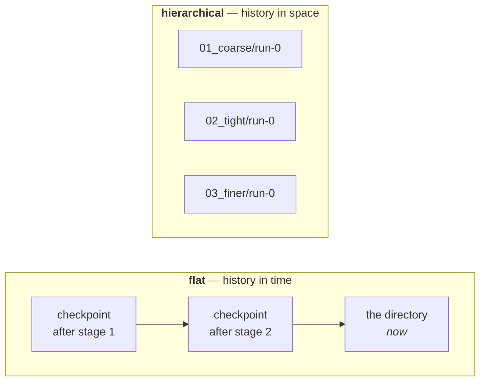
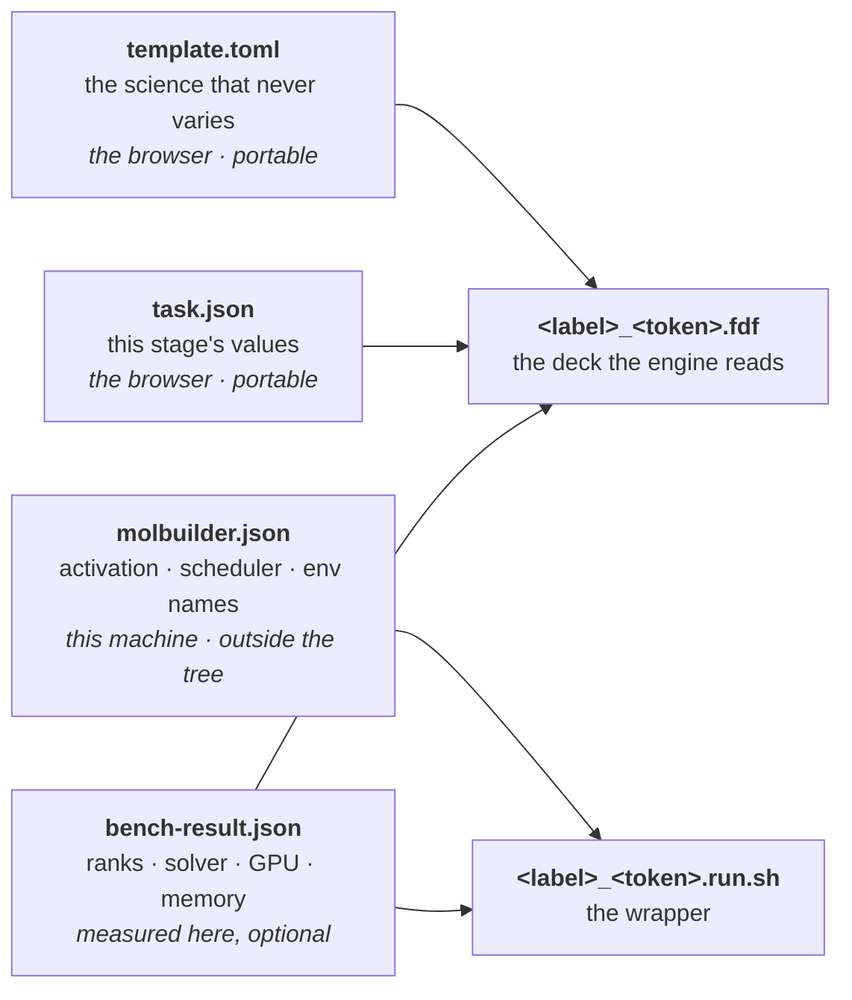
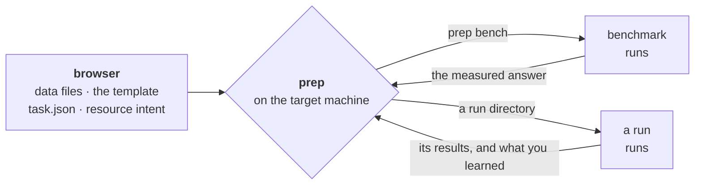
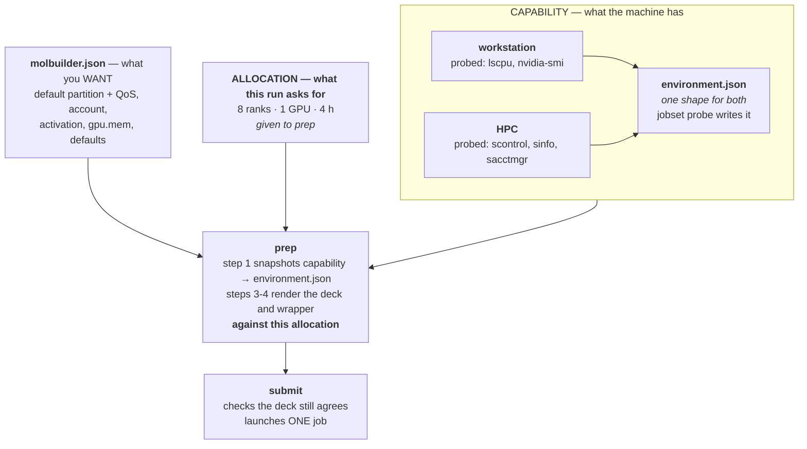
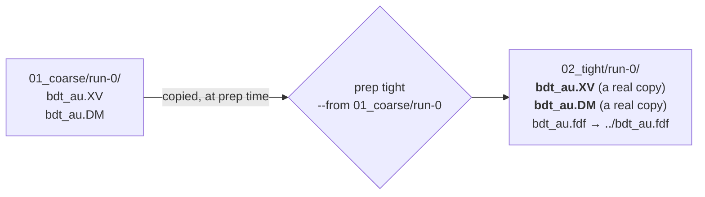
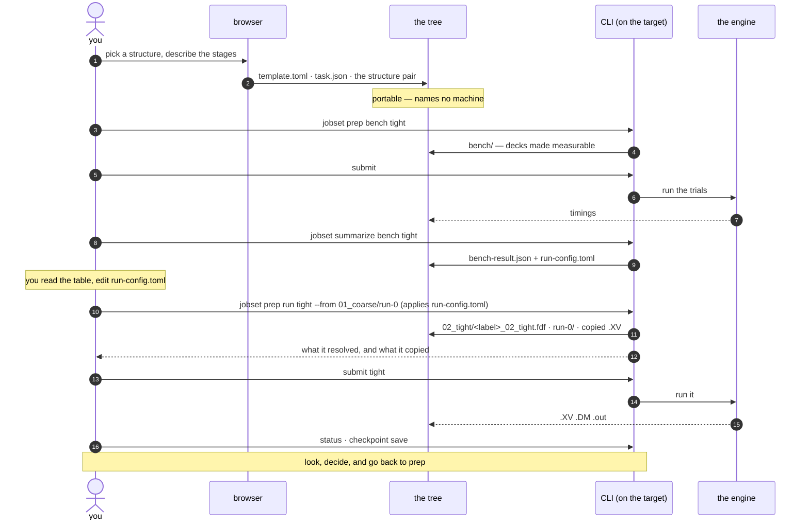
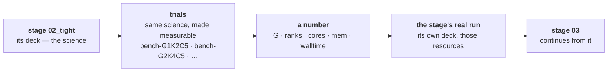

# The project directory — what lives where, and who puts it there

**Role:** contract
**Domain:** execution
**Companions:** [`execution/job-contracts.md`](?doc=execution/job-contracts.md)
— the run directory's own rules, the topic list, the filename conventions;
[`execution/job-system.md`](?doc=execution/job-system.md) — the JobSet the
per-stage folders come from; [`engines/stages.md`](?doc=engines/stages.md) — what
a stage is and how its deck is produced;
[`execution/checkpointing.md`](?doc=execution/checkpointing.md) — what the saved
history must always hold;
[`execution/run-identity.md`](?doc=execution/run-identity.md) — the id a
calculation's files share.

What this document adds is the *whole*: which
directory owns what, how parameter tuning and resource tuning nest, and where the
saved history sits.  *(Status lives in `roadmap.md`, never in a contract — `conventions.md`'s R3.
The Status block that stood here was also FALSE: it called `task.json`, its
reader and § 4's stage naming unbuilt long after all three shipped, which is
exactly why that rule keeps status out of contracts.)*

**This contract owns:** the levels of the tree, who may write at each one, how
each level is named, and the invariants that hold across them. It does not
restate the rules inside a single run directory — those are `job-contracts.md`.

---

## 1. Two shapes, and how to choose

### 1.0 What the run directory is, and what may be in it

*Stated by the user, 2026-08-11. Everything below is an arrangement of this.*

> **The run directory hands the engine everything it needs and holds everything
> it produces. That is what makes it one — not which files happen to be in it.**

**Two origins, and there is no third.** Every file in it is either:

| origin | examples |
|---|---|
| **rendered** — translated out of the template and the other sources | the deck, the run script, the monitor script |
| **copied** — raw data the engine needs, taken as-is | pseudopotentials, the structure, warm files from a run you named |

**So the inventory is not a list anybody maintains** — it follows from those two
origins and the shape. A list would drift; this cannot.

**Why anything is kept outside it: the engine does not see or understand the
layer we use to organise our information.** It opens what is there and writes
beside it. So the template, `task.json` and the rest of the *starting point* for
rendering belong to the **parent**, and only rendered files and copies go down to
where the engine runs.

> **The directory boundary is where the translation happens.** Above it, our
> vocabulary — template items, the description. Below it, the engine's
> vocabulary — its own keywords — plus raw bytes.
> [`architecture.md`](?doc=execution/architecture.md) § 10 names every
> translation in the system; this is the one that is a **wall you can see**, and
> `prep` is what crosses it.



**Once it is prepared it needs nothing but the engine's environment and a
shell.** That is why the run script and the monitor script sit inside it rather
than being invoked from somewhere clever.

**A follow-up stage takes two inputs**, and `prep` writes a whole new directory
from them:

1. the **parent's** template and sources, and
2. the **latest results** from the run you name.

**The two shapes are two answers to one question: is that boundary a directory
wall, or a filename convention?**

| | where the boundary is |
|---|---|
| **hierarchical** | **a real wall.** The starting point stays in the parent; each run directory sees only rendered files and copies |
| **flat** | **no wall is built.** One directory holds both sides at once — the template sits beside the results, and stages and attempts are told apart by **filename** |

**That is also why the flat shape's results overlap on purpose.** With one
directory there is one set of warm files, so the geometry is simply *the latest*
— the next stage finds it lying there, and overwrites it in turn.

> **A note on the word "calculation".** This document calls the whole folder
> *the calculation* and the directory the engine runs in *the run directory*.
> In conversation the second is often called the calculation directory too.
> Same thing, opposite ends of the tree — the contract's names are used below.

> #### ⚠ "Bundle" and "calculation" are the same directory, and the word
> #### **bundle** is retired for it *(2026-08-11)*
>
> [`job-system.md`](?doc=execution/job-system.md) draws a `bdt_au-bundle/` root
> holding `job-set.json`, the decks, the shared package and the stage
> directories. This document draws
> `projects/<project>/<topic>/<calculation>/` holding the template, `task.json`,
> the shared package and the stage directories. **They are one directory**, and
> nothing said so — so a reader following one produced a `-bundle` folder outside
> the project tree, and a reader following the other produced a calculation
> inside it.
>
> | | **calculation** *(this contract's name)* | ~~bundle~~ |
> |---|---|---|
> | where | `projects/<p>/<t>/<calc>/` — inside the tree | anywhere |
> | what declares it | **`task.json`** | `job-set.json` |
> | who names it | the user | the producer, `<label>-bundle` |
>
> **`calculation` wins, for a reason that is not taste.** `task.json` is the
> **source** and `job-set.json` is **derived** from it (§ 5) — so naming the
> folder after the derived file names it after something you can delete and
> regenerate. It is also what `checkpoint.py` already looks for to decide a
> directory owns its subdirectories (`checkpointing.md` **L1**).
>
> **And *bundle* was already overloaded twice over**: a **handoff bundle** is one
> finished run carried forward ([`handoff-bundle.md`](?doc=execution/handoff-bundle.md)),
> a **benchmark bundle** is a self-contained measurement (§ 2.6). A third sense
> for *the calculation folder itself* is the one that had to go — `README.md` R5
> forbids exactly this collision. What keeps the name legitimately is the
> **benchmark** bundle, which really is a self-contained package that travels.

> **This is why molbuilder must know its own files by name.** In the flat shape
> the template sits beside the engine's output. `--cold` and *"has anything run
> here?"* both work by subtracting **what molbuilder wrote** from what is present
> ([`job-contracts.md`](?doc=execution/job-contracts.md) § 4.1–4.2), so that list
> is what stops a template being mistaken for engine leftovers.

A project directory is one of exactly two shapes. **Both hold several stages and
several attempts** — they differ in *how those are kept apart*, and everything
else follows from that one choice.

| | **Flat** | **Hierarchical** |
|---|---|---|
| **Stages are separated by** | a **filename token** — `<label>_01_coarse.fdf`, `<label>_02_tight.fdf` | a **directory** — `01_coarse/`, `02_tight/` — and the token is kept in the filename too, as a self-check (`run-identity.md § 3.2`) |
| **Attempts are separated by** | an **output index** — `-run0.out`, `-run1.out` | a **directory** — `run-0/`, `run-1/` |
| **Warm files** (`.XV` `.DM` `.CG`) | **one shared set**, unsuffixed | one set per attempt |
| **Continuing** | free — the next stage finds them lying there | you **name** the run, and its files are copied in |
| **What survives** | the **latest** state only | every stage's, every attempt's |
| **Depth** | 1 | 3 |
| **Chosen** | at `prep` | at `prep` |
| **Wrappers** | one per stage, beside its deck | one per stage, in the stage's directory |
| **Built by** | `prep` | `prep` |

**Both shapes are built by `prep`, and both run today.** You pick one when you
prepare, and `prep` lays out whichever you asked for — flat puts every stage in
one directory and tells them apart by filename; hierarchical gives each stage a
directory and each attempt a directory inside it.

**The one real migration LANDED.** The browser writes a **template plus
`task.json`** — the parameter tabs hand over to Task setup, which saves the
description — and `prep` renders every deck on the target: into one directory
for the flat shape, or into stage directories for the hierarchical one. The
UI produces the second-to-last file in the chain, never the last. *(Until
2026-08-18 the Build tab wrote a finished `.fdf` and its `.run.sh` — a single
job, not a described calculation — and these two paragraphs described moving
off that as future work. The deck-rendering web routes were deleted the same
day the hand-over shipped; proven end to end 2026-08-19.)*

**One package, two layouts, and you choose.** The browser always writes the same
thing — a template, `task.json`, the data files, none of it naming a
machine. `prep`, on the machine that will run it, translates that into a runnable
directory **in whichever shape you ask for**.


### 1.1 What each one looks like

**Flat** — this is what ships today, and it already does stages:

```
au_bdt_relax/
├── <label>_01_coarse.fdf           coarse   ─┐ the decks: one per stage,
├── <label>_03_tight.fdf            tight     ─┘ told apart by their TOKEN
│                                               (decision 27 — the ordinal
│                                               travels WITH the name, and
│                                               a gap stays a gap)
├── <label>_01_coarse.run.sh        ─┐ ONE WRAPPER PER STAGE, beside its deck.
├── <label>_03_tight.run.sh         ─┘ `prep` renders one per distinct deck, so
│                                      each stage is started on its own — which
│                                      is what makes "one stage at a time" the
│                                      same act in both shapes.
├── <label>_01_coarse-run0.out      stage 1, first attempt   ─┐ told apart
├── <label>_01_coarse-run1.out      stage 1, a redo           │ by INDEX
├── <label>_03_tight-run0.out       tight, first attempt     ─┘
│
├── <label>.XV  <label>.DM  <label>.CG  ⚠ ONE shared set, UNSUFFIXED
├── <label>.STRUCT_OUT              ⚠ one, overwritten by each stage
└── <label>.ANI  <label>.EIG        ⚠ likewise
```

*`<label>` is the `SystemLabel` — the stem of every file here. It is **not** the
run id, which carries the formula as well and lives in `task.json`
(`run-identity.md § 2.0a`).*

**The unsuffixed warm files are the whole design, good and bad.** They are
unsuffixed *on purpose* — that is exactly what lets stage 2 pick up stage 1's
geometry with no instruction from anyone (`job-contracts.md § 2.3`:
`MD.UseSaveXV`, `DM.UseSaveDM`, `MD.UseSaveCG` just find them). And it is
exactly why stage 2 overwrites them.

**Hierarchical** — the same stages and attempts, kept apart by directory:

```
bdt-relax/                            the CALCULATION — the user typed this name
├── <label>.template.toml              ─┐ the description: written by the
├── task.json                         ─┘ browser (or `jobset init`) —
│                                        portable, names no machine, says
│                                        the id — label plus formula
├── <label>.source.xyz  + sidecar        the structure pair (§ 6.3's .source
│                                        reservation), from the hand-over
├── Au.psml  S.psml  mb_monitor.py       copied in by `prep` from the library
│                                        (or by `describe --psml-lib`) — § 2.6
│
├── 01_coarse/                        a STAGE — written by `prep`
│   ├── <label>_01_coarse.fdf            the deck, rendered for THIS machine
│   ├── <label>_01_coarse.run.sh         its wrapper
│   ├── Au.psml → ../Au.psml          shared, linked up
│   ├── run-0/                        an ATTEMPT
│   │   ├── run.json                  how it was launched, what it continued from
│   │   ├── <label>.XV  <label>.DM    SIESTA named these: bare
│   │   └── <label>_01_coarse-run0.out   molbuilder named this: stage + attempt
│   ├── run-1/                        a redo — run-0 is untouched
│   └── bench/                        a BENCHMARK — its own little world
│
└── 02_tight/
    ├── <label>_02_tight.fdf
    └── run-0/
        └── <label>.XV                a real copy of 01_coarse/run-0's
```

**The deck repeats the stage its directory already names, on purpose.** Without
it every stage directory holds an identically-named deck, and two swapped by a
bad copy or a resumed `prep` disagree with nothing; with it,
`01_coarse/<label>_02_tight.fdf` is wrong on sight (`run-identity.md § 3.2`,
decision 21).

**And the stdout keeps its `-run<N>` counter here too**, even though `run-0/`
already says which attempt it is — for the same self-check reason, and because
there is only one wrapper: `runwrap.py` writes `<basename>-run${_run_n}.out`
with no branch on shape. `job-contracts.md` § 6.3's Files table is the authority
and says so in those words. *(This tree drew a counterless `<label>_01_coarse.out`
until 2026-08-16 — the exact reading § 6.3 records itself correcting, surviving
in the document that draws the picture people copy from.)*



### 1.2 The trade, stated once — and why flat needs checkpoints

Put the two side by side on the question that actually matters — *what do you
still have after three stages have run?*

| After stage 1, 2 and 3 have all run | Flat | Hierarchical |
|---|---|---|
| every stage's stdout | on disk — the suffix saved them | on disk |
| the **current** `.XV` / `.DM` | on disk — stage 3's | on disk, per stage and per attempt |
| stage 1's relaxed geometry | **in the checkpoint** — not on disk | on disk, always |
| going back to it | **restore** that checkpoint | open the other directory |
| having both at once | no — one state at a time | yes |
| which run produced the current `.XV` | the checkpoint's message and tag | `run.json` says, without leaving the tree |

**The two shapes keep history in different dimensions.** Hierarchical spreads it
across the *filesystem*: every stage and attempt sits there simultaneously, and
going back is just reading a different directory. Flat keeps one state on disk
and spreads its history through *time*: earlier states live in the checkpoint,
and going back means rewinding.



> **This is why the checkpoint is not optional for the flat shape.** It is the
> only thing standing between *"stage 2 overwrote stage 1's geometry"* and
> *"stage 1's geometry is gone."* In the hierarchical shape the checkpoint is
> insurance; in the flat shape it is **the mechanism** — the sole way to get back
> to a previous run and continue from there.

**And restore is a rewind, not a fetch.** It returns the whole directory to how
it was, text and binaries together (`checkpointing.md`, S6). So going back in the
flat shape means: checkpoint what you have now, restore the earlier one, run from
there. Skip the first step and the current state is what you lose. Hierarchical
never poses that question, because nothing had to be overwritten to begin with.

**Neither shape is wrong.** For one relaxation where only the final geometry
matters, overwriting is the point and flat costs nothing to operate. For a
mission tuned across parameter sets — compared, benchmarked, revisited — having
every state at once is worth the directories, and you stop having to think about
what a restore would cost you.

### 1.3 The same contract, read against both shapes

Every rule in this document holds in both shapes. Where they read differently it
is because *depth* differs — never because the rule does.

| Rule | Flat | Hierarchical |
|---|---|---|
| **A directory is a container or a run, never both** (§ 1.4) | the directory is a **run** — it is a leaf | calculation and stage are **containers**; `run-N/` is a **run** |
| **A result is never overwritten** | holds for *stdout* (`-run0`, `-run1`); **does not hold for warm files**, which are shared by design | holds for everything — an attempt is immutable (§ 1.5) |
| **Every file shares one basename** — the id | yes; only decks and stdout take a stage suffix | yes, and across stages too |
| **Where the deck comes from** | `prep` renders it beside the package | `prep` renders it into the stage's directory |
| | *both from template ⊕ the stage's values ⊕ this machine (§ 2.2)* | |
| **Where the wrapper runs** | in the directory | in the attempt directory `prep` made |
| **git tracks / the archive covers** | one directory is both — classified by **pattern** | containers are git's, runs are the archive's — by **depth** (§ 6.1) |
| **`--force`** | still there: it resets the index and overwrites | **retired** — nothing can collide |

The second row is the one to read twice. *"A result is never overwritten"* is a
rule the flat shape keeps for the files it can and breaks for the files it must —
and it is the same break that makes continuing free.

### 1.4 A directory is a container or a run, never both


Every directory in this tree is one of two things:

- a **container** — it holds setup and other directories. Decks, wrappers, the
  description, links, the shared package. All text or small.
- a **run** — one invocation of the engine. It holds what that invocation
  produced, and nothing else holds that.

A calculation is a container. A stage is a container. A benchmark bundle is a
container. The leaves — `run-N/`, `bench-<knobs>/` — are runs.

**This is what makes everything downstream simple.** Setup is text, so git handles
it entirely. Only a run holds anything big. There is no directory where the two
are mixed and something has to tell them apart.

> **A simple run stays simple.** A plain run directory does not grow a `run-0/`.
> It **is** a run — a leaf with no container above it — which is exactly what a
> hand-made directory with one `.fdf` in it already is. Nothing about the
> straightforward case changes.

### 1.5 An attempt is immutable

**A run directory is written once and never modified.** Running a stage a second
time — a `--continue`, a redo after a change — makes `run-1`, carrying what it
needs from `run-0` and leaving `run-0` exactly as it was.

You say which attempt it continues from, and its files are copied in — the same
explicit step you take when moving from one stage to the next (§ 1.6).

Three things follow:

- **Warm restart becomes explicit.** Today "continue" means *the files happen to
  be in this directory*. With one directory per attempt it means *carry from the
  previous attempt* — visible on disk rather than implied by what is lying
  around.
- **The saved history becomes append-only.** No archived file ever changes, so a
  new save point only has to store the attempts that appeared since the last one
  (§ 6).
- **`--force` is retired.** It exists to reset the run index to `-run0` and
  overwrite it (`job-contracts.md § 2.6`). With a directory per attempt there is
  nothing to overwrite: a redo is `run-2`. A flag whose only purpose is to
  destroy a previous result has no place once results cannot collide.

Immutability is a contract, not a filesystem permission — but it is **checkable**,
and § 7 makes it an invariant: an attempt that has been saved must never differ
afterwards. Nothing would notice today.

#### 1.5a A trial is a stage, for this purpose — decided 2026-08-27

**A sweep trial keeps attempts exactly as a stage does, and the SHAPE decides
how.** It was a third case until now — neither of the two below — and that is
what made `launch` refuse a re-run outright and tell you to move the directory
aside by hand. That is the `--force`-era answer this section retired.

| shape | how a re-run is kept apart |
|---|---|
| **hierarchical** | a **directory**: `bench-<point>/run-1/` beside `run-0/`, nothing shared |
| **flat** | the **filename index** the wrapper already writes: `-run1.out` beside `-run0.out`, warm files shared |

Neither is new machinery. Both already exist for stages; the sweep simply stops
opting out. *(User, 2026-08-27: re-running a benchmark must be possible —
"a new test with new result is trivial".)*

> **Every per-run artifact carries the index, not two of five.** In flat the
> wrapper indexes the `.out` and the timing log — *"re-running NEVER
> overwrites"* — but `<basename>.monitor.log` is **appended** (two runs
> interleaved with no marker) and `<basename>.util.csv` is written with
> `write_text`, so a re-run **truncates it**. `util.csv` is what a benchmark is
> measured from, so a flat re-run destroyed the measurement it existed to
> repeat. Found 2026-08-27 by reading the write mode.
>
> This is **not new with sweeps**: a flat ladder stage re-run loses its
> `util.csv` today, for the same reason. Letting a trial re-run is what makes
> it bite.

**No conversion, and no reader for the old layout** (user: *"new dir becomes
standard. No historical burden."*). A benchmark is a **measurement**, and
measurements are repeatable — which is exactly why the old ones are not worth
a compatibility path that every reader would carry forever. Sweeps recorded
before this change stop being readable by `summarize`; their files stay on
disk, because molbuilder never deletes results.

**What still needs deciding, and is not decided here:** with two attempts of one
point, `summarize` reports the **latest** (`_latest_run_file` already does), so
the earlier measurement becomes invisible while remaining on disk. That is
tolerable only if the summary *says* how many attempts a trial has — otherwise
re-running silently supersedes, and comparing two measurements of one point was
the reason to re-run at all.

#### Where a run happens

**Inside the attempt directory**, which was created and filled when you prepared
the stage (§ 1.6, and § 2.5 step 4). By the time anything is launched it already
holds its inputs. The wrapper is invoked there; it activates and execs, and every
later line of it — the launch, the monitor, the SCF tee, the failure hints —
works relative to the current directory, so everything lands in the attempt with
no change to the wrapper at all.

```
prepare  →  01_coarse/run-0/ exists, deck linked, inputs copied
submit   →  launched there
```

Launching in a chosen directory is what `jobset launch` already does one level
up: `subprocess.run(cmd, cwd=<job dir>)` for the local path, and `sbatch` from
the same place for SLURM, which lands the job in `SLURM_SUBMIT_DIR`. Pointing it
at the attempt instead of the container is a change in the caller, not in the
wrapper.

**Everything the attempt needs is put there before the wrapper starts**, and all
of it is in place before the engine sees the directory:

| | How | Why |
|---|---|---|
| the deck, **the wrapper**, the monitor, the pseudopotentials | **linked** from the container | one real copy each, shared by every attempt, and the engine only reads them. The deck is shared because a different deck would mean different science, and different science is a stage (§ 1.5a) |
| whatever this run continues from | **copied** | that run has already finished — you looked at it and chose it — and a link would let this engine write back over it |
| everything the run writes | created in place | it is already the working directory |

**One rule generates that whole table: link what the engine only reads, copy
what it writes.** A deck and a pseudopotential are read, so one copy serves every
attempt. A `.XV` is written, so a link would reach back and destroy the result
you built on.

**Everything is *reachable from inside the attempt*, including the wrapper and
the monitor.** That is the point of linking them rather than invoking them from
a level up: once the directory is prepared it needs **nothing but the engine's
environment and a shell**, so `cd`ing into it and running the wrapper by hand is
an ordinary thing to do — on a laptop, on a login node, or inside a scheduler's
job script. A directory that only worked when launched from elsewhere would be
one you could not debug.

#### 1.5a Two levels, two reasons — the directory says what happened

*Settled with the user, 2026-08-11.* **A directory exists for a reason, and there
are exactly two.**

| a new… | exists because | so it holds |
|---|---|---|
| **stage directory** — `02_tight/` | **the science changed** — a threshold, a tolerance, a method | its own rendered deck and wrapper |
| **run directory** — `run-1/` | **you continued** the previous run | only what that invocation produced |

**That is the whole rule, and it is deliberately the whole rule.** The contract
stays small; the **directory structure** carries the flexibility. You can read a
folder and know what happened without opening a file: a new stage name means
somebody changed the science, a new `run-` number means somebody decided to keep
going.

**Every attempt of a stage runs the same deck.** A different deck means different
science, and different science is a stage. That is why § 1.5's table links the
deck rather than copying it — there is never a second version of it to hold.

**The case that looks like it needs a third mechanism does not.** *"Coarse hit
its step limit and I want to keep going, but with a tighter force tolerance"* is
**a stage that continues from a named run**, and it already works:

```bash
jobset prep run tight --from 01_coarse/run-0
```

The tolerance changed, so it is a stage. It continues, so it names what from.
**Nothing new is required** — no per-attempt override, no extra field in
`run.json`, no third level of parameter merging. The two reasons above already
place it.

> **Why this is worth stating as a rule rather than leaving to taste.** The
> alternative — letting an attempt carry its own parameter changes — needs a
> place to record them, a merge order to define, and a way to reproduce an
> attempt from the description. That is three new things to keep true, in
> exchange for saving one directory. **A design that never creates the problem
> beats one that solves it**, which is the same reasoning that retired chaining
> (§ 1.6).

**And continuing is one act at two levels.** Across stages it lands in
`02_tight/run-0`; within a stage it lands in `01_coarse/run-1`. Same decision,
same `continued_from` record, different depth.

> **The one case the rule does not name, extended rather than left silent.** A
> **cold** redo — running a stage again from scratch after a crash that left
> nothing worth keeping — is still a `run-x`, with `continued_from` **empty** and
> no warm files copied. Otherwise § 1.5's *"a redo is `run-2`"* would have
> nowhere to land. Continuation is why a `run-x` normally exists; the record is
> what says when it did not.

> ✅ **The one violation is gone (2026-08-10).** `runwrap.py`'s `attempt_dirs`
> prologue created and arranged an attempt in shell — scanning for run
> directories, making one, symlinking the deck and package in, copying warm
> files. That is `jobset/materialize.py`'s job, one level down, in the layer
> `running-a-job.md § 2.2a` keeps free of filesystem logic. It was retired
> rather than extended, and the guard it needed against being run from inside an
> attempt went with it — that stopped being a hazard the moment the caller
> decides the directory (**invariant 6a, now held**).

### 1.6 Stages do not chain, and what that simplifies

**Each stage is prepped and submitted on its own.** Nothing links coarse to
tight; no scheduler dependency, no queued follow-on, no automatic hand-off of
files. When coarse finishes you look at what it produced, decide, and then set up
tight.

That is § 1's rule — *this framework writes correct files; it does not run
things* — applied to the one place it was easiest to forget. It is also the only
sane default when **a stage is a long job**: a chain that continues on its own
can spend a week computing from a geometry you would have rejected in a minute.

> **The decision to continue is the user's, made after looking. molbuilder's job
> is to make continuing correct once that decision is taken.**

#### Who makes the attempt directory

**Python, when you prepare the stage** — step 4 of § 2.5, not when you submit and
not by the wrapper. By the time anything is launched the directory already exists
and already holds its inputs; the wrapper activates the environment and execs the
engine (`running-a-job.md § 2.2a`).

Preparing does five things: **resolve** the next `run-<n>` (highest plus one, or
`run-0`); **create** it; **link** the deck, the monitor and the shared package in;
**copy** whatever this run continues from; and **report** what it did, so you can
read it before committing a week of cluster time.

That last one is why this belongs to prepare rather than submit. Preparing is
still design — you are arranging files and can look at the result — and the split
between preparing and starting is what gives you somewhere to look. Submitting is
then a plain "yes, that one."

That is also where the work already lives: `jobset/materialize.py` creates job
directories and lays relative symlinks. Doing it one level down is the same
operation in the same module.

**Preparing again is safe until the run has been launched.** Otherwise splitting
the two steps leaks directories — prepare, change your mind, prepare again, and
an empty `run-3` sits there forever. A run becomes untouchable once it has *run*
(§ 1.5); before that, re-preparing is just changing your mind about the setup,
which is the entire reason the step is separate.

#### The one file the split needs

*Has this been launched?* has no honest answer from the directory alone. A queued
cluster job has produced nothing yet, so "no output" and "not started" look
identical — and re-preparing would quietly rewrite the setup under a job already
in the queue.

So **submitting writes one small file into the attempt**, `run.json`
(`molbuilder/run-launch@1`): how it was launched, the exact command, the
scheduler's job id, when, and **what it continued from**.

It earns its place three times over: preparing reads it and refuses to reuse a
launched attempt; `status` can say *queued as job 481923* instead of guessing
from an absence (the id is `run.json`'s own `job_id` field); and the last field
is the run's provenance — *this geometry came from `01_coarse/run-0`* — which is
worth recording whether or not anything reads it back. A benchmark **trial
directory is its own attempt** and gets the same file on launch — which is what
lets `submit bench <stage>` pick the next *unlaunched* trial by its absence
(§ 6.1 registry row).

It is written **when the launch succeeds, not when the job finishes**: after
`sbatch` accepts the job, and in direct mode as soon as the process *starts*.
The distinction is the point — this file's presence answers "was this
launched?", and recording at completion (as the code did until 2026-08-12) left
a RUNNING direct attempt reading as never launched for its whole runtime, a
standing double-submit window. A failed **start** still records nothing, so a
refused launch leaves the attempt exactly as prepare left it — still safe to
prepare again.

> **How `continued_from` reaches it** *(added 2026-08-10 with the
> implementation, because the contract asked for the field without saying who
> carries it)*. **Prepare** is what knows which attempt the files were copied
> from; **submit** is what writes `run.json`. `run.json` itself cannot be the
> carrier — its *presence* is what marks an attempt as launched, so it must not
> exist beforehand. So prepare leaves a one-line `.continued-from` in the
> attempt and submit reads it back into the record.
>
> It is a private carrier between two steps of one act, not a second history:
> the answer a reader is meant to consult is `run.json`'s field
> (`checkpointing.md` **S3**). Small text either way, so it lands in git with
> the rest of the container.


#### The other file — has the process CONCLUDED

*Decided by the user, 2026-08-28, closing the review's O1.*

`run.json` says a run was **started**. Nothing said it was **over** — and
*launched* spans three states that must not be treated alike: still running,
ran to its own end (converged *or* errored — both are conclusions), and
force-stopped (walltime kill, node death, `kill -9`).

So **the wrapper writes one more small file as its last act on the main
path**: `<basename>-run<N>.concluded`, carrying the engine's exit code and
when. Two properties make it mean what it says:

* **An error is a conclusion.** The engine returning nonzero still reaches
  the wrapper's tail, so the marker is written with that code. *"The
  calculation has been done — because of error or whatever — but the process
  is done."*
* **A forced stop leaves no marker, by construction.** The marker is written
  on the wrapper's main line, after the engine invocation returns — never
  from the cleanup trap, which *does* run on a walltime SIGTERM. A kill at
  any point stops the script before the write. Absence therefore means
  exactly *this process never got to say goodbye*: still running, or
  force-stopped — and the files alone cannot tell those two apart, which is
  the point of the rule below.

**What `launch run` does with it, re-submitting over a launched attempt:**

| the latest attempt | behaviour |
|---|---|
| carries the marker | continue as § 1.6 already does, saying so: *"run-1 concluded (rc=0) — continuing into run-2"* |
| launched, **no marker** | **warn and ask.** The run may still be running (continuing would copy torn warm files under a live engine) — or it was force-stopped, in which case the saved state is *valid* and continuing is exactly what a person wants after a walltime kill. **The user judges; molbuilder never decides over them.** Interactive: a confirm that states both possibilities. Non-interactive: refused with the same story; `--yes` is the recorded judgement |

> **This answers a PROCESS question, never a chemistry one.** *Did the
> wrapper get to finish* is what the marker knows; *did the SCF converge*
> stays with the engine's own output and its one reader (the § 2.5 ending
> scanner). A marker with `rc=0` beside a non-converged `.out` is a run that
> concluded without converging — both true, two facts, two files.


#### Continuing from an earlier run is a copy, not a link

Because stages are set up one at a time, **the run you continue from has already
finished** — that is what you just looked at. Its files are sitting on disk when
you prep the next stage, so they are **copied**, as real files, then and there.

```
02_tight/run-0/<label>.XV  a real copy of 01_coarse/run-0/<label>.XV
```

Copied and not linked for the same reason as always: the engine writes to that
filename, and writing through a link would destroy the result you started from.

**Which run you continue from is something you say, not something molbuilder
guesses.** Continuing from `01_coarse/run-0` and continuing from `01_coarse/run-2`
are different scientific choices, and the folder names make the choice visible
afterwards.

This is the same shape one level down: a redo of a stage — `run-1` after
`run-0` — copies from the attempt you name, for the same reason.

> **One amendment** *(user, 2026-08-21: "a run stopped due to the server
> running out of time — you submit again and by default it continues;
> that's the natural workflow")*: re-submitting a stage whose latest
> attempt has already been launched **continues from that latest attempt
> by default** — the submission door opens the next `run-<n>` warm from
> it, says so out loud, and launches that. The same stage's *latest*
> attempt is the one source that is never a guess: a wall-killed run's
> newest state *is* the state. Everything else stays something you say —
> an older attempt or another stage is the explicit `--from`, a fresh
> start is `prep run <stage>` first — and when the launched run left no
> state to continue (it likely died at startup), the door refuses with
> that story rather than silently starting fresh. Benchmark trials are
> untouched: § 1.5's immutability refusal stands.

> **What this removes.** Nothing has to point at a file that does not exist yet,
> so there are no dangling links to resolve, no question of *which attempt will
> the producer use*, and nothing to swap at run time. Those problems only arise
> when a whole chain is submitted at once, which is exactly what this does not
> do. A design that never creates the problem beats one that solves it.

#### What is not touched

**The flat case.** A plain run directory *is* a run (§ 1.4), so `bash job.run.sh`
in it behaves exactly as it does today.

**A stage starts because a person prepped it and submitted it.** A `JobSet`
carries no scheduler dependency and no instruction to take a file from another
job; `jobset` cannot thread one and there is no flag that asks for it.

**The reason is scientific rather than technical.** Whether stage 2 should start
depends on what stage 1 actually produced, and that is a judgement — so no field
in a description, and no flag at launch, is permitted to make it. (The earlier
scheduler-chained design: `archive/2026-08-10-stage-chaining.md`.)

#### `--cold`, and running a stage by hand

`--cold` means *start this run clean*. Today it moves warm files aside because
the run directory is reused; with a directory per attempt there is nothing to
move — a fresh attempt is empty unless something is copied in. So `--cold`
becomes simply *skip the copy*, and it moves to whatever command starts the run.
The move-aside machinery, and its `job-contracts.md § 4` requirement that the
glob cover every file the warm branch reads, stay as they are **for the flat
case**, which still reuses one directory.

> **Open** (§ 8): what you type to set up and start one stage. It has to name the
> stage, optionally name the run to continue from, and accept `--cold`. It must
> exist before the wrapper's directory-making prologue is retired, or the manual
> path breaks with nothing behind it.

---

## 2. Who does what — the workflow, and each level's owner

### 2.1 The browser writes a portable package; the terminal makes it runnable

The split is not "design versus execution". It is **what a laptop can know versus
what only the target machine can**.

**The browser writes four things, and none of them mention a machine:**

| | What | Why it is portable |
|---|---|---|
| the **structure pair** | `<label>.source.xyz` + its sidecar | it is the same everywhere. *(Pseudopotentials are NOT the browser's to write — `prep` copies them from the library on the target, or `describe --psml-lib` does; § 2.6, stated 2026-08-18)* |
| the **template** | the science backbone — **every parameter, carrying the value that holds unless a stage changes it** | it is physics |
| **`task.json`** | the variables each stage tunes | it is the mission |
| the **resource intent** | *use a GPU · this is a big job · aim for this scale* | a wish, not a number |

**The terminal — `prep`, on the machine that will run it — turns that into a
runnable directory**, because only there do you know:

- workstation or SLURM;
- how conda or mamba is installed here, and whether activation is
  `conda activate` or `source activate` (`molbuilder.json`);
- what the hardware actually is, and what a benchmark measured on it.

Then it **renders the final deck** — template ⊕ this stage's variables ⊕ this
machine's resolved parameters — writes the wrapper, builds the run directory, and
brings in whatever you told it to continue from.

### 2.2 Why the deck cannot be finished in the browser

Because some of what goes *inside* the deck is a fact about the machine.

`BlockSize` is the clearest case. It is a **tunable** knob — you may set it, and
a benchmark may measure it ([`tuning.md § 2.11`](?doc=engines/tuning.md)) — and
when the target is GPU-ELPA, `prep` **realigns** an explicit value to a power of
two, because ELPA otherwise falls back to the CPU silently. That reconciliation
needs the GPU flag and the rank count, which only exist here. *(Until
2026-08-16 this said `prep` **proposes** a value from the orbital and rank
counts when you have not set one. It does not: unset means SIESTA's own
automatic and the keyword is not emitted — the middle state was retired on
2026-08-15.)* The GPU flag is another: `use_gpu` writes `Diag.ELPA.GPU` into the
deck *and* sends the wrapper to a different conda environment, and whether this
machine has a GPU at all is not a laptop's to know. A deck rendered on a laptop
is either wrong for the cluster or a guess.

> *(This paragraph argued from **the eigensolver** — "ScaLAPACK or ELPA changes
> both the deck and which environment" — until 2026-08-16. That premise was
> measured false on 2026-08-14: the packaged SIESTA carries ELPA through ELSI
> and runs it on CPU, so only `Diag.ELPA.GPU true` re-routes
> (`running-a-job.md` § 2.3, `engines/siesta.md` § 7.2). The argument is
> unchanged and the example is now one that holds.)*

> **Note which half of that makes the argument.** It is not that molbuilder
> *derives* `BlockSize` — it is that **the inputs to any sensible value only
> exist on the target**. A user who sets it explicitly has answered the question
> themselves and their value is honoured verbatim; a user who has not still
> cannot get a good one from a laptop, because the rank count and the hardware
> are the answer. *(Corrected 2026-08-11 — this paragraph read as though the
> value were always molbuilder's to compute.)*

So the parent holds a **template**, and the final `.fdf` is produced where its
last unknowns are known.

**Four inputs meet, and they arrive from four different places:**



Read the arrows: **the first two are portable and the last two are not.** That is
the whole reason the deck is finished here — two of its four inputs do not exist
until you are standing on the machine.

| Input | Comes from | Decides |
|---|---|---|
| `template.toml` | the browser | the physics: functional, basis, k-grid — **every parameter of the calculation, with its base value.** The hardware's parameters are *named* here too, deliberately without values — the last two rows are what answer them |
| `task.json` | the browser | this stage's overrides — mesh cutoff, force tolerance, relaxation type |
| `molbuilder.json` | this machine, outside the tree | how to activate an environment, which queue, what a walltime looks like |
| `bench-result.json` | measured on this machine, optional | rank count → `BlockSize`; whether a GPU was worth it → `Diag.ELPA.GPU` **and** which conda env |

**A worked instance.** The same description, prepped on two machines:

| | workstation | GPU node on the cluster |
|---|---|---|
| ranks | 8 | 64 |
| `BlockSize` in the deck | 8 | 256 |
| `Diag.Algorithm` | `ELPA-2STAGE` | `ELPA-2STAGE` — **the same**, and it decides no environment |
| `Diag.ELPA.GPU` | absent | `true` |
| env the wrapper activates | `molbuilder-siesta` | `molbuilder-siesta-gpu` |
| the wrapper | `mpirun -np 8` | `#SBATCH` header with `--gres` + `srun`, MPS, the NUMA pin |
| **`template.toml` and `task.json`** | **byte-identical** | **byte-identical** |

*(The solver row read `ScaLAPACK` against `ELPA` with the environments split
along it until 2026-08-16. It is kept as a row, with the same value on both
sides, because that is what makes the point visible: the solver is free to be
identical while the environment differs, and it is the GPU line that moved.)*

The last row is the point. The portable half did not move; only what the machine
decided did.

This is the same shape the benchmark already ships: `jobset prep bench` runs
on the target, detects the machine, writes `environment.json`, and formats the
scripts for it — *"the user never hand-edits a queue name or a core count; this is what
makes the bundle portable."* The staged path reuses that shape rather than
inventing a second one.

> **A folder that carries no machine knowledge can be copied to any machine. A
> folder whose decks were finished on a laptop can only be copied to that
> laptop.**

### 2.3 `prep` is the hub, not step four of a line

This is the part a linear list gets wrong. **You come back to `prep` every time,
and it is where every join is made:**



Four different jobs, one verb, because they are the same act — *assemble a
runnable directory from a template, a source of earlier results, and this
machine's parameters*:

| You are doing | You give `prep` |
|---|---|
| measuring, before committing | the stage, and *benchmark this* |
| the real run, using what you measured | the stage, and the benchmark result |
| a redo of that run | the stage, and `run-0` to continue from |
| the next stage | that stage, and the previous stage's run to continue from |

**Nothing distinguishes those four in the machinery.** "Continue from `run-0`"
and "continue from `01_coarse/run-0`" are the same instruction pointing at
different directories; "use this benchmark result" is the same kind of input as
"use this geometry". That is why it is one command with arguments rather than
four commands.

And it is where **you** are in the loop. Every arrow back into `prep` is a
decision made after looking at what came out — which is the whole reason stages
do not chain (§ 1.6).

#### 2.3.1 What `prep` does, every time

Whatever job you are asking for, `prep` runs the same five steps in the same
order — **resolve the machine · resolve the parameters · render the decks ·
render the wrappers · build the run directory.** Only the *inputs* differ.

**The sequence is owned by
[`script-preparation.md`](?doc=execution/script-preparation.md)**, which states
it at three resolutions: the whole system's decision chain, these five steps, and
the eleven sub-steps inside step 3. Go there for what each step may assume, what
it leaves behind, why each ordering is forced, and what an engine supplies at
each one.

**What stays here is step 5's product** — the tree those scripts are laid out
into, which is the rest of this document.

**Step 1 reads before it probes, and that is precedence rather than
detection.** `environment.machine_for` walks the scopes — the calculation's own
snapshot, then this machine's record, then a named target — and **the first one
found is the whole answer**, with no field-level merge. A fresh probe happens
only when no scope answered, and only for the caller that writes the answer
down. That is what lets you `prep` for a cluster from a workstation: the
cluster's record was declared, not detected, and declaring is how a fact about
a machine you are not standing on arrives ([`configuration.md § 5`](?doc=configuration.md)
M-1, M-3). *(This box said "detect cores, GPUs, scheduler, conda" until
2026-08-17, which described the last resort as though it were the rule.)*

**Why the order is forced** is argued in
[`script-preparation.md`](?doc=execution/script-preparation.md) § 4.1, pair by
pair. The short form, and the reason `prep` is a step of its own rather than
something the browser finishes: a script carries values that *depend on how it
will be launched* — a block size derived from the rank count, and a GPU line that
also decides which environment the wrapper must activate. **A parameter that
depends on the launch cannot be decided before the launch is known.** That is
§ 2.2 restated as a sequencing rule.

#### 2.3.1b Capability and allocation — two different things called "resources"

**Decided 2026-08-10 (user).** One word covers two things that change at
different times, live in different files, and are decided by different people.
Naming them apart is what makes step 1 answerable.

##### Definitions

- **D1 · Capability** — **what a machine has.** Cores per node, GPUs and their
  type, the scheduler, which queues you may use, which account to charge, the
  activation command. It is a property of *the machine*, and it is the same for
  every calculation you run there.
- **D2 · Allocation** — **what one run asks for**, chosen from inside a
  capability. Ranks, cores per rank, GPUs, wall time, memory, which queue. It is
  a property of *this run*, and two runs on the same machine routinely differ.
- **D3 · The machine record** — `environment.json`
  (`molbuilder/environment@2`), the **whole probed answer**: topology, scheduler,
  site, and the reachable domains. It exists at two scopes — written per-machine
  by `jobset probe`, snapshotted into the calculation by step 1 — and carries a
  `source` field saying where each fact came from. One shape whether the machine
  is a cluster or a workstation ([`configuration.md` § 5](?doc=configuration.md)
  M-2, M-3).
- **D4 · The machine config** — the `scheduler` block of `molbuilder.json`
  (`running-a-job.md` § 5.3). It holds what you **want**: the default partition
  and QoS, the account, the activation command, and the policy no probe may
  invent (`gpu.exclusive`, `gpu.mem`, `defaults` — the probe's own
  notes call these *"POLICY, not probed"*). It is **not** where detection is
  overridden; that door belongs on the probed side
  ([`configuration.md` § 5](?doc=configuration.md) M-5).

##### Rules

| | rule | why |
|---|---|---|
| **M1** | **Capability is resolved on the machine that will run the job, never before.** | The bundle you produce names no machine (§ 2.1). This is target isolation — `job-system.md` § 2, decision 3 |
| **M2** | **Detection and declaration cover different facts, and each owns its own.** *Detected:* cores, GPUs and their type, the scheduler, **the partitions and QoS you can actually reach and their wall limits**. *Preference:* which of them you **want** — the default partition and QoS, the account, the activation command, `gpu.exclusive`, `gpu.mem`, `defaults`. **A machine reports what exists; only you can say what you want** — and when the machine is not the one you are standing on, you state its facts yourself (M2a). | *(Amended 2026-08-17 — the declared list said "the QoS … the partition you are entitled to", citing `environment.py::detect_site`'s claim that those are "not reliably derivable from `sinfo`". `scheduler_probe.parse_allowed_qos` derives exactly that from `sacctmgr -nP show assoc user=$USER`, so the tree held two modules disagreeing about whether one fact is detectable. Entitlement **is** probed; preference is not — [`configuration.md` § 5](?doc=configuration.md) M-1.)* |
| **M2a** | **A fact may be PROBED or DECLARED, and the probe wins when there is one.** *What partitions and QoS you can reach* is a fact: detected when you are on the machine, written down by hand when you are not (describing on a workstation for a cluster). *Which one this run wants* is a preference and stays in `molbuilder.json`. `prep` checks the second against the first (M4's capability ⊇ allocation) | *(Rewritten twice on 2026-08-17.)* It first said the partition is the one fact both sides supply and **declaration wins** — a tie-break. The rewrite removed the tie-break by declaring the fact "probed only", which made the workstation-describing-a-cluster case an **error**: you cannot probe a machine you are not on. The third form keeps the split by ROLE (fact vs preference) and settles the overlap by EVIDENCE (a measurement beats a note), which is the only ordering that leaves both cases expressible. Full argument: [`configuration.md` § 5](?doc=configuration.md) M-1 |
| **M3** | **What was detected and what was declared must both be recoverable from the run directory.** | *"the numbers were wrong"* is unanswerable if you cannot tell a probe from a setting |
| **M4** | **Allocation is an input to `prep`, not a field of the description and not a decision at submit.** | Both halves are forced. Not the description: it names no machine, so it cannot know 64 cores exist. **Not submit**: step 3 renders the deck, and a deck carries values *derived from the rank count* (block size), plus the GPU line that picks the environment the wrapper activates. A deck written before the allocation is known has guessed |
| **M5** | **`launch` decides nothing. It checks that the deck and the launch still agree, refuses if they do not, and starts one job.** | The check already exists (`LaunchAgreement`). A launch that quietly disagrees with its deck is the failure M4 exists to prevent, arriving one step later |
| **M6** | ~~A workstation needs no config file~~ — **AMENDED 2026-08-17 (user): a workstation records its capability in a config file too, in the same shape a cluster uses.** Detection still answers *what is here*; the file answers *what a run may have*, and `prep` needs the second to refuse an over-ask rather than discover it at launch | The original reasoning was *nothing is rationed*, which held only while nothing checked. Once `prep` enforces capability ⊇ allocation ([`generator.md § 4.1`](?doc=execution/generator.md)), a workstation with no stated ceiling is the one machine where the check cannot run — so the rule that was sparing the user a file was instead sparing them the error. **One shape for both kinds of machine** also means the probe verb, the config reader and `prep`'s bound have one path rather than a workstation special case. |

##### What this looks like in practice



*"The machine has 64 cores, but this run uses 8 and one GPU"* is **`prep` with
that allocation**, producing a deck sized for it. Benchmarking is the same act
repeated — § 2.3.1a, which is why it is not a separate machine.

Status of these rules against the code lives in
[`roadmap.md`](?doc=roadmap.md) § 6 (`conventions.md`'s R3 — contracts hold the rule, the roadmap
holds what is left to do).

#### 2.3.1a `prep` is the framework; benchmarking is one thing you prep

The four jobs in the table above are not four features. **They are one framework
with different inputs**, and it is worth naming which part is general and which
is specific, because the boundary is where new work will attach.

| The framework — the same for every job | The specialisation — what differs |
|---|---|
| resolve this machine | — |
| resolve the effective parameters | *where the parameter values come from* |
| render the deck(s) from the template | *how many decks, and at what settings* |
| render the wrapper | — |
| build the run directory, copy in what was named | *what gets copied in* |

**Benchmarking is `prep` whose parameters are a set rather than a point.** A
normal prep resolves one configuration and renders one deck. A benchmark prep
resolves a *grid* of configurations and renders one deck per point, into a
subdirectory of the stage. Everything else — machine detection, activation, the
directory build — is the framework doing exactly what it does for a real run.

> **Read the existing `bench prep` this way round.** It is the one place this
> framework is already built, and it was built inside the benchmark because that
> is where the need appeared first. So it is not that the staged path *borrows
> from* benchmarking; it is that **benchmarking is prep, specialised**, and the
> general part needs lifting out of it. Which of the two directions the code is
> refactored in is an implementation matter — but the design reads only one way,
> and stating it the other way round would make the general case look like a
> special case of the special case.

The same reading settles a question that would otherwise recur: *what happens
when a third kind of prep appears* — a convergence study, a set of trial
geometries, a restart sweep? It is the framework again, with a different answer
to "how many decks, at what settings". Nothing new is needed at the top.

#### 2.3.2 Job one — measure before you commit

You are about to spend a week of wall-clock on the tight stage. First find out
what this machine is actually fastest at.

```
molbuilder jobset prep bench tight
```

`prep` does what it always does, with the parameter step answering *a grid* — the
same deck at different rank/GPU/core combinations, one per trial, into
`02_tight/bench/`. The trials differ from the real run in exactly one way that
matters: their step count is cut to a handful, because **you are timing the
machine, not relaxing the molecule**.

> **The benchmark cannot damage the real run**, and this is structural rather
> than careful. Its decks are **relabelled**, so their warm files are keyed to a
> different `SystemLabel` and SIESTA will not read them into the real stage; and
> they are **forced cold** — the measurement pin is the one *setter*, and
> since 2026-08-21 the submission door is the *verifier*: a trial whose
> deck would warm-start (or whose restart group was stripped) is refused
> by name before launch, because prep bakes the intent but submission
> determines the run's actual starting state (user ruling). See § 4.

You submit them with `jobset launch bench tight` — and under `--mode
submit` the trials group into **one scheduler job per resource shelf**
([`generator.md`](?doc=execution/generator.md) § 4.3a; grouped 2026-08-20,
split per shelf 2026-08-21): trials asking for identical resources (a
*shelf* — same ranks, cores and GPU request) ride one job together,
**sized to fit them exactly**.  Within its job the shelf's trials run
**sequentially** — bounded per trial only when the user said so
(`--trial-timeout`; nothing is invented, per `submission.md` S2) — driven
by a generated sequencer that lives in the container's **`launch/`**
folder beside its `.sbatch`, its log and SLURM's own `slurm.%j.out`
(rule L3, roadmap 7.10), while each
trial keeps writing into its own `bench-<POINT>/` directory exactly as
before. Each job's allocation is its shelf's own ask — nothing wider —
so a narrow trial never idles a wide allocation's cores, the CPU groups
ask for no GPU, and a one-device trial never holds a four-device grant;
the wall is Σ of its trials' bounds plus margin. A trial that
hits its bound is killed and reads `incomplete` in the summary's census;
the walk continues — one bad point says nothing about the next. The
shelves submit **biggest ask first**, as independent jobs the queue may
run concurrently. Each group's
`bench-group*.log` is the explicit record: the allocation the
group ran in (job id, node, granted resources), then per trial *when it started,
when it finished, with what exit code and duration* — so both the ordering
and any environment question are answered by the log itself. And every
trial rides with its **own explicit `-np/-omp`** — enforced at generation —
because inside the allocation the `SLURM_*` variables describe the
envelope, and a flag-less wrapper falling back to them would silently
measure the widest point instead of its own. Naming a
trial (`jobset launch bench tight G1K8C2`) still submits that one alone —
how a single point is **re-measured, after moving the old trial's
directory aside** (§ 1.5: a trial measures its point once; molbuilder
never deletes results).

> *This amends the 2026-08-12 decision by keeping what it protected: **few
> launch acts, never a queue flood**. The earlier form — one trial per
> invocation — made an N-point sweep cost N queue waits, and on an HPC a
> submission is expensive and unpredictable; the shelf grouping keeps the
> count at the number of distinct resource asks, which the value axes make
> small (every solver × block combination shares its shape's shelf).*

`--mode direct` on a workstation is not submission and is exempt as ever:
it runs the trials sequentially, in-shell, waiting for each. When the
sweep has finished,
`jobset summarize bench tight` reads the timings and writes
`bench-result.json` — a recommendation, not a decision:

```jsonc
{ "choice":    { "label": "G1K4C6", "engine": "gpu",
                 "knobs": { "mpi_np": 4, "cpus_per_task": 6, "gres": "gpu:a100:1" },
                 "mechanism": { "use_gpu": true,
                                "diag_algorithm": "ELPA-1STAGE" },
                 "rationale": "G1K4C6 fastest (2.3 s/iter); gpu-bound; vs G1K8C2 3.1 s/iter" } }
```
*(the sample tracks `bench/result.py`'s writer — `choice.label` is the
winning trial's id and its knobs ride under `knobs`; the flat-key sample
that stood here until 2026-08-12 was the retired pre-fold shape.  This
sample, the table above and the toml below are ONE dataset, rendered by
the real code — regenerate all three together if the writers change)*

> **There is no `recommend` block, and there is no longer a suggested wall
> or memory** *(2026-08-24)*. It held
> `mem_gb = peak RSS x 1.15` and
> `time = s/iter x 200 iters x 1.5` — a safety factor and a production
> iteration count **nobody chose**, the second of them a default sitting in
> a function signature. `summarize` wrote both into the toml below,
> `prep` folded them in when no flag said otherwise, and they reached
> `sbatch`. That is the mechanism the estimation purge was ordered to end,
> surviving in the one path the purge did not sweep — the same shape as the
> five 38-minute jobs (62039301-05) it was ordered for.
>
> **What the sweep still recommends is what it MEASURED**: which
> configuration won, its ranks, threads, GPU request and solver. The wall
> and the memory are the person's to state (`execution/submission.md` S1,
> S2), and unstated means the queue's own ceiling and the scheduler's own
> default — not a number derived from a benchmark.

The summary itself is a table — one row per point, the sweep's knobs beside
what the monitor measured — so the scaling is visible in one look rather
than one JSON dig per trial:

```
  point   np  thr  gpu         algorithm    s/iter  iters  wall  peak-mem  cpu%  gpu-sm%   vram  bound  state
  G1K4C6   4    6  gpu:a100:1  ELPA-1stage     2.3      3   41s     83.5G    34       91  18.2G  gpu    completed
  G1K8C2   8    2  gpu:a100:1  ELPA-1stage     3.1      3   58s     85.1G    52       64  18.9G  mixed  completed
```

*(columns come from the record: `s/iter` is the steady-state SCF mean;
`wall`, `peak-mem`, `cpu%` and the GPU columns are the monitor's raw
samples in `util.csv`; `algorithm` is what the trial **actually ran** — a
silent eigensolver fallback shows in the table itself, not only in the
excluded-row note. A value nothing measured prints `--`, and the GPU
columns appear only when the sweep has GPU points.)*

And beside the record it writes **the proposal, as a file you edit** —
`run-config.toml`:

```toml
schema = "molbuilder/run-config@1"
# What `jobset prep run tight` will use for this stage.
# Written by `jobset summarize bench` from the measured winner:
#   G1K4C6 fastest (2.3 s/iter); gpu-bound; vs G1K8C2 3.1 s/iter
# Every value is yours to edit -- these are recommendations, not
# decisions.  Delete a line to leave that field to your
# flags/defaults; delete the file to decline the benchmark
# entirely (`jobset summarize bench` writes a fresh one).

[resources]
mpi_np = 4            # MPI ranks
cpus_per_task = 6     # cores per rank (OMP threads follow this)
gres = "gpu:a100:1"   # scheduler GPU request

[pins]                # HOW the winner computed, read from its own deck
use_gpu = true
diag_algorithm = "ELPA-1STAGE"
```

**You read the table. You edit the file. The file is the decision.**
`bench-result.json` stays what it is — the measurement record,
schema-checked and never edited by hand — and the toml is the proposal
built from it. A verdict-less sweep (no completed, timed trial) writes no
proposal, and the summary prints the state census that explains why
instead.

#### 2.3.3 Job two — the real run, with what you measured

```
molbuilder jobset prep run tight

  applied 02_tight/bench/run-config.toml: mpi_np=4, cpus_per_task=6,
  gres=gpu:a100:1, mem=97GB, time=0-00:11:29; pins: use_gpu=True,
  diag_algorithm=ELPA-1STAGE
  (edit or delete the file to change this)
```

**The question is a file, and editing it — or deleting it — is your
answer.** A benchmark lives inside the stage it measured, so prep can
always *find* one — but finding is not permission. Permission is
`run-config.toml`: `summarize` writes the proposal, you change what you
disagree with, and `prep run` applies what the file says **to the fields
your flags did not state** — an explicit flag always wins over the file,
exactly as it won over the machine before. Beneath the file sits the
description's own one-point declaration lane (`generator.md` § 4.3a:
template < declaration < this file < flags) — the verdict refines what you
declared, and deleting the file falls back to the declaration, not to
silence. Delete the file and the
benchmark is declined; `summarize bench` writes it afresh should you change
your mind. *(Until 2026-08-19 this was an interactive question — `use it?
[y/N]`, asked at every prep, silence-is-no. The doctrine is unchanged —
nothing is applied that you did not hand back — but the answer now lives in
the tree, where a scripted prep can carry it, a re-prep three weeks later
still finds it, and the ledger can cite it.)*

**And when there is neither file nor flags, the wrapper's runtime policy
sizes the launch — and `prep` says so out loud:**

```
  no benchmark verdict (no run-config.toml) and no rank/thread flags --
  the wrapper sizes the launch at run time on the machine it lands on
  (SIESTA: MPI over all physical cores, clamped to the atom count; a GPU
  deck follows the ELPA-CUDA placement policy -- running-a-job.md § 3).
  To measure instead of guess:  molbuilder jobset prep bench tight
```

The policy itself is [`running-a-job.md`](?doc=execution/running-a-job.md)
§ 3's, stated once there: SIESTA is launched as MPI over all physical cores
clamped to the atom count (OMP stays 1); a deck that asks for the GPU gets
the ELPA-CUDA placement defaults; **PySCF has no rank count** — its wrapper
resolves the OMP thread count at run time (`-omp` flag → `OMP_NUM_THREADS`
→ the scheduler's allocation → this node's physical cores). The engine's
own bare default — `siesta` on one core of a 128-core node — is exactly
what the wrapper exists to prevent; nothing here falls through to it.

With the file applied, step 2 has a third input, which wins over the defaults. The measured
rank count flows into step 3, where it changes `BlockSize`; the measured
eigensolver changes `Diag.Algorithm`; and whether the GPU was worth it changes
`Diag.ELPA.GPU`, which in step 4 changes **which environment the wrapper
activates** and adds the `--gres` ask. One measurement, several destinations —
the deck three times and the wrapper once — which is why resources are not "just
scheduler flags" here. Only the last of the three is the **second** row of
`engines/stages.md § 5`'s four (*a deck line that is also a resource
decision*); the block size and the solver are ordinary deck lines.

*(Until 2026-08-16 this paragraph gave the solver as what changes the
environment. It does not — the packaged SIESTA runs ELPA on CPU, so
`Diag.Algorithm` never leaves its own deck.)*

`prep` prints what it resolved, and that report is the point:

```
  reading      02_tight/bench/run-config.toml  (from the bench measured here, 2026-08-06)
  resources    elpa · G=1 K=4 C=6 · mem 96G
  02_tight/bdt_au.fdf   rendered   BlockSize 8, Diag.Algorithm elpa
                                   (500 orbitals / 32 ranks = 15 -> 8)
  02_tight/run-0/       ready      (nothing carried — cold start)
```

**Printing what it resolved is what makes `launch` a plain yes.** It is the only
place the measured numbers, the chosen geometry and the rendered deck appear
together, which is exactly where a person should be looking before spending a
week.

#### 2.3.4 Job three — continuing from an earlier run

This is the one worth reading slowly, because it is where the design differs
most from what people expect.

**A stage does not "connect" to the one before it. You hand it a file.**

```
molbuilder jobset prep run tight --from 01_coarse/run-0
```

`--from` names **a run that has already finished** — you just looked at it, which
is why you are willing to build on it. So step 5 copies its warm files into the
new attempt, for real, right then:

| File | What it carries | Copied when |
|---|---|---|
| `bdt_au.XV` | the **relaxed coordinates** (and the cell) | always — this is the point of continuing |
| `bdt_au.DM` | the converged **density matrix**, so the first SCF starts warm | when the description says to reuse it |
| `bdt_au.CG` | the optimiser's own history | **only if both stages use the same algorithm** — CG history means nothing to Broyden |
| `bdt_au.MD.nc` `.MD` `.MDE` `.ANI` | the **accumulated record** of every step so far | always — see below; these are appended to, not read |

**The last row carries for a different reason than the first three, and the
reason is the shape.** SIESTA *opens and appends* to those four; it never reads
them back, so none of them has an `honoured_by` keyword and none of them warms
anything. They are copied so that **the layout cannot change the data**.

In `flat`, every attempt and every stage of a calculation shares one directory,
so the engine appends and one `bdt_au.MD.nc` ends up holding the whole thing.
In `hierarchical`, each attempt is its own directory — so without carrying them
a continued stage starts with empty records, and the earlier frames exist only
in the previous attempt's copy. The same calculation, continued the same way,
would yield a different record depending on a layout flag. Carrying them
restores parity: the engine appends to what came before, exactly as it would
have in flat.

`.MD.nc` is the one molbuilder itself reads — it is the trajectory source
(`model/parse.md` § 5a), and reading a truncated one would silently shorten a
continued stage's history. The other three are for external tools. A run that
wrote none of them (`write_md_history` / `write_md_xmol` off) simply has nothing
to copy, and `materialize` skips a file that is not there.



**Three things about that copy, each load-bearing:**

**It is a copy, not a link.** The engine *writes* to these files. Writing through
a link would reach back into `01_coarse/run-0` and overwrite the very result you
decided to build on — destroying the thing you would want to return to if the
tight stage went wrong.

**It happens now, not at launch.** This follows from stages not chaining (§ 1.6)
rather than being a separate choice: if the source run must already have finished
before you can name it, then its files exist at the moment you name them, so
there is nothing to defer. Nothing dangles in the meantime, nothing has to be
swapped at run time, and no half-resolved directory ever sits on a queue.

> A design that *does* chain has the opposite problem and needs the opposite
> machinery — links laid before the producer runs, made real on the compute node.
> That belongs to a chained ladder, and this design is not one. Keeping the two
> apart is the point: the run-time swap is not a fallback for this path, it is a
> mechanism this path does not need.

**Nothing after the copy has to be told.** Once `bdt_au.XV` is in the attempt
directory, SIESTA finds it **by itself**, because it looks for warm files keyed
to its `SystemLabel` — and every stage of one calculation shares that label by
design (`run-identity.md`). *Continuing is not something molbuilder does; it is
what the engine does when it finds state under the name it was given.* All
molbuilder contributes is putting the right file in the right place under the
right name.

> **A redo is the same instruction.** `--from run-0` inside the *same* stage
> re-runs it starting from where the last attempt reached — the coordinates it
> got to, not the ones it started from. `prep` cannot tell that apart from
> continuing to the next stage, and does not need to: both are *"copy this
> finished run's warm files into a new attempt"*.

#### 2.3.5 What goes in, what comes out

| Input | Where it comes from | What it decides |
|---|---|---|
| the description (`task.json`) | the browser, or a terminal | which stages exist, their overrides, the shape |
| the template | the browser | everything about the system that does not depend on the machine |
| **which stage** | you, on the command line | which overrides apply |
| **the machine** | detected, here, now | ranks, GPUs, scheduler, activation → `environment.json` |
| a benchmark verdict *(optional)* | `jobset summarize bench <stage>` | rank count, eigensolver and memory → the deck; whether a GPU was worth it → the deck **and** the wrapper's env |
| a finished run *(optional)* | you name it | which coordinates and density matrix the run starts from |

| Output | What it is |
|---|---|
| `<NN>_<stage>/<label>_<NN>_<stage>.fdf` | the deck, finally real — every value resolved |
| `<NN>_<stage>/<label>_<NN>_<stage>.run.sh` (+ `.sbatch`) | the wrapper, activation baked in |
| `<NN>_<stage>/run-<n>/` | a fresh attempt, inputs linked, warm files copied in |
| `run.json` | what this attempt is: its mode, its command, and **what it continued from** |
| the printed report | what was resolved, measured and copied — the thing you check before submitting |

**Re-running `prep` is safe until the run is launched.** It rebuilds the attempt
from the same inputs. Once something has been submitted into it, that attempt is
finished with (§ 1.5) and the next `prep` makes a new one.

### 2.4 The whole sequence, once through



**Every arrow into `prep` starts with you.** Nothing in the diagram advances on
its own, which is § 1.6 drawn rather than stated.

### 2.5 The steps, and which surface

| | Step | Surface |
|---|---|---|
| 1 | save the structure into the tree | **browser** |
| 2 | describe the calculation — the template and `task.json` | **browser** |
| 3 | write the portable package into the calculation folder | **browser** |
| 4 | **`prep`** — resolve this machine, render the deck and wrapper, build the run directory | **CLI** |
| 5 | submit or execute | **CLI** |
| 6 | look at what happened; save a checkpoint | CLI, with the browser for viewing results |
| ↻ | back to 4, for a benchmark, a redo, or the next stage | |

**Every step has a CLI equivalent** — `conventions.md § 3` makes the CLI a thin
shell over the same functions the blueprints call, so a user with no browser can
do 1–3 from a terminal. Steps 4 and 5 have no browser equivalent, and that is the
real boundary rather than a gap: they need the target machine.

The save history is set up at step 4 for the same reason everything else is:
which files count as big binaries depends on this machine's copy of the tree, not
on the science.

### 2.6 Who owns each level of the tree

| Level | Named by | Written by | May contain |
|---|---|---|---|
| ① **project** | the user | nobody — it is a folder | topics, nothing else |
| ② **topic** | a **fixed set of nine** (`job-contracts.md § 2.5`) | nobody | calculations (run topics) or files (storage topics) |
| ③ **calculation** | **the user** — whatever they type, `[A-Za-z0-9_-]+`. *(This row said "the run id" until 2026-08-16, contradicting § 1.1's own tree and `job-contracts.md` § 6.3, which is the cross-layer authority: the folder is not derived, and what makes it a calculation is the `task.json` inside it — `run-identity.md § 3.0`.)* | **the browser** (step 3), in one transaction | the template, `task.json`, the shared package, the history |
| ④ **stage** | `<seq>_<name>` (§ 4) | **`prep`** — the rendered deck and wrapper land here | its deck, its wrapper, its attempts — **a container** |
| ⑤ **attempt** | `run-<n>`, unpadded (§ 4.3) | **`prep`** creates and arranges it; the engine then fills it | everything one invocation produced — **a run, immutable** |
| — **benchmark** | `bench`, inside the stage it measures | `prep bench <stage>` | its trials, the sweep's own `job-set.json`, and `bench-result.json` — a **container** |
| — **trial** | `bench-<knobs>` (§ 4.4) | `prep bench` (its deck + wrapper), then the engine when submitted | one throwaway **run** — its own attempt, carrying its `run.json` |

*(Numbering note, 2026-08-12: this table is the authority, and it gives the
benchmark and trial rows **no circled number** — they are nested containers
inside a stage (④), not levels of the tree. Three sections had each invented
one — ⑤ in § 5.1, ⑥ in §§ 3 and 5, ④ in invariant 10 — three numbers for one
unnumbered thing; all now say "the stage's `bench/` container" in words.)*

Three rules, and everything else follows:

> **The browser writes level ③ and nothing else, and writes nothing that names a
> machine. `prep` writes ④ and ⑤. The engine writes the directory it was launched
> in, once, and nothing ever writes there again.**

> **Every directory and every link in this tree is made by Python. The wrapper
> activates an environment and execs an engine, in a directory it was handed**
> (`running-a-job.md § 2.2a`).

The engine never writes above itself — whatever a run continues from is a real
copy put there before it starts (§ 1.6).

**A benchmark gets its own directory, and that is not tidiness.** `prep bench
<stage>` writes the stage's `bench/` container — the sweep's own
`job-set.json`, and a deck + wrapper per trial in `bench-<point>/` — so a
trial's inputs never sit beside the real run's, which `job-contracts.md § 2.1`
Rule 1 forbids. *(Amended 2026-08-12: this paragraph walked
`generate_bench_bundle` — the shipped standalone bundle writer, with its
pseudopotential copies, `README.md` and `.molbuilder.json` — as today's
builder, and argued it could be pointed at `01_coarse/bench/` "with no change
at all". The function was deleted in the fold, step 6 u5; the container it
argued for is now simply where `prep bench` builds, and the two § 2.6 rows
above were corrected the same day — they credited `prep --bench`, a flag that
was never the grammar, and "the sweep script", which died with the bundle.)*

**Storage topics are flat and shared.** `structure/` and `pseudopotential/` hold
files, not calculations. A calculation *points* at a structure and *copies* the
pseudopotentials it needs into its own shared package, so it stays
self-contained when moved to a cluster.

#### `prep` is what puts them there, and it says so when it cannot

**The copy happens at `prep`, and doing it twice costs nothing.** For each element
the deck names, `prep` looks in the calculation's own folder first and does
nothing if the file is already there — put there by an earlier `prep`, by
`jobset init`, or by having travelled with the folder. Only what is missing is
copied, from the library in `pseudopotential/`.

**Why `prep` and not the surface that wrote the description.** `prep` is the step
that runs on the machine that will run the job, and *where the library lives* is a
fact about that machine — the same class of fact as how many cores there are. It
is also the step that already decides what the shared package contains, so putting
the copy anywhere else would mean two places deciding one thing. And it is the
only arrangement under which the two ways of describing a calculation — the
browser and `jobset init` — end up with identical folders, because neither of
them has to remember to do it.

**Where the library is, is said once.** `psml_lib` is a path like any other the
user types, so it follows the anchor rule in
[`job-contracts.md`](?doc=execution/job-contracts.md) § 2.5a: absolute or `~`
means itself, a leading `./` or `../` means *from this calculation*, and a bare
`pseudopotential` means *the `projects/` tree this calculation lives in* —
found by walking up from the calculation folder, so the same template works on
the workstation that wrote it and the cluster that runs it. `prep`, the
browser's validation and `jobset init --psml-lib` all resolve it through
that one rule; before 2026-08-21 they had three rules between them, and
`describe` had a fourth that was simply the working directory.

**An element with no pseudopotential in either place stops `prep`, by name**, before
a deck is written: *"this calculation needs S.psml and there is none in the folder
or in the library."* SIESTA has no search path — it opens `<element>.psml` in the
directory it is run from and nowhere else — so a missing file is not a warning
about a preference, it is a run that cannot start. **And when the library
itself is not there, the refusal names the folder the spelling asked for** —
`~/molbuilder/projects/pseudopotential`, the tree it walked up to — not a
candidate assembled from the working directory. A user who is told the real
place can put files in it; a user who is told
`…/optimization/Relax/projects/pseudopotential` is being shown a folder nobody
chose (the 2026-08-21 Sol refusal, `architecture.md` § 7 **A10**). Finding that out at `prep`, on
the machine, costs a second; finding it out afterwards costs a queue wait and
however long MPI takes to come up first.

> **Stated 2026-08-18 (user).** The rule above — a calculation copies what it
> needs — was already here, and nothing was said about who performs the copy. So
> one route did it (`jobset init`, while writing the folder) and the browser's
> hand-over did not, and a calculation described in the browser reached `prep`,
> rendered its decks, laid out its directories and reported success with no
> pseudopotentials anywhere in it. Nothing checked: the coverage check reads the
> *library*, where the files genuinely are, and never the folder that needs them.
> An unowned step is one that some callers perform.

---

### 2.7 Getting it back: the folder moves, and everything is inside it

The documents describe moving work *to* a target — `scp -r` the calculation
folder, prep, submit — and say nothing about the other direction. That reads like
a gap and is not one, but it is worth a paragraph so nobody designs a mechanism
for it.

**The calculation folder is the unit of transport, in both directions**
(`job-contracts.md § 2.1`). Everything a run produces is written *inside* it,
because that is the engine's whole contract — it runs in one directory and writes
beside its inputs. So the folder that comes back holds:

| | |
|---|---|
| the outputs | `<stage>/run-N/` — written where the engine ran |
| the checkpoint history | `.git/` and `.binsnapshots/`, at the calculation root |
| a benchmark's verdict | `<stage>/bench/bench-result.json`, inside the stage it measured |
| the description it was run from | `task.json`, unchanged |

**Copy the folder back and you have all of it.** There is no reconciliation step
to design, because there is nothing to reconcile: the history is a directory in
the tree, not a service somewhere.

**The one thing worth saying out loud** is the ordinary consequence of that, not
a defect: work on one copy at a time. Editing the description locally while
prepping from the copy on the cluster gives you two folders that have genuinely
diverged, and nothing in this design will merge them for you — the same way
nothing merges two copies of any directory you edited twice. If you want that,
the history is a real git repository and `fetch` is a real operation; the design
neither requires it nor gets in its way.

> **This section previously claimed a "largest gap" and listed four promises the
> design supposedly broke across machines** (written 2026-08-07, corrected the
> same day). Three of the four were wrong, and the fourth had already been
> settled: the history *does* travel, because `.git` is in the folder; the
> benchmark verdict travels for the same reason; *"prep is a hub you return
> to"* is satisfied by returning to it over ssh, which is how people already
> work; and *"who notices a run finished"* stopped being a question when a
> checkpoint became an explicit act taken at the next prep
> (`checkpointing.md § 9`). The error was treating a technical fact — two
> copies exist — as a user problem, for a user who dispatched the job and knows
> exactly where it ran.

## 3. Two kinds of tuning, nested

There are two things a user varies. They vary for different reasons, they need
different machinery, and — this is the part that was implicit — **one nests
inside the other.**

| | **Stage** (④) — parameter tuning | **Trial** (in the stage's `bench/`) — resource tuning |
|---|---|---|
| What varies | the science: mesh cutoff, force tolerance, relaxation method, k-grid | the machine: GPUs, MPI ranks, cores per rank |
| Why | to approach an answer in steps — coarse first, then tight | to find out what runs *this* science fastest *here* |
| The deck | **its own file**, rendered from the shared settings with this stage's values substituted | the stage's science **rendered measurable** — the same resolve, with the benchmark's pins laid over (§ 3.2) |
| Identity | shares the calculation's label, so it warm-starts from the stage before | **its own label** — relabelled per trial (`<label>-<point>`) |
| Ordered? | **yes** — each continues the one before | **no** — trials are independent; submitted grouped per resource shelf, or singly by name (`job-system.md § 5.3`) |
| Outcome | a result you keep | a number; the run is thrown away |
| Produced by | `prep run`, from the template + this stage's values | `prep bench <stage>` — the same five steps, parameters as a set (§ 2.3.1a) |

*(The trial column corrected 2026-08-12 with the fold: its header numbered the
trial "⑥" — a level § 2.6's table does not define; its identity row still
said `job-gpu` / `job-cpu`, the two-point bundle's throwaway labels; its
"Ordered?" row said trials "can all queue at once", which the one-job-per-
invocation submission rule had already overruled; and its producers were
`generate_bench_bundle` + `sweep_to_jobset`, both deleted in step 6 u5.)*

**Why trials nest under a stage rather than beside the calculation.** The best
rank count depends on the science: mesh cutoff changes the grid, basis size
changes the matrix, and `BlockSize` is bounded by **orbitals over ranks**
([`tuning.md § 2.11`](?doc=engines/tuning.md)) — so the basis decides it as much
as the hardware does. A coarse stage and a tight stage can genuinely want
different resources, so the measurement belongs to the stage that was
measured.

### 3.1 Why the mechanisms differ

A parameter change alters *what the engine computes*, so it has to be in the file
the engine reads — hence a deck per stage, rendered into that stage's directory
when it is prepped (§ 2.1). A resource change alters *how the work spreads over
hardware*, and the scheduler takes most of that on the command line — which is
what lets a twenty-point sweep share one rendered wrapper instead of writing
twenty.

But **not all of it**, and the exceptions below are exactly why the deck cannot
be finished before the machine is known (§ 2.2).

Four settings sit across the line, and they are the reason neither mechanism is
*the* mechanism:

| Setting | In the deck | Also decides |
|---|---|---|
| **GPU on/off** | yes (`Diag.ELPA.GPU`) | **the most of any item here**: the scheduler's `--gres`, which conda environment the wrapper activates (`molbuilder-siesta-gpu`, the source build), MPS, the NUMA pin and the rank/thread budget. The one item declaring `read_by = ["wrapper"]` |
| MPI ranks | **no** | the scheduler's `-n`, the launch, and the ceiling a sensible `BlockSize` stays under (`tuning.md` § 2.11) |
| `Diag.Algorithm` (ScaLAPACK / ELPA-1STAGE / ELPA-2STAGE) | yes | **nothing else.** It is numerics, and the packaged SIESTA carries ELPA through ELSI, so no ELPA variant needs a different build unless it is the GPU one |
| `BlockSize` | **yes** — a tunable knob, set by you or measured by a benchmark ([`tuning.md § 2.11`](?doc=engines/tuning.md)) | nothing else; it is pure parallel efficiency |

*(The solver row read *"any ELPA variant needs the GPU build"* until 2026-08-16,
citing `running-a-job.md` § 2.3 — which had said the opposite since 2026-08-14.
It is kept in the table with an empty second column, because knowing that it
decides nothing outside its deck is exactly what a reader of this table needs.)*

### 3.2 A trial's deck is the stage's science, made measurable

A trial does **not** run the stage's deck — and it does not *edit* it either.
Its deck is **rendered from the description like any other**, with the
benchmark's **pins** laid over the resolved values
(`template.md § 8.1`: rebuild and render, never splice):

- **SCF capped** (3 iterations) — you are timing an iteration, not converging
  the chemistry;
- **relaxation steps zeroed** — a single point, not a geometry;
- **cold start forced** (`restart: clean`);
- **the cap made clean** (`scf_must_converge: false` — SIESTA accepts the
  deliberately-unconverged density instead of aborting; added 2026-08-19);
- **relabelled per trial** — the calculation's label with the point's token
  appended.

**And nothing else.** What is pinned is what makes a trial a *measurement*
rather than a run. **What the calculation IS — the GPU, the eigensolver, the
block size — is the description's, and the benchmark measures what was
described.**

> **Corrected 2026-08-17.** This list ended with *"the GPU eigensolver pinned
> (`ELPA-1STAGE`, GPU on) for every trial, so the grid isolates the hardware"*,
> and `_bench_inputs` implemented it. Two things were wrong with it.
>
> **It overrode a decision that had already been taken elsewhere.**
> [`web/task-setup.md`](?doc=web/task-setup.md) § 6.2 — *"use GPU or not is set
> up only at the Job Prep UI"* (user, 2026-08-16) — makes `use_gpu` a value
> the person chose, and § 6.2 is equally explicit that the eigensolver is a
> **separate** question owned by the parameter tab. Pinning both here measured
> a configuration nobody asked to run, and *"the grid isolates the hardware"* is
> the argument for a GPU study, not for every benchmark.
>
> **And it made a CPU benchmark impossible.** The grid enumerated `G` from the
> probe's GPU count, so on a machine with none the verb refused outright — while
> `siesta.md § 7.1` says CPU is often the faster answer for a small system, and
> § 7.2 that the packaged SIESTA runs ELPA on CPU through ELSI. The one
> measurement that would settle *"is the GPU worth it here?"* could not be run.
>
> **What replaced it:** the description answers, and the grid follows its
> answer. `use_gpu = true` → the `(G, K, c)` grid, with `gres`; the
> device count and type come from this machine's probe **or, on a
> GPU-less login node, from the domain row's probed GPU inventory** —
> only a machine with neither is refused by name
> (`generator.md § 4.3a`, 2026-08-21). `use_gpu = false` → the
> `(K, c)` grid from the same enumerator, no `gres`, no refusal. One
> enumeration, two shapes.

**The relabel and the forced cold are what make it safe to nest.** A trial that
kept the stage's label and honoured saved state would read the stage's
`.XV`/`.DM` and then overwrite them — a capped-iteration throwaway destroying the
state the real run depends on. They are not artefacts of the benchmark once
having been standalone; they are the reason it can live inside a stage's
directory at all.

> **This section walked `transform_fdf` until 2026-08-12** — the splicer that
> derived a measurable variant by editing a *finished* deck, relabelled
> `job-gpu` / `job-cpu`, with `SCF.MustConverge` forced off. It was deleted in
> the fold (step 6 u5) with the two-point bundle around it. Two consequences
> worth recording: `SCF.MustConverge` had **no schema field** until
> 2026-08-19 (the splice used to invent the line), so every properly-capped
> trial ended `ABNORMAL_TERMINATION`, classified incomplete, and no sweep
> could produce a verdict — the vocabulary gap is closed
> (`scf_must_converge`, optional, unset for ordinary work; the pins set it
> false so a capped trial ends cleanly as the measurement it is); and the
> closing note here — *"the manifest records the
> source deck's hash so a stale answer can be recognised"* — died with
> `bench-manifest.json`: nothing records a source hash today, and how a surface
> shows a verdict whose science has since changed remains § 8's open question.

### 3.3 How the levels compose



You measure per stage, when the science changes enough to matter. You keep the
answer in the stage directory. The real run then uses it, and the next stage
continues from the real run's state — never from a trial's.

---

## 4. Naming, and why the two levels name differently

> **Every form in this section is tabulated once, for all layers, in
> [`job-contracts.md`](?doc=execution/job-contracts.md) § 6.3** — including the
> four separators and what each one means. This section explains *why* the two
> levels differ; that table is what other layers copy from, and it wins if the
> two ever disagree.

### 4.1 A stage is identified by its name; a stage *directory* also carries a number

**A stage has exactly one identifier: its `name`** — what the user typed
(`coarse`, `tight`), unique within the calculation, matching `[A-Za-z0-9_]+`.
`engines/stages.md § 2` says a stage has *"three fields, and no others"* — name,
enabled, overrides — and that is right.

**`seq` is not a fourth field.** It is the ordinal of a stage **directory**,
assigned by the produce that creates it so a listing sorts in the order the work
happens. It is read off the directory name and stored nowhere else — the
description does not carry it, and nothing needs it to identify a stage.

> **`seq` exists in both shapes** — *corrected 2026-08-10 with decision 27.*
> This read *"a flat calculation has no stage directories, so there is nothing
> to number and no `seq` at all; the order of the work is the order of the list
> in the description."* That is exactly backwards about which shape needs it:
> the hierarchical shape has a directory to carry the order, and **the flat
> shape is the one with nowhere else to put it**. A `seq` a reader has to
> reconstruct by opening `task.json` is not carried by the layout at all.
>
> What stays true is where it is *kept*: nowhere but the artifacts. The produce
> assigns it by reading what is already there — a directory name in the
> hierarchy, a deck's filename in the flat shape — so `Stage` keeps the three
> fields § 2 allows and `seq` is still not a fourth.

That division is why nothing else needs the number, and § 4.1's table below is
short as a result.

**One rule decides every name below: who names the file decides whether it
carries the stage** (`job-contracts.md § 6.3`). molbuilder's own files say which
stage they belong to; the engine's cannot, because SIESTA gives no choice.

| Where | Flat | Hierarchical |
|---|---|---|
| stage directory | — *(there are none)* | `<seq>_<name>` — `01_coarse`, `02_tight` |
| deck | `<label>_<NN>_<name>.fdf` | `<label>_<NN>_<name>.fdf` **inside `<NN>_<name>/`** — the same name, and the repetition is a self-check |
| trajectory log | `<label>_<NN>_<name>.molwatch.log` | `<label>_<NN>_<name>.molwatch.log`, beside the deck |
| warm files | `<label>.XV` `.DM` `.CG` — bare, shared | `<label>.XV` `.DM` `.CG` — bare, inside the attempt |

**The log is named for the deck that produced it, in either shape** — so it
needs no convention of its own, and it lands wherever the deck's name is already
correct. That is one rule, not two.

*The checkpoint-tag row was removed 2026-08-09.* It gave a derived form,
`<id>/<name>/<UTC>`, which `checkpointing.md` **L4** retired — *nothing tags a
state on your behalf*. A tag is typed by a person, so there is no shape for this
table to specify.

> **Superseded 2026-08-09 — the correction below went the wrong way, and the
> token was wrong too.**
>
> **The deck repeats its stage in both shapes** (decision 21, 2026-08-08, user):
> *"That's precisely a self-checking to make sure no mixing."* Without the
> repetition every stage directory holds an identically-named deck and a swap
> disagrees with nothing. `job-contracts.md § 6.3`'s *a name says what its
> location does not* is a rule about **noise**, and a mix-up check is not noise.
>
> **And the stem is `<label>`, not `<id>`** (decision 26, 2026-08-09, user): the
> id carries the formula and lives in `task.json`; the label is the `SystemLabel`
> and is what `input.py:550` has always written (`run-identity.md § 2.0a`).
>
> *The original note, 2026-08-07, kept because its second half still stands:*
>
> > This table used to give the deck as `<id>_<name>.fdf` in both shapes, which
> > contradicted `stages.md § 7.1`'s tree — where a hierarchical deck is plainly
> > `01_coarse/<id>.fdf`. The tree was right. *(It was not — see above.)*
> >
> > It also shrank a complaint I had built on the wrong row. I had written that
> > the shipped log name `<id>-stage<N>` "cannot be read back to its stage without
> > opening the description". In the hierarchy that is simply false — the path
> > says it. And in the flat shape the **default stage names are `stage1` /
> > `stage2` / `stage3`** (`job-contracts.md § 2.3`), so the deck is
> > `<id>_stage1.fdf` and the shipped log is `<id>-stage1.molwatch.log`: **the
> > same information, differing by one character.** What remains is worth fixing
> > and is small — a user who names stages `coarse` and `tight` gets a deck saying
> > `coarse` and a log saying `stage1` — but it is a separator and a default, not
> > the three-way problem I described.
>
> > ⚠ *And the premise of that second paragraph was false as well, found
> > 2026-08-16.* The default stage names are the words `coarse` / `medium` /
> > `tight` (`config/siesta.py::SIESTA_STAGE_NAMES`), not `stage1` / `stage2` /
> > `stage3` — so the *"same information, differing by one character"* case never
> > existed, and the mismatch it was minimising was the ordinary one. The
> > conclusion the note reached is unaffected; the reason it gave for calling it
> > small was not. `engines/stages.md` § 7 carries the same correction.

**The deck carries the number too** — *decided 2026-08-10 (user)*: *"we may
have many stages connected so I'd rather use names with index number."*

This section read *"the deck does not carry the number: names are unique, so it
would add nothing"* until then, and the flaw is in that "nothing". **Unique is
not ordered.** With three stages the list order is memorable; with eight,
`bdt_au_coarse` · `bdt_au_final` · `bdt_au_hires` · `bdt_au_refine` sorts
alphabetically into an order nothing ran in, and the **flat** shape has no
directory to say otherwise. The ordinal is safe in a name because § 4.2 assigns
it once and never reassigns it — see `engines/stages.md` R5's table, which draws
the line between an assigned ordinal and a list position.

> **`seq` orders; `name` identifies — and only one of them belongs in a file.**
> The stage directory is the single place both appear, because a directory
> listing is the one view where *order* is what you want to see. Everywhere else
> — deck, stdout, trajectory log — keys on the **name**, so every artifact of a
> stage can be read back to that stage without opening the description to look a
> number up.
>
> This corrects a real disagreement between the contracts (found 2026-08-07):
> this table used to give the log as `<id>-stage<seq>`, adopted from the shipped
> convention, while `stages.md § 7.3` says the naming *"has to key on the name"*
> and `stages.md § 7` said the question was still open. Three positions on one
> question. The name wins for the reason above, and it wins on subtraction — one
> convention replaces two.

### 4.2 Numbers are assigned once — stages append

**A `seq` is never changed, so a stage can only be added at the end.**

That is not a restriction imposed here; it is what the calculation already is.
Each stage continues from the state the one before it left. Once stage 2 has run,
"insert something between 1 and 2" is not an insertion — it is a new stage that
happens to be coarser, and it runs from where stage 2 left off. Numbering it `03`
is the truth.

Before anything has run, reordering is free: numbers are assigned when the
directories are produced, not when the rows are typed.

**Gaps are honest.** Disable stage 2 and the tree shows `01_` and `03_`. The gap
says something real — there was a stage there and it is switched off.

**Renaming is not a rename** — a stage's name is its identity, so renaming one
that has run is creating a different stage. The rule and its reasoning are
[`stages.md § 7.3`](?doc=engines/stages.md) R5, because a name is a property of a
stage rather than of the tree; what this contract adds is only the consequence
for numbering, which is that the new stage takes the next `seq` like any other.

### 4.3 An attempt is numbered, and the number is not padded

`run-0`, `run-1`, `run-2`. Deliberately **unpadded**, where a stage is
`01_coarse` — the two are different kinds of thing and the difference is worth
seeing:

- a **stage** number orders a sequence somebody designed, so it pads and sorts;
- an **attempt** number counts invocations that happened, and it inherits the
  shipped `-run0` / `-run1` output naming (`job-contracts.md § 2.6`) so the
  connection between a directory and the outputs inside it stays visible.

Attempts are assigned **when a stage is prepared, in Python** (§ 1.6): the next
unused number, never reused. There is no `--force` to reset them (§ 1.5).

**`run-` is a reserved prefix and its members are numbers, full stop.** A
`run-latest` pointer was considered and dropped: with each stage set up
separately, you name the run you continue from, so nothing needs a symlink to
guess it for you.

### 4.4 Trials name themselves by their settings

A sweep has no order — no trial follows another — so the name carries **what was
tried**: `bench-G<gpus>K<ranks-per-gpu>C<cores-per-rank>`, which is what lets
`summarize` map a directory back to its point.

**A name repeats nothing its data already states** *(L4, roadmap 7.10;
2026-08-24)*. Three rules keep a trial's name short enough to survive SIESTA
whole (`resolve.point_token`):

- a **rider the coordinate already encodes is dropped** — `G0` *is*
  `use_gpu=False`, so the name never spells both;
- a **string value names itself** — `ELPA1STAGE` needs no `diag_algorithm`
  prefix; a numeric or boolean value keeps its axis name (`block_size16`),
  because a bare `16` in a listing names nothing;
- the label is **refused past 48 characters**, never truncated: SIESTA
  silently cuts label-derived filenames at ~50, which merged two real
  trials' identities (`…ELPA1STAGE`/`…ELPA2STAGE` differ only past the
  cut).  The full coordinate lives untouched in the trial's `point` data.

The **shape** is the shipped `point-G<g>K<k>C<c>` convention; the **prefix
changes** (2026-08-07). `point` is grid vocabulary — it names nothing a person
would recognise in a directory listing — while `bench-` says what the directory
belongs to. It is a rename with a parser cost, taken because the alternative is
two names for one idea across layers (`job-contracts.md § 6.3`).

> **Ordered levels carry position; unordered levels carry settings.** One naming
> rule each, matching what the level actually is.

**Whatever names a directory must therefore know which kind of level it is
naming** — and it always does, because a set of jobs is either ordered or it is
not, and that is a property of the set rather than something to infer per
directory. *(How that reaches the code is scheduling, not contract:
[`archive/2026-08-11-staged-runs-architecture.md`](?doc=archive/2026-08-11-staged-runs-architecture.md)
item 12b.)*

---

## 5. The files, and which of them are sources

At the calculation level every file is one of three things, and confusing them is
how a folder stops being trustworthy.

| File | Kind | Written by | If you delete it |
|---|---|---|---|
| `<label>.template.toml` | **source** | the user's surface | **every value the calculation ever set is gone.** `task.json` cannot supply them: it carries only what *varies* |
| `task.json` | **source** | the user's surface | the calculation cannot be regenerated or reopened |
| `<NN>_<name>/<label>_<NN>_<name>.fdf` | derived | `prep` step 3, from the template ⊕ the allocation — **born in the stage's own directory** (L1, roadmap 7.10; nothing rendered sits at the root since 2026-08-24) | re-prep |
| `<NN>_<name>/<label>_<NN>_<name>.run.sh` / `.sbatch` | derived | prep, beside the deck it launches | re-prep |
| `job-set.json`, `STAGE-PLAN.md` | derived | the producer / prep | regenerate |
| `*.pipeline.log` | **record** | `prep --pipeline-log`, when asked | nothing the next prep cannot write again — but the record of the prep that ALREADY ran is gone, which is the one you wanted |
| `pseudos/*.psml` | **input**, copied in | the producer — one folder at the root (M6); each run directory receives its own `<El>.psml` copies | re-resolve from the project's cache |
| stage outputs (④) | **result** | the engine | gone — this is what the history is for |
| trial outputs (the stage's `bench/`) | **scratch** | the engine | nothing lost; `bench-result.json` is the answer |

> **Two sources, everything else derived.** The **template** and **`task.json`**
> are the files at the calculation level that cannot be reconstructed from the
> others, and they are two because they answer two questions: the template says
> *what every parameter is*, the description says *which of them step, and to
> what* (`stages.md` § 6.2). Neither derives the other — a template holds values
> `task.json` never mentions, and `task.json` holds intent no deck records. That
> pair is what makes reopening a calculation possible, and why no produce and no
> run may write to either (`checkpointing.md`, S4).
>
> *(This box said "one source" and named only `task.json` until 2026-08-16, and
> the table above it omitted the template altogether — in the document whose job
> is to say what lives where. It dates from before the template was a file of
> its own: § 3.7 of `job-contracts.md` moved it out on 2026-08-11.)*

### 5.1 The config files, by level

| File | Level | Format | Holds |
|---|---|---|---|
| `molbuilder.json` | outside the tree — cwd or `$XDG_CONFIG_HOME` | validated, no version | **the machine**: activation, module preamble, scheduler, env names |
| `.molbuilder.json` | ① project | same, deep-merged over the above, project wins | machine settings for this project |
| `<label>.template.toml` | ③ calculation | `molbuilder/template@2` (TOML) — [`engines/template.md`](?doc=engines/template.md) | **the science backbone** — every parameter of the calculation, grouped by `category` and tagged with the `engines` it applies to. It **names** the parameters the hardware decides (the `execution` category) but carries **no value** for them: the question is the calculation's, the answer is `prep`'s, from `environment.json` |
| `task.json` | ③ calculation | `molbuilder/task@1` | **what changes**: which parameters vary, the stages and their overrides, the shape, the structure reference, and an optional `bench` plan. **No `base` key** — what does not change is in the template, once (`stages.md` § 4; this row said "base settings" until 2026-08-16, naming a key removed on 2026-08-07) |
| `<label>_<NN>_<stage>.fdf` | ④ stage | engine deck, complete | **the rendered deck** — template ⊕ this stage ⊕ this machine. Written by `prep`; delete it and re-prep |
| `job-set.json` | ③ calculation (the RUN plan, merged per stage); a sweep's own record in the stage's `bench/` | `molbuilder/job-set@1` | the jobs and their resources. **Stages carry no edges** (§ 1.6) |
| ~~`.molbuilder.json`~~ | ~~⑤ benchmark bundle~~ | *(retired — note below)* | ~~the activation the bundle carries to the target~~ |
| `environment.json` | ③ calculation — **and** per-machine, outside the tree, where `jobset probe` writes it; the calculation's copy wins ([`configuration.md` § 5](?doc=configuration.md) M-3) | `molbuilder/environment@2` | the machine **as probed**: topology, scheduler, site, reachable domains. Never what you want from it — that is `molbuilder.json` |
| ~~`bench-manifest.json`~~ | ~~⑤ benchmark bundle~~ | *(retired — note below)* | ~~the two comparable points, and the source deck's hash~~ |
| `bench-result.json` | the stage's `bench/` container | `molbuilder/bench-result@1` | every trial's timing and the winner.  **No wall and no memory**: those were derived from a safety factor and an assumed iteration count until 2026-08-24 (§ 2.3.2) |

*(Four rows corrected 2026-08-12. The "⑤ benchmark bundle" level never existed
in § 2.6's table — ⑤ is the attempt — and the bundle it described died in the
fold: the bundle-scope `.molbuilder.json` and its writer
`_write_activation_config` were deleted with it, so activation now comes from
the machine's own config, resolved at `prep` on the target, and travels in no
folder; `bench-manifest.json` was retired the same day — nothing writes or
reads it (`job-contracts.md § 6.1`'s tombstone). `environment.json` is written
by `prep` step 1 at the calculation root, on every prep, not only when
measuring; and `job-set.json`'s old clause "the edge fields serve the
benchmark sweep" had been dead since 2026-08-10, when the edge fields
themselves were deleted.)*

**The split is strict, and it is why a calculation folder is portable**: the
machine's knowledge lives in `molbuilder.json`, outside the calculation; the
science lives in `task.json`, inside it. A calculation carries no walltime, no
partition, no activation command. Copy it to another cluster and it still
describes the same calculation (`job-system.md § 2`, decision 3).

The machine-measurement files are the one deliberate exception, and they sit
with the machine's work, **not in the description**: `environment.json` at the
root and the benchmark files in the stage's `bench/` container are a
measurement of *this machine* for *this stage*, so they are not portable and
are not meant to be. Moving a calculation to a different cluster leaves them
stale, which the recorded environment makes visible. *(This paragraph placed
them "at ⑤, not ③" until 2026-08-12 — see the numbering note at § 2.6.)*

---

## 6. Where the saved history sits

**One saved history per calculation** — and in the flat shape the calculation
*is* the directory, so the same sentence covers both.

| | Flat | Hierarchical |
|---|---|---|
| the repository sits at | the run directory | the calculation, level ③ |
| it covers | that directory | the calculation and every stage beneath it |
| **what it is for** | **the only way back** to an earlier state (§ 1.2) | insurance, and a place to branch from |

**In the flat shape the checkpoint is not optional.** The warm files are shared
by design, so each stage overwrites the last, and a state that was not
checkpointed is simply gone. In the hierarchical shape every state is on disk
anyway and the history is a safety net. Same machinery, different weight — and
`checkpointing.md § 8` states the invariants for both.

```
bdt-relax/
├── .git/                       the text: decks, wrappers, task.json, .XV, .CG
├── .binsnapshots/<save>/       the big files, by path:
│   ├── 01_coarse/run-0/<label>.DM   ← that attempt's density matrix
│   ├── 01_coarse/run-1/<label>.DM   ← the retry's, kept separately
│   ├── 02_tight/run-0/<label>.DM
│   └── MANIFEST.do_not_edit      ← name, size, checksum for each
```

*(A flat directory's archive is the same thing one level shallower —
`.binsnapshots/<save>/<label>.DM`.)*

Three reasons the repository belongs at ③ **when there is a hierarchy**:

- **The shared package is above the stages.** A history rooted inside `01_coarse/`
  cannot restore a pseudopotential that lives one level up, so a restored stage
  would have links pointing at nothing.
- **Going back to a stage is a whole-calculation act.** Branching at *coarse* to
  try a different *tight* needs a history containing both.
- **Results are already separated by path**, so each attempt's big files stay its
  own without a history of their own.

### 6.1 What the archive covers, in one rule

**Git tracks the containers. The archive covers the runs.**

That is the whole classification, and it needs no marker file, no config flag and
no name matching — because § 1.4 already made every directory one thing or the
other. A container holds setup: decks, wrappers, the description, links, the
shared package. All text or small, all git's.

**Which runs?** The ones this calculation owns: the calculation root itself when
it is flat, otherwise each stage's `run-N/`. A benchmark's `bench-*/` is a run of
a **nested container**, one level deeper, and its `.DM` is a capped-iteration
throwaway — so the calculation's archive does not reach it. What survives a
benchmark is `bench-result.json`, text, which git tracks wherever it sits.

So the rule is about **depth, not names**: a run directory is a direct child of a
stage, or the root of a flat calculation. Nothing below that is this history's
binary business.

### 6.2 Append-only — in the hierarchical shape only

**Hierarchical.** An attempt never changes after it is written (§ 1.5), so an
archived file at that path never changes either. A new save point stores the
attempts that appeared since the last one and references the rest.

The shipped archive is CONTENT-ADDRESSED (`checkpointing.md` § 3: the
`.binsnapshots/<digest>/` directory is the sha256 of its own manifest), so
identical content is stored once and a save references what already exists —
a five-stage mission with an unchanged 2 GB density matrix does not pay for
it five times.  *(The paragraph that stood here said the archive "copies
every big file on every save today" and argued a content-addressed store
would have been "correct and hopeful" — describing the design the code had
already surpassed; `checkpoint.py` and `checkpointing.md` agree against it.)*
Immutable attempts make *"archive what is new"* obvious on top of that.

**Flat, and this is the honest asymmetry.** There is one `<label>.DM`, and every
stage overwrites it. The path is stable while its contents are not, so a save
point genuinely *has* to store a new copy — there is nothing to reference. **The
optimisation above does not apply, and that is not a defect to fix**: it is what
you buy with the flat shape's convenience, and it is the same trade as § 1.2, in
bytes rather than in geometry.

| | Flat | Hierarchical |
|---|---|---|
| the archived path `…/<label>.DM` | one path, new contents each save | a new path per attempt |
| a second save costs | a full copy of what changed | nothing for what already existed |
| growth over five stages | five copies | five copies — but each is a *different* result you can still open |

The row that matters is the last one. Both store five density matrices; the
hierarchical shape can hand you any of them without a restore.

**Immutability is detectable, in both.** It is a contract, not a permission bit —
but an attempt that was archived and then edited *differs from its recorded
checksum*, which is exactly what I2 checks per file. In the flat shape the same
check still catches an edit to an archived file; what it cannot do is call it a
violation, because there the file is expected to move on. Nothing notices today;
§ 7 makes it an invariant for the shape where it means something.

### 6.3 Both shapes can be checkpointed — fixed 2026-08-06

The setup step used to refuse any folder whose subfolders held a calculation
file, at **any** depth — and this tree has three such levels: a stage's deck, an
attempt's linked deck, and the benchmark bundle's own. So the folder could not be
put under a history at all. **Nor could the one the shipped `jobset prep` already
produces** — a bundle with `point-stage1/` and `point-stage2/` was refused too,
which meant a staged job-set had never been checkpointable.

**A directory that carries its description owns its subdirectories.** Holding
`task.json` or `job-set.json` is what says *these are my
stages, not somebody else's calculations* — each already an artifact this system
persists, so nothing new had to be invented. *(`bench-manifest.json` was the
third marker until U19, 2026-08-12 — retired with the artifact itself; nothing
writes one, so nothing can own a folder by it.)* The old rule still applies to a
directory that declares nothing: a topic folder holding two unrelated
calculations is still refused, and now says why.

Separately and in both shapes, **a subdirectory that is already a repository is
refused** — a history inside a history cannot be restored consistently.

`checkpointing.md` L1 holds the invariant and names the tests, including the one
that matters most: a hierarchical folder round-trips, so a `.DM` two levels down
is archived, survives a later stage, and comes back on restore. An `init` that
succeeds and then loses results would be worse than one that refuses.

---

## 7. The invariants

Each is written so a test can assert it. Rules about a single run directory or a
single history live in their own contracts and are cited, not repeated.

**Which shape each holds in** is marked where it matters: **[both]** unless the
rule is about the hierarchy. An invariant tested against the wrong shape is worse
than no invariant, because it fails a directory that is working correctly.

**Naming and identity**

1. **Every path segment matches `[A-Za-z0-9_-]+`**, and a topic is one of the
   nine (`job-contracts.md § 2.5`).
2. **A calculation directory is named by the user; `task.json` says which
   calculation it is** (`run-identity.md § 3.0`), and the **label** — not the
   id — is the `SystemLabel` in every stage deck inside it. *(Reversed: this
   read "named by its run id, and that id is the SystemLabel" until
   2026-08-12, stale since 2026-08-07/09 — § 3.0 gave the folder level back
   to the user, and decision 26 made the id, `<label>_<formula>`, a record in
   `task.json` that is never a filename stem.)*
3. **Who names a file decides whether it carries the stage**
   (`job-contracts.md § 6.3`): the files the **engine** names — the warm
   files, `<label>.XV` / `.DM` / `.CG` — are bare and share the label's one
   basename, which is what makes warm restart work across stages without
   copying anything; the files **molbuilder** names carry
   `<label>_<NN>_<stage>`, and the repetition is the mix-up check. *(Reversed:
   until 2026-08-12 this read "every file a stage reads or writes shares one
   basename — the id", stale twice over — the stem is the label, decision 26,
   and decision 21 put the stage token into every molbuilder-named file.)*
4. **[both] A stage's `seq` is assigned once and never reassigned**; stages
   append (§ 4.2). The hierarchy carries it on the stage directory, and the
   flat shape carries it in the deck's filename — read back off the artifacts,
   stored nowhere else (§ 4.1, decision 27). *(Reversed: until 2026-08-12
   this was marked [hierarchical] and ended "flat has no stage directories
   and so no `seq` — its order is the description's list order", which
   decision 27 — 2026-08-10, quoted in § 4.1's box — called exactly
   backwards: the flat shape is the one with nowhere else to put the order.)*
4a. **[hierarchical] No directory in this tree points at a file that does not exist yet.**
   Stages are set up one at a time, after the previous one finished, so
   everything a run continues from is a real file copied in before it starts
   (§ 1.6). A dangling link means something was chained that should not have
   been.
4b. **[both] An attempt's number is the next unused, never reused, and nothing
   resets it** (§ 1.5) — a directory `run-<n>` in the hierarchy, an output index
   `-run<n>` when flat, but the same rule: a number that has been used is spent.
5. **A trial never shares the calculation's identity.** Its deck is relabelled
   and forced cold, so it can neither read nor overwrite a stage's saved state
   (§ 3.2).

**Ownership**

6. **[hierarchical] Generate writes only level ③** (§ 2.5 step 3); **prepare writes only one
   attempt at ⑤** (step 4); the engine writes only the directory it was launched
   in.
6a. **Every directory and every link in this tree is made by Python.** The
   wrapper activates an environment and execs an engine in a directory it was
   handed, and does nothing else (`running-a-job.md § 2.2a`). ✅ **Held since
   2026-08-10**, when `runwrap.py`'s `attempt_dirs` prologue — the one place
   that created and arranged an attempt in shell, and the only place in the
   system that changed directory — was retired. *Test:* render a wrapper for
   each engine and assert its text contains no `cd` command
   (`tests/test_warm_file_inventory.py`).
7. **[hierarchical] A shared file exists once, at ③**, and is linked into each stage. Never
   copied per stage.
8. **Every directory is a container or a run, never both** (§ 1.4). A run's
   output stays inside it; nothing a run writes appears above it.
8a. **[hierarchical] An attempt is immutable.** Once written it never changes, and once archived
   it must never differ from its recorded checksum — which is
   `checkpointing.md`'s I2 applied to a directory instead of a file (§ 11).
9. **The description is the only source at ③.** No produce and no run modifies it
   (`checkpointing.md`, S4).

**Composition**

10. **A calculation folder carries no machine knowledge** — no walltime, no
    partition, no activation. Those are `molbuilder.json`'s, outside the tree.
    The machine-measurement files are the deliberate exception —
    `environment.json` at the root, the benchmark files in the stage's
    `bench/` container (§ 5.1). *(The last sentence said they "sit at ④"
    until 2026-08-12 — one of the three numberings § 2.6's note records.)*
11. **A parameter difference is a different deck; a resource difference is a
    different launch.** Neither mechanism is used for the other's job.
12. **Derived files can be deleted and regenerated** from **the template plus
    `task.json`** plus the machine's config, byte-identical except for the
    provenance timestamp. *(Named only `task.json` until 2026-08-16 — the
    template is the other source, and a deck cannot be rebuilt without it:
    § 5.)*
13. **[hierarchical] Warm restart flows down the stage axis only, and never on its own.** A
    stage continues from an earlier stage's run that the **user named**, never
    from a trial, and never because something finished (§ 1.6).

**History**

14. **[both] One history per calculation** — rooted at ③ where there is a
    hierarchy, and at the run directory itself when it is flat (§ 6).
15. **[both] Every big regular file is either in git or in the archive, never both,
    never neither** (`checkpointing.md`, S1) — and after the 2026-08-06 fix that
    holds at every depth, so a stage's result is covered.
16. **[both] The archive covers runs this calculation owns** — a flat root, or a
    stage's `run-N/`. A nested container's runs (a benchmark's `bench-*/`) are
    not its business (§ 6.1). **Not held today**: the walk classifies by pattern
    and archives a trial's `.DM` like any other.
17. **[hierarchical] A save stores only what is new** (§ 6.2) — in a flat directory
    the same path's contents change every stage, so a fresh copy is correct rather
    than wasteful. **Not held today**: every save
    copies every big file.

---

## 8. What is not settled

1. ~~**Does a trial's answer feed the stage automatically?**~~ **Answered
   2026-08-07: no — nothing is applied that the user did not hand back.**
   `bench-result.json` sits beside the stage that was measured, so prep can
   always *find* one; finding is not permission. Permission is
   `run-config.toml`, the editable proposal `summarize` writes beside the
   record and `prep run <stage>` reads (§ 2.3.3) *(2026-08-19 — the hand-back
   was an interactive `use it? [y/N]` until then; the doctrine held, the
   answer moved into the tree)*. What a *surface* does with the same
   information — how it shows a verdict whose environment or source deck has
   since changed — is still the surface's to decide.
2. **Must every stage be measured?** Measuring each of five stages costs five
   sweeps. In practice a user measures one representative stage and reuses the
   answer for the rest. The layout allows both; nothing says which is expected,
   or how a stage records *"resources measured on 02_tight"*.
3. ~~**Does the deck still need the stage in its filename?**~~ **Answered
   2026-08-08 (user): yes, in both shapes.** The reasoning here — *the directory
   already says which stage, so the deck can simply be `<id>.fdf`* — treated the
   repetition as noise. It is a **self-check**: without it every stage directory
   holds an identically-named deck, and two swapped by a bad copy or a resumed
   `prep` disagree with nothing (decision 21; `run-identity.md § 3.2`). The
   decoder's regex still changes, but toward `<label>_<NN>_<name>`, not away from it.
4. **May one calculation folder hold two ladders?** Nothing forbids two
   descriptions side by side, and the layout would allow it, but warm files are
   shared, so a second ladder would continue from the first's state. Probably
   refuse; not yet stated. *(The premise "the id names the folder" was removed
   2026-08-07 — the folder is what the user typed, `run-identity.md § 3.0` — which
   makes two ladders in one folder easier to create, not harder.)*
5. ~~**How does a user ask for the shape?**~~ **Answered 2026-08-07: a
   required field in the description**, `"shape": "flat" | "hierarchical"`
   (`engines/stages.md § 6.7`). Not a `prep` flag, because prep is a hub you
   return to and a shape chosen at the first prep and not written down is one the
   second prep cannot know — two preps disagreeing would put two layouts in one
   calculation. Not inferred either: deriving it from the stage count would hand
   a two-stage description the hierarchy without anyone asking, and the trade in
   § 1.2 is the user's to make.
6. ~~**Can a flat directory become hierarchical later?**~~ **Answered
   2026-08-07: no, and it is not a missing feature.** The flat shape exists for
   **a simple run on a workstation**, and it stays that way on purpose. It is not
   a lesser version of the hierarchy that a calculation graduates out of; it is
   the right shape for work you are doing in one directory, in front of you, and
   converting it later is not a workflow anybody needs.

   Which also settles what the two shapes *are*. They are not a beginner mode and
   an advanced one — they are **a small local run** and **a long staged mission**,
   and you know which you are doing when you describe the calculation. That is why
   `shape` is a field you set once (`engines/stages.md § 6.7`) rather than a
   property the folder drifts into.
7. ~~**What is the hand-run entry point for one stage?**~~ **Answered**
   (§ 2.3, § 2.5): preparing and submitting are separate steps, each naming its
   stage — `jobset prep run <stage>` then `jobset launch run <stage>`, with `--cold` on
   prepare because skipping the copy is a setup decision. The exact spelling is
   in [`job-system.md`](?doc=execution/job-system.md); only cosmetic choices
   remain.
