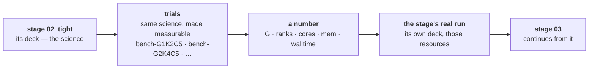

# The project directory — what lives where, and who puts it there

**Role:** contract
**Domain:** execution
**Companions:** [`execution/job-contracts.md`](?doc=execution/job-contracts.md)
— the run directory's own rules, the topic list, the filename conventions;
[`execution/job-system.md`](?doc=execution/job-system.md) — the JobSet the
per-stage folders come from; [`engines/stages.md`](?doc=engines/stages.md) — what
a stage is and how its deck is produced;
[`execution/checkpointing.md`](?doc=execution/checkpointing.md) — what the saved
history must always hold;
[`execution/run-identity.md`](?doc=execution/run-identity.md) — the id a
calculation's files share.

**Status: mostly shipped, described here for the first time as one picture.**
Every level below exists in code today except `stages.json`, its reader, and the
stage-directory naming in § 4. What this document adds is the *whole*: which
directory owns what, how parameter tuning and resource tuning nest, and where the
saved history sits.

**This contract owns:** the levels of the tree, who may write at each one, how
each level is named, and the invariants that hold across them. It does not
restate the rules inside a single run directory — those are `job-contracts.md`.

---

## 1. The shape

Six levels, and each one means something different.

```
projects/                                   the root (git-ignored)
└── BDT-Au/                                 ① a PROJECT — a body of work
    ├── structure/                          ② a STORAGE topic
    │   └── bdt_au.xyz  bdt_au.molstruct.json
    ├── pseudopotential/                    ② a STORAGE topic
    │   └── Au.psml  S.psml  C.psml  H.psml
    └── optimization/                       ② a RUN topic — one of nine fixed names
        └── bdt_au_relax_c6h4s2au38/        ③ a CALCULATION — one system, one identity
            ├── stages.json                   the description: what was asked for
            ├── <id>_coarse.fdf               one deck per stage, rendered from it
            ├── <id>_tight.fdf
            ├── <id>_coarse.run.sh .sbatch    one wrapper per deck
            ├── <id>_tight.run.sh  .sbatch
            ├── Au.psml  S.psml               the shared package, stored once
            ├── mb_monitor.py
            ├── job-set.json  STAGE-PLAN.md   derived
            ├── .mbcheckpoint.json
            ├── .git/  .binsnapshots/         the saved history (§ 6)
            │
            ├── 01_coarse/                  ④ a STAGE — one science setting
            │   ├── <id>_coarse.fdf → ../     its deck, linked up
            │   ├── Au.psml → ../             shared, linked up
            │   ├── run-0/                  ⑤ an ATTEMPT — a RUN, immutable
            │   │   ├── <id>_coarse.fdf → ../   the deck, linked down
            │   │   └── <id>.XV .DM .out        everything this attempt produced
            │   ├── run-1/                    a second attempt, carrying run-0's state
            │   └── bench/                    a BENCHMARK — its own container
            │       ├── job-gpu.fdf  job-cpu.fdf    the science, made measurable
            │       ├── bench-manifest.json  bench-result.json
            │       └── point-G1K2C5/         its own runs
            │
            └── 02_tight/
                └── run-0/
                    └── <id>.XV → ../../01_coarse/run-1/   carried, then localised
```

**③ is a calculation** — one system studied one way. One identity, one saved
history, one description. Everything above it is filing.

### 1.1 A directory is a container or a run, never both

Every directory in this tree is one of two things:

- a **container** — it holds setup and other directories. Decks, wrappers, the
  description, links, the shared package. All text or small.
- a **run** — one invocation of the engine. It holds what that invocation
  produced, and nothing else holds that.

A calculation is a container. A stage is a container. A benchmark bundle is a
container. The leaves — `run-N/`, `point-<knobs>/` — are runs.

**This is what makes everything downstream simple.** Setup is text, so git handles
it entirely. Only a run holds anything big. There is no directory where the two
are mixed and something has to tell them apart.

> **A simple run stays simple.** A plain run directory does not grow a `run-0/`.
> It **is** a run — a leaf with no container above it — which is exactly what a
> hand-made directory with one `.fdf` in it already is. Nothing about the
> straightforward case changes.

### 1.2 An attempt is immutable

**A run directory is written once and never modified.** Running a stage a second
time — a `--continue`, a redo after a change — makes `run-1`, carrying what it
needs from `run-0` and leaving `run-0` exactly as it was.

That is the same carry mechanism stages already use between themselves
(`job-system.md § 5.2`: link it in, localise it before starting), applied one
level down.

Three things follow:

- **Warm restart becomes explicit.** Today "continue" means *the files happen to
  be in this directory*. With one directory per attempt it means *carry from the
  previous attempt* — visible on disk rather than implied by what is lying
  around.
- **The saved history becomes append-only.** No archived file ever changes, so a
  new save point only has to store the attempts that appeared since the last one
  (§ 6).
- **`--force` is retired.** It exists to reset the run index to `-run0` and
  overwrite it (`job-contracts.md § 2.6`). With a directory per attempt there is
  nothing to overwrite: a redo is `run-2`. A flag whose only purpose is to
  destroy a previous result has no place once results cannot collide.

Immutability is a contract, not a filesystem permission — but it is **checkable**,
and § 7 makes it an invariant: an attempt that has been saved must never differ
afterwards. Nothing would notice today.

#### Where the wrapper is invoked

**In the container — the stage directory, or the calculation root for a
single-stage run. Never inside an attempt**, because the attempt does not exist
until the wrapper creates it.

```
cd 01_coarse && bash ../<id>_coarse.run.sh      → builds 01_coarse/run-0/
```

That keeps the shipped invocation unchanged: `jobset submit` already does
`cd <job dir> && bash …run.sh`, and a `.sbatch` inherits the directory it was
submitted from. Nothing about how a run is launched moves — only what the
wrapper does in its first ten lines.

The wrapper **refuses** (exit 2) if its working directory is itself a
`run-<n>/`, naming the mistake and what to do. Without that it would happily
nest `run-0/run-0/`, and the second attempt would carry from nothing.

**Everything the attempt needs, the wrapper puts there:**

| | How | Why |
|---|---|---|
| the deck, the monitor, the pseudopotentials | **linked** from the container | five attempts share one copy of each |
| the previous attempt's warm files | **copied** | the engine writes to them; a link would write back into the attempt that produced them, and immutability is the whole point |
| everything the run writes | created in place | it is already the working directory |

**The wrapper half is built** (2026-08-06, `runwrap.py`, opt-in via
`attempt_dirs`). It resolves the next attempt, creates `run-<n>/`, **links** the
deck and shared package in, **copies** the previous attempt's warm files —
copies, because a link would let the engine write back into the attempt that
produced them — and cds in. Every later line of the wrapper is unchanged: the
launch, the monitor, the SCF tee and the failure hints all work relative to the
current directory, so they land in the attempt with no further edits. A flat run
directory does not pass the flag and behaves exactly as it does today.

---

## 2. Who owns each level

| Level | Named by | Written by | May contain |
|---|---|---|---|
| ① **project** | the user | nobody — it is a folder | topics, nothing else |
| ② **topic** | a **fixed set of nine** (`job-contracts.md § 2.5`) | nobody | calculations (run topics) or files (storage topics) |
| ③ **calculation** | the run id (`run-identity.md § 3`) | **the producer**, in one transaction | decks, wrappers, the shared package, the description, derived files, the history |
| ④ **stage** | `<seq>_<name>` (§ 4) | **prep** lays the links | links up, and its attempts — **a container** |
| ⑤ **attempt** | `run-<n>`, unpadded (§ 4.4) | the wrapper, once | everything one invocation produced — **a run, immutable** |
| — **benchmark** | `bench` | the benchmark producer | its own decks, wrappers, config and results — a self-contained **container** |
| — **trial** | `point-<knobs>` (§ 4.4) | the sweep script, then the engine | one throwaway **run** |

Two rules, and everything else follows:

> **The producer writes level ③ and nothing else. The engine writes the run
> directory it was launched in, once, and nothing else ever writes there again.**

The producer never writes inside a stage directory; prep only puts symlinks
there. The engine never writes above itself — the wrapper copies a carried file
local before starting, precisely so a stage cannot write back through a link into
the stage that produced it (`job-system.md § 5.2`).

**A benchmark gets its own directory, and that is not tidiness.**
`generate_bench_bundle` writes its own decks, wrappers, pseudopotential copies,
`README.md` and `.molbuilder.json` — it owns a directory. Pointed at a stage
directory it would put a second job's inputs beside the real run's, which
`job-contracts.md § 2.1` Rule 1 forbids, and duplicate the pseudopotentials
already linked from the parent. Pointed at `01_coarse/bench/` it needs **no
change at all**: the bundle root moves, everything inside it stays as it ships.

**Storage topics are flat and shared.** `structure/` and `pseudopotential/` hold
files, not calculations. A calculation *points* at a structure and *copies* the
pseudopotentials it needs into its own shared package, so it stays
self-contained when moved to a cluster.

---

## 3. Two kinds of tuning, nested

There are two things a user varies. They vary for different reasons, they need
different machinery, and — this is the part that was implicit — **one nests
inside the other.**

| | **Stage** (④) — parameter tuning | **Trial** (⑥) — resource tuning |
|---|---|---|
| What varies | the science: mesh cutoff, force tolerance, relaxation method, k-grid | the machine: GPUs, MPI ranks, cores per rank |
| Why | to approach an answer in steps — coarse first, then tight | to find out what runs *this* science fastest *here* |
| The deck | **its own file**, rendered from the shared settings with this stage's values substituted | the stage's deck **transformed to be measurable** (§ 3.2) |
| Identity | shares the calculation's id, so it warm-starts from the stage before | **its own throwaway label** — `job-gpu` / `job-cpu` |
| Ordered? | **yes** — each continues the one before | **no** — trials are independent and can all queue at once |
| Outcome | a result you keep | a number; the run is thrown away |
| Produced by | `render_siesta_stage_fdfs` + `stages_to_jobset` | `generate_bench_bundle` + `sweep_to_jobset` |

**Why trials nest under a stage rather than beside the calculation.** The best
rank count depends on the science: mesh cutoff changes the grid, basis size
changes the matrix, and `BlockSize` is derived from ranks and atom count. A
coarse stage and a tight stage can genuinely want different resources, so the
measurement belongs to the stage that was measured.

### 3.1 Why the mechanisms differ

A parameter change alters *what the engine computes*, so it has to be in the file
the engine reads — hence one deck per stage. A resource change alters *how the
work spreads over hardware*, and the scheduler takes that on the command line —
which is what lets a twenty-point sweep share one rendered wrapper instead of
writing twenty.

Three settings are both, and they are the reason neither mechanism is *the*
mechanism:

| Setting | In the deck | Also decides |
|---|---|---|
| `Diag.Algorithm` (ScaLAPACK / ELPA) | yes | which conda environment the wrapper activates — any ELPA variant needs the GPU build (`running-a-job.md § 2.3`) |
| GPU on/off | yes (`Diag.ELPA.GPU`) | the scheduler's `--gres` |
| MPI ranks | **no**, but `BlockSize` is derived from them | the scheduler's `-n`, and the launch |

### 3.2 A trial's deck is the stage's deck, made measurable

A trial does **not** run the stage's deck. `transform_fdf` derives a variant that
can be timed:

- **SCF capped** (5 iterations) and `SCF.MustConverge` **off**, so a capped run
  exits cleanly instead of aborting and reading as a scheduler failure;
- **MD steps zeroed** — a single point, because you are timing an iteration, not
  converging a geometry;
- **cold start forced** (`DM.UseSaveDM .false.`);
- **relabelled** to `job-gpu` / `job-cpu`;
- **one solver for both points** (`ELPA-1STAGE`), the GPU point setting the CUDA
  flag on and the CPU point setting it *explicitly* off — so the number isolates
  the hardware rather than the solver.

**The last two are what make it safe to nest.** A trial that kept the stage's
label and honoured saved state would read the stage's `.XV`/`.DM` and then
overwrite them — a five-iteration throwaway destroying the state the real run
depends on. Relabelling and forcing cold are not artefacts of the benchmark once
having been standalone; they are the reason it can live inside a stage's
directory at all.

> **A trial belongs to the deck it was derived from.** Change the stage's science
> and the measurement no longer applies. The manifest records the source deck's
> hash so a stale answer can be recognised rather than reused.

### 3.3 How the levels compose



You measure per stage, when the science changes enough to matter. You keep the
answer in the stage directory. The real run then uses it, and the next stage
continues from the real run's state — never from a trial's.

---

## 4. Naming, and why the two levels name differently

### 4.1 A stage carries a sequence number

A stage has two identifiers doing two jobs:

- **`name`** — what the user typed (`coarse`, `tight`). Identifies it. Unique
  within the calculation, matching `[A-Za-z0-9_]+` (`engines/stages.md § 2`).
- **`seq`** — a number assigned when the stage is created. **Orders** it. Never
  reused, never reassigned.

| Where | Form | Example |
|---|---|---|
| stage directory | `<seq>_<name>`, zero-padded to two digits | `01_coarse`, `02_tight` |
| deck | `<id>_<name>.fdf` | `bdt_au_relax_c6h4s2au38_tight.fdf` |
| trajectory log | `<id>-stage<seq>` | `…-stage2.molwatch.log` — the shipped convention, with `N` finally **defined** as `seq` |
| checkpoint tag | `<id>/<name>/<UTC>` | you return to a stage by *name*, not by position |

The deck does not carry the number: names are unique, so it would add nothing,
and a deck's filename is quoted in the wrapper, the log and the outputs.

### 4.2 Numbers are assigned once — stages append

**A `seq` is never changed, so a stage can only be added at the end.**

That is not a restriction imposed here; it is what the calculation already is.
Each stage continues from the state the one before it left. Once stage 2 has run,
"insert something between 1 and 2" is not an insertion — it is a new stage that
happens to be coarser, and it runs from where stage 2 left off. Numbering it `03`
is the truth.

Before anything has run, reordering is free: numbers are assigned when the
directories are produced, not when the rows are typed.

**Gaps are honest.** Disable stage 2 and the tree shows `01_` and `03_`. The gap
says something real — there was a stage there and it is switched off.

**Renaming is not a rename.** A stage's name is in its deck's filename, in every
output beside it, and in its checkpoint tags. Renaming one that has run orphans
all of them, so it is a new stage (`engines/stages.md § 7.3`, R5).

### 4.3 An attempt is numbered, and the number is not padded

`run-0`, `run-1`, `run-2`. Deliberately **unpadded**, where a stage is
`01_coarse` — the two are different kinds of thing and the difference is worth
seeing:

- a **stage** number orders a sequence somebody designed, so it pads and sorts;
- an **attempt** number counts invocations that happened, and it inherits the
  shipped `-run0` / `-run1` output naming (`job-contracts.md § 2.6`) so the
  connection between a directory and the outputs inside it stays visible.

Attempts are assigned by the wrapper at launch: the next unused number, never
reused. There is no `--force` to reset them (§ 1.2).

### 4.4 Trials name themselves by their settings

A sweep has no order — no trial follows another — so the name carries **what was
tried**: `bench-G<gpus>K<ranks-per-gpu>C<cores-per-rank>`. That is the shipped
`point-G<g>K<k>C<c>` convention, and it is what lets `summarize` map a directory
back to its point.

> **Ordered levels carry position; unordered levels carry settings.** One naming
> rule each, matching what the level actually is.

**In code:** `materialize.job_dir_name` returns `point-<name>` for everything
today. It branches on `JobSet.kind` — a **ladder** job becomes `<seq>_<name>`, a
**sweep** point keeps `bench-<knobs>`. One function, one condition, and the
JobSet already carries `kind`.

---

## 5. The files, and which of them are sources

At the calculation level every file is one of three things, and confusing them is
how a folder stops being trustworthy.

| File | Kind | Written by | If you delete it |
|---|---|---|---|
| `stages.json` | **source** | the user's surface | the calculation cannot be regenerated or reopened |
| `<id>_<name>.fdf` | derived | the producer, from the source | regenerate |
| `<id>_<name>.run.sh` / `.sbatch` | derived | prep, from the deck + the machine's config | re-prep |
| `job-set.json`, `STAGE-PLAN.md` | derived | the producer / prep | regenerate |
| `*.psml`, `mb_monitor.py` | **input**, copied in | the producer | re-resolve from the project's cache |
| `.mbcheckpoint.json` | **source** | `snapshot init` | the big-file classification is lost |
| stage outputs (④) | **result** | the engine | gone — this is what the history is for |
| trial outputs (⑥) | **scratch** | the engine | nothing lost; `bench-result.json` is the answer |

> **One source, everything else derived.** `stages.json` is the only file at the
> calculation level that cannot be reconstructed from the others. That is what
> makes reopening a calculation possible, and why no produce and no run may write
> to it (`checkpointing.md`, S4).

### 5.1 The config files, by level

| File | Level | Format | Holds |
|---|---|---|---|
| `molbuilder.json` | outside the tree — cwd or `$XDG_CONFIG_HOME` | validated, no version | **the machine**: activation, module preamble, scheduler, env names |
| `.molbuilder.json` | ① project | same, deep-merged over the above, project wins | machine settings for this project |
| `stages.json` | ③ calculation | `molbuilder/stages@1` | **the science**: base settings, which vary, the stages |
| `job-set.json` | ③ calculation | `molbuilder/job-set@1` | the chain: jobs, edges, carried files, per-job resources |
| `.mbcheckpoint.json` | ③ calculation | `molbuilder/checkpoint-config@1` | which patterns are big files |
| `.molbuilder.json` | ⑤ benchmark bundle | same as project | **the activation the bundle carries to the target** — written by `_write_activation_config`, the single place that decision is persisted. A fourth scope in practice, and deliberate: the bundle must be runnable after `scp` |
| `environment.json` | ⑤ benchmark bundle | `molbuilder/environment@1` | the machine as detected when this stage was measured |
| `bench-manifest.json` | ⑤ benchmark bundle | `molbuilder/bench-manifest@2` | the two comparable points, and the source deck's hash |
| `bench-result.json` | ⑤ benchmark bundle | `molbuilder/bench-result@1` | every trial's timing, the winner, a recommendation |

**The split is strict, and it is why a calculation folder is portable**: the
machine's knowledge lives in `molbuilder.json`, outside the calculation; the
science lives in `stages.json`, inside it. A calculation carries no walltime, no
partition, no activation command. Copy it to another cluster and it still
describes the same calculation (`job-system.md § 2`, decision 3).

The benchmark files are the one deliberate exception, and they sit at **⑤, not
③**: they are a measurement of *this machine* for *this stage*, so they are not
portable and are not meant to be. Moving a calculation to a different cluster
leaves them stale, which the recorded environment makes visible.

---

## 6. Where the saved history sits

**One saved history per calculation, at level ③.** Not per stage, not per
project.

```
bdt_au_relax_c6h4s2au38/
├── .git/                       the text: decks, wrappers, stages.json, .XV, .CG
├── .binsnapshots/<save>/       the big files, by path:
│   ├── 01_coarse/run-0/<id>.DM   ← that attempt's density matrix
│   ├── 01_coarse/run-1/<id>.DM   ← the retry's, kept separately
│   ├── 02_tight/run-0/<id>.DM
│   └── MANIFEST                  ← name, size, checksum for each
└── .mbcheckpoint.json          which patterns count as big
```

Three reasons it belongs at ③:

- **The shared package is above the stages.** A history rooted inside `01_coarse/`
  cannot restore a pseudopotential that lives one level up, so a restored stage
  would have links pointing at nothing.
- **Going back to a stage is a whole-calculation act.** Branching at *coarse* to
  try a different *tight* needs a history containing both.
- **Results are already separated by path**, so each attempt's big files stay its
  own without a history of their own.

### 6.1 What the archive covers, in one rule

**Git tracks the containers. The archive covers the runs.**

That is the whole classification, and it needs no marker file, no config flag and
no name matching — because § 1.1 already made every directory one thing or the
other. A container holds setup: decks, wrappers, the description, links, the
shared package. All text or small, all git's.

**Which runs?** The ones this calculation owns: the calculation root itself when
it is flat, otherwise each stage's `run-N/`. A benchmark's `point-*/` is a run of
a **nested container**, one level deeper, and its `.DM` is a five-iteration
throwaway — so the calculation's archive does not reach it. What survives a
benchmark is `bench-result.json`, text, which git tracks wherever it sits.

So the rule is about **depth, not names**: a run directory is a direct child of a
stage, or the root of a flat calculation. Nothing below that is this history's
binary business.

### 6.2 Append-only, because attempts are immutable

An attempt never changes after it is written (§ 1.2), so an archived file never
changes either. A new save point stores the attempts that appeared since the last
one and references the rest.

**That is the disk-growth problem solved by structure rather than by hashing.**
The archive copies every big file on every save today, and a five-stage mission
with a 2 GB density matrix per stage pays for all of it every time. Immutable
attempts make "archive what is new" both correct and obvious, where a
content-addressed store would have been correct and hopeful.

**And it makes a violation detectable.** Immutability is a contract, not a
permission bit. But an attempt that was archived and then edited *differs from its
recorded checksum*, which is precisely what I2 already checks per file. Nothing
notices today; § 7 makes it an invariant.

### 6.3 What still stands in the way

The setup step refuses a folder whose subfolders contain a calculation file, at
**any** depth — and this tree has three such levels now: a stage's linked deck,
an attempt's linked deck, and the benchmark bundle's real one. So the folder the shipped code already produces cannot be put
under a history. The fix is for the producer, which just built the folder and
knows it is one calculation, to say so (`checkpointing.md`, L1).

---

## 7. The invariants

Each is written so a test can assert it. Rules about a single run directory or a
single history live in their own contracts and are cited, not repeated.

**Naming and identity**

1. **Every path segment matches `[A-Za-z0-9_-]+`**, and a topic is one of the
   nine (`job-contracts.md § 2.5`).
2. **A calculation directory is named by its run id**, and that id is the
   `SystemLabel` in every stage deck inside it (`run-identity.md § 3`).
3. **Every file a stage reads or writes shares one basename** — the id
   (`job-contracts.md § 2.1`, Rule 2). This is what makes warm restart work
   across stages without copying anything.
4. **A stage's `seq` is assigned once and never reassigned**; stages append
   (§ 4.2). **An attempt's number likewise** — the next unused, never reused, and
   nothing resets it (§ 1.2).
5. **A trial never shares the calculation's identity.** Its deck is relabelled
   and forced cold, so it can neither read nor overwrite a stage's saved state
   (§ 3.2).

**Ownership**

6. **The producer writes only at level ③**; prep adds only symlinks at ④; the
   engine writes only the directory it was launched in.
7. **A shared file exists once, at ③**, and is linked into each stage. Never
   copied per stage.
8. **Every directory is a container or a run, never both** (§ 1.1). A run's
   output stays inside it; nothing a run writes appears above it.
8a. **An attempt is immutable.** Once written it never changes, and once archived
   it must never differ from its recorded checksum — which is
   `checkpointing.md`'s I2 applied to a directory instead of a file (§ 6.2).
9. **The description is the only source at ③.** No produce and no run modifies it
   (`checkpointing.md`, S4).

**Composition**

10. **A calculation folder carries no machine knowledge** — no walltime, no
    partition, no activation. Those are `molbuilder.json`'s, outside the tree.
    Benchmark files are the deliberate exception and sit at ④.
11. **A parameter difference is a different deck; a resource difference is a
    different launch.** Neither mechanism is used for the other's job.
12. **Derived files can be deleted and regenerated** from `stages.json` plus the
    machine's config, byte-identical except for the provenance timestamp.
13. **Warm restart flows down the stage axis only.** Stage *n* continues from
    stage *n−1*; nothing continues from a trial.

**History**

14. **One history per calculation, rooted at ③** (§ 6).
15. **Every big regular file is either in git or in the archive, never both,
    never neither** (`checkpointing.md`, S1) — and after the 2026-08-06 fix that
    holds at every depth, so a stage's result is covered.
16. **The archive covers runs this calculation owns** — a flat root, or a
    stage's `run-N/`. A nested container's runs (a benchmark's `point-*/`) are
    not its business (§ 6.1). **Not held today**: the walk classifies by pattern
    and archives a trial's `.DM` like any other.
17. **A save stores only what is new** (§ 6.2). **Not held today**: every save
    copies every big file.

---

## 8. What is not settled

1. **Does a trial's answer feed the stage automatically?** `bench-result.json`
   sits beside the stage that was measured, and its recorded choice is portable —
   the concrete rank and core counts are re-resolved per machine. Whether the tab
   offers *"use the measured resources"*, and what it does when the environment or
   the source deck has since changed, is a surface decision.
2. **Must every stage be measured?** Measuring each of five stages costs five
   sweeps. In practice a user measures one representative stage and reuses the
   answer for the rest. The layout allows both; nothing says which is expected,
   or how a stage records *"resources measured on 02_tight"*.
3. **May one calculation folder hold two ladders?** Nothing forbids two
   descriptions side by side, and the layout would allow it, but the id names the
   folder and warm files are shared, so a second ladder would continue from the
   first's state. Probably refuse; not yet stated.
