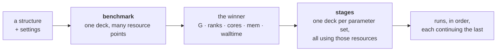

# The project directory — what lives where, and who puts it there

**Role:** contract
**Domain:** execution
**Companions:** [`execution/job-contracts.md`](?doc=execution/job-contracts.md)
— the run directory's own rules, the topic list, the filename conventions;
[`execution/job-system.md`](?doc=execution/job-system.md) — the JobSet the
per-stage folders come from; [`engines/stages.md`](?doc=engines/stages.md) — what
a stage is and how its deck is produced;
[`execution/checkpointing.md`](?doc=execution/checkpointing.md) — what the saved
history must always hold;
[`execution/run-identity.md`](?doc=execution/run-identity.md) — the id every file
in a calculation shares.

**Status: mostly shipped, described here for the first time as one picture.**
Every level below exists in code today except `stages.json` and its reader. What
this document adds is the *whole*: which directory owns what, how the two kinds
of tuning fit together, and where the saved history sits.

**This contract owns:** the levels of the tree, who may write at each one, and
the invariants that hold across them. It does not restate the rules inside a run
directory — those are `job-contracts.md`.

---

## 1. The shape

Four levels, and each one means something different.

```
projects/                                  the root (git-ignored)
└── BDT-Au/                                ① a PROJECT — a body of work
    ├── structure/                         ② a STORAGE topic
    │   └── bdt_au.xyz  bdt_au.molstruct.json
    ├── pseudopotential/                   ② a STORAGE topic
    │   └── Au.psml  S.psml  C.psml  H.psml
    └── optimization/                      ② a RUN topic — one of nine fixed names
        └── bdt_au_relax_c6h4s2au38/       ③ a CALCULATION — the unit of everything
            ├── stages.json                the description: what was asked for
            ├── <id>_coarse.fdf            one deck per stage, rendered from it
            ├── <id>_tight.fdf
            ├── <id>_coarse.run.sh .sbatch one wrapper per deck
            ├── <id>_tight.run.sh  .sbatch
            ├── Au.psml  S.psml            the shared package, stored once
            ├── mb_monitor.py
            ├── job-set.json               the chain, derived
            ├── STAGE-PLAN.md              the readable plan, derived
            ├── .mbcheckpoint.json         what counts as a big file here
            ├── .git/  .binsnapshots/      the saved history (§ 5)
            ├── point-coarse/              ④ a RUN — links in, outputs out
            └── point-tight/
```

**The one that carries the weight is ③.** A *calculation* is one system studied
one way: one identity, one saved history, one description. Everything above it is
filing; everything below it is a single run of it.

---

## 2. Who owns each level

| Level | Named by | Written by | May contain |
|---|---|---|---|
| ① **project** | the user | nobody — it is a folder | topics, nothing else |
| ② **topic** | a **fixed set of nine** (`job-contracts.md § 2.5`) | nobody | calculations (run topics) or files (storage topics) |
| ③ **calculation** | the run id (`run-identity.md § 3`) | **the producer**, in one transaction | decks, wrappers, the shared package, the description, derived files, the history |
| ④ **run** | `point-<stage>` (`materialize`) | **prep**, then **the engine** | symlinks up, and everything the run writes |

Two rules follow, and everything else in this document is a consequence:

> **The producer writes level ③ and nothing else. The engine writes level ④ and
> nothing else.**

The producer never writes inside a `point-*/`; prep only puts symlinks there. The
engine never writes above its own directory — the wrapper copies a carried file
local before starting precisely so a stage cannot write back through a link into
the stage that produced it (`job-system.md § 5.2`).

**Storage topics are flat and shared.** `structure/` and `pseudopotential/` hold
files, not calculations. A calculation *points* at a structure and *copies* the
pseudopotentials it needs into its own shared package, so it stays
self-contained when moved to a cluster.

---

## 3. Two kinds of tuning, and why they use different machinery

This is the part that has been implicit. There are two things a user varies, they
vary for different reasons, and the code treats them differently — correctly.

| | **Stages** — parameter tuning | **Benchmark** — resource tuning |
|---|---|---|
| What varies | the science: mesh cutoff, force tolerance, relaxation method, k-grid | the machine: GPUs, MPI ranks, cores per rank |
| Why | to approach an answer in steps — coarse first, then tight | to find out what runs this system fastest here |
| How it varies | **one deck per stage**, rendered from the shared settings with that stage's values substituted | **one deck, reused**, with the numbers becoming launch flags |
| On disk | `<id>_coarse.fdf`, `<id>_tight.fdf` — different files, different contents | one `job-gpu.fdf` symlinked into every `point-G1K2C5/` |
| Ordered? | yes — each stage continues from the one before | no — the points are independent and can all queue at once |
| Produced by | `render_siesta_stage_fdfs` + `stages_to_jobset` | `generate_bench_bundle` + `sweep_to_jobset` |

**Why the difference is right.** A parameter change alters what the engine
computes, so it has to be in the file the engine reads. A resource change alters
how the work is spread over hardware, and the scheduler takes that on the command
line — which is what lets a twenty-point sweep share one rendered wrapper instead
of writing twenty.

### 3.1 Where they overlap

Three settings are resources *and* deck lines, and they are the reason neither
mechanism can be described as "the" way:

| Setting | In the deck | Also decides |
|---|---|---|
| `Diag.Algorithm` (ScaLAPACK / ELPA) | yes | which conda environment the wrapper activates — any ELPA variant needs the GPU build (`running-a-job.md § 2.3`) |
| GPU on/off | yes (`Diag.ELPA.GPU`) | the scheduler's `--gres` |
| MPI ranks | **no**, but `BlockSize` is derived from them | the scheduler's `-n`, and the launch |

The benchmark handles this by *transforming a deck*: `transform_fdf` takes the
user's real `.fdf` and writes two comparable variants — same solver, SCF capped,
cold start forced, one with the GPU flag on and one with it explicitly off — so
the measurement isolates hardware rather than solver.

That transform is also the shape a stage needs when a promoted field is
resource-flavoured, and `job-contracts.md § 3.3`'s BENCH-MARKS block is the
declared surface for it: the deck says which of its own lines a tool may rewrite
and within what bounds, anchored to the keyword rather than to a line number.

### 3.2 How the two compose

They are not alternatives; they run in sequence, and the handoff is a small
number of values.



You benchmark **once per system and machine**, because the answer depends on the
size of the problem and the shape of the node, not on how tight the convergence
is. You then reuse that answer for every stage of every ladder on that system.
`molbuilder bench prep-run` already turns a winner into a ready launch, and its
recorded choice is portable — the concrete rank and core counts are re-resolved
for whatever machine it lands on.

**Where a benchmark bundle lives is not yet decided.** `generate_bench_bundle`
takes an arbitrary output directory, and there is no `benchmark` topic among the
nine. Today it lands wherever the user says — often outside the project tree. § 7
lists this as the one open question in the layout.

---

## 4. The files, and which of them are sources

At the calculation level, every file is one of three things, and confusing them
is how a folder stops being trustworthy.

| File | Kind | Written by | If you delete it |
|---|---|---|---|
| `stages.json` | **source** | the user's surface | the calculation cannot be regenerated or reopened |
| `<id>_<stage>.fdf` | derived | the producer, from the source | regenerate |
| `<id>_<stage>.run.sh` / `.sbatch` | derived | prep, from the deck + the machine's config | re-prep |
| `job-set.json`, `STAGE-PLAN.md` | derived | the producer / prep | regenerate |
| `*.psml`, `mb_monitor.py` | **input**, copied in | the producer | re-resolve from the project's cache |
| `.mbcheckpoint.json` | **source** | `snapshot init` | the classification of big files is lost |
| `point-*/…` outputs | **result** | the engine | gone — this is what the history is for |

> **One source, everything else derived.** `stages.json` is the only file at the
> calculation level that cannot be reconstructed from the others. That is what
> makes reopening a calculation possible, and it is why the producer must never
> write to it (`checkpointing.md`, S4).

### 4.1 The config files, by level

| File | Level | Format | Holds |
|---|---|---|---|
| `molbuilder.json` | outside the tree — cwd or `$XDG_CONFIG_HOME` | validated, no version | **the machine**: activation, module preamble, scheduler, env names |
| `.molbuilder.json` | ① project | same, deep-merged over the above, project wins | machine settings for this project |
| `stages.json` | ③ calculation | `molbuilder/stages@1` | **the science**: base settings, which vary, the stages |
| `job-set.json` | ③ calculation | `molbuilder/job-set@1` | the chain: jobs, edges, carried files, per-job resources |
| `.mbcheckpoint.json` | ③ calculation | `molbuilder/checkpoint-config@1` | which patterns are big files |
| `environment.json` | benchmark bundle | `molbuilder/environment@1` | the detected machine: scheduler, topology, site |
| `bench-manifest.json` | benchmark bundle | `molbuilder/bench-manifest@2` | the two comparable points |
| `bench-result.json` | benchmark bundle | `molbuilder/bench-result@1` | every point's timing, the winner, a recommendation |

**The split is strict and it is the reason a bundle is portable**: the machine's
knowledge lives in `molbuilder.json`, outside the calculation; the science lives
in `stages.json`, inside it. A calculation folder carries no walltime, no
partition, no activation command. Copy it to another cluster and it still
describes the same calculation (`job-system.md § 2`, decision 3).

---

## 5. Where the saved history sits

**One saved history per calculation, at level ③.** Not per run, not per project.

```
bdt_au_relax_c6h4s2au38/
├── .git/                    the text: decks, wrappers, stages.json, .XV, .CG
├── .binsnapshots/<save>/    the big files, by path:
│   ├── point-coarse/<id>.DM      ← coarse's density matrix
│   ├── point-tight/<id>.DM       ← tight's, kept separately
│   └── MANIFEST                  ← name, size, checksum for each
└── .mbcheckpoint.json       which patterns count as big
```

Three reasons it belongs at ③ and nowhere else:

- **The shared package is above the runs.** A history rooted inside
  `point-coarse/` cannot restore a pseudopotential that lives one level up, so a
  restored run would have links pointing at nothing.
- **Going back to a stage is a whole-calculation act.** Branching at *coarse* to
  try a different *tight* needs a history that contains both. No per-run history
  does.
- **The results are already separated by path.** Since the archive records
  `point-coarse/<id>.DM`, each stage's big files stay its own without needing a
  history of their own.

Small restart files (`.XV`, `.CG`) are text and go into git directly, so
restoring brings back a state you can resume from. The large ones are stored
beside it with their checksums.

**One thing stands in the way today.** The setup step refuses a folder whose
subfolders contain a calculation file — and `point-coarse/<id>_coarse.fdf` is
one, even as a symlink. So the folder the shipped code already produces cannot be
put under a history. The fix is for the producer, which just built the folder and
knows it is one calculation, to say so (`checkpointing.md`, L1).

---

## 6. The invariants

These hold across the whole tree. Each is written so a test can assert it; the
ones about a single run directory or a single history live in their own contracts
and are cited, not repeated.

**Naming and identity**

1. **Every path segment matches `[A-Za-z0-9_-]+`**, and a topic is one of the
   nine (`job-contracts.md § 2.5`).
2. **A calculation directory is named by its run id**, and that id is the
   `SystemLabel` in every deck inside it (`run-identity.md § 3`).
3. **Every file a run reads or writes shares one basename** — the id
   (`job-contracts.md § 2.1`, Rule 2). This is what makes warm restart work
   across stages without copying anything.

**Ownership**

4. **The producer writes only at level ③**; prep adds only symlinks at ④; the
   engine writes only inside its own ④.
5. **A shared file exists once, at ③**, and is linked into each ④. Never copied
   per run.
6. **A stage's results stay in its own `point-<stage>/`.** Nothing a run writes
   appears above it.
7. **The description is the only source at ③.** No produce and no run modifies
   it (`checkpointing.md`, S4).

**Composition**

8. **A calculation folder carries no machine knowledge** — no walltime, no
   partition, no activation. Those are `molbuilder.json`'s, outside the tree.
9. **A parameter difference is a different deck; a resource difference is a
   different launch.** Neither mechanism is used for the other's job.
10. **Derived files can be deleted and regenerated** from `stages.json` plus the
    machine's config, and the result is byte-identical except for the generation
    timestamp in the provenance block.

**History**

11. **One history per calculation, rooted at ③** (§ 5).
12. **Every big file is either in git or in the archive, never both, never
    neither** (`checkpointing.md`, S1) — and after the 2026-08-06 fix that holds
    at every depth, so a `point-*/` result is covered.

---

## 7. What is not settled

1. **Where does a benchmark bundle live?** It is neither a run topic nor
   storage — it is a measurement *about* a system on a machine. Adding a tenth
   topic would break "nine fixed names"; putting it under `user/` loses the
   connection to the system it measured; leaving it outside the tree (today's
   behaviour) means it is not found, versioned, or reused. **A benchmark result
   is reusable across every calculation on that system**, which argues for
   project level rather than calculation level.
2. **Does a benchmark result feed a stage description automatically?** The winner
   is already portable and re-resolved per machine. Whether the tab offers *"use
   the measured resources"* — and what happens when the structure has since
   changed — is a UI decision resting on question 1.
3. **May one calculation folder hold two ladders?** Nothing forbids two
   descriptions side by side, and the layout would allow it, but the id names the
   folder and warm files are shared, so a second ladder would continue from the
   first's state. Probably refuse; not yet stated.
