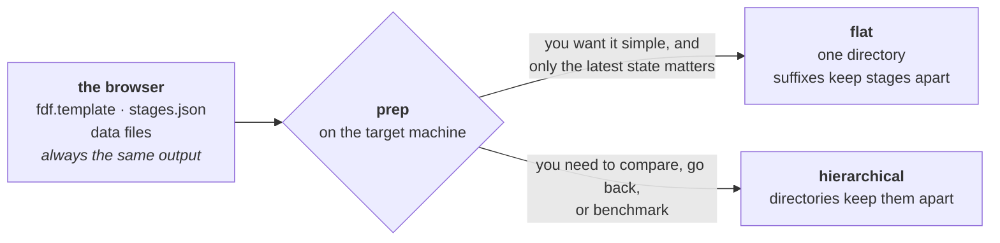
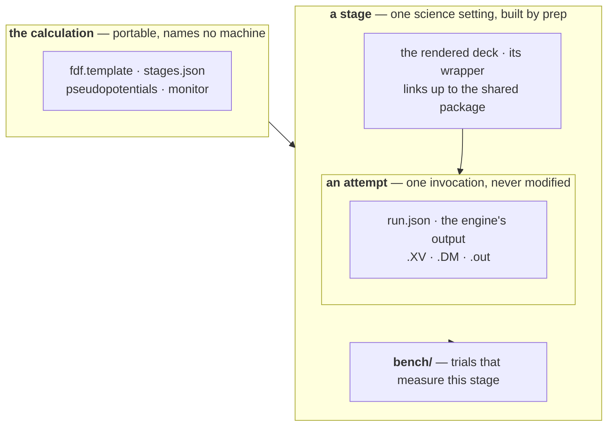
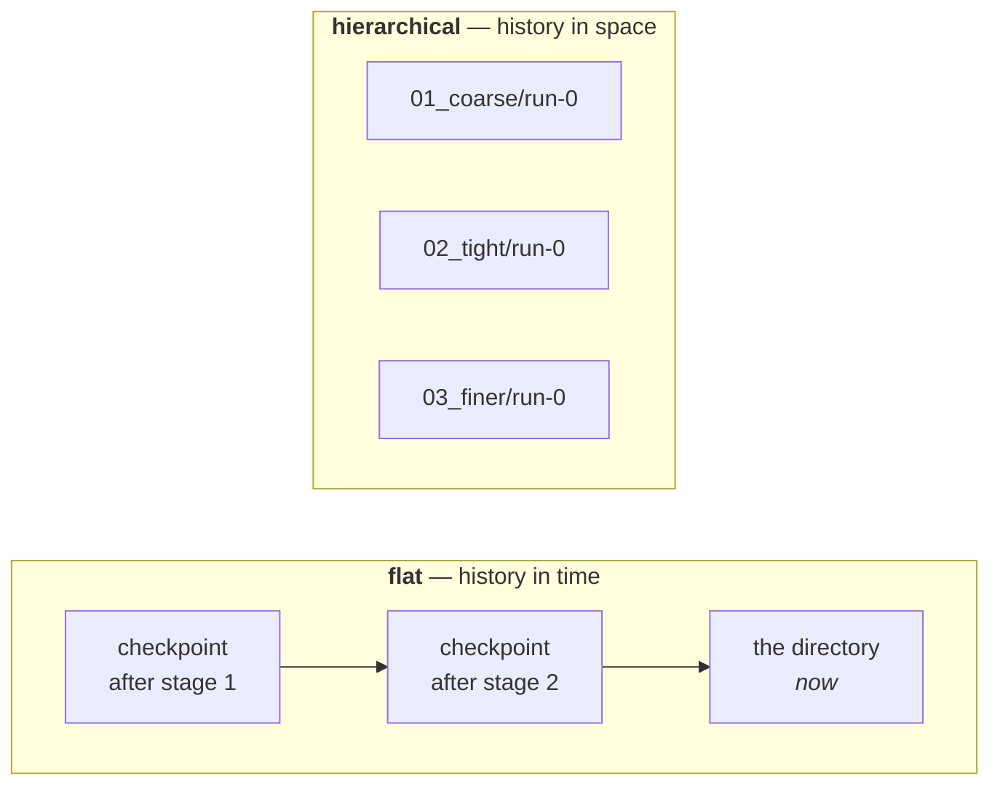
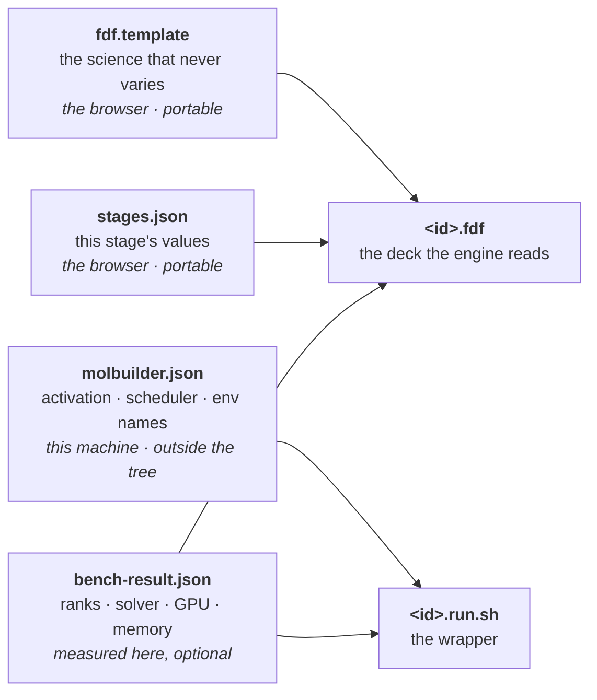
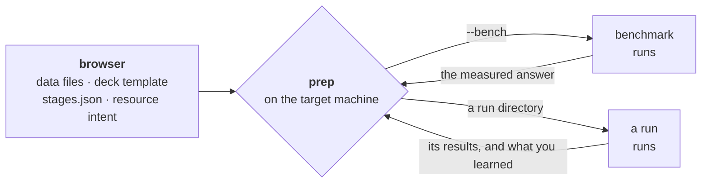
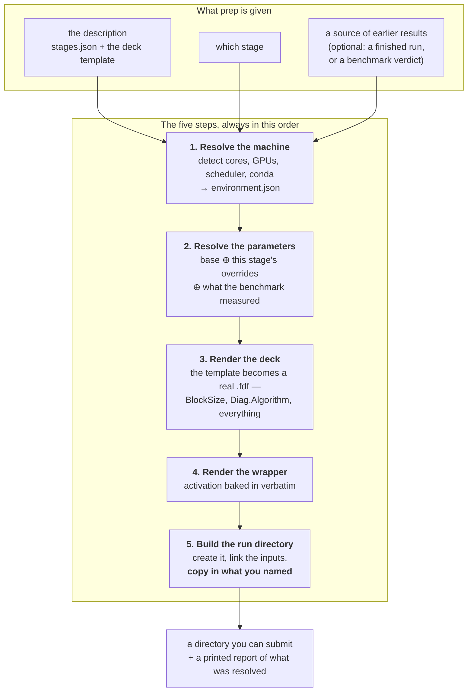
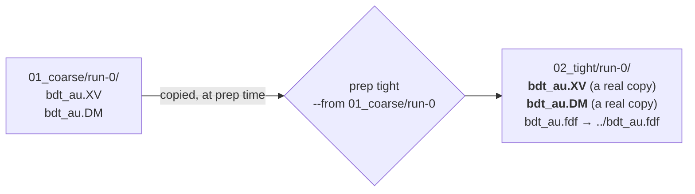
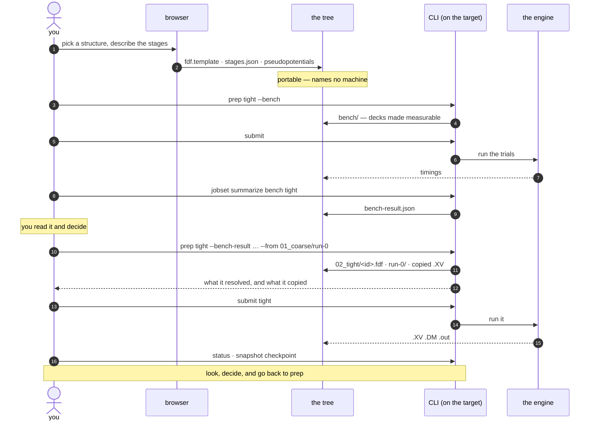
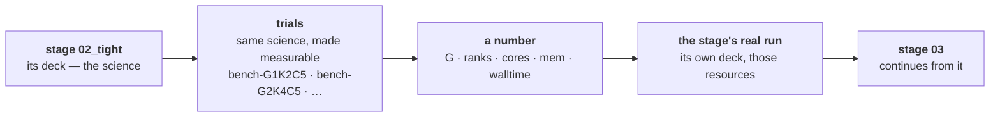

# The project directory — what lives where, and who puts it there

**Role:** contract
**Domain:** execution
**Companions:** [`execution/job-contracts.md`](?doc=execution/job-contracts.md)
— the run directory's own rules, the topic list, the filename conventions;
[`execution/job-system.md`](?doc=execution/job-system.md) — the JobSet the
per-stage folders come from; [`engines/stages.md`](?doc=engines/stages.md) — what
a stage is and how its deck is produced;
[`execution/checkpointing.md`](?doc=execution/checkpointing.md) — what the saved
history must always hold;
[`execution/run-identity.md`](?doc=execution/run-identity.md) — the id a
calculation's files share.

**Status: mostly shipped, described here for the first time as one picture.**
Every level below exists in code today except `stages.json`, its reader, and the
stage-directory naming in § 4. What this document adds is the *whole*: which
directory owns what, how parameter tuning and resource tuning nest, and where the
saved history sits.

**This contract owns:** the levels of the tree, who may write at each one, how
each level is named, and the invariants that hold across them. It does not
restate the rules inside a single run directory — those are `job-contracts.md`.

---

## 1. Two shapes, and how to choose

A project directory is one of exactly two shapes. **Both hold several stages and
several attempts** — they differ in *how those are kept apart*, and everything
else follows from that one choice.

| | **Flat** | **Hierarchical** |
|---|---|---|
| **Stages are separated by** | a **filename suffix** — `<id>_stage1.fdf`, `<id>_stage2.fdf` | a **directory** — `01_coarse/`, `02_tight/` |
| **Attempts are separated by** | an **output index** — `-run0.out`, `-run1.out` | a **directory** — `run-0/`, `run-1/` |
| **Warm files** (`.XV` `.DM` `.CG`) | **one shared set**, unsuffixed | one set per attempt |
| **Continuing** | free — the next stage finds them lying there | you **name** the run, and its files are copied in |
| **What survives** | the **latest** state only | every stage's, every attempt's |
| **Depth** | 1 | 3 |
| **Chosen** | at `prep` | at `prep` |
| **Status** | **ships today** | **proposed** |

**Flat is what the UI ships today.** The Build tab writes a `.fdf` and its
paired `.run.sh` straight into one directory, and you run them there. Everything
in the flat column below is describing working software, not a plan.

**What changes, and it is the one real migration.** Today the UI writes the
*finished* deck. Under this design it writes a **template plus `stages.json`**,
and `prep` renders the deck — into one directory for the flat shape, or into
stage directories for the hierarchical one. The UI stops producing the last
file in the chain and starts producing the second-to-last.

**One package, two layouts, and you choose.** The browser always writes the same
thing — a deck template, `stages.json`, the data files, none of it naming a
machine. `prep`, on the machine that will run it, translates that into a runnable
directory **in whichever shape you ask for**.



### 1.1 What each one looks like

**Flat** — this is what ships today, and it already does stages:

```
au_bdt_relax/
├── <id>_stage1.fdf              coarse   ─┐ the decks: one per stage,
├── <id>_stage2.fdf              tight     │ told apart by SUFFIX
├── <id>_stage1.run.sh                    ─┘
├── <id>_stage2.run.sh
├── <id>_stage1-run0.out         stage 1, first attempt   ─┐ told apart
├── <id>_stage1-run1.out         stage 1, a redo           │ by INDEX
├── <id>_stage2-run0.out         stage 2, first attempt   ─┘
│
├── <id>.XV   <id>.DM   <id>.CG  ⚠ ONE shared set, UNSUFFIXED
├── <id>.STRUCT_OUT              ⚠ one, overwritten by each stage
└── <id>.ANI  <id>.EIG           ⚠ likewise
```

**The unsuffixed warm files are the whole design, good and bad.** They are
unsuffixed *on purpose* — that is exactly what lets stage 2 pick up stage 1's
geometry with no instruction from anyone (`job-contracts.md § 2.3`:
`MD.UseSaveXV`, `DM.UseSaveDM`, `MD.UseSaveCG` just find them). And it is
exactly why stage 2 overwrites them.

**Hierarchical** — the same stages and attempts, kept apart by directory:

```
bdt_au_relax_c6h4s2au38/            the CALCULATION
├── <id>.fdf.template               ─┐ written by the browser
├── stages.json                      │ portable: names no machine
├── Au.psml  S.psml  mb_monitor.py  ─┘
│
├── 01_coarse/                       a STAGE — written by `prep`
│   ├── <id>.fdf                     the deck, rendered for THIS machine
│   ├── <id>.run.sh                  its wrapper
│   ├── Au.psml → ../Au.psml         shared, linked up
│   ├── run-0/                       an ATTEMPT
│   │   ├── run.json                 how it was launched, what it continued from
│   │   └── <id>.XV .DM .out         this attempt's own everything
│   ├── run-1/                       a redo — run-0 is untouched
│   └── bench/                       a BENCHMARK — its own little world
│
└── 02_tight/
    └── run-0/
        └── <id>.XV                  a real copy of 01_coarse/run-0's
```



### 1.2 The trade, stated once — and why flat needs checkpoints

Put the two side by side on the question that actually matters — *what do you
still have after three stages have run?*

| After stage 1, 2 and 3 have all run | Flat | Hierarchical |
|---|---|---|
| every stage's stdout | on disk — the suffix saved them | on disk |
| the **current** `.XV` / `.DM` | on disk — stage 3's | on disk, per stage and per attempt |
| stage 1's relaxed geometry | **in the checkpoint** — not on disk | on disk, always |
| going back to it | **restore** that checkpoint | open the other directory |
| having both at once | no — one state at a time | yes |
| which run produced the current `.XV` | the checkpoint's message and tag | `run.json` says, without leaving the tree |

**The two shapes keep history in different dimensions.** Hierarchical spreads it
across the *filesystem*: every stage and attempt sits there simultaneously, and
going back is just reading a different directory. Flat keeps one state on disk
and spreads its history through *time*: earlier states live in the checkpoint,
and going back means rewinding.



> **This is why the checkpoint is not optional for the flat shape.** It is the
> only thing standing between *"stage 2 overwrote stage 1's geometry"* and
> *"stage 1's geometry is gone."* In the hierarchical shape the checkpoint is
> insurance; in the flat shape it is **the mechanism** — the sole way to get back
> to a previous run and continue from there.

**And restore is a rewind, not a fetch.** It returns the whole directory to how
it was, text and binaries together (`checkpointing.md`, S6). So going back in the
flat shape means: checkpoint what you have now, restore the earlier one, run from
there. Skip the first step and the current state is what you lose. Hierarchical
never poses that question, because nothing had to be overwritten to begin with.

**Neither shape is wrong.** For one relaxation where only the final geometry
matters, overwriting is the point and flat costs nothing to operate. For a
mission tuned across parameter sets — compared, benchmarked, revisited — having
every state at once is worth the directories, and you stop having to think about
what a restore would cost you.

### 1.3 The same contract, read against both shapes

Every rule in this document holds in both shapes. Where they read differently it
is because *depth* differs — never because the rule does.

| Rule | Flat | Hierarchical |
|---|---|---|
| **A directory is a container or a run, never both** (§ 1.4) | the directory is a **run** — it is a leaf | calculation and stage are **containers**; `run-N/` is a **run** |
| **A result is never overwritten** | holds for *stdout* (`-run0`, `-run1`); **does not hold for warm files**, which are shared by design | holds for everything — an attempt is immutable (§ 1.5) |
| **Every file shares one basename** — the id | yes; only decks and stdout take a stage suffix | yes, and across stages too |
| **Where the deck comes from** | `prep` renders it beside the package | `prep` renders it into the stage's directory |
| | *both from template ⊕ the stage's values ⊕ this machine (§ 2.2)* | |
| **Where the wrapper runs** | in the directory | in the attempt directory `prep` made |
| **git tracks / the archive covers** | one directory is both — classified by **pattern** | containers are git's, runs are the archive's — by **depth** (§ 6.1) |
| **`--force`** | still there: it resets the index and overwrites | **retired** — nothing can collide |

The second row is the one to read twice. *"A result is never overwritten"* is a
rule the flat shape keeps for the files it can and breaks for the files it must —
and it is the same break that makes continuing free.

### 1.4 A directory is a container or a run, never both


Every directory in this tree is one of two things:

- a **container** — it holds setup and other directories. Decks, wrappers, the
  description, links, the shared package. All text or small.
- a **run** — one invocation of the engine. It holds what that invocation
  produced, and nothing else holds that.

A calculation is a container. A stage is a container. A benchmark bundle is a
container. The leaves — `run-N/`, `point-<knobs>/` — are runs.

**This is what makes everything downstream simple.** Setup is text, so git handles
it entirely. Only a run holds anything big. There is no directory where the two
are mixed and something has to tell them apart.

> **A simple run stays simple.** A plain run directory does not grow a `run-0/`.
> It **is** a run — a leaf with no container above it — which is exactly what a
> hand-made directory with one `.fdf` in it already is. Nothing about the
> straightforward case changes.

### 1.5 An attempt is immutable

**A run directory is written once and never modified.** Running a stage a second
time — a `--continue`, a redo after a change — makes `run-1`, carrying what it
needs from `run-0` and leaving `run-0` exactly as it was.

You say which attempt it continues from, and its files are copied in — the same
explicit step you take when moving from one stage to the next (§ 1.6).

Three things follow:

- **Warm restart becomes explicit.** Today "continue" means *the files happen to
  be in this directory*. With one directory per attempt it means *carry from the
  previous attempt* — visible on disk rather than implied by what is lying
  around.
- **The saved history becomes append-only.** No archived file ever changes, so a
  new save point only has to store the attempts that appeared since the last one
  (§ 6).
- **`--force` is retired.** It exists to reset the run index to `-run0` and
  overwrite it (`job-contracts.md § 2.6`). With a directory per attempt there is
  nothing to overwrite: a redo is `run-2`. A flag whose only purpose is to
  destroy a previous result has no place once results cannot collide.

Immutability is a contract, not a filesystem permission — but it is **checkable**,
and § 7 makes it an invariant: an attempt that has been saved must never differ
afterwards. Nothing would notice today.

#### Where a run happens

**Inside the attempt directory**, which was created and filled when you prepared
the stage (§ 1.6, and § 2.5 step 4). By the time anything is launched it already
holds its inputs. The wrapper is invoked there; it activates and execs, and every
later line of it — the launch, the monitor, the SCF tee, the failure hints —
works relative to the current directory, so everything lands in the attempt with
no change to the wrapper at all.

```
prepare  →  01_coarse/run-0/ exists, deck linked, inputs copied
submit   →  launched there
```

Launching in a chosen directory is what `jobset submit` already does one level
up: `subprocess.run(cmd, cwd=<job dir>)` for the local path, and `sbatch` from
the same place for SLURM, which lands the job in `SLURM_SUBMIT_DIR`. Pointing it
at the attempt instead of the container is a change in the caller, not in the
wrapper.

**Everything the attempt needs is put there before the wrapper starts**, and all
of it is in place before the engine sees the directory:

| | How | Why |
|---|---|---|
| the deck, the monitor, the pseudopotentials | **linked** from the container | five attempts share one copy of each |
| whatever this run continues from | **copied** | that run has already finished — you looked at it and chose it — and a link would let this engine write back over it |
| everything the run writes | created in place | it is already the working directory |

**A flat run directory is untouched.** It *is* a run (§ 1.4), so `bash job.run.sh`
in it behaves exactly as it does today.

> ⚠ **One violation is live.** `runwrap.py`'s `attempt_dirs` prologue creates
> and arranges an attempt in shell — scanning for run directories, making one,
> symlinking the deck and package in, copying warm files. That is
> `jobset/materialize.py`'s job, one level down, in the layer
> `running-a-job.md § 2.2a` keeps free of filesystem logic. It is to be retired
> rather than extended, together with the guard it needed against being run from
> inside an attempt — which stops being a hazard once the caller decides the
> directory (invariant 6a).

### 1.6 Stages do not chain, and what that simplifies

**Each stage is prepped and submitted on its own.** Nothing links coarse to
tight; no scheduler dependency, no queued follow-on, no automatic hand-off of
files. When coarse finishes you look at what it produced, decide, and then set up
tight.

That is § 1's rule — *this framework writes correct files; it does not run
things* — applied to the one place it was easiest to forget. It is also the only
sane default when **a stage is a long job**: a chain that continues on its own
can spend a week computing from a geometry you would have rejected in a minute.

> **The decision to continue is the user's, made after looking. molbuilder's job
> is to make continuing correct once that decision is taken.**

#### Who makes the attempt directory

**Python, when you prepare the stage** — step 4 of § 2.5, not when you submit and
not by the wrapper. By the time anything is launched the directory already exists
and already holds its inputs; the wrapper activates the environment and execs the
engine (`running-a-job.md § 2.2a`).

Preparing does five things: **resolve** the next `run-<n>` (highest plus one, or
`run-0`); **create** it; **link** the deck, the monitor and the shared package in;
**copy** whatever this run continues from; and **report** what it did, so you can
read it before committing a week of cluster time.

That last one is why this belongs to prepare rather than submit. Preparing is
still design — you are arranging files and can look at the result — and the split
between preparing and starting is what gives you somewhere to look. Submitting is
then a plain "yes, that one."

That is also where the work already lives: `jobset/materialize.py` creates job
directories and lays relative symlinks. Doing it one level down is the same
operation in the same module.

**Preparing again is safe until the run has been launched.** Otherwise splitting
the two steps leaks directories — prepare, change your mind, prepare again, and
an empty `run-3` sits there forever. A run becomes untouchable once it has *run*
(§ 1.5); before that, re-preparing is just changing your mind about the setup,
which is the entire reason the step is separate.

#### The one file the split needs

*Has this been launched?* has no honest answer from the directory alone. A queued
cluster job has produced nothing yet, so "no output" and "not started" look
identical — and re-preparing would quietly rewrite the setup under a job already
in the queue.

So **submitting writes one small file into the attempt**, `run.json`
(`molbuilder/run-launch@1`): how it was launched, the exact command, the
scheduler's job id, when, and **what it continued from**.

It earns its place three times over: preparing reads it and refuses to reuse a
launched attempt; `status` can say *queued as job 481923* instead of guessing
from an absence; and the last field is the run's provenance — *this geometry came
from `01_coarse/run-0`* — which is worth recording whether or not anything reads
it back. Nothing persists a job id today; `submit_jobset` returns one and the CLI
prints it.

It is written **after** the launch succeeds, so a failed submission leaves the
attempt exactly as prepare left it — still safe to prepare again.

#### Continuing from an earlier run is a copy, not a link

Because stages are set up one at a time, **the run you continue from has already
finished** — that is what you just looked at. Its files are sitting on disk when
you prep the next stage, so they are **copied**, as real files, then and there.

```
02_tight/run-0/<id>.XV     a real copy of 01_coarse/run-0/<id>.XV
```

Copied and not linked for the same reason as always: the engine writes to that
filename, and writing through a link would destroy the result you started from.

**Which run you continue from is something you say, not something molbuilder
guesses.** Continuing from `01_coarse/run-0` and continuing from `01_coarse/run-2`
are different scientific choices, and the folder names make the choice visible
afterwards.

This is the same shape one level down: a redo of a stage — `run-1` after
`run-0` — copies from the attempt you name, for the same reason.

> **What this removes.** Nothing has to point at a file that does not exist yet,
> so there are no dangling links to resolve, no question of *which attempt will
> the producer use*, and nothing to swap at run time. Those problems only arise
> when a whole chain is submitted at once, which is exactly what this does not
> do. A design that never creates the problem beats one that solves it.

#### What is not touched

**The flat case.** A plain run directory *is* a run (§ 1.4), so `bash job.run.sh`
in it behaves exactly as it does today.

**The shipped chained ladder.** `jobset` can thread SLURM dependencies and carry
files between queued jobs, and `stages_to_jobset` currently builds exactly that
(`depends_on=prev.name`, plus `.XV`/`.DM`/`.CG` carries). That machinery stays —
it is the right answer for a benchmark sweep, and for anyone who wants a chain
with their eyes open. **The staged-science producer stops emitting one**, which
is a change to what it builds, not a removal of what `jobset` can do.

#### `--cold`, and running a stage by hand

`--cold` means *start this run clean*. Today it moves warm files aside because
the run directory is reused; with a directory per attempt there is nothing to
move — a fresh attempt is empty unless something is copied in. So `--cold`
becomes simply *skip the copy*, and it moves to whatever command starts the run.
The move-aside machinery, and its `job-contracts.md § 4` requirement that the
glob cover every file the warm branch reads, stay as they are **for the flat
case**, which still reuses one directory.

> **Open** (§ 8): what you type to set up and start one stage. It has to name the
> stage, optionally name the run to continue from, and accept `--cold`. It must
> exist before the wrapper's directory-making prologue is retired, or the manual
> path breaks with nothing behind it.

---

## 2. Who does what — the workflow, and each level's owner

### 2.1 The browser writes a portable package; the terminal makes it runnable

The split is not "design versus execution". It is **what a laptop can know versus
what only the target machine can**.

**The browser writes four things, and none of them mention a machine:**

| | What | Why it is portable |
|---|---|---|
| the **data files** | pseudopotentials, the structure | they are the same everywhere |
| the **deck template** | the science backbone — everything the calculation fixes and no stage varies | it is physics |
| **`stages.json`** | the variables each stage tunes | it is the mission |
| the **resource intent** | *use a GPU · this is a big job · aim for this scale* | a wish, not a number |

**The terminal — `prep`, on the machine that will run it — turns that into a
runnable directory**, because only there do you know:

- workstation or SLURM;
- how conda or mamba is installed here, and whether activation is
  `conda activate` or `source activate` (`molbuilder.json`);
- what the hardware actually is, and what a benchmark measured on it.

Then it **renders the final deck** — template ⊕ this stage's variables ⊕ this
machine's resolved parameters — writes the wrapper, builds the run directory, and
brings in whatever you told it to continue from.

### 2.2 Why the deck cannot be finished in the browser

Because some of what goes *inside* the deck is a fact about the machine.

`BlockSize` is the clearest case: `siesta/input.py`'s `_auto_block_size(n_atoms,
mpi_np, gpu_mode)` derives it from **the rank count and whether there is a GPU**,
and the answer is written into the `.fdf`. The eigensolver is another — ScaLAPACK
or ELPA changes both the deck *and* which conda environment the wrapper
activates. A deck rendered on a laptop is either wrong for the cluster or a
guess.

So the parent holds a **template**, and the final `.fdf` is produced where its
last unknowns are known.

**Four inputs meet, and they arrive from four different places:**



Read the arrows: **the first two are portable and the last two are not.** That is
the whole reason the deck is finished here — two of its four inputs do not exist
until you are standing on the machine.

| Input | Comes from | Decides |
|---|---|---|
| `fdf.template` | the browser | the physics: functional, basis, k-grid, everything no stage touches |
| `stages.json` | the browser | this stage's overrides — mesh cutoff, force tolerance, relaxation type |
| `molbuilder.json` | this machine, outside the tree | how to activate an environment, which queue, what a walltime looks like |
| `bench-result.json` | measured on this machine, optional | rank count → `BlockSize`; solver → `Diag.Algorithm` **and** which conda env |

**A worked instance.** The same description, prepped on two machines:

| | workstation | cluster |
|---|---|---|
| ranks | 8 | 64 |
| `BlockSize` in the deck | 8 | 256 |
| `Diag.Algorithm` | ScaLAPACK | ELPA |
| env the wrapper activates | `molbuilder-siesta` | `molbuilder-siesta-gpu` |
| the wrapper | `mpirun -np 8` | `#SBATCH` header + `srun` |
| **`fdf.template` and `stages.json`** | **byte-identical** | **byte-identical** |

The last row is the point. The portable half did not move; only what the machine
decided did.

This is the same shape the benchmark already ships: `bench prep` runs on the
target, detects the machine, writes `environment.json`, and formats the scripts
for it — *"the user never hand-edits a queue name or a core count; this is what
makes the bundle portable."* The staged path reuses that shape rather than
inventing a second one.

> **A folder that carries no machine knowledge can be copied to any machine. A
> folder whose decks were finished on a laptop can only be copied to that
> laptop.**

### 2.3 `prep` is the hub, not step four of a line

This is the part a linear list gets wrong. **You come back to `prep` every time,
and it is where every join is made:**



Four different jobs, one verb, because they are the same act — *assemble a
runnable directory from a template, a source of earlier results, and this
machine's parameters*:

| You are doing | You give `prep` |
|---|---|
| measuring, before committing | the stage, and *benchmark this* |
| the real run, using what you measured | the stage, and the benchmark result |
| a redo of that run | the stage, and `run-0` to continue from |
| the next stage | that stage, and the previous stage's run to continue from |

**Nothing distinguishes those four in the machinery.** "Continue from `run-0`"
and "continue from `01_coarse/run-0`" are the same instruction pointing at
different directories; "use this benchmark result" is the same kind of input as
"use this geometry". That is why it is one command with arguments rather than
four commands.

And it is where **you** are in the loop. Every arrow back into `prep` is a
decision made after looking at what came out — which is the whole reason stages
do not chain (§ 1.6).

#### 2.3.1 What `prep` does, every time

Whatever job you are asking for, `prep` runs the same five steps in the same
order. Only the **inputs** differ.



**Why the order is forced, not chosen.** Step 3 cannot precede step 1, because a
deck carries values that *depend on how it will be launched* — a block size
derived from the rank count, an eigensolver that also decides which environment
the wrapper must activate. **A parameter that depends on the launch cannot be
decided before the launch is known.** Any deck written before step 1 has guessed
at them. That is § 2.2 restated as a sequencing rule, and it is the whole reason
`prep` is a step of its own rather than something the browser finishes.

Step 4 follows step 3 for the same reason one level up: the wrapper's environment
is chosen by a value the deck decides.

#### 2.3.1a `prep` is the framework; benchmarking is one thing you prep

The four jobs in the table above are not four features. **They are one framework
with different inputs**, and it is worth naming which part is general and which
is specific, because the boundary is where new work will attach.

| The framework — the same for every job | The specialisation — what differs |
|---|---|
| resolve this machine | — |
| resolve the effective parameters | *where the parameter values come from* |
| render the deck(s) from the template | *how many decks, and at what settings* |
| render the wrapper | — |
| build the run directory, copy in what was named | *what gets copied in* |

**Benchmarking is `prep` whose parameters are a set rather than a point.** A
normal prep resolves one configuration and renders one deck. A benchmark prep
resolves a *grid* of configurations and renders one deck per point, into a
subdirectory of the stage. Everything else — machine detection, activation, the
directory build — is the framework doing exactly what it does for a real run.

> **Read the existing `bench prep` this way round.** It is the one place this
> framework is already built, and it was built inside the benchmark because that
> is where the need appeared first. So it is not that the staged path *borrows
> from* benchmarking; it is that **benchmarking is prep, specialised**, and the
> general part needs lifting out of it. Which of the two directions the code is
> refactored in is an implementation matter — but the design reads only one way,
> and stating it the other way round would make the general case look like a
> special case of the special case.

The same reading settles a question that would otherwise recur: *what happens
when a third kind of prep appears* — a convergence study, a set of trial
geometries, a restart sweep? It is the framework again, with a different answer
to "how many decks, at what settings". Nothing new is needed at the top.

#### 2.3.2 Job one — measure before you commit

You are about to spend a week of wall-clock on the tight stage. First find out
what this machine is actually fastest at.

```
molbuilder jobset prep bench tight
```

`prep` does what it always does, with the parameter step answering *a grid* — the
same deck at different rank/GPU/core combinations, one per trial, into
`02_tight/bench/`. The trials differ from the real run in exactly one way that
matters: their step count is cut to a handful, because **you are timing the
machine, not relaxing the molecule**.

> **The benchmark cannot damage the real run**, and this is structural rather
> than careful. Its decks are **relabelled**, so their warm files are keyed to a
> different `SystemLabel` and SIESTA will not read them into the real stage; and
> they are **forced cold**, so they cannot pick anything up either. See § 4.

You submit them with `jobset submit bench tight`, then
`jobset summarize bench tight` reads the timings and writes
`bench-result.json` — a recommendation, not a decision:

```jsonc
{ "choice": { "mpi_np": 32, "cpus_per_task": 4, "gpu_mode": "mps",
              "diag_algorithm": "elpa" },
  "recommend": "elpa · G=1 K=4 C=6 · 2.3× faster than the ScaLAPACK baseline" }
```

**You read it. You decide.** Nothing acts on it until you hand it back.

#### 2.3.3 Job two — the real run, with what you measured

```
molbuilder jobset prep run tight

  a benchmark result exists for this stage:
      elpa · G=1 K=4 C=6 · mem 96G     (measured here, 2026-08-06)
  use it?  [y/N]
```

**It asks; it does not just take it.** A benchmark lives inside the stage it
measured, so prep can always *find* one — but finding is not permission. You
measured it in order to look at it, and a prep that silently applied a verdict
from three weeks ago on a different node would be deciding the thing you asked
to be shown. Same rule as the checkpoint question
([`checkpointing.md`](?doc=execution/checkpointing.md) § 4.1): explicit, every
time.

Say yes and step 2 has a third input, which wins over the defaults. The measured
rank count flows into step 3, where it changes `BlockSize`; the measured
eigensolver changes `Diag.Algorithm`, which in step 4 changes **which environment
the wrapper activates**. One measurement, three destinations — which is why
resources are not "just scheduler flags" here (`engines/stages.md § 5`).

`prep` prints what it resolved, and that report is the point:

```
  reading      02_tight/bench/bench-result.json  (measured here, 2026-08-06)
  resources    elpa · G=1 K=4 C=6 · mem 96G
  02_tight/bdt_au.fdf   rendered   BlockSize 256, Diag.Algorithm elpa
  02_tight/run-0/       ready      (nothing carried — cold start)
```

**Printing what it resolved is what makes `submit` a plain yes.** It is the only
place the measured numbers, the chosen geometry and the rendered deck appear
together, which is exactly where a person should be looking before spending a
week.

#### 2.3.4 Job three — continuing from an earlier run

This is the one worth reading slowly, because it is where the design differs
most from what people expect.

**A stage does not "connect" to the one before it. You hand it a file.**

```
molbuilder jobset prep run tight --from 01_coarse/run-0
```

`--from` names **a run that has already finished** — you just looked at it, which
is why you are willing to build on it. So step 5 copies its warm files into the
new attempt, for real, right then:

| File | What it carries | Copied when |
|---|---|---|
| `bdt_au.XV` | the **relaxed coordinates** (and the cell) | always — this is the point of continuing |
| `bdt_au.DM` | the converged **density matrix**, so the first SCF starts warm | when the description says to reuse it |
| `bdt_au.CG` | the optimiser's own history | **only if both stages use the same algorithm** — CG history means nothing to Broyden |



**Three things about that copy, each load-bearing:**

**It is a copy, not a link.** The engine *writes* to these files. Writing through
a link would reach back into `01_coarse/run-0` and overwrite the very result you
decided to build on — destroying the thing you would want to return to if the
tight stage went wrong.

**It happens now, not at launch.** This follows from stages not chaining (§ 1.6)
rather than being a separate choice: if the source run must already have finished
before you can name it, then its files exist at the moment you name them, so
there is nothing to defer. Nothing dangles in the meantime, nothing has to be
swapped at run time, and no half-resolved directory ever sits on a queue.

> A design that *does* chain has the opposite problem and needs the opposite
> machinery — links laid before the producer runs, made real on the compute node.
> That belongs to a chained ladder, and this design is not one. Keeping the two
> apart is the point: the run-time swap is not a fallback for this path, it is a
> mechanism this path does not need.

**Nothing after the copy has to be told.** Once `bdt_au.XV` is in the attempt
directory, SIESTA finds it **by itself**, because it looks for warm files keyed
to its `SystemLabel` — and every stage of one calculation shares that label by
design (`run-identity.md`). *Continuing is not something molbuilder does; it is
what the engine does when it finds state under the name it was given.* All
molbuilder contributes is putting the right file in the right place under the
right name.

> **A redo is the same instruction.** `--from run-0` inside the *same* stage
> re-runs it starting from where the last attempt reached — the coordinates it
> got to, not the ones it started from. `prep` cannot tell that apart from
> continuing to the next stage, and does not need to: both are *"copy this
> finished run's warm files into a new attempt"*.

#### 2.3.5 What goes in, what comes out

| Input | Where it comes from | What it decides |
|---|---|---|
| the description (`stages.json`) | the browser, or a terminal | which stages exist, their overrides, the shape |
| the deck template | the browser | everything about the system that does not depend on the machine |
| **which stage** | you, on the command line | which overrides apply |
| **the machine** | detected, here, now | ranks, GPUs, scheduler, activation → `environment.json` |
| a benchmark verdict *(optional)* | `jobset summarize bench <stage>` | rank count, eigensolver, memory → the deck **and** the wrapper's env |
| a finished run *(optional)* | you name it | which coordinates and density matrix the run starts from |

| Output | What it is |
|---|---|
| `<NN>_<stage>/<id>.fdf` | the deck, finally real — every value resolved |
| `<NN>_<stage>/<id>.run.sh` (+ `.sbatch`) | the wrapper, activation baked in |
| `<NN>_<stage>/run-<n>/` | a fresh attempt, inputs linked, warm files copied in |
| `run.json` | what this attempt is: its mode, its command, and **what it continued from** |
| the printed report | what was resolved, measured and copied — the thing you check before submitting |

**Re-running `prep` is safe until the run is launched.** It rebuilds the attempt
from the same inputs. Once something has been submitted into it, that attempt is
finished with (§ 1.5) and the next `prep` makes a new one.

### 2.4 The whole sequence, once through



**Every arrow into `prep` starts with you.** Nothing in the diagram advances on
its own, which is § 1.6 drawn rather than stated.

### 2.5 The steps, and which surface

| | Step | Surface |
|---|---|---|
| 1 | save the structure into the tree | **browser** |
| 2 | describe the calculation — the template and `stages.json` | **browser** |
| 3 | write the portable package into the calculation folder | **browser** |
| 4 | **`prep`** — resolve this machine, render the deck and wrapper, build the run directory | **CLI** |
| 5 | submit or execute | **CLI** |
| 6 | look at what happened; save a checkpoint | CLI, with the browser for viewing results |
| ↻ | back to 4, for a benchmark, a redo, or the next stage | |

**Every step has a CLI equivalent** — `conventions.md § 3` makes the CLI a thin
shell over the same functions the blueprints call, so a user with no browser can
do 1–3 from a terminal. Steps 4 and 5 have no browser equivalent, and that is the
real boundary rather than a gap: they need the target machine.

The save history is set up at step 4 for the same reason everything else is:
which files count as big binaries depends on this machine's copy of the tree, not
on the science.

### 2.6 Who owns each level of the tree

| Level | Named by | Written by | May contain |
|---|---|---|---|
| ① **project** | the user | nobody — it is a folder | topics, nothing else |
| ② **topic** | a **fixed set of nine** (`job-contracts.md § 2.5`) | nobody | calculations (run topics) or files (storage topics) |
| ③ **calculation** | the run id (`run-identity.md § 3`) | **the browser** (step 3), in one transaction | the template, `stages.json`, the shared package, the history |
| ④ **stage** | `<seq>_<name>` (§ 4) | **`prep`** — the rendered deck and wrapper land here | its deck, its wrapper, its attempts — **a container** |
| ⑤ **attempt** | `run-<n>`, unpadded (§ 4.3) | **`prep`** creates and arranges it; the engine then fills it | everything one invocation produced — **a run, immutable** |
| — **benchmark** | `bench` | `prep --bench` | its own decks, wrappers, config and results — a self-contained **container** |
| — **trial** | `point-<knobs>` (§ 4.4) | the sweep script, then the engine | one throwaway **run** |

Three rules, and everything else follows:

> **The browser writes level ③ and nothing else, and writes nothing that names a
> machine. `prep` writes ④ and ⑤. The engine writes the directory it was launched
> in, once, and nothing ever writes there again.**

> **Every directory and every link in this tree is made by Python. The wrapper
> activates an environment and execs an engine, in a directory it was handed**
> (`running-a-job.md § 2.2a`).

The engine never writes above itself — whatever a run continues from is a real
copy put there before it starts (§ 1.6).

**A benchmark gets its own directory, and that is not tidiness.**
`generate_bench_bundle` writes its own decks, wrappers, pseudopotential copies,
`README.md` and `.molbuilder.json` — it owns a directory. Pointed at a stage
directory it would put a second job's inputs beside the real run's, which
`job-contracts.md § 2.1` Rule 1 forbids, and duplicate the pseudopotentials
already linked from the parent. Pointed at `01_coarse/bench/` it needs **no
change at all**: the bundle root moves, everything inside it stays as it ships.

**Storage topics are flat and shared.** `structure/` and `pseudopotential/` hold
files, not calculations. A calculation *points* at a structure and *copies* the
pseudopotentials it needs into its own shared package, so it stays
self-contained when moved to a cluster.

---

### 2.7 Getting it back: the folder moves, and everything is inside it

The documents describe moving work *to* a target — `scp -r` the calculation
folder, prep, submit — and say nothing about the other direction. That reads like
a gap and is not one, but it is worth a paragraph so nobody designs a mechanism
for it.

**The calculation folder is the unit of transport, in both directions**
(`job-contracts.md § 2.1`). Everything a run produces is written *inside* it,
because that is the engine's whole contract — it runs in one directory and writes
beside its inputs. So the folder that comes back holds:

| | |
|---|---|
| the outputs | `<stage>/run-N/` — written where the engine ran |
| the checkpoint history | `.git/` and `.binsnapshots/`, at the calculation root |
| a benchmark's verdict | `<stage>/bench/bench-result.json`, inside the stage it measured |
| the description it was run from | `stages.json`, unchanged |

**Copy the folder back and you have all of it.** There is no reconciliation step
to design, because there is nothing to reconcile: the history is a directory in
the tree, not a service somewhere.

**The one thing worth saying out loud** is the ordinary consequence of that, not
a defect: work on one copy at a time. Editing the description locally while
prepping from the copy on the cluster gives you two folders that have genuinely
diverged, and nothing in this design will merge them for you — the same way
nothing merges two copies of any directory you edited twice. If you want that,
the history is a real git repository and `fetch` is a real operation; the design
neither requires it nor gets in its way.

> **This section previously claimed a "largest gap" and listed four promises the
> design supposedly broke across machines** (written 2026-08-07, corrected the
> same day). Three of the four were wrong, and the fourth had already been
> settled: the history *does* travel, because `.git` is in the folder; the
> benchmark verdict travels for the same reason; *"prep is a hub you return
> to"* is satisfied by returning to it over ssh, which is how people already
> work; and *"who notices a run finished"* stopped being a question when a
> checkpoint became an explicit act taken at the next prep
> (`checkpointing.md § 4.1`). The error was treating a technical fact — two
> copies exist — as a user problem, for a user who dispatched the job and knows
> exactly where it ran.

## 3. Two kinds of tuning, nested

There are two things a user varies. They vary for different reasons, they need
different machinery, and — this is the part that was implicit — **one nests
inside the other.**

| | **Stage** (④) — parameter tuning | **Trial** (⑥) — resource tuning |
|---|---|---|
| What varies | the science: mesh cutoff, force tolerance, relaxation method, k-grid | the machine: GPUs, MPI ranks, cores per rank |
| Why | to approach an answer in steps — coarse first, then tight | to find out what runs *this* science fastest *here* |
| The deck | **its own file**, rendered from the shared settings with this stage's values substituted | the stage's deck **transformed to be measurable** (§ 3.2) |
| Identity | shares the calculation's id, so it warm-starts from the stage before | **its own throwaway label** — `job-gpu` / `job-cpu` |
| Ordered? | **yes** — each continues the one before | **no** — trials are independent and can all queue at once |
| Outcome | a result you keep | a number; the run is thrown away |
| Produced by | `prep`, from the template + this stage's values | `generate_bench_bundle` + `sweep_to_jobset` |

**Why trials nest under a stage rather than beside the calculation.** The best
rank count depends on the science: mesh cutoff changes the grid, basis size
changes the matrix, and `BlockSize` is derived from ranks and atom count. A
coarse stage and a tight stage can genuinely want different resources, so the
measurement belongs to the stage that was measured.

### 3.1 Why the mechanisms differ

A parameter change alters *what the engine computes*, so it has to be in the file
the engine reads — hence a deck per stage, rendered into that stage's directory
when it is prepped (§ 2.1). A resource change alters *how the work spreads over
hardware*, and the scheduler takes most of that on the command line — which is
what lets a twenty-point sweep share one rendered wrapper instead of writing
twenty.

But **not all of it**, and the exceptions below are exactly why the deck cannot
be finished before the machine is known (§ 2.2).

Three settings are both, and they are the reason neither mechanism is *the*
mechanism:

| Setting | In the deck | Also decides |
|---|---|---|
| `Diag.Algorithm` (ScaLAPACK / ELPA) | yes | which conda environment the wrapper activates — any ELPA variant needs the GPU build (`running-a-job.md § 2.3`) |
| GPU on/off | yes (`Diag.ELPA.GPU`) | the scheduler's `--gres` |
| MPI ranks | **no**, but `BlockSize` is derived from them | the scheduler's `-n`, and the launch |

### 3.2 A trial's deck is the stage's deck, made measurable

A trial does **not** run the stage's deck. `transform_fdf` derives a variant that
can be timed:

- **SCF capped** (5 iterations) and `SCF.MustConverge` **off**, so a capped run
  exits cleanly instead of aborting and reading as a scheduler failure;
- **MD steps zeroed** — a single point, because you are timing an iteration, not
  converging a geometry;
- **cold start forced** (`DM.UseSaveDM .false.`);
- **relabelled** to `job-gpu` / `job-cpu`;
- **one solver for both points** (`ELPA-1STAGE`), the GPU point setting the CUDA
  flag on and the CPU point setting it *explicitly* off — so the number isolates
  the hardware rather than the solver.

**The last two are what make it safe to nest.** A trial that kept the stage's
label and honoured saved state would read the stage's `.XV`/`.DM` and then
overwrite them — a five-iteration throwaway destroying the state the real run
depends on. Relabelling and forcing cold are not artefacts of the benchmark once
having been standalone; they are the reason it can live inside a stage's
directory at all.

> **A trial belongs to the deck it was derived from.** Change the stage's science
> and the measurement no longer applies. The manifest records the source deck's
> hash so a stale answer can be recognised rather than reused.

### 3.3 How the levels compose



You measure per stage, when the science changes enough to matter. You keep the
answer in the stage directory. The real run then uses it, and the next stage
continues from the real run's state — never from a trial's.

---

## 4. Naming, and why the two levels name differently

### 4.1 A stage is identified by its name; a stage *directory* also carries a number

**A stage has exactly one identifier: its `name`** — what the user typed
(`coarse`, `tight`), unique within the calculation, matching `[A-Za-z0-9_]+`.
`engines/stages.md § 2` says a stage has *"three fields, and no others"* — name,
enabled, overrides — and that is right.

**`seq` is not a fourth field.** It is the ordinal of a stage **directory**,
assigned by the produce that creates it so a listing sorts in the order the work
happens. It is read off the directory name and stored nowhere else — the
description does not carry it, and nothing needs it to identify a stage.

> **[hierarchical] `seq` exists only where stage directories do.** A flat
> calculation has no stage directories, so there is nothing to number and no
> `seq` at all; the order of the work is the order of the list in the
> description. A rule about `seq` is a rule about one shape, and § 7 marks it as
> one.

That division is why nothing else needs the number, and § 4.1's table below is
short as a result.

**One rule decides every name below: say what the level does not already say.**

| Where | Flat | Hierarchical |
|---|---|---|
| stage directory | — *(there are none)* | `<seq>_<name>` — `01_coarse`, `02_tight` |
| deck | `<id>_<name>.fdf` — the suffix is the **only** thing telling two stages apart | `<id>.fdf` **inside `01_coarse/`** — the directory already said which stage, so the deck does not repeat it |
| trajectory log | `<id>_<name>.molwatch.log` | `<id>.molwatch.log`, beside the deck |
| checkpoint tag | `<id>/<name>/<UTC>` | `<id>/<name>/<UTC>` — the history has no directories, so it names the stage in both |

**The log is named for the deck that produced it, in either shape** — so it
needs no convention of its own, and it lands wherever the deck's name is already
correct. That is one rule, not two, and it is why the deck's name being
shape-dependent costs nothing downstream.

> **Corrected 2026-08-07.** This table used to give the deck as `<id>_<name>.fdf`
> in both shapes, which contradicted `stages.md § 7.1`'s tree — where a
> hierarchical deck is plainly `01_coarse/<id>.fdf`. The tree was right. Repeating
> the stage in a filename *inside a directory named for that stage* says nothing
> and invites the two to disagree.
>
> It also shrank a complaint I had built on the wrong row. I had written that the
> shipped log name `<id>-stage<N>` "cannot be read back to its stage without
> opening the description". In the hierarchy that is simply false — the path says
> it. And in the flat shape the **default stage names are `stage1` / `stage2` /
> `stage3`** (`job-contracts.md § 2.3`), so the deck is `<id>_stage1.fdf` and the
> shipped log is `<id>-stage1.molwatch.log`: **the same information, differing by
> one character.** What remains is worth fixing and is small — a user who names
> stages `coarse` and `tight` gets a deck saying `coarse` and a log saying
> `stage1` — but it is a separator and a default, not the three-way problem I
> described.

The deck does not carry the number: names are unique, so it would add nothing,
and a deck's filename is quoted in the wrapper, the log and the outputs.

> **`seq` orders; `name` identifies — and only one of them belongs in a file.**
> The stage directory is the single place both appear, because a directory
> listing is the one view where *order* is what you want to see. Everywhere else
> — deck, stdout, trajectory log, checkpoint tag — keys on the **name**, so
> every artifact of a stage can be read back to that stage without opening the
> description to look a number up.
>
> This corrects a real disagreement between the contracts (found 2026-08-07):
> this table used to give the log as `<id>-stage<seq>`, adopted from the shipped
> convention, while `stages.md § 7.3` says the naming *"has to key on the name"*
> and `stages.md § 7` said the question was still open. Three positions on one
> question. The name wins for the reason above, and it wins on subtraction — one
> convention replaces two.

### 4.2 Numbers are assigned once — stages append

**A `seq` is never changed, so a stage can only be added at the end.**

That is not a restriction imposed here; it is what the calculation already is.
Each stage continues from the state the one before it left. Once stage 2 has run,
"insert something between 1 and 2" is not an insertion — it is a new stage that
happens to be coarser, and it runs from where stage 2 left off. Numbering it `03`
is the truth.

Before anything has run, reordering is free: numbers are assigned when the
directories are produced, not when the rows are typed.

**Gaps are honest.** Disable stage 2 and the tree shows `01_` and `03_`. The gap
says something real — there was a stage there and it is switched off.

**Renaming is not a rename** — a stage's name is its identity, so renaming one
that has run is creating a different stage. The rule and its reasoning are
[`stages.md § 7.3`](?doc=engines/stages.md) R5, because a name is a property of a
stage rather than of the tree; what this contract adds is only the consequence
for numbering, which is that the new stage takes the next `seq` like any other.

### 4.3 An attempt is numbered, and the number is not padded

`run-0`, `run-1`, `run-2`. Deliberately **unpadded**, where a stage is
`01_coarse` — the two are different kinds of thing and the difference is worth
seeing:

- a **stage** number orders a sequence somebody designed, so it pads and sorts;
- an **attempt** number counts invocations that happened, and it inherits the
  shipped `-run0` / `-run1` output naming (`job-contracts.md § 2.6`) so the
  connection between a directory and the outputs inside it stays visible.

Attempts are assigned **when a stage is prepared, in Python** (§ 1.6): the next
unused number, never reused. There is no `--force` to reset them (§ 1.5).

**`run-` is a reserved prefix and its members are numbers, full stop.** A
`run-latest` pointer was considered and dropped: with each stage set up
separately, you name the run you continue from, so nothing needs a symlink to
guess it for you.

### 4.4 Trials name themselves by their settings

A sweep has no order — no trial follows another — so the name carries **what was
tried**: `bench-G<gpus>K<ranks-per-gpu>C<cores-per-rank>`. That is the shipped
`point-G<g>K<k>C<c>` convention, and it is what lets `summarize` map a directory
back to its point.

> **Ordered levels carry position; unordered levels carry settings.** One naming
> rule each, matching what the level actually is.

**Whatever names a directory must therefore know which kind of level it is
naming** — and it always does, because a set of jobs is either ordered or it is
not, and that is a property of the set rather than something to infer per
directory. *(How that reaches the code is scheduling, not contract:
[`web/staged-runs-architecture.md`](?doc=web/staged-runs-architecture.md)
item 12b.)*

---

## 5. The files, and which of them are sources

At the calculation level every file is one of three things, and confusing them is
how a folder stops being trustworthy.

| File | Kind | Written by | If you delete it |
|---|---|---|---|
| `stages.json` | **source** | the user's surface | the calculation cannot be regenerated or reopened |
| `<id>_<name>.fdf` | derived | the producer, from the source | regenerate |
| `<id>_<name>.run.sh` / `.sbatch` | derived | prep, from the deck + the machine's config | re-prep |
| `job-set.json`, `STAGE-PLAN.md` | derived | the producer / prep | regenerate |
| `*.psml`, `mb_monitor.py` | **input**, copied in | the producer | re-resolve from the project's cache |
| `.mbcheckpoint.json` | **source** | `snapshot init` | the big-file classification is lost |
| stage outputs (④) | **result** | the engine | gone — this is what the history is for |
| trial outputs (⑥) | **scratch** | the engine | nothing lost; `bench-result.json` is the answer |

> **One source, everything else derived.** `stages.json` is the only file at the
> calculation level that cannot be reconstructed from the others. That is what
> makes reopening a calculation possible, and why no produce and no run may write
> to it (`checkpointing.md`, S4).

### 5.1 The config files, by level

| File | Level | Format | Holds |
|---|---|---|---|
| `molbuilder.json` | outside the tree — cwd or `$XDG_CONFIG_HOME` | validated, no version | **the machine**: activation, module preamble, scheduler, env names |
| `.molbuilder.json` | ① project | same, deep-merged over the above, project wins | machine settings for this project |
| `<id>.fdf.template` | ③ calculation | engine deck, incomplete | **the science backbone** — everything fixed, nothing a stage varies, nothing the hardware decides |
| `stages.json` | ③ calculation | `molbuilder/stages@1` | **the science**: base settings, which vary, the stages, and the resource *intent* |
| `<id>.fdf` | ④ stage | engine deck, complete | **the rendered deck** — template ⊕ this stage ⊕ this machine. Written by `prep`; delete it and re-prep |
| `job-set.json` | ③ calculation | `molbuilder/job-set@1` | the jobs and their resources. **Stages carry no edges** (§ 1.6); the edge fields serve the benchmark sweep |
| `.mbcheckpoint.json` | ③ calculation | `molbuilder/checkpoint-config@1` | which patterns are big files |
| `.molbuilder.json` | ⑤ benchmark bundle | same as project | **the activation the bundle carries to the target** — written by `_write_activation_config`, the single place that decision is persisted. A fourth scope in practice, and deliberate: the bundle must be runnable after `scp` |
| `environment.json` | ⑤ benchmark bundle | `molbuilder/environment@1` | the machine as detected when this stage was measured |
| `bench-manifest.json` | ⑤ benchmark bundle | `molbuilder/bench-manifest@2` | the two comparable points, and the source deck's hash |
| `bench-result.json` | ⑤ benchmark bundle | `molbuilder/bench-result@1` | every trial's timing, the winner, a recommendation |

**The split is strict, and it is why a calculation folder is portable**: the
machine's knowledge lives in `molbuilder.json`, outside the calculation; the
science lives in `stages.json`, inside it. A calculation carries no walltime, no
partition, no activation command. Copy it to another cluster and it still
describes the same calculation (`job-system.md § 2`, decision 3).

The benchmark files are the one deliberate exception, and they sit at **⑤, not
③**: they are a measurement of *this machine* for *this stage*, so they are not
portable and are not meant to be. Moving a calculation to a different cluster
leaves them stale, which the recorded environment makes visible.

---

## 6. Where the saved history sits

**One saved history per calculation** — and in the flat shape the calculation
*is* the directory, so the same sentence covers both.

| | Flat | Hierarchical |
|---|---|---|
| the repository sits at | the run directory | the calculation, level ③ |
| it covers | that directory | the calculation and every stage beneath it |
| **what it is for** | **the only way back** to an earlier state (§ 1.2) | insurance, and a place to branch from |

**In the flat shape the checkpoint is not optional.** The warm files are shared
by design, so each stage overwrites the last, and a state that was not
checkpointed is simply gone. In the hierarchical shape every state is on disk
anyway and the history is a safety net. Same machinery, different weight — and
`checkpointing.md § 5` states the invariants for both.

```
bdt_au_relax_c6h4s2au38/
├── .git/                       the text: decks, wrappers, stages.json, .XV, .CG
├── .binsnapshots/<save>/       the big files, by path:
│   ├── 01_coarse/run-0/<id>.DM   ← that attempt's density matrix
│   ├── 01_coarse/run-1/<id>.DM   ← the retry's, kept separately
│   ├── 02_tight/run-0/<id>.DM
│   └── MANIFEST                  ← name, size, checksum for each
└── .mbcheckpoint.json          which patterns count as big
```

*(A flat directory's archive is the same thing one level shallower —
`.binsnapshots/<save>/<id>.DM`.)*

Three reasons the repository belongs at ③ **when there is a hierarchy**:

- **The shared package is above the stages.** A history rooted inside `01_coarse/`
  cannot restore a pseudopotential that lives one level up, so a restored stage
  would have links pointing at nothing.
- **Going back to a stage is a whole-calculation act.** Branching at *coarse* to
  try a different *tight* needs a history containing both.
- **Results are already separated by path**, so each attempt's big files stay its
  own without a history of their own.

### 6.1 What the archive covers, in one rule

**Git tracks the containers. The archive covers the runs.**

That is the whole classification, and it needs no marker file, no config flag and
no name matching — because § 1.4 already made every directory one thing or the
other. A container holds setup: decks, wrappers, the description, links, the
shared package. All text or small, all git's.

**Which runs?** The ones this calculation owns: the calculation root itself when
it is flat, otherwise each stage's `run-N/`. A benchmark's `point-*/` is a run of
a **nested container**, one level deeper, and its `.DM` is a five-iteration
throwaway — so the calculation's archive does not reach it. What survives a
benchmark is `bench-result.json`, text, which git tracks wherever it sits.

So the rule is about **depth, not names**: a run directory is a direct child of a
stage, or the root of a flat calculation. Nothing below that is this history's
binary business.

### 6.2 Append-only — in the hierarchical shape only

**Hierarchical.** An attempt never changes after it is written (§ 1.5), so an
archived file at that path never changes either. A new save point stores the
attempts that appeared since the last one and references the rest.

That is the disk-growth problem solved by structure rather than by hashing. The
archive copies every big file on every save today, and a five-stage mission with
a 2 GB density matrix per stage pays for all of it every time. Immutable attempts
make *"archive what is new"* both correct and obvious, where a content-addressed
store would have been correct and hopeful.

**Flat, and this is the honest asymmetry.** There is one `<id>.DM`, and every
stage overwrites it. The path is stable while its contents are not, so a save
point genuinely *has* to store a new copy — there is nothing to reference. **The
optimisation above does not apply, and that is not a defect to fix**: it is what
you buy with the flat shape's convenience, and it is the same trade as § 1.2, in
bytes rather than in geometry.

| | Flat | Hierarchical |
|---|---|---|
| the archived path `…/<id>.DM` | one path, new contents each save | a new path per attempt |
| a second save costs | a full copy of what changed | nothing for what already existed |
| growth over five stages | five copies | five copies — but each is a *different* result you can still open |

The row that matters is the last one. Both store five density matrices; the
hierarchical shape can hand you any of them without a restore.

**Immutability is detectable, in both.** It is a contract, not a permission bit —
but an attempt that was archived and then edited *differs from its recorded
checksum*, which is exactly what I2 checks per file. In the flat shape the same
check still catches an edit to an archived file; what it cannot do is call it a
violation, because there the file is expected to move on. Nothing notices today;
§ 7 makes it an invariant for the shape where it means something.

### 6.3 Both shapes can be checkpointed — fixed 2026-08-06

The setup step used to refuse any folder whose subfolders held a calculation
file, at **any** depth — and this tree has three such levels: a stage's deck, an
attempt's linked deck, and the benchmark bundle's own. So the folder could not be
put under a history at all. **Nor could the one the shipped `jobset prep` already
produces** — a bundle with `point-stage1/` and `point-stage2/` was refused too,
which meant a staged job-set had never been checkpointable.

**A directory that carries its description owns its subdirectories.** Holding
`stages.json`, `job-set.json` or `bench-manifest.json` is what says *these are my
stages, not somebody else's calculations* — each already an artifact this system
persists, so nothing new had to be invented. The old rule still applies to a
directory that declares nothing: a topic folder holding two unrelated
calculations is still refused, and now says why.

Separately and in both shapes, **a subdirectory that is already a repository is
refused** — a history inside a history cannot be restored consistently.

`checkpointing.md` L1 holds the invariant and names the tests, including the one
that matters most: a hierarchical folder round-trips, so a `.DM` two levels down
is archived, survives a later stage, and comes back on restore. An `init` that
succeeds and then loses results would be worse than one that refuses.

---

## 7. The invariants

Each is written so a test can assert it. Rules about a single run directory or a
single history live in their own contracts and are cited, not repeated.

**Which shape each holds in** is marked where it matters: **[both]** unless the
rule is about the hierarchy. An invariant tested against the wrong shape is worse
than no invariant, because it fails a directory that is working correctly.

**Naming and identity**

1. **Every path segment matches `[A-Za-z0-9_-]+`**, and a topic is one of the
   nine (`job-contracts.md § 2.5`).
2. **A calculation directory is named by its run id**, and that id is the
   `SystemLabel` in every stage deck inside it (`run-identity.md § 3`).
3. **Every file a stage reads or writes shares one basename** — the id
   (`job-contracts.md § 2.1`, Rule 2). This is what makes warm restart work
   across stages without copying anything.
4. **[hierarchical] A stage directory's `seq` is assigned once and never reassigned**;
   stages append (§ 4.2). Flat has no stage directories and so no `seq` — its
   order is the description's list order (§ 4.1).
4a. **[hierarchical] No directory in this tree points at a file that does not exist yet.**
   Stages are set up one at a time, after the previous one finished, so
   everything a run continues from is a real file copied in before it starts
   (§ 1.6). A dangling link means something was chained that should not have
   been.
4b. **[both] An attempt's number is the next unused, never reused, and nothing
   resets it** (§ 1.5) — a directory `run-<n>` in the hierarchy, an output index
   `-run<n>` when flat, but the same rule: a number that has been used is spent.
5. **A trial never shares the calculation's identity.** Its deck is relabelled
   and forced cold, so it can neither read nor overwrite a stage's saved state
   (§ 3.2).

**Ownership**

6. **[hierarchical] Generate writes only level ③** (§ 2.5 step 3); **prepare writes only one
   attempt at ⑤** (step 4); the engine writes only the directory it was launched
   in.
6a. **Every directory and every link in this tree is made by Python.** The
   wrapper activates an environment and execs an engine in a directory it was
   handed, and does nothing else (`running-a-job.md § 2.2a`). **Not held
   today**: `runwrap.py`'s `attempt_dirs` prologue creates and arranges an
   attempt in shell.
7. **[hierarchical] A shared file exists once, at ③**, and is linked into each stage. Never
   copied per stage.
8. **Every directory is a container or a run, never both** (§ 1.4). A run's
   output stays inside it; nothing a run writes appears above it.
8a. **[hierarchical] An attempt is immutable.** Once written it never changes, and once archived
   it must never differ from its recorded checksum — which is
   `checkpointing.md`'s I2 applied to a directory instead of a file (§ 6.2).
9. **The description is the only source at ③.** No produce and no run modifies it
   (`checkpointing.md`, S4).

**Composition**

10. **A calculation folder carries no machine knowledge** — no walltime, no
    partition, no activation. Those are `molbuilder.json`'s, outside the tree.
    Benchmark files are the deliberate exception and sit at ④.
11. **A parameter difference is a different deck; a resource difference is a
    different launch.** Neither mechanism is used for the other's job.
12. **Derived files can be deleted and regenerated** from `stages.json` plus the
    machine's config, byte-identical except for the provenance timestamp.
13. **[hierarchical] Warm restart flows down the stage axis only, and never on its own.** A
    stage continues from an earlier stage's run that the **user named**, never
    from a trial, and never because something finished (§ 1.6).

**History**

14. **[both] One history per calculation** — rooted at ③ where there is a
    hierarchy, and at the run directory itself when it is flat (§ 6).
15. **[both] Every big regular file is either in git or in the archive, never both,
    never neither** (`checkpointing.md`, S1) — and after the 2026-08-06 fix that
    holds at every depth, so a stage's result is covered.
16. **[both] The archive covers runs this calculation owns** — a flat root, or a
    stage's `run-N/`. A nested container's runs (a benchmark's `point-*/`) are
    not its business (§ 6.1). **Not held today**: the walk classifies by pattern
    and archives a trial's `.DM` like any other.
17. **[hierarchical] A save stores only what is new** (§ 6.2) — in a flat directory
    the same path's contents change every stage, so a fresh copy is correct rather
    than wasteful. **Not held today**: every save
    copies every big file.

---

## 8. What is not settled

1. ~~**Does a trial's answer feed the stage automatically?**~~ **Answered
   2026-08-07: no — `prep run <stage>` asks.** `bench-result.json` sits beside
   the stage that was measured, so prep can always *find* one; finding is not
   permission. It reports the verdict and waits, because you measured it in order
   to look at it (§ 2.3.3). What a *surface* does with the same information — how
   it shows a verdict whose environment or source deck has since changed — is
   still the surface's to decide, but the rule underneath is settled: explicit,
   every time.
2. **Must every stage be measured?** Measuring each of five stages costs five
   sweeps. In practice a user measures one representative stage and reuses the
   answer for the rest. The layout allows both; nothing says which is expected,
   or how a stage records *"resources measured on 02_tight"*.
3. **Does the deck still need the stage in its filename?** The old layout put
   every deck in one directory, so they had to be `<id>_coarse.fdf`,
   `<id>_tight.fdf` — and `job-contracts.md § 2.3`'s stage-suffix convention and
   the decoder's regex both exist for that. Now each deck is rendered *into its
   own stage directory*, so the directory already says which stage it is and the
   deck can simply be `<id>.fdf`. That is simpler and it makes the per-stage
   trajectory separation free rather than something the filenames have to carry —
   but the decoder reads those names, so it is a change to verify, not to assume.
4. **May one calculation folder hold two ladders?** Nothing forbids two
   descriptions side by side, and the layout would allow it, but the id names the
   folder and warm files are shared, so a second ladder would continue from the
   first's state. Probably refuse; not yet stated.
5. ~~**How does a user ask for the shape?**~~ **Answered 2026-08-07: a
   required field in the description**, `"shape": "flat" | "hierarchical"`
   (`engines/stages.md § 6.7`). Not a `prep` flag, because prep is a hub you
   return to and a shape chosen at the first prep and not written down is one the
   second prep cannot know — two preps disagreeing would put two layouts in one
   calculation. Not inferred either: deriving it from the stage count would hand
   a two-stage description the hierarchy without anyone asking, and the trade in
   § 1.2 is the user's to make.
6. ~~**Can a flat directory become hierarchical later?**~~ **Answered
   2026-08-07: no, and it is not a missing feature.** The flat shape exists for
   **a simple run on a workstation**, and it stays that way on purpose. It is not
   a lesser version of the hierarchy that a calculation graduates out of; it is
   the right shape for work you are doing in one directory, in front of you, and
   converting it later is not a workflow anybody needs.

   Which also settles what the two shapes *are*. They are not a beginner mode and
   an advanced one — they are **a small local run** and **a long staged mission**,
   and you know which you are doing when you describe the calculation. That is why
   `shape` is a field you set once (`engines/stages.md § 6.7`) rather than a
   property the folder drifts into.
7. ~~**What is the hand-run entry point for one stage?**~~ **Answered**
   (§ 2.3, § 2.5): preparing and submitting are separate steps, each naming its
   stage — `jobset prep run <stage>` then `jobset submit run <stage>`, with `--cold` on
   prepare because skipping the copy is a setup decision. The exact spelling is
   in `web/staged-runs-architecture.md § 8`, step 1c; only cosmetic choices
   remain.
