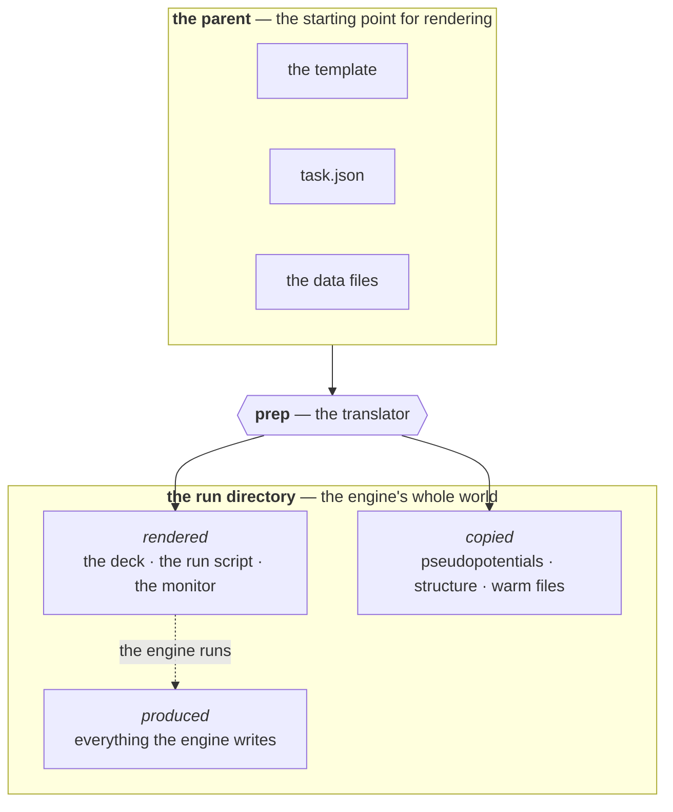
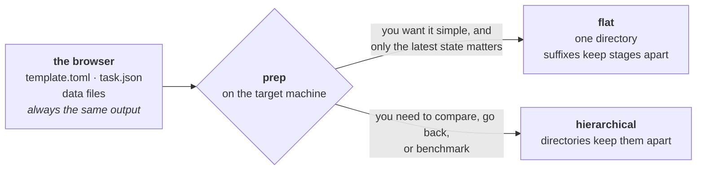
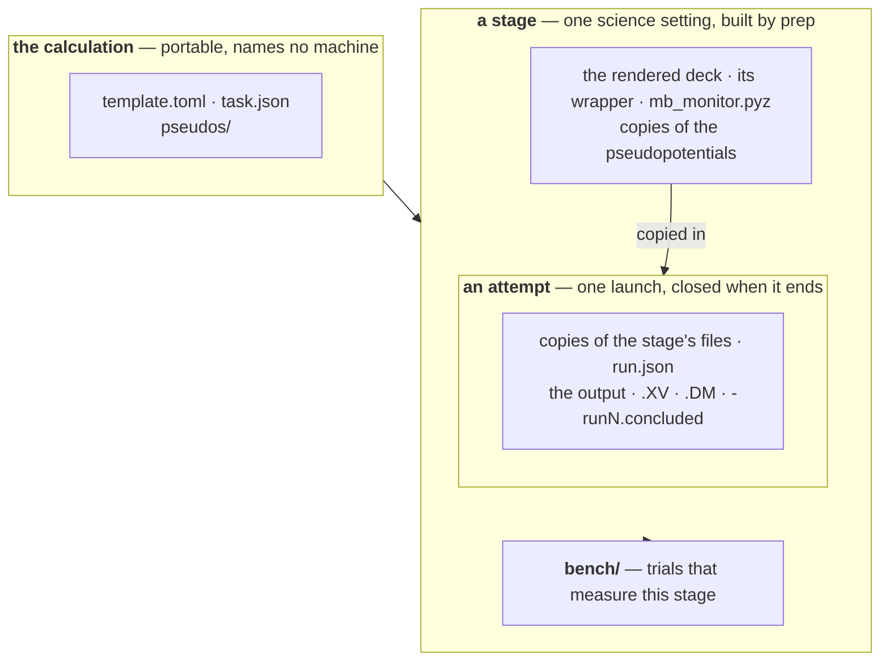
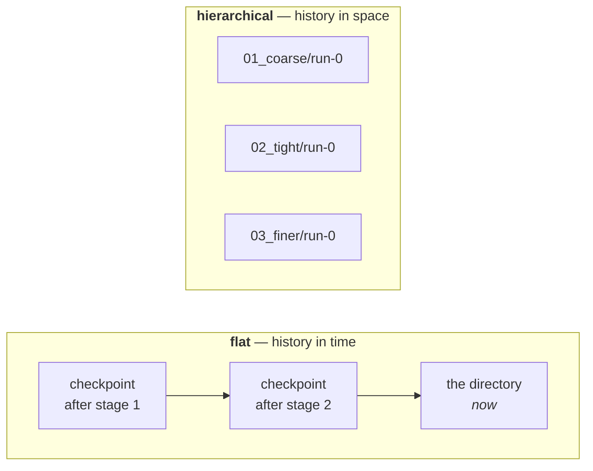
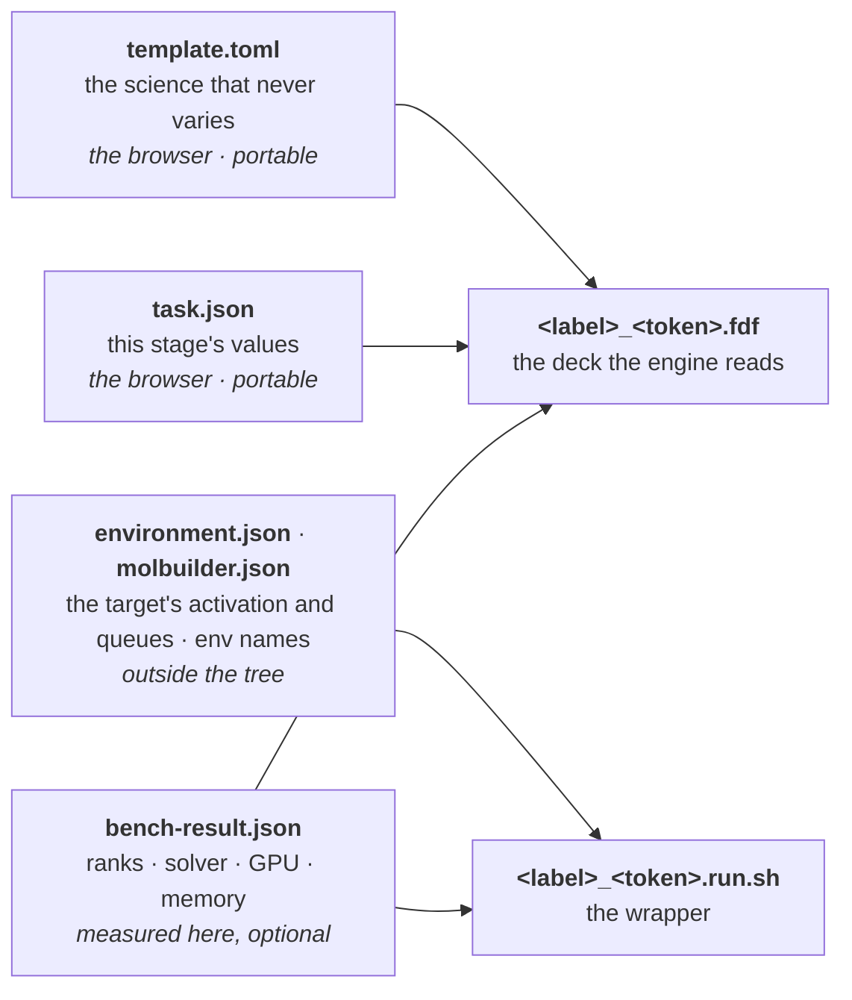
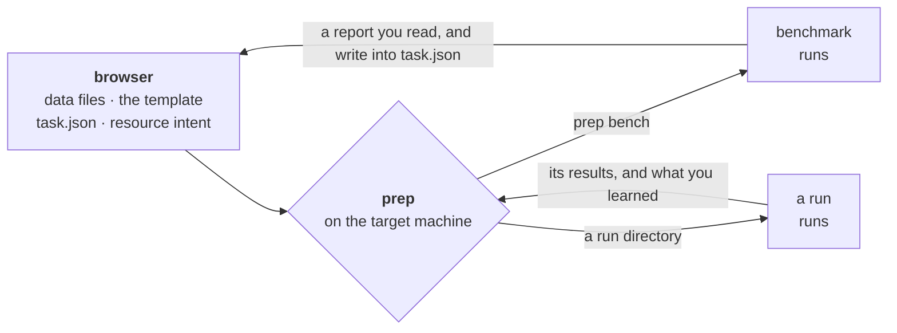
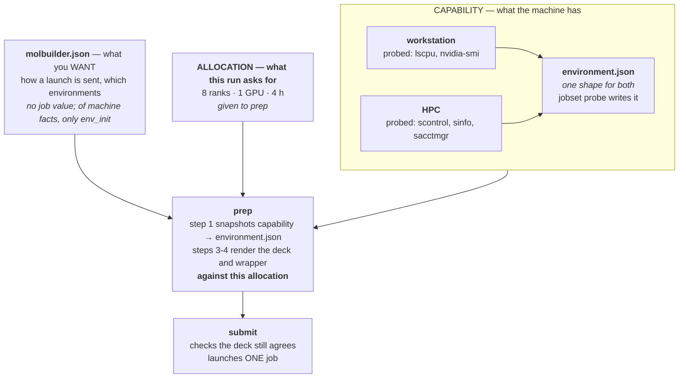
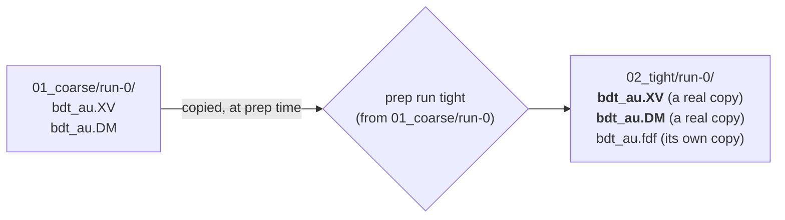
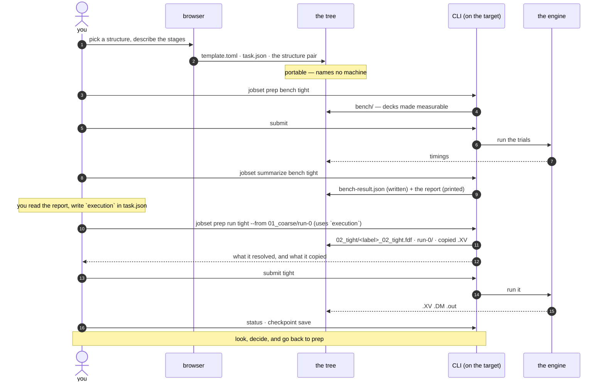
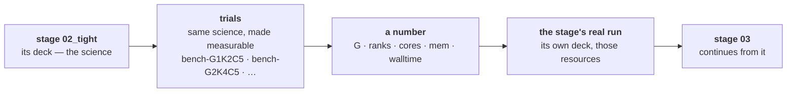

# The project directory — what lives where, and who puts it there

**Role:** contract
**Domain:** execution
**Companions:** [`execution/job-contracts.md`](?doc=execution/job-contracts.md)
— the run directory's own rules, the topic list, the filename conventions;
[`execution/job-system.md`](?doc=execution/job-system.md) — the JobSet the
per-stage folders come from; [`engines/stages.md`](?doc=engines/stages.md) — what
a stage is and how its deck is produced;
[`execution/checkpointing.md`](?doc=execution/checkpointing.md) — what the saved
history must always hold;
[`execution/run-identity.md`](?doc=execution/run-identity.md) — the id a
calculation's files share.

What this document adds is the *whole*: which
directory owns what, how parameter tuning and resource tuning nest, and where the
saved history sits.  *(Status lives in `plans/plan.md`, never in a contract — `conventions.md`'s R3.
The Status block that stood here was also FALSE: it called `task.json`, its
reader and § 4's stage naming unbuilt long after all three shipped, which is
exactly why that rule keeps status out of contracts.)*

**This contract owns:** the levels of the tree, who may write at each one, how
each level is named, and the invariants that hold across them. It does not
restate the rules inside a single run directory — those are `job-contracts.md`.

---

## The short version

**A calculation is a portable folder; everything the machine derives
stays one level down.** The folder `init` writes travels to any machine
unchanged; **`prep` adds stage dirs *and the attempt inside them*; `launch`
runs what prep set up and records that it ran.**

*(Opening an attempt is design and spends no queue slot, so it is prep's; `launch`
refuses a hierarchical stage with no attempt open — § 1.6.2.)*

```
<project>/optimization/<Calc>/          <- PORTABLE: travels as-is, names no machine
  task.json  <label>.template.toml      the description + the answers
  <label>.source.xyz (+.molstruct.json) the structure pair
  pseudos/  (H.psml, ...)               travel with the calculation
  01_coarse/                            <- prep writes the stage (hierarchical shape)
    <label>_01_coarse.fdf  *.run.sh     the deck + wrapper, rendered FOR this machine,
    mb_monitor.pyz                         and the monitor beside them
    run-0/  run-1/                      <- attempts: prep opens the first and copies its
                                           inputs in, launch each one after; launch writes run.json
      *-run0.out  *-run0.concluded      the output + the conclusion marker (rc inside)
    bench/bench-G0K2C1/run-0/           <- a benchmark trial keeps attempts as a stage does (§ 1.5a)
  (the report is PRINTED by `summarize`, not written -- § 7.1 of job-system.md)
```

*Every file, in both shapes, with who writes it and the one door that reads it:
the manifest, § 5.*

| key rule | one line | where |
|---|---|---|
| **portable floor** | the calculation folder never names a machine — copy it anywhere | § 1 |
| **two shapes** | `flat` (everything beside task.json) or `hierarchical` (one dir per stage) — declared at init, never inferred | § 1 |
| **attempt = run-N** | every try is its own numbered dir; warm files are COPIED from the attempt you name | § 1.5, § 1.6 |
| **the conclusion marker** | the wrapper's last act writes `<basename>-runN.concluded` with the rc; absent means still running or force-stopped — the launch gate ASKS, never decides | § 1.6.3 |
| **a report, not an input** | `jobset summarize` PRINTS what was measured and what to write; nothing applies it. What a run uses is `task.json`'s `execution` | § 2.3.2 |
| **who writes where** | init → the portable floor; prep → stage dirs **and the attempt in them**; launch → `run.json`; the run → its output, the monitor's files and the wrapper's conclusion marker; a person → anything, said aloud | § 2, § 1.6.3 |
| **invariants** | the cross-level rules, each with its reason | § 7 |

---

## 1. Two shapes, and how to choose

### 1.0 What the run directory is, and what may be in it

*Stated by the user, 2026-08-11. Everything below is an arrangement of this.*

> **The run directory hands the engine everything it needs and holds everything
> it produces. That is what makes it one — not which files happen to be in it.**

**Two origins, and there is no third.** Every file in it is either:

| origin | examples |
|---|---|
| **rendered** — translated out of the template and the other sources | the deck, the run script, the monitor (`mb_monitor.pyz`) |
| **copied** — raw data the engine needs, taken as-is | pseudopotentials, the structure, warm files from a run you named |

**So the inventory is not a list anybody maintains** — it follows from those two
origins and the shape. A list would drift; this cannot.

> **A product has ONE home, and it is the run** *(2026-09-19)*. The third
> category — what the engine *produces* — is the run directory's own, and the
> progress channel is the case that tested it. `prep` seeds that log so a
> viewer has something to find before the engine starts, and it seeded it
> beside the deck it renders: already the run directory in the flat shape, the
> stage CONTAINER in the hierarchy. The run then wrote its own inside the
> attempt. Measured on a finished Raman run: a 971-byte stub with no
> `# concluded:` footer in `01_raman/`, the real 1763-byte concluded log in
> `01_raman/run-0/`. An unconcluded log is how every reader tells a run is
> still going, so the stage directory reported a **finished** calculation as
> *running*, permanently, and offered the stub to open. The seed now moves
> into the attempt. Inputs may legitimately exist at both levels — the deck is
> born in the stage directory and copied down — because a second copy of an
> input is a convenience and a second copy of a product is a contradiction.

**Why anything is kept outside it: the engine does not see or understand the
layer we use to organise our information.** It opens what is there and writes
beside it. So the template, `task.json` and the rest of the *starting point* for
rendering belong to the **parent**, and only rendered files and copies go down to
where the engine runs.

> **The directory boundary is where the translation happens.** Above it, our
> vocabulary — template items, the description. Below it, the engine's
> vocabulary — its own keywords — plus raw bytes.
> [`architecture.md`](?doc=execution/architecture.md) § 10 names every
> translation in the system; this is the one that is a **wall you can see**, and
> `prep` is what crosses it.


```mermaid
flowchart TB
    subgraph PARENT["<b>the parent</b> — the starting point for rendering"]
      T["the template"]; TJ["task.json"]; DATA["the data files"]
    end
    P{{"<b>prep</b> — the translator"}}
    subgraph RUN["<b>the run directory</b> — the engine's whole world"]
      R["<i>rendered</i><br/>the deck · the run script · the monitor"]
      C["<i>copied</i><br/>pseudopotentials · structure · warm files"]
      O["<i>produced</i><br/>everything the engine writes"]
    end
    PARENT --> P --> R & C
    R -.->|"the engine runs"| O
```

**Once it is prepared it needs nothing but the engine's environment and a
shell.** That is why the run script and the monitor sit inside it rather
than being invoked from somewhere clever.

**A follow-up stage takes two inputs**, and `prep` writes a whole new directory
from them:

1. the **parent's** template and sources, and
2. the **latest results** from the run you name.

**The two shapes are two answers to one question: is that boundary a directory
wall, or a filename convention?**

| | where the boundary is |
|---|---|
| **hierarchical** | **a real wall.** The starting point stays in the parent; each run directory sees only rendered files and copies |
| **flat** | **no wall is built.** One directory holds both sides at once — the template sits beside the results, and stages and attempts are told apart by **filename** |

**That is also why the flat shape's results overlap on purpose.** With one
directory there is one set of warm files, so the geometry is simply *the latest*
— the next stage finds it lying there, and overwrites it in turn.

> **A note on the word "calculation".** This document calls the whole folder
> *the calculation* and the directory the engine runs in *the run directory*.
> In conversation the second is often called the calculation directory too.
> Same thing, opposite ends of the tree — the contract's names are used below.

> #### ⚠ "Bundle" and "calculation" are the same directory, and the word
> #### **bundle** is retired for it *(2026-08-11)*
>
> [`job-system.md`](?doc=execution/job-system.md) draws a `bdt_au-bundle/` root
> holding `job-set.json`, the decks, the shared package and the stage
> directories. This document draws
> `projects/<project>/<topic>/<calculation>/` holding the template, `task.json`,
> the shared package and the stage directories. **They are one directory**, and
> nothing said so — so a reader following one produced a `-bundle` folder outside
> the project tree, and a reader following the other produced a calculation
> inside it.
>
> | | **calculation** *(this contract's name)* | ~~bundle~~ |
> |---|---|---|
> | where | `projects/<p>/<t>/<calc>/` — inside the tree | anywhere |
> | what declares it | **`task.json`** | `job-set.json` |
> | who names it | the user | the producer, `<label>-bundle` |
>
> **`calculation` wins, for a reason that is not taste.** `task.json` is the
> **source** and `job-set.json` is **derived** from it (§ 5) — so naming the
> folder after the derived file names it after something you can delete and
> regenerate. It is also what `checkpoint.py` already looks for to decide a
> directory owns its subdirectories (`checkpointing.md` **L1**).
>
> **And *bundle* was already overloaded twice over**: a **handoff bundle** is one
> finished run carried forward (by CITATION since 2026-08-29 — `archive/2026-09-01-transport-design.md` § 4.1),
> a **benchmark bundle** is a self-contained measurement (§ 2.6). A third sense
> for *the calculation folder itself* is the one that had to go — `README.md` R5
> forbids exactly this collision. What keeps the name legitimately is the
> **benchmark** bundle, which really is a self-contained package that travels.

> **This is why molbuilder must know its own files by name.** In the flat shape
> the template sits beside the engine's output. `--cold` and *"has anything run
> here?"* both work by subtracting **what molbuilder wrote** from what is present
> ([`job-contracts.md`](?doc=execution/job-contracts.md) § 4.1–4.2), so that list
> is what stops a template being mistaken for engine leftovers.

A project directory is one of exactly two shapes. **Both hold several stages and
several attempts** — they differ in *how those are kept apart*, and everything
else follows from that one choice.

| | **Flat** | **Hierarchical** |
|---|---|---|
| **Stages are separated by** | a **filename token** — `<label>_01_coarse.fdf`, `<label>_02_tight.fdf` | a **directory** — `01_coarse/`, `02_tight/` — and the token is kept in the filename too, as a self-check (`run-identity.md § 3.2`) |
| **Attempts are separated by** | an **output index** — `-run0.out`, `-run1.out` | a **directory** — `run-0/`, `run-1/` |
| **Warm files** (`.XV` `.DM` `.CG`) | **one shared set**, unsuffixed | one set per attempt |
| **Continuing** | free — the next stage finds them lying there | you **name** the run, and its files are copied in |
| **What survives** | the **latest** state only | every stage's, every attempt's |
| **Depth** | 1 | 3 |
| **Chosen** | at `prep` | at `prep` |
| **Wrappers** | one per stage, beside its deck | one per stage, in the stage's directory |
| **Built by** | `prep` | `prep` |

**Both shapes are built by `prep`, and both run today.** You pick one when you
prepare, and `prep` lays out whichever you asked for — flat puts every stage in
one directory and tells them apart by filename; hierarchical gives each stage a
directory and each attempt a directory inside it.

**The one real migration LANDED.** The browser writes a **template plus
`task.json`** — the parameter tabs hand over to Task setup, which saves the
description — and `prep` renders every deck on the target: into one directory
for the flat shape, or into stage directories for the hierarchical one. The
UI produces the second-to-last file in the chain, never the last. *(Until
2026-08-18 the Build tab wrote a finished `.fdf` and its `.run.sh` — a single
job, not a described calculation — and these two paragraphs described moving
off that as future work. The deck-rendering web routes were deleted the same
day the hand-over shipped; proven end to end 2026-08-19.)*

**One package, two layouts, and you choose.** The browser always writes the same
thing — a template, `task.json`, the data files, none of it naming a
machine. `prep`, on the machine that will run it, translates that into a runnable
directory **in whichever shape you ask for**.


```mermaid
flowchart LR
    UI["<b>the browser</b><br/>template.toml · task.json<br/>data files<br/><i>always the same output</i>"]
    P{"<b>prep</b><br/>on the target machine"}
    F["<b>flat</b><br/>one directory<br/>suffixes keep stages apart"]
    H["<b>hierarchical</b><br/>directories keep them apart"]
    UI --> P
    P -->|"you want it simple, and<br/>only the latest state matters"| F
    P -->|"you need to compare, go back,<br/>or benchmark"| H
```

### 1.1 What each one looks like

**Flat** — this is what ships today, and it already does stages:

```
au_bdt_relax/
├── task.json  <label>.template.toml   the description: this root IS the run
├── pseudos/                        the library's copies (§ 2.6) …
├── Au.psml  S.psml                 … copied again beside the decks: SIESTA
│                                      opens them only where it runs
├── <label>_01_coarse.fdf           coarse   ─┐ the decks: one per stage,
├── <label>_03_tight.fdf            tight     ─┘ told apart by their TOKEN
│                                               (decision 27 — the ordinal
│                                               travels WITH the name, and
│                                               a gap stays a gap)
├── <label>_01_coarse.run.sh        ─┐ ONE WRAPPER PER STAGE, beside its deck.
├── <label>_03_tight.run.sh         ─┘ `prep` renders one per distinct deck, so
│                                      each stage is started on its own — which
│                                      is what makes "one stage at a time" the
│                                      same act in both shapes.
├── mb_monitor.pyz                  the monitor, ONE file, beside the wrappers
├── <label>_01_coarse-run0.out      stage 1, first attempt   ─┐ told apart
├── <label>_01_coarse-run1.out      stage 1, a redo           │ by INDEX
├── <label>_03_tight-run0.out       tight, first attempt     ─┘
├── <label>_01_coarse-run0.concluded     the run's own records carry the
├── <label>_01_coarse-run0.monitor.log   index too: the marker (§ 1.6.3), the
│     (and .util.csv, .scf-timing.log)   monitor's pair, the timing log, the
├── <label>_01_coarse-run0.run.json      launch record (§ 1.6.3), the
├── <label>_01_coarse-run0.molwatch.log  progress log -- and .continued-from
│                                        when the run continues from another
├── <label>_01_coarse.runwrap-<stamp>.log   the wrapper's session log
│
├── <label>.XV  <label>.DM  <label>.CG  ⚠ ONE shared set, UNSUFFIXED
├── <label>.STRUCT_OUT              ⚠ one, overwritten by each stage
└── <label>.ANI  <label>.EIG        ⚠ likewise
```

*Each run of a flat stage has its own launch record,
`<basename>-run<N>.run.json`, named like every other file of that run: the
directory is every stage's and every run's (§ 1.6.3). The tree is a picture;
every file, with its writer and its door, is § 5.*

*`<label>` is the `SystemLabel` — the stem of every file here. It is **not** the
run id, which carries the formula as well and lives in `task.json`
(`run-identity.md § 2.0a`).*

**The unsuffixed warm files are the whole design, good and bad.** They are
unsuffixed *on purpose* — that is exactly what lets stage 2 pick up stage 1's
geometry with no instruction from anyone (`job-contracts.md § 2.3`:
`MD.UseSaveXV`, `DM.UseSaveDM` — and `MD.UseSaveCG` on a CG relaxation — just
find them). And it is
exactly why stage 2 overwrites them.

**Hierarchical** — the same stages and attempts, kept apart by directory:

```
bdt-relax/                            the CALCULATION — the user typed this name
├── <label>.template.toml              ─┐ the description: written by the
├── task.json                         ─┘ browser (or `jobset init`) —
│                                        portable, names no machine, says
│                                        the id — label plus formula
├── <label>.source.xyz  + sidecar        the structure pair (§ 6.3's .source
│                                        reservation), from the hand-over
├── pseudos/  Au.psml  S.psml         the library's copies, gathered by `prep`
│                                        (or by `describe --psml-lib`) — § 2.6
│
├── 01_coarse/                        a STAGE — written by `prep`
│   ├── <label>_01_coarse.fdf            the deck, rendered for THIS machine
│   ├── <label>_01_coarse.run.sh         its wrapper
│   ├── mb_monitor.pyz                   beside the wrapper: ONE file, the monitor
│   │                                    and the framework modules it reads the
│   │                                    run through (`runwrap.MONITOR_BUNDLE`)
│   ├── Au.psml  S.psml               real copies, beside the deck
│   ├── run-0/                        an ATTEMPT — prep opened it and COPIED in
│   │   │                                the deck, wrapper, monitor and pseudos
│   │   ├── run.json                  written by launch: how, when, from what
│   │   ├── <label>.XV  <label>.DM    SIESTA named these: bare
│   │   ├── <label>_01_coarse-run0.out        molbuilder named these: stage +
│   │   ├── <label>_01_coarse-run0.concluded  run index — the output, the
│   │   └── …-run0.monitor.log  .util.csv  .scf-timing.log   wrapper's marker,
│   │                                    the monitor's pair, the timing log
│   ├── run-1/                        a redo — run-0 is untouched; its first
│   │                                    run is -run0 again (§ 1.6.1)
│   └── bench/                        a BENCHMARK — its own little world
│
└── 02_tight/
    ├── <label>_02_tight.fdf
    └── run-0/
        └── <label>.XV                a real copy of 01_coarse/run-0's
```

*Every directory `prep` makes also holds its `calcdir.json` (§ 1.4a), and each
start of a wrapper its `<basename>.runwrap-<stamp>.log`. The tree is a picture;
every file, with its writer and its door, is § 5.*

**The deck repeats the stage its directory already names, on purpose.** Without
it every stage directory holds an identically-named deck, and two swapped by a
bad copy or a resumed `prep` disagree with nothing; with it,
`01_coarse/<label>_02_tight.fdf` is wrong on sight (`run-identity.md § 3.2`,
decision 21).

**And the stdout keeps its `-run<N>` counter here too**, because there is one
wrapper and it writes `<basename>-run${_run_n}.out` with no branch on shape
(`job-contracts.md` § 6.3). Inside an attempt the counter numbers the
wrapper's *runs*, not the attempt: it starts at 0 in each attempt and advances
when the wrapper runs again there — a warm retry (§ 1.6.1).


```mermaid
flowchart TB
    subgraph CALC["<b>the calculation</b> — portable, names no machine"]
      T["template.toml · task.json<br/>pseudos/"]
    end
    subgraph ST["<b>a stage</b> — one science setting, built by prep"]
      D["the rendered deck · its wrapper · mb_monitor.pyz<br/>copies of the pseudopotentials"]
      subgraph AT["<b>an attempt</b> — one launch, closed when it ends"]
        O["copies of the stage's files · run.json<br/>the output · .XV · .DM · -runN.concluded"]
      end
      BN["<b>bench/</b> — trials that measure this stage"]
    end
    CALC --> ST
    D -->|"copied in"| AT
    ST -.-> BN
```

### 1.2 The trade, stated once — and why flat needs checkpoints

Put the two side by side on the question that actually matters — *what do you
still have after three stages have run?*

| After stage 1, 2 and 3 have all run | Flat | Hierarchical |
|---|---|---|
| every stage's stdout | on disk — the suffix saved them | on disk |
| the **current** `.XV` / `.DM` | on disk — stage 3's | on disk, per stage and per attempt |
| stage 1's relaxed geometry | **in the checkpoint** — not on disk | on disk, always |
| going back to it | **restore** that checkpoint | open the other directory |
| having both at once | no — one state at a time | yes |
| which run produced the current `.XV` | the checkpoint's message and tag | `run.json` says, without leaving the tree |

**The two shapes keep history in different dimensions.** Hierarchical spreads it
across the *filesystem*: every stage and attempt sits there simultaneously, and
going back is just reading a different directory. Flat keeps one state on disk
and spreads its history through *time*: earlier states live in the checkpoint,
and going back means rewinding.


```mermaid
flowchart LR
    subgraph FL["<b>flat</b> — history in time"]
      direction LR
      F1["checkpoint<br/>after stage 1"] --> F2["checkpoint<br/>after stage 2"] --> F3["the directory<br/><i>now</i>"]
    end
    subgraph HI["<b>hierarchical</b> — history in space"]
      direction LR
      H1["01_coarse/run-0"]
      H2["02_tight/run-0"]
      H3["03_finer/run-0"]
    end
```

> **This is why the checkpoint is not optional for the flat shape.** It is the
> only thing standing between *"stage 2 overwrote stage 1's geometry"* and
> *"stage 1's geometry is gone."* In the hierarchical shape the checkpoint is
> insurance; in the flat shape it is **the mechanism** — the sole way to get back
> to a previous run and continue from there.

**And restore is a rewind, not a fetch.** It returns the whole directory to how
it was, text and binaries together (`checkpointing.md`, S6). So going back in the
flat shape means: checkpoint what you have now, restore the earlier one, run from
there. Skip the first step and the current state is what you lose. Hierarchical
never poses that question, because nothing had to be overwritten to begin with.

**Neither shape is wrong.** For one relaxation where only the final geometry
matters, overwriting is the point and flat costs nothing to operate. For a
mission tuned across parameter sets — compared, benchmarked, revisited — having
every state at once is worth the directories, and you stop having to think about
what a restore would cost you.

### 1.3 The same contract, read against both shapes

Every rule in this document holds in both shapes. Where they read differently it
is because *depth* differs — never because the rule does.

| Rule | Flat | Hierarchical |
|---|---|---|
| **A directory is a container or a run, never both** (§ 1.4) | the directory is a **run** — it is a leaf | calculation and stage are **containers**; `run-N/` is a **run** |
| **A result is never overwritten** | holds for *stdout* (`-run0`, `-run1`); **does not hold for warm files**, which are shared by design | holds for everything — an attempt is immutable (§ 1.5) |
| **Every file shares one basename** — the id | yes; only decks and stdout take a stage suffix | yes, and across stages too |
| **Where the deck comes from** | `prep` renders it beside the package | `prep` renders it into the stage's directory |
| | *both from template ⊕ the stage's values ⊕ this machine (§ 2.2)* | |
| **Where the wrapper runs** | in the directory | in the attempt directory `prep` made |
| **git tracks / the archive covers** | one directory is both — classified by **pattern** | containers are git's, runs are the archive's — by **depth** (§ 6.1) |
| **`--force`** | says yes to `--cold`'s refusal | says yes to `--cold`'s refusal |

The second row is the one to read twice. *"A result is never overwritten"* is a
rule the flat shape keeps for the files it can and breaks for the files it must —
and it is the same break that makes continuing free.

### 1.4 A directory is a container or a run, never both


Every directory in this tree is one of two things:

- a **container** — it holds setup and other directories. Decks, wrappers, the
  description, links, the shared package. All text or small.
- a **run** — one invocation of the engine. It holds what that invocation
  produced, and nothing else holds that.

A calculation is a container. A stage is a container. A benchmark bundle is a
container. The leaves — `run-N/`, `bench-<knobs>/` — are runs.

**This is what makes everything downstream simple.** Setup is text, so git handles
it entirely. Only a run holds anything big. There is no directory where the two
are mixed and something has to tell them apart.

> **A simple run stays simple.** A plain run directory does not grow a `run-0/`.
> It **is** a run — a leaf with no container above it — which is exactly what a
> hand-made directory with one `.fdf` in it already is. Nothing about the
> straightforward case changes.

### 1.4a How a directory says which one it is

*Added 2026-09-19. § 1.4 states the rule and then says the quiet part: "there is
no directory where the two are mixed and **something has to tell them apart**."
Nothing in the tree has to — but **a reader handed a path does**, and until this
section it could not.*

**The gap, and why no amount of care closed it.** Container-or-run is not
decidable from the name. § 1.4's own closing paragraph settles that three times
over: a **flat** calculation root *is* a run; a **hierarchical** stage directory
is a container; "a hand-made directory with one `.fdf` in it" is a run. Same
grammar, opposite answers. So every reader that wanted the answer guessed, and
they did not guess alike — one assumed every directory was a run and reported a
`pseudos/` folder as *running*; one assumed the description sat in the directory
it was handed, which is true only in the flat shape; one walked up a fixed
number of levels hoping to find it.

> **A directory states its place. Nothing infers it.**

**This is affordable because [invariant 6a](#7-the-invariants) already holds:**
*every directory in this tree is made by Python.* A tree whose
directories all have a creator inside molbuilder is a tree whose directories can
all be stamped by that creator, at the moment it makes them. There is no
population to migrate and no heuristic to tune — only a fact that was known at
creation and thrown away.

#### Who answers, per level

| the directory | what answers | container or run |
|---|---|---|
| the **calculation root** | `task.json` — it is the root *because* the description is here ([§ 7](#7-the-invariants), invariant 2), read through its one door, `read_task`, by the run door (`architecture.md` § 3.2); `calcdirs` reads no description | from **`shape`**: `flat` ⇒ a run, `hierarchical` ⇒ a container |
| **everything below it that molbuilder made** | `calcdir.json`, written by the creator | **`role`**, said outright |
| anything else | nothing | unknown — the directory is read alone, and told so |

**The root needs no record**, and that is the point rather than an omission:
invariant 2 already makes `task.json` the thing that says a directory is a
calculation, and `shape` is already a required field of it. A second declaration
would be a second home for one fact.

#### The record — two fields, and the reason it is only two

```json
{ "schema": "molbuilder/calcdir@1",
  "role":   "run",
  "of":     "../.." }
```

* **`role` is `container` or `run`** — § 1.4's own two words, no third.
* **`of` is relative, always** — to the calculation root. That is what survives
  renaming or moving a whole calculation, and it is the convention
  `.gathered-from` already uses for the same reason. Copy an attempt out on its
  own and `of` dangles; *"this attempt's calculation is not here"* is then the
  honest answer, where a search would have adopted whatever it found.

**Everything else is derived, and that is checked rather than asserted.** Given
`of`, the root holds `task.json` and `job-set.json`, and
`materialize.job_dir_names` is *the naming authority* — a `{job → directory}`
map written by the same code that made the directories. Running the decode over
a real three-calculation tree (2026-09-19): every stage container resolved to
its job (`01_raman` → `raman`), every attempt to its job and index
(`01_raman/run-0` → `raman`, 0), all five transport rungs, and both shapes' roots
through `shape`. So a **stage name, an axis point and an attempt index are
facts the tree already answers**, and storing them would be a second home for
each — with the drift that always follows.

**What the authority cannot answer, and why `role` is therefore stored.** The
same map returns a *trial* as `<NN>_<name>/bench/bench-<point>` — an exact job
match, structurally identical to a stage's own `<NN>_<name>`. § 1.4 calls the
first a container and the second a run. Identical shape, opposite answers, and
nothing in the tree distinguishes them: only the code that created the directory
knew which it was making. That is the whole content of this record.

**`seq` is deliberately absent**, for the same one-home reason: invariant 4 puts
a stage's `seq` on the directory name and says it is "read back off the
artifacts, stored nowhere else".

#### What the finer words become

`stage`, `axis`, `trial` and *support* are not roles — they are derived
readings of a `container` or a `run`, and each falls out of the authority:

| a directory that is… | is read as | because |
|---|---|---|
| `container`, matching a job | that **stage** | the authority maps the job |
| `container`, matching no job | **support** — `pseudos/`, a bench container | the authority has no job there |
| `run`, under a stage's directory | an **attempt**, index from its name | the authority maps the parent |
| `run`, matching a job itself | a **trial** | the authority maps it as a bench point |
| `run`, and it IS the root | the flat shape's single run | `task.json`'s `shape` |

#### Absence narrows the answer; it does not refuse the directory

**A directory with no record is still readable — it is read alone.** This is
the whole reason the record can be trusted where it exists without stranding
anything where it does not: what is IN a directory has never needed a record to
be read, and the record adds only what a single directory cannot see — which
calculation it belongs to, which rung it is, what its siblings are.

| what the directory says | what a reader may answer |
|---|---|
| `calcdir.json`, or `task.json` at a root | everything: its role, container-or-run, its calculation, its rung, its siblings, the ladder it sits in |
| nothing, but a run left evidence — a deck, a file in a stdout role, a conclusion marker | what is here: the files, which have parsers, which one to open, how the run ended. **Nothing above it**, and the reader says which of the two it is doing |
| nothing, and no evidence a run happened | the files, and no run state at all |

**The third row is a rule in its own right, and it is the one defect that
predates the record**: *"running"* must rest on evidence that a run started, and
an empty directory is not that. Reported as a default for *no result file yet*,
it made a `pseudos/` folder and an empty `__pycache__` both read as a
calculation in progress.

**The missing relation is stated, never guessed around.** A reader that finds no
record says so — *this directory is not marked as part of a calculation, so only
what is in it can be shown* — which is a sentence a person can act on by
re-preparing the calculation. Silence would leave them reading a partial answer
as a complete one. A tree written before this section behaves exactly this way,
which is why there is no migration step and nothing to reindex.

### 1.5 An attempt is immutable

**A run directory is written once and never modified.** Launching a stage again
after it stopped makes `run-1`, carrying what it needs from `run-0` and leaving
`run-0` exactly as it was. A redo after a change is not a run: it is the
state saved before the stage's prep, restored, and a prep anew
([`job-system.md`](?doc=execution/job-system.md) § 5.0).

**A transport rung is the one exception, by design** *(user, 2026-10-05;
[`engines/transport.md`](?doc=engines/transport.md) § 2a.11)*: launching it
again continues in its run what is not done, from its own last density. A
bias sweep is one run, its points inside it — the points not done run, or
continue, in their folders; a point recorded done is never rewritten; a point
the person skips (`launch --skip`) is marked so in the run's record;
`launch --cold` opens the next run. Not built yet: until the transport work, a
transport rung launched again opens its next attempt, and each bias point is
its own folder of attempts.

You say which attempt it continues from, and its files are copied in — the same
explicit step you take when moving from one stage to the next (§ 1.6).

Three things follow:

- **Warm restart becomes explicit.** Today "continue" means *the files happen to
  be in this directory*. With one directory per attempt it means *carry from the
  previous attempt* — visible on disk rather than implied by what is lying
  around.
- **The saved history becomes append-only.** No archived file ever changes, so a
  new save point only has to store the attempts that appeared since the last one
  (§ 6).
- **`--force` only answers `--cold`.** It says yes to `--cold`'s refusal
  (`job-contracts.md § 2.6`); with a directory per attempt a redo is `run-2`,
  and in flat each run carries its own number, so nothing collides.

Immutability is a contract, not a filesystem permission — but it is **checkable**,
and § 7 makes it an invariant: an attempt that has been saved must never differ
afterwards. Nothing would notice today.

#### 1.5a A trial is a stage, for this purpose — decided 2026-08-27

**A sweep trial keeps attempts exactly as a stage does, and the SHAPE decides
how.** It was a third case until now — neither of the two below — and that is
what made `launch` refuse a re-run outright and tell you to move the directory
aside by hand. That is the `--force`-era answer this section retired.

| shape | where a trial runs |
|---|---|
| **hierarchical** | its **attempt**, `bench-<point>/run-0/`, opened at the benchmark's prep |
| **flat** | its own **folder**, `bench-<point>/` — the folder is the run (`runfiles.runs_share_folder`) |

**A trial is launched once, in either shape.** `launch` passes over a trial
launched before, and refuses one named; measuring it again is the state saved
before the benchmark's prep, restored, and a prep anew
([`job-system.md`](?doc=execution/job-system.md) § 5.0).

**The SHAPE decides, not the kind — and every reader must ask one function.**
`materialize.run_dir(container)` answers *where does this stage or trial
actually run*: the newest attempt where the shape keeps them, the container
where it does not. `latest_attempt` stays for the different question — *has an
attempt been opened at all* — where `None` is the answer rather than a path.

> **Why that is a rule and not a convenience.** Five call sites each spelled the
> fallback themselves (`latest_attempt(d) or d`, `attempt or d`, `att if att is
> not None else container`) across four files. When this section gave trials
> attempts, the spellings were migrated and two places in `submit` that had
> quietly composed a **container** path instead were not — so the grouped bench
> `cd`ed one level above its wrapper (every trial `rc=127`; ASU Sol job
> 62372574) and wrote `run.json` where nothing read it (so every re-launch
> re-submitted work that had already measured its point). Both were silent:
> one produced an empty benchmark, the other duplicate jobs.

Neither is new machinery. Both already exist for stages; the sweep simply stops
opting out. *(User, 2026-08-27: re-running a benchmark must be possible —
"a new test with new result is trivial".)*

> **Every per-run artifact carries the index — now all five, and it was two.**
> The wrapper indexed the `.out` and the timing log — *"re-running NEVER
> overwrites"* — while `<basename>.monitor.log` was **appended** (two runs
> interleaved with no marker) and `<basename>.util.csv` was written with
> `write_text`, so a re-run **truncated it**. `util.csv` is what a benchmark is
> measured from, so a flat re-run destroyed the measurement it existed to
> repeat, and a flat ladder stage re-run lost its `util.csv` for the same
> reason. Found 2026-08-27 by reading the write mode.
>
> **Fixed the same day**: the wrapper now writes `-run${_run_n}.monitor.log`
> and `-run${_run_n}.util.csv` (`runwrap.py`), and `jobset/summarize.py` read
> the newest `<basename>-run*.<suffix>` of each (through the run door since
> 2026-10-04, at the run's one index). *This note stood in the present
> tense until 2026-09-04 — it told a reader the destruction still happens.*
>
> **And the last of them, 2026-10-06** *(plan W57, decision 2)*: in the flat
> shape the progress log, the launch record and `.continued-from` carried no
> index, so a re-launch truncated run 0's PySCF trajectory and replaced its
> launch record, while § 1.6.3 named them unindexed beside this note. Each
> carries `-run<N>` in the flat shape now — `<base>-run1.molwatch.log`,
> `-run1.run.json`, `-run1.continued-from`, the last named for the run that
> continues — and so do the PySCF deck's own logs: PySCF's `.log`, which
> PySCF opens with `'w'`, so a re-run truncated it, and geomeTRIC's files
> under the prefix the deck hands it, whose log geomeTRIC moved aside as
> `<prefix>_1.log`, a name nothing declares. The hierarchy names them as before: its attempt
> folder is launched once, and a PySCF run is never retried in place
> (`runfiles.WRITTEN`, the rows marked `attempt="shared"`).

**No conversion, and no reader for the old layout** (user: *"new dir becomes
standard. No historical burden."*). A benchmark is a **measurement**, and
measurements are repeatable — which is exactly why the old ones are not worth
a compatibility path that every reader would carry forever. Sweeps recorded
before this change stop being readable by `summarize`; their files stay on
disk, because molbuilder never deletes results.

**What still needs deciding, and is not decided here:** with two attempts of one
point, `summarize` reports the **latest** (the trial's run, through the run door
— its newest run index, every file at that one index, `runs.run_of`), so
the earlier measurement becomes invisible while remaining on disk. That is
tolerable only if the summary *says* how many attempts a trial has — otherwise
re-running silently supersedes, and comparing two measurements of one point was
the reason to re-run at all.

#### Where a run happens

**Inside the attempt directory**, which was created and filled when you prepared
the stage (§ 1.6, and § 2.5 step 4). By the time anything is launched it already
holds its inputs. The wrapper is invoked there; it activates the environment and
runs the engine as its child, and every later line of it — the launch, the
monitor, the SCF tee, the failure hints, the conclusion marker — works relative
to the current directory, so everything lands in the attempt with no change to
the wrapper at all.

```
prepare  →  01_coarse/run-0/ exists, its inputs copied in
submit   →  launched there
```

Launching in a chosen directory is what `jobset launch` already does one level
up: `subprocess.run(cmd, cwd=<job dir>)` for the local path, and `sbatch` from
the same place for SLURM, which lands the job in `SLURM_SUBMIT_DIR`. Pointing it
at the attempt instead of the container is a change in the caller, not in the
wrapper.

**Everything the attempt needs is put there before the wrapper starts**, and all
of it is in place before the engine sees the directory:

| | How | Why |
|---|---|---|
| the deck, **the wrapper**, the monitor, the pseudopotentials | **copied** from the stage directory, refreshed by every prep until launch | the run directory holds everything its engine reads, and a link holds nothing once the folder moves. The deck is the stage's one deck because a different deck would mean different science, and different science is a stage (§ 1.5a) |
| whatever this run continues from | **copied** | that run has already finished — you looked at it and chose it — and a link would let this engine write back over it |
| everything the run writes | created in place | it is already the working directory |

**One rule generates that whole table: every file goes in as a real file,
never a link** *(user, 2026-08-24)*. A link dangles once the folder is synced
to another machine; and for the warm files it would do worse — the engine
writes them, so a link would reach back and destroy the result you built on.

**Everything is *reachable from inside the attempt*, including the wrapper and
the monitor.** That is the point of copying them in rather than invoking them
from a level up: once the directory is prepared it needs **nothing but the
engine's environment and a shell**, so `cd`ing into it and running the wrapper
by hand is an ordinary thing to do — on a laptop, on a login node, or inside a
scheduler's job script. A directory that only worked when launched from
elsewhere would be one you could not debug.

#### 1.5b Two levels, two reasons — the directory says what happened

*Settled with the user, 2026-08-11.* **A directory exists for a reason, and there
are exactly two.**

| a new… | exists because | so it holds |
|---|---|---|
| **stage directory** — `02_tight/` | **the science changed** — a threshold, a tolerance, a method | its own rendered deck and wrapper |
| **run directory** — `run-1/` | **you continued** the previous run | only what that invocation produced |

**That is the whole rule, and it is deliberately the whole rule.** The contract
stays small; the **directory structure** carries the flexibility. You can read a
folder and know what happened without opening a file: a new stage name means
somebody changed the science, a new `run-` number means somebody decided to keep
going.

**Every attempt of a stage runs the same deck.** A different deck means different
science, and different science is a stage. That is why § 1.5's table copies the
stage's one deck into each attempt and never renders one per attempt.

**The case that looks like it needs a third mechanism does not.** *"Coarse hit
its step limit and I want to keep going, but with a tighter force tolerance"* is
**a stage that continues from a named run**, and it already works:

```bash
jobset prep run tight --from 01_coarse/run-0
```

The tolerance changed, so it is a stage. It continues, so it names what from.
**Nothing new is required** — no per-attempt override, no extra field in
`run.json`, no third level of parameter merging. The two reasons above already
place it.

> **Why this is worth stating as a rule rather than leaving to taste.** The
> alternative — letting an attempt carry its own parameter changes — needs a
> place to record them, a merge order to define, and a way to reproduce an
> attempt from the description. That is three new things to keep true, in
> exchange for saving one directory. **A design that never creates the problem
> beats one that solves it**, which is the same reasoning that retired chaining
> (§ 1.6).

**And continuing is one act at two levels.** Across stages it lands in
`02_tight/run-0`; within a stage it lands in `01_coarse/run-1`. Same decision,
same `continued_from` record, different depth.

> **A redo from scratch is not a run.** Running a stage again from nothing —
> after a crash that left nothing worth keeping — is the state saved before
> its prep, restored, and a prep anew; continuation is the one reason a
> `run-x` exists (user, 2026-10-05: a failed execution is recovered from the
> checkpoint, never patched in place). *(Until then this section kept a cold
> `run-x`, `continued_from` empty, which no verb has made since a prepped
> stage stopped being prepped again, 2026-10-02.)*

> ✅ **The one violation is gone (2026-08-10).** `runwrap.py`'s `attempt_dirs`
> prologue created and arranged an attempt in shell — scanning for run
> directories, making one, symlinking the deck and package in, copying warm
> files. That is `jobset/materialize.py`'s job, one level down, in the layer
> `running-a-job.md § 2.2a` keeps free of filesystem logic. It was retired
> rather than extended, and the guard it needed against being run from inside an
> attempt went with it — that stopped being a hazard the moment the caller
> decides the directory (**invariant 6a, now held**).

### 1.6 Stages do not chain, and what that simplifies

**Each stage is prepped and submitted on its own.** Nothing links coarse to
tight; no scheduler dependency, no queued follow-on, no automatic hand-off of
files. When coarse finishes you look at what it produced, decide, and then set up
tight.

That is § 1's rule — *this framework writes correct files; it does not run
things* — applied to the one place it was easiest to forget. It is also the only
sane default when **a stage is a long job**: a chain that continues on its own
can spend a week computing from a geometry you would have rejected in a minute.

> **The decision to continue is the user's, made after looking. molbuilder's job
> is to make continuing correct once that decision is taken.**

#### 1.6.1 Attempt and run — two counters

| | an attempt | a run |
|---|---|---|
| is | one launch of a stage or a trial | one start of the wrapper inside the attempt |
| named | `run-<n>/` in the hierarchy; in the flat shape, the `-run<N>` index | `-run<N>`, in every file of the run |
| numbered by | the next unused `n` (§ 4.3): `prep` opens the first, `launch` each next (§ 1.6.2) | `launch`, which hands it to the run script as `--run N` ([`running-a-job.md`](?doc=execution/running-a-job.md) § 5.5): an attempt's run is 0; a flat stage's next is one past its newest launch record, else 0 (`runrecord.next_run`); a warm retry's is the next, which the run script hands itself (§ 3.5 there) |
| a new one when | you prep and launch again (§ 1.5) | `launch` sends it, or the run script warm-retries in place |

In the flat shape a launch is told apart by its index alone, and a warm retry
is a run of its own, with its own launch record naming the run it retries
(§ 1.6.3). In the hierarchy an attempt holds one run, or more when a warm retry
re-runs it in place (`run-0/` holding `-run0` and `-run1`), and closes when its
launch ends (§ 1.5). **The launch gate, the run record and the marker
`run_status` counts read the attempt's latest run**: the highest index its
files reached (`runfiles.latest_run`).

**The number is decided once, by `launch`** *(plan W57, decision 6,
2026-10-06)*. The run script counted it until then — the highest `-run<N>`
beside it, plus one — while one launch could start several runs: a warm retry
re-runs the script, which took the next number, so the run that ended had no
launch record of its own. And with each flat run's `.continued-from` written by
`launch` with its launch record (§ 1.6.3), a script counting the files beside
it would take the number after its own. A run script refuses to start without
`--run`, naming the launch command. One written before takes no `--run`:
given one, it stops on the unknown argument, its own explicit error, and
its stage is prepped anew, from the state saved before its prep
([`job-system.md`](?doc=execution/job-system.md) § 5.0) — `jobset migrate`
says so of each stage of a flat calculation it numbers (§ 1.6.3).

#### 1.6.2 Who makes the attempt directory

**Python, when you prepare the stage** — step 4 of § 2.5, not when you submit and
not by the wrapper. By the time anything is launched the directory already exists
and already holds its inputs; the wrapper activates the environment and runs the
engine as its child (`running-a-job.md § 2.2a`).

Preparing does five things: **resolve** the next `run-<n>` (highest plus one, or
`run-0`); **create** it, stamped with its `calcdir.json` (§ 1.4a); **copy** the
deck, the wrapper, `mb_monitor.pyz` and the pseudopotentials in (§ 1.5);
**copy** whatever this run continues from; and **report** what it did, so you
can read it before committing a week of cluster time. That last one is why this
belongs to prepare rather than submit: preparing is still design, and the split
gives you somewhere to look; submitting is then a plain "yes, that one".

**One opener makes every run folder** *(W55 B6, 2026-10-03)* —
`jobset/materialize.py::open_run`: a stage's attempt (prep's `run-0`, and the
next one a launch opens), a bias point's attempt, and a benchmark trial's
folder in either shape. It creates the folder and every container above it
that does not exist yet — the stage, a benchmark's `bench/`, a bias point's
`v<V>/` — stamping each (§ 1.4a; invariant 6b); a submission's `launch/` is
made and stamped a container by the send that writes it
(`materialize.open_container`). What goes in follows: `prepare_attempt` copies
in what a stage's attempt runs from and what its `Continuation` carries and
writes `.continued-from`; a trial's deck is rendered into its folder. The run
script is told the run's own label — a trial's is the trial's. `prep` seeds a
stage's first run's progress channel, the preview a viewer finds before the
run starts; a later run's progress is its engine's own.

**A stage is prepared once** *(user, 2026-10-02: "refuse it, redo via
rollback")*. `prep` opens its attempt; a stage the calculation's plan already
holds is refused, and a redo goes back to the state saved before its prep and
prepares it anew ([`job-system.md`](?doc=execution/job-system.md) § 5.0).
**The next attempt is `launch`'s**: launching a stage whose attempt has run
opens `run-<n+1>`, continuing from its own latest run, so a launched attempt is
untouchable (§ 1.5) — planned with the launch and opened by its send, after
the yes, never by a dry run ([`job-system.md`](?doc=execution/job-system.md)
§ 6.0). *(Until 2026-10-02 preparing again was allowed: until
launch the last attempt was reused and its inputs refreshed, and after it the
next prep opened a new one.)*

#### 1.6.3 The launch record and the conclusion marker — `run.json`, and the other file

*Has this been launched?* has no honest answer from the directory alone. A queued
cluster job has produced nothing yet, so "no output" and "not started" look
identical — and re-preparing would quietly rewrite the setup under a job already
in the queue. Nor does *launched* say *over*: it spans three states that must not
be treated alike — still running, ran to its own end (converged *or* errored —
both are conclusions), and force-stopped (walltime kill, node death, `kill -9`).
Two small files answer the two questions *(the second decided by the user,
2026-08-28)*:

| file | written by | when | it says | absent means |
|---|---|---|---|---|
| `run.json` (`molbuilder/run-launch@1`) — a flat stage's run's own `<basename>-run<N>.run.json` | `launch`, into the attempt — or, for a flat stage, beside its deck, one per run; a flat run's warm retry, by the run script through the monitor's bundle (`running-a-job.md` § 3.5) | when the launch succeeds: `sbatch` accepted it, or the direct process started; a retry's as it starts | *launched* — the mode, the exact command, the scheduler's job id, when, where it was sent and with what wall and memory, **what it continued from**, and for a retry **the run it retries** | not launched: `launch` runs in this attempt |
| `<basename>-run<N>.concluded` | the wrapper, on its main line | its last act, after the engine returns — and after the job's finish, when it has one (`engines/vibration.md` § 5.5) — and before it stops the monitor | *the process ended on its own* — the exit code and the time; **when the finish failed, its exit code and the words `finish failed (<bundle>)`** (`parse/dirs/job.FINISH_FAILED`) | still running, or force-stopped: the files cannot tell which |
| `.continued-from` — a flat stage's run's own `<basename>-run<N>.continued-from`, named for the run that continues | `prep`, and `launch` when it opens a stage's next attempt or a flat stage's next run — one writer, `runrecord.write_continued_from` | when it copies warm files in — on the flat layout, when the stage continues from a run whose files lie in the folder | which attempt they came from, for `launch` to write into `run.json` — on the flat layout the run's own name, `<label>_<NN>_<stage>-run<N>`, which every file of it carries (ruled 2026-10-01) | the run starts from the structure |

- **`run.json` is written at launch, never at completion** — written when the
  job finished, it would leave a running direct attempt reading as never
  launched, a double-submit window — and a failed *start* records nothing, so a
  refused launch leaves the attempt as prepare left it. It earns its place three
  times: a launched attempt is never run in again — `launch` opens the next; status says *queued as job
  481923* ([`running-a-job.md`](?doc=execution/running-a-job.md) § 4.2); and
  `continued_from` is the run's provenance (`checkpointing.md` **S3**). A
  benchmark trial keeps attempts as a stage does (§ 1.5a), and each attempt
  gets the same file — which is how `launch bench <stage>` passes over the
  trials already launched (`job-contracts.md` § 6.1). *(This said a trial
  directory "is its own attempt", and named a `submit bench` that picked the
  next unlaunched trial, until 2026-10-01: § 1.5a gave trials attempts, the
  verb is `launch`, and the picker was retired; the W52 review.)*
  **A flat stage writes one per run**, `<basename>-run<N>.run.json` beside
  its deck (`runrecord.launch_record_path`): there is no attempt directory,
  and every stage and every run shares the calculation's one, so the record
  is named by its stage and its run like every other file of it *(user,
  2026-09-26: "unify this behavior"; the run's number since 2026-10-06, plan
  W57 decisions 2 and 6)*. Asked about a stage, the door answers with its
  newest run's record; asked about a flat calculation's directory as a
  whole, with the newest stage's — by the stage's number, then the run's,
  never a file's time (`runs.speaking`'s rule; it took the newest file
  until 2026-10-06). **A warm retry is a run of its own** and, on the flat
  layout, gets its own record as it starts: the same job — its launch's
  mode, command, job id and queue — its own start, `continued_from` the
  run it retries and `retry_of` that run's number, written by the run
  script through the monitor's bundle (`runrecord.record_retry`,
  [`running-a-job.md`](?doc=execution/running-a-job.md) § 3.5). The
  hierarchy's `run.json` is its attempt's and answers for every run in it.
  **A flat calculation written before** — any file the catalogue numbers
  where a stage's runs share a folder (every `attempt="shared"` row,
  `runfiles.shared_numbered_roles()`) found with no run number — is refused
  by the door, naming `molbuilder jobset migrate --bundle
  <calc>`, which gives each the number of its stage's newest run, 0 for a
  stage never launched (W57 decision 7's pattern). **One that does not
  read** — not JSON, or not a
  `molbuilder/run-launch` record — is an error naming the file, never
  *launched* or *not launched*: status says so on its row, and prep and
  launch refuse (`runrecord.launch_record`, the one door,
  [`architecture.md`](?doc=execution/architecture.md) § 3.2). It read as
  *launched, the details lost* until 2026-10-03, while launch's gates asked
  only whether the file was there. It is written through `persist`, whole or
  absent.
- **An error is a conclusion**: an engine returning nonzero still reaches the
  wrapper's main line, so the marker carries that code — *"because of error or
  whatever — but the process is done."* **A forced stop leaves no marker, by
  construction**: it is never written from the cleanup trap, which does run on
  a walltime SIGTERM. Both engines' wrappers write it, since each runs its
  engine as a child (`running-a-job.md` § 2.2a); it is indexed like the stdout,
  so a warm-retry chain concludes once, at its last run, and each flat stage
  keeps its own.
- **`.continued-from` carries the provenance because `run.json` cannot exist
  before launch** — its presence marks the attempt launched. The field to read
  is `run.json`'s.

What an attempt holds, moment by moment (`running-a-job.md` § 4.2 reads each):

| moment | the attempt holds | `run_status` |
|---|---|---|
| prepped | `calcdir.json`; copies of the deck, the wrapper (and its `.sbatch` on a machine with a queue), `mb_monitor.pyz`, the pseudopotentials (and `atom-permutation.json` when the decks come from a sorted copy); the job's finish bundle when it has one (`mb_vibration.pyz`); beside a PySCF deck, the code it imports (`mb_pyscf.pyz`); `makov_payne_correction.py` for a charged, isolated deck; the molwatch seed; the warm files and `.continued-from` if it continues — every one with its writer and door in § 5.3 | `pending` |
| launched | + `run.json` | `queued` |
| running | + `-run0.out` (PySCF: `-run0.pyscf.log`), the monitor's pair, the session log | `running` — and still `running` after the engine's output ended, until the job concludes: its finish deriving its result (its session log says the finish began), the wrapper's last lines |
| concluded | + `-run0.concluded` | `finished` with exit code 0, `failed` with any other — the one door's answer (`runrecord.ending`, [`architecture.md`](?doc=execution/architecture.md) § 3.2) — or when its output states a stop. A marker naming a failed finish: the engine ended and the job did not, so `failed`. A job that cannot run its finish stops before its engine with a marker saying so and no output: `failed` |
| force-stopped | as *running*; no marker comes — the monitor's closing record `[MONITOR] job ended`, when the monitor outlived the stop | `failed` by that record — also when the stop landed after the engine's output ended, inside a job's finish or the wrapper's last lines; `running` when nothing outlived the stop (a lost node): no file then tells it from a live run |

#### 1.6.4 What reads them

`launch` reads `run.json` to open the next attempt rather than run in a launched one (§ 1.6.2);
`run_status` builds its state on the marker, through the one door that says
whether a run ended on its own (`runrecord.ending`) — an output that states a
stop fails it whatever followed, and one that states its end is `running`
until the job concludes — and reads the monitor's closing record where the
marker is silent
([`running-a-job.md`](?doc=execution/running-a-job.md) § 4.2); the run record
reads them as its launch and its exit
([`model/parse.md`](?doc=model/parse.md) § 5d.2). And **`launch run`, re-submitting
over a launched attempt**, reads the marker:

| the latest attempt's latest run | behaviour |
|---|---|
| ended, or launched with **no marker** | launch it again, saying how that run ended: *"WOULD launch it again into run-2: it continues from 01_coarse/run-1 (its own latest run; concluded rc=0 …)"* — warm, or cold with `--cold`; whether it is still running, and whether its state is worth continuing, is the person's ([`job-system.md`](?doc=execution/job-system.md) § 5.4) |

> **This answers a PROCESS question, never a chemistry one.** *Did the
> wrapper get to finish* is what the marker knows; *did the SCF converge*
> stays with the engine's own output and its one reader, the ending scan
> ([`model/parse.md`](?doc=model/parse.md) § 2b). A marker with `rc=0` beside
> a non-converged `.out` is a run that concluded without converging — both
> true, two facts, two files.

#### 1.6.5 Continuing from an earlier run is a copy, not a link

Because stages are set up one at a time, **the run you continue from has already
finished** — that is what you just looked at. Its files are sitting on disk when
you prep the next stage, so they are **copied**, as real files, then and there.

```
02_tight/run-0/<label>.XV  a real copy of 01_coarse/run-0/<label>.XV
```

Copied and not linked for the same reason as always: the engine writes to that
filename, and writing through a link would destroy the result you started from.

**Which run you continue from is never a guess.** Continuing from
`01_coarse/run-0` and continuing from `01_coarse/run-2` are different scientific
choices, so `prep` takes the newest attempt of the stage before it — the run you
just looked at, which must have concluded — says which, and takes another only
when you name it ([`job-system.md`](?doc=execution/job-system.md) § 5.4). The
folder names make the choice visible afterwards.

This is the same shape one level down: a redo of a stage — `run-1` after
`run-0` — copies from the attempt you name, for the same reason.

> **Re-submitting continues by default** *(user, 2026-08-21: "you submit
> again and by default it continues")*: re-submitting a stage whose latest
> attempt has been launched opens the next `run-<n>` warm from that attempt,
> says so, and launches it — after the marker check of § 1.6.4 — when its
> kind continues from a run of its own; one that does not (a force-constant
> run, a stage set `restart: clean`) is refused, its redo the rollback
> ([`job-system.md`](?doc=execution/job-system.md) § 5.4). The same
> stage's *latest* attempt is the one source that is never a guess: a
> wall-killed run's newest state *is* the state. Everything else is the
> stage's first `prep` — the stage before it by default, an older attempt or
> another stage by `--from`, a fresh start by `--cold` — and a launched run
> that left no state to continue (it likely died at startup) is refused with
> that story: recover from the state saved before its prep, never silently
> started fresh. Benchmark trials keep § 1.5's immutability refusal.

> **What this removes.** Nothing has to point at a file that does not exist yet,
> so there are no dangling links to resolve, no question of *which attempt will
> the producer use*, and nothing to swap at run time — problems that arise only
> when a chain is submitted at once. A design that never creates the problem
> beats one that solves it.

#### 1.6.6 What is not touched

**The flat case.** A plain run directory *is* a run (§ 1.4), so `bash job.run.sh`
runs in it, in place.

**A stage starts because a person prepped it and submitted it.** A `JobSet`
carries no scheduler dependency and no instruction to take a file from another
job; `jobset` cannot thread one and there is no flag that asks for it.

**The reason is scientific rather than technical.** Whether stage 2 should start
depends on what stage 1 actually produced, and that is a judgement — so no field
in a description, and no flag at launch, is permitted to make it.

**Stages that do not build on one another can share one job** *(plan § 5u.1
step 5, TD2; user, 2026-10-07/08)*. No judgement stands between them — a
transport ladder's seed and its two leads each start from the structure — so
waiting in the queue three times buys nothing. `prep task` offers the stages
that are ready; **the ones you pick together are a group**
([`job-system.md`](?doc=execution/job-system.md), *The task*), pre-selected
for a kind that declares parallel rungs (transport's seed and leads), your pick
for any other. Each is prepared as it would be alone — its own attempt, deck,
run script and record — and the group is written on each one's job in
`job-set.json` (`group`, its stages in order), with one header for the group's
job; `launch task` sends that one job, walking them in order, each run in its
own attempt with its own launch record, one that fails not stopping the others.
Prep refuses, by name, a pick in which one stage builds on another (its
upstream, the one fact § 2.3.4 and `transport.stages.stage_inputs` state) and
stages that cannot share one allocation — another queue, ranks, cores per rank
or GPUs; the group's wall is the sum of its stages', its memory the largest.
Launched again, a stage goes alone or with the others, as you name it. Nothing
groups unless you pick it; a stage that builds on another is still prepared
after you have looked at the one it builds on.

#### 1.6.7 `--cold`, and running a stage by hand

`--cold` means *start this run clean*. With a directory per attempt that is
simply *skip the copy* — a fresh attempt is empty unless something is copied
in — so it belongs to the command that sets the run up:
`jobset prep run <stage> --cold`, then `jobset launch run <stage>`
([`job-system.md`](?doc=execution/job-system.md) § 5.3 owns what you type). The
flat shape reuses one directory and opens no attempt, so there a stage starts
clean by its run card's `restart: clean`, and `prep --cold` is refused, saying
so ([`job-system.md`](?doc=execution/job-system.md) § 5.4). The run script's
own `--cold` names the warm files a clean start would overwrite and refuses
until `--force` ([`running-a-job.md`](?doc=execution/running-a-job.md) § 3.4,
`job-contracts.md` § 4).

---

## 2. Who does what — the workflow, and each level's owner

### 2.1 The browser writes a portable package; the terminal makes it runnable

The split is not "design versus execution". It is **what a laptop can know versus
what only the target machine can**.

**The browser writes four things, and none of them mention a machine:**

| | What | Why it is portable |
|---|---|---|
| the **structure pair** | `<label>.source.xyz` + its sidecar | it is the same everywhere. *(Pseudopotentials are NOT the browser's to write — `prep` copies them from the library on the target, or `describe --psml-lib` does; § 2.6, stated 2026-08-18)* |
| the **template** | the science backbone — **every parameter, carrying the value that holds unless a stage changes it** | it is physics |
| **`task.json`** | the variables each stage tunes | it is the mission |
| the **resource intent** | *use a GPU · this is a big job · aim for this scale* | a wish, not a number |

**The terminal — `prep`, on the machine that will run it — turns that into a
runnable directory**, because only there do you know:

- workstation or SLURM;
- how conda or mamba is installed here, and whether activation is
  `conda activate` or `source activate` (the machine's record,
  `environment.json`);
- what the hardware actually is, and what a benchmark measured on it.

Then it **renders the final deck** — template ⊕ this stage's variables ⊕ this
machine's resolved parameters — writes the wrapper, builds the run directory, and
brings in whatever you told it to continue from.

### 2.2 Why the deck cannot be finished in the browser

Because some of what goes *inside* the deck is a fact about the machine.

`BlockSize` is the clearest case. It is a **tunable** knob — you may set it, and
a benchmark may measure it ([`tuning.md § 2.11`](?doc=engines/tuning.md)) — and
its legal window is a fact about the launch: the deck's BENCH-MARKS block records
the rank count it was rendered for and, when the deck carries a `BlockSize`, the
window that rank count allows. The GPU flag is another: `use_gpu` writes `Diag.ELPA.GPU` into the
deck *and* sends the wrapper to a different conda environment, and whether this
machine has a GPU at all is not a laptop's to know. A deck rendered on a laptop
is either wrong for the cluster or a guess.

> *(This paragraph argued from **the eigensolver** — "ScaLAPACK or ELPA changes
> both the deck and which environment" — until 2026-08-16. That premise was
> measured false on 2026-08-14: the packaged SIESTA carries ELPA through ELSI
> and runs it on CPU, so only `Diag.ELPA.GPU true` re-routes
> (`running-a-job.md` § 2.3, `engines/siesta.md` § 7.2). The argument is
> unchanged and the example is now one that holds.)*

> **Note which half of that makes the argument.** It is not that molbuilder
> *derives* `BlockSize` — it is that **the inputs to any sensible value only
> exist on the target**. A user who sets it explicitly has answered the question
> themselves and their value is honoured verbatim; a user who has not still
> cannot get a good one from a laptop, because the rank count and the hardware
> are the answer. *(Corrected 2026-08-11 — this paragraph read as though the
> value were always molbuilder's to compute.)*

So the parent holds a **template**, and the final `.fdf` is produced where its
last unknowns are known.

**Four inputs meet, and they arrive from four different places:**


```mermaid
flowchart LR
    T["<b>template.toml</b><br/>the science that never varies<br/><i>the browser · portable</i>"]
    S["<b>task.json</b><br/>this stage's values<br/><i>the browser · portable</i>"]
    M["<b>environment.json</b> · <b>molbuilder.json</b><br/>the target's activation and queues · env names<br/><i>outside the tree</i>"]
    B["<b>bench-result.json</b><br/>ranks · solver · GPU · memory<br/><i>measured here, optional</i>"]
    D["<b>&lt;label&gt;_&lt;token&gt;.fdf</b><br/>the deck the engine reads"]
    W["<b>&lt;label&gt;_&lt;token&gt;.run.sh</b><br/>the wrapper"]
    T --> D
    S --> D
    M --> W
    B --> D
    B --> W
```

Read the arrows: **the first two are portable and the last two are not.** That is
the whole reason the deck is finished here — two of its four inputs do not exist
until you are standing on the machine.

| Input | Comes from | Decides |
|---|---|---|
| `template.toml` | the browser | the physics: functional, basis, k-grid — **every parameter of the calculation, with its base value.** The hardware's parameters are *named* here too, deliberately without values — the last two rows are what answer them |
| `task.json` | the browser | this stage's overrides — mesh cutoff, force tolerance, relaxation type |
| the target's `environment.json` · `molbuilder.json` | outside the tree | how to activate an environment there, which queues exist (the record); which environment to use (`molbuilder.json`). The queue, wall and memory a run uses are its own statement ([`architecture.md` § 5.2](?doc=execution/architecture.md)) |
| `bench-result.json` | measured on this machine, optional | rank count → `BlockSize`; whether a GPU was worth it → `Diag.ELPA.GPU` **and** which conda env |

**A worked instance.** The same description, prepped on two machines:

| | workstation | GPU node on the cluster |
|---|---|---|
| ranks | 8 | 64 |
| `BlockSize` in the deck | 8 | 256 |
| `Diag.Algorithm` | `ELPA-2STAGE` | `ELPA-2STAGE` — **the same**, and it decides no environment |
| `Diag.ELPA.GPU` | absent | `true` |
| env the wrapper activates | `molbuilder-siesta` | `molbuilder-siesta-gpu` |
| the wrapper | `mpirun -np 8` | `#SBATCH` header with `--gres` + `srun`, MPS, the NUMA pin |
| **`template.toml` and `task.json`** | **byte-identical** | **byte-identical** |

*(The solver row read `ScaLAPACK` against `ELPA` with the environments split
along it until 2026-08-16. It is kept as a row, with the same value on both
sides, because that is what makes the point visible: the solver is free to be
identical while the environment differs, and it is the GPU line that moved.)*

The last row is the point. The portable half did not move; only what the machine
decided did.

This is the same shape the benchmark already ships: `jobset prep bench` runs
on the target, **reads** the machine's record into `environment.json`, and
formats the scripts for it — *"the user never hand-edits a queue name or a core count; this is what
makes the bundle portable."* The staged path reuses that shape rather than
inventing a second one.

> **A folder that carries no machine knowledge can be copied to any machine. A
> folder whose decks were finished on a laptop can only be copied to that
> laptop.**

### 2.3 `prep` is the hub, not step four of a line

This is the part a linear list gets wrong. **You come back to `prep` every time,
and it is where every join is made:**


```mermaid
flowchart LR
    UI["<b>browser</b><br/>data files · the template<br/>task.json · resource intent"]
    P{"<b>prep</b><br/>on the target machine"}
    B["benchmark<br/>runs"]
    R["a run<br/>runs"]

    UI --> P
    P -->|"prep bench"| B
    B -->|"a report you read, and write into task.json"| UI
    P -->|"a run directory"| R
    R -->|"its results, and what you learned"| P
```

Four different jobs, one verb, because they are the same act — *assemble a
runnable directory from a template, a source of earlier results, and this
machine's parameters*:

| You are doing | You give `prep` |
|---|---|
| measuring, before committing | the stage, and *benchmark this* |
| the real run, using what you measured | the stage — and what you wrote into `task.json` from the benchmark's report (§ 2.3.3: `prep` never reads a verdict) |
| a redo of that run | nothing — `launch` it again, which continues from its newest run by itself; with a change, the state saved before its prep, restored, and a prep anew (`job-system.md` § 5.0) |
| the next stage | that stage — it continues from the previous stage's newest run by default (`job-system.md` § 5.4) |

**Nothing distinguishes those in the machinery.** "Continue from
`01_coarse/run-0`" and "continue from `02_tight/run-0`" are the same
instruction pointing at different directories; "use this benchmark result" is
the same kind of input as
"use this geometry". That is why it is one command with arguments rather than
four commands.

And it is where **you** are in the loop. Every arrow back into `prep` is a
decision made after looking at what came out — which is the whole reason stages
do not chain (§ 1.6).

#### 2.3.1 What `prep` does, every time

Whatever job you are asking for, `prep` runs the same five steps in the same
order — **resolve the machine · resolve the parameters · render the decks ·
render the wrappers · build the run directory.** Only the *inputs* differ.

**The sequence is owned by
[`script-preparation.md`](?doc=execution/script-preparation.md)**, which states
it at three resolutions: the whole system's decision chain, these five steps, and
the eleven sub-steps inside step 3. Go there for what each step may assume, what
it leaves behind, why each ordering is forced, and what an engine supplies at
each one.

**What stays here is step 5's product** — the tree those scripts are laid out
into, which is the rest of this document.

**Step 1 READS. It does not probe, ever.** `environment.machine_for` walks the
scopes — the calculation's own snapshot, then a named target, then this
machine's record (`configuration.md` M-3) — and **the first one found is the whole answer**, with no
field-level merge. **When none answers, `prep` refuses** and names the one
command that fixes it:

```
molbuilder jobset probe --write                 # this machine
molbuilder jobset probe --write --name sol      # on that machine; then copy sol.json here
```

*(User, 2026-09-02: "all environments have to be explicitly probed and stored.
no environment json, error".)* That is what lets you `prep` for a cluster from
a workstation: the cluster's record was declared, not detected, and declaring
is how a fact about a machine you are not standing on arrives
([`configuration.md § 5`](?doc=configuration.md) M-1, M-3).

> **Why refusing beats probing.** Step 1 used to run a fresh probe when no
> scope answered, and write the answer down. It reads as helpful and it is the
> guess [`running-a-job.md § 3.1`](?doc=execution/running-a-job.md) forbids:
> the numbers a wrapper then carries come from *whichever box happened to run
> `prep`* — for a bundle described at a desk and run on a cluster, the wrong
> machine, with a number that looks exactly like a right one. Probing is one
> command; a record is a file somebody can point at. *(This box said "detect
> cores, GPUs, scheduler, conda" until 2026-08-17, which described the last
> resort as though it were the rule; the last resort itself went on
> 2026-09-02.)*

**Why the order is forced** is argued in
[`script-preparation.md`](?doc=execution/script-preparation.md) § 4.1, pair by
pair. The short form, and the reason `prep` is a step of its own rather than
something the browser finishes: a script carries values that *depend on how it
will be launched* — the rank count with the block-size window it allows, and a GPU line that
also decides which environment the wrapper must activate. **A parameter that
depends on the launch cannot be decided before the launch is known.** That is
§ 2.2 restated as a sequencing rule.

#### 2.3.1b Capability and allocation — two different things called "resources"

**Decided 2026-08-10 (user).** One word covers two things that change at
different times, live in different files, and are decided by different people.
Naming them apart is what makes step 1 answerable.

##### Definitions

- **D1 · Capability** — **what a machine has.** Cores per node, GPUs and their
  type, the scheduler, which queues you may use, which account to charge, the
  activation command. It is a property of *the machine*, and it is the same for
  every calculation you run there.
- **D2 · Allocation** — **what one run asks the SCHEDULER for**, chosen from
  inside a capability: wall time, memory, which queue. It is a property of
  *this run*, and two runs on the same machine routinely differ.
  **Ranks, cores per rank and GPUs are not here.** They are the launch's
  SHAPE, they belong to `task.json`'s `execution` block, and they travel a
  ladder of their own — the two are separate rungs in
  [`architecture.md § 5.2`](?doc=execution/architecture.md) precisely because
  a queue that grants a wall clock grants no rank count
  *(split 2026-09-02; `Allocation` carried all six until then)*.
- **D3 · The machine record** — `environment.json`
  (`molbuilder/environment@2`), the **whole probed answer**: topology, scheduler,
  site, and the reachable domains. It exists at two scopes — written per-machine
  by `jobset probe`, snapshotted into the calculation by step 1 — and carries a
  `source` field saying where each fact came from. One shape whether the machine
  is a cluster or a workstation ([`configuration.md` § 5](?doc=configuration.md)
  M-2, M-3).
- **D4 · The machine config** — `molbuilder.json`. It holds what you
  **want** — how a launch is sent, which environments to use, the server's
  settings — and no value of a job, and no fact of a machine but `env_init`,
  how a shell enters an environment here, declared once and copied by the probe
  into every record it writes. The `scheduler` block that held a default
  partition, QoS, account and resource defaults is refused by name since
  2026-10-02 ([`configuration.md` § 4](?doc=configuration.md)). It is **not** where
  detection is overridden; that door belongs on the probed side
  ([`configuration.md` § 5](?doc=configuration.md) M-5).

##### Rules

| | rule | why |
|---|---|---|
| **M1** | **Capability is resolved on the machine that will run the job, never before.** | The bundle you produce names no machine (§ 2.1). This is target isolation — `job-system.md` § 2, decision 3 |
| **M2** | **Detection and declaration cover different facts, and each owns its own.** *Detected:* cores, GPUs and their type, the scheduler, **the partitions and QoS you can actually reach and their wall limits**. *Preference:* which of them a run **uses** — its own statement (`allocation.domain`, `--domain`), never a default ([`architecture.md` § 5.2](?doc=execution/architecture.md)); the activation is a fact of the machine, in its record. **A machine reports what exists; only you can say what you want** — and a machine's facts are recorded by the probe on that machine, its record copied to where you prep (M2a). | *(Amended 2026-08-17 — the declared list said "the QoS … the partition you are entitled to", citing `environment.py::detect_site`'s claim that those are "not reliably derivable from `sinfo`". `scheduler_probe.parse_allowed_qos` derives exactly that from `sacctmgr -nP show assoc user=$USER`, so the tree held two modules disagreeing about whether one fact is detectable. Entitlement **is** probed; preference is not — [`configuration.md` § 5](?doc=configuration.md) M-1.)* |
| **M2a** | **A fact is recorded by the probe ON its machine — measured, or declared to the probe there** (`--set`, `--scheduler`; the activation copied from that machine's `molbuilder.json`), and the record is copied to where you prep. *What partitions and QoS you can reach* is such a fact; a queue list written by hand on another machine is refused (`configuration.md` § 5). *Which one this run uses* is the run's own statement. `prep` checks the second against the first (M4's capability ⊇ allocation) | *(Rewritten twice on 2026-08-17.)* It first said the partition is the one fact both sides supply and **declaration wins** — a tie-break. The rewrite removed the tie-break by declaring the fact "probed only", which made the workstation-describing-a-cluster case an **error**: you cannot probe a machine you are not on. The third form keeps the split by ROLE (fact vs preference) and settles the overlap by EVIDENCE (a measurement beats a note), which is the only ordering that leaves both cases expressible. *(History: the workstation-describing-a-cluster case is served now by probing ON the cluster and copying its record — a queue list written on another machine is refused, 2026-10-02.)* Full argument: [`configuration.md` § 5](?doc=configuration.md) M-1 |
| **M3** | **What was detected and what was declared must both be recoverable from the run directory.** | *"the numbers were wrong"* is unanswerable if you cannot tell a probe from a setting |
| **M4** | **The scheduler ask is an input to `prep`, not a decision at submit.** *(Amended 2026-09-02: "not a field of the description" held while `Allocation` carried the launch shape too. The shape now IS a description field — `task.json`'s `execution`, D2 — because what a run computes at is the person's decision and must survive being written down. The wall clock, the memory and the queue stay `prep`'s input, and the reasoning below is theirs.)* | Both halves are forced. Not the description: it names no machine, so it cannot know 64 cores exist. **Not submit**: step 3 renders the deck, and a deck carries values *tied to the rank count* (the block-size window), plus the GPU line that picks the environment the wrapper activates. A deck written before the allocation is known has guessed |
| **M5** | **`launch` decides nothing. It checks that the deck and the launch still agree, refuses if they do not, and starts one job.** | The check already exists (`LaunchAgreement`). A launch that quietly disagrees with its deck is the failure M4 exists to prevent, arriving one step later |
| **M6** | ~~A workstation needs no config file~~ — **AMENDED 2026-08-17 (user): a workstation records its capability in a config file too, in the same shape a cluster uses.** Detection still answers *what is here*; the file answers *what a run may have*, and `prep` needs the second to refuse an over-ask rather than discover it at launch | The original reasoning was *nothing is rationed*, which held only while nothing checked. Once `prep` enforces capability ⊇ allocation ([`generator.md § 4.1`](?doc=execution/generator.md)), a workstation with no stated ceiling is the one machine where the check cannot run — so the rule that was sparing the user a file was instead sparing them the error. **One shape for both kinds of machine** also means the probe verb, the config reader and `prep`'s bound have one path rather than a workstation special case. |

##### What this looks like in practice


```mermaid
flowchart TB
    subgraph cap["CAPABILITY — what the machine has"]
      direction LR
      W["<b>workstation</b><br/>probed: lscpu, nvidia-smi"]
      H["<b>HPC</b><br/>probed: scontrol, sinfo, sacctmgr"]
      E["<b>environment.json</b><br/><i>one shape for both</i><br/>jobset probe writes it"]
      W --> E
      H --> E
    end
    C["<b>molbuilder.json</b> — what you WANT<br/>how a launch is sent, which environments<br/><i>no job value; of machine facts, only env_init</i>"]
    A["<b>ALLOCATION — what this run asks for</b><br/>8 ranks · 1 GPU · 4 h<br/><i>given to prep</i>"]
    P["<b>prep</b><br/>step 1 snapshots capability → environment.json<br/>steps 3-4 render the deck and wrapper<br/><b>against this allocation</b>"]
    S["<b>submit</b><br/>checks the deck still agrees<br/>launches ONE job"]
    cap --> P
    C --> P
    A --> P
    P --> S
```

*"The machine has 64 cores, but this run uses 8 and one GPU"* is **`prep` with
that allocation**, producing a deck sized for it. Benchmarking is the same act
repeated — § 2.3.1a, which is why it is not a separate machine.

Status of these rules against the code lives in
[`plans/plan.md`](?doc=plans/plan.md) § 5f (`conventions.md`'s R3 — contracts hold the rule, the plan
holds what is left to do).

#### 2.3.1a `prep` is the framework; benchmarking is one thing you prep

The four jobs in the table above are not four features. **They are one framework
with different inputs**, and it is worth naming which part is general and which
is specific, because the boundary is where new work will attach.

| The framework — the same for every job | The specialisation — what differs |
|---|---|
| resolve this machine | — |
| resolve the effective parameters | *where the parameter values come from* |
| render the deck(s) from the template | *how many decks, and at what settings* |
| render the wrapper | — |
| build the run directory, copy in what was named | *what gets copied in* |

**Benchmarking is `prep` whose parameters are a set rather than a point.** A
normal prep resolves one configuration and renders one deck. A benchmark prep
resolves a *grid* of configurations and renders one deck per point, into a
subdirectory of the stage. Everything else — machine detection, activation, the
directory build — is the framework doing exactly what it does for a real run.

> **Read the existing `bench prep` this way round.** It is the one place this
> framework is already built, and it was built inside the benchmark because that
> is where the need appeared first. So it is not that the staged path *borrows
> from* benchmarking; it is that **benchmarking is prep, specialised**, and the
> general part needs lifting out of it. Which of the two directions the code is
> refactored in is an implementation matter — but the design reads only one way,
> and stating it the other way round would make the general case look like a
> special case of the special case.

The same reading settles a question that would otherwise recur: *what happens
when a third kind of prep appears* — a convergence study, a set of trial
geometries, a restart sweep? It is the framework again, with a different answer
to "how many decks, at what settings". Nothing new is needed at the top.

#### 2.3.2 Job one — measure before you commit

You are about to spend a week of wall-clock on the tight stage. First find out
what this machine is actually fastest at.

```
molbuilder jobset prep bench tight
```

`prep` does what it always does, with the parameter step answering *a grid* — the
same deck at different rank/GPU/core combinations, one per trial, into
`02_tight/bench/`. The trials differ from the real run in exactly one way that
matters: their step count is cut to a handful, because **you are timing the
machine, not relaxing the molecule**.

> **The benchmark cannot damage the real run**, and this is structural rather
> than careful. Its decks are **relabelled**, so their warm files are keyed to a
> different `SystemLabel` and SIESTA will not read them into the real stage; and
> they are **forced cold** — the measurement pin is the one *setter*, and
> since 2026-08-21 the submission door is the *verifier*: a trial whose
> deck would warm-start (or whose restart group was stripped) is refused
> by name before launch, because prep bakes the intent but submission
> determines the run's actual starting state (user ruling). See § 4.

You submit them with `jobset launch bench tight` — and under `--mode
submit` the trials group into **one scheduler job per resource shelf**
([`generator.md`](?doc=execution/generator.md) § 4.3a; grouped 2026-08-20,
split per shelf 2026-08-21): trials asking for identical resources (a
*shelf* — same ranks, cores and GPU request) ride one job together,
**sized to fit them exactly**.  Within its job the shelf's trials run
**sequentially** — bounded per trial only when the user said so
(`--trial-timeout`; nothing is invented, per `submission.md` S2) — driven
by a generated sequencer that lives in the container's **`launch/`**
folder beside its `.sbatch`, its log and SLURM's own `slurm.%j.out`
(rule L3, roadmap 7.10), while each
trial keeps writing into its own `bench-<POINT>/` directory exactly as
before. Each job's allocation is its shelf's own ask — nothing wider —
so a narrow trial never idles a wide allocation's cores, the CPU groups
ask for no GPU, and a one-device trial never holds a four-device grant;
the wall is Σ of its trials' bounds plus margin. A trial that
hits its bound is killed and reads `incomplete` in the summary's census;
the walk continues — one bad point says nothing about the next. The
shelves submit **biggest ask first**, as independent jobs the queue may
run concurrently. Each group's
`bench-group*.log` is the explicit record: the allocation the
group ran in (job id, node, granted resources), then per trial *when it started,
when it finished, with what exit code and duration* — so both the ordering
and any environment question are answered by the log itself. And every
trial rides with its **own explicit `-np/-omp`** — enforced at generation —
because inside the allocation the `SLURM_*` variables describe the
envelope, and a flag-less wrapper falling back to them would silently
measure the widest point instead of its own. Naming a
trial (`jobset launch bench tight G1K8C2`) still launches that one alone.
A point is **re-measured** by `prep bench <stage>`, which opens its next
attempt beside the measured one (§ 1.5a: a trial keeps attempts as a stage
does; molbuilder never deletes results). *(This said "after moving the old
trial's directory aside" until 2026-10-01 — the answer from before § 1.5a.)*

> *This amends the 2026-08-12 decision by keeping what it protected: **few
> launch acts, never a queue flood**. The earlier form — one trial per
> invocation — made an N-point sweep cost N queue waits, and on an HPC a
> submission is expensive and unpredictable; the shelf grouping keeps the
> count at the number of distinct resource asks, which the value axes make
> small (every solver × block combination shares its shape's shelf).*

`--mode direct` on a workstation is not submission and is exempt as ever:
it runs the trials sequentially, in-shell, waiting for each. When the
sweep has finished,
`jobset summarize bench tight` reads the timings and writes
`bench-result.json` — a recommendation, not a decision:

```jsonc
{ "choice":    { "label": "G1K4C6", "engine": "gpu",
                 "knobs": { "mpi_np": 4, "cpus_per_task": 6, "gres": "gpu:1" },
                 "mechanism": { "use_gpu": true,
                                "diag_algorithm": "ELPA-1STAGE" },
                 "rationale": "G1K4C6 fastest (2.3 s/iter); gpu-bound; vs G1K8C2 3.1 s/iter" } }
```
*(the sample tracks `bench/result.py`'s writer — `choice.label` is the
winning trial's id and its knobs ride under `knobs`; the flat-key sample
that stood here until 2026-08-12 was the retired pre-fold shape.  This
sample, the table above and the toml below are ONE dataset, rendered by
the real code — regenerate all three together if the writers change)*

> **There is no `recommend` block, and there is no longer a suggested wall
> or memory** *(2026-08-24)*. It held
> `mem_gb = peak RSS x 1.15` and
> `time = s/iter x 200 iters x 1.5` — a safety factor and a production
> iteration count **nobody chose**, the second of them a default sitting in
> a function signature. `summarize` wrote both into the toml below,
> `prep` folded them in when no flag said otherwise, and they reached
> `sbatch`. That is the mechanism the estimation purge was ordered to end,
> surviving in the one path the purge did not sweep — the same shape as the
> five 38-minute jobs (62039301-05) it was ordered for.
>
> **What the sweep still recommends is what it MEASURED**: which
> configuration won, its ranks, threads, GPU request and solver. The wall
> and the memory are the person's to state (`execution/submission.md` S1,
> S2), and unstated is refused at prep
> ([`architecture.md` § 5.2](?doc=execution/architecture.md)) — never a number
> derived from a benchmark.

The summary itself is a table — one row per point, the sweep's knobs beside
what the monitor measured — so the scaling is visible in one look rather
than one JSON dig per trial:

```
  point   machine  np  thr  gpu    algorithm    s/iter  iters  monitored  peak-mem  cpu%  gpu-sm%   vram  bound  state
  G1K4C6  --        4    6  gpu:1  ELPA-1stage     2.3      3        41s     83.5G    34       91  18.2G  gpu    completed
  G0K8C2  --        8    2  no gpu ELPA-1stage     3.1      3        58s     85.1G    52       --     --  cpu    completed
```

**Every column, every sweep.** A trial that asked for no GPU says `no gpu`,
and its GPU measurements `--` (a value nothing measured); a trial whose run
recorded no machine shows `--` under `machine`.  The knobs carry all three
keys on every trial -- `gres` null on a CPU one.  *(The GPU and machine
columns appeared only when some trial had one, and the knobs carried `gres`
on GPU trials alone, until 2026-10-06: a CPU sweep printed another table.)*

**No winner is said, with why.**  When no trial can win, `choice` is
`{"none": "<why>"}` -- *no completed, timed trial to rank (`<census>`)*, or
*every timed trial ran something other than it was asked to* with the
trials named -- and the terminal says `no winner: <why>`, the Results page
the same sentence, the ledger's verdict line the same `choice`.  *(`{}`
stood for both until 2026-10-06, and each reader guessed which.)*

*(columns come from the record: `s/iter` is the steady-state SCF mean;
`wall`, `peak-mem`, `cpu%` and the GPU columns are the monitor's raw
samples in `util.csv`; `algorithm` is what the trial **actually ran** — a
silent eigensolver fallback shows in the table itself, not only in the
excluded-row note. A value nothing measured prints `--`, and the GPU
columns appear only when the sweep has GPU points.)*

And it PRINTS **the report** (it wrote `bench-recommendation.txt` beside the record until 2026-09-04; zero were ever produced — `job-system.md` § 7.1):
```
molbuilder bench recommendation -- 02_tight
NOTHING APPLIES THIS.  It is what the benchmark found; the decision is yours to write.

  G1K4C6 fastest (2.3 s/iter); gpu-bound; vs G1K8C2 3.1 s/iter

  it computed with
      diag_algorithm = 'ELPA-1STAGE'
      use_gpu = True

To run at it, put this in task.json and save:

    "execution": {
      "diag_algorithm": "ELPA-1STAGE",
      "mpi_np": 4,
      "omp_threads": 6,
      "use_gpu": true
    }

Until you do, `prep run` launches at what task.json states, and
refuses a launch value it states nowhere (architecture.md 5.2) --
a benchmark does not steer a run.
```

> *Re-rendered 2026-09-05 by running `recommendation_text` on this page's
> own dataset. The block above claimed to be machine-generated and was not:
> it carried `, measured <date>` (never emitted), a `fastest`/`runner-up`
> pair (the code prints one rationale line), `it computed with` as a single
> inline row, and the sentence **`NOTHING READS THIS FILE`** — replaced on
> 2026-09-04 when it stopped being a file. The prose one line above was
> swept that day; the sample below it was not.*
**You read the report. You write the decision.** `bench-result.json` stays
what it is — the measurement record, schema-checked and never edited by hand
— and this is that record said in sentences. A verdict-less sweep (no
completed, timed trial) writes no report, and the summary prints the state
census that explains why instead.

> **This file was `run-config.toml` until 2026-09-02, and `prep run` read it.**
> It was labelled *"recommendation, not decision"* here while functioning as a
> decision: the next prep folded its `[resources]` into the launch and its
> `[pins]` into the deck. That made a benchmark a second way for a run
> parameter to arrive, which is the shape of every silent-value defect this
> project has had. **The measurement is not less useful for being read by a
> person instead of by `prep` — it is only slower by one paste, and a paste
> is a decision you can see in `git diff`.**

#### 2.3.3 Job two — the real run, with what you measured

```
molbuilder jobset prep run tight
  ...
  resources: mpi_np 4 | omp 6
```

**Every number in that line came from `task.json`.** Not from the benchmark,
which reports and does not steer; not from this box, which is not the target.
A launch value nobody stated is refused by name
([`architecture.md § 5.2`](?doc=execution/architecture.md)), and there is no
other source: **a run's launch is what a person wrote, or a refusal telling
them what to write.**

**FINDING IS NOT PERMISSION, AND THERE IS NO LONGER A FILE THAT GRANTS IT.**
A benchmark lives inside the stage it measured, so prep can always *find*
one — and it never reads it. Permission is `task.json`'s `execution`, which
you write: the full ladder is
[`architecture.md § 5.2`](?doc=execution/architecture.md) — template <
`execution` (the calculation's, then the rung's) < flags, with **no rung
between the bench and the run**.

*(Three designs stood here. Until 2026-08-19 prep asked interactively —
`use it? [y/N]`, silence-is-no. Until 2026-09-02 the answer lived in an
editable `run-config.toml` that prep folded in. Both shared one premise: that
a measurement should reach the launch by itself, if only the person nodded.
The premise is what changed — a run's parameters are declared in the file that
records asks, and a benchmark's job is to tell you what to declare.)*

**And when `execution` states no launch shape, `prep` refuses** — before it
writes anything — and names both places to state it: the run card (`execution`
in `task.json`) and the prep flags (`--np`, `--cpus-per-task`, `--gpus`); a
benchmark (`prep bench`) is how to find values worth stating. The wrapper has
no default of its own on any engine — **PySCF has no rank count**, and its
thread count is stated like SIESTA's cores per rank —
[`running-a-job.md`](?doc=execution/running-a-job.md) § 3 states the chain
once: a flag or the scheduler's echo of the header may choose among
statements, never supply a number nobody stated. The engine's own bare
default — `siesta` on one core of a 128-core node — is exactly what this
exists to prevent; nothing here falls through to it.

Once the winner is written into `execution`, step 2 reads it like any statement. The measured
rank count flows into step 3, where it sets the deck's recorded `mpi_np` and `BlockSize` window; the measured
eigensolver changes `Diag.Algorithm`; and whether the GPU was worth it changes
`Diag.ELPA.GPU`, which in step 4 changes **which environment the wrapper
activates** and adds the `--gres` ask. One measurement, several destinations —
the deck three times and the wrapper once — which is why resources are not "just
scheduler flags" here. Only the last of the three is the **second** row of
`engines/stages.md § 5`'s four (*a deck line that is also a resource
decision*); the block size and the solver are ordinary deck lines.

*(Until 2026-08-16 this paragraph gave the solver as what changes the
environment. It does not — the packaged SIESTA runs ELPA on CPU, so
`Diag.Algorithm` never leaves its own deck.)*

`prep` prints what it resolved, and that report is the point:

```
  execution    task.json -> stages[tight].execution
  resources    elpa · G=1 K=4 C=6 · mem 96G
  02_tight/bdt_au.fdf   rendered   BlockSize 8, Diag.Algorithm elpa
                                   (500 orbitals / 32 ranks = 15 -> 8)
  02_tight/run-0/       ready      (nothing carried — cold start)
```

**Printing what it resolved is what makes `launch` a plain yes.** It is the only
place the measured numbers, the chosen geometry and the rendered deck appear
together, which is exactly where a person should be looking before spending a
week.

#### 2.3.4 Job three — continuing from an earlier run

This is the one worth reading slowly, because it is where the design differs
most from what people expect.

**A stage does not "connect" to the one before it. It is handed a file.** By
default `prep` hands it the newest attempt of the stage before it, which must
have concluded; `--from` names another run, and `--cold` none — which run, and
when `prep` refuses, is [`job-system.md`](?doc=execution/job-system.md) § 5.4's.
That is a ladder of independent stages; a linked stage — a vibration's `freq`,
transport's device and transmission — has its input fixed by the calculation,
and `prep` takes it from the stage before (§ 5.4 too).

```
molbuilder jobset prep run tight                          # the stage before it, newest
molbuilder jobset prep run tight --from 01_coarse/run-0   # a run you name
```

The run is **one that has already finished** — you just looked at it, which is
why you are willing to build on it. So step 5 copies its warm files into the
new attempt, for real, right then:

| File | What it carries | Copied when |
|---|---|---|
| `bdt_au.XV` | the **relaxed coordinates** (and the cell) | always — this is the point of continuing |
| `bdt_au.DM` | the converged **density matrix**, so the first SCF starts warm | when the description says to reuse it |
| `bdt_au.CG` | the optimiser's own history | **only if both stages use the same algorithm** — CG history means nothing to Broyden |
| `bdt_au.MD.nc` `.MD` `.MDE` `.ANI` | the **accumulated record** of every step so far | always — see below; these are appended to, not read |

**The last row carries for a different reason than the first three, and the
reason is the shape.** SIESTA *opens and appends* to those four; it never reads
them back, so none of them has an `honoured_by` keyword and none of them warms
anything. They are copied so that **the layout cannot change the data**.

In `flat`, every attempt and every stage of a calculation shares one directory,
so the engine appends and one `bdt_au.MD.nc` ends up holding the whole thing.
In `hierarchical`, each attempt is its own directory — so without carrying them
a continued stage starts with empty records, and the earlier frames exist only
in the previous attempt's copy. The same calculation, continued the same way,
would yield a different record depending on a layout flag. Carrying them
restores parity: the engine appends to what came before, exactly as it would
have in flat.

`.MD.nc` is the one molbuilder itself reads — it is the trajectory source
(`model/parse.md` § 5a), and reading a truncated one would silently shorten a
continued stage's history. The other three are for external tools. A run that
wrote none of them (`write_md_history` / `write_md_xmol` off) simply has nothing
to copy, and `materialize` skips a file that is not there.


```mermaid
flowchart LR
    A["01_coarse/run-0/<br/>bdt_au.XV<br/>bdt_au.DM"]
    P{"prep run tight<br/>(from 01_coarse/run-0)"}
    B["02_tight/run-0/<br/><b>bdt_au.XV</b> (a real copy)<br/><b>bdt_au.DM</b> (a real copy)<br/>bdt_au.fdf (its own copy)"]
    A -->|"copied, at prep time"| P --> B
```

**Three things about that copy, each load-bearing:**

**It is a copy, not a link.** The engine *writes* to these files. Writing through
a link would reach back into `01_coarse/run-0` and overwrite the very result you
decided to build on — destroying the thing you would want to return to if the
tight stage went wrong.

**It happens now, not at launch.** This follows from stages not chaining (§ 1.6)
rather than being a separate choice: if the source run must already have finished
before you can name it, then its files exist at the moment you name them, so
there is nothing to defer. Nothing dangles in the meantime, nothing has to be
swapped at run time, and no half-resolved directory ever sits on a queue.

> A design that *does* chain has the opposite problem and needs the opposite
> machinery — links laid before the producer runs, made real on the compute node.
> That belongs to a chained ladder, and this design is not one. Keeping the two
> apart is the point: the run-time swap is not a fallback for this path, it is a
> mechanism this path does not need.

**Nothing after the copy has to be told.** Once `bdt_au.XV` is in the attempt
directory, SIESTA finds it **by itself**, because it looks for warm files keyed
to its `SystemLabel` — and every stage of one calculation shares that label by
design (`run-identity.md`). *Continuing is not something molbuilder does; it is
what the engine does when it finds state under the name it was given.* All
molbuilder contributes is putting the right file in the right place under the
right name.

> **A redo is the same instruction.** A stage launched again warm opens its
> next attempt from where the last reached — the coordinates it got to, not
> the ones it started from — and needs no prep (`job-system.md` § 5.4); both
> that and continuing to the next stage are *"copy this run's warm files into
> a new attempt"*. Launched again cold, or a stage that takes nothing from its
> own runs, its next attempt holds no warm file. A stage prepped is not
> prepped again: a redo of its prep is the state saved before it, restored
> ([`job-system.md`](?doc=execution/job-system.md) § 5.0).

#### 2.3.5 What goes in, what comes out

| Input | Where it comes from | What it decides |
|---|---|---|
| the description (`task.json`) | the browser, or a terminal | which stages exist, their overrides, the shape |
| the template | the browser | everything about the system that does not depend on the machine |
| **which stage** | you, on the command line | which overrides apply |
| **the machine** | its record, read — `jobset probe` wrote it; `prep` never probes (§ 2.3.1) | ranks, GPUs, scheduler, activation → snapshotted as `environment.json` |
| a benchmark verdict *(optional)* | `jobset summarize bench <stage>` | **nothing, on its own** — it is a REPORT you read, and `prep run` never opens it (§ 2.3.3). What it tells you about rank count, eigensolver, GPU and memory reaches the deck only once YOU write it into `execution`. *This row sent the verdict straight to the deck until 2026-09-05, contradicting §§ 2.3.3 and 1.1 and this file's own opening.* |
| a finished run *(optional)* | `prep` takes the stage before it's newest, or the one you name (`job-system.md` § 5.4) | which coordinates and density matrix the run starts from |

| Output | What it is |
|---|---|
| `<NN>_<stage>/<label>_<NN>_<stage>.fdf` | the deck, finally real — every value resolved |
| `<NN>_<stage>/<label>_<NN>_<stage>.run.sh` (+ `.sbatch`), `mb_monitor.pyz` | the wrapper, activation baked in, and the monitor beside it |
| `<NN>_<stage>/run-<n>/` | a fresh attempt: its `calcdir.json`, its inputs copied in, warm files copied from the run it continues from |
| the printed report | what was resolved, measured and copied — the thing you check before submitting |

**A stage is prepped once.** Its prep opens its first attempt; once something
has been submitted into it — `launch`'s `run.json` is what says so (§ 1.6.3) —
that attempt is finished with (§ 1.5), and `launch` opens the next. A prep
again is refused; its redo is the state saved before it, restored
([`job-system.md`](?doc=execution/job-system.md) § 5.0). *(This said
re-running `prep` was safe until the run was launched until 2026-10-05; it
has been refused since 2026-10-02.)*

### 2.4 The whole sequence, once through


```mermaid
sequenceDiagram
    autonumber
    actor U as you
    participant B as browser
    participant T as the tree
    participant C as CLI (on the target)
    participant E as the engine

    U->>B: pick a structure, describe the stages
    B->>T: template.toml · task.json · the structure pair
    Note over T: portable — names no machine

    U->>C: jobset prep bench tight
    C->>T: bench/ — decks made measurable
    U->>C: submit
    C->>E: run the trials
    E-->>T: timings
    U->>C: jobset summarize bench tight
    C->>T: bench-result.json (written) + the report (printed)

    Note over U: you read the report, write `execution` in task.json

    U->>C: jobset prep run tight --from 01_coarse/run-0 (uses `execution`)
    C->>T: 02_tight/<label>_02_tight.fdf · run-0/ · copied .XV
    C-->>U: what it resolved, and what it copied
    U->>C: submit tight
    C->>E: run it
    E-->>T: .XV .DM .out

    U->>C: status · checkpoint save
    Note over U,C: look, decide, and go back to prep
```

**Every arrow into `prep` starts with you.** Nothing in the diagram advances on
its own, which is § 1.6 drawn rather than stated.

### 2.5 The steps, and which surface

| | Step | Surface |
|---|---|---|
| 1 | save the structure into the tree | **browser** |
| 2 | describe the calculation — the template and `task.json` | **browser** |
| 3 | write the portable package into the calculation folder | **browser** |
| 4 | **`prep`** — resolve this machine, render the deck and wrapper, build the run directory | **CLI** |
| 5 | submit or execute | **CLI** |
| 6 | look at what happened; save a checkpoint | CLI, with the browser for viewing results |
| ↻ | back to 4, for a benchmark, a redo, or the next stage | |

**Every step has a CLI equivalent** — `conventions.md § 3` makes the CLI a thin
shell over the same functions the blueprints call, so a user with no browser can
do 1–3 from a terminal. Steps 4 and 5 have no browser equivalent, and that is the
real boundary rather than a gap: they need the target machine.

The save history is set up at step 4 for the same reason everything else is:
which files count as big binaries depends on this machine's copy of the tree, not
on the science.

### 2.6 Who owns each level of the tree

| Level | Named by | Written by | May contain |
|---|---|---|---|
| ① **project** | the user | nobody — it is a folder | topics, nothing else |
| ② **topic** | a **fixed set of nine** (`job-contracts.md § 2.5`) | nobody | calculations (run topics) or files (storage topics) |
| ③ **calculation** | **the user** — whatever they type, `[A-Za-z0-9_-]+`. *(This row said "the run id" until 2026-08-16, contradicting § 1.1's own tree and `job-contracts.md` § 6.3, which is the cross-layer authority: the folder is not derived, and what makes it a calculation is the `task.json` inside it — `run-identity.md § 3.0`.)* | **the browser** (step 3), in one transaction | the template, `task.json`, the shared package, the history |
| ④ **stage** | `<seq>_<name>` (§ 4) | **`prep`** — the rendered deck and wrapper land here | its deck, its wrapper, its attempts — **a container** |
| ⑤ **attempt** | `run-<n>`, unpadded (§ 4.3) | **`prep`** creates and arranges it; the engine then fills it | everything one invocation produced — **a run, immutable** |
| — **benchmark** | `bench`, inside the stage it measures | `prep bench <stage>` | its trials, the sweep's own `job-set.json`, and `bench-result.json` — a **container** |
| — **trial** | `bench-<knobs>` (§ 4.4) | `prep bench` (its deck + wrapper), then the engine when launched | one measured point — its attempts kept as a stage's are (§ 1.5a), each carrying its `run.json` |

*(Numbering note, 2026-08-12: this table is the authority, and it gives the
benchmark and trial rows **no circled number** — they are nested containers
inside a stage (④), not levels of the tree. Three sections had each invented
one — ⑤ in § 5.1, ⑥ in §§ 3 and 5, ④ in invariant 10 — three numbers for one
unnumbered thing; all now say "the stage's `bench/` container" in words.)*

Three rules, and everything else follows:

> **The browser writes level ③ and nothing else, and writes nothing that names a
> machine. `prep` writes ④ and ⑤, and `launch` adds `run.json`. The run — the
> engine, its wrapper and its monitor — writes the directory it was launched in,
> once, and nothing ever writes there again.**

> **Every directory in this tree is made by Python, and every file put in one is
> a real file, never a link. The wrapper activates an environment and runs an
> engine as its child, in a directory it was handed** (`running-a-job.md § 2.2a`).

The engine never writes above itself — whatever a run continues from is a real
copy put there before it starts (§ 1.6).

**A benchmark gets its own directory, and that is not tidiness.** `prep bench
<stage>` writes the stage's `bench/` container — the sweep's own
`job-set.json`, and a deck + wrapper per trial in `bench-<point>/` — so a
trial's inputs never sit beside the real run's, which `job-contracts.md § 2.1`
Rule 1 forbids. *(Amended 2026-08-12: this paragraph walked
`generate_bench_bundle` — the shipped standalone bundle writer, with its
pseudopotential copies and `README.md` — as today's
builder, and argued it could be pointed at `01_coarse/bench/` "with no change
at all". The function was deleted in the fold, step 6 u5; the container it
argued for is now simply where `prep bench` builds, and the two § 2.6 rows
above were corrected the same day — they credited `prep --bench`, a flag that
was never the grammar, and "the sweep script", which died with the bundle.)*

**Storage topics are flat and shared.** `structure/` and `pseudopotential/` hold
files, not calculations. A calculation *points* at a structure and *copies* the
pseudopotentials it needs into its own shared package, so it stays
self-contained when moved to a cluster.

#### `prep` is what puts them there, and it says so when it cannot

**The copy happens at `prep`, and doing it twice costs nothing.** For each element
the deck names, `prep` looks in the calculation's own folder first and does
nothing if the file is already there — put there by an earlier `prep`, by
`jobset init`, or by having travelled with the folder. Only what is missing is
copied, from the library in `pseudopotential/`.

**Why `prep` and not the surface that wrote the description.** `prep` is the step
that runs on the machine that will run the job, and *where the library lives* is a
fact about that machine — the same class of fact as how many cores there are. It
is also the step that already decides what the shared package contains, so putting
the copy anywhere else would mean two places deciding one thing. And it is the
only arrangement under which the two ways of describing a calculation — the
browser and `jobset init` — end up with identical folders, because neither of
them has to remember to do it.

**Where the library is, is said once.** `psml_lib` is a path like any other the
user types, so it follows the anchor rule in
[`job-contracts.md`](?doc=execution/job-contracts.md) § 2.5a: absolute or `~`
means itself, a leading `./` or `../` means *from this calculation*, and a bare
`pseudopotential` means *the `projects/` tree this calculation lives in* —
found by walking up from the calculation folder, so the same template works on
the workstation that wrote it and the cluster that runs it. `prep`, the
browser's validation and `jobset init --psml-lib` all resolve it through
that one rule; before 2026-08-21 they had three rules between them, and
`describe` had a fourth that was simply the working directory.

**An element with no pseudopotential in either place stops `prep`, by name**, before
a deck is written: *"this calculation needs S.psml and there is none in the folder
or in the library."* SIESTA has no search path — it opens `<element>.psml` in the
directory it is run from and nowhere else — so a missing file is not a warning
about a preference, it is a run that cannot start. **And when the library
itself is not there, the refusal names the folder the spelling asked for** —
`~/molbuilder/projects/pseudopotential`, the tree it walked up to — not a
candidate assembled from the working directory. A user who is told the real
place can put files in it; a user who is told
`…/optimization/Relax/projects/pseudopotential` is being shown a folder nobody
chose (the 2026-08-21 Sol refusal, `architecture.md` § 7 **A10**). Finding that out at `prep`, on
the machine, costs a second; finding it out afterwards costs a queue wait and
however long MPI takes to come up first.

> **Stated 2026-08-18 (user).** The rule above — a calculation copies what it
> needs — was already here, and nothing was said about who performs the copy. So
> one route did it (`jobset init`, while writing the folder) and the browser's
> hand-over did not, and a calculation described in the browser reached `prep`,
> rendered its decks, laid out its directories and reported success with no
> pseudopotentials anywhere in it. Nothing checked: the coverage check reads the
> *library*, where the files genuinely are, and never the folder that needs them.
> An unowned step is one that some callers perform.

---

### 2.7 Getting it back: the folder moves, and everything is inside it

The documents describe moving work *to* a target — `scp -r` the calculation
folder, prep, submit — and say nothing about the other direction. That reads like
a gap and is not one, but it is worth a paragraph so nobody designs a mechanism
for it.

**The calculation folder is the unit of transport, in both directions**
(`job-contracts.md § 2.1`). Everything a run produces is written *inside* it,
because that is the engine's whole contract — it runs in one directory and writes
beside its inputs. So the folder that comes back holds:

| | |
|---|---|
| the outputs | `<stage>/run-N/` — written where the engine ran |
| the checkpoint history | `.git/` and `.binsnapshots/`, at the calculation root |
| a benchmark's verdict | `<stage>/bench/bench-result.json`, inside the stage it measured |
| the description it was run from | `task.json`, unchanged |

**Copy the folder back and you have all of it.** There is no reconciliation step
to design, because there is nothing to reconcile: the history is a directory in
the tree, not a service somewhere.

**The one thing worth saying out loud** is the ordinary consequence of that, not
a defect: work on one copy at a time. Editing the description locally while
prepping from the copy on the cluster gives you two folders that have genuinely
diverged, and nothing in this design will merge them for you — the same way
nothing merges two copies of any directory you edited twice. If you want that,
the history is a real git repository and `fetch` is a real operation; the design
neither requires it nor gets in its way.

> **This section previously claimed a "largest gap" and listed four promises the
> design supposedly broke across machines** (written 2026-08-07, corrected the
> same day). Three of the four were wrong, and the fourth had already been
> settled: the history *does* travel, because `.git` is in the folder; the
> benchmark verdict travels for the same reason; *"prep is a hub you return
> to"* is satisfied by returning to it over ssh, which is how people already
> work; and *"who notices a run finished"* stopped being a question when a
> checkpoint became an explicit act taken at the next prep
> (`checkpointing.md § 9`). The error was treating a technical fact — two
> copies exist — as a user problem, for a user who dispatched the job and knows
> exactly where it ran.

## 3. Two kinds of tuning, nested

There are two things a user varies. They vary for different reasons, they need
different machinery, and — this is the part that was implicit — **one nests
inside the other.**

| | **Stage** (④) — parameter tuning | **Trial** (in the stage's `bench/`) — resource tuning |
|---|---|---|
| What varies | the science: mesh cutoff, force tolerance, relaxation method, k-grid | the machine: GPUs, MPI ranks, cores per rank |
| Why | to approach an answer in steps — coarse first, then tight | to find out what runs *this* science fastest *here* |
| The deck | **its own file**, rendered from the shared settings with this stage's values substituted | the stage's science **rendered measurable** — the same resolve, with the benchmark's pins laid over (§ 3.2) |
| Identity | shares the calculation's label, so it warm-starts from the stage before | **its own label** — relabelled per trial (`<label>-<point>`) |
| Ordered? | **yes** — each continues the one before | **no** — trials are independent; submitted grouped per resource shelf, or singly by name (`job-system.md § 5.3`) |
| Outcome | a result you keep | a number; the run is thrown away |
| Produced by | `prep run`, from the template + this stage's values | `prep bench <stage>` — the same five steps, parameters as a set (§ 2.3.1a) |

*(The trial column corrected 2026-08-12 with the fold: its header numbered the
trial "⑥" — a level § 2.6's table does not define; its identity row still
said `job-gpu` / `job-cpu`, the two-point bundle's throwaway labels; its
"Ordered?" row said trials "can all queue at once", which the one-job-per-
invocation submission rule had already overruled; and its producers were
`generate_bench_bundle` + `sweep_to_jobset`, both deleted in step 6 u5.)*

**Why trials nest under a stage rather than beside the calculation.** The best
rank count depends on the science: mesh cutoff changes the grid, basis size
changes the matrix, and `BlockSize` is bounded by **orbitals over ranks**
([`tuning.md § 2.11`](?doc=engines/tuning.md)) — so the basis decides it as much
as the hardware does. A coarse stage and a tight stage can genuinely want
different resources, so the measurement belongs to the stage that was
measured.

### 3.1 Why the mechanisms differ

A parameter change alters *what the engine computes*, so it has to be in the file
the engine reads — hence a deck per stage, rendered into that stage's directory
when it is prepped (§ 2.1). A resource change alters *how the work spreads over
hardware*, and the scheduler takes most of that on the command line — which is
what lets a twenty-point sweep share one rendered wrapper instead of writing
twenty.

But **not all of it**, and the exceptions below are exactly why the deck cannot
be finished before the machine is known (§ 2.2).

Four settings sit across the line, and they are the reason neither mechanism is
*the* mechanism:

| Setting | In the deck | Also decides |
|---|---|---|
| **GPU on/off** | yes (`Diag.ELPA.GPU`) | **the most of any item here**: the scheduler's `--gres`, which conda environment the wrapper activates (`molbuilder-siesta-gpu`, the source build), MPS, the NUMA pin and the rank/thread budget. The one item declaring `read_by = ["wrapper"]` |
| MPI ranks | **no** | the scheduler's `-n`, the launch, and the ceiling a sensible `BlockSize` stays under (`tuning.md` § 2.11) |
| `Diag.Algorithm` (ScaLAPACK / ELPA-1STAGE / ELPA-2STAGE) | yes | **nothing else.** It is numerics, and the packaged SIESTA carries ELPA through ELSI, so no ELPA variant needs a different build unless it is the GPU one |
| `BlockSize` | **yes** — a tunable knob, set by you or measured by a benchmark ([`tuning.md § 2.11`](?doc=engines/tuning.md)) | nothing else; it is pure parallel efficiency |

*(The solver row read *"any ELPA variant needs the GPU build"* until 2026-08-16,
citing `running-a-job.md` § 2.3 — which had said the opposite since 2026-08-14.
It is kept in the table with an empty second column, because knowing that it
decides nothing outside its deck is exactly what a reader of this table needs.)*

### 3.2 A trial's deck is the stage's science, made measurable

A trial does **not** run the stage's deck — and it does not *edit* it either.
Its deck is **rendered from the description like any other**, with the
benchmark's **pins** laid over the resolved values
(`template.md § 8.1`: rebuild and render, never splice):

- **SCF capped** (3 iterations) — you are timing an iteration, not converging
  the chemistry;
- **relaxation steps zeroed** — a single point, not a geometry;
- **cold start forced** (`restart: clean`);
- **the cap made clean** (`scf_must_converge: false` — SIESTA accepts the
  deliberately-unconverged density instead of aborting; added 2026-08-19);
- **relabelled per trial** — the calculation's label with the point's token
  appended: `paths.trial_label`, the one composer prep and every reader of a
  trial's files ask.

**And nothing else.** What is pinned is what makes a trial a *measurement*
rather than a run. **What the calculation IS — the GPU, the eigensolver, the
block size — is the description's, and the benchmark measures what was
described.**

> **Corrected 2026-08-17.** This list ended with *"the GPU eigensolver pinned
> (`ELPA-1STAGE`, GPU on) for every trial, so the grid isolates the hardware"*,
> and `_bench_inputs` implemented it. Two things were wrong with it.
>
> **It overrode a decision that had already been taken elsewhere.**
> [`web/task-setup.md`](?doc=web/task-setup.md) § 6.2 — *"use GPU or not is set
> up only at the Job Prep UI"* (user, 2026-08-16) — makes `use_gpu` a value
> the person chose, and § 6.2 is equally explicit that the eigensolver is a
> **separate** question owned by the parameter tab. Pinning both here measured
> a configuration nobody asked to run, and *"the grid isolates the hardware"* is
> the argument for a GPU study, not for every benchmark.
>
> **And it made a CPU benchmark impossible.** The grid enumerated `G` from the
> probe's GPU count, so on a machine with none the verb refused outright — while
> `siesta.md § 7.1` says CPU is often the faster answer for a small system, and
> § 7.2 that the packaged SIESTA runs ELPA on CPU through ELSI. The one
> measurement that would settle *"is the GPU worth it here?"* could not be run.
>
> **What replaced it:** the description answers, and the grid follows its
> answer. `use_gpu = true` → the `(G, K, c)` grid, with `gres`; the
> device count and type come from this machine's probe **or, on a
> GPU-less login node, from the domain row's probed GPU inventory** —
> only a machine with neither is refused by name
> (`generator.md § 4.3a`, 2026-08-21). `use_gpu = false` → the
> `(K, c)` grid from the same enumerator, no `gres`, no refusal. One
> enumeration, two shapes.

**The relabel and the forced cold are what make it safe to nest.** A trial that
kept the stage's label and honoured saved state would read the stage's
`.XV`/`.DM` and then overwrite them — a capped-iteration throwaway destroying the
state the real run depends on. They are not artefacts of the benchmark once
having been standalone; they are the reason it can live inside a stage's
directory at all.

> **This section walked `transform_fdf` until 2026-08-12** — the splicer that
> derived a measurable variant by editing a *finished* deck, relabelled
> `job-gpu` / `job-cpu`, with `SCF.MustConverge` forced off. It was deleted in
> the fold (step 6 u5) with the two-point bundle around it. Two consequences
> worth recording: `SCF.MustConverge` had **no schema field** until
> 2026-08-19 (the splice used to invent the line), so every properly-capped
> trial ended `ABNORMAL_TERMINATION`, classified incomplete, and no sweep
> could produce a verdict — the vocabulary gap is closed
> (`scf_must_converge`, optional, unset for ordinary work; the pins set it
> false so a capped trial ends cleanly as the measurement it is); and the
> closing note here — *"the manifest records the
> source deck's hash so a stale answer can be recognised"* — died with
> `bench-manifest.json`: nothing records a source hash today, and how a surface
> shows a verdict whose science has since changed remains § 8's open question.

### 3.3 How the levels compose


```mermaid
flowchart LR
    D["<b>stage 02_tight</b><br/>its deck — the science"] --> T["<b>trials</b><br/>same science, made measurable<br/>bench-G1K2C5 · bench-G2K4C5 · …"]
    T --> W["<b>a number</b><br/>G · ranks · cores · mem · walltime"]
    W --> R["<b>the stage's real run</b><br/>its own deck, those resources"]
    R --> N["<b>stage 03</b><br/>continues from it"]
```

You measure per stage, when the science changes enough to matter. You keep the
answer in the stage directory. The real run then uses it, and the next stage
continues from the real run's state — never from a trial's.

---

## 4. Naming, and why the two levels name differently

> **Every form in this section is tabulated once, for all layers, in
> [`job-contracts.md`](?doc=execution/job-contracts.md) § 6.3** — including the
> four separators and what each one means. This section explains *why* the two
> levels differ; that table is what other layers copy from, and it wins if the
> two ever disagree.
>
> **And a run FILE's name is not written by hand at all.** `runfiles` composes
> and parses it — see § 2.2a's *"Which door to call"* and rule **A14**. This
> section is for understanding the shape; that one is what you call.

### 4.1 A stage is identified by its name; a stage *directory* also carries a number

**A stage has exactly one identifier: its `name`** — what the user typed
(`coarse`, `tight`), unique within the calculation, matching `[A-Za-z0-9_]+`.
`engines/stages.md § 2` says a stage has *"three fields, and no others"* — name,
enabled, overrides — and that is right.

**`seq` is not a fourth field.** It is the ordinal of a stage **directory**,
assigned by the produce that creates it so a listing sorts in the order the work
happens. It is read off the directory name and stored nowhere else — the
description does not carry it, and nothing needs it to identify a stage.

> **`seq` exists in both shapes** — *corrected 2026-08-10 with decision 27.*
> This read *"a flat calculation has no stage directories, so there is nothing
> to number and no `seq` at all; the order of the work is the order of the list
> in the description."* That is exactly backwards about which shape needs it:
> the hierarchical shape has a directory to carry the order, and **the flat
> shape is the one with nowhere else to put it**. A `seq` a reader has to
> reconstruct by opening `task.json` is not carried by the layout at all.
>
> What stays true is where it is *kept*: nowhere but the artifacts. The produce
> assigns it by reading what is already there — a directory name in the
> hierarchy, a deck's filename in the flat shape — so `Stage` keeps the three
> fields § 2 allows and `seq` is still not a fourth.

That division is why nothing else needs the number, and § 4.1's table below is
short as a result.

**One rule decides every name below: who names the file decides whether it
carries the stage** (`job-contracts.md § 6.3`). molbuilder's own files say which
stage they belong to; the engine's cannot, because SIESTA gives no choice.

| Where | Flat | Hierarchical |
|---|---|---|
| stage directory | — *(there are none)* | `<seq>_<name>` — `01_coarse`, `02_tight` |
| deck | `<label>_<NN>_<name>.fdf` | `<label>_<NN>_<name>.fdf` **inside `<NN>_<name>/`** — the same name, and the repetition is a self-check |
| trajectory log | `<label>_<NN>_<name>.molwatch.log` | `<label>_<NN>_<name>.molwatch.log`, in the attempt — seeded beside the deck and moved in (§ 1.0) |
| warm files | `<label>.XV` `.DM` `.CG` — bare, shared | `<label>.XV` `.DM` `.CG` — bare, inside the attempt |

**The log is named for the deck that produced it, in either shape** — so it
needs no convention of its own, and it lands wherever the deck's name is already
correct. That is one rule, not two.

*The checkpoint-tag row was removed 2026-08-09.* It gave a derived form,
`<id>/<name>/<UTC>`, which `checkpointing.md` **L4** retired — *nothing tags a
state on your behalf*. A tag is typed by a person, so there is no shape for this
table to specify.

> **Superseded 2026-08-09 — the correction below went the wrong way, and the
> token was wrong too.**
>
> **The deck repeats its stage in both shapes** (decision 21, 2026-08-08, user):
> *"That's precisely a self-checking to make sure no mixing."* Without the
> repetition every stage directory holds an identically-named deck and a swap
> disagrees with nothing. `job-contracts.md § 6.3`'s *a name says what its
> location does not* is a rule about **noise**, and a mix-up check is not noise.
>
> **And the stem is `<label>`, not `<id>`** (decision 26, 2026-08-09, user): the
> id carries the formula and lives in `task.json`; the label is the `SystemLabel`
> and is what `input.py:550` has always written (`run-identity.md § 2.0a`).
>
> *The original note, 2026-08-07, kept because its second half still stands:*
>
> > This table used to give the deck as `<id>_<name>.fdf` in both shapes, which
> > contradicted `stages.md § 7.1`'s tree — where a hierarchical deck is plainly
> > `01_coarse/<id>.fdf`. The tree was right. *(It was not — see above.)*
> >
> > It also shrank a complaint I had built on the wrong row. I had written that
> > the shipped log name `<id>-stage<N>` "cannot be read back to its stage without
> > opening the description". In the hierarchy that is simply false — the path
> > says it. And in the flat shape the **default stage names are `stage1` /
> > `stage2` / `stage3`** (`job-contracts.md § 2.3`), so the deck is
> > `<id>_stage1.fdf` and the shipped log is `<id>-stage1.molwatch.log`: **the
> > same information, differing by one character.** What remains is worth fixing
> > and is small — a user who names stages `coarse` and `tight` gets a deck saying
> > `coarse` and a log saying `stage1` — but it is a separator and a default, not
> > the three-way problem I described.
>
> > ⚠ *And the premise of that second paragraph was false as well, found
> > 2026-08-16.* The default stage names are the words `coarse` / `medium` /
> > `tight` (`config/siesta.py::SIESTA_STAGE_NAMES`), not `stage1` / `stage2` /
> > `stage3` — so the *"same information, differing by one character"* case never
> > existed, and the mismatch it was minimising was the ordinary one. The
> > conclusion the note reached is unaffected; the reason it gave for calling it
> > small was not. `engines/stages.md` § 7 carries the same correction.

**The deck carries the number too** — *decided 2026-08-10 (user)*: *"we may
have many stages connected so I'd rather use names with index number."*

This section read *"the deck does not carry the number: names are unique, so it
would add nothing"* until then, and the flaw is in that "nothing". **Unique is
not ordered.** With three stages the list order is memorable; with eight,
`bdt_au_coarse` · `bdt_au_final` · `bdt_au_hires` · `bdt_au_refine` sorts
alphabetically into an order nothing ran in, and the **flat** shape has no
directory to say otherwise. The ordinal is safe in a name because § 4.2 assigns
it once and never reassigns it — see `engines/stages.md` R5's table, which draws
the line between an assigned ordinal and a list position.

> *(Superseded 2026-08-10 by the paragraph above — every file of a stage
> carries the whole token, number and name; the note is kept for the
> disagreement it records.)*
>
> **`seq` orders; `name` identifies — and only one of them belongs in a file.**
> The stage directory is the single place both appear, because a directory
> listing is the one view where *order* is what you want to see. Everywhere else
> — deck, stdout, trajectory log — keys on the **name**, so every artifact of a
> stage can be read back to that stage without opening the description to look a
> number up.
>
> This corrects a real disagreement between the contracts (found 2026-08-07):
> this table used to give the log as `<id>-stage<seq>`, adopted from the shipped
> convention, while `stages.md § 7.3` says the naming *"has to key on the name"*
> and `stages.md § 7` said the question was still open. Three positions on one
> question. The name wins for the reason above, and it wins on subtraction — one
> convention replaces two.

### 4.2 Numbers are assigned once — stages append

**A `seq` is never changed, so a stage can only be added at the end.**

That is not a restriction imposed here; it is what the calculation already is.
Each stage continues from the state the one before it left. Once stage 2 has run,
"insert something between 1 and 2" is not an insertion — it is a new stage that
happens to be coarser, and it runs from where stage 2 left off. Numbering it `03`
is the truth.

Before anything has run, reordering is free: numbers are assigned when the
directories are produced, not when the rows are typed.

**One door reads them, and its rule is this** *(W38 F4, built 2026-10-03 —
`materialize.stage_home`, `execution/architecture.md` § 3.2)*: a stage that
has files keeps the number they carry — its directory in the hierarchy, the
token on its files in the flat shape (`paths.stages_in`); a stage that has
none takes its place in the description when no folder holds that number,
else the next number after every one in use. So with nothing produced the
numbers are the description's order; a stage removed after its prep leaves
every later stage where it was (`#2` is still `02_medium`); a stage added
after production takes the next number however early it sits in the
description. Every reader asks the door — prep, `#N`, status, launch,
continuation, the transport rungs, the Task setup plan. *(Every one counted
the stage's place in the description until then, so a removal renumbered
the stages after it: status read `02_tight` for a job in `03_tight` and
called it not prepped.)*

**Gaps are honest** *(W38 F5, 2026-09-27; user, 2026-10-07: "we practically
can always use checkpoint")*. A stage has no on/off switch: it is in the
description or it is not. Removing one that left files leaves them where they
are, untouched, and its number stays taken: the stage-number door reads the
disk, so `tight` stays `03_tight` and a stage added later takes `04`. Nothing
lists, preps, launches or continues from a stage the description no longer
holds. To have it back, restore the state saved before it was removed
([`checkpointing.md`](?doc=execution/checkpointing.md)).

**Renaming is not a rename** — a stage's name is its identity, so renaming one
that has run is creating a different stage. The rule and its reasoning are
[`stages.md § 7.3`](?doc=engines/stages.md) R5, because a name is a property of a
stage rather than of the tree; what this contract adds is only the consequence
for numbering, which is that the new stage takes the next `seq` like any other.

### 4.3 An attempt is numbered, and the number is not padded

`run-0`, `run-1`, `run-2`. Deliberately **unpadded**, where a stage is
`01_coarse` — the two are different kinds of thing and the difference is worth
seeing:

- a **stage** number orders a sequence somebody designed, so it pads and sorts;
- an **attempt** number counts invocations that happened, and it inherits the
  shipped `-run0` / `-run1` output naming (`job-contracts.md § 2.6`) so the
  connection between a directory and the outputs inside it stays visible.

Attempts are assigned **when a stage is prepared, in Python** (§ 1.6): the next
unused number, never reused. There is no `--force` to reset them (§ 1.5).

**`run-` is a reserved prefix and its members are numbers, full stop.** A
`run-latest` pointer was considered and dropped: with each stage set up
separately, you name the run you continue from, so nothing needs a symlink to
guess it for you.

### 4.4 Trials name themselves by their settings

A sweep has no order — no trial follows another — so the name carries **what was
tried**: `bench-G<gpus>K<ranks-per-gpu>C<cores-per-rank>`, which is what lets
`summarize` map a directory back to its point.

**A name repeats nothing its data already states** *(L4, roadmap 7.10;
2026-08-24)*. Three rules keep a trial's name short enough to survive SIESTA
whole (`resolve.point_token`):

- a **rider the coordinate already encodes is dropped** — `G0` *is*
  `use_gpu=False`, so the name never spells both;
- a **string value names itself** — `ELPA1STAGE` needs no `diag_algorithm`
  prefix; a numeric or boolean value keeps its axis name (`block_size16`),
  because a bare `16` in a listing names nothing;
- the label is **refused past 48 characters**, never truncated: SIESTA
  silently cuts label-derived filenames at ~50, which merged two real
  trials' identities (`…ELPA1STAGE`/`…ELPA2STAGE` differ only past the
  cut).  The full coordinate lives untouched in the trial's `point` data.

The **shape** is the shipped `point-G<g>K<k>C<c>` convention; the **prefix
changes** (2026-08-07). `point` is grid vocabulary — it names nothing a person
would recognise in a directory listing — while `bench-` says what the directory
belongs to. It is a rename with a parser cost, taken because the alternative is
two names for one idea across layers (`job-contracts.md § 6.3`).

> **Ordered levels carry position; unordered levels carry settings.** One naming
> rule each, matching what the level actually is.

**Whatever names a directory must therefore know which kind of level it is
naming** — and it always does, because a set of jobs is either ordered or it is
not, and that is a property of the set rather than something to infer per
directory. *(How that reaches the code is scheduling, not contract:
[`archive/2026-08-11-staged-runs-architecture.md`](?doc=archive/2026-08-11-staged-runs-architecture.md)
item 12b.)*

---

### 4.5 Every name that is composed is also FOUND — one module, `paths` *(agreed 2026-09-08)*

**The rule.**

> **For every name it composes, the framework owns the search.** A door that
> can build `<NN>_<stage>/bench` answers *where are the bench containers in
> this bundle* without the caller spelling a pattern.

**Why it is a rule and not an obvious courtesy.** Measured by
`tools/classify_path_finders.py` on 2026-09-08: of 72 path searches under
`molbuilder/`, **22 looked for a name one of our own doors composes**, and
three were finders. So a caller holding a bundle and a question — *is there a
sweep in here, which attempts exist, what did this run write* — had nowhere to
ask and spelled a glob, and the layout rule gained a site each time. Two of
those sites spelled the SAME pattern: `f"{basename}-run*.{suffix}"` in
`materialize` and again in `summarize`, for the `-run<N>` counter whose one
home is `runfiles` — which they bypassed because it offered no reader.

**The rule is not obeyed by intention, it is obeyed because the door can answer.**
Every one of those sites had a reason, and in three of them the reason was that
the door genuinely could not:

- `summarize._wrapper_log` kept `glob(f"{basename}.runwrap-*.log")` because
  `.runwrap-*.log` is the one row in `runfiles.WRITTEN` that is a FAMILY rather
  than a name — one file per launch, stamped with the clock — and `find`
  compared a role by equality, so it could never answer for a patterned one.
  The stamp became a declared field (`runfiles.FIELDS`), so `find` answers it
  by equality like any role. *(`role_matches` closed the gap first, and was
  removed with the field, 2026-09-08.)*
- `transport/compose` held four hand-written copies of `.molstruct.json`
  because the sidecar suffix had a composer (`sidecars.molstruct.sidecar_path_for`)
  and no public name and no finder. `SUFFIX`, `sidecars_in` and `is_sidecar`
  are that gap closed.
- `runfiles.find` iterated `iterdir()` and checked nothing, while its own
  docstring said *our FILES* and its sibling `find_by_role` did check. Two
  halves of one door disagreeing is the same defect one level in.

**A migration is not mechanical, and where the answer changed it changed on
purpose.** Moving `runstatus._stage_state` onto the grammar nearly broke it:
narrowing the existence check from the glob's `*.out` / `*.log` to the exact
roles `.out` and `.log` loses `.pyscf.log`, *"the same, for PySCF under the
wrapper — it writes here and not to `.out`"* — so a finished PySCF rung would
have answered **queued**, which is § 1.6's one forbidden line. The check asks
for the role families for that reason, and
`tests/test_path_framework_doors.py` holds the case.

#### What is NOT ours, and why that is part of the rule

The rule says *for every name **it composes***, and that boundary is load-bearing.
`job-contracts.md` § 4.2 is explicit that what an ENGINE writes cannot be
enumerated — *"an engine's output set depends on its version and on which
options are on, so enumerating THAT is a snapshot pretending to be a rule"* —
which is why `runfiles.WRITTEN` stops where our own writing stops, and why
`find_by_role` **refuses** a role outside it rather than answering emptily.

So these searches have no door and must not grow one:

| the search | whose name it is |
|---|---|
| `*.XV`, `*{suffix}` from `warmfiles.warm_list` | SIESTA's restart state. The vocabulary already comes from one home (`<engine>/warm-files.toml`); only the loop is local |
| a bare `*.xyz` in a cited directory | a person's structure file. Its SIDECAR is ours, and is paired through the composer |
| `*_geom_optim.xyz` | geomeTRIC's, via the declared `pyscf.input.ROLE_GEOM_TRAJ`. It cannot go through `find_by_role` and that refusal is the grammar's own rule: without a label, a trailing `_geom_optim.xyz` cannot be told from a stage token named `..._geom_optim` with `.xyz` as the role |
| conda-meta's `*.json` | conda's |

Each is an entry in the survey's `_OVERRIDES` carrying the reason someone wrote
after reading the site — and an entry that matches no site is itself a failure,
so an exemption cannot quietly outlive the code it excused.

#### What `paths` owns

`molbuilder/paths.py` — **L1, and stdlib-only, which is load-bearing.** The
monitor ships beside a job (`runwrap.MONITOR_BUNDLE`) and runs under the
JOB's python with no molbuilder installed; `config_dir.py` already travels for
exactly this reason. A path module that a running job cannot import is a path
module the job works around.

| question | door |
|---|---|
| what is this file called? | `runfiles.compose` / `parse` / `stem` / `tail` — § 2.2a still owns the grammar |
| which files here match? | `runfiles.find`, `find_by_role` |
| which run is this file of, and where are its files? | the run door, `run_of` → `Run` (`architecture.md` § 3.2) |
| where does this stage live? | `Shape.stage_dir` |
| which stage directories exist? | `stages_in`; a run's files, by its stem in either shape (`runfiles.stem`) |
| where does a sweep live? | `bench_container`, `bench_containers_in` |
| where does a trial run? | `trial_name`, `trial_point`, `trials_in`; `materialize.trial_dir`, `trial_work_dir` |
| what is a trial's label? | `trial_label` (§ 2.3.2) |
| which attempts exist? | `attempt_name`, `attempt_dir`, `attempt_index`, `attempts_in`; `materialize.latest_attempt`, `resolve_attempt` |

*(This table named `paths.path_for`, `sweep_set_paths`, `attempts` and a
`trial_dir` in `paths` until 2026-10-04 — doors designed on 2026-09-08 that
were built under the names above or not at all; a file's whole path is now
the run door's, `Run.file(role)`.)*

`runfiles` keeps the filename grammar it already owns correctly and is
imported by `paths`, L1 to L1. `materialize` keeps JobSet-level assembly and
delegates. `identity.stage_token` stays the one speller of `<NN>_<name>`.

#### One import inverts, and it is a two-element tuple

`Shape` is floor 2 today for a single reason: `from ..task import SHAPES`,
where `SHAPES = ("flat", "hierarchical")`. That is a vocabulary constant, not
a dependency of substance, and it is imported from `task` by exactly one
module — `shape.py` itself. **`SHAPES` moves into `paths`, and `task` imports
it from there.** With that one line reversed the whole naming-and-layout
surface is stdlib-only.

#### What it must never do

- **Never infer the shape from the disk.** `flat` and `hierarchical` are
  DECLARED (§ 1); a finder that guessed from what it saw would reintroduce
  the drift the shapes exist to prevent. The shape arrives as a value.
- **Never read `task.json`.** A door that reads the description is not
  stdlib-only and cannot travel with a job. Callers that have a description
  pass what they read from it.
- **Never answer a question about CONTENT.** *What is in this directory, and
  how is the run doing* is `parse.dirs.job.run_status`
  (`running-a-job.md` § 4.2).
  `paths` says where to look; the reader says what is there.

#### How a violation is noticed

`tools/classify_path_finders.py` — a search that spells one of our names lands
in its `owned` bucket. Its verdicts are keyed by `(file, function, pattern)`
and never by line, because reasons keyed to line numbers come unanchored the
first time anything above them is edited (`plans/plan.md` § 5h).

**The bucket is empty, and a test keeps it empty.** `tools/classify_path_finders.py
--check` exits non-zero on any `owned` or `unclassified` site and on any
exemption that no longer matches one; `tests/test_path_framework.py` is that
check as an assertion. Three things stop it from being decorative:

1. **It is shown to fail.** The same survey is pointed at a throwaway package
   holding one hand-spelled `glob("*.out")` and must return `owned` — and a
   third case, a call THROUGH the door, must not, so it cannot pass by flagging
   everything.
2. **An exemption cannot excuse a violation.** An override may only assign a
   non-failing verdict; otherwise any site could be silenced with
   `("owned - ...", "later")` and the check would go green while the code got
   worse.
3. **The verdict it recognises must be one the guard fails on.** Emptying
   `FAILING_VERDICTS` leaves the classifier working perfectly and every
   assertion green — a kill switch on the whole guard, and it survived until
   that assertion was added (measured 2026-09-08).

#### The rule has two halves, and the second one has its own check

**A duplicate COMPOSER performs no search, so nothing above can see it.** That
is how the run record's conclusion reader (`runrecord.ending` now) came to spell
`f"{basename}-run{newest}.concluded"` on the line *after* asking
`runfiles.latest_run` for that very counter, and how `submit.py` built
`f"{names[j]}/run-{n}"` and handed it to `prepare_attempt` as the attempt to
continue **from** — a real path on the live continue-a-run route, not a message.
Both were found on 2026-09-08 by reading the search migration's own diff.

`classify_path_finders.compositions()` is that half, and it is **narrow on
purpose**. Matching *a string that ends in a catalogued role* finds 35 sites of
which two are real — `.clone.log`, `serve-<port>.log` and
`jobset-decisions.log` all end in `.log` and belong to other grammars — and a
check with 33 exemptions is a nag list, not a guard. So it matches the two
fragments that carry **rules** rather than just a spelling:

| fragment | rule it carries | its one composer |
|---|---|---|
| `-run<N>` | § 6.3: a hyphen announces a COUNTER, an underscore a NAME | `runfiles.compose(run=N)` |
| `run-<N>` | § 1.5: the attempt directory | `paths.attempt_name(n)` |

Both are keyed on a **number**, which is what makes a hand-built one dangerous:
an off-by-one or a renamed prefix reaches disk silently. Everything else about a
name is the role, and the role is already guarded by `WRITTEN` and
`find_by_role`. `runfiles.py` and `paths.py` are exempt **by identity, not by
override** — they are the composers, not sites someone read and excused.

**What neither half can see, and this is a limit rather than a caveat:** a name
spelled inside a script molbuilder *emits*. `siesta/makov_payne.py` carries
`glob("*-run*.out")` as template **text** for a script that ships beside a job —
data here, code there, and no AST pass over `molbuilder/` reaches it. The
door is within its reach: `runfiles` travels beside every job inside
`mb_monitor.pyz` (`runwrap.MONITOR_COMPANIONS`, `run-reports.md` § 2.3), so a
script beside a job reaches it by putting that file on its path. **It is not
closed**: the emitted script keeps its own `.out` regexes for `E_KS` and the
cell, and tries `<label>.out` — a name no wrapper writes — before that glob
(`plans/plan.md` § 5t.4).

**The two composers once listed here are closed** *(plan N6, 2026-09-18;
marked here 2026-09-29)*:

- `submit.py`'s group launcher — `<container>/launch/<name>.run.sh` and
  `.sbatch` — is **not a defect**: `launch/` holds the group's own machinery
  beside the trial directories so it is not mixed among them, a decision
  recorded at `submit.py` (roadmap 7.10, user 2026-08-24).
- `web/blueprints/files.py`'s own `_SIDECAR_SUFFIX` and `sidecar_path_for` are
  deleted; it asks `sidecars.molstruct.sidecar_path_for`, the module that owns
  the pairing.

#### Where the survey does not look

The survey covers `molbuilder/`, not `tests/`. That is deliberate: a test that
located our files through the door would be asserting that the door agrees with
itself. A test spells the name because the literal IS the independent check on
the grammar.

## 5. The manifest — every file in a calculation, who writes it, and the one door that reads it

*Verified 2026-10-04 against the code at `e63d111e` and against two real H₂
calculations made on the road, one of each shape (`jobset init`, `prep`
coarse, `launch`, `prep` medium): three readers of the code, a fourth who
checked them, and every writer and door below read in its function.*

**The rule.** Every file molbuilder writes into a calculation folder has one
row here — its name, where it sits in each shape, what it is for, who writes it
and when, and **its door: the one function every reader asks for it.** A reader
that needs one of these files asks its door. Spelling its name again, globbing
for it or reading it raw is a second reader of one fact (`architecture.md`
§ 3.2, rule A14; § 4.5 above). A door of *none* means a person reads the file
and no code does.

**One source.** The rows of § 5.1–§ 5.3, § 5.5 and § 5.6 are
`runfiles.WRITTEN`'s — the catalogue of every file molbuilder writes into a
calculation folder (`job-contracts.md` § 2.2) — rendered here by
`tools/manifest.py`, and a check fails when the two differ: **a row is edited
in the catalogue, never in this document** *(user, 2026-10-04)*. The same rows
answer the Task setup card (`manifest`) and the Results tab's file card
(`about`, `web/results.md` § 3b). § 5.4 is not ours to catalogue — an engine's
output set is the engine's — and is written here by hand.

**Names.** A run file is `<label>[_<stage>][-run<N>]<role>`, composed by
`runfiles.compose` and read back by `runfiles.parse` with its run's label
(`job-contracts.md` § 2.2a), which the run door reads from the description
(`architecture.md` § 3.2). `<label>` is
`task.label` (the `SystemLabel` / `JOB`); `<base>` is `<label>_<NN>_<stage>`,
the deck's stem; `<N>` is the run script's run index; `<El>` an element.

**Kinds** — what losing the file costs (§ 5.7): **source**, nothing else can
rebuild it; **input**, copied in as it was; **derived**, rendered by `prep` and
restored from the state saved before that prep (a stage is not prepped again,
[`job-system.md`](?doc=execution/job-system.md) § 5.0); **record**, what a verb
or a run said about itself; **result**, what a run produced.

### 5.1 The calculation root — both shapes

In the flat shape the root is also the run folder, so the files of § 5.2 and
§ 5.3 sit here too.

<!-- manifest:calculation -->
| file | what it is for | written by | the door | kind |
|---|---|---|---|---|
| `<label>.template.toml` | every parameter, with the value it was given | `jobset init`; the hand-over and the Transport tab, which the browser writes; `jobset migrate` -- each naming it with `template.template_path` | `template.find_template` | source |
| `<label>.source.xyz` | the structure the calculation is of | the hand-over and `jobset init` (`StructureCodec.source_files`) | `jobset.prep._structure_for` | input |
| `<label>.source.molstruct.json` | its cell and its region labels | the hand-over and `jobset init` (`StructureCodec.source_files`) | `jobset.prep._structure_for` | input |
| `<label>.template.toml.pre-m6` — only: a template migrated | the template as it was before `jobset migrate` rewrote it | `jobset migrate` | none | record |
| `<label>.transport.json` *(transport)* | the transport results, summarised by `summarize task` from the transmission points that ran | `jobset summarize task` (`transport.record.write_record`) | `parse.sidecars.transport.TransportRecordFileParser` | result |
| `<label>.fc-sweep.json` *(SIESTA, vibration)* — only: two or more force-constant stages | the force-constant stages compared, when the ladder has two or more (a displacement sweep), by `summarize task`: each stage and what it varied, every mode's frequency per stage, the force-constant changes, and where each stage's files are | `jobset summarize task` (`spectra.displacement_sweep.write_sweep`) | `parse.sidecars.fc_sweep.FcSweepRecordFileParser` | result |
| `<base>.<engine>.<shape>.pipeline.log` | what each step of a prep received, decided and produced | every prep, from either door, beside its `STAGE-PLAN.md` (`pipeline_log.PipelineLog`) | none | record |
| `task.json` | the description: what varies, the stages, the shape, the structure | `jobset init`; Task setup's Save; the Transport tab's describe, which the browser writes | `task.read_task` | source |
| `task.1st.json` | a hand-over waiting for its shape and stages; Save removes it | the hand-over route, which the browser writes | `web.blueprints.build.api_task_setup_folder` | record |
| `warm-files.toml` — only: a person writes one | this calculation's own restart-file list | a person, from molbuilder's list for the engine | `warmfiles.warm_list` | source |
| `environment.json` | the machine record this calculation is set to — its first prep's | the first prep (`jobset.machine.set_machine`) | `scheduler.record.machine_for` | record |
| `job-set.json` | the plan: one job per prepared stage, merged per stage — and a benchmark's own, in its container | prep (`jobset.model.JobSet.write`) | `jobset.model.JobSet.load` | derived |
| `STAGE-PLAN.md` | the plan in reading order | prep (`jobset.prep.prep_jobset`), whole at each prep | none | derived |
| `jobset-decisions.log` | one line per decision of every verb | every verb (`jobset.ledger.record`) | none | record |
| `atom-permutation.json` — only: a SIESTA vibration, or a transport calculation | the atom order the decks were written in | prep (`transport.sort.write_permutation`) | `atom_permutation.read_permutation` | derived |
| `<element>.psml` *(SIESTA)* | a pseudopotential: the calculation's one copy in `pseudos/`, and a real copy beside every deck — SIESTA opens only its working directory | prep (`jobset.engines._pseudo_dir`, `materialize`); `jobset init --psml-lib` | `pseudos.psml_sources` | input |
| `junction.xyz` *(transport)* | the composed junction | a transport calculation's first prep (`transport.compose.write_compose_record`) | `transport.compose.load_compose_record` | derived |
| `junction.molstruct.json` *(transport)* | its cell and its region labels | a transport calculation's first prep (`transport.compose.write_compose_record`) | `transport.compose.load_compose_record` | derived |
| `junction.cited.fdf` *(transport)* | the deck the junction was cited from, as it was | a transport calculation's first prep (`transport.compose.write_compose_record`) | `transport.compose.load_compose_record` | derived |
| `slot-provenance.json` *(transport)* | where each part of the junction came from, with hashes | a transport calculation's first prep (`transport.compose.write_compose_record`) | `transport.compose.load_compose_record` | record |
| `.gitignore` | which files the saved states keep by content in `.binsnapshots/` rather than in git | `checkpoint.save_before`, before every Save and prep | `checkpoint.Repo` | record |
| `.git/` | the folder's saved states | `checkpoint.save_before`, before every Save and prep | `checkpoint.Repo` | record |
| `.binsnapshots/` | the big files of each saved state, by content | `checkpoint.save_before`, before every Save and prep | `checkpoint.Repo` | record |
<!-- /manifest -->

### 5.2 A stage

**Hierarchical:** `<NN>_<stage>/`, a container. **Flat:** the same files at the
root, told apart by `<base>`.

<!-- manifest:stage -->
| file | what it is for | written by | the door | kind |
|---|---|---|---|---|
| `<base>.fdf` *(SIESTA)* | the SIESTA deck — every keyword this rung runs with | prep (`script_emit.prepare_deck`), in the stage's folder; a copy in each attempt | `runfiles.find_by_role` | derived |
| `<base>.py` *(PySCF)* | the PySCF script this rung runs | prep (`script_emit.prepare_deck`), in the stage's folder; a copy in each attempt | `runfiles.find_by_role` | derived |
| `<base>.validation.txt` | what the generator checked before it wrote the deck | prep (`script_emit.write_validation_report`), beside the deck | none | record |
| `<base>.run.sh` | the wrapper — activates the environment, tees the output, catches a kill | prep (`runwrap.write_run_wrapper`), beside its deck; a copy in each attempt | none | derived |
| `<base>.sbatch` — only: a machine with a queue | the queue header — `sbatch` reads it | prep (`runwrap.write_run_wrapper`), beside the run script; a copy in each attempt | none | derived |
| `calcdir.json` | what this folder is in its calculation — a container or a run — and where the calculation is | the code that makes the folder: prep and launch (`materialize.open_run` -- a stage's attempt, a bias point's, a benchmark trial's, and the containers above each -- and `materialize.open_container`, a submission's `launch/` and `pseudos/`) | `calcdirs.read` | record |
| `mb_monitor.pyz` | the monitor, and the readers it runs on — one file | prep, beside each run script (`runwrap.write_run_wrapper`); a copy in each attempt | none | derived |
| `mb_vibration.pyz` *(SIESTA, vibration)* — only: a force-constant stage | a force-constant job's finish: the modes, from `.FC` | prep, beside the run script (`runwrap.write_run_wrapper`); a copy in each attempt | none | derived |
| `mb_pyscf.pyz` *(PySCF)* | molbuilder's own code the PySCF script runs, which it imports from here -- the core count, the progress-log writer, the structure codec, the relaxation, a vibration's rules | prep, beside the PySCF script (`runwrap.write_run_wrapper`); a copy in each attempt | none | derived |
| `makov_payne_correction.py` *(SIESTA)* — only: a charged, isolated deck | the energy correction a charged, isolated deck asks a person to run afterwards | prep (`siesta.makov_payne.emit_correction_script`); a copy in each attempt | none | derived |
<!-- /manifest -->

### 5.3 A run

**Hierarchical:** `<NN>_<stage>/run-<n>/` — prep opens the first, launch each
one after it — with a copy of each stage file it reads. **Flat:** the root,
every stage's files side by side, told apart by `<base>` and `-run<N>`.

<!-- manifest:run -->
| file | what it is for | written by | the door | kind |
|---|---|---|---|---|
| `<label>_initial.xyz` *(PySCF)* | the input geometry, echoed back before anything ran | the PySCF deck | none | result |
| `<label>_initial.molstruct.json` *(PySCF)* | the input geometry's cell and labels | the PySCF deck | none | result |
| `<label>_optimized.molstruct.json` *(PySCF)* | the relaxed geometry's cell and labels -- the sidecar of the restart file `_optimized.xyz` | the PySCF deck | none | result |
| `<label>.constraints.txt` *(PySCF)* — only: atoms are held | which atoms are held still, in geomeTRIC's own format | the PySCF deck | none | derived |
| `<label>.spectra.json` *(vibration)* | the spectrum this run computed: frequencies, the strengths the engine computes, thermochemistry -- written by the run itself | the run itself: the PySCF deck, or a SIESTA force-constant job's finish (`mb_vibration.pyz`) | `parse.sidecars.spectra.SpectraSidecarFileParser` | result |
| `<base>.molwatch.log` *(hierarchical)* · `<base>-run<N>.molwatch.log` *(flat)* | the run as it happens — coordinates, energy and forces, one block per step | prep seeds the first run's, in the attempt -- in the flat shape numbered for run 0; PySCF's deck writes each step into its run's own, SIESTA never does | `parse.engines.molwatch.MolwatchLogFileParser` | record |
| `<base>-run<N>.out` *(SIESTA)* | the run's output as the engine printed it | the run script, from the engine's stdout | `parse.engines._run_ending.ending_of` | result |
| `<base>-run<N>.pyscf.log` *(PySCF)* | the same, for PySCF — it writes here and not to .out | the run script, from the engine's stdout | `parse.engines._run_ending.ending_of` | result |
| `<base>.log` *(hierarchical)* · `<base>-run<N>.log` *(flat)* *(PySCF)* | PySCF's own log | the PySCF deck | `parse.dirs.record.run_record` | result |
| `<base>_geom.log` *(hierarchical)* · `<base>-run<N>_geom.log` *(flat)* *(PySCF)* | geomeTRIC's optimizer log | geomeTRIC, under the prefix the deck hands it | none | result |
| `<base>.runwrap-<stamp>.log` | the wrapper's own session log — one per launch, stamped with the clock | the run script, at each start | `wrapper_log.log_of_run` | record |
| `<base>-run<N>.monitor.log` | the monitor's rolling status | the monitor | `parse.instruments.monitor.MonitorLogFileParser` | record |
| `<base>-run<N>.util.csv` | processor and memory samples taken while it ran | the monitor | `parse.instruments.util_csv.UtilCsvFileParser` | record |
| `<base>-run<N>.scf-timing.log` *(SIESTA)* — only: the engine printed an SCF iteration | wall time per SCF iteration — on a TranSIESTA device, both its phases | the run script's tee of the output's SCF lines | `parse.instruments.scf_timing_rows.timing_of` | record |
| `<base>-run<N>.parse.log` — only: `MOLBUILDER_PARSE_LOG` set | molbuilder's log of reading the run's output | molbuilder's parser, reading the output (`parse._log.ParseLogger`) | none | record |
| `<base>.molwatch.parse.log` *(hierarchical)* · `<base>-run<N>.molwatch.parse.log` *(flat)* — only: `MOLBUILDER_PARSE_LOG` set | the same, for the trajectory log | molbuilder's parser, reading the trajectory log (`parse._log.ParseLogger`) | none | record |
| `<base>-run<N>.concluded` | the marker the wrapper writes when the job ends | the run script, its last act | `runrecord.ending` | record |
| `run.json` *(hierarchical)* · `<base>-run<N>.run.json` *(flat)* | the launch record: how, where and when the run was sent, what it continued from, and the run a warm retry retries | launch (`runrecord.write_launch`); a flat run's warm retry, the run script through the monitor's bundle (`runrecord.record_retry`) | `runrecord.launch_record` | record |
| `.continued-from` *(hierarchical)* · `<base>-run<N>.continued-from` *(flat)* — only: it continues from an earlier run | the run whose restart files were carried in, for launch's record | prep, and launch when it runs a stage again, through `runrecord.write_continued_from` | `runrecord.read_continued_from` | record |
| `<base>-run<N>.runtime_info.json` — only: a person runs `molbuilder runtime-info` | what a file of the run says about the run, as `molbuilder runtime-info` read it | `molbuilder runtime-info`, beside the file it reads | none | record |
| `.gathered-from` *(transport)* | what a rung took, from which upstream run | prep (`jobset.prep.transport_inputs`, through `runrecord.write_gathered_from`) | `runrecord.read_gathered_from` | record |
| `slurm.<jobid>.out` — only: launched to a queue | SLURM's own stdout for the job | SLURM, as the run's header asks (`-o`) | none | record |
| `slurm.<jobid>.err` — only: launched to a queue | SLURM's own stderr for the job | SLURM, as the run's header asks (`-e`) | none | record |
| `.mb-rank-launch-<pid>.sh` — only: a GPU run | the per-rank GPU launcher | the run script, removed when it exits | none | transient |
<!-- /manifest -->

### 5.4 What the engines write

None of these is ours to name. SIESTA names its files by `SystemLabel`, so they
carry no stage and no run index; in the flat shape there is one set at the root,
overwritten or appended by each stage that runs. PySCF writes nothing its deck
does not name (§ 5.3).

| | SIESTA's files | the door |
|---|---|---|
| **read** | `<label>.XV` | the registry's `SiestaXVFileParser` (`read_xv_with_cell`) — the Results tab, the transport citation, `xv2xyz` |
| | `<label>.xyz` | `StructureCodec.load`, the box from the run's own deck (`runs.declared`, `model/structure-periodicity.md` § 6.0) |
| | `<label>.MD.nc` | `parse.engines.siesta_mdnc.sibling_md_nc`, by the label the `.out` prints (`reinit: System Label:`) — the `.out`'s frames are upgraded from it |
| | `fdf.<stamp>.log` | the run record's setup, paired with the `.out` by its stamp (`parse.dirs.record`) |
| | `<El>.ion` | a transport calculation citing the run |
| | every row of `siesta/warm-files.toml` | for presence only: the run script's banner, and which engine a folder holds |
| **carried** | `.XV .DM .MD.nc .MD .MDE .ANI`; `.CG` between stages of one optimizer | `warmfiles.warm_list` (§ 5.3) |
| **read by nothing** | `0_NORMAL_EXIT` (on purpose: `runrecord.ending`), `MESSAGES`, `CLOCK`, `FORCE_STRESS`, `BASIS_ENTHALPY`, `BASIS_HARRIS_ENTHALPY`, `OUTVARS.yml`, `PARALLEL_DIST`, `NON_TRIMMED_KP_LIST`; `<label>.alloc`, `.bib`, `.BASIS_ENTHALPY`, `.BONDS`, `.BONDS_FINAL`, `.FA`, `.FAC`, `.KP`, `.ORB_INDX`, `.MD_CAR`, `.STRUCT_OUT`; `<El>.ion.nc`, `<El>.ion.xml` | ⚠ `.BONDS` is spelled `.Bonds` in `siesta/warm-files.toml` (D26) |
| **TranSIESTA, TBtrans** | an electrode rung's `<electrode stem>.TSHS` and the device's `<label>.TS.HSX`, gathered into the rungs after them (§ 5.3, `transport.stages`); the device's `<label>.TSDE`, carried along a bias scan; `<label>.TBT.AVTRANS_<pair>` | `transport.record` ⚠ not a spin-polarized point's `.TBT_UP.` / `.TBT_DN.` files (plan K21) |

### 5.5 Benchmarks and launch groups

A stage's benchmark is a container — `<NN>_<stage>/bench/` in the hierarchy,
`bench_<NN>_<stage>/` at the flat root — holding the sweep's own `job-set.json`
and `STAGE-PLAN.md` (§ 5.1's rows) and a folder per trial, `bench-<point>/`,
whose attempts are kept as a stage's (§ 1.5a); a bias scan keeps a folder per
point, `<NN>_<rung>/v<V>/`, the same way. Their files are § 5.2's and § 5.3's,
named on a trial's own label, `<label>-<point>`. What is theirs alone:

<!-- manifest:bench -->
| file | what it is for | written by | the door | kind |
|---|---|---|---|---|
| `bench-result.json` | every trial's timing and the winner — the benchmark's archival trace | `jobset summarize` (`run_summarize_jobset`) | none | record |
<!-- /manifest -->

A grouped launch — a benchmark's trials, or a bias scan's points in order —
keeps its machinery in a `launch/` folder beside them:

<!-- manifest:launch -->
| file | what it is for | written by | the door | kind |
|---|---|---|---|---|
| `<group>.run.sh` | a launch group's sequencer: a benchmark's trials, or a bias scan's points, in order | launch (`jobset/submit.py`), written again at each launch | none | derived |
| `<group>.sbatch` — only: launched to a queue | its queue header | launch (`jobset/submit.py`), written again at each launch | none | derived |
| `<group>.log` | every member's output, in order | the group's sequencer, as it runs | none | record |
<!-- /manifest -->

### 5.6 Files that exist only while they are written

Each is removed when its write ends; only a kill in between leaves one.

<!-- manifest:transient -->
| file | what it is for | written by | the door | kind |
|---|---|---|---|---|
| `<random>.tmp` | a file being written; it replaces its target when the write ends | `persist` and the codec, writing whole or not at all | none | transient |
| `<random>.lock` | a sidecar's lock | `sidecars.molstruct.with_lock` | none | transient |
<!-- /manifest -->

### 5.7 Two sources, everything else derived

> **Two sources, everything else derived.** The **template** and **`task.json`**
> are the files at the calculation level that cannot be reconstructed from the
> others, and they are two because they answer two questions: the template says
> *what every parameter is*, the description says *which of them step, and to
> what* (`stages.md` § 6.2). Neither derives the other — a template holds values
> `task.json` never mentions, and `task.json` holds intent no deck records. That
> pair is what makes reopening a calculation possible, and why no produce and no
> run may write to either (`checkpointing.md`, S4).
>
> *(This box said "one source" and named only `task.json` until 2026-08-16, and
> the table above it omitted the template altogether — in the document whose job
> is to say what lives where. It dates from before the template was a file of
> its own: § 3.7 of `job-contracts.md` moved it out on 2026-08-11.)*

A calculation's own `warm-files.toml`, when a person writes one, is a third:
optional, and read only for the restart files it lists (§ 5.1).

### 5.8 The config files, by level

| File | Level | Format | Holds |
|---|---|---|---|
| `molbuilder.json` | outside the tree — the config directory (`$MOLBUILDER_CONFIG_DIR`, else `$XDG_CONFIG_HOME/molbuilder`, else `~/.config/molbuilder` — `configuration.md` § 2.1c) | validated, no version | **what you want**: how a launch is sent, env names, the server's settings — and how a shell enters an environment on this machine, `env_init` ([`configuration.md` § 4](?doc=configuration.md)) |
| `<label>.template.toml` | ③ calculation | `molbuilder/template@2` (TOML) — [`engines/template.md`](?doc=engines/template.md) | **the science backbone** — every parameter of the calculation, grouped by `category` and tagged with the `engines` it applies to. It **names** the parameters the hardware decides (the `execution` category) but carries **no value** for them: the question is the calculation's, the answer is `prep`'s, from `environment.json` |
| `task.json` | ③ calculation | `molbuilder/task@1` | **what changes**: which parameters vary, the stages and their overrides, the shape, the structure reference, and an optional `bench` plan. **No `base` key** — what does not change is in the template, once (`stages.md` § 4; this row said "base settings" until 2026-08-16, naming a key removed on 2026-08-07) |
| `<label>_<NN>_<stage>.fdf` | ④ stage | engine deck, complete | **the rendered deck** — template ⊕ this stage ⊕ this machine. Written by `prep`, once: a redo is a new prep from the state saved before it (`job-system.md` § 5.0) |
| `job-set.json` | ③ calculation (the RUN plan, merged per stage); a sweep's own record in the stage's `bench/` | `molbuilder/job-set@1` | the jobs and their resources. **Stages carry no edges** (§ 1.6) |
| `environment.json` | ③ calculation — **and** per-machine, outside the tree, where `jobset probe` writes it; the calculation's copy wins ([`configuration.md` § 5](?doc=configuration.md) M-3) | `molbuilder/environment@2` | the machine **as probed**: topology, scheduler, site, reachable domains, and the activation and preamble copied from that machine's `molbuilder.json` — and, in the calculation's copy, the machine it is set to (`machine`, its first prep's). Never what you want from it — that is `molbuilder.json` |
| ~~`bench-manifest.json`~~ | ~~⑤ benchmark bundle~~ | *(retired — note below)* | ~~the two comparable points, and the source deck's hash~~ |
| `bench-result.json` | the stage's `bench/` container | `molbuilder/bench-result@1` | every trial's timing and the winner.  **No wall and no memory**: those were derived from a safety factor and an assumed iteration count until 2026-08-24 (§ 2.3.2) |

*(Rows corrected 2026-08-12. The "⑤ benchmark bundle" level never existed
in § 2.6's table — ⑤ is the attempt — and the bundle it described died in the
fold: its activation writer `_write_activation_config` was deleted with it, so
activation now comes from
the target machine's record, snapshotted into the calculation by `prep` step 1; `bench-manifest.json` was retired the same day — nothing writes or
reads it (`job-contracts.md § 6.1`'s tombstone). `environment.json` is written
by `prep` step 1 at the calculation root, on every prep, not only when
measuring; and `job-set.json`'s old clause "the edge fields serve the
benchmark sweep" had been dead since 2026-08-10, when the edge fields
themselves were deleted.)*

**The split is strict, and it is why a calculation folder is portable**: the
machine's knowledge lives in its record, outside the calculation until `prep`
snapshots it; the science lives in `task.json`, inside it. A calculation carries
no activation command and no machine's queue list; what it may carry is the
job's own ask — `allocation`'s queue, wall and memory, the run card's shape —
which each target's record checks
([`architecture.md` § 5.2](?doc=execution/architecture.md)). Copy it to another
cluster and it still describes the same calculation (`job-system.md § 2`,
decision 3).

The machine-measurement files are the one deliberate exception, and they sit
with the machine's work, **not in the description**: `environment.json` at the
root and the benchmark files in the stage's `bench/` container are a
measurement of *this machine* for *this stage*, so they are not portable and
are not meant to be. Moving a calculation to a different cluster leaves them
stale, which the recorded environment makes visible. *(This paragraph placed
them "at ⑤, not ③" until 2026-08-12 — see the numbering note at § 2.6.)*

---

## 6. Where the saved history sits

**One saved history per calculation** — and in the flat shape the calculation
*is* the directory, so the same sentence covers both.

| | Flat | Hierarchical |
|---|---|---|
| the repository sits at | the run directory | the calculation, level ③ |
| it covers | that directory | the calculation and every stage beneath it |
| **what it is for** | **the only way back** to an earlier state (§ 1.2) | insurance, and a place to branch from |

**In the flat shape the checkpoint is not optional.** The warm files are shared
by design, so each stage overwrites the last, and a state that was not
checkpointed is simply gone. In the hierarchical shape every state is on disk
anyway and the history is a safety net. Same machinery, different weight — and
`checkpointing.md § 8` states the invariants for both.

```
bdt-relax/
├── .git/                       the text: decks, wrappers, task.json, .XV, .CG
├── .binsnapshots/<save>/       the big files, by path:
│   ├── 01_coarse/run-0/<label>.DM   ← that attempt's density matrix
│   ├── 01_coarse/run-1/<label>.DM   ← the retry's, kept separately
│   ├── 02_tight/run-0/<label>.DM
│   └── MANIFEST.do_not_edit      ← name, size, checksum for each
```

*(A flat directory's archive is the same thing one level shallower —
`.binsnapshots/<save>/<label>.DM`.)*

Three reasons the repository belongs at ③ **when there is a hierarchy**:

- **The shared package is above the stages.** A history rooted inside `01_coarse/`
  cannot restore a pseudopotential that lives one level up, so a restored stage
  would have links pointing at nothing.
- **Going back to a stage is a whole-calculation act.** Branching at *coarse* to
  try a different *tight* needs a history containing both.
- **Results are already separated by path**, so each attempt's big files stay its
  own without a history of their own.

### 6.1 What the archive covers, in one rule

**Git tracks the containers. The archive covers the runs.**

That is the whole classification, and it needs no marker file, no config flag and
no name matching — because § 1.4 already made every directory one thing or the
other. A container holds setup: decks, wrappers, the description, links, the
shared package. All text or small, all git's.

**Which runs?** The ones this calculation owns: the calculation root itself when
it is flat, otherwise each stage's `run-N/`. A benchmark's `bench-*/` is a run of
a **nested container**, one level deeper, and its `.DM` is a capped-iteration
throwaway — so the calculation's archive does not reach it. What survives a
benchmark is `bench-result.json`, text, which git tracks wherever it sits.

So the rule is about **depth, not names**: a run directory is a direct child of a
stage, or the root of a flat calculation. Nothing below that is this history's
binary business.

### 6.2 Append-only — in the hierarchical shape only

**Hierarchical.** An attempt never changes after it is written (§ 1.5), so an
archived file at that path never changes either. A new save point stores the
attempts that appeared since the last one and references the rest.

The shipped archive is CONTENT-ADDRESSED (`checkpointing.md` § 3: the
`.binsnapshots/<digest>/` directory is the sha256 of its own manifest), so
identical content is stored once and a save references what already exists —
a five-stage mission with an unchanged 2 GB density matrix does not pay for
it five times.  *(The paragraph that stood here said the archive "copies
every big file on every save today" and argued a content-addressed store
would have been "correct and hopeful" — describing the design the code had
already surpassed; `checkpoint.py` and `checkpointing.md` agree against it.)*
Immutable attempts make *"archive what is new"* obvious on top of that.

**Flat, and this is the honest asymmetry.** There is one `<label>.DM`, and every
stage overwrites it. The path is stable while its contents are not, so a save
point genuinely *has* to store a new copy — there is nothing to reference. **The
optimisation above does not apply, and that is not a defect to fix**: it is what
you buy with the flat shape's convenience, and it is the same trade as § 1.2, in
bytes rather than in geometry.

| | Flat | Hierarchical |
|---|---|---|
| the archived path `…/<label>.DM` | one path, new contents each save | a new path per attempt |
| a second save costs | a full copy of what changed | nothing for what already existed |
| growth over five stages | five copies | five copies — but each is a *different* result you can still open |

The row that matters is the last one. Both store five density matrices; the
hierarchical shape can hand you any of them without a restore.

**Immutability is detectable, in both.** It is a contract, not a permission bit —
but an attempt that was archived and then edited *differs from its recorded
checksum*, which is exactly what I2 checks per file. In the flat shape the same
check still catches an edit to an archived file; what it cannot do is call it a
violation, because there the file is expected to move on. Nothing notices today;
§ 7 makes it an invariant for the shape where it means something.

### 6.3 Both shapes can be checkpointed — fixed 2026-08-06

The setup step used to refuse any folder whose subfolders held a calculation
file, at **any** depth — and this tree has three such levels: a stage's deck, an
attempt's linked deck, and the benchmark bundle's own. So the folder could not be
put under a history at all. **Nor could the one the shipped `jobset prep` already
produces** — a bundle with `point-stage1/` and `point-stage2/` was refused too,
which meant a staged job-set had never been checkpointable.

**A directory that carries its description owns its subdirectories.** Holding
`task.json` or `job-set.json` is what says *these are my
stages, not somebody else's calculations* — each already an artifact this system
persists, so nothing new had to be invented. *(`bench-manifest.json` was the
third marker until U19, 2026-08-12 — retired with the artifact itself; nothing
writes one, so nothing can own a folder by it.)* The old rule still applies to a
directory that declares nothing: a topic folder holding two unrelated
calculations is still refused, and now says why.

Separately and in both shapes, **a subdirectory that is already a repository is
refused** — a history inside a history cannot be restored consistently.

`checkpointing.md` L1 holds the invariant and names the tests, including the one
that matters most: a hierarchical folder round-trips, so a `.DM` two levels down
is archived, survives a later stage, and comes back on restore. An `init` that
succeeds and then loses results would be worse than one that refuses.

---

## 7. The invariants

Each is written so a test can assert it. Rules about a single run directory or a
single history live in their own contracts and are cited, not repeated.

**Which shape each holds in** is marked where it matters: **[both]** unless the
rule is about the hierarchy. An invariant tested against the wrong shape is worse
than no invariant, because it fails a directory that is working correctly.

**Naming and identity**

1. **Every path segment matches `[A-Za-z0-9_-]+`**, and a topic is one of the
   nine (`job-contracts.md § 2.5`).
2. **A calculation directory is named by the user; `task.json` says which
   calculation it is** (`run-identity.md § 3.0`), and the **label** — not the
   id — is the `SystemLabel` in every stage deck inside it. *(Reversed: this
   read "named by its run id, and that id is the SystemLabel" until
   2026-08-12, stale since 2026-08-07/09 — § 3.0 gave the folder level back
   to the user, and decision 26 made the id, `<label>_<formula>`, a record in
   `task.json` that is never a filename stem.)*
3. **Who names a file decides whether it carries the stage**
   (`job-contracts.md § 6.3`): the files the **engine** names — the warm
   files, `<label>.XV` / `.DM` / `.CG` — are bare and share the label's one
   basename, which is what makes warm restart work across stages without
   copying anything; the files **molbuilder** names carry
   `<label>_<NN>_<stage>`, and the repetition is the mix-up check. *(Reversed:
   until 2026-08-12 this read "every file a stage reads or writes shares one
   basename — the id", stale twice over — the stem is the label, decision 26,
   and decision 21 put the stage token into every molbuilder-named file.)*
4. **[both] A stage's `seq` is assigned once and never reassigned**; stages
   append (§ 4.2). The hierarchy carries it on the stage directory, and the
   flat shape carries it in the deck's filename — read back off the artifacts,
   stored nowhere else (§ 4.1, decision 27). *(Reversed: until 2026-08-12
   this was marked [hierarchical] and ended "flat has no stage directories
   and so no `seq` — its order is the description's list order", which
   decision 27 — 2026-08-10, quoted in § 4.1's box — called exactly
   backwards: the flat shape is the one with nowhere else to put the order.)*
4a. **[hierarchical] No directory in this tree points at a file that does not exist yet.**
   Stages are set up one at a time, after the previous one finished, so
   everything a run continues from is a real file copied in before it starts
   (§ 1.6). A dangling link means something was chained that should not have
   been.
4b. **[both] An attempt's number is the next unused, never reused, and nothing
   resets it** (§ 1.5) — a directory `run-<n>` in the hierarchy, an output index
   `-run<n>` when flat, but the same rule: a number that has been used is spent.
5. **A trial never shares the calculation's identity.** Its deck is relabelled
   and forced cold, so it can neither read nor overwrite a stage's saved state
   (§ 3.2).

**Ownership**

6. **[hierarchical] Generate writes only level ③** (§ 2.5 step 3); **prepare writes only one
   attempt at ⑤** (step 4); the run writes only the directory it was launched
   in.
6a. **Every directory in this tree is made by Python, and every file put in one
   is a real file.** The wrapper activates an environment and runs the engine
   as its child in a directory it was handed; it creates no directory and
   arranges no file (`running-a-job.md § 2.2a`). *Test:* the SIESTA run
   script is held by the road — the catalogue rows
   (`tests/data/the_catalogue.toml`) launch it and need the run's files where
   launch ran it; the PySCF run script, which runs only in the e2e tier, is
   rendered and its text holds no `cd` command
   (`tests/test_warm_file_inventory.py`).
6b. **Every directory this tree makes below the calculation root carries a
   `calcdir.json`, and the root carries `task.json`** (§ 1.4a) — stamped by
   the one opener (§ 1.6.2), a benchmark's folders and `launch/` among them. So
   *container-or-run* — § 1.4's rule — is answerable for every directory this
   tree makes, without reading a filename. **This is 6a's dividend**: Python
   makes them all, so Python can stamp them all. A directory carrying neither
   is not refused — it is read alone, and told so (§ 1.4a), which is what a
   tree written before this rule, or a run directory copied out of one, gets.
   *Test:* prep a calculation in each shape and assert every directory it
   created answers, and that the `role` in each record agrees with the name
   grammar the creator used — two statements of one fact that cannot then
   drift.
7. **[hierarchical] A shared file's source exists once, at ③** (`pseudos/`), and
   each stage and attempt receives a real copy of it, never a link (§ 1.5).
8. **Every directory is a container or a run, never both** (§ 1.4). A run's
   output stays inside it; nothing a run writes appears above it.
8a. **[hierarchical] An attempt is immutable.** Once its launch has ended — warm
   retries included, which run within it (§ 1.6.1) — it never changes, and once archived
   it must never differ from its recorded checksum — which is
   `checkpointing.md`'s I2 applied to a directory instead of a file (§ 11).
9. **The description is the only source at ③.** No produce and no run modifies it
   (`checkpointing.md`, S4).

**Composition**

10. **A calculation folder carries no machine knowledge** — no activation, no
    queue list, no topology. Those are the machine's record, outside the tree.
    A job's own ask (`allocation`, the run card) is not machine knowledge: it
    is checked against each target's record
    ([`architecture.md` § 5.2](?doc=execution/architecture.md)).
    The machine-measurement files are the deliberate exception —
    `environment.json` at the root, the benchmark files in the stage's
    `bench/` container (§ 5.8). *(The last sentence said they "sit at ④"
    until 2026-08-12 — one of the three numberings § 2.6's note records.)*
11. **A parameter difference is a different deck; a resource difference is a
    different launch.** Neither mechanism is used for the other's job.
12. **Derived files can be deleted and regenerated** from **the template plus
    `task.json`** plus the machine's config, byte-identical except for the
    provenance timestamp. *(Named only `task.json` until 2026-08-16 — the
    template is the other source, and a deck cannot be rebuilt without it:
    § 5.)*
13. **[hierarchical] Warm restart flows down the stage axis only, and never on its own.** A
    stage continues from an earlier stage's run that the **user named**, never
    from a trial, and never because something finished (§ 1.6).

**History**

14. **[both] One history per calculation** — rooted at ③ where there is a
    hierarchy, and at the run directory itself when it is flat (§ 6).
15. **[both] Every big regular file is either in git or in the archive, never both,
    never neither** (`checkpointing.md`, S1) — and after the 2026-08-06 fix that
    holds at every depth, so a stage's result is covered.
16. **[both] The archive covers runs this calculation owns** — a flat root, or a
    stage's `run-N/`. A nested container's runs (a benchmark's `bench-*/`) are
    not its business (§ 6.1). **Not held today**: the walk classifies by pattern
    and archives a trial's `.DM` like any other.
17. **[hierarchical] A save stores only what is new** (§ 6.2) — in a flat directory
    the same path's contents change every stage, so a fresh copy is correct rather
    than wasteful. **Not held today**: every save
    copies every big file.

---

## 8. What is not settled

1. ~~**Does a trial's answer feed the stage automatically?**~~ **Answered
   2026-08-07: no — nothing is applied that the user did not hand back.**
   `bench-result.json` sits beside the stage that was measured, so prep can
   always *find* one; finding is not permission. **Permission is `task.json`'s
   `execution`, which a person writes** (§ 2.3.3) *(2026-08-19 — the hand-back
   was an interactive `use it? [y/N]` until then; 2026-09-02 — it was an
   editable `run-config.toml` prep folded in until then. The doctrine never
   moved; what moved is that the answer is now written where every other ask
   is written, and read by the same one assembly)*. What a *surface* does with the same
   information — how it shows a verdict whose environment or source deck has
   since changed — is still the surface's to decide.
2. **Must every stage be measured?** Measuring each of five stages costs five
   sweeps. In practice a user measures one representative stage and reuses the
   answer for the rest. The layout allows both; nothing says which is expected,
   or how a stage records *"resources measured on 02_tight"*.
3. ~~**Does the deck still need the stage in its filename?**~~ **Answered
   2026-08-08 (user): yes, in both shapes.** The reasoning here — *the directory
   already says which stage, so the deck can simply be `<id>.fdf`* — treated the
   repetition as noise. It is a **self-check**: without it every stage directory
   holds an identically-named deck, and two swapped by a bad copy or a resumed
   `prep` disagree with nothing (decision 21; `run-identity.md § 3.2`). The
   decoder's regex still changes, but toward `<label>_<NN>_<name>`, not away from it.
4. **May one calculation folder hold two ladders?** Nothing forbids two
   descriptions side by side, and the layout would allow it, but warm files are
   shared, so a second ladder would continue from the first's state. Probably
   refuse; not yet stated. *(The premise "the id names the folder" was removed
   2026-08-07 — the folder is what the user typed, `run-identity.md § 3.0` — which
   makes two ladders in one folder easier to create, not harder.)*
5. ~~**How does a user ask for the shape?**~~ **Answered 2026-08-07: a
   required field in the description**, `"shape": "flat" | "hierarchical"`
   (`engines/stages.md § 6.7`). Not a `prep` flag, because prep is a hub you
   return to and a shape chosen at the first prep and not written down is one the
   second prep cannot know — two preps disagreeing would put two layouts in one
   calculation. Not inferred either: deriving it from the stage count would hand
   a two-stage description the hierarchy without anyone asking, and the trade in
   § 1.2 is the user's to make.
6. ~~**Can a flat directory become hierarchical later?**~~ **Answered
   2026-08-07: no, and it is not a missing feature.** The flat shape exists for
   **a simple run on a workstation**, and it stays that way on purpose. It is not
   a lesser version of the hierarchy that a calculation graduates out of; it is
   the right shape for work you are doing in one directory, in front of you, and
   converting it later is not a workflow anybody needs.

   Which also settles what the two shapes *are*. They are not a beginner mode and
   an advanced one — they are **a small local run** and **a long staged mission**,
   and you know which you are doing when you describe the calculation. That is why
   `shape` is a field you set once (`engines/stages.md § 6.7`) rather than a
   property the folder drifts into.
7. ~~**What is the hand-run entry point for one stage?**~~ **Answered**
   (§ 2.3, § 2.5): preparing and submitting are separate steps, each naming its
   stage — `jobset prep run <stage>` then `jobset launch run <stage>`, with `--cold` on
   prepare because skipping the copy is a setup decision. The exact spelling is
   in [`job-system.md`](?doc=execution/job-system.md); only cosmetic choices
   remain.
