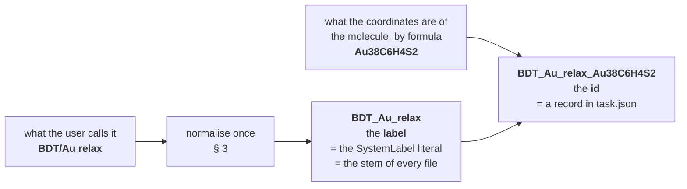
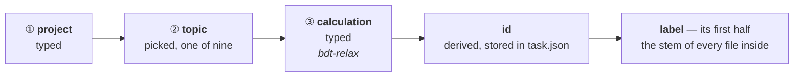

# Run identity — the name that decides whether a calculation continues

**Role:** contract
**Domain:** execution
**Companions:** [`execution/job-contracts.md`](?doc=execution/job-contracts.md) —
the run directory, the basename rule (§ 2.1), the warm-file inventory and the
restart banner (§ 4), all of which this document builds on and none of which it
changes; [`execution/running-a-job.md`](?doc=execution/running-a-job.md) — how a
run is actually launched and what the wrapper does with the files;
[`engines/stages.md`](?doc=engines/stages.md) — the description this id is
derived from; [`web/staged-runs-architecture.md`](?doc=web/staged-runs-architecture.md)
— the plan that motivates this contract and schedules the work.

**Status: proposed, not built.** Written first, built to. `job-contracts.md § 4`
describes the shipped behaviour; this document says how the id that drives it
should be *constructed*, and asks each engine to declare something it does not
declare today.

**This contract owns:** how a run id is built, what it may and may not be tied
to, how it is normalised, and the per-engine group of parameters that decides
whether prior state is honoured.

---

## 1. Why identity is the mechanism

A generated script *"declares its ID in one literal (`SystemLabel` / `JOB`)"*,
and **that ID keys every warm file as `<ID>.<ext>`** (`job-contracts.md § 4.1`).
`job-contracts.md § 2.1` Rule 2 then says the part that matters most here:

> Across the stages of one staged relaxation the basename **stays identical**
> (only parameters change); that is exactly what lets SIESTA pick up
> `<basename>.XV` / `.DM` from the previous stage.

So **continuing is not something molbuilder does.** It is what the engine does
when it finds warm files keyed by the **label** it was given and its own bound
parameters say to load them (§ 4). molbuilder's whole contribution is to make the
label right and put the files where the engine will look. *(The label is the
half of the id that reaches the engine — § 2.0a.)*

Two failures follow directly from getting it wrong, and both are real today:

- **two different calculations given the same label in one directory** — the
  second silently warm-starts from the first's geometry, and the banner says
  `WARM-RESTART (silent)` because that is exactly what it is
  (`job-contracts.md § 4.4`);
- **a label edited between runs** — the warm files no longer match, and a run
  that should have resumed starts cold instead.

---

## 2. The rule

> **The id is built from inputs, never from anything a run produced.**

It must be knowable *before* the calculation exists — half of it is the basename
of every file in the folder, and a name cannot wait for a result. An id that
depended on one would change the moment a stage succeeded, orphaning the state it
exists to continue from — the identity would break precisely when the calculation
worked.

So: no coordinates, no energies, no convergence status, nothing read back off a
`.XV`. That leaves simple parameters, which is all it needs.

The id is **readable, not cryptographic** — made of things a person already
knows, and it has two halves that land in two different places:



A hash would be exact and unreadable. A formula is neither, and that is the trade
made deliberately: a **name** you can recognise in a directory listing, and an
**id** you can read in a description, are worth more day to day than one token
that resolves every possible ambiguity.

### 2.0 The formula, and the one rule it needs

**Element symbols in alphabetical order, each followed by its count, and a count
of one is written as nothing.** So the worked example below is `Au38C6H4S2` —
`Au` before `C` before `H` before `S` — and **not** the hand-grouped
`C` `6` `H` `4` `S` `2` `Au` `38` this document carried until today, which read as
*"the molecule, then the gold"* and matched no rule at all.

*Decided 2026-08-08 (user).* A convention was needed and any convention would
do, so the deciding argument was that **this one already exists in the code**:
`Structure.summary()` has computed exactly this since long before this document,
and lifting it out of a `__repr__` is cheaper and safer than minting a second
rule that could disagree with it.

Alphabetical rather than the chemists' habit of leading with carbon and
hydrogen: that convention would read more naturally for an organic molecule
(`C6H4Au38S2`), and it costs a special case in a rule that otherwise has none.
The id is a name to recognise, not a formula to publish.

> **What this buys, and it is not tidiness.** Until there was a rule, the
> formula was the one input to the id that no code could produce — the worked
> example below was in an order nothing computes — so `run_id` had to be handed
> it as a string and nothing could fill `structure.formula` in a description.
> Both close now, and so does the check in § 5's second row, which had nothing
> to compare against.

### 2.0a The label is on disk; the id is on the record

> **Decided 2026-08-09 (user).** *"From dir to the .fdf/script name, we all derive
> consistently from SystemLabel … from there, the SystemLabel becomes one
> consistent scheme, and other information is simply attached to it."*

Everything a run emits is named from the **label**. The **id** — label plus
formula — is written into `task.json` and never becomes a filename:

| | is | lands in |
|---|---|---|
| **label** | the user's name for it, normalised (§ 3) | the `SystemLabel` line inside the deck, and the stem of every file beside it |
| **id** | `<label>_<formula>` | the `run` block of `task.json` |

**This is what the code has always done.** `cli.py:700` builds the label with
`normalise_id(typed_name)` — one string, the formula nowhere in it — and
`input.py:550` writes `f"{cfg.system_label}{suffix}.fdf"`. The composite
`run_id(label, formula)` exists and is called from **thirteen places, every one a
test**. This document used to describe that composite as the filename; it never
was.

**What the split costs, and it is not nothing.** With the formula in the stem,
two calculations of *different molecules* sharing a typed label in one directory
had different filenames and could not touch each other's warm files. Now they
have the same stem, so § 1's first failure mode is open to them:

- **a differing atom count the engine still refuses** — a `.DM` of the wrong
  shape is a loud failure, and that is the common case;
- **same count, different molecule** — an isomer, a substitution — is the
  residual, and nothing on disk separates it.

**The formula therefore moves from preventing to reporting.** It is in
`task.json`, so the surface can compare the state it found against the
calculation it belongs to and say so — which is § 5's whole doctrine, and its
third row is the message. That is a real weakening of a name-level guarantee,
accepted deliberately: it buys one scheme instead of two, and the case it gives
up was already sharing a directory, which § 3.2's last blockquote calls a mess
the user is entitled to make.

**The label is the `SystemLabel` / `JOB` literal. There is no second name on
disk** — the formula is recorded, not spelled out in a filename.

> ⚠ **This is an ordering, not a pairing.** `SystemLabel` is not a copy of the
> label kept in step with it — it **is** the label, and the label is the half
> that matters, because it is the only half the engine ever sees. SIESTA is fed
> the deck on stdin (`siesta < job.fdf`), so the *filename* never reaches it;
> every file it writes and reads back is named from the `SystemLabel` line
> **inside** the deck. A deck called `clean.fdf` whose label says `siesta`
> produces `siesta.XV`, `siesta.out`, and nothing in the directory listing
> reveals it. Anything that derives a name from a filename instead has the
> dependency backwards.
>
> This is also why the id cannot be the thing on disk even if you wanted it to
> be: the engine's key is a literal *inside* the deck, so putting the formula in
> a filename without also putting it in that literal would separate the listing
> and change nothing about what SIESTA loads.

**The timestamp is recorded but is not part of it.** A description carries when
it was written, for tracing; putting it in the id would make every regeneration a
new identity and therefore a cold start. Two generations of the same calculation
*should* land on the same id — that is not a collision, it is the same
calculation, and warm files being found is the right outcome.

**What tells two invocations apart, then?** The wrapper already does it: each run
carries an index (`-run0`, `-run1`, …) and never clobbers a prior one
(`job-contracts.md § 2.6`). That is invocation-level bookkeeping; the id is
calculation-level and does not repeat it.

### 2.1 What the identity is tied to — as little as possible

Overstating this is not a safe error: every extra thing in the pin is a case
where a user tunes something reasonable and loses a geometry they should have
kept.

Start from what a run *produces*. **The result is a set of coordinates.**

> **Coordinates cannot be in the identity.** They are the output. Bind them in
> and the pin changes every time a stage succeeds.

What is left is what those coordinates are *of*:

| Considered | In the pin? | Why |
|---|:--:|---|
| the molecule — its formula (§ 2.0) | **yes** | a `.XV` is a list of positions for *these* atoms. Different atoms, and every coordinate lands somewhere it does not belong |
| the positions | no | the output (above) |
| the cell | **no — reported instead** (§ 5) | a `.XV` carries the cell too, so on a continue the saved cell **wins** and the new one is silently ignored. That is a fact to report, not a difference to pin |
| basis, spin, XC | no | the geometry stays valid across all of them, and tuning the electronics while continuing is ordinary practice. A `.DM` of the wrong shape is caught by the engine — a failure it already reports, traded for one it cannot |
| mesh, tolerances, force, steps, algorithm | no | exactly what a description's stages vary |
| ranks, threads, GPU | no | how fast it ran says nothing about whether the answer may be continued |

So the id covers one thing beyond the user's own name for it: **which atoms these
coordinates belong to.** A differing atom *count* the engine already refuses, so
the id is not there for that; it is there for the cases the engine cannot see.

**And since 2026-08-09 it covers them on the record rather than in a name**
(§ 2.0a). "In the pin" used to mean *a different formula gives a different
filename*; it now means *a different formula is written in `task.json` and said
out loud by the surface*. The table above is unchanged — what the id is tied to
did not move — but what being tied to it **does** has: § 5, not a filename.

Note the fifth row. The id is deliberately blind to everything a stage tunes —
that is what makes several stages one calculation.

**The known gap:** a formula does not separate two isomers, and does not pin the
*order* species are declared in, which a `.XV` is sensitive to. This is a
starting point, agreed as one; the plan records what would force it to grow.

---

## 3. Normalisation, and the folder

What the user types becomes the **label**; the label becomes the `SystemLabel`,
and that becomes the stem of every file: `<label>.XV`, `<label>.DM`,
`<label>_tight.fdf`. The formula is appended to the label to make the **id**,
which goes in `task.json` (§ 2.0a). A name with a space or a slash in it breaks a
shell line, a glob or a scheduler argument. **What the user types is never used
raw.**

**The allowed set is not a new decision.** `job-contracts.md § 2.1` Rule 2 fixes
it: a single token matching `[A-Za-z0-9_-]+`, rejected at the form/CLI boundary
by `molbuilder/projects.py::_NAME_PATTERN`, with the wrapper accepting the
slightly wider `[A-Za-z0-9._-]+` because a `SystemLabel` may legitimately carry a
dot — and sanitising it there is also what blocks shell injection from a hostile
script (`job-contracts.md § 4.3`). The project tree uses the same set per
segment (`job-contracts.md § 2.5`).

So the normalisation is: **anything outside `[A-Za-z0-9_-]` to `_`, runs of two
or more separators collapsed to a single `_`, leading and trailing separators
trimmed, and length capped.**

*A run collapses; a lone separator does not.* `BDT-Au` keeps its hyphen — it is
in the set and the user typed it deliberately — while `BDT  --  Au` is a run of
six separator characters and becomes one `_`. Collapsing every `-` to `_` would
be a simpler rule that quietly renames a project.

The cap is derived, not chosen: `<label>_<longest stage name>.<longest extension
the run will write>` must fit the filesystem's name limit (255 bytes, in
practice). Since rule 3 below **refuses** rather than truncating, the cap has to
be checked where the label is made — a truncated label is a different calculation
wearing the same name, which is the one failure this whole document exists to
prevent.

**The id is not capped, and that follows from the line above rather than being
a second rule.** The cap exists because a name has to fit *beside a stage suffix
and an extension* — that is a fact about filenames, and since § 2.0a the only
thing in a filename is the label. The id is longer, so capping the pair would
refuse a perfectly good name because of the formula attached to it, and the
refusal would blame the half that fitted. `identity.run_id` therefore normalises
the two apart: the label against the cap, the formula against the alphabet only.
*(Corrected 2026-08-09, in the commit that wired the id into `task.json` — this
paragraph first read "the id is capped by the same number and never binds
first", which is self-contradictory: the id is the longer string, so under one
shared cap it is the one that binds first.)*

**Case is preserved, and there is no lowercasing rule.** For the **id** the
reason is absolute: **it carries a chemical formula, and in a formula the case
*is* the element.** Lowercasing `Co` (cobalt) makes it `co`, the same token `CO`
(carbon monoxide) lowercases to — so a tidying rule would erase the one thing the
formula is in the id to say. For the **label** the reason is that lowercasing it
would make it the single name in this system that forbids capitals, when the
project level (`BDT-Au`) allows them. The case-insensitive-filesystem worry is
handled where it actually bites, by making the **collision check**
case-insensitive.

**And the same set is git-ref-safe**, which the checkpoint history depends on:
`[A-Za-z0-9_-]+` contains none of the characters a ref forbids, so a commit,
tag or branch naming a calculation and its stage needs no second normalisation
(`engines/stages.md § 7.3`). That is not luck — a set narrow enough to survive a
filename, a shell line and a scheduler argument was always going to survive a
ref — but it is worth writing down, because the alternative is somebody
inventing a second sanitiser for tags.

### 3.0 Which directory level this is about

*"The folder" is five different things in this tree, and only one of them is
named by a person. Naming the level is the difference between a rule and a
guess.*

| # | Level | Example | Who names it | The rule, and where it lives |
|--:|---|---|---|---|
| ① | **project** | `BDT-Au` | **the user types it** | `[A-Za-z0-9_-]+` per segment — `job-contracts.md § 2.5` |
| ② | **topic** | `optimization` | **the user picks** one of a fixed nine | `job-contracts.md § 2.5` |
| ③ | **calculation** — `job-contracts.md § 2.5` calls this segment `<structure>/`, the *one-job directory* | `bdt-relax` | **the user types it** *(decided 2026-08-07 — this row is what changed)* | `[A-Za-z0-9_-]+`. This is the level that holds `task.json`, and `task.json` is what makes it a calculation rather than a directory — `checkpointing.md` **L1** |
| ④ | **stage** *(hierarchical only)* | `01_coarse` | **derived** — `<seq>_<name>`, `seq` assigned once by the produce that creates it | `project-layout.md § 4.1`. A flat calculation has no level ④ at all |
| ⑤ | **attempt** *(hierarchical only)* | `run-0` | **derived** — a counter | `project-layout.md § 2.2`. Flat separates attempts by an output index instead, `-run0.out` |

**Levels ④ and ⑤ are derived and this section does not touch them.** A stage
directory legitimately carries a *number* alongside its name, which is the one
place a number belongs (`project-layout.md § 4.1`) — and everything § 7.3 R5 says
about positions never reaching a **filename** is still in force.

**Level ③ is the one this rule is about, and the id no longer names it.**



> **Decided 2026-08-07 (user), reversing this section for level ③.** It used to
> read *"the id also names the folder"*, and argued the strictness was the point —
> *a folder whose name is not the id is a folder whose contents cannot be
> identified from outside it.*
>
> **That premise was removed by the design's own progress.** When it was written,
> nothing inside a calculation declared what it was, so the level-③ name was the
> only handle. `task.json` now declares the id in the one place that travels with
> the work (`engines/stages.md § 6`), and `checkpoint.py`'s `_is_bundle_root`
> already finds a calculation by looking for that file rather than by reading a
> name. Level ③ no longer has to carry information its own *contents* carry
> better.
>
> **And the strict rule cost something real.** The id is built from the label, the
> purpose and the formula — it does not encode the functional, the basis or the
> pseudopotential set. So *the same system studied two ways in one topic* derives
> **one id**: `bdt-relax-pbe/` and `bdt-relax-blyp/` are the obvious level-③ names
> for that work, and under the old rule they were a collision one of them had to
> escape by inventing a fake label. The id's job was never to separate those —
> § 1's two failure modes are both about **one directory**, and both still hold.

**What this costs, stated plainly:** an `ls` of a topic no longer tells you what
each calculation computes. `task.json` does, and every surface that lists
calculations reads it — but the bare listing is now one step short, and that is
the trade.

### 3.1 Normalisation, worked

Each row shows one rule doing its job. The right-hand column is what the surface
must display back **before** anything is written.

**Normalisation acts on what the user types, and what comes out is the label.**
The id is that label with the formula appended — `BDT_Au_relax` + `Au38C6H4S2` →
`BDT_Au_relax_Au38C6H4S2` — and the formula needs no normalising, because
`Structure.summary()` only ever produces element symbols and digits (§ 2.0).

| What the user types | Label | Which rule fired |
|---|---|---|
| `BDT/Au relax` | `BDT_Au_relax` | `/` and the space are outside the set → `_`; **case is kept** |
| `BDT  --  Au` | `BDT_Au` | a run of six separator characters collapses to one `_` |
| `_relax_` | `relax` | leading and trailing separators trimmed |
| `Relax.v2` | `Relax_v2` | the dot is outside the label's set (the *wrapper* tolerates a dot in a `SystemLabel`; the label does not mint one) |
| `BDT-Au` | `BDT-Au` | hyphens are **kept** — they are in the set, and a lone one is not a run |
| `Über` | **refused** | `Ü` is a letter, not a separator — the label cannot carry it and will not silently drop it (rule 3) |
| `///` | **refused** | reduces to nothing; say so and ask |
| a 300-character name | **refused** | over the derived cap — a truncated label is a different calculation wearing the same name |

### 3.2 One label, and everywhere it lands

The point of the rule is that a *single* token is enough to name every file of a
calculation, on disk and to the engine. For the label `BDT_Au_relax` — whose id
is `BDT_Au_relax_Au38C6H4S2` — in the flat shape:

```text
projects/BDT-Au/optimization/bdt-relax/   ← the folder is what the user typed
├── task.json                             ← and this says the id, formula and all
├── BDT_Au_relax.fdf.template
├── BDT_Au_relax_coarse.fdf               ┐ what MOLBUILDER named
├── BDT_Au_relax_tight.fdf                │ carries the stage: <label>_<stage>
├── BDT_Au_relax_coarse-run0.out          ┘
├── BDT_Au_relax.XV                       ┐ what the ENGINE named
└── BDT_Au_relax.DM                       ┘ carries the label ALONE
```

**The formula is in exactly one place, and it is not a filename.** `task.json`
holds the id; the folder holds the label. That is § 2.0a, seen in a listing.

The **hierarchical** shape gives each stage a directory, and **the filenames do
not change** — `01_coarse/BDT_Au_relax_coarse.fdf`. The repetition between the
directory and the deck is a self-check, not noise; the rule generating both
shapes is `job-contracts.md § 6.3`.

and in the history, where a state's message is your note plus two trailers:

```text
relaxation converged, 41 steps

Calculation: bdt-relax
Manifest-SHA256: 9f2c…
```

**The `Calculation:` trailer is the folder, a third name again** — `checkpoint.py`
reads it from the directory (`Repo.calculation`, defaulting to `root.name`), not
from the label and not from the id. All three share one character set, so none of
them needs a second sanitiser; they are simply answers to three different
questions. *(Nothing tags a state automatically — `checkpointing.md` **L4**. Tags
are typed by a person, so no derived tag form appears here.)*

**Two naming systems the label passes through unchanged — a filesystem and
SIESTA's `SystemLabel` line — plus a shell line and a scheduler argument.** That
is what § 3's character set buys.

Note which files carry the stage and which do not: **anything molbuilder named**
carries `_<stage>`, and **anything the engine named** carries the bare label.
That asymmetry is not cosmetic — it is exactly what lets the next stage find the
previous stage's state without being told where it is (§ 4). SIESTA looks for
`<SystemLabel>.XV`; the file sitting there is the one the last stage left, and no
instruction passes between them.

**In the hierarchical shape the same separation exists, expressed differently.**
The warm files a stage resumes from are the ones `prep` copied into its attempt
(`project-layout.md § 2.3.4`), rather than the ones the previous stage happened
to leave in a shared directory. Same outcome, and it is the flat shape that makes
the label's role visible, which is why the example above is flat.

**Who names a file decides whether it carries the stage, and this holds in both
shapes:**

| Named by | Carries the stage? | Why it is not a choice |
|---|:--:|---|
| **the engine** — `<label>.XV`, `.DM`, `.CG` | **no** | SIESTA looks for `<SystemLabel>.XV` and nothing else. molbuilder has no say, in either shape |
| **molbuilder** — `<label>_<stage>.fdf`, `<label>_<stage>-run0.out` | **yes** | molbuilder chooses, so what the name says is a design decision — and it spends it on a cross-check |

> **The redundancy in the hierarchical shape is deliberate.** `01_coarse/` already
> says which stage it is, and the deck inside it says so again. That is not the
> naming rule being violated — it is a *self-check*, and it is the same idea as
> § 6.3's structure witness: write down something you could have derived, so a
> mismatch has something to fail against.
>
> Without it, every stage directory holds a file with an identical name. Two
> decks swapped by a bad copy, a resumed `prep` or a hand-edit would be
> **invisible** — nothing in either folder disagrees with anything. With it,
> `01_coarse/<label>_tight.fdf` is wrong on sight.
>
> *Corrected 2026-08-08 (user).* This section used to read *"there every name is
> the bare id and the directory says which stage"*, and `job-contracts.md § 6.3`'s
> *a name says what its location does not* was read as forbidding the repetition.
> That rule is about **noise**. Deliberate redundancy that catches a mix-up is
> not noise, and applying a style rule to a safety mechanism is how a check gets
> designed away.
>
> *Retokenised 2026-08-09 (user).* The stem in these names was written `<id>`
> until decision 26 separated the two: it is the **label**, and it always was —
> `input.py:550` renders `f"{cfg.system_label}{suffix}.fdf"` and has never had the
> formula to hand. § 2.0a is the split.

**Three rules keep normalisation from becoming a source of surprise:**

1. **It happens once, when the description is written, and the result is
   stored.** What `task.json` records *is* the label and the id — nothing
   downstream re-derives either from the user's raw text, because two components
   normalising slightly differently is a silent divergence between what a surface
   shows and what the engine writes.
2. **The result is shown, not hidden — by every surface, the terminal
   included.** A surface that hides it hides the thing that decides whether the
   next run continues, and *"the browser will show it"* is not an answer for
   someone who never opens the browser. What the user typed goes in, the
   normalised label comes back, and it is visible **before** anything is written:
   a printed line from the CLI is as good as a field in a form. *(Stated
   explicitly 2026-08-08 — it had been read as a web obligation.)*
3. **A normalisation that loses the name is refused, not patched** — never append
   a digit and carry on, which produces `bdt_2` and no explanation of what it
   differs from. Two cases refuse, and what separates them from an ordinary
   substitution is *what was replaced*:

   - **a letter or a digit was replaced.** Substituting a **separator** — a
     space, a `/`, a `.` — is expected and silent; that is all `BDT/Au relax`
     does. Substituting a character the user typed *inside a word* loses it, so
     `Über` is refused rather than quietly becoming `ber`, and so is `Ω-shape`.
     The test is mechanical: a character outside `[A-Za-z0-9_-]` that is
     nonetheless alphanumeric is a letter or a digit in *some* alphabet, and the
     id has no way to carry it.
   - **nothing is left, or the result is over the derived cap.** `///` reduces to
     the empty string; a 300-character name exceeds what `<label>_<stage>.<ext>`
     may occupy. Say so and ask.

**A "collision" is narrower than it sounds, and since 2026-08-08 molbuilder does
not go looking for one.** Two calculations only interfere when they occupy the
**same directory** — not when they merely derive the same id. The same id under
`optimization/` and under `frequency/` is fine, and so is the same id in
`bdt-relax-pbe/` and `bdt-relax-blyp/`: in both cases the warm files never meet.

> **molbuilder does not compare one calculation's folder against another's.**
> *Decided 2026-08-08 (user): this is not a file manager.* Where a calculation
> goes is the user's to choose, and two of them sharing a folder is a mess the
> user is entitled to make — one they will notice, and one the checkpoint
> history is there to recover from. A pre-emptive search for path collisions
> would mean molbuilder holding an opinion about a directory tree it does not
> own, and getting that opinion wrong is worse than not having it.
>
> What molbuilder still owes is a **report about the folder it was actually
> pointed at**: § 5 says what is there and § 6 says so before writing over it.
> That is the whole of it.

---

## 4. Every engine has an internal identity, and parameters bound to it

The id is only half of a warm start, and this is not a SIESTA quirk. **Every
engine has its own notion of "which job is this, and may I continue it", and a
set of parameters tied to that notion.** A design that names only the filename
has described none of it.

Two things, per engine, always:

| | What it settles | SIESTA | PySCF |
|---|---|---|---|
| **the engine's job identity** | which prior state belongs to this run | the `SystemLabel` literal | the `JOB = "…"` literal |
| **the parameters bound to it** | whether that state is honoured when found | `DM.UseSaveDM`, `MD.UseSaveXV`, `MD.UseSaveCG` — SIESTA reads the files *only* when these are set (`job-contracts.md § 4.2`) | the resume branches the generated script carries: `mf.chkfile = JOB + ".chk"` with `init_guess = "chkfile"` when it exists, and `<JOB>_optimized.xyz` overriding the literal geometry |

Read across: the identity is the same *idea* in both columns and a different
*mechanism*; the bound parameters are a declared flag family in one and generated
control flow in the other. Neither is a filesystem fact, and neither is the
scheduler's business.

**So they are one named group per engine, and the group is the generator's:**

1. **An engine declares its group.** Its identity literal, the parameters bound
   to it, and the warm files they govern belong together in that engine's
   contract — the same place `job-contracts.md § 4.2` already inventories the
   files. *A new engine that cannot fill this in is a new engine whose restart
   behaviour nobody has thought about yet.*
2. **The user says one thing; the generator sets the group.** `restart` is a
   single field — `continue` or `clean` — and the renderer expands it into
   whatever that engine's group is: three declared keys for SIESTA, generated
   control flow for PySCF. Nobody keeps a group in step by hand, and no
   description can carry its members individually and disagree with itself.
3. **It is per-stage, because it is an ordinary field.** A first stage is
   normally `clean` and everything after it `continue`. Nothing special is needed
   to say so.
4. **What `continue` implies is a short fixed set; what a stage needs *beyond*
   it is declared.** `restart: continue` means the geometry, the density and the
   optimizer's history — `.XV`, `.DM`, `.CG` — because that is what continuing a
   relaxation *is*. A run needing something else says so with `required`
   (`job-contracts.md § 2.1`), and that declaration is checked where the job runs
   (§ 4.4 there), not here. *Added 2026-08-08: the set used to be three suffixes
   written into the producer, which meant a TranSIESTA ladder could not express
   its `.TSHS` dependency without changing molbuilder's code.*

**Why rule 2 is not tidiness.** The two ways the group can be wrong are both
silent, and opposite:

- **honoured with nothing to load** — the parameter is on, no prior state exists,
  and the engine cold-starts while the deck says it resumed;
- **present but not honoured** — the files are right there, the parameter is off,
  and the stage starts from scratch looking like it continued.

One field cannot produce either.

---

## 5. What is reported rather than prevented

An identity that tried to prevent every wrong continuation would have to include
everything, and § 2.1 is about why that is worse. The cases below are real, and
the answer to each is a message, not a wider pin.

| Case | Why the id cannot fix it | Who says it, and what |
|---|---|---|
| **changed cell parameters** | the cell in the deck is *derived* from the parameters and the structure (`model/cell-plan.md`), and derived values cannot be in the id (§ 2). And the hazard is not a mismatch — a `.XV` carries its own cell and its own frame, so on a continue it **wins**: widening the vacuum changes the deck and changes nothing about the run | the surface, at check time: *state found, written under different cell parameters — a continue will keep the saved cell* |
| **the structure moved under a saved description** | the description holds a reference plus a witness (`engines/stages.md § 6.3`), so the mismatch is detectable | the **reader**, as a finding at preflight: *this description was written against a different structure* |
| **prior state from another calculation, different label** | different stem, so the engine will not load it — but the user should know it is there | the **surface** at check time, and the **wrapper banner** at run time: *prior state found, but from a different calculation* |
| **prior state from another calculation, same label** | **the engine will load it.** Since § 2.0a the formula is not in the stem, so two molecules under one label in one folder share warm files. A differing atom count the engine refuses loudly; an isomer or a substitution it cannot see | the **surface** at check time, by comparing the formula in `task.json` against the structure being generated: *state found, but written for a different molecule*. This row is the price of decision 26 and the reason the formula stays in the id |
| **prior state that matches** | nothing is wrong; the user should still know before they start | the **surface** at check time, and the **wrapper banner** at run time: *prior state found for this key — the next run continues* |

**Two authors, on purpose.** The wrapper's banner (`job-contracts.md § 4.4`)
already says the last two at run time, which is *after* the user committed. The
surface says them at check time, which is when the choice is still open. Neither
replaces the other, and neither may say something the other contradicts — the
banner is the one that is always present, so it is the one that must never be
weakened. This is the shipped doctrine —
**molbuilder informs, and the user decides to continue** (`job-system.md § 2`,
decision 5) — reaching a case it does not cover today: `WARM-RESTART (silent)`
cannot tell you the state came from a different calculation, because nothing
beside it recorded which one made it. A description written beside the decks
closes that.

---

## 6. Producing twice into the same level-③ directory

A second generate targets **the directory it is pointed at** — since 2026-08-07
that is the level-③ name the user typed, not a location the id derives (§ 3.0).
**Say what is already there, and never rename.**

> **Warn, do not refuse.** *Decided 2026-08-08 (user), softening what this
> section used to require.* It read *refuse unless the user says overwrite*, and
> that is one rule too many for a program that does not manage the user's
> folders. Regenerating decks into a folder you are working in is an ordinary
> thing to do — after fixing a typo in a basis, or widening a mesh — and a
> refusal turns it into a flag to look up, which trains people to pass
> `--overwrite` reflexively and stop reading.
>
> The rule that survives is the one carrying the information: **before writing,
> say what is in the folder.** § 5's rows already do that, and this is the
> moment they are for.

**"Never rename" is the part that is not negotiable.** The warm files are what
the next run continues from, so making a name unique to avoid a clash would
throw away the geometry the user is trying to keep. Rewriting decks does not
touch them, and nothing in this document ever moves a file to make room.

`job-contracts.md § 5.4`'s handoff writer still raises unless `overwrite=True`.
That is a **different** case and keeps its refusal: a handoff bundle is a single
artifact being replaced wholesale, not a folder being worked in.

---

## 7. What this contract does not own

- **The warm-file inventory, the `--cold` move-aside glob, the restart banner
  wording, the run index, the project tree** —
  [`execution/job-contracts.md`](?doc=execution/job-contracts.md) §§ 2 and 4.
  This document adds no file and changes no glob.
- **How a run is launched, which environment it activates, and where activation
  comes from** — [`execution/running-a-job.md`](?doc=execution/running-a-job.md)
  §§ 2, 3 and 5. Unchanged here.
- **What a stage is, and the description the id is derived from** —
  [`engines/stages.md`](?doc=engines/stages.md).
- **Phasing and open questions** —
  [`web/staged-runs-architecture.md`](?doc=web/staged-runs-architecture.md) and
  [`roadmap.md`](?doc=roadmap.md) (R3).
