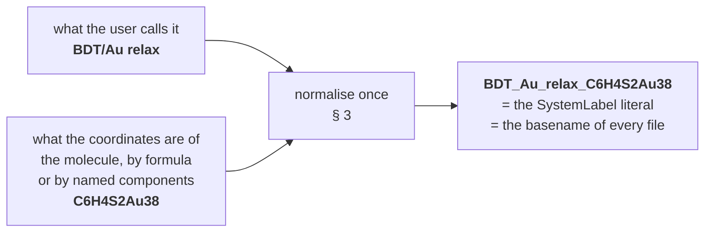
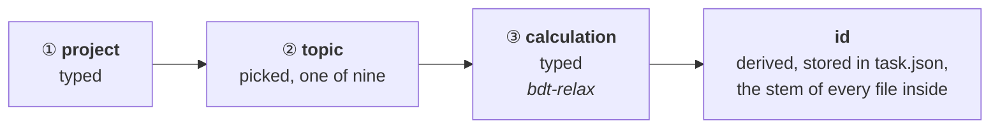

# Run identity — the name that decides whether a calculation continues

**Role:** contract
**Domain:** execution
**Companions:** [`execution/job-contracts.md`](?doc=execution/job-contracts.md) —
the run directory, the basename rule (§ 2.1), the warm-file inventory and the
restart banner (§ 4), all of which this document builds on and none of which it
changes; [`execution/running-a-job.md`](?doc=execution/running-a-job.md) — how a
run is actually launched and what the wrapper does with the files;
[`engines/stages.md`](?doc=engines/stages.md) — the description this id is
derived from; [`web/staged-runs-architecture.md`](?doc=web/staged-runs-architecture.md)
— the plan that motivates this contract and schedules the work.

**Status: proposed, not built.** Written first, built to. `job-contracts.md § 4`
describes the shipped behaviour; this document says how the id that drives it
should be *constructed*, and asks each engine to declare something it does not
declare today.

**This contract owns:** how a run id is built, what it may and may not be tied
to, how it is normalised, and the per-engine group of parameters that decides
whether prior state is honoured.

---

## 1. Why identity is the mechanism

A generated script *"declares its ID in one literal (`SystemLabel` / `JOB`)"*,
and **that ID keys every warm file as `<ID>.<ext>`** (`job-contracts.md § 4.1`).
`job-contracts.md § 2.1` Rule 2 then says the part that matters most here:

> Across the stages of one staged relaxation the basename **stays identical**
> (only parameters change); that is exactly what lets SIESTA pick up
> `<basename>.XV` / `.DM` from the previous stage.

So **continuing is not something molbuilder does.** It is what the engine does
when it finds warm files keyed by the id it was given and its own bound
parameters say to load them (§ 4). molbuilder's whole contribution is to make the
id right and put the files where the engine will look.

Two failures follow directly from getting it wrong, and both are real today:

- **two different calculations given the same label in one directory** — the
  second silently warm-starts from the first's geometry, and the banner says
  `WARM-RESTART (silent)` because that is exactly what it is
  (`job-contracts.md § 4.4`);
- **a label edited between runs** — the warm files no longer match, and a run
  that should have resumed starts cold instead.

---

## 2. The rule

> **The id is built from inputs, never from anything a run produced.**

It must be knowable *before* the calculation exists: it is the basename of every
file in the folder. An id that depended on a result would change the
moment a stage succeeded, orphaning the state it exists to continue from — the
identity would break precisely when the calculation worked.

So: no coordinates, no energies, no convergence status, nothing read back off a
`.XV`. That leaves simple parameters, which is all it needs.

The id is **readable, not cryptographic** — made of things a person already
knows:



A hash would be exact and unreadable. A formula is neither, and that is the trade
made deliberately: an id you can recognise in a directory listing and in a
filename is worth more day to day than one that resolves every possible
ambiguity.

**That one id is the `SystemLabel` / `JOB` literal. There is no second name.**

**The timestamp is recorded but is not part of it.** A description carries when
it was written, for tracing; putting it in the id would make every regeneration a
new identity and therefore a cold start. Two generations of the same calculation
*should* land on the same id — that is not a collision, it is the same
calculation, and warm files being found is the right outcome.

**What tells two invocations apart, then?** The wrapper already does it: each run
carries an index (`-run0`, `-run1`, …) and never clobbers a prior one
(`job-contracts.md § 2.6`). That is invocation-level bookkeeping; the id is
calculation-level and does not repeat it.

### 2.1 What the identity is tied to — as little as possible

Overstating this is not a safe error: every extra thing in the pin is a case
where a user tunes something reasonable and loses a geometry they should have
kept.

Start from what a run *produces*. **The result is a set of coordinates.**

> **Coordinates cannot be in the identity.** They are the output. Bind them in
> and the pin changes every time a stage succeeds.

What is left is what those coordinates are *of*:

| Considered | In the pin? | Why |
|---|:--:|---|
| the molecule — its formula, or its named components | **yes** | a `.XV` is a list of positions for *these* atoms. Different atoms, and every coordinate lands somewhere it does not belong |
| the positions | no | the output (above) |
| the cell | **no — reported instead** (§ 5) | a `.XV` carries the cell too, so on a continue the saved cell **wins** and the new one is silently ignored. That is a fact to report, not a difference to pin |
| basis, spin, XC | no | the geometry stays valid across all of them, and tuning the electronics while continuing is ordinary practice. A `.DM` of the wrong shape is caught by the engine — a failure it already reports, traded for one it cannot |
| mesh, tolerances, force, steps, algorithm | no | exactly what a description's stages vary |
| ranks, threads, GPU | no | how fast it ran says nothing about whether the answer may be continued |

So the id covers one thing beyond the user's own name for it: **which atoms these
coordinates belong to.** A differing atom *count* the engine already refuses, so
the id is not there for that; it is there for the cases the engine cannot see.

Note the fifth row. The id is deliberately blind to everything a stage tunes —
that is what makes several stages one calculation.

**The known gap:** a formula does not separate two isomers, and does not pin the
*order* species are declared in, which a `.XV` is sensitive to. This is a
starting point, agreed as one; the plan records what would force it to grow.

---

## 3. Normalisation, and the folder

The id becomes the `SystemLabel`, and that becomes the stem of every file:
`<id>.XV`, `<id>.DM`, `<id>_tight.fdf`. A name with a space or a slash in it
breaks a shell line, a glob or a scheduler argument. **What the user types is
never used raw.**

**The allowed set is not a new decision.** `job-contracts.md § 2.1` Rule 2 fixes
it: a single token matching `[A-Za-z0-9_-]+`, rejected at the form/CLI boundary
by `molbuilder/projects.py::_NAME_PATTERN`, with the wrapper accepting the
slightly wider `[A-Za-z0-9._-]+` because a `SystemLabel` may legitimately carry a
dot — and sanitising it there is also what blocks shell injection from a hostile
script (`job-contracts.md § 4.3`). The project tree uses the same set per
segment (`job-contracts.md § 2.5`).

So the normalisation is: **anything outside `[A-Za-z0-9_-]` to `_`, runs of two
or more separators collapsed to a single `_`, leading and trailing separators
trimmed, and length capped.**

*A run collapses; a lone separator does not.* `BDT-Au` keeps its hyphen — it is
in the set and the user typed it deliberately — while `BDT  --  Au` is a run of
six separator characters and becomes one `_`. Collapsing every `-` to `_` would
be a simpler rule that quietly renames a project.

The cap is derived, not chosen: `<id>_<longest stage name>.<longest extension the
run will write>` must fit the filesystem's name limit (255 bytes, in practice).
Since rule 3 below **refuses** rather than truncating, the cap has to be checked
where the id is made — a truncated id is a different calculation wearing the same
name, which is the one failure this whole document exists to prevent.

**Case is preserved, and there is no lowercasing rule.** The reason is stronger
than symmetry with the rest of the system: **the id carries a chemical formula,
and in a formula the case *is* the element.** Lowercasing `Co` (cobalt) makes it
`co`, the same token `CO` (carbon monoxide) lowercases to — so a rule meant to
tidy filenames would erase the one thing the formula is in the id to say. It
would also make the id the single name in this system that forbids capitals,
when the project level (`BDT-Au`) allows them. The case-insensitive-filesystem
worry is handled where it actually bites, by making the **collision check**
case-insensitive.

**And the same set is git-ref-safe**, which the checkpoint history depends on:
`[A-Za-z0-9_-]+` contains none of the characters a ref forbids, so a commit,
tag or branch naming a calculation and its stage needs no second normalisation
(`engines/stages.md § 7.3`). That is not luck — a set narrow enough to survive a
filename, a shell line and a scheduler argument was always going to survive a
ref — but it is worth writing down, because the alternative is somebody
inventing a second sanitiser for tags.

### 3.0 Which directory level this is about

*"The folder" is five different things in this tree, and only one of them is
named by a person. Naming the level is the difference between a rule and a
guess.*

| # | Level | Example | Who names it | The rule, and where it lives |
|--:|---|---|---|---|
| ① | **project** | `BDT-Au` | **the user types it** | `[A-Za-z0-9_-]+` per segment — `job-contracts.md § 2.5` |
| ② | **topic** | `optimization` | **the user picks** one of a fixed nine | `job-contracts.md § 2.5` |
| ③ | **calculation** — `job-contracts.md § 2.5` calls this segment `<structure>/`, the *one-job directory* | `bdt-relax` | **the user types it** *(decided 2026-08-07 — this row is what changed)* | `[A-Za-z0-9_-]+`. This is the level that holds `task.json`, and `task.json` is what makes it a calculation rather than a directory — `checkpointing.md` **L1** |
| ④ | **stage** *(hierarchical only)* | `01_coarse` | **derived** — `<seq>_<name>`, `seq` assigned once by the produce that creates it | `project-layout.md § 4.1`. A flat calculation has no level ④ at all |
| ⑤ | **attempt** *(hierarchical only)* | `run-0` | **derived** — a counter | `project-layout.md § 2.2`. Flat separates attempts by an output index instead, `-run0.out` |

**Levels ④ and ⑤ are derived and this section does not touch them.** A stage
directory legitimately carries a *number* alongside its name, which is the one
place a number belongs (`project-layout.md § 4.1`) — and everything § 7.3 R5 says
about positions never reaching a **filename** is still in force.

**Level ③ is the one this rule is about, and the id no longer names it.**



> **Decided 2026-08-07 (user), reversing this section for level ③.** It used to
> read *"the id also names the folder"*, and argued the strictness was the point —
> *a folder whose name is not the id is a folder whose contents cannot be
> identified from outside it.*
>
> **That premise was removed by the design's own progress.** When it was written,
> nothing inside a calculation declared what it was, so the level-③ name was the
> only handle. `task.json` now declares the id in the one place that travels with
> the work (`engines/stages.md § 6`), and `checkpoint.py`'s `_is_bundle_root`
> already finds a calculation by looking for that file rather than by reading a
> name. Level ③ no longer has to carry information its own *contents* carry
> better.
>
> **And the strict rule cost something real.** The id is built from the label, the
> purpose and the formula — it does not encode the functional, the basis or the
> pseudopotential set. So *the same system studied two ways in one topic* derives
> **one id**: `bdt-relax-pbe/` and `bdt-relax-blyp/` are the obvious level-③ names
> for that work, and under the old rule they were a collision one of them had to
> escape by inventing a fake label. The id's job was never to separate those —
> § 1's two failure modes are both about **one directory**, and both still hold.

**What this costs, stated plainly:** an `ls` of a topic no longer tells you what
each calculation computes. `task.json` does, and every surface that lists
calculations reads it — but the bare listing is now one step short, and that is
the trade.

### 3.1 Normalisation, worked

Each row shows one rule doing its job. The right-hand column is what the surface
must display back **before** anything is written.

| What the user types | Id | Which rule fired |
|---|---|---|
| `BDT/Au relax` + `C6H4S2Au38` | `BDT_Au_relax_C6H4S2Au38` | `/` and the space are outside the set → `_`; **case is kept**, and in `C6H4S2Au38` it has to be |
| `BDT  --  Au` | `BDT_Au` | a run of six separator characters collapses to one `_` |
| `_relax_` | `relax` | leading and trailing separators trimmed |
| `Relax.v2` | `Relax_v2` | the dot is outside the id's set (the *wrapper* tolerates a dot in a `SystemLabel`; the id does not mint one) |
| `BDT-Au` | `BDT-Au` | hyphens are **kept** — they are in the set, and a lone one is not a run |
| `Über` | **refused** | `Ü` is a letter, not a separator — the id cannot carry it and will not silently drop it (rule 3) |
| `///` | **refused** | reduces to nothing; say so and ask |
| a 300-character name | **refused** | over the derived cap — a truncated id is a different calculation wearing the same name |

### 3.2 One id, and everywhere it lands

The point of the rule is that a *single* token is enough to identify every file
of a calculation, on disk, in a history, and to the engine. For
`BDT_Au_relax_C6H4S2Au38`, in the flat shape:

```text
projects/BDT-Au/optimization/bdt-relax/     ← the folder is what the user typed
├── task.json                                  ← and this says the id
├── BDT_Au_relax_C6H4S2Au38.fdf.template
├── BDT_Au_relax_C6H4S2Au38_coarse.fdf        ┐ what a STAGE produced
├── BDT_Au_relax_C6H4S2Au38_tight.fdf         │ carries the stage: <id>_<stage>
├── BDT_Au_relax_C6H4S2Au38_coarse-run0.out   ┘
├── BDT_Au_relax_C6H4S2Au38.XV                ┐ what the ENGINE resumes from
└── BDT_Au_relax_C6H4S2Au38.DM                ┘ carries the id ALONE
```

That is the **flat** shape, chosen here because it is where the id has to do all
the work — nothing but the filename separates one stage from another. The
**hierarchical** shape makes the same separation with directories
(`01_coarse/<id>.fdf`), so its names are shorter; the rule generating both is
`job-contracts.md § 6.3` — *a name says what its location does not*.

and in the history:

```text
commit  BDT_Au_relax_C6H4S2Au38 · tight · relaxation converged, 41 steps
tag     BDT_Au_relax_C6H4S2Au38/tight/20260806T221403Z
```

**Three different naming systems — a filesystem, a git ref, and SIESTA's
`SystemLabel` — and the id passes through all three unchanged.** That is what
§ 3's character set buys, and it is why no second sanitiser exists anywhere.

Note which files carry the stage and which do not: **anything a stage produced**
carries `_<stage>`, and **anything the engine warm-restarts from** carries the
bare id. That asymmetry is not cosmetic — it is exactly what lets the next stage
find the previous stage's state without being told where it is (§ 4). SIESTA
looks for `<SystemLabel>.XV`; the file sitting there is the one the last stage
left, and no instruction passes between them.

**In the hierarchical shape the same separation exists, expressed differently.**
There every name is the bare id and the *directory* says which stage — so the
warm files a stage resumes from are the ones `prep` copied into its attempt
(`project-layout.md § 2.3.4`), rather than the ones the previous stage happened
to leave in a shared directory. Same outcome, and it is the flat shape that makes
the id's role visible, which is why the example above is flat.

**Three rules keep normalisation from becoming a source of surprise:**

1. **It happens once, when the description is written, and the result is
   stored.** The id in the file *is* the id — nothing downstream re-derives it
   from the user's raw text, because two components normalising slightly
   differently is a silent divergence between what a surface shows and what the
   engine writes.
2. **The result is shown, not hidden.** A surface that hides it hides the thing
   that decides whether the next run continues.
3. **A normalisation that loses the name is refused, not patched** — never append
   a digit and carry on, which produces `bdt_2` and no explanation of what it
   differs from. Two cases refuse, and what separates them from an ordinary
   substitution is *what was replaced*:

   - **a letter or a digit was replaced.** Substituting a **separator** — a
     space, a `/`, a `.` — is expected and silent; that is all `BDT/Au relax`
     does. Substituting a character the user typed *inside a word* loses it, so
     `Über` is refused rather than quietly becoming `ber`, and so is `Ω-shape`.
     The test is mechanical: a character outside `[A-Za-z0-9_-]` that is
     nonetheless alphanumeric is a letter or a digit in *some* alphabet, and the
     id has no way to carry it.
   - **nothing is left, or the result is over the derived cap.** `///` reduces to
     the empty string; a 300-character name exceeds what `<id>_<stage>.<ext>` may
     occupy. Say so and ask.

**A "collision" is narrower than it sounds, and since 2026-08-07 it is narrower
still.** Two calculations collide when they would occupy the **same level-③
directory** — not when they merely derive the same id. The same id under
`optimization/` and under `frequency/` is not a collision (different ②), and
neither is the same id in `bdt-relax-pbe/` and `bdt-relax-blyp/` (different ③):
in both cases the warm files never meet, because they are in different
directories, and *that* is what the rule protects. A genuine collision is one
level-③ directory, and it is the case § 6 decides: **refuse unless told to
overwrite.**

The comparison is on the **level-③ path**, case-insensitively — which is where
the case-insensitive-filesystem worry above is actually handled, and it is now
handled where it belongs, since the filesystem is what the check is about.

---

## 4. Every engine has an internal identity, and parameters bound to it

The id is only half of a warm start, and this is not a SIESTA quirk. **Every
engine has its own notion of "which job is this, and may I continue it", and a
set of parameters tied to that notion.** A design that names only the filename
has described none of it.

Two things, per engine, always:

| | What it settles | SIESTA | PySCF |
|---|---|---|---|
| **the engine's job identity** | which prior state belongs to this run | the `SystemLabel` literal | the `JOB = "…"` literal |
| **the parameters bound to it** | whether that state is honoured when found | `DM.UseSaveDM`, `MD.UseSaveXV`, `MD.UseSaveCG` — SIESTA reads the files *only* when these are set (`job-contracts.md § 4.2`) | the resume branches the generated script carries: `mf.chkfile = JOB + ".chk"` with `init_guess = "chkfile"` when it exists, and `<JOB>_optimized.xyz` overriding the literal geometry |

Read across: the identity is the same *idea* in both columns and a different
*mechanism*; the bound parameters are a declared flag family in one and generated
control flow in the other. Neither is a filesystem fact, and neither is the
scheduler's business.

**So they are one named group per engine, and the group is the generator's:**

1. **An engine declares its group.** Its identity literal, the parameters bound
   to it, and the warm files they govern belong together in that engine's
   contract — the same place `job-contracts.md § 4.2` already inventories the
   files. *A new engine that cannot fill this in is a new engine whose restart
   behaviour nobody has thought about yet.*
2. **The user says one thing; the generator sets the group.** `restart` is a
   single field — `continue` or `clean` — and the renderer expands it into
   whatever that engine's group is: three declared keys for SIESTA, generated
   control flow for PySCF. Nobody keeps a group in step by hand, and no
   description can carry its members individually and disagree with itself.
3. **It is per-stage, because it is an ordinary field.** A first stage is
   normally `clean` and everything after it `continue`. Nothing special is needed
   to say so.

**Why rule 2 is not tidiness.** The two ways the group can be wrong are both
silent, and opposite:

- **honoured with nothing to load** — the parameter is on, no prior state exists,
  and the engine cold-starts while the deck says it resumed;
- **present but not honoured** — the files are right there, the parameter is off,
  and the stage starts from scratch looking like it continued.

One field cannot produce either.

---

## 5. What is reported rather than prevented

An identity that tried to prevent every wrong continuation would have to include
everything, and § 2.1 is about why that is worse. The cases below are real, and
the answer to each is a message, not a wider pin.

| Case | Why the id cannot fix it | Who says it, and what |
|---|---|---|
| **changed cell parameters** | the cell in the deck is *derived* from the parameters and the structure (`model/cell-plan.md`), and derived values cannot be in the id (§ 2). And the hazard is not a mismatch — a `.XV` carries its own cell and its own frame, so on a continue it **wins**: widening the vacuum changes the deck and changes nothing about the run | the surface, at check time: *state found, written under different cell parameters — a continue will keep the saved cell* |
| **the structure moved under a saved description** | the description holds a reference plus a witness (`engines/stages.md § 6.3`), so the mismatch is detectable | the **reader**, as a finding at preflight: *this description was written against a different structure* |
| **prior state from another calculation** | same folder, different id — the engine will not load it, but the user should know it is there | the **surface** at check time, and the **wrapper banner** at run time: *prior state found, but from a different calculation* |
| **prior state that matches** | nothing is wrong; the user should still know before they start | the **surface** at check time, and the **wrapper banner** at run time: *prior state found for this key — the next run continues* |

**Two authors, on purpose.** The wrapper's banner (`job-contracts.md § 4.4`)
already says the last two at run time, which is *after* the user committed. The
surface says them at check time, which is when the choice is still open. Neither
replaces the other, and neither may say something the other contradicts — the
banner is the one that is always present, so it is the one that must never be
weakened. This is the shipped doctrine —
**molbuilder informs, and the user decides to continue** (`job-system.md § 2`,
decision 5) — reaching a case it does not cover today: `WARM-RESTART (silent)`
cannot tell you the state came from a different calculation, because nothing
beside it recorded which one made it. A description written beside the decks
closes that.

---

## 6. Producing twice into the same level-③ directory

A second generate targets **the directory it is pointed at** — since 2026-08-07
that is the level-③ name the user typed, not a location the id derives (§ 3.0).
**Refuse unless the user says overwrite, and never rename.**

> The rule did not change, only what makes two produces meet. It used to be *the
> id is stable, so the second generate lands where the first one did*. It is now
> *the second generate lands where you sent it*. Deriving the same id twice is no
> longer enough to collide, and pointing at the same directory twice was always
> the thing that mattered.

That is the rule the handoff writer already applies (`job-contracts.md § 5.4`:
it raises unless `overwrite=True`, and *"a UI that writes a handoff SHOULD warn
before targeting a stem that already exists"*). Rewriting decks does not touch
the warm files — which is the point, since they are what the next run continues
from, and "make the name unique" would throw them away.

---

## 7. What this contract does not own

- **The warm-file inventory, the `--cold` move-aside glob, the restart banner
  wording, the run index, the project tree** —
  [`execution/job-contracts.md`](?doc=execution/job-contracts.md) §§ 2 and 4.
  This document adds no file and changes no glob.
- **How a run is launched, which environment it activates, and where activation
  comes from** — [`execution/running-a-job.md`](?doc=execution/running-a-job.md)
  §§ 2, 3 and 5. Unchanged here.
- **What a stage is, and the description the id is derived from** —
  [`engines/stages.md`](?doc=engines/stages.md).
- **Phasing and open questions** —
  [`web/staged-runs-architecture.md`](?doc=web/staged-runs-architecture.md) and
  [`roadmap.md`](?doc=roadmap.md) (R3).
