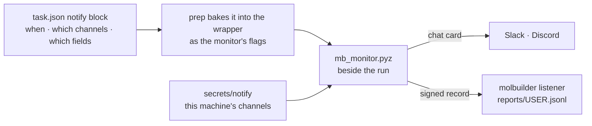
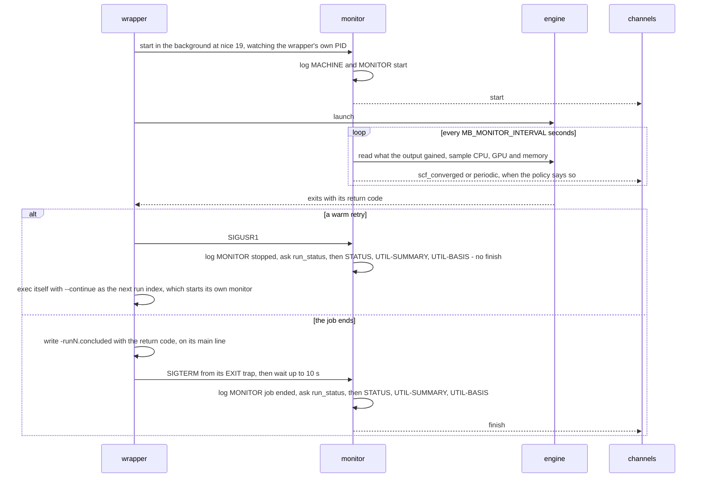
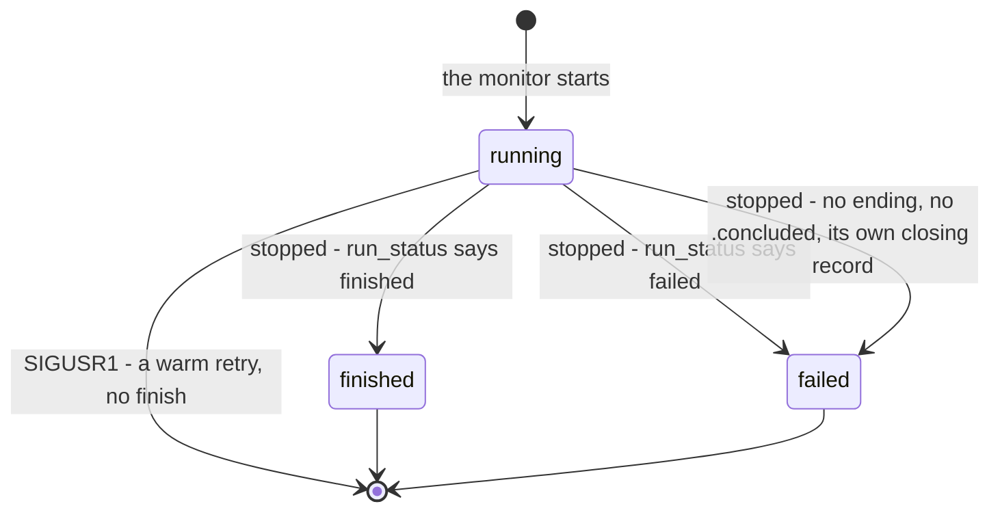

# Run reports — how a job tells you it is going

**Role:** contract
**Domain:** execution
**Companions:**
[`running-a-job.md`](?doc=execution/running-a-job.md) § 4.1 — the wrapper's
instruments, of which the monitor is one; § 4.2 — how a run directory's state
is read; § 3.5 — the warm retries;
[`job-contracts.md`](?doc=execution/job-contracts.md) § 2.1 — the monitor's
place in a run directory and the boundary it may not cross; § 2.6 — the
wrapper, and its `_mb_ending`;
[`project-layout.md`](?doc=execution/project-layout.md) § 1.6 — attempt, run
index, launch record, conclusion marker;
[`engines/stages.md`](?doc=engines/stages.md) § 6.9 — the `notify` block;
[`web/task-setup.md`](?doc=web/task-setup.md) § 9b — the card that writes it;
[`web/this-machine.md`](?doc=web/this-machine.md) — the tab that sets up the
channels;
[`ops/access-control.md`](?doc=ops/access-control.md) § 8 — the gates the
listener sits behind.

A run takes hours or days on a machine you are not sitting at. The monitor —
`mb_monitor.pyz`, backgrounded by the wrapper beside every run — watches it,
and this is the rule for how it tells you what it sees.

**The sentence the whole design follows:**

> **When** to speak, and **which channels**, belongs to the calculation.
> **What a channel actually is** — an address, and usually a secret — belongs
> to the machine. They are never written in the same file.



---

## 1. Why the split is the whole thing

A `task.json` **travels**. It goes to a cluster, into a citation's composed
copy, into a colleague's copy of your project. That is what a description is for.

A webhook URL does not travel — it is a fact about one person's Slack, and for
Slack and Discord it *is* the credential, with no separate token beside it.
Anything that travels must therefore not carry it.

| | lives in | travels? |
|---|---|---|
| **the policy** — when to speak, which channels **by name**, which fields | `task.json`'s `notify` block ([`stages.md`](?doc=engines/stages.md) § 6.9) | **yes**, and safely: *"every six hours, to `slack`"* is true wherever the file is opened |
| **the channels** — what each name resolves to: the address, and the secret | the user's own file, `<config dir>/secrets/notify`, mode `0600` (§ 3) | **no**, ever |

**A name travels; what it points at does not** — and that is what lets a
description say where its reports go at all. `"slack"` is a label the person
chose on their own machine: not a credential, it grants nothing, and on a
machine that has no channel by that name it resolves to nothing and says so in
the monitor log. It fits the line [`task-setup.md`](?doc=web/task-setup.md)
§ 6.1 draws for every setting — a description holds what a person decides,
never what a machine found — and adds one: never a secret.

> **On the directory.** Secrets live in `config_dir()`'s `secrets/`, which
> honours `$MOLBUILDER_CONFIG_DIR` and `$XDG_CONFIG_HOME`
> ([`configuration.md`](?doc=configuration.md) § 2.1c). The monitor reads this
> file **on a compute node**, and on an HPC login node `$HOME` is NFS-mounted
> and often snapshotted: `XDG_CONFIG_HOME=/scratch/$USER` is how a person keeps
> a token off it. A path fixed to `$HOME` would have no such escape.

---

## 2. When it speaks

**No `notify` block is no notification** (user, 2026-09-26: *"when no set up
for notification that means no notification"*) — nothing is sent, the start
and the end included. A calculation with a `notify` block speaks on four
occasions: the two it ticks, which combine, and its start and its end.

| occasion | `event` | set by | sent |
|---|---|---|---|
| **it started** | `start` | a `notify` block | once, when the monitor starts watching a run |
| **a step finished** — its SCF converged | `scf_converged` | `notify.on_scf_converged` | on the first wake after a step finishes (§ 2.2) — one message per wake, however many finished since the last |
| **every N hours** | `periodic` | `notify.every_hours` — a number of hours; `0` or absent is never | N hours after the last message; the first, N hours after the start |
| **it ended** | `finish` | a `notify` block | when the wrapper stops the monitor at the job's end (SIGTERM — also what a scheduler's walltime or cancel sends), or the watched PID goes |

Every message carries the same report (§ 4.1a): the state and where the run is
— SCF phase and iteration, energy, each residual against its criterion, the
largest force against its tolerance, the step, the rate — and at the end how
each SCF phase converged and how the process exited.

- **Nothing else is sent.** Between the start and the end a message goes out
  only on the two occasions the calculation ticked. Every wake's reading is in
  the monitor log (§ 2.5); the channels hear what the policy asks for.
- **A step's message restarts the N-hour clock**, and a step and a period due
  on the same wake are one message — the step's.
- **The start and the end are not ticks**: a calculation that reports at all
  reports them — they bracket every report, and a run that finishes at 3 am
  saying so is the reason the hook exists.
- **The monitor judges no stall** (user, 2026-09-26). A step can take hours,
  and nothing in the output tells a slow one from a stuck one; how the run uses
  what it holds is in the utilisation record (§ 2.1a), for the person to read.
- **A warm retry is not an ending.** The wrapper stops this run's monitor with
  SIGUSR1 and re-runs the attempt as the next run index
  ([`running-a-job.md`](?doc=execution/running-a-job.md) § 3.5). No `finish`
  is sent; the next run's own monitor sends its own `start`, and its
  `elapsed_s` and N-hour clock begin again.

### 2.1 Looking often and speaking rarely are different numbers

The monitor wakes every `MB_MONITOR_INTERVAL` seconds (default **10**). Each
wake reads the run (§ 2.3) and samples what it uses (§ 2.1a), and both records
are **change-gated**, so a fast wake costs no volume:

| record | a line is written when |
|---|---|
| the monitor log's `[STATUS]` | the run advanced — a new SCF row, the row's iteration, the phase or the step moved — or its energy or state changed |
| a `util.csv` row | CPU %, memory, or a GPU's use or memory moved by ≥ 10 % of its last written value, or 300 s passed since the last row (`--util-keepalive`), so the plotted series keeps anchor points |

**Notifying is separate and rare**: § 2's four occasions, never one per wake.
A notifier fired on every changed sample would message a running job's
channels every few seconds.

### 2.1a A percentage is a fraction of what the job HOLDS

**Never of the node.** A report answers one question — *is this calculation
using what it was given?* — so every number is the job's own:

> cpu % = Δ(CPU time the job used) / (Δ wall time × cores the job holds)

100 % means the calculation is using every core it holds. Cores it did not ask
for are not its business: a node-wide reading measures the cluster, not the
job. **Worked example:** 48 busy ranks on a 128-core node cannot read above
48/128 = 37.5 % node-wide, so a job at 86 % of what it holds reads 32 %
(0.86 × 37.5 %) and looks idle — and a job that looks starved argues for a
bigger machine, which is the longer queue this practice exists to avoid.

**What the job holds depends on how it was started**, and is fixed once, when
the monitor starts — a basis that changed mid-series would change what every
number means:

| started | whose CPU time and memory | the cores it holds | memory stated against |
|---|---|---|---|
| inside a scheduler's job (`SLURM_JOB_ID` set — `--mode submit`, or `direct` inside an allocation) | its cgroup | the affinity mask, else `SLURM_CPUS_ON_NODE`, else `SLURM_CPUS_PER_TASK` | the limit the kernel enforces on the job's cgroup, and the kernel's own peak where it keeps one |
| outside one — a workstation's `--mode direct` | its process tree: the wrapper and every descendant, the monitor excepted; memory as proportional set size (PSS), so ranks mapping one library count it once | the cores its launch uses, which the wrapper passes as `--cores`: ranks × threads for a hybrid build, ranks for pure MPI, threads for OpenMP-only, 1 for serial | nothing — a process tree has no limit: *limit not stated* |

A run started outside a scheduler has no cgroup of its own: the one its process
sits in is the launching session's — a login scope, the web server's service —
shared with everything else there. So its process tree is the job. Memory is
reported in GB, beside the limit where there is one; never as a share of the
node.

**A GPU is sampled only for a run that uses one** — the wrapper's `--gpu`, from
the `use_gpu` it launches with ([`job-contracts.md`](?doc=execution/job-contracts.md)
§ 6.2). A CPU run on a GPU node holds no GPU, and what the node's GPUs do is
somebody else's.

Each run states its basis on the monitor log's `[UTIL-BASIS]` line (§ 2.5) —
the cores and which source gave them, where CPU time and memory were read, the
peak and the limit. Read it before comparing two runs: cgroup v1 and v2 spell
their files differently, and where no cgroup is readable the numbers fall back
to the node and say so.

### 2.2 A converged SCF is read from the step advancing

A step is over when the engine begins the next one, and the engine says so in
its own words. The output's parser reads that line (§ 2.3); the monitor counts
the finished steps and sends `scf_converged` when the count grows.

| run | what a step is | the line that marks it | `scf_converged` messages |
|---|---|---|---|
| SIESTA relaxation | a geometry move | `Begin CG opt. move = N` (or `Broyden`, `FIRE`; `Src/state_init.F`, `siesta_grammar.STEP_BEGIN`) — N moves are done | one per finished move |
| SIESTA force constants | a displacement | `Begin FC step = N` | one per finished displacement |
| SIESTA single point — every SIESTA rung of a transport calculation is one | none: it prints `Single-point calculation` | — | none; the `finish` message is the whole report |
| TBtrans | none: it runs no SCF | — | none |
| PySCF optimization | a geometry step | a step block in the progress log (`.molwatch.log`), written when the step ends | one per finished step, the first included |
| PySCF vibration | a geometry step of the relaxation it runs first — none when the geometry is stated relaxed; the Hessian after it states no step | a step block in the progress log | one per finished relaxation step |

The last step's end is always in the `finish` message.

**Why a finished step means a converged SCF.** Each geometry step solves the
Kohn–Sham equations self-consistently, and its forces mean something only once
that SCF has met its criteria (§ 2.7). Under SIESTA's default
`SCF.MustConverge true`, an SCF that reaches its cycle cap stops the run, so a
step that finishes had converged. A deck that sets it false lets a step finish
on an unconverged density: the message still goes, and its residuals, printed
against their criteria, show it.

**Why no convergence phrase is read.** No output marker decides that the run
is over: `siesta: Final energy` prints before the end, and sampling that
stopped there would leave a job holding its CPUs and GPUs unwatched. *When* it
ended is the watched PID's answer, or the wrapper's signal; *how* it ended is
`run_status`'s, asked once the PID has said it is over (§ 2.3). Reading the
output to report progress is the monitor's job; reading it to decide the run
is over is not.

### 2.3 What it reads, and through what — the framework's own readers, shipped beside it

**The monitor has no reader of its own.** Every fact it reports is read by the
reader the rest of molbuilder reads that file with, and those readers travel
with the job in **one file**, `mb_monitor.pyz` (`runwrap.MONITOR_BUNDLE`) — a
Python zip application of the modules `runwrap.MONITOR_COMPANIONS` names, each
unchanged, run by the job's own python. `prep` writes it beside the wrapper and
`materialize` copies it into every attempt. What may travel is
[`configuration.md`](?doc=configuration.md) § 2.3's rule, *stdlib-only AND
travels*. One file, because a directory of shipped modules reads as a
directory of decks.

| it reports | read by | travels as |
|---|---|---|
| which files are this run's | `runfiles` — the stem, each file's role, the run index | `runfiles.py` · `identity.py` |
| where the run is now: the SCF phase and iteration, the energy, each residual beside the criterion the run states, a NEGF loop's charge, the step the engine began in its own words and how many are done, the largest force beside its tolerance | the output's ONE parser's reading pass, fed the file as it grows and chosen by the file's role: a SIESTA-family `.out` by `SiestaReader`, a PySCF run's progress log by `MolwatchReader` ([`model/parse.md`](?doc=model/parse.md) § 5d.5); the Results tab builds its frames from the same pass | `siesta_reader.py` · `siesta_grammar.py` · `molwatch_reader.py` · `molwatch_grammar.py` · `_section_rules.py` |
| SCF iterations so far, and seconds per iteration, in the current SCF phase | SIESTA: both from the timing instrument, `scf_timing_metrics`, over the `.scf-timing.log`; PySCF: the iterations only, counted by the reading pass above over its finished steps — no timing log, so no seconds per iteration (`report_fields` offers `per_iter_s` to SIESTA alone) | `scf_timing_rows.py` |
| how it ended: `state`, `detail`, each SCF phase's convergence, whether a relaxation relaxed, the exit code | `run_status` over this run's files (`parse/dirs/job.py`) — the Results tab's own answer, with its own order of evidence ([`running-a-job.md`](?doc=execution/running-a-job.md) § 4.2); a SIESTA run's stderr from the session log whose first section is the run (`wrapper_log`) | `job.py` · `_run_ending.py` · `end_lines.py` · `wrapper_log.py` |
| which fields a report may carry | the one declaration, `report_fields` (§ 4.1a) | `report_fields.py` |
| where the channels are | `config_dir` (§ 1) | `config_dir.py` |

**What stays the monitor's is what no file states**: the watched PID — *when*
the run ended — the machine and its utilisation, when to tell someone, and the
envelope each channel reads.

**Every engine, named, never pathed.** The wrapper starts it from its shared
part, SIESTA's and PySCF's alike, and tells it which run it watches — the
label, the stage token, the run index — never a path: it names every file
through `runfiles`.

**Its words are the framework's.** `state` is `running` while the watched PID
lives; at the end it is `run_status`'s `finished` or `failed`, with its
`detail`. A job the scheduler or a signal killed leaves no ending in its output
and no `.concluded`; what it does leave is the monitor's closing record,
`[MONITOR] job ended`, written before the monitor asks — and `run_status` reads
that record as `failed`, *stopped before its end: no ending in its output and
no exit recorded*. So the monitor's `finish` and the Results tab say the same
thing, from the same files.

**The wrapper asks the same framework.** Its failure hint and its warm retries
ask `_run_ending` through `mb_monitor.pyz ending`
([`job-contracts.md`](?doc=execution/job-contracts.md) § 2.6, which owns
`_mb_ending`).

### 2.4 One monitor per run — the lifecycle



A **forced stop** — walltime, `scancel`, a kill — never reaches the main line,
so no `.concluded` is written. The monitor gets SIGTERM from the wrapper's
signal trap or the scheduler, or sees the watched PID go; it logs
`[MONITOR] job ended`, and `run_status`, reading that record, says *failed —
stopped before its end*. A lost node takes the monitor with it: then no file
says the run is over, and it reads `running`.

The **report's `state`** is the monitor's view of one run:



A run directory's own state — `pending`, `queued`, `running`, `failed`,
`finished` — is [`running-a-job.md`](?doc=execution/running-a-job.md) § 4.2's.
A report never says `pending` or `queued`: a monitor exists only while its run
runs.

### 2.5 What it writes

| file | written by | when | read by | absent means |
|---|---|---|---|---|
| `<stem>-runN.monitor.log` | the monitor | appended from its start to its closing lines | a person; `parse/instruments/monitor.py` ([`model/parse.md`](?doc=model/parse.md) § 5c.1); `run_status`, its closing record ([`running-a-job.md`](?doc=execution/running-a-job.md) § 4.2) | the monitor never started — the wrapper's log says why (*monitor: not started …*) |
| `<stem>-runN.util.csv` | the monitor | a header and a first row at start, then change-gated rows (§ 2.1) | the bench summary; `utilisation` (§ 5c.1 there) | nothing was sampled |
| `<state dir>/reports/<user>.jsonl` | the listener, on the server | one line per accepted report | `jq`, pandas (§ 4.1a) | no report reached the listener |

`<stem>` is `<label>[_<stage>]` and N the run index
([`job-contracts.md`](?doc=execution/job-contracts.md) § 2.2). `util.csv`'s
columns are `epoch, iso, cpu_pct, mem_gb`, then `gpu<i>_sm, gpu<i>_memutil,
gpu<i>_vram_gb` per GPU sampled.

**The monitor log**, one line per record, `[<time>] [<TAG>] …`:

| tag | when | says |
|---|---|---|
| `[MACHINE]` | first | `node= cores= mem_gb= gpu=` — the node the job landed on (`scheduler.md` R12) |
| `[MONITOR] start` | at start | the interval, the watched PID, and the first reading |
| `[STATUS]` | when the run advanced (§ 2.1), and once at the end | the summary line (§ 4.1a) |
| `[NOTIFY]` | on each event, and on any channel problem | `(stub) <event>: <summary>` — the record of every event; or why a channel is skipped or not set up |
| `[MONITOR] job ended` · `[MONITOR] stopped` | the first closing line | why it stopped: SIGTERM or the watched PID gone — the closing record `run_status` reads, then the `finish` event; or a warm retry — not an ending, and no `finish` |
| `[UTIL-SUMMARY]` | at the end | the CPU mean (min–max) and each GPU's SM mean; for a GPU run, a verdict from the busiest GPU's mean: ≥ 85 % *GPU-bound*, ≤ 60 % *host/CPU-bound*, otherwise *mixed* |
| `[UTIL-BASIS]` | at the end | what every percentage is a fraction of (§ 2.1a) |

A relaxation's log, shortened:

```text
[2026-09-26T10:00:01-0700] [MACHINE] node=sg013 cores=128 mem_gb=503.2 gpu=none
[2026-09-26T10:00:01-0700] [MONITOR] start (interval=10s watch_pid=41822) running | elapsed 0 s
[2026-09-26T10:00:01-0700] [NOTIFY] (stub) start: running | elapsed 0 s
[2026-09-26T10:25:41-0700] [STATUS] running | periodic SCF iteration 14 | 14 SCF rows | E -1740.201113 eV | dDmax 0.00231 (tol 0.0001) | dHmax 0.0412 eV (tol 0.001) | CG opt. move 0 | 12.80 s/iter | elapsed 1540 s
[2026-09-26T16:02:17-0700] [MONITOR] job ended (stopped by SIGTERM); final notify + exit
[2026-09-26T16:02:17-0700] [STATUS] finished (job_completed) | periodic SCF iteration 9 | 1203 SCF rows | E -1740.213457 eV | dDmax 7.9e-05 (tol 0.0001) | dHmax 0.00088 eV (tol 0.001) | max force 0.0381 eV/Ang (tol 0.04) | CG opt. move 41 | 12.60 s/iter | converged: periodic yes | geometry relaxed | exit rc=0 | elapsed 21736 s
[2026-09-26T16:02:17-0700] [UTIL-SUMMARY] cpu mean=86% (12-99)
[2026-09-26T16:02:17-0700] [UTIL-BASIS] cpu% of 48 core(s) [affinity]; cpu time [cgroup-v2]; mem [cgroup-v2]; limit 180 GB
[2026-09-26T16:02:18-0700] [NOTIFY] (stub) finish: finished (job_completed) | … | exit rc=0 | elapsed 21736 s
```

### 2.6 The command line, the environment and the signals

The wrapper renders one line, the same for every engine
(`runwrap._monitor_block`), from the job's `jobset.Resources`
([`job-contracts.md`](?doc=execution/job-contracts.md) § 6.2):

```bash
nice -n 19 "$_mb_py" mb_monitor.pyz --label "<label>" --stage "<stage>" --run "$_run_n" \
    --util --cores "<cores>" [--gpu] --interval "${MB_MONITOR_INTERVAL:-10}" \
    [--notify-on-scf] [--notify-every-hours N] [--notify-channels "a,b"] \
    [--notify-report "f1,f2"] --watch-pid $$ >/dev/null 2>&1 &
```

| flag | from | meaning |
|---|---|---|
| `--label` · `--stage` · `--run` | the deck's label, its stage token, the run index the wrapper chose | which run; every file named through `runfiles` |
| `--watch-pid` | `$$`, the wrapper's own PID | stop when it goes; `0` watches none |
| `--dir` | not passed: the wrapper starts it in the run's directory | the run's directory, for `molbuilder monitor` pointed at a run from elsewhere |
| `--util` | always | sample into `util.csv` |
| `--cores` | the wrapper's launch (§ 2.1a) | the cpu % denominator of a run started directly |
| `--gpu` | `use_gpu` | sample the GPUs, and judge them on `[UTIL-SUMMARY]` |
| `--interval` | `MB_MONITOR_INTERVAL`, default 10 | seconds between wakes |
| `--util-keepalive` | default 300 | a `util.csv` row at least this often |
| `--nice` | default 19 | the monitor lowers its own priority |
| `--notify-on-scf` | `notify.on_scf_converged` | send `scf_converged` |
| `--notify-every-hours N` | `notify.every_hours` | send `periodic`; `0` is never |
| `--notify-channels` | `notify.channels` | absent (no `notify` block): nothing is sent; `*`: every channel on this machine; `""`: none; `a,b`: those (§ 3.0) |
| `--notify-report` | `notify.report` | the fields a chat card shows; absent: all; `""`: none ([`stages.md`](?doc=engines/stages.md) § 6.9). A name that is not a field is dropped, not fatal |

The bundle's second verb, `mb_monitor.pyz ending OUTPUT [--stderr FILE]
[QUESTION [ARG]]`, is `_run_ending`'s door, which the wrapper asks
([`job-contracts.md`](?doc=execution/job-contracts.md) § 2.6).
`molbuilder monitor` runs the same monitor from the package, for a job you
point it at.

| environment | read by | effect |
|---|---|---|
| `MB_MONITOR` | the wrapper | `0` starts no monitor |
| `MB_MONITOR_INTERVAL` | the wrapper | seconds between wakes |
| `MB_NOTIFY_URL` · `MB_NOTIFY_KEY` | the monitor | report to this one URL instead of the channel file (§ 3) |
| `MOLBUILDER_CONFIG_DIR` · `XDG_CONFIG_HOME` | the monitor | where `secrets/notify` is (§ 1) |
| `SLURM_JOB_ID` · `SLURM_ARRAY_TASK_ID` | the monitor | inside a scheduler's job (§ 2.1a); the report's `job` and `array` |
| `SLURM_CPUS_ON_NODE` · `SLURM_CPUS_PER_TASK` | the monitor | the cores held when no affinity mask answers |

| signal | sent by | the monitor |
|---|---|---|
| SIGTERM | the wrapper's EXIT trap at the job's end; a scheduler's walltime or cancel | stops: closing lines, then `finish` |
| SIGUSR1 | the wrapper, before a warm retry | stops: closing lines, no `finish`. Wrong when a scheduler is set to send USR1 itself (Slurm's `--signal=USR1`): the monitor would close quietly |
| — the watched PID gone | — | as SIGTERM |

### 2.7 The science the report states

**An SCF loop** solves the Kohn–Sham equations by iteration: from a density,
build the Hamiltonian, solve it, form a new density, mix, repeat. It has
converged when successive iterations stop changing, measured by residuals,
each against a criterion the run itself states — which the report prints
beside it:

| engine | residual | what changes between two iterations | its criterion, as the output states it |
|---|---|---|---|
| SIESTA | `dDmax` | the largest change of any density-matrix element (dimensionless) | `redata: DM tolerance for SCF`; required when `redata: Require DM convergence for SCF = T` |
| SIESTA | `dHmax` | the largest change of any Hamiltonian matrix element (eV) | `redata: Hamiltonian tolerance for SCF` (eV); required likewise |
| TranSIESTA, NEGF loop | `dQ` | the device's charge error: the electrons in the open-boundary density minus the neutral count | TranSIESTA's `SCF charge tolerance`; required when it echoes `SCF converge charge T` |
| PySCF | dE · \|g\| · ddm | the total-energy change (eV); the orbital-gradient norm — the energy's change per orbital rotation, an energy (eV), not a force; the density-matrix change | PySCF's `conv_tol`, stated in Hartree while the values are in eV; the monitor converts nothing, so a PySCF residual is shown with no tolerance beside it |

**A step and an iteration are different clocks.** A geometry step is one SCF —
many iterations — plus a force evaluation and a move. `n_iters` counts
iterations, `geom_step` counts steps, and the seconds per iteration exclude a
step's boundary, where the forces are computed and the atoms moved
([`model/parse.md`](?doc=model/parse.md) § 5c).

**Why every count and rate is the current SCF phase's.** A TranSIESTA device
first converges an ordinary periodic SCF — diagonalisation with k-points — as
its starting density, then the NEGF loop, where each iteration integrates
Green's functions over an energy contour. The two cost differently per
iteration, so an average over both predicts neither phase's remaining time.

**The force against its tolerance.** A relaxation stops when the largest force
on any free atom falls below `redata: Force tolerance` (eV/Å); the report
states both.

---

## 3. Where it speaks

One mechanism: a `POST` with a short timeout (2 s), each channel guarded on
its own, **silent on failure** — an unreachable server must never cost the run
anything.

`<config dir>/secrets/notify` is a JSON object of **named channels**:

```json
{
  "channels": {
    "slack":       { "url": "https://hooks.slack.com/services/…" },
    "my-listener": { "url": "https://molbuilder.example.edu:8888/api/<segment>",
                     "key": "…" }
  }
}
```

| field | required | meaning |
|---|---|---|
| `url` | yes | where the report is POSTed. For Slack and Discord **the URL is the credential**: there is no separate secret, and holding the string is the whole authorization |
| `key` | for a molbuilder listener | signs the body and **never travels** (§ 4.1); never sent to Slack or Discord |
| `kind` | no | `molbuilder`, `slack` or `discord` — which envelope the destination reads (§ 4.1b). Absent, it is read off the URL's host; a misspelt one is said in the log and the host decides |
| `headers` | no | extra HTTP headers, for a generic endpoint that has no other way to be told who is calling |

A name is the person's own label — letters, digits, `-` and `_`, up to 64 — so
it is written into a description and read back without quoting. Nothing
generates one and nothing has a special meaning.

**Two ways to hold a credential, because only one server is ours.** A third
party that can be handed nothing but a URL keeps its secret in the URL; our own
listener can be handed a key, so it takes one that never travels.

**Absent is off; broken is said, in the monitor log** — the wrapper
backgrounds the monitor as `>/dev/null 2>&1 &`, so anything printed goes
nowhere:

- **No file**: no notifier, and the run proceeds exactly as for everyone who
  has never set this up.
- **A malformed file**, or the previous single-destination shape: not an error
  — refusing to watch a job because a notification could not be configured
  would be the tail wagging the dog — but said.
- **One bad channel does not cost the others**: a file with three channels and
  a typo in the second reports on the first and the third, and the log names
  the second. Refusing the file whole would turn one mistake into total
  silence.

**`MB_NOTIFY_URL` overrides the file**, to test a destination once without
editing anything; set `MB_NOTIFY_KEY` with it when that URL is a molbuilder
listener, which refuses an unsigned report with a `404` the notifier swallows.
It names no channel, so § 3.0's selection does not apply: a run whose
description says `channels: []` still posts there — setting it is the act of
asking for this one report.

### 3.0 Which channels one run uses

The description names them, and the two ways of saying nothing mean different
things — the price of letting a checkbox list mean what it looks like:

| `notify.channels` in `task.json` | the run reports to |
|---|---|
| no `notify` block | **nothing** — nothing is set up |
| **absent**, in a `notify` block | **every channel on this machine** — the reading of a description written by hand, or before channels had names; it travels as `--notify-channels "*"`, resolved on the machine that runs the job |
| `["slack", "my-listener"]` | those, and only those |
| `[]` | **nothing.** Not an error: reports off for this calculation, on a machine where they are otherwise set up |

Absent and empty are two spellings only because they are two intentions, so
the serializer writes `[]` rather than dropping it the way it drops other falsy
fields — one of the two exceptions to `task.py`'s round-trip rule (S1), the
other being `notify.report` ([`stages.md`](?doc=engines/stages.md) § 6.9). An
unticked list quietly meaning *all of them* would send a report to a channel
the person just unticked.

**A named channel this machine does not have is skipped, and said in the
monitor log.** That is the travelling case: a description written at a desk,
opened on a cluster. It cannot be an error — the run is not wrong — and it must
not be silent, because silence here is indistinguishable from working.

### 3.1 Setting the channels up

A person should not have to get the file right from memory: a wrong
directory, bad JSON and a wrong mode all fail silently, because absent and
malformed both mean *no notifier*. So the **This machine** tab
([`this-machine.md`](?doc=web/this-machine.md)) writes it, through signed-in
routes under `/api/notify/` ([`web-api.md`](?doc=web/web-api.md) § 4) — a
blueprint apart from the public listener (§ 4). The tab owns the page; this
section owns what a save does to the file.

**§ 1's split holds.** The policy and the channel names go into `task.json`;
the addresses and keys into this file, on the machine they belong to. The
Task-setup card writes `task.json` and nothing else — it sets policy and never
sees a key ([`task-setup.md`](?doc=web/task-setup.md) § 9b).

| rule | why |
|---|---|
| **The file is written here**, on the machine molbuilder runs on (user, 2026-09-01), by `auth_setup.write_secret_file` — mode set before the first byte — at `config_dir()`, the function the monitor reads through | the page and the monitor cannot name different directories |
| **A save updates one channel, never the file**: keyed by name across channels, and within one the fields the page manages go over what the channel already holds | the key the page clears after each save, and a `headers` block it has no input for, survive — a lost key fails silently, as the listener's swallowed `404` |
| **Remove** is the only way a channel goes | removal is an act, never a side effect of a save |
| a save clears the previous format's top-level `url`, `key` and `headers`, by name | once the file has `channels` nothing reads them, and a credential nothing reads is one nobody will rotate |
| **nothing reads a secret back**: a stored key reports only *present* or *absent*, and every address is masked ([`this-machine.md`](?doc=web/this-machine.md) § 2) | for Slack and Discord the URL is the credential |
| **a key is shown once**, when it is issued (§ 4.3) | issuing a secret and displaying a stored one are different acts |
| **Test** sends one report through the monitor's own producer (§ 4.1b) and says whether it landed | the only check of the whole path — the file, the URL, the route segment, the signature, egress and TLS |

**The remote case is the user's to carry.** A bundle prepared here and run on
another machine
([`preparing-for-another-machine.md`](?doc=execution/preparing-for-another-machine.md)
§ 1) reads its channels *there*. The wrapper carries no secret, and putting the
file on that machine is the user's job by design; a surface may say what the
monitor will look for and where ([`this-machine.md`](?doc=web/this-machine.md)
§ 3.1), and does not generate a file for a machine it cannot see. The
**names** are what Task setup offers, so a description can be written against
channels that exist only on the far machine.

**Whose file is it?** `config_dir()` belongs to the OS account the server runs
as, while a molbuilder login is a person. molbuilder does not manage that
mapping — `access-control.md` § 8 rule 3, *identity is borrowed, never stored*,
applied to the filesystem.

---

## 4. The listener

molbuilder's own receiving end is **one route**, `POST /api/<segment>`. It
appends one line to a record file, answers `{"ok": true}`, and does nothing
else: no `GET`, no echo, nothing stored readable through it — reading is a
signed-in browser's job on the ordinary tabs.

**Append-only is the security model, not a detail.** § 5's rule — *the monitor
observes and notifies, never decides* — holds one hop out: a message that
arrives becomes a line in a file. It is not parsed into application state,
touches no project, and cannot start, stop, retry or alter a job.

### 4.1 Four gates, and the question each one answers

| | the gate | the question it answers |
|---|---|---|
| **1** | the route exists only when `<config dir>/secrets/notify_keys` exists, names a route and holds keys (§ 4.3) | *has anyone enabled this?* |
| **2** | its path is a **per-deployment random segment**, never a fixed word | *where is it?* |
| **3** | the body carries an **HMAC-SHA256 signature**; the key never travels | *may this sender write?* |
| **4** | anything that fails answers a **plain `404`** | *— nothing. That is the point.* |

Gate 3 is the control. Gates 1, 2 and 4 keep a stranger from learning whether
gate 3 is even there.

**The signature**, computed identically at both ends with the standard
library — the only library the monitor may use, since it runs where molbuilder
is not installed:

| header | value |
|---|---|
| `X-Molbuilder-Timestamp` | the sender's clock, whole seconds since the epoch |
| `X-Molbuilder-Signature` | hex HMAC-SHA256 of `timestamp + "." + body`, keyed by the user's key |

A report is accepted when its timestamp is within **15 minutes** of the
server's clock and one of the server's keys produces its signature.

| choice | why |
|---|---|
| **a generated segment**, not a renamed word | a clever word is committed to a public repository, and fixed strings are how wordlists get written. `notify-token` generates the segment as it generates a key, and it enters no source file, document or example (`access-control.md` § 8 rule 7). The path is not a secret — it is in every access log — merely unguessable |
| **a signature, not a bearer token** | a token is on the wire in every report, so one capture is a credential forever and for any body. A signature proves the same knowledge while the key stays on the cluster, and is valid for one exact body |
| **the timestamp inside the signed material** | beside it, it could be rewritten freely; inside, it bounds how long a captured report replays — and a replay only duplicates a line in a capped log. Fifteen minutes, because a compute node's clock is not ours to trust closely, and a run that reports late is not lying |
| **every failure is `404`** | a `401` says *something is here and you got it wrong*. The router's own `404` makes a wrong signature indistinguishable from an unregistered path (`access-control.md` § 8 rule 2), and is still `4xx` to the rate limiter |
| **one key per user; the sender never says who it is** | the server tries every key, without an early exit, and the one that verifies is the identity: no key writes into another user's record, and one can be revoked alone |

**The rest of the narrow surface:** JSON only; a body cap of 8 KB, checked
before parsing; a fixed field set (§ 4.1a) — anything else dropped, nested
values dropped, strings cut at 500 characters, because the record is rendered
in a browser; a user id limited to what is safe as a **filename** (letters,
digits, `. _ @ + -`), since that is what it becomes; and a **volume cap of 60
reports a minute per key**, a rolling window. The cap is not about disk: the
record rotates at 1 MB × 5, so an unbounded flood would silently push a run's
real reports out of it.

### 4.1a Where the results go, and what one line holds

**`<state dir>/reports/<user>.jsonl`** — `$XDG_STATE_HOME/molbuilder/reports/`,
default `~/.local/state/molbuilder/` ([`configuration.md`](?doc=configuration.md)
§ 2.1d). **`reports/`, not `logs/`**: `logs/` is molbuilder's own operational
output, read when something is wrong and deleted when it is fixed; these are
measurements from calculations — kept, grepped a year later, plotted. One file
per user, **JSON Lines**, so `jq` and pandas read it with no parser of ours; it
takes the umask like any other file of yours, and rotates at 1 MB × 5.

**Every line stands on its own** — which calculation, on which machine, sent
when — because somebody parses it later with no session to ask:

```json
{"run": "bdt_au_01_coarse", "job": "62238108", "host": "sg013",
 "sent_at": 1790449541.2, "event": "scf_converged",
 "text": "running | periodic SCF iteration 17 | 212 SCF rows | E -1740.209935 eV | dDmax 8.1e-05 (tol 0.0001) | dHmax 0.00094 eV (tol 0.001) | max force 0.1234 eV/Ang (tol 0.04) | CG opt. move 3 | 12.80 s/iter | elapsed 5400 s",
 "state": "running", "elapsed_s": 5400.0, "n_iters": 212,
 "energy": -1740.209935, "geom_step": 3, "max_force": 0.1234, "per_iter_s": 12.8,
 "v": 1, "user": "jdoe@asu.edu", "received_at": 1790449541.6}
```

| key | set by | meaning |
|---|---|---|
| `run` | the monitor | the run's stem, `<label>[_<stage>]` — the label and the stage token (`run-identity.md` § 2), as `runfiles` composes it; the run index is left out |
| `job` · `array` | the monitor | `SLURM_JOB_ID`, `SLURM_ARRAY_TASK_ID`; absent outside a scheduler, or outside an array |
| `host` | the monitor | the node's own name |
| `sent_at` | the monitor | the sender's clock, epoch seconds |
| `event` | the monitor | `start`, `scf_converged`, `periodic` or `finish` (§ 2) |
| `state` | the monitor | `running`, then `finished` or `failed` (§ 2.3) |
| `text` | the monitor | the summary line: the state and its detail, then every fact below that the run has stated, in words and units — what a chat card shows |
| `elapsed_s` … `per_iter_s` | the monitor | the report fields, below |
| `v` | the listener | the record's shape, `1`, so a reader a year from now does not infer it from which keys happen to be present |
| `user` | the listener | **stamped from the key that verified**, never read from the payload — there is no user field to send |
| `received_at` | the listener | our clock. **Both** clocks, because when they disagree that is itself worth seeing |

**The report fields** — one declaration, `molbuilder/report_fields.py`, which
the description, the wrapper, the monitor, the listener and the Task-setup
card all read; each is read by § 2.3's readers:

| field | unit | what it is | runs that state it |
|---|---|---|---|
| `elapsed_s` | s | wall time since this run's monitor started | every run |
| `n_iters` | — | SCF iterations so far in the current phase: SIESTA's timing rows, a PySCF run's SCF history across its finished steps | every run |
| `energy` | eV | the latest SCF energy: E_KS of SIESTA's last SCF row, or a PySCF step's energy | every run |
| `geom_step` | — | the step the engine began, in its own numbering — a relaxation's move, a force-constant run's displacement | `optimization`, `vibration` |
| `max_force` | eV/Å | the largest force on an atom; its tolerance is in `text` | every run |
| `per_iter_s` | s | seconds per SCF iteration in the current phase, a step's boundary excluded | SIESTA — the timing instrument is its wrapper's tee |

**A field the run has not stated is never a value**: it is `null` on the wire,
and absent from the stored line and from a chat card — so a reader can tell
*unknown* from *zero*.

### 4.1b One report, three envelopes

**The record above is the REPORT; a request is that report in the envelope its
destination reads.** One producer builds every request,
`monitor.webhook_request(dest, report, items)` — the monitor's notifier and the
This machine tab's **Test** both — so the button that proves the path *is* the
path.

| `kind` | body | headers |
|---|---|---|
| `molbuilder` | the § 4.1a record, whole | `Content-Type`, `User-Agent`, the channel's own `headers`, and with a `key` the two signature headers (§ 4.1) |
| `slack` | `{"text": <title>, "attachments": [{"color", "title", "text": <summary>, "fallback", "fields"}]}` — up to 10 fields | `Content-Type`, `User-Agent` |
| `discord` | `{"embeds": [{"title", "description": <summary>, "color", "fields"}]}` — up to 25 fields | `Content-Type`, `User-Agent` |

**A chat card is one picture in two vocabularies** (user, 2026-09-02): the
title is the run, its job id and its state — `bdt_au_01_coarse · 62238108 —
running`; the summary line is its text; its colour is the state's — running
blue, finished green, failed red; and its fields are the report fields
`notify.report` selected ([`stages.md`](?doc=engines/stages.md) § 6.9), each
with its unit, an unstated one left out. **Discord ignores a bare `text`**:
Execute Webhook refuses (`400`) a body carrying none of `content`, `embeds`,
`components`, `file` or `poll`, so its card is an embed.

| rule | why |
|---|---|
| **every request carries a `User-Agent`**, `molbuilder (https://github.com/qqing/molbuilder, 1.0)` | Discord's edge answers the default `Python-urllib/3.x` with `403` (Cloudflare 1010) before the request reaches Discord, so a live webhook and a deleted one look the same. With a real one, a wrong URL answers `{"message": "Unknown Webhook", "code": 10015}` — a sentence a person can act on |
| **a `key` is never sent to Slack or Discord** | their URL is the credential (§ 3); a signature header means nothing to the receiver and everything to us |
| **which kind is declared**, and the host only supplies a default: `hooks.slack.com` → `slack`; `discord.com` (and `www.`, `ptb.`, `canary.discord.com`) or `discordapp.com` → `discord`; anything else → `molbuilder` | a webhook reached through a proxy or a relay is still expressible — a rule read from a string stops holding when the string changes |

### 4.2 What someone probing this actually gets

Read downwards: each row assumes everything above it already went the
attacker's way.

| what they try | what they get | why |
|---|---|---|
| sweeps `/api/notify`, `/webhook`, `/api/hooks`, a wordlist | `404`, every one | there is no route at any fixed path; the only one sits at a segment that was never committed anywhere. `test_notify_listener.py::test_the_wrong_segment_is_a_plain_404` asks the running app the obvious words |
| guesses the segment | `404` | the space is far too large to walk, and every attempt is `4xx` and rate-limited |
| **reads the real URL** — an access log, a leaked destination file, over your shoulder | `404` on every request | the URL is an address. Without the key nothing can be signed, and the `404` will not even confirm they found the right place |
| captures a report in flight | one signature, useless | TLS is in front; and a signature covers **one body**. They cannot alter a field, cannot mint a new report, and a replay only adds a duplicate line to a capped, rotating log |
| **steals the cluster's `notify` file** | writes reports as that one user | bounded by append-only: no project is touched, no job starts, stops or changes. Revocation is one line out of the server's key file and disturbs nobody else |
| **steals the server's key file** | forges reports as **any** user | the one attack this does not stop — see below |
| **floods the route with a VALID key** | 60 a minute, then `404` | `rate_limit.py` bounds failures only, and its total-request threshold ships disabled — so this is the listener's own per-key cap (§ 4.1). Without it a flood would rotate a run's real reports out of the record |
| floods the route | rate-limited, and the disk holds | every failure is `4xx` and counted; the log is capped and rotates, so a flood cannot fill the disk the app runs on |

**The honest gap.** HMAC is symmetric: both machines hold the same key, so
reading the server's key file is enough to forge. Ed25519 would close it — the
cluster holding a private key and the server only a public one. **It is not
used** (user, 2026-08-27): it defends only the server's own key file, and
whoever can read that can read a great deal else; on the wire HMAC is
sufficient, behind a generated route, a per-key volume cap, `0600` files and an
append-only, size-capped record. Its costs, for whoever weighs this again: a
pure-Python signer is not constant-time, and it is cryptographic code this
project would own forever.

### 4.3 The two files, and issuing them

| | file | shape | mode | written by |
|---|---|---|---|---|
| the server | `<config dir>/secrets/notify_keys` | `{"route": "<segment>", "keys": {"<user>": "<key>"}}` | `0600` | `notify-token`, or the This machine tab |
| the cluster | `<config dir>/secrets/notify` | `{"channels": {"<name>": {"url": …, "key": …}}}` (§ 3) | `0600` | the person, from what `notify-token` prints — or the This machine tab, on its own machine |

**`molbuilder.json` needs nothing: the key file is the switch.** The listener
is registered when that file exists, names a route and holds keys, and not
otherwise — `access-control.md` § 8 rule 1, *the safe state is the one you get
by doing nothing*. The file carries its own route, so the route has one home.

`molbuilder notify-token <user>` issues a key through the same door the tab
uses (`auth_setup.issue_notify_key`):

| argument | meaning |
|---|---|
| `<user>` | whose key; it becomes the record's filename, so letters, digits and `. _ @ + -` |
| `--host URL` | the server as the job will reach it; used only to print the cluster's file |
| `--channel NAME` | the channel name the printed file uses, default `molbuilder` — what a description ticks, so re-issuing under the same name changes no description |
| `--replace` | re-issue for a user who has a key; the old one stops working at once |
| `--route SEGMENT` | adopt a segment already live elsewhere. One that differs from the file's **moves the route**, and the command says so: every key issued under the old segment stops working |

**The route is read from the file.** The first key generates the segment; every
later key joins it, so everybody already set up keeps working:

```console
$ molbuilder notify-token alice --host https://molbuilder.example.edu:8888
  first key here, so the route segment was generated: <segment>
  every later key joins it automatically -- there is nothing to pass.

$ molbuilder notify-token bob   --host https://molbuilder.example.edu:8888
  joined the route already in that file (<segment>), so everybody
  already set up keeps working.
```

**The key is printed once, and that is a deliberate exception.** `auth-setup`
never prints a secret, because a session key never leaves the server that made
it. This one has to reach a second machine, and molbuilder has no channel that
could carry it there without showing it to you.

### 4.4 Restarting the server changes nothing

`serve` **reads** the key file; it never generates a key and never rotates one.
A notify key has a counterpart on a cluster molbuilder cannot reach: a key
minted at startup would leave every running job signing with the old one,
refused — and silently, because a notifier is silent on failure. The session
key is the contrast: it lives on one machine, so `serve` makes it on first run,
and losing it only asks people to sign in again.

**The one exception: restart after the first key.** `web/app.py` registers the
listener once, when the app is built, and only if the file names a route and
holds keys. On a server already running when the very first key is issued, the
route does not exist yet: every report gets a `404`, swallowed by design, and
the reports are simply absent. Later keys need no restart — they join the
registered route. `notify-token` says so, and the This machine tab shows the
difference as `configured` versus `live`.

**Rotation is an act, never a side effect:** re-issue with `--replace` — the
route is read from the file and stays — then copy the new channel file to the
cluster (`access-control.md` § 8 rule 8):

```console
$ molbuilder notify-token alice --replace --host https://molbuilder.example.edu:8888
```

---

## 5. The boundary

> **The monitor observes and notifies. It never decides, and never mutates the
> calculation.**

That is `job-contracts.md`'s rule for the monitor (§ 2.1 there), and everything
here inherits it. A notification is a message about a run, never an input to
one. Nothing in this path can start, stop, retry or alter a job — which also
bounds the damage if a destination is ever compromised: the worst it buys is
noise. The bundle the monitor travels in also answers the wrapper's question
of how a run ended (`mb_monitor.pyz ending`); that is a reader the wrapper
asks, and what the wrapper then does is the wrapper's
([`running-a-job.md`](?doc=execution/running-a-job.md) § 3.5).

---

## 6. Where each piece lives

| the question | the answer |
|---|---|
| when should this calculation speak, to whom, with what | `task.Notify` — `task.json`'s `notify` block ([`stages.md`](?doc=engines/stages.md) § 6.9) |
| how it reaches the wrapper | `jobset.Resources` ([`job-contracts.md`](?doc=execution/job-contracts.md) § 6.2) |
| how it reaches the monitor | the flags on the `mb_monitor.pyz` line (§ 2.6), rendered by `runwrap._monitor_block` |
| which run it watches | `--label` / `--stage` / `--run`; every file named through `runfiles` (§ 2.3) |
| what it reads, and with what | the framework's own readers in `mb_monitor.pyz` — `runwrap.MONITOR_COMPANIONS` (§ 2.3) |
| when to fire | `monitor.run_monitor` (§ 2) |
| what the summary line says | `monitor.JobStatus.as_text` (§ 4.1a) |
| which fields a report may carry | `molbuilder/report_fields.py` (§ 4.1a) |
| what a channel name resolves to | `monitor.load_channels` → `<config dir>/secrets/notify` (§ 3) |
| which channels one run uses | `monitor.channels_for`, from `--notify-channels` (§ 3.0) |
| what identifies a report | `monitor.run_identity` — the stem, job id, array index, host (§ 4.1a) |
| the envelope each channel reads | `monitor.webhook_request` (§ 4.1b) |
| how a report is signed | `monitor.sign_report` and the listener's `sign` — HMAC-SHA256, standard library only (§ 4.1) |
| overriding the channels once | `MB_NOTIFY_URL` + `MB_NOTIFY_KEY` (§ 3) |
| the card that sets **when** and ticks the names | the Task-setup tab, [`task-setup.md`](?doc=web/task-setup.md) § 9b |
| the tab that sets **what a name is** | *This machine*, [`this-machine.md`](?doc=web/this-machine.md) |
| the receiving end | `web/blueprints/notify.py`, registered by `web/app.py` only when the key file names a route (§ 4.3) |
| where results land | `$XDG_STATE_HOME/molbuilder/reports/<user>.jsonl` (§ 4.1a) |
| issuing a key, and the route segment | `molbuilder notify-token` (§ 4.3) |
| who may rotate a key | a person, never `serve` (§ 4.4) |
