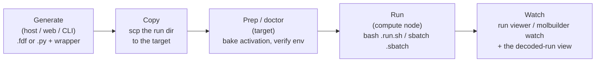
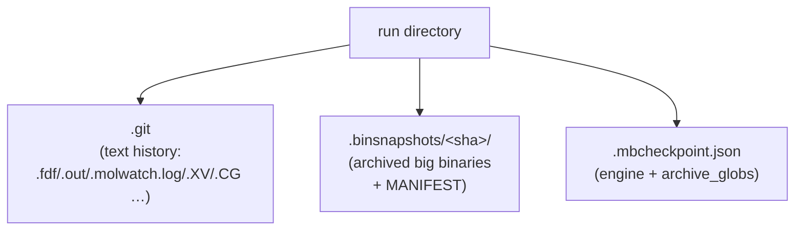

# Running a job — the usable single-job path

**Role:** guide
**Domain:** execution

**Companions:** [`execution/job-contracts.md`](?doc=execution/job-contracts.md)
— the on-disk formats this guide operates (the run directory, the wrapper
files, warm/cold restart, the config vocabulary);
[`execution/job-system.md`](?doc=execution/job-system.md) — the JobSet
framework that runs **batches** of jobs on top of this same wrapper;
[`execution/overview.md`](?doc=execution/overview.md) — the map and the
current → target status picture.

**This is the path that works today.** The web UI generates and installs a
run wrapper for **one** task at a time; the CLI does the same with
`molbuilder fdf` / `molbuilder pyscf` → `molbuilder run`. Everything here — the
self-contained wrapper, the runtime resource resolution, `molbuilder.json`
config, checkpoints, and watching a run — is shipped and usable now. Running
**many** parameterised jobs (sweeps, staged ladders, HPC deployment,
benchmarking) is the JobSet framework's job; it builds directly on the wrapper
described here, and is documented in `execution/job-system.md`.



The **host** where you generate need not be where you run: a run directory is
self-contained, so `scp -r my-job/` to a cluster and it still works. That
self-containment is a deliberate contract (§ 2).

---

## 1. What this guide owns — a reader's map

| If you need to… | Read § |
|---|---|
| Understand why the wrapper is self-contained and what it may read when | **§ 2 — The standalone contract** |
| Know how many MPI ranks / OMP threads a run actually uses, and how GPUs are pinned | **§ 3 — Runtime resource resolution** |
| See what flags `bash my-job.run.sh` accepts | **§ 3.4** |
| Watch a running job and read failure hints | **§ 4 — Watching a run** |
| Configure envs, activation, and the SLURM header via `molbuilder.json` | **§ 5 — Configuration** |
| Snapshot / restore a run directory | **§ 6 — Checkpointing** |

The on-disk shapes this guide drives — the run directory layout, the wrapper
files (`.run.sh` / `.sbatch`), warm/cold restart semantics, the config
vocabulary, and the persisted-artifact registry — are all defined in
[`execution/job-contracts.md`](?doc=execution/job-contracts.md). This guide
does not restate them; it explains how to *operate* them.

---

## 2. The standalone contract — a wrapper that runs anywhere

The single most important property of a generated run is that the wrapper is
**self-contained at runtime**: it reads no config, probes no toolchain, and has
no fallback path. Everything site-specific is **baked in** when the wrapper is
generated/prepped, so the compute node needs nothing but the files in the
directory. This is what lets you `scp` a run dir to a cluster, or hand it to a
collaborator, and have it run identically.

### 2.1 "Detection" — reading external state

"Detection" means reading state that is *not* in the run directory. There are
five kinds, and the contract governs **when** each may be read:

| Code | External state | Example |
|---|---|---|
| **T** | conda **T**ool availability | is `siesta` on `PATH` in the env? |
| **M** | HPC **M**odules | `module load mamba` |
| **C** | **C**onfig | `molbuilder.json` activation form + scheduler |
| **A** | **A**llocation | `SLURM_NTASKS`, `CUDA_VISIBLE_DEVICES` |
| **H** | **H**ardware topology | physical core count, GPU→NUMA node |

There are three moments in a job's life, and the rule is:

- **Generate / prep** — T, M, and C are resolved here and **baked** into the
  wrapper as literals. (Prep is also where the *doctor* verifies prerequisites.)
- **Runtime (on the compute node)** — reading T/M/C is **forbidden**; only **A**
  (the scheduler's allocation) and **H** (the local hardware) may be read, and
  only to *tune* the launch (rank counts, GPU pinning) or to log — never to
  decide whether the job can run.

So at runtime the wrapper never runs `which conda`, never reads
`molbuilder.json`, and never uses `conda run`. It emits the activation form
**verbatim** (`conda activate <env>` or `source activate <env>`) inside a
clean-shell bootstrap, then launches the engine.

### 2.2 The two "detection" jobs at prep time

- **Autodetect the activation method (workstation only).** On a personal
  machine, `molbuilder` can detect the conda base and emit
  `activation = "conda activate"` plus a `source "<base>/etc/profile.d/conda.sh"`
  preamble (the hook line is baked because a non-interactive
  `bash job.run.sh` never sources `~/.bashrc`, so `conda activate` would
  otherwise be undefined). On HPC this is *not* auto-detected — you declare it
  in config
  (`activation = "source activate"`, `preamble = "module load mamba/latest"`),
  because a login node's modules are not the compute node's.
- **Doctor (every target).** Verifies prerequisites — the engine env exists, the
  tool is present — and reports what is missing. It **never installs**; a
  missing GPU env, for instance, raises at generate time with an install hint
  rather than silently degrading.

### 2.2a What the wrapper may do — bash is a bootstrap, not a program

§ 2.1 already says it in passing: the wrapper emits the activation form verbatim
inside a clean-shell bootstrap, **then launches the engine**. That is the whole
job, and it is worth stating as a rule because it is easy to break by accretion.

> **The wrapper does two things: it makes the environment right, and it execs.
> Everything else belongs to Python, on the host, before the wrapper is ever
> invoked.**

**Why bash at all**, and why only these two:

- **Activation mutates the shell's own environment.** `conda activate` /
  `module load` change `PATH` and friends *in the calling process*. A Python
  child cannot do that for its parent, so this genuinely has to be shell.
- **The launcher must be the shell's direct child.** `mpirun` / `srun` want to
  inherit the activated environment and sit in the process tree where signals
  and scheduler accounting expect them.

Everything else — resolving which directory to run in, creating it, arranging
files, recording what happened — is **decision and arrangement**, and none of it
needs the activated environment. It is Python's.

**The test, when adding to a wrapper:** *does this need the activated shell?* If
it computes, decides, or arranges files, the answer is no and it belongs upstream.

> **One block looks like an exception and no longer is.** `runwrap.py`'s
> `carry_deref` replaces an inherited restart-file symlink with a real local copy
> at run start. That exists because `jobset` can submit a whole chain at once, in
> which case the producer has not run when the links are laid, and the only
> moment to make them real is on the compute node. It stays for that path. But
> the staged framework **does not submit chains** — each stage is set up
> separately, after the previous one finished
> ([`project-layout.md`](?doc=execution/project-layout.md) § 1.6) — so its files
> are copied for real at setup, and nothing needs swapping later. The exception
> belongs to the chained ladder, not to this design.

**This is forced, not stylistic.** Two facts make the compute node the wrong
place for logic:

- **molbuilder is not installed there.** The wrapper is self-contained at run
  time by design (§ 2).
- **There may be no Python at all.** `molbuilder-siesta` declares
  `siesta`, `numactl`, `git` and nothing else — verified: the env has no
  `python`. Any logic written to run there is either shell, or a shipped
  stdlib-only file, or broken. `mb_monitor.py` is the one deliberate exception —
  it is a *subprocess of the running job*, watching output from inside, so it has
  nowhere else to live. That is why it is stdlib-only, and it is not a pattern to
  copy for anything that could run on the host instead.

**One violation is live and is being retired.** `runwrap.py`'s `attempt_dirs`
prologue (2026-08-06) scans for run directories, creates one, symlinks the deck
and shared package in, and copies warm files — a second implementation of
`jobset/materialize.py` in shell, one level down. It moves to Python; see
[`project-layout.md`](?doc=execution/project-layout.md) § 1.6.

### 2.3 Env routing

The wrapper routes to a conda env by the script's extension, resolved at
generate time (`molbuilder/diagnostics.py`, `molbuilder/runwrap.py`):

- **`.fdf` → `molbuilder-siesta`**, launched with `mpirun -np N siesta`.
- **`.py` → `molbuilder-pySCF`**, launched with `python`.
- **`.fdf` that requests ELPA or GPU → `molbuilder-siesta-gpu`.** This is finer
  than "GPU jobs use the GPU env": **any** `Diag.Algorithm elpa*` (even
  CPU-ELPA) routes to `molbuilder-siesta-gpu`, because ELPA is linked only in
  that build. If the `.fdf` opts into GPU but that env is not installed,
  generation raises with an install hint.

The env **names** are overridable per category in `molbuilder.json` (`envs`,
§ 5.4); the four defaults are `molbuilder-siesta`, `molbuilder-siesta-gpu`,
`molbuilder-pySCF`, `molbuilder-MDtools`.

> The wrapper file shapes (`.run.sh` inner + `.sbatch` outer), the run-indexed
> output names, and warm/cold restart are defined in
> [`execution/job-contracts.md § 2.6, § 4`](?doc=execution/job-contracts.md).
> The sections below cover the *runtime behaviour* those files carry out.

---

## 3. Runtime resource resolution

Only the **launch** is assembled at run time (from A + H); everything else is
baked. Here is exactly how the wrapper decides ranks, threads, and GPU
placement.

### 3.1 MPI ranks (SIESTA)

SIESTA is launched with `mpirun -np N` when the build probe reports MPI. The
rank count `N` is resolved by precedence, **highest wins**:

```
-np / --np flag   >   MB_NP   >   SLURM_NTASKS   >   PBS_NP   >   generation default
```

When `mpi_np` was left auto at generation, the baked default is the machine's
**physical core count** — but **clamped to the atom count**. A run with more MPI
ranks than atoms aborts inside SIESTA at `propor IMAX = 0` (no `BlockSize` can
fix it), so the wrapper caps the auto default at `n_atoms` (parsed from
`NumberOfAtoms` in the `.fdf`) and prints a note. A user who *explicitly* sets
`mpi_np > n_atoms` is honoured but gets a loud runtime warning that SIESTA will
abort — the fix is to lower `mpi_np` to ≤ `n_atoms`.

### 3.2 OMP threads and BLAS

```
-omp / -t flag   >   OMP_NUM_THREADS   >   SLURM_CPUS_PER_TASK   >   policy default
```

For **CPU** SIESTA the policy default is `OMP=1` (mainline SIESTA is not
reliably OpenMP-aware, so ranks beat threads). BLAS is always pinned to a single
thread (`MKL_NUM_THREADS=1`, `OPENBLAS_NUM_THREADS=1`) to keep MPI×BLAS from
oversubscribing cores.

### 3.3 GPU mode: load-balance, MPS, and pinning

When the `.fdf` runs on GPU (ELPA-CUDA), the wrapper does substantially more at
launch (all in `molbuilder/runwrap.py`):

- **Load-balance.** Counts allocated GPUs (preferring `CUDA_VISIBLE_DEVICES`
  over `nvidia-smi -L`), sets `ranks_per_gpu = mpi_np / ngpu` (≥ 1), and prints a
  `GPU load-balance` line. GPU-mode rank/thread defaults are computed at runtime
  (rank default ≈ `physical_cores / 4`, capped at 4 with MPS — the ELPA-no-NCCL
  sweet spot; OMP fills the remaining GPU-core budget).
- **NVIDIA-MPS (Hyper-Q)** — the NVIDIA Multi-Process Service, which lets two or
  more MPI ranks share one GPU concurrently. Enabled only when (a)
  `nvidia-cuda-mps-control` is on `PATH`, (b) the user did not opt out
  (`--no-mps` or `MOLBUILDER_USE_MPS`), and (c) `ranks_per_gpu ≥ 2` (single-rank
  MPS is pointless and auto-disabled). The per-job MPS daemon is torn down by a
  single `EXIT` trap.
- **Per-rank GPU + NUMA pinning.** A generated helper assigns each rank a GPU
  (`CUDA_VISIBLE_DEVICES`) and, when the rank's cpuset spans more than one
  socket, pins it with `numactl` to the NUMA node that *owns* its GPU. The
  GPU→NUMA mapping is probed at **generation** time (NVML + sysfs) and baked as a
  literal, overridable at runtime with `MOLBUILDER_GPU_NUMA`. Opt out of socket
  pinning with `MB_NO_SOCKET_PIN=1`.

> **Override precedence, stated once:** `MOLBUILDER_MPI_NP` /
> `MOLBUILDER_OMP_NUM_THREADS` change the GPU-mode **defaults only** — an
> explicitly baked `mpi_np` still shadows them. The real *launch* overrides are
> `MB_NP` / `SLURM_NTASKS` (ranks) and the `-np` / `-omp` flags. (This is the
> distinction behind a historical "the sweep didn't sweep" bug: a batch that
> wants to vary ranks must set `MB_NP`, not `MOLBUILDER_MPI_NP`.)

### 3.4 The flags a wrapper accepts

| Flag | Engines | Effect |
|---|---|---|
| `--continue` / `-c` | both | advance the run index and warm-restart from `.DM`/`.CG`/`.XV` (SIESTA) or `.chk` (PySCF) |
| `--force` / `-f` | both | reset the run index to `-run0` (overwrite it); does **not** touch warm-start files |
| `--cold` / `--from-scratch` | both | move warm-start files aside before running (§ `job-contracts § 4`) |
| `-np` / `--np N` | SIESTA | override MPI ranks |
| `-omp` / `--omp` / `-t` / `--threads N` | SIESTA | override OMP threads |
| `--mps` / `--no-mps` | SIESTA (GPU) | force MPS on / off |
| `--dry-run` | both | print the resolved launch command + rank→GPU/NUMA map, then exit 0 |
| `-h` / `--help` | both | usage |

Unrecognised arguments are **rejected** (the wrapper exits 1) — only the flags
above are accepted, for either engine. The `.sbatch` outer file forwards
`"$@"`, so `sbatch my-job.sbatch --cold` still reaches the inner wrapper.

### 3.5 SIESTA auto-retry on non-convergence (opt-in)

A SIESTA wrapper installed **with a retry budget** (the Structure-optimization
tab's *retries* field → `/api/run/install-wrapper` `continue_retries`, capped
1–5) re-runs itself with `--continue` — the same warm restart you would type
by hand — when the run failed in one of the two *retriable* ways:

- **SCF didn't converge.** With `SCF.MustConverge` (SIESTA's default; the
  generated `.fdf` doesn't override it) SIESTA *aborts with a non-zero exit*
  after printing `SCF_NOT_CONV:` — but it has already banked the density
  matrix, so a warm `--continue` resumes SCF from that `.DM` with a fresh
  iteration budget.
- **The relaxation hit its step cap.** That run *exits 0* and prints
  `outcoor: Final (unrelaxed) atomic coordinates` (a converged relax prints
  `Relaxed…`); the retry resumes from the banked `.XV`/`.DM`/`.CG` with a
  fresh step budget.

Each retry advances the run index (`-run1`, `-run2`, …) exactly like a manual
`--continue`, re-runs with the **same** `-np`/`--omp` you launched with, and
is counted via the exported `MB_RETRY_N` so the budget is a hard bound. Crash
classes (propor `IMAX = 0`, generic aborts) are **never** retried — re-running
cannot fix a defective pseudopotential or a bad rank count. When the budget is
exhausted and the run is still unconverged, the wrapper says so on stderr and
(SCF case) keeps SIESTA's non-zero exit. Without a retry budget the wrapper
behaves exactly as before — `--continue` stays the manual path.

---

## 4. Watching a run

### 4.1 The wrapper's own instruments

- **A run banner** prints before the engine starts — date, host, cwd, conda
  env, engine binary + version, launch mode, threading, and (GPU mode) a single
  authoritative `GPU resources` line (`N ranks × M threads`, `mps=on/off`,
  `ranks/GPU`, `GPU0 NUMA`) plus an `nvidia-smi dmon` hint.
- **A combined session log.** The wrapper tees *all* of its own stdout and
  stderr to `<basename>.runwrap-<timestamp>.log`, so the full captured session
  (banner, launch line, engine output, hints) is always on disk even if you
  did not redirect it yourself.
- **A backgrounded monitor** (`mb_monitor.py`, shipped next to **`.fdf`** jobs)
  samples utilisation into `<basename>.util.csv` and `<basename>.monitor.log`
  every 5 s at `nice -n 19`, and is killed on exit. (Disable with
  `MB_MONITOR=0`.) A standalone `molbuilder monitor` CLI does the same for a job
  you point it at.
- **An SCF-timing tee** stamps every `scf:` line into
  `<basename>-runN.scf-timing.log` and reports total wall / iteration count,
  using `PIPESTATUS` so the tee never masks SIESTA's exit code.
- **Failure hints.** On a non-zero SIESTA exit that contains `propor: ERROR`,
  the wrapper prints a three-cause hint in priority order:
  1. a **defective or XC-mismatched pseudopotential** — check this *first* with
     `molbuilder pseudo check`;
  2. too many **MPI ranks** for the system — retry with a lower `-np`;
  3. **zero net spin** on an open-shell metal.

### 4.2 The decoded-run view

Pointing the run viewer (the web Results tab, or `molbuilder watch`) at a run
directory resolves the trajectory via the discovery chain in
[`job-contracts § 2.4`](?doc=execution/job-contracts.md) and then **decodes** the
directory into a single structured view.

The decoder is `decode_run_dir(run_dir)` → an in-memory `JobResult`
(`molbuilder/parse/dirs/job.py`). It is **SIESTA-only** today (it refuses a
`.py`-only directory) and produces one consolidated result per project
directory, with these fields:

- **`job_type`** — `optimization` / `spectrum` / `transport`, inferred from the
  script-contract BENCH-MARKS block or by sniffing the engine body
  (`MD.NumCGsteps` → optimization; `%block ProjectedDensityOfStates` → spectrum;
  `%block TS.Elec.*` → transport; conflicting matches raise
  `JobTypeAmbiguousError`).
- **`status`** — `running` / `stale` / `failed` / `finished`, derived from the
  SIESTA trajectory parser's run-state: `finished` once the run's end-of-run
  marker appears, `failed` when the parser reports an errored run (a fatal
  marker in the `.out`, or a torn run whose last SCF block did not converge),
  `running` while the active `.out` keeps growing, `stale` when it stops
  growing for > 60 s without finishing or failing.
- **`engine_body_summary`** — a fixed set of 25 curated SIESTA directives
  (System / SCF / XC / Solver / MD / k-mesh), emitted as **raw strings** with
  `null` for absent keys — the decoder never interprets or converts values.
- **`plots`** — per-stage buckets (etot/fmax per CG step, SCF residual/etot),
  keyed by `.out` filename so stage boundaries stay visible.
- **`progress`** — `current_cg_step`, `target_cg_steps`,
  `current_scf_iter_global`, `stages_completed`, `stages_total_known`.

The decoder is consumed today by the JobSet status layer
(`molbuilder/jobset/runstatus.py`, which calls `decode_run_dir` per stage to
report per-stage progress). It is exactly the decoder the planned web
run-viewer will reuse (the status note below).

> **Current status, stated honestly.** The directory decoder above is shipped
> and live. The larger design it was drafted inside — a background `JobMonitor`
> thread, `/api/jobs/{id}/decoded` + `decode-once` endpoints, a trigger/event
> model, webhook delivery, a persisted `webhook_log.jsonl`, and per-iteration
> **ETA** timing (`estimated_remaining_s` is a Phase-1 `None` stub) — is **not
> built and has been superseded**: the forward plan reuses *this* shipped
> decoder directly in the web front-end (see
> [`roadmap.md`](?doc=roadmap.md) workstream 1, "Batch execution reaches the
> web"), rather than a separate monitor/webhook service. (The standalone
> `molbuilder monitor` CLI poller in § 4.1 is a different, simpler subsystem —
> don't conflate the two.)

---

## 5. Configuration — `molbuilder.json`

The server reads config to bake site-specifics into wrappers. It is validated
by `molbuilder/runtime_config.py`; every section is optional, unknown keys are
ignored.

### 5.1 Where config lives, and merge order

- **Server-wide** `molbuilder.json` — looked up in the current directory first,
  then the XDG fallback (`$XDG_CONFIG_HOME/molbuilder/molbuilder.json`, else
  `~/.config/molbuilder/molbuilder.json`). Only one server-wide file is read.
- **Project** `.molbuilder.json` — in the project directory.
- **Merge** — objects deep-merge, scalars/arrays replace, and **project wins**.
  (`script_generation` has a bespoke merge: preambles concatenate server-then-
  project; activation is project-if-set-else-server.)

### 5.2 `script_generation` — activation is required to emit HPC wrappers

```json
{ "script_generation": {
    "preamble":   "module load mamba/latest",
    "activation": "source activate"
} }
```

Exactly two keys. `activation` must be `"source activate"` or
`"conda activate"` and has **no default** — if it is unset in every scope,
generating an HPC wrapper **refuses** with an operator message pointing here
(`require_activation`). `preamble` is arbitrary shell run before activation (the
`module load` lines). (Legacy `preactivate` is accepted as an alias for
`preamble` for one release; `preactivate_format` / `autodetect_conda` are
dropped with a warning.)

### 5.3 `scheduler` — the SLURM header source

```json
{ "scheduler": {
    "kind": "slurm",
    "directives": { "partition": "public", "qos": "public",
                    "mail_type": "ALL", "mail_user": "you@example.edu", "export": "NONE" },
    "gpu":      { "partition": "public", "default_type": "a100", "exclusive": false,
                  "mem": "64G", "mem_cap_per_gpu": "128G" },
    "defaults": { "time": "0-04:00:00", "cpus_per_task": 8, "mem": null },
    "mem_model": { "node_mem_gb": 500, "safety": 1.3, "extra_gb": 0 },
    "routing":  [ { "name": "short", "max_time": "0-04:00:00",
                    "partition": "public", "qos": "public" } ]
} }
```

- **`kind`** is `slurm` (the only supported scheduler today).
- **`directives`** — `partition` and `qos` are **required non-empty** for a
  SLURM site (else the `.sbatch` refuses to emit); `mail_type` / `mail_user` /
  `export` are optional; unknown keys pass through. Use a **literal**
  `mail_user` — SLURM's `%u` / `%j` patterns expand only in `-o` / `-e`
  filenames, never in `--mail-user`, so `"%u@…"` is sent literally and bounces
  (the emitter warns when it sees a `%`).
- **`gpu`** — `{partition, default_type, exclusive, mem, mem_cap_per_gpu}`. A
  GPU job routes its `-p` to `gpu.partition` and takes
  `--gres=gpu:<default_type>:<count>`. `mem` and `mem_cap_per_gpu` are the
  GPU memory **band** — a floor and a per-GPU ceiling on the job's `--mem`
  (§ 5.3.1). `exclusive: false` is the recommended HPC default: GPU nodes are
  shared multi-GPU boxes, and a job kept inside its proportional share
  backfills far sooner (and burns far less fairshare) than one reserving a
  whole node — reserve `exclusive: true` for benchmark-grade timings.
- **`defaults`** — job-agnostic `{time, cpus_per_task, mem}` fallbacks.
- **`mem_model`** — numeric coefficients for the per-job memory estimator
  (`molbuilder/siesta/memory.py`).
- **`routing`** — a menu of named domains
  `{name, max_time, max_mem_gb?, partition, qos, gpu_partition?}`; order is the
  recommendation order. A domain resolves to `-p`/`-q` when a run is *submitted*
  through it (`execution.domain` / `--domain`); the framework hard-codes no
  names or limits.

**What the `.sbatch` header carries** (`render_sbatch`): a fixed `-J <basename>`,
`-N 1`, `-n <ranks>`, `-o slurm.%j.out` / `-e slurm.%j.err`; `-c` / `-t` from
`defaults` (or caller); `-p` / `-q` from `directives` (GPU → `gpu.partition`);
for GPU jobs `--gres=gpu:<type>:<count>` + `--gres-flags=enforce-binding`; and
memory per § 5.3.1. The body is a single line — `bash <basename>.run.sh "$@"` —
because the inner wrapper owns activation and launch. Emission is gated on a
`scheduler` block being present; with none, only the `.run.sh` is written.

#### 5.3.1 Memory resolution (one sizing path + a GPU band)

The *amount* a job needs is job-specific and identical physics on CPU and
GPU, so there is **one sizing path** for both:

1. an explicit `--mem` (a hard override — never floored, never capped), else
2. `defaults.mem` if set (a site-wide override for all jobs), else
3. a per-job estimate from the `.fdf` problem size (scaled by rank count, via
   `mem_model`), emitted with a `# --mem auto-estimated …` comment.

What *differs* on GPU nodes is the **hardware context**, so a non-exclusive
GPU job then clamps the sized value into the `gpu` band:

- **Floor = `gpu.mem`** (e.g. `"64G"`). HPC sites grant a tight per-GPU
  host-RAM default when `--mem` is absent (Sol: 24 GiB/GPU) — too small for
  a dense SIESTA diagonalization's host-side matrices.
- **Ceiling = `gpu.mem_cap_per_gpu` × GPUs requested** (e.g. `"128G"` ×
  n). GPU nodes are shared multi-GPU boxes (Sol A100 nodes: 48 cores /
  512 GiB / 4 GPUs → 128 GiB is one GPU's proportional share). A job inside
  its share backfills beside other GPU jobs; a job that grabs most of the
  node's RAM blockades the remaining GPUs — queue wait *and* fairshare
  charge (Sol bills 1 CHE per 4 GiB-hour) both scale with the request.
  When the cap bites, the emitted header says so and names the options:
  request more GPUs (the cap scales), run `--exclusive`, or take the CPU
  route.

Estimation is best-effort and never blocks emission; on any failure a GPU
job falls back to the floor and a CPU job to the partition default. An
**exclusive** job ignores all of this and takes the whole node (`--mem=0`).

### 5.4 `execution` and `envs`

- **`execution`** — `{mode, submit_via, domain}`. `mode` is `direct` (run in
  place) or `submit` (through the scheduler); this, not the detected scheduler,
  is what gates `.sbatch` submission. `domain` names a `routing` entry.
- **`envs`** — overrides the conda env name per category
  (`{"siesta": "my-siesta-env", …}`); unset categories use the four defaults
  (§ 2.3).

Config is written at mode `0600` by `write_config_scope` (deep-merge a patch
onto the chosen scope, re-validate, then write in place).

---

## 6. Checkpointing a run — `molbuilder snapshot`

A run directory can be put under a lightweight, git-backed checkpoint system so
you can snapshot converged states, tag "ready for transport", branch a
what-if, and restore — with the large binary outputs handled separately from
the text history.



### 6.1 The model

- **`.mbcheckpoint.json`** (`molbuilder/checkpoint-config@1`, git-tracked) holds
  the `engine` and the `archive_globs` — the classification of which files are
  "big binaries" archived by content rather than committed to git. Engine
  defaults: SIESTA `*.DM` `*.HSX` `*.TSHS` `*.TBT.AVTRANS_*` `*.TBT.CC`
  `*.TBT.DOS`; PySCF `*.chk` `*.cube`.
  > ⚠ **This is what ships, not where it is going.** The classification moves
  > into molbuilder's own config, one home for every folder, and the store is
  > chosen by **measuring** a file rather than matching its name
  > ([`checkpointing.md`](?doc=execution/checkpointing.md) S1b, S1c). Nothing
  > already archived is affected — a restore replays what the save recorded and
  > reads no configuration at all (I2a).
- **Text is git-tracked**, including small warm-restart files (`.XV`, `.CG`) so
  a restore brings back a resumable state; big binaries are **gitignored** and
  archived under `.binsnapshots/<full-sha>/` with a `MANIFEST`
  (`<sha256>  <bytes>  <name>`, 3-column — see
  [`job-contracts.md § 6.1`](?doc=execution/job-contracts.md)). **Content
  already archived is hard-linked rather than copied**, so checkpointing a
  folder whose binaries did not change costs no disk
  ([`checkpointing.md`](?doc=execution/checkpointing.md) § 12, *Disk cost*).
- **Checkpoint** = `git add .` → commit → atomically archive the current
  binaries (build in a `.tmp`, hash, copy, re-hash and *verify the copy*, write
  MANIFEST, then `os.replace`).
- **Restore = verify-before-mutate.** It refuses on an unknown ref and on an
  archive that does not verify — **before touching anything** — then `git
  restore`s the worktree and copies the verified binaries back. A restore does
  **not** move `HEAD`: the folder rewinds, the history does not, and your next
  checkpoint carries the rewound state forward
  ([`checkpointing.md`](?doc=execution/checkpointing.md) § 7.1).
  > ⚠ **Two things here are the shipped behaviour and not the contract.**
  > *Unsaved work:* today a dirty text tree or a changed big file is a **flat
  > refusal**. The rule is that it warns, names exactly what will be lost, and
  > then obeys `yes` or `--force` — checkpoint is not responsible for work you
  > never saved, and it never stashes or sets anything aside (A5).
  > *`--no-binaries`:* it ships, and it should not. It rewinds the text and
  > leaves every big file, which is a folder no save ever produced; it also
  > skips the archive verification. To read one old file, use `git show
  > <ref>:<path>`, which touches nothing (A4).

### 6.2 The CLI

```
molbuilder snapshot init --engine siesta            # seed .mbcheckpoint.json + .gitignore
molbuilder snapshot config --set '*.DM,*.HSX,*.chk' # edit the archived-glob set
molbuilder snapshot checkpoint -m "stage 3 converged"
molbuilder snapshot tag stage3-converged -m "ready for transport"
molbuilder snapshot branch what-if-tighter
molbuilder snapshot list -n 20
molbuilder snapshot restore stage3-converged        # verify archive -> git restore -> copy binaries
```

The same operations are exposed over HTTP (`/api/checkpoint/*`: `state`, `list`,
`diff`, `config` GET; `init`, `config`, `commit`, `tag`, `branch`, `restore`,
POST) and in the projects-sidebar run-history panel.

> **Current status.** The `Repo` core, the `molbuilder snapshot` CLI (including
> `branch`), the HTTP routes, and the sidebar panel — with its lazy-loaded
> commit-graph viewer — are shipped and tested. `branch` gained its HTTP route on 2026-08-06
> (`POST /api/checkpoint/branch`); the **control that drives it** is still the
> tab's to build ([`roadmap.md`](?doc=roadmap.md) workstream 1, Phase 2). A few items from
> the original design remain **unbuilt**: archive pruning (`prune`), a
> `snapshot verify` verb (the check exists and is reachable only by attempting a
> restore, which is the worst moment to learn an archive is gone), a
> `snapshot diff` *CLI* face (`diff` exists in Python and over HTTP, just not as
> a subcommand), the wrapper-auto-bootstraps-git "Path B" (dropped — the wrapper
> is deliberately git-agnostic, so init is CLI/UI-only), and a git-snippet
> library.
>
> **What this section still describes and the contract has moved past** is
> flagged inline above, and tracked with a status per rule in
> [`checkpointing.md`](?doc=execution/checkpointing.md) § 12: the store chosen by
> size rather than name (S1b), one molbuilder-wide classification instead of a
> per-folder file (S1c), a restore that warns rather than refuses (A5), and the
> removal of `--no-binaries` (A4).

---

## 7. A note on the design that superseded the cookbook

The original single-job doc carried a benchmark/sweep cookbook and two large
implementation-design sections. Those have been overtaken: the batch/sweep,
HPC-deployment, and benchmarking workflow is now the **JobSet framework**
(`execution/job-system.md`), which self-bootstraps `molbuilder` on the target
and drives the whole matrix through one entry point rather than shipping a
standalone `mbbench/` library or static per-point scripts. The single-job
wrapper on this page is the primitive that framework runs; the framework, its
`bench-manifest@2`, the `(G, K, c)` grid, routing domains, and submit-vs-direct
execution are documented there.
