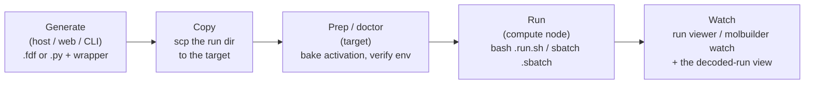
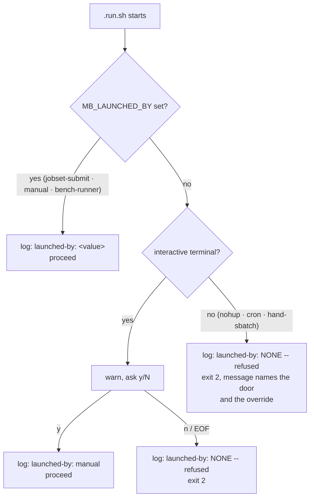
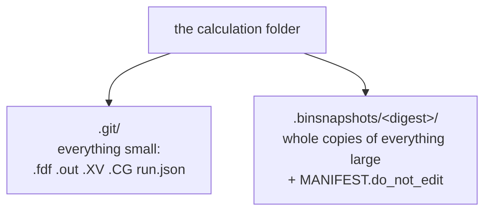

# Running a job — the usable single-job path

**Role:** guide
**Domain:** execution

**Companions:** [`execution/job-contracts.md`](?doc=execution/job-contracts.md)
— the on-disk formats this guide operates (the run directory, the wrapper
files, warm/cold restart, the config vocabulary);
[`execution/job-system.md`](?doc=execution/job-system.md) — the JobSet
framework that runs **batches** of jobs on top of this same wrapper;
[`execution/overview.md`](?doc=execution/overview.md) — the map and the
current → target status picture.

**This is the path that works today.** One task is
`molbuilder jobset prep` then `molbuilder jobset submit --mode direct` — **a
job set of one, through the same commands as a hundred** (there is no
`molbuilder run`; decided 2026-08-11). The browser's part is the description
(the hand-over + Task setup — [`web/task-setup.md`](?doc=web/task-setup.md));
prep and submit run where the machine is. *(A legacy web install-wrapper
endpoint survives as the low-level side door the described route supersedes —
`job-contracts.md § 2.6`'s note.)* Everything here — the
self-contained wrapper, the runtime resource resolution, `molbuilder.json`
config, checkpoints, and watching a run — is shipped and usable now. Running
**many** parameterised jobs (sweeps, staged ladders, HPC deployment,
benchmarking) is the JobSet framework's job; it builds directly on the wrapper
described here, and is documented in `execution/job-system.md`.



The **host** where you generate need not be where you run: a run directory is
self-contained, so `scp -r my-job/` to a cluster and it still works. That
self-containment is a deliberate contract (§ 2).

---

## 1. What this guide owns — a reader's map

| If you need to… | Read § |
|---|---|
| Understand why the wrapper is self-contained and what it may read when | **§ 2 — The standalone contract** |
| Know how many MPI ranks / OMP threads a run actually uses, and how GPUs are pinned | **§ 3 — Runtime resource resolution** |
| See what flags `bash my-job.run.sh` accepts | **§ 3.4** |
| Watch a running job and read failure hints | **§ 4 — Watching a run** |
| Configure envs, activation, and the SLURM header via `molbuilder.json` | **§ 5 — Configuration** |
| Snapshot / restore a run directory | **§ 6 — Checkpointing** |

The on-disk shapes this guide drives — the run directory layout, the wrapper
files (`.run.sh` / `.sbatch`), warm/cold restart semantics, the config
vocabulary, and the persisted-artifact registry — are all defined in
[`execution/job-contracts.md`](?doc=execution/job-contracts.md). This guide
does not restate them; it explains how to *operate* them.

---

## 2. The standalone contract — a wrapper that runs anywhere

The single most important property of a generated run is that the wrapper is
**self-contained at runtime**: it reads no config, probes no toolchain, and has
no fallback path. Everything site-specific is **baked in** when the wrapper is
generated/prepped, so the compute node needs nothing but the files in the
directory. This is what lets you `scp` a run dir to a cluster, or hand it to a
collaborator, and have it run identically.

### 2.1 "Detection" — reading external state

"Detection" means reading state that is *not* in the run directory. There are
five kinds, and the contract governs **when** each may be read:

| Code | External state | Example |
|---|---|---|
| **T** | conda **T**ool availability | is `siesta` on `PATH` in the env? |
| **M** | HPC **M**odules | `module load mamba` |
| **C** | **C**onfig | `molbuilder.json` activation form + scheduler |
| **A** | **A**llocation | `SLURM_NTASKS`, `CUDA_VISIBLE_DEVICES` |
| **H** | **H**ardware topology | physical core count, GPU→NUMA node |

There are three moments in a job's life, and the rule is:

- **Generate / prep** — T, M, and C are resolved here and **baked** into the
  wrapper as literals. (Prep is also where the *doctor* verifies prerequisites.)
- **Runtime (on the compute node)** — reading T/M/C is **forbidden**; only **A**
  (the scheduler's allocation) and **H** (the local hardware) may be read, and
  only to *tune* the launch (rank counts, GPU pinning) or to log — never to
  decide whether the job can run.

So at runtime the wrapper never runs `which conda`, never reads
`molbuilder.json`, and never uses `conda run`. It emits the activation form
**verbatim** (`conda activate <env>` or `source activate <env>`) inside a
clean-shell bootstrap, then launches the engine.

### 2.2 The two "detection" jobs at prep time

- **Autodetect the activation method (workstation only).** On a personal
  machine, `molbuilder` can detect the conda base and emit
  `activation = "conda activate"` plus a `source "<base>/etc/profile.d/conda.sh"`
  preamble (the hook line is baked because a non-interactive
  `bash job.run.sh` never sources `~/.bashrc`, so `conda activate` would
  otherwise be undefined). On HPC this is *not* auto-detected — you declare it
  in config
  (`activation = "source activate"`, `preamble = "module load mamba/latest"`),
  because a login node's modules are not the compute node's.
- **Doctor (every target).** Verifies prerequisites — the engine env exists, the
  tool is present — and reports what is missing. It **never installs**; a
  missing GPU env, for instance, raises at generate time with an install hint
  rather than silently degrading.

### 2.2a What the wrapper may do — bash is a bootstrap, not a program

§ 2.1 already says it in passing: the wrapper emits the activation form verbatim
inside a clean-shell bootstrap, **then launches the engine**. That is the whole
job, and it is worth stating as a rule because it is easy to break by accretion.

> **The wrapper does two things: it makes the environment right, and it execs.
> Everything else belongs to Python, on the host, before the wrapper is ever
> invoked.**

**Why bash at all**, and why only these two:

- **Activation mutates the shell's own environment.** `conda activate` /
  `module load` change `PATH` and friends *in the calling process*. A Python
  child cannot do that for its parent, so this genuinely has to be shell.
- **The launcher must be the shell's direct child.** `mpirun` / `srun` want to
  inherit the activated environment and sit in the process tree where signals
  and scheduler accounting expect them.

Everything else — resolving which directory to run in, creating it, arranging
files, recording what happened — is **decision and arrangement**, and none of it
needs the activated environment. It is Python's.

**The test, when adding to a wrapper:** *does this need the activated shell?* If
it computes, decides, or arranges files, the answer is no and it belongs upstream.

> **The rule holds with no exception**, and the reason it can is that nothing
> arrives at a run directory needing to be resolved. What a stage continues
> from is a **real file, copied in at `prep`** from the run you name
> ([`project-layout.md`](?doc=execution/project-layout.md) § 1.6) — present and
> local before the wrapper starts. There is nothing for bash to dereference,
> localize or wait for. (A wrapper block that did such work for an earlier
> design: `archive/2026-08-10-stage-chaining.md`.)

**This is forced, not stylistic.** Two facts make the compute node the wrong
place for logic:

- **molbuilder is not installed there.** The wrapper is self-contained at run
  time by design (§ 2).
- **There may be no Python at all.** `molbuilder-siesta` declares
  `siesta`, `numactl`, `git` and nothing else — verified: the env has no
  `python`. Any logic written to run there is either shell, or a shipped
  stdlib-only file, or broken. `mb_monitor.py` is the one deliberate exception —
  it is a *subprocess of the running job*, watching output from inside, so it has
  nowhere else to live. That is why it is stdlib-only, and it is not a pattern to
  copy for anything that could run on the host instead.

**The one violation is gone (2026-08-10).** `runwrap.py`'s `attempt_dirs`
prologue (2026-08-06) scanned for run directories, created one, symlinked the
deck and shared package in, copied warm files and `cd`'d in — a second
implementation of `jobset/materialize.py` in shell, one level down. **It was
also the only place in the system that changed directory**, so retiring it
restored the rule above rather than tidying it: **no generated wrapper contains
a `cd` at all**, on either engine. The behaviour it established is right and
lives in `jobset/materialize.py::prepare_attempt`, in Python, where the layout
layer owns it. See [`project-layout.md`](?doc=execution/project-layout.md)
§ 1.6 and invariant 6a.

### 2.3 Env routing

The wrapper routes to a conda env by the script's extension, resolved at
generate time (`molbuilder/diagnostics.py`, `molbuilder/runwrap.py`):

- **`.fdf` → `molbuilder-siesta`**, launched with `mpirun -np N siesta`.
- **`.py` → `molbuilder-pySCF`**, launched with `python`.
- **`.fdf` that requests GPU → `molbuilder-siesta-gpu`.** Only
  `Diag.ELPA.GPU true` re-routes. **CPU-ELPA does not** — the packaged SIESTA
  carries ELPA through ELSI and runs both stages on CPU (measured; see
  [`engines/siesta.md`](?doc=engines/siesta.md) § 7.2). The two envs differ by
  **provenance** — one installs from packages anywhere, the other must be built
  from source — so routing CPU-ELPA to the source build used to refuse a
  runnable calculation wherever compiling is not allowed. If the `.fdf` opts
  into GPU but that env is not installed, generation raises with an install
  hint. An env named explicitly always wins over the route.

The env **names** are overridable per category in `molbuilder.json` (`envs`,
§ 5.4); the four defaults are `molbuilder-siesta`, `molbuilder-siesta-gpu`,
`molbuilder-pySCF`, `molbuilder-MDtools`.

> The wrapper file shapes (`.run.sh` inner + `.sbatch` outer), the run-indexed
> output names, and warm/cold restart are defined in
> [`execution/job-contracts.md § 2.6, § 4`](?doc=execution/job-contracts.md).
> The sections below cover the *runtime behaviour* those files carry out.

---

## 3. Runtime resource resolution

Only the **launch** is assembled at run time (from A + H); everything else is
baked. Here is exactly how the wrapper decides ranks, threads, and GPU
placement.

### 3.1 MPI ranks (SIESTA)

SIESTA is launched with `mpirun -np N` when the build probe reports MPI. The
rank count `N` is resolved by precedence, **highest wins**:

```
-np / --np flag   >   MB_NP   >   SLURM_NTASKS   >   PBS_NP   >   generation default
```

When `mpi_np` was left auto at generation, the baked default is the machine's
**physical core count**, **clamped to the atom count** (`n_atoms`, parsed from
`NumberOfAtoms` in the `.fdf`), with a printed note. A user who *explicitly*
sets `mpi_np > n_atoms` is honoured and warned.

> **The auto-rank `.sbatch` floor (F15, recorded 2026-08-13).** A GPU job
> generated with auto ranks writes `#SBATCH -n <gpu count>` as a header
> floor — and inside the job, `SLURM_NTASKS` from that floor outranks the
> runtime GPU policy, so the job runs at the floor, not the policy.  This
> path is unreachable in the jobset workflow (prep always resolves an
> explicit rank count) and moot wherever `mpi_np` is set explicitly — the
> project's practice.  The guard for the remaining case is the `--dry-run`
> inspection: it names each value's source and warns when the sibling
> header's `-n` disagrees with the resolved count, so the mistake cannot
> pass the check you run before spending a queue slot.

> ### ⚠ The clamp is a heuristic guard, not the mechanism — corrected 2026-08-11
>
> This section used to say *"a run with more MPI ranks than atoms **aborts**
> inside SIESTA at `propor IMAX = 0` (no `BlockSize` can fix it)"*, presenting
> the atom count as the physical constraint. **The project's own empirical sweep
> says otherwise**, and it is recorded in
> `siesta/input.py::_auto_block_size`'s 2026-05-28 note:
>
> | | |
> |---|---|
> | **where the crash is** | `matel_table.F90`'s MPI de-duplication of **radial-function tables** — not in any BLACS distribution |
> | **what it depends on** | `mpi_np` against the molecule's **species count and radial-table size** |
> | **what it does not depend on** | `BlockSize` — *"SIESTA crashes identically with BlockSize = 1, 2, 4 at `mpi_np` = 15 on hemeC-dithiol"* |
>
> So `n_atoms` is **not** the quantity the failure is a function of. It is a
> cheap, usually-conservative proxy: a molecule with few species and many atoms
> can exceed it safely, and one with many species and few atoms can crash below
> it. **The clamp is worth keeping** — it costs nothing and prevents the common
> case — but stating it as the mechanism is what made a *guess* read as physics,
> and would send someone with a `propor` crash to lower their rank count when
> their species count is what matters.
>
> **This is the second place `n_atoms` stood where a different quantity belongs.**
> The first was `BlockSize`'s bound, which is **orbitals** over ranks
> ([`tuning.md § 2.11`](?doc=engines/tuning.md), settled 2026-08-11) — and note
> that the two are *different* corrections, not one: the block bound is about
> **matrix distribution**, this is about **radial tables**. What they share is a
> habit of reaching for the atom count because it is the number to hand.
>
> **What is not settled**, and is recorded rather than guessed: whether the auto
> clamp should become a species-aware bound, and what the wrapper's post-run
> `propor` hint should say instead of *"too many MPI ranks"*
> ([`staged-runs-implementation-plan.md`](?doc=plans/staged-runs-implementation-plan.md)
> § 5g, C12). The `.fdf` carries `NumberOfSpecies`, so the input exists.
>
> **And `propor: IMAX = 0` has at least three causes, only one of which is
> ranks.** The wrapper's own failure hint (§ 4.1) already orders them correctly
> and this section did not: a **defective or XC-mismatched pseudopotential**
> ([`science/pseudopotentials.md`](?doc=science/pseudopotentials.md)), the rank
> count against the species/radial tables, and **zero net spin on an open-shell
> metal** ([`science/overview.md`](?doc=science/overview.md) § 4). Reading § 3.1
> alone, a user met one cause presented as *the* cause — and it is the one the
> hint list deliberately ranks **second**, because the pseudopotential is both
> commoner and cheaper to check.

### 3.2 OMP threads and BLAS

```
-omp / -t flag   >   OMP_NUM_THREADS   >   SLURM_CPUS_PER_TASK   >   policy default
```

For **CPU** SIESTA the policy default is `OMP=1` (mainline SIESTA is not
reliably OpenMP-aware, so ranks beat threads). BLAS is always pinned to a single
thread (`MKL_NUM_THREADS=1`, `OPENBLAS_NUM_THREADS=1`) to keep MPI×BLAS from
oversubscribing cores.

### 3.3 GPU mode: load-balance, MPS, and pinning

When the `.fdf` runs on GPU (ELPA-CUDA), the wrapper does substantially more at
launch (all in `molbuilder/runwrap.py`):

- **Load-balance.** Counts allocated GPUs (preferring `CUDA_VISIBLE_DEVICES`
  over `nvidia-smi -L`), sets `ranks_per_gpu = mpi_np / ngpu` (≥ 1), and prints a
  `GPU load-balance` line. GPU-mode rank/thread defaults are computed at runtime
  (rank default ≈ `physical_cores / 4`, capped at 4 with MPS — the ELPA-no-NCCL
  sweet spot; without MPS the policy drops to 2 ranks on dual-socket or
  ≥ 16-core-socket boxes, else 1). The auto-OMP width fills the GPU-core
  budget **divided by the effective rank count, settled after all flags are
  parsed** (2026-08-12): `--mps`/`--no-mps` re-derive the regime's *defaults*,
  and an explicit `-np`/`-omp` is never clobbered by that re-derivation —
  before this, `-np 9 --no-mps` ran 2 ranks, and the width could pair 9 ranks
  with the 2-rank thread count.
- **NVIDIA-MPS (Hyper-Q)** — the NVIDIA Multi-Process Service, which lets two or
  more MPI ranks share one GPU concurrently. Enabled only when (a)
  `nvidia-cuda-mps-control` is on `PATH`, (b) the user did not opt out
  (`--no-mps` or `MOLBUILDER_USE_MPS`), and (c) there are more ranks than
  GPUs — the moment sharing actually happens (D18a; until 2026-08-13 this
  bullet still described the RETIRED `ranks_per_gpu ≥ 2` gate, which
  mis-fired exactly when ranks and GPUs were equal).  Single-GPU-per-rank
  runs need no MPS and get none. The per-job MPS daemon is torn down by a
  single `EXIT` trap.
- **Per-rank GPU + NUMA pinning.** A generated helper assigns each rank a GPU
  (`CUDA_VISIBLE_DEVICES`) and, when the rank's cpuset spans more than one
  socket, pins it with `numactl` to the NUMA node that *owns* its GPU — **the
  helper probes that mapping itself, per rank, at run time** (nvidia-smi +
  sysfs). Opt out of socket pinning with `MB_NO_SOCKET_PIN=1`.  Separately,
  the **whole-job** `numactl` wrap (single-GPU, off-SLURM only — it is
  cleared under SLURM and for multi-GPU runs, where one node cannot own
  every rank) uses a GPU→NUMA answer probed at **generation** time (NVML +
  sysfs), baked as a literal and overridable with `MOLBUILDER_GPU_NUMA`.
  *(Until 2026-08-12 this bullet put the baked literal and the override
  inside the per-rank story — the per-rank helper reads neither; the
  override's whole reach is the whole-job wrap.)*

> **Override precedence, stated once:** `MOLBUILDER_MPI_NP` /
> `MOLBUILDER_OMP_NUM_THREADS` change the GPU-mode **defaults only** — an
> explicitly baked `mpi_np` still shadows them. The real *launch* overrides are
> `MB_NP` / `SLURM_NTASKS` (ranks) and the `-np` / `-omp` flags. (This is the
> distinction behind a historical "the sweep didn't sweep" bug: a batch that
> wants to vary ranks must set `MB_NP`, not `MOLBUILDER_MPI_NP`.)

### 3.4 The flags a wrapper accepts

| Flag | Engines | Effect |
|---|---|---|
| `--continue` / `-c` | both | advance the run index and warm-restart from `.DM`/`.CG`/`.XV` (SIESTA) or `.chk` (PySCF) |
| `--force` / `-f` | both | reset the run index to `-run0` (overwrite it); does **not** touch warm-start files. Also what says *yes, overwrite* to `--cold`'s refusal |
| `--cold` / `--from-scratch` | both | start the engine from the deck alone, **overwriting** the prior state it names (§ `job-contracts § 4`). Names the files and **refuses**; `--force` proceeds |
| `-np` / `--np N` | SIESTA | override MPI ranks |
| `-omp` / `--omp` / `-t` / `--threads N` | SIESTA | override OMP threads |
| `--mps` / `--no-mps` | SIESTA (GPU) | force MPS on / off |
| `--dry-run` | both | print the resolved launch command + rank→GPU/NUMA map, then exit 0 |
| `-h` / `--help` | both | usage |

> **`--cold` refuses before it overwrites, and that is the whole of the safety
> net.** It prints every file the run would overwrite, tells you to save the
> state first with `molbuilder checkpoint save`, and exits 1 having changed
> nothing. Run it again with `--force` and the same list is printed and the run
> proceeds. It *moved* those files into a timestamped `…-restart-aside-<UTC>/`
> folder until 2026-08-18; keeping a state is the checkpoint tool's job and it
> is never automatic ([`checkpointing.md § 2`](?doc=execution/checkpointing.md)).
>
> It works the same under `sbatch`: a refusal fails the job immediately with the
> reason in the log, where a prompt would simply hang.

Unrecognised arguments are **rejected** (the wrapper exits 1) — only the flags
above are accepted, for either engine. The `.sbatch` outer file forwards
`"$@"`, so `sbatch my-job.sbatch --cold` still reaches the inner wrapper.

### 3.5 SIESTA auto-retry on non-convergence (opt-in)

A SIESTA wrapper installed **with a retry budget** (the Structure-optimization
tab's *retries* field → `/api/run/install-wrapper` `continue_retries`, capped
1–5) re-runs itself with `--continue` — the same warm restart you would type
by hand — when the run failed in one of the two *retriable* ways:

- **SCF didn't converge.** With `SCF.MustConverge` (SIESTA's default; the
  generated `.fdf` doesn't override it) SIESTA *aborts with a non-zero exit*
  after printing `SCF_NOT_CONV:` — but it has already banked the density
  matrix, so a warm `--continue` resumes SCF from that `.DM` with a fresh
  iteration budget.
- **The relaxation hit its step cap.** That run *exits 0* and prints
  `outcoor: Final (unrelaxed) atomic coordinates` (a converged relax prints
  `Relaxed…`); the retry resumes from the banked `.XV`/`.DM`/`.CG` with a
  fresh step budget.

Each retry advances the run index (`-run1`, `-run2`, …) exactly like a manual
`--continue`, re-runs with the **same** `-np`/`--omp` you launched with, and
is counted via the exported `MB_RETRY_N` so the budget is a hard bound. Crash
classes (propor `IMAX = 0`, generic aborts) are **never** retried — re-running
cannot fix a defective pseudopotential or a bad rank count. When the budget is
exhausted and the run is still unconverged, the wrapper says so on stderr and
(SCF case) keeps SIESTA's non-zero exit. Without a retry budget the wrapper
behaves exactly as before — `--continue` stays the manual path.

---

## 4. Watching a run

### 4.1 The wrapper's own instruments

- **A run banner** prints before the engine starts — date, host, cwd, conda
  env, engine binary + version, launch mode, threading, and (GPU mode) a single
  authoritative `GPU resources` line (`N ranks × M threads`, `mps=on/off`,
  `ranks/GPU`, `GPU0 NUMA`) plus an `nvidia-smi dmon` hint.
- **A combined session log.** The wrapper tees *all* of its own stdout and
  stderr to `<basename>.runwrap-<timestamp>.log`, so the full captured session
  (banner, launch line, engine output, hints) is always on disk even if you
  did not redirect it yourself.
- **A backgrounded monitor** (`mb_monitor.py`, shipped next to **`.fdf`** jobs)
  samples utilisation into `<basename>.util.csv` and `<basename>.monitor.log`
  every 5 s at `nice -n 19`, and is killed on exit. (Disable with
  `MB_MONITOR=0`.) A standalone `molbuilder monitor` CLI does the same for a job
  you point it at.
- **An SCF-timing tee** stamps every `scf:` line into
  `<basename>-runN.scf-timing.log` and reports total wall / iteration count,
  using `PIPESTATUS` so the tee never masks SIESTA's exit code.
- **Failure hints.** On a non-zero SIESTA exit that contains `propor: ERROR`,
  the wrapper prints a three-cause hint in priority order:
  1. a **defective or XC-mismatched pseudopotential** — check this *first* with
     `molbuilder pseudo check`;
  2. too many **MPI ranks** for the system — retry with a lower `-np`;
  3. **zero net spin** on an open-shell metal.

### 4.2 The decoded-run view

Pointing the run viewer (the web Results tab, or `molbuilder watch`) at a run
directory resolves the trajectory via the discovery chain in
[`job-contracts § 2.4`](?doc=execution/job-contracts.md) and then **decodes** the
directory into a single structured view.

The decoder is `decode_run_dir(run_dir)` → an in-memory `JobResult`
(`molbuilder/parse/dirs/job.py`). It claims any directory holding a `.fdf`
**or a molwatch log** — which is how a PySCF attempt, whose deck is a `.py`,
is decoded (shipped 2026-08-19; the claim rule's own note records the 2026-06
deferral it closed). The curated engine-body summary and the plots remain
SIESTA's; a PySCF attempt contributes its trajectory and its molwatch
conclusion. One consolidated result per directory, with these fields:

- **`job_type`** — `optimization` / `spectrum` / `transport`, inferred from the
  script-contract BENCH-MARKS block or by sniffing the engine body
  (`MD.Steps` → optimization; `%block ProjectedDensityOfStates` → spectrum;
  `%block TS.Elec.*` → transport; conflicting matches raise
  `JobTypeAmbiguousError`).
- **`status`** — `running` / `stale` / `failed` / `finished`, derived from the
  trajectory parsers' run-state over the directory's **result files**: every
  `.out` (SIESTA's), plus every `*.molwatch.log` whose footer concludes the
  run — the engine-neutral end-of-run marker, and the only one a PySCF
  attempt has (its stdout is a `.log`, and SIESTA's `.out` convention never
  applies).  A molwatch log **without** a conclusion footer is a live view,
  not a result, and contributes nothing — which is what keeps a prep-time
  seed from ever steering the state.  `finished` once the active result's
  end-of-run marker appears, `failed` when a parser reports an errored run
  (a fatal marker in the `.out`, a torn run whose last SCF block did not
  converge, or an error footer in the molwatch log), `running` while the
  active result keeps growing, `stale` when it stops growing for > 60 s
  without finishing or failing.
- **`engine_body_summary`** — a fixed set of 25 curated SIESTA directives
  (System / SCF / XC / Solver / MD / k-mesh), emitted as **raw strings** with
  `null` for absent keys — the decoder never interprets or converts values.
- **`plots`** — per-stage buckets (etot/fmax per CG step, SCF residual/etot),
  keyed by `.out` filename so stage boundaries stay visible.
- **`progress`** — `current_cg_step`, `target_cg_steps`,
  `current_scf_iter_global`, `stages_completed`, `stages_total_known`.

The decoder is consumed today by the JobSet status layer
(`molbuilder/jobset/runstatus.py`, which calls `decode_run_dir` per stage to
report per-stage progress). It is exactly the decoder the planned web
run-viewer will reuse (the status note below).

> **Current status, stated honestly.** The directory decoder above is shipped
> and live. The larger design it was drafted inside — a background `JobMonitor`
> thread, `/api/jobs/{id}/decoded` + `decode-once` endpoints, a trigger/event
> model, webhook delivery, a persisted `webhook_log.jsonl`, and per-iteration
> **ETA** timing (`estimated_remaining_s` is a Phase-1 `None` stub) — is **not
> built and has been superseded**: the forward plan reuses *this* shipped
> decoder directly in the web front-end (see
> [`roadmap.md`](?doc=roadmap.md) workstream 1, "Batch execution reaches the
> web"), rather than a separate monitor/webhook service. (The standalone
> `molbuilder monitor` CLI poller in § 4.1 is a different, simpler subsystem —
> don't conflate the two.)

---

## 5. Configuration — `molbuilder.json`

The server reads config to bake site-specifics into wrappers. It is validated
by `molbuilder/runtime_config.py`; every section is optional, and an **unknown
top-level key is refused with the known sections named** — never ignored
(the one exception: a key starting with `_` is a comment, e.g.
`"_comment_tls"`, and is ignored by design — an explicit marker is not the
typo class the refusal exists for).
*(Amended 2026-08-12, U7: "unknown keys are ignored" was the documented
behaviour, and it is exactly how `admin` and `rate_limit` — sections with
live readers — were silently dropped before reaching the web layer: the file
looked configured and nobody could be admin. The same hole swallows every
typo'd section name. The section registry in `runtime_config.py` is the one
total list of what exists, which scope each section may live in, and whose
values provenance may print.)*

> **The sections below are the four a *calculation* uses.** The same file also
> configures the *server* — sign-in, TLS, the rate limiter, the admin list —
> which is [`ops/deployment.md`](?doc=ops/deployment.md) § 5 and
> [`ops/access-control.md`](?doc=ops/access-control.md). The complete map of
> every section, who reads it, and which step of the workflow it reaches is
> [`architecture.md`](?doc=execution/architecture.md) § 8.

### 5.1 Where config lives, and merge order

- **Server-wide** `molbuilder.json` — looked up in the current directory first,
  then the XDG fallback (`$XDG_CONFIG_HOME/molbuilder/molbuilder.json`, else
  `~/.config/molbuilder/molbuilder.json`). Only one server-wide file is read.
- **Project** `.molbuilder.json` — in the project directory.
- **Merge** — objects deep-merge, scalars/arrays replace, and **project wins**.
  (`script_generation` has a bespoke merge: preambles concatenate server-then-
  project; activation is project-if-set-else-server.)

### 5.2 `script_generation` — activation is required to emit ANY wrapper

```json
{ "script_generation": {
    "preamble":   "module load mamba/latest",
    "activation": "source activate"
} }
```

Exactly two keys. `activation` must be `"source activate"` or
`"conda activate"` and has **no default** — if it is unset in every scope,
rendering **any** wrapper refuses with an operator message pointing here
(`require_activation`, called from `render_run_wrapper`, which every wrapper
goes through). On a fresh install that is the *"the `.fdf` saved but no
`.run.sh` appeared"* symptom, and it bites a workstation first. `preamble` is arbitrary shell run before activation (the
`module load` lines). (Legacy `preactivate` is accepted as an alias for
`preamble` for one release; `preactivate_format` / `autodetect_conda` are
dropped with a warning.)

### 5.3 `scheduler` — the SLURM header source

```json
{ "scheduler": {
    "kind": "slurm",
    "directives": { "partition": "public", "qos": "public",
                    "mail_type": "ALL", "mail_user": "you@example.edu", "export": "NONE" },
    "gpu":      { "partition": "public", "default_type": "a100", "exclusive": false,
                  "mem": "64G", "mem_cap_per_gpu": "128G" },
    "defaults": { "time": "0-04:00:00", "cpus_per_task": 8, "mem": null },
    "mem_model": { "node_mem_gb": 500, "safety": 1.3, "extra_gb": 0 },
    "routing":  [ { "name": "short", "max_time": "0-04:00:00",
                    "partition": "public", "qos": "public" } ]
} }
```

- **`kind`** is `slurm` (the only supported scheduler today).
- **`directives`** — `partition` and `qos` are **required non-empty** for a
  SLURM site (else the `.sbatch` refuses to emit); `mail_type` / `mail_user` /
  `export` are optional; unknown keys pass through. Use a **literal**
  `mail_user` — SLURM's `%u` / `%j` patterns expand only in `-o` / `-e`
  filenames, never in `--mail-user`, so `"%u@…"` is sent literally and bounces
  (the emitter warns when it sees a `%`).
- **`gpu`** — `{partition, default_type, exclusive, mem, mem_cap_per_gpu}`. A
  GPU job routes its `-p` to `gpu.partition` and takes
  `--gres=gpu:<default_type>:<count>`. `mem` and `mem_cap_per_gpu` are the
  GPU memory **band** — a floor and a per-GPU ceiling on the job's `--mem`
  (§ 5.3.1). `exclusive: false` is the recommended HPC default: GPU nodes are
  shared multi-GPU boxes, and a job kept inside its proportional share
  backfills far sooner (and burns far less fairshare) than one reserving a
  whole node — reserve `exclusive: true` for benchmark-grade timings.
- **`defaults`** — job-agnostic `{time, cpus_per_task, mem}` fallbacks.
- **`mem_model`** — numeric coefficients for the per-job memory estimator
  (`molbuilder/siesta/memory.py`).
- **`routing`** — a menu of named domains
  `{name, max_time, max_mem_gb?, partition, qos, gpu_partition?}`; order is the
  recommendation order. A domain resolves to `-p`/`-q` when a run is *submitted*
  through it (`execution.domain` / `--domain`); the framework hard-codes no
  names or limits.

**What the `.sbatch` header carries** (`render_sbatch`): a fixed `-J <basename>`,
`-N 1`, `-n <ranks>`, `-o slurm.%j.out` / `-e slurm.%j.err`; `-c` / `-t` from
`defaults` (or caller); `-p` / `-q` from `directives` (GPU → `gpu.partition`);
for GPU jobs `--gres=gpu:<type>:<count>` + `--gres-flags=enforce-binding`; and
memory per § 5.3.1. The body is a single line — `bash <basename>.run.sh "$@"` —
because the inner wrapper owns activation and launch. Emission is gated on a
`scheduler` block being present; with none, only the `.run.sh` is written.

#### 5.3.1 Memory resolution (one sizing path + a GPU band)

The *amount* a job needs is job-specific and identical physics on CPU and
GPU, so there is **one sizing path** for both:

1. an explicit `--mem` (a hard override — never floored, never capped), else
2. `defaults.mem` if set (a site-wide override for all jobs), else
3. a per-job estimate from the `.fdf` problem size (scaled by rank count, via
   `mem_model`), emitted with a `# --mem auto-estimated …` comment.

What *differs* on GPU nodes is the **hardware context**, so a non-exclusive
GPU job then clamps the sized value into the `gpu` band:

- **Floor = `gpu.mem`** (e.g. `"64G"`). HPC sites grant a tight per-GPU
  host-RAM default when `--mem` is absent (Sol: 24 GiB/GPU) — too small for
  a dense SIESTA diagonalization's host-side matrices.
- **Ceiling = `gpu.mem_cap_per_gpu` × GPUs requested** (e.g. `"128G"` ×
  n). GPU nodes are shared multi-GPU boxes (Sol A100 nodes: 48 cores /
  512 GiB / 4 GPUs → 128 GiB is one GPU's proportional share). A job inside
  its share backfills beside other GPU jobs; a job that grabs most of the
  node's RAM blockades the remaining GPUs — queue wait *and* fairshare
  charge (Sol bills 1 CHE per 4 GiB-hour) both scale with the request.
  When the cap bites, the emitted header says so and names the options:
  request more GPUs (the cap scales), run `--exclusive`, or take the CPU
  route.

Estimation is best-effort and never blocks emission; on any failure a GPU
job falls back to the floor and a CPU job to the partition default. An
**exclusive** job ignores all of this and takes the whole node (`--mem=0`).

### 5.4 `execution` and `envs`

- **`execution`** — `{mode, submit_via, domain}`. `mode` is `direct` (run in
  place) or `submit` (through the scheduler); this, not the detected scheduler,
  is what gates `.sbatch` submission. `domain` names a `routing` entry.
- **`envs`** — overrides the conda env name per category
  (`{"siesta": "my-siesta-env", …}`); unset categories use the four defaults
  (§ 2.3).

Config is written at mode `0600` by `write_config_scope` (deep-merge a patch
onto the chosen scope, re-validate, then write in place).

### 5.5 The launch door — who may start a run, and how the run proves it

*Decided with the user, 2026-08-12. One section for the whole story: which
files decide the launch, how the decision reaches the running job, and what
the job's own log says about it.*

**Two config files feed every launch, and each value knows where it came
from:**

| file | scope | found where |
|---|---|---|
| `molbuilder.json` (no dot) | **this machine** — activation, scheduler, `execution.mode` | the directory the command runs from, else `~/.config/molbuilder/` |
| `.molbuilder.json` (dotted) | **this calculation** — travels with the folder | inside the calculation, beside `task.json`; **wins on conflict** |

`prep` and `submit` print the provenance — every path consulted, found or
absent, and each effective value tagged with its source file — and `prep`
writes the same block into `STAGE-PLAN.md`, so a behaviour difference between
two machines is explained by the bundle itself. Secret sections (`auth`,
`tls`, `secret_key_file`) are excluded by an allowlist, never by care.

**There is ONE launch door.** `molbuilder jobset submit` resolves the mode
(flag, else `execution.mode`, else a refusal — never the detected scheduler),
runs the deck/launch agreement check, records the attempt, and launches
**one job per invocation**. When it launches, it stamps the claim
`MB_LAUNCHED_BY=jobset-submit` — into the child environment for a direct
run (inheritance survives `nohup` and backgrounding), and **explicitly on
the command line** for a scheduler run (`sbatch
--export=ALL,MB_LAUNCHED_BY=jobset-submit`, which beats any site export
policy).

**Every `.run.sh` gates on that claim** before doing any work
(`job-contracts.md` § 2.6, the Launch-door gate row):



**The verdict is in the job's own output log AND the runwrap log**: the
wrapper opens its per-run log (tee) *before* the gate, so every outcome —
proceed, manual yes, refusal — is a fact on disk even when nothing ran;
under sbatch the `launched-by:` line also lands in the job's `.out`. Either
log alone answers *"was this launched properly, run by hand on purpose, or
refused?"* — and nothing can ever sit waiting on a prompt, because a
non-interactive shell never prompts, it refuses (EOF at the prompt is a
refusal too, with the same verdict line). Four edges repaired 2026-08-12
(U10): the interactive **yes is `export`ed**, so the warm-retry re-exec of
the same wrapper does not re-prompt mid-retry; EOF falls to the refusal
instead of dying under `set -e` with no verdict; `-h`/`--help` is scanned
**before** the gate and runs none of the bootstrap — asking what a script
does needs neither a claim nor a working activation; and the refusal
reaches the runwrap log as above. The deliberate manual form
is `MB_LAUNCHED_BY=manual bash JOB.run.sh` (backgroundable), and the value is
logged so the choice is on record. *(`bench-runner` was the transitional
claim of the old bench launchers; they died at step 6 u5, 2026-08-12, and no
shipped script emits it any more.)*

---

## 6. Saving a calculation — `molbuilder checkpoint`

A calculation folder can be put under a git-backed snapshot system, so any state
you saved is one you can come back to — rerun a stage, retune and try again, or
start over from it. Large binaries are handled beside git rather than inside it,
so a snapshot holds the density matrices too.

**This section is the guide: what to type, and what the buttons do.** The rules
it must not break — and which of them hold today — are
[`checkpointing.md`](?doc=execution/checkpointing.md); the file formats are
[`job-contracts.md § 6.1`](?doc=execution/job-contracts.md).

### 6.1 Three ideas

| | |
|---|---|
| a **state** | a saved snapshot of the whole folder: an id, a note you wrote, and the state it came from |
| a **tag** | a name you give a state so you can find it again |
| **where you stand** | the one state the folder is currently at |

**Where you stand is what makes the other two work.** It decides what "unsaved"
means — the folder differs from *that* state, never from the newest one — and it
decides where a new state hangs: `save` records where you stood as the new
state's parent. That is the whole of branching. There is **no branch verb**; you
go back to a state, save from it, and both attempts stay listed.



Which store a file goes to is decided by **measuring it** against a size limit —
10 MB by default, set in `molbuilder.json`. Nothing is left out: every file is
in exactly one of the two stores.

### 6.2 The verbs

```bash
molbuilder checkpoint init                                  # once, in the folder
molbuilder checkpoint save -m "stage 1 converged, 41 steps"  # the note is required
molbuilder checkpoint list                                   # what have I got?
molbuilder checkpoint tag stage1-good -m "geometry I trust"  # name one
molbuilder checkpoint restore 4f9ca71                        # or restore stage1-good
molbuilder checkpoint config                                 # which files count as big
```

Every verb takes `-p/--path` (default: the current directory).

- **`init`** — `--engine siesta|pyscf` names which config entry to use, so
  families that are always large skip the measuring. Omit it and every file is
  measured, which is always correct and merely slower. `--calculation` sets the
  name written into every state; it defaults to the folder's, and a name that
  would need repairing is **refused** rather than quietly fixed.
- **`save -m`** — the note is required and never generated. It is the only thing
  that answers the question you actually bring to a history a month later: *why
  did I stop here, and what was I about to do?* Says plainly when nothing
  changed rather than inventing a state.
- **`list`** — newest first, each state naming the one it came from. Two states
  showing the same parent are alternatives. It answers **cheaply**, from size and
  timestamp, and says so; `--check` compares content when you want certainty now.
- **`tag NAME -m`** — the note says why the state is worth returning to. Nothing
  tags on your behalf, so the namespace is yours alone. `--at` names a state
  other than where you stand.
- **`restore STATE`** — STATE is a state id or a tag. The **whole folder**
  returns; it is a rewind, not a fetch. To read one old file without moving
  anything, there are two commands and which one you want depends on the file's
  size. A small one is in git:

  ```bash
  git show <state>:<path>
  ```

  A large one is not in any commit — it lives in the side archive — so git
  answers `path '…' does not exist`. Read the state's message for the archive
  it names, then read the file straight out of it:

  ```bash
  git show -s --format=%B <state>      # the `Manifest-SHA256:` line is the archive
  cat .binsnapshots/<digest>/<path>
  ```
- **`config`** — prints the size limit, which families skip the measuring, and
  where to change them. Read-only: the classification has one home.

**What a restore asks you.** It refuses first on things about the *target* — an
unknown state, or an archive that does not verify — because nobody should accept
a loss for an operation that then fails for another reason. Only then does it
name everything unsaved (changed, added and deleted alike) and ask. At a
terminal you answer; a script passes `--force`. **Say yes and it is gone**:
nothing is stashed, renamed or set aside. Files merely absent from the target are
removed without a warning — they are still in the state that holds them.

### 6.3 The panel, and the routes

The projects sidebar's run-history panel does the same work for a run directory:
a sensor pill reading `saved` or `N unsaved`, the states as a list or a graph
drawn from parentage, and buttons for init, save, tag and restore. **Refresh is
explicit** — it reads on directory-enter and when you press Refresh, which asks
the exact content question rather than the cheap one. There is no polling.

Over HTTP: `GET /api/checkpoint/state`, `list`, `config`; `POST
/api/checkpoint/init`, `save`, `tag`, `restore`. The panel and the CLI go
through one class, so a rule proved on one holds on the other.

### 6.4 One rule for you: use the verbs, not bare git

The folder **is** a git repository — that is how the snapshots are made — so
nothing stops you, and molbuilder does not try to. But git alone sees half of
it: the big files live in the archive, which git is told to ignore, so a `git
checkout` of an older commit rewinds the text and leaves every large file where
it was. The folder is then in a state no save ever produced, and **that mess is
yours**. You will not be quietly fooled, though: the next restore checks content,
refuses, and names the files that differ.

### 6.5 What is not built

- **`checkpoint verify`** — the archive check exists and is reachable only by
  attempting a restore, which is the worst moment to learn an archive is gone.
- **`checkpoint diff`** — no verb, on any surface.
- **`prune`** — nothing is ever reclaimed, and under "every saved state stays
  restorable" almost nothing can be. The one genuine case is an archive left by
  a save interrupted before its state was recorded.
- **A save offered at `prep`** — the moment a folder is about to be overwritten
  is where a save should be offered, and nothing offers it yet. Until it does,
  saving before a rerun is yours to remember.

## 7. A note on the design that superseded the cookbook

The original single-job doc carried a benchmark/sweep cookbook and two large
implementation-design sections. Those have been overtaken: the batch/sweep,
HPC-deployment, and benchmarking workflow is now the **JobSet framework**
(`execution/job-system.md`), which drives the whole matrix through one entry
point rather than shipping a standalone `mbbench/` library or static
per-point scripts. The single-job wrapper on this page is the primitive that
framework runs; the framework, the `(G, K, c)` grid, routing domains, and
submit-vs-direct execution are documented there.  *(Until 2026-08-13 this
paragraph still promised a "self-bootstraps molbuilder on the target"
mechanism and a `bench-manifest@2` artifact — both retired; job-system § 7
records their retirement itself.)*
