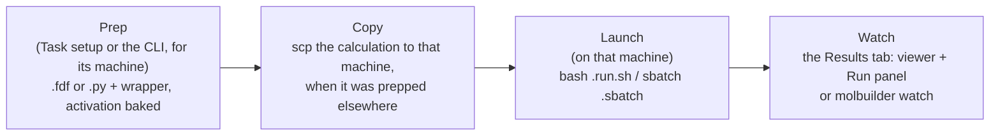
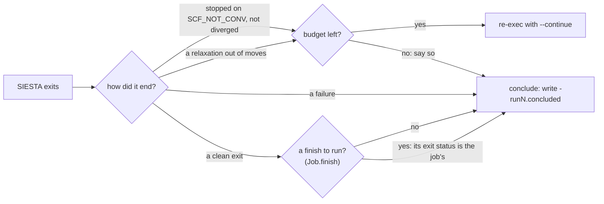
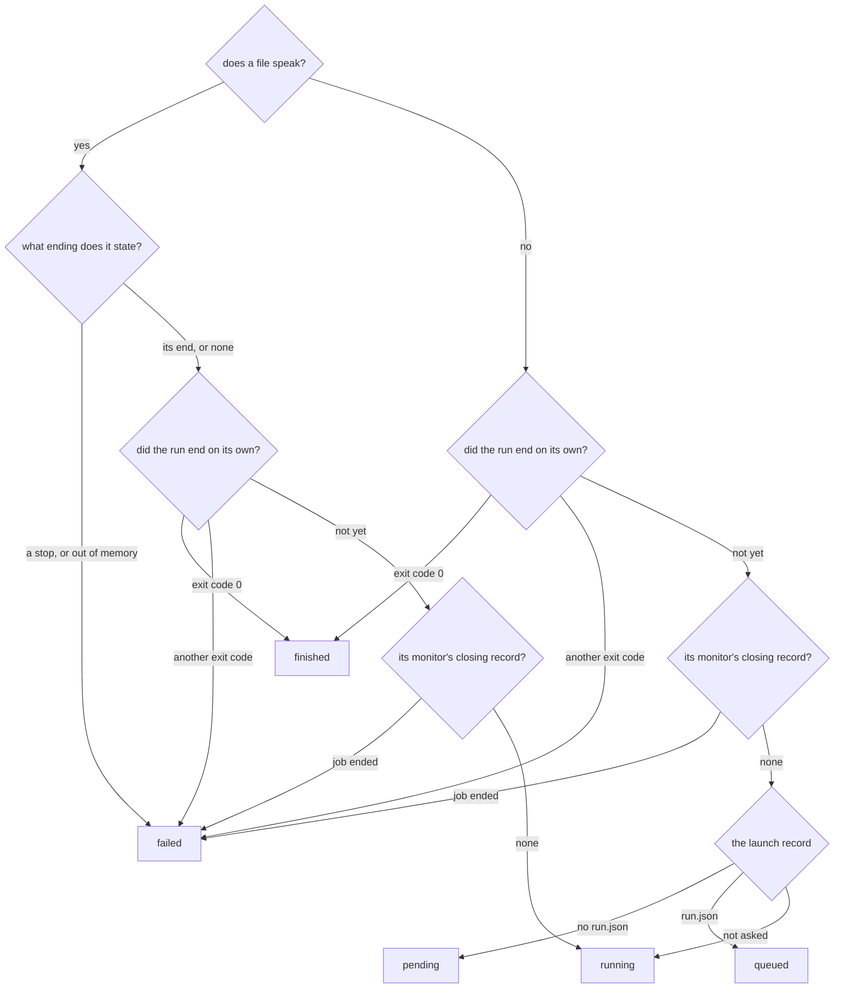
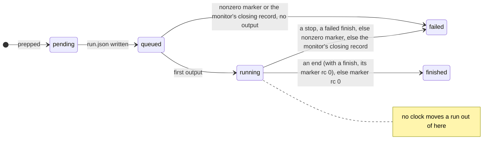
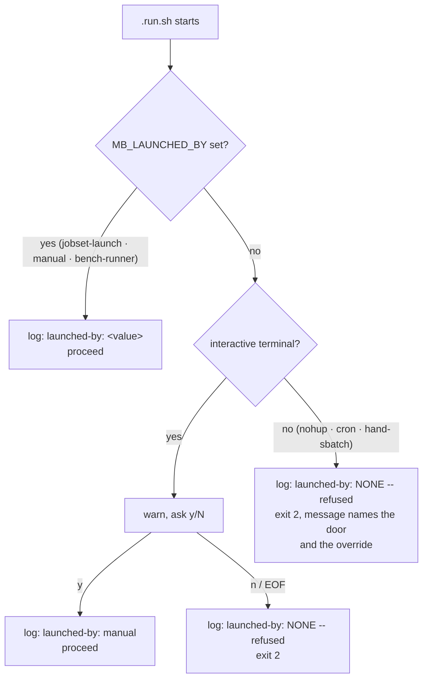
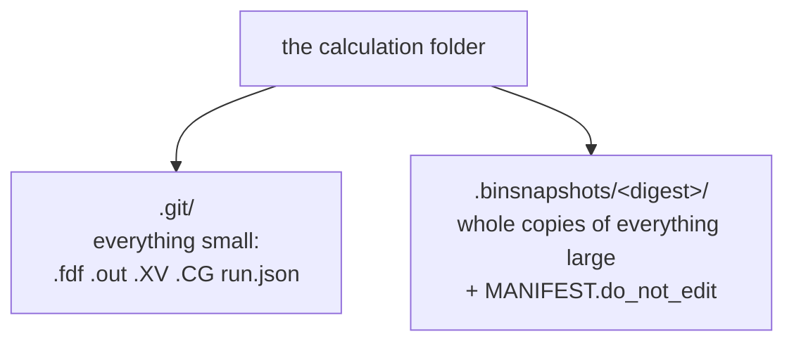

# Running a job — the usable single-job path

**Role:** guide
**Domain:** execution

**Companions:** [`execution/job-contracts.md`](?doc=execution/job-contracts.md)
— the on-disk formats this guide operates (the run directory, the wrapper
files, warm/cold restart, the config vocabulary);
[`execution/job-system.md`](?doc=execution/job-system.md) — the JobSet
framework that runs **batches** of jobs on top of this same wrapper;
[`execution/overview.md`](?doc=execution/overview.md) — the map and the
current → target status picture.

**This is the path that works today.** One task is
`molbuilder jobset prep` then `molbuilder jobset launch --mode direct` — **a
job set of one, through the same commands as a hundred** (there is no
`molbuilder run`; decided 2026-08-11). The browser's part is the description
(the hand-over + Task setup — [`web/task-setup.md`](?doc=web/task-setup.md))
and `prep` for a named machine, through the one entry the terminal calls
([`job-system.md`](?doc=execution/job-system.md) § 5.3); launching runs where
the machine is. *(A legacy web install-wrapper
endpoint survives as the low-level side door the described route supersedes —
`job-contracts.md § 2.6`'s note.)* Everything here — the
self-contained wrapper, the runtime resource resolution, `molbuilder.json`
config, checkpoints, and watching a run — is shipped and usable now. Running
**many** parameterised jobs (sweeps, staged ladders, HPC deployment,
benchmarking) is the JobSet framework's job; it builds directly on the wrapper
described here, and is documented in `execution/job-system.md`.


```mermaid
flowchart LR
    P["Prep<br/>(Task setup or the CLI, for its machine)<br/>.fdf or .py + wrapper, activation baked"]
    C["Copy<br/>scp the calculation to that machine,<br/>when it was prepped elsewhere"]
    R["Launch<br/>(on that machine)<br/>bash .run.sh / sbatch .sbatch"]
    W["Watch<br/>the Results tab: viewer + Run panel<br/>or molbuilder watch"]
    P --> C --> R --> W
```

The **host** where you prep need not be where you run: prep reads the target's
record ([`preparing-for-another-machine.md`](?doc=execution/preparing-for-another-machine.md)),
and a run directory is self-contained, so `scp -r my-job/` to a cluster and it
still works. That self-containment is a deliberate contract (§ 2).

---

## 1. What this guide owns — a reader's map

| If you need to… | Read § |
|---|---|
| Understand why the wrapper is self-contained and what it may read when | **§ 2 — The standalone contract** |
| Know how many MPI ranks / OMP threads a run actually uses, and how GPUs are pinned | **§ 3 — Runtime resource resolution** |
| See what flags `bash my-job.run.sh` accepts | **§ 3.4** |
| Watch a running job, read failure hints, or ask how a run is doing | **§ 4 — Watching a run, and reading it back** |
| Configure envs and how a shell enters them (`env_init`) in `molbuilder.json` | **§ 5 — Configuration** |
| Snapshot / restore a run directory | **§ 6 — Checkpointing** |

The on-disk shapes this guide drives — the run directory layout, the wrapper
files (`.run.sh` / `.sbatch`), warm/cold restart semantics, the config
vocabulary, and the persisted-artifact registry — are all defined in
[`execution/job-contracts.md`](?doc=execution/job-contracts.md). This guide
does not restate them; it explains how to *operate* them.

---

## 2. The standalone contract — a wrapper that runs anywhere

> **The wrapper's own files are named by `runfiles` too** — its stdout, its
> session log, the monitor's pair, the SCF timing log, the conclusion marker.
> They are the ones that carry the attempt counter, and `-run<N>` is not a
> literal anywhere: it is the one keyword `runfiles.QUALIFIERS` declares, so a
> second counter is a line there rather than an edit to whatever reads names.
> See [`job-contracts.md`](?doc=execution/job-contracts.md) § 2.2a, *"Which
> door to call"* (rule **A14**).

The single most important property of a generated run is that the wrapper is
**self-contained at runtime**: it reads no config, probes no toolchain, and has
no fallback path. Everything site-specific is **baked in** when the wrapper is
generated/prepped, so the compute node needs nothing but the files in the
directory. This is what lets you `scp` a run dir to a cluster, or hand it to a
collaborator, and have it run identically.

> **Verified in a pure shell, 2026-08-19.** Both engines' wrappers were run
> under `env -i` — no conda on `PATH`, no rc files, non-interactive — and
> bootstrapped from nothing but the baked hook line: sourced it, activated
> the routed env, resolved the launch (`--dry-run`, exit 0, both engines),
> and completed a real SIESTA run. The one assumption is the package manager
> `prep` found ([`workflow.md § 6.1`](?doc=workflow.md)).

### 2.0a Where it runs, and what that decides

Every rule in this section follows from one fact: **`<label>.run.sh` runs
unattended, in a shell that inherits nothing.** Under a scheduler it is
started by `sbatch` on a **compute node** — a different machine from the one
you submitted from, in a **non-interactive** shell that reads no rc files, so
no module is loaded and no environment is active. Under `--mode direct` it is
started by `bash` locally, with the same emptiness. Nobody is watching either
way.

What follows, and is checked in the rendered script:

| the situation demands | the wrapper does |
|---|---|
| nothing is on `PATH` before it acts | bakes the preamble and the activation verbatim |
| `activate.d` hooks read unset variables | `set +u` across the bootstrap **only**, restored immediately after |
| `--help` must answer without a working env | the whole bootstrap sits inside the help guard |
| the scheduler kills with `SIGTERM` at the time limit | `trap … TERM INT` → clean up, exit 143 |
| the engine's exit code must be inspectable | the engine is **run, not `exec`'d**; `set +e` around it, `${PIPESTATUS[0]}` captured |
| a run must be watchable while it runs | stdout is **teed**, never swallowed |
| the engine env has no molbuilder in it | the monitor travels as one copied file, `mb_monitor.pyz`, not `python -m molbuilder monitor` — holding it and the framework modules it reads the run through, each a copy of its source (`runwrap.MONITOR_BUNDLE`, `run-reports.md` § 2.3) |

> **`set -e` stays ON across the preamble, and that is deliberate.**
> A failed `module load` here means the job is about to run in the wrong
> environment — on an allocation, unattended, producing results nobody asked
> for and nobody is reading. Dying at the failed line is the cheap outcome;
> continuing is the expensive one.
>
> **Do not "fix" this by making the preamble tolerant.** The instinct comes
> from interactive shells, where a preamble that does not apply to the
> machine in front of you should not stop you working. This script has no
> such user: it is on a node, on a clock, spending an allocation. Same line
> of shell, opposite correct behaviour, because the environment is different
> — which is why it is written down here rather than left to be re-derived.

### 2.1 "Detection" — reading external state

"Detection" means reading state that is *not* in the run directory. There are
five kinds, and the contract governs **when** each may be read:

| Code | External state | Example |
|---|---|---|
| **T** | conda **T**ool availability | is `siesta` on `PATH` in the env? |
| **M** | HPC **M**odules | `module load mamba` |
| **C** | **C**onfig | the target's record (`env_init`, copied from that machine's `molbuilder.json`) and `molbuilder.json`'s `envs` |
| **A** | **A**llocation | `SLURM_NTASKS`, `CUDA_VISIBLE_DEVICES` |
| **H** | **H**ardware topology | physical core count, GPU→NUMA node |

There are three moments in a job's life, and the rule is:

- **Generate / prep** — T, M, and C are resolved here and **baked** into the
  wrapper as literals. (Prep is also where the *doctor* verifies prerequisites.)
- **Runtime (on the compute node)** — reading T/M/C is **forbidden**; only **A**
  (the scheduler's allocation) and **H** (the local hardware) may be read, and
  only to *tune* the launch (rank counts, GPU pinning) or to log — never to
  decide whether the job can run.

So at runtime the wrapper never runs `which conda`, never reads
`molbuilder.json`, and never uses `conda run`. It emits the activation form
**verbatim** (`conda activate <env>` or `source activate <env>`) inside a
clean-shell bootstrap, then launches the engine.

### 2.2 The two prep-time jobs

- **Bake the activation — declared, never detected.** prep writes the target
  record's `env_init` into the wrapper (§ 5.2): copied there by the probe from
  that machine's `molbuilder.json`, where `envs init-config` asked for it at
  install and offered a recommendation — `conda activate` plus a
  `source "<base>/etc/profile.d/conda.sh"` preamble where conda's hook is on
  disk (the hook line is baked because a non-interactive `bash job.run.sh` never
  sources `~/.bashrc`, so `conda activate` would otherwise be undefined); on HPC
  typically `source activate` after `module load mamba/latest`, because a login
  node's modules are not the compute node's.
- **Doctor (every target).** Verifies prerequisites — the engine env exists, the
  tool is present — and reports what is missing. It **never installs**; a
  missing GPU env, for instance, raises at generate time with an install hint
  rather than silently degrading.

### 2.2a What the wrapper may do — bash is a bootstrap, not a program

§ 2.1 already says it in passing: the wrapper emits the activation form verbatim
inside a clean-shell bootstrap, **then launches the engine**. The rule is worth
stating because it is easy to break by accretion.

> **The wrapper makes the environment right, runs the engine as its child, and
> reports on the run it started — its output, its monitor, how it ended. It
> creates no directory and arranges no file: that is Python's, on the host,
> before the wrapper is invoked.**

**Why bash at all:**

- **Activation mutates the shell's own environment.** `conda activate` /
  `module load` change `PATH` and friends *in the calling process*. A Python
  child cannot do that for its parent, so this genuinely has to be shell.
- **The launcher must be the shell's direct child.** `mpirun` / `srun` want to
  inherit the activated environment and sit in the process tree where signals
  and scheduler accounting expect them.
- **The shell must outlive the engine.** The engine is run, not `exec`'d
  (§ 2.0a), so the wrapper can read its exit code, decide a warm retry (§ 3.5),
  **finish the calculation when the engine alone leaves no result** — a SIESTA
  force-constant run's job derives its modes with `mb_vibration.pyz`, the job's
  own python, beside the run ([`engines/vibration.md`](?doc=engines/vibration.md)
  § 5.5); its failure is the job's — and write the conclusion marker as its
  last act ([`project-layout.md`](?doc=execution/project-layout.md) § 1.6.3).

Everything else — resolving which directory to run in, creating it, arranging
files, recording the launch — is **decision and arrangement**, and none of it
needs the activated environment. It is Python's.

**The test, when adding to a wrapper:** *does this need the activated shell, or
this run's own ending?* If it computes, decides or arranges anything else, it
belongs upstream. Two decisions are made on the node, each because only the
node can answer it: the warm retry, which only this run's ending can make —
and the wrapper asks the framework's reader for that ending rather than
grepping for it (§ 3.5) — and, for a job with a finish, whether the finish
can run on the job's python, which only the activated environment can say
([`engines/vibration.md`](?doc=engines/vibration.md) § 5.5). The finish
itself passes the same test: it needs the activated environment and this
run's own output.

> **Nothing arrives at a run directory needing to be resolved.** What a stage
> continues from is a **real file, copied in at `prep`** from the run you name
> ([`project-layout.md`](?doc=execution/project-layout.md) § 1.6) — present and
> local before the wrapper starts. There is nothing for bash to dereference,
> localize or wait for.

**This is forced, not stylistic.** Two facts make the compute node the wrong
place for logic:

- **molbuilder is not importable there.** It is deliberately never
  pip-installed into any env, so `import molbuilder` fails on a compute node
  whatever interpreter is found. The wrapper is self-contained at run time by
  design (§ 2).
- **The interpreter is the node's business, not ours.** The wrapper probes
  `command -v python3 || command -v python` and carries on without one, because
  the activation line is *declared for that machine*
  (§ 5.2 below; the activation has no default) — the env a wrapper lands in
  need not be one of ours at all. With no interpreter the run goes unwatched,
  with no failure hint and no warm retry, and the log says so.

  Any logic written to run there is either shell, or a shipped stdlib-only
  file, or broken. **`mb_monitor.pyz` is that one shipped file**: it holds the
  monitor — a *subprocess of the running job*, watching it from inside — and
  the reader the wrapper asks how the run ended (`python mb_monitor.pyz ending
  …`, § 3.5). Neither has anywhere else to live, which is why the file is
  stdlib-only; it is not a pattern to copy for anything that could run on the
  host instead.

**No generated wrapper contains a `cd`**, on either engine: the caller decides
the directory, and the layout layer — `jobset/materialize.py::prepare_attempt`
— makes and fills it ([`project-layout.md`](?doc=execution/project-layout.md)
§ 1.6, invariant 6a).

### 2.3 Env routing

The wrapper routes to a conda env by the script's extension, resolved at
generate time (`molbuilder/diagnostics.py`, `molbuilder/runwrap.py`):

- **`.fdf` → `molbuilder-siesta`**, launched with `mpirun -np N siesta`.
- **`.py` → `molbuilder-pySCF`**, launched with `python`.
- **`.fdf` that requests GPU → `molbuilder-siesta-gpu`.** Only
  `Diag.ELPA.GPU true` re-routes. **CPU-ELPA does not** — the packaged SIESTA
  carries ELPA through ELSI and runs both stages on CPU (measured; see
  [`engines/siesta.md`](?doc=engines/siesta.md) § 7.2). The two envs differ by
  **provenance** — one installs from packages anywhere, the other must be built
  from source — so routing CPU-ELPA to the source build used to refuse a
  runnable calculation wherever compiling is not allowed. If the `.fdf` opts
  into GPU but that env is not installed, generation raises with an install
  hint. An env named explicitly always wins over the route.

The env **names** are overridable per category in `molbuilder.json` (`envs`,
§ 5.4); the categories and their defaults are
[`configuration.md`](?doc=configuration.md) § 4's — `diagnostics.DEFAULT_ENV_NAMES`.
The host env is always `molbuilder` (§ 2.1c there).

> The wrapper file shapes (`.run.sh` inner + `.sbatch` outer), the run-indexed
> output names, and warm/cold restart are defined in
> [`execution/job-contracts.md § 2.6, § 4`](?doc=execution/job-contracts.md).
> The sections below cover the *runtime behaviour* those files carry out.

---

## 3. Runtime resource resolution

Only the **launch** is assembled at run time (from A + H); everything else is
baked — the rank and thread counts included, as the run stated them. Here is
exactly which statement applies, and how the wrapper places a GPU run.

### 3.1 MPI ranks (SIESTA)

SIESTA is launched with `mpirun -np N` when the build probe reports MPI. The
rank count `N` is resolved by precedence, **highest wins**:

```
-np / --np flag   >   MB_NP   >   SLURM_NTASKS   >   PBS_NP   >   the stated value, baked at prep
```

**The baked value is the one the run stated** — the run card's `mpi_np`, or
prep's `--np`. A run that states none is **refused at prep**, which names both
places (`architecture.md` § 5.2, which owns the rule). The wrapper has no
default of its own and neither has the `.sbatch` header — no target width, no
rank per GPU *(user, 2026-10-02: "explicit job config is the only way
allowed")*. Under `sbatch`, `SLURM_NTASKS` is the header's `-n`, which is that
same stated value, so the two agree by construction.

**Nothing lowers it** *(user ruling, 2026-09-03)*. Until then the default was
**clamped to the atom count**, and a user-set count above it was warned about,
both citing SIESTA's `propor IMAX=0` abort. That abort came from a **PSML**
problem, not from the system's size — so the rule was not science: it gave
right-sounding advice for a wrong reason where it fired, and refused perfectly
good rank counts everywhere else. *"Whether mpi is too big for a system is
none of your business."*

**The target's record checks a rank count; it never supplies one.** Until
2026-10-02 an unstated count became the target's width — the domain row's
widest node, else the record's topology — and before 2026-09-02 the width of
the box running `prep`. Each was a number nobody stated for that run, and the
second was about the wrong machine and looked exactly like a right one.

### 3.1a What the wrapper says instead — occupancy, as a notice

**SIESTA distributes ORBITALS across ranks**, not atoms, so the number that
says whether the ranks have anything to hold is

```
n_orbitals / mpi_np        # want > 1
```

At or below one, ranks are idle by arithmetic, and the wrapper says so at run
time — against the rank count **actually resolved**, not the one baked at
generation, so an `-np` override is included:

```
molbuilder: NOTE -- 200 ranks for ~100 orbitals is <= 1 orbital per rank.
  Your CPUs are not going to be fully used.  This is a notice, not a limit -- the run proceeds.
```

Both numbers are shown so the claim is checkable rather than a verdict, and
**nothing is refused or lowered**.

The orbital count is an **estimate and says so**: `10 × n_atoms`, the same
rough double-zeta-polarised figure the `BlockSize` bound uses and the deck's
BENCH-MARKS block already publishes as `n_orbitals_est` (`job-contracts.md`
§ 3.3). One estimate in one place, or the deck and the notice would disagree.
The true count needs every species' basis and is known only once SIESTA
starts. A deck with no `NumberOfAtoms` — it is optional in SIESTA — gets **no
notice at all** rather than one built on an invented number.

> **The header's `-n` is the stated rank count and nothing else** (F15,
> 2026-08-13; 2026-09-02; 2026-10-02). With no rank count stated it floored at
> `-n 1`, later took the target's width, and on a GPU job one rank per device
> — and inside the job `SLURM_NTASKS` **comes from that very header**, so each
> of those outranked everything below it in the chain above: a 64-core node
> once ran a job on **one rank**. Prep refuses the unstated count now. The
> `--dry-run` inspection still names each value's source and warns when the
> sibling header's `-n` disagrees with the resolved count — the case a by-hand
> `-np` or `MB_NP` creates.

> #### What `propor: IMAX = 0` depends on — and why no rank count is refused
>
> *(User ruling, 2026-09-03: "we had that problem because of a psml related
> issue, not a size issue.")*
>
> | | |
> |---|---|
> | **where it is raised** | `propor` (`Src/propor.f`), called only from `matel_table.F90`, which deduplicates the **radial-function tables** across MPI ranks — not in any BLACS distribution |
> | **when** | the table handed to it is all zeros |
> | **its two causes, in the order to check them** | 1. a **defective or XC-mismatched pseudopotential** — commoner and cheaper to check ([`science/pseudopotentials.md`](?doc=science/pseudopotentials.md); `molbuilder pseudo check`); 2. the **rank count** against the species count and radial-table size |
> | **not a cause** | `BlockSize` — the crash is identical at 1, 2 and 4 (`mpi_np` = 15, hemeC-dithiol); the atom count, a proxy that a few-species system exceeds safely and a many-species one crashes below; the spin — `propor` takes no spin argument and never sees the density matrix |
>
> So nothing lowers or refuses a rank count, and no species-aware bound
> replaces the atom clamp: whether a rank count suits a system is the user's
> judgement, and what the wrapper owes them is the objective number — orbitals
> per rank, above. The `.fdf` keeps `NumberOfSpecies` for a diagnostic.
> `BlockSize`'s bound is a different correction — **orbitals** over ranks, for
> matrix distribution ([`tuning.md § 2.11`](?doc=engines/tuning.md)).

### 3.2 OMP threads and BLAS

```
-omp / -t flag   >   OMP_NUM_THREADS   >   SLURM_CPUS_PER_TASK   >   the stated value, baked at prep
```

The stated value is the run card's cores per rank — SIESTA's `omp_threads`,
PySCF's `threads` — or prep's `--cpus-per-task`; a run that states none is **refused at
prep**, like a rank count. There is no policy default: SIESTA's `OMP=1` and
PySCF's *"the node's physical cores"* were the wrapper's own, and each was a
thread count nobody stated. *(Mainline SIESTA is not reliably OpenMP-aware, so
`omp_threads = 1` is the usual statement for a CPU build — a statement, made on
the run card.)* BLAS is always pinned to a single thread (`MKL_NUM_THREADS=1`,
`OPENBLAS_NUM_THREADS=1`) to keep MPI×BLAS from oversubscribing cores.

### 3.3 GPU mode: load-balance, MPS, and pinning

When the `.fdf` runs on GPU (ELPA-CUDA), the wrapper does substantially more at
launch (all in `molbuilder/runwrap.py`).  *This section is the MECHANICS; the
background — what actually offloads, why ranks share a device, what the
sources recommend, and how to design a benchmark matrix around it — is
[`engines/tuning.md § 2.12`](?doc=engines/tuning.md).*

- **Load-balance.** Counts allocated GPUs (preferring `CUDA_VISIBLE_DEVICES`
  over `nvidia-smi -L`), sets `ranks_per_gpu = mpi_np / ngpu` (≥ 1), and prints a
  `GPU load-balance` line. **The rank and thread counts are the stated ones**,
  as on CPU (§ 3.1, § 3.2). The GPU policy that worked out its own until
  2026-10-02 — about `physical_cores / 4` ranks with MPS, 2 or 1 without, and
  the core budget divided among them as threads, re-derived again by
  `--mps`/`--no-mps` — is gone with the other defaults; it overwrote even a
  stated, baked rank count when `--mps` was given. What to state for a GPU run
  is [`engines/tuning.md § 2.12`](?doc=engines/tuning.md)'s subject.
  `--mps`/`--no-mps` switch the MPS daemon and nothing else.
- **NVIDIA-MPS (Hyper-Q)** — the NVIDIA Multi-Process Service, which lets two or
  more MPI ranks share one GPU concurrently. Enabled only when (a)
  `nvidia-cuda-mps-control` is on `PATH`, (b) the user did not opt out
  (`--no-mps` or `MOLBUILDER_USE_MPS`), and (c) there are more ranks than
  GPUs — the moment sharing actually happens (D18a; until 2026-08-13 this
  bullet still described the RETIRED `ranks_per_gpu ≥ 2` gate, which
  mis-fired exactly when ranks and GPUs were equal).  Single-GPU-per-rank
  runs need no MPS and get none. The per-job MPS daemon is torn down by a
  single `EXIT` trap.
- **Per-rank GPU + NUMA pinning.** A generated helper assigns each rank a GPU
  (`CUDA_VISIBLE_DEVICES`) and, when the rank's cpuset spans more than one
  socket, pins it with `numactl` to the NUMA node that *owns* its GPU — **the
  helper probes that mapping itself, per rank, at run time** (nvidia-smi +
  sysfs). Opt out of socket pinning with `MB_NO_SOCKET_PIN=1`.  Separately,
  the **whole-job** `numactl` wrap (single-GPU, off-SLURM only — it is
  cleared under SLURM and for multi-GPU runs, where one node cannot own
  every rank) uses a GPU→NUMA answer probed at **generation** time (NVML +
  sysfs), baked as a literal and overridable with `MOLBUILDER_GPU_NUMA`.
  *(Until 2026-08-12 this bullet put the baked literal and the override
  inside the per-rank story — the per-rank helper reads neither; the
  override's whole reach is the whole-job wrap.)*

> **Override precedence, stated once:** the `-np` / `-omp` flags, then
> `MB_NP` / `OMP_NUM_THREADS`, then the scheduler's echo of the header
> (`SLURM_NTASKS`, `SLURM_CPUS_PER_TASK`), then the stated value baked at prep.
> `MOLBUILDER_MPI_NP` / `MOLBUILDER_OMP_NUM_THREADS` changed the GPU policy's
> defaults and went with them on 2026-10-02.

### 3.4 The flags a wrapper accepts

| Flag | Engines | Effect |
|---|---|---|
| `--continue` / `-c` | both | advance the run index and warm-restart from `.DM`/`.CG`/`.XV` (SIESTA) or `.chk` (PySCF) |
| `--force` / `-f` | both | reset the run index to `-run0` (overwrite it); does **not** touch warm-start files. Also what says *yes, overwrite* to `--cold`'s refusal |
| `--cold` / `--from-scratch` | both | start the engine from the deck alone, **overwriting** the prior state it names (§ `job-contracts § 4`). Names the files and **refuses**; `--force` proceeds |
| `-np` / `--np N` | both | SIESTA: override MPI ranks. PySCF: accepted, and anything but 1 is said to be ignored — PySCF is OpenMP-only |
| `-omp` / `--omp N` | both | override OMP threads (SIESTA also takes `-t` / `--threads N`) |
| `--mps` / `--no-mps` | SIESTA (GPU) | force MPS on / off |
| `--dry-run` | both | print the resolved launch command + rank→GPU/NUMA map, then exit 0 |
| `-h` / `--help` | both | usage |

> **`--cold` refuses before it overwrites, and that is the whole of the safety
> net.** It prints every file the run would overwrite, tells you to save the
> state first with `molbuilder checkpoint save`, and exits 1 having changed
> nothing. Run it again with `--force` and the same list is printed and the run
> proceeds. It *moved* those files into a timestamped `…-restart-aside-<UTC>/`
> folder until 2026-08-18; keeping a state is the checkpoint tool's job and it
> is never automatic ([`checkpointing.md § 2`](?doc=execution/checkpointing.md)).
>
> It works the same under `sbatch`: a refusal fails the job immediately with the
> reason in the log, where a prompt would simply hang.

Unrecognised arguments are **rejected** (the wrapper exits 1) — only the flags
above are accepted, for either engine. The `.sbatch` outer file forwards
`"$@"`, so `sbatch my-job.sbatch --cold` still reaches the inner wrapper.

### 3.5 SIESTA auto-retry on non-convergence

A SIESTA wrapper **re-runs itself warm**, with `--continue`, when its run ended
in one of two ways a warm restart can fix. The budget is the template's
`continue_retries` (*Warm-retry budget*, 0–5, default 1), carried on
`Resources` (`job-contracts.md` § 6.2) and bounded by the exported
`MB_RETRY_N`; a benchmark trial's is `0`, one run whatever happens.

| the run ended | SIESTA shows it by | the wrapper asks | the retry resumes from |
|---|---|---|---|
| its SCF did not converge, and SIESTA stopped on it | `SCF_NOT_CONV: … (required)`, then a nonzero exit (`SCF.MustConverge`: SIESTA's default, false in a benchmark trial's deck) | `_mb_ending stopped-by scf_not_conv` | the banked `.DM`, with a fresh SCF budget |
| a relaxation used all its moves, unconverged | exit 0, and `outcoor: Final (unrelaxed) atomic coordinates` (a converged one prints `Relaxed…`) | `_mb_ending relaxation-capped` | the banked `.XV`/`.DM`/`.CG`, with a fresh step budget |

The wrapper **asks, never greps**: `_mb_ending` runs `python mb_monitor.pyz
ending` over the output and SIESTA's stderr (`run-reports.md` § 2.3). **Never
retried**, because running again cannot fix it: a crash — `propor`'s
`IMAX = 0` (§ 3.1a), any abort, or a tolerated non-convergence followed by
one; a **diverged** SCF, whose retry resumes from the diverged density and is
the same run again — the monitor warns instead (`model/parse.md` § 5d.6); and
anything, when no python is beside the job (the log says so).

**A run that cannot resume is retried as the budget says, and said to
re-run.** SIESTA re-runs a force-constant run from its reference (undisplaced)
step, reading back only the density it saved at that step
(`save_density_matrix.F90`: every iteration of the reference step, no other;
`m_new_dm.F90` reloads it before every displacement): an SCF that stopped the
reference step continues from it with a fresh budget, and one that stopped at a
displacement meets the same SCF again. The budget still travels — it is the
person's call (`job-contracts.md` § 6.2), as it is for a stage described
`clean` — and what changes is what the wrapper SAYS: the kind declares the fact
(`warm-files.toml`, `resumes = false`,
[`job-contracts.md`](?doc=execution/job-contracts.md) § 4.2a), `prep` bakes it
into the rung's job (`Job.resumes`), and every wrapper text that speaks of a
retry — the banner's retry line, the retry's message, a retried run's Mode
line, the `--continue` help, the line after the budget — says it from one
description (`runwrap._retry_texts`). *(They called it a resume until
2026-09-29 — the M11 review, SS-C3; the K6 review, R4/R5.)* *The divergence
verdict that tells a diverged SCF from a slow one is built by plan § 5t.3's P4;
until it lands every `SCF_NOT_CONV … (required)` stop is retried.*


```mermaid
flowchart LR
    X["SIESTA exits"] --> Q{"how did it end?"}
    Q -->|"stopped on SCF_NOT_CONV, not diverged"| B{"budget left?"}
    Q -->|"a relaxation out of moves"| B
    Q -->|"a failure"| C["conclude: write -runN.concluded"]
    Q -->|"a clean exit"| F{"a finish to run?<br/>(Job.finish)"}
    F -->|"no"| C
    F -->|"yes: its exit status is the job's"| C
    B -->|"yes"| R["re-exec with --continue"]
    B -->|"no: say so"| C
```

**A retry stays in its attempt**: the wrapper re-execs itself in the same
process and directory, with the same `-np`/`--omp`, so the run index advances
in place (`-run0` → `-run1`, [`project-layout.md`](?doc=execution/project-layout.md)
§ 1.6.1) and only the last run writes the conclusion marker. The monitor is
stopped with SIGUSR1, not an ending (§ 4.1).

---

## 4. Watching a run, and reading it back

### 4.0 Which question, which reader

| the question | the reader | owned by |
|---|---|---|
| how is it going, right now? | the monitor, beside the job | [`run-reports.md`](?doc=execution/run-reports.md) § 2 |
| how is it doing — how did it end? | `parse.dirs.job.run_status` | § 4.2 |
| which engine ran? | `parse.contract.engine_of` | § 4.2 |
| what ran, with what, and how did it go? | the run record, `parse_dir(dir).record` | [`model/parse.md`](?doc=model/parse.md) § 5d |
| which file should a viewer open? | `parse.dirs.openable_in` | [`model/parse.md`](?doc=model/parse.md) § 5.2 |

### 4.1 The wrapper's own instruments

| instrument | file | engines | written | read by |
|---|---|---|---|---|
| **run banner** — host, cwd, env, engine binary and version, launch mode, threading, GPU resources | the session log | both | before the engine starts | a person; the run record |
| **session log** — the wrapper's stdout and stderr, SIESTA's stderr included, the engine's wall time on its `benchmark:` line, and the monitor's start — *starting*, then *started* or the error that stopped it ([`run-reports.md`](?doc=execution/run-reports.md) § 2.6) | `<basename>.runwrap-<stamp>.log`, one per start | both | from its first line | the run record; `_mb_ending` (§ 3.5) |
| **the engine's stdout**, teed | `<basename>-runN.out` · `-runN.pyscf.log` | SIESTA · PySCF | as it prints | `run_status` (§ 4.2); the viewers |
| **monitor** — utilisation every 10 s, progress, notifications | `-runN.monitor.log` · `-runN.util.csv` | both | start to end | a person; the run record |
| **SCF-timing tee** — every SCF row of both phases (`scf:`, `ts-scf:`) | `-runN.scf-timing.log` | SIESTA | as rows print | the timing instrument ([`model/parse.md`](?doc=model/parse.md) § 5c) |
| **failure hint** — how the run ended, where its output and log are; for `propor`, the causes (§ 3.1a) | the session log | SIESTA | on a nonzero exit | a person |
| **conclusion marker** — exit code and time, and for a job with a finish the words that say it failed or could not run (`…; finish failed (<bundle>)`, `…; finish cannot load (<bundle>)`) | `-runN.concluded` | both | the wrapper's last act, main line only — after the job's finish, when it has one | `run_status`, the launch gate, the run record ([`project-layout.md`](?doc=execution/project-layout.md) § 1.6.3) |

**The monitor** is `mb_monitor.pyz`, one file beside every deck, reading the
run with the framework's own readers. What it reads, when it speaks (never
about a stall), what its percentages are fractions of — what the job **holds**,
never the node — its lifecycle and its switches are all
[`run-reports.md`](?doc=execution/run-reports.md) § 2's; each run states its
utilisation basis on a `[UTIL-BASIS]` line, to read before comparing two runs.

**It is told *when* the run ended, and never reads that from the output**: the
watched PID goes, or the wrapper stops it — SIGTERM at the job's end, SIGUSR1
for a warm retry, which is not an ending (`run-reports.md` § 2.4). *How* it
ended is `run_status`'s answer. An ending phrase can print before the run is
over (`siesta: Final energy`); a monitor that stopped on one would stop
sampling a job still holding its CPUs.

### 4.2 Reading a run directory back — `run_status` and `engine_of`

**This section owns a run directory's state** — its evidence, their order, and
each surface's words. A file's own ending is
[`model/parse.md`](?doc=model/parse.md) § 2b's.

#### The call

```python
run_status(run_dir, match="*", *, launch=<not asked>) -> RunStatus   # parse/dirs/job.py
```

| argument | meaning |
|---|---|
| `run_dir` | the attempt (`run-<n>/`), or the calculation itself in the flat shape |
| `basename` | narrows to one run, by its deck's stem: the flat shape keeps every stage in one directory (`Shape.run_basename`; `None` in the hierarchy) |
| `launch` | `launch_record(dir)` (`runrecord.py`) — the `run.json` dict, or `None`; one that does not read is an error naming the file, never an answer; left out, *not asked* |

| field | holds |
|---|---|
| `state` | `pending` · `queued` · `running` · `finished` · `failed`, a closed set |
| `detail` | one line for a person (the states, below) |
| `last_change_at` | the speaking file's mtime, ISO-8601 UTC — shown, never judged |
| `active_source` | the speaking file's name, or `None` |
| `concluded` | the conclusion marker's text, `rc=0 at …`, beside the state |
| `endings` | each output file's ending and its SCF phases' convergence — read by the run record and the monitor, so nothing scans twice |

`/api/results/dir` serves the first four ([`web/results.md`](?doc=web/results.md) § 2.3).

| caller | `launch` | `match` |
|---|---|---|
| `jobset/runstatus.py` — `jobset status`, the bench summary, the Results ladder | the attempt's — each point's, for a bias scan's rung ([`engines/transport.md`](?doc=engines/transport.md) § 2a.11) — or a trial's; none for a flat stage | the rung's glob |
| `JobDirParser` — `/api/results/dir`, the run record | the directory's | `*` |
| the monitor's closing line | not asked | its run's stem |

`run_status` has no answer *there is no run here*: asked without `launch`, a
directory with nothing written reads `running — no result file yet`. So the
directory door asks what a directory is first, and asks a container nothing
([`project-layout.md`](?doc=execution/project-layout.md) § 1.4a).

#### Which file speaks

An engine's captured stdout (`.out`, `.pyscf.log`) speaks, because it exists
only once the process started; a progress log (`.molwatch.log`) speaks once its
footer concludes, because prep seeds it before the engine starts. Each is read
by its role's scan for ending markers, `_run_ending.ending_of`
([`model/parse.md`](?doc=model/parse.md) § 5.4) — not parsed through the
registry. Of several, the highest stage speaks, then the newest mtime *(user
ruling, 2026-09-04: a re-run of an earlier rung must not take over the state)*
— the mtime picks *which* file, never *whether* the run is alive.

#### The order of evidence


```mermaid
flowchart TD
    S{"does a file speak?"} -->|"yes"| E{"what ending does it state?"}
    E -->|"a stop, or out of memory"| FAIL["failed"]
    E -->|"its end, or none"| C{"did the run end on its own?"}
    C -->|"exit code 0"| FIN["finished"]
    C -->|"another exit code"| FAIL
    C -->|"not yet"| G{"its monitor's closing record?"}
    G -->|"job ended"| FAIL
    G -->|"none"| RUN["running"]
    S -->|"no"| C2{"did the run end on its own?"}
    C2 -->|"exit code 0"| FIN
    C2 -->|"another exit code"| FAIL
    C2 -->|"not yet"| G2{"its monitor's closing record?"}
    G2 -->|"job ended"| FAIL
    G2 -->|"none"| L{"the launch record"}
    L -->|"no run.json"| PEN["pending"]
    L -->|"run.json"| Q["queued"]
    L -->|"not asked"| RUN
```

*Its end* is `>> End of run`, a PySCF deck's end line or a `# concluded:`
footer; *a stop* is a fatal marker, a Python traceback, an `# error:` footer or
an out-of-memory line (`model/parse.md` § 2b) — for a SIESTA run, in its output
or in the stderr its wrapper kept, the session log whose first section is the
run: a rank other than 0 that dies may say why only there. The detail quotes
the line.

**Whether the run ended on its own is one door's answer**, `runrecord.ending`
([`architecture.md`](?doc=execution/architecture.md) § 3.2), the same for
status, every hand-over and launch: molbuilder's conclusion marker, counted
only at the highest run index the run's files reached
([`project-layout.md`](?doc=execution/project-layout.md) § 1.6.1) — an earlier
one, beside a newer output, is a previous run's goodbye — else SIESTA's own
`0_NORMAL_EXIT` where it can belong only to this run: a folder no wrapper of
ours ran in, holding one deck (SIESTA deletes it as it starts and writes it as
it ends cleanly). **Finished is a run that ended on its own with exit code 0;
failed, one that ended with any other** — or whose output states a stop.
**An output that states its end is not a run that ended**: the job may still
be on its way out — a finish deriving its result, the wrapper's last lines —
so it reads `running` until it concludes, and `failed` once the monitor's
closing record says the process went without concluding. The monitor's
closing record — `[MONITOR] job ended` in the latest run's
`-runN.monitor.log` ([`run-reports.md`](?doc=execution/run-reports.md) § 2.5)
— speaks wherever the conclusion is silent: the process went, and nothing
recorded an exit. *(Until 2026-10-03 the output's end decided first: a run
whose output ended read `finished` with no conclusion, and beside an exit code
of 1, while every hand-over refused it — plan W38 F3.)*

**A job with a finish is not done when its engine is**
([`engines/vibration.md`](?doc=engines/vibration.md) § 5.5): a SIESTA
force-constant stage's wrapper runs the finish after SIESTA ends, and only
then concludes. So an output that states its end speaks for the ENGINE, and
the job's own evidence decides: a marker naming a failed finish reads
`failed`; with no marker yet, the run's session log saying the finish began
(`finish started:`, `wrapper_log.FINISH_STARTED`) reads `running` — *the
engine ended; the job's finish is deriving the result* — and `failed` once the
monitor's closing record says the process went: a walltime or a kill inside
the finish, which leaves no marker. A marker `rc=0` is a finished job.

**Convergence never decides the state** (P-S2): an unconverged SCF is a fact
beside it, in `endings`. A run SIESTA *stopped* because its SCF had to converge
is `failed` by the stop; a capped benchmark that ran to its end is `finished`.

#### The states

| state | detail |
|---|---|
| `pending` | prepped, not launched (no run.json) |
| `queued` | queued as job N · launched (direct), no output yet |
| `running` | running · no result file yet · the engine's output ended; the job has not concluded · the engine ended; the job's finish is deriving the result |
| `finished` | job_completed · concluded (rc=0 at …) |
| `failed` | stopped before its end: *the line that stopped it* · out of memory: *its line* · concluded (rc=1 at …) · the engine's output ended, but the job exited with an error (rc=1 at …) · stopped before its end: no ending in its output and no exit recorded · the engine's output ended, but the job stopped before it concluded — no exit recorded · the engine ended, but the job's finish did not derive the result (*the marker*) · the engine ended and the job's finish began, but the job stopped before it concluded · concluded (rc=1 at …; finish cannot load (*bundle*)) before any output |

**Silence is not death.** A healthy SIESTA SCF step can print nothing for over
twelve minutes, and a job the scheduler kills leaves no trace in its output, so
a file with no ending is `running` — not finished — however long it has been
quiet *(user, 2026-09-26: "It shows what it is")*. A forced stop writes no
marker; the monitor, which saw its PID go, writes its closing record first,
and that record reads *failed — stopped before its end: no ending in its output
and no exit recorded* here and in its own `finish`
([`run-reports.md`](?doc=execution/run-reports.md) § 2.4). A lost node takes
the monitor with it, and the run reads `running`. `launch run` still asks the
person before continuing a run with no marker
([`project-layout.md`](?doc=execution/project-layout.md) § 1.6.4).

**Before the first output**, a direct launch reads `queued` (its `run.json` is
written as the process starts). One killed before writing anything reads
`failed` by its monitor's closing record, or `queued` when nothing outlived
it; an engine that merely died still reaches the wrapper's marker and reads
`failed`; a job that cannot run its finish stops before its engine and says
so in its marker (`finish cannot load`), which reads `failed`; a flat stage
reads `queued` the same way, from its own `<basename>.run.json`.


```mermaid
stateDiagram-v2
    direction LR
    [*] --> pending: prepped
    pending --> queued: run.json written
    queued --> running: first output
    queued --> failed: nonzero marker or the monitor's closing record, no output
    running --> finished: an end (with a finish, its marker rc 0), else marker rc 0
    running --> failed: a stop, a failed finish, else nonzero marker, else the monitor's closing record
    note right of running: no clock moves a run out of here
```

#### The words on each surface

| surface | its words | read from |
|---|---|---|
| a file — `run_state` ([`model/parse.md`](?doc=model/parse.md) § 2b) | `running` · `ended` · `stopped` · `out_of_memory` · `unknown` | the file's markers |
| a run directory — `run_status` | `pending` · `queued` · `running` · `finished` · `failed` | `ended` → `finished` — for a job with a finish, once its marker says `rc=0`: a failed finish → `failed`, a finish begun and unconcluded → `running`; `stopped`, `out_of_memory` → `failed`; otherwise the marker, else `running` |
| the Run panel ([`web/results.md`](?doc=web/results.md) § 3a) | `run_status`'s | the same scan |
| a ladder row — `jobset status`, the Results ladder ([`web/results.md`](?doc=web/results.md) § 2.4) | `run_status`'s, plus `not-started` (no directory yet) and `unknown` (unreadable) | `jobset/runstatus.py` |
| the trajectory badge ([`web/trajectory.md`](?doc=web/trajectory.md) § 4) | Running · Finished · Stopped | the open file's `run_state`: `ended` → Finished; `stopped`, `out_of_memory` → Stopped; else Running |
| the monitor's closing line ([`run-reports.md`](?doc=execution/run-reports.md) § 2.3) | `finished` · `failed` | `run_status`'s, asked after it writes its closing record |

The badge reads a **file** and the panel the **run**, so they can differ: a
`-run0.out` that stopped reads Stopped while its warm retry keeps the attempt
`running`.

#### Worked examples

The attempt `01_coarse/run-0/` of `bdt`, as prep left it
([`project-layout.md`](?doc=execution/project-layout.md) § 1.6.3), then as the
run goes:

| it also holds | `state` — `detail` |
|---|---|
| nothing more | `pending` — prepped, not launched (no run.json) |
| `run.json`, `"job_id": "481923"` | `queued` — queued as job 481923 |
| `bdt_01_coarse-run0.out`, no `>> End of run`, quiet for 40 minutes | `running` — running |
| the `.out` ends `>> End of run`; `-run0.concluded` reads `rc=0 at …` | `finished` — job_completed |
| the `.out` stopped on `SCF_NOT_CONV … (required)`; the warm retry's `-run1.out` is printing | `running` — `-run1.out` speaks: same stage, newer |
| killed at walltime: no ending in the `.out`, no `.concluded` | `running` — the monitor's log says *failed*; `launch run` asks |
| no `.out` (SIESTA died before its first line); `-run0.concluded` reads `rc=1 at …` | `failed` — concluded (rc=1 at …) before any output |

#### Which engine ran — `engine_of`

`parse.contract.engine_of(run_dir)` answers `"siesta"` / `"pyscf"` /
`"unknown"`, and this section owns the rule.

**The engine is DECLARED when the script is generated**, because that is the
only moment it is known for certain, and a run directory gets copied away
from everything that knew. Two kinds of evidence exist, and they are not a
precedence list:

| tier | evidence | where it is written |
|---|---|---|
| **declaration** | the PROVENANCE `engine` key of any deck or wrapper | [`job-contracts § 3.2`](?doc=execution/job-contracts.md) |
| **declaration** | the `.molwatch.log` `# engine:` header | [`engines/pyscf.md`](?doc=engines/pyscf.md) § 4 |
| *fallback* | which files are present | only when nothing declared |

**The declarations are weighed TOGETHER.** One distinct answer among them is
the answer. Two is a run that contradicts itself, and that is `"unknown"` —
the same rule and the same reason as `contract_of`
([`model/parse.md`](?doc=model/parse.md) § 5b): a directory that says two
things cannot be made to say one by picking, and an answer that might be the
other engine's is worth less than no answer. No order is used, because a
first-hit list lets one stale `.run.sh` outrank two agreeing declarations.

**The sniff is consulted only when nothing declared**, for a directory
molbuilder did not write, and never overrules a declaration: files outlive the
run that wrote them, so a stale `.fdf` beside a freshly re-prepped PySCF deck
is litter, not a second opinion.


## 5. Configuration — `molbuilder.json`

**What `molbuilder.json` may hold, and what each key is for, is
[`configuration.md`](?doc=configuration.md) § 4** — the one list, with the
retired keys and what to do instead. It holds your preferences and nothing
else: **no value of a job** (its queue, wall, memory, ranks, cores per rank and
GPU count are the job's own — [`architecture.md`](?doc=execution/architecture.md)
§ 5.2) and **no fact about a machine** (its queues and topology are that
machine's record — `configuration.md` § 5) — except `env_init`, how a shell
enters an environment HERE, which the probe copies into every record it writes
(§ 5.2). An unknown
top-level key is refused with the known sections named, never ignored; a key
starting with `_` is a comment.

**Two parts of it reach a calculation**, both below: `launch` and `envs`. The
same file also configures the *server* — sign-in, TLS, the rate limiter, the
admin list ([`ops/deployment.md`](?doc=ops/deployment.md) § 5,
[`ops/access-control.md`](?doc=ops/access-control.md)).

### 5.1 Where config lives

- **Server-wide** `molbuilder.json` — **one file**, in the config directory:
  `$MOLBUILDER_CONFIG_DIR` if set, else `$XDG_CONFIG_HOME/molbuilder/`, else
  `~/.config/molbuilder/`. There is no search and no working-directory step; a
  `./molbuilder.json` is not read (`configuration.md` § 2.1a).

### 5.2 The activation — required to emit ANY wrapper, and a fact of the machine

How a shell enters an environment on a machine — the `preamble` (e.g.
`module load mamba/latest`, or sourcing conda's hook) and the `activation`
(`source activate` or `conda activate`) — is **a fact of that machine**, carried
by its record (`configuration.md` § 5 M-1). Every wrapper is rendered with the
TARGET's two, this machine included.

**They are declared once on each machine molbuilder is installed on**, in that
machine's own `molbuilder.json` — molbuilder needs them there before any record
exists *(user, 2026-10-02)*:

```json
"env_init": {"activation": "source activate",
                      "preamble": "module load mamba/latest"}
```

and **`jobset probe --write` copies them into every record it writes** — this
machine's `environment.json`, or a named `<name>.json` to carry to where you
prep. A copy that is wrong for the machine it describes is edited by hand, in
that record; an edit to `molbuilder.json` reaches a record at its next `probe
--write`, which asks about each difference (`--yes` takes them all; silence
keeps the record's).

`activation` must be `"source activate"` or `"conda activate"` and has **no
default**: a target whose record carries none is refused at prep, saying where
to declare it. On a fresh install that would bite a workstation first — which
is why **`envs init-config` asks** how this machine enters a conda env and writes
the answer into `molbuilder.json`, at the one moment it is both known and being
discussed ([`ops/installation.md`](?doc=ops/installation.md) § 2.1). It is
declared, never detected. `preamble` is arbitrary shell run before activation,
emitted verbatim.

### 5.3 The `.sbatch` header — every value stated

**There is no scheduler configuration.** `molbuilder.json` carried a
`scheduler` block until 2026-10-02 — a queue, defaults for the wall, the cores
per task and the memory, a queue menu, an order to place by, mail and export
lines — and each value in it was one some job received without stating it.
The block is refused by name (`configuration.md` § 4).

**What the `.sbatch` header carries** (`render_sbatch`): a fixed `-J <basename>`,
`-N 1`, `-o slurm.%j.out` / `-e slurm.%j.err`, and the job's own stated values —
`-n <ranks>`, `-c <cores per rank>`, `-t <wall>`, `--mem`, and `-p` / `-q` from
the queue it names, bound on the target's record; for GPU jobs
`--gres=gpu:<count>` and — unless the
calculation's `allocation.gpu_binding` is `false` — `--gres-flags=enforce-binding`
([`gpu.md`](?doc=execution/gpu.md) G9). Where each value is stated is
[`architecture.md`](?doc=execution/architecture.md) § 5.2, and prep refuses one
stated nowhere. The body is a single line — `bash <basename>.run.sh "$@"` —
because the inner wrapper owns activation and launch. It is withheld only where
the target's record says `workstation`
([`job-system.md`](?doc=execution/job-system.md) § 6), and then only the
`.run.sh` is written.

#### 5.3.1 Memory and wall — the user states them, nothing else does

**No estimation exists** *(user decision, 2026-08-24)*. A per-`.fdf` memory
model (`siesta/memory.py`, the `mem_model` coefficients, a runtime
estimate-vs-allocation audit, and a GPU floor/ceiling clamp band) lived here
until then and was deleted whole: five Sol jobs (62039301–05) OOM'd against
scheduler defaults while that machinery sat unconfigured and silent, and a
model that answers a question the user was never asked is the wrong shape
regardless of its coefficients.

**And no default exists either** *(user, 2026-10-02)*. A job's memory is, from
strongest: `--mem` at launch, `--mem` at prep, the description's
`allocation.mem`. Its wall is `--time` at launch, `--time` at prep, the run
card's `time`, `allocation.time`. **Stated nowhere, prep refuses** on a target
with a scheduler. `scheduler.defaults.mem` and the queue's own ceiling stood in
for an unstated memory and wall until then; the scheduler's own default would
stand in now if prep let it through, and that is a value nobody stated too.

`--mem 0` asks for the node's whole memory.

### 5.4 `launch` and `envs`

- **`launch`** — `{mode}`. `mode` is `direct` (run in place) or `submit`
  (through the scheduler); any other value, and any other key, is refused by
  name (`runtime_config.get_launch_mode`). This, not the detected scheduler, is what
  gates `.sbatch` submission. *(It was spelled `execution` until 2026-10-02 —
  the name of `task.json`'s run card, a different thing — and carried a default
  queue, `domain`, which a job now names itself.)*
- **`envs`** — overrides the conda env name per category
  (`{"siesta": "my-siesta-env", …}`); unset categories use the defaults
  (§ 2.3).

Config is written at mode `0600` by `write_config_scope` (deep-merge a patch
onto the one file, re-validate, then write it atomically —
`configuration.md` § 2.3).

### 5.5 The launch door — who may start a run, and how the run proves it

*Decided with the user, 2026-08-12. One section for the whole story: which
files decide the launch, how the decision reaches the running job, and what
the job's own log says about it.*

**Two files feed every launch — this machine's config and the target's
record — and each value knows where it came from:**

| file | scope | found where |
|---|---|---|
| `molbuilder.json` | **this machine** — `launch.mode`, the environment names, `env_init` | the config directory: `$MOLBUILDER_CONFIG_DIR`, else `$XDG_CONFIG_HOME/molbuilder/`, else `~/.config/molbuilder/` |
| the target's record | **the machine the job runs on** — its queues, topology, and the `env_init` copied from it | `environment.json`, or `environments/<name>.json` for a named target ([`configuration.md`](?doc=configuration.md) § 5) |

`prep` and `launch` print the provenance — every path consulted, found or
absent, and each effective value tagged with its source file — and `prep`
writes the same block into `STAGE-PLAN.md`, so a behaviour difference between
two machines is explained by the bundle itself. Secret sections (`auth`,
`tls`) are excluded by an allowlist, never by care.

**There is ONE launch door.** `molbuilder jobset launch` resolves the mode
(flag, else `launch.mode`, else a refusal — never the detected scheduler),
decides everything before it writes anything — what the run follows, the
deck/launch agreement check, the queue (`--domain`, else the one `prep` baked
for this stage — a run on a scheduler is refused at prep when it names none)
and the request admitted on it — then **shows the exact `sbatch` line
and asks** ([`submission.md`](?doc=execution/submission.md) S4; `--yes` skips
the question, never the output), records the attempt, and launches **one job
per invocation** — a grouped bench one per resource shelf
([`job-system.md`](?doc=execution/job-system.md) § 7). The single-stage door
asks too *(ruled 2026-10-01)*: a launch flag may still change the queue, the
wall or the memory after `prep`'s printout, so the line as sent is seen only
here. A flag the launch would
not read is refused by name — `--time`/`--mem`/`--domain` under
`--mode direct`, a bench's flags on `launch run`.

> **`--mode ask` submits nothing and tells you when it would start.** It walks
> the identical path `--mode submit` walks and inserts one flag,
> `sbatch --test-only`, so the line asked about **is** the line that would be
> sent. SLURM validates the request and predicts a start time; no job is
> created, nothing is recorded, and `status` sees nothing — because after it,
> nothing exists.
>
> It is for the minute before you commit: ask, and if the wait is poor, change
> `--domain` or trim the resources and ask again, or decide you can live with
> it and re-run with `--mode submit`. It needs a login node — **there is no
> prediction without the cluster**, and node counts are a poor proxy for it:
> 134 wide nodes are no help if all 134 are busy for two days.
>
> When SLURM declines to predict, that is reported as **unknown**, never as
> soon. A missing answer dressed as a good one is how you wait a day for a
> queue that looked instant. The reason it gives is printed, because it is
> often the whole answer — *"Requested node configuration is not available"*
> says the ask fits no machine in that queue.
>
> **It is not gated one-job-at-a-time, and `submit` is.** That rule exists
> because jobs queued together start together and contend — *"a rule about the
> scheduler, not about doing several things"*, which is why `--mode direct` is
> untouched too. `--test-only` enqueues nothing, so none of that is reachable.
>
> A sweep is where it pays: a grid's shelves ask for different shapes, `G1`
> schedules sooner than `G4`, and seeing their waits side by side is what tells
> you which one to submit. It is asked **as `submit` sends it** — one question
> per resource shelf, with the shelf's own request; the shelf's script is
> written only when it is sent, so the question rides one of its trials'
> rendered headers under the same flags, which win over any header. A stage
> launched before is asked about as the attempt its re-launch would open —
> nothing is opened by asking. The number of queries is capped for politeness, and
> anything past the cap is **named as unasked** — a partial answer that does
> not say it is partial reads as a complete one. When it launches, it stamps the claim
`MB_LAUNCHED_BY=jobset-launch` — into the child environment for a direct
run (inheritance survives `nohup` and backgrounding), and **explicitly on
the command line** for a scheduler run (`sbatch
--export=ALL,MB_LAUNCHED_BY=jobset-launch`, which beats any site export
policy).

**Every `.run.sh` gates on that claim** before doing any work
(`job-contracts.md` § 2.6, the Launch-door gate row):


```mermaid
flowchart TD
    A[".run.sh starts"] --> B{"MB_LAUNCHED_BY set?"}
    B -- "yes (jobset-launch · manual · bench-runner)" --> C["log: launched-by: &lt;value&gt;<br/>proceed"]
    B -- no --> D{"interactive terminal?"}
    D -- yes --> E["warn, ask y/N"]
    E -- y --> C2["log: launched-by: manual<br/>proceed"]
    E -- "n / EOF" --> F["log: launched-by: NONE -- refused<br/>exit 2"]
    D -- "no (nohup · cron · hand-sbatch)" --> G["log: launched-by: NONE -- refused<br/>exit 2, message names the door<br/>and the override"]
```

**The verdict is in the job's own output log AND the runwrap log**: the
wrapper opens its per-run log (tee) *before* the gate, so every outcome —
proceed, manual yes, refusal — is a fact on disk even when nothing ran;
under sbatch the `launched-by:` line also lands in the job's `.out`. Either
log alone answers *"was this launched properly, run by hand on purpose, or
refused?"* — and nothing can ever sit waiting on a prompt, because a
non-interactive shell never prompts, it refuses (EOF at the prompt is a
refusal too, with the same verdict line). Four edges repaired 2026-08-12
(U10): the interactive **yes is `export`ed**, so the warm-retry re-exec of
the same wrapper does not re-prompt mid-retry; EOF falls to the refusal
instead of dying under `set -e` with no verdict; `-h`/`--help` is scanned
**before** the gate and runs none of the bootstrap — asking what a script
does needs neither a claim nor a working activation; and the refusal
reaches the runwrap log as above. The deliberate manual form
is `MB_LAUNCHED_BY=manual bash JOB.run.sh` (backgroundable), and the value is
logged so the choice is on record. *(`bench-runner` was the transitional
claim of the old bench launchers; they died at step 6 u5, 2026-08-12, and no
shipped script emits it any more.)*

---

## 6. Saving a calculation — `molbuilder checkpoint`

A calculation folder can be put under a git-backed snapshot system, so any state
you saved is one you can come back to — rerun a stage, retune and try again, or
start over from it. Large binaries are handled beside git rather than inside it,
so a snapshot holds the density matrices too.

**This section is the guide: what to type, and what the buttons do.** The rules
it must not break — and which of them hold today — are
[`checkpointing.md`](?doc=execution/checkpointing.md); the file formats are
[`job-contracts.md § 6.1`](?doc=execution/job-contracts.md).

### 6.1 Three ideas

| | |
|---|---|
| a **state** | a saved snapshot of the whole folder: an id, a note you wrote, and the state it came from |
| a **tag** | a name you give a state so you can find it again |
| **where you stand** | the one state the folder is currently at |

**Where you stand is what makes the other two work.** It decides what "unsaved"
means — the folder differs from *that* state, never from the newest one — and it
decides where a new state hangs: `save` records where you stood as the new
state's parent. That is the whole of branching. There is **no branch verb**; you
go back to a state, save from it, and both attempts stay listed.


```mermaid
flowchart TD
    RD["the calculation folder"]
    G[".git/<br/>everything small:<br/>.fdf .out .XV .CG run.json"]
    B[".binsnapshots/&lt;digest&gt;/<br/>whole copies of everything large<br/>+ MANIFEST.do_not_edit"]
    RD --> G
    RD --> B
```

Which store a file goes to is decided by **measuring it** against a size limit —
10 MB by default, set in `molbuilder.json`. Nothing is left out: every file is
in exactly one of the two stores.

### 6.2 The verbs

```bash
molbuilder checkpoint init                                  # once, in the folder
molbuilder checkpoint save -m "stage 1 converged, 41 steps"  # the note is required
molbuilder checkpoint list                                   # what have I got?
molbuilder checkpoint tag stage1-good -m "geometry I trust"  # name one
molbuilder checkpoint restore 4f9ca71                        # or restore stage1-good
molbuilder checkpoint config                                 # which files count as big
```

Every verb takes `-p/--path` (default: the current directory).

- **`init`** — `--engine siesta|pyscf` names which config entry to use, so
  families that are always large skip the measuring. Omit it and every file is
  measured, which is always correct and merely slower. `--calculation` sets the
  name written into every state; it defaults to the folder's, and a name that
  would need repairing is **refused** rather than quietly fixed.
- **`save -m`** — the note is required and never generated. It is the only thing
  that answers the question you actually bring to a history a month later: *why
  did I stop here, and what was I about to do?* Says plainly when nothing
  changed rather than inventing a state.
- **`list`** — newest first, each state naming the one it came from. Two states
  showing the same parent are alternatives. It answers **cheaply**, from size and
  timestamp, and says so; `--check` compares content when you want certainty now.
- **`tag NAME -m`** — the note says why the state is worth returning to. Nothing
  tags on your behalf, so the namespace is yours alone. `--at` names a state
  other than where you stand.
- **`restore STATE`** — STATE is a state id or a tag. The **whole folder**
  returns; it is a rewind, not a fetch. To read one old file without moving
  anything, there are two commands and which one you want depends on the file's
  size. A small one is in git:

  ```bash
  git show <state>:<path>
  ```

  A large one is not in any commit — it lives in the side archive — so git
  answers `path '…' does not exist`. Read the state's message for the archive
  it names, then read the file straight out of it:

  ```bash
  git show -s --format=%B <state>      # the `Manifest-SHA256:` line is the archive
  cat .binsnapshots/<digest>/<path>
  ```
- **`config`** — prints the size limit, which families skip the measuring, and
  where to change them. Read-only: the classification has one home.

**What a restore asks you.** It refuses first on things about the *target* — an
unknown state, or an archive that does not verify — because nobody should accept
a loss for an operation that then fails for another reason. Only then does it
name everything unsaved (changed, added and deleted alike) and ask. At a
terminal you answer; a script passes `--force`. **Say yes and it is gone**:
nothing is stashed, renamed or set aside. Files merely absent from the target are
removed without a warning — they are still in the state that holds them.

### 6.3 The panel, and the routes

The projects sidebar's run-history panel does the same work for a run directory:
a sensor pill reading `saved` or `N unsaved`, the states as a list or a graph
drawn from parentage, and buttons for init, save, tag and restore. **Refresh is
explicit** — it reads on directory-enter and when you press Refresh, which asks
the exact content question rather than the cheap one. There is no polling.

Over HTTP: `GET /api/checkpoint/state`, `list`, `config`; `POST
/api/checkpoint/init`, `save`, `tag`, `restore`. The panel and the CLI go
through one class, so a rule proved on one holds on the other.

### 6.4 One rule for you: use the verbs, not bare git

The folder **is** a git repository — that is how the snapshots are made — so
nothing stops you, and molbuilder does not try to. But git alone sees half of
it: the big files live in the archive, which git is told to ignore, so a `git
checkout` of an older commit rewinds the text and leaves every large file where
it was. The folder is then in a state no save ever produced, and **that mess is
yours**. You will not be quietly fooled, though: the next restore checks content,
refuses, and names the files that differ.

### 6.5 What is not built, and what is not going to be

**Retired 2026-09-03 — decided, not deferred** *(user: "retire all of them")*.
These were named in the original design, never built, and had no recorded
decision either way, so they went on reading as *coming*. They are not:

- **`checkpoint diff`** — no verb, on any surface, and none is planned. The
  commit-graph viewer in the sidebar is how two states get compared.
- **`prune`** — nothing is ever reclaimed, and under *"every saved state stays
  restorable"* almost nothing can be, so the verb would mostly refuse. Delete
  the folder if you want the space.
- **The `snippets/` library** — reusable deck fragments. The template and its
  `overrides` are how a calculation varies; a second vocabulary for the same
  job is what this contract exists to prevent.
- **Wrapper-git "Path B"** — an alternative checkpoint mechanism, drafted
  beside the one that shipped. One mechanism is the point.

**Still open, and deliberately so:**

- **`checkpoint verify`** — the archive check exists and is reachable only by
  attempting a restore, which is the worst moment to learn an archive is gone.
- **A save offered at `prep`** — the moment a folder is about to be overwritten
  is where a save should be offered, and nothing offers it yet. Until it does,
  saving before a rerun is yours to remember.

## 7. A note on the design that superseded the cookbook

The original single-job doc carried a benchmark/sweep cookbook and two large
implementation-design sections. Those have been overtaken: the batch/sweep,
HPC-deployment, and benchmarking workflow is now the **JobSet framework**
(`execution/job-system.md`), which drives the whole matrix through one entry
point rather than shipping a standalone `mbbench/` library or static
per-point scripts. The single-job wrapper on this page is the primitive that
framework runs; the framework, the `(G, K, c)` grid, routing domains, and
submit-vs-direct execution are documented there.  *(Until 2026-08-13 this
paragraph still promised a "self-bootstraps molbuilder on the target"
mechanism and a `bench-manifest@2` artifact — both retired; job-system § 7
records their retirement itself.)*
