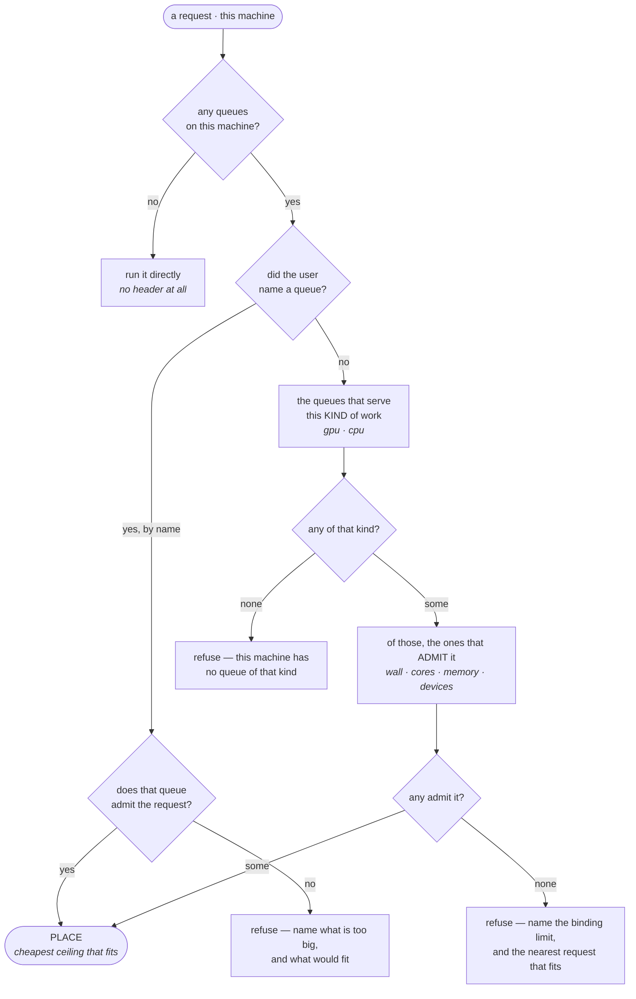
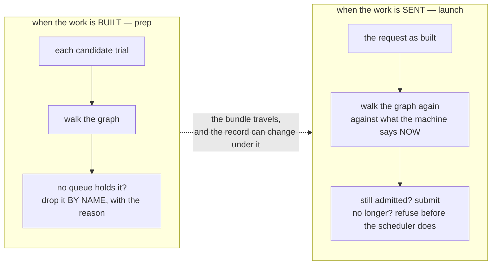

# The scheduler subsystem — what a machine offers, and what a job may ask of it

**Role:** contract
**Domain:** execution

**Companions:**
[`execution/job-system.md`](?doc=execution/job-system.md) § 6 — submission and
routing as the job system sees them (**this document is the mechanism its
design decision #4 always needed**);
[`execution/running-a-job.md`](?doc=execution/running-a-job.md) § 3.1, § 5.3 —
what each `#SBATCH` line *means*, which stays there;
[`configuration.md`](?doc=configuration.md) § 5 — **M-1**, the fact/preference
split this subsystem must not blur;
[`execution/preparing-for-another-machine.md`](?doc=execution/preparing-for-another-machine.md)
— which machine a `prep` is *for*, and how a record gets here.

Scheduling work was spread across five modules — `environment.py`,
`scheduler_probe.py`, `jobset/submit.py`, `runwrap.py`, `runtime_config.py` —
carrying roughly 450 mentions of partitions, queues, ceilings and directives
between them. This document says what that subsystem *is*, so the pieces have
one home and one set of rules instead of one treatment per place someone
noticed a problem.

> **Status**, 2026-08-23. **All five phases of § 8 have landed:** `record`, `probe`,
> `admit` and `place` are the subsystem, `molbuilder.scheduler` is the
> package, placement is one walk that both the group and single-job paths
> take, and the header and the flags are two renderings of one `Directives`.
>
> Two things this document specifies that the record does not yet support,
> both found while implementing it and both recorded rather than quietly
> patched: **`Domain.gpu` has two shapes** — probed rows map type→count,
> hand-declared rows describe one device with named keys — and admission
> reads both because both are in live records; and **R9 needs two records**,
> the bundle's snapshot for routing and the machine's own for the re-check,
> because routing resolves the calculation scope first and re-admitting
> against the snapshot compares a request with the record that built it.
>
> § 1's table is written in the **past tense on purpose**: it records where
> each responsibility lived when the two Sol failures happened, which is the
> evidence for why the subsystem exists. It is history, not a map.

---

## 0. What this document owns

**Owns:** whether a request fits a queue; which queue a request is placed in;
and the directives that placement produces. The vocabulary below (*machine*,
*domain*, *request*, *placement*) is defined here.

**Does not own:** the meaning of an individual `#SBATCH` line
(`running-a-job.md` § 5.3), the on-disk shape of `environment.json`
(`configuration.md` § 5), which machine a bundle is prepared for
(`preparing-for-another-machine.md`), or the schedule of the work
(`roadmap.md`, rule R3).

---

## 1. Why a subsystem, and not five modules that cooperate

Two failures on ASU Sol, three days apart, were the same defect seen twice.

**2026-08-23, a grouped benchmark was refused by the scheduler.**
`QOSMaxWallDurationPerJobLimit`. Sol records domains cheapest-ceiling-first,
so the first GPU-capable row is `htc/debug` at 15 minutes. The GPU branch of
routing took that first row without regard to duration, asked afterwards
whether it fit, got "no", and returned "no preference" — which meant *the
rendered header's directives stand*, and the header named that same row. A
38-minute job went into a 15-minute ceiling while `htc/public` (4 h) and
`general` (14 d) sat further down the same menu. The CPU branch, four lines
below, had always walked the menu for a row that fits.

**The same day, by hand.** `sbatch <trial>.sbatch` died the same way, for the
opposite reason: the header named a queue and stated **no** wall at all, so
SLURM applied the partition default — longer than the QOS it had just named
permits. `jobset launch` never saw it, because it passes `-t` on the command
line where flags win. The trap was armed only for a human.

Neither is a coding slip. They are what happens when **five things that are
one thing** have no home:

| responsibility | where it lived |
|---|---|
| describe a machine (probe → record) | `scheduler_probe.py` + `environment.py` |
| read records (scopes, named targets) | `environment.py` |
| **decide whether a request fits a queue** | nowhere — see § 2 |
| **choose a queue for a request** | inside `jobset/submit.py`, the *bench submission* module |
| **emit directives** | **two emitters**: `runwrap.py` (the header) and `jobset/submit.py` (the flags) |

Placement living inside bench-submission is why the CPU and GPU branches were
written separately and disagreed. Two emitters is why one half of a placement
could name `debug` while the other asked for 38 minutes.

And the rule was already written. `job-system.md` § 6 says the framework
*"refuses to emit a header it knows will be rejected (design decision #4)"*.
The rule existed; nothing was in a position to enforce it.

---

## 2. The check that was missing

`Domain` has carried four constraints since it was written. What compared a
**request** against them, before 2026-08-23:

| constraint | who checked it | when |
|---|---|---|
| `gpu` | the GPU row selector | prep and launch |
| `max_cores` | one call site, prep's per-family cap | prep only |
| `max_time` | nothing | never |
| `max_mem_gb` | **nothing. Declared, serialised, round-tripped, read by no code at all.** | never |

Four facts, four treatments, three moments, one never implemented. That is not
four bugs. It is one missing function.

> **A field the record carries and no code reads is the signature of this
> defect.** `max_mem_gb` was not forgotten by accident — there was no place
> where *"does this fit?"* was a question anybody had to answer, so nothing
> ever pulled it into use. When the subsystem exists, adding a column to the
> record and not comparing it becomes visible: § 3's R2 makes admission total.

---

## 3. The rules

**R0 — A partition is a QUEUE, not a machine type.** Added 2026-08-27, and
it is the premise the rest of the core rules rest on. ASU Sol's `htc` is 51
nodes of 48 cores with A100s, 3 of 64 with MIG slices, and 134 of 128 with no
device at all; `general` and `public` hold the same mixture, and what
separates the three is the **wall clock** — 4 h, 7 d, 14 d. Four others
(`highmem`, `gaudi`, `arm`, `fpga`) genuinely *are* hardware classes.

So **the machines are the measurement, and any single figure over them is an
opinion.** A domain carries `node_types` — every distinct machine, with its
count, memory and devices — and the person reads it. `max_cores` remains as
the **widest** of them, which is the only core figure a refusal can honestly
use — see R3's corollary.

> **Two consequences worth stating.** Hardware cannot be chosen by choosing a
> partition; that is `--gres` or `--constraint`. And a device is a property of
> a *machine*, not of a queue: `htc` offers A100s and it offers 128-core
> nodes, but never both at once — which no single figure could have said.

**What a person is shown: the maximum core range, and the node count.** Each
machine has a maximum — its own core count — so a queue holding several has a
**range** across them; `htc` is `48-128`, and a queue of one machine shows one
number rather than `128-128`.

> **The low end is not a floor on the ask.** A `-c 4` job gets four cores on a
> 48-core node; you can always ask for less than a machine has. Naming it a
> *minimum* would say the opposite, which is why it is not called that.

**The machines are grouped by SIZE, not by the row `sinfo` printed.** The
freshly probed `htc` has **fourteen** gres groups — nine of them 48-core rows
differing only in which card they carry — and one line each ran the menu to 68
lines, which is the opposite of showing what exists. Size is what a person
picking a machine chooses between; the cards available *at* each size ride
along, because that is the pairing no single figure could state:

```
  1  htc   htc/public   4h   48-128   501 GB   a100 x4, h100 x8, l40 x4, …
       -  128 cores  x137 node(s)  503.2-1511.2 GB  a30, gpu, h200, h200.35gb
       -   96 cores  x2 node(s)    1007.4 GB        h100
       -   64 cores  x4 node(s)    503.5 GB         a100.40gb
       -   48 cores  x69 node(s)   501-503.5 GB     a100, a100.20gb, a30, h100, l40
          64 cores fits 143 of 212 nodes here (67%)
```

> **Read the last two columns together.** On `htc` you can have 128 cores or
> you can have an A100 — never both. That is a fact about *machines*, and no
> queue-level figure can carry it.

**The range alone misleads, so the fitting node count rides with it.** Reading
`48-128` you would take 128 for the rare extreme. On `htc` it is **134 of 188
nodes** — the common machine, with the 48-core GPU nodes in the minority — so a
large CPU ask there costs almost nothing in scheduling, the opposite of what
the range implies. The same 64-core ask lands on 94% of `general` and 72% of
`htc`, and neither figure is a field: both fall out of the machines.

> Node counts are still only a proxy for **wait**. What a queue costs *today*
> is `--mode ask` (`running-a-job.md`), which asks the scheduler.

**R1 — A placement is decided once.** The `#SBATCH` header and the `sbatch`
command line are two *renderings* of one placement, never two decisions. They
cannot disagree, because there is nothing to disagree about.

**R2 — Admission is total over the named limits.** Every limit `Domain`
*declares* — `max_time`, `max_cores`, `max_mem_gb`, `gpu`, `node_types` — is
compared against the request. `node_types` is read by `_widest_node`, which is
what keeps it a limit rather than a display: it arrived with its comparison
(2026-08-27), which is what this rule asks of a new field. A new declared limit arrives with its comparison or it
does not arrive; that is what stops another `max_mem_gb`.

`extra` is the deliberate exception and the only one: it holds columns a probe
saw and this reader does not interpret, and `Domain`'s own rule governs it —
*"a reader owns only the keys it checks."* Keeping an uninterpreted column is
honest; **silently failing to compare a declared one is the defect.** The
difference is whether the field has a name in the type.

> **Memory needed one unit before R2 could hold for it,** and got one in
> phase 3. The record states gigabytes as a number; a job states memory as
> SLURM text (`"390G"`), and nothing converted between them — which is the
> whole reason `max_mem_gb` was read by no code at all. A limit that cannot be
> expressed in the same unit as the ask is a limit that will never be checked.
> `parse_mem_gb` is that conversion, and `--mem=0` maps to *no stated limit*
> rather than zero, because in SLURM it means **all** the node's memory.

**R3 — An unstated limit never bars.** A domain that does not state a ceiling
is not claiming a small one; a ceiling that cannot be parsed is not a
refusal. Silence is permission — the opposite reading would make a
partially-probed cluster unusable.

> **The corollary that was violated for months.** *Refuse only what the record
> positively rules out* — so a core ceiling must be the **widest** machine,
> because SLURM will not place a job on a node too small; it waits for one
> that fits. `max_cores` was a MINIMUM across GPU groups for a gpu-capable
> partition and a MAXIMUM across all groups for a cpu-only one, and admission
> compared both as one number. The floor reading refused a declared 64-rank
> CPU trial on a partition whose CPU nodes have 128 cores. Fixed 2026-08-27 by
> R0: keep the machines, and derive the ceiling from them.

**R4 — A refusal names the numbers.** *"needs 38 min but debug allows
00:15:00"*, not *"does not fit"*. We hold the record; sending a user to read
`scontrol` for numbers already on disk is the failure this subsystem exists to
end.

**R5 — A header must be submittable on its own.** If it names a queue it
states a wall that queue accepts. When nothing else supplies one, the queue's
own ceiling is the value — the only number that queue can never reject as too
long.

**R6 — Refuse before submitting, when the record already says so.** The
existing `job-system.md` § 6 rule, now with somewhere to live. A machine whose
record lists **no** domains is a different situation: nothing was promised,
and the header stands.

**R7 — Callers ask what they know.** `prep` knows cores and devices but not
duration; `launch` knows all of them; a caller asking about *capability* asks
about nothing else. An unasked constraint is `None`, and `None` is never a
refusal. This is what lets one admission function serve every caller without
each growing its own variant.

**R8 — Measurements from the record, preferences from the config.** M-1
(`configuration.md` § 5) is not relaxed here. What a queue *allows* is a
measurement and is read from `environment.json`. Which queue you *want* is a
preference and is read from `molbuilder.json` or `--domain`. This subsystem
reads both and mixes neither.

**R9 — What was admitted when the work was BUILT is re-admitted when it is
SENT.** A request built under weaker knowledge must not be submitted under
better knowledge without being re-checked.

> This is the rule the Sol case actually needed, and the one neither failure
> in § 1 exposed. `prep` already drops a trial no queue can hold — it walked
> that branch for the Au-BDT-Au sweep and found **no limit to apply**, because
> the record it had said `max_cores: None` for every GPU row. That record
> predates `max_cores` being probed. The machine has since learned its GPU
> nodes hold 48 cores; the bundle still carries 64-rank trials; and `launch`
> compares only the wall, so nothing notices on arrival.
>
> Both records are on disk — the bundle's snapshot and the machine's own — so
> comparing them costs a read. A bundle that travels is exactly the case where
> the two can differ, which is why this rule belongs to a subsystem that
> spans build and send rather than to either one.

**R10 — A refusal names what *would* fit.** Not *"64 cores is too many"* but
*"this queue holds 48; the largest rank count that fits is 48"*. The graph in
§ 5 knows which limit bound, so it knows what to suggest, and a refusal that
stops at "no" leaves the user guessing at the number we are already holding.
R4 says name the numbers; this says name the way out.

---

## 4. The vocabulary

- **Machine** — one host or cluster, as measured: scheduler kind, topology,
  site, and its domains. Persisted as `environment.json`
  (`configuration.md` § 5).
- **Domain** — one reachable `(partition, qos)` pair and what it allows:
  `max_time`, `max_cores`, `max_mem_gb`, `gpu`. *A fact, never a preference —
  it says "you may submit here, for this long", never "submit here".*
  `node_type` describes the hardware and constrains nothing. `extra` holds
  columns this reader does not interpret (R2).
- **Device** — one kind of accelerator the nodes of a domain offer: a type, a
  per-node count, and a memory size when the record states one. The
  **interpreted** form of the `gpu` column, and the only form any caller sees.
  The column itself arrives in two spellings, because two things write it — a
  probe maps gres type to count (`{"a100": 4}`; `sinfo` reports no memory), and
  a person describes one device (`{"type": "a100", "per_node": 4, "mem_gb":
  80}`, the shape [`asu-sol.md`](?doc=execution/asu-sol.md) § 5.3 tells them to
  write). **Two spellings of one fact are allowed; two readings of it are not.**
  The record reads the column once, behind `Domain.devices`, and hands out
  devices. Reading it at the call site instead is what made a hand-declared row
  refuse `prep bench` with *"records several GPU types (mem_gb, per_node,
  type)"* — a reader that knew only the map, naming the descriptor's own keys
  as devices. *A count the record does not state is `None`, never zero: R3
  applies to devices too.*
- **`gpu_partition`** — where a GPU job goes when that differs from the
  domain's ordinary partition. **A declared field since phase 3**, and so
  subject to R2. Until then it rode in `extra` — the bag documented as
  uninterpreted — and was read by two call sites in routing that reached past
  the type to a raw key. A value that changes where a job lands is a field, or
  it is a bug waiting for someone to misspell it.
- **Request** — what one job asks for: ranks, cpus-per-task, GPUs, memory,
  wall, exclusivity. Fields the caller does not know are `None` (R7).
- **Placement** — a request bound to a domain, with the reasoning that chose
  it. The single decision R1 refers to.
- **Directives** — a placement rendered for the scheduler, in the two
  spellings it needs: header lines and command-line flags.

A **workstation** is a machine with no domains. It is not an error state: it
yields no header at all, and the job runs directly.

---

## 5. The decision graph

Placement is one walk, not a pile of conditions. Every branch below is a rule
from § 3; drawing it is what stops the CPU side and the GPU side being written
separately and disagreeing, which is § 1's first failure.



**A named queue is checked like any other.** The `--domain` branch reaches the
same admission test — your choice is honoured as a *choice*, not as permission
to skip the check. Today it is not checked at all; closing that is part of the
phase that moves placement (§ 8).

**Refusals are the graph's real output.** Three of the eight leaves refuse, and
each refuses differently, because the reason is the useful part (R4, R10).

### 5.1 The same walk, at two moments



This is **R9**, and it is the half that does not exist yet. `prep` already
walks the graph — it did so for the Au-BDT-Au sweep and found no limit to
apply, because the record it held said `max_cores: None`. The machine has
since learned its GPU nodes hold 48 cores. The bundle still carries 64-rank
trials. `launch` compares only the wall, so nothing notices on arrival.

The two records that must agree are both already on disk: the snapshot beside
the bundle, and the machine's own. Re-walking costs a read.

---

## 6. The shape

```
scheduler/
  record.py   Machine · Domain · Topology · Site; read/write; scopes; named targets
  probe.py    detection (sinfo / scontrol / lscpu) -> a record
  admit.py    admits(domain, request) -> [reasons]        # R2, R3, R4, R7
  place.py    place(machine, request, *, prefer_gpu) -> Placement   # R6
  emit.py     Directives(placement) -> header_lines() · sbatch_flags()   # R1, R5
```

Honestly graded, these are not equally forced:

- **`admit.py`, `place.py`, `emit.py` are forced by measured defects** — the
  four-treatments table in § 2, the two divergent branches, the two emitters.
  Each has a failure on Sol behind it.
- **`record.py` and `probe.py` are relocations.** They work today. They move
  because the three above need a home to be *in*, and leaving the data model
  in a general-purpose `environment.py` is what let the check drift away from
  the record it checks.

`emit.py` is unapologetically SLURM syntax. The *boundary* is not: the code
already models two scheduler kinds (`slurm` and `workstation`), and a header
renderer that returns nothing for a workstation is the second kind being
handled. Naming the package for SLURM would bake one kind into the boundary
and be wrong the first time anything else appears.

---

## 7. What a caller sees

```python
req = Request(ranks=64, cpus_per_task=1, gpus=2, gpu_type="a100",
              mem_gb=390, walltime_s=38 * 60)

placement = place(machine, req, prefer_gpu=True)
#   -> htc/public          (debug is skipped: 15 min < 38 min, R3 not engaged)
#   -> Unplaceable(reasons=[...]) when nothing admits it (R6), each reason
#      naming its numbers (R4)

d = Directives(placement)
d.header_lines()    # what the .sbatch carries, wall included (R5)
d.sbatch_flags()    # what the command line carries
#   the same placement, twice (R1)
```

`--domain NAME` names the placement instead of choosing one. It is still
**admitted**: naming a queue that cannot hold the job earns R4's refusal, not
silent acceptance — the user's explicit choice is honoured as a choice, not as
permission to skip the check.

---

## 8. Migration

Smallest risk first; each step separately testable and separately revertable.
The schedule is `roadmap.md` § 7.6, not here (R3).

1. **Move the record and the probe.** Pure relocation. *(Done 2026-08-23.)*
2. **Move admission.** `domain_admits` already exists and has one caller.
3. **Typed rows instead of dictionaries.** *(Done 2026-08-23.)* The record is
   a dataclass, but the queue menu was handed out as `List[Dict[str, Any]]` —
   `get_routing` built `Domain`s and then threw the type away on its last line
   with `to_row()`, so every placement function poked at a plain dict with
   `row.get("max_time")` and nothing could tell a real column from a typo. That is *how* `gpu_partition` came to
   redirect real work from inside the unexamined bag (§ 4): nothing checks a
   dictionary key against a declared field. Steps 4 and 5 both assume typed
   rows, and R2's memory comparison needs the unit conversion this step gives
   the request.
4. **Move placement out of `jobset/submit.py`.** *(Done 2026-08-23.)* The CPU
   and GPU branches became the single walk of § 5; `--domain` now goes through
   admission like everything else; and **R9** arrived with it, because the
   walk is finally callable from both moments. Two corrections fell out of
   doing it: R3 had to be extended to devices (a domain that states no GPU
   inventory is not claiming it has none — refusing on silence made a terse
   record unusable the moment the named path started being admitted), and
   preferring nodes that *do* have devices stayed in `candidates`, where a
   choice belongs, rather than migrating into admission.
5. **Unify the emitters.** *(Done 2026-08-23.)* `scheduler/emit.py` renders
   the facts both spellings carry — queue, wall, ranks, cores, devices, and
   the `--exclusive`/`--mem` mutual exclusion. `-J`, `-N`, the account, mail
   and the output paths stay with the header: the command line does not also
   decide them, so they cannot drift from it. The one place the renderings
   differ is verbosity, not meaning — the header adds `--mem=0` beside
   `--exclusive` because a person reads that file.

**The gate for step 5** is a test that renders both spellings from one
placement and asserts they name the same queue and the same wall — the
assertion neither emitter could have made alone, and the one that would have
caught both Sol failures before they left the workstation.

**R9 rides step 4**, where the walk becomes callable from both moments.
