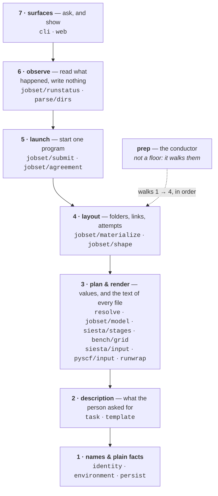
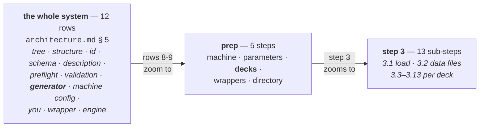
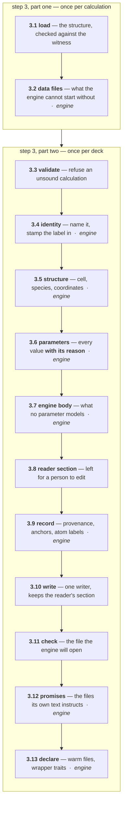
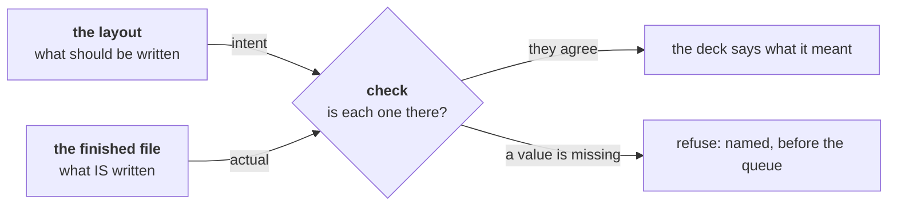
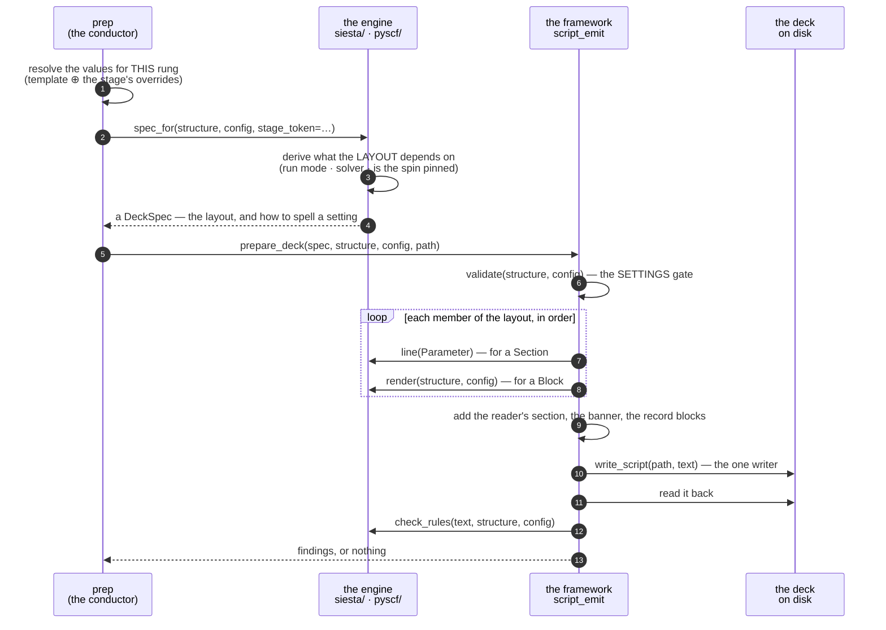
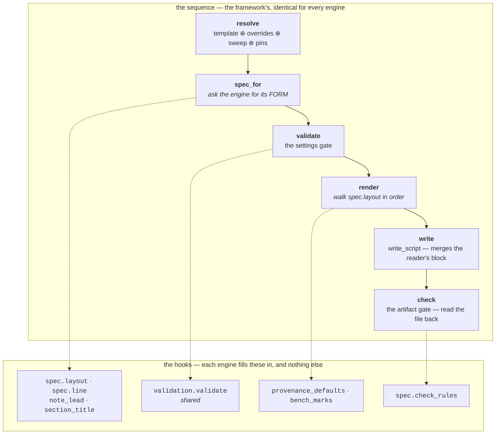
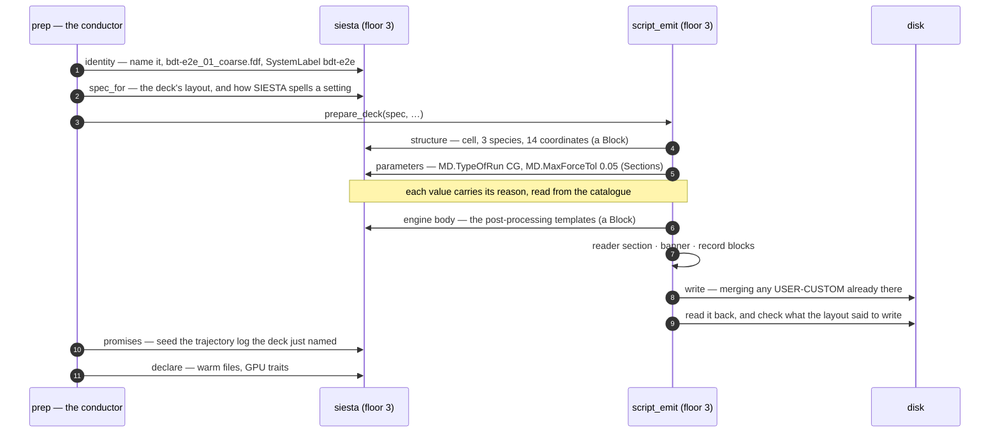

# The preparation layer — three questions, and only three

**Role:** contract
**Domain:** execution

**Companions:**
[`execution/architecture.md`](?doc=execution/architecture.md) — the floors and
the decision chain this refines;
[`execution/generator.md`](?doc=execution/generator.md) — what every value *is*
and where it came from, the half of this layer that is not about files;
[`execution/project-layout.md`](?doc=execution/project-layout.md) — the tree
step 5 builds;
[`engines/template.md`](?doc=engines/template.md) — the item model the **parameters** step reads.

> **This document is the preparation layer's structure**: where code may look,
> when each thing happens, and what an engine has to supply — from a described
> calculation to a directory you can submit.

---

## 1. Three questions

Preparation has exactly three structural questions, and this document is those
three:

| | question | answered by |
|---|---|---|
| **space** | where may code look? | **the floors** — § 2 |
| **time** | when does each thing happen? | **one sequence, three resolutions** — § 3 |
| **the seam** | what does an engine supply? | **fifteen questions** — § 4 |

Two things that look like layers are not, and naming them keeps them out of the
way. **The five axes** ([`architecture.md`](?doc=execution/architecture.md) § 0)
answer *what varies* — surface, environment, shape, engine, kind. **The nine
vocabularies** (§ 10 there) answer *what things are called*, and where one naming
becomes another. Neither says where code lives. **The four routes** — `describe`,
`prep`, `launch`, `status` — are the ways in, not a layer either.

**No engine is bent to another.** SIESTA cannot start without a pseudopotential
for every element; PySCF ships its basis sets inside the library and needs no
data file at all. SIESTA's deck is a list of keywords a reader may scan in any
order; PySCF's is a program that runs top to bottom. Those differences are real
and belong to the engines. What is shared is **which questions get asked, and in
what order** — so *"what does this engine still owe?"* is answered by reading
down a list, and a blank is visible.

---

## 2. SPACE — the floors, at two resolutions

### 2.1 The seven floors



Solid arrows are the ordinary way down: **a floor may call down and return up,
and may never reach across.** One shortcut is allowed and not drawn, to keep the
picture to one idea — *any* floor may reach straight to floor 1, because floor 1
holds plain values and keeps no state. `launch` asking `identity` for a name is
floor 1 doing the job it exists for, not a violation.

### 2.2 L1 / L2 / L3 is the same axis, coarsened

They are one axis at two resolutions. The floors are the design; L1/L2/L3 is
the partition a test can enforce cheaply:

| import layer | floors | why the grain differs |
|---|---|---|
| **L1** | 1 · names & plain facts, the leaf half of 2, **and everything outside the floors** — the structure model, the chemistry, the config classes | things with no domain dependencies — a test can check "imports nothing above" cheaply and exactly |
| **L2** | the rest of 2, and 3 · 4 · 5 · 6 | the verbs |
| **L3** | 7 · surfaces | `cli` · `web` |
*(Six of the decision chain's twelve rows sit outside the floors altogether — the
project tree, the structure model, the preflight and the validators, the wrapper
and the engine at run time. They are separately-owned contracts that hand this
stack their results; `architecture.md` § 5.1 lists which.)*


**One straddle, and it is deliberate.** Floor 2 holds `task` (L1) beside
`template` (L2): a description must be readable by every surface without pulling
in the engines, so `task` sits as a leaf; `template` imports the config classes
and cannot. Recorded rather than smoothed over, because a reader who finds it and
thinks it is a mistake will "fix" it and break the leaf posture.

> **L1/L2/L3 is the enforced coarse grain; the floors are the design.** The test
> checks the partition it can check. The floors are what a reader reasons with.
> Neither is a second scheme.

### 2.3 Two placements worth stating outright

**`runwrap` is on floor 3, with the other renderers.** It turns decided values
into text, exactly as an engine's deck writer does, and it imports nothing
above floor 3. Floor 5 therefore has one job — *start a program* — and the
preparation sequence walks the floors without ever going backwards, which is
§ 5's rule.

**`prep` is not a floor. It is the conductor**: it walks floors 1 → 4 in order
and owns no decision of its own, which is why it is drawn beside the stack rather
than in it.

> **W1 · The conductor may call, but it may never decide.** Every decision
> belongs to a floor. A value settled inside `prep` is a value no floor owns, and
> that is the shape of the "stomp" failures — an allocation re-applied over
> per-element resources floor 3 had already resolved. **Only a surface may import
> the conductor**; anything lower importing it means something inside the stack
> is driving the sequence, and the sequence has two owners again.

---

## 3. TIME — one sequence, three resolutions

The decision chain, the five steps, and the inside of step 3 are one time axis,
zoomed three times:



Each box is the one above it, opened up:



**Each sub-step has a name, and the name is what to use.** The number is only its
position in the sequence — it is not a version, and prose that says "3.9" instead
of "the record" is prose a new reader has to decode:

| | name | what it does |
|:--:|---|---|
| 3.1 | **load** | read the structure; check it still matches what was described |
| 3.2 | **data files** | put in what the engine cannot start without — pseudopotentials |
| 3.3 | **validate** | refuse an unsound calculation before writing a line of it |
| 3.4 | **identity** | name the file; stamp the label into the deck |
| 3.5 | **structure** | cell, species, coordinates, frozen atoms, region labels |
| 3.6 | **parameters** | every resolved value, each written with its reason |
| 3.7 | **engine body** | what no parameter models — a run loop, a post-processing template |
| 3.8 | **reader section** | the one block a person is meant to edit |
| 3.9 | **record** | provenance, benchmark anchors, atom labels, behind a do-not-edit banner |
| 3.10 | **write** | one writer, which keeps whatever the reader put in their section |
| 3.11 | **check** | read the written file back — **the exact text the engine will open** — and refuse if it is wrong |
| 3.12 | **promises** | the files the deck's own text instructs someone to run |
| 3.13 | **declare** | what this job may reuse, and what the wrapper must route on |

**Load** and **data files** run once per calculation; **validate** through **declare** run once per deck.

A ladder of two
stages runs the tail twice; a benchmark of nine trials runs it nine times. That
is `project-layout.md` § 2.3.1a — *benchmarking is `prep` whose parameters are a
set rather than a point* — reaching all the way down.

### 3.1 Why each order is forced

Every adjacent pair is a data dependency, not a convention.

| this must precede this | because |
|---|---|
| 1 → 2 | a value can be derived from the rank count — a block size is |
| **step 2 → identity** | the stage token and the trial coordinate that name a file come from the resolved set |
| **load → data files** | the structure's elements are what say which data files are needed |
| **validate → structure** | refuse an unsound calculation before writing a line of it |
| **data files → write** | a refusal must arrive before a folder is half-built |
| **structure → parameters** | forced by the language when the deck is a program that executes top to bottom, as PySCF's is; the same convention when it is a keyword list, as SIESTA's is |
| **write → promises** | the promise is made by the text that was just written |
| **write → step 4** | the wrapper reads the finished deck for the environment and the rank clamp |
| **declare → step 4** | the wrapper's header carries the job's own resources |
| 4 → 5 | the tree links to what was rendered |

**load → data files is the pair that reads backwards until you see why.** *Which*
pseudopotentials to copy is answered by the structure's
element list, and there is no other honest source: a list recorded in the
description would be a second answer to *which elements is this a calculation of*,
free to disagree with the first.

**There are two gates, and they are separate on purpose** — **validate** (3.3)
reads the resolved config before anything is written; **check** (3.11) reads the
file on disk, exactly as the engine will open it. **Neither can do the other's
job**: the config gate never reads the output, so it cannot see a writer bug —
the whole class of defect this layer exists to end — and the script check runs
after the work is done, so it cannot spare you a calculation that was unsound to
begin with. § 4.3 has the full comparison, and has it once.

**Validate runs per deck, not per calculation**: a ladder's rungs are different
configurations, and `tight` can be unsound while `coarse` is fine. Its rules are
`science/validation.md`'s — decision-chain row 7, owned outside this stack and
called from inside it. Everything upstream of the final script — the description,
the form, the resolved values — is already gated by that framework and by the
UI's own modules, and **this layer does not re-check them**.

**Check reads the written file, and that is deliberate.** The text handed to
**write** is not what the engine opens: `write_script` merges the reader's own
section from whatever was already there, so the assembled text is an intermediate
and the file is the artifact. Checking the intermediate would check something
nobody runs.

It reuses the existing machinery rather than inventing a second one — the `Issue`
type, its severity model, and `report()`, so a refusal here reads like every
other refusal in the tree. What is new is only the **subject**: no check in this
tree has ever read a produced artifact.

> *(`render_checks` on TRANSPORT's engine base is named as though
> it were this, and is not: it takes `(struct, cfg)` and runs before emission. It
> is a config gate with a misleading name.  Spectra's engine base died at P3;
> its science lives as `validation/spectra.py::spectra_render_checks`, run by
> the ONE settings gate.)*

### 3.2 The three rules inside step 3

> **W2 · A value is written together with the reason it holds, and the reason is
> read from where the value came from.** One act, not a value plus a habit of
> typing a comment near it. The catalogue already carries each parameter's
> default, range, and the note saying why this project chose what it chose.

> **W3 · Nothing reaches a deck until the last thing that can refuse has
> refused.** A missing pseudopotential costs one second to find at **data files** and a queue
> wait plus MPI startup to find on the cluster — and in between sits a folder
> half-built, which reads to its owner as a folder that worked.

> **W4 · One deck is written by one writer, and the writer keeps what the reader
> put in their own section.** Rendering produces text; writing merges that text
> over what is on disk. Any route that reaches for a plain write destroys a
> person's edits.

**Why W2 matters, measured.** Counting comment lines the three generators write
into their output:

| | SIESTA | PySCF | the wrapper |
|---|:--:|:--:|:--:|
| values written with a reason **read from the catalogue** | **23** | **0** | **0** |
| comment lines written **by hand** | 317 | 231 | 260 |
| …of which state a number | 115 | 45 | 38 |

Read the middle row honestly: it is an upper bound, not a defect count. Most are
section headers, commented-out examples, and prose that explains rather than
claims. **The defect is that you cannot tell which are claims**, because today a
heading and an assertion about a value are the same kind of object — a string
somebody typed. The five wrong claims about restarting that the wrapper carried were each one
sentence typed once, beside a value that later moved, indistinguishable among
260 siblings. **SIESTA is
not exempt** — 115 hand-typed lines there carry a number too.

---

## 4. THE SEAM — fifteen questions, fourteen of them in step 3

**An engine supplies two kinds of thing, and adding one touches no shared file.**
The first is **its rows in the catalogue** — every parameter it models, declared
in the one shared file rather than in a file of its own.
[`generator.md`](?doc=execution/generator.md) § 7 owns that half, and counts
where each engine stands on it.

The second is **an answer to each question below** — the code half, stated as
data rather than as a branch. Indexed by *when it is asked*, which is what makes
a gap visible:

| step | the question | today's member | may it answer "nothing"? |
|:--:|---|---|:--:|
| **2** | the class the values rebuild into | `config_cls` | no |
| **3.2** data files | what the engine cannot start without | `provide_data` | **yes** |
| **3.2** data files | which of those are the shared package every job links | `shared_package` | **yes** |
| **3.3** validate | whether this resolved config is sound | *shared* — `validation.validate` | no |
| **3.4** identity | the deck's type suffix | `suffix` | no |
| **3.4** identity | where the label is read | `label_of` | no |
| **3.4** identity | how the label is written in | `relabel` | no |
| **3.5** structure | the structure block | `spec.layout` — a `Block` | no |
| **3.6** parameters | which items, in what order, and how each is spelled | `spec.layout` + `spec.line` | no |
| **3.7** engine body | what no parameter models | `spec.layout` — a `Block` | **yes** |
| **3.9** record | the values only this engine can supply for two blocks | `spec.provenance_defaults` · `spec.bench_marks` | **yes** |
| **3.11** check | what a finished deck of this engine must satisfy | `spec.check_rules` | **yes** |
| **3.12** promises | files its own text instructs | `sibling_artifacts` | **yes** |
| **3.13** declare | what may be reused from an earlier run | `warm_for` | no |
| **3.13** declare | what the wrapper must route on | `traits_for` | no |

**Everything marked `spec.` arrives through ONE seam member** — `spec_for`,
*(structure, config, stage_token) → DeckSpec* — because they are all the engine
describing its deck. The rest are per-job facts the conductor needs before or
after the deck exists.

**Fourteen of the fifteen are inside step 3**, and the fifteenth is a single
question at step 2. **Step 3 is the engine's step; steps 1, 4 and 5 are the
framework's alone.** An engine author reads one section.

### 4.1 What the table makes visible

**Three rows say `spec.layout`, and that is the shape of a deck.** Structure,
parameters and free-form body are not three doors an engine opens in turn —
they are members of ONE ordered table, because a deck interleaves them: a cell
sits between two runs of settings, a run loop after a third. A framework that
appended its free-form parts after the sections could describe neither engine's
deck, and that is why an engine writing its own tail was the only way to build
one.

*Until 2026-08-18 those three rows read **inside `render_deck`***, one callable
answering five questions at once — which is why *"does this engine write its
values with their reasons?"* cost a 1,168-line read to answer.

**Being a table is not the same as being filled in, and for a day it was not.**
Both engines put their whole deck in one `Block` and called the framework's
section walk from inside it, once per section — nine times in one SIESTA deck.
The type was satisfied and the question was not: `spec.layout` answered *what is
in this deck?* with "the deck", and because the sections were rendered where the
walk could not see them, a 728-line SIESTA file reported **zero** written
keywords and the check gate's loop-closing rule passed on an empty list. Fixed
2026-08-19; the walk is private now, so there is no door for an engine to start
a second one. `tests/test_deck_runner.py` asks both real forms, and not only the
stub.

**The record row is the engine's VALUES, not its blocks.** Provenance, bench
marks, atom metadata and the banner are assembled in one place by the framework;
the engine says only what a row of them should contain. Three assemblies of one
idea — one per engine and one in the framework — agreed only because they were
written together.

**Three rows a reader should look at hardest**, because each names a way a deck
can be wrong that no other step can see:

- **The shared package.** Which data files every job links is the engine's
  answer, not a glob. It was `*.psml` in shared code — a SIESTA fact stated a
  floor below where SIESTA may speak, so a second engine with data files of its
  own would have shipped none of them.
- **Check** is the only step that reads a PRODUCED artifact. Every other
  validator takes `(struct, cfg)` and runs before the text exists, so none of
  them can see a writer bug: a generated program that does not parse, an
  identity that is not the one that was stamped, a keyword written twice.
- **Data files** and **promises** are the two rows an engine most often answers
  *nothing* to, and W5 is why that answer is written down rather than left
  silent.

> **The test of the seam:** adding an engine adds files and edits none. If a new
> engine requires a change inside `resolve/`, `materialize` or `submit`, the seam
> has leaked and the leak is the bug — not the engine.

> **W5 · "Nothing" is an answer, and it is recorded.** An engine that needs no
> data file says so; it does not stay silent and let the reader guess whether the
> step was considered or forgotten. Silence is what let PySCF reach a full review
> with nobody able to say whether it *needed* a **data files** arm or merely lacked one.


### 4.2 The API, concretely

§ 4 says *what* an engine is asked. This says *in what form*, and it is two
doors and no more.

**Door 1 — the layout, as data.** The engine declares one ordered table of
what its deck contains. A member is either a **`Section`** — a run of catalogue
items, with a **name**, and where it has one the **explanation that sits between
its heading and its values** — or a **`Block`**, the text no parameter models:

```
LAYOUT = (
    Block("system, structure and constraints", …),
    Section("Basis & grid",  ("basis_size", "energy_shift", "mesh_cutoff")),
    Section("Exchange-correlation", ("xc_functional", "xc_authors")),
    Block("dispersion template", …),
    Section("SCF",           ("solution_method", "scf_tolerance", …)),
    …
)
```

**One table and not two, because a deck interleaves them**: a cell sits between
two runs of settings, a run loop after a third. A framework that appended the
free-form parts after the sections could describe neither engine's deck — which
is why an engine writing its own tail was once the only way to build one.

> **A section's `note` is why every section can keep its name** *(2026-08-18)*.
> Two of SIESTA's carry a paragraph of explanation between the heading and the
> values, and a walk that knew only headings and values had nowhere to put it —
> so those engines wrote the heading AND the prose themselves and asked the
> framework for silence. The only way to ask was a falsy title, which cost the
> section its name in the layout: a reader could not tell what
> `Section("", …)` was without going to find the writer. With the note in the
> section, no section suppresses anything, one `section_title` serves the whole
> deck, and the layout says what each part of the deck IS.

**This is engine knowledge, and it belongs to the engine** — but as a table, not
as control flow. The catalogue's `group` cannot serve here and was checked: its
vocabulary is the *form's* (`setup` · `stage` · `profile` · `budget` · `staging` ·
`output`), and one group cuts across several deck sections — `stage` alone holds
`PAO.BasisSize`, `MeshCutoff` and `DM.Tolerance`, which land in three different
places in a deck.

**Door 2 — the syntax.** Three callables, because a deck is written in an
engine's punctuation as well as its keywords, and the framework has no way to
guess either:

```
def line(param: Parameter) -> str | None     # the parameter itself
def section_title(title: str) -> str         # how a heading is a comment
def note_lead(param: Parameter) -> tuple     # what heads a parameter's note
```

Only `line` has no default. The other two are the engine's *formatting*, and
each ships one that is right for most engines.

**One of the two is exercised and one is not, and the difference is worth
stating.** SIESTA overrides `note_lead` — it heads every note with the keyword
it is about, because its notes run long and the keyword would otherwise arrive
after them; PySCF's statement sits directly under a short note and needs no
signpost. **Neither engine overrides `section_title`**: both write headings as
`#` comments, which is the default. It stays a slot because the comment
character really is an engine's syntax and the next engine may not spell it that
way — but a reader should know it is speculative rather than proven. Both
engines restated the default verbatim until 2026-08-19, which made it look like
a variation.

The framework walks `LAYOUT`, turns each item name into a `Parameter` through the
one door — `script_emit.parameter(name, engine, config=cfg)` — and hands it over.
The engine returns `SolutionMethod    diagon`, or `mf.max_cycle = 40`, or `None`.

**`None` is how a conditional keyword is expressed**, and it is the whole
mechanism: `MD.Steps` under `relax_type = "none"` simply is not emitted. No
predicate table, no `if` in the framework.

> **This door is what makes W2 structural rather than aspirational.** The engine
> is handed a `Parameter`, and the framework writes `param.note()` above whatever
> the engine returns. **A value cannot reach a deck without its reason**, because
> the engine never sees a bare value to write.

> **`Block` was a door of its own until 2026-08-18** — `structure_block(struct,
> cfg)` and `body(struct, cfg, ctx)`, appended by the framework after the
> sections. Both engines then wrote their whole deck through it, sections
> included, and a layout of one block is a layout that says nothing.

#### The membership rule, and why it is the load-bearing half

> **W9 · What the layout CONTAINS is settled when the spec is built; what each
> member SAYS is settled when the framework walks it.**

A section that appears only for some calculations is **left out of the layout**
for the others. `spec_for` is handed `(structure, config)`, so it can answer
that — a single-point run has no geometry section, an ELPA-free deck has no
GPU switch. What it must not do is hide the section inside a block and decide
there, because then the layout is a function again and § 4.3's *"a form can be
read"* is false.

**The cost is one rule and it is worth naming.** Values the *membership*
depends on must be derived before the layout exists — which run mode this is,
which solver, whether the spin is pinned. Every one of them is a function of
`(structure, config)` alone, so there was never anything to wait for; they were
computed mid-deck only because that is where they were first needed. Values a
*member's text* depends on are still worked out while the deck is written, and
both kinds live in one place:

> **W10 · An engine keeps ONE per-render context — *what this deck derived* —
> and every reader takes it whole.** The layout reads it to decide membership,
> the syntax door reads it to spell a derived value, the record blocks read it
> to quote one. A second channel is a second answer.
>
> *SIESTA's syntax door took seven keyword arguments until 2026-08-19, one per
> derived value, so the context could carry nothing the door did not also
> declare — and the layout's own facts had nowhere to live.*

### 4.2a1 What is fixed, and what is the engine's to choose

An engine author needs to know which half is which. Measured against both
shipped writers, not asserted:

| | |
|---|---|
| **Fixed — the framework does it, identically, for every engine** | the ORDER (`prepare_deck`: validate → render → write → check); the walk down `spec.layout`; turning each `Section` item into a `Parameter` through the one door and writing `param.note()` above whatever the engine returns; the reader's `USER-CUSTOM` block; the do-not-edit banner; the three record blocks; and `write_script`, which is the only thing that touches the disk |
| **Yours — declared, not branched** | what is in the layout and in what order; whether a part is a `Section` or a `Block`; how one setting is spelled (`line`); what heads a note (`note_lead`) and how a heading is written (`section_title`); the values your record rows carry (`provenance_defaults`, `bench_marks`); what a finished deck of yours must satisfy (`check_rules`); and everything inside a `Block` |

What you declare is also **all the pipeline log can say about you** — it reads the spec, and an engine never writes to it. § 4.5.2 is that table.

> **W11 · A `Block` is free text, and freedom is exactly what it costs.** The
> framework cannot see inside one. A keyword written there gets **no note from
> the catalogue** (W2 does not reach it) and is **invisible to the check gate**
> (it contributes no line to compare). That is the price of the freedom, and it
> is worth paying only where the value genuinely is not a catalogue item.

**Where SIESTA stands today**, counting every catalogue item whose keyword
reaches the deck: **26, of which 24 go through the door.** The two that do not
are the contract working rather than failing — `SystemLabel` belongs to the
**identity** sub-step (3.4), a different question from parameters (3.6); and
`restart` expands one field into three keys from its own declaration.

*No equivalent count is given for PySCF, and the reason is worth stating: a
Python deck cannot be counted the same way. Matching a keyword against the text
catches occurrences inside string literals and docstrings, and matching against
assignments misses every setting this particular configuration leaves unset.
Three different methods gave three different totals, which is a measurement not
worth quoting. What IS established is the rule above and the named exceptions
below.*

### 4.2b The record the run leaves behind

The parameters step emits its values **twice**: once for a person, as the value
with its reason in the deck, and once for a machine — a record of what the
engine is actually set to, written into the run log before any work starts.

It answers the three questions that get asked when a result looks wrong:

| column | question |
|---|---|
| **catalogue** | what does this project recommend? — tells you whether a value was chosen or merely inherited |
| **this run** | what did the description resolve to? |
| **engine** | what does the engine actually hold? |

**The third column is read back, never echoed.** PySCF's script reads its own
`mol` and `mf` after setup, so a value that silently failed to apply shows up as
a disagreement between the last two columns. A record that restated the request
could not show that, which is the whole reason it exists.

**Where the engines differ, they differ honestly.** SIESTA is a separate process
that has not started when its wrapper runs, so *what the engine holds* is not
knowable there. What the wrapper can say truthfully is what it is handing over:
the deck with comments and blanks stripped — exactly the lines libfdf parses,
read at launch so a hand-edited deck records what will really be seen — followed
by the catalogue items the deck does **not** carry, each with the default that
therefore applies. Two columns where two are all that is knowable.

Both write the same `effective-parameters` fence, so one reader serves either.

> **W8 · The record covers every parameter, and it is generated.** Values a
> person changed, values left at the default, and values that never reach the
> engine — a molbuilder-level flag still decides what the run produces. The item
> list comes from the catalogue and each read-back path from that item's own
> `anchor`, so a new parameter joins the record with no edit anywhere. A
> hand-kept list would answer *what somebody remembered to add*.

### 4.2a What the framework owns, and the one addition needed

The framework runs **validate** through **check**, and the engine sees only its
two doors:

| sub-step | who | how |
|:--:|---|---|
| 3.3 **validate** | **shared** | `validation.validate(struct, cfg, calculation=spec.calculation)` — the engine registry by config type, the KIND registry by the declared fact |
| 3.4 **identity** | engine, as data | `suffix` · `label_of` · `relabel` |
| 3.5 **structure** | engine | a `Block` in `spec.layout` — door 1 |
| 3.6 **parameters** | **shared walk**, engine syntax | `Section`s in `spec.layout` + `spec.line` — doors 1 and 2 |
| 3.7 **engine body** | engine | a `Block` in `spec.layout` — door 1 |
| 3.8 **reader section** | **shared** | `emit_user_custom_placeholder` |
| 3.9 **record** | **shared**; the engine supplies only the VALUES | `spec.provenance_defaults` · `spec.bench_marks` |
| 3.10 **write** | **shared** | `write_script` — merges the reader's block |
| 3.11 **check** | **shared** rules + `spec.check_rules` | `check_deck` — reads the file back |

**A derived value still arrives with its declaration.** `parameter()` takes its
value from `config`, from a rendered deck, or from an explicit `value=`. That
third source is what keeps W2 reaching a number no config field holds — a block
size worked out from this deck's rank count — so it carries its range and its
note like any other. Without it every derived value would fall to a `Block`, and
W2 would stop applying exactly where the reasoning is hardest to reconstruct.

---

### 4.3 The spec, the two gates, and what crosses the seam

**A `DeckSpec` is not a name and not an id.** Nothing about it is unique: two
decks of the same engine with the same settings have identical specs, and a
deck's identity is a different thing entirely — the `SystemLabel` / `JOB`
literal, which [`run-identity.md`](?doc=execution/run-identity.md) owns. The
spec is a small form the engine fills in, and it has twelve slots:

| slot | what the engine is saying |
|---|---|
| `layout` | **which settings, in what order** — and where the free-form parts sit among them |
| `line` | **how this engine spells one setting** |
| `calculation` | **which KIND this deck is** — the settings gate composes the kind's science from it, and prep names artifacts by it |
| `note_lead` · `section_title` | how a note and a heading are written in this syntax |
| `provenance_defaults` · `bench_marks` | the values only this engine can supply for two record blocks |
| `derived` | facts computed once at spec time that later slots read (never re-derived downstream) |
| `check_rules` | what a finished deck of this engine must satisfy |
| `validate_subject` | what the settings gate judges, when it is not the structure as it arrived |
| `engine` · `created_by` | whose catalogue rows to read, and what to record as the producer |

> **Why a form and not a function.** A function can only be *called*; a form can
> be **read**. That is what makes *"every value the layout said to write is
> actually in the finished file"* answerable — the framework knows what was
> supposed to be there without trusting the writer. Handed only a function that
> returns text, it can compare the text with nothing but itself.

#### The two gates ask different questions, and neither can do the other's job

| | **validate** | **check** |
|---|---|---|
| asks | *is this a sound calculation?* | *does this deck say what it was meant to say?* |
| reads | the resolved settings and the structure | **the written file**, reopened from disk |
| when | before a line of text exists | after the deck is written |
| catches | a restricted method with unpaired electrons; a missing pseudopotential; a vacuum too thin | a generated program that does not parse; an identity that is not the one stamped; a keyword written twice, where libfdf silently takes the first; **a line the layout said to write that is not in the file, verbatim** — so a dropped setting AND a mangled value, both |
| whose | the existing validation framework, shared with the form's preflight | the engine's `check_rules` plus the shared rules |

**The second one is the genuinely new capability.** Every other validator in
this tree takes `(structure, config)` and runs before emission, so **none of
them can see a writer bug** — the deck is not an input to any of them. That is
why `check` reads the artifact and why it runs on every route that writes a
deck, not only on `prep`.

#### Why the check needs something besides the file

**Reading the file alone cannot tell you what is missing from it.** A deck with
a setting left out looks exactly like a deck that never meant to carry it — the
absence is the same absence. Only the layout knows which one it is:



**This is the only sub-step that compares two sources.** Everything else reads
one: `validate` reads the settings, the engine's own `check_rules` read the
text. Comparison is what catches a WRITER bug — a section dropped, a branch that
never fired, an escape mangled while building a string — and no amount of
reading the artifact by itself can do it, because a writer bug leaves no trace
in what it failed to write.

> **Nothing crosses the SEAM to make this possible.** The framework already
> knows what should be written — it walks the layout to write it — so it keeps
> the answer as it goes and asks the file the same question afterwards. A writer
> that handed over only finished text would have to be believed, or would have
> to pass a list of what it wrote **across the seam**, where the conductor would
> then be holding a fact it has no use for. That is what went on 2026-08-18.
>
> **The list itself is not a workaround and did not go.** It is the framework's
> own record of what its walk emitted, kept beside the text and read by the gate
> five lines later. What matters is who produces it: a list the *engine* keeps
> says what the engine believed, and the gate exists because a writer can be
> wrong. SIESTA kept exactly such a list until 2026-08-19 — filled at eight call
> sites, read at none.

#### The sequence, and what is passed at each step



**Read the arrows: the engine is never the caller.** It answers twice — *what
is in this deck?* and *how is one setting spelled?* — and decides nothing about
order. And the write and the read-back are adjacent, which is what lets the
check gate be about the artifact rather than about the string that was handed
to the writer.

**What crosses the seam is the engine's FORM**, and the framework does the rest:
`prepare_deck` runs validate → render → write → check, and is what every route
that writes a deck calls — `prep` and both `convert()`s. The order has one
owner; it was stated once per caller before.

> **Why the form and not the text.** Handed text, the conductor has nothing to
> pass on, so it performs the write and the check itself — and the ORDER of step
> 3 ends up written down once per route, free to drift. Handed the form, the
> framework can also re-derive what the deck was supposed to contain, which is
> what makes the check above possible with nothing carried alongside.
>
> **It cost one thing, and the thing is general.** A form must exist BEFORE
> rendering, so a writer cannot build its deck into a list and wrap that list —
> its layout has to render when the framework walks it. A body that renders late
> then cannot hand values to the record blocks by closing over its own locals:
> SIESTA derives `BlockSize` while writing, and the provenance and bench-marks
> rows quote it afterwards. **The engine keeps a per-render context** — *what
> this deck derived* — written as the body works and read by the syntax door and
> the record blocks alike. An engine that derives nothing keeps an empty one.

---

## 4.4 The pipeline, and where each engine plugs into it

§ 4 says what an engine is asked. This says it as a **structure**: one
top-down sequence, and for each step the hook an engine fills in. It is here
because a reader comparing two engines needs the steps to line up — code that
does the same job in a different order cannot be compared at all, only read.



**The rule this picture exists to state:**

> **W12 · One sequence, and an engine substitutes steps in it — it never
> brings its own sequence.** A step that does not apply to some engine is a
> hook that answers *nothing* (W5), not a step that engine is excused from.
> Two engines that each run their own order cannot be compared, and a rule
> proved of one says nothing about the other.

### Where the four writers actually stand

**There are four script writers in this tree, and three are on the sequence
above.** Stating it rather than leaving it to be discovered:

| | catalogue rows | seam entry | on `prepare_deck` | the artifact gate | reader's block | values carry their reason (W2) |
|---|:--:|:--:|:--:|:--:|:--:|:--:|
| **SIESTA** | 49 | ✅ | ✅ | ✅ | ✅ | ✅ |
| **PySCF** | 45 (+ the 14 vibration rows = 59 through `select`) | ✅ | ✅ | ✅ | ✅ | ✅ |
| **TranSIESTA** (`transport/`) | **0** | ❌ | ❌ | ❌ | ❌ | ❌ |
| **Spectra** (the `vibration` kind, `pyscf/vibration_deck.py`) | 14 (+ shared PySCF set) | ✅ | ✅ | ✅ | ⚠ one Block | ⚠ one Block |

*The two ⚠ cells state a real limit rather than rounding up: the vibration
deck's layout is ONE Block, so the reader's-section and
value-beside-its-reason guarantees that Sections give structurally are
delivered by the block's own emitters — honest, but enforced by review and
its render tests rather than by the framework walk.*

**Spectra crossed over** (spectra-migration plan, P0–P3 landed 2026-08-21):
a vibrational spectrum is the `vibration` calculation KIND — described,
prepped and run like any stage, with the old `spectra/engine_base.py`
registry and its `render_script(struct, cfg) -> str` generator deleted.
TranSIESTA is the one writer still on the old shape — a `Protocol` registry
in `transport/engine_base.py` whose central method returns finished
**text**, which is exactly the shape this seam had until 2026-08-18 and
gave up for the reason § 4.3 records: given text, the conductor has nothing
to pass on, so the order is written down once per route and is free to
drift.

**Why they are not simply migrated, stated plainly.** The seam has two halves
(§ 4) and those engines have neither. `parameter()` — the door that makes W2
structural — reads a catalogue declaration, and the catalogue carries no
`transport` or `spectra` rows at all. So the door is shut before the code
question is even reached, which is why a parallel abstraction was the only way
to build them. Opening it is `template.md`'s own unification direction —
*a template describes a CALCULATION, not an engine* — and is a scheduled
piece of work, not a sweep.

> **What this costs today, concretely.** `transport/_cli.py` writes an `.fdf`
> with a plain `write_text`, so W4's one-writer rule does not hold there; those
> decks carry no `USER-CUSTOM` block, no provenance record, and are never read
> back after writing. And `render_checks` on transport's engine base (the
> one that remains — spectra's died at P3) is named as
> though it were the artifact gate and is not — it takes `(struct, cfg)` and
> runs before any text exists, which makes it a second config gate with a
> misleading name.

## 4.5 The pipeline log — reading the run back afterwards

Every record in a bundle answers a different question, and until 2026-08-19
none of them answered the one asked most: **where did this value come from?**
`STAGE-PLAN.md` says what the plan *is*; `jobset-decisions.log` says which
decisions a verb took; the deck's own `PROVENANCE` block says what the writer
assumed. None says *through which step, out of which file, folded with what* —
which is what you need when one rung of a ladder converges and the next does
not.

`molbuilder jobset prep --pipeline-log` writes that record.

> **W13 · The log observes the pipeline; it is never a step in it.** Off by
> default, and with it on **every generated artifact is byte-identical**. A
> record that perturbs what it records is worse than no record.
>
> It follows that no engine may write to it. There is ONE writer
> (`molbuilder/pipeline_log.py`), and exactly two callers: the framework
> (`script_emit`), for what happens inside a deck, and the conductor
> (`jobset/prep`), for everything around it — written from what the steps
> already return. That is the layering `jobset/ledger` states: *library layers
> RETURN decision data, and the surface that acted on it appends the line.*
> § 4.5.1 is the format they both write in, § 4.5.2 what an engine owes them,
> and a test refuses any other module that imports the log at all.

**Where it lands.** Beside this prep's `STAGE-PLAN.md` — the bundle root for a
run, the stage's `bench/` container for a sweep. Inside the bundle, because the
bundle is what is still there when a job misbehaves on a cluster hours later.

**What it is called.** `<label>_<token>.<engine>.<flat|hierarchical>.pipeline.log`.
The stem is the deck's own, and the **token is load-bearing in a flat
calculation**: flat is depth 1, every rung preps into one directory, and a name
per calculation would have `tight` overwrite `coarse` — destroying exactly the
run whose provenance was wanted. Engine and shape follow so the file still says
what it is once copied off the machine.

**What it contains.** A banner per step, events indented under it, and every
line saying what it is in its first column — `in` received, `⊕` decided, `out`
produced, `!!` raised. So it reads top to bottom, and searching one column
gives one answer across the whole file: every value with its source, or every
hook that blew up.

```
═══════════════════════════════════════════════════════════════════════
  STEP 2 · RESOLVE — the values for this rung
═══════════════════════════════════════════════════════════════════════
  in   BDT.template.toml      47 fields
  in   allocation             mpi_np=8
  ⊕    relax_type             CG                      <- stage
  ⊕    mpi_np                 8                       <- allocation
  ⊕    mesh_cutoff            300.0                   <- template
  out  ParameterSet           1 element(s) -> spec_for
```

Two things carry its weight, and both are cheap only because the seam was
already built this way:

* **Every value is written with the source it came from, not just the number
  it ended up being.** `ResolvedConfig.provenance` has recorded `template` /
  `stage` / `sweep` / `pin` per field since floor 2 existed and had no reader
  on the production route; the allocation fold (`render_config()`) is the
  fourth source. A log that prints only the answer is a dump. *Where the
  answer came from* is what makes it provenance — and it is the difference
  between reading a file and re-running the prep with a debugger.
* **It states what each `Block` produced** — the visibility **W11** says the
  check gate structurally cannot give. A `Block` is free text: no catalogue
  note reaches inside it and it contributes no line to compare. Hundreds of a
  SIESTA deck's lines come out of blocks, and nothing else can say what is in
  them.

It also writes down the answers that are *nothing*: a `DeckSpec` slot
answering `None` is recorded as `nothing (W5)`, not left blank.

**A refusal ends the file at the step that refused.** Every line is flushed as
it is written, and the settings gate is logged **before** it is reported —
`report` raises on an error-severity issue, and a log written afterwards would
be missing exactly the run that most needed explaining.

## 5. Where space and time meet

The rule that binds the two axes:

> **W6 · Step *N* runs on floor *F(N)*, and *F* never goes backwards.**

| step | floor | writes |
|---|---|---|
| 1 · resolve the machine | **1** · names & plain facts | `environment.json` |
| 2 · resolve the parameters | **2** → **3** | nothing — a `ParameterSet`, in memory |
| 3 · render the decks | **3** · plan & render | the decks, at the calculation root |
| 4 · render the wrappers | **3** · plan & render | `.run.sh` · `.sbatch`, beside them |
| 5 · build the run directory | **4** · layout | the tree, and the links into it |
| *(submit — not a `prep` step)* | **5** · launch | `run.json` |

Two rules make that table readable.

> **W7 · Floor 3 returns text. It does not touch the disk.** `render_fdf` and
> `render_script` hand back a string; **the conductor writes it**, through the one
> writer W4 names. That is what keeps *"one deck, one writer"* true no matter
> how many engines exist, and it is why the *writes* column above belongs to the
> step rather than to the floor.
>
> **Step 4 follows it too** *(2026-08-18)*. `render_wrappers` returns the set of
> texts a run needs — the wrapper, the `.sbatch` when the machine has a queue,
> the monitor a SIESTA job carries — and `write_run_wrapper` writes them, through
> the same one writer. Rendering and writing were one function until then, so
> *"what would a run of this deck look like?"* could not be asked without
> producing files, and one floor held two shapes for the next engine to choose
> between.

- **Step 2 writes nothing at all.** It is the one step that crosses two floors and
  the only one whose product is an object rather than a file — a `ParameterSet`,
  in memory. Floor 3's planning half *"must never write a file"*
  ([`generator.md`](?doc=execution/generator.md) § 6.1), and W7 extends the same
  posture to its rendering half. That is what makes a benchmark the same code as
  a run: nothing has been committed to disk when the list turns out to have nine
  elements instead of one.
- **Step 5 links; it never renders.** Everything under the tree points at what
  steps 3 and 4 wrote at the root. One home for a file, references everywhere
  else — `project-layout.md`'s rule.

## 6. A worked example

A real calculation in this tree: **BDT, 14 atoms, hierarchical, two stages.**

**Step 1** probes the workstation and writes `environment.json`. It is written
once and not overwritten, so both stages resolve against one answer.

**Step 2** reads `task.json` — engine `siesta`, shape `hierarchical`, stages
`coarse` then `tight` — and resolves the template against each stage. Two sets of
values, in memory, differing where the ladder says they differ:

| | `coarse` | `tight` |
|---|---|---|
| `MD.TypeOfRun` | `CG` | `Broyden` |
| `MD.MaxForceTol` | `0.05 eV/Ang` | `0.01 eV/Ang` |
| `MeshCutoff` | `200.0 Ry` | `200.0 Ry` — the ladder does not move it |
| `restart` | `continue` | `continue` — **the ladder does not move this either** |

*A rung's position says nothing about whether there is anything to continue
from, so no shipped ladder sets `restart` at all: both rungs inherit the
template's, which is `continue`
([`run-identity.md § 4`](?doc=execution/run-identity.md) rule 3). A person who
wants `tight` to recompute from scratch says `clean`, and the launcher then
names what that would overwrite and refuses until `--force`.*

**Load** reads `bdt-e2e.xyz` and checks it still holds the formula and atom
count `task.json` witnessed. **Data files** reads the elements — C, H, S — and puts
`C.psml`, `H.psml`, `S.psml` into the calculation, then screens them. SIESTA
answers this question; PySCF would answer *nothing*.

Then **identity** through **declare**, twice:



**The conductor asks twice and the framework does the rest** — which is § 4.3's
sequence at the scale of one real calculation. `identity`, `promises` and
`declare` are the conductor's because they are about the JOB; everything
between them is about the deck, and the deck has one runner.

The reason-reading in the **parameters** step is visible in the file itself:

```
# DEVIATION: SIESTA's own default is 0.04 eV/Å -- the 'publishable'
# row above.  This catalogue starts at 0.02, twice as tight, because
# ...
MD.MaxForceTol 0.05 eV/Ang
```

The note says where the catalogue starts; the line says what *this stage* asked
for. Under W2 those cannot drift, because the note was read from the same
declaration the value came from — and the wording carries no number that competes
with the emitted one.

`tight`'s deck differs exactly where step 2 said it would, including the three
restart keys that make it warm:

```
MD.TypeOfRun      Broyden          DM.UseSaveDM      .true.
MD.MaxForceTol    0.01 eV/Ang      MD.UseSaveXV      .true.
                                   MD.UseSaveCG      .true.
```

**Step 4** renders `bdt-e2e_01_coarse.run.sh` from the *finished* deck, reading it
for which environment to activate and what to clamp ranks to. **Step 5** builds
the tree and links into it:

```
bdt-e2e/
  bdt-e2e_01_coarse.fdf      ← the one home, written at step 3
  bdt-e2e_01_coarse.run.sh   ← written at step 4
  C.psml  H.psml  S.psml     ← copied by the data-files step
  01_coarse/
    bdt-e2e_01_coarse.fdf -> ../bdt-e2e_01_coarse.fdf
    C.psml -> ../C.psml    …
    run-0/
  02_tight/ …
```

**Where a second engine differs, and where it does not.** PySCF answers *nothing*
at 3.2, writes a Python program instead of a keyword list at 3.5–3.7, and
declares no bench anchors at 3.9. Steps 1, 2, 4 and 5 are the same code, and its
tree is the same tree.

---

## 7. What the code does not yet do

**Status lives in [`archive/2026-09-01-roadmap.md`](?doc=archive/2026-09-01-roadmap.md) § 6, never in a contract**
(`process/conventions.md`'s R3 — not `stages.md` § 4's, which is a different
rule with the same shorthand). The preparation-layer deltas are one named debt there — P1 to P6 — so
scheduling them is a roadmap edit rather than a hunt through this page.
