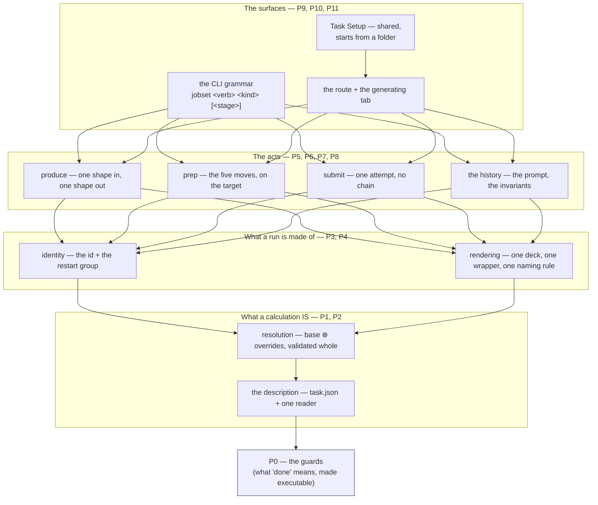
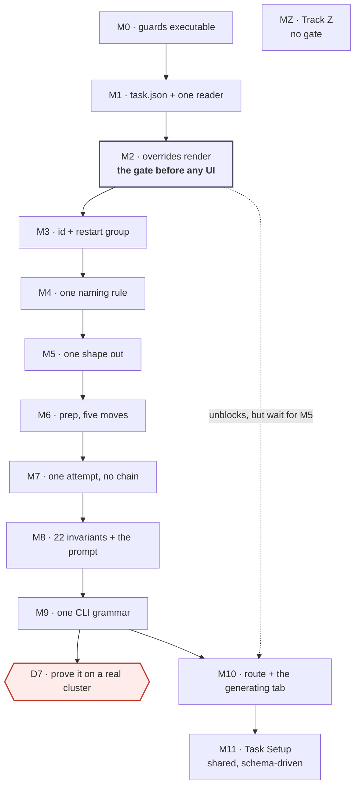

# Staged runs — the order the code follows the contracts

**Role:** plan
**Domain:** execution
**Companions:** [`web/staged-runs-architecture.md`](?doc=web/staged-runs-architecture.md)
(the design and the audit evidence) ·
[`engines/stages.md`](?doc=engines/stages.md) ·
[`execution/project-layout.md`](?doc=execution/project-layout.md) ·
[`execution/run-identity.md`](?doc=execution/run-identity.md) ·
[`execution/checkpointing.md`](?doc=execution/checkpointing.md) ·
[`execution/job-contracts.md`](?doc=execution/job-contracts.md)

---

## 0. What this document is, and what it is not

This is **the build order**: which layer is written first, what has to be true
before the next one starts, and how each one is checked. It decides nothing
about the design. Every rule it enforces was written somewhere else, and this
document's job is to point at that sentence at the right moment.

| | Where it lives | What it answers |
|---|---|---|
| **The design** | the five contracts above | *What is a stage? What does `prep` do? What may a name contain?* |
| **The findings** | `staged-runs-architecture.md` § 8a–8b | *What is actually built, and where does it disagree?* |
| **The acceptance criteria** | `staged-runs-architecture.md` § 8, per item | *When is item N done?* |
| **The order and the gates** | **this document** | *What do I build first, and how do I know it worked?* |

So an item's **"*Done when:*"** sentence stays in § 8 and is cited here rather
than copied — one place to change when it changes.

### The one rule this document exists to enforce

> **The contract is the source of truth. The code is evidence of the past.**

Every phase below opens with a **re-anchor** block naming the exact sections to
read before any code is written. That is not ceremony. This work has already
produced four documented cases of the opposite — a contract quietly bent to fit
what the code happened to do — and each one was found late, by a fresh read,
after being built on. The re-anchor is the cheapest place to catch the fifth.

**When the code and the contract disagree, there are exactly three outcomes**,
and choosing between them is the first thing a phase does:

1. **The code is wrong** — change the code. This is the common case and needs
   no discussion.
2. **The contract is wrong** — *stop*. Change the document first, in its own
   commit, with the reasoning written down. Then write the code against the
   corrected sentence. Never both in one commit: a commit that changes a rule
   and its implementation together leaves nothing to check the implementation
   against.
3. **Undetermined** — the contract does not cover this case. That is a decision,
   and decisions belong to the user. Add it to § 8 below and *stop that unit* —
   not the phase, just the unit.

**The tells that a drift is in progress**, all of them observed on this branch:

- writing *"what should the rule be"* — the rule exists; the sentence was not found;
- proposing a mechanism the contract never names;
- citing a function as the *reason* for a design (`_auto_block_size` does it this
  way, so…) — that is the past arguing with the plan;
- *"keep it, it is still useful"* — how ten ways to say "stage" happened;
- a passing test outranking an invariant.

---

## 1. The re-anchor, done at the start of every phase

Five steps, in this order. The order matters: steps 1–3 happen with **every code
file closed**.

1. **Open the sections the phase names.** They are listed, so there is no
   searching and no judgement about what is relevant.
2. **Write the obligations out as a numbered list, before opening any code.**
   If an obligation cannot be written without reading the code, the contract is
   missing a sentence — that is outcome 2 above, and it is fixed first.
3. **Name the governing sentence for each unit you are about to write.** One
   unit, one sentence. A unit with no sentence behind it is either unnecessary
   or a decision (outcome 3).
4. **Write the tests from the obligation list, then the code.** Where the
   contract carries a worked example, **the document's own text is the fixture** —
   parse the block out of the `.md` file rather than retyping it, so the two
   cannot drift. (`checkpoint_message()` and `stage_completion_tag()` already do
   this against `engines/stages.md § 7.3`; reuse the pattern, do not invent a
   second one.)
5. **Re-read the same sections at the end of the unit.** Drift is measured
   against the same text you started from, not against your memory of it.

### The rhythm inside a phase

One unit at a time: **contract → obligations → tests → code → run only those
tests**.

**At a milestone, run the phase's own tests plus every test that touches what
the phase touched** — found by grepping for the moved names, not guessed. Not
the full suite.

> **Corrected 2026-08-07 (user), after P1 proved the old rule wrong by
> obeying it.** This used to say *"the full suite runs at the milestone"*. P1
> added **one** module that nothing yet imports, and verifying it cost a
> **fifty-minute** 6037-test run — which then found two failures, one of them
> already red on `HEAD` and unrelated. That is not verification, it is a toll.
>
> **The full suite runs at three points, and they are the ones where a whole
> surface moves:** **P5** (the big subtraction — ten mechanisms become the
> agreed set, and the blast radius is every producer), **P9** (the CLI
> grammar), and **P11** (the end). A phase may also call for one if its own
> reviews turn up a reason, and it says why.
>
> Everywhere else the honest check is narrow and immediate: the unit's tests,
> then `grep` for each name the phase moved and run what comes back. P1's two
> real breakages — `test_layering` and `test_checkpoint_repo_scope` — were both
> in that set and were both found in seconds, long before the full run reached
> them.

- Tests are run through `tools/testrun.py` (`run none2e`, `run lf`,
  `status --fails`), under `/home/qqing/miniconda3/envs/molbuilder/bin/python`.
  Piping `pytest` through `tail` has already hidden 24 failures out of 31 on
  this project; the tool exists because of it.
- **The backend suite is green today and stays green.** This is not the MolView
  rework, where a rebuilt module was allowed to break its consumers on purpose.
  Here the CLI ships and people run it.
- When a phase must knowingly leave something failing, it is recorded as
  `pytest.mark.xfail(strict=True)` naming the phase that fixes it. Strict
  matters: it fails loudly when the behaviour *starts* working, so a fix cannot
  land without the plan being updated. That is the opposite of hiding a failure.

---

## 2. The layers, and why this order

The system is a stack. Each layer reads the one below it and never reaches past
it, which is exactly why it can be built bottom-up: nothing above exists yet to
be broken.



**Read the arrows as *"cannot be written until"*.** Two consequences worth
stating, because both were violated by earlier drafts of this work:

- **`task.json` is first because everything downstream reads it.** The shape,
  the overrides, the per-stage resources and the retry budget live in four
  different places today. Until they live in one, every layer above has to know
  about four.
- **The surfaces are last.** The gate `staged-runs-architecture.md § 8` names
  between its steps 2 and 3 is the reason: *the backend must be able to render a
  stage that overrides a parameter the stage type never carried, before any of
  it is drawn.* Draw first and the UI gets designed around what the model
  happens to allow.

### What "a layer is finished" means

All four, or the next phase does not start:

1. its milestone's assertions pass;
2. the **subtractions** for that phase are gone — proved by zero live callers,
   not by intention;
3. its three reviews have run and every finding has a disposition;
4. the contract sections it touched are accurate on the same day (a doc change
   in the same commit whenever the code taught us something).

---

## 3. The review protocol

**Three lenses at every milestone**, plus a fourth where the phase moves a
scientific parameter or a default. They are different *readings*, not the same
reading three times — that is what makes three of them worth the cost.

Each produces a finding ledger:

| # | Lens | What is wrong | Evidence (`file:line`, or the command) | Disposition |
|---|---|---|---|---|

**Every finding gets one of three dispositions, and no finding is dropped
silently:**

- **Fixed** — in this phase.
- **Deferred** — with a written reason *and* the phase or item that owns it.
- **Withdrawn** — with **the premise named**. "This turned out not to be true
  because X." Item 19 of § 8 is the worked example: four claimed broken promises,
  three of which were simply false.

A finding that says **the document is wrong** stops the phase (outcome 2 of § 0).

---

### Review 1 — Does it say what the contract says?

*Conformance. Run by a reader who did not write this phase's code* — a fresh
agent, or the same person after a full re-read with the diff closed.

**Method, and the direction is the whole point:** read the governing sections
first and write the obligations out; *then* open the diff and mark each
obligation met / not met / not applicable. Reading the code first turns this
into grading your own homework — you find the obligations the code already
satisfies.

Catches: **errors, inconsistency between layers, contract drift.**

Checklist:
- [ ] Every obligation from the re-anchor list has a line in the diff or a
      written reason why not.
- [ ] Every worked example in the governing sections still holds — including the
      ones in *other* documents that cite this layer.
- [ ] Where the contract fixes a name, a format, or a message, the code produces
      it **byte for byte** (the naming authority is `job-contracts.md § 6.3`).
- [ ] No new vocabulary: a term in the code that is in no document is either a
      missing sentence or a mechanism nobody agreed to.
- [ ] Nothing in the diff is justified only by *"the old code did it this way."*

---

### Review 2 — What should be gone, and is it?

*Subtraction. The lens this project has needed most* — ten ways to say "stage"
exist because every previous pass only added.

**Method:** work from the phase's *Subtracts* list. For each name: find its
callers before, prove there are zero after, and say where the capability lives
now. Then go looking for what the list missed.

Catches: **obsolete residue, duplicated code, reinvented modules, redundant design.**

Checklist:
- [ ] Every name on the *Subtracts* list has **zero live callers** — `grep` the
      whole tree, including `tests/`, templates, and JavaScript.
- [ ] Its tests moved or retired with it. A test asserting the text of a
      deleted template is not "still passing", it is orphaned.
- [ ] **Search by behaviour, not by name.** Does something already do this under
      a different word? `materialize` was rewritten in bash one level down and
      nobody noticed, because the bash did not contain the word *materialize*.
- [ ] Two constants that must agree are **one constant**. If they cannot be one,
      a test reads both and asserts the agreement. (The two warm-file
      inventories per engine are the live example — they agree today and nothing
      keeps them agreeing.)
- [ ] Comments and docstrings that describe the removed thing are removed too.
      A comment claiming *"one list, so a new hook cannot be added to one
      without the other"* sat above two lists.
- [ ] The vocabulary guard's count went **down**, or the ledger says why not.

---

### Review 3 — Walk it across the seams

*Integration and over-engineering. Take the worked example and run it.*

**Method:** [`worked-example.md`](?doc=execution/worked-example.md) is one
molecule taken end to end. Walk this phase's part of it, **in both directory
shapes**, and write down what actually happened rather than what should have.
That document exists because a walkthrough finds what reviewing a module
cannot: *a join is invisible from either side of it*, and it found eight gaps,
four of them on no list.

Catches: **over-engineering, cross-layer inconsistency, joins nobody owns.**

The four over-engineering questions, asked out loud:

1. **What did this phase add that no contract names?** A field, a flag, a file,
   a class, a mode. Each one needs its sentence or it goes.
2. **Could the caller do this in one line without the abstraction?** If yes, the
   abstraction needs an argument beyond tidiness.
3. **Does anything here exist only to serve a later phase?** Delete it. The
   later phase can add it, and will know better what it needs.
4. **How many places change when a stage gains a field?** If more than one, the
   merge is not one merge and the layer is not finished.

Checklist:
- [ ] The walk runs in **both** shapes, and a check written for one does not
      fail a directory that is correct in the other.
- [ ] Names agree across the seam: deck, output, log, directory, checkpoint tag.
- [ ] The layer below was not reached past.
- [ ] A failure at this seam says something a user can act on.

---

### Review 4 — Is the science still defensible? *(P2, P4, P6 only)*

*Applies wherever a parameter, a default, or a convergence value moves.*

Catches: a refactor that is correct in software and wrong in chemistry.

Checklist:
- [ ] A moved default still carries its justification
      ([`engines/tuning.md`](?doc=engines/tuning.md) § 2.3.1 for the tier
      values).
- [ ] A stage is judged as a **resolved whole**, never as a diff — two overrides
      can each be reasonable and jointly under-converged.
- [ ] A derived value (`BlockSize` from the rank count) is derived from *that
      stage's* number, not the base's.
- [ ] The reference trail survives the move (E4).

---

### The standing guards

Four questions from `staged-runs-architecture.md § 8c`, made executable in P0.
`tests/test_stage_vocabulary.py` is the authority; the greps are the smoke test.

| # | Question | Check | Today |
|---|---|---|---|
| 1 | Is there **one** way to say "stage"? | the allowlist in `test_stage_vocabulary.py` | **9 mechanisms** |
| 2 | Does a stage's **name** survive? | no `-stage<N>` / `stage%d` in any emitted filename | **3 conventions live** |
| 3 | Does everything run through the **wrapper**? | no generated script invokes an engine directly | **flat runner does** |
| 4 | Does each stage start because **someone said so**? | no `depends_on` between stages; no loop over stages in a runner | **both producers chain** |

---

## 4. The phases

Thirteen milestones. Each is a state someone else can verify without reading the
diff.

---

### P0 — Ground: make "done" executable ✅ **landed 2026-08-07**

> **All four questions are now one command** — `python -m tests.test_stage_vocabulary`
> from the repository root — and `tests/test_stage_vocabulary.py` asserts them,
> three as `xfail(strict=True)` naming P4, P5 and P7. The measured baseline is
> § 6. Two things came out of the phase that were not in it: the mechanism count
> is **ten**, not nine (the mechanical pass found the `stage-table` field kind,
> which changes P11's first unit — see `staged-runs-architecture.md § 8b`), and
> question 2's guard had to be written against `project-layout.md § 4.1` rather
> than § 8c's one-line summary, because a stage **directory** legitimately
> carries a number.

**Why first.** Every later phase is graded by the four questions above, and
three of the four answers are wrong today. Making them mechanical *now* means a
regression is caught by a test rather than by the next fresh-eyes review — and
it gives the subtraction reviews something to point at instead of an opinion.

**Re-anchor before writing any code:**
`staged-runs-architecture.md` § 8b (the ten mechanisms, the three filename
conventions) and § 8c (*what "done" would look like*) ·
[`process/testing.md`](?doc=process/testing.md) (the source-text-invariant
pattern) · [`checkpointing.md`](?doc=execution/checkpointing.md) § 6.

**Units:**

1. `tests/test_stage_vocabulary.py` — an **allowlist** of the live mechanisms by
   name and location. Removing one is a one-line edit; adding one fails. (Same
   shape as the CSS duplicate-selector guard already in the tree — reuse its
   harness rather than writing a second one.) It counts **ten**, not the nine
   § 8b listed by hand: the mechanical pass added the `stage-table` field kind,
   and § 8b now records both the row and why the first reading missed it.
2. A guard for question 2 (no stage *position* in an emitted filename) and one
   for question 3 (no direct engine invocation in a generated script). **Both
   fail today**; both are `xfail(strict=True)` naming P4 and P5.
3. A guard for question 4 (no `depends_on` between stages, no stage loop in a
   rendered runner) — `xfail(strict=True)` naming P7.
4. The baseline table, dated, written into this document's § 6 ledger, so a
   later review can diff rather than re-count.

**Subtracts:** nothing. This phase only measures.

**Milestone M0.** One command answers all four questions with a number, and
each wrong answer names the phase that fixes it.

**Reviews:** 1 (do the guards assert the contract's sentence, or my paraphrase
of it?) · 2 (does any of this duplicate `test_layering.py`,
`test_no_retired_doc_paths.py`, or the CSS guards?) · 3 (break each guard
deliberately — does it fail, and for the right reason?).

**Gate to P1:** M0 passes, and the three `xfail`s each name a phase.

---

### P1 — The description: `task.json` and its one reader ✅ **landed 2026-08-07**

> **`molbuilder/task.py`** — `Run` / `StructureRef` / `Stage` / `Task`,
> `to_dict` / `from_dict`, `read_task` / `write_task`, with
> `tests/test_task_description.py` reading § 6's own jsonc block as its fixture.
> **Four things went differently from the units below**, each for a reason worth
> keeping:
>
> 1. **The module is `task.py`, not the candidate `stages.py`.** `siesta/stages.py`
>    already exists, and R5 forbids the collision; the file is `task.json`, so the
>    module takes its name. `test_layering.py` places it at **L1** — it imports
>    `persist` and nothing else.
> 2. **The § 6.6 preflight is split, and the split is the point.** Four rows are
>    answerable from the file alone and land here. The other four — the engine has
>    a generator, the fingerprint matches, every field exists, every value is in
>    bounds — need the engine's field schema, and importing an engine into an L1
>    codec is exactly what `test_layering.py` prevents. **They move to P2**, which
>    holds the schema already. Written into the module docstring so the gap is a
>    decision on the record, not an omission found later.
> 3. **§ 6.6a's identical-stage warning moves to P2 as well** — the contract says
>    the comparison is over the **resolved** pair, and resolving is P2's verb.
> 4. **M1's "imported by both surfaces" became a source-text guard.** An import
>    nothing calls is dead code, and it would not have stopped a second codec
>    appearing beside the first. The test instead asserts that **no module other
>    than `task.py` knows the filename** (`checkpoint.py` excepted: it *detects*
>    the file, never parses it). Same intent, and it actually holds the line.
>
> **Two code corrections came out of it**, both found by a test rather than by
> reading: `persist.schema_major` did not do what `job-contracts § 6.1` says
> ("tolerating same-major minor bumps" — it compared the whole post-`@` token, so
> `@1.4` was refused against `@1`), and `_BUNDLE_DESCRIPTORS` moved onto
> `task.json`, making that arm live for the first time.


**Re-anchor:** [`engines/stages.md`](?doc=engines/stages.md) **§ 6 entire** —
6.2 (`varies`: intent recorded, never reconstructed), 6.3 (it *points at* a
structure), 6.4 (**one reader for both surfaces**), 6.7 (`shape`, required, never
inferred, fixed once produced) · [`job-contracts.md`](?doc=execution/job-contracts.md)
§ 6.1 (the artifact registry) and § 6.2 (the `@major` rule) ·
[`project-layout.md`](?doc=execution/project-layout.md) § 2.1 (the description
names no machine).

**Units, in order:**

0. **The name is settled**: the file is `task.json`, its schema string is
   `molbuilder/task@1`, and the `stages` key inside it keeps its name. Do not
   re-open it; decision 8b in § 8 records why.
1. The dataclasses and the codec — `read_task` / `write_task`. **Where the
   module lives is decided by `test_layering.py` and
   [`process/package-layout.md`](?doc=process/package-layout.md), not by
   preference**; the candidate is `molbuilder/stages.py`, beside `checkpoint.py`.
2. The refusal rules, each naming the offender: an unknown key fails **with that
   key's name**; a repeated stage name fails **naming the repeat**; a missing
   `shape` fails saying so. `--stages-json`'s help says *"Unknown keys ignored"* —
   this reverses it, and pre-1.0 that is a clean break, not a migration.
3. `schema_version: molbuilder/task@1`, plus its row in the artifact registry
   — **a doc change in the same commit**.
4. `checkpoint.py`'s `_is_bundle_root` already looks for a description and finds
   nothing, because no producer writes one. That arm becomes live here; assert it.
   ⚠ **It looks for the old name.** `_BUNDLE_DESCRIPTORS` still reads
   `("stages.json", …)` — the file was renamed to `task.json` in the contracts on
   2026-08-07 and the code has not moved, which is the intended state: the
   contract leads and P1 makes the code match. Pre-1.0, the old name is deleted
   rather than accepted alongside. The one test fixture that writes it
   (`tests/test_checkpoint_repo_scope.py`) changes in the same commit.

**Subtracts:** nothing yet — and this is the one phase that deliberately raises
the mechanism count. `--stages-json` and `--stage-resources` cannot retire until
something reads the new file, which is P5. **The interim is exactly one phase
long**, and Review 2 records it as a debt with P5 named. Nothing new may grow a
second reader in the meantime.

**Milestone M1.** A description round-trips read → write → read, byte-identical.
The three refusal cases fail with the offending name in the message. **One
reader**, and the test that pins it asserts *no second module knows the
filename* rather than asserting an import — see point 4 above for why the
weaker form was replaced.

**Fixture:** `engines/stages.md § 6`'s own jsonc block, parsed out of the
document.

**Reviews:** 1 · 2 (is the reader a second copy of an existing codec? the
`.molstruct.json` envelope and `job-set.json` both already do
schema-versioned JSON — read them before writing a third) · 3.

**Gate to P2:** M1 passes; § 8 questions 1, 2, 7 and 9 (the name, the folder
name, hand-editability, two identical stages) have answers — they are listed in
§ 8 below.

---

### P2 — Resolution: three fields, `overrides`, one effective config

**Re-anchor:** [`engines/stages.md`](?doc=engines/stages.md) § 2–4 (three
fields; `base ⊕ overrides`; **one object validated *and* rendered**; a stage
validated as a **resolved whole, never as a diff**) · § 5 (the three places a
promoted field lands) · [`science/validation.md`](?doc=science/validation.md)
and the findings contract (facts in, findings out; `where` is the stable id).

**Units, in order:**

1. **Before changing anything**, pin today's behaviour: `relax_force_tol` and
   `relax_max_displ` live on the shared config *and* on the stage spec. Write
   the test that says which one a staged render uses when they disagree — that
   is what anyone relying on it has already built on.
2. **`SiestaConfig.stages` and `SiestaStageSpec` are deleted.** Not shrunk —
   *removed*. The stage list lives in `task.json` only, modelled by P1's
   `molbuilder/task.py::Task.stages`, which is engine-agnostic already. An
   engine config becomes what `stages.md § 4` always assumed it was: **one
   parameter set**. The four relaxation values stay exactly where they already
   are, as ordinary `SiestaConfig` fields.

   > **This replaced *"`SiestaStageSpec` shrinks to name / enabled /
   > overrides"* on 2026-08-07 (user), and the correction is the point of the
   > phase.** Shrinking left the stage list inside the engine config, which is
   > the actual fault: a config that contains a ladder cannot be the ordinary
   > single config § 4 resolves to. `stages.md § 1.1` now says so outright.
   >
   > **It also dissolves the blocker I had recorded as decision 11.** I had
   > found that a stage carrying `overrides: Dict` makes
   > `GET /api/build/schema/siesta` raise and the SIESTA form 500, and asked
   > which of four ways to cope. All four were ways to live with a mechanism
   > that should not exist: once `stages` is not a field of `SiestaConfig`, the
   > form generator never walks into a stage, `_stagespec_to_field_schemas` has
   > nothing to serve, and nothing 500s. **`_stagespec_to_field_schemas` is
   > deleted with it** — it answered *which settings may vary* by listing a
   > Python class's fields, which is the arrow backwards (`stages.md § 1.2`).
   >
   > **PySCF is untouched** (user, same day): its ladder runs inside one
   > process, so its stage list has a second life as engine behaviour.
   > `PySCFConfig.stages` and its `stage-table` stay until the SIESTA path
   > works.

2a. **The columns a user may vary stop being a Python class's field list.** The
   catalogue keeps coming from the schema; the *selection* comes from `varies`
   in the description. Nothing in this phase draws it — P10 and P11 own the
   surface — but the backend stops constraining it, which is what makes the
   surface work possible at all.
3. `continue_retries` gets a road to the wrapper. ⚠ It is not merely unrouted —
   it is **silently dropped while everything upstream validates** (§ 8a D): the
   field range-checks 1..5, `runwrap.py` implements the retry loop, and
   `stages_to_jobset` never reads it. So this unit has a prerequisite:
   `Resources` must be able to carry it, or a stage needs a different road.
   Decide which **before** writing either.
4. `on_nonconvergence` moves to the producer's own input (it is a scheduler
   edge, not a stage property).
5. `effective_config(base, stage) -> SiestaConfig` — **one function, one place**,
   and the object it returns is the object that gets validated *and* rendered.
6. Validation across stages: a per-stage finding carries the stage in `where`; a
   finding about the *sequence* (a ladder that loosens) carries **no** stage
   label, because it is not a fact about a member of it.
7. **The half of § 6.6's preflight P1 could not reach**, handed over because this
   phase is the first that holds a field schema. Four refusals — the engine is
   one this backend has a generator for; the schema fingerprint matches; every
   name in `base` and every `overrides` key exists in the shared schema; every
   value is inside its bounds — each **naming what it refused**, and all of them
   before anything is written. `molbuilder/task.py`'s docstring carries the same
   split so the two halves cannot quietly diverge.
8. **§ 6.6a's warning**, which needs resolution and so could not live in the
   codec either: two enabled stages whose **effective configs are equal** *and*
   whose later one starts `clean` recompute the earlier one and discard it. Warn,
   never refuse — where the later stage **continues**, identical settings are the
   honest way to say *keep going* after a step budget ran out. **The comparison is
   over the resolved pair**, so comparing `overrides` alone is the wrong test and
   would flag the legitimate case.

**Subtracts:** the `dataclasses.replace` block in `render_siesta_stage_fdfs`
(the four-value pseudo-override); the duplicated homes of the relaxation fields.

**Milestone M2.** `{mesh_cutoff: 300}` on the tight stage renders a deck
carrying 300 while the shared config still says 150. The object validated **is**
the object rendered (assert identity, not equality). A stage asking for three
retries renders a wrapper whose **text** contains the loop. A ladder that
loosens between stages reports once, with no stage label. **A description naming
a field the schema does not have is refused, by name** — the half of the
preflight P1 handed over — and two identical stages warn only when the later one
starts clean.

**This milestone is the gate the whole design named**: the backend can render a
stage that overrides a parameter the stage type never carried. Nothing on a
surface may be drawn before it.

**Reviews:** 1 · 2 · 3 · **4** (do the tier values keep their justification when
they become shared-config defaults?).

---

### P3 — Identity: the id, and the engine's restart group

**Re-anchor:** [`run-identity.md`](?doc=execution/run-identity.md) **entire** —
it is short and every paragraph is load-bearing · `job-contracts.md § 2.1`
Rules 1–2 (one directory, several inputs, one basename) and § 4 (warm/cold, the
four behaviours).

**Units:**

1. The id is built **from inputs, never from anything a run produced** — it must
   be knowable before the calculation exists.
2. Normalisation **reuses the shipped basename set**; happens **once**; refuses
   rather than appending a digit.
3. The id is **editable once, before anything has run**. After that, changing it
   is not a rename — it is a different calculation, and the surface says so. The
   reason is the engine's: the id keys every warm file, so an edited id makes
   the calculation silently start over rather than fail.
4. The per-engine identity group, set from **one** `restart` field — SIESTA's
   `SystemLabel` + `DM.UseSaveDM` / `MD.UseSave*`, PySCF's `JOB` literal + the
   generated resume branches. Declared as one group per engine because the two
   ways they disagree are both silent.
5. What is **reported rather than pinned**: a changed cell is not a mismatch,
   it is a silent no-op — a `.XV` carries its own cell and **wins**. Each case
   names who says it and when; the wrapper banner is the one that must never be
   weakened, because it is always present.

**Subtracts:** any second normaliser; any id path that reads a result.

**Milestone M3.** A two-stage description whose second stage continues renders
**every** bound parameter set, and a stage set to `clean` renders **none** —
asserted together, because the failure mode is that they disagree. A second
produce into a folder that already holds warm files **refuses unless told to
overwrite, and never renames**. `job-contracts.md § 4` is updated in the same
commit.

**Reviews:** 1 · 2 · 3 (walk: continue a stage in both shapes; in flat the warm
files are unsuffixed and shared, and that is the design, not a bug).

---

### P4 — Rendering: one deck, one wrapper, one naming rule

**Re-anchor:** [`job-contracts.md`](?doc=execution/job-contracts.md) **§ 6.3 —
the naming authority** (the four separators: `_` joins parts of one name, `-`
attaches a counter or qualifier, `.` introduces a type, `/` separates levels;
and *a name says what its location does not*) · `engines/stages.md § 7` ·
[`engines/siesta.md`](?doc=engines/siesta.md) · `project-layout.md § 4.1`.

**Units:**

1. **One deck renderer**, taking an effective config. It renders; it does not
   decide.
2. **A stage's position stops reaching filenames.** The browser writes
   `<label>-stage<N>.fdf` with N from a preset dropdown — while *already
   holding the names*, since the presets are literally *coarse*, *medium*,
   *tight*. Insert a stage and every later file silently renames, reassigning
   outputs to a stage that did not produce them.
3. **One convention, keyed on the name**, used by the deck, the output and the
   log. Three are live today: the flat ladder writes `bdt_au_coarse.fdf`, the
   browser writes `bdt_au-stage1.fdf`, and `trajectory_log/format.py` writes
   `bdt_au-stage1.molwatch.log` — so in a ladder run **a stage's deck and its
   own log cannot be matched by name**.
4. The consumer follows: the run decoder's stage regex keys on the hyphen form,
   so it changes with the rename, and anything grouping a staged run's logs by
   parsing `N` out of a filename must read the stage from the deck's name or its
   directory instead ([`web/results.md`](?doc=web/results.md)).
5. Resource-shaped overrides reach **all three destinations**: the deck line, the
   wrapper's environment, and the BENCH-MARKS block.

**Subtracts:** the `-stage<N>` filename convention, everywhere — emitter,
browser, log, decoder.

> **Three green tests pin the convention this phase removes, listed by P0 so
> the phase does not meet them under pressure.** They are *not* failures to work
> around: each is a correct test of today's behaviour, and each is retired or
> rewritten in the same commit that changes the behaviour, per
> [`process/testing.md`](?doc=process/testing.md) — a test serves the contract,
> and when the contract moves the test moves with it.
>
> | Test | What it pins |
> |---|---|
> | `test_trajectory_log_stage_targets.py::test_multi_stage_cli_emits_per_stage_molwatch_logs` | `JOB-stage1/2/3.molwatch.log` from `--stage-strategy` — and `--stage-strategy` is itself P5's subtraction, so check the order |
> | `test_smiles_and_siesta.py` (`assert f"-stage{stage}" in text`) | that `--stage N` **propagates the suffix into the rendered deck** |
> | `test_pyscf.py::…molwatch_emitter…` | the emitted PySCF script writing `JOB + "-stage2.molwatch.log"` |
>
> Two more mention the token and are **incidental** — `test_results_file_picker_js.py`
> and `test_runwrap_cold_restart.py` use it only as a fixture filename, and they
> need nothing but a rename.

**Milestone M4.** For one description, the deck, the output, the log and the
directory all agree on the stage's **name**. Inserting a stage renames nothing
that already exists. A description asking ScaLAPACK then ELPA renders two decks
whose solver differs **and** two wrappers activating **different conda
environments**. A stage varying `mpi_np` renders a deck whose `BlockSize` came
from *that stage's* rank count, with BENCH-MARKS declaring it. Guard 2 turns
green.

**Reviews:** 1 · 2 · 3 (the seam this phase exists for — deck ↔ log ↔ decoder ↔
Results tab; walk it in the browser, because a filename change is invisible to
stubs) · **4** (`BlockSize` derivation; the eigensolver → environment mapping).

---

### P5 — The producer: one shape in, one shape out

**Re-anchor:** `engines/stages.md § 6.7` (the shape is a **required field**,
read by `prep`, never inferred) and § 7 (what the generator must produce; a
produce is **transactional**) · `project-layout.md § 1` (the two shapes) and
§ 2 (the portable package vs. `prep`) · `job-system.md` decision #2 (**reuse the
single-job wrapper unchanged**) · `running-a-job.md § 2.2a` (**bash is a
bootstrap, not a program**).

**Units:**

1. `build_siesta_stage_bundle` takes the **shape** from the description and
   emits the artifacts for **that shape only**. Today it returns the flat decks,
   the flat runner **and** a hierarchical JobSet at once — so the shape is
   decided by whichever command the user types next, which is not a choice at
   all.
2. `on_nonconvergence` is read in **one** place. It is read twice today, and the
   two disagree about whether the last stage force-halts (the bash runner does
   it and is right; the JobSet producer has no equivalent).
3. **The flat ladder runner is deleted, not taught.** It emits
   `siesta < "$fdf" > "$log"` — no activation (so it fails on stage 1, since
   `siesta` lives in `molbuilder-siesta` and is not on a clean `PATH`), no rank
   clamp, no GPU pinning, no `--cold`/`--continue`, no retry budget, and **no
   `.molwatch.log`, so the Results tab and the trajectory viewer see nothing**.
   Give it activation, rank resolution, a monitor and a log and it *is* the
   wrapper — which is the argument for deleting it.
4. The produce is transactional: built elsewhere, moved into place only when
   every deck, wrapper and description succeeded.

**Subtracts — the big one.** Ten mechanisms become the agreed set, per § 8
item 2a: `--stage N` (the flag goes, **the presets stay** as the defaults a new
stage is created with — the tier values are real science); `--stage-strategy`;
`--stages-json`; `--stage-resources`; the flat runner. PySCF's `StageSpec`
**stays as it is** — its ladder runs inside one process, so it is genuinely a
different shape; it should read the same description, not the same runner. The
`stage-table` field kind (mechanism 10) **also stays and is not P5's business**:
it is a widget, not a way of describing a calculation, and P11 asks the only
question about it that matters — whether it can be fed a `task.json` instead of a
schema default without being rewritten.

**Milestone M5.** A bundle never contains both a flat runner and a
`job-set.json`. A produced folder can be told apart **by looking at it** rather
than by remembering what was typed. Guard 1's count drops to the agreed set;
guard 3 turns green.

**Reviews:** 1 · 2 (the heaviest subtraction review in the plan — every retired
flag, every orphaned test, every comment describing a deleted mechanism) · 3.

---

### P6 — `prep`: the five moves, on the machine that will run it

**Re-anchor:** `project-layout.md § 2.3` (**the five steps, always in this
order** — and *why the order is forced*: a parameter that depends on the launch
cannot be decided before the launch is known) · § 2.3.1a (**`prep` is the
framework; benchmarking is one thing you prep**) · § 2.3.2–2.3.5 (the three
jobs, and what goes in and comes out) · § 1.6 (**stages do not chain**).

**Units:**

1. **Lift the general framework out of `bench/prep.py`.** It is the one place
   this framework is already built, and it was built inside the benchmark
   because that is where the need appeared first. The design reads one way:
   benchmarking is prep, specialised. *(Which direction the refactor moves the
   code is an implementation matter — but the general case must not end up
   looking like a special case of the special case.)*
2. **The carry is a real file copy, made at prep**: `.XV` always, `.DM` when the
   description says, `.CG` **only when both stages share an algorithm**. Copied,
   never linked — the engine writes to these files, and a link would destroy the
   result you chose to build on. Copied *at prep* because stages do not chain,
   not as a separate decision.
3. A benchmark **nests inside the stage it measures** (the best rank count
   depends on the science), and the bundle names the stage it came from.
4. The measured verdict reaches **the description**, not just a script. The
   shipped chain stops one step short: `bench summarize` writes
   `bench-result.json`, `bench prep-run` turns it into `run-production.sh`, and
   `task.json` never learns — so the next produce silently reverts to defaults.
5. **`prep` prints what it resolved.** It is the only place the measured
   numbers, the chosen geometry and the rendered deck appear together, which is
   what makes `submit` a plain yes.

**Subtracts:** `bench prep-run` as a separate verb — it *is* `prep run` written
a second time; the second machine-detection path if one appears.

**Milestone M6.** `prep run tight --from 01_coarse/run-0` produces the printed
report of `staged-runs-architecture.md § 8` step 1c verbatim, **real files** in
the attempt directory (no links), and re-producing keeps the measured
configuration rather than reverting.

**Reviews:** 1 · 2 · 3 (walk jobs one, two and three of § 2.3 in both shapes) ·
**4** (is the `.CG`-only-when-algorithms-match rule still right? does the
benchmark grid still mean what `job-system.md § 7` says?).

---

### P7 — `submit`: one attempt, no chain

**Re-anchor:** `running-a-job.md § 2.2a` (bash is a bootstrap) ·
`project-layout.md § 1.5` (**an attempt is immutable**) and § 1.6 ·
`job-contracts.md § 2.1` (**the caller's working directory is the contract** —
both launchers establish it and neither the wrapper nor the engine ever
navigates).

**Units:**

1. **Retire `render_run_wrapper(..., attempt_dirs=True)`** — ~130 lines of
   generated bash that resolves the attempt, creates `run-<n>/`, links inputs,
   copies warm state and `cd`s in. That is `jobset/materialize.py` written a
   second time in bash, one level down, in the layer kept free of filesystem
   logic — **and it is the only thing in the system that breaks the cwd rule
   everything else holds.** Retiring it restores an invariant rather than tidying
   one. Nothing calls it (`attempt_dirs` defaults to `False`; the only callers
   are its own eleven tests), so retiring cannot regress a shipped path. The
   behaviour it established is **right and stays** — an attempt per invocation,
   immutable once written, inputs linked, previous warm state copied. Only the
   address changes. Its eleven tests move with it; the two asserting wrapper
   text retire.
2. `stages_to_jobset` stops emitting `depends_on` and `Carry` edges between
   stages. `carry_deref` stays for the chained ladder `jobset` can still build.
3. `submit` resolves **one** attempt for the stage it is starting: next unused
   number, create, link the deck and package, copy what was named, launch there.
4. `materialize.job_dir_name` returns `point-<name>` for **every** job and must
   branch on `JobSet.kind` — `01_<name>` for stages, `point-*` for bench trials.
5. **One warm-file inventory per engine.** Two exist per engine today and they
   agree by luck: add a warm hook to the carry list alone and a `--cold` run
   silently warm-starts from it — a contaminated calculation that reports
   success. Fix by **subtraction**: the carry constants belong to the
   `attempt_dirs` block, so unit 1 takes them with it, leaving one list each.
   Only if the Python replacement still needs an inventory does this become a
   real extraction — and then it is one list both the mover and the carrier
   read. Rename `_SIESTA_WARM_SUFFIX_FILES` and `_PYSCF_WARM_FILES` if they
   survive; they are functions wearing constant names.

**Subtracts:** the shell attempt-resolution block; the inter-stage edges; one
warm-file inventory per engine.

**Milestone M7.** No stage job carries a `depends_on`. No produced tree contains
a dangling symlink. No generated wrapper changes directory. Exactly one
warm-file inventory per engine, and a test that adds a suffix to it sees **both**
behaviours change. Guard 4 turns green.

**Reviews:** 1 · 2 · 3 (the walk that found this: set up the tight stage against
a named coarse run and confirm real files, not links).

---

### P8 — The history: the prompt, the coverage, the last invariants

**Re-anchor:** [`checkpointing.md`](?doc=execution/checkpointing.md) § 4.1 (**who
takes a checkpoint** — explicit, always; molbuilder never takes one on its own) ·
§ 5.0 (**in the flat shape the checkpoint is the only way back**) · § 6 (the
twenty-two invariants and the shape each holds in) · `engines/stages.md § 7.3`
(the message and tag forms).

**Units:**

1. **The prompt at interactive `prep`**, when prep is about to change a
   directory that already holds results — showing the message it would write and
   the tag if a stage finished. **Never at run or submit time**: that may be a
   scheduled job, and blocking a queue to ask is the wrong party at the wrong
   moment. Non-interactive prep proceeds without one **and says so**.
2. The same trigger in the **flat** shape, where it is not the same feature: a
   missed checkpoint there is not a thinner history, it is **a state that no
   longer exists anywhere**. The surface says plainly that this is the save
   point, not housekeeping.
3. The branch-name proposal — `<stage>-<what you are trying>`, editable. The
   tab's to offer; the route takes the name it is given and refuses a bad one
   clearly.
4. The archive covers **runs, not containers**: a flat root or a stage's
   `run-N/` is archived; a benchmark's `point-*/`, two levels down, is not. The
   rule is **depth**, not a marker file.
5. The remaining invariants get assertions, **each marked with the shape it
   holds in** — a check written for one shape that fails the other is worse than
   no check, because it fails a directory that is working correctly. **L6**
   (`snapshot verify`) is the one that matters most: the archive-verification
   code exists but is reachable only by attempting a restore, which is the worst
   moment to learn an archive is gone.

**Subtracts:** any language anywhere still describing an *automatic* checkpoint.

**Milestone M8.** All twenty-two invariants have an assertion. **I2** (every
MANIFEST entry matches its file by name, size and sha256) and **S1** (tracked
XOR archived, never both, never neither) run over a **real produced folder**,
not a fixture. A `prep` about to overwrite results asks first and prints the
message it would write; a non-interactive one proceeds and says it did not.

**Reviews:** 1 · 2 · 3 (walk: run two stages, restore the first, confirm the
`.DM` two levels down comes back).

---

### P9 — The command surface

**Re-anchor:** `staged-runs-architecture.md § 8` step 1c (the table and the
grammar) · [`process/conventions.md`](?doc=process/conventions.md) (the CLI
doctrine: a thin shell over the web API; `click`).

**Units:**

1. One group, one grammar: **`jobset <verb> <kind> [<stage>]`**. `describe` and
   `status` take no kind, because they are about the calculation rather than one
   run of it.
2. `bench` stops being a top-level group — four of its six verbs fold in.
   `probe-scheduler` is a config helper and stays outside the loop;
   **`siesta-gpu` needs its own decision** (§ 8 below).
3. The kind is a **positional, not `--bench`**: measuring and running are peers,
   not a modifier of one another.
4. `summarize` stays a verb of its own **because it writes a file** — the
   verdict — and you are meant to read it and decide.
5. **`prep run` asks** rather than reading the verdict silently. A benchmark
   lives inside the stage it measured, so prep can always *find* one — finding
   is not permission.

**Subtracts:** `bench generate`, `bench prep`, `bench summarize`, `bench
prep-run` as top-level verbs.

**Milestone M9.** The session in step 1c runs verbatim, from inside a
calculation folder. `--help` reads as one grammar rather than two surfaces over
one mechanism.

**Reviews:** 1 · 2 (two names for one act is what the old split cost — prove
there is now one) · 3 (walk the whole loop: describe → prep bench → submit →
summarize → prep run → submit).

**After M9 — the D7 gate** (`roadmap.md` § 1): run the full SIESTA loop on a
**real cluster** before any further engine's producer is built. It exists
because other producers are cheap to add and expensive to debug remotely.

---

### P10 — The web, part one: the route and the description

**Cannot start before M2**, and realistically not before M5. This is the gate
`staged-runs-architecture.md § 8` names between its steps 2 and 3.

**Re-anchor:** `engines/stages.md § 6.4` (**one reader for both surfaces**) ·
[`structure-optimization-ui-plan.md`](?doc=web/structure-optimization-ui-plan.md)
— § 7.1 (what this page decides: the **column set**, promote and demote) and
§ 7.5 (**two `budget` fields reach the deck**, so a field that changes the file
is not a preference) · [`web/overview.md`](?doc=web/overview.md) (the module
doctrine) · [`web/tabs.md`](?doc=web/tabs.md) ·
[`web/form-schema.md`](?doc=web/form-schema.md) ·
[`web/ui-contract.md`](?doc=web/ui-contract.md).

**Units, in order:**

1. **Saving a structure into the project tree.** The description *points at* a
   structure, so a geometry that only exists in the workspace cannot be
   described — and no surface owns putting it somewhere with a path. It is the
   **first wall a user hits**, which is why it comes first here.
2. **The route, both directions.** A description POSTed writes the same bytes
   the CLI writes for the same stages — compared file by file, **excluding
   PROVENANCE's `generated-at`**, which stamps generation time and so differs
   between any two produces; that is the only legitimate exclusion. A GET returns
   a written description such that reopening and producing again yields the
   identical folder.

   ⚠ **What the route writes is a template and a description, not decks and
   wrappers.** `staged-runs-architecture.md § 5.2`'s response example still shows
   `decks` and `wrappers` keys; that predates the boundary in
   `project-layout.md § 2.2` and is corrected in the same commit as this unit.
3. **The Structure-optimization tab, reduced to its half**: the physics, the
   *vary per stage* affordance on every field, the stage list **as names**, the
   shape, and the outcome line. **A one-stage calculation is finished here** —
   today's whole workflow, untouched.

**Subtracts:** the "Stage" menu that is a form autofill rewriting nine
convergence fields and making no stage at all; the `p-stage-preset` number.

**Milestone M10.** The same description produces the same folder from a terminal
and from the browser, file by file. A user goes from a structure on the canvas to
a written description **without typing a path**, and a single-stage user gets
exactly what they get today.

**Reviews:** 1 · 2 · 3 · **plus a browser check**: this project has twice had
139 green tests over a broken page, and a filename or stylesheet change is
invisible to stubs.

---

### P11 — The web, part two: the shared Task Setup tab

**The one every later engine inherits**, which is why it is built against the
contract rather than against whatever Structure optimization happens to need.

**Re-anchor:** [`task-setup-plan.md`](?doc=web/task-setup-plan.md) **entire** ·
`engines/stages.md § 6.2` (`varies` is the column set) and § 6.5 (one stage is no
stages) · [`web/form-schema.md`](?doc=web/form-schema.md) (**where the columns
come from**) · `checkpointing.md` L1 (what makes a directory a calculation root).

**Units, in order:**

1. **The description model in JS — pure, and tested in Node** without a browser
   (`_node_esm.py`, which survives the ESM migration). The seven operations of
   `task-setup-plan.md § 7`, each with the rule that stops it silently destroying
   a value.
2. **Getting in.** The tab reads whatever the projects sidebar has selected —
   **no second file browser**. One check, one message: the directory is a
   calculation or it is not, using `checkpoint.py`'s **existing** `_is_bundle_root`
   rather than a second rule. A folder of decks with no description **cannot be
   adopted**, and the reason is already written: `varies` cannot be inferred.
3. **The table**, with its columns read from the schema. ⛔ **The rule this phase
   lives or dies by:** a hardcoded list of relaxation fields makes this the
   relaxation tab, and Transport needs a second copy. Nothing is added for
   producers that do not exist — a `kind` field with one legal value is the
   speculative generality Review 3 says to delete.

   ⚠ **Start by reading `form-schema.js`'s `stage-table`, because most of this
   table already exists** — P0's mechanical count found it (`staged-runs-architecture.md`
   § 8b, mechanism 10). It is generic over any `List[<dataclass>]`, and it already
   lays out **rows as the per-stage parameters, columns as the stages**, which is
   the orientation `task-setup-plan.md § 6` asks for. The gap is the data source:
   it renders a schema's `default`, and this tab renders a `task.json` read off a
   folder. **The first unit is answering whether it can be fed one without being
   rewritten** — and if the answer is no, saying why in writing, because
   "I rebuilt the grid" is exactly what Review 2 exists to catch.
4. **What has already run**, read from the folder — no target machine needed.
   Without it you cannot decide what the next stage should be, which is the tab's
   whole purpose.
5. **The hand-off**: the next command for the stage you are looking at, and what
   it will do. **No Run, Submit or Prep button** — the browser describes and
   observes; the terminal acts.

**Subtracts:** nothing — this is the one phase in the plan that is purely
additive, which is itself worth checking in Review 2.

**Milestone M11.** A two-stage description written in P10 is opened from the
sidebar, given per-stage values, saved, and the folder round-trips. Selecting a
folder that is not a calculation says so and stops. **No column in the table was
named in the tab's own source** — the test that pins it adds a field to the
schema and sees a row appear.

**Reviews:** 1 · 2 (is this a second copy of anything? the form builder, the
`{ok,…}` client mirror, the sidebar's selection door all already exist) · 3 ·
**plus a browser check**.

---

### Track Z — unblocked, no gate, any time

Six items that touch none of the gated path. They may be taken whenever, and
they are worth taking early because three of them are one-liners that currently
mislead a reader of the code.

| Item | What |
|---|---|
| § 8 14 | Repoint the checkpoint subsystem's dead doc references — `run-checkpoints.md` was removed in the 2026-07 migration and 21 of the citations are **inside error messages a user reads**. ⚠ `_GITIGNORE_LEGACY_HEAD` looks like a citation and is **not** — it is the marker greped out of a user's existing `.gitignore`; renaming it opens a data-losing branch |
| § 8 14a | Module hygiene: `Any` annotated and not imported; unused `field` import; `__all__` omitting the four public names item 11 added; two copies of one `Checkpoint`-from-git-log builder; `list_checkpoints` walking every commit's archive |
| § 8 10a | The archive-size display prints a number that is not true (hard links counted in full) and **feeds no decision — there is no `prune` verb**. Either drop it or make it match `du`. Two older faults ride along: `archive_total_bytes` is structurally always zero, and `missing_archive_warning` names `.DM/.HSX/.TSHS` whatever the engine |
| § 8 12e | The checkpoint panel appears at a **fixed depth** (exactly 3 below the projects root) instead of wherever a repository is — so browsing into `01_coarse/` makes it vanish, in the shape where a checkpoint is load-bearing |
| § 8 12c | If P7's subtraction does not resolve the two warm-file inventories, it becomes a real extraction here |
| — | `tests/test_checkpoint_invariants.py`'s header names the wrong file for I1 and describes a twelve-invariant split that L3/L4/L5 have outgrown |

**Milestone MZ** and its three reviews apply to the batch, not to each item.

---

## 5. The milestone map



| Milestone | Unblocks | The guard it turns green |
|---|---|---|
| M0 | everything after it is measurable | — (installs all four) |
| M1 | M2, and the second surface's byte comparison | — |
| **M2** | **all UI work**, M4, M5 | — |
| M3 | continuing at all | — |
| M4 | the Results tab seeing a staged run | **2** — the name survives |
| M5 | M6, M7 | **1** and **3** — one vocabulary, everything through the wrapper |
| M6 | M7, and a measurement that lasts | — |
| M7 | M8 | **4** — nothing chains |
| M8 | trusting the history | — |
| M9 | the D7 gate, then other engines | — |
| M10 | M11, and a single-stage user's whole workflow in the browser | — |
| M11 | **every later engine** — Transport and Spectra inherit this tab rather than copying it | — |

---

## 6. The baseline, dated

Recorded at P0 so a later review diffs rather than re-counts. **The first four
rows are no longer a table somebody maintains** — they are printed by

```bash
python -m tests.test_stage_vocabulary     # from the repository root
```

and asserted by `tests/test_stage_vocabulary.py`, three of them as
`xfail(strict=True)` naming the phase that turns each green. The numbers below
are that command's output on **2026-08-07**, kept so a later review can diff.

| Measure | 2026-08-07 | Target | Phase |
|---|--:|--:|---|
| ways to say "stage" | 10 | the agreed set | P5 |
| emitted names keyed on a position | 2 | 0 | P4 |
| generated scripts invoking an engine directly | 1 | 0 | P5 |
| producers that chain stages | 2 | 0 | P7 |
| checkpoint invariants with an assertion | 15 / 22 | 22 / 22 | P8 |
| readers of a stage description | 2 formats | 1 | P5 |

> **Row 2 replaced *"filename conventions for a stage: 3 → 1"*, and the two say
> the same thing from opposite ends.** § 8b counted **conventions** and found
> three: the flat ladder's `<id>_<name>` (correct), the browser's `-stage<N>`,
> and the trajectory log's `-stage<N>`. The guard counts **offenders** — the two
> that key on a position — because that is the number a test can drive to zero.
> Two offenders plus one correct convention is three conventions; when the
> offenders reach 0 the conventions reach 1.
>
> The measure is *"keyed on a position"*, not *"contains a number"*, because
> `project-layout.md § 4.1` settles the one place a number belongs: a stage
> **directory** is `<seq>_<name>` — number *and* name, assigned once at produce
> and never reassigned. `01_coarse/JOB.fdf` is correct and the guard passes it.

---

## 7. What this plan does not cover

Named so nobody has to guess whether an omission was an oversight:

- **Transport and PySCF producers** — `roadmap.md` § 1 phases 3 and 4, behind
  the D7 gate. They are additional producers on a settled framework, not part of
  settling it. **All generating tabs follow the same framework** (user decision
  2026-08-07) — they write a template plus a description and feed the same shared
  tab — but **Structure optimization is built first and made to work**, and P11's
  schema-driven columns are what make the others cheap rather than a rewrite.
- **Host → target file shipping** (scp/rsync) — out of scope by D8. A co-located
  target needs no copy; a split host is a manual `scp` the deploy panel spells
  out.
- **Converting an existing flat folder to hierarchical** — an open question with
  its contract (`project-layout.md § 8` q6), not a phase.
- **Anything about environments or deployment.** No env is installed, removed or
  re-specified by this plan. Where a phase needs a package to exist, it says so
  and stops.

---

## 8. Decisions still open, and which phase waits on them

These are the user's, not research. A phase does not start with its decision
open.

| # | Decision | Gates |
|---|---|---|
| 1 | Is **`task.json`** the right name? It sidesteps the four-way collision *plan* already has here (`jobset plan` the verb, `STAGE-PLAN.md` the file, the registry label for `job-set.json`) | P1 |
| 2 | ~~Is the **folder named by the id**?~~ — **decided 2026-08-07: no.** The **level-③** directory (`job-contracts.md § 2.5`'s `<structure>/`) is a name the user types; the id lives in `task.json` and is the stem of every file inside. `run-identity.md § 3.0` now names all five directory levels and records the reversal — the old rule's premise (*a folder whose name is not the id cannot be identified from outside*) was removed by `task.json` itself, and it had been costing `bdt-relax-pbe/` vs `bdt-relax-blyp/`, which derive one id | ~~P1~~ |
| 3 | ~~Is a description **editable by hand**?~~ — **decided 2026-08-07: yes, supported.** So `read_task` owes a person exactly what it owes the browser: the offending key **named**, and a suggestion where there is an obvious one (`'mesh_cutof' -- did you mean 'mesh_cutoff'?`). This is P1 unit 2's acceptance bar, not a nicety | ~~P1~~ |
| 4 | ~~May **two enabled stages be identical**?~~ — **decided 2026-08-07: allowed, and warned about only when the later one starts `clean`.** Two identical stages where the second **continues** is a real workflow — more steps at the same settings — and refusing it would force a token difference to say *keep going*. Where the second starts clean it recomputes the first and discards it, which is always a mistake. **The `start from` field is what separates them**, so the check is on the resolved pair, not on the overrides alone | ~~P1~~ |
| 5 | ~~Where does a per-stage **`continue_retries`** travel?~~ — **decided 2026-08-07: `Resources` gains a field.** It rides the road `mpi_np` and `omp_threads` already ride, which is what `stages.md § 5`'s third row groups it with — *a field the deck never carries → the wrapper*. ⚠ **It is the one field on `Resources` that is not a scheduler flag**: it never becomes a `-x`, it is baked into the wrapper at install. `Resources`' docstring and `job-contracts.md § 6.2`'s translation table both say so, or the next reader tries to render it into an sbatch line | ~~P2~~ |
| 6 | Must **every stage be measured**, or is a benchmark optional per stage? | P6 |
| 7 | The three cosmetic **command shapes**: stage as the positional or the folder with `--stage`; `jobset` or promoting `prep` to top level; and that **`molbuilder run` does not run** — it writes a wrapper | P9 |
| 8 | **`bench siesta-gpu`'s** disposition — it is not part of this loop and needs its own call | P9 |
| 8a | **The shared tab's name.** *Task Setup* is the working name. Not *Task Prep* — `prep` is the verb it does not do. *Job* is taken twice (a `Job` in a `JobSet`; the scheduler's word). *Calculation* names the unit and covers a sweep as well as a ladder | P11 |
| 8b | ~~**The description file's name**~~ — **decided 2026-08-07: `task.json`** (`molbuilder/task@1`). The file describes one **task**, and the stage list is how that task is broken up; the `stages` key inside it is unchanged, because a stage is established vocabulary and only the file needed a name that covers a sweep as well as a ladder | ~~P1~~ |
| 9 | **When does the readable id stop being enough?** A formula does not tell two isomers apart, and does not pin the *order* species are declared in — and a `.XV` read against a different order lands every coordinate on the wrong atom | P3, if it lands here at all |
| 11 | ~~**What happens to the Build tab's stage table when a stage becomes three fields?**~~ — **dissolved 2026-08-07: the question was malformed.** All four options were ways to cope with `stages` being a field of `SiestaConfig`. It is not one: the stage list lives in `task.json`, the form generator never meets a stage, and `_stagespec_to_field_schemas` is deleted rather than patched (`stages.md § 1.1`–`1.2`) | ~~P2~~ |
| 10 | **What are the "components" of a composite system?** A junction is a molecule *and* two electrodes; naming it by total formula loses that structure | P3, same |

**Already decided, recorded so they are not reopened:** the shape is a required
field in the description (`stages.md § 6.7`); the id is fixed once and a later
change is a new calculation; cell parameters are **not** in the identity;
checkpoints are explicit and molbuilder never takes one on its own; the command
grammar is `jobset <verb> <kind> [<stage>]`; stages do not chain; a flat folder
stays flat on purpose; **the browser describes and observes, the terminal acts**
(no prep or submit over HTTP for now); the web surface is **two tabs** — a
generating tab per engine that writes the description, and **one shared tab**
that starts from a folder and fills in the per-stage values.
