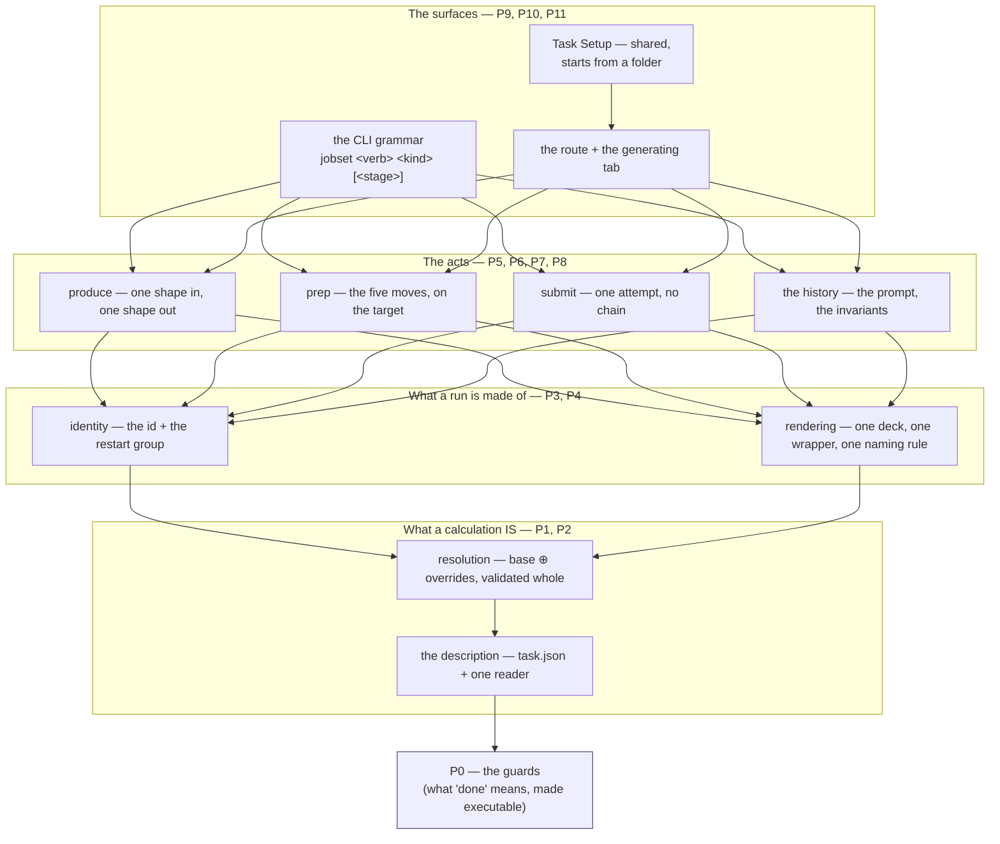
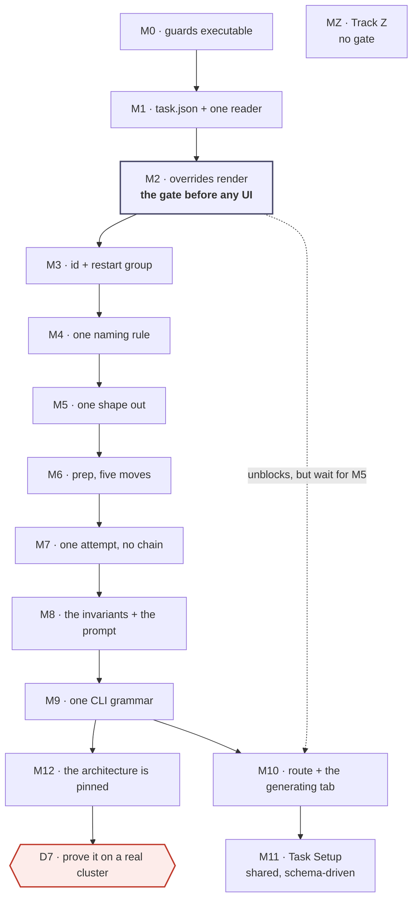

# Staged runs — the order the code follows the contracts

**Role:** plan
**Domain:** execution
**Companions — the contracts this plan serves:**
[`engines/stages.md`](?doc=engines/stages.md) ·
[`engines/template.md`](?doc=engines/template.md) ·
[`execution/project-layout.md`](?doc=execution/project-layout.md) ·
[`execution/run-identity.md`](?doc=execution/run-identity.md) ·
[`execution/checkpointing.md`](?doc=execution/checkpointing.md) ·
[`execution/job-contracts.md`](?doc=execution/job-contracts.md) ·
[`execution/architecture.md`](?doc=execution/architecture.md)
*(**History**, not a companion: the superseded design draft is
[`archive/2026-08-11-staged-runs-architecture.md`](?doc=archive/2026-08-11-staged-runs-architecture.md).
It is cited below only for its dated audits — never for a rule. Listing it as a
companion is what let it be quoted as design twice in one session.)*

---

## 0. What this document is, and what it is not

This is **the build order**: which layer is written first, what has to be true
before the next one starts, and how each one is checked. It decides nothing
about the design. Every rule it enforces was written somewhere else, and this
document's job is to point at that sentence at the right moment.

| | Where it lives | What it answers |
|---|---|---|
| **The design** | the five contracts above | *What is a stage? What does `prep` do? What may a name contain?* |
| **The findings** | `archive/2026-08-11-staged-runs-architecture.md` § 8a–8b — **dated audits, history** | *What was built, and where did it disagree, as of 2026-08-07?* |
| **The acceptance criteria** | **this document**, per phase and unit | *When is this unit done?* |
| **The order and the gates** | **this document** | *What do I build first, and how do I know it worked?* |

> **✅ The move is done (2026-08-11), and this is the record of it.** The design
> draft was archived, and this blockquote used to describe the move as work still
> to do — which is the same staleness it was written to complain about.
>
> **What it was:** a document written against the **flat** shape before the
> hierarchical one existed (36 mentions against 9) — the pre-job-system picture,
> one tab writing one flat directory. **What made it urgent:** it was still being
> cited as *design* on 2026-08-11, twice in one session, as the source of a
> decision it explicitly disclaims (*"It holds no durable decisions… where this
> plan and a contract disagree, the contract wins"*). **A retired document left
> in the map gets read as current.**
>
> **What was actually required, once measured rather than assumed:** I had
> claimed archiving was blocked on migrating § 8's acceptance criteria. It was
> not, and checking took one grep — this plan cited a numbered item **seven times
> in 3,600 lines**, and Track Z already states each item in full in its own
> table. The `§ 8 ` prefix was a *label*, not a lookup.
>
> **Done:** the five still-open questions migrated to the contracts that own them
> (`engines/stages.md` § 6b for the description, `execution/run-identity.md`
> § 6a for the id); every inbound reference was repointed by what it needed; the
> file moved with an R4 row. Its dated audits travelled with it as history.
>
> **The lesson, which this session paid for more than once:** *"the plan depends
> on it"* was inherited from a header row rather than measured, and the row had
> gone stale when this plan grew its own units.


So an item's **"*Done when:*"** sentence lives with the unit that owes it —
Track Z states each of its items in full, and every other unit's bar is written
in its own phase below. Nothing is looked up in another document.

### The one rule this document exists to enforce

> **The contract is the source of truth. The code is evidence of the past.**

Every phase below opens with a **re-anchor** block naming the exact sections to
read before any code is written. That is not ceremony. This work has already
produced four documented cases of the opposite — a contract quietly bent to fit
what the code happened to do — and each one was found late, by a fresh read,
after being built on. The re-anchor is the cheapest place to catch the fifth.

**When the code and the contract disagree, there are exactly three outcomes**,
and choosing between them is the first thing a phase does:

1. **The code is wrong** — change the code. This is the common case and needs
   no discussion.
2. **The contract is wrong** — *stop*. Change the document first, in its own
   commit, with the reasoning written down. Then write the code against the
   corrected sentence. Never both in one commit: a commit that changes a rule
   and its implementation together leaves nothing to check the implementation
   against.
3. **Undetermined** — the contract does not cover this case. That is a decision,
   and decisions belong to the user. Add it to § 8 below and *stop that unit* —
   not the phase, just the unit.

**The tells that a drift is in progress**, all of them observed on this branch:

- writing *"what should the rule be"* — the rule exists; the sentence was not found;
- proposing a mechanism the contract never names;
- citing a function as the *reason* for a design (`_auto_block_size` does it this
  way, so…) — that is the past arguing with the plan;
- *"keep it, it is still useful"* — how ten ways to say "stage" happened;
- a passing test outranking an invariant.

---

## 1. The re-anchor, done at the start of every phase

Five steps, in this order. The order matters: steps 1–3 happen with **every code
file closed**.

1. **Open the sections the phase names.** They are listed, so there is no
   searching and no judgement about what is relevant.
2. **Write the obligations out as a numbered list, before opening any code.**
   If an obligation cannot be written without reading the code, the contract is
   missing a sentence — that is outcome 2 above, and it is fixed first.
3. **Name the governing sentence for each unit you are about to write.** One
   unit, one sentence. A unit with no sentence behind it is either unnecessary
   or a decision (outcome 3).
4. **Write the tests from the obligation list, then the code.** Where the
   contract carries a worked example, **the document's own text is the fixture** —
   parse the block out of the `.md` file rather than retyping it, so the two
   cannot drift. (`tests/test_checkpoint_manifest.py` does this against
   `job-contracts.md § 6.1`; reuse the pattern, do not invent a second one.
   `checkpoint_message()` and `stage_completion_tag()` used to be the example
   here — the checkpoint rework retired automatic naming, so they are gone.)
5. **Re-read the same sections at the end of the unit.** Drift is measured
   against the same text you started from, not against your memory of it.

### The rhythm inside a phase

One unit at a time: **contract → obligations → tests → code → run only those
tests**.

**At a milestone, run the phase's own tests plus every test that touches what
the phase touched** — found by grepping for the moved names, not guessed. Not
the full suite.

> **Corrected 2026-08-07 (user), after P1 proved the old rule wrong by
> obeying it.** This used to say *"the full suite runs at the milestone"*. P1
> added **one** module that nothing yet imports, and verifying it cost a
> **fifty-minute** 6037-test run — which then found two failures, one of them
> already red on `HEAD` and unrelated. That is not verification, it is a toll.
>
> **The full suite runs at three points, and they are the ones where a whole
> surface moves:** **P5** (the big subtraction — ten mechanisms become the
> agreed set, and the blast radius is every producer), **P9** (the CLI
> grammar), and **P11** (the end). A phase may also call for one if its own
> reviews turn up a reason, and it says why.
>
> Everywhere else the honest check is narrow and immediate: the unit's tests,
> then `grep` for each name the phase moved and run what comes back. P1's two
> real breakages — `test_layering` and `test_checkpoint_repo_scope` — were both
> in that set and were both found in seconds, long before the full run reached
> them.

- Tests are run through `tools/testrun.py` (`run none2e`, `run lf`,
  `status --fails`), under `/home/qqing/miniconda3/envs/molbuilder/bin/python`.
  Piping `pytest` through `tail` has already hidden 24 failures out of 31 on
  this project; the tool exists because of it.
- **The backend suite is green today and stays green.** This is not the MolView
  rework, where a rebuilt module was allowed to break its consumers on purpose.
  Here the CLI ships and people run it.
- When a phase must knowingly leave something failing, it is recorded as
  `pytest.mark.xfail(strict=True)` naming the phase that fixes it. Strict
  matters: it fails loudly when the behaviour *starts* working, so a fix cannot
  land without the plan being updated. That is the opposite of hiding a failure.

---

## 2. The build order, and why this one

> **⚠ This section is a *schedule*, not the architecture.** It answers *what can
> be written before what*, and its boxes are groups of **phases**. § 9 answers
> *what may depend on what*, and its boxes are **floors** of the running system.
> They are close relatives and they are not the same picture: § 2's "acts"
> — produce, prep, submit — are the **routes** of
> [`execution/architecture.md`](?doc=execution/architecture.md), which cross floors by design, while § 2's "identity" and "rendering" are
> floors. **Putting both in one stack is exactly the mix that contract's § 1
> exists to undo**; this section keeps doing it because as a build order it is
> right, and renaming it is cheaper than redrawing it.
>
> Three different things get called a "layer": import depth
> (`test_layering`), the architectural **floor** (the contract above), and this
> build order — and this one, met first, was the one with no warning attached.
> **If you want the structure, read the contract. If you want the order of
> work, read on.**

The work is a stack. Each group is written against the one below it and never
reaches past it, which is exactly why it can be built bottom-up: nothing above
exists yet to be broken.



**Read the arrows as *"cannot be written until"*.** Two consequences worth
stating, because both were violated by earlier drafts of this work:

- **`task.json` is first because everything downstream reads it.** The shape,
  the overrides, the per-stage resources and the retry budget live in four
  different places today. Until they live in one, every layer above has to know
  about four.
- **The surfaces are last.** The gate this plan names
  between its steps 2 and 3 is the reason: *the backend must be able to render a
  stage that overrides a parameter the stage type never carried, before any of
  it is drawn.* Draw first and the UI gets designed around what the model
  happens to allow.

### What "a layer is finished" means

All four, or the next phase does not start:

1. its milestone's assertions pass;
2. the **subtractions** for that phase are gone — proved by zero live callers,
   not by intention;
3. its three reviews have run and every finding has a disposition;
4. the contract sections it touched are accurate on the same day (a doc change
   in the same commit whenever the code taught us something).

---

## 3. The review protocol

**A review has two axes, and a milestone needs both.**

- **Three lenses** — *what you are looking for*: conformance (Review 1),
  subtraction (Review 2), the seams (Review 3), plus a fourth where the phase
  moves a scientific parameter or a default. They are different *readings*, and
  that is what makes three of them worth the cost.
- **Three passes** — *what you are looking at*: the same review, run three
  times with fresh eyes, each pass widening its subject (§ 3.0). This is not
  the lenses again; it is the discovery that **one pass finds what one pass can
  find**, and stops.

The per-phase line **Reviews: 1 · 2 · 3** names the *lenses*. Every milestone
runs them through the three-pass cycle below.

Each produces a finding ledger:

| # | Lens | What is wrong | Evidence (`file:line`, or the command) | Disposition |
|---|---|---|---|---|

**Every finding gets one of three dispositions, and no finding is dropped
silently:**

- **Fixed** — in this phase.
- **Deferred** — with a written reason *and* the phase or item that owns it.
- **Withdrawn** — with **the premise named**. "This turned out not to be true
  because X." Item 19 of § 8 is the worked example: four claimed broken promises,
  three of which were simply false.

A finding that says **the document is wrong** stops the phase (outcome 2 of § 0).

---

### 3.0 R×3 — the review runs three times, and the subject widens

**No milestone is passed on one review.** Run it three times, with fresh eyes,
and **widen the subject at each pass** — a second pass over the same subject
mostly re-confirms the first, which is how repetition becomes ritual.

| Pass | Subject | The question it can answer that the previous one cannot |
|---|---|---|
| **1** | the unit just written | Does this do what the contract says? |
| **2** | **every commit since the last milestone**, not just this unit | What did the earlier units break that their own review had no reason to look at? |
| **3** | **the tests themselves** | Which contract rules has nothing asserted — and which of my assertions would pass against broken code? |

**Fresh eyes, operationally:** close the diff and re-read the governing
sections first (Review 1's direction rule), and where the work spanned a
session, start pass 2 from `git log` rather than from memory of what you
intended. A pass that begins by re-reading your own reasoning is not a pass.

**Pass 3 is paired with mutation testing, not a substitute for it.** Break the
code and watch each new test fail; a test that stays green is blind, whatever
its docstring claims.

#### The evidence this rule is written from (2026-08-10)

Three successive fresh-eye reviews of one day's work, each finding what the
previous could not:

| Pass | Found | Where the defects came from |
|---|---|---|
| 1 — the unit | the resolver shipped **partial**, so four callers each invented a fallback and two printed a row number under a column headed `seq` | the unit just written |
| 2 — the session | **six** defects, incl. `status` blind to the whole attempt layer, `--cold` silently leaving warm files, and a stage token used in JS arithmetic (`NaN`, so `continue_retries` stopped reaching the wrapper) | **five of the six were from earlier commits**, none had a test |
| 3 — the tests | **three** of my own tests weak (one read the repo root; one passed for a *thrown* decoder), and **nine** contract rules with no test at all — including *"copied, never linked"*, which I believed was covered and was asserted with `is_file()`, true for a symlink | the tests written beside the code |

The pattern, and the reason pass 2 exists: **a review written beside the code
tests what the code does.** The rules with no test were, almost without
exception, the ones saying what must *never* happen — and those are invisible
from inside the implementation.

Two tests were **still blind after pass 3** and only the mutation run caught
them. That is the pairing rule above, learned the same day.

---

### Review 1 — Does it say what the contract says?

*Conformance. Run by a reader who did not write this phase's code* — a fresh
agent, or the same person after a full re-read with the diff closed.

**Method, and the direction is the whole point:** read the governing sections
first and write the obligations out; *then* open the diff and mark each
obligation met / not met / not applicable. Reading the code first turns this
into grading your own homework — you find the obligations the code already
satisfies.

Catches: **errors, inconsistency between layers, contract drift.**

Checklist:
- [ ] Every obligation from the re-anchor list has a line in the diff or a
      written reason why not.
- [ ] Every worked example in the governing sections still holds — including the
      ones in *other* documents that cite this layer.
- [ ] Where the contract fixes a name, a format, or a message, the code produces
      it **byte for byte** (the naming authority is `job-contracts.md § 6.3`).
- [ ] No new vocabulary: a term in the code that is in no document is either a
      missing sentence or a mechanism nobody agreed to.
- [ ] Nothing in the diff is justified only by *"the old code did it this way."*

---

### Review 2 — What should be gone, and is it?

*Subtraction. The lens this project has needed most* — ten ways to say "stage"
exist because every previous pass only added.

**Method:** work from the phase's *Subtracts* list. For each name: find its
callers before, prove there are zero after, and say where the capability lives
now. Then go looking for what the list missed.

Catches: **obsolete residue, duplicated code, reinvented modules, redundant design.**

Checklist:
- [ ] Every name on the *Subtracts* list has **zero live callers** — `grep` the
      whole tree, including `tests/`, templates, and JavaScript.
- [ ] Its tests moved or retired with it. A test asserting the text of a
      deleted template is not "still passing", it is orphaned.
- [ ] **Search by behaviour, not by name.** Does something already do this under
      a different word? `materialize` was rewritten in bash one level down and
      nobody noticed, because the bash did not contain the word *materialize*.
- [ ] Two constants that must agree are **one constant**. If they cannot be one,
      a test reads both and asserts the agreement. (The two warm-file
      inventories per engine are the live example — they agree today and nothing
      keeps them agreeing.)
- [ ] Comments and docstrings that describe the removed thing are removed too.
      A comment claiming *"one list, so a new hook cannot be added to one
      without the other"* sat above two lists.
- [ ] The vocabulary guard's count went **down**, or the ledger says why not.

---

### Review 3 — Walk it across the seams

*Integration and over-engineering. Take the worked example and run it.*

**Method:** [`worked-example.md`](?doc=execution/worked-example.md) is one
molecule taken end to end. Walk this phase's part of it, **in both directory
shapes**, and write down what actually happened rather than what should have.
That document exists because a walkthrough finds what reviewing a module
cannot: *a join is invisible from either side of it*, and it found eight gaps,
four of them on no list.

Catches: **over-engineering, cross-layer inconsistency, joins nobody owns.**

The four over-engineering questions, asked out loud:

1. **What did this phase add that no contract names?** A field, a flag, a file,
   a class, a mode. Each one needs its sentence or it goes.
2. **Could the caller do this in one line without the abstraction?** If yes, the
   abstraction needs an argument beyond tidiness.
3. **Does anything here exist only to serve a later phase?** Delete it. The
   later phase can add it, and will know better what it needs.
4. **How many places change when a stage gains a field?** If more than one, the
   merge is not one merge and the layer is not finished.

Checklist:
- [ ] The walk runs in **both** shapes, and a check written for one does not
      fail a directory that is correct in the other.
- [ ] Names agree across the seam: deck, output, log, directory, checkpoint tag.
- [ ] The layer below was not reached past.
- [ ] A failure at this seam says something a user can act on.

---

### Review 4 — Is the science still defensible? *(P2, P4, P6 only)*

*Applies wherever a parameter, a default, or a convergence value moves.*

Catches: a refactor that is correct in software and wrong in chemistry.

Checklist:
- [ ] A moved default still carries its justification
      ([`engines/tuning.md`](?doc=engines/tuning.md) § 2.3 for the tier
      values).
- [ ] A stage is judged as a **resolved whole**, never as a diff — two overrides
      can each be reasonable and jointly under-converged.
- [ ] A derived value (`BlockSize` from the rank count) is derived from *that
      stage's* number, not the base's.
- [ ] The reference trail survives the move (E4).

---

### The standing guards

Four questions inherited from the archived design draft, made executable in P0.
`tests/test_stage_vocabulary.py` is the authority; the greps are the smoke test.

| # | Question | Check | At P0 · 2026-08-07 | Now · 2026-08-10 |
|---|---|---|---|---|
| 1 | Is there **one** way to say "stage"? | the allowlist in `test_stage_vocabulary.py` | 10 mechanisms | **10** — the one still open, and P2/P9's |
| 2 | Does a stage's **name** survive? | no `-stage<N>` / `stage%d` in any emitted filename | 2 offenders | **0** ✅ (P4) |
| 3 | Does everything run through the **wrapper**? | no generated script invokes an engine directly | 1 (the flat runner) | **0** ✅ (P5 unit 3) |
| 4 | Does each stage start because **someone said so**? | no `depends_on` between stages; no loop over stages in a runner | 2 producers chain | **0** ✅ (P5 unit 3 + P7 unit 2) |

> **Do not maintain this table by hand — print it.** `python -m
> tests.test_stage_vocabulary` from the repository root emits exactly these
> numbers, and the columns above are two of its runs.
>
> **It was maintained by hand until 2026-08-10, and every cell was wrong.**
> Questions 2, 3 and 4 had each been driven to zero by a phase without the row
> being touched, so the plan's own scoreboard reported that nothing had been
> done. **Question 1 was never right at all**: it said *nine*, P0's mechanical
> pass counted **ten**, and P0's note two paragraphs below this table says so —
> the correction was written underneath the wrong number instead of into it.
> *A status that a command can print should never be a cell somebody
> remembers to edit.*

---

## 4. The phases

Thirteen milestones. Each is a state someone else can verify without reading the
diff.

---

### P0 — Ground: make "done" executable ✅ **landed 2026-08-07**

> **All four questions are now one command** — `python -m tests.test_stage_vocabulary`
> from the repository root — and `tests/test_stage_vocabulary.py` asserts them,
> three as `xfail(strict=True)` naming P4, P5 and P7. The measured baseline is
> § 6. Two things came out of the phase that were not in it: the mechanism count
> is **ten**, not nine (the mechanical pass found the `stage-table` field kind,
> which changes P11's first unit — see `staged-runs-architecture.md § 8b`), and
> question 2's guard had to be written against `project-layout.md § 4.1` rather
> than § 8c's one-line summary, because a stage **directory** legitimately
> carries a number.

**Why first.** Every later phase is graded by the four questions above, and
three of the four answers are wrong today. Making them mechanical *now* means a
regression is caught by a test rather than by the next fresh-eyes review — and
it gives the subtraction reviews something to point at instead of an opinion.

**Re-anchor before writing any code:**
`archive/2026-08-11-staged-runs-architecture.md` § 8b (the ten mechanisms, the three filename
conventions) and § 8c (*what "done" would look like*) ·
[`process/testing.md`](?doc=process/testing.md) (the source-text-invariant
pattern) · [`checkpointing.md`](?doc=execution/checkpointing.md) § 6.

**Units:**

1. `tests/test_stage_vocabulary.py` — an **allowlist** of the live mechanisms by
   name and location. Removing one is a one-line edit; adding one fails. (Same
   shape as the CSS duplicate-selector guard already in the tree — reuse its
   harness rather than writing a second one.) It counts **ten**, not the nine
   § 8b listed by hand: the mechanical pass added the `stage-table` field kind,
   and § 8b now records both the row and why the first reading missed it.
2. A guard for question 2 (no stage *position* in an emitted filename) and one
   for question 3 (no direct engine invocation in a generated script). **Both
   fail today**; both are `xfail(strict=True)` naming P4 and P5.
3. A guard for question 4 (no `depends_on` between stages, no stage loop in a
   rendered runner) — `xfail(strict=True)` naming P7.
4. The baseline table, dated, written into this document's § 6 ledger, so a
   later review can diff rather than re-count.

**Subtracts:** nothing. This phase only measures.

**Milestone M0.** One command answers all four questions with a number, and
each wrong answer names the phase that fixes it.

**Reviews:** 1 (do the guards assert the contract's sentence, or my paraphrase
of it?) · 2 (does any of this duplicate `test_layering.py`,
`test_no_retired_doc_paths.py`, or the CSS guards?) · 3 (break each guard
deliberately — does it fail, and for the right reason?).

**Gate to P1:** M0 passes, and the three `xfail`s each name a phase.

---

### P1 — The description: `task.json` and its one reader ✅ **landed 2026-08-07**

> **`molbuilder/task.py`** — `Run` / `StructureRef` / `Stage` / `Task`,
> `to_dict` / `from_dict`, `read_task` / `write_task`, with
> `tests/test_task_description.py` reading § 6's own jsonc block as its fixture.
> **Four things went differently from the units below**, each for a reason worth
> keeping:
>
> 1. **The module is `task.py`, not the candidate `stages.py`.** `siesta/stages.py`
>    already exists, and R5 forbids the collision; the file is `task.json`, so the
>    module takes its name. `test_layering.py` places it at **L1** — it imports
>    `persist` and nothing else.
> 2. **The § 6.6 preflight is split, and the split is the point.** Four rows are
>    answerable from the file alone and land here. The other four — the engine has
>    a generator, the fingerprint matches, every field exists, every value is in
>    bounds — need the engine's field schema, and importing an engine into an L1
>    codec is exactly what `test_layering.py` prevents. **They move to P2**, which
>    holds the schema already. Written into the module docstring so the gap is a
>    decision on the record, not an omission found later.
> 3. **§ 6.6a's identical-stage warning moves to P2 as well** — the contract says
>    the comparison is over the **resolved** pair, and resolving is P2's verb.
> 4. **M1's "imported by both surfaces" became a source-text guard.** An import
>    nothing calls is dead code, and it would not have stopped a second codec
>    appearing beside the first. The test instead asserts that **no module other
>    than `task.py` knows the filename** (`checkpoint.py` excepted: it *detects*
>    the file, never parses it). Same intent, and it actually holds the line.
>
> **Two code corrections came out of it**, both found by a test rather than by
> reading: `persist.schema_major` did not do what `job-contracts § 6.1` says
> ("tolerating same-major minor bumps" — it compared the whole post-`@` token, so
> `@1.4` was refused against `@1`), and `_BUNDLE_DESCRIPTORS` moved onto
> `task.json`, making that arm live for the first time.


**Re-anchor:** [`engines/stages.md`](?doc=engines/stages.md) **§ 6 entire** —
6.2 (`varies`: intent recorded, never reconstructed), 6.3 (it *points at* a
structure), 6.4 (**one reader for both surfaces**), 6.7 (`shape`, required, never
inferred, fixed once produced) · [`job-contracts.md`](?doc=execution/job-contracts.md)
§ 6.1 (the artifact registry) and § 6.2 (the `@major` rule) ·
[`project-layout.md`](?doc=execution/project-layout.md) § 2.1 (the description
names no machine).

**Units, in order:**

0. **The name is settled**: the file is `task.json`, its schema string is
   `molbuilder/task@1`, and the `stages` key inside it keeps its name. Do not
   re-open it; decision 8b in § 8 records why.
1. The dataclasses and the codec — `read_task` / `write_task`. **Where the
   module lives is decided by `test_layering.py` and
   [`process/package-layout.md`](?doc=process/package-layout.md), not by
   preference**; the candidate is `molbuilder/stages.py`, beside `checkpoint.py`.
2. The refusal rules, each naming the offender: an unknown key fails **with that
   key's name**; a repeated stage name fails **naming the repeat**; a missing
   `shape` fails saying so. `--stages-json`'s help says *"Unknown keys ignored"* —
   this reverses it, and pre-1.0 that is a clean break, not a migration.
3. `schema_version: molbuilder/task@1`, plus its row in the artifact registry
   — **a doc change in the same commit**.
4. `checkpoint.py`'s `_is_bundle_root` already looks for a description and finds
   nothing, because no producer writes one. That arm becomes live here; assert it.
   ⚠ **It looks for the old name.** `_BUNDLE_DESCRIPTORS` still reads
   `("stages.json", …)` — the file was renamed to `task.json` in the contracts on
   2026-08-07 and the code has not moved, which is the intended state: the
   contract leads and P1 makes the code match. Pre-1.0, the old name is deleted
   rather than accepted alongside. **Done by the checkpoint rework**, which
   went further: there is no per-folder classification file at all, under any
   name, and a `checkpoint` section in a project-scope config is refused
   (`checkpointing.md` S1c).

**Subtracts:** nothing yet — and this is the one phase that deliberately raises
the mechanism count. `--stages-json` and `--stage-resources` cannot retire until
something reads the new file, which is P5. **The interim is exactly one phase
long**, and Review 2 records it as a debt with P5 named. Nothing new may grow a
second reader in the meantime.

**Milestone M1.** A description round-trips read → write → read, byte-identical.
The three refusal cases fail with the offending name in the message. **One
reader**, and the test that pins it asserts *no second module knows the
filename* rather than asserting an import — see point 4 above for why the
weaker form was replaced.

**Fixture:** `engines/stages.md § 6`'s own jsonc block, parsed out of the
document.

**Reviews:** 1 · 2 (is the reader a second copy of an existing codec? the
`.molstruct.json` envelope and `job-set.json` both already do
schema-versioned JSON — read them before writing a third) · 3.

**Gate to P2:** M1 passes; § 8 questions 1, 2, 7 and 9 (the name, the folder
name, hand-editability, two identical stages) have answers — they are listed in
§ 8 below.

---

### P2 — Resolution: three fields, `overrides`, one effective config

**Re-anchor:** [`engines/stages.md`](?doc=engines/stages.md) § 2–4 (three
fields; `base ⊕ overrides`; **one object validated *and* rendered**; a stage
validated as a **resolved whole, never as a diff**) · § 5 (the three places a
promoted field lands) · [`science/validation.md`](?doc=science/validation.md)
and the findings contract (facts in, findings out; `where` is the stable id).

**Units, in order:**

1. **Before changing anything**, pin today's behaviour: `relax_force_tol` and
   `relax_max_displ` live on the shared config *and* on the stage spec. Write
   the test that says which one a staged render uses when they disagree — that
   is what anyone relying on it has already built on.
2. **`SiestaConfig.stages` and `SiestaStageSpec` are deleted.** Not shrunk —
   *removed*. The stage list lives in `task.json` only, modelled by P1's
   `molbuilder/task.py::Task.stages`, which is engine-agnostic already. An
   engine config becomes what `stages.md § 4` always assumed it was: **one
   parameter set**. The four relaxation values stay exactly where they already
   are, as ordinary `SiestaConfig` fields.

   > **This replaced *"`SiestaStageSpec` shrinks to name / enabled /
   > overrides"* on 2026-08-07 (user), and the correction is the point of the
   > phase.** Shrinking left the stage list inside the engine config, which is
   > the actual fault: a config that contains a ladder cannot be the ordinary
   > single config § 4 resolves to. `stages.md § 1.1` now says so outright.
   >
   > **It also dissolves the blocker I had recorded as decision 11.** I had
   > found that a stage carrying `overrides: Dict` makes
   > `GET /api/build/schema/siesta` raise and the SIESTA form 500, and asked
   > which of four ways to cope. All four were ways to live with a mechanism
   > that should not exist: once `stages` is not a field of `SiestaConfig`, the
   > form generator never walks into a stage, `_stagespec_to_field_schemas` has
   > nothing to serve, and nothing 500s. **`_stagespec_to_field_schemas` is
   > deleted with it** — it answered *which settings may vary* by listing a
   > Python class's fields, which is the arrow backwards (`stages.md § 1.2`).
   >
   > **PySCF is untouched** (user, same day): its ladder runs inside one
   > process, so its stage list has a second life as engine behaviour.
   > `PySCFConfig.stages` and its `stage-table` stay until the SIESTA path
   > works.

2a. **The columns a user may vary stop being a Python class's field list.** The
   catalogue keeps coming from the schema; the *selection* comes from `varies`
   in the description, defaulting to the engine's **`workflow_group: "stage"`**
   group (`stages.md § 1.3`). Nothing in this phase draws it — P10 and P11 own
   the surface — but the backend stops constraining it, which is what makes the
   surface work possible at all.

   > **The default already exists and is better than what ships.** Both engines
   > tag every field `profile` / `stage` / `budget`, and the stage mechanism has
   > never read those tags. Of the four values `render_siesta_stage_fdfs` can
   > vary, **`relax_type` is tagged `profile`** (set once) and **`relax_steps` is
   > tagged `budget`** (a resource) — while six fields tagged `stage`
   > (`basis_size`, `pao_energy_shift`, `mesh_cutoff`, `dm_tolerance`,
   > `dm_energy_tolerance`, `kgrid`) cannot be varied at all. **So this unit is a
   > refactor toward something the codebase already declares**, not a new
   > invention: delete the hard-coded four, read the group. A new engine then
   > gets a working default by tagging its own fields and writing no shared code.
   >
   > **The two demotions are answered** (user, 2026-08-07). **`relax_type` stays
   > varyable — the tag is what is wrong**, and it is a scientific call: a ladder
   > changes the optimizer on purpose, CG to warm up and Broyden once the geometry
   > is close. Retag it `stage`, one line. `relax_steps` stays in `budget`; a step
   > budget is a resource, and nothing wants it to differ per stage today — but
   > **the tag restricts nothing either way**, since any parameter can be ticked
   > (`stages.md § 1.3`).
3. `continue_retries` gets a road to the wrapper. ⚠ It is not merely unrouted —
   it is **silently dropped while everything upstream validates** (§ 8a D): the
   field range-checks 1..5, `runwrap.py` implements the retry loop, and
   `stages_to_jobset` never reads it. So this unit has a prerequisite:
   `Resources` must be able to carry it, or a stage needs a different road.
   Decide which **before** writing either.
4. `on_nonconvergence` moves to the producer's own input (it is a scheduler
   edge, not a stage property).
2c. **What P2 does about the field tags: exactly one retag, and nothing else.**
   The full vocabulary — all fifteen keys, what each means and who reads it — is
   [`web/form-schema.md`](?doc=web/form-schema.md) § 1a, written 2026-08-07
   because no document owned it.

   | Tag | P2 |
   |---|---|
   | `workflow_group: "stage"` | **acquires a second job** — it becomes the default `varies` selection, the set whose *vary per stage* boxes start ticked. No code change here: P2 stops hard-coding four fields, and the group is what the surface reads instead (P10) |
   | `relax_type` | **retagged `profile` → `stage`**, one line. It is a scientific call (a ladder changes the optimizer on purpose) and the current tag's own subtitle — *"doesn't change between stages"* — is false for it |
   | `profile`, `budget` | **untouched.** They place a field in a card and route its advice there; both are surface concerns, and P2 is a model phase |
   | every other key | untouched |

   > **Why `profile` gets no treatment here, since it comes up constantly in the
   > reasoning:** it is not a model input. Nothing in resolution, rendering or
   > validation reads it — it decides which card a field is drawn in and where a
   > finding lands. So the answer to *"what does P2 do about `profile`"* is
   > **nothing, deliberately**, and the same timing rule applies as to the CLI
   > flags: change the model when the model changes, the surface when the surface
   > changes. Anything the tags need is P10's.

2b. **`restart` arrives as a shared-schema field.** `stages.md § 3` ends *"One
   field arrives"* — `restart` (`continue` | `clean`), because whether a stage
   starts from what is in the folder has to be sayable and a single run can mean
   it too. **`SiestaConfig` has no such field**, and no phase added it: the
   contract's own worked example in § 6 lists `"restart"` in `varies` and in
   every stage's `overrides`, so **the example would fail the very preflight P2 builds** (*every
   named field exists in the shared schema*). Found by the third review pass,
   2026-08-07. It lands here because it is an ordinary shared field, and P3 unit 4
   — which turns it into SIESTA's `DM.UseSaveDM` / `MD.UseSaveXV` / `MD.UseSaveCG`
   trio — depends on it existing.

4a. **The template is read back into a config, and the fingerprint is written
   where the template is.** ⚠ **This unit replaced one built on a premise that
   turned out to be false** (2026-08-07): it used to serialise `task.json`'s
   `base` into a `SiestaConfig`, and **there is no `base`** — everything that
   does not vary lives in the template, once (`stages.md § 4`). What P2 actually
   needs is the *other* direction: `prep` holds a template and a stage's
   `overrides`, and must produce one ordinary config to validate and render.
   **`schema_fingerprint` is computed by whatever writes the template**, since
   that is the moment the schema is in hand; the preflight's only non-refusal row
   has had a reader and no writer since it was written.

5. `effective_config(template, stage) -> SiestaConfig` — **one function, one
   place**, and the object it returns is the object that gets validated *and*
   rendered. A stage that omits a varied key keeps the template's value for it
   (§ 6.2's subset rule): the fallback is the backbone, not a second copy in the
   description.

   ⚠ **This unit must land before, or with, unit 2** — not after. Unit 2 deletes
   the field every current consumer reads, and `effective_config` is what they
   read instead. The plan's original 2→5 order left a window with no resolver,
   which the review caught before it was built.
6. Validation across stages: a per-stage finding carries the stage in `where`; a
   finding about the *sequence* (a ladder that loosens) carries **no** stage
   label, because it is not a fact about a member of it.
7. **The half of § 6.6's preflight P1 could not reach**, handed over because this
   phase is the first that holds a field schema. Four refusals — the engine is
   one this backend has a generator for; the schema fingerprint matches; every
   name in `varies` and every `overrides` key exists in the shared schema; every
   value is inside its bounds — each **naming what it refused**, and all of them
   before anything is written. `molbuilder/task.py`'s docstring carries the same
   split so the two halves cannot quietly diverge.
8. **§ 6.6a's warning**, which needs resolution and so could not live in the
   codec either: two enabled stages whose **effective configs are equal** *and*
   whose later one starts `clean` recompute the earlier one and discard it. Warn,
   never refuse — where the later stage **continues**, identical settings are the
   honest way to say *keep going* after a step budget ran out. **The comparison is
   over the resolved pair**, so comparing `overrides` alone is the wrong test and
   would flag the legitimate case.

**Subtracts — the MODEL, not the surface** (corrected 2026-08-07, user).

> **P2's goal is resolution, and resolution is a model layer.** The plan is
> bottom-up: P1 said *what a calculation is*, P2 says *how a description and a
> template become one config per stage*, and **the surfaces are last** (P9 the
> CLI grammar, P10/P11 the web). A phase that deletes a command-line flag is
> changing a surface, and P2 is not the phase for that.
>
> **What the four flags actually are.** `--stage N`, `--stage-strategy`,
> `--stages-json` and `--stage-resources` are **four input syntaxes for one
> thing**: *here is the ladder*. Every one of them expresses something
> `task.json` expresses. So retiring them removes **a way of saying it**, never
> the ability to say it — that is a switch of design, exactly as the file-driven
> scheme intends, and not a loss of function.
>
> **Which gives the timing rule this plan was missing:**
>
> > **Change the model when the model changes; change the surface when the
> > grammar changes — and never leave a moment where a user can express
> > something in neither.**
>
> P2 therefore deletes `SiestaConfig.stages` and `SiestaStageSpec` — those *are*
> the model it replaces — and **repoints the flags at `Task` instead of deleting
> them**. They keep working. **P9 retires them**, when the new grammar arrives to
> replace them, which is a grammar decision and always was.
>
> **This dissolves § 8 decision 13.** I had recorded a four-phase window in which
> neither surface could start a staged run, and offered three ways to live with
> it. The window was manufactured by deleting a surface in a model phase. There
> is no window.

| Deleted in P2 — the model | Repointed in P2, retired in P9 — the surface |
|---|---|
| `SiestaConfig.stages` — the field | `--stage N` · `--stage-strategy` · `--stages-json` · `--stage-resources`, each building a `Task` instead of writing `cfg.stages` |
| `SiestaStageSpec` — the type | the staged `/api/build` path, which likewise parses into a `Task` |
| `_stagespec_to_field_schemas` — it published a class's fields as the columns a user may vary, and the checkbox replaces it (`stages.md § 1.3`) | |
| the `dataclasses.replace` block in `render_siesta_stage_fdfs` — `effective_config` replaces it | |

⚠ **One payload does break, and that is fine pre-1.0.** `--stages-json` currently
takes the eight-field stage shape; a stage is now name / enabled / overrides, so
the flag accepts the new shape and its help text says so. That is a format
change, not a compatibility shim.

The original text is kept below because its *evidence* still stands — these are
the call sites that made the model deletion unavoidable:

| Gone in P2 | Why it cannot wait for P5 |
|---|---|
| `--stage N` (the flag; **the presets stay** — the tier values are real science, and become the default *selection*) | `apply_siesta_stage` writes `cfg.stages` |
| `--stage-strategy` | `cli.py:795` assigns `cfg.stages` |
| `--stages-json` | `cli.py:788` assigns `cfg.stages` |
| `--stage-resources` | its only consumer is the ladder path these feed |
| `SiestaStageSpec` + `cfg.stages` (mechanism 5) | the field itself |
| `_stagespec_to_field_schemas` | it exists only to publish that class's fields as columns |
| the `dataclasses.replace` block in `render_siesta_stage_fdfs` | replaced by `effective_config` |

**The staged `/api/build` path goes with them** — `coerce_to_field_type`
(`_shared.py:1071`) turns a wire `stages` list into `SiestaStageSpec` objects and
`build.py:234` mirrors the validator. Both are removed rather than adapted; the
browser regains a staged path at P10, writing a description instead
(see *What this phase costs the browser* below).

> **This was a finding, not a plan change made for its own sake.** The plan
> scheduled these five subtractions at P5 while P2 deleted the field underneath
> them. Found by the review on 2026-08-07, verified against `cli.py:788,795` and
> `_shared.py:1071` rather than assumed. **P5 narrows accordingly** — it keeps
> the flat runner, `build_siesta_stage_bundle` and the shape decision, which is
> what *one shape in, one shape out* was always about.

**Milestone M2.** `{mesh_cutoff: 300}` on the tight stage renders a deck
carrying 300 while the shared config still says 150. The object validated **is**
the object rendered (assert identity, not equality). A stage asking for three
retries renders a wrapper whose **text** contains the loop. A ladder that
loosens between stages reports once, with no stage label. **A description naming
a field the schema does not have is refused, by name** — the half of the
preflight P1 handed over — and two identical stages warn only when the later one
starts clean.

**This milestone is the gate the whole design named**: the backend can render a
stage that overrides a parameter the stage type never carried. Nothing on a
surface may be drawn before it.

### What this phase costs the browser, said out loud

Two capabilities leave the tab at P2, and neither is an accident:

- **The stage table goes**, because the table *was* the fault — it published a
  Python class's field list as the set of things a user may vary
  (`stages.md § 1.2`). It returns at **P10/P11**, fed by the user's selection
  instead. **Between P2 and P10 a staged calculation is CLI-only.** That is eight
  phases, and it is the price of not rebuilding the surface twice.
- **`on_nonconvergence` stops being a per-stage column the browser can set.**
  It is not a field of the shared schema (§ 3: its whole effect is the scheduler
  edge), so it is not in `task.json` and no description can carry it. It is set
  where the JobSet is produced — the terminal. That follows from *the browser
  describes and observes, the terminal acts*, but until this note nothing said
  the capability had moved, and it is a control a user has today.

**Reviews:** 1 · 2 · 3 · **4** (do the tier values keep their justification when
they become shared-config defaults?).

---

### P3 — Identity: the id, and the engine's restart group

**Re-anchor:** [`run-identity.md`](?doc=execution/run-identity.md) **entire** —
it is short and every paragraph is load-bearing · `job-contracts.md § 2.1`
Rules 1–2 (one directory, several inputs, one basename) and § 4 (warm/cold, the
four behaviours).

**Units:**

1. The id is built **from inputs, never from anything a run produced** — it must
   be knowable before the calculation exists.
2. Normalisation **reuses the shipped basename set**; happens **once**; refuses
   rather than appending a digit.
3. The id is **editable once, before anything has run**. After that, changing it
   is not a rename — it is a different calculation, and the surface says so. The
   reason is the engine's: the id keys every warm file, so an edited id makes
   the calculation silently start over rather than fail.
4. The per-engine identity group, set from **one** `restart` field — SIESTA's
   `SystemLabel` + `DM.UseSaveDM` / `MD.UseSave*`, PySCF's `JOB` literal + the
   generated resume branches. Declared as one group per engine because the two
   ways they disagree are both silent.
5. What is **reported rather than pinned**: a changed cell is not a mismatch,
   it is a silent no-op — a `.XV` carries its own cell and **wins**. Each case
   names who says it and when; the wrapper banner is the one that must never be
   weakened, because it is always present.

**Subtracts:** any second normaliser; any id path that reads a result.

**Milestone M3.** A two-stage description whose second stage continues renders
**every** bound parameter set, and a stage set to `clean` renders **none** —
asserted together, because the failure mode is that they disagree. A second
produce into a folder that already holds warm files **says what is already
there, and never renames**. `job-contracts.md § 4` is updated in the same
commit.

> ⚠ **Corrected 2026-08-09.** This line read *"refuses unless told to
> overwrite"* until decision 19 softened it to a warning the same day, and the
> milestone was not carried along. `run-identity.md § 6` is the corrected
> sentence; `validation/identity.py::check_overwrite` still returns an `error`
> and quotes the retired wording, which is the *code in a follow-up* half of
> decision 19 and lands with P5, the phase that rewrites the produce path.

**Reviews:** 1 · 2 · 3 (walk: continue a stage in both shapes; in flat the warm
files are unsuffixed and shared, and that is the design, not a bug).

---

### P4 — Rendering: one deck, one wrapper, one naming rule

**Re-anchor:** [`job-contracts.md`](?doc=execution/job-contracts.md) **§ 6.3 —
the naming authority** (the four separators: `_` joins parts of one name, `-`
attaches a counter or qualifier, `.` introduces a type, `/` separates levels;
and *a name says what its location does not*) · `engines/stages.md § 7` ·
[`engines/siesta.md`](?doc=engines/siesta.md) · `project-layout.md § 4.1`.

**Units:**

1. **One deck renderer**, taking an effective config. It renders; it does not
   decide.
2. **A stage's position stops reaching filenames.** The browser writes
   `<label>-stage<N>.fdf` with N from a preset dropdown — while *already
   holding the names*, since the presets are literally *coarse*, *medium*,
   *tight*. Insert a stage and every later file silently renames, reassigning
   outputs to a stage that did not produce them.
3. **One convention, keyed on the name**, used by the deck, the output and the
   log. Three are live today: the flat ladder writes `bdt_au_coarse.fdf`, the
   browser writes `bdt_au-stage1.fdf`, and `trajectory_log/format.py` writes
   `bdt_au-stage1.molwatch.log` — so in a ladder run **a stage's deck and its
   own log cannot be matched by name**.
4. The consumer follows: the run decoder's stage regex keys on the hyphen form,
   so it changes with the rename, and anything grouping a staged run's logs by
   parsing `N` out of a filename must read the stage from the deck's name or its
   directory instead ([`web/results.md`](?doc=web/results.md)).
5. Resource-shaped overrides reach **all three destinations**: the deck line, the
   wrapper's environment, and the BENCH-MARKS block.

**Subtracts:** the `-stage<N>` filename convention, everywhere — emitter,
browser, log, decoder.

> **Units 2, 3 and 4 landed 2026-08-10** (`c7d445bb`), built to decision 27.
> One token, `<NN>_<name>`, from `identity.stage_token`; read back by
> `identity.parse_stage_token`; used by the emitter, the log, the browser and
> the decoder. **Guard 2 is green and its `xfail` is gone.**
>
> **The subtraction was wider than this line says.** The phase text names two
> producers; there were **four**, and the two extra were found by the full
> batch rather than by reading:
>
> | | |
> |---|---|
> | `cli.py:1002` | built `f"{basename}-{stage.name}.molwatch.log"` **by hand**, never calling `molwatch_log_basename` — invisible to the log module's own tests *because* it did not use the module, and the direct reason a stage's deck and its log could not be matched |
> | `stages_to_jobset` | built `script=` from `f"{label}_{s.name}.fdf"`, so after the rename every Job in a ladder JobSet pointed at a file the renderer no longer wrote |
>
> Both are the same lesson as § 8d's: *search by behaviour, not by name*. A
> producer that spells the convention inline is exactly the one a grep for the
> helper cannot see.
>
> **Unit 1 confirmed 2026-08-10, not built.** There is exactly one `.fdf`
> renderer, `render_fdf`, and three callers reach it: `write_fdf` (the CLI's
> single job), `render_siesta_stage_fdfs` (each stage, through
> `effective_config`), and the web Build endpoint. The staged path adds no
> renderer of its own — it resolves a config and hands it over, which is § 4
> R1's *one object is validated and rendered*. The web surface has **no
> staged path at all**: it writes one deck, and the fan-out is `prep`'s
> (§ 7.1). Nothing to subtract.
>
> **Unit 5 landed 2026-08-10.** All three destinations were already reached —
> and walking them turned up a fourth thing that was not, in the destination
> the unit names last.
>
> | Destination | State found |
> |---|---|
> | the deck line | ✅ already per stage. `effective_config` → `render_fdf` means `diag_algorithm` and the `BlockSize` *derived from* `mpi_np` both come out per deck, with no stage-aware code below the resolve |
> | the wrapper's environment | ✅ already per stage, and by the strongest possible route: `prep_jobset` renders one wrapper **per distinct script**, and `write_run_wrapper` reads the solver back **out of that deck** (§ 5.1). Nothing passes the routing along a parameter where it could be dropped. Two stages, ScaLAPACK then CPU-ELPA, give `molbuilder-siesta` and `molbuilder-siesta-gpu` |
> | the BENCH-MARKS block | ⚠ **the value arrived; the declaration around it did not** |
>
> **The finding.** BENCH-MARKS is where a deck states which of its lines came
> from a launch quantity, *so that a later change of launch can re-derive them*
> (`engines/stages.md` § 5.2). It could not:
>
> - the block recorded `n_atoms` and `gpu_mode` but **not the rank count**,
>   while `_auto_block_size` takes three inputs. The one thing the block exists
>   to enable was not possible from what it carried. `mpi_np` was in
>   PROVENANCE — the block a *human* reads — and absent from the one a tool
>   parses;
> - `range` was the module constant `(16, 256)` while `default` beside it was
>   derived, so the block **declared its own emitted value out of bounds**
>   whenever `floor(n_atoms / mpi_np) < 16`. Not a corner: `(200 atoms, 16
>   ranks)` gives 8 and `(20, 32)` gives 1. And the advice erred **upward**,
>   past the point where ranks receive no block at all.
>
> A stage ladder is simply the first thing that renders two decks at different
> rank counts, which is why a defect older than this phase surfaced in it. Both
> halves now derive from the same picker (`_block_size_bounds`), so the
> invariant `lo <= default <= hi` holds by construction rather than by
> agreement between two constants. `SIESTA_BENCH_FIELDS` no longer carries a
> range for `BlockSize` at all — a renderer that forgets emits **no** range
> instead of a wrong one. Contract: `job-contracts.md § 3.3` (two new rules),
> `engines/stages.md § 5.2`.
>
> **For Review 4.** The numbers moved: a bench tool told `[16,256]` is now told
> `[1, floor(n_atoms/mpi_np)]` rounded down to a power of two. No shipped
> consumer reads the field — `bench siesta-gpu` parses the block only to check
> it is present and sweeps `DEFAULT_POINTS` — so this changes advice, not
> behaviour. The bound is the one `_auto_block_size` already enforced on
> itself; what changed is that the deck now *says* it.
>
> Pinned by `tests/test_stage_resource_destinations.py` (18 tests, one per
> destination plus the invariant), mutation-tested five ways: static field
> list, missing `mpi_np`, bounds ignoring a user-set value, a fixed rank count
> in the derivation, and the CPU-ELPA routing blindness — all five RED.
>
> **Still open in this phase:** **M4's browser walk** — the review note says a
> filename change is invisible to stubs, and the decoder's anchor rule is what
> to watch in the Results tab. It needs `molbuilder serve` and the live BDT-Au
> data.

> **Three green tests pin the convention this phase removes, listed by P0 so
> the phase does not meet them under pressure.** They are *not* failures to work
> around: each is a correct test of today's behaviour, and each is retired or
> rewritten in the same commit that changes the behaviour, per
> [`process/testing.md`](?doc=process/testing.md) — a test serves the contract,
> and when the contract moves the test moves with it.
>
> | Test | What it pins |
> |---|---|
> | `test_trajectory_log_stage_targets.py::test_multi_stage_cli_emits_per_stage_molwatch_logs` | `JOB-stage1/2/3.molwatch.log` from `--stage-strategy` — and `--stage-strategy` is itself P5's subtraction, so check the order |
> | `test_smiles_and_siesta.py` (`assert f"-stage{stage}" in text`) | that `--stage N` **propagates the suffix into the rendered deck** |
> | `test_pyscf.py::…molwatch_emitter…` | the emitted PySCF script writing `JOB + "-stage2.molwatch.log"` |
>
> Two more mention the token and are **incidental** — `test_results_file_picker_js.py`
> and `test_runwrap_cold_restart.py` use it only as a fixture filename, and they
> need nothing but a rename.

**Milestone M4.** For one description, the deck, the output, the log and the
directory all agree on the stage's **name**. Inserting a stage renames nothing
that already exists. A description asking ScaLAPACK then ELPA renders two decks
whose solver differs **and** two wrappers activating **different conda
environments**. A stage varying `mpi_np` renders a deck whose `BlockSize` came
from *that stage's* rank count, with BENCH-MARKS declaring it. Guard 2 turns
green.

**Reviews:** 1 · 2 · 3 (the seam this phase exists for — deck ↔ log ↔ decoder ↔
Results tab; walk it in the browser, because a filename change is invisible to
stubs) · **4** (`BlockSize` derivation; the eigensolver → environment mapping).

---

### P5 — The producer: one shape in, one shape out

**Re-anchor:** `engines/stages.md § 6.7` (the shape is a **required field**,
read by `prep`, never inferred) and § 7 (what the generator must produce; a
produce is **transactional**) · `project-layout.md § 1` (the two shapes) and
§ 2 (the portable package vs. `prep`) · `job-system.md` decision #2 (**reuse the
single-job wrapper unchanged**) · `running-a-job.md § 2.2a` (**bash is a
bootstrap, not a program**).

**Units:**

1. `build_siesta_stage_bundle` takes the **shape** from the description and
   emits the artifacts for **that shape only**. Today it returns the flat decks,
   the flat runner **and** a hierarchical JobSet at once — so the shape is
   decided by whichever command the user types next, which is not a choice at
   all.
2. `on_nonconvergence` is read in **one** place. It is read twice today, and the
   two disagree about whether the last stage force-halts (the bash runner does
   it and is right; the JobSet producer has no equivalent).

   > **Half-closed by P2 unit 4, and the remaining half turns out to be
   > vacuous** (verified 2026-08-07 by the phase's own Review 3). Both
   > producers now read the *same* object — the policy mapping passed as the
   > producer's input (§ 3) — so there is one source rather than two fields.
   > And `stages_to_jobset` consults a stage's policy only when that stage is
   > some other stage's predecessor, so the **last** stage's policy is
   > structurally unreachable there: there is nothing for it to disagree
   > about. What is left for P5 is the shape decision, not this.
2a. **A promoted `enable_gpu` reaches the deck and stops there** — M2 review
   finding 6 (2026-08-07), deferred here rather than fixed because it is this
   phase's, not P2's. `stages.md § 5`'s second row says a GPU decision lands in
   the deck **and** the wrapper's env routing **and** a scheduler's `--gres`;
   `stages_to_jobset` sets `gres=None` unconditionally, and `submit.py` reads
   `gpu = bool(job.resources.gres)`. So a ladder renders a GPU deck and asks
   for no GPU.

   > **P2 did not cause this — it was already true when `enable_gpu` was a
   > shared field — but P2 widened who can hit it**, because a stage can now
   > promote `enable_gpu` and have two stages disagree about it. The
   > derivation `job-contracts.md § 6.2` names (*"derived from `.fdf` + GPU
   > type"*) exists in `bench/to_jobset.py` and has no counterpart in the
   > ladder producer. Whoever writes unit 1 owns it, since it is the same
   > question as *what does this producer emit*.
   >
   > ##### ⚠ Corrected and closed 2026-08-10 — **the premise above is wrong**
   >
   > *"…has no counterpart in the ladder producer"* reads as a gap in the
   > producer. **It is not one, and filling it would have been a regression.**
   > `job-contracts.md § 6.2` derives the request from *"`.fdf` + GPU type"*,
   > and the two halves live apart deliberately: the deck travels with the
   > bundle, while the **GPU type is a cluster fact** that `job-system.md`
   > decision #3 (*target isolation* — *"the bundle you produce on your laptop
   > is target-agnostic"*) keeps out of a host produce. Writing `gres` into
   > `job-set.json` on a laptop names a machine in a target-agnostic artifact.
   >
   > The producer already says so, in as many words —
   > `siesta/stages.py`: *"scheduler resources (domain/time/exclusive/mem/gres)
   > resolve at submit."* `gres=None` was **conformance, not an omission.**
   >
   > **The real defect was one layer later, and it was one line.**
   > `submit.py` asked `gpu = bool(job.resources.gres)` — always false for a
   > ladder — so a stage whose deck selects a GPU eigensolver was routed to the
   > **CPU partition**, while its own rendered `.sbatch` header carried the
   > right `--gres` (`runwrap` derives it on the target from that same deck).
   > The job asked for a GPU on a partition that has none.
   >
   > Fixed by asking the deck: `submit._job_wants_gpu` reads it through the
   > **already-built** `runwrap._fdf_requests_gpu`, and an explicit `gres` from
   > a sweep point still wins, because a benchmark sweeps a GPU *count* and
   > that is not a property of one deck. Nothing new was written — the
   > derivation existed on the target the whole time, and no caller asked it.
   >
   > **This is § 9's diagnosis inverted, and worth naming as its own shape:**
   > not *a caller re-derives what a layer knows*, but **a caller reads a field
   > that was deliberately left empty, instead of asking the layer that knows.**
   > The empty field looked like a bug in the producer; it was the contract
   > being kept.

3. **The flat ladder runner is deleted, not taught.** It emits
   `siesta < "$fdf" > "$log"` — no activation (so it fails on stage 1, since
   `siesta` lives in `molbuilder-siesta` and is not on a clean `PATH`), no rank
   clamp, no GPU pinning, no `--cold`/`--continue`, no retry budget, and **no
   `.molwatch.log`, so the Results tab and the trajectory viewer see nothing**.
   Give it activation, rank resolution, a monitor and a log and it *is* the
   wrapper — which is the argument for deleting it.
4. The produce is transactional: built elsewhere, moved into place only when
   every deck, wrapper and description succeeded.

   > **Half landed 2026-08-10 — the description. The transaction has not.**
   >
   > **What this unit turned out to be two of.** *"…every deck, wrapper **and
   > description**"* assumes a description is being written. **Nothing wrote
   > one.** So unit 4 is two things, and decision 29 made the first urgent:
   > `prep` is now the only place the shape branches, and it had nothing to
   > read.
   >
   > `molbuilder fdf --stages-json/--stage-strategy` now writes `task.json`
   > beside the decks, carrying `engine`, **`shape`**, the run identity, the
   > structure witness (`formula`, `atoms`, `source`) and the ladder. Asserted
   > through `read_task` — the one reader — so a file this produce writes but
   > the codec refuses fails at the produce rather than at prep.
   >
   > **`varies` is derived, not asked for twice.** `task.varies_for` is now the
   > single rule for the promoted column set, shared by the two surfaces that
   > build a ladder without a description: a dict payload (`--stages-json`, the
   > web) and a ready-made `Stage` list (`--stage-strategy`). It is the
   > **union** across stages, because § 6.2 lets a stage leave a promoted cell
   > empty — *"this stage uses the template's value"* — and one stage's keys
   > would silently drop a column.
   >
   > **`Structure.formula` became a property.** It existed only inside
   > `summary()`, which made it the sole definition and an unreachable one; the
   > description needs the same string, and two spellings of *what is this a
   > calculation of* is the defect this plan keeps removing.
   >
   > **Caught by a guard, and worth recording:** the first version spelled
   > `"task.json"` in `cli.py`. `test_only_one_module_reads_or_writes_task_json`
   > refused it — § 6.4's *"a single reader"* enforced as a source-text
   > invariant. The filename comes from `task.FILENAME` now. Same class as the
   > two column counts: a literal that must agree with another place.
   >
   > **The transaction landed the same day (4b).** Every deck, wrapper, log,
   > pseudopotential, `job-set.json` and the description are written into a
   > staging directory **beside** the target, and published only when all of
   > them succeeded. On failure the staging tree is removed and the target is
   > exactly as it was.
   >
   > **Published file by file, deliberately, and this is the whole subtlety.**
   > Swapping the directory would be simpler and is *wrong*: § 7.2 forbids the
   > one thing a swap does — *"it must **not** remove warm files that were
   > already there; producing twice is `run-identity.md § 6`, and those files
   > are the point."* A produce into a folder holding a previous run's `.XV`
   > must leave that `.XV` alone. The mutation that swaps the directory is in
   > the suite and is RED.
   >
   > Staged beside the target rather than in `/tmp` so the publish is a
   > same-filesystem `os.replace` — the discipline `handoff-bundle.md § 5`
   > already uses for a single file, applied to a directory.
   >
   > **Still owed:** § 7.2's *second* half — *a replacing produce checkpoints
   > first, then removes what the description no longer contains*. Today a
   > disabled stage's deck stays behind, describing a calculation the
   > description does not have. That needs `molbuilder snapshot` in the produce
   > path and is a bigger question than the transaction (§ 7.2 itself notes the
   > binary half of checkpointing *"is not cheap, today"*).
   >
   > **And the single-deck produce writes none.** `molbuilder fdf` without a
   > ladder flag emits one `.fdf` and no `task.json`, but § 6.5 is explicit
   > that *"a description with no stages **is** a single-parameter-set
   > calculation"* — it has a description, it simply has no `stages` key. So
   > that folder is not self-describing either, and `prep` cannot read its
   > shape. Not this phase's: the single-deck path is what P10 routes and the
   > browser writes. Recorded so the gap is not mistaken for a decision.

**Subtracts — narrowed 2026-08-07, and the reason is worth keeping.** This
used to claim all ten mechanisms. It cannot: **mechanisms 1–5 all write
`SiestaConfig.stages`, and P2 deletes that field**, so they die there or the tree
does not import. What is genuinely *this* phase's is what survives P2 and is
about the **shape**:

| Gone here | Why it is P5's and not P2's |
|---|---|
| the flat runner (`render_siesta_stages_runner`, mechanism 6's second half) | it is a *producer* decision — the argument for deleting it is that giving it activation, ranks, a monitor and a log makes it the wrapper |
| `build_siesta_stage_bundle`'s **both-shapes** behaviour | it renders flat decks *and* a hierarchical JobSet in one call, so `shape` never chooses; that is exactly *one shape in, one shape out* |

PySCF's `StageSpec` **stays as it is** — its ladder runs inside one process, so
it is genuinely a different shape; it should read the same description, not the
same runner. The `stage-table` field kind (mechanism 10) **also stays**, now
serving PySCF only, and P11 asks the one question about it that matters —
whether it can be fed a `task.json` instead of a schema default without being
rewritten.

**Milestone M5.** A bundle never contains both a flat runner and a
`job-set.json`. A produced folder can be told apart **by looking at it** rather
than by remembering what was typed. Guard 1's count drops to the agreed set;
guard 3 turns green.

> #### Units 1 (revised) and 3 landed together, 2026-08-10
>
> They could not land apart: dropping the producer's branch is what gives flat
> a JobSet, and having a JobSet is what lets the bash runner go.
>
> **The producer emits one package** — decks and a `job-set.json` — for either
> shape. `build_siesta_stage_bundle` takes no `shape`; `StageBundle` carries no
> `shape` and no runner fields. **`render_siesta_stages_runner` is no longer
> called by any producer** (its deletion from the tree is what remains of
> unit 3, below).
>
> **`Shape` reaches the surfaces.** `materialize.shape_of(jobset, base_dir)`
> reads `task.json` — the one place a surface asks — and `prep`, `submit`,
> `status` and `materialize` pass the answer down. `prepare_attempt` **refuses**
> for a flat calculation, naming why: flat has no attempt directories, its warm
> files are one shared set, and continuing is free, so `--from` has nothing to
> name.
>
> Verified live, and this is the whole decision in four lines:
>
> ```text
> produce --shape flat          → decks · job-set.json · task.json   (identical)
> produce --shape hierarchical  → decks · job-set.json · task.json   (identical)
> jobset prep run  (flat)         → no directories        — depth 1
> jobset prep run  (hierarchical) → 01_coarse/ 02_medium/
> ```
>
> **Tests retired rather than adapted**, per `process/testing.md`: the four
> runner tests (BASENAME, exec bit, `bash -n`, the STAGES array) pinned a thing
> that no longer exists, and `test_jobset_flag_off_by_default_no_job_set_json`
> pinned the *opposite* of the rule now in force — a flat bundle without a
> JobSet would be a flat bundle nobody could run.
>
> **Unit 3 completed 2026-08-10 — and it turned a guard green.**
>
> `render_siesta_stages_runner`, its 142-line `_STAGES_RUNNER_TEMPLATE` (with
> the `_warm_check` prologue), the package export, fourteen tests, two ledger
> rows and five stale references are **gone**. `siesta/input.py` lost 142
> lines and gained none.
>
> **Question 3 — *"Does everything run through the wrapper?"* — is answered
> YES**, and `test_no_generated_script_invokes_an_engine_directly` is no longer
> `xfail(strict=True)`. That marker did exactly what strict is for: it
> **failed, loudly, the moment the behaviour started working**, as `XPASS`, so
> the deletion could not land without this being written down. And the probe
> beside it (`_flat_runner_text`) had been authored to return `None` once the
> import failed — a check written to survive its own subject.
>
> **What went, and why the coverage did not go with it.** The fourteen tests
> pinned a real contract — bash validity, the `STAGES`/`ON_NONCONV` arrays, the
> force-halt of the last stage, the warm-restart guard, `MOLBUILDER_FORCE`. All
> of it was for a launcher the flat shape no longer has: flat runs through
> `jobset prep` / `submit run --chain`, so what those tests protected is the
> **wrapper's**, and the wrapper has its own suite. Deleted rather than
> adapted, because a test whose subject is gone is not failing — it is
> orphaned, and its absence is the proof.
>
> The two ledger rows (`render_siesta_stages_runner`, and `STAGES` — the only
> stage vocabulary that lived in **generated text**) are removed rather than
> commented out, which is what makes mechanism 6 measurably the deck renderer
> alone.
>
> One sibling xfail's reason was **half false** afterwards and is corrected:
> `test_stages_do_not_chain` blamed *"stages_to_jobset … and the flat runner
> loops over all of them"*. The runner half is gone; what remains is the
> JobSet's own `depends_on` edges, which is P7's.
>
> #### ⚠ Unit 1 was built at the wrong layer, and decision 29 corrects it
>
> **What I built (below) branches the PRODUCER on `shape`.** `project-layout.md
> § 1` says the branch is at `prep`: *"The browser **always writes the same
> thing** … `prep` … translates that into a runnable directory **in whichever
> shape you ask for**"*, and its table reads **Chosen: at `prep`** in *both*
> columns. I read § 6.7 (*the shape is a required field, `prep` reads it*) and
> § 1's tree, wrote the obligations for the **naming** authority, and never
> wrote one for *which layer applies the shape* — so the check that would have
> caught it was never on the list.
>
> **The corrected shape of the work:**
>
> | | emits | branches on `shape`? |
> |---|---|---|
> | produce (host) | the decks **and** `job-set.json` — one package, always the same | **no** |
> | `prep` (target) | the runnable tree: `<NN>_<name>/run-<n>/` hierarchical · the bundle root, attempts as the `-run<N>` output index, flat | **yes — this is the only branch** |
> | `submit` | identical verbs in both, `--chain` for the whole ladder | no |
>
> **Flat therefore keeps a JobSet**, which is what makes `jobset submit run
> --chain` its runner — the user's decision, and the reason unit 3 can delete
> the bash runner without leaving flat unrunnable. Flat's limits (one shared
> warm set; only the latest state survives) are properties of the **layout**,
> accepted and known; they never justified a second mechanism.
>
> **M5 restated.** *"A bundle never contains both a flat runner and a
> `job-set.json`"* was written when the runner existed; unit 3 deletes it, so
> the sentence goes vacuous rather than true. What M5 means now: **a produce
> emits one package, and a `prep` emits one layout.** A *produced* folder is
> told apart by `task.json`'s `shape`; a *prepped* folder by looking at it.
> That is why unit 4 (the produce writes `task.json`) stops being independent
> of unit 1 — it is where the shape is recorded, and nothing downstream can
> read a field that is never written.
>
> **Order this implies:** unit 4 (produce `task.json`, carrying `shape`) →
> unit 1 revised (drop the producer's branch; always emit decks + JobSet) →
> unit 3 (delete the runner; flat runs on `submit --chain`) → `prep` learns the
> shape. The `--shape` CLI option stays, but it **records into the description**
> instead of selecting what is emitted.
>
> ##### ⚠ That order is wrong, and trying to execute it is what showed why
> *(2026-08-10, immediately after unit 4b.)*
>
> **Unit 1 revised cannot come before `prep` learns the shape.** The moment the
> produce emits a JobSet for a *flat* description, that bundle carries a
> `job-set.json` whose `prep` would lay out `01_coarse/`, `02_medium/` —
> **the hierarchical tree, inside a calculation whose description says flat.**
> Shipping that is worse than the both-shapes bug it replaces: the old one
> emitted two launchers and let the user pick, this one would emit a single
> launcher that quietly builds the wrong layout.
>
> And unit 3 cannot come before it either: deleting the runner is what leaves
> flat with `submit --chain` as its only launcher, so flat must already lay out
> correctly by then.
>
> **Corrected order:** unit 4 ✅ → **`prep` (and the layout layer) learns the
> shape** → unit 1 revised → unit 3.
>
> ##### What "learns the shape" turns out to require — and one consequence nobody wrote down
>
> The flat column of `project-layout.md § 1` is **depth 1**: no stage
> directories, no attempt directories, attempts told apart by an **output
> index**, one shared warm set, and *"continuing: free — the next stage finds
> them lying there."* So for a flat calculation:
>
> | | |
> |---|---|
> | `job_dir_names` | every job's directory **is the bundle root** |
> | `prepare_attempt` | does not apply — there is no attempt directory to open, and `--from` / `--cold` have nothing to name (continuing is free, and the warm set is shared) |
> | `latest_attempt` | always `None` |
>
> **The consequence, and it is not a detail: `jobset status` cannot tell flat's
> stages apart at all.** It observes a *directory* per stage and globs `*.out`
> in it. In flat every stage shares one directory, so every stage would report
> the same state — the state of whichever `.out` happens to be there. Flat
> separates stages **by filename** (`<label>_<NN>_<name>-run<N>.out`), so the
> observe layer has to match per-stage *names*, which it has no notion of.
>
> That is the same asymmetry M4 pass 1 found in the runner, arriving from the
> other side: the flat shape's identity lives in filenames, and every layer
> built for the hierarchy assumes it lives in paths. **It is the real content of
> "prep learns the shape", and it is P6/P7-sized rather than a parameter.**
>
> Nothing was built for it here on purpose: Review 3's third question is *"does
> anything exist only to serve a later phase? Delete it"*, and a shape-aware
> `job_dir_names` with no flat JobSet to name would be exactly that.
>
> ---
>
> #### Unit 1 as built, 2026-08-10 — superseded above, kept for its findings
>
> `build_siesta_stage_bundle` takes `shape` as a **required keyword with no
> default** and emits one layout: `flat` → the decks and the runner, `jobset`
> `None`; `hierarchical` → the decks and the JobSet, no runner. `StageBundle`
> carries its own `shape`, so the object says which it is rather than leaving a
> reader to infer it from which fields are populated.
>
> **What the flag was.** `emit_jobset: bool = True` meant *"also write
> job-set.json"* — so the runner came out **every** time and `--jobset` gave you
> both layouts at once. The shape was then settled by whichever command you
> typed next, which § 6.7 is precise about: *"`prep` **reads** it; it does not
> decide it."* The CLI's `--jobset` becomes `--shape flat|hierarchical`, which
> § 6.7 permits as *"a surface may propose a value"* — a stated default is a
> proposal; deriving one from the data would be the inference it forbids.
>
> Verified by producing both from the same inputs:
>
> ```text
> flat          h2.run.sh  h2_01_coarse.fdf  h2_02_medium.fdf   (no job-set.json)
> hierarchical  job-set.json  h2_01_coarse.fdf  h2_02_medium.fdf  (no runner)
> ```
>
> The decks are byte-identical across the two — pinned by a test, because the
> shape decides **how stages are kept apart**, never what is computed.
>
> The CLI's closing summary said *"+ 1 runner"* and *"Run with: ./run.sh"*
> unconditionally; both were the both-shapes bug speaking, and both now follow
> the shape.
>
> **Still P5's, not done here:** unit 2a (a promoted `enable_gpu` reaches the
> deck and stops — no `--gres`), unit 3 (delete the flat runner), unit 4 (the
> transactional produce). Unit 2 is recorded above as vacuous.
>
> **Found while re-anchoring:** `project-layout.md § 1`'s flat column and its
> tree still showed `<label>_stage1.fdf` and `<label>_stage1-run0.out` — the
> naming decision 27 replaced. The hierarchical column had been updated and the
> flat one had not, so the doc described two different conventions as if they
> were one design. Fixed with this unit, since the shape section is what P5
> re-anchors on.

**Reviews:** 1 · 2 (the heaviest subtraction review in the plan — every retired
flag, every orphaned test, every comment describing a deleted mechanism) · 3.

---

### P6 — `prep`: the five moves, on the machine that will run it

**Re-anchor:** `project-layout.md § 2.3` (**the five steps, always in this
order** — and *why the order is forced*: a parameter that depends on the launch
cannot be decided before the launch is known) · § 2.3.1a (**`prep` is the
framework; benchmarking is one thing you prep**) · § 2.3.2–2.3.5 (the three
jobs, and what goes in and comes out) · § 1.6 (**stages do not chain**).

**Units:**

1. **Lift the general framework out of `bench/prep.py`.** It is the one place
   this framework is already built, and it was built inside the benchmark
   because that is where the need appeared first. The design reads one way:
   benchmarking is prep, specialised. *(Which direction the refactor moves the
   code is an implementation matter — but the general case must not end up
   looking like a special case of the special case.)*

   > **Step 1 landed 2026-08-10, and the gap was starker than "shared code".**
   > `prep_jobset` **did not resolve the machine at all** — it went straight to
   > rendering wrappers on a target nobody had asked about, while step 1 of the
   > five sat inside `bench/prep.py`. So this was not a duplication to merge; it
   > was a step the general path skipped.
   >
   > `bench/environment.py` → **`molbuilder/environment.py`**, and the move was
   > already sanctioned by the registry: its artifact has always been
   > `molbuilder/environment@1` (`job-contracts.md` § 6.1), which is the schema
   > saying it was never the benchmark's to own. Four importers, all inside
   > `bench/`. `jobset/prep.py::resolve_target` is step 1 now, and
   > `test_layering` required the new top-level name be given a layer — L1,
   > stdlib probes plus `persist`.
   >
   > Written **once per bundle**, not re-probed on later preps: `prep` is a hub
   > you return to (§ 2.3), and re-probing would let two stages of one
   > calculation disagree about their own target. Probe failure is **not** fatal
   > — the deck/launch agreement is what refuses a wrong launch, not this.
   >
   > **Steps 2–5 are not lifted.** What remains inside `bench` is the
   > *specialisation* § 2.3.1a names — a grid of configurations rather than a
   > point, one deck per point — plus `bench/generate.py`'s 1021 lines, which is
   > where the deck rendering the general path still does not do lives. That is
   > the same deck migration `LaunchSpec` waits on, so the two are one piece of
   > work, not two.
2. **The deck is rendered FOR the launch — steps 1→2→3, in that order.**
   *(Placed here 2026-08-10 by user decision; § 9.2's `LaunchSpec` row.)*

   **This is not new design. `project-layout.md § 2.3.1` already specifies it**,
   and finding that sentence changed what this unit is: the five steps are
   **resolve the machine → resolve the parameters → render the deck → render the
   wrapper → build the directory**, and the contract states the order is forced,
   not chosen — *"step 3 cannot precede step 1"*. So there is no `LaunchSpec` to
   invent; there is a **conformance gap** to close.

   **What the code does instead.** The deck is rendered by `molbuilder fdf` on
   whatever machine typed the command — step 3 with step 1 never run — and the
   wrapper then resolves ranks on its own at step 4. The two halves of one
   ordered sequence execute in different places, hours apart, with nothing
   carrying the first's answer to the third.

   **The live defect this closes.** On 2026-08-10 a deck rendered with `mpi_np`
   unset — so `BlockSize 4` from the size-only branch — was launched by the
   wrapper at `-np 14`, and SIESTA refused at startup: *"You have too many
   processors for the system size"*. Neither layer was wrong alone; nothing said
   the two belonged together.

   **P4 made this visible and did not fix it**, and the distinction is the unit:
   P4 unit 5 put the launch quantity into BENCH-MARKS, which is why the failure
   was diagnosable at all — but **recording is not agreeing**. A run resolved to
   a launch the deck was not rendered for is refused here, with both numbers
   named, before the engine is started.

   *Not this unit:* `runwrap`'s clamp is separately wrong — it resolves
   `min(physical_cores, n_atoms)` where SIESTA constrains **orbitals** per rank.
   That is engine physics (§ 9.4), and fixing it inside this seam would hide it.

   > **The lesson, since it is the third time today.** This was written up as a
   > new value object needing a new phase, and the contract had specified it all
   > along — in the very section P6 re-anchors on. *Find the sentence before
   > designing the mechanism.* The gap was real; what was wrong was
   > calling it a design gap rather than a conformance one.
   > **The agreement landed 2026-08-10; the migration behind it did not.**
   >
   > `submit._check_launch_matches_deck` reads the deck's BENCH-MARKS `mpi_np`
   > — the value P4 unit 5 put there — and compares it with the rank count the
   > launch is about to use. Three outcomes, and the middle one is the live
   > failure:
   >
   > | deck rendered for | launching at | |
   > |---|---|---|
   > | `auto` | `auto` | fine — both defer to the wrapper |
   > | `auto` | `14` | **refused**: the deck's launch-derived values were computed with *no* rank count, and one is now being imposed |
   > | `8` | `32` | **refused**, both numbers named |
   >
   > A deck with no BENCH-MARKS block makes no claim about its launch, so there
   > is nothing to disagree with. The check is an agreement between two
   > statements, never a demand that every deck make one.
   >
   > **This closes *"recording is not agreeing"* and not more.** The deeper half
   > of the unit — *the deck is rendered FOR the launch*, i.e. step 3 moving
   > from the produce into `prep` — is untouched. `molbuilder fdf` still renders
   > a finished deck on whatever machine typed it, which is step 3 with step 1
   > never run; the check catches the consequence at the last honest moment
   > instead of removing the cause. `project-layout.md § 1` calls that migration
   > *"the one real migration"*: the browser stops writing the deck and starts
   > writing the template plus `task.json`.
   >
   > Its cost is now bounded and visible rather than latent: until it lands,
   > any bundle whose stages carry an explicit `mpi_np` is refused at submit
   > unless the deck was rendered for that same count.

3. **The carry is a real file copy, made at prep**: `.XV` always, `.DM` when the
   description says, `.CG` **only when both stages share an algorithm**. Copied,
   never linked — the engine writes to these files, and a link would destroy the
   result you chose to build on. Copied *at prep* because stages do not chain,
   not as a separate decision.

   > **Landed 2026-08-10.** The copy half already worked; **the rule did not**,
   > and the third row is the one that needs two stages.
   >
   > **The live defect.** `prep` took the set off `Job.carry`, whose `from_job`
   > is the **immediate predecessor**, fixed at produce time. But `--from` names
   > *any* finished attempt, so `prep tight --from 01_coarse/run-0` skips
   > `medium` — and the shipped ladder relaxes `coarse` with **CG** and `tight`
   > with **Broyden**. The comparison that decided `.CG` was `tight` against
   > `medium` (Broyden vs Broyden → carry it), so a **CG optimizer history was
   > copied into a Broyden stage on the strength of a comparison with a stage
   > that never ran.** § 9's diagnosis in its second form: *a caller reads a
   > field computed for a different question.*
   >
   > **Who owns the rule was not a new decision.** `run-identity.md § 4` rule 1
   > already says *"an engine declares its group"* — *"a new engine that cannot
   > fill this in is a new engine whose restart behaviour nobody has thought
   > about yet"* — and rule 4 records what the alternative cost: *"the set used
   > to be three suffixes written into the producer, which meant a TranSIESTA
   > ladder could not express its `.TSHS` dependency without changing
   > molbuilder's code."* So `jobset` learned no suffixes. `Job` gained two
   > declarative fields, and the framework compares two opaque strings:
   >
   > | | |
   > |---|---|
   > | `Job.warm` | `[WarmFile(name, requires_same=None)]` — what this job takes from **whatever** run it is pointed at |
   > | `Job.traits` | `{"optimizer": "CG"}` — the values a `requires_same` is compared against |
   >
   > `warm_carry(job, source)` is the only place a condition is evaluated,
   > because it is the only place both stages are known. A source this JobSet
   > cannot place drops **every** conditional file: unverified is not satisfied,
   > and the mistake is not symmetric — a `.CG` wrongly withheld costs optimizer
   > steps; one wrongly carried corrupts the restart and still reports success.
   >
   > **Two things it also closed.** A `restart: clean` stage now **refuses**
   > `--from` naming § 4's *"present but not honoured"*, instead of copying
   > files its own deck omits `MD.UseSaveXV` for. And `Carry` is now **derived**
   > from the declaration rather than spelled a second time — 12c's failure
   > mode (*"two lists that agree today and nothing keeps them agreeing"*)
   > prevented rather than found later, which also makes P7 unit 2 a deletion.
   >
   > **Still open, and it is P7 unit 2's:** `materialize` still lays the chained
   > carry **symlinks**, so a produced tree still contains dangling links.
   > `test_stages_do_not_chain` holds that xfail. Removing them also has to
   > answer what `--chain` threads once no job carries a `depends_on` — under
   > SLURM, edges dropped without replacement submit every stage **in
   > parallel**, which is worse than the chain being retired.
4. A benchmark **nests inside the stage it measures** (the best rank count
   depends on the science), and the bundle names the stage it came from.
5. The measured verdict reaches **the description**, not just a script. The
   shipped chain stops one step short: `bench summarize` writes
   `bench-result.json`, `bench prep-run` turns it into `run-production.sh`, and
   `task.json` never learns — so the next produce silently reverts to defaults.
6. **`prep` prints what it resolved.** It is the only place the measured
   numbers, the chosen geometry and the rendered deck appear together, which is
   what makes `submit` a plain yes.

   > **Two of the three landed 2026-08-10**, and the third is honestly absent
   > rather than faked. `prep` now reports the **resources** the stage will be
   > launched with, and the **deck's own claim** about the launch it was
   > rendered for — with the verdict.
   >
   > **It closes a gap unit 2 opened.** That unit made `submit` refuse a launch
   > the deck was not rendered for, correctly and at the last honest moment.
   > But a refusal that first appears when you are committing cluster time is
   > exactly the surprise `prep` exists to prevent, so the warning now arrives
   > while changing your mind is still free, and it says *what will happen*
   > rather than only what is wrong.
   >
   > **One comparison, two surfaces.** `launch_agreement` moved out of `submit`
   > into `prep` — the step that owns the deck and the wrapper (§ 2.3) — and
   > `check_launch_matches_deck` is the raiser built on it. A parametrised test
   > asserts the equivalence directly across all five shapes of the question,
   > because two implementations of *"do these agree?"* drift the way 12c
   > describes, and the drift is silent in the worst direction: a `prep` that
   > reports no problem before a `submit` that refuses.
   >
   > **Still missing**, and named rather than stubbed: the report's first line
   > (`reading 02_tight/bench/bench-result.json`) waits on unit 5, and *"the
   > deck **rendered**"* waits on the deck moving into `prep`. Until then this
   > reports what the deck *already says* — a weaker claim honestly made rather
   > than the stronger one faked.

**Subtracts:** `bench prep-run` as a separate verb — it *is* `prep run` written
a second time; the second machine-detection path if one appears.

**Milestone M6.** `prep run tight --from 01_coarse/run-0` produces the printed
report of `job-system.md`'s command grammar verbatim, **real files** in
the attempt directory (no links), and re-producing keeps the measured
configuration rather than reverting. **And the deck it rendered names the launch
it was rendered for**, so launching that attempt at a different rank count is
refused with both numbers named rather than discovered by the engine.

**Reviews:** 1 · 2 · 3 (walk jobs one, two and three of § 2.3 in both shapes) ·
**4** (is the `.CG`-only-when-algorithms-match rule still right? does the
benchmark grid still mean what `job-system.md § 7` says? **and is the resolved
launch defensible** — the rank count a deck is rendered against is now a
scientific choice this phase makes, not a runtime accident).

---

### P7 — `submit`: one attempt, no chain

**Re-anchor:** `running-a-job.md § 2.2a` (bash is a bootstrap) ·
`project-layout.md § 1.5` (**an attempt is immutable**) and § 1.6 ·
`job-contracts.md § 2.1` (**the caller's working directory is the contract** —
both launchers establish it and neither the wrapper nor the engine ever
navigates).

**Units:**

1. **Retire `render_run_wrapper(..., attempt_dirs=True)`** — ~130 lines of
   generated bash that resolves the attempt, creates `run-<n>/`, links inputs,
   copies warm state and `cd`s in. That is `jobset/materialize.py` written a
   second time in bash, one level down, in the layer kept free of filesystem
   logic — **and it is the only thing in the system that breaks the cwd rule
   everything else holds.** Retiring it restores an invariant rather than tidying
   one. Nothing calls it (`attempt_dirs` defaults to `False`; the only callers
   are its own eleven tests), so retiring cannot regress a shipped path. The
   behaviour it established is **right and stays** — an attempt per invocation,
   immutable once written, inputs linked, previous warm state copied. Only the
   address changes. Its eleven tests move with it; the two asserting wrapper
   text retire.

   > **Landed 2026-08-10. 155 lines out of `runwrap.py`, and the cwd invariant
   > is back**: no generated wrapper contains a `cd` — checked on both engines'
   > emitted text, not on the source.
   >
   > **One claim above was wrong, and it nearly shipped a break.** *"The only
   > callers are its own eleven tests"* is true of the **block**; it is not
   > true of the two helpers that built filenames for it.
   > `validation/identity.py::_foreign_state` imported both — and then stripped
   > the run id back off the names to recover the **suffixes** it actually
   > wanted. A grep for `attempt_dirs` does not find that, because that module
   > never mentions `attempt_dirs`; only a collection error did.
   >
   > It now reads the suffix tuples directly, so the subtraction removed a
   > re-derivation on the way out rather than leaving one behind. *The lesson is
   > the plan's own: **a symbol's callers are found by searching for the symbol,
   > not for the feature it belongs to.***
2. `stages_to_jobset` stops emitting `depends_on` and `Carry` edges between
   stages. `carry_deref` stays for the chained ladder `jobset` can still build.

   > **⚠ That second sentence is gone, and so is everything it named.**
   > **Decision 30, decided and executed 2026-08-10 (user): retire all of it.**
   > `carry_deref`, `Carry`, `depends_on`, `dep_kind` and `--chain` are deleted
   > — the flag in **both** modes, not narrowed to the shape where it was safe.
   >
   > The finding that forced it: after this unit landed, **nothing in molbuilder
   > built a chained ladder**. `stages_to_jobset` emitted no edges and
   > `sweep_to_jobset` never had, its points being independent — so
   > `job-system.md` § 2's keep-justification (*"a benchmark sweep and an
   > explicitly-chained workflow both still want them"*) was **wrong about the
   > sweep** and named nobody on the workflow.
   >
   > **An opt-in flag was considered and rejected**, on the user's reasoning:
   > a flag is typed before any stage has run, which is the moment you know
   > least. The judgement belongs between two stages, where the evidence is.
   >
   > **What the deletion bought, and it is the argument in miniature: three
   > mechanisms became one copy.** A dangling carry symlink needed a scheduler
   > dependency to stop the consumer starting early, *and* a run-time
   > `carry_deref` so the engine could not write back through the link into the
   > producer's directory. `prep run <stage> --from <attempt>` needs none of
   > them — the file is real, the source has finished, and you have looked at
   > it. Net −112 lines across library and tests.
   >
   > **Guards, mutation-tested:** a `Job` that declares `depends_on` fails
   > `test_a_job_cannot_name_another_job_at_all` *and* question 4; a `--chain`
   > flag put back fails `test_the_cli_has_no_chain_flag_at_all`; a
   > carry-forward block re-emitted into a wrapper fails the emitted-text
   > guard. Four mutants, four kills.

   > **Landed 2026-08-10, and it was two changes, not one.** The
   > `Carry` half is now pure subtraction: P6 unit 3 made `prep` read the
   > per-job `warm` declaration instead, and derives the `Carry` list from it,
   > so deleting the derivation removes a projection rather than a rule.
   >
   > **The `depends_on` half carries a question the plan had not asked.** With
   > no edges, what does `submit run --chain` thread? Under SLURM, dropping
   > them without replacement submits **every stage in parallel** — three
   > stages sharing one `SystemLabel`, started at once — which is worse than
   > the chain being retired. So `--chain` must *construct* the edges at
   > launch: `job-system.md § 5.2`'s superseding table says exactly that,
   > *"one stage at a time; `--chain` **to do it anyway**"*, and § 5's *"the
   > chaining machinery itself stays … for anyone who wants a chain with their
   > eyes open."* **The chain becomes something you ask for, not something the
   > description stores.**
   >
   > **DECIDED 2026-08-10 (user), and the decision is wider than `--chain`:**
   >
   > > *"Refuse hierarchical `--chain`, and SLURM should never submit jobs in
   > > parallel. Submission is manual and one by one. It is a disaster to do
   > > parallel job submission on HPC."*
   >
   > **Both refusals landed the same day**, in `submit_jobset` rather than the
   > CLI, so the web surface and any other caller get them too:
   >
   > | | |
   > |---|---|
   > | **a scheduler takes one job at a time** | `--mode submit` refuses more than one job per invocation, whatever the kind, naming which it refused. `--mode direct` is untouched — it runs them here, in order, waiting for each, which is not submission |
   > | **the hierarchy does not chain** | in **either** mode, because it is a property of the layout: § 1's table says continuing there means *"you **name** the run"*, and a chain has no finished run to name |
   >
   > **The sweep is why the first rule is not merely etiquette.** Points that
   > run concurrently contend for the same cores and interconnect, so a sweep
   > submitted all at once measures **contention rather than scaling** and
   > reports a number that looks fine. `job-system.md § 5.3` used to say
   > *"submitting all of them is the ordinary thing"*; that sentence is
   > replaced, and § 5.4's threaded-`sbatch` sequence is marked superseded.
   >
   > **What this left for the unit itself, and how it came out.** Removing the
   > edges no longer risked a parallel fan-out, because the fan-out is refused
   > independently of where `depends_on` comes from. One thing was still to fix
   > while there: **`dep_kind` was stored on the wrong job** — job *N* held
   > `_dep_kind(policy of job N-1)`, the predecessor's policy kept on the
   > successor. Same shape as the defect unit 3 fixed: a value computed for a
   > pair, stored on one member, read by someone assuming a different pair.
   >
   > **It was fixed by subtraction rather than by moving it.** `_dep_kind`,
   > the `on_nonconvergence` parameter and `DEFAULT_NONCONVERGENCE` all left
   > with the edges, because `engines/stages.md` § 3's reason for the field —
   > *its entire effect was the dependency edge* — means that with no edge
   > there is nothing left for it to do. **A value stored on the wrong object
   > stopped being wrong by ceasing to exist**, which is the cheapest form the
   > fix could have taken and was not the one the plan predicted.
   >
   > **PySCF's `on_nonconvergence` is untouched, and that asymmetry is real
   > rather than an oversight.** Its ladder runs inside one process, so the
   > policy becomes ordinary control flow in the emitted script instead of a
   > scheduler edge. The same word does something on one engine and nothing on
   > the other; `engines/stages.md` § 3 now says so, having previously implied
   > that SIESTA's was live.
3. `submit` resolves **one** attempt for the stage it is starting: next unused
   number, create, link the deck and package, copy what was named, launch there.

   > **Landed 2026-08-10, split across two verbs instead of one — and the split
   > is better than the unit as written.** `prep run <stage>` *creates* the
   > attempt (`prepare_attempt`: next unused number, link, copy what was named,
   > and print what it resolved); `submit run <stage>` *launches into* the
   > newest one and **refuses one that has already been launched**, naming
   > `run.json` as the evidence.
   >
   > Writing it as one verb would have put creation inside launch, and then
   > `run-identity.md`'s *an attempt is immutable once it has run* would have
   > had nowhere to be enforced — the same call that starts a run cannot also
   > be the call that refuses to start it twice. **The unit described one act;
   > the contract needed two**, and following the contract is what found that.
4. `materialize.job_dir_name` returns `point-<name>` for **every** job and must
   branch on `JobSet.kind` — `01_<name>` for stages, `point-*` for bench trials.

   > **Landed 2026-08-10** (`5ca935a8`). `job_dir_names` branches on the kind:
   > `<seq>_<name>` for a ladder, `point-<name>` for a sweep. Until then a
   > staged run's folders came out `point-coarse/` — `worked-example.md`'s gap 6.
5. **One warm-file inventory per engine.** Two exist per engine today and they
   agree by luck: add a warm hook to the carry list alone and a `--cold` run
   silently warm-starts from it — a contaminated calculation that reports
   success. Fix by **subtraction**: the carry constants belong to the
   `attempt_dirs` block, so unit 1 takes them with it, leaving one list each.
   Only if the Python replacement still needs an inventory does this become a
   real extraction — and then it is one list both the mover and the carrier
   read. Rename `_SIESTA_WARM_SUFFIX_FILES` and `_PYSCF_WARM_FILES` if they
   survive; they are functions wearing constant names.

   > **Landed 2026-08-10, and the subtraction worked for SIESTA but exposed a
   > live PySCF defect it did not predict.**
   >
   > The two "functions wearing constant names" did not survive — unit 1 took
   > them. SIESTA was then already correct: one tuple, with the `--cold` mover
   > and the startup banner both **deriving** from it (P3's Review 2 had done
   > that).
   >
   > **PySCF was not.** Its mover carried five suffixes as a local tuple while
   > its banner tested `.chk` **alone** — so a run whose only warm file was
   > `<JOB>_optimized.xyz` announced *"initial run (clean state)"* and then had
   > that very file moved aside by `--cold` as warm state. That is § 5's
   > *"present but not honoured"* inverted, and `run-identity.md § 5` names the
   > banner as the half that must never be weakened, *because it is the one
   > always present*. Fixed the same way SIESTA's was: `_PYSCF_WARM_SUFFIXES`
   > hoisted to a module constant, both surfaces derived.
   >
   > *Done when* is now executed rather than described:
   > `tests/test_warm_file_inventory.py` adds a suffix to each engine's tuple
   > and asserts **both** behaviours change — with the two blocks split on
   > their own headings, because the first version of that split matched the
   > banner's text for the mover's assertion and two mutations survived. The
   > module reproduced its own subject inside its test.

**Subtracts:** the shell attempt-resolution block; the inter-stage edges; one
warm-file inventory per engine.

**Milestone M7.** No stage job carries a `depends_on`. No produced tree contains
a dangling symlink. No generated wrapper changes directory. Exactly one
warm-file inventory per engine, and a test that adds a suffix to it sees **both**
behaviours change. Guard 4 turns green.

**Reviews:** 1 · 2 · 3 (the walk that found this: set up the tight stage against
a named coarse run and confirm real files, not links).

---

### P8 — The history: the prompt, the coverage, the last invariants

**Re-anchor:** [`checkpointing.md`](?doc=execution/checkpointing.md) § 9 (**who
decides to save, and when you are asked** — explicit, always; molbuilder never
takes one on its own) · § 8 (**in the flat shape the save is the only way
back**) · §§ 11–12 (the **31** rules and which hold right now) · § 13.4 (where
each is asserted, and the table of the seven still waiting) ·
`engines/stages.md § 7.3` (a description grows, and a stage that has run is a
record).

> **Repointed 2026-08-09.** This line cited § 4.1, § 5.0 and *"the twenty-two
> invariants"* of § 6 — all three moved in the checkpoint rework, and § 6 now
> names something else entirely (*Saving, step by step*), so the citation was
> not merely stale but misleading. Ten more citations across five live
> documents had drifted the same way and were repointed with it.

**Units:**

1. **The prompt at interactive `prep`**, when prep is about to change a
   directory that already holds results — showing the message it would write and
   the tag if a stage finished. **Never at run or submit time**: that may be a
   scheduled job, and blocking a queue to ask is the wrong party at the wrong
   moment. Non-interactive prep proceeds without one **and says so**.
2. The same trigger in the **flat** shape, where it is not the same feature: a
   missed checkpoint there is not a thinner history, it is **a state that no
   longer exists anywhere**. The surface says plainly that this is the save
   point, not housekeeping.
3. The branch-name proposal — `<stage>-<what you are trying>`, editable. The
   tab's to offer; the route takes the name it is given and refuses a bad one
   clearly.
4. The archive covers **runs, not containers**: a flat root or a stage's
   `run-N/` is archived; a benchmark's `point-*/`, two levels down, is not. The
   rule is **depth**, not a marker file.
5. The remaining invariants get assertions, **each marked with the shape it
   holds in** — a check written for one shape that fails the other is worse than
   no check, because it fails a directory that is working correctly. **`snapshot
   verify`** (`checkpointing.md` § 12, *Verifying without restoring*) is the one that matters most: the archive-verification
   code exists but is reachable only by attempting a restore, which is the worst
   moment to learn an archive is gone.

**Subtracts:** any language anywhere still describing an *automatic* checkpoint.

**Milestone M8.** All of `checkpointing.md`'s invariants have an assertion —
**thirty-one** today (twenty-two when this milestone was written; the
2026-08-09 rework split and added rows, and a count typed here goes stale
exactly this way). **I2** (every
MANIFEST entry matches its file by name, size and sha256) and **S1** (tracked
XOR archived, never both, never neither) run over a **real produced folder**,
not a fixture. A `prep` about to overwrite results asks first and prints the
message it would write; a non-interactive one proceeds and says it did not.

**Reviews:** 1 · 2 · 3 (walk: run two stages, restore the first, confirm the
`.DM` two levels down comes back).

---

### P9 — The command surface

**Re-anchor:** `job-system.md`'s command grammar (the table and the
grammar) · [`process/conventions.md`](?doc=process/conventions.md) (the CLI
doctrine: a thin shell over the web API; `click`).

**Units:**

0. **The producer chain, pulled in from § 5g** *(added 2026-08-11)*: the template
   becomes TOML (**C4+C5+C10**) → **`jobset describe`** is built (**C9**) → the
   old surface is deleted (**C1+C2+C11**). **This ordering is forced, not
   preferred**: `cmd_fdf` is the only writer of `task.json`, so deleting it
   before `describe` exists leaves the staged route with no way to produce its
   own description. § 5g's correction note carries the argument and the evidence.
   **This is what makes unit 1's grammar demonstrable** — the milestone below
   walks `describe` first.
1. One group, one grammar: **`jobset <verb> <kind> [<stage>]`**. `describe` and
   `status` take no kind, because they are about the calculation rather than one
   run of it.
2. `bench` stops being a top-level group — four of its six verbs fold in.
   `probe-scheduler` is a config helper and stays outside the loop;
   **`siesta-gpu` needs its own decision** (§ 8 below).
3. The kind is a **positional, not `--bench`**: measuring and running are peers,
   not a modifier of one another.
4. `summarize` stays a verb of its own **because it writes a file** — the
   verdict — and you are meant to read it and decide.
5. **`prep run` asks** rather than reading the verdict silently. A benchmark
   lives inside the stage it measured, so prep can always *find* one — finding
   is not permission.

**Subtracts:** `bench generate`, `bench prep`, `bench summarize`, `bench
prep-run` as top-level verbs.

**Milestone M9 ✅ RAN 2026-08-12**, verbatim, from inside a calculation
folder: describe → prep bench → submit bench (one trial; the bare form
refuses with kind-correct advice) → summarize (winner ranked) → prep run
(the verdict FOUND, SHOWN, ASKED; applied only where flags were silent) →
submit run carrying the measured knobs. `--help` reads as one grammar.
**The walk found one real gap, fixed with it:** nothing made "the structure
travels beside the calculation" true — `describe` now copies it in, and the
witness test guards the copy that travels.

**Reviews:** 1 · 2 (two names for one act is what the old split cost — prove
there is now one) · 3 (walk the whole loop: describe → prep bench → submit →
summarize → prep run → submit).

**After M9 — the D7 gate** (`roadmap.md` § 1): run the full SIESTA loop on a
**real cluster** before any further engine's producer is built. It exists
because other producers are cheap to add and expensive to debug remotely.

---

### P10 — The web, part one: the route and the description

**Cannot start before M2**, and realistically not before M5. This is the gate
`job-system.md`'s lifecycle names between prep and submit.

**Re-anchor:** `engines/stages.md § 6.4` (**one reader for both surfaces**) ·
[`structure-optimization-ui-plan.md`](?doc=web/structure-optimization-ui-plan.md)
— § 7.1 (what this page decides: the **column set**, promote and demote) and
§ 7.5 (**two `budget` fields reach the deck**, so a field that changes the file
is not a preference) · [`web/overview.md`](?doc=web/overview.md) (the module
doctrine) · [`web/tabs.md`](?doc=web/tabs.md) ·
[`web/form-schema.md`](?doc=web/form-schema.md) ·
[`web/ui-contract.md`](?doc=web/ui-contract.md).

**Units, in order:**

1. **Saving a structure into the project tree.** The description *points at* a
   structure, so a geometry that only exists in the workspace cannot be
   described — and no surface owns putting it somewhere with a path. It is the
   **first wall a user hits**, which is why it comes first here.
2. **The route, both directions.** A description POSTed writes the same bytes
   the CLI writes for the same stages — compared file by file, **excluding
   PROVENANCE's `generated-at`**, which stamps generation time and so differs
   between any two produces; that is the only legitimate exclusion. A GET returns
   a written description such that reopening and producing again yields the
   identical folder.

   ⚠ **What the route writes is a template and a description, not decks and
   wrappers.** `project-layout.md § 2.1`'s package still shows
   `decks` and `wrappers` keys; that predates the boundary in
   `project-layout.md § 2.2` and is corrected in the same commit as this unit.
3. **The Structure-optimization tab, reduced to its half**: the physics, the
   *vary per stage* affordance on every field, the stage list **as names**, the
   shape, and the outcome line. **A one-stage calculation is finished here** —
   today's whole workflow, untouched.
4. **A save says what it replaced** (§ 8 decision 24). `/api/files/write` gains
   an `overwritten` flag on its success envelope, and both save pipelines report
   it — the same shape `/api/run/install-wrapper` already returns and
   `viewer.js:1717` already prints. **Warn, do not block**: no confirm dialog,
   per decision 19. Today the wrapper announces its own replacement while the
   deck beside it is replaced in silence.

**Subtracts:** the "Stage" menu that is a form autofill rewriting nine
convergence fields and making no stage at all; the `p-stage-preset` number.

**Milestone M10.** The same description produces the same folder from a terminal
and from the browser, file by file. A user goes from a structure on the canvas to
a written description **without typing a path**, and a single-stage user gets
exactly what they get today. **Saving over an existing file names the file it
replaced**, in both pipelines, without stopping to ask.

**Reviews:** 1 · 2 · 3 · **plus a browser check**: this project has twice had
139 green tests over a broken page, and a filename or stylesheet change is
invisible to stubs.

---

### P11 — The web, part two: the shared Task Setup tab

**The one every later engine inherits**, which is why it is built against the
contract rather than against whatever Structure optimization happens to need.

**Re-anchor:** [`task-setup-plan.md`](?doc=web/task-setup-plan.md) **entire** ·
`engines/stages.md § 6.2` (`varies` is the column set) and § 6.5 (one stage is no
stages) · [`web/form-schema.md`](?doc=web/form-schema.md) (**where the columns
come from**) · `checkpointing.md` L1 (what makes a directory a calculation root).

**Units, in order:**

1. **The description model in JS — pure, and tested in Node** without a browser
   (`_node_esm.py`, which survives the ESM migration). The seven operations of
   `task-setup-plan.md § 7`, each with the rule that stops it silently destroying
   a value.
2. **Getting in.** The tab reads whatever the projects sidebar has selected —
   **no second file browser**. One check, one message: the directory is a
   calculation or it is not, using `checkpoint.py`'s **existing** `_is_bundle_root`
   rather than a second rule. A folder of decks with no description **cannot be
   adopted**, and the reason is already written: `varies` cannot be inferred.
3. **The table**, with its columns read from the schema. ⛔ **The rule this phase
   lives or dies by:** a hardcoded list of relaxation fields makes this the
   relaxation tab, and Transport needs a second copy. Nothing is added for
   producers that do not exist — a `kind` field with one legal value is the
   speculative generality Review 3 says to delete.

   ⚠ **Start by reading `form-schema.js`'s `stage-table`, because most of this
   table already exists** — P0's mechanical count found it (`archive/2026-08-11-staged-runs-architecture.md`
   § 8b, mechanism 10). It is generic over any `List[<dataclass>]`, and it already
   lays out **rows as the per-stage parameters, columns as the stages**, which is
   the orientation `task-setup-plan.md § 6` asks for. The gap is the data source:
   it renders a schema's `default`, and this tab renders a `task.json` read off a
   folder. **The first unit is answering whether it can be fed one without being
   rewritten** — and if the answer is no, saying why in writing, because
   "I rebuilt the grid" is exactly what Review 2 exists to catch.
4. **What has already run**, read from the folder — no target machine needed.
   Without it you cannot decide what the next stage should be, which is the tab's
   whole purpose.
5. **The hand-off**: the next command for the stage you are looking at, and what
   it will do. **No Run, Submit or Prep button** — the browser describes and
   observes; the terminal acts.

**Subtracts:** nothing — this is the one phase in the plan that is purely
additive, which is itself worth checking in Review 2.

**Milestone M11.** A two-stage description written in P10 is opened from the
sidebar, given per-stage values, saved, and the folder round-trips. Selecting a
folder that is not a calculation says so and stops. **No column in the table was
named in the tab's own source** — the test that pins it adds a field to the
schema and sees a row appear.

**Reviews:** 1 · 2 (is this a second copy of anything? the form builder, the
`{ok,…}` client mirror, the sidebar's selection door all already exist) · 3 ·
**plus a browser check**.

---

### Track Z — unblocked, no gate, any time

Six items that touch none of the gated path. They may be taken whenever, and
they are worth taking early because three of them are one-liners that currently
mislead a reader of the code.

> **The `Z` codes are this plan's own** (renamed 2026-08-11). They carried a
> `§ 8 ` prefix pointing into `archive/2026-08-11-staged-runs-architecture.md`, which is superseded
> as design — and the prefix was never a lookup, since each row already says what
> its item is. Renaming them is what removes the last live reference to that
> document from this plan.

| Item | What |
|---|---|
| ~~Z14~~ | ~~Repoint the checkpoint subsystem's dead doc references~~ — **done 2026-08-08**. All 9 live files repointed; invariants are now cited **by rule id** so a renumbering cannot break them again. The MANIFEST format was written into `job-contracts.md § 6.1` first, because the twenty error messages cited rules that lived only in the deleted document. `_GITIGNORE_LEGACY_HEAD` and the emitted `.gitignore` header left byte-for-byte |
| Z14a | Module hygiene: `Any` annotated and not imported; unused `field` import; `__all__` omitting the four public names item 11 added; two copies of one `Checkpoint`-from-git-log builder; `list_checkpoints` walking every commit's archive |
| Z10a | The archive-size display prints a number that is not true (hard links counted in full) and **feeds no decision — there is no `prune` verb**. Either drop it or make it match `du`. Two older faults ride along: `archive_total_bytes` is structurally always zero, and `missing_archive_warning` names `.DM/.HSX/.TSHS` whatever the engine |
| Z12e | The checkpoint panel appears at a **fixed depth** (exactly 3 below the projects root) instead of wherever a repository is — so browsing into `01_coarse/` makes it vanish, in the shape where a checkpoint is load-bearing |
| Z12c | If P7's subtraction does not resolve the two warm-file inventories, it becomes a real extraction here |
| — | ~~`tests/test_checkpoint_invariants.py`'s header~~ — void: the checkpoint rework retired that file. The rule set is 31 and is mapped test-by-test in `checkpointing.md § 13.4` |

**Milestone MZ** and its three reviews apply to the batch, not to each item.

---

### P12 — Pin the architecture into code and tests

**Why this is a phase and not a cleanup.** The design is now a contract —
[`execution/architecture.md`](?doc=execution/architecture.md) — and a contract
sentence that nothing checks is a wish (§ 9.1's G4). This phase walks that
contract statement by statement and asks one question of each: **what fails if
the code stops doing this?** Where the answer is "nothing", that is a unit
below.

**The audit, done before writing the units.** Each row is a claim the contract
makes; the middle column is what enforces it today.

| the contract says | pinned by | gap |
|---|---|---|
| § 2 · seven floors, each owning one decision | `test_architecture_rules` A7 + its doc-agreement check | judges only the files § 2.1 names |
| § 3 · each object has one builder | A4, **all four objects** (unit 5) | ✅ |
| § 4 · `prep` runs five steps in one order | unit 4 — the machine is resolved before any wrapper is written, once per bundle | ✅ for the forced pair; steps 2/3/5 are ordered by data, not asserted |
| § 5 · the decision chain, nothing later rewrites earlier | rows 3, 9, 10 individually | the **sequence** is still not checked as a sequence |
| § 8.2 · every config section has one reader | unit 1 — an equality both ways against `runtime_config` | ✅ |
| § 8.3 · no wrapper without `activation` | `require_activation`'s own tests | ✅ |
| § 9 · a workstation needs no scheduler block | unit 3 | ✅ |
| § 9 · the inner `.run.sh` is byte-identical on both | unit 3 | ✅ |
| § 9.3 · shape and machine are independent | `test_jobset` shape tests | ✅ for shape; the crossing with mode is untested |

**Units, smallest first — the last one is the migration everything else waits
on.** Units 1–5 landed 2026-08-10.

1. ✅ **The config map cannot go stale.** An equality both ways between § 8.2's
   table and the sections `runtime_config` reads. **Writing it found three
   errors in the table**: `providers` is `auth.providers` and not a section,
   `admin_emails` is the *getter* while the section is `admin`, and the count
   was 11 rather than 10. The guard also surfaced an asymmetry worth knowing —
   eight sections are validated when the file loads, but `rate_limit` and
   `admin` are read on demand, so a typo in those two is ignored rather than
   refused.

2. ✅ **A scheduler job name says which calculation it is.** `-J` now carries
   `<calculation>/<stage>` — `bdt_au/coarse`. It was the bare stage name, so
   three concurrent ladders showed `coarse coarse coarse` in `squeue`: the one
   place a scheduler shows you your own work, showing you nothing. Pinned by a
   test that queues two calculations with the same stage name and requires the
   two queue names to differ.

3. ✅ **The two environments.** No `scheduler` block ⇒ no `.sbatch` at all;
   with one ⇒ both files; and **the two `.run.sh` files are byte-identical**.
   That last is § 9's central promise — if it ever stops holding, a laptop run
   stops being a rehearsal of the cluster run, and this is how you find out.

4. ✅ **The five steps run in their order.** The outcome cannot show this: a
   prep that resolved the machine *last* leaves the same files behind. So the
   order is observed directly, and the machine must be resolved before any
   wrapper is written — and exactly once per bundle, not once per stage.

5. ✅ **A4 over all four objects, in one guard.** Measured before it was written:
   `Shape` is never constructed directly (callers go through `Shape.named`),
   `Attempt` is built once inside `prepare_attempt`, and `LaunchAgreement`'s
   three constructions are three `return` lines in **one** function — one
   owner. The rule's unit is the **function**, not the module, because a second
   builder inside the owning file is exactly what a module-level rule waves
   through.

> **A sweep of the guards themselves closed the phase** (user rule: a test must
> check what the contract *says*, never police something the contract does not
> mention). Three failed it and were reworked:
>
> | guard | was | now |
> |---|---|---|
> | **A1** | hunted for three forbidden spellings of a hand-built token | an **equality**: the set of modules that spell one *is* `{identity.py}` — so a second speller fails, and so does the namer quietly losing the ability |
> | **A4** | two tests, one for `StageRef` and one for the rest | **one** table over all four objects |
> | the wrapper's blocks | pinned **eleven names that no contract stated** | `job-contracts.md § 2.6` now tabulates them — adding a block is a contract change, because each is work on a compute node — and the test **reads that table** |
>
> The third is the one worth remembering: a test can be perfectly green, fully
> mutation-tested, and still be pinning something nobody agreed to. Writing the
> rule down first is what makes it a contract rather than a habit.

6. **The producer moves from *produce* to `prep`.** The one real migration
   (§ 9.3). It closes floor 3's asymmetry, `LaunchSpec`, M4's allocation-fixed-
   at-produce, and M2a's capability-assembled-twice; it makes the `bench`
   fold-in a subtraction.

   > **⚠ It had an unbuilt prerequisite, found on starting it 2026-08-11.**
   > `project-layout.md` § 1 says the portable folder is *"a template plus
   > `task.json`"*, and **nothing wrote a template**. `molbuilder/template.py`'s
   > round-trip works and has 43 passing tests — it simply had no caller, so
   > `prep` had no choice but to require finished decks
   > (`PrepError: render the inputs before prep`). The migration was never
   > "move a call"; it is "build the template path, then move the call".

   **6a ✅ landed.** The producer emits the template, derived from the base
   config's own rendered deck — so `payload == what lands in a deck` holds by
   construction rather than by a second implementation agreeing with the first
   — and the CLI writes it as `<label>.fdf.template`.

   > **Two guards earned their keep here.** `StageBundle`'s field-set equality
   > failed on the new field, which is what made it a decision rather than an
   > accretion. And the new test found the gap unit 6 exists to close: **the
   > template carries `mpi_np`** — a rank count, which § 2.3.1b calls an
   > *allocation* and puts as an input to `prep`. It is there because the
   > producer still runs at produce. Held as a strict xfail naming this unit,
   > so it fails loudly the moment the producer moves.

   **6b — BLOCKED, and the block is a correctness one.** `prep` cannot render
   the deck from the template, because **the template is lossy**. Found by
   static analysis 2026-08-11, before writing anything: `SiestaConfig` has 45
   fields and the declaration table covers **39**. All six of the rest are read
   by the deck renderer:

   | field | why it matters |
   |---|---|
   | `species_order` | the order species are declared in. `run-identity.md` § 4: *"a `.XV` read against a different order lands every coordinate on the wrong atom"* |
   | `write_coor_step` · `write_forces` · `write_molwatch_log` | SIESTA write flags — they change what the run produces, and the monitor reads one of them |
   | `stage` | the retired single-stage marker, still read in six places |
   | `copy_psml` | produce-time behaviour, not deck content — the only one that is genuinely out of scope |

   **So a deck rendered at `prep` would silently differ from the one produced**,
   falling back to defaults for five fields that change the calculation. A test
   on a one-species molecule with default flags passes anyway, which is exactly
   how this would have shipped.

   **The contract decides which fields belong**, and it is a membership rule
   rather than a list — `project-layout.md` § 2.1: the deck template is *"the
   science backbone — **everything the calculation fixes and no stage
   varies**."*

   **And each field resolves by its KIND, which the template already states.**
   `job-contracts.md` § 3.7 now names the classification the `anchor` has always
   carried — the engine's, molbuilder's deck-shaping, or molbuilder's but not
   the deck's — so a layer filters by reading a block rather than by knowing a
   field list:

   | field | its anchor says | kind | so |
   |---|---|---|---|
   | `write_forces` · `write_coor_step` | `WriteForces` · `WriteCoorStep` | **the engine's** | in the template, and must round-trip exactly |
   | `species_order` | *(molbuilder: ChemicalSpeciesLabel block ordering)* | **deck-shaping** | in the template — `run-identity.md` § 4 is why: a `.XV` read against a different species order lands every coordinate on the wrong atom |
   | `write_molwatch_log` | *(molbuilder: writes the preview)* | **deck-shaping** | in the template: the monitor reads what it turns on |
   | `copy_psml` | *(molbuilder: triggers .psml staging)* | **not the deck's** | carried and legible; correctly absent from the deck |
   | `stage` | *(molbuilder: filename token + log naming)* | — | should not be a config field at all: `engines/stages.md` § 1.1, *"the emitter that reads it never learns the word"*, and the renderer reads it in six places |

   **Losslessness is therefore per kind**: deck-affecting items must round-trip
   exactly; the rest must be carried and legible. Demanding one standard of the
   whole file is what made "is the template lossless?" unanswerable.

   **But the step is not "add the metadata", because of what that metadata
   also does.** A field is in the template iff it carries `section`
   (`template.py::declaration_for`) — and `section` has a **second consumer**:
   `web/blueprints/_shared.py` builds the form from it. So one key answers two
   different questions:

   | question | who asks |
   |---|---|
   | is this field part of the portable description? | the template |
   | does this field appear on the form? | the web schema builder |

   **They are not the same question**, and nothing says they must have the same
   answer. `write_coor_step` has no `section` while `write_coor_xmol`, declared
   on the very next line, has one — which reads as an omission rather than a
   decision precisely because the key means two things and neither is stated.

   **"Lossless" was my word, and defining it moved the contract.** The answer is
   now [`engines/template.md`](?doc=engines/template.md) § 10, and getting there
   corrected the mechanism *and* the format — see the closed decision above.

   - **its function** — the calculation's own catalogue: every parameter the
     schema declares, with its value, its declaration and its prose.
   - **its two consumers** — a **generating surface** needs the declarations
     (type, range, default, choices, group) to build `task.json` without a
     server; **`prep`** needs the values, which it resolves with the stage's
     `overrides` into one ordinary config object and renders through the
     shipped emitter.
   - **complete, twice over** — for the surface, every parameter has an item;
     for `prep`, resolving a stage against the template yields **exactly** the
     deck that stage would otherwise have been rendered with.
   - **lossless per `kind`** — `engine` and `deck` items round-trip exactly;
     `wrapper` / `produce` / `monitor` items must be carried and legible.

   **So 6b, restated against the settled contract:**

   1. **The template becomes a TOML file** — `<label>.template.toml`, one table
      per parameter. This **reverses 6a's artifact shape**, and with it goes the
      payload machinery whose own docstrings admit it is fragile:
      `_anchor_token`'s three unusable anchor shapes, `_payload_for`'s block
      scanning, and `render_template`'s `deck_text` argument. The value is
      stored once, so `value=` versus payload cannot disagree.

      > **The rename has four code sites, and one of them is a correctness trap**
      > (found in the 2026-08-11 cross-boundary review, not by a failing test):
      >
      > | site | what it is | what happens if it is missed |
      > |---|---|---|
      > | **`identity.py:144`** | the *"what molbuilder wrote"* pattern list — `"{label}.fdf", "{label}_*.fdf", "{label}.fdf.template"` | **the trap.** `warm_files_present` subtracts our own files from what it finds; a template under an unlisted name is counted as **engine warm state**, so a calculation that has never run reads as *"something has run here"* and its id reads as **not editable** (`run-identity.md`) |
      > | `cli.py:989` | writes the file (6a's writer) | nothing is written under the new name |
      > | `siesta/stages.py:304` | the `StageBundle.template` comment | stale prose |
      > | `task.py:13` | the module docstring's *"written once, so there is no `base` key"* | stale prose |
      >
      > **`identity.py` and `tests/test_run_identity_editable.py:153` must move
      > together** — the parametrised list there pins `{ID}.fdf.template`, so the
      > test stays **green against the old name while the live artifact carries
      > the new one**. A guard that passes while the thing it guards is broken is
      > the failure mode `feedback_mutation_test_the_test` exists for, and the
      > mutation to run is: rename the artifact, do **not** touch `identity.py`,
      > and watch `warm_files_present` report the template.
   2. **Membership becomes total and reads `kind`**, not `section`. Every
      parameter is an item; the three exclusions each carry an existing rule (a
      machine fact — floor 2 must never name one; the ladder; the structure).
      That brings `species_order`, `write_forces`, `write_coor_step` and
      `write_molwatch_log` in **without touching the form**, because `section`
      goes back to answering only *where on the form does this appear*.
   3. **`cfg.stage` is deleted** — `engines/stages.md` § 1.1: the emitter that
      reads it never learns the word.

      > **⚠ Deleting the field is the easy half, and doing only that renames
      > every artifact.** `cfg.stage` carries the **artifact token** (`01_coarse`)
      > and **three names read it** — the deck, the stdout and the molwatch log
      > (`siesta/input.py` 633, 640, 1724). Remove the field and all three
      > collapse to the unsuffixed form, breaking `job-contracts.md` § 6.3 and
      > the self-check decision 21 exists for. **The token must arrive as a
      > render argument instead**, from `identity.stage_token` via the
      > `StageRef` `prep` already holds — a name fragment is not *the word*.
      > § 5g's C7 note carries the mutation that proves it.
   4. **`prep` resolves and renders** — values ⊕ overrides ⊕ this machine → one
      config object → validate → the shipped emitter. Not substitution: option
      (b) above, rejected because R1 and R2 cannot hold without a config object.

      > **And the emitter is rebased on that, which is the half this step used to
      > leave implicit** *(user, 2026-08-11: "render_fdf should start now from the
      > new layered metadata/template — this is how the backend should fit into
      > the new design")*. The **signature does not change** — the config
      > dataclass stays the seam — but three things inside `siesta/input.py` do,
      > and all three are subtractions. The contract is
      > [`engines/siesta.md`](?doc=engines/siesta.md) § 1.1.
      >
      > | | change | sites |
      > |---|---|---|
      > | **a** | stop reading anything outside the config | `cfg.stage` × 5 (630, 633, 640, 641, 1724) — already listed in step 3; **plus** `merge_user_custom_from_target`, which cannot run at `prep` (no previous deck) and is replaced by a `type="text"` item |
      > | **b** | let a keyword be **omitted**, not only computed | `_auto_block_size` becomes a *proposal* for an unset item; a set item wins; an item asking for the engine's own default emits **no line** ([`tuning.md § 2.11`](?doc=engines/tuning.md)) |
      > | **c** | never see an item that is not the deck's | filter on `kind ∈ {engine, deck}` before the config is built, so a `wrapper` item cannot reach a SIESTA keyword writer |
      >
      > **(b) is the one with a behaviour change a test can see**, and it is the
      > mutation to write: build a template whose `block_size` item has no
      > `value` and assert the deck carries a proposed line; set it and assert the
      > line is verbatim; mark it *engine-default* and assert **no `BlockSize`
      > line is emitted at all**. The third case fails today, because the emitter
      > has no way to say nothing.
   5. **The guard is the second completeness, as a comparison**: *render a
      stage's deck from the template and from the config a surface held; the
      text is identical.* One assertion, and it subsumes field-by-field
      checking.

   > **6a's red xfail turns green by the floor rule, not by a fix.** It fires
   > because the template carries `mpi_np`. § 2 of the new contract settles it:
   > a rank count is a machine fact, floor 2 must never name a machine, so it
   > was never an item.

   **6c** — produce stops writing finished decks — waits on 6b. **6d**, the
   browser, is out of scope until the framework is finished (user, 2026-08-11).

**Subtracts:** the second assembly of capability (unit 6 folds the `scheduler`
block into the machine record, so `environment.json` and the emitted header
stop being two answers to *what machine is this*).

**Milestone M12.** Every statement in `execution/architecture.md` §§ 2–9 either
names the test that checks it or says in the contract why it cannot be checked.
**No row of the audit table still reads "nothing"** — units 1–5 closed the four
that did. Two rows are honestly partial and say so: the decision chain's
*sequence* (§ 5) is checked row by row rather than as an order, and § 9.1's
shape/mode crossing is untested. Both are named rather than left to be
rediscovered.

**Reviews:** 1 · 2 · 3 — and pass 3 here is **the contract read against the
tests**, not the code: the failure mode this phase exists to prevent is a green
suite that pins something the contract no longer says.

---

## 5. The milestone map



| Milestone | Unblocks | The guard it turns green |
|---|---|---|
| M0 | everything after it is measurable | — (installs all four) |
| M1 | M2, and the second surface's byte comparison | — |
| **M2** | **all UI work**, M4, M5 | **1** — one vocabulary |
| M3 | continuing at all | — |
| M4 | the Results tab seeing a staged run | **2** — the name survives |
| M5 | M6, M7 | **3** — everything through the wrapper. (**Guard 1** moved to M2, which is where the field they all write is deleted) |
| M6 | M7, and a measurement that lasts | — |
| M7 | M8 | **4** — nothing chains |
| M8 | trusting the history | — |
| M9 | the D7 gate, then other engines | — |
| M10 | M11, and a single-stage user's whole workflow in the browser | — |
| M11 | **every later engine** — Transport and Spectra inherit this tab rather than copying it | — |
| **M12** | the D7 cluster gate, and any later change to the design — a contract statement that nothing checks is a wish | — (it installs the checks for §§ 2–9) |

> **The milestone ladder is not the whole work list.** § 5g measures the code
> against the contracts as they stand on 2026-08-11 and carries **eleven
> conformance debts (C1–C13)** — `molbuilder run` and `molbuilder fdf` still
> registered, the template still emitted as `.fdf.template`, trial directories
> still `point-`, and one line that **prints a deleted flag to the user**. They
> sit behind the front rather than blocking it, so they are scheduled into
> existing phases (P4, P6, P9, P10, P12 u6b, Track Z) instead of earning milestones.

> **Every milestone above is gated on R×3** (§ 3.0): the review is run **three
> times with fresh eyes**, widening from the unit, to every commit since the
> last milestone, to the tests themselves. **A milestone with fewer than three
> recorded passes is not passed** — its ledger is incomplete, not merely short.
>
> This is stated once, here, rather than repeated on each row: two copies of a
> rule are two places for it to drift, which is the defect § 9 is about. The
> ledgers written so far are the format each one takes: **§ 5b** (M2) · **§ 5c**
> (M3) · **§ 5d** (M4) · **§ 5e** (M5) · **§ 5f** (M6 and M7, which share one).
>
> **Write the ledger when the pass ends, not when someone asks for it.** M6 and
> M7's passes all ran, but their findings sat in commit messages until § 5f was
> reconstructed from `git log` on 2026-08-10 — so by this document's own rule
> both milestones were unpassed while the work was in fact reviewed. The
> reconstruction was cheap on the day and would have been impossible in a month.

---

## 5b. M2 — the milestone review, 2026-08-07

All four lenses over the whole of P2 (units 1–8), run after unit 8 rather than
per unit: Review 3's job is the **seams between** units, which a per-unit review
structurally cannot reach — and it is the lens that found the only real defect.

**Method note.** Review 1 was run as written — governing sections read and
obligations listed *before* the diff was opened. Three separate times during
this review a claim I was about to file was checked and turned out to be false;
each is recorded as **withdrawn** below rather than quietly dropped, because a
review that only reports what survived teaches nothing about its own accuracy.

| # | Lens | What is wrong | Evidence | Disposition |
|---|---|---|---|---|
| 1 | R2 | `tuning.md § 4` cited `config/siesta.py::_default_siesta_stages` as where the shipped ladder lives — a **deleted** function, stated as current fact | `docs/engines/tuning.md:324` | **Fixed** — rewritten to `siesta/stages.py::default_siesta_stages`, and the § 3 note on where the policy lives added while there |
| 2 | R2 | `JobSet.validate`'s docstring cited `validate_siesta_stages` as a live example of "the same discipline" | `molbuilder/jobset/model.py:190` | **Fixed** — names PySCF's, and says where SIESTA's ladder checks went |
| 3 | R2 | Two docs still said the removal was **pending** (*"`cfg.stages` is being removed"*) after it had happened | `job-contracts.md:232`, `structure-optimization-ui-plan.md:55` | **Fixed** — both now past tense with the date |
| 4 | **R3** | **A stage override is not coerced to its field's declared type.** `relax_steps` is declared `int`; `{"relax_steps": 100.7}` is inside its range, passed every check, and reached the deck as `MD.NumCGsteps 100.7`. Separately `{"mesh_cutoff": 150}` (JSON has one number) rendered `MeshCutoff 150 Ry` where `150.0` rendered `150.0 Ry` — the same value, two decks | the seam walk; reproduced directly | **Fixed** — `effective_config` widens `int → float` (lossless, so the deck reads the same however the description spelled it) and the preflight gained a **declared-type row** that refuses everything else by name. Coercing `100.7 → 100` was rejected: it would silently run a different calculation from the one described |
| 5 | R1 | § 4's *"an error in any stage blocks the whole produce"* had **no test** | — | **Fixed** — `test_an_error_in_any_stage_blocks_the_whole_produce`, with the error injected rather than provoked (see withdrawn #2) |
| 6 | R1 | § 5's second row — a GPU decision lands in the deck **and** the wrapper **and** `--gres` — is unmet: `stages_to_jobset` sets `gres=None` unconditionally | `siesta/stages.py::_res`; `submit.py:162` reads `bool(resources.gres)` | **Deferred → P5 unit 1.** Pre-existing (true while `enable_gpu` was shared), but P2 **widened who can hit it**, since a stage can now promote `enable_gpu`. Recorded in P5 as unit 2a |
| 7 | R2 | The shipped BENCH-MARKS block declares `Diag.Algorithm` an `enum` with no members, so a bench tool cannot validate an override against it | `SIESTA_BENCH_FIELDS` | **Deferred** — § 3.3's block shipped that way and changing an emitted artifact is not this phase's business. The § 3.7 emitter *does* enforce it |
| 8 | R2 | `molbuilder/template.py` was added without a row in the layer table | `tests/test_layering.py` | **Fixed** in unit 7 — and it was the **guard** that caught it, not me; I added a top-level module without running the test that governs them |

**Withdrawn — three claims that did not survive checking:**

1. *"§ 4 R1 (one object validated **and** rendered) is unimplemented."* **False.**
   `render_fdf` calls the validator on the very object it renders
   (`siesta/input.py:511`), so a staged render validates the resolved config by
   construction. I had grepped `siesta/stages.py` and concluded from its absence
   there. What was actually missing was the *test*, added in `e244767f`.
2. *"An error in one stage does not block the produce."* **False, and my first
   two probes were the problem** — neither `xc_functional: "NOTREAL"` nor a bad
   `spin_total` produced an error-severity finding at all, so "it rendered
   anyway" showed nothing. Injecting an error proved the rule holds.
3. *"`DEFAULT_NONCONVERGENCE` is broken for a custom ladder"* — the CLI passes
   it even when `--stages-json` supplies stages it does not name, so every edge
   becomes `afterok`. **Withdrawn: that is the documented rule** (*a stage the
   mapping does not name gets `halt`*) and halt is the safe reading of silence.

**Lens 4 (science) came back clean.** The tier values kept their `tuning.md`
trail; a stage is judged as a resolved whole; per-stage derived values derive
from *that stage's* numbers (`_res` reads `resolved[name]`, and `render_fdf`
receives the resolved config); and unit 6 checks only the four parameters
`tuning.md` gives an explicit tier table for, with a test pinning the absence of
the other two so it reads as a decision.

---

## 5c. M3 — the milestone review, 2026-08-08

Three lenses over P3 (units 1–5). Review 4 does not apply: P3 moves no
scientific parameter or default.

**The re-anchor found two contract contradictions before any code was written**,
and both stopped the phase under § 0 outcome 2 — fixed in `678bc1b2`, their own
commit, with the code written against the corrected sentences afterwards. They
are recorded as § 8 decisions 14 and 15, not here, because they were settled by
the user rather than dispositioned by a reviewer.

| # | Lens | What is wrong | Evidence | Disposition |
|---|---|---|---|---|
| 1 | R1 | **The id is not tied to the `SystemLabel` literal.** § 2: *"That one id **is** the `SystemLabel` / `JOB` literal. There is no second name."* Nothing compares `task.run.id` to a config's `system_label`; they are two independent strings, so a description can name one while the deck writes another — § 1's *two calculations, one label* reachable by accident | `grep -rn "run\.id" molbuilder/validation/task.py molbuilder/siesta/input.py` → no hits | **Deferred → P4.** The deck is where `SystemLabel` is written, and `preflight` holds no template instance to compare against; P4 is where the description and the template meet |
| 2 | R1 | § 3's **case-insensitive level-③ path comparison** is unimplemented | `validation/identity.py::check_overwrite` | ~~Deferred → P10~~ → **Withdrawn 2026-08-08 (user), premise struck rather than the finding closed.** The premise was that molbuilder owes this comparison at all. *"This is not a file manager"* — where a calculation goes is the user's choice, two in one folder is a mess they are entitled to make, and checkpoint is the recovery path. The contract sentence was deleted (§ 8 #18), so there is nothing left unimplemented |
| 3 | R1 | § 3 rule 2, *"the result is shown, not hidden"*, has no implementation | — | **Deferred → P10/P11**, declared in `e497515f`'s message when the unit landed rather than found later |
| 4 | R1 | § 5's second row — *the structure moved under a saved description* — is unimplemented. Its author is *the reader, at preflight*, and `preflight` has no witness row | `molbuilder/validation/task.py` (five rows, none about `structure`) | **Deferred → P6**, the first caller of `preflight` that has the structure file to compare the witness against |
| 5 | R1 | `stages.md § 6.3`'s worked example was arithmetically wrong: `"formula": "Au38C6H4S2", "atoms": 46`, and that formula is 50 atoms | `stages.md:533` | **Fixed** — 46 → 50. The *ordering* question (`Au38C6H4S2` is neither alphabetical nor Hill, so nothing can compute it) is a different finding and stays with § 8 #10 |
| 6 | R2 | **Three SIESTA warm-file inventories, and one had drifted.** `runwrap` spelled the list three times; the banner's copy carried 10 of the 13, missing `.Bonds`, `.EIG`, `.PARTIAL` — under a comment claiming *"Match the full SIESTA warm-start ext tuple used by the cold-restart aside below."* So `--cold` moved those aside as warm state while the banner reported `initial-run (clean state)`: the two halves of one contract disagreeing, and the wrong half is the one § 5 says must never be weakened | `runwrap.py:674` vs `runwrap.py:347` | **Fixed.** Both inline lists are now derived from `_SIESTA_WARM_SUFFIXES`, and a test asserts every suffix reaches **both** blocks of the *rendered wrapper* — the end result, not the literals, since comparing derived literals only proves `tuple(x) == tuple(x)` |
| 7 | R2 | `jobset/runstatus._WARM_FILES` lists 3 SIESTA suffixes and cites `script-execution.md`, **which no longer exists** | `runstatus.py:31` | **Answered 2026-08-08 (user), and the short list was the closer one.** The three — `.XV`, `.DM`, `.CG` — are exactly the hint set § 8 #17 keeps; the thirteen were never an inventory to match a directory against. So finding 6's fix is *right for `--cold` and the banner* but the framing under it was wrong, and **finding 6 is superseded**: `--cold` should sweep by name rather than by any list, long or short. The code follow-up carries both |
| 6a | R2 | ⚠ **My unit-3 design choice was wrong, and it is recorded rather than quietly reversed.** I chose the 13-list over the 3-list *deliberately*, writing that "a directory holding only a `.TSHS` has state keyed by the id, and reading it as 'nothing has run' would declare the id editable when it is not". The reasoning was sound; **the premise was not** — completeness was never purchasable, because the file set depends on SIESTA's version and options (§ 8 #17). `warm_files_present()` should answer *"is there anything under this id that we did not write"*, which needs no list at all | `validation/identity.py` | **Deferred** to the warm-files code follow-up, with #17 as its rule |
| 8 | R3 | **The hierarchical shape says the stage twice** — job script `<id>_coarse.fdf` materialising inside `01_coarse/` | the walk below | ~~Deferred → P4~~ → **Withdrawn 2026-08-08 (user), and the CONTRACT was wrong, not the code.** *"That's precisely a self-checking to make sure no mixing."* The premise I got wrong: I read `job-contracts.md § 6.3`'s *a name says what its location does not* as forbidding the repetition. **That rule is about noise.** Deliberate redundancy that catches a mix-up is not noise — without it every stage folder holds an identically-named deck and a swap disagrees with nothing. § 3.2's *"every name is the bare id"* clause was over-generalising from a true statement about warm files, and is rewritten (§ 8 #21). Applying a style rule to a safety mechanism is how a check gets designed away |
| 9 | R3 | Over-engineering Q3, *does anything exist only to serve a later phase?* `check_id_change`, `check_prior_state` and `check_overwrite` have **no callers** | `grep -rn "check_prior_state\|check_overwrite" molbuilder/` → declarations only | **Withdrawn.** The premise is that they serve a later phase; they implement §§ 5–6 of the contract **P3 owns**, and it is their *callers* that belong to P5/P10/P11. P2's `preflight` shipped the same way with the reasoning in its docstring. The M3 xfail is what keeps the produce-path gap from being forgotten rather than merely noted |
| 10 | R2 | *Withdrawn before filing:* I read `runwrap`'s PySCF branch as carrying SIESTA extensions | two `sed` ranges printed back to back; the `elif engine == "pyscf":` line was the **tail of the first range**, not a header for the second. Both lists are in the SIESTA branch | **Withdrawn**, premise named: I read my own tool output as contiguous when it was two windows |

**The walk (R3), run in both shapes, and what actually happened.** One template,
two stages (`coarse` clean, `tight` continue):

- **flat** — two decks, `<id>_coarse.fdf` / `<id>_tight.fdf`, both carrying the
  **same** `SystemLabel` (the bare id); `coarse` emits none of the restart group
  and `tight` emits all three. The warm files are unsuffixed and shared in one
  directory, which is the design and not a bug, exactly as P3's review line says.
- **hierarchical** — `tight` depends on `coarse` and carries
  `<id>.XV` / `.DM` / `.CG`, all unsuffixed. Consistent with the flat shape;
  finding 8 is the one disagreement, and it is about naming, not restart.

**Subtracts, proved:** *any second normaliser* — none existed to remove
(`checkpoint.py:453` says outright *"Nothing here normalises"*), so
`normalise_id` is the first, not a second. *Any id path that reads a result* —
searched **by behaviour**, not by name: every `SystemLabel` read in `parse/`
comes from a `.fdf`, an input. `bundle.py`'s any-`*.XV` glob is a reader
recovering from a rename, not an id being constructed. Nothing to remove.

**Mechanism count unchanged at 10** — P3 adds no way to say "stage". Its one
stage-shaped name, `normalise_id(..., stage_names=)`, is a parameter and the
vocabulary guard detects only classes, defs, constants and click options; that
is the guard's own declared blind spot rather than a new hole.

---

## 5d. M4 — the milestone review, 2026-08-10

**R×3 (§ 3.0) found a missing review of its own plan on the day it was
written.** M2 and M3 had written milestone reviews; **M4 had none**, though its
work landed the same day (decision 27 — one naming rule, the stage token).
Nothing noticed until every milestone was gated on a recorded three-pass ledger.

### Pass 1 — conformance, run 2026-08-10 with the diff closed

**Method, as Review 1 specifies it:** the governing sections were read first
(`job-contracts.md § 6.3` — *the naming authority, which wins where any other
document disagrees* · `engines/stages.md § 7` · `project-layout.md § 4.1`) and
the obligations written out **before** any code was opened. Thirty-one
obligations; the three that failed are below, and all three failed in the
**flat** shape — the one that ships today.

| # | Lens | What is wrong | Evidence | Disposition |
|---|---|---|---|---|
| 1 | R1 | **The flat runner writes the hierarchical stdout name.** § 6.3's table: flat stdout is `<label>_<NN>_<stage>-run<N>.out`, hierarchical is `<label>_<NN>_<stage>.out`. The runner emits `log="${BASENAME}_${stage}.out"` — no `-run<N>`. So **re-running a stage overwrites the previous attempt's stdout**, in the shape whose *entire* means of telling attempts apart is that index (`project-layout.md § 1`: *"Attempts are separated by an output index — `-run0.out`, `-run1.out`"*) | `siesta/input.py` `_STAGES_RUNNER_TEMPLATE`, the `log=` line | **Deferred → P5 unit 3** (the runner is deleted; a per-deck wrapper from `runwrap` is where the run index comes from) |
| 2 | R1 | **No wrapper per deck in the flat shape.** § 6.3: wrapper = `<label>_<NN>_<stage>.run.sh`, *beside its deck*. `engines/stages.md § 7`: *"**a run wrapper per deck**, built by the shipped builder"*. A flat produce emits one `<label>.run.sh` for the whole ladder, built by neither | verified live: a flat produce writes `h2.run.sh`, and no `h2_01_coarse.run.sh` | **Deferred → P5 unit 3** (same root) |
| 3 | R2 | The generated runner's own header told the user the **retired** convention — `{basename}_stage1.fdf`, in an artifact a user reads | same template, header comment | **Fixed** here — it ships in generated output today, and unit 3's deletion is not yet done |

**What pass 1 adds to P5 unit 3, and it is the point of running it.** The plan
argues for deleting the flat runner from what it *lacks* — no activation, no
rank clamp, no monitor, no `.molwatch.log`. Pass 1 says something stronger: it
**violates the naming authority twice**, and one of those violations *silently
destroys a previous attempt's stdout*. That is not a missing feature; it is data
loss in the shape the UI ships. Unit 3's justification is now conformance, not
convenience.

**The other twenty-eight held**, including the ones this milestone is named for:
the deck, the log and the directory agree on `<label>_<NN>_<name>` (verified on a
real produce); `seq` is read off the artifacts and stored nowhere; a stage name
admits no hyphen; the warm files stay bare because SIESTA names them; and
inserting a stage renames nothing, because the ordinal is assigned once.

Two obligations are **not applicable to M4** and are owned elsewhere: nothing
yet writes `<label>.fdf.template` or `task.json` at produce time (P5 unit 4 /
P10). Their *names* are right where they appear; they simply do not appear yet.

### Passes 2 and 3 — already run, under a different heading

M4's surfaces were reviewed inside the whole-session passes of 2026-08-10, which
found **four** more M4 defects — all of them the naming rule failing to arrive
somewhere:

| | |
|---|---|
| `viewer.js` did arithmetic on the stage token | `NaN`, so `continue_retries` silently stopped reaching the wrapper on every staged browser save |
| `parse/dirs/job.py` decoded the token and dropped the **name** | the envelope could say *stage 3* and never *tight* — decision 27 inverted |
| `identity._STAGE_TOKEN` | a dead second spelling of the token pattern that **disagreed** with the live one |
| `project-layout.md § 1`'s flat column | still `<label>_stage1.fdf`, the naming M4 replaced — found while re-anchoring P5 |

Those four came from passes 2 and 3 — the session's commits, and the tests —
and **not one of them was findable from pass 1**, which is the asymmetry § 3.0
predicts working in both directions:

- **Passes 2 and 3 found what pass 1 could not:** every one of the four is a
  defect at a surface that *receives* a name, and a surface failing to receive
  is invisible to the unit emitting it correctly. Pass 1 reads the emitter
  against the contract and finds the emitter conformant, because it is.
- **Pass 1 found what passes 2 and 3 could not:** findings 1 and 2 above are
  names that are *wrong against the table* while being perfectly consistent
  with themselves everywhere they appear. No amount of cross-surface walking
  surfaces them, because every surface agrees — with each other, and not with
  the contract. Only reading the authority first and writing the obligations
  down catches that.

**M4 status: passed, with two conformance findings deferred to P5 unit 3 and
their owner named.** Its remaining item is the browser walk (§ 5's M4 row) —
Review 3's live half, which needs `molbuilder serve` and the BDT-Au data.

---

## 5e. M5 — the milestone review, 2026-08-10

**Pass 2 ran first** (the previous turn's fresh-eyes read of all of P5): nine
descriptions of a thing that no longer happens, two of them live defects — a
`--stage-resources` gate still keyed on the shape, and an `if True:` left by a
mechanical edit. Recorded in `44cdfe89`.

### Pass 1 — conformance, with the diff closed

Governing sections read first: `engines/stages.md` § 6.7 and § 7/7.2 ·
`project-layout.md` § 1 · **`job-system.md` decision #2** · **`running-a-job.md`
§ 2.2a**. The last two had not been read at all during the phase, and one of
them is where the finding came from.

| # | Lens | What is wrong | Evidence | Disposition |
|---|---|---|---|---|
| 1 | R1 | **A flat prep destroyed its own bundle.** decision #2: *"Each job in a JobSet is launched by exactly the `.run.sh` / `.sbatch` wrapper … built by the same function."* In flat a job's directory **is** the bundle root, so `relink(d, "../<name>", …)` unlinked the real file and pointed at the bundle's **parent**. Both decks, both wrappers and the monitor became dangling symlinks; the carry links landed as `.././<label>.XV`. The calculation was gone | verified live: 6 of 13 files `resolves=False` after `jobset prep run` | **Fixed** — `materialize` and `prep` both skip the link step when the job directory is the root, because the files are already where the job runs |

**Why the phase's own checks missed it.** I verified the shape work by asking
*"does prep make the right directories?"* — flat makes none, which was correct
and which I recorded as proof. **Nothing asked whether the files survived.** The
test now asserts the obligation instead of the mechanism: after `prep`, every
job's deck and wrapper must be a file it can actually open, in both shapes.

**A win, recorded because pass 1 also confirms what is right.**
`running-a-job.md` § 2.2a — *"the wrapper does two things: it makes the
environment right, and it execs; everything else belongs to Python"* — was
**violated by the deleted bash runner**, which resolved directories, scanned for
warm files and prompted the user, all in shell. Unit 3 removed the violation
rather than documenting around it.

### Pass 3 — the tests

Covered in pass 2's sweep: one vacuous assertion found and replaced (a
`not …run.sh.exists()` that became true for every path once nothing emitted
one). The eleven mutations run across this phase all went RED.

**M5 status: passed.** One conformance defect, found and fixed; the rest of the
milestone's claims hold on a live produce → prep in both shapes.

**The observe half landed 2026-08-10, in part.** `jobset status` asked *"is
there a `.out` in this stage's directory?"* — right in the hierarchy, where the
directory has already chosen the stage, and silently wrong in flat, where one
directory holds every stage: `coarse` finishing made `tight` claim to be running
too. The observe layer now asks the layout which files are this stage's, which
is the caller `Shape.stage_glob` was built for.

**What is still directory-wide, and it is a unit of its own.** Once a flat stage
*does* have output, its verdict still comes from `decode_run_dir(<directory>)`,
which enumerates the whole folder — so two flat stages that have both run report
the same state. Making that per-stage needs `_enumerate_files` to take a filter
**and** a decision about the files flat SHARES: `<label>.XV` is one set for the
whole calculation (§ 1), so *"this stage's files"* is not simply *"the ones
matching its token"*. That is a question, not a parameter, and guessing at it
would be inventing contract.

## 5f. M6 and M7 — the milestone review, 2026-08-10

**Two milestones share one ledger because they were built and reviewed in one
day**, and the passes did not separate along the phase boundary: P6's `prep`
work and P7's subtractions were reviewed together, against the same contracts,
by the same three reads.

> **A process finding first, because it is the reason this section exists.**
> Every pass below **ran** — but each one's findings were recorded in a commit
> message and nowhere else. § 5's rule is that *a milestone with fewer than
> three recorded passes is not passed*, and by that rule M6 and M7 were
> unreviewed for as long as this section was missing: the evidence was in `git
> log`, which is not where anyone reads a milestone's status. **This ledger was
> reconstructed from the commits on 2026-08-10.** Reconstructing it is cheap
> the same day and impossible a month later, which is the argument for writing
> the section when the pass ends rather than when someone asks.

### Pass 1 — conformance, per unit, while the phases ran

| # | What was wrong | Where it landed |
|---|---|---|
| 1 | **A flat prep destroyed its own bundle** — in flat the job's directory *is* the bundle root, so relinking pointed every file at the bundle's parent | `895bd29e` (also § 5e, M5) |
| 2 | **A flat stage borrowed its sibling's state** — one directory holds every stage, so a stage that had never run reported whatever its neighbour's `.out` said | `db521a15` |
| 3 | **A CG optimizer history reached a Broyden stage** — `prep` read the warm set off `Job.carry`, the *immediate predecessor*, instead of the pair actually being continued from | `f856638f` |
| 4 | **A scheduler was handed a whole ladder at once**, and the hierarchy accepted `--chain` | `45787239` — the user's rule, put in `submit_jobset` rather than the CLI so every caller gets it |
| 5 | **A chained ladder did not stop at the first failure** — `coarse` failed, `medium` and `tight` ran anyway | `58c23802` |
| 6 | **P7 unit 1 nearly shipped a break**: `validation/identity.py::_foreign_state` imported two helpers the plan had called test-only | `8981376a` |
| 7 | **PySCF's warm-file banner and its `--cold` mover disagreed** — a run whose only warm file was `<JOB>_optimized.xyz` announced a clean start and then had that file moved aside as warm state | `8981376a` (P7 unit 5) |

**Finding 5 is the one worth re-reading**, because of how it was found. It was
hidden by a **contract twist**: `running-a-job.md § 2.2a` justified `carry_deref`
by *"jobset can submit a whole chain at once"*, I made that sentence false, and
then **authored a replacement justification** instead of reporting the
contradiction. The defect was one function away from the sentence I rewrote.
*Twisting a contract to fit the code does not merely mis-describe the system —
it removes the thing that would have caught the change.*

### Pass 2 — widened to every commit since the milestone

Three doc commits, all the same shape: **a guide describing a mechanism the
contract had already moved.**

| # | What was wrong | Where it landed |
|---|---|---|
| 8 | `job-system.md § 5.3` documented **three commands that do not exist**; § 5.4's threaded-`sbatch` sequence contradicted the one-job-at-a-time rule | `c7b77950`, `4022761a` |
| 9 | **Nine drift items** where `overview.md` and `worked-example.md` had fallen behind their contracts | `fdf4638e` |
| 10 | **Three stale statements in the ground contract itself** (`job-contracts.md`) | `84967f5b` |

### Pass 3 — the documents and the tests themselves

| # | What was wrong | Where it landed |
|---|---|---|
| 11 | **§ 9 reproduced its own subject** — five errors, including two objects filed under the wrong floor and one filed under *two* | `9ee0b4cb` |
| 12 | **Three errors in the five contract documents**, every one created by P7 unit 2 that morning, every one the same class: *a rule still right, described in a present tense that stopped being true* | `9e0c34df` |
| 13 | **A4's one violation, and three rules with no test** — `StageStatus` built a second `StageRef`; A1, A4 and A7 were wishes | `4a672f66` |

**Finding 12 in full, because it is what the contract now says.**

1. **`job-contracts.md` § 6.2** — the shared parameter-vocabulary registry, the
   table other documents are told to trust, carried the row
   `| Non-convergence policy | on_nonconvergence | dep_kind | stages_to_jobset |`.
   That translation no longer exists in the function it names: the parameter and
   `_dep_kind` left with the edges the same morning.
2. **`engines/stages.md` § 3** — *"it **is** the scheduler edge"*. The reasoning
   is untouched and is exactly why the field was kept out of the stage schema;
   the tense was wrong. Nothing threads such an edge for SIESTA now, which does
   not weaken the argument — it **completes** it. The section also gained the
   asymmetry nobody had written down: **PySCF's `on_nonconvergence` is untouched
   and real**, because its ladder runs in one process, so the policy becomes
   ordinary control flow rather than a scheduler edge.
3. **`project-layout.md`** — said `stages_to_jobset` *"currently builds exactly
   that"* and then described the change as still to come. **Both halves stale,
   in opposite directions**, three lines apart.

The same read surfaced the sentence that is now **decision 30**: `job-system.md`
§ 2 keeps `Carry` and `depends_on` because *"a benchmark sweep and an explicitly
-chained workflow both still want them"* — and the sweep half is false.

> **What all thirteen have in common.** Not one is a wrong rule. Every one is a
> **status described as if it were still true** — which is the failure a
> contract is least able to catch on its own, because each sentence still parses
> and still reads as authoritative. § 9's rule *ask, do not work it out again*
> has a documentary twin: **say when, or the reader supplies "now".**

---

## 5g. The code against the contracts, measured 2026-08-11

> ⚠ **Superseded as the plan of record by § 5h**, written later the same day after the full-text source read. The rows below are a correct *measurement* and stay; **their build order does not** — § 5h shows they are consequences of one defect, and building them as separate patches would leave it in place.

*§ 5a below is the 2026-08-07 audit and stays as the record of that date. This
is the same measurement taken again, after the contracts moved: the template
became TOML, `run` and `fdf` were deleted, `BlockSize` became a knob bounded by
orbitals, and the trial prefix became `bench-`. **The contract is the source of
truth; every row below is a place the code disagrees with it, not a place the
contract is in doubt.***

> **These are rows, not a milestone.** M0–M12 in § 5 are the build ladder and
> **M8 there is the history milestone** — nothing to do with this. C1–C13 are
> *conformance debts*: places the code has not caught up with a contract that
> already settled. Each is scheduled into an existing phase rather than given a
> milestone of its own, because none of them unblocks anything — they close gaps
> behind the front.

> **Method, so the next reader can repeat it.** Each row starts from a contract
> sentence and asks *what does the code do*. It does **not** start from the code
> and ask what it means — that is the inversion § 0 forbids. Where the code
> turned out to be **right and a contract wrong**, that is recorded too, and the
> contract was fixed first.

### What the code already satisfies — verified, not assumed

| contract sentence | evidence |
|---|---|
| **A `Job` names no other `Job`** (`architecture.md` § 3; decision 30) | `Carry`, `depends_on`, `dep_kind`, `carry_deref` and the `--chain` **flag** are gone from live code — every surviving mention is a docstring *recording* the deletion. `render_siesta_stages_runner`, `_warm_check` and `attempt_dirs` likewise |
| **a stage's artifact token is `<NN>_<name>`** (decision 27) | `identity.stage_token` / `identity.parse_stage_token` exist and are the one namer |
| **submitting writes `run.json`; `continued_from` is its provenance** (`project-layout.md` § 1.6) | `jobset/runstatus.py` reads it, distinguishes *prepped-not-launched* from *launched*, and prints `continued from` only when present |
| **`BlockSize`'s bound is the ORBITAL count over ranks** (`tuning.md` § 2.11) | ✅ **the code was right and the contract was wrong.** `_auto_block_size` already computes `floor(10·n_atoms / mpi_np)` — the DZP orbital estimate — while `job-contracts.md` § 3.3 declared `floor(n_atoms / mpi_np)`. The contract was corrected on 2026-08-11; **no code change is owed here** |

### Where the code disagrees — rows C1–C13

| # | the contract says | the code does | fix in |
|---|---|---|---|
| **C1** | *"There is no `molbuilder run`… deleted, not deprecated"* (`conventions.md` § 3, decision 7) | `cli.py:1804` still registers `cmd_run` | **P9** |
| **C2** | *"there is no `molbuilder fdf`"* (`conventions.md` § 3, decision 34) | `cli.py:515` still registers `cmd_fdf` | **P9** |
| **C3** | *"no flag for the whole ladder, not even an opt-in one"* (`job-system.md` § 5.3; decision 30) | **`cli.py:1151` PRINTS, to the user, `` `submit run --chain` runs the whole ladder unattended``** | **P9, first** |
| **C4** | the description's deck template is **`<label>.template.toml`**, one TOML file (`template.md` § 4, `job-contracts.md` § 6.3) | `cli.py:989` writes `<label>.fdf.template`, the retired item-block format | **P9 u0** |
| **C5** | *(the same rename)* | `identity.py:144`'s `OUR_FILE_PATTERNS` lists `{label}.fdf.template` | **P9 u0, same commit as C4** |
| **C6** | a trial directory is **`bench-G<g>K<k>C<c>`** (`job-contracts.md` § 6.3, the cross-layer authority) | `bench/adapters.py:225` writes `point-G…`; `bench/summarize.py:30`'s `_POINT_RE` parses it back | **Track Z** |
| **C7** | *"the emitter that reads it never learns the word"* — `cfg.stage` is deleted (`stages.md` § 1.1) | live at `siesta/input.py` 633, 640, 1724 (plus the explanatory comment at 615). **⚠ It is not three stray reads — it is the ONLY channel carrying the stage token into THREE artifact names**: the deck, the stdout and the molwatch log all read `cfg.stage` to build `<label>_<NN>_<stage>`. Delete it without replacing the channel and every one of them silently collapses to the unsuffixed form, breaking `job-contracts.md § 6.3` and decision 21's self-check | **P12 u6b — see the note below** |
| **C8** | `BlockSize` has **three** states: set · unset→proposed · **omitted entirely** (`tuning.md` § 2.11, decision 35) | `_auto_block_size` always returns a number, floored at 8, and the emitter always writes the line — the third state cannot be expressed | **P4** |
| **C9** | describing a calculation is **`jobset describe`** (`job-system.md` § 5.1) | the verb does not exist | **P9 u0** — it is the chain's hinge, not a late verb |
| **C10** | *"whatever writes the template computes the fingerprint"* (`stages.md` § 6.6) | `schema_fingerprint()` exists and `validation/task.py` **reads** it; **nothing writes it** — a check with no producer either never fires or always complains | **P9 u0, with C4** |
| **C11** | `execution.mode` is what gates submission (`running-a-job.md` § 5.4) | `submit`'s docstring says `mode == execution.mode`, but only `bench` consults the config; `--mode` stays required | **P9** |
| **C12** | the auto rank clamp is a **heuristic**, and `propor: IMAX = 0` depends on the **species count and radial-table size**, not the atom count (`running-a-job.md` § 3.1, corrected 2026-08-11 from the code's own 2026-05-28 empirical sweep) | `runwrap` clamps to `n_atoms`, and the post-run hint says *"too many MPI ranks for the system size"* — the right advice for the wrong reason. **Unscheduled, and deliberately so:** the clamp is cheap and usually conservative, so this is a *message and a bound* to improve, not a break to fix. `NumberOfSpecies` is already in the `.fdf`, so the input exists | **open — needs a call**, not a phase |
| **C13** | floor 3 is *"asked-for **+ machine** → a list of jobs"* (`architecture.md` § 2.1) — so the **description is floor 3's input** | `stages_to_jobset(cfg, stages, …)` receives neither. It takes an in-memory engine config assembled from CLI flags by the same function that writes the description, so **`job-set.json` and `task.json` are emitted side by side — `cli.py:1057` and `cli.py:1121`, four lines apart — rather than one being derived from the other.** This is § 9.3's migration seen from its other end: § 9.3 says *the machine arrives too late*, this says *the description is never consumed* | **§ 9.3's migration** (P6 u2/u4/u5 + P10) — C9 is its precondition, not its whole |

> ### C13 is the missing edge, not a missing function — and it bounds C2
>
> **What is built, and is conformant:** `stages.md` § 6.7 grants floor 2 exactly
> one downstream reader — *"floor 2 writes it, floor 4 reads it"*, for the layout
> — and `materialize.shape_of` is precisely that: `Shape.named(read_task(desc).shape)`.
> **That edge is not a gap and must not be "fixed".**
>
> **What is missing is the other edge.** `task.json` has **one writer**
> (`cli.py:1121`) and **one reader** (`shape_of`, for one field). `prep_jobset`
> and `submit_jobset` both take a **`JobSet`** — floor 3 — and `jobset/_cli.py`
> loads it from **`job-set.json`**. So the artifact that actually drives prep and
> submit is floor 3's, and floor 2's is a sidecar written beside it.
>
> **Why this bounds the order:** `cmd_fdf` is the **only** non-test caller of
> `write_task`, and (on the staged path) of `js.write("job-set.json")`. **C2
> deletes it.** Delete it before `jobset describe` exists and the staged route has
> no producer of either artifact — and `checkpoint.py`'s `_BUNDLE_DESCRIPTORS`,
> which recognises a calculation root by the *presence* of `task.json`, stops
> recognising anything a fresh describe would make.

> ### C7's replacement, since deleting the field is the easy half
>
> **The emitter must still be told which artifact token to use — it must simply
> stop being told *what a stage is*.** Those are different things, and
> `stages.md` § 1.1 only forbids the second: *"an engine config is one parameter
> set… the emitter that reads it never learns the word."* A **name fragment**
> passed as a render argument is not the word; a `stage` field on the config is.
>
> So the token comes from `identity.stage_token`, resolved by whoever is
> rendering — `prep`, which holds the `StageRef` already (§ 9.2's landed object)
> — and reaches `render_fdf` as an argument beside the config, the way `cell=`
> does. **The config gains nothing and loses a field.**
>
> **The mutation that proves it:** render a two-stage ladder, delete the field,
> and assert the deck is still `<label>_01_coarse.fdf` and its log
> `<label>_01_coarse.molwatch.log`. A test that only checks the config no longer
> has a `stage` attribute passes while every artifact has quietly been renamed.

### The order, and why this one

**C3 first, and on its own.** It is the only row that actively *instructs a user
to do something the design forbids* — the other twelve are code that has not caught
up, which is inert. A user who types what that line prints gets an error, and the
message is molbuilder's own.

**Then C1, C2, C11 together (P9).** They are one surface: the CLI's command
list. Doing them in one commit is what keeps `conventions.md` § 3's count honest
at every point rather than between two of them.

**Then C4+C5+C10 as one unit** *(written as "C4+C5+C10+C7, P12 u6b"; the
correction below moves the first three to **P9 u0** and leaves C7 behind — the
argument for grouping them is untouched)*. This is the keystone the gap list
already names — `worked-example.md` § 8.1 gap 9 — and the three are one change:
the artifact becomes TOML, the pattern list follows it **in the same commit**,
and the writer computes the fingerprint because it is the moment the schema is
in hand. *(C7 — `cfg.stage` goes because the emitter stops being told about
stages — is a separate act on a separate module; see below.)*

> **C5 is the trap, and it is worth the sentence.** Rename the artifact without
> `identity.py` and `warm_files_present` counts the template as **engine warm
> state** — so a calculation that has never run reads as *"something has run
> here"*, and its id reads as not editable. **The mutation that proves the
> guard:** rename the artifact, do not touch `identity.py`, and watch
> `warm_files_present` report the template.

**C8 with P4**, because it changes what the deck writer emits, and **C6 in
Track Z**, because it is a rename with a parser on the other side and blocks
nothing.

### ⚠ The correction, found 2026-08-11: three rows chain backwards through the phases

**The paragraphs above are kept because their arguments are still right about
each pair. Read together they are wrong about the whole**, and the audit that
produced C13 is what showed it. The claim they make between them is:

> C2 in P9 (early) · C9 "last of the code rows" (P10) · C4 in P12 u6b (last).

**Every one of those three depends on the next.** The chain runs
**C4 → C9 → C2**, and the phases run **P12 → P10 → P9** — exactly backwards:

| the dependency | why it is real |
|---|---|
| **C4 before C9** | the original argument, unchanged and still correct: `describe` **writes the template** (`architecture.md` § 4, the `describe` row), so a `describe` built before the artifact is TOML would be written twice |
| **C9 before C2** | **C13's evidence.** `cmd_fdf` is the only non-test caller of `write_task`. C2 deletes it. Without `describe` there is then no producer of `task.json` at all — and `shape_of`, `_is_bundle_root` and every route below floor 2 read a file nothing writes |

**And P9's own milestone already assumed this.** M9 says the § 1c session runs
verbatim, and its review 3 walks **`describe` → prep bench → submit → summarize
→ prep run → submit**. A phase cannot both demonstrate `describe` and be the
phase that deletes its only predecessor without building it first.

**So the three come out of the phase ladder and go in as one ordered unit**, at
the earliest phase that holds any of them — **P9**:

1. **C4 + C5 + C10** — the template becomes `<label>.template.toml`, `OUR_FILE_PATTERNS` follows it in the same commit (the C5 trap below), the writer computes the fingerprint.
2. **C9** — `jobset describe`, writing what step 1 just defined.
3. **C1 + C2 + C11** — the old surface goes, now that a producer exists to replace it. `conventions.md` § 3's count is honest at the end of this step, which is the point of doing the three together.

**C7 stays with P12 u6b.** It is about what the *emitter* is told, not about
what `describe` writes, so it gates nothing in the chain — and its replacement
(the render argument, below) wants `prep` holding a `StageRef`, which is P6's.

> **What this costs, said out loud:** P9 grows from a CLI-surface phase into the
> phase that lands the description's producer. That is a real increase, and the
> alternative is worse — the ordering as written has a window in which the staged
> route cannot produce its own description.

### What this does NOT claim

**No row here is a bug report about behaviour.** Nothing was executed — this is
a static read of the code against the contracts, which is what a plan needs to
schedule work. Whether `--chain`'s printed instruction, for instance, produces a
usage error or something worse is not measured here; that it contradicts the
contract is enough to schedule it.

---

## 5h. The top-down build — one defect, and the order it forces

*Static read against [`generator.md`](?doc=execution/generator.md), 2026-08-11.
**This section supersedes § 5g's ordering as the plan of record.** § 5g stays as
the conformance measurement it is — but its rows are **consequences** of what is
below, not the work itself, and building them as thirteen patches would leave the
defect that produced them in place.*

> **What was read, so the evidence can be weighed.** In full: `task.py` (595),
> `template.py` (376), `siesta/stages.py` (397), `jobset/prep.py` (292),
> `bench/to_jobset.py` (66) — **1,726 lines**, chosen because they are the
> floor-1-to-floor-3 path this section is about. Structurally (signatures,
> constants, call sites): `script_emit`, `jobset/model`, `jobset/_cli`,
> `bench/generate`, `bench/prep`, `config/siesta`. **Not yet read:**
> `jobset/materialize` (537), `jobset/submit` (510), `jobset/runstatus` (328),
> `identity` (479) and most of `bench/` (~3,000) — floors 4–6, where this
> section's findings predict *consequences* rather than causes. Every row below
> carries a `file:line`; nothing is inferred from a module not named here.

### The one defect, stated once

> **Every floor writes its artifact and reads none of them.** The floors are
> *emitted side by side* from one in-memory config, not chained.

| floor | its artifact | written by | read by |
|---|---|---|---|
| 1 · machine | `environment.json` | `jobset/prep.py:190` | **nobody on this path** — `resolve_target(base)` is called at `:224` and its **return value discarded**; the only reader anywhere is `bench/summarize.py:124` |
| 2 · description | `task.json` | `cli.py:1121` (one non-test writer) | `materialize.shape_of`, for **one field** |
| 2 · description | the template | `siesta/stages.py:382`, **best-effort inside `except Exception`** | **nobody.** `template.read_template` and `template.config_from_template` are written, correct, and have **zero callers** |

**The read-back half is not missing — it is unwired.** That is a better position
than the plan assumed, and it changes the work: `resolve/` has a parser to call.

> **⚠ Read the tables in this section as the 2026-08-08 source read they
> are, not as the present** (closure note, 2026-08-13): the migration
> (steps 3–4) and the fold (step 6) have since closed rows C–H — the
> producers are deleted, `prep` performs all five steps, the template is
> read by `resolve()` on every prep, the splicing died with
> `bench/generate.py`, and the retired template format left `template.py`.
> Row D's pair was deliberately KEPT (see § 5h's amended deletion table).
> The findings stay because the diagnosis — *a caller re-derives a
> layer's decision* — is the load-bearing part.

### What that one defect forces downstream

Because floor 3 has no input, it takes an in-memory config assembled from CLI
flags — and **that config carries three facts floor 2 may not name**:

| # | finding | evidence |
|---|---|---|
| **A** | **Machine facts are template items.** `template.md` § 7 forbids exactly them: *"a machine fact — ranks, GPUs, queue, partition, wall time … resolved at `prep`"*. **⚠ Corrected 2026-08-11 on review — the first pass tested a *guessed list of names* and got this wrong in both directions.** Re-done against all 39 exposed items: the machine facts are **`mpi_np`** (ranks), **`omp_threads`** (cores per rank, `-c`) and **`max_memory_mb`** (`ulimit -v` — *missed the first time*). **`continue_retries` is NOT one** — it is a retry *policy*, names no machine, and legitimately stays at floor 2 | `config/siesta.py:830` (`mpi_np`), `:898` (`omp_threads`), `:920` (`max_memory_mb`) each carry a `section`, so `template.declaration_for` emits them. *(`diag_algorithm` and `enable_gpu` were checked and are **correct** — engine keywords whose wrapper dependency `template.md` § 6.1 handles with `read_by`.)* |
| **A2** | *(surfaced by the same re-check — and **both are settled by rules that already exist**, so neither is an open question)* | **`system_label`: NOT an item.** `run-identity.md` § 2.0a and `task.py:100` are explicit — *"the label is not a field — it is `Task.label`, derived through the one normaliser"*, because *"storing it would be a second place for the same string to be wrong."* A template carrying it is exactly that second place. It is derived from the description at `prep`. **`psml_lib`: the field CONFLATES two things and must split.** *Which* pseudopotential library (PseudoDojo vs SG15 vs …) is **science** — different pseudos are different physics — so it is a floor-2 item that travels. *Where that library sits on this disk* is a **path on a machine**, so it is a `prep` input beside the allocation. The pseudos themselves already travel as **files** in `JobSet.shared` (`siesta/stages.py:373`), which is why only the *choice* needs to be in the description at all |
| **B** | the machine ones are read straight back out by floor 3 | `siesta/stages.py:226-228` — `Resources(mpi_np=eff.mpi_np, cpus_per_task=eff.omp_threads, continue_retries=eff.continue_retries)`. **Two of those three are the leak; the third is not** — reading `continue_retries` from the config is correct, because a retry policy is floor 2's to carry. `max_memory_mb` leaks by a different road: it reaches `ulimit -v` in the wrapper without passing through `Resources` at all |
| **C** | **the two producers differ precisely where one is wrong.** `sweep_to_jobset` builds `Resources` from **`env.topology`** — correct under M4. `stages_to_jobset` builds it from the **config** — the leak | `bench/to_jobset.py:56-60` vs `siesta/stages.py:226` |
| **D** | **~75 lines exist to detect the leak rather than remove it.** `launch_agreement` + `check_launch_matches_deck` compare *what the deck was rendered for* against *what it will be launched at* — a disagreement that is only constructible because a machine fact rode through floor 2. Its own docstring records the shipped crash (`-np 14`, `propor: IMAX = 0`) | `jobset/prep.py:76-149`, and the diagnosis at `:88-91` |
| **E** | **`prep` implements three of its five steps, and says so in an error.** Steps 2 (resolve parameters) and 3 (render deck) are absent; step 3's absence is a refusal: *"script not in bundle root (render the inputs before prep)"* | `jobset/prep.py:233-235` |
| **F** | **`bench/generate.py` implements the design D4 rejects.** `transform_fdf` does string surgery on a rendered deck — `_set_or_append`, `_remove_directive` — because it has no template to re-render from. `template.md` § 8.1: *"`prep` rebuilds and renders — it does not splice"* | `bench/generate.py:102-211` |
| **G** | **the template module implements the retired format.** Not a rename: `_anchor_token`, `_payload_for`, `_BLOCK_OPEN`, `_DECL_RE`, `_coerce` and `render_template`'s **`deck_text` argument** exist only to serve the item-block *payload*, and the TOML format has no payload key | `template.py` throughout; `template.md` § 5's key list |
| **H** | **the template is derived from a deck — the direction is inverted.** `render_template(deck_text, config)` lifts payloads *out of* a rendered deck by regex. The contract's direction is schema → template → deck | `template.py:272-294`; `siesta/stages.py:382` |

> **What is already right, and must not be "fixed":** `task.py` is the model
> module of this subsystem — sealed, total, refuses rather than guesses.
> `template.declarations_for` **already generates declarations from the schema**,
> which is `generator.md` § 3's load-bearing edge. `script_emit.BenchField` is
> **already shared** between BENCH-MARKS and the template, so `template.md` § 5's
> *"both are emitted from the field metadata"* is built. And `shape_of` reading
> only `shape` is **conformant** — `stages.md` § 6.7 grants floor 2 exactly one
> downstream reader.

### The build order, top-down

**Each step is a layer that becomes askable, not a defect that gets patched.**
The order is forced by what each needs to exist beneath it:

| # | build | why here | closes |
|---|---|---|---|
| **1** ✅ | **LANDED 2026-08-11 (4aeba915).** **`template/` in TOML.** One file, `kind` · `read_by` · no payload, **plus `label` · `section` · `null_label` so the UI can be built from it** ([`generator.md`](?doc=execution/generator.md) § 3.1). Writer computes the fingerprint. **⚠ The machine facts do NOT move here — see below** | it is the bottom of the data spine; everything else reads it. Doing (A) here rather than later means floor 3 is *built* against a clean floor 2 instead of being corrected afterwards | G · H · A · C4 · C5 · C10 · **the UI key set** |
| **2** ✅ | **LANDED 2026-08-11 (b7ca09d7).** **`jobset describe`** — writes template + `task.json` + data files, floor 2 only | the only writer of floor 2 today is the verb step 4 deletes | C9 |
| **3** ✅ | **LANDED 2026-08-11.** **`resolve/` → `ParameterSet`.** template ⊕ overrides ⊕ sweep point ⊕ pin → `list[ResolvedConfig]`, each carrying its **own** `resources`, built from `Environment` + the allocation. **⚠ `mpi_np`, `omp_threads` and `max_memory_mb` leave the exposed item set HERE, not at step 1** | **the hinge.** It consumes floor 1 and floor 2 — the two artifacts nothing reads — and it is what makes a run *"a sweep of length one"* | the one defect · B · C |
| **4** ✅ | **LANDED 2026-08-11.** **`prep` gains steps 2 and 3**, looping over the `ParameterSet` | steps 2 and 3 have nothing to do until step 3 above exists | E · § 9.3's migration |
| **5** ✅ | **LANDED 2026-08-11 (a038ad11).** **delete the old surface** — `cmd_run`, `cmd_fdf`, the `--chain` message.  The sweep retired the verb's tests and repointed the two properties that outlive it (stage token + `# Stage` header in the prep-rendered deck; the stdin PDB sniff) — net −941 lines | now that a producer exists to replace it | C1 · C2 · C3 · C11 |
| **6** ✅ | **LANDED 2026-08-12** (six commits, `c58da2c2`…`083e616f`). **fold `bench`**: the ONE enumeration (`resolve` + `MachineTranslation`, u2), trials nested `<NN>_<stage>/bench-<point>/` (u3, C6), `jobset summarize` keyed by data (u4), the deletion pass (u5: `transform_fdf`, four verbs, four modules, both dead producers, the bash launchers, ~30 tests retired or repointed at live seams), and `prep run` **asks** about a found verdict (§ 2.3.2 — silence is no, flags win). The first sweep ever to render decks found and fixed two live defects: `environment.json` was never read back (a swallowed wrong API name), and trial relabelling reached filenames but not the deck's own `SystemLabel`. ⚠ recorded for M9's walk: `prep run` after `prep bench` overwrites `job-set.json` — floor 3 is one file shared between kinds | `project-layout.md` § 2.3.1a's *"largest, least revertible"* — and it is only safe once (3) is proven on the staged path | F · C6 |
| **7** ✅ | **LANDED 2026-08-12.** **`cfg.stage` out of the emitter** — the token is a render ARGUMENT (`render_fdf(..., stage_token=)`), the `stage` field left `SiestaConfig`, and the emitter never learns the word (§ 1.1).  **C8 with it**: `parallel_block_size=0` is the THIRD state — the keyword (and its BENCH-MARKS row) not emitted at all, PROVENANCE recording the ask (tuning.md § 2.11, decision 35) | `prep` holds the `StageRef` only after (4) | C7 · C8 |
| **U1** ✅ | **LANDED 2026-08-12** (holistic-review fix program, unit 1). **Per-kind floor-3 + the `bench/` container** — a sweep's whole record moves into `<NN>_<stage>/bench/` (trials `bench/bench-<point>/`, its own `job-set.json`, its verdict `bench-result.json`; `job-contracts.md` § 6.3's Directories row won over generator § 5's earlier wording, both now agree); the ROOT `job-set.json` is the RUN plan and **merges per stage in ladder order** (step 6's ⚠ *"prep run after prep bench overwrites job-set.json"* closes here, along with `prep tight` erasing `coarse`); `submit bench <stage> [<trial>]` picks the named or **next-unlaunched** trial, ONE per invocation; `run.json` is written at process **start** and a launched trial carries one; the allocation is applied once (per-element resources are never stomped); and every verb records its decisions in the bundle's **ledger** `jobset-decisions.log` (`jobset/ledger.py`, user rule 2026-08-12) | the keystone the review named: every floor wrote its artifact and read none | Tier 1 |

> ### ✅ Step 1 landed — 2026-08-11, commit `4aeba915`
>
> `molbuilder/template.py` is one TOML file: the `Item` type, `kind` · `read_by`,
> **no payload**, the three surface keys, and the writer computes the
> fingerprint. **C4, C5 and C10 close with it**, and G and H above with them.
>
> **Three things the build itself found, which is the argument for doing it in
> this order:**
>
> | | |
> |---|---|
> | **the loud refusal works** | `template.md` § 7 says an unclassifiable parameter is *"a gap in this vocabulary"* to fix loudly. Making `declaration_for` refuse by name found **8 such fields in `SiestaConfig`** — and then **3 more in `PySCFConfig`**, which nothing would have surfaced otherwise |
> | **the writer's self-check earned its keep immediately** | § 4.1 asks the emitter to read its own output back. It is mutation-tested, and it is what makes *"we emitted TOML correctly"* a property rather than a hope |
> | **the round trip caught a live bug in its first run** | `kgrid` is a `Tuple[int, int, int]` and TOML has one sequence type, so it round-tripped to a **list** — equal in content, different in type. Fixed by shaping from the declared type on read; now lossless over all 39 exposed fields |
>
> **What did NOT move, deliberately:** the item *set*. `mpi_np`, `omp_threads`
> and `max_memory_mb` are still template items, now correctly typed
> `kind="wrapper"` — they leave at step 3, for the reason below.

> ### ⚠ Why the machine facts move at step 3 and not step 1 — found at the gate
>
> **The same error as the C4 → C9 → C2 chain, one layer along.** Removing
> `section` from `mpi_np`, `omp_threads` and `max_memory_mb` takes them out of the
> form. **The allocation input that is supposed to receive them does not exist
> until step 3.** Do it at step 1 and there is a window — steps 1 and 2 — in which
> **a person has no way to set a rank count at all**: gone from the UI, and not yet
> anywhere else.
>
> So step 1 changes the **format** (TOML, the UI keys, the fingerprint writer) and
> leaves the item *set* alone. **Step 3 moves the three**, in the same change that
> gives them their new home on `ResolvedConfig.resources`. `system_label` and
> `psml_lib`'s path half (A2) move then too, for the same reason.
>
> **The general rule this is the second instance of:** *never remove a channel
> before the one replacing it exists.* It is worth stating because it caught two
> different steps of this plan.

> **C3 still goes first and alone**, unchanged from § 5g: it is the one row that
> *instructs a user to do something the design forbids*, it is one line, and it
> waits on nothing.

### What this deletes — the size test, applied

| deleted | lines | because |
|---|--:|---|
| ~~`launch_agreement` + `check_launch_matches_deck`~~ **kept — the prediction missed** | ~75 | the row said the disagreement "becomes unconstructible once (A) lands"; (A) landed and the pair is LIVE on the submit path (`jobset/agreement.py`), because a launch-time `-np` override can still disagree with the rendered deck — a road (A) never closed.  Recorded 2026-08-13: a deletion promise nothing tracked, caught by the final review |
| `_anchor_token` · `_payload_for` · `_DECL_RE` · `_coerce` · `render_template`'s deck arg | ~120 | TOML has no payload |
| `transform_fdf` · `_set_or_append` · `_remove_directive` · `_norm_label` | ~120 | render from the template instead of splicing a deck |
| one of the two producers | ~60 | one enumeration, two lengths |
| every `if` on *"is this a benchmark"* below floor 7 | — | length is data |

**Net: the build adds two modules and removes more than it adds**, which is
§ 9.4's test and the reason this is the right shape rather than merely a tidier
one.

---

## 5i. The R×3 review before coding — 2026-08-11

*The gate before the transformation starts. Three passes, and per the standing
rule the **subject widens** each time: the unit → everything written this session
→ the seams and the other readers. **Nine defects, and three of them are in my
own § 5h.***

### Pass 1 — the unit: does `generator.md` say what the contracts say?

| # | defect | fixed |
|---|---|---|
| 1 | § 4.1a called the per-domain hardware block *"a gap, not designed here"* — but `asu-sol.md` § 5.3 now designs it | points at it |
| 2 | § 4.4a said a run domain is *"often 24 h"*; Sol's are 7 days (`public`/`general`), 2 (`highmem`), 14 (`long` QOS). 24 h is `class`, and 1 day is `lightwork` — neither is a production domain | real limits named |
| 3 | `BlockSize` was described as riding *"beside the resources"*, which made a parameter look like an allocation | **`prep` has THREE inputs** — allocation, sweep, and **pins** — and pin membership is a *rule*: a parameter whose right value depends on the allocation |
| 4 | § 6 and § 6.1 listed `resolve/`'s inputs as *template + task + environment + sweep* — **the allocation was missing from the module that consumes it** | both corrected |
| 5 | **⭐ `ResolvedConfig` carried no `resources`.** A sweep over `mpi_np` gives every element a *different rank count*, so resources are necessarily per-element — and without the field there was nowhere for them to live | added, and it is **the field that structurally ends finding B**: `Job.resources` is copied from the element, so it can no longer be read out of an engine config |

### Pass 2 — widened: is what I wrote earlier this session actually right?

| # | defect | correction |
|---|---|---|
| 6 | **§ 5h finding A was wrong in both directions**, because it tested a **guessed list of field names** instead of examining the exposed set — the exact error mode the standing rule *"look for a membership RULE, not a list"* exists to prevent | re-done against all 39 items. **Missed `max_memory_mb`** (a machine fact: `ulimit -v`). **Wrongly included `continue_retries`** — a retry *policy*, which names no machine and legitimately stays at floor 2 |
| 7 | finding B said *"those three are exactly what floor 3 reads back"* | two of the three are the leak; the third is correct. And `max_memory_mb` leaks by a **different road** — straight to the wrapper, never through `Resources` |
| 8 | the same re-check surfaced two items needing a decision rather than an assumption | **`psml_lib`** is a path into a machine's filesystem (offends the *data files* exclusion, since pseudos travel in the shared package); **`system_label`** is a template item *and* derived as `Task.label` — one identity, two homes |

### Pass 3 — widened again: the seams, and the readers nobody counted

| # | finding |
|---|---|
| 9 | **⭐ The template has a fourth reader and the key set does not serve it.** The user settled that **the UI should be built *from* the template**, not merely generated from the same schema. Checked against `web/form-schema.md` § 1a: the template drops **`label`** (the human name — `BenchField.name` holds the *field* name while its comment calls itself *"human-readable label"*), **`section`** (the fieldset; read only to decide exposure, then discarded) and **`null_label`** (what *unset* is called). A template missing these produces a UI that cannot name or group its own fields. Added to `template.md` § 5, which owns the key set |
| 10 | **A live defect on the path being built.** `cli.py:1847` and `web/blueprints/build.py:252` both pass `max_memory_mb` to `write_run_wrapper`; **`jobset/prep.py:237` does not.** So on the staged path a user's *"Max memory (per rank)"* is accepted, stored, and **silently dropped** — it never becomes `ulimit -v`. *"Present but not honoured"*, the shape this plan keeps deleting |

> **Finding 10 is the argument for finding 5, made by the code.** Three call
> sites build the same wrapper and one forgot a field. **When the allocation is
> one object carried on the element, a call site cannot forget half of it** —
> that is what the design buys, stated as a bug it makes unconstructible.

### ⚠ A pre-existing order-dependent failure, found while building step 2

`tests/test_jobset.py::test_the_inner_wrapper_is_byte_identical_on_both`
**passes alone and fails when `tests/test_task_description.py` runs first, in
the same process.** Verified on the **pre-change tree** with the identical
command, so it is **not** a regression from the generator work — it was found by
running two files together that the suite had not previously combined.

**Root-caused by reading `script_emit.emit_provenance`, and it is the test that
was wrong.** `generated_at_now()` stamps wall clock at **seconds precision** into
every PROVENANCE block, and the two preps run in sequence — so a byte-for-byte
comparison fails whenever they straddle a second boundary. Running another file
first only makes the process slow enough for that to happen more often. **It has
nothing to do with workstation versus cluster.**

**The contract's claim stands, and the user's reasoning is why** *(2026-08-11)*:
the package manager and its activation come from `molbuilder.json` for **both**
environments, so what differs between a laptop and Sol is **the config, not the
code path** — which is exactly `architecture.md` § 0's *"every axis is a value
read at one point, never a branch"*. A workstation's default conda setup can be
written into the same JSON, and then the scripts really are the same.

**Fixed by narrowing the comparison to the script's logic**, excluding the
`generated-at` line: the claim is about what the script *does*, and a generation
timestamp is provenance by definition. Weakening the claim instead would have
given up the property the two-layer split rests on.

> **⚠ And a process note, because it cost four turns.** I diagnosed this by
> repeatedly running the thing instead of reading `emit_provenance` — against
> the standing rule *static review first, running is the last resort*. One read
> of the emitter would have named the timestamp immediately.

### Verdict

**The design is consistent and the build order holds** — no pass found a
contradiction between `generator.md`, `architecture.md`, `project-layout.md` and
`template.md`, and the nine defects were all *incompleteness or my own error*,
not disagreement between contracts.

**And pass 2's two loose items turned out not to be open questions.** Both are
settled by rules already written — `system_label` by `run-identity.md` § 2.0a
(*the label is derived, never stored*), `psml_lib` by noticing it conflates a
**science choice** (*which* pseudopotential library — different pseudos are
different physics, so floor 2) with a **machine path** (*where it sits* — a `prep`
input). Going to the rule rather than asking is the standing discipline, and it
worked twice here.

**Nothing blocks step 1.**

---

## 5a. Where the code actually is — verified 2026-08-07

> ⚠ **This audit is dated, and the contracts have moved since.** It is kept as
> the record of 2026-08-07 — what had landed by then, phase by phase. **For the
> current measurement read § 5g above**, taken 2026-08-11 after the template
> became TOML, `run` and `fdf` were deleted, `BlockSize` became a knob bounded
> by orbitals, and the trial prefix became `bench-`. Two rows below are known to
> read differently now: *"4a · emit + read a whole template"* ✅ refers to the
> **retired** item-block format (§ 5g C4), and *"4a · `schema_fingerprint`"* ✅
> covers the function, not a writer for it (§ 5g C10).

Not the plan's own markers: each row was **checked against the code** by
importing the module and asking. Re-run the checks rather than trusting this
table when it matters.

| Phase | Unit | State | Evidence |
|---|---|:--:|---|
| **P0** | the four-question guard | ✅ | `tests/test_stage_vocabulary.py` — 3 pass, 3 `xfail(strict)`; count = **11** |
| **P1** | `molbuilder/task.py`, L1 | ✅ | imports `persist` + stdlib only |
| P1 | `base` gone from the description | ✅ | not a field of `Task`, not in `_TOP_KEYS` |
| P1 | `overrides ⊆ varies` | ✅ | a missing key parses; an extra one is refused by name |
| P1 | `_BUNDLE_DESCRIPTORS` | ✅ | `("task.json", "job-set.json", "bench-manifest.json")` |
| P1 | `persist` tolerates a minor bump | ✅ | `schema_major("…@1.4") == "1"` |
| **P2** | 1 · pin resolution | ✅ | `tests/test_stage_resolution.py` — 7 pass, 1 `xfail` (the gate) |
| P2 | 2 · `SiestaConfig.stages` deleted | ✅ | not a field; and no field of it is a `List[<dataclass>]`, so the form generator cannot meet a stage by any name |
| P2 | 2 · `SiestaStageSpec` deleted | ✅ | gone, with `_default_siesta_stages`, `validate_siesta_stages`, `siesta_stages_from_dicts`, `apply_siesta_stage_strategy` |
| P2 | 2 · the SIESTA stage-table gone | ✅ | unreachable — `dataclass_to_form_schema(SiestaConfig)` emits no `stage-table` kind. **`_stagespec_to_field_schemas` itself stays**: it is PySCF's now (see the correction below) |
| P2 | 2 · CLI stage flags **repointed, not deleted** | ✅ | all four still registered, each building a `Stage` list; P9 retires the grammar |
| P2 | 2 · the ladder producers take it as an argument | ✅ | `render_siesta_stage_fdfs`, `render_siesta_stages_runner`, `stages_to_jobset`, `build_siesta_stage_bundle` |
| P2 | 2 · the shipped ladder has a home | ✅ | `siesta/stages.py::default_siesta_stages(strategy)` — presets in, `Stage` list out |
| P2 | 3 · `Resources.continue_retries` | ✅ | a field of `Resources` **and** of `SiestaConfig`; `stages_to_jobset` carries it |
| P2 | 4 · `on_nonconvergence` is the producer's input | ✅ | not a field of `Stage` and not of `SiestaConfig`; `DEFAULT_NONCONVERGENCE` is the shipped default |
| P2 | 5 · `effective_config` | ✅ | `siesta/input.py`; a stage may name **any** schema field, unknown ones refused by name |
| P2 | 2b · `restart` is a shared field | ✅ | `SiestaConfig.restart`, `clean` \| `continue` |
| P2 | 2c · `relax_type` retagged | ✅ | `profile` → `stage` |
| P2 | **M2 the gate** | ✅ | two stages render decks with `MeshCutoff 150` / `300` — through `effective_config`, through the CLI's `--stages-json`, and asserted in `tests/test_stage_resolution.py` (no longer `xfail`) |
| P2 | mechanism count | ✅ | **11 → 10**: mechanism 5 retired, `tests/test_stage_vocabulary.py` |
| P2 | 4a · the declaration grammar | ✅ | `molbuilder/template.py::declarations_for`; § 3.3's five types gained `bool`, `int3` and an `optional` flag — measured, not guessed: 7 booleans, `kgrid` and one optional boolean had **no type at all** |
| P2 | 4a · `schema_fingerprint` | ✅ | `template.py`; the writer § 6.6's only non-refusal row has been missing. Changes on add / remove / retype / re-bound / re-choice; **ignores defaults and presentation**, so a reworded tooltip cannot make every stored description suspect |
| P2 | 4a · emit + read a whole template | ✅ | `template.py::render_template` / `config_from_template`; a non-default `SiestaConfig` round-trips field-for-field, types intact, and an unset optional stays unset |
| P2 | 4a · § 3.7 property 1, as a guard | ✅ | `tests/test_template_roundtrip.py::test_every_payload_is_byte_identical_to_the_deck` — **that test IS the property** now that the rule is *re-render and check* rather than *scan and copy* |
| P2 | 4a · template → config | ✅ | the value rides on the declaration (`value=`), so the read is total: an absent payload, two lines, or a `%block` all read the same |
| P2 | 6 · validation across stages | ✅ | `validation/stages.py::validate_ladder` — each stage resolved and handed to the **shipped** validator, findings stamped with the stage; the sequence checked after, `stage=None`. `Issue` gained a `stage` field (**beside** `where`, never inside it) and the serializer omits it when unset, so a single-run response is unchanged |
| P2 | 6 · which parameters must not loosen | ✅ | the four `tuning.md` § 2 gives an explicit tier table for: `relax_force_tol`, `relax_max_displ`, `dm_tolerance` (tighter = smaller) and `mesh_cutoff` (tighter = larger). **`basis_size` and `pao_energy_shift` are deliberately NOT checked** — tuning.md gives them no tier ladder, and a direction invented in code would be a science claim with no source |
| P2 | 7 · the preflight's schema half | ✅ | `validation/task.py::preflight` — engine-has-a-generator, § 6.7's one-process `shape`, the fingerprint (the ONE non-refusal, a `warn`), every name in **`varies` and** `overrides` exists, every value inside its `range` **or** `choices`. Each names what it refused; `refuse_on_error` is the caller's one line |
| P2 | 7 · the two halves cannot diverge | ✅ | `task.py`'s docstring lists P2's rows and a test asserts this module implements exactly those; a second test pins that the L1 codec still imports no engine |
| P2 | 8 · § 6.6a's identical-stage warning | ✅ | `validation/stages.py::check_identical_stages`, wired into `validate_ladder`. Adjacent pairs, over the **resolved** configs, `restart` excluded from the equality test because it is the discriminator — the reading is now written into § 6.6a rather than left in code |

> **The preflight has no caller yet, and that is sequencing rather than
> speculation.** Nothing reads a `task.json` until `prep` (P6) and the web route
> (P10); the plan hands this half to P2 because P2 is *the first phase that
> holds a field schema*, not because a caller was waiting. The distinction
> matters — Review 3's question 3 (*"does anything exist only to serve a later
> phase? delete it"*) already deleted `default_siesta_varies`, which duplicated
> a one-line derivation. This is the unit's stated deliverable.


> **One plan row was wrong, and the code is what corrected it.**
> `_stagespec_to_field_schemas` is listed under *deleted in P2*, and it is
> **kept** — because three paragraphs above, the same phase says *PySCF is
> untouched*, and that emitter is the Python end of PySCF's `stage-table`.
> Both statements were written the same day; the later, user-given one wins.
> What the phase actually deletes is the SIESTA *route into* it — the
> `List[SiestaStageSpec]` field — which is what made the generator publish a
> class's field names as the columns a user may vary. The function is now
> PySCF's, not a shared mechanism, and says so in a comment at its call site.

### ~~⛔ The template has no producer, and cannot be read back~~ — resolved 2026-08-07

Two facts, both checked rather than assumed:

1. **Nothing writes an `<id>.fdf.template`.** The only mention of the string in
   the package is `task.py`'s own docstring. No phase of this plan owns writing
   one either.
2. **Nothing can read one back into a config.** The three fdf readers that exist
   are narrow and none reconstructs a `SiestaConfig`: `parse_fdf_params`
   (`transport/preflight.py`) returns a handful of transport keys,
   `read_fdf_initial_coords` returns a `Structure`, `parse_fdf_mem_inputs`
   returns memory-estimate inputs.

**So `effective_config(template, stage) -> SiestaConfig` cannot be implemented as
written**, and P2 cannot be finished until this is settled.

> **Settled by the user, 2026-08-07, and the answer removes the problem rather
> than working around it.** The template is a **real, readable `.fdf`** in which
> every item is wrapped in `# === molbuilder item <field> BEGIN/END ===` markers,
> with what we know about the item written in comments inside the block —
> [`job-contracts.md § 3.7`](?doc=execution/job-contracts.md).
>
> **Because the markers name the field, `prep` rebuilds a config by scanning
> them.** No fdf grammar is parsed, so option (c) below is not needed and (b) is
> not a compromise: the file is human-readable *and* machine-readable at once, and
> it is also where the item's documentation lives. The three options I had listed
> were all trying to buy one of those properties at the cost of another.
>
> The producer half is still to be built (P10 for the browser, P9 for the CLI) —
> but it is now ordinary work with a specified format, not an open design.

> **This is a consequence of removing `base`, and the removal was still right.**
> `base` did duplicate the template — but it was also the only *machine-readable*
> home for the non-varying values, and deleting it left the effective config with
> no source. Three ways out, and the choice belongs to whoever owns the design:
>
> | | | Cost |
> |---|---|---|
> | **(a)** | **The template is the non-varying config, stored machine-readably** — its own file, separate from `task.json`, exactly as the split requires. `prep` resolves it with the stage's `overrides` into one `SiestaConfig` and calls the **existing** `render_fdf`. | The name `.fdf.template` becomes wrong: it is a config, not an fdf. Everything else survives — one artifact for what does not change, no duplication, **R1 and R2 both hold**, and the rendering path is the shipped one. |
> | **(b)** | **Textual substitution.** `prep` rewrites the lines a stage overrides, in the fdf text. | No parser needed, but there is no config object — so **R1 and R2 cannot hold**, and per-stage science validation has nothing to validate. |
> | **(c)** | **Write an fdf → config reader.** | Large, and fdf is a loose format; a reader that silently mis-reads a deck is worse than none. |
>
> **(a) is the recommendation.** It is what `base` was *for*, moved to where the
> split says it belongs — its own artifact, holding only what does not vary —
> rather than a second copy inside the description.

> **⚠ Closed 2026-08-11, and the answer is (a) after all** — the `.fdf`-with-item-blocks
> shape was an attempt to have (a) and keep the engine's format, and it carried
> the cost the (a) row names: *"the name `.fdf.template` becomes wrong: it is a
> config, not an fdf."* Two findings closed it:
>
> 1. **The paragraph that justified the engine format described option (b).** It
>    said `prep` *"substitutes a stage's overrides at their anchors"* — textual
>    substitution, rejected in this very table because **R1 and R2 cannot hold**
>    without a config object. `engines/stages.md` § 4 and `job-contracts.md`
>    § 3.7's own property 1 both already said `prep` rebuilds and renders.
> 2. **Being an `.fdf` stored every value twice** — once in the declaration's
>    `value=`, once in the payload line beside it — so the file could disagree
>    with itself, and a hand-edit of one would be silently ignored.
>
> **The template is now a TOML file**, `<label>.template.toml`, specified by
> [`engines/template.md`](?doc=engines/template.md) — which is also **where the
> definition moved**, out of `job-contracts.md` § 3 (the *generated-script*
> contract; a template is not a generated script) and into `engines/`, by the
> same rule that puts a stage there. Retired text:
> [`archive/2026-08-11-template-item-blocks.md`](?doc=archive/2026-08-11-template-item-blocks.md).

---

## 6. The baseline, dated

Recorded at P0 so a later review diffs rather than re-counts. **The first four
rows are no longer a table somebody maintains** — they are printed by

```bash
python -m tests.test_stage_vocabulary     # from the repository root
```

and asserted by `tests/test_stage_vocabulary.py`, three of them as
`xfail(strict=True)` naming the phase that turns each green. The numbers below
are that command's output on **2026-08-07**, kept so a later review can diff.

| Measure | 2026-08-07 | Target | Phase |
|---|--:|--:|---|
| ways to say "stage" | 10 → **11 after P1** → **10 after P2** | the agreed set | **P2** (was P5 — see P2's *Subtracts*) |
| emitted names keyed on a position | 2 | 0 | P4 |
| generated scripts invoking an engine directly | 1 | 0 | P5 |
| producers that chain stages | 2 | 0 | P7 |
| checkpoint invariants with an assertion | 15 / 22 | 22 / 22 | P8 |
| readers of a stage description | 2 formats → **1 for the CLI** | 1 | **P2** (browser: P10) |

> **Row 1 went up and then down on the same day, and both moves were the
> plan working.** P1 added `task.py::Stage` — mechanism 11 — without retiring
> anything, which the plan calls *the one phase that deliberately raises the
> count*. P2 unit 2 then retired mechanism 5 (`SiestaStageSpec` and its
> helpers), the first subtraction of the program. **The number falling is what
> makes the deletion a fact rather than a claim**, and it falls because three
> ledger rows were deleted, not because a constant was edited.
>
> **Row 6 is half-done and says so.** `--stages-json` now goes through
> `task.py::stages_from_dicts` — the one codec, with the one refusal rule — so
> the CLI has stopped parsing a stage inline. The browser still assembles
> `params` in JavaScript; that is P10's, and until it lands the honest count is
> "one reader plus one surface that does not use it".

> **Row 2 replaced *"filename conventions for a stage: 3 → 1"*, and the two say
> the same thing from opposite ends.** § 8b counted **conventions** and found
> three: the flat ladder's `<id>_<name>` (correct), the browser's `-stage<N>`,
> and the trajectory log's `-stage<N>`. The guard counts **offenders** — the two
> that key on a position — because that is the number a test can drive to zero.
> Two offenders plus one correct convention is three conventions; when the
> offenders reach 0 the conventions reach 1.
>
> The measure is *"keyed on a position"*, not *"contains a number"*, because
> `project-layout.md § 4.1` settles the one place a number belongs: a stage
> **directory** is `<seq>_<name>` — number *and* name, assigned once at produce
> and never reassigned. `01_coarse/JOB.fdf` is correct and the guard passes it.

---

## 7. What this plan does not cover

Named so nobody has to guess whether an omission was an oversight:

- **Transport and PySCF producers** — `roadmap.md` § 1 phases 3 and 4, behind
  the D7 gate. They are additional producers on a settled framework, not part of
  settling it. **All generating tabs follow the same framework** (user decision
  2026-08-07) — they write a template plus a description and feed the same shared
  tab — but **Structure optimization is built first and made to work**, and P11's
  schema-driven columns are what make the others cheap rather than a rewrite.
- **Host → target file shipping** (scp/rsync) — out of scope by D8. A co-located
  target needs no copy; a split host is a manual `scp` the deploy panel spells
  out.
- **Converting an existing flat folder to hierarchical** — an open question with
  its contract (`project-layout.md § 8` q6), not a phase.
- **Anything about environments or deployment.** No env is installed, removed or
  re-specified by this plan. Where a phase needs a package to exist, it says so
  and stops.

---

## 8. Decisions still open, and which phase waits on them

These are the user's, not research. A phase does not start with its decision
open.

| # | Decision | Gates |
|---|---|---|
| 1 | Is **`task.json`** the right name? It sidesteps the four-way collision *plan* already has here (`jobset plan` the verb, `STAGE-PLAN.md` the file, the registry label for `job-set.json`) | P1 |
| 2 | ~~Is the **folder named by the id**?~~ — **decided 2026-08-07: no.** The **level-③** directory (`job-contracts.md § 2.5`'s innermost segment, renamed `<calculation>/` on 2026-08-11) is a name the user types; the id lives in `task.json` — ~~and is the stem of every file inside~~ **corrected by decision 26 (2026-08-09): the id is a record only; the stem is the `SystemLabel`, i.e. the label half**. `run-identity.md § 3.0` now names all five directory levels and records the reversal — the old rule's premise (*a folder whose name is not the id cannot be identified from outside*) was removed by `task.json` itself, and it had been costing `bdt-relax-pbe/` vs `bdt-relax-blyp/`, which derive one id | ~~P1~~ |
| 3 | ~~Is a description **editable by hand**?~~ — **decided 2026-08-07: yes, supported.** So `read_task` owes a person exactly what it owes the browser: the offending key **named**, and a suggestion where there is an obvious one (`'mesh_cutof' -- did you mean 'mesh_cutoff'?`). This is P1 unit 2's acceptance bar, not a nicety | ~~P1~~ |
| 4 | ~~May **two enabled stages be identical**?~~ — **decided 2026-08-07: allowed, and warned about only when the later one starts `clean`.** Two identical stages where the second **continues** is a real workflow — more steps at the same settings — and refusing it would force a token difference to say *keep going*. Where the second starts clean it recomputes the first and discards it, which is always a mistake. **The `start from` field is what separates them**, so the check is on the resolved pair, not on the overrides alone | ~~P1~~ |
| 5 | ~~Where does a per-stage **`continue_retries`** travel?~~ — **decided 2026-08-07: `Resources` gains a field.** It rides the road `mpi_np` and `omp_threads` already ride, which is what `stages.md § 5`'s third row groups it with — *a field the deck never carries → the wrapper*. ⚠ **It is the one field on `Resources` that is not a scheduler flag**: it never becomes a `-x`, it is baked into the wrapper at install. `Resources`' docstring and `job-contracts.md § 6.2`'s translation table both say so, or the next reader tries to render it into an sbatch line | ~~P2~~ |
| 6 | Must **every stage be measured**, or is a benchmark optional per stage? | P6 |
| 7 | ~~The three cosmetic **command shapes**~~ — **CLOSED 2026-08-11 (user): everything is a job set.** **There is no `molbuilder run`** — it is deleted, not deprecated, because a second way in is a second way to lose your results. **A single job is a job set of one**, so one calculation and a hundred go through the same commands: `jobset prep` builds the directory and its wrapper, `jobset submit` runs it (`--mode direct` here, `--mode submit` queued). **`jobset` stays the prefix** — `prep`/`submit` are not promoted to top level. Contracts updated: `conventions.md` § 3 (`run` removed), `job-contracts.md` § 2.2/2.6 (`prep` writes the wrapper), `execution/overview.md` § 3 (rewritten as *everything is a job set*), `job-system.md` § 1, `running-a-job.md` § 1. **Code follow-up:** delete the `run` command and `runwrap._fdf_requests_gpu` with it — with one writer there is never a wrapper written without a description, so `read_by` suffices with no exception clause. **⚠ `molbuilder fdf` went the same way on the same day — see decision 34**, which is why `conventions.md` § 3 now counts **13** top-level commands rather than the 14 this row first recorded | P9 |
| 8 | **`bench siesta-gpu`'s** disposition — it is not part of this loop and needs its own call | P9 |
| 8a | **The shared tab's name.** *Task Setup* is the working name. Not *Task Prep* — `prep` is the verb it does not do. *Job* is taken twice (a `Job` in a `JobSet`; the scheduler's word). *Calculation* names the unit and covers a sweep as well as a ladder | P11 |
| 8b | ~~**The description file's name**~~ — **decided 2026-08-07: `task.json`** (`molbuilder/task@1`). The file describes one **task**, and the stage list is how that task is broken up; the `stages` key inside it is unchanged, because a stage is established vocabulary and only the file needed a name that covers a sweep as well as a ladder | ~~P1~~ |
| 9 | **When does the readable id stop being enough?** A formula does not tell two isomers apart, and does not pin the *order* species are declared in — and a `.XV` read against a different order lands every coordinate on the wrong atom | P3, if it lands here at all |
| 11 | ~~**What happens to the Build tab's stage table when a stage becomes three fields?**~~ — **dissolved 2026-08-07: the question was malformed.** All four options were ways to cope with `stages` being a field of `SiestaConfig`. It is not one: the stage list lives in `task.json`, the form generator never meets a stage, and `_stagespec_to_field_schemas` is deleted rather than patched (`stages.md § 1.1`–`1.2`) | ~~P2~~ |
| 10 | **What are the "components" of a composite system?** A junction is a molecule *and* two electrodes; naming it by total formula loses that structure. **P3 decided 2026-08-08 to build the id from label + formula and leave this open** — § 2.1 already calls the formula *"a starting point, agreed as one"*. The phrase *"or by named components"* appears twice in `run-identity.md` and is defined nowhere; it stays undefined until a real composite case forces it | still open, after P3 |
| 12 | ~~**Does the `.fdf.template` survive, and what may it contain?**~~ — **answered 2026-08-07 (user), and the question should not have been asked.** The template carries what does not change; `task.json` carries what does. The contract contradicted itself — § 4 said *effective config = `base` ⊕ `overrides`* while § 7.1's own diagram said *template ⊕ the stage's row ⊕ this machine*, three sections apart — and I quoted § 4 as settled instead of reporting the contradiction. **`base` is deleted** from the contract, from `molbuilder/task.py` and from its tests | ~~P2~~ |
| 13 | ~~**Is the P2→P6 window acceptable?**~~ — **dissolved 2026-08-07 (user): the window was manufactured.** P2 is a *model* phase; deleting a CLI flag is a *surface* change and belongs to P9's grammar. The flags are four input syntaxes for one thing — *here is the ladder* — and every one expresses what `task.json` expresses, so retiring them switches where a user says it, never whether they can. P2 repoints them at `Task`; P9 retires them. **The rule that generalises it:** change the model when the model changes, change the surface when the grammar changes, and never leave a moment where a user can express something in neither | ~~P2~~ |
| 14 | ~~**Is the id lowercased?**~~ — **decided 2026-08-08: no, case is preserved.** `run-identity.md § 3` stated *"there is no lowercasing rule"* while **every** worked example in the same document lowercased — § 2's diagram, all six § 3.1 rows, § 3.2's listing. The sentence wins, and the reason found while deciding is stronger than the one it carried: **the id embeds a chemical formula, and there case *is* the element** — lowercasing `Co` (cobalt) yields the same token `CO` (carbon monoxide) does, erasing the one thing the formula is in the id to say. The examples were rewritten, here and in five companion docs | ~~P3~~ |
| 16 | ~~**What order do the elements go in?**~~ — **decided 2026-08-08: alphabetical**, each symbol followed by its count. `Au38C6H4S2`. The deciding argument was that the rule **already exists in the code** — `Structure.summary()` has computed exactly this for far longer than the contract has existed — so this lifts it out of a `__repr__` rather than minting a second rule that could disagree. The chemists' carbon-first convention would read better for an organic molecule and costs a special case; the id is a name to recognise, not a formula to publish. **This unblocks two things**: the formula was the one id input no code could produce, so `run_id` had to be handed a string, and § 5's structure-witness row had nothing to compare against | ~~P3~~, closes the ordering half of #10 |
| 17 | ~~**Is the warm-file list an inventory?**~~ — **decided 2026-08-08 (user): no, it is a hint.** *"SIESTA may produce different files depending on options and version, so it is not a reliable thing to pin on. Warm start does not need the information of all files — we are not the engine, we are a setup/automation program to give the engine the right hint."* Three questions, three mechanisms: **which flags to write and what `prep` carries** → the short stable list; **has anything run / is there state** → by name, anything under the id molbuilder did not write; **`--cold`** → sweeps by name minus our own inputs, complete by construction, with checkpoint as the recovery net. Nothing enumerates an engine's outputs in order to detect them | ~~P3~~ contract; code in a follow-up |
| 18 | ~~**Should molbuilder detect folder collisions?**~~ — **decided 2026-08-08 (user): no.** *"This is not a file manager."* Where a calculation goes is the user's choice; two in one folder is a mess they are entitled to make, will notice, and can recover from via the checkpoint history. § 3's case-insensitive level-③ path comparison is **struck**, not deferred. What survives is a report about the folder molbuilder was actually pointed at | ~~P3~~ |
| 19 | ~~**Does a second produce refuse or warn?**~~ — **decided 2026-08-08 (user): warn.** Regenerating decks into a folder you are working in is ordinary — after fixing a basis or widening a mesh — and a refusal turns it into a flag to look up, which trains people to pass `--overwrite` reflexively and stop reading. **"Never rename" keeps its force**: the warm files are what the next run continues from. `handoff-bundle.md § 5`'s handoff writer keeps its refusal — one artifact replaced wholesale is a different case from a folder being worked in | ~~P3~~ contract; code in a follow-up |
| 20 | ~~**Who shows the normalised id back?**~~ — **decided 2026-08-08 (user): every surface, the CLI included.** *"That's a UI issue; for command line we can display that too."* § 3 rule 2 had been read as a web obligation. A printed line is as good as a form field; what matters is that it appears **before** anything is written | ~~P3~~ contract; code in a follow-up |
| 21 | ~~**Do nested-layout decks repeat the stage their folder already names?**~~ — **decided 2026-08-08 (user): yes, and it is a self-check, not redundancy.** *"That's precisely a self-checking to make sure no mixing."* Without it every stage folder holds an identically-named deck, and two swapped by a bad copy or a resumed `prep` disagree with nothing; with it, `01_coarse/<id>_tight.fdf` is wrong on sight. The split is by **who names the file**: engine-named files (`.XV`/`.DM`/`.CG`) carry the bare stem because SIESTA gives no choice; molbuilder-named files carry `_<stage>` in **both** shapes. *(That stem is the **label**, not the id — decision 26.)* `job-contracts.md § 6.3`'s *a name says what its location does not* is a rule about **noise**, and applying it to a safety mechanism is how a check gets designed away | ~~P3~~ |
| 22 | ~~**How does a stage say it needs a file the standard restart set does not cover?**~~ — **decided 2026-08-08 (user): a config field called `required`.** A TranSIESTA scattering stage cannot start without an electrode run's `.TSHS`, and `restart: continue` says nothing about it. It is an **ordinary config field**, so a stage sets it through `overrides` and `stages.md § 2`'s *"name, enabled, overrides — and no others"* survives untouched: no new stage mechanism, no fourth key. Extensions rather than filenames, so the id is always prepended and a stage cannot name another calculation's file by accident. **The name matters**: `required` is a *claim* the wrapper can verify, where a `carry_also` would have been an *instruction* that can only be obeyed | ~~P3~~ contract; code in a follow-up |
| 23 | ~~**Where is `required` checked?**~~ — **decided 2026-08-08 (user): in the directory the job runs in, immediately before the engine starts.** *"Based on how the job is run inside the stage run subdir, I think that's where the check is done."* Not at produce — the files do not exist and a `.TSHS` may come from a different calculation, so *"does an earlier stage produce this?"* is unanswerable and is not asked. **Not at prep either**, and this corrected a proposal of mine that was impossible rather than merely wrong: `Carry`'s symlink is laid *before* the producer runs and is **meant** to dangle (`job-system.md` D1). Warn by name, offer abort, `MOLBUILDER_FORCE=1` for unattended runs. ⚠ **Two clauses of this row were wrong and were corrected in the contracts on 2026-08-11 — this, the third copy, was missed until the plan was reviewed against them.** It said the check *"reuses the shipped `_warm_check` pattern"* **in both emitters**: `render_siesta_stages_runner` and its `_warm_check` were **deleted 2026-08-10** (decision 30 — the shape branches at `prep`, so both shapes run through **one** emitter, `runwrap.render_run_wrapper`), and the *"not at prep"* reasoning rested on `Carry`'s symlink being meant to dangle, which no producer has emitted since the same date. The conclusion stands on the reason above it; **the check itself is unbuilt**. `job-contracts.md § 4.4` and `stages.md § 5` carry the same correction | ~~P3~~ contract; code in a follow-up |
| 15 | ~~**When does normalisation refuse?**~~ — **decided 2026-08-08: when a letter or a digit is replaced, or when nothing is left.** § 3 rule 3 said only *"reduces to nothing"*, yet § 3.1 refused `Über` → `ber`, which does not. The line is **what was replaced**: a *separator* (space, `/`, `.`) becomes `_` silently — that is all `BDT/Au relax` does — while a character typed *inside a word* cannot be dropped, so `Über` and `Ω-shape` refuse. Mechanically: a character outside `[A-Za-z0-9_-]` that is nonetheless alphanumeric | ~~P3~~ |
| 24 | ~~**Does the browser need its own identity mechanism, given that its `SystemLabel` field defaults to the literal `siesta`?**~~ — **decided 2026-08-09 (user): no. The identity half dissolves; what is left is a save that does not say what it replaced.** See § 8a below for the walk | ~~P3~~; the surviving unit is **P10** |
| 26 | ~~**Is `SystemLabel` the id, or is the id something wider that `SystemLabel` is part of?**~~ — **decided 2026-08-09 (user): `SystemLabel` is the stem of every emitted name; the id (label + formula) is a *record* in `task.json`, not a filename.** *"From dir to the .fdf/script name, we all derive consistently from SystemLabel … the SystemLabel becomes one consistent scheme, and other information is simply attached to it."* This is what the code already does and what three contracts deny. It settles **decision 21** as the same rule seen from the other end, and it is P4's whole subject. See § 8c below | **P4**, and corrects **P1**'s decision 2 |
| 27 | ~~**What are the three shipped tiers called, and does an artifact name carry the stage's order?**~~ — **decided 2026-08-10 (user): a stage's artifact token is `<NN>_<name>` — the index travels with the name, in both shapes.** *"We may have many stages connected so i'd rather use names with index number and have comments somewhere for explaining what it is as scientific notation for each run."* Neither of the two options offered was taken: the question assumed the choice was which *strings* to use, and the answer is that a long ladder needs its **order** legible in a flat listing. It does **not** violate `stages.md` R5 — see § 8e — and it hands § 8d's decoder problem its answer. Overturns two lines of `project-layout.md § 4.1` | **P4** |
| 28 | ~~**How is a stage REFERRED TO, as opposed to named on disk?**~~ — **decided 2026-08-10 (user): `seq` stays DERIVED; the ordinal reaches every surface.** Decision 27 put `<NN>_<name>` on the artifacts and stopped there, so the number is in every filename and in no interface: `jobset prep run coarse` takes a bare name, and the refusal lists *"coarse, medium, tight"* with no order at the one moment you are choosing. Identity remains the name — `stages.md § 2`'s three fields, § 4.1's *"`seq` is not a fourth field"* and R5 all stand unchanged. The **rejected** alternative was making `seq` a stored field of `Stage`: it would let the UI *enforce* numbering rather than preview it, but it overturns those three sentences and makes the description carry a number it does not need. **And it is one piece of framework, not five patches** (user: *"this should not be a patching work but with unified api and framework design"*) — see § 8f | **P4 / P6** |
| 29 | ~~**Where does the shape BRANCH — at the produce, or at `prep`?**~~ — **decided 2026-08-10 (user): at `prep`, and the flat shape runs through the same framework as the hierarchical one.** *"keep the flat shape runnable with `jobset submit run --chain` … the prep, deployment and execution chain of command is the same framework."* **This corrects P5 unit 1 as I built it earlier the same day**, which branched the PRODUCER on `shape` — flat got the bash runner and no JobSet, hierarchical got the JobSet and no runner. `project-layout.md § 1` says the opposite in two places: *"The browser **always writes the same thing**… `prep` translates that into a runnable directory in whichever shape you ask for"*, and its table gives **Chosen: at `prep`** for BOTH columns. So the produce is shape-INDEPENDENT — one package, decks plus a JobSet — and `prep` applies the layout. **Flat is not a lesser path with its own launcher; it is the same verbs over a flatter tree.** Its limits (one shared warm set, only the latest state survives) are real, known and accepted — they are a property of the LAYOUT, and the user is aware of them; they are not a reason for a second mechanism | **P5 (u1 revised, u3, u4) / P6** |
| 25 | ~~**When is the next stage prepped, and what must be true of the previous one first?**~~ — **decided 2026-08-09 (user): stage N+1 is prepped after stage N is done and *confirmed*, and "confirmed" is a checkpoint question, not a convergence one.** *"The only reliable prep of a next stage is the one that is done when the previous stage is already confirmed."* Confirmed = the folder is **clean** (stage N's result is saved, or you are standing at a restored state), **or** you were shown what is unsaved and said go. This is the missing decision the dangling `Carry` symlink was standing in for. See § 8b below for the walk | **P6**, **P7**, **P8** |
| 30 | ~~**Does the chaining machinery retire, or stay?**~~ — **decided 2026-08-10 (user): retire it, all four.** `Carry`, `depends_on`, `dep_kind` and `carry_deref` are deleted, and `--chain` with them — in **both** modes, so nothing hands off between stages on a cluster or on a laptop. *"It is really difficult to justify that a later stage should automatically pick up the earlier stage, because without reviewing the result carefully and validating, we can't make that decision easily. Manual, explicit and controlled sequential execution is the right way to go."* **The reason is scientific, and it is why an opt-in flag was rejected too**: a flag is typed *before* any stage has run, which is the moment you know least. The judgement belongs between two stages, where the evidence is. **What connects stages instead is `prep`, and it does it differently per shape** — hierarchical: build the next stage's attempt directory and copy in the run you name; flat: no new directory and no copy (the warm files are one shared set), so it is a checkpoint plus the next stage's deck under its own name | contracts rewritten 2026-08-10; code follows |
| 31 | ~~**How does a person state an allocation, and a sweep?**~~ — **decided 2026-08-11 (user).** **Capability** is declared in `molbuilder.json`: the clusters available in this environment and **the hardware of each** (a workstation needs none, M6). **The allocation** — ranks, cores, GPUs or none, time, domain — is stated on the command at `prep`, per run. **The sweep** is stated on the command at benchmark time (*"block size, CPU numbers, GPU, and how they combine, or no GPU at all"*) and **must fit inside the allocation** — refused if it exceeds it, never clamped, and never checked against capability instead. **The reason the three stay separate is scheduler priority:** *"if you always ask the maximum resources, your job might be at very low priority… so we need that difference and the flexibility."* Neither the allocation nor the sweep ever enters the description. Written up as [`generator.md`](?doc=execution/generator.md) § 4.1–4.3 | **unblocks P6 and P9.** It was the last open item on the `prep` surface |
| 33 | ~~**The template's declaration format needs a Python floor decision.**~~ — **decided 2026-08-11 (user): raise the floor to 3.11, consistently, for all environments.** `job-contracts.md` § 3.7's marking is a **TOML inline table** with `kind=` (closed vocabulary) and `read_by=`, parsed by **`tomllib`** — standard library from 3.11, so no dependency is added. **The survey found the inconsistency was only in the declaration:** `pyproject.toml` said `>=3.9` while **all four env recipes already pin `python=3.12`**, so no environment changed and none had to. The package carries no `sys.version_info` gate and no `tomli` fallback, so nothing was written against the old floor either. `requires-python` is now `>=3.11` and the classifiers name 3.11 and 3.12 — the support statement and the environments finally agree | closed; **P12 unit 6b is unblocked** |
| 32 | ~~**324 bare citations of 32 archived-only documents.**~~ — **`slurm-integration.md` closed 2026-08-10; the rest remain open.** Found while auditing one redundant import: the 2026-07 migration repointed ~319 *path* references, and `tests/test_no_retired_doc_paths.py` has guarded paths ever since — but `slurm-integration.md § 4.3` carries no `docs/` prefix, so it matched no pattern and read exactly like a live contract citation. The guard now measures them and holds the count as a strict xfail. **⚠ My first reading of this was WRONG and nearly cost a bad decision.** I sampled the successors for a few keywords, found `CUDA_VISIBLE_DEVICES` mentioned three times, and concluded *"the narrative merged; the specification did not"* — recommending the document be **un-archived**. It had migrated in full, and `job-system.md` § 6 says where in its first sentence: *the wrapper file shapes and the meaning of each `#SBATCH` line are owned by `running-a-job.md` § 5.3 and `job-contracts.md` § 2.6*. I did not read the sections it pointed at. All 18 cited sections have a live home — the `scheduler` block schema and the refuse-to-emit rule in `running-a-job.md` § 5.3, the memory band in § 5.3.1 (richer than the original: Sol node figures and the fairshare argument), GPU load-balance / MPS / NUMA pinning in § 3.3, submission and routing in `job-system.md` § 6, benchmarking in § 7. **51 citations repointed accordingly**, including one emitted into a wrapper's runtime error text, where a user hits it on a failed run. **The lesson is the one this plan already records:** a document's successor is found by reading what it points at, not by grepping for words I expect to see | **15 of the 31 mapped 2026-08-11** — 54 citations in the test suite repointed by subject to the contract that owns each rule, with two left deliberately unaimed because the rule they cite lives in no live contract (the picker-roots sandbox, `execution.mode`). Guarded by `test_docs_structure.py`'s rule 6. 16 documents still to map |
| 34 | ~~**Does `molbuilder fdf` survive alongside `jobset`?**~~ — **decided 2026-08-11 (user): no, it is deleted.** *"molbuilder fdf is gone — this is obsolete residue from the flat dir design."* It is decision 7's shape one step earlier: it rendered a **finished deck** straight from CLI flags, and `fdf --jobset` wrote a whole flat bundle — both skipping the description, and both finishing a deck on a machine that cannot know the rank count (`project-layout.md § 2.2`). **Describing is `jobset describe`**, and `prep` renders. **The emitter is untouched** — `render_fdf` / `convert` are the Python API and stay; what is deleted is the *verb* that reached them without a description. `conventions.md § 3` now counts **13** top-level commands. `pyscf` survives only because its ladder runs inside one emitted script, and goes the same way when that path is reworked. **Code follow-up:** delete the command; `tests/test_cli_run.py` and `tests/test_cli_siesta_stages.py` were deleted 2026-08-11 as guards for verbs that no longer exist | **P9**, with decision 7 |
| 35 | ~~**Is `BlockSize` derived, or is it a knob?**~~ — **decided 2026-08-11 (user): a knob, measured and then chosen — "just like gpu and cpu assignment".** It is **not** a value molbuilder hands you. Three states: you set it and it is honoured verbatim; you leave it unset and `prep` **proposes** one; or the keyword is **omitted entirely** so SIESTA uses its own default — the third of which the old design could not express. It becomes an ordinary template item with no `value` (closing `template.md § 12`'s open question) and a **fourth axis of the benchmark grid**. **And the bound is orbitals, not atoms**: `job-contracts.md § 3.3` declared `floor(n_atoms / mpi_np)` while its own PROVENANCE example derived from `10 × n_atoms` — a factor of ten, in the paragraph whose rule is that the value and its bound come from one place. The block distributes the **Hamiltonian**, so the quantity is `n_orbitals_est`. Values and the three states: `tuning.md § 2.11`. **Code follow-up, with its mutation:** derive value and bound from **one** call, assert the emitted `default` is inside its own declared `range`, and swap the divisor back to `n_atoms` to watch it fail — a test that only reads the emitted block cannot catch this, because both readings produce a well-formed block | **P4 / P6**, and P12 u6b for the item |
| 36 | ~~**Is a stage's deck rendered per attempt, or linked into each one?**~~ — **decided 2026-08-11 (user): linked.** Every attempt of a stage runs the **same** deck — a different deck means different science, and different science is a **stage** (`project-layout.md § 1.5a`). So the deck, the wrapper, the monitor and the pseudopotentials are **linked** from the container and only the warm files are **copied**; *link what the engine only reads, copy what it writes*. This closes the question left open when the over-built alternative — per-attempt overrides, a `run.json` field, a three-level merge — was reverted for being three new things to keep true in exchange for saving one directory | ~~P6~~ |
| 37 | ~~**Is `transport` a `ParameterSet`, a ladder, or something else?**~~ — **decided 2026-08-11 (user): something else — a separate kind, a MULTI-COMPONENT job.** *"it involves multiple results and the transportation needs to combine all of them… that's a different kind of beast"*, and *"we should put that in a separate kind of job"*. The pipeline this plan builds is for jobs that **take one set of parameters** — structure, optimization, spectra — where a benchmark is the same pipeline with a longer list. Transport is not that shape: it does not vary one calculation, it **combines several**. So it is designed on its own, and [`generator.md`](?doc=execution/generator.md) explicitly does not cover it. **What this closes:** the standing question of whether `JobSet` needs edges — it does not, and it is not getting any | nothing in this plan. It **unblocks** the generator work by removing the one case that argued for edges |
| 38 | **`scheduler.routing` carries limits but not hardware.** Decision 31 requires `molbuilder.json` to declare *"the hardware for each cluster"*. The existing `routing` list is the right home — a menu of named domains, already sorted most-constrained → most-general, already carrying `max_time` and `max_mem_gb` — but it has **no cores, no GPU count and no GPU type per entry**, so *"does this allocation fit this cluster?"* cannot be answered from config today. Detection (floor 1) answers it for the machine you are **on**, which is not the same question when a config lists several clusters. **⚠ Second and stronger reason, added 2026-08-11:** a benchmark normally runs on a *short, high-priority* domain and the real run on a *long* one, so per-domain hardware is what decides **whether a `bench-result`'s `choice` may carry across at all, and by what factor `recommend` scales**. Without it, a result measured on the short queue is applied to the long queue on trust | **P6.** ⭐ **The shape is now drafted from a real facility** — [`asu-sol.md`](?doc=execution/asu-sol.md) § 5.3: `partition` + `qos` + `max_time` + `node_type` + `max_cores` + `max_mem_gb` + `default_mem_per_core_gb` + `gpu{type, per_node, mem_gb}`. **`node_type` is the field doing the new work** — the others bound an allocation, `node_type` is what says whether a `bench-result` may carry between domains. **Sol also proves the limits belong to the (partition, QOS) PAIR**, not the partition: `general` is 7 days at `public` QOS and 14 at `long` |


**Already decided, recorded so they are not reopened:** the shape is a required
field in the description (`stages.md § 6.7`); the id is fixed once and a later
change is a new calculation; cell parameters are **not** in the identity;
checkpoints are explicit and molbuilder never takes one on its own; the command
grammar is `jobset <verb> <kind> [<stage>]`; stages do not chain; a flat folder
stays flat on purpose; **the browser describes and observes, the terminal acts**
(no prep or submit over HTTP for now); the web surface is **two tabs** — a
generating tab per engine that writes the description, and **one shared tab**
that starts from a folder and fills in the per-stage values.

### 8a. Decision 24, walked — the browser's `SystemLabel` default

**The question.** The `SystemLabel` form field defaults to the literal string
`siesta` (`config/siesta.py:171`). Does that put two web-built calculations in
one folder under one name — § 1's *two calculations, one label* reached by
doing nothing unusual?

**The chain, read from the code.** On the CLI the label follows the file:
`cli.py:700` resolves it from what was typed *or from the deck's stem*
(`Path(fdf_path).stem`), normalises once, and echoes it. Two differently-named
decks get two labels for free. **On the web the arrow reverses** — the file
follows the label. `viewer.js:1491` builds `filename` *from* `r.system_label`,
and `viewer.js:1598` writes it with `overwrite: true`. So a second Save into the
same directory with the field untouched lands on the first: `siesta.fdf`, and at
run time `siesta.out` / `.DM` / `.XV`.

**Why that is not an identity defect.** The directory is chosen by hand, per
save, and Save *refuses at the projects root* — it forces a subdirectory. Two
`siesta.fdf` in two folders collide with nothing; SIESTA reads the deck on stdin
and never sees the filename. Reaching the collision means putting two
calculations in one folder, which is the mess decision 18 already says is the
user's to make and checkpoint's to recover. **Nothing is owed here.**

**And the missing `normalise_id` call is correct, not a gap.** The CLI
normalises because it derives a label from an arbitrary *filename*. The form
field is pattern-gated to `[A-Za-z0-9_-]+` at both ends — `metadata["pattern"]`
and `_validate_basename` — so there is nothing left to normalise, and adding a
call would be the second normaliser P3 exists to subtract.

**What survives, and it is not about naming.** The deck is written silently.
One step later in the *same function* the wrapper step reads
`wr.overwritten` and prints `overwrote <name>` (`viewer.js:1717`) — so the
pipeline announces the replacement of regenerable boilerplate and says nothing
about replacing the file that defines the calculation. `/api/files/write` takes
`elif overwrite: pass` (`files.py:1285`) and returns no such flag, so the JS
could not report it even if it asked.

**The mechanism is *warn*, not a dialog** — decision 19, applied to a browser. A
modal is what a `--overwrite` flag is on a terminal: the thing people learn to
get past without reading. The fix is `/api/files/write` reporting whether it
replaced anything, and the status line saying so, exactly as the wrapper step
already does. The Structure tab's confirm dialog is **not** the model to copy,
and the asymmetry is principled: a structure document is hand work that cannot
be regenerated, a deck is a pure function of the form still on screen.

> This lands in **P10**, whose unit 3 already reduces this tab. It is not P3
> work: P3's units 1–5 shipped and were reviewed at M3 (§ 5c).

### 8e. Decision 27, walked — the index travels with the name

**The question I asked was the wrong one.** I offered `coarse/medium/tight`
versus `stage1/2/3` and framed it as cosmetic — *"this only decides the
strings"*. It was not about strings. The answer:

> *"We may have many stages connected so i'd rather use names with index number
> and have comments somewhere for explaining what it is as scientific notation
> for each run."*

Both of my options lose the same thing. `job-contracts.md § 2.3`'s worked flat
listing has three decks and reads fine; **eight** decks named `bdt_au_coarse`,
`bdt_au_refine`, `bdt_au_hires`, `bdt_au_final`, … sort alphabetically into an
order that is not the order they ran. The hierarchical shape never had this
problem — `01_coarse/` carries the order — and the flat shape was quietly
relying on there being few enough stages to hold in your head.

**The scheme.** A stage's **artifact token** is `<NN>_<name>` — the same token
its directory already uses — and it is the same in both shapes:

```
flat            bdt_au_01_coarse.fdf   bdt_au_01_coarse.out
                bdt_au_02_tight.fdf    bdt_au_02_tight.molwatch.log
                bdt_au.XV  bdt_au.DM            <- engine-named, still bare

hierarchical    01_coarse/bdt_au_01_coarse.fdf
                02_tight/bdt_au_02_tight.fdf
```

**Why this does not violate R5, which is the first thing to check.** R5 says
*"the stage's position in the list must never appear in a filename"*, and its
reason is exact: *"insert a stage at the front, or reorder two, and every
positional number after it shifts — silently reassigning outputs that already
exist to stages that did not produce them."*

`NN` is **not** a position in the list. `project-layout.md § 4.2` already fixes
what it is: *"A `seq` is never changed, so a stage can only be added at the end
… numbers are assigned when the directories are produced, not when the rows are
typed"*, and — the sentence that settles it — *"insert something between 1 and 2
is not an insertion; it is a new stage that happens to be coarser, and numbering
it `03` is the truth."* A number that is assigned once and never reassigned
cannot shift, so R5's failure mode cannot occur. **R5 stands; it just needs the
distinction between a list position and an assigned ordinal written into it**,
because today it is easy to read as forbidding both.

**Where `NN` lives in the flat shape, and why `Stage` keeps three fields.**
Not in `task.json`. It is assigned by the produce, read back off **what is
already on disk** — the same rule § 4.2 gives for stage directories, extended to
a shape that had no directories to read. So `engines/stages.md § 2`'s *"three
fields, and no others"* survives, and `project-layout.md § 4.1`'s *"`seq` is not
a fourth field"* survives with it. An existing stage keeps its number because
its files already carry it.

**What this overturns**, both in `project-layout.md § 4.1`:

| line | why it goes |
|---|---|
| *"The deck does not carry the number: names are unique, so it would add nothing"* | unique is not ordered. With three stages the list order is memorable; with eight it is not, and the flat shape has nothing else to carry it |
| *"[hierarchical] `seq` exists only where stage directories do. A flat calculation has no stage directories, so there is nothing to number and no `seq` at all"* | the flat shape is exactly where the number is load-bearing, because it is the shape with no directory to hold it |

**And it answers § 8d.** The decoder's anchor rule needed an order after the
position left the filename; under decision 27 the position never leaves. `NN` is
a stable ordinal, so `_fdf_sort_key` keeps working — it re-points from
`-stage(\d+)` to `_(\d+)_(\w+)` and gains the **name** alongside the number it
already had. The hardest part of P4 as walked in § 8d dissolves.

**The scientific comment — a proposal, not decided.** *"Comments somewhere for
explaining what it is as scientific notation for each run"* needs a home, and
the cheapest one adds no field: the emitter already writes a stage comment into
the deck (`input.py:559`, today *"# Stage N of a staged relaxation"*). That line
becomes a one-line summary **derived from the stage's own overrides** — e.g.
*"# 01 coarse — mesh 150 Ry, force tol 0.04 eV/Å, CG, 600 steps"*. Derived rather
than typed means it cannot drift from what the deck actually says, and it keeps
`Stage` at three fields. If you want prose a person writes instead, that is a
fourth field and a separate decision.

---

### 8d. P4 walked — what the `-stage<N>` subtraction actually costs

*Read in call order 2026-08-10, before touching anything. The phase is smaller
than it looks in one place and larger in another, and the larger one has a
design question inside it.*

**The premise checks out, and it is sharper than P4 unit 2 states.**
`viewer.js:1817` is literally:

```js
if (v === "coarse") return 1;      // the dropdown's value…
if (v === "medium") return 2;
if (v === "tight")  return 3;
```

The browser holds the name and converts it to a number **one line before** the
number becomes a filename (`viewer.js:1806`, `` `-stage${stage}` ``). Nothing
recovers it downstream.

**Two paths exist and only one is wrong.** The flat ladder
(`render_siesta_stage_fdfs`, `input.py:1634+`) already writes
`<label>_<stage.name>.fdf` — correct under decisions 21 and 26, and
`_enabled_stages` even refuses duplicate names *because* every per-stage
artifact is keyed on them. The broken path is the **single-stage overlay**:
`--stage N` → `apply_siesta_stage` → `cfg.stage = int` → `input.py:547`
`f"-stage{int(cfg.stage)}"`. So P4 unit 3's *"three live conventions"* is really
one correct convention plus one wrong one plus the log that follows the wrong
one.

**The tiers have no names, and that is the root of it.**
`SIESTA_STAGE_PRESETS` is `Dict[int, Dict[str, Any]]` — keyed by position, with
no name anywhere. `default_siesta_stages` invents one at the last moment
(`f"stage{tier}"`); the browser invents a different one (`coarse`/`medium`/
`tight`) and then discards it. **The same tier therefore has two names and a
number depending on which door you came through**, which is the defect P4 is
named after, sitting one level below where the phase looks for it.

**What is determined, and what is a decision.**

| | |
|---|---|
| **determined** | the *mechanism*: `cfg.stage` carries a **name**, `-stage<N>` becomes `_<name>` (§ 6.3 reserves `-` for *a counter follows*), the presets get names from **one** place so the two doors cannot drift, and the browser sends the name it already has |
| **a decision, and cosmetic** | what the three shipped tiers are **called**. `stage1/2/3` is what `job-contracts.md § 2.3` records today; `coarse/medium/tight` is what every worked example in `stages.md` uses and what the dropdown already says. Doing the mechanism with the recorded defaults changes **one character** per filename and leaves the nicer names a pure data edit in one table |

**The part that is bigger than the phase text suggests: the decoder cannot
follow mechanically.** `parse/dirs/job.py::_detect_stage` returns an **int**, and
two things depend on it being *ordered*, not merely present:

```python
_STAGE_RE = re.compile(r"-stage(\d+)(?:-run\d+)?\.(?:fdf|out)$")
# _fdf_sort_key: "pick the highest-stage .fdf as the anchor"
# and .out files are ordered by (stage number, name)
```

A name has no order. So *"read the stage from the deck's name"* (unit 4) removes
the anchor rule's sort key rather than re-pointing it, and the anchor decides
what the Results tab shows. **That needs its own answer** — the ladder's order
lives in `task.json`, the hierarchical shape carries it in `<seq>_<name>/`, and
the flat shape has neither once the number leaves the filename.

**Therefore the phase does not split where it looks like it should.** Emitter and
decoder must move in **one** commit: ship the emitter alone and every staged
filename stops matching `_STAGE_RE`, which returns `None` silently — a
regression wearing the shape of a rename. Slice it by *entry point* if it needs
slicing, never by emitter-then-reader.

---

### 8c. Decision 26, walked — one base name, everything else attached

**The question.** P4's re-anchor turned up a contradiction: three contracts say a
stage's deck in the hierarchical layout is `<id>.fdf` (*"the directory already
said which stage"*), while **decision 21** (2026-08-08, user) says
molbuilder-named files carry `_<stage>` in **both** shapes because
`01_coarse/<id>_tight.fdf` is *wrong on sight*. Asking whether that was fallout
from decision 25 or older, `git log -L` answered plainly: `8a682d23` and
`b5861103` wrote the old rule on **2026-08-07**, `6d51c23e` recorded the
decision on **2026-08-08** — into **one** of the four documents. Pre-existing,
one day old, unrelated to prep timing.

**The principle that settles it, in the user's words.** *"From dir to the
.fdf/script name, we all derive consistently from SystemLabel (or equivalent in
other engine setups), and each run/bench will have index or additional prefix to
give correct sequence and info to separate them. From there, the SystemLabel
becomes one consistent scheme, and other information is simply attached to it."*

That is stronger than decision 21, which it contains. The 2026-08-07 rule — *a
name says what its location does not* — makes a name depend on **where it sits**,
so one artifact has two names and the Files table needs two columns:

```
flat          bdt_au_coarse.fdf
hierarchical  01_coarse/bdt_au.fdf        <- a different name for the same thing
```

One base name plus attachments gives **one** column, and the misfile stays
visible:

```
bdt_au/                         <- the folder: the user's arbitrary name
├── 01_coarse/                  <- index orders, name says which
│   ├── bdt_au_coarse.fdf       <- SystemLabel + what separates it
│   ├── bdt_au_coarse.run.sh
│   └── run-0/                  <- index again, for attempts
│       ├── bdt_au.XV           <- SystemLabel bare: SIESTA names these
│       └── bdt_au.DM
└── 02_tight/bdt_au_tight.fdf
```

**The emitter already has this shape.** `siesta/input.py:550` is
`f"{cfg.system_label}{_stage_suffix}.fdf"`, and the comment beside it already
draws the split — *"The SystemLabel itself stays unsuffixed (so SIESTA's .XV /
.DM / .CG restart files transfer cleanly between stages)."* Two things are wrong
with it and both are P4 units: the separator is `-`, which § 6.3 reserves for
*a counter follows*; and the qualifier is a **position** (`stage1`) where it
should be the **name** (`coarse`). P4 is therefore a correction, not a rewrite.

**The second half: `SystemLabel` is the label, not the id.** Traced rather than
assumed:

```
cli.py:700    _label = normalise_id(_typed or Path(fdf_path).stem)   # one string
cli.py:710    cfg = replace(cfg, system_label=_label)
input.py:606  SystemLabel  {cfg.system_label}
```

`normalise_id` takes a single string; the **formula never enters it**. And
`run_id(label, formula)` — which joins them — is called from **13 places, every
one a test**, and from nothing in `molbuilder/`. `test_task_description.py:112`
shows its intended home: `task.run.id == run_id(...)`, i.e. `task.json`.

**So decision 2 is half wrong.** *"The id lives in `task.json` and is the stem of
every file inside"* — lives there, yes; stems the files, no. **Decided: A.** The
stem is `SystemLabel`; the id stays a record. The formula's job is telling two
calculations apart, and `task.json` plus the folder the user named already do
that — nothing has ever needed it *in a filename*, which is why `run_id` sat
uncalled through four phases.

**What must change, and it is wider than it first looked.** `run-identity.md`
states the overturned claim three times, including its opening diagram (*"= the
SystemLabel literal = the basename of every file"*, line 70), § 3's sentence
(line 164) and the five-level flowchart (line 233); `worked-example.md:95`
repeats it. Together with decision 21's three:

| document | what it must say |
|---|---|
| `run-identity.md` §§ 2–3 | the id is `label + formula`, **recorded in `task.json`**; `SystemLabel` is the label and is the stem |
| `worked-example.md:95` | the same |
| `job-contracts.md § 6.3` | Files table: one column, `<label>_<stage>` for molbuilder-named files in **both** shapes; engine-named `.XV/.DM/.CG` bare |
| `project-layout.md § 4.1` | the same table |
| `engines/stages.md § 7` | the tree, and the § 874 / § 886 pair where the log appears in both forms |

**Done 2026-08-09**, and it needed one thing this table did not anticipate: a
**token**. Every naming table wrote the stem as `<id>`, which is exactly the
confusion decision 26 resolves — so the placeholder is now **`<label>`**, defined
once in `job-contracts.md § 6.3` and used by the other four. Two further stale
claims surfaced while walking it, both older than this decision and both fixed:

- **`job-contracts.md § 6.3` still said *"the folder is the id"*** for the
  calculation directory, two days after `run-identity.md § 3.0` gave that level
  back to the user. Because § 6.3 declares itself the winner in a disagreement, a
  stale row there does not merely disagree — it **overrules the corrected
  document**, which is how it survived.
- **The derived checkpoint tag `<id>/<stage>/<UTC>` was still listed as live** in
  `project-layout.md § 4.1` and `stages.md § 2`, after `checkpointing.md` **L4**
  retired it (*nothing tags a state on your behalf*). The row is gone and the
  example replaced with one that exists.

Two contracts outside the five carried the same stem token and were retokenised
with them — `checkpointing.md` § 3.1's tree and MANIFEST, and the
`siesta.md` / `pyscf.md` / `results.md` log-naming notes, which each claimed two
different names for the two shapes and now claim one.

**Deferred, deliberately:** the *plan* documents still write `<id>` for a stem —
`archive/2026-08-11-staged-runs-architecture.md`, `structure-optimization-ui-plan.md`,
`task-setup-plan.md`, and this file's own decision rows. They are records of what
was decided when, and P1/P4 rewrite them as they are executed.

**And `run_id()` cannot stay as it is** — a function with 13 assertions that no
production path reaches is a suite proving something nobody runs. Under A it is
wired into `task.json`'s `run.id` or retired; that is P1's territory, not P4's.

---

### 8b. Decision 25, walked — when the next stage is prepped

**The question.** A stage's inputs are the previous stage's outputs. Prep every
stage at the start and those files do not exist yet; prep each one when its turn
comes and they do. Which is it, and what has to be true of the previous stage
before the next is prepped at all?

**This plan already answered half of it, and the code does the opposite.** P6
unit 2: *"The carry is a real file copy, made at prep … **Copied, never
linked** — the engine writes to these files, and a link would destroy the result
you chose to build on."* P7 unit 2 retires the between-stage `depends_on` and
`Carry` edges. § 8's already-decided list says **stages do not chain**. The
shipped code chains them: `jobset/materialize.py:37` lays a symlink per carried
file, `jobset/prep.py:96` hands the filenames to the wrapper, and
`runwrap.py:3010` emits a run-time block that replaces each link with a copy.

**The symlink is not a technique, it is a symptom.** Prep a stage whose inputs do
not exist and something has to stand on disk where a file will later be — so the
link is laid *deliberately dangling* and a second mechanism converts it at run
time. Everything downstream follows from that one earliness: the wrapper cannot
be told where to copy from, because prep computed the source path
(`../point-<producer>/<file>`), encoded it as a symlink, and dropped it —
`carry_in` carries only the basename, so bash reads the path back with
`readlink -f`. **The link is being used as a variable.**

**What it costs, measured rather than argued.** The localize block has no `else`
on either guard: if the link is missing, or the producer's file is not there, it
does nothing **and logs nothing**. A stage meant to continue warm starts cold,
produces a correct-but-slower result, and no molbuilder surface says the chain
broke. And until the fix in checkpointing this session, a link whose name matched
an always-large family was in **no store** — gitignored by name, skipped by the
archive as a link — so a restore did not bring it back, which is one more way
the guard silently fails. The remaining exposure is worse than silence: run the
engine outside the wrapper and the live link is written **through**, into the
producer's directory.

**The decision.** Stage N+1 is prepped when stage N is done and **confirmed**.
The carry is then a plain copy between two paths that both exist, which is P6
unit 2 as written, and no link is ever laid. Nothing about the earlier design is
repaired — it stops existing: no dangling link, no `[ -L ]` guard, no
`readlink`, no localize step, no silent no-op, and no dangling entries for
`rsync`, `tar` or the file browser to trip over.

**What "confirmed" means, and it is a checkpoint question.** Not *did it
converge* — that is a different axis, below. Confirmed is:

> the folder is **clean** — stage N's result is saved, or you are standing at a
> state you restored — **or** you were shown what is unsaved and said go.

Those are one question mechanically: `status()` is clean, or `status.unsaved()`
was named and accepted. It is the same question `Repo.restore` already asks
before it overwrites a folder from history, asked before the other destructive
act — overwriting it with new results.

**It is already specified. It is A3 in [`execution/architecture.md`](?doc=execution/architecture.md) § 6.** *"Where it asks —
interactive `prep`, **when the target already holds results**"*; *"Who decides —
you, every time"*; *"Non-interactive (`--yes`, a script) — proceeds **without**
saving and **says so**"*. That first row only means anything if prep runs again
after results exist, which is this decision. And § 8 says why it is load-bearing
rather than tidy: *"Saving before each stage is not housekeeping in a flat folder
— it is **the save point**. Miss one and that state is gone."* Prep-all offers
that moment exactly once, over an empty folder.

**Two axes, kept apart.** Conflating them is how `afterok` — which means *exit
0*, and SIESTA exits 0 without converging — came to stand for both.

| | asks | answered by | on failure |
|---|---|---|---|
| **recoverability** | can I get stage N's result back? | checkpoint — `status()` | ask: save, or accept the loss out loud |
| **scientific fitness** | did it converge? | the engine's own output | `on_nonconvergence`, declared per stage in advance |

They are independent in both directions: proceeding from an unconverged state
you deliberately saved is legitimate, and refusing to proceed from a converged
one nothing holds is also legitimate.

**What this costs: unattended chaining, and only on one axis.** Submitting the
whole ladder at 17:00 needs something to prep stage N+1 at 03:00. The fitness
axis needs nobody — `DEFAULT_NONCONVERGENCE` (`siesta/stages.py:49`) is a policy
the scientist declares before anything runs. The recoverability axis is the one
that wants a person, and § 9 already says what happens without one: proceed
without saving **and say so**. So unattended is still available; it is an
explicit choice with its loss stated, rather than the default that happens
because the scheduler was the only thing awake. The candidate that would
otherwise do the judging is already forbidden — § 9: *"`mb_monitor.py` … **What
it must not do is act.**"*

**What this does not decide.** Lifting convergence detection into something
Python can call. It exists today only as string-matching inside emitted bash
(`runwrap.py:2919`, *converged relax prints "Relaxed atomic coordinates"*),
which is the wrong address for it — but it sits on the fitness axis and blocks
nothing here. When it is built it needs a third answer, **unknown**, for output
that cannot be read; unknown must never quietly become *converged*, for the
reason `checkpointing.md § 7.2` gives about an unreadable timestamp.

**Stale pointers found while deciding.** P8's re-anchor cited, in
`checkpointing.md`, sections 4.1 and 5.0 and *"the twenty-two invariants"* of
§ 6 — which the 2026-08-09 rework made § 9, § 8 and the 31 rules of §§ 11–12, and § 6
now names *Saving, step by step*, so the citation had stopped being merely
stale and started pointing at the wrong subject. Asking *"is every checkpoint
reference in the project consistent with the contract?"* turned up **ten more**
across five live documents, all drifting the same two ways: six `§ 6` that meant
*who decides to save* (§ 9), two `§ 5.1` that meant *the flat shape is the only
way back* (§ 8), one `§ 6.2` whose rule id `I2` was the stable anchor all along,
and one count of the waiting rules that said six where § 13.4 now lists seven.
**All eleven repointed 2026-08-09.**

**And 15 citations across 8 live files** pointed at `staged-execution.md`, which
exists only under `docs/archive/old_docs/` — following `runwrap.py:2998` landed
in the archive. `docs/audit-2026-07-28-document-migration.md:207` records the
target as `execution/job-system.md`, whose numbering is its own, so each was
mapped against that document's actual structure rather than renamed:

| was | is | why |
|---|---|---|
| § 4 | **§ 5.2** | carry localization — what `prep` lays out on disk |
| § 5 | **§ 5.1** / **§ 5** | *produce on the host, ship the bundle* / the workflow as a whole |
| § 6 | **§ 5.1** | per-stage resources — § 5.1 is where `--stage-resources` is shown, and its example *is* a cheap `htc` warm-up plus an expensive final |
| § 10 | **§ 5.3** | the read-only status roll-up |
| § 13 D4 | **§ 4.2** | the benchmark sweep as a `JobSet` producer |
| § 15.3 | **§ 4.1** | Promotion A — the pure bundle producer for the SIESTA ladder |

**The `D`-number was dropped rather than carried.** `roadmap.md:256` has its own
**D4** (*keep the internal model columnar*), so preserving the staged-execution
one would have put two different decisions behind one id — the failure a stale
pointer causes, arrived at by trying to avoid it. **All repointed 2026-08-09.**

> **Where the units land.** **P6** already carries the copy-at-prep unit and
> needs no change. **P7** unit 2 already retires the chain edges. **P8** unit 1
> *is* this gate — it is the prompt, and this decision is what it is gating.
> Decision 23 reasoned from the dangling symlink as a given (*"`Carry`'s symlink
> is laid before the producer runs and is **meant** to dangle"*); with no link
> laid, its conclusion is unchanged — `required` is still checked in the run
> directory immediately before the engine starts — but its premise is retired.

---

### 8f. One resolver for "which stage" — decision 28's framework

**The gap decision 28 closes.** `<NN>_<name>` reached every artifact and no
interface. Worse, the two surfaces that *do* print a number print the wrong one:
`jobset plan` and `jobset status` both render `enumerate(js.jobs)` in a column
headed `#`. That is the stage's **position in the list** — the number
`engines/stages.md` R5 says must never identify a stage — displayed where a
reader will take it for the ordinal. Disable one stage and the screen says
`0 coarse / 1 tight` while the disk says `01_coarse/ 03_tight/`.

**Six places already answer "which stage is this", each in its own way** — on
top of `identity`, which owns the string itself:

| | today |
|---|---|
| `identity.stage_token` / `parse_stage_token` | the string, both directions — **the base, not one of the six** |
| `materialize.job_dir_names` | directory per job, branching on `JobSet.kind` |
| `materialize.prepare_attempt` | exact-name lookup + its own refusal, listing *"coarse, medium, tight"* — decision 28's gap, verbatim |
| `siesta/input._stage_tokens` | enabled stages paired with tokens, numbered from the FULL ladder |
| `jobset/plan.py` | `enumerate()` as `#` — **wrong number** |
| `jobset/runstatus.py:135-137` | `str(i)` from `enumerate(status.stages)` as `#` — **wrong number** |
| `jobset/_cli._resolve_stage` | exact-name lookup, no ordinal accepted |

Adding "show the seq" to each of those is six edits and a seventh place for them
to disagree. **The unit is one resolver**, and every surface asks it.

```
StageRef(seq, name)          →  .token == "01_coarse"

stage_refs(ladder)           the ladder, BEFORE produce — seq is the 1-based
                             place in the FULL list, so disabling leaves a gap
stage_refs(jobset)           after produce — seq is READ BACK off each deck,
                             which is where § 4.1 says it lives
resolve(refs, text)          "tight" | "3" | "03" | "03_tight" → one StageRef,
                             or a refusal that lists BOTH halves
render(refs)                 the one listing format every surface prints
```

**Why this keeps decision 28's answer honest.** `seq` is still stored nowhere:
before produce it is derived from the ladder, after produce from the artifacts.
The resolver is the single place that knows which source applies, so no caller
has to. `Stage` keeps three fields.

**What it costs, stated:** the two `#` columns change meaning — from a row
number to the stage's ordinal — and a reader who had learned the old column is
reading a different number afterwards. That is the point of the change, but it
is a display change users will notice, so it lands with the column renamed
`seq` rather than silently redefined.

**Order of work** (the user's, and it is the dependency order): the stage
contract and everything citing it → the resolver → its callers → the UI, which
displays what the resolver returns rather than computing a number of its own.

#### What landed, and what the fresh-eyes review changed (2026-08-10)

The resolver shipped in `9e8aa7b5` and was **reworked the same day** after a
review, because the first cut left the defect it was written to remove.

`stage_refs` returned a **partial** mapping — ladder jobs with a token, and
nobody else. That pushed one question, *what if there is no ordinal?*, back out
to four callers, who answered it four different ways: `point-<name>` in
`job_dir_names`, the **row number** in `plan`, `None` in `runstatus`, and a
whole second lookup-and-refusal branch in the CLI. Two of those four printed a
position under a column newly headed `seq` — the same defect § 8f names, wearing
the new column's name. *A layer's decision re-derived by a caller* (§ 9), one
commit after writing that sentence down.

The rework makes the mapping **total**: every job gets a `StageRef`, and one
with no assigned ordinal carries `seq=None` rather than being left out. `seq` is
still never guessed — `None` is a real state (a sweep point has no order; a
hand-written deck has an ordinal nobody assigned), and it stays `None` all the
way to the screen, where it prints `-`. What that deletes:

| | before | after |
|---|---|---|
| `job_dir_names` | branch on `kind`, then membership test | `refs[n].token or job_dir_name(n)` |
| `plan` / `status` | `enumerate()` fallback under a `seq` header | `seq_text`, one rule, `-` when there is none |
| `_cli._resolve_stage` | resolver **or** a second lookup, with its own refusal and its own listing | one path, both kinds |
| `prepare_attempt` | its own lookup, its own refusal, its own listing | the same resolver, so `prep run 3` and `submit run 3` mean the same thing |

`prepare_attempt` was the seventh place and was **not in the table above until
this review** — it is the one that made `prep run 3` fail while `submit run 3`
worked, and its refusal was decision 28's complaint quoted back verbatim.

Two more findings, recorded because neither is about this resolver:

- `tests/test_stage_vocabulary.py`'s ledger guard had been **red since
  `b8998d7a`** — `_resolve_stage` was added without an entry, and `9e8aa7b5`
  added four more names on top. Targeted suites were run; the file that
  inventories these names was not. All six names are now attributed.
- `prepare_attempt` and the whole attempt-directory group (`attempts`,
  `was_launched`, `resolve_attempt`, `write_run_launch`) shipped in `b8998d7a`
  with **no tests at all**. Resolution and attempt reuse are covered now; the
  carry-copy path still is not.

#### Fresh-eyes code review of the whole session (2026-08-10)

Reading every code commit of the day end to end, against the contract rather
than against the diffs. Six defects, and **only one of them was in the resolver
work** — the rest came in with the attempt layer (`b8998d7a`) and with decision
27's rename (`c7d445bb`), and none had a test.

| | what was wrong | contract it broke |
|---|---|---|
| **1** | **`jobset status` was blind to the attempt layer.** `_stage_state` globbed the *container* for `*.out`, but a run happens in `<seq>_<name>/run-<n>/`. A finished hierarchical stage read as *"prepped, not launched"* — **forever**, and its warm files never showed either | § 1.5 *"Where a run happens: inside the attempt directory"*; § 1.6 *"molbuilder informs; the user decides"* |
| **2** | **`run.json` was written but never read.** Status inferred *not launched* from an absence of output, which is the one thing § 1.6 says an empty directory cannot tell you | § 1.6, *"`status` can say **queued as job 481923** instead of guessing from an absence"* |
| **3** | **`--cold` on a reused attempt left the previous carry in place.** Prep `--from A`, change your mind, prep `--cold`, submit — and the engine warm-starts from A's `.XV`, still sitting there. Silent, and in the dangerous direction | § 1.6 *"re-preparing is just changing your mind about the setup"*; `identity.RestartGroup`'s *"present but not honoured"* |
| **4** | **`viewer.js` did arithmetic on the stage token.** `(params.stage \|\| 1) - 1` was correct while `stage` was a number; decision 27 made it `01_coarse`, so it became `NaN`, `selStage` was always `{}`, and **`continue_retries` silently stopped reaching the wrapper** on every staged save from the browser | decision 27; `job-contracts.md § 6.2` (the one Resources field that becomes no sbatch flag, so losing it here loses it entirely) |
| **5** | **`submit_jobset(only=…)` was an eighth "which stage" lookup**, with its own refusal and its own ordinal-free listing — the same defect as `prepare_attempt` | § 8f |
| **6** | **Two hand-written column counts.** `render_status` sized six columns and ruled five the moment a column was added; `render_plan` had the same pair waiting | — (a place where two things can disagree, § 9.9) |

Both display fixes are driven off the header now, so the count exists once.
Defect 4's fix takes the ordinal **off the token** rather than matching the
preset's word, which also survives a stage being renamed.

**On testing.** Every fix is pinned by a test that quotes the sentence it
protects, and all twelve were mutation-tested — including two for defect 4,
one restoring the exact historical line and one an off-by-one of the same
shape. Defect 4's test **runs the shipped expression in Node** rather than
grepping for it, because the bug's whole character is that the line still
parsed and still looked like an index (`checkpointing.md` § 13.3, *run the
thing and look at what moved*).

**Still open, recorded not fixed:** in `direct` mode `_record_launch` runs
after `subprocess.run` *returns* — which for a local job is after the whole run
finishes, not after it starts. Interrupt one and no `run.json` is ever written,
so the next `submit` reuses that attempt and lands on top of a run that did
happen. `submit` mode is unaffected (`sbatch` returns immediately). Fixing it
means deciding what *launched* means for a blocking call, which is P6's
`LaunchSpec` question, not this one's.

**Still open on this surface**, and it is the before-produce half:
`siesta/input._stage_tokens` returns `(stage, str)` pairs where the after-produce
half returns `StageRef`s. It is not *wrong* — it is the one place the ladder is
numbered, and it numbers from the full list correctly — but the two halves speak
different types, so a surface that wants to list a ladder **before** it is
produced cannot use `render_stage_refs`. No caller wants that today; the UI
preview (decision 28's last clause) is the one that will.


---

## 9. The architecture this plan converges on

> **The design moved out of this plan on 2026-08-10.** It is
> [`execution/architecture.md`](?doc=execution/architecture.md) — a **contract**,
> because it states what the system *is*, and a plan is *"the only kind of
> document allowed to describe something that does not exist yet"*
> (`execution/overview.md` § 1). Holding a durable design inside a plan was the
> same inversion as holding status inside a contract, and both were mine.
>
> Read it there for: the seven floors and each one's entry points, the objects
> that travel between them, the four routes, `prep`'s five steps with a worked
> example, the end-to-end workflow, and rules A1–A7.
>
> **What stays here is what a plan owns** — why this work was undertaken, what
> "done" means for it, and which phase lands what. **Where the code stands
> against it** is [`roadmap.md`](?doc=roadmap.md) § 6.

### 9.0 Why this work was undertaken

One sentence names every defect this rebuild has found:

> **Somebody worked out an answer that another part of the system already had.**

Not a list of unrelated bugs — **one habit, appearing again and again**. It is
also why the habit predicts: the next defect is wherever a piece of code
computes something a piece below it already knows.

The measurement that made it undeniable:

```
jobset/      ~2600 lines   the framework
bench/       ~3500 lines   a SECOND version of the same framework
runwrap.py   ~3500 lines   one file, and eight modules call straight into it
```

The same rules are written three times — once in `jobset`, once in `bench`, and
once inline in `cli.py` and the web build route. Three copies cannot disagree
*politely*; they disagree by producing different answers on different days.

---

### 9.1 What "done" means for this plan

| | goal | done when |
|---|---|---|
| **G1** | a new **engine** costs one new file | a second engine's ladder is a sibling of `stages_to_jobset`, and no command changes |
| **G2** | a new **surface** costs no new rules | the web build path calls the same code the terminal does, and owns none of its own |
| **G3** | the benchmark is a **kind of job**, not a second program | `molbuilder bench …` is gone; `jobset <verb> bench <stage>` does the work |
| **G4** | a sentence in a contract maps to **exactly one function** | you can point at the code for any rule in `project-layout.md` §§ 1–4 without saying "either here or there" |

> **G3 is the answer to a problem named elsewhere on 2026-08-11.**
> [`process/conventions.md § 3`](?doc=process/conventions.md) now tabulates
> **three** orchestration lifecycles where the design says one — `jobset`,
> `bench`, and `transport` — and separates them: **`bench` is a merge**
> (the same act with two spellings, and G3 is its *done when*), while
> **`transport` is a separate kind** — `run-transport.sh` chains three coupled
> runs the `JobSet` model cannot describe, since it carries no edges
> ([`engines/transport.md § 8`](?doc=engines/transport.md)). **G3 does not
> cover the second, and no goal here does.**
>
> **⚠ This paragraph called it *"a gap"* until 2026-08-11, and that framing is
> now wrong** — decision 37 settled it. A gap is something the design owes an
> answer to; this is a **different kind of job**, and the user's words are the
> distinction: the pipeline here serves calculations that *"take only one set of
> parameters"*, whereas transport *"involves multiple results and needs to
> combine all of them"*. It **varies nothing and combines several runs**, so it
> is a multi-component job designed on its own. What that closes is the standing
> argument for giving `JobSet` edges: there is now no case asking for them.
> Recorded so nobody reads a finished G3 as a finished unification — and so
> nobody reopens edges to serve a case that has been scoped out.


---

### 9.2 Which phase lands which object

The contract's § 3 lists the objects that carry answers between floors. This is
the schedule for them, which is the half that belongs to a plan:

| object | floor | what it replaced | phase | status |
|---|---|---|---|---|
| **`StageRef`** | 1 | six hand-written ways to compute a stage's number | **P9**, pulled early | ✅ landed |
| **`Shape`** | 4 | a producer emitting flat **and** nested at once | **P5** | ✅ landed |
| **`Attempt`** | 4 | `prepare_attempt` handing back a bag of string keys | **P6** | ✅ landed |
| **`LaunchSpec`** | 5 | the run script picking a rank count on its own | **P6** unit 2 | ✅ closed by the migration (2026-08-11): the allocation rides the element and the deck renders from it, so the run script no longer picks — `LaunchAgreement` remains the launch-time cross-check (this row read ◐ for two days after § 9.3's own landing) |

**The order was forced, not chosen.** `Shape` had to come before `LaunchSpec` —
you cannot pin a deck to a launch while two layouts are being emitted at once.
And **folding `bench` in comes last**: it is the largest, the hardest to undo,
and it depends on all four being right. Doing it first would prove nothing and
would risk the one workflow that works end to end today.

> **`Attempt` is the author's own mistake, recorded rather than excused.**
> `prepare_attempt` shipped returning a plain dictionary, and `submit.py` grew
> the same two calls twice, once in each of two near-identical loops. Both were
> noticed while being typed and shipped anyway. **The habit reproduces under
> anyone's hands**, which is the argument for naming it rather than the instance.

---

### 9.3 The one real migration, and why it sequences the rest

**Where the code stands floor by floor is [`roadmap.md`](?doc=roadmap.md) § 6.**
What belonged here was the sequencing fact it produced: every open item except
one was the same unfinished change — the producer ran at *produce* and needed
to run at *prep*, `project-layout.md` § 1's **"the one real migration"**.
**It LANDED** (2026-08-11, steps 3–4; the bench fold followed 2026-08-12 —
this section read as future tense for two days after its own § 5h recorded
the landing, which is the D3-class drift the final review caught):

- floor 3 receives a machine, and the contract's definition of it is true of
  its one remaining entry point;
- `LaunchSpec` stopped being a gap;
- P6 units 2, 4 and 5 and P10 stopped being separate items;
- `bench/generate.py` died with the fold rather than becoming a special case
  — a better outcome than the one predicted.

**Its shape was already known, because it had been done once.** Step 1 —
resolving the machine — was missing from the `prep` route and was added to it.
No floor moved. No floor was created. **The migration is the same act: the route
gains a step it currently skips.** That is the best evidence available that the
structure is sound and everything left is catching the code up to it.

---

### 9.4 The size test

**§ 7 is the plan's scope and this does not replace it** — it narrows it for
architectural work. Where they overlap, § 7 wins. In particular § 7 puts the
transport and PySCF producers out of this plan, so of the eight modules that
call the run-script builder, `transport/transiesta.py` and `envs/recipes.py` are
**out**: eight measures the coupling, it does not define the work.

**Deliberately not in scope:**

- `runwrap.py`'s internals;
- engine physics — block sizes, tier values, solver choice. P6 unit 2 moves
  *where a number is decided*, never *what it is*;
- a web rewrite. G2 says the web stops owning layout, naming and launch rules;
  it does not say the web is rebuilt;
- the checkpoint system, which `checkpointing.md` owns and which this work found
  **ahead of** the code rather than behind it.

> **The test for any change made under this section:** if it does not delete
> more than it adds, or remove a place where two things can disagree, it is not
> this work.

