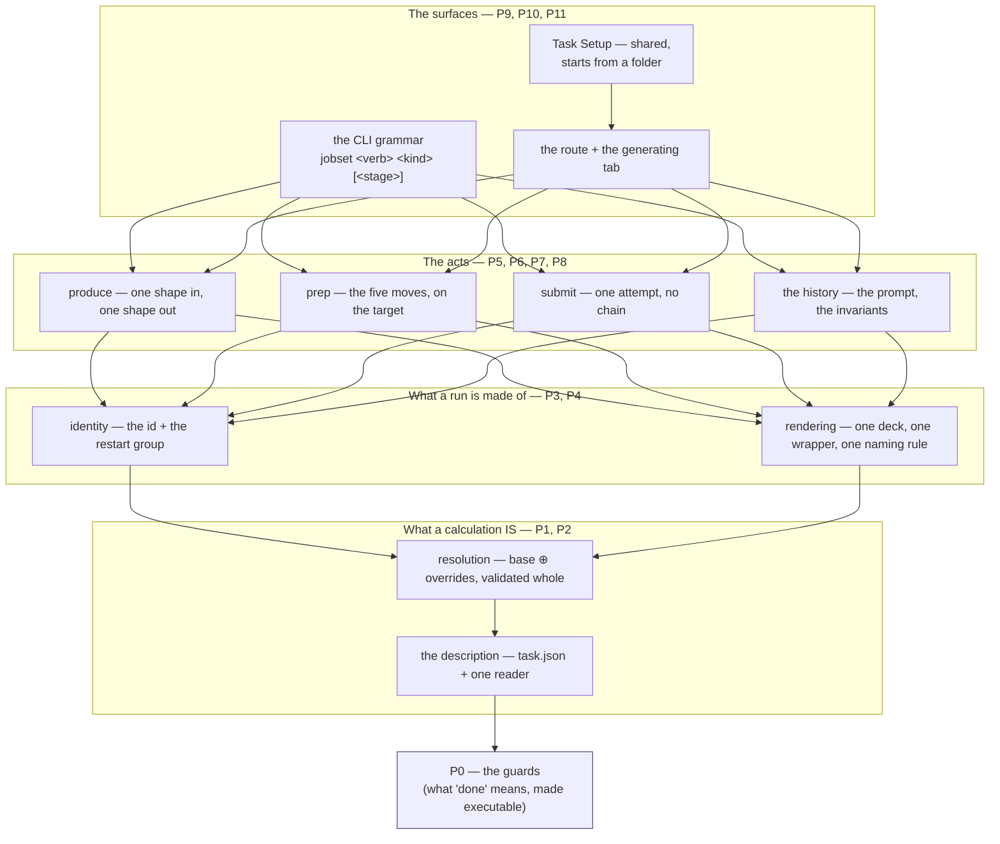
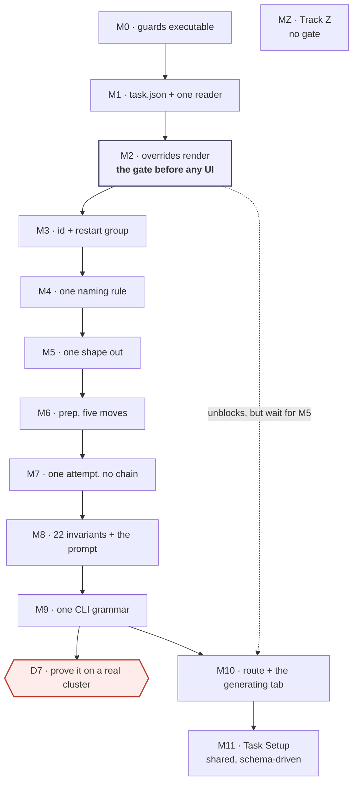

# Staged runs — the order the code follows the contracts

**Role:** plan
**Domain:** execution
**Companions:** [`web/staged-runs-architecture.md`](?doc=web/staged-runs-architecture.md)
(the design and the audit evidence) ·
[`engines/stages.md`](?doc=engines/stages.md) ·
[`execution/project-layout.md`](?doc=execution/project-layout.md) ·
[`execution/run-identity.md`](?doc=execution/run-identity.md) ·
[`execution/checkpointing.md`](?doc=execution/checkpointing.md) ·
[`execution/job-contracts.md`](?doc=execution/job-contracts.md)

---

## 0. What this document is, and what it is not

This is **the build order**: which layer is written first, what has to be true
before the next one starts, and how each one is checked. It decides nothing
about the design. Every rule it enforces was written somewhere else, and this
document's job is to point at that sentence at the right moment.

| | Where it lives | What it answers |
|---|---|---|
| **The design** | the five contracts above | *What is a stage? What does `prep` do? What may a name contain?* |
| **The findings** | `staged-runs-architecture.md` § 8a–8b | *What is actually built, and where does it disagree?* |
| **The acceptance criteria** | `staged-runs-architecture.md` § 8, per item | *When is item N done?* |
| **The order and the gates** | **this document** | *What do I build first, and how do I know it worked?* |

So an item's **"*Done when:*"** sentence stays in § 8 and is cited here rather
than copied — one place to change when it changes.

### The one rule this document exists to enforce

> **The contract is the source of truth. The code is evidence of the past.**

Every phase below opens with a **re-anchor** block naming the exact sections to
read before any code is written. That is not ceremony. This work has already
produced four documented cases of the opposite — a contract quietly bent to fit
what the code happened to do — and each one was found late, by a fresh read,
after being built on. The re-anchor is the cheapest place to catch the fifth.

**When the code and the contract disagree, there are exactly three outcomes**,
and choosing between them is the first thing a phase does:

1. **The code is wrong** — change the code. This is the common case and needs
   no discussion.
2. **The contract is wrong** — *stop*. Change the document first, in its own
   commit, with the reasoning written down. Then write the code against the
   corrected sentence. Never both in one commit: a commit that changes a rule
   and its implementation together leaves nothing to check the implementation
   against.
3. **Undetermined** — the contract does not cover this case. That is a decision,
   and decisions belong to the user. Add it to § 8 below and *stop that unit* —
   not the phase, just the unit.

**The tells that a drift is in progress**, all of them observed on this branch:

- writing *"what should the rule be"* — the rule exists; the sentence was not found;
- proposing a mechanism the contract never names;
- citing a function as the *reason* for a design (`_auto_block_size` does it this
  way, so…) — that is the past arguing with the plan;
- *"keep it, it is still useful"* — how ten ways to say "stage" happened;
- a passing test outranking an invariant.

---

## 1. The re-anchor, done at the start of every phase

Five steps, in this order. The order matters: steps 1–3 happen with **every code
file closed**.

1. **Open the sections the phase names.** They are listed, so there is no
   searching and no judgement about what is relevant.
2. **Write the obligations out as a numbered list, before opening any code.**
   If an obligation cannot be written without reading the code, the contract is
   missing a sentence — that is outcome 2 above, and it is fixed first.
3. **Name the governing sentence for each unit you are about to write.** One
   unit, one sentence. A unit with no sentence behind it is either unnecessary
   or a decision (outcome 3).
4. **Write the tests from the obligation list, then the code.** Where the
   contract carries a worked example, **the document's own text is the fixture** —
   parse the block out of the `.md` file rather than retyping it, so the two
   cannot drift. (`tests/test_checkpoint_manifest.py` does this against
   `job-contracts.md § 6.1`; reuse the pattern, do not invent a second one.
   `checkpoint_message()` and `stage_completion_tag()` used to be the example
   here — the checkpoint rework retired automatic naming, so they are gone.)
5. **Re-read the same sections at the end of the unit.** Drift is measured
   against the same text you started from, not against your memory of it.

### The rhythm inside a phase

One unit at a time: **contract → obligations → tests → code → run only those
tests**.

**At a milestone, run the phase's own tests plus every test that touches what
the phase touched** — found by grepping for the moved names, not guessed. Not
the full suite.

> **Corrected 2026-08-07 (user), after P1 proved the old rule wrong by
> obeying it.** This used to say *"the full suite runs at the milestone"*. P1
> added **one** module that nothing yet imports, and verifying it cost a
> **fifty-minute** 6037-test run — which then found two failures, one of them
> already red on `HEAD` and unrelated. That is not verification, it is a toll.
>
> **The full suite runs at three points, and they are the ones where a whole
> surface moves:** **P5** (the big subtraction — ten mechanisms become the
> agreed set, and the blast radius is every producer), **P9** (the CLI
> grammar), and **P11** (the end). A phase may also call for one if its own
> reviews turn up a reason, and it says why.
>
> Everywhere else the honest check is narrow and immediate: the unit's tests,
> then `grep` for each name the phase moved and run what comes back. P1's two
> real breakages — `test_layering` and `test_checkpoint_repo_scope` — were both
> in that set and were both found in seconds, long before the full run reached
> them.

- Tests are run through `tools/testrun.py` (`run none2e`, `run lf`,
  `status --fails`), under `/home/qqing/miniconda3/envs/molbuilder/bin/python`.
  Piping `pytest` through `tail` has already hidden 24 failures out of 31 on
  this project; the tool exists because of it.
- **The backend suite is green today and stays green.** This is not the MolView
  rework, where a rebuilt module was allowed to break its consumers on purpose.
  Here the CLI ships and people run it.
- When a phase must knowingly leave something failing, it is recorded as
  `pytest.mark.xfail(strict=True)` naming the phase that fixes it. Strict
  matters: it fails loudly when the behaviour *starts* working, so a fix cannot
  land without the plan being updated. That is the opposite of hiding a failure.

---

## 2. The layers, and why this order

The system is a stack. Each layer reads the one below it and never reaches past
it, which is exactly why it can be built bottom-up: nothing above exists yet to
be broken.



**Read the arrows as *"cannot be written until"*.** Two consequences worth
stating, because both were violated by earlier drafts of this work:

- **`task.json` is first because everything downstream reads it.** The shape,
  the overrides, the per-stage resources and the retry budget live in four
  different places today. Until they live in one, every layer above has to know
  about four.
- **The surfaces are last.** The gate `staged-runs-architecture.md § 8` names
  between its steps 2 and 3 is the reason: *the backend must be able to render a
  stage that overrides a parameter the stage type never carried, before any of
  it is drawn.* Draw first and the UI gets designed around what the model
  happens to allow.

### What "a layer is finished" means

All four, or the next phase does not start:

1. its milestone's assertions pass;
2. the **subtractions** for that phase are gone — proved by zero live callers,
   not by intention;
3. its three reviews have run and every finding has a disposition;
4. the contract sections it touched are accurate on the same day (a doc change
   in the same commit whenever the code taught us something).

---

## 3. The review protocol

**Three lenses at every milestone**, plus a fourth where the phase moves a
scientific parameter or a default. They are different *readings*, not the same
reading three times — that is what makes three of them worth the cost.

Each produces a finding ledger:

| # | Lens | What is wrong | Evidence (`file:line`, or the command) | Disposition |
|---|---|---|---|---|

**Every finding gets one of three dispositions, and no finding is dropped
silently:**

- **Fixed** — in this phase.
- **Deferred** — with a written reason *and* the phase or item that owns it.
- **Withdrawn** — with **the premise named**. "This turned out not to be true
  because X." Item 19 of § 8 is the worked example: four claimed broken promises,
  three of which were simply false.

A finding that says **the document is wrong** stops the phase (outcome 2 of § 0).

---

### Review 1 — Does it say what the contract says?

*Conformance. Run by a reader who did not write this phase's code* — a fresh
agent, or the same person after a full re-read with the diff closed.

**Method, and the direction is the whole point:** read the governing sections
first and write the obligations out; *then* open the diff and mark each
obligation met / not met / not applicable. Reading the code first turns this
into grading your own homework — you find the obligations the code already
satisfies.

Catches: **errors, inconsistency between layers, contract drift.**

Checklist:
- [ ] Every obligation from the re-anchor list has a line in the diff or a
      written reason why not.
- [ ] Every worked example in the governing sections still holds — including the
      ones in *other* documents that cite this layer.
- [ ] Where the contract fixes a name, a format, or a message, the code produces
      it **byte for byte** (the naming authority is `job-contracts.md § 6.3`).
- [ ] No new vocabulary: a term in the code that is in no document is either a
      missing sentence or a mechanism nobody agreed to.
- [ ] Nothing in the diff is justified only by *"the old code did it this way."*

---

### Review 2 — What should be gone, and is it?

*Subtraction. The lens this project has needed most* — ten ways to say "stage"
exist because every previous pass only added.

**Method:** work from the phase's *Subtracts* list. For each name: find its
callers before, prove there are zero after, and say where the capability lives
now. Then go looking for what the list missed.

Catches: **obsolete residue, duplicated code, reinvented modules, redundant design.**

Checklist:
- [ ] Every name on the *Subtracts* list has **zero live callers** — `grep` the
      whole tree, including `tests/`, templates, and JavaScript.
- [ ] Its tests moved or retired with it. A test asserting the text of a
      deleted template is not "still passing", it is orphaned.
- [ ] **Search by behaviour, not by name.** Does something already do this under
      a different word? `materialize` was rewritten in bash one level down and
      nobody noticed, because the bash did not contain the word *materialize*.
- [ ] Two constants that must agree are **one constant**. If they cannot be one,
      a test reads both and asserts the agreement. (The two warm-file
      inventories per engine are the live example — they agree today and nothing
      keeps them agreeing.)
- [ ] Comments and docstrings that describe the removed thing are removed too.
      A comment claiming *"one list, so a new hook cannot be added to one
      without the other"* sat above two lists.
- [ ] The vocabulary guard's count went **down**, or the ledger says why not.

---

### Review 3 — Walk it across the seams

*Integration and over-engineering. Take the worked example and run it.*

**Method:** [`worked-example.md`](?doc=execution/worked-example.md) is one
molecule taken end to end. Walk this phase's part of it, **in both directory
shapes**, and write down what actually happened rather than what should have.
That document exists because a walkthrough finds what reviewing a module
cannot: *a join is invisible from either side of it*, and it found eight gaps,
four of them on no list.

Catches: **over-engineering, cross-layer inconsistency, joins nobody owns.**

The four over-engineering questions, asked out loud:

1. **What did this phase add that no contract names?** A field, a flag, a file,
   a class, a mode. Each one needs its sentence or it goes.
2. **Could the caller do this in one line without the abstraction?** If yes, the
   abstraction needs an argument beyond tidiness.
3. **Does anything here exist only to serve a later phase?** Delete it. The
   later phase can add it, and will know better what it needs.
4. **How many places change when a stage gains a field?** If more than one, the
   merge is not one merge and the layer is not finished.

Checklist:
- [ ] The walk runs in **both** shapes, and a check written for one does not
      fail a directory that is correct in the other.
- [ ] Names agree across the seam: deck, output, log, directory, checkpoint tag.
- [ ] The layer below was not reached past.
- [ ] A failure at this seam says something a user can act on.

---

### Review 4 — Is the science still defensible? *(P2, P4, P6 only)*

*Applies wherever a parameter, a default, or a convergence value moves.*

Catches: a refactor that is correct in software and wrong in chemistry.

Checklist:
- [ ] A moved default still carries its justification
      ([`engines/tuning.md`](?doc=engines/tuning.md) § 2.3.1 for the tier
      values).
- [ ] A stage is judged as a **resolved whole**, never as a diff — two overrides
      can each be reasonable and jointly under-converged.
- [ ] A derived value (`BlockSize` from the rank count) is derived from *that
      stage's* number, not the base's.
- [ ] The reference trail survives the move (E4).

---

### The standing guards

Four questions from `staged-runs-architecture.md § 8c`, made executable in P0.
`tests/test_stage_vocabulary.py` is the authority; the greps are the smoke test.

| # | Question | Check | Today |
|---|---|---|---|
| 1 | Is there **one** way to say "stage"? | the allowlist in `test_stage_vocabulary.py` | **9 mechanisms** |
| 2 | Does a stage's **name** survive? | no `-stage<N>` / `stage%d` in any emitted filename | **3 conventions live** |
| 3 | Does everything run through the **wrapper**? | no generated script invokes an engine directly | **flat runner does** |
| 4 | Does each stage start because **someone said so**? | no `depends_on` between stages; no loop over stages in a runner | **both producers chain** |

---

## 4. The phases

Thirteen milestones. Each is a state someone else can verify without reading the
diff.

---

### P0 — Ground: make "done" executable ✅ **landed 2026-08-07**

> **All four questions are now one command** — `python -m tests.test_stage_vocabulary`
> from the repository root — and `tests/test_stage_vocabulary.py` asserts them,
> three as `xfail(strict=True)` naming P4, P5 and P7. The measured baseline is
> § 6. Two things came out of the phase that were not in it: the mechanism count
> is **ten**, not nine (the mechanical pass found the `stage-table` field kind,
> which changes P11's first unit — see `staged-runs-architecture.md § 8b`), and
> question 2's guard had to be written against `project-layout.md § 4.1` rather
> than § 8c's one-line summary, because a stage **directory** legitimately
> carries a number.

**Why first.** Every later phase is graded by the four questions above, and
three of the four answers are wrong today. Making them mechanical *now* means a
regression is caught by a test rather than by the next fresh-eyes review — and
it gives the subtraction reviews something to point at instead of an opinion.

**Re-anchor before writing any code:**
`staged-runs-architecture.md` § 8b (the ten mechanisms, the three filename
conventions) and § 8c (*what "done" would look like*) ·
[`process/testing.md`](?doc=process/testing.md) (the source-text-invariant
pattern) · [`checkpointing.md`](?doc=execution/checkpointing.md) § 6.

**Units:**

1. `tests/test_stage_vocabulary.py` — an **allowlist** of the live mechanisms by
   name and location. Removing one is a one-line edit; adding one fails. (Same
   shape as the CSS duplicate-selector guard already in the tree — reuse its
   harness rather than writing a second one.) It counts **ten**, not the nine
   § 8b listed by hand: the mechanical pass added the `stage-table` field kind,
   and § 8b now records both the row and why the first reading missed it.
2. A guard for question 2 (no stage *position* in an emitted filename) and one
   for question 3 (no direct engine invocation in a generated script). **Both
   fail today**; both are `xfail(strict=True)` naming P4 and P5.
3. A guard for question 4 (no `depends_on` between stages, no stage loop in a
   rendered runner) — `xfail(strict=True)` naming P7.
4. The baseline table, dated, written into this document's § 6 ledger, so a
   later review can diff rather than re-count.

**Subtracts:** nothing. This phase only measures.

**Milestone M0.** One command answers all four questions with a number, and
each wrong answer names the phase that fixes it.

**Reviews:** 1 (do the guards assert the contract's sentence, or my paraphrase
of it?) · 2 (does any of this duplicate `test_layering.py`,
`test_no_retired_doc_paths.py`, or the CSS guards?) · 3 (break each guard
deliberately — does it fail, and for the right reason?).

**Gate to P1:** M0 passes, and the three `xfail`s each name a phase.

---

### P1 — The description: `task.json` and its one reader ✅ **landed 2026-08-07**

> **`molbuilder/task.py`** — `Run` / `StructureRef` / `Stage` / `Task`,
> `to_dict` / `from_dict`, `read_task` / `write_task`, with
> `tests/test_task_description.py` reading § 6's own jsonc block as its fixture.
> **Four things went differently from the units below**, each for a reason worth
> keeping:
>
> 1. **The module is `task.py`, not the candidate `stages.py`.** `siesta/stages.py`
>    already exists, and R5 forbids the collision; the file is `task.json`, so the
>    module takes its name. `test_layering.py` places it at **L1** — it imports
>    `persist` and nothing else.
> 2. **The § 6.6 preflight is split, and the split is the point.** Four rows are
>    answerable from the file alone and land here. The other four — the engine has
>    a generator, the fingerprint matches, every field exists, every value is in
>    bounds — need the engine's field schema, and importing an engine into an L1
>    codec is exactly what `test_layering.py` prevents. **They move to P2**, which
>    holds the schema already. Written into the module docstring so the gap is a
>    decision on the record, not an omission found later.
> 3. **§ 6.6a's identical-stage warning moves to P2 as well** — the contract says
>    the comparison is over the **resolved** pair, and resolving is P2's verb.
> 4. **M1's "imported by both surfaces" became a source-text guard.** An import
>    nothing calls is dead code, and it would not have stopped a second codec
>    appearing beside the first. The test instead asserts that **no module other
>    than `task.py` knows the filename** (`checkpoint.py` excepted: it *detects*
>    the file, never parses it). Same intent, and it actually holds the line.
>
> **Two code corrections came out of it**, both found by a test rather than by
> reading: `persist.schema_major` did not do what `job-contracts § 6.1` says
> ("tolerating same-major minor bumps" — it compared the whole post-`@` token, so
> `@1.4` was refused against `@1`), and `_BUNDLE_DESCRIPTORS` moved onto
> `task.json`, making that arm live for the first time.


**Re-anchor:** [`engines/stages.md`](?doc=engines/stages.md) **§ 6 entire** —
6.2 (`varies`: intent recorded, never reconstructed), 6.3 (it *points at* a
structure), 6.4 (**one reader for both surfaces**), 6.7 (`shape`, required, never
inferred, fixed once produced) · [`job-contracts.md`](?doc=execution/job-contracts.md)
§ 6.1 (the artifact registry) and § 6.2 (the `@major` rule) ·
[`project-layout.md`](?doc=execution/project-layout.md) § 2.1 (the description
names no machine).

**Units, in order:**

0. **The name is settled**: the file is `task.json`, its schema string is
   `molbuilder/task@1`, and the `stages` key inside it keeps its name. Do not
   re-open it; decision 8b in § 8 records why.
1. The dataclasses and the codec — `read_task` / `write_task`. **Where the
   module lives is decided by `test_layering.py` and
   [`process/package-layout.md`](?doc=process/package-layout.md), not by
   preference**; the candidate is `molbuilder/stages.py`, beside `checkpoint.py`.
2. The refusal rules, each naming the offender: an unknown key fails **with that
   key's name**; a repeated stage name fails **naming the repeat**; a missing
   `shape` fails saying so. `--stages-json`'s help says *"Unknown keys ignored"* —
   this reverses it, and pre-1.0 that is a clean break, not a migration.
3. `schema_version: molbuilder/task@1`, plus its row in the artifact registry
   — **a doc change in the same commit**.
4. `checkpoint.py`'s `_is_bundle_root` already looks for a description and finds
   nothing, because no producer writes one. That arm becomes live here; assert it.
   ⚠ **It looks for the old name.** `_BUNDLE_DESCRIPTORS` still reads
   `("stages.json", …)` — the file was renamed to `task.json` in the contracts on
   2026-08-07 and the code has not moved, which is the intended state: the
   contract leads and P1 makes the code match. Pre-1.0, the old name is deleted
   rather than accepted alongside. **Done by the checkpoint rework**, which
   went further: there is no per-folder classification file at all, under any
   name, and a `checkpoint` section in a project-scope config is refused
   (`checkpointing.md` S1c).

**Subtracts:** nothing yet — and this is the one phase that deliberately raises
the mechanism count. `--stages-json` and `--stage-resources` cannot retire until
something reads the new file, which is P5. **The interim is exactly one phase
long**, and Review 2 records it as a debt with P5 named. Nothing new may grow a
second reader in the meantime.

**Milestone M1.** A description round-trips read → write → read, byte-identical.
The three refusal cases fail with the offending name in the message. **One
reader**, and the test that pins it asserts *no second module knows the
filename* rather than asserting an import — see point 4 above for why the
weaker form was replaced.

**Fixture:** `engines/stages.md § 6`'s own jsonc block, parsed out of the
document.

**Reviews:** 1 · 2 (is the reader a second copy of an existing codec? the
`.molstruct.json` envelope and `job-set.json` both already do
schema-versioned JSON — read them before writing a third) · 3.

**Gate to P2:** M1 passes; § 8 questions 1, 2, 7 and 9 (the name, the folder
name, hand-editability, two identical stages) have answers — they are listed in
§ 8 below.

---

### P2 — Resolution: three fields, `overrides`, one effective config

**Re-anchor:** [`engines/stages.md`](?doc=engines/stages.md) § 2–4 (three
fields; `base ⊕ overrides`; **one object validated *and* rendered**; a stage
validated as a **resolved whole, never as a diff**) · § 5 (the three places a
promoted field lands) · [`science/validation.md`](?doc=science/validation.md)
and the findings contract (facts in, findings out; `where` is the stable id).

**Units, in order:**

1. **Before changing anything**, pin today's behaviour: `relax_force_tol` and
   `relax_max_displ` live on the shared config *and* on the stage spec. Write
   the test that says which one a staged render uses when they disagree — that
   is what anyone relying on it has already built on.
2. **`SiestaConfig.stages` and `SiestaStageSpec` are deleted.** Not shrunk —
   *removed*. The stage list lives in `task.json` only, modelled by P1's
   `molbuilder/task.py::Task.stages`, which is engine-agnostic already. An
   engine config becomes what `stages.md § 4` always assumed it was: **one
   parameter set**. The four relaxation values stay exactly where they already
   are, as ordinary `SiestaConfig` fields.

   > **This replaced *"`SiestaStageSpec` shrinks to name / enabled /
   > overrides"* on 2026-08-07 (user), and the correction is the point of the
   > phase.** Shrinking left the stage list inside the engine config, which is
   > the actual fault: a config that contains a ladder cannot be the ordinary
   > single config § 4 resolves to. `stages.md § 1.1` now says so outright.
   >
   > **It also dissolves the blocker I had recorded as decision 11.** I had
   > found that a stage carrying `overrides: Dict` makes
   > `GET /api/build/schema/siesta` raise and the SIESTA form 500, and asked
   > which of four ways to cope. All four were ways to live with a mechanism
   > that should not exist: once `stages` is not a field of `SiestaConfig`, the
   > form generator never walks into a stage, `_stagespec_to_field_schemas` has
   > nothing to serve, and nothing 500s. **`_stagespec_to_field_schemas` is
   > deleted with it** — it answered *which settings may vary* by listing a
   > Python class's fields, which is the arrow backwards (`stages.md § 1.2`).
   >
   > **PySCF is untouched** (user, same day): its ladder runs inside one
   > process, so its stage list has a second life as engine behaviour.
   > `PySCFConfig.stages` and its `stage-table` stay until the SIESTA path
   > works.

2a. **The columns a user may vary stop being a Python class's field list.** The
   catalogue keeps coming from the schema; the *selection* comes from `varies`
   in the description, defaulting to the engine's **`workflow_group: "stage"`**
   group (`stages.md § 1.3`). Nothing in this phase draws it — P10 and P11 own
   the surface — but the backend stops constraining it, which is what makes the
   surface work possible at all.

   > **The default already exists and is better than what ships.** Both engines
   > tag every field `profile` / `stage` / `budget`, and the stage mechanism has
   > never read those tags. Of the four values `render_siesta_stage_fdfs` can
   > vary, **`relax_type` is tagged `profile`** (set once) and **`relax_steps` is
   > tagged `budget`** (a resource) — while six fields tagged `stage`
   > (`basis_size`, `pao_energy_shift`, `mesh_cutoff`, `dm_tolerance`,
   > `dm_energy_tolerance`, `kgrid`) cannot be varied at all. **So this unit is a
   > refactor toward something the codebase already declares**, not a new
   > invention: delete the hard-coded four, read the group. A new engine then
   > gets a working default by tagging its own fields and writing no shared code.
   >
   > **The two demotions are answered** (user, 2026-08-07). **`relax_type` stays
   > varyable — the tag is what is wrong**, and it is a scientific call: a ladder
   > changes the optimizer on purpose, CG to warm up and Broyden once the geometry
   > is close. Retag it `stage`, one line. `relax_steps` stays in `budget`; a step
   > budget is a resource, and nothing wants it to differ per stage today — but
   > **the tag restricts nothing either way**, since any parameter can be ticked
   > (`stages.md § 1.3`).
3. `continue_retries` gets a road to the wrapper. ⚠ It is not merely unrouted —
   it is **silently dropped while everything upstream validates** (§ 8a D): the
   field range-checks 1..5, `runwrap.py` implements the retry loop, and
   `stages_to_jobset` never reads it. So this unit has a prerequisite:
   `Resources` must be able to carry it, or a stage needs a different road.
   Decide which **before** writing either.
4. `on_nonconvergence` moves to the producer's own input (it is a scheduler
   edge, not a stage property).
2c. **What P2 does about the field tags: exactly one retag, and nothing else.**
   The full vocabulary — all fifteen keys, what each means and who reads it — is
   [`web/form-schema.md`](?doc=web/form-schema.md) § 1a, written 2026-08-07
   because no document owned it.

   | Tag | P2 |
   |---|---|
   | `workflow_group: "stage"` | **acquires a second job** — it becomes the default `varies` selection, the set whose *vary per stage* boxes start ticked. No code change here: P2 stops hard-coding four fields, and the group is what the surface reads instead (P10) |
   | `relax_type` | **retagged `profile` → `stage`**, one line. It is a scientific call (a ladder changes the optimizer on purpose) and the current tag's own subtitle — *"doesn't change between stages"* — is false for it |
   | `profile`, `budget` | **untouched.** They place a field in a card and route its advice there; both are surface concerns, and P2 is a model phase |
   | every other key | untouched |

   > **Why `profile` gets no treatment here, since it comes up constantly in the
   > reasoning:** it is not a model input. Nothing in resolution, rendering or
   > validation reads it — it decides which card a field is drawn in and where a
   > finding lands. So the answer to *"what does P2 do about `profile`"* is
   > **nothing, deliberately**, and the same timing rule applies as to the CLI
   > flags: change the model when the model changes, the surface when the surface
   > changes. Anything the tags need is P10's.

2b. **`restart` arrives as a shared-schema field.** `stages.md § 3` ends *"One
   field arrives"* — `restart` (`continue` | `clean`), because whether a stage
   starts from what is in the folder has to be sayable and a single run can mean
   it too. **`SiestaConfig` has no such field**, and no phase added it: the
   contract's own worked example in § 6 lists `"restart"` in `varies` and in
   every stage's `overrides`, so **the example would fail the very preflight P2 builds** (*every
   named field exists in the shared schema*). Found by the third review pass,
   2026-08-07. It lands here because it is an ordinary shared field, and P3 unit 4
   — which turns it into SIESTA's `DM.UseSaveDM` / `MD.UseSaveXV` / `MD.UseSaveCG`
   trio — depends on it existing.

4a. **The template is read back into a config, and the fingerprint is written
   where the template is.** ⚠ **This unit replaced one built on a premise that
   turned out to be false** (2026-08-07): it used to serialise `task.json`'s
   `base` into a `SiestaConfig`, and **there is no `base`** — everything that
   does not vary lives in the template, once (`stages.md § 4`). What P2 actually
   needs is the *other* direction: `prep` holds a template and a stage's
   `overrides`, and must produce one ordinary config to validate and render.
   **`schema_fingerprint` is computed by whatever writes the template**, since
   that is the moment the schema is in hand; the preflight's only non-refusal row
   has had a reader and no writer since it was written.

5. `effective_config(template, stage) -> SiestaConfig` — **one function, one
   place**, and the object it returns is the object that gets validated *and*
   rendered. A stage that omits a varied key keeps the template's value for it
   (§ 6.2's subset rule): the fallback is the backbone, not a second copy in the
   description.

   ⚠ **This unit must land before, or with, unit 2** — not after. Unit 2 deletes
   the field every current consumer reads, and `effective_config` is what they
   read instead. The plan's original 2→5 order left a window with no resolver,
   which the review caught before it was built.
6. Validation across stages: a per-stage finding carries the stage in `where`; a
   finding about the *sequence* (a ladder that loosens) carries **no** stage
   label, because it is not a fact about a member of it.
7. **The half of § 6.6's preflight P1 could not reach**, handed over because this
   phase is the first that holds a field schema. Four refusals — the engine is
   one this backend has a generator for; the schema fingerprint matches; every
   name in `varies` and every `overrides` key exists in the shared schema; every
   value is inside its bounds — each **naming what it refused**, and all of them
   before anything is written. `molbuilder/task.py`'s docstring carries the same
   split so the two halves cannot quietly diverge.
8. **§ 6.6a's warning**, which needs resolution and so could not live in the
   codec either: two enabled stages whose **effective configs are equal** *and*
   whose later one starts `clean` recompute the earlier one and discard it. Warn,
   never refuse — where the later stage **continues**, identical settings are the
   honest way to say *keep going* after a step budget ran out. **The comparison is
   over the resolved pair**, so comparing `overrides` alone is the wrong test and
   would flag the legitimate case.

**Subtracts — the MODEL, not the surface** (corrected 2026-08-07, user).

> **P2's goal is resolution, and resolution is a model layer.** The plan is
> bottom-up: P1 said *what a calculation is*, P2 says *how a description and a
> template become one config per stage*, and **the surfaces are last** (P9 the
> CLI grammar, P10/P11 the web). A phase that deletes a command-line flag is
> changing a surface, and P2 is not the phase for that.
>
> **What the four flags actually are.** `--stage N`, `--stage-strategy`,
> `--stages-json` and `--stage-resources` are **four input syntaxes for one
> thing**: *here is the ladder*. Every one of them expresses something
> `task.json` expresses. So retiring them removes **a way of saying it**, never
> the ability to say it — that is a switch of design, exactly as the file-driven
> scheme intends, and not a loss of function.
>
> **Which gives the timing rule this plan was missing:**
>
> > **Change the model when the model changes; change the surface when the
> > grammar changes — and never leave a moment where a user can express
> > something in neither.**
>
> P2 therefore deletes `SiestaConfig.stages` and `SiestaStageSpec` — those *are*
> the model it replaces — and **repoints the flags at `Task` instead of deleting
> them**. They keep working. **P9 retires them**, when the new grammar arrives to
> replace them, which is a grammar decision and always was.
>
> **This dissolves § 8 decision 13.** I had recorded a four-phase window in which
> neither surface could start a staged run, and offered three ways to live with
> it. The window was manufactured by deleting a surface in a model phase. There
> is no window.

| Deleted in P2 — the model | Repointed in P2, retired in P9 — the surface |
|---|---|
| `SiestaConfig.stages` — the field | `--stage N` · `--stage-strategy` · `--stages-json` · `--stage-resources`, each building a `Task` instead of writing `cfg.stages` |
| `SiestaStageSpec` — the type | the staged `/api/build` path, which likewise parses into a `Task` |
| `_stagespec_to_field_schemas` — it published a class's fields as the columns a user may vary, and the checkbox replaces it (`stages.md § 1.3`) | |
| the `dataclasses.replace` block in `render_siesta_stage_fdfs` — `effective_config` replaces it | |

⚠ **One payload does break, and that is fine pre-1.0.** `--stages-json` currently
takes the eight-field stage shape; a stage is now name / enabled / overrides, so
the flag accepts the new shape and its help text says so. That is a format
change, not a compatibility shim.

The original text is kept below because its *evidence* still stands — these are
the call sites that made the model deletion unavoidable:

| Gone in P2 | Why it cannot wait for P5 |
|---|---|
| `--stage N` (the flag; **the presets stay** — the tier values are real science, and become the default *selection*) | `apply_siesta_stage` writes `cfg.stages` |
| `--stage-strategy` | `cli.py:795` assigns `cfg.stages` |
| `--stages-json` | `cli.py:788` assigns `cfg.stages` |
| `--stage-resources` | its only consumer is the ladder path these feed |
| `SiestaStageSpec` + `cfg.stages` (mechanism 5) | the field itself |
| `_stagespec_to_field_schemas` | it exists only to publish that class's fields as columns |
| the `dataclasses.replace` block in `render_siesta_stage_fdfs` | replaced by `effective_config` |

**The staged `/api/build` path goes with them** — `coerce_to_field_type`
(`_shared.py:1071`) turns a wire `stages` list into `SiestaStageSpec` objects and
`build.py:234` mirrors the validator. Both are removed rather than adapted; the
browser regains a staged path at P10, writing a description instead
(see *What this phase costs the browser* below).

> **This was a finding, not a plan change made for its own sake.** The plan
> scheduled these five subtractions at P5 while P2 deleted the field underneath
> them. Found by the review on 2026-08-07, verified against `cli.py:788,795` and
> `_shared.py:1071` rather than assumed. **P5 narrows accordingly** — it keeps
> the flat runner, `build_siesta_stage_bundle` and the shape decision, which is
> what *one shape in, one shape out* was always about.

**Milestone M2.** `{mesh_cutoff: 300}` on the tight stage renders a deck
carrying 300 while the shared config still says 150. The object validated **is**
the object rendered (assert identity, not equality). A stage asking for three
retries renders a wrapper whose **text** contains the loop. A ladder that
loosens between stages reports once, with no stage label. **A description naming
a field the schema does not have is refused, by name** — the half of the
preflight P1 handed over — and two identical stages warn only when the later one
starts clean.

**This milestone is the gate the whole design named**: the backend can render a
stage that overrides a parameter the stage type never carried. Nothing on a
surface may be drawn before it.

### What this phase costs the browser, said out loud

Two capabilities leave the tab at P2, and neither is an accident:

- **The stage table goes**, because the table *was* the fault — it published a
  Python class's field list as the set of things a user may vary
  (`stages.md § 1.2`). It returns at **P10/P11**, fed by the user's selection
  instead. **Between P2 and P10 a staged calculation is CLI-only.** That is eight
  phases, and it is the price of not rebuilding the surface twice.
- **`on_nonconvergence` stops being a per-stage column the browser can set.**
  It is not a field of the shared schema (§ 3: its whole effect is the scheduler
  edge), so it is not in `task.json` and no description can carry it. It is set
  where the JobSet is produced — the terminal. That follows from *the browser
  describes and observes, the terminal acts*, but until this note nothing said
  the capability had moved, and it is a control a user has today.

**Reviews:** 1 · 2 · 3 · **4** (do the tier values keep their justification when
they become shared-config defaults?).

---

### P3 — Identity: the id, and the engine's restart group

**Re-anchor:** [`run-identity.md`](?doc=execution/run-identity.md) **entire** —
it is short and every paragraph is load-bearing · `job-contracts.md § 2.1`
Rules 1–2 (one directory, several inputs, one basename) and § 4 (warm/cold, the
four behaviours).

**Units:**

1. The id is built **from inputs, never from anything a run produced** — it must
   be knowable before the calculation exists.
2. Normalisation **reuses the shipped basename set**; happens **once**; refuses
   rather than appending a digit.
3. The id is **editable once, before anything has run**. After that, changing it
   is not a rename — it is a different calculation, and the surface says so. The
   reason is the engine's: the id keys every warm file, so an edited id makes
   the calculation silently start over rather than fail.
4. The per-engine identity group, set from **one** `restart` field — SIESTA's
   `SystemLabel` + `DM.UseSaveDM` / `MD.UseSave*`, PySCF's `JOB` literal + the
   generated resume branches. Declared as one group per engine because the two
   ways they disagree are both silent.
5. What is **reported rather than pinned**: a changed cell is not a mismatch,
   it is a silent no-op — a `.XV` carries its own cell and **wins**. Each case
   names who says it and when; the wrapper banner is the one that must never be
   weakened, because it is always present.

**Subtracts:** any second normaliser; any id path that reads a result.

**Milestone M3.** A two-stage description whose second stage continues renders
**every** bound parameter set, and a stage set to `clean` renders **none** —
asserted together, because the failure mode is that they disagree. A second
produce into a folder that already holds warm files **says what is already
there, and never renames**. `job-contracts.md § 4` is updated in the same
commit.

> ⚠ **Corrected 2026-08-09.** This line read *"refuses unless told to
> overwrite"* until decision 19 softened it to a warning the same day, and the
> milestone was not carried along. `run-identity.md § 6` is the corrected
> sentence; `validation/identity.py::check_overwrite` still returns an `error`
> and quotes the retired wording, which is the *code in a follow-up* half of
> decision 19 and lands with P5, the phase that rewrites the produce path.

**Reviews:** 1 · 2 · 3 (walk: continue a stage in both shapes; in flat the warm
files are unsuffixed and shared, and that is the design, not a bug).

---

### P4 — Rendering: one deck, one wrapper, one naming rule

**Re-anchor:** [`job-contracts.md`](?doc=execution/job-contracts.md) **§ 6.3 —
the naming authority** (the four separators: `_` joins parts of one name, `-`
attaches a counter or qualifier, `.` introduces a type, `/` separates levels;
and *a name says what its location does not*) · `engines/stages.md § 7` ·
[`engines/siesta.md`](?doc=engines/siesta.md) · `project-layout.md § 4.1`.

**Units:**

1. **One deck renderer**, taking an effective config. It renders; it does not
   decide.
2. **A stage's position stops reaching filenames.** The browser writes
   `<label>-stage<N>.fdf` with N from a preset dropdown — while *already
   holding the names*, since the presets are literally *coarse*, *medium*,
   *tight*. Insert a stage and every later file silently renames, reassigning
   outputs to a stage that did not produce them.
3. **One convention, keyed on the name**, used by the deck, the output and the
   log. Three are live today: the flat ladder writes `bdt_au_coarse.fdf`, the
   browser writes `bdt_au-stage1.fdf`, and `trajectory_log/format.py` writes
   `bdt_au-stage1.molwatch.log` — so in a ladder run **a stage's deck and its
   own log cannot be matched by name**.
4. The consumer follows: the run decoder's stage regex keys on the hyphen form,
   so it changes with the rename, and anything grouping a staged run's logs by
   parsing `N` out of a filename must read the stage from the deck's name or its
   directory instead ([`web/results.md`](?doc=web/results.md)).
5. Resource-shaped overrides reach **all three destinations**: the deck line, the
   wrapper's environment, and the BENCH-MARKS block.

**Subtracts:** the `-stage<N>` filename convention, everywhere — emitter,
browser, log, decoder.

> **Units 2, 3 and 4 landed 2026-08-10** (`c7d445bb`), built to decision 27.
> One token, `<NN>_<name>`, from `identity.stage_token`; read back by
> `identity.parse_stage_token`; used by the emitter, the log, the browser and
> the decoder. **Guard 2 is green and its `xfail` is gone.**
>
> **The subtraction was wider than this line says.** The phase text names two
> producers; there were **four**, and the two extra were found by the full
> batch rather than by reading:
>
> | | |
> |---|---|
> | `cli.py:1002` | built `f"{basename}-{stage.name}.molwatch.log"` **by hand**, never calling `molwatch_log_basename` — invisible to the log module's own tests *because* it did not use the module, and the direct reason a stage's deck and its log could not be matched |
> | `stages_to_jobset` | built `script=` from `f"{label}_{s.name}.fdf"`, so after the rename every Job in a ladder JobSet pointed at a file the renderer no longer wrote |
>
> Both are the same lesson as § 8d's: *search by behaviour, not by name*. A
> producer that spells the convention inline is exactly the one a grep for the
> helper cannot see.
>
> **Unit 1 confirmed 2026-08-10, not built.** There is exactly one `.fdf`
> renderer, `render_fdf`, and three callers reach it: `write_fdf` (the CLI's
> single job), `render_siesta_stage_fdfs` (each stage, through
> `effective_config`), and the web Build endpoint. The staged path adds no
> renderer of its own — it resolves a config and hands it over, which is § 4
> R1's *one object is validated and rendered*. The web surface has **no
> staged path at all**: it writes one deck, and the fan-out is `prep`'s
> (§ 7.1). Nothing to subtract.
>
> **Unit 5 landed 2026-08-10.** All three destinations were already reached —
> and walking them turned up a fourth thing that was not, in the destination
> the unit names last.
>
> | Destination | State found |
> |---|---|
> | the deck line | ✅ already per stage. `effective_config` → `render_fdf` means `diag_algorithm` and the `BlockSize` *derived from* `mpi_np` both come out per deck, with no stage-aware code below the resolve |
> | the wrapper's environment | ✅ already per stage, and by the strongest possible route: `prep_jobset` renders one wrapper **per distinct script**, and `write_run_wrapper` reads the solver back **out of that deck** (§ 5.1). Nothing passes the routing along a parameter where it could be dropped. Two stages, ScaLAPACK then CPU-ELPA, give `molbuilder-siesta` and `molbuilder-siesta-gpu` |
> | the BENCH-MARKS block | ⚠ **the value arrived; the declaration around it did not** |
>
> **The finding.** BENCH-MARKS is where a deck states which of its lines came
> from a launch quantity, *so that a later change of launch can re-derive them*
> (`engines/stages.md` § 5.2). It could not:
>
> - the block recorded `n_atoms` and `gpu_mode` but **not the rank count**,
>   while `_auto_block_size` takes three inputs. The one thing the block exists
>   to enable was not possible from what it carried. `mpi_np` was in
>   PROVENANCE — the block a *human* reads — and absent from the one a tool
>   parses;
> - `range` was the module constant `(16, 256)` while `default` beside it was
>   derived, so the block **declared its own emitted value out of bounds**
>   whenever `floor(n_atoms / mpi_np) < 16`. Not a corner: `(200 atoms, 16
>   ranks)` gives 8 and `(20, 32)` gives 1. And the advice erred **upward**,
>   past the point where ranks receive no block at all.
>
> A stage ladder is simply the first thing that renders two decks at different
> rank counts, which is why a defect older than this phase surfaced in it. Both
> halves now derive from the same picker (`_block_size_bounds`), so the
> invariant `lo <= default <= hi` holds by construction rather than by
> agreement between two constants. `SIESTA_BENCH_FIELDS` no longer carries a
> range for `BlockSize` at all — a renderer that forgets emits **no** range
> instead of a wrong one. Contract: `job-contracts.md § 3.3` (two new rules),
> `engines/stages.md § 5.2`.
>
> **For Review 4.** The numbers moved: a bench tool told `[16,256]` is now told
> `[1, floor(n_atoms/mpi_np)]` rounded down to a power of two. No shipped
> consumer reads the field — `bench siesta-gpu` parses the block only to check
> it is present and sweeps `DEFAULT_POINTS` — so this changes advice, not
> behaviour. The bound is the one `_auto_block_size` already enforced on
> itself; what changed is that the deck now *says* it.
>
> Pinned by `tests/test_stage_resource_destinations.py` (18 tests, one per
> destination plus the invariant), mutation-tested five ways: static field
> list, missing `mpi_np`, bounds ignoring a user-set value, a fixed rank count
> in the derivation, and the CPU-ELPA routing blindness — all five RED.
>
> **Still open in this phase:** **M4's browser walk** — the review note says a
> filename change is invisible to stubs, and the decoder's anchor rule is what
> to watch in the Results tab. It needs `molbuilder serve` and the live BDT-Au
> data.

> **Three green tests pin the convention this phase removes, listed by P0 so
> the phase does not meet them under pressure.** They are *not* failures to work
> around: each is a correct test of today's behaviour, and each is retired or
> rewritten in the same commit that changes the behaviour, per
> [`process/testing.md`](?doc=process/testing.md) — a test serves the contract,
> and when the contract moves the test moves with it.
>
> | Test | What it pins |
> |---|---|
> | `test_trajectory_log_stage_targets.py::test_multi_stage_cli_emits_per_stage_molwatch_logs` | `JOB-stage1/2/3.molwatch.log` from `--stage-strategy` — and `--stage-strategy` is itself P5's subtraction, so check the order |
> | `test_smiles_and_siesta.py` (`assert f"-stage{stage}" in text`) | that `--stage N` **propagates the suffix into the rendered deck** |
> | `test_pyscf.py::…molwatch_emitter…` | the emitted PySCF script writing `JOB + "-stage2.molwatch.log"` |
>
> Two more mention the token and are **incidental** — `test_results_file_picker_js.py`
> and `test_runwrap_cold_restart.py` use it only as a fixture filename, and they
> need nothing but a rename.

**Milestone M4.** For one description, the deck, the output, the log and the
directory all agree on the stage's **name**. Inserting a stage renames nothing
that already exists. A description asking ScaLAPACK then ELPA renders two decks
whose solver differs **and** two wrappers activating **different conda
environments**. A stage varying `mpi_np` renders a deck whose `BlockSize` came
from *that stage's* rank count, with BENCH-MARKS declaring it. Guard 2 turns
green.

**Reviews:** 1 · 2 · 3 (the seam this phase exists for — deck ↔ log ↔ decoder ↔
Results tab; walk it in the browser, because a filename change is invisible to
stubs) · **4** (`BlockSize` derivation; the eigensolver → environment mapping).

---

### P5 — The producer: one shape in, one shape out

**Re-anchor:** `engines/stages.md § 6.7` (the shape is a **required field**,
read by `prep`, never inferred) and § 7 (what the generator must produce; a
produce is **transactional**) · `project-layout.md § 1` (the two shapes) and
§ 2 (the portable package vs. `prep`) · `job-system.md` decision #2 (**reuse the
single-job wrapper unchanged**) · `running-a-job.md § 2.2a` (**bash is a
bootstrap, not a program**).

**Units:**

1. `build_siesta_stage_bundle` takes the **shape** from the description and
   emits the artifacts for **that shape only**. Today it returns the flat decks,
   the flat runner **and** a hierarchical JobSet at once — so the shape is
   decided by whichever command the user types next, which is not a choice at
   all.
2. `on_nonconvergence` is read in **one** place. It is read twice today, and the
   two disagree about whether the last stage force-halts (the bash runner does
   it and is right; the JobSet producer has no equivalent).

   > **Half-closed by P2 unit 4, and the remaining half turns out to be
   > vacuous** (verified 2026-08-07 by the phase's own Review 3). Both
   > producers now read the *same* object — the policy mapping passed as the
   > producer's input (§ 3) — so there is one source rather than two fields.
   > And `stages_to_jobset` consults a stage's policy only when that stage is
   > some other stage's predecessor, so the **last** stage's policy is
   > structurally unreachable there: there is nothing for it to disagree
   > about. What is left for P5 is the shape decision, not this.
2a. **A promoted `enable_gpu` reaches the deck and stops there** — M2 review
   finding 6 (2026-08-07), deferred here rather than fixed because it is this
   phase's, not P2's. `stages.md § 5`'s second row says a GPU decision lands in
   the deck **and** the wrapper's env routing **and** a scheduler's `--gres`;
   `stages_to_jobset` sets `gres=None` unconditionally, and `submit.py` reads
   `gpu = bool(job.resources.gres)`. So a ladder renders a GPU deck and asks
   for no GPU.

   > **P2 did not cause this — it was already true when `enable_gpu` was a
   > shared field — but P2 widened who can hit it**, because a stage can now
   > promote `enable_gpu` and have two stages disagree about it. The
   > derivation `job-contracts.md § 6.2` names (*"derived from `.fdf` + GPU
   > type"*) exists in `bench/to_jobset.py` and has no counterpart in the
   > ladder producer. Whoever writes unit 1 owns it, since it is the same
   > question as *what does this producer emit*.

3. **The flat ladder runner is deleted, not taught.** It emits
   `siesta < "$fdf" > "$log"` — no activation (so it fails on stage 1, since
   `siesta` lives in `molbuilder-siesta` and is not on a clean `PATH`), no rank
   clamp, no GPU pinning, no `--cold`/`--continue`, no retry budget, and **no
   `.molwatch.log`, so the Results tab and the trajectory viewer see nothing**.
   Give it activation, rank resolution, a monitor and a log and it *is* the
   wrapper — which is the argument for deleting it.
4. The produce is transactional: built elsewhere, moved into place only when
   every deck, wrapper and description succeeded.

**Subtracts — narrowed 2026-08-07, and the reason is worth keeping.** This
used to claim all ten mechanisms. It cannot: **mechanisms 1–5 all write
`SiestaConfig.stages`, and P2 deletes that field**, so they die there or the tree
does not import. What is genuinely *this* phase's is what survives P2 and is
about the **shape**:

| Gone here | Why it is P5's and not P2's |
|---|---|
| the flat runner (`render_siesta_stages_runner`, mechanism 6's second half) | it is a *producer* decision — the argument for deleting it is that giving it activation, ranks, a monitor and a log makes it the wrapper |
| `build_siesta_stage_bundle`'s **both-shapes** behaviour | it renders flat decks *and* a hierarchical JobSet in one call, so `shape` never chooses; that is exactly *one shape in, one shape out* |

PySCF's `StageSpec` **stays as it is** — its ladder runs inside one process, so
it is genuinely a different shape; it should read the same description, not the
same runner. The `stage-table` field kind (mechanism 10) **also stays**, now
serving PySCF only, and P11 asks the one question about it that matters —
whether it can be fed a `task.json` instead of a schema default without being
rewritten.

**Milestone M5.** A bundle never contains both a flat runner and a
`job-set.json`. A produced folder can be told apart **by looking at it** rather
than by remembering what was typed. Guard 1's count drops to the agreed set;
guard 3 turns green.

**Reviews:** 1 · 2 (the heaviest subtraction review in the plan — every retired
flag, every orphaned test, every comment describing a deleted mechanism) · 3.

---

### P6 — `prep`: the five moves, on the machine that will run it

**Re-anchor:** `project-layout.md § 2.3` (**the five steps, always in this
order** — and *why the order is forced*: a parameter that depends on the launch
cannot be decided before the launch is known) · § 2.3.1a (**`prep` is the
framework; benchmarking is one thing you prep**) · § 2.3.2–2.3.5 (the three
jobs, and what goes in and comes out) · § 1.6 (**stages do not chain**).

**Units:**

1. **Lift the general framework out of `bench/prep.py`.** It is the one place
   this framework is already built, and it was built inside the benchmark
   because that is where the need appeared first. The design reads one way:
   benchmarking is prep, specialised. *(Which direction the refactor moves the
   code is an implementation matter — but the general case must not end up
   looking like a special case of the special case.)*
2. **The carry is a real file copy, made at prep**: `.XV` always, `.DM` when the
   description says, `.CG` **only when both stages share an algorithm**. Copied,
   never linked — the engine writes to these files, and a link would destroy the
   result you chose to build on. Copied *at prep* because stages do not chain,
   not as a separate decision.
3. A benchmark **nests inside the stage it measures** (the best rank count
   depends on the science), and the bundle names the stage it came from.
4. The measured verdict reaches **the description**, not just a script. The
   shipped chain stops one step short: `bench summarize` writes
   `bench-result.json`, `bench prep-run` turns it into `run-production.sh`, and
   `task.json` never learns — so the next produce silently reverts to defaults.
5. **`prep` prints what it resolved.** It is the only place the measured
   numbers, the chosen geometry and the rendered deck appear together, which is
   what makes `submit` a plain yes.

**Subtracts:** `bench prep-run` as a separate verb — it *is* `prep run` written
a second time; the second machine-detection path if one appears.

**Milestone M6.** `prep run tight --from 01_coarse/run-0` produces the printed
report of `staged-runs-architecture.md § 8` step 1c verbatim, **real files** in
the attempt directory (no links), and re-producing keeps the measured
configuration rather than reverting.

**Reviews:** 1 · 2 · 3 (walk jobs one, two and three of § 2.3 in both shapes) ·
**4** (is the `.CG`-only-when-algorithms-match rule still right? does the
benchmark grid still mean what `job-system.md § 7` says?).

---

### P7 — `submit`: one attempt, no chain

**Re-anchor:** `running-a-job.md § 2.2a` (bash is a bootstrap) ·
`project-layout.md § 1.5` (**an attempt is immutable**) and § 1.6 ·
`job-contracts.md § 2.1` (**the caller's working directory is the contract** —
both launchers establish it and neither the wrapper nor the engine ever
navigates).

**Units:**

1. **Retire `render_run_wrapper(..., attempt_dirs=True)`** — ~130 lines of
   generated bash that resolves the attempt, creates `run-<n>/`, links inputs,
   copies warm state and `cd`s in. That is `jobset/materialize.py` written a
   second time in bash, one level down, in the layer kept free of filesystem
   logic — **and it is the only thing in the system that breaks the cwd rule
   everything else holds.** Retiring it restores an invariant rather than tidying
   one. Nothing calls it (`attempt_dirs` defaults to `False`; the only callers
   are its own eleven tests), so retiring cannot regress a shipped path. The
   behaviour it established is **right and stays** — an attempt per invocation,
   immutable once written, inputs linked, previous warm state copied. Only the
   address changes. Its eleven tests move with it; the two asserting wrapper
   text retire.
2. `stages_to_jobset` stops emitting `depends_on` and `Carry` edges between
   stages. `carry_deref` stays for the chained ladder `jobset` can still build.
3. `submit` resolves **one** attempt for the stage it is starting: next unused
   number, create, link the deck and package, copy what was named, launch there.
4. `materialize.job_dir_name` returns `point-<name>` for **every** job and must
   branch on `JobSet.kind` — `01_<name>` for stages, `point-*` for bench trials.
5. **One warm-file inventory per engine.** Two exist per engine today and they
   agree by luck: add a warm hook to the carry list alone and a `--cold` run
   silently warm-starts from it — a contaminated calculation that reports
   success. Fix by **subtraction**: the carry constants belong to the
   `attempt_dirs` block, so unit 1 takes them with it, leaving one list each.
   Only if the Python replacement still needs an inventory does this become a
   real extraction — and then it is one list both the mover and the carrier
   read. Rename `_SIESTA_WARM_SUFFIX_FILES` and `_PYSCF_WARM_FILES` if they
   survive; they are functions wearing constant names.

**Subtracts:** the shell attempt-resolution block; the inter-stage edges; one
warm-file inventory per engine.

**Milestone M7.** No stage job carries a `depends_on`. No produced tree contains
a dangling symlink. No generated wrapper changes directory. Exactly one
warm-file inventory per engine, and a test that adds a suffix to it sees **both**
behaviours change. Guard 4 turns green.

**Reviews:** 1 · 2 · 3 (the walk that found this: set up the tight stage against
a named coarse run and confirm real files, not links).

---

### P8 — The history: the prompt, the coverage, the last invariants

**Re-anchor:** [`checkpointing.md`](?doc=execution/checkpointing.md) § 9 (**who
decides to save, and when you are asked** — explicit, always; molbuilder never
takes one on its own) · § 8 (**in the flat shape the save is the only way
back**) · §§ 11–12 (the **31** rules and which hold right now) · § 13.4 (where
each is asserted, and the table of the seven still waiting) ·
`engines/stages.md § 7.3` (a description grows, and a stage that has run is a
record).

> **Repointed 2026-08-09.** This line cited § 4.1, § 5.0 and *"the twenty-two
> invariants"* of § 6 — all three moved in the checkpoint rework, and § 6 now
> names something else entirely (*Saving, step by step*), so the citation was
> not merely stale but misleading. Ten more citations across five live
> documents had drifted the same way and were repointed with it.

**Units:**

1. **The prompt at interactive `prep`**, when prep is about to change a
   directory that already holds results — showing the message it would write and
   the tag if a stage finished. **Never at run or submit time**: that may be a
   scheduled job, and blocking a queue to ask is the wrong party at the wrong
   moment. Non-interactive prep proceeds without one **and says so**.
2. The same trigger in the **flat** shape, where it is not the same feature: a
   missed checkpoint there is not a thinner history, it is **a state that no
   longer exists anywhere**. The surface says plainly that this is the save
   point, not housekeeping.
3. The branch-name proposal — `<stage>-<what you are trying>`, editable. The
   tab's to offer; the route takes the name it is given and refuses a bad one
   clearly.
4. The archive covers **runs, not containers**: a flat root or a stage's
   `run-N/` is archived; a benchmark's `point-*/`, two levels down, is not. The
   rule is **depth**, not a marker file.
5. The remaining invariants get assertions, **each marked with the shape it
   holds in** — a check written for one shape that fails the other is worse than
   no check, because it fails a directory that is working correctly. **`snapshot
   verify`** (`checkpointing.md` § 12, *Verifying without restoring*) is the one that matters most: the archive-verification
   code exists but is reachable only by attempting a restore, which is the worst
   moment to learn an archive is gone.

**Subtracts:** any language anywhere still describing an *automatic* checkpoint.

**Milestone M8.** All twenty-two invariants have an assertion. **I2** (every
MANIFEST entry matches its file by name, size and sha256) and **S1** (tracked
XOR archived, never both, never neither) run over a **real produced folder**,
not a fixture. A `prep` about to overwrite results asks first and prints the
message it would write; a non-interactive one proceeds and says it did not.

**Reviews:** 1 · 2 · 3 (walk: run two stages, restore the first, confirm the
`.DM` two levels down comes back).

---

### P9 — The command surface

**Re-anchor:** `staged-runs-architecture.md § 8` step 1c (the table and the
grammar) · [`process/conventions.md`](?doc=process/conventions.md) (the CLI
doctrine: a thin shell over the web API; `click`).

**Units:**

1. One group, one grammar: **`jobset <verb> <kind> [<stage>]`**. `describe` and
   `status` take no kind, because they are about the calculation rather than one
   run of it.
2. `bench` stops being a top-level group — four of its six verbs fold in.
   `probe-scheduler` is a config helper and stays outside the loop;
   **`siesta-gpu` needs its own decision** (§ 8 below).
3. The kind is a **positional, not `--bench`**: measuring and running are peers,
   not a modifier of one another.
4. `summarize` stays a verb of its own **because it writes a file** — the
   verdict — and you are meant to read it and decide.
5. **`prep run` asks** rather than reading the verdict silently. A benchmark
   lives inside the stage it measured, so prep can always *find* one — finding
   is not permission.

**Subtracts:** `bench generate`, `bench prep`, `bench summarize`, `bench
prep-run` as top-level verbs.

**Milestone M9.** The session in step 1c runs verbatim, from inside a
calculation folder. `--help` reads as one grammar rather than two surfaces over
one mechanism.

**Reviews:** 1 · 2 (two names for one act is what the old split cost — prove
there is now one) · 3 (walk the whole loop: describe → prep bench → submit →
summarize → prep run → submit).

**After M9 — the D7 gate** (`roadmap.md` § 1): run the full SIESTA loop on a
**real cluster** before any further engine's producer is built. It exists
because other producers are cheap to add and expensive to debug remotely.

---

### P10 — The web, part one: the route and the description

**Cannot start before M2**, and realistically not before M5. This is the gate
`staged-runs-architecture.md § 8` names between its steps 2 and 3.

**Re-anchor:** `engines/stages.md § 6.4` (**one reader for both surfaces**) ·
[`structure-optimization-ui-plan.md`](?doc=web/structure-optimization-ui-plan.md)
— § 7.1 (what this page decides: the **column set**, promote and demote) and
§ 7.5 (**two `budget` fields reach the deck**, so a field that changes the file
is not a preference) · [`web/overview.md`](?doc=web/overview.md) (the module
doctrine) · [`web/tabs.md`](?doc=web/tabs.md) ·
[`web/form-schema.md`](?doc=web/form-schema.md) ·
[`web/ui-contract.md`](?doc=web/ui-contract.md).

**Units, in order:**

1. **Saving a structure into the project tree.** The description *points at* a
   structure, so a geometry that only exists in the workspace cannot be
   described — and no surface owns putting it somewhere with a path. It is the
   **first wall a user hits**, which is why it comes first here.
2. **The route, both directions.** A description POSTed writes the same bytes
   the CLI writes for the same stages — compared file by file, **excluding
   PROVENANCE's `generated-at`**, which stamps generation time and so differs
   between any two produces; that is the only legitimate exclusion. A GET returns
   a written description such that reopening and producing again yields the
   identical folder.

   ⚠ **What the route writes is a template and a description, not decks and
   wrappers.** `staged-runs-architecture.md § 5.2`'s response example still shows
   `decks` and `wrappers` keys; that predates the boundary in
   `project-layout.md § 2.2` and is corrected in the same commit as this unit.
3. **The Structure-optimization tab, reduced to its half**: the physics, the
   *vary per stage* affordance on every field, the stage list **as names**, the
   shape, and the outcome line. **A one-stage calculation is finished here** —
   today's whole workflow, untouched.
4. **A save says what it replaced** (§ 8 decision 24). `/api/files/write` gains
   an `overwritten` flag on its success envelope, and both save pipelines report
   it — the same shape `/api/run/install-wrapper` already returns and
   `viewer.js:1717` already prints. **Warn, do not block**: no confirm dialog,
   per decision 19. Today the wrapper announces its own replacement while the
   deck beside it is replaced in silence.

**Subtracts:** the "Stage" menu that is a form autofill rewriting nine
convergence fields and making no stage at all; the `p-stage-preset` number.

**Milestone M10.** The same description produces the same folder from a terminal
and from the browser, file by file. A user goes from a structure on the canvas to
a written description **without typing a path**, and a single-stage user gets
exactly what they get today. **Saving over an existing file names the file it
replaced**, in both pipelines, without stopping to ask.

**Reviews:** 1 · 2 · 3 · **plus a browser check**: this project has twice had
139 green tests over a broken page, and a filename or stylesheet change is
invisible to stubs.

---

### P11 — The web, part two: the shared Task Setup tab

**The one every later engine inherits**, which is why it is built against the
contract rather than against whatever Structure optimization happens to need.

**Re-anchor:** [`task-setup-plan.md`](?doc=web/task-setup-plan.md) **entire** ·
`engines/stages.md § 6.2` (`varies` is the column set) and § 6.5 (one stage is no
stages) · [`web/form-schema.md`](?doc=web/form-schema.md) (**where the columns
come from**) · `checkpointing.md` L1 (what makes a directory a calculation root).

**Units, in order:**

1. **The description model in JS — pure, and tested in Node** without a browser
   (`_node_esm.py`, which survives the ESM migration). The seven operations of
   `task-setup-plan.md § 7`, each with the rule that stops it silently destroying
   a value.
2. **Getting in.** The tab reads whatever the projects sidebar has selected —
   **no second file browser**. One check, one message: the directory is a
   calculation or it is not, using `checkpoint.py`'s **existing** `_is_bundle_root`
   rather than a second rule. A folder of decks with no description **cannot be
   adopted**, and the reason is already written: `varies` cannot be inferred.
3. **The table**, with its columns read from the schema. ⛔ **The rule this phase
   lives or dies by:** a hardcoded list of relaxation fields makes this the
   relaxation tab, and Transport needs a second copy. Nothing is added for
   producers that do not exist — a `kind` field with one legal value is the
   speculative generality Review 3 says to delete.

   ⚠ **Start by reading `form-schema.js`'s `stage-table`, because most of this
   table already exists** — P0's mechanical count found it (`staged-runs-architecture.md`
   § 8b, mechanism 10). It is generic over any `List[<dataclass>]`, and it already
   lays out **rows as the per-stage parameters, columns as the stages**, which is
   the orientation `task-setup-plan.md § 6` asks for. The gap is the data source:
   it renders a schema's `default`, and this tab renders a `task.json` read off a
   folder. **The first unit is answering whether it can be fed one without being
   rewritten** — and if the answer is no, saying why in writing, because
   "I rebuilt the grid" is exactly what Review 2 exists to catch.
4. **What has already run**, read from the folder — no target machine needed.
   Without it you cannot decide what the next stage should be, which is the tab's
   whole purpose.
5. **The hand-off**: the next command for the stage you are looking at, and what
   it will do. **No Run, Submit or Prep button** — the browser describes and
   observes; the terminal acts.

**Subtracts:** nothing — this is the one phase in the plan that is purely
additive, which is itself worth checking in Review 2.

**Milestone M11.** A two-stage description written in P10 is opened from the
sidebar, given per-stage values, saved, and the folder round-trips. Selecting a
folder that is not a calculation says so and stops. **No column in the table was
named in the tab's own source** — the test that pins it adds a field to the
schema and sees a row appear.

**Reviews:** 1 · 2 (is this a second copy of anything? the form builder, the
`{ok,…}` client mirror, the sidebar's selection door all already exist) · 3 ·
**plus a browser check**.

---

### Track Z — unblocked, no gate, any time

Six items that touch none of the gated path. They may be taken whenever, and
they are worth taking early because three of them are one-liners that currently
mislead a reader of the code.

| Item | What |
|---|---|
| ~~§ 8 14~~ | ~~Repoint the checkpoint subsystem's dead doc references~~ — **done 2026-08-08**. All 9 live files repointed; invariants are now cited **by rule id** so a renumbering cannot break them again. The MANIFEST format was written into `job-contracts.md § 6.1` first, because the twenty error messages cited rules that lived only in the deleted document. `_GITIGNORE_LEGACY_HEAD` and the emitted `.gitignore` header left byte-for-byte |
| § 8 14a | Module hygiene: `Any` annotated and not imported; unused `field` import; `__all__` omitting the four public names item 11 added; two copies of one `Checkpoint`-from-git-log builder; `list_checkpoints` walking every commit's archive |
| § 8 10a | The archive-size display prints a number that is not true (hard links counted in full) and **feeds no decision — there is no `prune` verb**. Either drop it or make it match `du`. Two older faults ride along: `archive_total_bytes` is structurally always zero, and `missing_archive_warning` names `.DM/.HSX/.TSHS` whatever the engine |
| § 8 12e | The checkpoint panel appears at a **fixed depth** (exactly 3 below the projects root) instead of wherever a repository is — so browsing into `01_coarse/` makes it vanish, in the shape where a checkpoint is load-bearing |
| § 8 12c | If P7's subtraction does not resolve the two warm-file inventories, it becomes a real extraction here |
| — | ~~`tests/test_checkpoint_invariants.py`'s header~~ — void: the checkpoint rework retired that file. The rule set is 31 and is mapped test-by-test in `checkpointing.md § 13.4` |

**Milestone MZ** and its three reviews apply to the batch, not to each item.

---

## 5. The milestone map



| Milestone | Unblocks | The guard it turns green |
|---|---|---|
| M0 | everything after it is measurable | — (installs all four) |
| M1 | M2, and the second surface's byte comparison | — |
| **M2** | **all UI work**, M4, M5 | **1** — one vocabulary |
| M3 | continuing at all | — |
| M4 | the Results tab seeing a staged run | **2** — the name survives |
| M5 | M6, M7 | **3** — everything through the wrapper. (**Guard 1** moved to M2, which is where the field they all write is deleted) |
| M6 | M7, and a measurement that lasts | — |
| M7 | M8 | **4** — nothing chains |
| M8 | trusting the history | — |
| M9 | the D7 gate, then other engines | — |
| M10 | M11, and a single-stage user's whole workflow in the browser | — |
| M11 | **every later engine** — Transport and Spectra inherit this tab rather than copying it | — |

---

## 5b. M2 — the milestone review, 2026-08-07

All four lenses over the whole of P2 (units 1–8), run after unit 8 rather than
per unit: Review 3's job is the **seams between** units, which a per-unit review
structurally cannot reach — and it is the lens that found the only real defect.

**Method note.** Review 1 was run as written — governing sections read and
obligations listed *before* the diff was opened. Three separate times during
this review a claim I was about to file was checked and turned out to be false;
each is recorded as **withdrawn** below rather than quietly dropped, because a
review that only reports what survived teaches nothing about its own accuracy.

| # | Lens | What is wrong | Evidence | Disposition |
|---|---|---|---|---|
| 1 | R2 | `tuning.md § 4` cited `config/siesta.py::_default_siesta_stages` as where the shipped ladder lives — a **deleted** function, stated as current fact | `docs/engines/tuning.md:324` | **Fixed** — rewritten to `siesta/stages.py::default_siesta_stages`, and the § 3 note on where the policy lives added while there |
| 2 | R2 | `JobSet.validate`'s docstring cited `validate_siesta_stages` as a live example of "the same discipline" | `molbuilder/jobset/model.py:190` | **Fixed** — names PySCF's, and says where SIESTA's ladder checks went |
| 3 | R2 | Two docs still said the removal was **pending** (*"`cfg.stages` is being removed"*) after it had happened | `job-contracts.md:232`, `structure-optimization-ui-plan.md:55` | **Fixed** — both now past tense with the date |
| 4 | **R3** | **A stage override is not coerced to its field's declared type.** `relax_steps` is declared `int`; `{"relax_steps": 100.7}` is inside its range, passed every check, and reached the deck as `MD.NumCGsteps 100.7`. Separately `{"mesh_cutoff": 150}` (JSON has one number) rendered `MeshCutoff 150 Ry` where `150.0` rendered `150.0 Ry` — the same value, two decks | the seam walk; reproduced directly | **Fixed** — `effective_config` widens `int → float` (lossless, so the deck reads the same however the description spelled it) and the preflight gained a **declared-type row** that refuses everything else by name. Coercing `100.7 → 100` was rejected: it would silently run a different calculation from the one described |
| 5 | R1 | § 4's *"an error in any stage blocks the whole produce"* had **no test** | — | **Fixed** — `test_an_error_in_any_stage_blocks_the_whole_produce`, with the error injected rather than provoked (see withdrawn #2) |
| 6 | R1 | § 5's second row — a GPU decision lands in the deck **and** the wrapper **and** `--gres` — is unmet: `stages_to_jobset` sets `gres=None` unconditionally | `siesta/stages.py::_res`; `submit.py:162` reads `bool(resources.gres)` | **Deferred → P5 unit 1.** Pre-existing (true while `enable_gpu` was shared), but P2 **widened who can hit it**, since a stage can now promote `enable_gpu`. Recorded in P5 as unit 2a |
| 7 | R2 | The shipped BENCH-MARKS block declares `Diag.Algorithm` an `enum` with no members, so a bench tool cannot validate an override against it | `SIESTA_BENCH_FIELDS` | **Deferred** — § 3.3's block shipped that way and changing an emitted artifact is not this phase's business. The § 3.7 emitter *does* enforce it |
| 8 | R2 | `molbuilder/template.py` was added without a row in the layer table | `tests/test_layering.py` | **Fixed** in unit 7 — and it was the **guard** that caught it, not me; I added a top-level module without running the test that governs them |

**Withdrawn — three claims that did not survive checking:**

1. *"§ 4 R1 (one object validated **and** rendered) is unimplemented."* **False.**
   `render_fdf` calls the validator on the very object it renders
   (`siesta/input.py:511`), so a staged render validates the resolved config by
   construction. I had grepped `siesta/stages.py` and concluded from its absence
   there. What was actually missing was the *test*, added in `e244767f`.
2. *"An error in one stage does not block the produce."* **False, and my first
   two probes were the problem** — neither `xc_functional: "NOTREAL"` nor a bad
   `spin_total` produced an error-severity finding at all, so "it rendered
   anyway" showed nothing. Injecting an error proved the rule holds.
3. *"`DEFAULT_NONCONVERGENCE` is broken for a custom ladder"* — the CLI passes
   it even when `--stages-json` supplies stages it does not name, so every edge
   becomes `afterok`. **Withdrawn: that is the documented rule** (*a stage the
   mapping does not name gets `halt`*) and halt is the safe reading of silence.

**Lens 4 (science) came back clean.** The tier values kept their `tuning.md`
trail; a stage is judged as a resolved whole; per-stage derived values derive
from *that stage's* numbers (`_res` reads `resolved[name]`, and `render_fdf`
receives the resolved config); and unit 6 checks only the four parameters
`tuning.md` gives an explicit tier table for, with a test pinning the absence of
the other two so it reads as a decision.

---

## 5c. M3 — the milestone review, 2026-08-08

Three lenses over P3 (units 1–5). Review 4 does not apply: P3 moves no
scientific parameter or default.

**The re-anchor found two contract contradictions before any code was written**,
and both stopped the phase under § 0 outcome 2 — fixed in `678bc1b2`, their own
commit, with the code written against the corrected sentences afterwards. They
are recorded as § 8 decisions 14 and 15, not here, because they were settled by
the user rather than dispositioned by a reviewer.

| # | Lens | What is wrong | Evidence | Disposition |
|---|---|---|---|---|
| 1 | R1 | **The id is not tied to the `SystemLabel` literal.** § 2: *"That one id **is** the `SystemLabel` / `JOB` literal. There is no second name."* Nothing compares `task.run.id` to a config's `system_label`; they are two independent strings, so a description can name one while the deck writes another — § 1's *two calculations, one label* reachable by accident | `grep -rn "run\.id" molbuilder/validation/task.py molbuilder/siesta/input.py` → no hits | **Deferred → P4.** The deck is where `SystemLabel` is written, and `preflight` holds no template instance to compare against; P4 is where the description and the template meet |
| 2 | R1 | § 3's **case-insensitive level-③ path comparison** is unimplemented | `validation/identity.py::check_overwrite` | ~~Deferred → P10~~ → **Withdrawn 2026-08-08 (user), premise struck rather than the finding closed.** The premise was that molbuilder owes this comparison at all. *"This is not a file manager"* — where a calculation goes is the user's choice, two in one folder is a mess they are entitled to make, and checkpoint is the recovery path. The contract sentence was deleted (§ 8 #18), so there is nothing left unimplemented |
| 3 | R1 | § 3 rule 2, *"the result is shown, not hidden"*, has no implementation | — | **Deferred → P10/P11**, declared in `e497515f`'s message when the unit landed rather than found later |
| 4 | R1 | § 5's second row — *the structure moved under a saved description* — is unimplemented. Its author is *the reader, at preflight*, and `preflight` has no witness row | `molbuilder/validation/task.py` (five rows, none about `structure`) | **Deferred → P6**, the first caller of `preflight` that has the structure file to compare the witness against |
| 5 | R1 | `stages.md § 6.3`'s worked example was arithmetically wrong: `"formula": "Au38C6H4S2", "atoms": 46`, and that formula is 50 atoms | `stages.md:533` | **Fixed** — 46 → 50. The *ordering* question (`Au38C6H4S2` is neither alphabetical nor Hill, so nothing can compute it) is a different finding and stays with § 8 #10 |
| 6 | R2 | **Three SIESTA warm-file inventories, and one had drifted.** `runwrap` spelled the list three times; the banner's copy carried 10 of the 13, missing `.Bonds`, `.EIG`, `.PARTIAL` — under a comment claiming *"Match the full SIESTA warm-start ext tuple used by the cold-restart aside below."* So `--cold` moved those aside as warm state while the banner reported `initial-run (clean state)`: the two halves of one contract disagreeing, and the wrong half is the one § 5 says must never be weakened | `runwrap.py:674` vs `runwrap.py:347` | **Fixed.** Both inline lists are now derived from `_SIESTA_WARM_SUFFIXES`, and a test asserts every suffix reaches **both** blocks of the *rendered wrapper* — the end result, not the literals, since comparing derived literals only proves `tuple(x) == tuple(x)` |
| 7 | R2 | `jobset/runstatus._WARM_FILES` lists 3 SIESTA suffixes and cites `script-execution.md`, **which no longer exists** | `runstatus.py:31` | **Answered 2026-08-08 (user), and the short list was the closer one.** The three — `.XV`, `.DM`, `.CG` — are exactly the hint set § 8 #17 keeps; the thirteen were never an inventory to match a directory against. So finding 6's fix is *right for `--cold` and the banner* but the framing under it was wrong, and **finding 6 is superseded**: `--cold` should sweep by name rather than by any list, long or short. The code follow-up carries both |
| 6a | R2 | ⚠ **My unit-3 design choice was wrong, and it is recorded rather than quietly reversed.** I chose the 13-list over the 3-list *deliberately*, writing that "a directory holding only a `.TSHS` has state keyed by the id, and reading it as 'nothing has run' would declare the id editable when it is not". The reasoning was sound; **the premise was not** — completeness was never purchasable, because the file set depends on SIESTA's version and options (§ 8 #17). `warm_files_present()` should answer *"is there anything under this id that we did not write"*, which needs no list at all | `validation/identity.py` | **Deferred** to the warm-files code follow-up, with #17 as its rule |
| 8 | R3 | **The hierarchical shape says the stage twice** — job script `<id>_coarse.fdf` materialising inside `01_coarse/` | the walk below | ~~Deferred → P4~~ → **Withdrawn 2026-08-08 (user), and the CONTRACT was wrong, not the code.** *"That's precisely a self-checking to make sure no mixing."* The premise I got wrong: I read `job-contracts.md § 6.3`'s *a name says what its location does not* as forbidding the repetition. **That rule is about noise.** Deliberate redundancy that catches a mix-up is not noise — without it every stage folder holds an identically-named deck and a swap disagrees with nothing. § 3.2's *"every name is the bare id"* clause was over-generalising from a true statement about warm files, and is rewritten (§ 8 #21). Applying a style rule to a safety mechanism is how a check gets designed away |
| 9 | R3 | Over-engineering Q3, *does anything exist only to serve a later phase?* `check_id_change`, `check_prior_state` and `check_overwrite` have **no callers** | `grep -rn "check_prior_state\|check_overwrite" molbuilder/` → declarations only | **Withdrawn.** The premise is that they serve a later phase; they implement §§ 5–6 of the contract **P3 owns**, and it is their *callers* that belong to P5/P10/P11. P2's `preflight` shipped the same way with the reasoning in its docstring. The M3 xfail is what keeps the produce-path gap from being forgotten rather than merely noted |
| 10 | R2 | *Withdrawn before filing:* I read `runwrap`'s PySCF branch as carrying SIESTA extensions | two `sed` ranges printed back to back; the `elif engine == "pyscf":` line was the **tail of the first range**, not a header for the second. Both lists are in the SIESTA branch | **Withdrawn**, premise named: I read my own tool output as contiguous when it was two windows |

**The walk (R3), run in both shapes, and what actually happened.** One template,
two stages (`coarse` clean, `tight` continue):

- **flat** — two decks, `<id>_coarse.fdf` / `<id>_tight.fdf`, both carrying the
  **same** `SystemLabel` (the bare id); `coarse` emits none of the restart group
  and `tight` emits all three. The warm files are unsuffixed and shared in one
  directory, which is the design and not a bug, exactly as P3's review line says.
- **hierarchical** — `tight` depends on `coarse` and carries
  `<id>.XV` / `.DM` / `.CG`, all unsuffixed. Consistent with the flat shape;
  finding 8 is the one disagreement, and it is about naming, not restart.

**Subtracts, proved:** *any second normaliser* — none existed to remove
(`checkpoint.py:453` says outright *"Nothing here normalises"*), so
`normalise_id` is the first, not a second. *Any id path that reads a result* —
searched **by behaviour**, not by name: every `SystemLabel` read in `parse/`
comes from a `.fdf`, an input. `bundle.py`'s any-`*.XV` glob is a reader
recovering from a rename, not an id being constructed. Nothing to remove.

**Mechanism count unchanged at 10** — P3 adds no way to say "stage". Its one
stage-shaped name, `normalise_id(..., stage_names=)`, is a parameter and the
vocabulary guard detects only classes, defs, constants and click options; that
is the guard's own declared blind spot rather than a new hole.

---

## 5a. Where the code actually is — verified 2026-08-07

Not the plan's own markers: each row was **checked against the code** by
importing the module and asking. Re-run the checks rather than trusting this
table when it matters.

| Phase | Unit | State | Evidence |
|---|---|:--:|---|
| **P0** | the four-question guard | ✅ | `tests/test_stage_vocabulary.py` — 3 pass, 3 `xfail(strict)`; count = **11** |
| **P1** | `molbuilder/task.py`, L1 | ✅ | imports `persist` + stdlib only |
| P1 | `base` gone from the description | ✅ | not a field of `Task`, not in `_TOP_KEYS` |
| P1 | `overrides ⊆ varies` | ✅ | a missing key parses; an extra one is refused by name |
| P1 | `_BUNDLE_DESCRIPTORS` | ✅ | `("task.json", "job-set.json", "bench-manifest.json")` |
| P1 | `persist` tolerates a minor bump | ✅ | `schema_major("…@1.4") == "1"` |
| **P2** | 1 · pin resolution | ✅ | `tests/test_stage_resolution.py` — 7 pass, 1 `xfail` (the gate) |
| P2 | 2 · `SiestaConfig.stages` deleted | ✅ | not a field; and no field of it is a `List[<dataclass>]`, so the form generator cannot meet a stage by any name |
| P2 | 2 · `SiestaStageSpec` deleted | ✅ | gone, with `_default_siesta_stages`, `validate_siesta_stages`, `siesta_stages_from_dicts`, `apply_siesta_stage_strategy` |
| P2 | 2 · the SIESTA stage-table gone | ✅ | unreachable — `dataclass_to_form_schema(SiestaConfig)` emits no `stage-table` kind. **`_stagespec_to_field_schemas` itself stays**: it is PySCF's now (see the correction below) |
| P2 | 2 · CLI stage flags **repointed, not deleted** | ✅ | all four still registered, each building a `Stage` list; P9 retires the grammar |
| P2 | 2 · the ladder producers take it as an argument | ✅ | `render_siesta_stage_fdfs`, `render_siesta_stages_runner`, `stages_to_jobset`, `build_siesta_stage_bundle` |
| P2 | 2 · the shipped ladder has a home | ✅ | `siesta/stages.py::default_siesta_stages(strategy)` — presets in, `Stage` list out |
| P2 | 3 · `Resources.continue_retries` | ✅ | a field of `Resources` **and** of `SiestaConfig`; `stages_to_jobset` carries it |
| P2 | 4 · `on_nonconvergence` is the producer's input | ✅ | not a field of `Stage` and not of `SiestaConfig`; `DEFAULT_NONCONVERGENCE` is the shipped default |
| P2 | 5 · `effective_config` | ✅ | `siesta/input.py`; a stage may name **any** schema field, unknown ones refused by name |
| P2 | 2b · `restart` is a shared field | ✅ | `SiestaConfig.restart`, `clean` \| `continue` |
| P2 | 2c · `relax_type` retagged | ✅ | `profile` → `stage` |
| P2 | **M2 the gate** | ✅ | two stages render decks with `MeshCutoff 150` / `300` — through `effective_config`, through the CLI's `--stages-json`, and asserted in `tests/test_stage_resolution.py` (no longer `xfail`) |
| P2 | mechanism count | ✅ | **11 → 10**: mechanism 5 retired, `tests/test_stage_vocabulary.py` |
| P2 | 4a · the declaration grammar | ✅ | `molbuilder/template.py::declarations_for`; § 3.3's five types gained `bool`, `int3` and an `optional` flag — measured, not guessed: 7 booleans, `kgrid` and one optional boolean had **no type at all** |
| P2 | 4a · `schema_fingerprint` | ✅ | `template.py`; the writer § 6.6's only non-refusal row has been missing. Changes on add / remove / retype / re-bound / re-choice; **ignores defaults and presentation**, so a reworded tooltip cannot make every stored description suspect |
| P2 | 4a · emit + read a whole template | ✅ | `template.py::render_template` / `config_from_template`; a non-default `SiestaConfig` round-trips field-for-field, types intact, and an unset optional stays unset |
| P2 | 4a · § 3.7 property 1, as a guard | ✅ | `tests/test_template_roundtrip.py::test_every_payload_is_byte_identical_to_the_deck` — **that test IS the property** now that the rule is *re-render and check* rather than *scan and copy* |
| P2 | 4a · template → config | ✅ | the value rides on the declaration (`value=`), so the read is total: an absent payload, two lines, or a `%block` all read the same |
| P2 | 6 · validation across stages | ✅ | `validation/stages.py::validate_ladder` — each stage resolved and handed to the **shipped** validator, findings stamped with the stage; the sequence checked after, `stage=None`. `Issue` gained a `stage` field (**beside** `where`, never inside it) and the serializer omits it when unset, so a single-run response is unchanged |
| P2 | 6 · which parameters must not loosen | ✅ | the four `tuning.md` § 2 gives an explicit tier table for: `relax_force_tol`, `relax_max_displ`, `dm_tolerance` (tighter = smaller) and `mesh_cutoff` (tighter = larger). **`basis_size` and `pao_energy_shift` are deliberately NOT checked** — tuning.md gives them no tier ladder, and a direction invented in code would be a science claim with no source |
| P2 | 7 · the preflight's schema half | ✅ | `validation/task.py::preflight` — engine-has-a-generator, § 6.7's one-process `shape`, the fingerprint (the ONE non-refusal, a `warn`), every name in **`varies` and** `overrides` exists, every value inside its `range` **or** `choices`. Each names what it refused; `refuse_on_error` is the caller's one line |
| P2 | 7 · the two halves cannot diverge | ✅ | `task.py`'s docstring lists P2's rows and a test asserts this module implements exactly those; a second test pins that the L1 codec still imports no engine |

> **The preflight has no caller yet, and that is sequencing rather than
> speculation.** Nothing reads a `task.json` until `prep` (P6) and the web route
> (P10); the plan hands this half to P2 because P2 is *the first phase that
> holds a field schema*, not because a caller was waiting. The distinction
> matters — Review 3's question 3 (*"does anything exist only to serve a later
> phase? delete it"*) already deleted `default_siesta_varies`, which duplicated
> a one-line derivation. This is the unit's stated deliverable.
| P2 | 8 · § 6.6a's identical-stage warning | ✅ | `validation/stages.py::check_identical_stages`, wired into `validate_ladder`. Adjacent pairs, over the **resolved** configs, `restart` excluded from the equality test because it is the discriminator — the reading is now written into § 6.6a rather than left in code |

> **One plan row was wrong, and the code is what corrected it.**
> `_stagespec_to_field_schemas` is listed under *deleted in P2*, and it is
> **kept** — because three paragraphs above, the same phase says *PySCF is
> untouched*, and that emitter is the Python end of PySCF's `stage-table`.
> Both statements were written the same day; the later, user-given one wins.
> What the phase actually deletes is the SIESTA *route into* it — the
> `List[SiestaStageSpec]` field — which is what made the generator publish a
> class's field names as the columns a user may vary. The function is now
> PySCF's, not a shared mechanism, and says so in a comment at its call site.

### ~~⛔ The template has no producer, and cannot be read back~~ — resolved 2026-08-07

Two facts, both checked rather than assumed:

1. **Nothing writes an `<id>.fdf.template`.** The only mention of the string in
   the package is `task.py`'s own docstring. No phase of this plan owns writing
   one either.
2. **Nothing can read one back into a config.** The three fdf readers that exist
   are narrow and none reconstructs a `SiestaConfig`: `parse_fdf_params`
   (`transport/preflight.py`) returns a handful of transport keys,
   `read_fdf_initial_coords` returns a `Structure`, `parse_fdf_mem_inputs`
   returns memory-estimate inputs.

**So `effective_config(template, stage) -> SiestaConfig` cannot be implemented as
written**, and P2 cannot be finished until this is settled.

> **Settled by the user, 2026-08-07, and the answer removes the problem rather
> than working around it.** The template is a **real, readable `.fdf`** in which
> every item is wrapped in `# === molbuilder item <field> BEGIN/END ===` markers,
> with what we know about the item written in comments inside the block —
> [`job-contracts.md § 3.7`](?doc=execution/job-contracts.md).
>
> **Because the markers name the field, `prep` rebuilds a config by scanning
> them.** No fdf grammar is parsed, so option (c) below is not needed and (b) is
> not a compromise: the file is human-readable *and* machine-readable at once, and
> it is also where the item's documentation lives. The three options I had listed
> were all trying to buy one of those properties at the cost of another.
>
> The producer half is still to be built (P10 for the browser, P9 for the CLI) —
> but it is now ordinary work with a specified format, not an open design.

> **This is a consequence of removing `base`, and the removal was still right.**
> `base` did duplicate the template — but it was also the only *machine-readable*
> home for the non-varying values, and deleting it left the effective config with
> no source. Three ways out, and the choice belongs to whoever owns the design:
>
> | | | Cost |
> |---|---|---|
> | **(a)** | **The template is the non-varying config, stored machine-readably** — its own file, separate from `task.json`, exactly as the split requires. `prep` resolves it with the stage's `overrides` into one `SiestaConfig` and calls the **existing** `render_fdf`. | The name `.fdf.template` becomes wrong: it is a config, not an fdf. Everything else survives — one artifact for what does not change, no duplication, **R1 and R2 both hold**, and the rendering path is the shipped one. |
> | **(b)** | **Textual substitution.** `prep` rewrites the lines a stage overrides, in the fdf text. | No parser needed, but there is no config object — so **R1 and R2 cannot hold**, and per-stage science validation has nothing to validate. |
> | **(c)** | **Write an fdf → config reader.** | Large, and fdf is a loose format; a reader that silently mis-reads a deck is worse than none. |
>
> **(a) is the recommendation.** It is what `base` was *for*, moved to where the
> split says it belongs — its own artifact, holding only what does not vary —
> rather than a second copy inside the description.

---

## 6. The baseline, dated

Recorded at P0 so a later review diffs rather than re-counts. **The first four
rows are no longer a table somebody maintains** — they are printed by

```bash
python -m tests.test_stage_vocabulary     # from the repository root
```

and asserted by `tests/test_stage_vocabulary.py`, three of them as
`xfail(strict=True)` naming the phase that turns each green. The numbers below
are that command's output on **2026-08-07**, kept so a later review can diff.

| Measure | 2026-08-07 | Target | Phase |
|---|--:|--:|---|
| ways to say "stage" | 10 → **11 after P1** → **10 after P2** | the agreed set | **P2** (was P5 — see P2's *Subtracts*) |
| emitted names keyed on a position | 2 | 0 | P4 |
| generated scripts invoking an engine directly | 1 | 0 | P5 |
| producers that chain stages | 2 | 0 | P7 |
| checkpoint invariants with an assertion | 15 / 22 | 22 / 22 | P8 |
| readers of a stage description | 2 formats → **1 for the CLI** | 1 | **P2** (browser: P10) |

> **Row 1 went up and then down on the same day, and both moves were the
> plan working.** P1 added `task.py::Stage` — mechanism 11 — without retiring
> anything, which the plan calls *the one phase that deliberately raises the
> count*. P2 unit 2 then retired mechanism 5 (`SiestaStageSpec` and its
> helpers), the first subtraction of the program. **The number falling is what
> makes the deletion a fact rather than a claim**, and it falls because three
> ledger rows were deleted, not because a constant was edited.
>
> **Row 6 is half-done and says so.** `--stages-json` now goes through
> `task.py::stages_from_dicts` — the one codec, with the one refusal rule — so
> the CLI has stopped parsing a stage inline. The browser still assembles
> `params` in JavaScript; that is P10's, and until it lands the honest count is
> "one reader plus one surface that does not use it".

> **Row 2 replaced *"filename conventions for a stage: 3 → 1"*, and the two say
> the same thing from opposite ends.** § 8b counted **conventions** and found
> three: the flat ladder's `<id>_<name>` (correct), the browser's `-stage<N>`,
> and the trajectory log's `-stage<N>`. The guard counts **offenders** — the two
> that key on a position — because that is the number a test can drive to zero.
> Two offenders plus one correct convention is three conventions; when the
> offenders reach 0 the conventions reach 1.
>
> The measure is *"keyed on a position"*, not *"contains a number"*, because
> `project-layout.md § 4.1` settles the one place a number belongs: a stage
> **directory** is `<seq>_<name>` — number *and* name, assigned once at produce
> and never reassigned. `01_coarse/JOB.fdf` is correct and the guard passes it.

---

## 7. What this plan does not cover

Named so nobody has to guess whether an omission was an oversight:

- **Transport and PySCF producers** — `roadmap.md` § 1 phases 3 and 4, behind
  the D7 gate. They are additional producers on a settled framework, not part of
  settling it. **All generating tabs follow the same framework** (user decision
  2026-08-07) — they write a template plus a description and feed the same shared
  tab — but **Structure optimization is built first and made to work**, and P11's
  schema-driven columns are what make the others cheap rather than a rewrite.
- **Host → target file shipping** (scp/rsync) — out of scope by D8. A co-located
  target needs no copy; a split host is a manual `scp` the deploy panel spells
  out.
- **Converting an existing flat folder to hierarchical** — an open question with
  its contract (`project-layout.md § 8` q6), not a phase.
- **Anything about environments or deployment.** No env is installed, removed or
  re-specified by this plan. Where a phase needs a package to exist, it says so
  and stops.

---

## 8. Decisions still open, and which phase waits on them

These are the user's, not research. A phase does not start with its decision
open.

| # | Decision | Gates |
|---|---|---|
| 1 | Is **`task.json`** the right name? It sidesteps the four-way collision *plan* already has here (`jobset plan` the verb, `STAGE-PLAN.md` the file, the registry label for `job-set.json`) | P1 |
| 2 | ~~Is the **folder named by the id**?~~ — **decided 2026-08-07: no.** The **level-③** directory (`job-contracts.md § 2.5`'s `<structure>/`) is a name the user types; the id lives in `task.json` — ~~and is the stem of every file inside~~ **corrected by decision 26 (2026-08-09): the id is a record only; the stem is the `SystemLabel`, i.e. the label half**. `run-identity.md § 3.0` now names all five directory levels and records the reversal — the old rule's premise (*a folder whose name is not the id cannot be identified from outside*) was removed by `task.json` itself, and it had been costing `bdt-relax-pbe/` vs `bdt-relax-blyp/`, which derive one id | ~~P1~~ |
| 3 | ~~Is a description **editable by hand**?~~ — **decided 2026-08-07: yes, supported.** So `read_task` owes a person exactly what it owes the browser: the offending key **named**, and a suggestion where there is an obvious one (`'mesh_cutof' -- did you mean 'mesh_cutoff'?`). This is P1 unit 2's acceptance bar, not a nicety | ~~P1~~ |
| 4 | ~~May **two enabled stages be identical**?~~ — **decided 2026-08-07: allowed, and warned about only when the later one starts `clean`.** Two identical stages where the second **continues** is a real workflow — more steps at the same settings — and refusing it would force a token difference to say *keep going*. Where the second starts clean it recomputes the first and discards it, which is always a mistake. **The `start from` field is what separates them**, so the check is on the resolved pair, not on the overrides alone | ~~P1~~ |
| 5 | ~~Where does a per-stage **`continue_retries`** travel?~~ — **decided 2026-08-07: `Resources` gains a field.** It rides the road `mpi_np` and `omp_threads` already ride, which is what `stages.md § 5`'s third row groups it with — *a field the deck never carries → the wrapper*. ⚠ **It is the one field on `Resources` that is not a scheduler flag**: it never becomes a `-x`, it is baked into the wrapper at install. `Resources`' docstring and `job-contracts.md § 6.2`'s translation table both say so, or the next reader tries to render it into an sbatch line | ~~P2~~ |
| 6 | Must **every stage be measured**, or is a benchmark optional per stage? | P6 |
| 7 | The three cosmetic **command shapes**: stage as the positional or the folder with `--stage`; `jobset` or promoting `prep` to top level; and that **`molbuilder run` does not run** — it writes a wrapper | P9 |
| 8 | **`bench siesta-gpu`'s** disposition — it is not part of this loop and needs its own call | P9 |
| 8a | **The shared tab's name.** *Task Setup* is the working name. Not *Task Prep* — `prep` is the verb it does not do. *Job* is taken twice (a `Job` in a `JobSet`; the scheduler's word). *Calculation* names the unit and covers a sweep as well as a ladder | P11 |
| 8b | ~~**The description file's name**~~ — **decided 2026-08-07: `task.json`** (`molbuilder/task@1`). The file describes one **task**, and the stage list is how that task is broken up; the `stages` key inside it is unchanged, because a stage is established vocabulary and only the file needed a name that covers a sweep as well as a ladder | ~~P1~~ |
| 9 | **When does the readable id stop being enough?** A formula does not tell two isomers apart, and does not pin the *order* species are declared in — and a `.XV` read against a different order lands every coordinate on the wrong atom | P3, if it lands here at all |
| 11 | ~~**What happens to the Build tab's stage table when a stage becomes three fields?**~~ — **dissolved 2026-08-07: the question was malformed.** All four options were ways to cope with `stages` being a field of `SiestaConfig`. It is not one: the stage list lives in `task.json`, the form generator never meets a stage, and `_stagespec_to_field_schemas` is deleted rather than patched (`stages.md § 1.1`–`1.2`) | ~~P2~~ |
| 10 | **What are the "components" of a composite system?** A junction is a molecule *and* two electrodes; naming it by total formula loses that structure. **P3 decided 2026-08-08 to build the id from label + formula and leave this open** — § 2.1 already calls the formula *"a starting point, agreed as one"*. The phrase *"or by named components"* appears twice in `run-identity.md` and is defined nowhere; it stays undefined until a real composite case forces it | still open, after P3 |

| 12 | ~~**Does the `.fdf.template` survive, and what may it contain?**~~ — **answered 2026-08-07 (user), and the question should not have been asked.** The template carries what does not change; `task.json` carries what does. The contract contradicted itself — § 4 said *effective config = `base` ⊕ `overrides`* while § 7.1's own diagram said *template ⊕ the stage's row ⊕ this machine*, three sections apart — and I quoted § 4 as settled instead of reporting the contradiction. **`base` is deleted** from the contract, from `molbuilder/task.py` and from its tests | ~~P2~~ |
| 13 | ~~**Is the P2→P6 window acceptable?**~~ — **dissolved 2026-08-07 (user): the window was manufactured.** P2 is a *model* phase; deleting a CLI flag is a *surface* change and belongs to P9's grammar. The flags are four input syntaxes for one thing — *here is the ladder* — and every one expresses what `task.json` expresses, so retiring them switches where a user says it, never whether they can. P2 repoints them at `Task`; P9 retires them. **The rule that generalises it:** change the model when the model changes, change the surface when the grammar changes, and never leave a moment where a user can express something in neither | ~~P2~~ |
| 14 | ~~**Is the id lowercased?**~~ — **decided 2026-08-08: no, case is preserved.** `run-identity.md § 3` stated *"there is no lowercasing rule"* while **every** worked example in the same document lowercased — § 2's diagram, all six § 3.1 rows, § 3.2's listing. The sentence wins, and the reason found while deciding is stronger than the one it carried: **the id embeds a chemical formula, and there case *is* the element** — lowercasing `Co` (cobalt) yields the same token `CO` (carbon monoxide) does, erasing the one thing the formula is in the id to say. The examples were rewritten, here and in five companion docs | ~~P3~~ |
| 16 | ~~**What order do the elements go in?**~~ — **decided 2026-08-08: alphabetical**, each symbol followed by its count. `Au38C6H4S2`. The deciding argument was that the rule **already exists in the code** — `Structure.summary()` has computed exactly this for far longer than the contract has existed — so this lifts it out of a `__repr__` rather than minting a second rule that could disagree. The chemists' carbon-first convention would read better for an organic molecule and costs a special case; the id is a name to recognise, not a formula to publish. **This unblocks two things**: the formula was the one id input no code could produce, so `run_id` had to be handed a string, and § 5's structure-witness row had nothing to compare against | ~~P3~~, closes the ordering half of #10 |
| 17 | ~~**Is the warm-file list an inventory?**~~ — **decided 2026-08-08 (user): no, it is a hint.** *"SIESTA may produce different files depending on options and version, so it is not a reliable thing to pin on. Warm start does not need the information of all files — we are not the engine, we are a setup/automation program to give the engine the right hint."* Three questions, three mechanisms: **which flags to write and what `prep` carries** → the short stable list; **has anything run / is there state** → by name, anything under the id molbuilder did not write; **`--cold`** → sweeps by name minus our own inputs, complete by construction, with checkpoint as the recovery net. Nothing enumerates an engine's outputs in order to detect them | ~~P3~~ contract; code in a follow-up |
| 18 | ~~**Should molbuilder detect folder collisions?**~~ — **decided 2026-08-08 (user): no.** *"This is not a file manager."* Where a calculation goes is the user's choice; two in one folder is a mess they are entitled to make, will notice, and can recover from via the checkpoint history. § 3's case-insensitive level-③ path comparison is **struck**, not deferred. What survives is a report about the folder molbuilder was actually pointed at | ~~P3~~ |
| 19 | ~~**Does a second produce refuse or warn?**~~ — **decided 2026-08-08 (user): warn.** Regenerating decks into a folder you are working in is ordinary — after fixing a basis or widening a mesh — and a refusal turns it into a flag to look up, which trains people to pass `--overwrite` reflexively and stop reading. **"Never rename" keeps its force**: the warm files are what the next run continues from. `job-contracts.md § 5.4`'s handoff writer keeps its refusal — one artifact replaced wholesale is a different case from a folder being worked in | ~~P3~~ contract; code in a follow-up |
| 20 | ~~**Who shows the normalised id back?**~~ — **decided 2026-08-08 (user): every surface, the CLI included.** *"That's a UI issue; for command line we can display that too."* § 3 rule 2 had been read as a web obligation. A printed line is as good as a form field; what matters is that it appears **before** anything is written | ~~P3~~ contract; code in a follow-up |
| 21 | ~~**Do nested-layout decks repeat the stage their folder already names?**~~ — **decided 2026-08-08 (user): yes, and it is a self-check, not redundancy.** *"That's precisely a self-checking to make sure no mixing."* Without it every stage folder holds an identically-named deck, and two swapped by a bad copy or a resumed `prep` disagree with nothing; with it, `01_coarse/<id>_tight.fdf` is wrong on sight. The split is by **who names the file**: engine-named files (`.XV`/`.DM`/`.CG`) carry the bare stem because SIESTA gives no choice; molbuilder-named files carry `_<stage>` in **both** shapes. *(That stem is the **label**, not the id — decision 26.)* `job-contracts.md § 6.3`'s *a name says what its location does not* is a rule about **noise**, and applying it to a safety mechanism is how a check gets designed away | ~~P3~~ |
| 22 | ~~**How does a stage say it needs a file the standard restart set does not cover?**~~ — **decided 2026-08-08 (user): a config field called `required`.** A TranSIESTA scattering stage cannot start without an electrode run's `.TSHS`, and `restart: continue` says nothing about it. It is an **ordinary config field**, so a stage sets it through `overrides` and `stages.md § 2`'s *"name, enabled, overrides — and no others"* survives untouched: no new stage mechanism, no fourth key. Extensions rather than filenames, so the id is always prepended and a stage cannot name another calculation's file by accident. **The name matters**: `required` is a *claim* the wrapper can verify, where a `carry_also` would have been an *instruction* that can only be obeyed | ~~P3~~ contract; code in a follow-up |
| 23 | ~~**Where is `required` checked?**~~ — **decided 2026-08-08 (user): in the directory the job runs in, immediately before the engine starts.** *"Based on how the job is run inside the stage run subdir, I think that's where the check is done."* Not at produce — the files do not exist and a `.TSHS` may come from a different calculation, so *"does an earlier stage produce this?"* is unanswerable and is not asked. **Not at prep either**, and this corrected a proposal of mine that was impossible rather than merely wrong: `Carry`'s symlink is laid *before* the producer runs and is **meant** to dangle (`job-system.md` D1). Reuses the shipped `_warm_check` pattern — warn by name, offer abort, `MOLBUILDER_FORCE=1` for unattended runs — in both emitters | ~~P3~~ contract; code in a follow-up |
| 15 | ~~**When does normalisation refuse?**~~ — **decided 2026-08-08: when a letter or a digit is replaced, or when nothing is left.** § 3 rule 3 said only *"reduces to nothing"*, yet § 3.1 refused `Über` → `ber`, which does not. The line is **what was replaced**: a *separator* (space, `/`, `.`) becomes `_` silently — that is all `BDT/Au relax` does — while a character typed *inside a word* cannot be dropped, so `Über` and `Ω-shape` refuse. Mechanically: a character outside `[A-Za-z0-9_-]` that is nonetheless alphanumeric | ~~P3~~ |
| 24 | ~~**Does the browser need its own identity mechanism, given that its `SystemLabel` field defaults to the literal `siesta`?**~~ — **decided 2026-08-09 (user): no. The identity half dissolves; what is left is a save that does not say what it replaced.** See § 8a below for the walk | ~~P3~~; the surviving unit is **P10** |
| 26 | ~~**Is `SystemLabel` the id, or is the id something wider that `SystemLabel` is part of?**~~ — **decided 2026-08-09 (user): `SystemLabel` is the stem of every emitted name; the id (label + formula) is a *record* in `task.json`, not a filename.** *"From dir to the .fdf/script name, we all derive consistently from SystemLabel … the SystemLabel becomes one consistent scheme, and other information is simply attached to it."* This is what the code already does and what three contracts deny. It settles **decision 21** as the same rule seen from the other end, and it is P4's whole subject. See § 8c below | **P4**, and corrects **P1**'s decision 2 |
| 27 | ~~**What are the three shipped tiers called, and does an artifact name carry the stage's order?**~~ — **decided 2026-08-10 (user): a stage's artifact token is `<NN>_<name>` — the index travels with the name, in both shapes.** *"We may have many stages connected so i'd rather use names with index number and have comments somewhere for explaining what it is as scientific notation for each run."* Neither of the two options offered was taken: the question assumed the choice was which *strings* to use, and the answer is that a long ladder needs its **order** legible in a flat listing. It does **not** violate `stages.md` R5 — see § 8e — and it hands § 8d's decoder problem its answer. Overturns two lines of `project-layout.md § 4.1` | **P4** |
| 28 | ~~**How is a stage REFERRED TO, as opposed to named on disk?**~~ — **decided 2026-08-10 (user): `seq` stays DERIVED; the ordinal reaches every surface.** Decision 27 put `<NN>_<name>` on the artifacts and stopped there, so the number is in every filename and in no interface: `jobset prep run coarse` takes a bare name, and the refusal lists *"coarse, medium, tight"* with no order at the one moment you are choosing. Identity remains the name — `stages.md § 2`'s three fields, § 4.1's *"`seq` is not a fourth field"* and R5 all stand unchanged. The **rejected** alternative was making `seq` a stored field of `Stage`: it would let the UI *enforce* numbering rather than preview it, but it overturns those three sentences and makes the description carry a number it does not need. **And it is one piece of framework, not five patches** (user: *"this should not be a patching work but with unified api and framework design"*) — see § 8f | **P4 / P6** |
| 25 | ~~**When is the next stage prepped, and what must be true of the previous one first?**~~ — **decided 2026-08-09 (user): stage N+1 is prepped after stage N is done and *confirmed*, and "confirmed" is a checkpoint question, not a convergence one.** *"The only reliable prep of a next stage is the one that is done when the previous stage is already confirmed."* Confirmed = the folder is **clean** (stage N's result is saved, or you are standing at a restored state), **or** you were shown what is unsaved and said go. This is the missing decision the dangling `Carry` symlink was standing in for. See § 8b below for the walk | **P6**, **P7**, **P8** |

**Already decided, recorded so they are not reopened:** the shape is a required
field in the description (`stages.md § 6.7`); the id is fixed once and a later
change is a new calculation; cell parameters are **not** in the identity;
checkpoints are explicit and molbuilder never takes one on its own; the command
grammar is `jobset <verb> <kind> [<stage>]`; stages do not chain; a flat folder
stays flat on purpose; **the browser describes and observes, the terminal acts**
(no prep or submit over HTTP for now); the web surface is **two tabs** — a
generating tab per engine that writes the description, and **one shared tab**
that starts from a folder and fills in the per-stage values.

### 8a. Decision 24, walked — the browser's `SystemLabel` default

**The question.** The `SystemLabel` form field defaults to the literal string
`siesta` (`config/siesta.py:171`). Does that put two web-built calculations in
one folder under one name — § 1's *two calculations, one label* reached by
doing nothing unusual?

**The chain, read from the code.** On the CLI the label follows the file:
`cli.py:700` resolves it from what was typed *or from the deck's stem*
(`Path(fdf_path).stem`), normalises once, and echoes it. Two differently-named
decks get two labels for free. **On the web the arrow reverses** — the file
follows the label. `viewer.js:1491` builds `filename` *from* `r.system_label`,
and `viewer.js:1598` writes it with `overwrite: true`. So a second Save into the
same directory with the field untouched lands on the first: `siesta.fdf`, and at
run time `siesta.out` / `.DM` / `.XV`.

**Why that is not an identity defect.** The directory is chosen by hand, per
save, and Save *refuses at the projects root* — it forces a subdirectory. Two
`siesta.fdf` in two folders collide with nothing; SIESTA reads the deck on stdin
and never sees the filename. Reaching the collision means putting two
calculations in one folder, which is the mess decision 18 already says is the
user's to make and checkpoint's to recover. **Nothing is owed here.**

**And the missing `normalise_id` call is correct, not a gap.** The CLI
normalises because it derives a label from an arbitrary *filename*. The form
field is pattern-gated to `[A-Za-z0-9_-]+` at both ends — `metadata["pattern"]`
and `_validate_basename` — so there is nothing left to normalise, and adding a
call would be the second normaliser P3 exists to subtract.

**What survives, and it is not about naming.** The deck is written silently.
One step later in the *same function* the wrapper step reads
`wr.overwritten` and prints `overwrote <name>` (`viewer.js:1717`) — so the
pipeline announces the replacement of regenerable boilerplate and says nothing
about replacing the file that defines the calculation. `/api/files/write` takes
`elif overwrite: pass` (`files.py:1285`) and returns no such flag, so the JS
could not report it even if it asked.

**The mechanism is *warn*, not a dialog** — decision 19, applied to a browser. A
modal is what a `--overwrite` flag is on a terminal: the thing people learn to
get past without reading. The fix is `/api/files/write` reporting whether it
replaced anything, and the status line saying so, exactly as the wrapper step
already does. The Structure tab's confirm dialog is **not** the model to copy,
and the asymmetry is principled: a structure document is hand work that cannot
be regenerated, a deck is a pure function of the form still on screen.

> This lands in **P10**, whose unit 3 already reduces this tab. It is not P3
> work: P3's units 1–5 shipped and were reviewed at M3 (§ 5c).

### 8e. Decision 27, walked — the index travels with the name

**The question I asked was the wrong one.** I offered `coarse/medium/tight`
versus `stage1/2/3` and framed it as cosmetic — *"this only decides the
strings"*. It was not about strings. The answer:

> *"We may have many stages connected so i'd rather use names with index number
> and have comments somewhere for explaining what it is as scientific notation
> for each run."*

Both of my options lose the same thing. `job-contracts.md § 2.3`'s worked flat
listing has three decks and reads fine; **eight** decks named `bdt_au_coarse`,
`bdt_au_refine`, `bdt_au_hires`, `bdt_au_final`, … sort alphabetically into an
order that is not the order they ran. The hierarchical shape never had this
problem — `01_coarse/` carries the order — and the flat shape was quietly
relying on there being few enough stages to hold in your head.

**The scheme.** A stage's **artifact token** is `<NN>_<name>` — the same token
its directory already uses — and it is the same in both shapes:

```
flat            bdt_au_01_coarse.fdf   bdt_au_01_coarse.out
                bdt_au_02_tight.fdf    bdt_au_02_tight.molwatch.log
                bdt_au.XV  bdt_au.DM            <- engine-named, still bare

hierarchical    01_coarse/bdt_au_01_coarse.fdf
                02_tight/bdt_au_02_tight.fdf
```

**Why this does not violate R5, which is the first thing to check.** R5 says
*"the stage's position in the list must never appear in a filename"*, and its
reason is exact: *"insert a stage at the front, or reorder two, and every
positional number after it shifts — silently reassigning outputs that already
exist to stages that did not produce them."*

`NN` is **not** a position in the list. `project-layout.md § 4.2` already fixes
what it is: *"A `seq` is never changed, so a stage can only be added at the end
… numbers are assigned when the directories are produced, not when the rows are
typed"*, and — the sentence that settles it — *"insert something between 1 and 2
is not an insertion; it is a new stage that happens to be coarser, and numbering
it `03` is the truth."* A number that is assigned once and never reassigned
cannot shift, so R5's failure mode cannot occur. **R5 stands; it just needs the
distinction between a list position and an assigned ordinal written into it**,
because today it is easy to read as forbidding both.

**Where `NN` lives in the flat shape, and why `Stage` keeps three fields.**
Not in `task.json`. It is assigned by the produce, read back off **what is
already on disk** — the same rule § 4.2 gives for stage directories, extended to
a shape that had no directories to read. So `engines/stages.md § 2`'s *"three
fields, and no others"* survives, and `project-layout.md § 4.1`'s *"`seq` is not
a fourth field"* survives with it. An existing stage keeps its number because
its files already carry it.

**What this overturns**, both in `project-layout.md § 4.1`:

| line | why it goes |
|---|---|
| *"The deck does not carry the number: names are unique, so it would add nothing"* | unique is not ordered. With three stages the list order is memorable; with eight it is not, and the flat shape has nothing else to carry it |
| *"[hierarchical] `seq` exists only where stage directories do. A flat calculation has no stage directories, so there is nothing to number and no `seq` at all"* | the flat shape is exactly where the number is load-bearing, because it is the shape with no directory to hold it |

**And it answers § 8d.** The decoder's anchor rule needed an order after the
position left the filename; under decision 27 the position never leaves. `NN` is
a stable ordinal, so `_fdf_sort_key` keeps working — it re-points from
`-stage(\d+)` to `_(\d+)_(\w+)` and gains the **name** alongside the number it
already had. The hardest part of P4 as walked in § 8d dissolves.

**The scientific comment — a proposal, not decided.** *"Comments somewhere for
explaining what it is as scientific notation for each run"* needs a home, and
the cheapest one adds no field: the emitter already writes a stage comment into
the deck (`input.py:559`, today *"# Stage N of a staged relaxation"*). That line
becomes a one-line summary **derived from the stage's own overrides** — e.g.
*"# 01 coarse — mesh 150 Ry, force tol 0.04 eV/Å, CG, 600 steps"*. Derived rather
than typed means it cannot drift from what the deck actually says, and it keeps
`Stage` at three fields. If you want prose a person writes instead, that is a
fourth field and a separate decision.

---

### 8d. P4 walked — what the `-stage<N>` subtraction actually costs

*Read in call order 2026-08-10, before touching anything. The phase is smaller
than it looks in one place and larger in another, and the larger one has a
design question inside it.*

**The premise checks out, and it is sharper than P4 unit 2 states.**
`viewer.js:1817` is literally:

```js
if (v === "coarse") return 1;      // the dropdown's value…
if (v === "medium") return 2;
if (v === "tight")  return 3;
```

The browser holds the name and converts it to a number **one line before** the
number becomes a filename (`viewer.js:1806`, `` `-stage${stage}` ``). Nothing
recovers it downstream.

**Two paths exist and only one is wrong.** The flat ladder
(`render_siesta_stage_fdfs`, `input.py:1634+`) already writes
`<label>_<stage.name>.fdf` — correct under decisions 21 and 26, and
`_enabled_stages` even refuses duplicate names *because* every per-stage
artifact is keyed on them. The broken path is the **single-stage overlay**:
`--stage N` → `apply_siesta_stage` → `cfg.stage = int` → `input.py:547`
`f"-stage{int(cfg.stage)}"`. So P4 unit 3's *"three live conventions"* is really
one correct convention plus one wrong one plus the log that follows the wrong
one.

**The tiers have no names, and that is the root of it.**
`SIESTA_STAGE_PRESETS` is `Dict[int, Dict[str, Any]]` — keyed by position, with
no name anywhere. `default_siesta_stages` invents one at the last moment
(`f"stage{tier}"`); the browser invents a different one (`coarse`/`medium`/
`tight`) and then discards it. **The same tier therefore has two names and a
number depending on which door you came through**, which is the defect P4 is
named after, sitting one level below where the phase looks for it.

**What is determined, and what is a decision.**

| | |
|---|---|
| **determined** | the *mechanism*: `cfg.stage` carries a **name**, `-stage<N>` becomes `_<name>` (§ 6.3 reserves `-` for *a counter follows*), the presets get names from **one** place so the two doors cannot drift, and the browser sends the name it already has |
| **a decision, and cosmetic** | what the three shipped tiers are **called**. `stage1/2/3` is what `job-contracts.md § 2.3` records today; `coarse/medium/tight` is what every worked example in `stages.md` uses and what the dropdown already says. Doing the mechanism with the recorded defaults changes **one character** per filename and leaves the nicer names a pure data edit in one table |

**The part that is bigger than the phase text suggests: the decoder cannot
follow mechanically.** `parse/dirs/job.py::_detect_stage` returns an **int**, and
two things depend on it being *ordered*, not merely present:

```python
_STAGE_RE = re.compile(r"-stage(\d+)(?:-run\d+)?\.(?:fdf|out)$")
# _fdf_sort_key: "pick the highest-stage .fdf as the anchor"
# and .out files are ordered by (stage number, name)
```

A name has no order. So *"read the stage from the deck's name"* (unit 4) removes
the anchor rule's sort key rather than re-pointing it, and the anchor decides
what the Results tab shows. **That needs its own answer** — the ladder's order
lives in `task.json`, the hierarchical shape carries it in `<seq>_<name>/`, and
the flat shape has neither once the number leaves the filename.

**Therefore the phase does not split where it looks like it should.** Emitter and
decoder must move in **one** commit: ship the emitter alone and every staged
filename stops matching `_STAGE_RE`, which returns `None` silently — a
regression wearing the shape of a rename. Slice it by *entry point* if it needs
slicing, never by emitter-then-reader.

---

### 8c. Decision 26, walked — one base name, everything else attached

**The question.** P4's re-anchor turned up a contradiction: three contracts say a
stage's deck in the hierarchical layout is `<id>.fdf` (*"the directory already
said which stage"*), while **decision 21** (2026-08-08, user) says
molbuilder-named files carry `_<stage>` in **both** shapes because
`01_coarse/<id>_tight.fdf` is *wrong on sight*. Asking whether that was fallout
from decision 25 or older, `git log -L` answered plainly: `8a682d23` and
`b5861103` wrote the old rule on **2026-08-07**, `6d51c23e` recorded the
decision on **2026-08-08** — into **one** of the four documents. Pre-existing,
one day old, unrelated to prep timing.

**The principle that settles it, in the user's words.** *"From dir to the
.fdf/script name, we all derive consistently from SystemLabel (or equivalent in
other engine setups), and each run/bench will have index or additional prefix to
give correct sequence and info to separate them. From there, the SystemLabel
becomes one consistent scheme, and other information is simply attached to it."*

That is stronger than decision 21, which it contains. The 2026-08-07 rule — *a
name says what its location does not* — makes a name depend on **where it sits**,
so one artifact has two names and the Files table needs two columns:

```
flat          bdt_au_coarse.fdf
hierarchical  01_coarse/bdt_au.fdf        <- a different name for the same thing
```

One base name plus attachments gives **one** column, and the misfile stays
visible:

```
bdt_au/                         <- the folder: the user's arbitrary name
├── 01_coarse/                  <- index orders, name says which
│   ├── bdt_au_coarse.fdf       <- SystemLabel + what separates it
│   ├── bdt_au_coarse.run.sh
│   └── run-0/                  <- index again, for attempts
│       ├── bdt_au.XV           <- SystemLabel bare: SIESTA names these
│       └── bdt_au.DM
└── 02_tight/bdt_au_tight.fdf
```

**The emitter already has this shape.** `siesta/input.py:550` is
`f"{cfg.system_label}{_stage_suffix}.fdf"`, and the comment beside it already
draws the split — *"The SystemLabel itself stays unsuffixed (so SIESTA's .XV /
.DM / .CG restart files transfer cleanly between stages)."* Two things are wrong
with it and both are P4 units: the separator is `-`, which § 6.3 reserves for
*a counter follows*; and the qualifier is a **position** (`stage1`) where it
should be the **name** (`coarse`). P4 is therefore a correction, not a rewrite.

**The second half: `SystemLabel` is the label, not the id.** Traced rather than
assumed:

```
cli.py:700    _label = normalise_id(_typed or Path(fdf_path).stem)   # one string
cli.py:710    cfg = replace(cfg, system_label=_label)
input.py:606  SystemLabel  {cfg.system_label}
```

`normalise_id` takes a single string; the **formula never enters it**. And
`run_id(label, formula)` — which joins them — is called from **13 places, every
one a test**, and from nothing in `molbuilder/`. `test_task_description.py:112`
shows its intended home: `task.run.id == run_id(...)`, i.e. `task.json`.

**So decision 2 is half wrong.** *"The id lives in `task.json` and is the stem of
every file inside"* — lives there, yes; stems the files, no. **Decided: A.** The
stem is `SystemLabel`; the id stays a record. The formula's job is telling two
calculations apart, and `task.json` plus the folder the user named already do
that — nothing has ever needed it *in a filename*, which is why `run_id` sat
uncalled through four phases.

**What must change, and it is wider than it first looked.** `run-identity.md`
states the overturned claim three times, including its opening diagram (*"= the
SystemLabel literal = the basename of every file"*, line 70), § 3's sentence
(line 164) and the five-level flowchart (line 233); `worked-example.md:95`
repeats it. Together with decision 21's three:

| document | what it must say |
|---|---|
| `run-identity.md` §§ 2–3 | the id is `label + formula`, **recorded in `task.json`**; `SystemLabel` is the label and is the stem |
| `worked-example.md:95` | the same |
| `job-contracts.md § 6.3` | Files table: one column, `<label>_<stage>` for molbuilder-named files in **both** shapes; engine-named `.XV/.DM/.CG` bare |
| `project-layout.md § 4.1` | the same table |
| `engines/stages.md § 7` | the tree, and the § 874 / § 886 pair where the log appears in both forms |

**Done 2026-08-09**, and it needed one thing this table did not anticipate: a
**token**. Every naming table wrote the stem as `<id>`, which is exactly the
confusion decision 26 resolves — so the placeholder is now **`<label>`**, defined
once in `job-contracts.md § 6.3` and used by the other four. Two further stale
claims surfaced while walking it, both older than this decision and both fixed:

- **`job-contracts.md § 6.3` still said *"the folder is the id"*** for the
  calculation directory, two days after `run-identity.md § 3.0` gave that level
  back to the user. Because § 6.3 declares itself the winner in a disagreement, a
  stale row there does not merely disagree — it **overrules the corrected
  document**, which is how it survived.
- **The derived checkpoint tag `<id>/<stage>/<UTC>` was still listed as live** in
  `project-layout.md § 4.1` and `stages.md § 2`, after `checkpointing.md` **L4**
  retired it (*nothing tags a state on your behalf*). The row is gone and the
  example replaced with one that exists.

Two contracts outside the five carried the same stem token and were retokenised
with them — `checkpointing.md` § 3.1's tree and MANIFEST, and the
`siesta.md` / `pyscf.md` / `results.md` log-naming notes, which each claimed two
different names for the two shapes and now claim one.

**Deferred, deliberately:** the *plan* documents still write `<id>` for a stem —
`staged-runs-architecture.md`, `structure-optimization-ui-plan.md`,
`task-setup-plan.md`, and this file's own decision rows. They are records of what
was decided when, and P1/P4 rewrite them as they are executed.

**And `run_id()` cannot stay as it is** — a function with 13 assertions that no
production path reaches is a suite proving something nobody runs. Under A it is
wired into `task.json`'s `run.id` or retired; that is P1's territory, not P4's.

---

### 8b. Decision 25, walked — when the next stage is prepped

**The question.** A stage's inputs are the previous stage's outputs. Prep every
stage at the start and those files do not exist yet; prep each one when its turn
comes and they do. Which is it, and what has to be true of the previous stage
before the next is prepped at all?

**This plan already answered half of it, and the code does the opposite.** P6
unit 2: *"The carry is a real file copy, made at prep … **Copied, never
linked** — the engine writes to these files, and a link would destroy the result
you chose to build on."* P7 unit 2 retires the between-stage `depends_on` and
`Carry` edges. § 8's already-decided list says **stages do not chain**. The
shipped code chains them: `jobset/materialize.py:37` lays a symlink per carried
file, `jobset/prep.py:96` hands the filenames to the wrapper, and
`runwrap.py:3010` emits a run-time block that replaces each link with a copy.

**The symlink is not a technique, it is a symptom.** Prep a stage whose inputs do
not exist and something has to stand on disk where a file will later be — so the
link is laid *deliberately dangling* and a second mechanism converts it at run
time. Everything downstream follows from that one earliness: the wrapper cannot
be told where to copy from, because prep computed the source path
(`../point-<producer>/<file>`), encoded it as a symlink, and dropped it —
`carry_in` carries only the basename, so bash reads the path back with
`readlink -f`. **The link is being used as a variable.**

**What it costs, measured rather than argued.** The localize block has no `else`
on either guard: if the link is missing, or the producer's file is not there, it
does nothing **and logs nothing**. A stage meant to continue warm starts cold,
produces a correct-but-slower result, and no molbuilder surface says the chain
broke. And until the fix in checkpointing this session, a link whose name matched
an always-large family was in **no store** — gitignored by name, skipped by the
archive as a link — so a restore did not bring it back, which is one more way
the guard silently fails. The remaining exposure is worse than silence: run the
engine outside the wrapper and the live link is written **through**, into the
producer's directory.

**The decision.** Stage N+1 is prepped when stage N is done and **confirmed**.
The carry is then a plain copy between two paths that both exist, which is P6
unit 2 as written, and no link is ever laid. Nothing about the earlier design is
repaired — it stops existing: no dangling link, no `[ -L ]` guard, no
`readlink`, no localize step, no silent no-op, and no dangling entries for
`rsync`, `tar` or the file browser to trip over.

**What "confirmed" means, and it is a checkpoint question.** Not *did it
converge* — that is a different axis, below. Confirmed is:

> the folder is **clean** — stage N's result is saved, or you are standing at a
> state you restored — **or** you were shown what is unsaved and said go.

Those are one question mechanically: `status()` is clean, or `status.unsaved()`
was named and accepted. It is the same question `Repo.restore` already asks
before it overwrites a folder from history, asked before the other destructive
act — overwriting it with new results.

**It is already specified. It is A3, and § 9 is its table.** *"Where it asks —
interactive `prep`, **when the target already holds results**"*; *"Who decides —
you, every time"*; *"Non-interactive (`--yes`, a script) — proceeds **without**
saving and **says so**"*. That first row only means anything if prep runs again
after results exist, which is this decision. And § 8 says why it is load-bearing
rather than tidy: *"Saving before each stage is not housekeeping in a flat folder
— it is **the save point**. Miss one and that state is gone."* Prep-all offers
that moment exactly once, over an empty folder.

**Two axes, kept apart.** Conflating them is how `afterok` — which means *exit
0*, and SIESTA exits 0 without converging — came to stand for both.

| | asks | answered by | on failure |
|---|---|---|---|
| **recoverability** | can I get stage N's result back? | checkpoint — `status()` | ask: save, or accept the loss out loud |
| **scientific fitness** | did it converge? | the engine's own output | `on_nonconvergence`, declared per stage in advance |

They are independent in both directions: proceeding from an unconverged state
you deliberately saved is legitimate, and refusing to proceed from a converged
one nothing holds is also legitimate.

**What this costs: unattended chaining, and only on one axis.** Submitting the
whole ladder at 17:00 needs something to prep stage N+1 at 03:00. The fitness
axis needs nobody — `DEFAULT_NONCONVERGENCE` (`siesta/stages.py:49`) is a policy
the scientist declares before anything runs. The recoverability axis is the one
that wants a person, and § 9 already says what happens without one: proceed
without saving **and say so**. So unattended is still available; it is an
explicit choice with its loss stated, rather than the default that happens
because the scheduler was the only thing awake. The candidate that would
otherwise do the judging is already forbidden — § 9: *"`mb_monitor.py` … **What
it must not do is act.**"*

**What this does not decide.** Lifting convergence detection into something
Python can call. It exists today only as string-matching inside emitted bash
(`runwrap.py:2919`, *converged relax prints "Relaxed atomic coordinates"*),
which is the wrong address for it — but it sits on the fitness axis and blocks
nothing here. When it is built it needs a third answer, **unknown**, for output
that cannot be read; unknown must never quietly become *converged*, for the
reason `checkpointing.md § 7.2` gives about an unreadable timestamp.

**Stale pointers found while deciding.** P8's re-anchor cited
`checkpointing.md § 4.1`, `§ 5.0` and *"the twenty-two invariants"* of § 6 —
which the 2026-08-09 rework made § 9, § 8 and the 31 rules of §§ 11–12, and § 6
now names *Saving, step by step*, so the citation had stopped being merely
stale and started pointing at the wrong subject. Asking *"is every checkpoint
reference in the project consistent with the contract?"* turned up **ten more**
across five live documents, all drifting the same two ways: six `§ 6` that meant
*who decides to save* (§ 9), two `§ 5.1` that meant *the flat shape is the only
way back* (§ 8), one `§ 6.2` whose rule id `I2` was the stable anchor all along,
and one count of the waiting rules that said six where § 13.4 now lists seven.
**All eleven repointed 2026-08-09.**

**And 15 citations across 8 live files** pointed at `staged-execution.md`, which
exists only under `docs/archive/old_docs/` — following `runwrap.py:2998` landed
in the archive. `docs/audit-2026-07-28-document-migration.md:207` records the
target as `execution/job-system.md`, whose numbering is its own, so each was
mapped against that document's actual structure rather than renamed:

| was | is | why |
|---|---|---|
| § 4 | **§ 5.2** | carry localization — what `prep` lays out on disk |
| § 5 | **§ 5.1** / **§ 5** | *produce on the host, ship the bundle* / the workflow as a whole |
| § 6 | **§ 5.1** | per-stage resources — § 5.1 is where `--stage-resources` is shown, and its example *is* a cheap `htc` warm-up plus an expensive final |
| § 10 | **§ 5.3** | the read-only status roll-up |
| § 13 D4 | **§ 4.2** | the benchmark sweep as a `JobSet` producer |
| § 15.3 | **§ 4.1** | Promotion A — the pure bundle producer for the SIESTA ladder |

**The `D`-number was dropped rather than carried.** `roadmap.md:256` has its own
**D4** (*keep the internal model columnar*), so preserving the staged-execution
one would have put two different decisions behind one id — the failure a stale
pointer causes, arrived at by trying to avoid it. **All repointed 2026-08-09.**

> **Where the units land.** **P6** already carries the copy-at-prep unit and
> needs no change. **P7** unit 2 already retires the chain edges. **P8** unit 1
> *is* this gate — it is the prompt, and this decision is what it is gating.
> Decision 23 reasoned from the dangling symlink as a given (*"`Carry`'s symlink
> is laid before the producer runs and is **meant** to dangle"*); with no link
> laid, its conclusion is unchanged — `required` is still checked in the run
> directory immediately before the engine starts — but its premise is retired.

---

### 8f. One resolver for "which stage" — decision 28's framework

**The gap decision 28 closes.** `<NN>_<name>` reached every artifact and no
interface. Worse, the two surfaces that *do* print a number print the wrong one:
`jobset plan` and `jobset status` both render `enumerate(js.jobs)` in a column
headed `#`. That is the stage's **position in the list** — the number
`engines/stages.md` R5 says must never identify a stage — displayed where a
reader will take it for the ordinal. Disable one stage and the screen says
`0 coarse / 1 tight` while the disk says `01_coarse/ 03_tight/`.

**Five places already answer "which stage is this", each in its own way:**

| | today |
|---|---|
| `identity.stage_token` / `parse_stage_token` | the string, both directions |
| `materialize.job_dir_names` | directory per job, branching on `JobSet.kind` |
| `siesta/input._stage_tokens` | enabled stages paired with tokens, numbered from the FULL ladder |
| `jobset/plan.py` | `enumerate()` as `#` — **wrong number** |
| `jobset/runstatus.py` | `enumerate()` as `#` — **wrong number** |
| `jobset/_cli._resolve_stage` | exact-name lookup, no ordinal accepted |

Adding "show the seq" to each of those is six edits and a seventh place for them
to disagree. **The unit is one resolver**, and every surface asks it.

```
StageRef(seq, name)          →  .token == "01_coarse"

stage_refs(ladder)           the ladder, BEFORE produce — seq is the 1-based
                             place in the FULL list, so disabling leaves a gap
stage_refs(jobset)           after produce — seq is READ BACK off each deck,
                             which is where § 4.1 says it lives
resolve(refs, text)          "tight" | "3" | "03" | "03_tight" → one StageRef,
                             or a refusal that lists BOTH halves
render(refs)                 the one listing format every surface prints
```

**Why this keeps decision 28's answer honest.** `seq` is still stored nowhere:
before produce it is derived from the ladder, after produce from the artifacts.
The resolver is the single place that knows which source applies, so no caller
has to. `Stage` keeps three fields.

**What it costs, stated:** the two `#` columns change meaning — from a row
number to the stage's ordinal — and a reader who had learned the old column is
reading a different number afterwards. That is the point of the change, but it
is a display change users will notice, so it lands with the column renamed
`seq` rather than silently redefined.

**Order of work** (the user's, and it is the dependency order): the stage
contract and everything citing it → the resolver → its callers → the UI, which
displays what the resolver returns rather than computing a number of its own.

