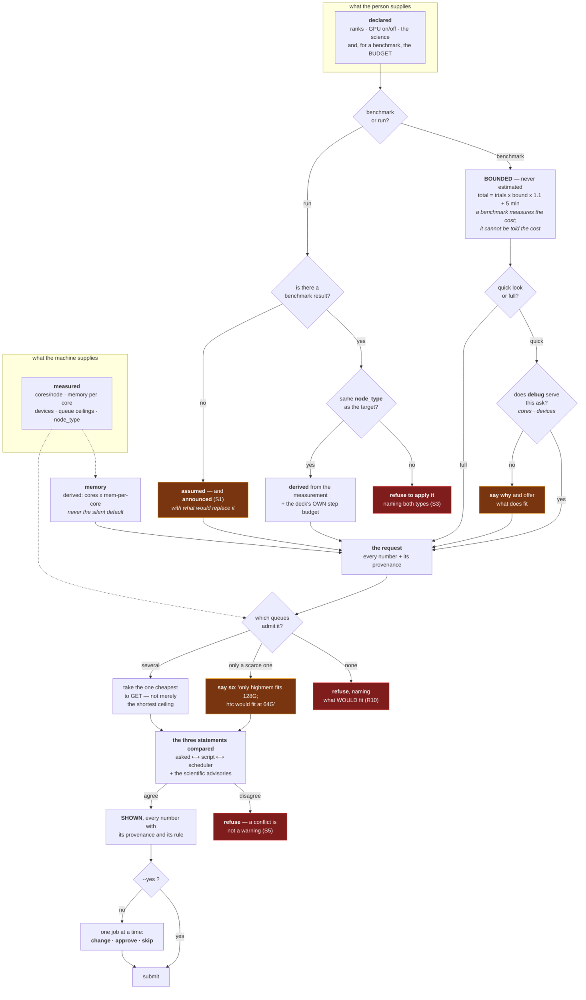

# What a job asks for — where every number came from, and how you agree to it

**Role:** contract
**Domain:** execution

**Companions:**
[`execution/scheduler.md`](?doc=execution/scheduler.md) — whether a request
fits a queue and which queue it goes in (this document decides *what the
request is*, that one decides *where it lands*);
[`execution/gpu.md`](?doc=execution/gpu.md) — the GPU decision's own travel;
[`execution/generator.md`](?doc=execution/generator.md) § 4 — the two families
a sweep axis belongs to;
[`science/validation.md`](?doc=science/validation.md) — the findings this
document requires be *shown*, not merely computed.

**This is a tool, not a research project.** A scientist supplies what they
know and makes the choices that are theirs to make; the framework supplies
everything mechanical and **announces anything it had to invent**. It must not
hand back questions that are not about the science.

> **The asymmetry that justifies all of it.** Everything before submission is
> cheap — a wrong number costs a re-render. After submission it is expensive:
> a queue wait measured in days, priority spent, and — worst — a run that
> *completes* and reports a number that was never what you asked for. That
> last case is not hypothetical. On 2026-08-23 every GPU trial in a benchmark
> emitted `Diag.ELPA.GPU .false.`: a CPU family measured under GPU labels,
> which no failure would ever have revealed.

---

## 1. The rule

**Every number in a submission carries where it came from, and the framework
never invents one silently.**

Five provenances, and they are a closed set:

| provenance | means | example |
|---|---|---|
| **declared** | the person wrote it | `mpi_np: [32, 64]` in the description; `--np 64` |
| **measured** | this machine's probe, or a completed benchmark | cores per node; seconds per cycle |
| **derived** | computed from declared/measured inputs **by a stated rule** | `mem = cores × mem-per-core` |
| **bounded** | a cap the person chose — *not* a prediction | "this benchmark gets 15 minutes per trial" |
| **assumed** | no source at all | *a flat 200 iterations* |

**S1 — An assumed number is announced by name.** Not buried in a comment, not
recorded in a file read later: shown at the moment of choosing, marked, with
what it would take to replace it. A framework that guesses quietly is worse
than one that asks.

**S2 — Prefer bounded over assumed.** *"It gets four hours"* is a decision a
scientist can make from what they know. *"It will take 38 minutes"* is a
prediction the framework is not entitled to. **A bound cannot be wrong** — it
can only be reached, and reaching it is a result.

**S3 — A measurement is not portable by default.** A number measured on one
kind of node does not apply to another. The record already carries `node_type`
for exactly this and nothing reads it (§ 5).

**S4 — Nothing is submitted unseen.** The full request, every number with its
provenance, before the irreversible step. `--yes` is how a person says *I have
decided to trust this*; its absence is not permission.

**S5 — The three statements agree, or nothing is submitted.** What was asked
for, what the script says, and what the scheduler is told must be the same
calculation. Disagreement is a refusal, not a warning.

---

## 2. Why a benchmark is never estimated

**A benchmark exists to measure the per-cycle cost. Feeding it an estimate of
that cost is circular**, and the estimate has nowhere to come from.

So a benchmark's walltime is **bounded**, never predicted:

```
total = trials × per-trial bound × 1.1  +  5 min startup margin
```

Which is what the grouped submission already does — 2 trials × 15 min × 1.1 +
5 min = **38:00**, the exact number that prompted this document. The formula
was right; what was missing is that **nobody chose the 15 minutes and nobody
was shown the arithmetic**. It is a flag default.

**The choice this document makes explicit:**

| | per-trial bound | aims at | what you learn |
|---|---|---|---|
| **quick look** | one cycle, minutes | `debug` — cheap to schedule, capped | *what one cycle costs*, which is the number every later decision needs |
| **full run** | the person's budget | an ordinary queue | the full grid |

A `debug` queue is offered **only when it can actually serve the ask** —
enough cores, and devices if the family needs them. A queue that cannot run
the job is not a choice, and offering it is a question about nothing.

**Timing out is a result.** The trials that finished still yield the per-cycle
cost. Nothing is lost that was not already unknown.

---

## 3. The numbers, one by one

| number | today | should be |
|---|---|---|
| **ranks** · **cores/task** | declared, or a benchmark's grid | ✅ unchanged |
| **GPU on/off** | declared — the person's choice | ✅ unchanged; **must agree with the script** (§ 4) |
| **memory** | ⚠ **silently the cluster's default.** 64 cores × 2 GB/core = 128 G, chosen by nobody | **derived** from cores × measured memory-per-core, or **declared**; shown either way |
| **benchmark walltime** | **bounded** — correct, but the bound is an unshown default | bounded, and the bound is **chosen** |
| **production walltime** | ⚠ measured cost × **an assumed 200 cycles** × 1.5 | derived from the deck's **own declared** step budget; if it must still assume, **announce it** (S1) |
| **queue** | ~~first that fits, ordered by walltime only~~ **done 2026-08-23** — the cheapest ceiling that FITS, across every axis the request states | a fall-through to a scarce queue is still to be **named**, not silent |

> **⚠ The memory-chose-the-queue story is WITHDRAWN, and how it fell apart is
> worth more than the story was.** It read: a 128 G ask nobody made did not
> fit `htc`, so placement fell through to `highmem`. Three separate checks
> falsified it:
>
> 1. the memory ceiling was **never populated** by any probe, so memory could
>    not have been compared at all — an unstated limit never bars (R3);
> 2. `htc` on Sol holds ~251 GB a node, so 128 G fits it comfortably;
> 3. mutating placement back to the old first-that-fits rule **still** chose
>    `htc` for that request — so the ordering did not send it to `highmem`
>    either.
>
> **Why the observed job went to `highmem` is unknown**, and the remaining
> candidates all name it explicitly: a partition in the config's directives,
> an explicit `--domain`, or the record's own contents.
>
> The two facts that motivate this document survive without it: **a 128 G ask
> that nobody decided** is still a number with no provenance, and **high
> memory delays scheduling even at equal core count**, so asking for memory
> you did not choose is paid for whether or not it also moved the queue.

---

## 4. The last defence — the finished script, checked and shown

**Distinct from the checks while editing**, and the distinction is the point.
While a person edits, checks are advisory and cheap to re-ask. **After the
script is generated there is one more gate, and it is the last one before days
of queue time.**

It compares **three statements**:

1. **what was asked for** — the description
2. **what the script says** — the artifact that will actually run
3. **what the scheduler is told** — cores, memory, time, queue

Any disagreement is a defect. *GPU asked for, GPU off in the script.* *64
ranks requested, script written for 8.* Alongside them run the scientific
advisories, now against the **final** settings rather than half-typed ones.

> **The gap this closes, and the proof it was real.** A check already reads
> the written file back and asks *"did every line the writer produced land in
> the file?"* That catches a **writer** bug. It cannot catch a **wrong
> instruction**: on 2026-08-23 the renderer was handed *GPU: off*, wrote *off*
> faithfully, and the file matched what produced it. Both halves agreed — on a
> value the description contradicted. Two narrow versions of the missing
> comparison already exist (the deck's rank count against the launch's; a
> trial's cold start against its intent), which is evidence the shape works
> and was never generalised.

---

## 5. `node_type` — the check that decides whether a measurement means anything

`asu-sol.md` § 5.3 says of it: *everything else bounds an allocation;
`node_type` is what lets a benchmark result say whether it may be carried from
the domain it was measured on to the domain a run will use.*

**Nothing read it.** It was the fourth field declared, serialised and consulted
by no code — after `max_mem_gb`, `gpu_partition` and
`default_mem_per_core_gb`, the first three of which are now read. It is also the only one that guards **scientific
validity** rather than a resource: a walltime carried from a machine it does
not describe is not conservative or aggressive, it is meaningless.

**S3 in force since 2026-08-23**, and it took two halves because a check
needs both:

* **the measurement says where it was taken.** A trial's launch record now
  names the domain it went to and that domain's `node_type`. The partition was
  always *in* that file — inside the `sbatch` argv it also records — so
  recovering it meant parsing a command line, which is the re-derivation A4
  exists to remove. And the argv never carried the *type* at all.
* **the apply step compares, and refuses.** Not a warning: a warning about a
  number that is already wrong hands the person the comparison the framework
  was holding both halves of. The refusal names both types and the two ways
  out — re-measure, or state the allocation yourself.

**Silent on the honest unknowns**, deliberately: when the trials do not say
where they ran (an older bundle), and when the target's row states no
`node_type`. Neither is a match — they are *cannot tell* — and refusing on
them would block every bundle written before the field was recorded. What
makes those visible instead is § 7's display, where an unknown provenance is
shown as one.

---

## 6. The decision graph



---

## 7. What it looks like

Nothing here is a new surface: the terminal already asks before destructive
work (`--yes` is the established spelling, `envs/_cli.py`), and the browser
already renders findings per card.

```
job 1 of 3   02_tight  ·  siesta  ·  GPU

  ranks       64          declared      task.json, bench axis mpi_np
  cores/task  1           declared
  gres        gpu:a100:1  derived       1 device (default when unstated)
  memory      128G        DERIVED       64 cores x 2 GB/core (Sol, measured)
                          ⚠ htc holds 64G/node -- this ask is why the queue below is highmem
  time        0-00:38:00  BOUNDED       2 trials x 15 min x 1.1 + 5 min
                          ⚠ 15 min per trial is a default you did not set
  queue       highmem     placed        the only queue that admits 128G
                          ⚠ htc would admit at <=64G, and schedules sooner

  checks      2 advisories, 0 conflicts    02_tight.validation.txt

  [a]pprove  [e]dit  [s]kip  [A]pprove all
```

Every line answers *where did this come from* without being asked. The two
`⚠` lines are the ones that would have sent a 38-minute job to a 2 TB
partition, and they are visible **while it is still free to change**.

---

## 8. What this changes, smallest first

1. **Probe memory-per-core and per-node memory** into the record — measurements
   (M-1). `default_mem_per_core_gb` stops being decorative.
2. **Memory becomes derived and shown** instead of a silent cluster default.
3. **`node_type` is enforced** (S3) — a measurement that does not transfer is
   refused, not applied.
4. **The benchmark bound becomes a choice** — quick-look vs full — with the
   `debug` fit check.
5. ~~**Queue order accounts for what is cheap to get**~~ **done** — placement
   takes the cheapest ceiling that fits across walltime, cores *and* memory,
   where it had implemented only walltime. A row whose ceilings are unmeasured
   sorts after rows whose fit is known, so an unmeasured queue cannot win by
   silence. *(Naming a scarce-queue fall-through belongs to the display, step
   7.)*
6. **The three-statement comparison** joins the after-generation check.
7. **The gate** — shown, then `--yes` or per-job.

Each is separately testable. **6 and 7 are the ones that make the rest
verifiable by the person**, so a mistake in 1–5 costs a re-render rather than
a queue slot.
