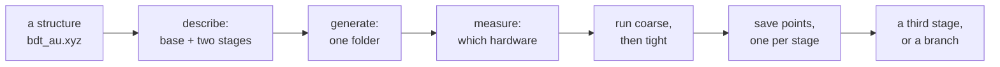
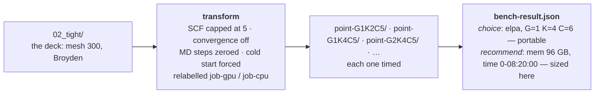
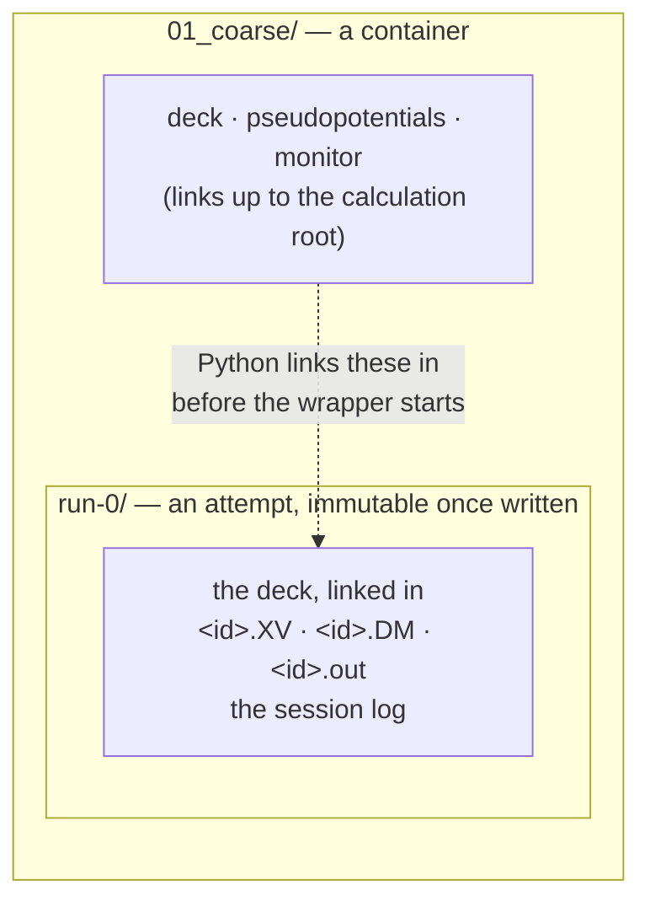
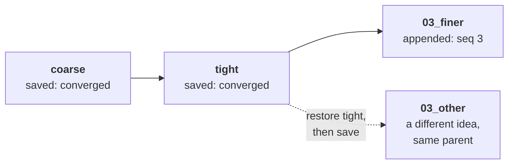

# One calculation, end to end — a worked example

**Role:** guide
**Domain:** execution
**Companions:** [`execution/project-layout.md`](?doc=execution/project-layout.md)
— the tree this walks through; [`engines/stages.md`](?doc=engines/stages.md) —
what a stage is; [`execution/checkpointing.md`](?doc=execution/checkpointing.md)
— what the history guarantees;
[`web/staged-runs-architecture.md`](?doc=web/staged-runs-architecture.md) — the
plan and the order of work.

This is the whole design followed once, with a real molecule, in the order a
person would actually do it. It exists for two reasons: to show how the pieces
fit when nobody is looking at them one at a time, and — because a walkthrough
touches every seam — to **find the places where they do not fit yet**. § 8 is
that list, and it is the more valuable half.

**Status: the story is the target. Four of its steps do not work today**, and
each is marked ⛔ where it appears, with the whole list in § 8. Four are closed
— #5 and #6 (the stage-to-stage carry and the directory naming, both fixed
2026-08-10), #7 (the commands, which were specified elsewhere all along) and #8.

---

## 1. What we are doing

A benzene-dithiol molecule bonded to a gold surface. We want a **relaxed
geometry good enough to publish**, and we do not want to spend a week of cluster
time finding out that the settings were wrong.

So, the way a careful person works:

1. relax it **loosely** first — cheap, fast, gets the gross geometry right;
2. then **tightly** — expensive, and only worth doing from a good starting point;
3. before the expensive one, **measure** what hardware configuration runs it
   fastest;
4. keep a **save point** at each converged step, so a later idea can start from
   one instead of from scratch.



---

## 2. Getting the structure into the tree

The description **points at** a structure; it does not contain one
(`engines/stages.md § 6.3`). So the geometry has to be somewhere with a path
before anything else can name it.

```
projects/BDT-Au/structure/bdt_au.xyz
                          bdt_au.molstruct.json     ← regions, frozen atoms
```

⛔ **Gap 1.** Nothing owns this step. A geometry you just loaded or edited lives
in the workspace and has no path yet, and no surface says *"save this into the
project first"*. Today you would put it there by hand and the tab would not tell
you that you had to.

---

## 3. Describing the calculation

In the Structure-optimization tab: pick the project and the topic, fill in the
physics once, then add the stages.

|  | **base** | **01 coarse** | **02 tight** |
|---|---|---|---|
| mesh cutoff | 300 Ry | **150** | 300 |
| force tolerance | 0.01 eV/Å | **0.04** | 0.01 |
| relaxation | Broyden | **CG** | Broyden |
| restart | — | **clean** | **continue** |
| everything else (35 fields) | shared | — | — |

Two things are worth noticing.

**Only what differs is written down.** A stage is a name and an overlay
(`engines/stages.md § 2`); the other thirty-five settings are stated once. That
is what stops the second stage quietly running different physics because someone
edited one copy and not the other.

**The name appears as you type, and it splits in two.** From "BDT/Au relax" plus
the formula:

```
label   BDT_Au_relax              ← the SystemLabel in every deck, and the
                                     stem of every file the runs write
id      BDT_Au_relax_Au38C6H4S2   ← recorded in task.json; never a filename
```

The **label** is what makes the tight stage able to pick up the coarse stage's
geometry at all — SIESTA looks for `<SystemLabel>.XV` and finds what coarse left.
The **id** is how molbuilder knows *which calculation* that state belongs to, and
it is a record rather than a name (`execution/run-identity.md § 2.0a`). **Neither
of them names the folder** — you type that when you generate (§ 4).

---

## 4. Generating

Press **Check** — every stage is validated whole, and any complaint says which
stage it is about. Then **Generate**:

```
projects/BDT-Au/optimization/bdt-relax/    ← the folder name is yours to pick
├── BDT_Au_relax.fdf.template      the science, minus what a stage varies
│                                  and minus what the hardware decides
├── task.json                      what each stage tunes, + resource intent,
│                                  and the id — BDT_Au_relax_Au38C6H4S2
├── Au.psml  S.psml  C.psml  H.psml the shared package, once
└── mb_monitor.py
```

**Nothing here names a machine** — no walltime, no partition, no activation
command, no rank count. Copy this folder to any cluster and it still describes
the same calculation. There are no stage directories yet either; those appear
when you prep a stage on the machine that will run it.

**A template, not finished decks.** The browser writes the science backbone and
`task.json`; the actual `.fdf` for each stage is rendered later, on the machine
that will run it. That is not deferral for its own sake: **a deck carries values
that depend on how it will be launched** — a block size derived from the rank
count and the GPU, written *inside* the deck, and an eigensolver choice that
changes both the deck and which environment the wrapper activates. **A parameter
that depends on the launch cannot be decided before the launch is known**, so a
deck finished on a laptop is guessing at both (`project-layout.md § 2.2`).

**One basename everywhere.** Every deck says `SystemLabel BDT_Au_relax` — the
label, not the id. That is not cosmetic: it is why a later stage can pick up an
earlier one's `.XV`, and it is why the formula stays out of the filename (§ 3).

> ### Which shape this walkthrough follows
>
> **From here on this walk uses the hierarchical shape** — a directory per stage,
> a subdirectory per attempt. It is the clearer one to read, because every state
> the calculation passed through stays visible on disk.
>
> **It is not the one that ships.** A project directory is *flat* or
> *hierarchical*, and which one is a field in the description you wrote in § 3
> ([`project-layout.md`](?doc=execution/project-layout.md) § 1); flat is what the
> UI produces today. The same two stages, flat:
>
> ```text
> bdt-relax/
> ├── BDT_Au_relax_01_coarse.fdf        stages told apart by the suffix
> ├── BDT_Au_relax_02_tight.fdf
> ├── BDT_Au_relax_01_coarse-run0.out  attempts by an output index
> ├── BDT_Au_relax.XV             ← SHARED and unsuffixed: this is what lets
> ├── BDT_Au_relax.DM                tight find coarse's geometry — and what
> └── Au.psml  S.psml  C.psml  H.psml   overwrites it
> ```
>
> **Everything this walkthrough says still happens** — the same stages, the same
> measuring, the same continuing, the same checkpoints. What changes is what is
> left on disk afterwards, and § 7 is where that difference stops being cosmetic.

⛔ **Gap 2.** Today the producer renders both decks here and `prep` lays out the
stage directories for the whole bundle at once. Neither matches the above: the
decks have to move down into their stage directories and be rendered on the
target, and `prep` has to become per-stage. `bench prep` already works this way
— detect the machine, format the scripts for it — so the shape exists; the
staged path does not use it yet. And read the relationship the right way round:
**`prep` is the framework and benchmarking is one thing you prep**
(`project-layout.md § 2.3.1a`) — the benchmark is simply where that framework got
built first, so the general part needs lifting out rather than the staged path
borrowing from a special case.

---

## 5. Measuring before spending

The tight stage is the expensive one. Before committing a week to it, find out
what hardware configuration actually runs *this system at these settings*
fastest.



Two different kinds of answer come out, and the split matters. **`choice`** is the
*mechanism* — which engine build, how many ranks per GPU — and it transfers to
another cluster unchanged. **`recommend`** is *sizing* measured on this machine:
memory from the winner's peak usage plus 15%, and a walltime from its seconds per
iteration times an **assumed 200 iterations** times 1.5. That last number is a
guess about a run that has not happened, which is why it is a starting point and
labelled as one — a relaxation that takes 400 steps will need twice the wall time
the benchmark suggested.

The trials live **under the stage they measure**, in their own container:

```
02_tight/
├── bench/                    a self-contained benchmark bundle
│   ├── job-gpu.fdf  job-cpu.fdf
│   ├── bench-result.json     ← the answer; a few kilobytes of text
│   └── point-G1K4C5/         ← a trial: a throwaway run
└── run-0/                    ← the real run, later
```

**Why under the stage, and not once per project.** The best rank count depends on
the science: mesh cutoff changes the grid, basis size changes the matrix, and
`BlockSize` is derived from the rank count. Coarse and tight can genuinely want
different hardware.

**Why the trials cannot hurt the real run.** The benchmark relabels its decks to
`job-gpu` / `job-cpu` and forces a cold start. So a five-iteration timing run
cannot read — or overwrite — the density matrix the real run depends on. That
relabelling is not a leftover from when benchmarking was standalone; it is
exactly what lets a trial live inside a stage's directory.

⛔ **Gap 3.** Every piece exists; nothing connects them. `bench generate` takes a
deck and an output directory, so you *can* hand it `<label>_02_tight.fdf` and
`--out 02_tight/bench` — but no command does, nothing records that this bundle
measures that stage, and getting it wrong is silent.

⛔ **Gap 4.** The answer reaches a script but not the description. The shipped
chain works — `bench summarize` writes `bench-result.json`, and `bench prep-run`
turns it into `run-production.sh`, re-resolving the portable choice for whatever
machine you are on. What it never touches is `task.json`. So the resource
answer lives only in a generated script, and the next `generate` — which rebuilds
everything from the description — quietly reverts to the defaults.

---

## 6. The official run

Two steps, and the split is the point. **Prepare** it in the tab — the run folder
is made, the deck and pseudopotentials linked in, nothing carried because coarse
starts from the structure. It tells you what it did. Then, on the machine that
will run it:

```
molbuilder jobset submit run coarse --mode direct
```

**Why the terminal for this half.** The browser writes a package that names no
machine; everything that depends on *which* machine — the rank count, the
eigensolver, the queue, the activation command — is resolved here, where the
answers exist (`project-layout.md § 2.1`).



It converges. **Now you look at it** — the trajectory, the final forces, whether
the geometry is sane — and only then set up tight.

That pause is the design, not a missing feature. A stage is a long job; a chain
that continued on its own could spend a week refining a geometry you would have
thrown away in a minute. So **stages are not chained**: each one is set up and
started separately, after you have seen the last (`project-layout.md § 1.6`).

Which makes the hand-off simple. When you set tight up, coarse's `.XV` is
**already on disk** — you just looked at it — so it is **copied** into tight's
run directory:

```
02_tight/run-0/<label>.XV   a real copy of 01_coarse/run-0/<label>.XV
```

Copied and not linked, because tight writes to that same filename and would
otherwise overwrite coarse's result. And **you say which run** it comes from:
continuing from `run-0` and continuing from `run-2` are different scientific
choices.

✅ **Gap 5 — closed 2026-08-10.** `materialize` wrote that hand-off as a symlink
to `../<producer>/<label>.XV` and `stages_to_jobset` built a chained ladder —
`depends_on` plus `.XV`/`.DM`/`.CG` carry edges — so once attempts moved outputs
into `run-N/` the link dangled. The fix was not a better link: **the producer
emits no chain and no carry at all**, and the copy happens exactly as described
above, when you set the stage up. A produced tree now contains no dangling
symlink. (The chaining machinery itself stays in `jobset` — though see
`running-a-job.md` § 2.2a: no producer emits a `Carry` any more, and whether it
should be retired outright is open.)

✅ **Gap 6, in the same code — closed 2026-08-10.** `job_dir_names` branches on
`JobSet.kind`, so a ladder's stage directories are `01_coarse/`, `02_medium/`,
`03_tight/` while a benchmark's points stay `point-*`. The seq is read back off
the deck's own token rather than counted, so disabling a stage leaves a gap
rather than renumbering.

**And the way I first tried to fix gap 5 was wrong**, which is the more useful
lesson. I put attempt-directory logic in the wrapper: ~130 lines of shell that
scan for run directories, create one, link the deck in, copy files and `cd` in.
That is `jobset/materialize.py` rewritten in bash, one level down, in the one
layer kept free of filesystem work — **and it was the only place in the system
that changed directory.** It was retired on 2026-08-10, which is what makes
`project-layout.md` invariant 6a held rather than aspirational.

**If you have to re-run a stage**, you do not overwrite anything — each
invocation gets `run-1`, then `run-2`, carrying the previous attempt's warm state
unless you ask for a cold start. `run-0` is byte-identical afterwards. There is
no `--force`, because there is nothing to reset.

✅ **Gap 7 — closed 2026-08-10, and it was half-answered already.** It read:
*how you re-run one stage by hand is unstated*, and offered `jobset submit --only
<stage>` or a new `molbuilder run <stage>`.

Neither was needed, because **the grammar was specified elsewhere and this
document had not caught up**:
[`web/staged-runs-architecture.md`](?doc=web/staged-runs-architecture.md) step 1c
fixes `jobset <verb> <kind> [<stage>]`, and `project-layout.md` § 8 and
`web/task-setup-plan.md` were both already writing `jobset prep run <stage>
--from <run>`. What was genuinely open was one shape question — stage as the
positional, or folder with `--stage` — **decided 2026-08-10 (user): the stage is
the positional**, and running a whole ladder unattended takes an explicit
`--chain`.

So the entry point is:

```bash
molbuilder jobset prep   run tight --from 01_coarse/run-0   # or --cold
molbuilder jobset submit run tight --mode direct|submit
```

`job-system.md` § 5.3 is now the authority for the commands, and the ordering
constraint this gap carried still holds: that entry point must exist **before**
the wrapper's directory-making prologue is retired, or the manual path breaks
with nothing behind it.

> **The lesson is the one this document keeps teaching.** The gap was not a
> missing design — it was four documents describing one act in three grammars,
> with the newest of them calling it unanswered. A walkthrough finds that;
> reading any single file does not.

---

## 7. Save points, and changing your mind

A stage finishes. **You** save it, and the note is yours to write — nothing
saves or tags on your behalf (`checkpointing.md` **L3**, **L4**):

```
coarse converged, 41 steps

Calculation: bdt-relax
Manifest-SHA256: 9f2c…
```

The note says **how it went**; the two trailers are added for you — the folder
this history belongs to, and the fingerprint of the archive this state points at.
*(An earlier draft of this section showed a generated subject line and an
automatic tag, `<id>/coarse/<UTC>`. Both are retired: a note you did not write
answers nothing, and machine-made tags crowd out your own.)*

**What is stored where.** Git takes the containers: decks, wrappers,
`task.json`, the links, `bench-result.json` — all text. The archive takes the
runs: `01_coarse/run-0/<label>.DM` and its siblings, by path, with checksums. The
benchmark's throwaways are not this history's business.

The split needs no marker file and no list of names, only **depth**: a container
is anything with a container below it, a run is a leaf. That is the whole rule,
and it is why the benchmark's `point-*/` — two levels down, inside a container
that is itself inside a stage — falls out on the right side without anyone
saying so.

> ### The same checkpoint means two different things
>
> This is the one place the shape choice (§ 4) stops being cosmetic, and it is
> worth stopping on because it changes what a mistake costs.
>
> In the **hierarchical** walk above, `01_coarse/run-0/` is still sitting on
> disk. The checkpoint is a convenience — somewhere to branch from, a way to see
> what changed. Skip one and you have a thinner history beside a folder that
> still holds everything.
>
> In the **flat** shape there is one `<label>.XV` and one `<label>.DM`, and the tight
> stage **overwrote** them. The coarse geometry is not on disk anywhere. So:
>
> | | hierarchical | flat |
> |---|---|---|
> | after tight runs, coarse's geometry is | on disk, openable | **only in the checkpoint** |
> | a checkpoint is | insurance | **the mechanism** |
> | a missed checkpoint is | a thinner history | **a state that no longer exists anywhere** |
>
> That is why `checkpointing.md` is a contract with invariants rather than a
> description of a feature, and why *"take a checkpoint before each stage"* is
> not housekeeping in the flat shape — it is **the save point**
> ([`checkpointing.md`](?doc=execution/checkpointing.md) § 5.0).
>
> It also changes what *restore* means to you. In the hierarchy you can open an
> old attempt and copy something out of it. In flat there is nothing to open:
> **restore is a rewind, not a fetch** — it puts the whole folder back to an
> earlier moment, and anything newer that was not checkpointed goes with it.

Two weeks later you want a third stage — finer k-grid, from tight's result.



**Stages append; they never renumber.** Once tight has run, "insert something
between coarse and tight" is not an insertion — it is a new stage that happens to
be coarser, and it runs from where tight left off. Numbering it `03` is the
truth. That also means an attempt's outputs stay attached to the stage that
produced them, forever.

✅ **Gap 8 — closed.** It read: *the history cannot exist, because the
checkpoint setup refuses a folder with calculation files in its subdirectories,
which this tree has at three levels.* It no longer refuses one that **says** its
subdirectories are one calculation — a root carrying `task.json` (or
`job-set.json`, or `bench-manifest.json`) is accepted, and this tree carries one.
The rest of that gap dissolved with it: forking needs no web route, because it
is restore-then-save and both are routed. What is still true, and is not a gap,
is that **a save is always an explicit act** — nothing takes one for you
(`checkpointing.md § 9`).

---

## 8. What this walkthrough found

Eight gaps, in the order a user meets them. Four were on no list before this
document was written. **Four are now closed** — #5, #6, #7 and #8.

They closed in three different ways, and the contrast is worth keeping: #8
needed the checkpoint rework, real code. #5 and #6 needed the producer to stop
doing something — subtraction, not addition. #7 needed nobody to build anything
at all: the answer was already written in two other documents, and this one had
gone on calling it unanswered. **A gap list is only as good as its last
reconciliation against its neighbours** — and this one had also gone on
describing #5's fix in terms the layout contract had already ruled out.

| # | Gap | Severity |
|---|---|---|
| 1 | **Saving the structure into the tree is a step nobody owns.** The description points at a path; a workspace geometry has none | small, but it is the first thing a user hits |
| 2 | **Produce/prep boundary is undefined locally.** Nothing says who creates the stage containers when host and target are the same machine | design decision, one sentence |
| 3 | **Nothing connects a benchmark to the stage it measures.** The parts compose by hand and getting it wrong is silent | small |
| 4 | **The measured answer reaches a script, never the description.** `bench prep-run` writes `run-production.sh`; `task.json` never learns, so the next `generate` reverts to defaults | medium — it is the point of measuring |
| 5 | ~~**Stage-to-stage carry is broken.**~~ **Closed 2026-08-10.** The producer stopped emitting `depends_on` and `Carry` entirely, so nothing dangles. ⚠ This row used to say *"fixed by resolving the attempt at **submit**"* — which contradicted `project-layout.md § 2.3.4`, where the copy is made **at `prep`, from the run you name with `--from`**. The contract was right: by then the source has already finished, so there is nothing to resolve later | ✅ closed |
| 6 | ~~**Stage directories are named `point-<name>`.**~~ **Closed 2026-08-10.** `job_dir_names` branches on `JobSet.kind`; a ladder gets `01_coarse/`, a sweep keeps `point-*` | ✅ closed |
| 7 | ~~**No hand-run entry point for one stage.**~~ **Closed 2026-08-10.** The grammar was already fixed in `staged-runs-architecture.md` step 1c and used by two other documents; this file had not caught up. `jobset prep run <stage> --from <run>` / `jobset submit run <stage>`, stage as the positional (user, 2026-08-10), `--chain` to run a ladder unattended. The ordering constraint stands: it must exist before the wrapper's directory-making prologue is retired | ✅ closed |
| 8 | ~~**The history cannot be created.**~~ **Closed by the checkpoint rework.** `init` accepts a folder whose root *declares* its subdirectories one calculation (`task.json`), which this tree carries; forking is restore-then-save, which needs no branch route. Saves stay explicit by design, which is § 9, not a gap | ✅ closed |

### The one that was fixed first, and why

**Gap 5**, because it was a regression rather than a missing feature: staged runs
handed geometry across correctly before attempt directories existed, and then
did not.

The fix was the one in § 6, and it **removed machinery rather than adding it**:
stages stopped being chained, so the hand-off is a plain file copy made when you
set the next stage up (`project-layout.md` § 1.6). **Gap 6 rode along**, being
the same code. And the shell block that caused the regression was **retired
rather than repaired** — its guard against being run from inside an attempt, its
`$PWD` bug and its `--force` refusal all stopped existing once Python decided the
directory. Of the four gaps still open, none is a regression: they are the four
**joins** (§ "What the shape of this list says") that were never built.

**The lesson is worth more than the fix.** The system was already built the right
way — `materialize` lays out directories and links, `submit` picks the working
directory and launches, and the wrapper activates and execs. I added a second
layout implementation in bash without checking whether one existed, then designed
an elaborate way to make a chained hand-off work when the answer was not to
chain. Both rules are now written where they can be pointed at:
[`running-a-job.md`](?doc=execution/running-a-job.md) § 2.2a and
[`project-layout.md`](?doc=execution/project-layout.md) § 1.6.

### What the shape of this list says

Five of the eight are **joins, not parts**. Structure→description, produce→prep,
stage→benchmark, benchmark→description, stage→stage: every one is a handoff
between two things that each work. That is the expected result of building
bottom-up, and it is why walking the story end to end finds what reviewing a
module never does — a seam is invisible from either side of it.

### What the walkthrough confirmed works

Worth saying, since the list above is all problems. The parts that hold up when
followed end to end: one description producing several decks with one basename;
the benchmark nesting under the stage it measures without being able to damage
it; attempts that cannot overwrite each other; and stage numbering that keeps an
output attached to the stage that made it, however many times you change your
mind afterwards.
