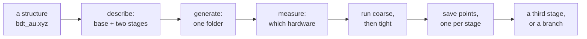
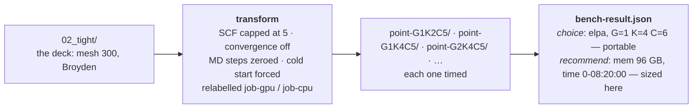
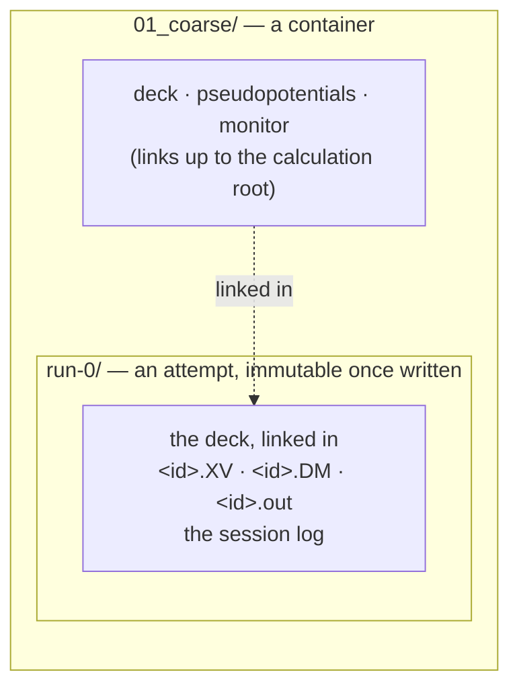
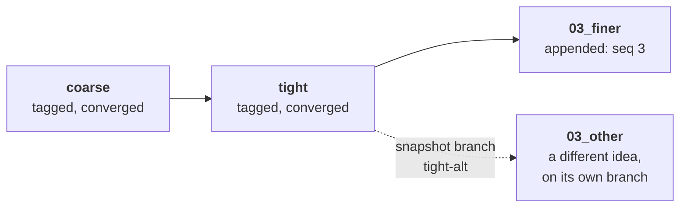

# One calculation, end to end — a worked example

**Role:** guide
**Domain:** execution
**Companions:** [`execution/project-layout.md`](?doc=execution/project-layout.md)
— the tree this walks through; [`engines/stages.md`](?doc=engines/stages.md) —
what a stage is; [`execution/checkpointing.md`](?doc=execution/checkpointing.md)
— what the history guarantees;
[`web/staged-runs-architecture.md`](?doc=web/staged-runs-architecture.md) — the
plan and the order of work.

This is the whole design followed once, with a real molecule, in the order a
person would actually do it. It exists for two reasons: to show how the pieces
fit when nobody is looking at them one at a time, and — because a walkthrough
touches every seam — to **find the places where they do not fit yet**. § 8 is
that list, and it is the more valuable half.

**Status: the story is the target. Six of its steps do not work today**, and each
is marked ⛔ where it appears, with the whole list in § 8.

---

## 1. What we are doing

A benzene-dithiol molecule bonded to a gold surface. We want a **relaxed
geometry good enough to publish**, and we do not want to spend a week of cluster
time finding out that the settings were wrong.

So, the way a careful person works:

1. relax it **loosely** first — cheap, fast, gets the gross geometry right;
2. then **tightly** — expensive, and only worth doing from a good starting point;
3. before the expensive one, **measure** what hardware configuration runs it
   fastest;
4. keep a **save point** at each converged step, so a later idea can start from
   one instead of from scratch.



---

## 2. Getting the structure into the tree

The description **points at** a structure; it does not contain one
(`engines/stages.md § 6.3`). So the geometry has to be somewhere with a path
before anything else can name it.

```
projects/BDT-Au/structure/bdt_au.xyz
                          bdt_au.molstruct.json     ← regions, frozen atoms
```

⛔ **Gap 1.** Nothing owns this step. A geometry you just loaded or edited lives
in the workspace and has no path yet, and no surface says *"save this into the
project first"*. Today you would put it there by hand and the tab would not tell
you that you had to.

---

## 3. Describing the calculation

In the Structure-optimization tab: pick the project and the topic, fill in the
physics once, then add the stages.

|  | **base** | **01 coarse** | **02 tight** |
|---|---|---|---|
| mesh cutoff | 300 Ry | **150** | 300 |
| force tolerance | 0.01 eV/Å | **0.04** | 0.01 |
| relaxation | Broyden | **CG** | Broyden |
| restart | — | **clean** | **continue** |
| everything else (35 fields) | shared | — | — |

Two things are worth noticing.

**Only what differs is written down.** A stage is a name and an overlay
(`engines/stages.md § 2`); the other thirty-five settings are stated once. That
is what stops the second stage quietly running different physics because someone
edited one copy and not the other.

**The id appears as you type.** From "BDT/Au relax" plus the formula:

```
bdt_au_relax_c6h4s2au38
```

That single name becomes the folder, the `SystemLabel` in every deck, and the
stem of every file the runs write (`execution/run-identity.md`). It is what makes
the tight stage able to pick up the coarse stage's geometry at all.

---

## 4. Generating

Press **Check** — every stage is validated whole, and any complaint says which
stage it is about. Then **Generate**:

```
projects/BDT-Au/optimization/bdt_au_relax_c6h4s2au38/
├── stages.json                     what was asked for — the only source
├── <id>_coarse.fdf                 rendered from base ⊕ coarse
├── <id>_tight.fdf                  rendered from base ⊕ tight
├── <id>_coarse.run.sh  .sbatch     one wrapper per deck
├── <id>_tight.run.sh   .sbatch
├── Au.psml  S.psml  C.psml  H.psml the shared package, once
├── mb_monitor.py
├── job-set.json                    the chain, derived
├── 01_coarse/                      a container: links up, and its attempts
└── 02_tight/
```

**Two decks, not one template.** A stage's values are baked into its own file,
because a parameter change alters what the engine computes and must be in the
file the engine reads.

**One basename everywhere.** Every deck says `SystemLabel bdt_au_relax_c6h4s2au38`.
That is not cosmetic: it is why a later stage finds the earlier stage's `.XV`.

⛔ **Gap 2.** Who creates `01_coarse/` and `02_tight/`? The producer writes the
calculation root; `prep` lays out the per-stage containers — but `prep` is a
*target-side* verb, meant to run on the cluster after you copy the folder. When
host and target are the same machine (the common case for a workstation user),
nothing says whether generate should have done it already.

---

## 5. Measuring before spending

The tight stage is the expensive one. Before committing a week to it, find out
what hardware configuration actually runs *this system at these settings*
fastest.



Two different kinds of answer come out, and the split matters. **`choice`** is the
*mechanism* — which engine build, how many ranks per GPU — and it transfers to
another cluster unchanged. **`recommend`** is *sizing* measured on this machine:
memory from the winner's peak usage plus 15%, and a walltime from its seconds per
iteration times an **assumed 200 iterations** times 1.5. That last number is a
guess about a run that has not happened, which is why it is a starting point and
labelled as one — a relaxation that takes 400 steps will need twice the wall time
the benchmark suggested.

The trials live **under the stage they measure**, in their own container:

```
02_tight/
├── bench/                    a self-contained benchmark bundle
│   ├── job-gpu.fdf  job-cpu.fdf
│   ├── bench-result.json     ← the answer; a few kilobytes of text
│   └── point-G1K4C5/         ← a trial: a throwaway run
└── run-0/                    ← the real run, later
```

**Why under the stage, and not once per project.** The best rank count depends on
the science: mesh cutoff changes the grid, basis size changes the matrix, and
`BlockSize` is derived from the rank count. Coarse and tight can genuinely want
different hardware.

**Why the trials cannot hurt the real run.** The benchmark relabels its decks to
`job-gpu` / `job-cpu` and forces a cold start. So a five-iteration timing run
cannot read — or overwrite — the density matrix the real run depends on. That
relabelling is not a leftover from when benchmarking was standalone; it is
exactly what lets a trial live inside a stage's directory.

⛔ **Gap 3.** Every piece exists; nothing connects them. `bench generate` takes a
deck and an output directory, so you *can* hand it `<id>_tight.fdf` and
`--out 02_tight/bench` — but no command does, nothing records that this bundle
measures that stage, and getting it wrong is silent.

⛔ **Gap 4.** The answer reaches a script but not the description. The shipped
chain works — `bench summarize` writes `bench-result.json`, and `bench prep-run`
turns it into `run-production.sh`, re-resolving the portable choice for whatever
machine you are on. What it never touches is `stages.json`. So the resource
answer lives only in a generated script, and the next `generate` — which rebuilds
everything from the description — quietly reverts to the defaults.

---

## 6. The official run

```
cd 01_coarse && bash ../<id>_coarse.run.sh
```

The wrapper runs **in the stage directory** and builds the attempt below it:



It converges. Now the tight stage:

```
cd 02_tight && bash ../<id>_tight.run.sh
```

and it must start from the geometry coarse reached.

⛔ **Gap 5 — and this one is new, and mine.** It cannot. `prep` creates the
carry as a symlink to `../<producer>/<id>.XV`, which is where a stage's output
used to live. Since attempts got their own directories, coarse's geometry is at
`run-0/<id>.XV` inside the stage, and **the link points at nothing.** Worse,
*which* attempt is the good one is not knowable when `prep` runs — the runs have
not happened yet. Coarse converged first time here, but had it needed three
tries, the answer would be `run-2`.

⛔ **Gap 6, in the same line of code.** That link also has the wrong folder name.
`materialize.job_dir_name` returns `point-<name>` for every job, so today the
stage directory is `point-coarse/`, not `01_coarse/`. The layout contract already
specifies the fix — branch on `JobSet.kind`, so a **ladder** job becomes
`<seq>_<name>` and a **sweep** point keeps its knobs — but it is not written yet.
Name and depth are both wrong, in one expression.

The fix is a stable name for "this stage's current result", now specified in
[`project-layout.md`](?doc=execution/project-layout.md) § 1.3:

```
01_coarse/run-latest -> run-0     repointed when an attempt exits 0
```

Then the carry is `../01_coarse/run-latest/<id>.XV`, which is resolvable at prep
time and correct at run time. It also gives the viewer and the status roll-up
something to point at without knowing attempt numbers.

**Why `run-latest` and not `latest`:** `run-` is a prefix this layout already
owns, so the pointer adds no new reserved word, sorts beside what it points at,
and is already filtered out of the wrapper's attempt scan — which requires an
all-digit suffix and was written before this existed.

**A failed attempt does not move it.** Had `run-1` above crashed at iteration 3,
`run-latest` would still say `run-0`, because what the next stage needs is the
newest attempt that produced *usable* state — not the newest directory.

Note what this does *not* need: no content hashing, no attempt registry, no
lookup table. One symlink, written by the wrapper it already belongs to.

**If you have to re-run a stage**, you do not overwrite anything:

```
cd 01_coarse && bash ../<id>_coarse.run.sh        →  run-1/, carrying run-0's state
cd 01_coarse && bash ../<id>_coarse.run.sh --cold →  run-2/, starting clean
```

`run-0` is byte-identical afterwards. There is no `--force` and nothing to reset.

---

## 7. Save points, and changing your mind

A stage finishes. The history records it:

```
commit   bdt_au_relax_c6h4s2au38 · coarse · relaxation converged, 41 steps
tag      bdt_au_relax_c6h4s2au38/coarse/20260806T221403Z
```

The message carries the id, the stage and **how it went** — the run decoder
already knows *converged* from *hit the step cap*, so the history can say it.

**What is stored where.** Git takes the containers: decks, wrappers,
`stages.json`, the links, `bench-result.json` — all text. The archive takes the
runs: `01_coarse/run-0/<id>.DM` and its siblings, by path, with checksums. The
benchmark's throwaways are not this history's business.

The split needs no marker file and no list of names, only **depth**: a container
is anything with a container below it, a run is a leaf. That is the whole rule,
and it is why the benchmark's `point-*/` — two levels down, inside a container
that is itself inside a stage — falls out on the right side without anyone
saying so.

Two weeks later you want a third stage — finer k-grid, from tight's result.



**Stages append; they never renumber.** Once tight has run, "insert something
between coarse and tight" is not an insertion — it is a new stage that happens to
be coarser, and it runs from where tight left off. Numbering it `03` is the
truth. That also means an attempt's outputs stay attached to the stage that
produced them, forever.

⛔ **Gap 7.** The history cannot exist yet. The checkpoint setup **refuses** a
folder with calculation files in its subdirectories — which this tree has at
three levels — so none of § 7 runs. Checkpoints are also user-triggered only, and
`snapshot branch` has no web route.

---

## 8. What this walkthrough found

Seven gaps, in the order a user meets them. Three were on no list before this
document was written.

| # | Gap | Severity |
|---|---|---|
| 1 | **Saving the structure into the tree is a step nobody owns.** The description points at a path; a workspace geometry has none | small, but it is the first thing a user hits |
| 2 | **Produce/prep boundary is undefined locally.** Nothing says who creates the stage containers when host and target are the same machine | design decision, one sentence |
| 3 | **Nothing connects a benchmark to the stage it measures.** The parts compose by hand and getting it wrong is silent | small |
| 4 | **The measured answer reaches a script, never the description.** `bench prep-run` writes `run-production.sh`; `stages.json` never learns, so the next `generate` reverts to defaults | medium — it is the point of measuring |
| 5 | **Stage-to-stage carry is broken.** ⚠ `materialize` links `../<stage>/<id>.XV`; attempts moved outputs to `../<stage>/run-N/<id>.XV`, so the link dangles — and *which* N is unknowable at prep time | **serious, and newly introduced by the attempt-directory change** |
| 6 | **Stage directories are named `point-<name>`.** `job_dir_name` does not branch on `JobSet.kind` yet, so the ladder gets the sweep's naming | small, and in the same expression as #5 |
| 7 | **The history cannot be created.** Checkpoint init refuses this shape; no automatic checkpoints; no branch route | **blocking** — § 7 does not run at all |

### The one to fix first

**Gap 5**, because it is a regression rather than a missing feature: staged runs
carried correctly before attempt directories existed, and now they do not. The
`run-latest` pointer in § 6 fixes it — now a contract,
[`project-layout.md`](?doc=execution/project-layout.md) § 1.3 — and pays for
itself twice, since the viewer and the status roll-up both currently have to
guess which attempt is the current one. It also exposed a guard weakness worth
fixing first: the wrapper refuses to run from inside an attempt by matching
`${PWD##*/}`, which is the *logical* path, so entering through **any** symlink
defeats the refusal.
**Gap 6 is one line away from it**, in the same function, and should land in the
same change rather than touching that expression twice.

### What the shape of this list says

Five of the seven are **joins, not parts**. Structure→description, produce→prep,
stage→benchmark, benchmark→description, stage→stage: every one is a handoff
between two things that each work. That is the expected result of building
bottom-up, and it is why walking the story end to end finds what reviewing a
module never does — a seam is invisible from either side of it.

### What the walkthrough confirmed works

Worth saying, since the list above is all problems. The parts that hold up when
followed end to end: one description producing several decks with one basename;
the benchmark nesting under the stage it measures without being able to damage
it; attempts that cannot overwrite each other; and stage numbering that keeps an
output attached to the stage that made it, however many times you change your
mind afterwards.
