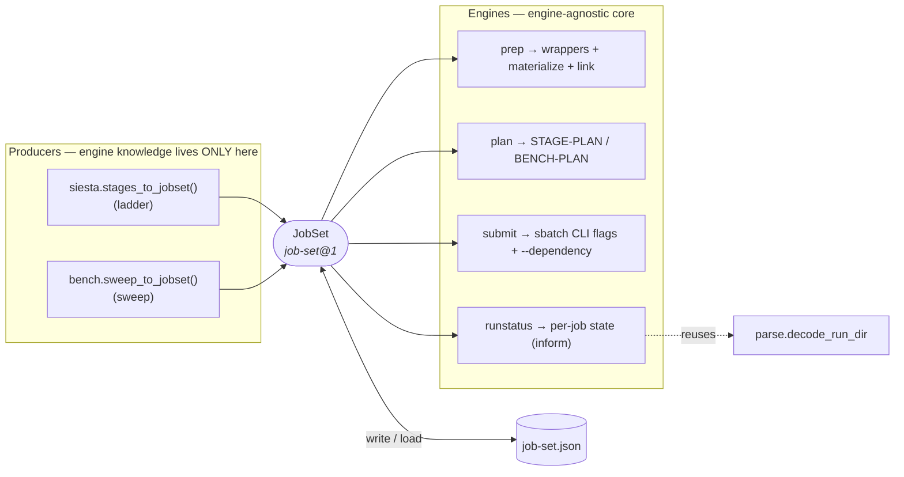
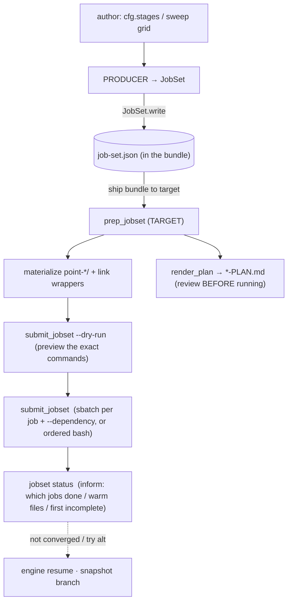
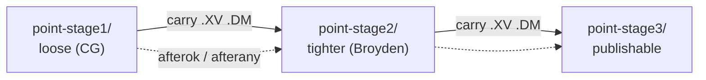
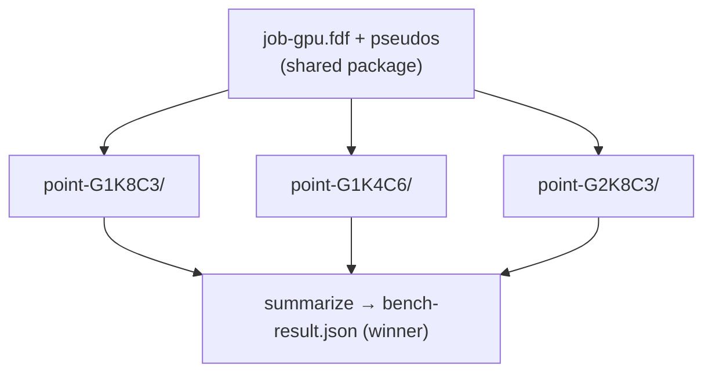

# The JobSet infrastructure — one engine for "a set of related jobs"

**What this is.** A plain-language explainer of the `jobset` infrastructure:
what problem it solves, the pieces (data / files / modules), how information
flows between them, and — the heart of this doc — **how the same
infrastructure is applied in each real scenario** (a staged relaxation, a
benchmark sweep), each with a diagram and a runnable example.

**What this is NOT.** The authoritative contract. For the exact schema,
decisions, and edge-case rules, `protocols/staged-execution.md` is the sole
source of truth; this doc teaches and points there. Step-by-step user guides
live in `staged-relaxation-guide.md` (ladder) and
`protocols/benchmark-workflow.md` (sweep). Names/formats:
`protocols/data-vocabulary.md`.

---

## 1. The problem it solves (plain language)

A surprising number of molbuilder workflows are the *same shape*:

> **N related jobs that share one input package, each running in its own
> directory, each with its own scheduler resources.**

- A **staged relaxation** = the same structure relaxed in tiers (loose →
  tight), each tier a job, each warm-started from the previous.
- A **benchmark sweep** = the same calculation run at many `(GPUs, ranks,
  cores)` points to find the fastest, each point a job.

Before `jobset`, the benchmark grew its own hand-rolled bash to make per-point
directories and submit them, and a staged relaxation would have needed *its
own* copy of that same logic. `jobset` is the **one** implementation of
"lay out N isolated jobs from a shared package and run them," so every
scenario reuses it instead of reinventing it.

---

## 2. The big idea — producers → `JobSet` → engines

One data structure sits in the middle. **Producers** (the only code that
knows an engine like SIESTA) build a `JobSet`; **engines** (which know only
data, never science) lay it out, plan it, run it, and report on it.



**Why this shape:** add a new workflow → write **one** producer; the layout,
submission, dependency-chaining, and status reporting come for free. Swap the
science engine (SIESTA → PySCF) → change only the producer + the filenames,
never the framework.

---

## 3. The building blocks

### 3a. Data structure (what's in a `JobSet`)

| Type | Is | Key fields |
|---|---|---|
| `JobSet` | the whole set | `name`, `engine`, `kind` (`ladder`/`sweep`), `shared[]`, `jobs[]` |
| `Job` | one job | `name` (→ dir `point-<name>/`), `script`, `resources`, `depends_on`, `dep_kind`, `carry[]` |
| `Resources` | one job's scheduler ask | `domain`, `time`, `mem`, `exclusive`, `gres`, `mpi_np`, `cpus_per_task` |
| `Carry` | a runtime hand-off | `pattern` (e.g. `bdt.XV`), `from_job` |

Persisted as `job-set.json` (`schema: "molbuilder/job-set@1"`). Full field
reference: `staged-execution.md` § 3.

### 3b. File structure (three storage tiers)

- **Shared, immutable → bundle root**: pseudos, `mb_monitor.py`, the per-job
  `.fdf`s, `job-set.json`. Written once.
- **Per-job, isolated → `point-<name>/`**: each job's own `.out`/`.XV`/`.DM`,
  logs, and checkpoints. A job can never clobber another's results.
- **Cross-job at runtime → carry symlinks**: a consumer job's restart file
  points at its producer's dir (dangling until the producer runs; the
  dependency guarantees order).

Full tree + the wrapper-in-root nuance: `staged-execution.md` § 4.

### 3c. Module & API map (who to call, what flows through)

| Module | Public entry point | Consumes → Produces |
|---|---|---|
| `siesta/stages.py` | `stages_to_jobset(cfg, *, shared=None, resources_for=None) -> JobSet` | `SiestaConfig` → ladder `JobSet` |
| `bench/to_jobset.py` | `sweep_to_jobset(adapter, env, *, ks=None, cs=None, script_base="job-gpu", shared=None) -> JobSet` | `Environment`+adapter → sweep `JobSet` |
| `jobset/model.py` | `JobSet.write(path)` / `JobSet.load(path)` / `.validate() -> [errors]` | `JobSet` ↔ `job-set.json` |
| `jobset/materialize.py` | `materialize(jobset, base_dir) -> [Path]`; `job_dir_name(name)` | `JobSet` → `point-*/` dirs + symlinks |
| `jobset/prep.py` | `prep_jobset(jobset, base_dir, *, env=None, emit_sbatch=True) -> [Path]` | `JobSet` → wrappers (root) + materialize + `STAGE-PLAN.md` |
| `jobset/plan.py` | `render_plan(jobset) -> str` | `JobSet` → the review table |
| `jobset/submit.py` | `submit_jobset(jobset, base_dir, *, mode, domain=None, dry_run=False)` | `JobSet` → `sbatch`/`bash` calls + `--dependency` |
| `jobset/runstatus.py` | `jobset_status(jobset, base_dir) -> JobSetStatus`; `render_status(status)` | `JobSet` + `point-*/` → per-job state (**reuses** `parse.dirs.job.decode_run_dir`) |
| `jobset/_cli.py` | `molbuilder jobset {plan,prep,status,submit}` | the user surface |

Everything after the producer is **engine-agnostic** — those modules never
parse a `.fdf`; they see opaque filenames + scheduler numbers.

### 3d. The only two shared-info channels

1. **`shared`** (static): files symlinked into *every* job dir (pseudos,
   monitor). Same for all jobs.
2. **`carry`** (runtime): a producer job's output symlinked into a consumer's
   dir — the *scientific lineage*. Ladders carry (`.XV`/`.DM`); **sweeps
   carry nothing** (points are independent). See § 4 carry-forward in
   `staged-execution.md` for the localize-on-run safety detail.

---

## 4. Information flow, end to end



The bundle is **portable**: produce on a laptop, everything target-specific
(queue names, core counts, per-point resources) is resolved at `prep`/`submit`
*on the target*. Nothing irreversible happens without the user (`--dry-run`
first; `status` only reads, never auto-resumes).

---

## 5. Use case A — staged relaxation (a `ladder`)

**Plain language.** Relax the same structure in tiers: a loose, cheap warm-up
first, then progressively tighter tolerances, each tier **warm-started** from
the previous tier's geometry + density. Faster and more robust than one tight
run from scratch.



- **Producer:** `stages_to_jobset(cfg)`. **Channels:** `shared` = pseudos +
  monitor; `carry` = `.XV` (+`.DM` if `use_save_dm`) stage→stage.
- **Depends_on:** a linear chain; `on_nonconvergence` picks the edge kind
  (`proceed`→`afterany`, else `afterok`).

```bash
# HOST — render the stage .fdf's + job-set.json into ./bundle
molbuilder fdf h2.xyz bundle/JOB.fdf --stage-strategy publishable --jobset \
    --psml-lib ~/pseudos
# TARGET
molbuilder jobset prep   ./bundle       # wrappers + point-stage*/ + carry symlinks
molbuilder jobset plan   ./bundle       # the chain + per-stage resources (review)
molbuilder jobset submit ./bundle --mode submit --domain public --dry-run
molbuilder jobset submit ./bundle --mode submit --domain public
molbuilder jobset status ./bundle       # which stage is done / first incomplete
```

Step-by-step, plain-language: **`staged-relaxation-guide.md`**.

## 6. Use case B — benchmark sweep (a `sweep`)

**Plain language.** Run the *same* calculation at many `(GPUs G, ranks-per-GPU
K, cores-per-rank c)` points to measure which layout is fastest on this
machine. The points are **independent** — no carry, all can queue at once.



- **Producer:** `sweep_to_jobset(adapter, env)` — one `Job` per grid point,
  `Resources(mpi_np=K*G, cpus_per_task=c, gres=gpu:type:G)`, dir
  `point-G<g>K<k>C<c>/`. The grid comes from `adapters.sweep_grid` (the same
  enumeration the legacy bash sweep uses). **Channels:** `shared` only; no
  carry.

```bash
# HOST — emit the CPU+GPU bench bundle from one .fdf
molbuilder bench generate device.fdf --out ./bench
# TARGET — detect machine, size the grid, emit job-set.json + scripts
molbuilder bench prep ./bench
molbuilder jobset plan   ./bench        # the (G,K,c) points + resources (review)
molbuilder jobset submit ./bench --mode submit --domain public   # queue all points
molbuilder bench summarize ./bench      # read point-*/ outputs → pick the winner
```

Full science + adapters: **`protocols/benchmark-workflow.md`**. (Bench also
still ships the proven `job-gpu-sweep.sh`; the `jobset` path runs the same
points — see `staged-execution.md` § 13 D4.)

## 7. (Future) Use case C — transport multi-run

A TranSIESTA device run depends on **two** electrode runs — a diamond, not a
chain. `depends_on` is single-parent today; it becomes `List[str]` when a
transport producer is actually built (a named boundary, not yet
implemented — `staged-execution.md` § 3). Listed here so the extension point
is visible, not to imply it exists.

---

## 8. User operations — cheat-sheet

| Do | Command |
|---|---|
| Build a ladder bundle (host) | `molbuilder fdf <xyz> <out.fdf> --stage-strategy <s> --jobset` |
| Build a sweep bundle (host→target) | `molbuilder bench generate <fdf>` → `molbuilder bench prep <dir>` |
| Lay out job dirs + wrappers | `molbuilder jobset prep <dir>` |
| Review before running | `molbuilder jobset plan <dir>` |
| Preview exact submit commands | `molbuilder jobset submit <dir> --mode submit --domain <d> --dry-run` |
| Run | `molbuilder jobset submit <dir> --mode submit --domain <d>` |
| Check progress (read-only) | `molbuilder jobset status <dir>` |
| Summarize a sweep | `molbuilder bench summarize <dir>` |

---

## 9. Authoritative sources

- **`protocols/staged-execution.md`** — the contract: schema, engines,
  carry-forward safety, `execution.mode`, decisions, debt (D4).
- **`staged-relaxation-guide.md`** — the ladder, step by step.
- **`protocols/benchmark-workflow.md`** — the sweep, in full.
- **`protocols/data-vocabulary.md`** — every name/format on the wire.
- **`architecture.md`** — where `jobset` sits among all subsystems.
