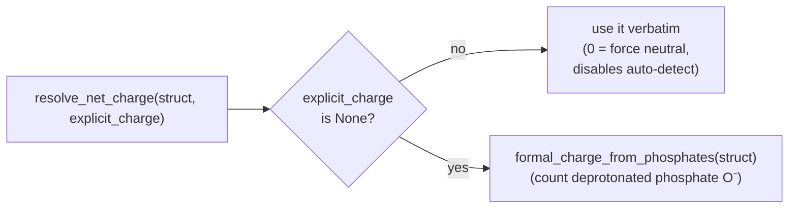

# Chemistry helpers — charge, protonation, hydrogens

**Role:** contract
**Domain:** model
**Companions:** `structure.md` (the `Structure` these operate on),
`science/chemistry-correctness.md` + `science/validation.md` (the
**correctness** half of `chemistry.py` — spin/charge parity, open-shell metals,
ECP resolution, the analyzer + engine adapters; migrating in the science wave),
`engines/siesta.md` + `engines/pyscf.md` (the emitters that consume the
resolved net charge).

`molbuilder/chemistry.py` (tests: `tests/test_chemistry.py`) analyzes a
`Structure` and cleans it up: it works out the **net charge**, adds missing
**hydrogens**, and relieves atomic **clashes**. All functions are pure (no
global state, no I/O) unless noted.

> **Two halves, two domains.** The module also holds the scientific-correctness
> machinery — spin/charge parity, open-shell-metal detection, PySCF ECP
> resolution, and the `analyze_structure` analyzer + its engine-parameter
> adapters. That half is a *science* concern (it decides whether a calculation
> setup is physically valid) and lives in `science/` (see the pointer in § 4).
> This doc covers the **structure-chemistry helpers**.

---

## 1. Net charge

Charge is resolved in **one** place so the SIESTA and PySCF emitters — whose
config fields are named differently (`cfg.net_charge` vs `cfg.charge`) — don't
each carry their own logic.

- **`resolve_net_charge(struct, explicit_charge)` → int** — the one resolver.
  An **explicit override wins**; `0` is meaningful (forces neutral, disables
  auto-detection), and only `None` triggers the phosphate heuristic below.
- **`formal_charge_from_phosphates(struct)` → int** — the auto-detect
  heuristic. It looks **only at phosphate groups**. For each phosphorus:
  1. Find non-bridging oxygen neighbours (an O whose only heavy neighbour is
     this P). Adjacency is distance-based: `_HX_CUT = 1.30 Å` (X–H),
     `_XX_CUT = 1.95 Å` (heavy–heavy).
  2. Count them (`n_nb`) and how many already carry an H (`n_h`). One
     non-bridging O is the implicit `P=O` (contributes **0**); each remaining
     bare O without an H contributes **−1**. So per phosphorus the
     contribution is **`−max(0, n_nb − 1 − n_h)`** — pure arithmetic, no
     atom-name sorting (*which* O is left bare is a protonation choice, § 2).

  It does **not** count carboxylates (Asp/Glu), protonated amines (Lys/Arg),
  histidine pKa, sulfonates/sulfates/nitrates, or metal coordination — those
  groups are invisible to it. A user with such a system **overrides** via
  `cfg.charge` (PySCF) / `cfg.net_charge` (SIESTA); the docstring and the
  emitter specs say so.

Two related counters:
- **`total_electrons(struct, charge=0)` → int** — sum of atomic numbers minus
  the charge (electron count, used by spin-parity checks).
- **`expected_pH7_peptide_charge(struct)` → int | None** — estimates a
  peptide's net charge at physiological pH: **only** Asp/Glu −1 and Lys/Arg +1.
  His, Cys, Tyr and the free N-/C-termini contribute **0** (His is ambiguous at
  pH 7; the termini cancel for a free peptide). Returns `None` when the
  structure doesn't look like a peptide.

---

## 2. Protonation & hydrogens

- **`protonate_phosphate_oxygens(struct)` → (Structure, n_added)** — adds an H
  to each bare, non-bridging phosphate O that needs one.
  - **Idempotent**: running it twice adds no extra H the second time. If no
    protonation is needed it returns the **same `Structure` instance** (`is`
    identity) with `n_added = 0`.
  - **H geometry**: O–H bond `0.96 Å`; P–O–H angle `109.47°` (sp3
    tetrahedral, computed as `sin = √8 / 3`); the O–H points *outward* from the
    centroid of P's other heavy neighbours, falling back to a perpendicular
    axis when that centroid is collinear with P–O.
  - **Edge cases (must not crash)**: empty structure → `(struct, 0)`; a P with
    a single non-bridging O (a lone `P=O`) → no protonation; mixed protonation
    → the alphabetically-first bare O stays as `P=O`, the rest get H.
- **`add_hydrogens(struct)` → Structure** — general H-addition for any built
  structure (correct sp3/sp2/sp geometry). **OpenBabel first**
  (`OBMol.AddHydrogens()`, no ghost-coordinate failure mode), **RDKit fallback**
  (`Chem.AddHs(mol, addCoords=True)`). This is what nucleic/3DNA builds route
  through (see `engines/builders.md`).

---

## 3. Species labels — the name is the user's, the element is derived

**We do not police names.** A species label is free text the user chose;
`Au1` / `Au2` — two gold species carrying different basis sets or
pseudopotentials — is ordinary input, not a typo. Both engines are built for
it: SIESTA's `%block ChemicalSpeciesLabel` is `index Z label`, and PySCF takes
labelled atoms. What a calculation cannot do without is the **element** behind
the label, and deriving that is ours.

One door does it, and it is **explicit, never clever**:

| Function | Purpose |
|---|---|
| `split_species_label(label)` → `(name, index)` | `"Au1"` → `("Au", 1)`. A run of digits at the END is an index; everything before it is the name. **That is the whole of what a label is read for** |
| `resolve_element(label)` → symbol | splits, then looks the name up **verbatim**. `Au1` → `Au` ✓ · `au` ✗ · `FE` ✗ · `Au_1` ✗ (its name is `Au_`). Raises `KeyError` carrying the correction when one exists |
| `atomic_number(label)` → int | `resolve_element`, then one lookup. The Z an engine input needs beside the label |
| `atomic_mass(label)` → float | the standard atomic weight, through the same resolution |
| `is_atom(label, symbol)` → bool | **is this atom that element?** `is_atom("Au1", "Au")` is True. The one way to ask — a bare `el == "P"` says a labelled species is not phosphorus, and writing `el.capitalize() == sym` to fix that makes `CA` calcium again |

**No case correction, anywhere.** Folding two letters is how `CA` becomes
calcium and `CO` becomes cobalt — both real elements, so the result is a wrong
structure that no later check can catch, because nothing records that a guess
happened. A name we cannot look up is a question for the user; the error carries
the correction so they can apply it knowingly.

This costs nothing on file input, because **the format readers have already
decoded**. `from_xyz` is `ase.io.read`, whose `get_chemical_symbols()` is
canonical; the PDB reader decodes columns 77-78, whose convention *is* uppercase
(every two-letter element in this repository's corpus is written `MG`, `NA`,
`CL`, `MN`, `CD`). Decoding a format is not correcting a user. What arrives here
un-canonical is what a **person typed**.

> **The boundary rule** (user ruling, 2026-09-09): *a file is authoritative and
> we do not touch what it says; we gate at **create / add / modify**.*

**A caller emitting an engine input must let the `KeyError` propagate.** A
species with no element is not something a calculation can run, and the
alternative — quietly writing `Z=0`, which SIESTA accepts as a ghost species —
means the run starts and is silently wrong. Two transport emitters did exactly
that until 2026-09-09; the identical `KeyError → 0` shape had already been
caught once in `pyscf/input.py` on 2026-05-26. One door is what stops a third.

Emission is gated on `validate`, so the readable message comes first:
`validation.chemistry.check_species_labels` reports an unresolvable label as an
**error** (blocking) and a resolvable non-canonical one as **info** — said once,
not warned about on every run of a deliberate setup.

### 3a. The species ORDER — one rule, every engine *(decided 2026-09-23)*

A deck lists its species in some order, and that order fixes which **index**
each element gets in `%block ChemicalSpeciesLabel` — which in turn fixes the
orbital ordering inside SIESTA's `.DM` and `.TSHS`. Two runs that order
species differently write files the next stage cannot read correctly
(`engines/transport.md` § 2a.13 classes it a SHARED, binding value).

**There was no single rule until now.** `siesta/input.py::_detect_species`
sorted by atomic number and `transport/transiesta.py` sorted alphabetically,
so the same structure got `H, C, S, Au` from one emitter and `Au, C, H, S`
from the other.

**THE RULE.** Start from atomic number, then place hydrogen the way a chemist
writes it. Three cases, in this order:

1. **Carbon present** → carbon first, then hydrogen, then the rest by Z. The
   organic convention, and it **wins outright**: methanol is CH₄O and acetic
   acid C₂H₄O₂, never HC…
2. **No carbon, but a group VI or VII element present** (O, S, Se, Te · F, Cl,
   Br, I) → **hydrogen first**, where its atomic number already puts it.
   H₂O, HF, HCl, H₂S, HNO₃ — hydrogen is the electropositive partner here and
   is written first.
3. **Neither** → hydrogen goes **last of the light elements**, immediately
   after its anchor: nitrogen if present, else the lowest-Z species that is
   not hydrogen. NH₃, B₂H₆, SiH₄.

Ties inside the atomic-number sort keep first-seen order, so `Au1` and `Au2`
stay distinct and stay as the file listed them. Matching is on the ELEMENT a
label names, never the label text, so `H1`/`H2` are both hydrogen and move
together — landing after the **last** anchor label, because hydrogen belongs
after the carbons as a group rather than between `C1` and `C2`.

| | which case | the order |
|---|---|---|
| Au–BDT–Au `{Au,C,H,S}` | 1 — carbon wins over the sulfur | **C, H, S, Au** |
| methanol `{C,H,O}` | 1 — carbon wins over the oxygen | **C, H, O** |
| water `{H,O}` · HF · HCl · H₂S | 2 — group VI/VII | **H, O** · **H, F** · … |
| nitric acid `{H,N,O}` | 2 — the oxygen decides, not the nitrogen | **H, N, O** |
| ammonia `{H,N}` | 3 — anchor N | **N, H** |
| diborane `{B,H}` · silane `{Si,H}` | 3 — anchor is the lightest non-H | **B, H** · **Si, H** |
| a gold lead `{Au}` | no hydrogen | **Au** |

**Why it is shaped this way.** It is the electronegativity ordering chemical
formulae have always used: hydrogen leads when it is the electropositive
partner (against a chalcogen or halogen) and trails when it is not (against
boron, carbon, nitrogen, silicon, a metal). Carbon overrides because organic
formulae are written Hill-style and a reader expects `C` first in anything
with a carbon skeleton *(user, 2026-09-23)*.

**WHERE THIS APPLIES — and where it deliberately does not.** Scanned
2026-09-23; the rule governs every place a species list is **declared for an
engine or listed for a reader**, and nothing else.

| site | uses the rule? | |
|---|---|---|
| `siesta/input.py` | ✅ | the SIESTA deck's `ChemicalSpeciesLabel`. Its own `_detect_species` is **deleted** — a wrapper is a second name for one answer, and a second name is how a third rule appeared |
| `transport/transiesta.py::_emit_geometry` | ✅ | every transport rung, **override included**. It sorted alphabetically until 2026-09-23 and could not see `cfg.species_order` at all, because the lifted block took no config — which the call site already had and dropped |
| `describe.pseudo_species`, `prep`'s pseudopotential copy | ✅ | so the pseudos a description names are listed in deck order |
| PySCF's emitters | — | they write atoms in the structure's own order and declare no species table. Nothing to order |
| **`Structure.formula`** | ❌ **never** | it is an **identifier**, not chemistry: compared for equality, normalised into a run id (`run-identity.md` § 2.0a) and recorded in `task.json` as a witness. Its own docstring says so. Re-ordering it would change every run id, and the alphabetical order is what makes it a stable key |
| `chemistry.analyze_structure` | ❌ | its sort exists to make a **pick** deterministic — `open_d[0]`'s spin hint is reported, and a frozenset's hash order varies per process. Reordering would change which metal is reported first, for no gain |
| `compose.py`'s `.ion` lookup | ❌ | builds a dict; the order never surfaces |

**The test that distinguishes them:** is this list *shown* — to an engine as a
declaration, or to a person as a list of elements? Then it is species order.
Is it an identifier, a lookup key, or an iteration whose order only needs to
be stable? Then it is not, and forcing the rule on it would be churn.

**The person may override it.** `species_order` is a catalogue row
(`engine_key = "(molbuilder: ChemicalSpeciesLabel block ordering)"`); set, it
is honoured verbatim, and the rule above is the default beneath it. The
override is resolved **inside the one entry**, not at each call site — it was
spelled in two emitters and honoured by one, which is exactly the shape that
let transport drift.

An override that omits an element the structure uses is caught at the deck
gate: *"the coordinate block uses species X, which ChemicalSpeciesLabel does
not declare"* (`siesta/layout.py`).

`chemistry.species_order(elements, override=None)` is **the one entry** — the default rule and the person's override resolved in one place. Nothing else derives a species list.

### Not this namespace

`CA` is an alpha carbon as a **PDB atom name** and calcium as an **element
symbol**. The two share strings and nothing else. Atom names and residue names
are carried verbatim (`Structure.atom_names`, `Structure.residue_names`) and
never reach `resolve_element`. See `model/structure.md` for the PDB reader's
own element-column rules.

---

## 4. Geometry cleanup & properties

| Function | Purpose |
|---|---|
| `min_nonbonded_contact(struct, search_radius=2.5)` | closest approach between atoms in **different** residues — a steric-clash probe; returns `(distance, i, j)`, or `(None, None, None)` when there are no residue labels (intra-residue contacts are bonds, not clashes) |
| `relieve_clashes(struct, steps=1000)` → Structure | nudge atoms apart to remove steric clashes |
| `estimate_partial_charges(struct, total_charge=0.0, *, bond_cutoff=1.95, hx_cutoff=1.30)` | heuristic per-atom partial charges from electronegativity gaps (the cutoffs are keyword-only; same values as § 1) |
| `estimate_dipole_moment_debye(struct, …)` | the molecular dipole moment, in Debye |

---

## 5. Not here — the scientific-correctness machinery

`chemistry.py` also decides whether a *calculation setup* is physically valid.
That is a **science** concern, documented in `science/` (migrating in the
science wave), not the data model:

| Function / type | What it decides | Doc |
|---|---|---|
| `check_spin_charge_parity(struct, charge, spin)` | is `(charge, spin)` electron-count-consistent? | `science/chemistry-correctness.md` |
| `detect_open_shell_metals` / `detect_transition_metals` | which metals need open-shell treatment | `science/chemistry-correctness.md` |
| `explain_metal_spin`, `suggest_spin_total` | plausible spin states for a metal centre | `science/chemistry-correctness.md` |
| `resolve_pyscf_ecp(struct, …)` | which atoms need an effective core potential | `engines/pyscf.md` |
| `analyze_structure(struct)` → `ChemistryAnalysis` + `register_adapter` / `registered_adapters` | the analyzer + per-engine parameter adapters (the validation call graph) | `science/validation.md` |

Keeping the correctness half in `science/` means a reviewer checking whether a
default is scientifically defensible reads it alongside the other validation
contracts, not buried in a data-model helper doc.
