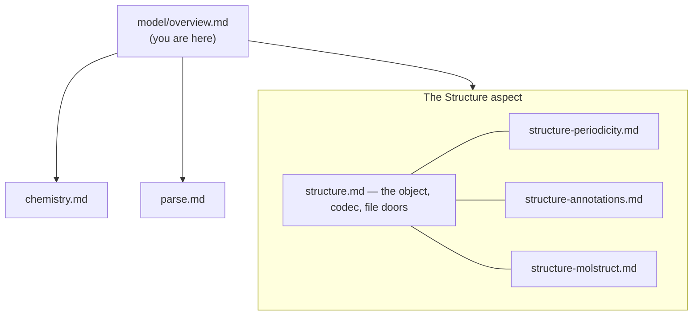
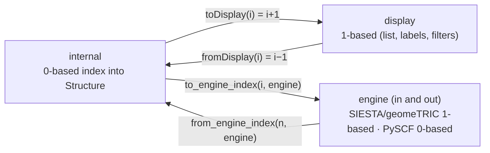

# The data model — overview & atom-index convention

**Role:** overview
**Domain:** model
**Companions:** [`architecture.md`](?doc=architecture.md) (where the model
sits in the L1/L2/L3 layering);
[`execution/job-contracts.md`](?doc=execution/job-contracts.md) § 6 (the
config↔scheduler parameter vocabulary, run identifiers, and
persisted-artifacts registry — absorbed from the legacy
`data-vocabulary.md`, see § 3).

The **model** is molbuilder's L1 layer: the pure data objects, how they persist,
and how files are read back into them. Everything else (engines, execution, the
web front end) builds on these. Start here, then open the doc for the piece
you're working on.

---

## 1. The map — start here

| Doc | What it covers | Open it when you… |
|---|---|---|
| [`structure.md`](?doc=model/structure.md) | The `Structure` object — the lingua franca; its serialization codec (`to_dict`/`from_dict`/`to_wire`), geometry I/O, the paired-file door, and the JS load/save doors. **The master of the Structure aspect.** | touch the core object, save/load, or the wire shape |
| [`structure-periodicity.md`](?doc=model/structure-periodicity.md) | Per-axis box behaviour: `cell`, `cell_origin`, `axis_kind`, derived `pbc`, `vacuum`; `resolve_cell` + calibration. | work on cells, vacuum, transport axes, or the FDF cell |
| [`structure-annotations.md`](?doc=model/structure-annotations.md) | The per-atom channel model (`tag`/`flag`/`value`), the ONE label store with reserved labels in it, persistence, engine translation, and the region-label vocabulary. | add per-atom metadata, regions, or a selection filter |
| [`structure-molstruct.md`](?doc=model/structure-molstruct.md) | The `.molstruct.json` save file: envelope, schema versioning, the codec, and the `.xyz`↔sidecar pairing rule. | change what a saved structure carries, or the sidecar format |
| [`chemistry.md`](?doc=model/chemistry.md) | Chemistry helpers on a `Structure`: net-charge resolution, protonation, `add_hydrogens`, clash relief, dipole (spin/open-shell **correctness** → `science/`). | resolve charge, add hydrogens, or clean up geometry |
| [`parse.md`](?doc=model/parse.md) | The unified read stack: three ABCs, the `ParseResult` hierarchy, the registry, and how to add a parser. | read a file/dir/text body into typed data, or add a parser |

The **atom-index convention** below is the one shared rule that cuts across all
of these (and into the engines + the web UI), so it lives here.

---

## 2. The atom-index convention (0-based internal, 1-based user-facing)

Atom indices use **two bases with a single explicit conversion boundary** — a
deliberate design, because arrays/JSON are 0-based by nature while scientists
count atoms 1-based (SIESTA `.fdf`, PDB serials, counting `.xyz` lines). Mixing
them silently is the classic off-by-one hazard.

| Layer | Base | Where |
|---|---|---|
| **Internal / machine** | **0-based** | Python `Structure` (`regions`/positions), the `.molstruct.json` sidecar + the `.fdf`/`.py` ATOM-METADATA block, `/api/selection/*` rules, the JS selection store `atom.index`, all wiring |
| **User-facing** | **1-based** | everything a user reads or types: the atom-list index column, the viewer's atom labels, measurement chips, the "by atom index" filter |
| **Engine input** | **engine-specific** | SIESTA `.fdf` (1-based), geomeTRIC `$freeze` (1-based), PySCF `mol.atom` (0-based) |

### 2.1 Identity, carriage, and the only three translation points

**DEFINED** — the canonical identity is the **0-based index into `Structure`**
(`elements[i]` / `positions[i]`), fixed by the atom order in the source file
when parsed. Nothing invents an index; that order *is* the identity.

**CARRIED** — it travels 0-based and untranslated through the JS selection
store, `/api/selection/*`, the `.molstruct.json` sidecar, the ATOM-METADATA
block, and all metadata (`regions`/`annotations`). These indices
are valid only against the structure they were computed on — **pinned by
`structure_hash`**; a mismatch must refuse, not mis-apply.

**TRANSLATED** — only at three boundaries, each with one API:

The engine edge is **two-way**: `to_engine_index` writes the atom number into
the input file, and `from_engine_index` reads it back when engine *output*
references an atom by number (the return leg of the round-trip). When output is
order-preserved — SIESTA/PySCF emit coordinate and force blocks in `Structure`
order — the internal index is simply the row position and no number
translation is needed.

| Boundary | Direction | The single API |
|---|---|---|
| internal → display | 0 → 1-based | `toDisplay` (`lib/molview/_atom-index.js`) |
| user input → internal | 1 → 0-based | `fromDisplay` / `shiftExpression` (same module) |
| internal → engine input | 0-based → engine convention | `engine_atom_index.py` — `to_engine_index(i, engine)` (dispatch), or the FACT functions `siesta_atom_index`/`geometric_atom_index` (1-based) / `pyscf_atom_index` (0-based) |
| engine output → internal | engine convention → 0-based | `engine_atom_index.py` — `from_engine_index(n, engine)` (the inverse; return leg of the round-trip) |

`engine_atom_index.py` is the **sole** place a 0-based identity becomes an
engine atom number and back — **no other code applies a bare `i + 1` or
`n − 1`** (both directions route here; bound by `tests/test_engine_atom_index.py`,
including the round-trip identity `from_engine_index(to_engine_index(i, e), e) == i`).
It exposes the per-engine FACT functions **and** the engine-parametrized
`to_engine_index` / `from_engine_index` dispatch, backed by one base-offset
registry so a new engine defines both directions in a single line. The JS
`_atom-index.js` (`toDisplay`/`fromDisplay`/`shiftExpression`) is the single
web-UI implementation; the standalone viewer embed inlines `+1` at the label,
drift-guarded against `toDisplay`.

**The load-bearing invariant.** Engine coordinate blocks emit atoms in internal
`Structure` order (no reordering), so engine atom `siesta_atom_index(i)` is the
coordinate line for internal atom `i`. The display convention is chosen so
`toDisplay(i)` **equals** the engine atom number the user reads in the file
(SIESTA `.fdf`, geomeTRIC `$freeze`) — bound by
`tests/test_engine_atom_index.py::test_frontend_display_matches_engine_atom_number`,
with end-to-end element+position tests binding the full user→engine round-trip.

---

## 3. The rest of the shared vocabulary lives in `execution/`

The model owns the atom-index convention (above) and the structure-metadata
serialization contract (`structure.md § 2.2`). The **other** cross-system
vocabulary — the config↔scheduler parameter names (`mpi_np`/`cpus_per_task`/
`time`/`mem`/…), run identifiers and paths (`SystemLabel`, warm-restart files,
stage and attempt directories, SLURM job names), and the full
persisted-artifacts registry
(`job-set.json`, `task.json`, `<label>.template.toml`, `environment.json`,
`run.json`, checkpoint files, …) — is
an **execution** concern and lives in
[`execution/job-contracts.md`](?doc=execution/job-contracts.md) § 6 (absorbed
from the legacy `data-vocabulary.md`). This overview points there rather than
duplicating it.
