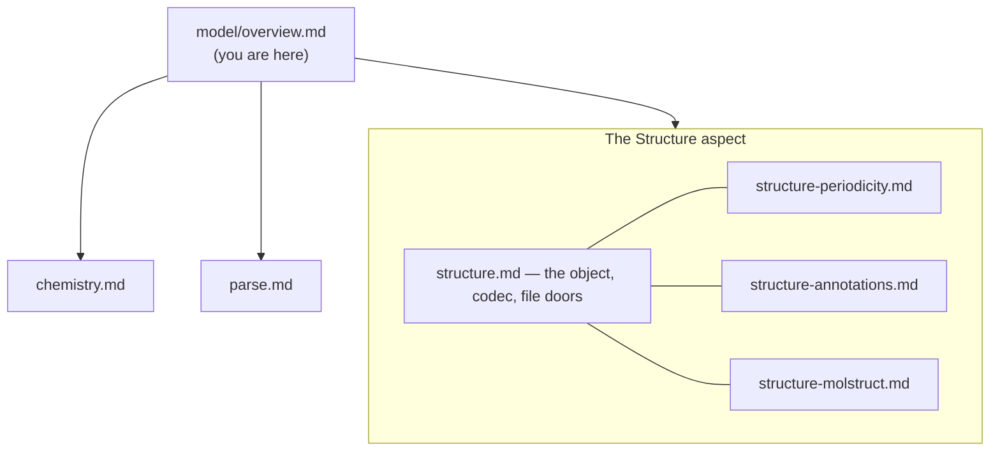
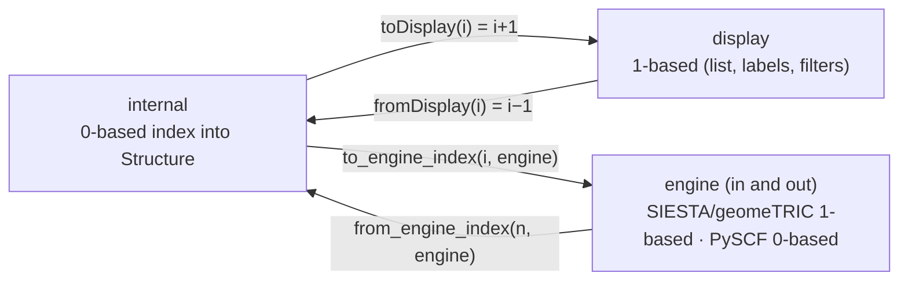

# The data model — overview & atom-index convention

**Role:** overview
**Domain:** model
**Companions:** [`architecture.md`](?doc=architecture.md) (where the model
sits in the L1/L2/L3 layering);
[`execution/job-contracts.md`](?doc=execution/job-contracts.md) § 6 (the
config↔scheduler parameter vocabulary, run identifiers, and
persisted-artifacts registry — absorbed from the legacy
`data-vocabulary.md`, see § 3).

The **model** is molbuilder's L1 layer: the pure data objects, how they persist,
and how files are read back into them. Everything else (engines, execution, the
web front end) builds on these. Start here, then open the doc for the piece
you're working on.

---

## 1. The map — start here

```mermaid
flowchart TD
    O["model/overview.md<br/>(you are here)"]
    subgraph STRUCT["The Structure aspect"]
        S["structure.md — the object, codec, file doors"]
        P["structure-periodicity.md"]
        A["structure-annotations.md"]
        M["structure-molstruct.md"]
        S --- P
        S --- A
        S --- M
    end
    C["chemistry.md"]
    PA["parse.md"]
    O --> STRUCT
    O --> C
    O --> PA
```

| Doc | What it covers | Open it when you… |
|---|---|---|
| [`structure.md`](?doc=model/structure.md) | The `Structure` object — the lingua franca; its serialization codec (`to_dict`/`from_dict`/`to_wire`), geometry I/O, the paired-file door, and the JS load/save doors. **The master of the Structure aspect.** | touch the core object, save/load, or the wire shape |
| [`structure-periodicity.md`](?doc=model/structure-periodicity.md) | Per-axis box behaviour: `cell`, `cell_origin`, `axis_kind`, derived `pbc`, `vacuum`; `resolve_cell` + calibration. | work on cells, vacuum, transport axes, or the FDF cell |
| [`structure-annotations.md`](?doc=model/structure-annotations.md) | The per-atom channel model (`tag`/`flag`/`value`), the ONE label store with reserved labels in it, persistence, engine translation, and the region-label vocabulary. | add per-atom metadata, regions, or a selection filter |
| [`structure-molstruct.md`](?doc=model/structure-molstruct.md) | The `.molstruct.json` save file: envelope, schema versioning, the codec, and the `.xyz`↔sidecar pairing rule. | change what a saved structure carries, or the sidecar format |
| [`chemistry.md`](?doc=model/chemistry.md) | Chemistry helpers on a `Structure`: net-charge resolution, protonation, `add_hydrogens`, clash relief, dipole (spin/open-shell **correctness** → `science/`). | resolve charge, add hydrogens, or clean up geometry |
| [`parse.md`](?doc=model/parse.md) | The unified read stack: three ABCs, the `ParseResult` hierarchy, the registry, and how to add a parser. | read a file/dir/text body into typed data, or add a parser |

The **atom-index convention** below is the one shared rule that cuts across all
of these (and into the engines + the web UI), so it lives here.

---

## 2. The atom-index convention (0-based internal, 1-based user-facing)

Atom indices use **two bases with a single explicit conversion boundary** — a
deliberate design, because arrays/JSON are 0-based by nature while scientists
count atoms 1-based (SIESTA `.fdf`, PDB serials, counting `.xyz` lines). Mixing
them silently is the classic off-by-one hazard.

| Layer | Base | Where |
|---|---|---|
| **Internal / machine** | **0-based** | Python `Structure` (`regions`/positions), the `.molstruct.json` sidecar + the `.fdf`/`.py` ATOM-METADATA block, `/api/selection/*` rules, the JS selection store `atom.index`, all wiring |
| **User-facing** | **1-based** | everything a user reads or types: the atom-list index column, the viewer's atom labels, measurement chips, the "by atom index" filter |
| **Engine input** | **engine-specific** | SIESTA `.fdf` (1-based), geomeTRIC `$freeze` (1-based), PySCF `mol.atom` (0-based) |

### 2.1 Identity, carriage, and the only three translation points

**DEFINED** — the canonical identity is the **0-based index into `Structure`**
(`elements[i]` / `positions[i]`), fixed by the atom order in the source file
when parsed. Nothing invents an index; that order *is* the identity.

**CARRIED** — it travels 0-based and untranslated through the JS selection
store, `/api/selection/*`, the `.molstruct.json` sidecar, the ATOM-METADATA
block, and all metadata (`regions`/`annotations`). These indices
are valid only against the structure they were computed on — **pinned by
`structure_hash`**; a mismatch must refuse, not mis-apply.

**TRANSLATED** — only at three boundaries, each with one API — and **NORMALISED** at a fourth, § 2.2, which is a reorder and not an offset:

```mermaid
flowchart LR
    INT["internal<br/>0-based index into Structure"]
    DISP["display<br/>1-based (list, labels, filters)"]
    ENG["engine (in and out)<br/>SIESTA/geomeTRIC 1-based · PySCF 0-based"]
    INT -- "toDisplay(i) = i+1" --> DISP
    DISP -- "fromDisplay(i) = i−1" --> INT
    INT -- "to_engine_index(i, engine)" --> ENG
    ENG -- "from_engine_index(n, engine)" --> INT
```

The engine edge is **two-way**: `to_engine_index` writes the atom number into
the input file, and `from_engine_index` reads it back when engine *output*
references an atom by number (the return leg of the round-trip). When output is
order-preserved — SIESTA/PySCF emit coordinate and force blocks in `Structure`
order — the internal index is simply the row position and no number
translation is needed.

| Boundary | Direction | The single API |
|---|---|---|
| internal → display | 0 → 1-based | `toDisplay` (`lib/molview/_atom-index.js`) |
| user input → internal | 1 → 0-based | `fromDisplay` / `shiftExpression` (same module) |
| internal → engine input | 0-based → engine convention | `engine_atom_index.py` — `to_engine_index(i, engine)` (dispatch), or the FACT functions `siesta_atom_index`/`geometric_atom_index` (1-based) / `pyscf_atom_index` (0-based) |
| engine output → internal | engine convention → 0-based | `engine_atom_index.py` — `from_engine_index(n, engine)` (the inverse; return leg of the round-trip) |

`engine_atom_index.py` is the **sole** place a 0-based identity becomes an
engine atom number and back — **no other code applies a bare `i + 1` or
`n − 1`** (both directions route here; bound by `tests/test_engine_atom_index.py`,
including the round-trip identity `from_engine_index(to_engine_index(i, e), e) == i`).
It exposes the per-engine FACT functions **and** the engine-parametrized
`to_engine_index` / `from_engine_index` dispatch, backed by one base-offset
registry so a new engine defines both directions in a single line. The JS
`_atom-index.js` (`toDisplay`/`fromDisplay`/`shiftExpression`) is the single
web-UI implementation; the standalone viewer embed inlines `+1` at the label,
drift-guarded against `toDisplay`.

**The load-bearing invariant.** Engine coordinate blocks emit atoms in internal
`Structure` order for every kind that does not sort, so engine atom
`siesta_atom_index(i)` is the coordinate line for internal atom `i`. A kind
that must reorder — transport, for TranSIESTA's contiguous electrode ranges;
the SIESTA force-constant run, for a contiguous free range — emits the
**sorted copy** of § 2.2, and the same invariant holds on that copy, under its
recorded permutation. The display convention is chosen so
`toDisplay(i)` **equals** the engine atom number the user reads in the file
(SIESTA `.fdf`, geomeTRIC `$freeze`) — bound by
`tests/test_engine_atom_index.py` — **but the front-end half of this
invariant is UNBOUND.** This line named
`::test_frontend_display_matches_engine_atom_number` until 2026-09-20; a
repo-wide grep finds that name in this citation and nowhere else. The file
exists and holds six tests; none of them is that one,
with end-to-end element+position tests binding the full user→engine round-trip.

### 2.2 Normalised — a sorted COPY under one recorded permutation *(user, 2026-09-23)*

Some engines need atoms in an order the source file does not have. TranSIESTA
identifies each electrode by a **contiguous** atom range; SIESTA's
force-constant run nudges atoms *A through B* and cannot take a scattered free
set. The identity does not bend to them. **The program sorts a COPY at prep,
records the permutation in both directions beside it, and maps every number
that comes back through the inverse before a person sees it.** From the
outside, atoms go in and come out in the input order; the sorted order is an
engine fact, like the 1-based numbering, and it never leaks.

| | the rule |
|---|---|
| **one home per sort key** | the sort is a pure function, `(Structure) -> (sorted Structure, permutation)`, with one implementation per key over ONE machinery: `transport/sort.py` — `sort_by(struct, key)` with the keys named in `SORT_KEYS` (`transport`: the categorical order; `held-first`: held atoms first, free atoms last), each an order handed to the shared `apply_order`, which does the remap, the bijection check and the record. A new need is a new key there, never a second machine *(built 2026-09-23)* |
| **every index-carrying field moves with its atom** | `regions`, `frozen_atoms`, `annotations`, the identity columns, every per-atom array — through one map, checked to be a bijection before the copy is returned |
| **recorded, both directions** | `atom-permutation.json` beside the record ([`execution/job-contracts.md`](?doc=execution/job-contracts.md) § 6.1): `original_to_sorted`, `sorted_to_original` and the **`key`** that made the copy, written by `write_permutation` and read by `read_permutation` — one writer, one reader, for every kind |
| **inverted at every return** | a per-atom result read from a sorted run — a force, a Mulliken charge, a projected DOS, an eigenchannel weight, a mode's eigenvector — passes through the record before it reaches any surface, and does so through `Permutation.rows_to_input_order` / `original_of`, never by hand. **The first reader that does is the SIESTA vibration's** (`spectra/from_siesta.py`, 2026-09-23): the free atoms' rows come out of `.FC` in the sorted order and are written in the input's. No per-atom transport result is parsed yet; when one is, it uses the same two methods |
| **the sorted copy is an engine artifact** | it lives in the calculation's record (the `junction.xyz` there is the *sorted* junction) and in the decks. A surface that opens it presents it as the engine's order, with the permutation beside it — never as the person's structure |
| **the person's interfaces speak the input order** | a displacement script for a frame group receives the base structure in input order and returns frames in input order ([`engines/transport.md`](?doc=engines/transport.md) § 2a.9). The sort runs per frame at prep, and because a frame inherits the base's labels the permutation is **the same for every frame of a group** |
| **one copy, one permutation** | a structure sorted for two reasons — a junction ordered for TranSIESTA and again for force-constant contiguity — carries **one composed permutation, recorded once**. Two records for one copy is how a return leg inverts the wrong one. How the composition is built is the design's to settle (§ 14.2 above); that there is one is this contract's |

This is a fourth translation, and it differs in kind from the three above: those
are a base offset with no state; this is a per-structure reorder with a record.
`engine_atom_index.py` therefore does not hold it, and must not — its invariant
is that its two directions cannot disagree because they share one base.

---

## 3. The rest of the shared vocabulary lives in `execution/`

The model owns the atom-index convention (above) and the structure-metadata
serialization contract (`structure.md § 2.2`). The **other** cross-system
vocabulary — the config↔scheduler parameter names (`mpi_np`/`cpus_per_task`/
`time`/`mem`/…), run identifiers and paths (`SystemLabel`, warm-restart files,
stage and attempt directories, SLURM job names), and the full
persisted-artifacts registry
(`job-set.json`, `task.json`, `<label>.template.toml`, `environment.json`,
`run.json`, checkpoint files, …) — is
an **execution** concern and lives in
[`execution/job-contracts.md`](?doc=execution/job-contracts.md) § 6 (absorbed
from the legacy `data-vocabulary.md`). This overview points there rather than
duplicating it.
