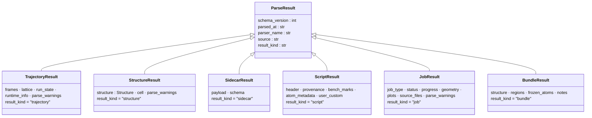
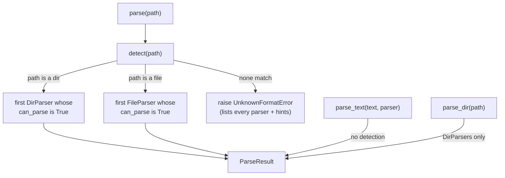

# The parse stack — turn a file or directory into typed data

**Role:** contract
**Domain:** model
**Module:** `molbuilder/parse/` · **Tests:** `tests/parse/` (~106 tests).
**Companions:** [`structure.md`](?doc=model/structure.md) (a `StructureResult` carries a `Structure`);
`engines/siesta.md` + `engines/pyscf.md` (the `.out`/`.log`/geometry formats the
leaf parsers read, migrating); `execution/job-decoder.md` +
[`execution/handoff-bundle.md`](?doc=execution/handoff-bundle.md) (the directory-level `JobResult`/`BundleResult`
contracts the two DirParsers implement, migrating). The **write** side (the
inverse — turning data back into files) is `sidecars/molstruct.py`,
`script_emit.py`, and `bundle_writer.py`, not this module.

One package answers a single question: **"what is in this path, as a Python
object?"** — for a file, a text body, or a whole run directory. It is the sole
read-side source of truth; every consumer (web blueprints, CLI, tests) imports
from here and queries the registry rather than knowing which parser to call.

> **Why it exists.** Before this, molbuilder had **four parallel parsing
> patterns** — a `TrajectoryParser` registry for engine output, ad-hoc
> `load(path)` functions for sidecar JSON, ad-hoc `read_*` functions for
> geometry, and ad-hoc `extract_*`/`decode_run_dir` for scripts and run dirs —
> with three different return-type flavours and no shared base. Each new engine
> or output type added another parallel path. This package collapses them into
> **three ABCs, one frozen-dataclass result hierarchy, and one registry**.

---

## 1. The three ABCs

`molbuilder/parse/base.py`:

| ABC | Input → output | Detection |
|---|---|---|
| **`FileParser`** (`:26`) | one file path → one `ParseResult` | `can_parse(path)` — the registry auto-detects |
| **`TextParser`** (`:79`) | one in-memory text body → one `ParseResult`; **pure, no I/O** | none — the caller passes the parser explicitly |
| **`DirParser`** (`:98`) | one directory → one `ParseResult`, **composed** from per-file parsers plus directory-level invariants | `can_parse(run_dir)` |

Each declares `name` / `label` / `output` (the concrete `ParseResult` subclass
it returns); **`FileParser`s** also declare a `hint` (what to point at when
`can_parse` is `False`). **`TextParser` has no detection** — a text body has no
path to inspect, so the caller names the parser: `parse_text(text, parser=…)`.

---

## 2. The `ParseResult` hierarchy

Every parser returns a **frozen dataclass** on a shared base
(`molbuilder/parse/types.py`). A consumer type-narrows by `isinstance` or by the
`result_kind` discriminator string.



Plus **`ParseWarning`** (`types.py:36`) — a fail-soft warning (`source`,
`line_no`, `snippet`, `error`, `category`) any parser can attach to its result
instead of raising.

- **The discriminator.** Each concrete subclass sets `result_kind` to a fixed
  string (`"trajectory"`, `"structure"`, `"sidecar"`, `"script"`, `"job"`,
  `"bundle"`). Consumers holding a `ParseResult` (cached, or sent over the wire)
  `match` on it; JSON deserialisation reads it to pick a class. Adding a kind =
  a new subclass + a new discriminator value (rule below).
- **Why frozen.** No defensive copies at API boundaries; hashable (dict/set
  usable); trivial `asdict()` serialisation; `result == expected` test pinning
  with no `__eq__` override.

---

## 3. The registry + public API

`molbuilder/parse/__init__.py` re-exports the whole surface; the dispatch lives
in `registry.py`.



| Function (`registry.py`) | Does |
|---|---|
| `detect(path)` (`:60`) | return the parser whose `can_parse(path)` is `True` — **DirParsers when `path` is a directory, FileParsers when it is a file** (no dir→file fall-through); `UnknownFormatError` if none match / `AmbiguousFormatError` if more than one does, both listing every registered parser + the standard foot-gun hints |
| `parse(path)` (`:135`) | `detect` + `parse` in one call |
| `parse_text(text, parser)` (`:158`) | parse a known text body — **no detection**, caller names the `TextParser` |
| `parse_dir(path)` (`:144`) | detect among **DirParsers only** — for callers whose contract is "this is a run directory" (JobMonitor, Results, bundle handoff) |
| `register(parser)` (`:30`) | add a parser at module-init time (idempotent; not for runtime registration) |

**Errors** (`errors.py`): `UnknownFormatError` (`:13`) and
`AmbiguousFormatError` (`:23`), both on a `ParseError` base (`:9`).

### Using it — worked examples

**Parse a file** — detect + read, narrowing on `result_kind`:

```python
from pathlib import Path
from molbuilder.parse import parse

r = parse(Path("projects/BDT/optimization/BDT.out"))
if r.result_kind == "trajectory":            # a SIESTA / PySCF / molwatch .out
    last = r.frames[-1]
    print(last.energy, last.max_force)        # eV, eV/Å (either may be None)
    print(r.run_state)                        # "running" | "finished" | "failed"
elif r.result_kind == "structure":           # a .XV / *_optimized.xyz
    print(len(r.structure.elements), r.cell)  # atom count, 3×3 cell or None
```

**Read a sidecar:**

```python
r = parse(Path("water.molstruct.json"))       # -> SidecarResult
print(r.schema, r.payload)                     # e.g. "molstruct/v6", {...}
```

**Decode a whole run directory** (what the Results tab consumes):

```python
from molbuilder.parse import parse_dir

job = parse_dir(Path("projects/BDT/optimization"))   # -> JobResult
job.status       # decoded status dict (converged / running / failed …)
job.progress     # per-stage CG-step progress
job.plots        # per-source plot buckets for the Results tab
```

**Extract the reserved blocks from a `.fdf` / `.py` body** (a `TextParser` — no
detection, you name it):

```python
from molbuilder.parse import parse_text
from molbuilder.parse.scripts.source import ScriptSourceTextParser

s = parse_text(fdf_text, parser=ScriptSourceTextParser)   # -> ScriptResult
s.atom_metadata      # the ATOM-METADATA block dict, or None if absent
s.provenance         # the PROVENANCE block, or None
```

**Skip detection when you already know the type** — call the parser class's
`parse()` directly. This is what most consumers do, e.g.
`BundleDirParser.parse(run_dir)` (`web/blueprints/results.py`).

---

## 4. Package layout

```
molbuilder/parse/
├── base.py        # the 3 ABCs                (FileParser / TextParser / DirParser)
├── types.py       # ParseResult + 6 subclasses + ParseWarning
├── registry.py    # _REGISTRY, detect/parse/parse_text/parse_dir/register
├── errors.py      # ParseError, UnknownFormatError, AmbiguousFormatError
├── _log.py        # parse-side logging helper
│
├── engines/       # engine .out / .log → TrajectoryResult (FileParsers)
│   ├── siesta.py · pyscf.py · molwatch.py
│   ├── siesta_mdnc.py         # <label>.MD.nc (netCDF) — sibling upgrade, § 5a
│   ├── _helpers.py            # Trajectory → TrajectoryResult adapters
│   └── _section_rules.py · _sidecar.py   # shared extraction helpers
│
├── coords/        # geometry files → StructureResult (FileParsers)
│   ├── siesta_xv.py           # .XV / .STRUCT_OUT (+ cell)
│   ├── pyscf_geom.py          # *_optimized.xyz
│   └── _helpers.py            # StructureResult envelope
│
├── sidecars/      # molbuilder JSON sidecars → SidecarResult (FileParsers)
│   ├── molstruct.py · spectra.py · transport.py
│   └── _helpers.py
│
├── scripts/       # the reserved .fdf / .py comment blocks → ScriptResult (TextParsers)
│   ├── header.py · provenance.py · bench_marks.py
│   ├── atom_metadata.py · user_custom.py
│   ├── source.py              # ScriptSourceTextParser — umbrella over the blocks
│   ├── markers.py             # MARKER_RE + block-name constants
│   └── _helpers.py
│
└── dirs/          # directory composers (DirParsers)
    ├── job.py                 # JobDirParser + decode_run_dir → JobResult
    ├── bundle.py              # BundleDirParser → BundleResult (explicit-dispatch)
    └── _assembler_helpers.py  # shared dir-walk + .fdf-coords helpers
```

> **Two geometry formats have no leaf FileParser (by design).** Plain `.xyz`
> reading uses `Structure.from_xyz` directly (see [`structure.md`](?doc=model/structure.md)), and `.fdf`
> initial-coordinates reading lives in `dirs/_assembler_helpers.py` (used by the
> DirParsers), rather than as registered `coords/` parsers. Adding them as
> FileParsers was scoped but not needed.

---

## 5. Composer pattern — DirParsers

A DirParser turns a whole run directory into one result. The two shipped:

- **`JobDirParser`** (`dirs/job.py:822`; public entry `decode_run_dir` `:736`) →
  `JobResult` — walks the `.out` files, consolidates per-source plots,
  classifies the job type. This is what the Results tab + JobMonitor consume.
- **`BundleDirParser`** (`dirs/bundle.py:460`) → `BundleResult` — picks the
  source `.fdf`, reads the `.XV` final coordinates, validates the atom count,
  for the next-stage handoff. It is **explicit-dispatch, not auto-registered**
  (it shares the `.fdf` claim with `JobDirParser` but expresses a different user
  intent), so `parse_dir` routes to `JobDirParser`; a caller names
  `BundleDirParser` directly.

Every DirParser must: **walk** the directory, **dispatch each file through the
registry** (`detect`+`parse`, or pick a specific FileParser when the choice
isn't path-driven), **compose** the per-file results, and **apply cross-file
invariants** no single FileParser can see (atom-count consistency, lattice
handedness, stage ordering, status state machine). It must **never re-parse**
what a registered FileParser can produce — add the missing FileParser instead.

---

## 5a. Sibling upgrade — when a second file sharpens the first

Some engines write the *same* physics twice: once into the human-readable log,
once into a structured sidecar. When they do, the parser for the log reads the
sidecar and **replaces values in frames it already built** — it does not build
a second trajectory.

Three parsers do this today:

| primary | sibling | what the sibling supplies |
|---|---|---|
| `engines/pyscf.py` | `<prefix>.qdata.txt` | per-step max force |
| `engines/pyscf.py` | `<base>.molwatch.log` | convergence targets, run state |
| `engines/siesta.py` | `<label>.MD.nc` | coordinates + per-step energy, in full precision |

**The rules, which are what keep this from becoming a second source of truth:**

1. **The primary file owns the frame list.** Count, order and indexing come
   from the log and are never re-shaped. The sibling only swaps values into
   frames that already exist.
2. **Absence is ordinary.** No sibling, an unreadable one, or one that matches
   nothing must parse *exactly* as the primary alone. A sidecar is an
   improvement, never a dependency — so a run from a build that doesn't emit
   it loses nothing.
3. **Never invent.** A field the sibling lacks stays as the primary had it
   (or stays `None`); it is never back-filled from a neighbouring step.
4. **Say what happened.** Record the upgrade in `runtime_info` — which file,
   how many frames changed — so a surprising number in the UI can be traced to
   a file rather than to a guess.

### The SIESTA case, and the trap in it

`<label>.MD.nc` is netCDF, written whenever `WriteMDhistory` is on and the
binary was built with `-DCDF` (both true for the packaged `molbuilder-siesta`).
It matters because the `.out` is a Fortran-formatted text file: it prints
`E_KS(eV) = -30.4405` — **four decimals**, coarser than the step-to-step energy
change near convergence — and its fixed-width columns collide when values grow
(`-1.929956131.029438`) or overflow to `**********`, which is why
`engines/siesta.py` carries both a separator-inserting regex and a structural
column slicer. Typed netCDF arrays have neither failure mode.

**But a `.MD.nc` row is not a step.** Measured on a real relaxation
(2026-08-15):

```
row k :  xa   = the geometry AFTER move k+1   ("predicted", per the manual)
         etot = the energy OF geometry k      (the one just evaluated)
```

Pairing them by row index — the obvious implementation — attaches every
geometry to the previous geometry's energy. Nothing raises, the frame count is
right, and on a converging run the plot still looks reasonable. The correct
pairing is `xa[k]` with `etot[k+1]`, and the last row has no energy yet.

Two more properties shape the reader:

- **There is no row for the input geometry.** So the merged trajectory keeps
  the `.out`'s own frame 0 — the structure the user submitted, and the frame
  every other one is read against.
- **The file accumulates across runs** (SIESTA appends on restart). Frame index
  is therefore not run-local, which is why `align_to_reference` matches on
  **coordinates** rather than doing index arithmetic: a hardcoded lag is right
  on a fresh run and wrong on every warm one.

Units come from each variable's own `unit` attribute (`xa` is Bohr while
`volume` is `Ang**3` *in the same file*), and an unrecognised unit is refused
rather than assumed — a wrong factor is invisible in the result and wrong by a
fixed ratio in every number downstream.

Reading uses `netCDF4` when present and falls back to `scipy.io.netcdf_file`;
both are exercised by the tests, because `molbuilder-pySCF` has scipy and no
netCDF4.

---

## 6. Adding a parser

The shape every parser follows — a real minimal `FileParser` (mirrors
`parse/sidecars/spectra.py`): read a file, return a typed result via the
sub-package's envelope helper.

```python
# molbuilder/parse/sidecars/mykind.py
import json
from pathlib import Path
from molbuilder.parse.base import FileParser
from molbuilder.parse.types import SidecarResult
from ._helpers import build_sidecar_result   # fills the envelope: schema_version,
                                             # parsed_at, parser_name, source

class MyKindSidecarFileParser(FileParser):
    name   = "mykind-json"
    label  = "molbuilder .mykind.json sidecar"
    hint   = "files ending in .mykind.json"
    output = SidecarResult

    @classmethod
    def can_parse(cls, path: Path) -> bool:
        return path.name.endswith(".mykind.json") and path.is_file()

    @classmethod
    def parse(cls, path: Path) -> SidecarResult:
        payload = json.loads(path.read_text(encoding="utf-8-sig"))
        return build_sidecar_result(
            payload=payload, schema=f"mykind/v{payload.get('schema_version', 0)}",
            parser_name=cls.name, source=path,
        )
```

Then **register it at import** in the sub-package's `__init__.py`
(`from .mykind import MyKindSidecarFileParser` → `register(MyKindSidecarFileParser)`)
and add an L2 test under `tests/parse/`.

Per parser kind, the specifics:
- **Engine FileParser** (`parse/engines/`): `output = TrajectoryResult`;
  `can_parse` sniffs content markers in the **first few hundred lines** (SIESTA
  scans 300; molwatch keys off the first 5) — not a fixed byte window.
- **Sidecar FileParser** (`parse/sidecars/`): `can_parse` matches the
  `.<kind>.json` suffix; the result's `schema` is `"<kind>/v<N>"`.
- **Block TextParser** (`parse/scripts/`): returns `ScriptResult`; uses
  `MARKER_RE` from `scripts/markers.py`; the caller invokes it via
  `parse_text(text, parser=<Block>Parser)` (no auto-detection).
- **DirParser composer** (`parse/dirs/`): **must compose existing FileParsers +
  TextParsers** (forbidden pattern #1 below), never parse files inline.

---

## 7. Forbidden patterns

These stop the next round of parallel parse paths:

1. **DirParsers compose registered parsers — no inline file-level parsing.**
   Need a new file read? Add a FileParser first. (A convention today, not yet
   lint-enforced.)
2. **TextParsers do NO I/O.** A path-taking caller reads the file and passes the
   body.
3. **FileParsers do not spawn subprocesses, network calls, or threads** —
   parsing is pure local-file I/O; background work belongs to the JobMonitor.
4. **`ParseResult` subclasses are frozen.** Never mutate after construction; use
   `dataclasses.replace(result, …)`.
5. **A new `ParseResult` subclass requires a new `result_kind` value + a doc
   update** — one shape, one discriminator.
6. **Adding a curated key list** (e.g. `engine_body_summary`) requires a doc
   update + a test — these lists are the load-bearing contract for downstream
   consumers.
7. **No engine-specific code outside `parse/engines/` and `parse/coords/`.** The
   composer stays engine-agnostic; engine logic lives in the leaf parsers.

---

## 8. History

The unified stack replaced the four parallel patterns above (shipped
incrementally 2026-06-19 → 06-21). The legacy `molbuilder/parsers/`,
`script_contract.py`, and `script_bundle.py` are deleted; their **read** side is
here, and their **write** side rehomed to `molbuilder/sidecars/`,
`script_emit.py`, and `bundle_writer.py` (parsing and emitting are inverse
concerns, kept in separate modules).
