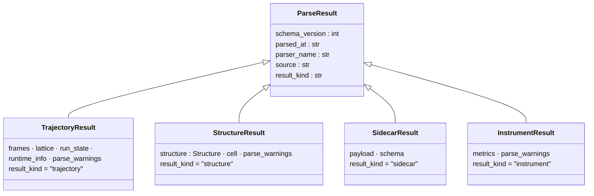
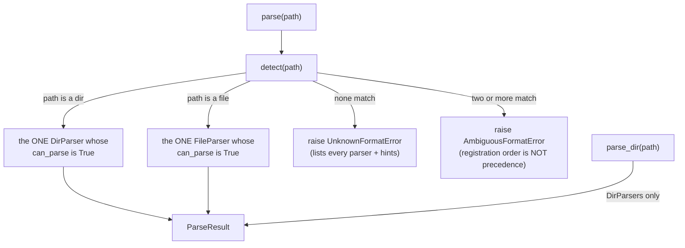
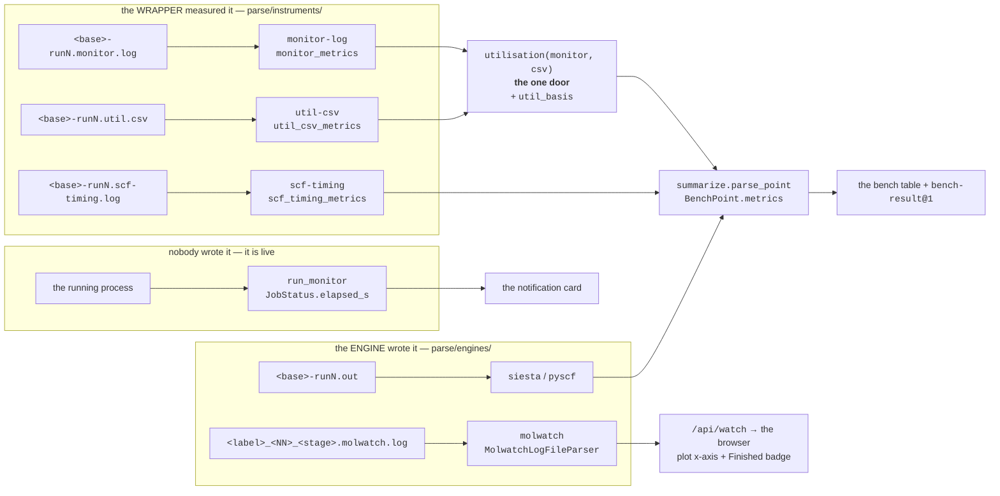

# The parse stack — turn a file or directory into typed data

**Role:** contract
**Domain:** model
**Module:** `molbuilder/parse/` · **Tests:** `tests/parse/` (~106 tests).
**Companions:** [`structure.md`](?doc=model/structure.md) (a `StructureResult` carries a `Structure`);
`engines/siesta.md` + `engines/pyscf.md` (the `.out`/`.log`/geometry formats the
leaf parsers read, migrating).  The **write** side (the inverse — turning data
back into files) is `sidecars/molstruct.py` and `script_emit.py`, not this
module.  *(A second DirParser, `BundleDirParser` → `BundleResult`, and the
`bundle_writer.py` write half retired 2026-08-29 with calculation-to-calculation
passing — a calculation that builds on a finished result CITES it and prep
composes; `execution/job-contracts.md` § 5 holds the closure.)*

One package answers a single question: **"what is in this path, as a Python
object?"** — for a file, a text body, or a whole run directory. It is the sole
read-side source of truth; every consumer (web blueprints, CLI, tests) imports
from here and queries the registry rather than knowing which parser to call.

> **Why it exists.** Before this, molbuilder had **four parallel parsing
> patterns** — a `TrajectoryParser` registry for engine output, ad-hoc
> `load(path)` functions for sidecar JSON, ad-hoc `read_*` functions for
> geometry, and ad-hoc `extract_*`/`decode_run_dir` for scripts and run dirs —
> with three different return-type flavours and no shared base. Each new engine
> or output type added another parallel path. This package collapses them into
> **three ABCs, one frozen-dataclass result hierarchy, and one registry**.

---

## 1. The two ABCs

`molbuilder/parse/base.py`:

| ABC | Input → output | Detection |
|---|---|---|
| **`FileParser`** | one file path → one `ParseResult` | `can_parse(path)` — the registry auto-detects |
| **`DirParser`** | one directory → one `ParseResult`, **composed** from per-file parsers plus directory-level invariants | `can_parse(run_dir)` |

Each declares `name` / `label` / `output` (the concrete `ParseResult` subclass
it returns); **`FileParser`s** also declare a `hint` (what to point at when
`can_parse` is `False`).

> **There were THREE until 2026-09-05.** `TextParser` took a text body and had
> **no detection** — the caller named the parser — which is the tell: an ABC in
> a package whose reason to exist is *"query the registry rather than knowing
> which parser to call."* All six of its implementations read molbuilder's OWN
> generated blocks, where there is nothing to detect and the caller always knows
> which block it wants, so each class wrapped a function in a ten-field result
> it did not need. They moved to the module that WRITES those blocks
> (`script_emit`'s extractors), which also removed a circular import the split
> had forced. [`plans/plan.md` § 5d](?doc=plans/plan.md).

---

### 1a. `parse/` is for FOREIGN formats — a block we wrote is its writer's

**The boundary, and why the module has a registry at all.** `parse/` reads
what something else produced: a `.out` that might be SIESTA or PySCF, a
`.XV`, a `.MD.nc`. Detection is the reason it exists — *every consumer
queries the registry rather than knowing which parser to call.*

**A reserved block in a molbuilder-generated script is not foreign.**
molbuilder writes it, into a file molbuilder generated, and every caller
already knows which block it wants. There is nothing to detect, so applying
detect-and-dispatch to a question with one possible answer buys ceremony and
no safety: the retired `ProvenanceTextParser.parse` was one line building a
ten-field result object to carry one dict. **A block belongs to its writer**
— `script_emit` owns the emitting and the reading of what it emitted, and
`execution/job-contracts.md` § 3.1 owns the format.

*Established 2026-09-05 by retiring `parse/scripts/` — six `TextParser`
classes and `ScriptResult` — and confirmed 2026-09-05 when the door built to
replace it (`read_script`) was found carrying a version gate the live readers
did not have: two answers for one block, and the door had zero callers for
three weeks. It was deleted rather than adopted. The extractors are the way
in.*

## 2. The `ParseResult` hierarchy

Every parser returns a **frozen dataclass** on a shared base
(`molbuilder/parse/types.py`). A consumer type-narrows by `isinstance` or by the
`result_kind` discriminator string.



**The four envelope fields are built in ONE place** —
`ParseResult.envelope(parser_name, source)`. Each sub-package's
`_helpers.py` filled them by hand until 2026-09-04, carrying four
byte-identical copies of the timestamp helper; `instruments/` added a
fifth without noticing, and `engines/siesta_mdnc.py` a sixth that bypassed
even its own package's builder. They agreed, which is the only reason
nothing had broken. The one exception is deliberate and says so in place:
the legacy-dict shim stamps empty strings, because it never parsed a file.

Plus **`ParseWarning`** (`types.py:36`) — a fail-soft warning (`source`,
`line_no`, `snippet`, `error`, `category`) any parser can attach to its result
instead of raising.

- **The discriminator.** Each concrete subclass sets `result_kind` to a fixed
  string (`"trajectory"`, `"structure"`, `"sidecar"`, `"script"`,
  `"instrument"`).
  Consumers holding a `ParseResult` (cached, or sent over the wire)
  `match` on it; JSON deserialisation reads it to pick a class. Adding a kind =
  a new subclass + a new discriminator value (rule below).
- **Why frozen.** No defensive copies at API boundaries; hashable (dict/set
  usable); trivial `asdict()` serialisation; `result == expected` test pinning
  with no `__eq__` override.

---

## 2a. Time fields name their clock

Engines report time in whatever frame of reference suits them. A `.molwatch.log`
carries the writer's own `time.time()`; a SIESTA `.out` carries `timer:` lines
counting from the start of the run and contains no time-of-day anywhere. **Both
are legitimate; neither is convertible into the other from the file alone.**

So the *field name* carries the frame of reference, and there is no neutral
name for "some time value".

**P-T1 — a time field names its clock.** No field is called `wall_time`. Every
time-valued field on a parse result ends in one of two suffixes, and the suffix
**is** the contract:

| suffix | quantity | answers | rendered as |
|---|---|---|---|
| `wall_clock_s` | absolute Unix epoch seconds | *at what time?* | a date |
| `elapsed_s` | seconds since the run began | *how far in?* | a duration |

Only a parser that read a real clock reading out of the file may fill
`wall_clock_s`.

**The suffix says WHAT; a prefix says WHICH WINDOW.** `elapsed_s` bare means
*since the run began* — that is the suffix's whole promise, and a duration
measuring some other span may not wear it unqualified. A narrower window
takes a prefix naming itself: `monitored_elapsed_s` starts when the monitor
starts and ends when the monitor stops, which is neither the run's start nor
its end, so the prefix is what lets the suffix keep its promise. The prefix
is not decoration and not a namespace — **if you cannot name the window, the
field is not ready to be added.** *(Written down 2026-09-06. It was practised
first: `wall_s` became `monitored_elapsed_s` on 2026-09-05 — a duration
wearing a date's name — and plain `elapsed_s` would have been wrong the other
way. The reasoning lived only in `util_csv.py`'s docstring, so a second
windowed duration had no rule to follow.)*

**What is NOT pinned: the rendered format.** P-T4 fixes the KIND — an epoch
renders as a date, a duration as a duration — and deliberately stops there,
because a terminal column and a browser badge have different room. The two
duration formatters differ today and neither is wrong under this contract:
`jobset/summarize.py::_fmt_duration` writes `4m05s`, `core.js::fmtElapsed`
writes `4m 5s`. Pin a format only if a reader is ever asked to compare the
two surfaces' output directly.

**P-T2 — `None` means "this engine cannot say", and is a correct final answer.**
A parser never converts one kind to fill the other's hole, and never substitutes
a value it did not read. SIESTA's `wall_clock_s` is `None` forever. That is
output, not missing data — and it is what lets a consumer fall back to the
file's `mtime` deliberately instead of rendering nonsense confidently.

**P-T3 — derivation happens once, downward only.** `elapsed_s` may be derived
from an epoch series (`t[i] - t[0]`), because a run's start is knowable from the
frames themselves. `wall_clock_s` may **never** be derived from `elapsed_s` —
the file does not contain the missing addend. Each derivation has exactly one
home:

| derivation | the one place it happens |
|---|---|
| `elapsed_s` from a frame's epoch series | `parse/engines/_helpers.py::trajectory_result_to_legacy_dict` |

No other layer computes either field.

There is **no** cross-stage derivation, and there is no place for one: stages
are separate runs and nothing joins them (`job-contracts.md` § 2.4). A row
here named the Watch blueprint's multi-stage merge as the one home for
`elapsed_s` "across chained stages" until 2026-09-05. That merge is
deleted — and the arithmetic that row blessed was wrong anyway: each stage's
log opens with a frame written at PREP time, so each stage's own elapsed
already contained the whole queue wait, and summing them counted it once per
stage. Measured: 61 minutes reported for a job that spanned 41 and computed
12.

**P-T4 — a consumer asks for the quantity it means, and takes `None` for an
answer.** Epoch is formatted as a date, elapsed as a duration, and neither as
the other — but formatting is only the most visible half. *Arithmetic counts
too*: the browser's per-iteration figure divides a cumulative time by
`cumulative_calls`, which is meaningful for a duration and is nonsense for a
date. So it reads `elapsed_s` alone and treats an epoch as absent.

> An accessor that returned *"whichever clock this cycle carries"* was written
> during the first pass at this rule and looked reasonable — a DIFFERENCE
> between two cycles really is the same either way, because the origin cancels.
> But its one caller was dividing, not subtracting, and the helper had just made
> molwatch cycles match a ladder that had always been SIESTA-only: a PySCF run
> read **"~489276.7h/iter (from SIESTA iter-1 timer)"**. A convenience that
> spans both clocks is a place for exactly this to happen; name the quantity
> instead.

> **Why this exists.** `Frame.wall_time` was one bare float that molwatch filled
> with an epoch and SIESTA filled with elapsed seconds. The field's docstring
> said "Unix epoch"; the browser formatted it as a date; a SIESTA run 360 s in
> displayed **"last result Dec 31, 5:06 PM"** — epoch zero plus six minutes.
> Elapsed still looked right, because subtracting two numbers cancels the error
> that made them wrong. A patch at the display would have left the same trap
> for the next reader of the field, and the same bug one layer down in
> `scf_history`, where the two engines had already diverged into
> `wall_time` and `cumulative_walltime_s` for the same quantity.

---

## 2b. How a run ENDED is not whether it succeeded

A parser reads a file and reports what is in it. **Whether the science is any
good is the reader's judgement, never the parser's** — and the moment those
two are conflated, the machine starts refusing to show data it holds.

That is not hypothetical. On 2026-08-25 the Results tab reported **six failed
trials and "0 done"** for a benchmark sweep that had run perfectly: every trial
directory held SIESTA's `0_NORMAL_EXIT`, every `.out` ended `>> End of run` /
`Job completed`, and every trial displayed a measured s/iter *beside the word
failed*. The cause was a benchmark deck doing exactly what a benchmark deck
must:

```
MaxSCFIterations  3
SCF.MustConverge  .false.
```

Three SCF steps, convergence explicitly **not required**, because what is being
measured is seconds per iteration. SIESTA printed `SCF_NOT_CONV:`, carried on,
and exited 0 — and the parser called it an error, because it had been taught
that not converging *is* failing.

**P-S1 — `run_state` answers HOW THE RUN ENDED.** It is a fact about the
process, drawn from markers in the file. It is not a grade. The vocabulary is
closed:

| value | means | evidence |
|---|---|---|
| `running` | still producing output | no ending marker (a `DirParser` confirms with file age — content alone cannot tell *running* from *died quietly*) |
| `ended` | the engine reached its own end | `>> End of run` — **that line only**. SIESTA prints `Job completed` beside it, and the corpus has no `.out` carrying one without the other, so a second marker would buy nothing and could fire on a line that merely mentions the phrase |
| `stopped` | it did not reach its end | an abort marker, or no ending marker and no growth |
| `out_of_memory` | the kernel or scheduler killed it for memory | an OOM marker |
| `unknown` | no evidence either way | unreadable, empty, or a format with no markers |

`stopped` carries `error_message` when the file says why (`propor: IMAX=0`, a
missing pseudopotential). `out_of_memory` is called out from `stopped` because
it is the most common cause and the most actionable — *"you ran out of
memory"* is the one sentence that tells a user what to change.

**P-S2 — convergence is REPORTED, never a verdict.** `scf_converged` is
`True` / `False` / `None` (never ran an SCF, or the format cannot say), and
**nothing derives `run_state` from it.** Not converging is a normal, frequent,
often *deliberate* outcome: a capped benchmark, a relaxation step mid-flight, a
scan that budgets its iterations. A reader composes the sentence —
*"ended · not converged · 3 iterations"* — from two independent facts.

> Before this rule, `last_scf_converged` had **no consumers at all** outside
> the parser. It existed only to flip `run_state` to `error`. The science was
> consumed to manufacture a verdict and then discarded, so no surface could
> report *"3 iterations, not converged"* even though the parser knew it.

**P-S3 — a parser never withholds what it parsed.** Frames, energies, forces,
timings and iteration counts are returned whatever the ending. "I cannot show
you this because it failed" is not a thing a parser is permitted to say — the
data is the answer, and the ending is one more field beside it.

*Verified, not asserted:* a `.out` cut off mid-run — no ending marker, no
final energy — still returns `frames=1` with its coordinates, its forces and
its one SCF cycle, alongside `run_state="running"`.

**P-S4 — one reader per question.** *"Did this run end, and how"* has exactly
one answer. A consumer that scans for `"Job completed"` itself has created a
second answer that will disagree — and one did: `jobset/summarize.py` carried a
private `_DONE_MARKERS` tuple whose own comment knew about the
`SCF.MustConverge .false.` case, while the parser it sat beside did not. The
bench summary asked both and rendered the wrong one.

**Where it lives, and why there are two doors onto it.**
`engines/_run_ending.py` owns the marker strings — `FATAL_MARKERS`,
`END_MARKER`, the SCF markers — and nothing else. Two callers share them:

| door | for | cost |
|---|---|---|
| `scan_ending(text)` | callers that want the ENDING and nothing else | one pass, **stdlib only** |
| `SiestaParser.parse(path)` | callers that want frames, energies, forces | builds arrays; needs numpy |

The split is a dependency and a cost, not a second opinion — the heavy parser
**builds its fatal rules from the same table**, so the two cannot diverge, and
`tests/test_run_ending_one_table.py` parses every frozen fixture both ways and
fails if they disagree on `run_state` or `scf_converged`.

Measured on a six-trial sweep of 152 KB files: **272 ms** through the full
parse, **21 ms** through the scan — on a bench summary that polls every 15 s and
needs one string field. A relaxation `.out` with hundreds of frames costs far
more. That is the whole reason the cheap door exists; correctness is what the
shared table protects.

## 3. The registry + public API

`molbuilder/parse/__init__.py` re-exports the whole surface; the dispatch lives
in `registry.py`.



| Function (`registry.py`) | Does |
|---|---|
| `detect(path)` | return the parser whose `can_parse(path)` is `True` — **DirParsers when `path` is a directory, FileParsers when it is a file** (no dir→file fall-through); `UnknownFormatError` if none match / `AmbiguousFormatError` if more than one does, both listing every registered parser + the standard foot-gun hints |
| `parse(path)` | `detect` + `parse` in one call |
| `parse_dir(path)` | detect among **DirParsers only** — for callers whose contract is "this is a run directory". One is registered since **2026-09-18**: `JobDirParser` (§ 5). *(It raised for every input between 2026-09-04 and then, the registry having been emptied by a deletion; and it named "JobMonitor, Results" as its callers until 2026-09-05, neither of which ever called it.)* |
| `register(parser)` | add a parser at module-init time (idempotent; not for runtime registration) |

**Errors** (`errors.py`): `UnknownFormatError` and `AmbiguousFormatError`, both on a `ParseError`
base.

*(These rows pinned a line number each until 2026-09-05. Three of the five
were eight lines stale — the exact length of a docstring paragraph added
the day before. A line number is a pin: it measures where a thing sits
rather than what it does, and it rots on the next edit of a file this
document does not own. The function name is the anchor and it is
greppable.)*

### Using it — worked examples

**Parse a file** — detect + read, narrowing on `result_kind`:

```python
from pathlib import Path
from molbuilder.parse import parse

r = parse(Path("projects/BDT/optimization/BDT.out"))
if r.result_kind == "trajectory":            # a SIESTA / PySCF / molwatch .out
    last = r.frames[-1]
    print(last.energy, last.max_force)        # eV, eV/Å (either may be None)
    print(r.run_state)      # § 2b: "running"|"ended"|"stopped"|"out_of_memory"
    print(r.scf_converged)  # True | False | None -- a FACT, not a verdict
elif r.result_kind == "structure":           # a .XV / *_optimized.xyz
    print(len(r.structure.elements), r.cell)  # atom count, 3×3 cell or None
```

**Read a sidecar:**

```python
r = parse(Path("water.molstruct.json"))       # -> SidecarResult
print(r.schema, r.payload)                     # e.g. "molstruct/v6", {...}
```

**Ask how a run directory is doing** — not a parse, a small verb over
several parses (`running-a-job.md` § 4.2):

```python
from molbuilder.parse.dirs.job import run_status

run_status(Path("projects/BDT/optimization/run-0"))
# {"state": "finished", "detail": "job_completed",
#  "last_change_at": "...", "active_source": "BDT-run0.out"}
```

**Extract the reserved blocks from a `.fdf` / `.py` body** — **not this
package.** The blocks are molbuilder's own, so they are read by the module that
writes them:

```python
from molbuilder.script_emit import (_extract_atom_metadata_dict,
                                    _extract_provenance_dict)

_extract_atom_metadata_dict(fdf_text)   # the block dict, or None if absent
_extract_provenance_dict(fdf_text)      # the PROVENANCE block, or None
```

*(A `read_script(text) -> ScriptSource` door stood here until 2026-09-05. It
had zero callers for three weeks while carrying a schema-version gate the
live readers do not apply, so the tree held two answers for one block; it was
deleted rather than wired up. The extractors are the way in — they are
underscore-named and not in `__all__`, which is an inconsistency worth
resolving, not a signal to build a second door.)*

**Skip detection when you already know the type** — call the parser class's
`parse()` directly, which is what `run_status` does for each result file it
already knows the shape of.

---

## 4. Package layout

```
molbuilder/parse/
├── base.py        # the 2 ABCs                (FileParser / DirParser)
├── types.py       # ParseResult + 5 subclasses + ParseWarning
├── registry.py    # _REGISTRY, detect/parse/parse_dir/register
├── errors.py      # ParseError, UnknownFormatError, AmbiguousFormatError
├── contract.py    # what a DIRECTORY records about itself:
│                  #   contract_of  — the electronic contract its deck states (§ 5b)
│                  #   engine_of    — WHICH ENGINE RAN (`running-a-job.md` § 4.2)
├── ion.py         # SIESTA .ion basis reach (read by transport/compose.py)
├── _log.py        # parse-side logging helper
│
├── engines/       # engine .out / .log → TrajectoryResult (FileParsers)
│   ├── siesta.py · pyscf.py · molwatch.py
│   ├── siesta_mdnc.py         # <label>.MD.nc (netCDF) — sibling upgrade, § 5a
│   ├── _run_ending.py         # HOW A RUN ENDED — the markers, § 2b
│   ├── _helpers.py            # Trajectory → TrajectoryResult adapters
│   └── _section_rules.py · _sidecar.py   # shared extraction helpers
│
├── coords/        # geometry files → StructureResult (FileParsers)
│   ├── siesta_xv.py           # .XV / .STRUCT_OUT (+ cell)
│   ├── pyscf_geom.py          # *_optimized.xyz
│   └── _helpers.py            # StructureResult envelope
│
├── instruments/   # what the WRAPPER measured → InstrumentResult (FileParsers)
│   ├── scf_timing.py · monitor.py · util_csv.py
│   ├── utilisation.py         # the § 5a resolver: monitor's means over the csv's
│   └── _helpers.py
│
├── sidecars/      # molbuilder JSON sidecars → SidecarResult (FileParsers)
│   ├── molstruct.py · spectra.py · transport.py
│   └── _helpers.py
│
│
└── dirs/          # directory composers (DirParsers)
    ├── job.py                 # run_status → how a run directory is doing
    ├── run_info.py            # run_info_for_dir → the `info` block (composer)
    └── atom_metadata.py       # ATOM-METADATA for a run dir (read by web/watch)
```

> **Plain `.xyz` has no leaf FileParser (by design)** — reading it uses
> `Structure.from_xyz` directly (see [`structure.md`](?doc=model/structure.md)).
>
> **And a deck's initial coordinates are not read at all** *(2026-09-06)*.
> `dirs/_assembler_helpers.py` held that — `.fdf` and `.py` coordinate-block
> readers, the label extractors, the handedness checks — described here as
> "used by the DirParsers". **Nothing used them.** Their real consumer,
> `script_bundle.assemble_from_run_dir`, was deleted 2026-06-21; the module was
> kept on the claim above, and § 5.0 then specified `RunDirResult` as seven
> fields — `run_dir`, `engine`, `files`, `active`, `openable`, `attempts`,
> `status` — none of which is a geometry, a label, or a diagnostic, under the
> rule *"no field is added without naming its reader in this table."*
>
> **The app never needs a deck's geometry**, which is why nobody noticed: the
> starting structure reaches a viewer as the trajectory's **frame 0** — *"the
> `.out`'s own frame 0, the structure the user submitted"* (§ 5c) — from the
> same file every later frame comes from. Deleted with its six helpers, both
> re-export blocks in `coords/`, and seventeen tests. `read_xv` and
> `read_optimized_xyz` are unaffected; they are the live readers.

---

## 5. Composer pattern — the DirParser

A DirParser turns a whole run directory into one result. `JobDirParser` is the
composer for questions that genuinely need the WHOLE directory.

> **It is not "the one door everything goes through", and that sentence stood
> here until 2026-09-18.** `plan.md` § 5c withdrew five of its six caller rows
> **with measurements**: `run_status` asks per-RUNG, `_engine_of` is a fallback
> whose first source is already the one `engine_of` (and two of its three sites
> have no directory), `summarize` picks a run INDEX for an already-chosen
> stage. Routing those through a composer means parsing a whole directory to
> obtain one string — which is what got the predecessor deleted. The honest
> rule is the narrow one: **a question that must see the whole directory comes
> here; one that does not, does not.**

> ### Built 2026-09-18 — and the callers have not all moved yet
>
> `RunDirResult` (`parse/types.py`) and `JobDirParser` (`parse/dirs/rundir.py`)
> ship, the parser is registered, and `parse_dir(<a run directory>)` answers.
> § 5.2's chain was absorbed **verbatim** into `rundir.openable_in`, proved
> identical on all 141 run directories in the checkout before a single caller
> moved — the same gate the `run_status` split passed (113/113) before its
> deletion was allowed.
>
> **The duplicate is gone (step 2, 2026-09-18).** `web/blueprints/watch.py`
> called `openable_in` and its own 132-line copy of the chain was deleted, with
> the five helpers that served only it — 166 lines out of the web layer. § 5.2
> has one home.
>
> **The other five rows of § 5c's caller map were WITHDRAWN, measured** — not
> deferred. Each turned out to be a question this door does not answer: see
> [`plan.md` § 5c](?doc=plans/plan.md). The short of it is that `run_status`,
> `engine_of` and `runfiles.find` each already had exactly one home, and going
> through the door would have meant parsing a whole directory to get one
> string — which is what the deleted predecessor did.
>
> *This section was written in the present tense on 2026-09-04 describing a
> door that raised, in a file whose role is `contract`, and carried no marker
> saying so until 2026-09-05 — so a reader met a governance rule ("no field is
> added without naming its reader") that had no subject. The marker goes now
> that the subject exists; the honest half of it, above, stays until step 4.*

> **Its predecessor was deleted on 2026-09-04 and this is not a reversal.**
> That one answered eleven fields; ten had no reader anywhere in the tree, and
> the eleventh was reached by parsing every `.out` to build plot data and then
> discarding the plots. What returns has the same name because the name was
> always right — it *is* the directory composer — but every field below is
> written against a caller that exists today. `running-a-job.md` § 4.2 has the
> measurement that justified the deletion; this section is what the deletion
> made room for.

### 5.0 The result — four questions, four readers

```python
@dataclass(frozen=True)
class RunDirResult(ParseResult):
    run_dir:  str                       # resolved
    engine:   str                       # "siesta" | "pyscf" | "unknown"
    files:    Dict[str, List[Path]]     # kind -> paths, sorted
    active:   Optional[str]             # FILENAME -- which file the STATUS speaks for
    openable: Optional[str]             # PATH -- which file a VIEWER should load
    attempts: List[str]                 # what was tried, for the refusal
    status:   Dict[str, Any]            # state · detail · last_change_at · active_source
```

**`active` is a bare filename and `openable` is a path, deliberately.**
`active` is `RunStatus.active_source` unchanged, and that value is serialized
into the status envelope the browser reads — a server-side absolute path has
no business crossing that line, and the directory it is relative to is
`run_dir`, right beside it. `openable` is handed to a reader that opens it.
They are the same *kind of thing* and not the same *value*, which is § 5.1's
distinction showing up in the types; a caller composes `run_dir / active` when
it wants the path. *(This block declared both as `Optional[Path]` until
2026-09-18, which was true of neither.)*

| field | the question | who reads it |
|---|---|---|
| `engine` | which engine ran | `/api/watch/*`'s `format` |
| `status` | how is it doing | `jobset/runstatus.py` per stage |
| `files` | what is here | `jobset/summarize.py` per trial; the discovery chain |
| `active` | which file speaks for the run | the status combiner; `summarize`'s per-trial pick |
| `openable` + `attempts` | what should the viewer load, and what was tried | `web/blueprints/watch.py` |

**No field is added without naming its reader in this table.** That is the rule
the deleted version broke.

> **Measured 2026-09-18: ZERO of the SEVEN fields have a production reader,
> and this table must not be read as if any do.** `web/watch` reaches the
> chain through the module-level `rundir.openable_in`, which returns a tuple —
> so not even `openable`/`attempts` are read *as fields of this type*. No
> `RunDirResult` is constructed outside the tests, and `parse_dir` has no
> production caller at all. **Partly overtaken 2026-09-18**: `/api/results/dir`
> is the Results tab's door and serves `engine`, `status`, `openable` and a
> per-file `role`/`parser` — the four questions, to the consumer this type
> was built for. It composes the readers directly rather than calling
> `parse_dir`, so the TYPE still has no production constructor and the row
> below stands; what changed is that the answers now reach a screen
> (`plans/plan.md` N9). *(An earlier version of this note said "four of
> six … `openable` + `attempts` are live". Both halves were wrong, and the
> table below has five rows for seven fields — `run_dir` and `status` have no
> row.)*
>
> That is not drift, it is the migration's shape: § 5c's step 2 withdrew
> five of its six caller rows with measurements (each was asking a question
> this door does not answer), leaving one consumer — the Results file
> picker — which is NOT a consumer of this door.  Its question is the
> LADDER's (*"these five directories are one run"*), answered by
> `jobset/runstatus.py::jobset_status`, and served to the browser by an HTTP
> surface over THAT.  `plan.md` § 5c is closed and that row is struck; the
> surface belongs to § 5p.3p.  **So these four fields have no reader owed to
> them by § 5c** — if nothing else claims them they go, which § 5c says.
>
> **The rule above stays enforced prospectively**: a field is still added only
> against a named reader. If that surface is never built, these four fields go
> with it.

### 5.1 `active` and `openable` are different questions

They look like one and are not, and conflating them is the trap this section
exists to mark.

- **`active`** is *whose run-state is this directory's status*. It considers
  **result** files only: every `.out`, plus each `*.molwatch.log` **whose
  footer concludes the run**. A log without a conclusion is a live view, and
  letting it vote would let a prep-time seed outrank a real `.out`.
- **`openable`** is *what should a person see*. It **prefers** an unconcluded
  molwatch log — that is exactly the run in progress somebody wants to watch.

So a directory mid-run has an `openable` and no `active`; that is correct in
both directions.

**`active` is picked by stage, then mtime** *(user ruling, 2026-09-04)*.
Within one directory, a re-run of an earlier rung must not hijack the run's
reported state, and only the stage ordinal can say so — the run index cannot.

> **What this paragraph used to claim, and why it was withdrawn.** It named
> `summarize._latest_run_file`'s highest-`-runN` rule as a *competing* rule
> that "loses". It is not competing: `_latest_run_file` is handed a basename
> that **already carries the stage** (`Path(job.script).stem`), so the stage
> is not a variable there and the run index is the only remaining choice.
> `plan.md` § 5c withdrew that row on 2026-09-04 as one of two mappings
> "invented by me and caught by re-reading the code" — **and this paragraph
> was not swept with it**, so for two weeks the contract told a reader to go
> change a function the plan had measured as correct. Corrected 2026-09-18.
>
> A third spelling does exist and is in neither document:
> `transport/record.py` picks the newest `.out` by **mtime alone**, twice.
> It agrees with this rule in practice — a transport calculation is refused
> unless its shape is hierarchical (`task.py`), so each rung has its own
> directory and there is only one stage to order — but it is a third place
> the question is answered. Recorded in `plan.md` § 5c.

### 5.2 `openable` — the CALCULATION decides, and the registry vets

*(Rewritten 2026-09-18. This section described a four-rung ladder and was
titled "unchanged in behaviour", which was true of the move out of the web
layer and stopped being true the day the ladder was replaced. § 5.5 carries
the rule; this is where it is applied.)*

`parse/dirs/rundir.py::openable_in` asks **four** questions of four owners, and
the first one decides whether the other three apply at all:

| question | owner | reader |
|---|---|---|
| **what is this directory?** | the **directory** | `calcdir.json`, or `task.json` at a root |
| what calculation is this? | the **calculation** | `of` → its `task.json` |
| what does it produce? | the **catalogue** | `runfiles.result_roles` |
| can anything open it? | the **registry** | `detect()` |

> **THE FIRST QUESTION IS NEW, AND THE OTHER THREE WERE ASKED WITHOUT IT**
> *(2026-09-19)*. This table had three rows and the first read *"what
> calculation is this? — the **directory** — `task.json`"*. The code took that
> at its word and read `task.json` from the handed directory, which is the
> right place only in the FLAT shape: `project-layout.md` § 1.0 puts the
> description above the run-directory wall, so in the hierarchical shape it is
> two levels up. Every hierarchical spectrum run therefore opened its molwatch
> stub. The first repair walked up to the nearest ancestor holding `task.json`,
> fenced by the `projects/` tree and a depth cap — a search with a tuned
> number, standing in for a fact the tree could simply state. **`project-layout.md`
> § 1.4a now has the directory state it**, and the walk and its
> constant are deleted.
>
> Asking *what is this directory* first is what stops the other three being
> asked of something that is not a run: § 1.4's container-or-run rule is
> answerable now, so a stage directory is not parsed for a result it does not
> hold, and a `pseudos/` folder is not reported as a calculation in progress.

**"I don't know" is one of its answers, and it narrows the other three rather
than refusing them** (`project-layout.md` § 1.4a). A directory with no record —
one written before this rule, or an attempt copied out of its calculation — is
read ALONE: its files, which of them a parser claims, which one to open, and
how its run ended if one did. What it cannot answer is everything relational —
which calculation, which rung, which siblings — and **the door says which of the
two answers it is giving**, so a partial answer is never mistaken for a
complete one. The three that remain are directory-local questions and were
always answerable without help.

**There is no preference order to tune.** A vibration run is *for* its
`.spectra.json`; an optimization for its trajectory; a transport calculation
for its `.transport.json`. The same file is the live view during the run and
the result after it, so nothing switches at conclusion — the old rung 1,
*"any `.molwatch.log`, newest wins"*, was an optimization-shaped rule applied
to every kind, and it sent every spectrum run's viewer to a progress log
holding one `initial_preview` block.

**A file `detect()` refuses is never offered.** That is § 5.5's two questions
applied to one answer, and it is load-bearing: the chain used to return
`<job>_<stage>.log` — PySCF's verbose logger, which no parser claims — and
the caller's next step was `detect()`, which refused it.

**What remains a search** is a directory that does not say what it is: the
deck is read for a label and the label's files are looked up through
`runfiles.find`, which knows the attempt counter. Role first, then newest —
and the order between those two is the rule, because a role says what a file
IS while mtime only says which one. Every candidate goes through the registry
either way.

`attempts` carries the trail. It is not decoration: it is the body of the
refusal a person reads when nothing matched, and it moves with the search so
the message cannot drift from it.

### 5.3 What this door does NOT own

**A file parser finding its own companion stays where it is** — § 5a's sibling
upgrade. `engines/_sidecar._siesta_fdf_path_for`,
`engines/_sidecar.read_frozen_atoms`, `engines/pyscf._resolve_job_token` and
`engines/siesta_mdnc.sibling_md_nc` each locate one file from another *of their
own format*. Folding those in would make every engine parser depend on the
directory composer, inverting § 5's own rule that a DirParser composes
FileParsers and never the reverse.

The test is: **does the question need to see the whole directory?** "Which
file is the status" does. "Where is my `.out`'s `.fdf`" does not.

> **And the shape they share is: compose the exact name, then fall back to a
> LONE file of that kind in the directory.** `_siesta_fdf_path_for` has done
> both since 2026-06-14. `read_frozen_atoms` had only the first until
> 2026-09-17, and so returned nothing for **every laddered calculation** — the
> sidecar is written once per calculation and stemmed on the bare label, so no
> name composed from `bdt_01_coarse` can reach `bdt.molstruct.json`. Listing a
> directory is not "seeing the whole directory" in this section's sense: the
> question is still *where is my companion*, answered without parsing anything
> else.
>
> **The fallback is licensed by `project-layout.md` § 1.4** — a directory is a
> container or a run, and a run holds *"what that invocation produced, and
> nothing else holds that"* — so a lone sidecar beside an artifact is that
> run's. It is guarded on both sides: the lone file's label must be a prefix of
> the artifact's on a `_` boundary, and **two candidates decline rather than
> pick**. Guessing from the NAME stays forbidden, because it is undecidable —
> measured: `runfiles.parse` reads a stage token off both `bdt_01_coarse` (rung
> `01_coarse` of `bdt`) and `sample_02_test` (a whole label), so no rule over
> the filename separates them.

### 5.4 Every DirParser must

**walk** the directory, **compose readers that own their formats**, and
**apply cross-file invariants** no single reader can see — atom-count
consistency, lattice handedness, stage ordering, the status state machine. It
must **never implement a format inline**: add the missing reader instead.

**Which reader depends on the QUESTION, and there are two families.**

| question | owner | why not the other |
|---|---|---|
| *what typed result does this file hold?* | the **registry** — `detect`+`parse` | it is the only thing that may decide WHICH parser, so a registration change propagates |
| *how did this run end?* | `parse/engines/_run_ending.py::ending_of` — one reader per ROLE | it is a substring scan, and the registry's answer costs a whole `Trajectory` to reach one string |

*(This said "dispatch each file through the registry" for every file until
2026-09-18, and the code stopped obeying it that day for a measured reason:
`run_status` read each result through `detect(path).parse(path)`, building
every Frame as numpy arrays and discarding them to keep one field — 8.5×
slower over 119 real directories, and it opened a `ParseLogger` per file, so
merely LOOKING at a folder wrote a `.parse.log` into it. The rule is
corrected rather than the code, because the rule was the one that was wrong:
"go through the registry" is the answer to WHICH PARSER, not to every
question a directory asks about a file.)*

*(A second parser, `BundleDirParser` → `BundleResult` — the run-dir →
next-calculation handoff fuse — stood beside it until 2026-08-29 and retired
with calculation-to-calculation passing: a calculation that builds on a
finished result CITES it, and prep composes — `transport/compose.py`.)*


### 5.5 A run's output, and what a person can open — two questions

*(Written 2026-09-18, after PySCF's stdout was found to be collected by
nobody and read by nobody: three finished runs reported `running`, the oldest
for 97 days, and the viewer offered nothing to open. All three are
spectrum decks, which write no molwatch log — so the only evidence of how
they ended was the one file nothing read.)*

#### The two questions are different, and they have different owners

| | *what is this run's OUTPUT?* | *what can a PERSON open?* |
|---|---|---|
| owner | the **catalogue**, `runfiles.WRITTEN` | the **registry**, `detect()` |
| decided by | a declared column | a parser's `can_parse` |
| example that is one and not the other | `.pyscf.log` — output; **no parser claims it** | `.spectra.json` — openable; **not run output** |

**Conflating them is the trap.** A discovery chain that "asks the catalogue"
hands the viewer a file `detect()` refuses; a status probe that asks the
registry misses the stdout that says how the run ended. **Neither question
gets the other's answer, and `openable` gets no catalogue column.**

#### A run directory holds four logs. They are not interchangeable.

| file | what it is | the question it answers |
|---|---|---|
| `<job>.log` | the engine's OWN logger | SCF history, read as a companion |
| `<job>_geom_optim.xyz` | the trajectory | frames — `PySCFOutFileParser` claims this, **not** the stdout |
| `<job>.molwatch.log` | molbuilder's progress log, SEEDED at prep | live progress; how it ended *once its footer concludes* |
| `<job>-runN.pyscf.log` / `.out` | the wrapper's **stdout capture** | **how the run ended** — finished, crashed, killed |

#### The vocabulary — one column, three values

```python
class Artifact:
    #: Does this file carry evidence of how the run went, and of which kind?
    #:   "stdout"   -- exists because the PROCESS started, so it speaks
    #:                 whether or not it has ended.  Block-buffered: its
    #:                 mtime is NOT liveness.
    #:   "progress" -- SEEDED at prep, so it speaks only once its footer
    #:                 concludes; otherwise a seed outranks a real result.
    #:   None       -- not run evidence.  It may still be VIEWABLE, which is
    #:                 the registry's question, not this column's.
    output: Optional[str] = None
```

Three rows carry it: `.out` (`stdout`, and it gains the `engine="siesta"` it
lacks), `.pyscf.log` (`stdout`), `.molwatch.log` (`progress`). Derived views
beside the catalogue's other views: `run_output_roles()`, `stdout_roles(engine=None)`,
`engines()`.

**Why a column and not a boolean.** `output == "stdout"` **is** § 5.1's rule
*"an engine's stdout speaks before it ends; a seeded log does not."* A boolean
would force `run_output_roles()` to append `.molwatch.log` as a literal —
putting membership back in a function while the row says nothing, which is
the split that caused this.

#### How a file ended — one reader per ROLE, never per engine

```python
READERS = {".out": …, ".pyscf.log": …, ".molwatch.log": …}
def ending_of(path) -> RunEnding      # role from `runfiles.canonical_role`
```

**Dispatch is on the role. That is load-bearing:** a directory whose engine is
unknown, or which holds two engines' outputs, needs no special case — each
file is read by its own reader and § 5.1 picks the speaker.

**A format molbuilder GENERATES does not get a sniffed reader.** Its end line
is a string we print, so the **emitter declares the constant and the reader
imports it** — the `ROLE_GEOM_TRAJ` pattern (`parse/dirs/rundir.py:50`).
PySCF's failure shapes are its own (`SystemExit` at `pyscf/input.py:378`, a
traceback); SIESTA's `FATAL_MARKERS` are **not** shared — measured over 135
real output files, its five OOM markers fire 0 times and the three that do
fire are SIESTA's alone.

#### Liveness is not the speaker

`active` is § 5.1's pick — highest stage, newest mtime, concluded results
only. **Staleness is measured on the FRESHEST run-output file**, because an
engine's stdout is block-buffered: a real PySCF log grew 13 KB across 146 s,
two flushes in the whole run. Asking the speaker's mtime reports a live run
as stale.

#### The rules

**R-RO1 — the vocabulary binds WRITERS AND READERS.** No code outside
`runfiles` may spell a run-output role: not a tuple, not an `.endswith`, not
a glob, **and not a line of generated text.** The writer half is not
hypothetical — `pyscf/input.py:261` prints an instruction telling a person to
redirect PySCF's stdout to `.out`, the one spelling that disagrees with the
wrapper. A generated program (shell, an emitted script, browser JS) takes its
roles from the Python site that renders it, and **that site is bound.**

**R-RO2 — one import surface per question.** Everything asked about a run
directory is imported from the package that owns it: `molbuilder.parse.dirs`
for status, discovery and the directory's own account of itself;
`molbuilder.parse.contract` for the engine and the recorded contract. Never
from `parse.dirs.job` or `parse.dirs.rundir` directly.

#### What a viewer should open — the CALCULATION decides

The door's fourth question is answered the way the other three are: by
delegation, not by a ladder.

| question | owner | reader |
|---|---|---|
| **what is this directory?** | the **directory** | `calcdir.json`, or `task.json` at a root |
| what calculation is this? | the **calculation** | `of` → its `task.json` |
| what does it produce? | the **catalogue** | `runfiles.result_roles` |
| can anything open it? | the **registry** | `detect()` |

**There is no preference order to tune.** A vibration run is *for* its
`.spectra.json` — the deck rewrites it atomically at each phase boundary and
it carries its own `phase_*` flags, so it is the live view during the run and
the result after it. An optimization is for its trajectory. Neither switches
at conclusion: *"an unconcluded progress log first"* was an
**optimization-shaped rule generalised to every kind**, and it sent every
spectrum run's viewer to a molwatch log holding one `initial_preview` block
(measured on a CO2 spectrum run: 1340 bytes, header + one block + footer — a
spectrum has no geometry sequence to log).

**The door never offers a file `detect()` refuses.** That is this section's
two questions applied to one answer: *what is a run's output* is the
catalogue's, *what can a person open* is the registry's. Until 2026-09-18 the
chain returned `<job>_<stage>.log` — PySCF's verbose logger — and the
caller's very next step was `detect()`, which refuses it.

#### The door STAYS; only the route through `detect()` is in question

*(Corrected 2026-09-18. This section said "the bundle is deleted", naming
`parse_dir`, `RunDirResult`, `JobDirParser` and the `DirParser` ABC together.
That is four unlike things under one word, and it read as "delete the
framework" — which is the opposite of what is being built.)*

`JobDirParser` **is** the front door: it composes `run_status`,
`_enumerate_files`, `engine_of` and the discovery chain into one answer, and
`RunDirResult` is that answer's shape. Both stay, and the work is **wiring
consumers to them** — zero callers today is a migration that has not happened,
not evidence the door is unwanted.

What is genuinely a defect is narrower: a **directory** goes through the same
`detect()` the file verbs call. `_DIR_PARSERS` was empty, so `detect(<dir>)`
refused cleanly; once `JobDirParser` was registered it returns a
`RunDirResult`, which has no `.frames`, and three CLI verbs broke — one into a
silent infinite hang. That is an argument about **the route**, not the
composer, and those verbs are already fixed properly: they ask
`answers_a_trajectory()` instead of assuming.

#### Adding an engine: two edits

One `runfiles.WRITTEN` row (`engine=`, `output="stdout"`), and one entry in
`READERS` whose reader imports that engine's emitter constants. Nothing else
is touched. **Today the same addition touches fourteen sites** across two
questions, and the generated deck's banner is wrong by default.

#### Enforcement

`set(READERS) == set(runfiles.run_output_roles())` — one test, and it is what
keeps "two edits" true across the layer split. The rest of R-RO1 is a review
obligation, not a lint: a source grep that hunts hand-written call sites is
disqualified by `process/` convention, and the scope is `molbuilder/**.py`
only — a fixture must be allowed to spell a real filename.


## 5b. The recorded contract — one deck defines the answer, or there is none

`contract.contract_of(directory)` reads back **what a finished calculation was
actually run with** — the `info.calculation` block: the engine, the fields the
deck states (and only those), the deck's name, and its `sha256`.

**Exactly one `.fdf` in the directory, or `None`.** Zero decks is nothing to
read; two is a question the directory cannot answer, and picking one would be
a guess wearing the look of a fact — the recorded contract's whole value is
that it is *what ran*, so an answer that might be the other deck's is worth
less than no answer.

> **The same condition, two different answers, and both are right.** Transport
> asks it as a REFUSAL ([`transport.md` § 3.1](?doc=engines/transport.md)):
> you are citing that directory on purpose, so an ambiguous one is a mistake
> to tell you about. Here it is a `None`: the caller is enriching a result it
> already has, and a missing contract block is an ordinary state, not a
> failure. A refusal would make every un-recordable directory an error at a
> layer that is only ever adding detail.

## 5a. Sibling upgrade — when a second file sharpens the first

Some engines write the *same* physics twice: once into the human-readable log,
once into a structured sidecar. When they do, the parser for the log reads the
sidecar and **replaces values in frames it already built** — it does not build
a second trajectory.

Three parsers do this today:

| primary | sibling | what the sibling supplies |
|---|---|---|
| `engines/pyscf.py` | `<prefix>.qdata.txt` | per-step max force |
| `engines/pyscf.py` | `<base>.molwatch.log` | convergence targets, run state |
| `engines/siesta.py` | `<label>.MD.nc` | coordinates + per-step energy, in full precision |

**The rules, which are what keep this from becoming a second source of truth:**

1. **The primary file owns the frame list.** Count, order and indexing come
   from the log and are never re-shaped. The sibling only swaps values into
   frames that already exist.
2. **Absence is ordinary.** No sibling, an unreadable one, or one that matches
   nothing must parse *exactly* as the primary alone. A sidecar is an
   improvement, never a dependency — so a run from a build that doesn't emit
   it loses nothing.
3. **Never invent.** A field the sibling lacks stays as the primary had it
   (or stays `None`); it is never back-filled from a neighbouring step.
4. **Say what happened.** Record the upgrade in `runtime_info` — which file,
   how many frames changed — so a surprising number in the UI can be traced to
   a file rather than to a guess.

### The SIESTA case, and the trap in it

`<label>.MD.nc` is netCDF, written whenever `WriteMDhistory` is on and the
binary was built with `-DCDF` (both true for the packaged `molbuilder-siesta`).
It matters because the `.out` is a Fortran-formatted text file: it prints
`E_KS(eV) = -30.4405` — **four decimals**, coarser than the step-to-step energy
change near convergence — and its fixed-width columns collide when values grow
(`-1.929956131.029438`) or overflow to `**********`, which is why
`engines/siesta.py` carries both a separator-inserting regex and a structural
column slicer. Typed netCDF arrays have neither failure mode.

**But a `.MD.nc` row is not a step.** Measured on a real relaxation
(2026-08-15):

```
row k :  xa   = the geometry AFTER move k+1   ("predicted", per the manual)
         etot = the energy OF geometry k      (the one just evaluated)
```

Pairing them by row index — the obvious implementation — attaches every
geometry to the previous geometry's energy. Nothing raises, the frame count is
right, and on a converging run the plot still looks reasonable. The correct
pairing is `xa[k]` with `etot[k+1]`, and the last row has no energy yet.

Two more properties shape the reader:

- **There is no row for the input geometry.** So the merged trajectory keeps
  the `.out`'s own frame 0 — the structure the user submitted, and the frame
  every other one is read against.
- **The file accumulates across runs** (SIESTA appends on restart). Frame index
  is therefore not run-local, which is why `align_to_reference` matches on
  **coordinates** rather than doing index arithmetic: a hardcoded lag is right
  on a fresh run and wrong on every warm one.

Units come from each variable's own `unit` attribute (`xa` is Bohr while
`volume` is `Ang**3` *in the same file*), and an unrecognised unit is refused
rather than assumed — a wrong factor is invisible in the result and wrong by a
fixed ratio in every number downstream.

Reading uses `netCDF4` when present and falls back to `scipy.io.netcdf_file`;
both are exercised by the tests, because `molbuilder-pySCF` has scipy and no
netCDF4.

---

## 5c. Instruments — what the WRAPPER measured, not what the engine wrote

`parse/engines/` reads what the *engine* produced. The **wrapper** measures
the run too, and writes three files of its own beside the deck
(`running-a-job.md` § 4.1): `<base>-runN.scf-timing.log`,
`<base>-runN.monitor.log`, `<base>-runN.util.csv` — all three indexed by
attempt, so a re-run neither appends to nor truncates the previous one.

They were outside this module until 2026-09-04 — `bench/result.py` opened
and regex'd their bytes itself, which is a second read stack for a class of
file the first one simply had never been extended to. Being the wrapper's
output rather than the engine's is not a reason to read them a different
way.

**`InstrumentResult` carries `metrics`, a one-level dict of what the
instrument measured** (plus the `parse_warnings` every result has). One
level, not one type: a value is a number where the instrument measured a
number, a string where it read a word the wrapper wrote (`bound` is
`"host"` / `"gpu"`, `util_basis` names a source), and the `[MACHINE]`
line's `node` / `cores` / `mem_gb` / `gpu` arrive as one `machine` dict
because they are one reading of one line and splitting them into four
sibling keys would let three survive a partial parse.

*This said "a flat dict of measured numbers, and nothing else" when it was
written on 2026-09-04, before the three parsers were finished. They never
matched it, and the § 2 class diagram on this page showed
`parse_warnings` on the class while this sentence denied it.*

It is not a `SidecarResult`: that one is a JSON payload plus a schema
discriminator, and stamping `result_kind: "sidecar"` on a `.log` would be
the same conflation `running-a-job.md` § 4.2 forbids between an engine and
a format. What separates them is the SOURCE — an instrument reads what the
wrapper measured, a sidecar reads what molbuilder serialised — not the
shape of the payload.

| file | parser | what it measures |
|---|---|---|
| `*.scf-timing.log` | `scf-timing` | steady-state seconds per SCF iteration |
| `*.monitor.log` | `monitor-log` | the `[MACHINE]` line (§ R12), the `[UTIL-SUMMARY]` verdict, and the monitor's OWN stated means |
| `*.util.csv` | `util-csv` | the raw utilisation samples |

**The monitor sharpens the CSV — § 5a, not a second reader.** Utilisation is
*"the monitor's own means where it stated them, the samples where it did
not"* (user ruling, 2026-09-03). That is exactly the sibling upgrade: the
CSV parser answers from its own bytes, and a caller holding both prefers
the monitor's stated figure. Neither file re-reads the other.

### 5c.1 The measurement map — one quantity, one source, one API

**Read this before adding a measured field.** Every number a run produces is
below, with the file it comes from and the API that extracts it. The map
exists because the failure mode here is not a wrong number, it is a *second*
number: a quantity measured twice from two artifacts, given two names, that
disagree in exactly the case a person most needs to trust it.



**The four time quantities, and why none is redundant.** They read four inputs
that **do not coexist**, which is what makes them four measurements rather than
one measured four times: the process clock is gone once the run ends, `util.csv`
does not exist with monitoring off, and the frames do not exist for a job that
wrote no trajectory.

| field | window it measures | its ONE source | the API | who reads it |
|---|---|---|---|---|
| `wall_clock_s` | an absolute instant | the molwatch emitter's epoch | `MolwatchLogFileParser` | the Finished badge's timestamp |
| `elapsed_s` | since the **run** began | the frame epoch series, `t[i] − t[0]` | `parse/engines/_helpers.py::trajectory_result_to_legacy_dict` — the one home P-T3 allows | the plot's x-axis, the badge's duration |
| `monitored_elapsed_s` | since the **monitor** started | `util.csv` rows, `epochs[-1] − epochs[0]` | `util_csv_metrics` | the bench table's `monitored` column |
| `JobStatus.elapsed_s` | since the run began, **so far** | the live process clock, `now − start` | `monitor.py::run_monitor` | the notification card, `[MONITOR]` log lines |

**Checked, so nobody re-checks it: `[UTIL-SUMMARY]` carries no duration.** It
emits CPU and per-GPU means and a bound verdict, and nothing else
(`monitor.py::UtilAccumulator.summary`). So a trial has exactly one post-hoc
duration, not two, and there is no second source to reconcile.

**Where two sources genuinely do exist, one door already reconciles them.** The
*means* — `cpu_mean_pct`, `gpu_sm_mean_pct` — are in both the monitor's summary
and the CSV. `utilisation(monitor, csv)` is the only place that chooses, and it
stamps **`util_basis`** (`monitor-summary` | `util-csv` | `mixed`) so a
reconstruction is never mistaken for an exact figure. Peak RSS, peak VRAM and
`monitored_elapsed_s` come from the CSV either way — the summary does not carry
them. Do not add a second chooser; call the door.

**The rule this map is here to enforce.**

> A measured quantity has ONE source, ONE extractor and ONE name, and the name
> ends in the suffix P-T1 requires. Before adding a field, find the quantity in
> the table above. If it is there, call its API. If it is not, add a row.

**And the name has to reach the reader.** `wall_s` was renamed
`monitored_elapsed_s` on 2026-09-05 because a duration must not wear a date's
name — and the bench table's column header still said `wall` until 2026-09-06,
which is the exact claim the 2026-09-03 correction retracted. A rename that
stops at the field has fixed the half nobody reads. The column is now named
after the field it prints, and `_fmt_wall` is `_fmt_duration`.

## 6. Adding a parser

The shape every parser follows — a real minimal `FileParser` (mirrors
`parse/sidecars/spectra.py`): read a file, return a typed result via the
sub-package's envelope helper.

```python
# molbuilder/parse/sidecars/mykind.py
import json
from pathlib import Path
from molbuilder.parse.base import FileParser
from molbuilder.parse.types import SidecarResult
from ._helpers import build_sidecar_result   # fills the envelope: schema_version,
                                             # parsed_at, parser_name, source

class MyKindSidecarFileParser(FileParser):
    name   = "mykind-json"
    label  = "molbuilder .mykind.json sidecar"
    hint   = "files ending in .mykind.json"
    output = SidecarResult

    @classmethod
    def can_parse(cls, path: Path) -> bool:
        return path.name.endswith(".mykind.json") and path.is_file()

    @classmethod
    def parse(cls, path: Path) -> SidecarResult:
        payload = json.loads(path.read_text(encoding="utf-8-sig"))
        return build_sidecar_result(
            payload=payload, schema=f"mykind/v{payload.get('schema_version', 0)}",
            parser_name=cls.name, source=path,
        )
```

Then **register it at import** in the sub-package's `__init__.py`
(`from .mykind import MyKindSidecarFileParser` → `register(MyKindSidecarFileParser)`)
and add an L2 test under `tests/parse/`.

Per parser kind, the specifics:
- **Engine FileParser** (`parse/engines/`): `output = TrajectoryResult`;
  `can_parse` sniffs content markers in the **first few hundred lines** (SIESTA
  scans 300; molwatch keys off the first 5) — not a fixed byte window.
- **Sidecar FileParser** (`parse/sidecars/`): `can_parse` matches the
  `.<kind>.json` suffix; the result's `schema` is `"<kind>/v<N>"`.
- **Instrument FileParser** (`parse/instruments/`): `output =
  InstrumentResult`; `can_parse` matches the wrapper's own suffix
  (`.scf-timing.log`, `.monitor.log`, `.util.csv`); the result carries
  `metrics`, a one-level dict (§ 5c). Where two instruments describe
  one figure, the choice is a **resolver** beside them (§ 5a) — never one
  parser reading the other's file.
- *(**Block TextParser** was a kind here until 2026-09-05. The reserved
  `.fdf` / `.py` blocks are read by `script_emit`'s extractors — see § 1.)*
- **DirParser composer** (`parse/dirs/`): **must compose existing FileParsers +
  TextParsers** (forbidden pattern #1 below), never parse files inline.

---

## 7. Forbidden patterns

These stop the next round of parallel parse paths:

1. **DirParsers compose readers that own their formats — no inline file-level
   parsing.** Need a new file read? Add the reader first. WHICH reader is the
   question's: the registry for *what typed result does this file hold*,
   `_run_ending.ending_of` for *how did this run end* (§ 5.4 carries the
   split and the measurement behind it). (A convention today, not yet
   lint-enforced.)
2. **The block readers do NO I/O.** They take a string; a path-taking caller
   reads the file and passes the body. *(This said "TextParsers" until
   2026-09-05. The ABC is gone and the rule is not: a block reader that started
   opening files would be a real defect either way, because some callers hold
   the text from a request body rather than a path. Guarded in its new home by
   `test_script_emit.py::test_the_block_readers_do_no_io`.)*
3. **FileParsers do not spawn subprocesses, network calls, or threads** —
   parsing is pure local-file I/O; background work belongs to the JobMonitor.
4. **`ParseResult` subclasses are frozen.** Never mutate after construction; use
   `dataclasses.replace(result, …)`.
5. **A new `ParseResult` subclass requires a new `result_kind` value + a doc
   update** — one shape, one discriminator.
6. **Adding a curated key list** (e.g. `engine_body_summary`) requires a doc
   update + a test — these lists are the load-bearing contract for downstream
   consumers.
7. **No engine-specific code outside `parse/engines/` and `parse/coords/`.** The
   composer stays engine-agnostic; engine logic lives in the leaf parsers.
8. **No time field without a clock in its name** (§ 2a). `wall_clock_s` is an
   epoch, `elapsed_s` counts from the run's start, and a value the file does not
   carry stays `None` rather than being converted from the other kind.
9. **No silent absorption.** A token the parser does not recognise is recorded
   AND flagged — a `ParseWarning` (§ 2), or a refusal where the value is
   load-bearing — never quietly accepted as what the run did. A future print
   shape from an engine must surface as something a reader can see; the
   alternative is a value that looks measured and is not. **Two sites, one
   module** carry it today (`parse/engines/siesta.py` ×2), each naming the
   vocabulary it validated against. *(It said four sites across three modules
   until 2026-09-17; the other two lived in `parse/sidecars/transport.py` and
   `transport/results.py`, deleted with the transport results chain — the
   reader claimed a `schema_version` the writer had never emitted, and
   `dump_transport_json` had zero production callers in every revision it
   existed. `transport/record.py` writes the record now.)*

---

## 8. History

The unified stack replaced the four parallel patterns above (shipped
incrementally 2026-06-19 → 06-21). The legacy `molbuilder/parsers/`,
`script_contract.py`, and `script_bundle.py` are deleted; their **read** side is
here, and their **write** side rehomed to `molbuilder/sidecars/` and
`script_emit.py` (parsing and emitting are inverse concerns, kept in separate
modules; the third rehome, `bundle_writer.py`, retired 2026-08-29 with the
handoff it materialised).
