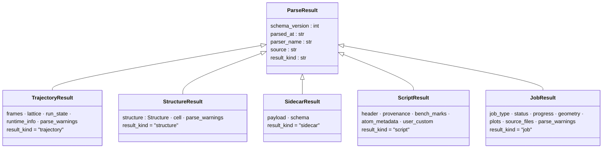
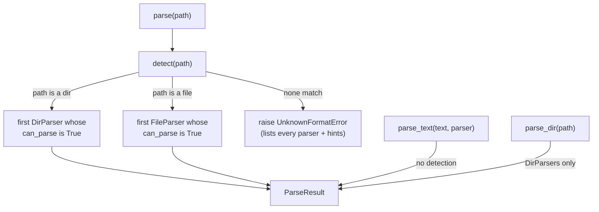

# The parse stack — turn a file or directory into typed data

**Role:** contract
**Domain:** model
**Module:** `molbuilder/parse/` · **Tests:** `tests/parse/` (~106 tests).
**Companions:** [`structure.md`](?doc=model/structure.md) (a `StructureResult` carries a `Structure`);
`engines/siesta.md` + `engines/pyscf.md` (the `.out`/`.log`/geometry formats the
leaf parsers read, migrating).  The **write** side (the inverse — turning data
back into files) is `sidecars/molstruct.py` and `script_emit.py`, not this
module.  *(A second DirParser, `BundleDirParser` → `BundleResult`, and the
`bundle_writer.py` write half retired 2026-08-29 with calculation-to-calculation
passing — a calculation that builds on a finished result CITES it and prep
composes; `execution/job-contracts.md` § 5 holds the closure.)*

One package answers a single question: **"what is in this path, as a Python
object?"** — for a file, a text body, or a whole run directory. It is the sole
read-side source of truth; every consumer (web blueprints, CLI, tests) imports
from here and queries the registry rather than knowing which parser to call.

> **Why it exists.** Before this, molbuilder had **four parallel parsing
> patterns** — a `TrajectoryParser` registry for engine output, ad-hoc
> `load(path)` functions for sidecar JSON, ad-hoc `read_*` functions for
> geometry, and ad-hoc `extract_*`/`decode_run_dir` for scripts and run dirs —
> with three different return-type flavours and no shared base. Each new engine
> or output type added another parallel path. This package collapses them into
> **three ABCs, one frozen-dataclass result hierarchy, and one registry**.

---

## 1. The three ABCs

`molbuilder/parse/base.py`:

| ABC | Input → output | Detection |
|---|---|---|
| **`FileParser`** (`:26`) | one file path → one `ParseResult` | `can_parse(path)` — the registry auto-detects |
| **`TextParser`** (`:79`) | one in-memory text body → one `ParseResult`; **pure, no I/O** | none — the caller passes the parser explicitly |
| **`DirParser`** (`:98`) | one directory → one `ParseResult`, **composed** from per-file parsers plus directory-level invariants | `can_parse(run_dir)` |

Each declares `name` / `label` / `output` (the concrete `ParseResult` subclass
it returns); **`FileParser`s** also declare a `hint` (what to point at when
`can_parse` is `False`). **`TextParser` has no detection** — a text body has no
path to inspect, so the caller names the parser: `parse_text(text, parser=…)`.

---

## 2. The `ParseResult` hierarchy

Every parser returns a **frozen dataclass** on a shared base
(`molbuilder/parse/types.py`). A consumer type-narrows by `isinstance` or by the
`result_kind` discriminator string.



Plus **`ParseWarning`** (`types.py:36`) — a fail-soft warning (`source`,
`line_no`, `snippet`, `error`, `category`) any parser can attach to its result
instead of raising.

- **The discriminator.** Each concrete subclass sets `result_kind` to a fixed
  string (`"trajectory"`, `"structure"`, `"sidecar"`, `"script"`, `"job"`).
  Consumers holding a `ParseResult` (cached, or sent over the wire)
  `match` on it; JSON deserialisation reads it to pick a class. Adding a kind =
  a new subclass + a new discriminator value (rule below).
- **Why frozen.** No defensive copies at API boundaries; hashable (dict/set
  usable); trivial `asdict()` serialisation; `result == expected` test pinning
  with no `__eq__` override.

---

## 2a. Time fields name their clock

Engines report time in whatever frame of reference suits them. A `.molwatch.log`
carries the writer's own `time.time()`; a SIESTA `.out` carries `timer:` lines
counting from the start of the run and contains no time-of-day anywhere. **Both
are legitimate; neither is convertible into the other from the file alone.**

So the *field name* carries the frame of reference, and there is no neutral
name for "some time value".

**P-T1 — a time field names its clock.** No field is called `wall_time`. Every
time-valued field on a parse result ends in one of two suffixes, and the suffix
**is** the contract:

| suffix | quantity | answers | rendered as |
|---|---|---|---|
| `wall_clock_s` | absolute Unix epoch seconds | *at what time?* | a date |
| `elapsed_s` | seconds since the run began | *how far in?* | a duration |

Only a parser that read a real clock reading out of the file may fill
`wall_clock_s`.

**P-T2 — `None` means "this engine cannot say", and is a correct final answer.**
A parser never converts one kind to fill the other's hole, and never substitutes
a value it did not read. SIESTA's `wall_clock_s` is `None` forever. That is
output, not missing data — and it is what lets a consumer fall back to the
file's `mtime` deliberately instead of rendering nonsense confidently.

**P-T3 — derivation happens once, downward only.** `elapsed_s` may be derived
from an epoch series (`t[i] - t[0]`), because a run's start is knowable from the
frames themselves. `wall_clock_s` may **never** be derived from `elapsed_s` —
the file does not contain the missing addend. Each derivation has exactly one
home:

| derivation | the one place it happens |
|---|---|
| `elapsed_s` from a frame's epoch series | `parse/engines/_helpers.py::trajectory_result_to_legacy_dict` |
| `elapsed_s` across chained stages | `web/blueprints/watch.py::_merge_molwatch_trajectories` |

No other layer computes either field.

**P-T4 — a consumer asks for the quantity it means, and takes `None` for an
answer.** Epoch is formatted as a date, elapsed as a duration, and neither as
the other — but formatting is only the most visible half. *Arithmetic counts
too*: the browser's per-iteration figure divides a cumulative time by
`cumulative_calls`, which is meaningful for a duration and is nonsense for a
date. So it reads `elapsed_s` alone and treats an epoch as absent.

> An accessor that returned *"whichever clock this cycle carries"* was written
> during the first pass at this rule and looked reasonable — a DIFFERENCE
> between two cycles really is the same either way, because the origin cancels.
> But its one caller was dividing, not subtracting, and the helper had just made
> molwatch cycles match a ladder that had always been SIESTA-only: a PySCF run
> read **"~489276.7h/iter (from SIESTA iter-1 timer)"**. A convenience that
> spans both clocks is a place for exactly this to happen; name the quantity
> instead.

> **Why this exists.** `Frame.wall_time` was one bare float that molwatch filled
> with an epoch and SIESTA filled with elapsed seconds. The field's docstring
> said "Unix epoch"; the browser formatted it as a date; a SIESTA run 360 s in
> displayed **"last result Dec 31, 5:06 PM"** — epoch zero plus six minutes.
> Elapsed still looked right, because subtracting two numbers cancels the error
> that made them wrong. A patch at the display would have left the same trap
> for the next reader of the field, and the same bug one layer down in
> `scf_history`, where the two engines had already diverged into
> `wall_time` and `cumulative_walltime_s` for the same quantity.

---

## 2b. How a run ENDED is not whether it succeeded

A parser reads a file and reports what is in it. **Whether the science is any
good is the reader's judgement, never the parser's** — and the moment those
two are conflated, the machine starts refusing to show data it holds.

That is not hypothetical. On 2026-08-25 the Results tab reported **six failed
trials and "0 done"** for a benchmark sweep that had run perfectly: every trial
directory held SIESTA's `0_NORMAL_EXIT`, every `.out` ended `>> End of run` /
`Job completed`, and every trial displayed a measured s/iter *beside the word
failed*. The cause was a benchmark deck doing exactly what a benchmark deck
must:

```
MaxSCFIterations  3
SCF.MustConverge  .false.
```

Three SCF steps, convergence explicitly **not required**, because what is being
measured is seconds per iteration. SIESTA printed `SCF_NOT_CONV:`, carried on,
and exited 0 — and the parser called it an error, because it had been taught
that not converging *is* failing.

**P-S1 — `run_state` answers HOW THE RUN ENDED.** It is a fact about the
process, drawn from markers in the file. It is not a grade. The vocabulary is
closed:

| value | means | evidence |
|---|---|---|
| `running` | still producing output | no ending marker (a `DirParser` confirms with file age — content alone cannot tell *running* from *died quietly*) |
| `ended` | the engine reached its own end | `>> End of run` — **that line only**. SIESTA prints `Job completed` beside it, and the corpus has no `.out` carrying one without the other, so a second marker would buy nothing and could fire on a line that merely mentions the phrase |
| `stopped` | it did not reach its end | an abort marker, or no ending marker and no growth |
| `out_of_memory` | the kernel or scheduler killed it for memory | an OOM marker |
| `unknown` | no evidence either way | unreadable, empty, or a format with no markers |

`stopped` carries `error_message` when the file says why (`propor: IMAX=0`, a
missing pseudopotential). `out_of_memory` is called out from `stopped` because
it is the most common cause and the most actionable — *"you ran out of
memory"* is the one sentence that tells a user what to change.

**P-S2 — convergence is REPORTED, never a verdict.** `scf_converged` is
`True` / `False` / `None` (never ran an SCF, or the format cannot say), and
**nothing derives `run_state` from it.** Not converging is a normal, frequent,
often *deliberate* outcome: a capped benchmark, a relaxation step mid-flight, a
scan that budgets its iterations. A reader composes the sentence —
*"ended · not converged · 3 iterations"* — from two independent facts.

> Before this rule, `last_scf_converged` had **no consumers at all** outside
> the parser. It existed only to flip `run_state` to `error`. The science was
> consumed to manufacture a verdict and then discarded, so no surface could
> report *"3 iterations, not converged"* even though the parser knew it.

**P-S3 — a parser never withholds what it parsed.** Frames, energies, forces,
timings and iteration counts are returned whatever the ending. "I cannot show
you this because it failed" is not a thing a parser is permitted to say — the
data is the answer, and the ending is one more field beside it.

*Verified, not asserted:* a `.out` cut off mid-run — no ending marker, no
final energy — still returns `frames=1` with its coordinates, its forces and
its one SCF cycle, alongside `run_state="running"`.

**P-S4 — one reader per question.** *"Did this run end, and how"* has exactly
one answer. A consumer that scans for `"Job completed"` itself has created a
second answer that will disagree — and one did: `jobset/summarize.py` carried a
private `_DONE_MARKERS` tuple whose own comment knew about the
`SCF.MustConverge .false.` case, while the parser it sat beside did not. The
bench summary asked both and rendered the wrong one.

**Where it lives, and why there are two doors onto it.**
`engines/_run_ending.py` owns the marker strings — `FATAL_MARKERS`,
`END_MARKER`, the SCF markers — and nothing else. Two callers share them:

| door | for | cost |
|---|---|---|
| `scan_ending(text)` | callers that want the ENDING and nothing else | one pass, **stdlib only** |
| `SiestaParser.parse(path)` | callers that want frames, energies, forces | builds arrays; needs numpy |

The split is a dependency and a cost, not a second opinion — the heavy parser
**builds its fatal rules from the same table**, so the two cannot diverge, and
`tests/test_run_ending_one_table.py` parses every frozen fixture both ways and
fails if they disagree on `run_state` or `scf_converged`.

Measured on a six-trial sweep of 152 KB files: **272 ms** through the full
parse, **21 ms** through the scan — on a bench summary that polls every 15 s and
needs one string field. A relaxation `.out` with hundreds of frames costs far
more. That is the whole reason the cheap door exists; correctness is what the
shared table protects.

## 3. The registry + public API

`molbuilder/parse/__init__.py` re-exports the whole surface; the dispatch lives
in `registry.py`.



| Function (`registry.py`) | Does |
|---|---|
| `detect(path)` (`:60`) | return the parser whose `can_parse(path)` is `True` — **DirParsers when `path` is a directory, FileParsers when it is a file** (no dir→file fall-through); `UnknownFormatError` if none match / `AmbiguousFormatError` if more than one does, both listing every registered parser + the standard foot-gun hints |
| `parse(path)` (`:135`) | `detect` + `parse` in one call |
| `parse_text(text, parser)` (`:158`) | parse a known text body — **no detection**, caller names the `TextParser` |
| `parse_dir(path)` (`:144`) | detect among **DirParsers only** — for callers whose contract is "this is a run directory" (JobMonitor, Results) |
| `register(parser)` (`:30`) | add a parser at module-init time (idempotent; not for runtime registration) |

**Errors** (`errors.py`): `UnknownFormatError` (`:13`) and
`AmbiguousFormatError` (`:23`), both on a `ParseError` base (`:9`).

### Using it — worked examples

**Parse a file** — detect + read, narrowing on `result_kind`:

```python
from pathlib import Path
from molbuilder.parse import parse

r = parse(Path("projects/BDT/optimization/BDT.out"))
if r.result_kind == "trajectory":            # a SIESTA / PySCF / molwatch .out
    last = r.frames[-1]
    print(last.energy, last.max_force)        # eV, eV/Å (either may be None)
    print(r.run_state)      # § 2b: "running"|"ended"|"stopped"|"out_of_memory"
    print(r.scf_converged)  # True | False | None -- a FACT, not a verdict
elif r.result_kind == "structure":           # a .XV / *_optimized.xyz
    print(len(r.structure.elements), r.cell)  # atom count, 3×3 cell or None
```

**Read a sidecar:**

```python
r = parse(Path("water.molstruct.json"))       # -> SidecarResult
print(r.schema, r.payload)                     # e.g. "molstruct/v6", {...}
```

**Decode a whole run directory** (what the Results tab consumes):

```python
from molbuilder.parse import parse_dir

job = parse_dir(Path("projects/BDT/optimization"))   # -> JobResult
job.status       # how each source ENDED (§ 2b) + convergence beside it
job.progress     # per-stage CG-step progress
job.plots        # per-source plot buckets for the Results tab
```

**Extract the reserved blocks from a `.fdf` / `.py` body** (a `TextParser` — no
detection, you name it):

```python
from molbuilder.parse import parse_text
from molbuilder.parse.scripts.source import ScriptSourceTextParser

s = parse_text(fdf_text, parser=ScriptSourceTextParser)   # -> ScriptResult
s.atom_metadata      # the ATOM-METADATA block dict, or None if absent
s.provenance         # the PROVENANCE block, or None
```

**Skip detection when you already know the type** — call the parser class's
`parse()` directly. This is what most consumers do, e.g.
`decode_run_dir(run_dir)` (`web/blueprints/results.py`).

---

## 4. Package layout

```
molbuilder/parse/
├── base.py        # the 3 ABCs                (FileParser / TextParser / DirParser)
├── types.py       # ParseResult + 5 subclasses + ParseWarning
├── registry.py    # _REGISTRY, detect/parse/parse_text/parse_dir/register
├── errors.py      # ParseError, UnknownFormatError, AmbiguousFormatError
├── _log.py        # parse-side logging helper
│
├── engines/       # engine .out / .log → TrajectoryResult (FileParsers)
│   ├── siesta.py · pyscf.py · molwatch.py
│   ├── siesta_mdnc.py         # <label>.MD.nc (netCDF) — sibling upgrade, § 5a
│   ├── _run_ending.py         # HOW A RUN ENDED — the markers, § 2b
│   ├── _helpers.py            # Trajectory → TrajectoryResult adapters
│   └── _section_rules.py · _sidecar.py   # shared extraction helpers
│
├── coords/        # geometry files → StructureResult (FileParsers)
│   ├── siesta_xv.py           # .XV / .STRUCT_OUT (+ cell)
│   ├── pyscf_geom.py          # *_optimized.xyz
│   └── _helpers.py            # StructureResult envelope
│
├── sidecars/      # molbuilder JSON sidecars → SidecarResult (FileParsers)
│   ├── molstruct.py · spectra.py · transport.py
│   └── _helpers.py
│
├── scripts/       # the reserved .fdf / .py comment blocks → ScriptResult (TextParsers)
│   ├── header.py · provenance.py · bench_marks.py
│   ├── atom_metadata.py · user_custom.py
│   ├── source.py              # ScriptSourceTextParser — umbrella over the blocks
│   ├── markers.py             # MARKER_RE + block-name constants
│   └── _helpers.py
│
└── dirs/          # directory composers (DirParsers)
    ├── job.py                 # JobDirParser + decode_run_dir → JobResult
    └── _assembler_helpers.py  # shared dir-walk + .fdf-coords helpers
```

> **Two geometry formats have no leaf FileParser (by design).** Plain `.xyz`
> reading uses `Structure.from_xyz` directly (see [`structure.md`](?doc=model/structure.md)), and `.fdf`
> initial-coordinates reading lives in `dirs/_assembler_helpers.py` (used by the
> DirParsers), rather than as registered `coords/` parsers. Adding them as
> FileParsers was scoped but not needed.

---

## 5. Composer pattern — DirParsers

A DirParser turns a whole run directory into one result. One ships:

- **`JobDirParser`** (`dirs/job.py:892`; public entry `decode_run_dir` `:803`) →
  `JobResult` — walks the `.out` files, consolidates per-source plots,
  classifies the job type. This is what the Results tab + JobMonitor consume.

*(A second, `BundleDirParser` → `BundleResult` — the run-dir → next-calculation
handoff fuse — stood beside it until 2026-08-29 and retired with
calculation-to-calculation passing: a calculation that builds on a finished
result CITES it, and prep composes — `transport/compose.py`.)*

Every DirParser must: **walk** the directory, **dispatch each file through the
registry** (`detect`+`parse`, or pick a specific FileParser when the choice
isn't path-driven), **compose** the per-file results, and **apply cross-file
invariants** no single FileParser can see (atom-count consistency, lattice
handedness, stage ordering, status state machine). It must **never re-parse**
what a registered FileParser can produce — add the missing FileParser instead.

---

## 5a. Sibling upgrade — when a second file sharpens the first

Some engines write the *same* physics twice: once into the human-readable log,
once into a structured sidecar. When they do, the parser for the log reads the
sidecar and **replaces values in frames it already built** — it does not build
a second trajectory.

Three parsers do this today:

| primary | sibling | what the sibling supplies |
|---|---|---|
| `engines/pyscf.py` | `<prefix>.qdata.txt` | per-step max force |
| `engines/pyscf.py` | `<base>.molwatch.log` | convergence targets, run state |
| `engines/siesta.py` | `<label>.MD.nc` | coordinates + per-step energy, in full precision |

**The rules, which are what keep this from becoming a second source of truth:**

1. **The primary file owns the frame list.** Count, order and indexing come
   from the log and are never re-shaped. The sibling only swaps values into
   frames that already exist.
2. **Absence is ordinary.** No sibling, an unreadable one, or one that matches
   nothing must parse *exactly* as the primary alone. A sidecar is an
   improvement, never a dependency — so a run from a build that doesn't emit
   it loses nothing.
3. **Never invent.** A field the sibling lacks stays as the primary had it
   (or stays `None`); it is never back-filled from a neighbouring step.
4. **Say what happened.** Record the upgrade in `runtime_info` — which file,
   how many frames changed — so a surprising number in the UI can be traced to
   a file rather than to a guess.

### The SIESTA case, and the trap in it

`<label>.MD.nc` is netCDF, written whenever `WriteMDhistory` is on and the
binary was built with `-DCDF` (both true for the packaged `molbuilder-siesta`).
It matters because the `.out` is a Fortran-formatted text file: it prints
`E_KS(eV) = -30.4405` — **four decimals**, coarser than the step-to-step energy
change near convergence — and its fixed-width columns collide when values grow
(`-1.929956131.029438`) or overflow to `**********`, which is why
`engines/siesta.py` carries both a separator-inserting regex and a structural
column slicer. Typed netCDF arrays have neither failure mode.

**But a `.MD.nc` row is not a step.** Measured on a real relaxation
(2026-08-15):

```
row k :  xa   = the geometry AFTER move k+1   ("predicted", per the manual)
         etot = the energy OF geometry k      (the one just evaluated)
```

Pairing them by row index — the obvious implementation — attaches every
geometry to the previous geometry's energy. Nothing raises, the frame count is
right, and on a converging run the plot still looks reasonable. The correct
pairing is `xa[k]` with `etot[k+1]`, and the last row has no energy yet.

Two more properties shape the reader:

- **There is no row for the input geometry.** So the merged trajectory keeps
  the `.out`'s own frame 0 — the structure the user submitted, and the frame
  every other one is read against.
- **The file accumulates across runs** (SIESTA appends on restart). Frame index
  is therefore not run-local, which is why `align_to_reference` matches on
  **coordinates** rather than doing index arithmetic: a hardcoded lag is right
  on a fresh run and wrong on every warm one.

Units come from each variable's own `unit` attribute (`xa` is Bohr while
`volume` is `Ang**3` *in the same file*), and an unrecognised unit is refused
rather than assumed — a wrong factor is invisible in the result and wrong by a
fixed ratio in every number downstream.

Reading uses `netCDF4` when present and falls back to `scipy.io.netcdf_file`;
both are exercised by the tests, because `molbuilder-pySCF` has scipy and no
netCDF4.

---

## 6. Adding a parser

The shape every parser follows — a real minimal `FileParser` (mirrors
`parse/sidecars/spectra.py`): read a file, return a typed result via the
sub-package's envelope helper.

```python
# molbuilder/parse/sidecars/mykind.py
import json
from pathlib import Path
from molbuilder.parse.base import FileParser
from molbuilder.parse.types import SidecarResult
from ._helpers import build_sidecar_result   # fills the envelope: schema_version,
                                             # parsed_at, parser_name, source

class MyKindSidecarFileParser(FileParser):
    name   = "mykind-json"
    label  = "molbuilder .mykind.json sidecar"
    hint   = "files ending in .mykind.json"
    output = SidecarResult

    @classmethod
    def can_parse(cls, path: Path) -> bool:
        return path.name.endswith(".mykind.json") and path.is_file()

    @classmethod
    def parse(cls, path: Path) -> SidecarResult:
        payload = json.loads(path.read_text(encoding="utf-8-sig"))
        return build_sidecar_result(
            payload=payload, schema=f"mykind/v{payload.get('schema_version', 0)}",
            parser_name=cls.name, source=path,
        )
```

Then **register it at import** in the sub-package's `__init__.py`
(`from .mykind import MyKindSidecarFileParser` → `register(MyKindSidecarFileParser)`)
and add an L2 test under `tests/parse/`.

Per parser kind, the specifics:
- **Engine FileParser** (`parse/engines/`): `output = TrajectoryResult`;
  `can_parse` sniffs content markers in the **first few hundred lines** (SIESTA
  scans 300; molwatch keys off the first 5) — not a fixed byte window.
- **Sidecar FileParser** (`parse/sidecars/`): `can_parse` matches the
  `.<kind>.json` suffix; the result's `schema` is `"<kind>/v<N>"`.
- **Block TextParser** (`parse/scripts/`): returns `ScriptResult`; uses
  `MARKER_RE` from `scripts/markers.py`; the caller invokes it via
  `parse_text(text, parser=<Block>Parser)` (no auto-detection).
- **DirParser composer** (`parse/dirs/`): **must compose existing FileParsers +
  TextParsers** (forbidden pattern #1 below), never parse files inline.

---

## 7. Forbidden patterns

These stop the next round of parallel parse paths:

1. **DirParsers compose registered parsers — no inline file-level parsing.**
   Need a new file read? Add a FileParser first. (A convention today, not yet
   lint-enforced.)
2. **TextParsers do NO I/O.** A path-taking caller reads the file and passes the
   body.
3. **FileParsers do not spawn subprocesses, network calls, or threads** —
   parsing is pure local-file I/O; background work belongs to the JobMonitor.
4. **`ParseResult` subclasses are frozen.** Never mutate after construction; use
   `dataclasses.replace(result, …)`.
5. **A new `ParseResult` subclass requires a new `result_kind` value + a doc
   update** — one shape, one discriminator.
6. **Adding a curated key list** (e.g. `engine_body_summary`) requires a doc
   update + a test — these lists are the load-bearing contract for downstream
   consumers.
7. **No engine-specific code outside `parse/engines/` and `parse/coords/`.** The
   composer stays engine-agnostic; engine logic lives in the leaf parsers.
8. **No time field without a clock in its name** (§ 2a). `wall_clock_s` is an
   epoch, `elapsed_s` counts from the run's start, and a value the file does not
   carry stays `None` rather than being converted from the other kind.

---

## 8. History

The unified stack replaced the four parallel patterns above (shipped
incrementally 2026-06-19 → 06-21). The legacy `molbuilder/parsers/`,
`script_contract.py`, and `script_bundle.py` are deleted; their **read** side is
here, and their **write** side rehomed to `molbuilder/sidecars/` and
`script_emit.py` (parsing and emitting are inverse concerns, kept in separate
modules; the third rehome, `bundle_writer.py`, retired 2026-08-29 with the
handoff it materialised).
