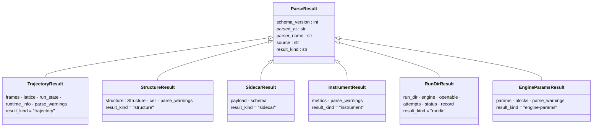
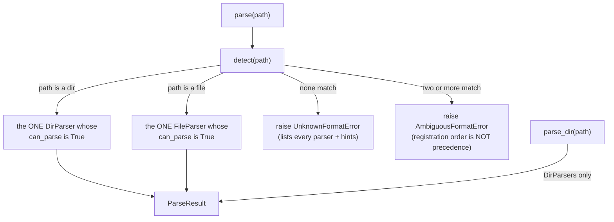
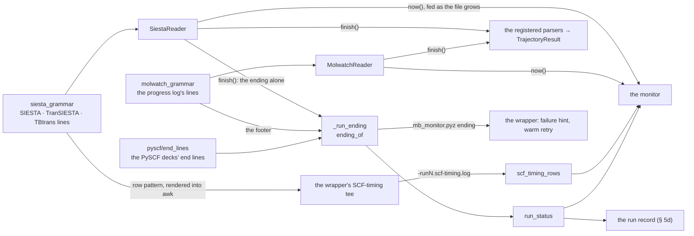
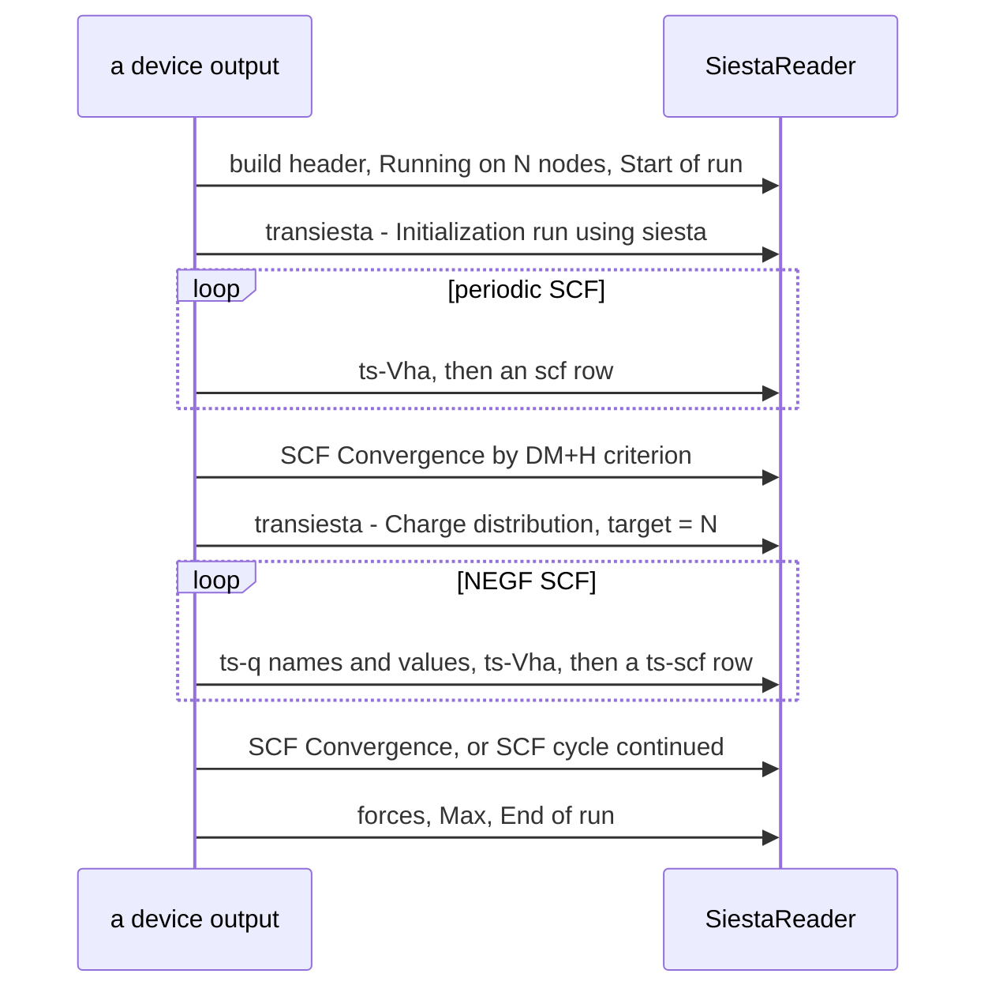
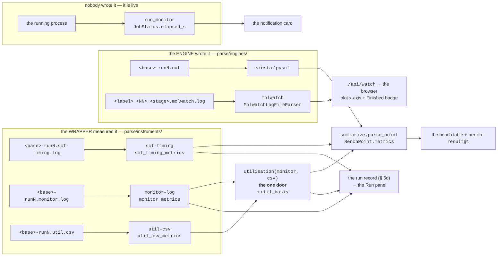

# The parse stack — turn a file or directory into typed data

**Role:** contract
**Domain:** model
**Module:** `molbuilder/parse/` · **Tests:** `tests/parse/` (~106 tests).
**Companions:** [`structure.md`](?doc=model/structure.md) (a `StructureResult` carries a `Structure`);
`engines/siesta.md` + `engines/pyscf.md` (the decks whose outputs the leaf
parsers read — the SIESTA family's output lines are § 5d.5 here);
[`execution/run-reports.md`](?doc=execution/run-reports.md) § 2.3 (what the
monitor reads through this package's readers).  The **write** side (the inverse — turning data
back into files) is `sidecars/molstruct.py` and `script_emit.py`, not this
module.  *(A second DirParser, `BundleDirParser` → `BundleResult`, and the
`bundle_writer.py` write half retired 2026-08-29 with calculation-to-calculation
passing — a calculation that builds on a finished result CITES it and prep
composes; `execution/job-contracts.md` § 5 holds the closure.)*

One package answers a single question: **"what is in this path, as a Python
object?"** — for a file, a text body, or a whole run directory. It is the sole
read-side source of truth; every consumer (web blueprints, CLI, tests) imports
from here and queries the registry rather than knowing which parser to call.

> **Why it exists.** Before this, molbuilder had **four parallel parsing
> patterns** — a `TrajectoryParser` registry for engine output, ad-hoc
> `load(path)` functions for sidecar JSON, ad-hoc `read_*` functions for
> geometry, and ad-hoc `extract_*`/`decode_run_dir` for scripts and run dirs —
> with three different return-type flavours and no shared base. Each new engine
> or output type added another parallel path. This package collapses them into
> **three ABCs, one frozen-dataclass result hierarchy, and one registry**.

### How results are organized — read this first

**A run's files are the calculation reporting itself**, one aspect per file,
each at one stage of its life: the deck is what was asked; `run.json`, that it
was sent; the engine's output (`.out`, `.pyscf.log`), its own account as it
went; the progress log, its steps; the monitor's log and `util.csv`, the
machine's account; the wrapper's log, the host and what reached stderr;
`.concluded`, how the process exited. The catalogue (`runfiles.WRITTEN`) says
which file is which. **They do not conflict**: two files stating related facts
are two aspects of one run — the ranks asked and the ranks the engine ran on,
say — never two answers to reconcile.

| layer | what it is | where |
|---|---|---|
| one reader per file | each format's grammar and its one reading pass; the registry picks the reader for a path | § 4a, § 3 |
| what a folder is | the directory parser: a run, a container or a folder not marked; which file is its result | § 5, `web/results.md` § 0 |
| one run's report | from that run's own files: its trajectory (§ 3), how it is doing (`status`, § 2b), what ran with what and how it went (`record`, § 5d) | `parse/dirs/`, `/api/watch/*` |
| a higher level's report | a ladder, a benchmark, a transport calculation — each built by its own module from its rungs' or trials' files, through the same readers, and shown by its own presenter | `jobset/runstatus.py`, `jobset/summarize.py`, `transport/record.py` |

**Each report answers its own question and none is built from another**: a
run's record is not a bench trial's row, and a transport report is not a
ladder. What they share is the readers, so the same file says the same thing
in every report that reads it.

---

## 1. The two ABCs

`molbuilder/parse/base.py`:

| ABC | Input → output | Detection |
|---|---|---|
| **`FileParser`** | one file path → one `ParseResult` | `can_parse(path)` — the registry auto-detects |
| **`DirParser`** | one directory → one `ParseResult`, **composed** from per-file parsers plus directory-level invariants | `can_parse(run_dir)` |

Each declares `name` / `label` / `output` (the concrete `ParseResult` subclass
it returns); **`FileParser`s** also declare a `hint` (what to point at when
`can_parse` is `False`).

> **There were THREE until 2026-09-05.** `TextParser` took a text body and had
> **no detection** — the caller named the parser — which is the tell: an ABC in
> a package whose reason to exist is *"query the registry rather than knowing
> which parser to call."* All six of its implementations read molbuilder's OWN
> generated blocks, where there is nothing to detect and the caller always knows
> which block it wants, so each class wrapped a function in a ten-field result
> it did not need. They moved to the module that WRITES those blocks
> (`script_emit`'s extractors), which also removed a circular import the split
> had forced. [`plans/plan.md` § 5d](?doc=plans/plan.md).

---

### 1a. `parse/` is for FOREIGN formats — a block we wrote is its writer's

**The boundary, and why the module has a registry at all.** `parse/` reads
what something else produced: a `.out` that might be SIESTA or PySCF, a
`.XV`, a `.MD.nc`. Detection is the reason it exists — *every consumer
queries the registry rather than knowing which parser to call.*

**A reserved block in a molbuilder-generated script is not foreign.**
molbuilder writes it, into a file molbuilder generated, and every caller
already knows which block it wants. There is nothing to detect, so applying
detect-and-dispatch to a question with one possible answer buys ceremony and
no safety: the retired `ProvenanceTextParser.parse` was one line building a
ten-field result object to carry one dict. **A block belongs to its writer**
— `script_emit` owns the emitting and the reading of what it emitted, and
`execution/job-contracts.md` § 3.1 owns the format.

*Established 2026-09-05 by retiring `parse/scripts/` — six `TextParser`
classes and `ScriptResult` — and confirmed 2026-09-05 when the door built to
replace it (`read_script`) was found carrying a version gate the live readers
did not have: two answers for one block, and the door had zero callers for
three weeks. It was deleted rather than adopted. The extractors are the way
in.*

## 2. The `ParseResult` hierarchy

Every parser returns a **frozen dataclass** on a shared base
(`molbuilder/parse/types.py`). A consumer type-narrows by `isinstance` or by the
`result_kind` discriminator string.


```mermaid
classDiagram
    class ParseResult {
        schema_version : int
        parsed_at : str
        parser_name : str
        source : str
        result_kind : str
    }
    class TrajectoryResult {
        frames · lattice · run_state ·
        runtime_info · parse_warnings
        result_kind = "trajectory"
    }
    class StructureResult {
        structure : Structure · cell · parse_warnings
        result_kind = "structure"
    }
    class SidecarResult {
        payload · schema
        result_kind = "sidecar"
    }
    class InstrumentResult {
        metrics · parse_warnings
        result_kind = "instrument"
    }
    class RunDirResult {
        run_dir · engine · openable ·
        attempts · status · record
        result_kind = "rundir"
    }
    class EngineParamsResult {
        params · blocks · parse_warnings
        result_kind = "engine-params"
    }
    ParseResult <|-- TrajectoryResult
    ParseResult <|-- StructureResult
    ParseResult <|-- SidecarResult
    ParseResult <|-- InstrumentResult
    ParseResult <|-- RunDirResult
    ParseResult <|-- EngineParamsResult
```

**The four envelope fields are built in ONE place** —
`ParseResult.envelope(parser_name, source)`. Each sub-package's
`_helpers.py` filled them by hand until 2026-09-04, carrying four
byte-identical copies of the timestamp helper; `instruments/` added a
fifth without noticing, and `engines/siesta_mdnc.py` a sixth that bypassed
even its own package's builder. They agreed, which is the only reason
nothing had broken. The one exception is deliberate and says so in place:
the legacy-dict shim stamps empty strings, because it never parsed a file.

Plus **`ParseWarning`** (`types.py:36`) — a fail-soft warning (`source`,
`line_no`, `snippet`, `error`, `category`) any parser can attach to its result
instead of raising.

- **The discriminator.** Each concrete subclass sets `result_kind` to a fixed
  string (`"trajectory"`, `"structure"`, `"sidecar"`, `"instrument"`,
  `"rundir"` — § 5.0 — and `"engine-params"` — § 5d.3).
  Consumers holding a `ParseResult` (cached, or sent over the wire)
  `match` on it; JSON deserialisation reads it to pick a class. Adding a kind =
  a new subclass + a new discriminator value (rule below).
- **Why frozen.** No defensive copies at API boundaries; hashable (dict/set
  usable); trivial `asdict()` serialisation; `result == expected` test pinning
  with no `__eq__` override.

---

## 2a. Time fields name their clock

Engines report time in whatever frame of reference suits them. A `.molwatch.log`
carries the writer's own `time.time()`; a SIESTA `.out` carries `timer:` lines
counting from the start of the run, and states the time of day only at its two
ends. **Both are legitimate; neither is convertible into the other from the file
alone.**

So the *field name* carries the frame of reference, and there is no neutral
name for "some time value".

**P-T1 — a time field names its clock.** No field is called `wall_time`. Every
time-valued field on a parse result ends in one of two suffixes, and the suffix
**is** the contract:

| suffix | quantity | answers | rendered as |
|---|---|---|---|
| `wall_clock_s` | absolute Unix epoch seconds | *at what time?* | a date |
| `elapsed_s` | seconds since the run began | *how far in?* | a duration |

Only a parser that read a real clock reading out of the file may fill
`wall_clock_s`.

**The suffix says WHAT; a prefix says WHICH WINDOW.** `elapsed_s` bare means
*since the run began* — that is the suffix's whole promise, and a duration
measuring some other span may not wear it unqualified. A narrower window
takes a prefix naming itself: `monitored_elapsed_s` starts when the monitor
starts and ends when the monitor stops, which is neither the run's start nor
its end, so the prefix is what lets the suffix keep its promise. The prefix
is not decoration and not a namespace — **if you cannot name the window, the
field is not ready to be added.** *(Written down 2026-09-06. It was practised
first: `wall_s` became `monitored_elapsed_s` on 2026-09-05 — a duration
wearing a date's name — and plain `elapsed_s` would have been wrong the other
way. The reasoning lived only in `util_csv.py`'s docstring, so a second
windowed duration had no rule to follow.)*

**What is NOT pinned: the rendered format.** P-T4 fixes the KIND — an epoch
renders as a date, a duration as a duration — and deliberately stops there,
because a terminal column and a browser badge have different room. The two
duration formatters differ today and neither is wrong under this contract:
`jobset/summarize.py::_fmt_duration` writes `4m05s`, `core.js::fmtElapsed`
writes `4m 5s`. Pin a format only if a reader is ever asked to compare the
two surfaces' output directly.

**P-T2 — `None` means "this engine cannot say", and is a correct final answer.**
A parser never converts one kind to fill the other's hole, and never substitutes
a value it did not read. SIESTA's `wall_clock_s` is `None` forever — no step
carries a clock. The run's two ends are a different reading and have their own
names, `run_start_local` / `run_end_local` in `runtime_info`: naive, because
SIESTA prints the node's local time with no zone (§ 5d.2). That is
output, not missing data — and it is what lets a consumer fall back to the
file's `mtime` deliberately instead of rendering nonsense confidently. Only
where the file states no time: an ended run is dated by `run_end_local`, and
the trajectory badge does so (`web/trajectory.md` § 4).

**P-T3 — derivation happens once, downward only.** `elapsed_s` may be derived
from an epoch series (`t[i] - t[0]`), because a run's start is knowable from the
frames themselves. `wall_clock_s` may **never** be derived from `elapsed_s` —
the file does not contain the missing addend. Each derivation has exactly one
home:

| derivation | the one place it happens |
|---|---|
| `elapsed_s` from a frame's epoch series | `parse/engines/_helpers.py::trajectory_result_to_legacy_dict` |

No other layer computes either field.

There is **no** cross-stage derivation, and there is no place for one: stages
are separate runs and nothing joins them (`job-contracts.md` § 2.4). A row
here named the Watch blueprint's multi-stage merge as the one home for
`elapsed_s` "across chained stages" until 2026-09-05. That merge is
deleted — and the arithmetic that row blessed was wrong anyway: each stage's
log opens with a frame written at PREP time, so each stage's own elapsed
already contained the whole queue wait, and summing them counted it once per
stage. Measured: 61 minutes reported for a job that spanned 41 and computed
12.

**P-T4 — a consumer asks for the quantity it means, and takes `None` for an
answer.** Epoch is formatted as a date, elapsed as a duration, and neither as
the other — but formatting is only the most visible half. *Arithmetic counts
too*: dividing a cumulative time by a count is meaningful for a duration and
nonsense for a date, so an epoch never enters a rate except as the difference
of two stamps of one clock within one SCF — the timing rule's (§ 5c). The page's seconds per
iteration are the timing instrument's, per phase (§ 5c), never a figure the
browser computes — the viewer is served the run record's own reading
(`parse.dirs.record.scf_timing_of`).

> An accessor that returned *"whichever clock this cycle carries"* was written
> during the first pass at this rule and looked reasonable — a DIFFERENCE
> between two cycles really is the same either way, because the origin cancels.
> But its one caller was dividing, not subtracting, and the helper had just made
> molwatch cycles match a ladder that had always been SIESTA-only: a PySCF run
> read **"~489276.7h/iter (from SIESTA iter-1 timer)"**. A convenience that
> spans both clocks is a place for exactly this to happen; name the quantity
> instead.

> **Why this exists.** `Frame.wall_time` was one bare float that molwatch filled
> with an epoch and SIESTA filled with elapsed seconds. The field's docstring
> said "Unix epoch"; the browser formatted it as a date; a SIESTA run 360 s in
> displayed **"last result Dec 31, 5:06 PM"** — epoch zero plus six minutes.
> Elapsed still looked right, because subtracting two numbers cancels the error
> that made them wrong. A patch at the display would have left the same trap
> for the next reader of the field, and the same bug one layer down in
> `scf_history`, where the two engines had already diverged into
> `wall_time` and `cumulative_walltime_s` for the same quantity.

---

## 2b. How a run ENDED is not whether it succeeded

A parser reads a file and reports what is in it. **Whether the science is any
good is the reader's judgement, never the parser's**: a benchmark deck that caps
its SCF on purpose (`MaxSCFIterations 3`, `SCF.MustConverge .false.`) ends
perfectly well without converging, and a parser that graded it would refuse to
show data it holds.

**P-S1 — `run_state` answers HOW THE RUN ENDED.** It is a fact about the
process, drawn from markers in the file. It is not a grade. The vocabulary is
closed, and each run-output role (§ 5.5) states it its own way:

| value | means | SIESTA-family `.out` | PySCF stdout `.pyscf.log` | progress log `.molwatch.log` |
|---|---|---|---|---|
| `running` | not finished — no ending yet | no ending marker | no end line, no traceback | no footer |
| `ended` | the engine reached its own end | `>> End of run` — that line only: SIESTA prints `Job completed` beside it, so a second marker adds nothing | the deck's end line (`pyscf/end_lines.py`), read at column 0 | `# concluded:` |
| `stopped` | it did not reach its end | a fatal marker (`siesta_grammar.FATAL_MARKERS`) | a Python traceback | `# error:` |
| `out_of_memory` | the kernel or scheduler killed it for memory | an out-of-memory marker | — | — |
| `unknown` | no evidence either way — a format with no ending markers at all, such as `.MD.nc` | — | — | — |

**A file with no ending is `running` — not finished — however long it has been
quiet** (user, 2026-09-26: *"It shows what it is"*). Nothing in the FILE tells
running from died quietly. The `-runN.concluded` beside it says the process
ended on its own, and with what code; its absence cannot tell still-running
from force-stopped. The monitor, which sees the PID go, says `failed — stopped
before its end`. There is no stale state and no age rule.

**P-S2 — convergence is REPORTED, never a verdict.** `scf_converged` is
`True` / `False` / `None` (never ran an SCF, or the format cannot say), and
**nothing derives `run_state` from it.** Not converging is a normal, often
deliberate outcome: a capped benchmark, a relaxation step mid-flight, a scan
that budgets its iterations. A reader composes the sentence — *"ended · not
converged · 3 iterations"* — from two independent facts. **Convergence is per
SCF phase** (§ 4b): `phases` holds each phase's, and `scf_converged` is the LAST
phase's — a device's periodic initialization converging does not speak for its
NEGF loop, so a new phase clears it, as `SCF cycle continued` does.

**P-S3 — a parser never withholds what it parsed.** Frames, energies, forces,
timings and iteration counts are returned whatever the ending: a `.out` cut off
mid-run still returns its frame, its forces and its SCF cycles beside
`run_state="running"`.

**P-S4 — one reader per question.** *"Did this run end, and how"* has exactly
one answer, and every door below asks the same code. A consumer that scans for
`Job completed` itself has made a second answer, and it will disagree.

### The answer — `RunEnding`

The marker strings live with their format: SIESTA's in the family's grammar
(`siesta_grammar`, § 5d.5); the PySCF decks' end lines in `pyscf/end_lines.py`,
which both decks print from (§ 5.5); the progress log's footer is read through
`molwatch_grammar`. `parse/engines/_run_ending.py` imports them and owns the
dispatch; its answer is one frozen record:

| field | holds |
|---|---|
| `run_state` | P-S1's vocabulary |
| `scf_converged` | the LAST SCF phase's convergence (P-S2) |
| `phases` | each SCF phase's, keyed `periodic` / `negf`, `True` / `False` / `None`: `SCF Convergence by …` is `True`; `SCF_NOT_CONV:` or `SCF did NOT converge` is `False`; `SCF cycle continued` is `None` again |
| `relaxed` | `True` on `outcoor: Relaxed …`, `False` on `outcoor: Final (unrelaxed) …`, `None` for a run that relaxes nothing |
| `cause` | what stopped it: the FIRST fatal line's marker — the lines after it are SIESTA's `die` cascade, and an out-of-memory marker outranks the rest — or `scf_not_conv` when SIESTA states the SCF's failure fatal, `(required)` |
| `error_message` | the sentence a person reads: the `SCF_NOT_CONV:` line when it came before the stop — it names the cause, the fatal lines after it are `die`'s cascade — else the first fatal line; for PySCF, the exception line |

`_run_ending.CONCLUDED` — `ended`, `stopped`, `out_of_memory` — is *the run is
over*.

### The doors onto it

| door | answers | cost · asked by |
|---|---|---|
| `ending_of(path, *, stderr=None)` | the ending of any run-output file, dispatched on its ROLE through `READERS` (§ 5.5): an `.out` through the SIESTA reading pass (§ 4a) — with `stderr`, the file SIESTA's stderr went to, read after the output when the output states no ending, because `die` flushes stdout on node 0 alone; a PySCF stdout through its decks' end lines; a progress log through its footer | one pass, stdlib, no Frames · `run_status`, which passes a SIESTA output's session log — the one whose first section is its run (`wrapper_log.logs_by_run`); the wrapper's door below; the bench summary |
| `python mb_monitor.pyz ending OUTPUT [--stderr FILE] [QUESTION [ARG]]` | `relaxation-capped` or `stopped-by MARKER`, by exit status (0 yes, 1 no, 2 unreadable); with no question, the ending in words | the wrapper's `_mb_ending`: its failure hint and warm retries (`execution/running-a-job.md` § 3.5) |
| `run_status(directory)` | a directory's state, from its outputs' endings, its `.concluded` and its `run.json` | `execution/running-a-job.md` § 4.2 |
| the registered parsers (§ 3) | frames, energies, forces — and the same `run_state` and `scf_converged`, from the same grammar | callers that want the arrays |

SIESTA's lines are read one way. The registered parser builds its Frames from
the reading pass (§ 4a); `ending_of` asks the same pass for the ending alone,
because a whole `Trajectory` is too much to reach one string. `READERS` and the
catalogue's run-output roles (`runfiles.WRITTEN`'s `output` column) are checked
against each other when `_run_ending` loads, so a role with no reader stops the
first import, not a status poll of a running job.

**One vocabulary per layer**, each mapped from the one below:

| a file's `run_state` | a directory's `run_status` — state · detail | the monitor, once the PID is gone |
|---|---|---|
| `ended` | `finished` · job completed | `finished` |
| `stopped` | `failed` · stopped before its end | `failed` |
| `out_of_memory` | `failed` · out of memory | `failed` |
| `running`, `unknown` | `finished` or `failed` by the `.concluded` code; without one, `failed` · stopped before its end, no exit recorded, when the monitor's closing record says its process went; else `running` | the directory's answer, asked after it writes that record |
| — no output yet | `pending` (no `run.json`) · `queued` (launched, silent) | — |

While the PID lives the monitor says `running` (`execution/run-reports.md` § 2.3).

**Worked examples** — the lines, and what `ending_of` answers for an `.out`
holding them:

```text
MaxSCFIterations 3 · SCF.MustConverge .false.          a capped benchmark
  SCF_NOT_CONV: SCF did not converge in maximum number of steps.
  >> End of run:  25-AUG-2026  10:12:03
  -> run_state "ended", scf_converged False, cause None

the same cap under SCF.MustConverge, SIESTA's default
  SCF_NOT_CONV: SCF did not converge in maximum number of steps (required).
  Stopping Program from Node:    0
  -> run_state "stopped", cause "scf_not_conv", error_message the SCF_NOT_CONV line

propor's refusal of the orbital distribution
  propor: ERROR: IMAX = 0
  Stopping Program from Node:    3
  -> run_state "stopped", cause "propor: error" -- the first fatal line; the rest is die's cascade
```

## 3. The registry + public API

`molbuilder/parse/__init__.py` re-exports the whole surface; the dispatch lives
in `registry.py`.


```mermaid
flowchart TD
    P["parse(path)"] --> D["detect(path)"]
    D -->|"path is a dir"| DP["the ONE DirParser whose<br/>can_parse is True"]
    D -->|"path is a file"| FP["the ONE FileParser whose<br/>can_parse is True"]
    D -->|"none match"| ERR["raise UnknownFormatError<br/>(lists every parser + hints)"]
    D -->|"two or more match"| AMB["raise AmbiguousFormatError<br/>(registration order is NOT precedence)"]
    DP --> R["ParseResult"]
    FP --> R
    PD["parse_dir(path)"] -->|"DirParsers only"| R
```

| Function (`registry.py`) | Does |
|---|---|
| `detect(path)` | return the parser whose `can_parse(path)` is `True` — **DirParsers when `path` is a directory, FileParsers when it is a file** (no dir→file fall-through); `UnknownFormatError` if none match / `AmbiguousFormatError` if more than one does, both listing every registered parser + the standard foot-gun hints |
| `parse(path)` | `detect` + `parse` in one call |
| `parse_dir(path)` | detect among **DirParsers only** — for callers whose contract is "this is a run directory". One is registered since **2026-09-18**: `JobDirParser` (§ 5). *(It raised for every input between 2026-09-04 and then, the registry having been emptied by a deletion; and it named "JobMonitor, Results" as its callers until 2026-09-05, neither of which ever called it.)* |
| `register(parser)` | add a parser at module-init time (idempotent; not for runtime registration) |

**Errors** (`errors.py`): `UnknownFormatError` and `AmbiguousFormatError`, both on a `ParseError`
base.

*(These rows pinned a line number each until 2026-09-05. Three of the five
were eight lines stale — the exact length of a docstring paragraph added
the day before. A line number is a pin: it measures where a thing sits
rather than what it does, and it rots on the next edit of a file this
document does not own. The function name is the anchor and it is
greppable.)*

### Using it — worked examples

**Parse a file** — detect + read, narrowing on `result_kind`:

```python
from pathlib import Path
from molbuilder.parse import parse

r = parse(Path("projects/BDT/optimization/BDT.out"))
if r.result_kind == "trajectory":            # a SIESTA / PySCF / molwatch .out
    last = r.frames[-1]
    print(last.energy, last.max_force)        # eV, eV/Å (either may be None)
    print(r.run_state)      # § 2b: "running"|"ended"|"stopped"|"out_of_memory"|"unknown"
    print(r.scf_converged)  # True | False | None -- a FACT, not a verdict
elif r.result_kind == "structure":           # a .XV / *_optimized.xyz
    print(len(r.structure.elements), r.cell)  # atom count, 3×3 cell or None
```

**Read a sidecar:**

```python
r = parse(Path("water.molstruct.json"))       # -> SidecarResult
print(r.schema, r.payload)                     # e.g. "molstruct/v6", {...}
```

**Ask how a run directory is doing** — not a parse, a small verb over
several parses (`running-a-job.md` § 4.2):

```python
from molbuilder.parse.dirs import run_status        # the package's door (R-RO2)

st = run_status(Path("projects/BDT/optimization/run-0"))
st.state, st.detail          # ("finished", "job_completed") -- a RunStatus
st.active_source             # "BDT-run0.out"
```

**Extract the reserved blocks from a `.fdf` / `.py` body** — **not this
package.** The blocks are molbuilder's own, so they are read by the module that
writes them:

```python
from molbuilder.script_emit import (_extract_atom_metadata_dict,
                                    _extract_provenance_dict)

_extract_atom_metadata_dict(fdf_text)   # the block dict, or None if absent
_extract_provenance_dict(fdf_text)      # the PROVENANCE block, or None
```

*(A `read_script(text) -> ScriptSource` door stood here until 2026-09-05. It
had zero callers for three weeks while carrying a schema-version gate the
live readers do not apply, so the tree held two answers for one block; it was
deleted rather than wired up. The extractors are the way in — they are
underscore-named and not in `__all__`, which is an inconsistency worth
resolving, not a signal to build a second door.)*

**Skip detection when you already know the type** — call the parser class's
`parse()` directly.

---

## 4. Package layout

```
molbuilder/parse/
├── base.py        # the 2 ABCs                (FileParser / DirParser)
├── types.py       # ParseResult + 6 subclasses + ParseWarning
├── registry.py    # _REGISTRY, detect/parse/parse_dir/register
├── errors.py      # ParseError, UnknownFormatError, AmbiguousFormatError
├── contract.py    # what a DIRECTORY records about itself:
│                  #   contract_of  — the electronic contract its deck states (§ 5b)
│                  #   engine_of    — WHICH ENGINE RAN (`running-a-job.md` § 4.2)
├── fdf.py         # a SIESTA deck read back, by fdf's own label rule
├── ion.py         # SIESTA .ion basis reach (read by transport/compose.py)
├── _log.py        # parse-side logging helper
│
├── engines/       # engine output → FileParsers, over the reading layer (§ 4a)
│   ├── siesta.py · pyscf.py · molwatch.py   # registered → TrajectoryResult
│   ├── siesta_fdflog.py       # registered: fdf.<stamp>.log → EngineParamsResult (§ 5d.3)
│   ├── siesta_mdnc.py         # registered: <label>.MD.nc — sibling upgrade (§ 5a)
│   ├── siesta_grammar.py      # the SIESTA family's output lines (§ 5d.5)   ─┐
│   ├── molwatch_grammar.py    # the progress log's lines                     │ stdlib;
│   ├── siesta_reader.py       # SiestaReader — the SIESTA reading pass        │ travel in
│   ├── molwatch_reader.py     # MolwatchReader — the progress-log pass       │ mb_monitor.pyz
│   ├── _section_rules.py      # the line-rule engine both passes run on      │ (§ 4a)
│   ├── _run_ending.py         # HOW A RUN ENDED — one reader per role (§ 2b) ─┘
│   ├── tbtrans.py             # TBtrans's .out and transmission files — not registered
│   ├── siesta_fc.py           # SIESTA's .FC force constants, for the vibration kind
│   ├── _helpers.py            # Trajectory → TrajectoryResult adapters
│   └── _sidecar.py            # a parser finding its own companion (§ 5.3)
│
├── coords/        # geometry files → StructureResult (FileParsers)
│   ├── siesta_xv.py           # .XV / .STRUCT_OUT (+ cell)
│   ├── pyscf_geom.py          # *_optimized.xyz
│   ├── pdb.py                 # .pdb
│   └── _helpers.py            # StructureResult envelope
│
├── instruments/   # what the WRAPPER measured → InstrumentResult (FileParsers, § 5c)
│   ├── scf_timing.py · monitor.py · util_csv.py
│   ├── scf_timing_rows.py     # the timing log's rows, by phase — stdlib, travels (§ 4a)
│   ├── utilisation.py         # the § 5a resolver: monitor's means over the csv's
│   └── _helpers.py
│
├── sidecars/      # molbuilder JSON sidecars → SidecarResult (FileParsers)
│   ├── molstruct.py · spectra.py · transport.py · job_set.py
│   └── _helpers.py
│
└── dirs/          # what a directory answers (§ 5)
    ├── rundir.py              # JobDirParser, the one DirParser → RunDirResult; the discovery chain
    ├── job.py                 # run_status → how a run directory is doing — stdlib, travels
    ├── record.py · setup.py   # run_record → the run record (§ 5d)
    ├── run_info.py            # run_info_for_dir → the `info` block (composer)
    └── atom_metadata.py       # ATOM-METADATA for a run dir (read by web/watch)
```

**Plain `.xyz` has no leaf FileParser (by design)** — `Structure.from_xyz` reads
it ([`structure.md`](?doc=model/structure.md)). **A deck's initial coordinates
are not read at all**: a viewer's starting structure is the trajectory's frame 0,
from the same file every later frame comes from.

### 4a. The reading layer — one grammar, one reading pass, every reader

**Every line an engine prints has ONE reader.** A format's lines — each pattern
and the function that reads its values — are a grammar table; the format's
reading pass walks a file with it; and everything that reads that format asks
the pass or the table. Three hand-kept patterns for one SCF row is how
TranSIESTA's NEGF loop went unseen by all three at once.


```mermaid
flowchart LR
    SG["siesta_grammar<br/>SIESTA · TranSIESTA · TBtrans lines"]
    MG["molwatch_grammar<br/>the progress log's lines"]
    EL["pyscf/end_lines<br/>the PySCF decks' end lines"]
    SR["SiestaReader"]
    MR["MolwatchReader"]
    RE["_run_ending<br/>ending_of"]
    TR["scf_timing_rows"]
    SG --> SR
    MG --> MR
    SR -->|"finish(): the ending alone"| RE
    MG -->|"the footer"| RE
    EL --> RE
    SG -->|"row pattern, rendered into awk"| TEE["the wrapper's SCF-timing tee"]
    TEE -->|"-runN.scf-timing.log"| TR
    SR -->|"finish()"| PA["the registered parsers → TrajectoryResult"]
    MR -->|"finish()"| PA
    SR -->|"now(), fed as the file grows"| MON["the monitor"]
    MR -->|"now()"| MON
    TR --> MON
    RE --> RS["run_status"]
    RS --> MON
    RS --> REC["the run record (§ 5d)"]
    RE -->|"mb_monitor.pyz ending"| WR["the wrapper: failure hint, warm retry"]
```

* **The reading pass is the parser, minus the arrays.** It keeps every rule and
  all the parser's state as plain Python records; the registered parser feeds
  it the whole file and builds Frames from `finish()`. So the Results tab and a
  report sent at 3 a.m. cannot say different things about one file.
* **Stdlib only, and it travels.** The grammars, the passes, `_section_rules`,
  `scf_timing_rows`, `_run_ending`, `wrapper_log` and `dirs/job.py` import
  nothing of ours but each other, `runfiles`, `identity` and `pyscf/end_lines`. They ship inside
  `mb_monitor.pyz` beside every job (`runwrap.MONITOR_COMPANIONS`), each
  importing the next from the package or from the bundle; what the monitor
  reads through them is [`execution/run-reports.md`](?doc=execution/run-reports.md) § 2.3's.
* **The deck's echo is not the run speaking.** SIESTA copies its input between
  `*** Dump of input data file ***` and `*** End of input data file ***`,
  comments included, and every reader skips it (`siesta_grammar.input_echo_edge`);
  PySCF echoes its deck too, so its end lines are read at column 0.
* **What a step is, the output says** — `Begin <kind> = N` (§ 5d.5) — so no
  reader is told which calculation it is reading.

**The readers' API.** Both take a line at a time and can be asked at any moment:

| | `SiestaReader(*, warn=None)` | `MolwatchReader(*, stage=None)` |
|---|---|---|
| reads | a SIESTA-family `.out` | a `.molwatch.log`; `stage` picks a staged header's targets |
| `feed(line, line_no=None)` · `feed_text(text)` | one line without its newline · a whole text | the same |
| `now()` | where the run is, as read so far; commits nothing | the last finished step block |
| `finish()` | `{steps, live_scf, lattice, run_state, scf_converged, error_message, runtime_info, warnings}` | `{blocks, engine, run_state, error_message, runtime_info}` — `runtime_info.scf_criteria` among them |
| also | `criteria(negf=None)` — each phase's `{column: {tolerance, unit, required}}` | `targets()` — the rung's convergence targets; its criteria are `molwatch_grammar.scf_criteria(runtime_info)` — `{"scf": {dE, \|g\|: {tolerance, unit, required}}}`, PySCF's `conv_tol` and `conv_tol_grad` as the deck read them back, in eV |

`now()` states a key only when the output does:

| key | `SiestaReader.now()` | `MolwatchReader.now()` |
|---|---|---|
| `phase` · `cycle` · `energy` | the latest SCF row: `periodic` or `negf`, its iteration, its E_KS | — · the last step's last SCF cycle · the last step's energy |
| `dDmax` · `dHmax` · `dq` | the latest row's residuals, `dq` in the NEGF phase | — |
| `residuals` | {`dDmax`, `dHmax`, `dQ`: (value, tolerance, unit)}, each beside the tolerance its phase states | {`dE`, \|g\|, `ddm`: (value, tolerance, unit)}: dE and \|g\| beside PySCF's tolerances, in eV like the values; `ddm` has none |
| `step` · `step_kind` · `steps_done` | from `Begin <kind> = N`: step N begins once N are done | the block's index · — · the finished blocks, the preview excluded |
| `max_force` · `max_force_constrained` | the latest `Max` line, and whether it was the constrained one | the last step's · — |
| `criteria` · `targets` | per phase, as `criteria()` · the `redata:` limits | — · as `targets()` |
| `scf_cycles` · `last_cycle` · `scf_rows` | — | the last step's SCF cycles, its last cycle, all rows so far |

The monitor feeds each file only what it gained since its last wake and picks
the pass by the file's ROLE (`monitor.LIVE_READERS`: `.out` → `SiestaReader`,
`.molwatch.log` → `MolwatchReader`), as `_run_ending.READERS` picks how a file
ended (§ 2b).

### 4b. What the SIESTA family's SCF lines mean

**One row per SCF iteration**, with the same columns in both loops under a names
row (`Src/write_subs.F`):

| column | what it is |
|---|---|
| `Eharris` | the Harris–Foulkes energy — the total energy estimated from the iteration's input density; it and `E_KS` meet at self-consistency |
| `E_KS` | the Kohn–Sham total energy of the iteration — the energy molbuilder reads, plots and reports |
| `FreeEng` | `E_KS − T·S`, the free energy at the electronic temperature: what the forces are consistent with when the occupations are smeared |
| `dDmax` | the largest change of any density-matrix element between the iteration's input and output — dimensionless, bounded by `DM.Tolerance` |
| `dHmax` | the largest change of any Hamiltonian element, in eV — `H(out) − H(in)` when mixing H, the change of `H(in)` from the last step when mixing the DM; bounded by `SCF.H.Tolerance` |
| `Ef` | the Fermi level in eV (two columns under `Spin.Fix`); for a transport lead, the energy the junction is read against |

The run states what must converge — `redata: Require <X> convergence for SCF`
and `redata: <X> tolerance for SCF` (`Src/read_options.F90`). `SCF Convergence
by <criteria>` says it did; `SCF_NOT_CONV:` says the iteration cap came first,
fatal when the line ends `(required)`.

**A TranSIESTA device runs two SCF loops in one `.out`:**

1. **Periodic** (`scf:`) — SIESTA's ordinary closed-boundary SCF, run first by
   default (`TS.SCF.Initialize diagon`; the output says *"transiesta:
   Initialization run using siesta"*). It only gives the open problem a
   starting density.
2. **NEGF** (`ts-scf:`) — the open-boundary loop: the leads enter as
   self-energies and the density is integrated along a complex energy contour
   ([`engines/transport.md`](?doc=engines/transport.md) § 2). Before each row
   TranSIESTA prints:
   * `ts-q:` — the charge in each region: the device `D`, each electrode `E<i>`,
     each electrode–device coupling `C<i>`, the buffer `B` — then `dQ`, the
     total's excess over the charge the cell should hold (and `Qup-Qdn` when
     polarized). A correct contour conserves charge: TranSIESTA's own tolerance,
     `TS.SCF.dQ.Tolerance`, defaults to 1/1000 of the non-buffer charge
     (`Src/m_ts_options.F90`).
   * `ts-Vha:` — the shift of the Hartree potential TranSIESTA subtracts to hold
     it fixed at the electrode plane (`TS.Hartree.Fix`, `Src/m_ts_hartree.F90`).
     `dhscf.F` applies it in the periodic loop too, so both phases print it; a
     healthy loop settles near one value.

**Why every figure is per phase.** The two loops solve different problems, so
the periodic loop converging says nothing about the NEGF loop. SIESTA prints
`SCF Convergence by …` at the end of each and takes one back with `SCF cycle
continued` — TranSIESTA's charge still off, or fewer iterations than
`SCF.MinIterations`. So convergence is per phase and the headline is the last
phase's (§ 2b); a device's energy is its NEGF phase's; and a rate is timed
within one phase, because the gap between the last periodic row and the first
NEGF row holds the switch and the whole first NEGF iteration (§ 5c).


```mermaid
sequenceDiagram
    participant O as a device output
    participant R as SiestaReader
    O->>R: build header, Running on N nodes, Start of run
    O->>R: transiesta - Initialization run using siesta
    loop periodic SCF
        O->>R: ts-Vha, then an scf row
    end
    O->>R: SCF Convergence by DM+H criterion
    O->>R: transiesta - Charge distribution, target = N
    loop NEGF SCF
        O->>R: ts-q names and values, ts-Vha, then a ts-scf row
    end
    O->>R: SCF Convergence, or SCF cycle continued
    O->>R: forces, Max, End of run
```

---

## 5. Composer pattern — the DirParser

A DirParser turns a whole run directory into one result. **`JobDirParser`**
(`parse/dirs/rundir.py`) is the one registered: it composes readers that
already exist — `calcdirs.container_or_run`, `run_status`, `engine_of`, the
discovery chain (§ 5.2) and the run record (§ 5d) — into one `RunDirResult`,
which `/api/results/dir` serves. **A question that must see the whole directory
comes here; one that does not, does not**: `run_status` for one rung,
`engine_of` and `runfiles.find` each have one home already, and routing them
through a composer would parse a whole directory to obtain one string.

### 5.0 The result — one reader per field

```python
@dataclass(frozen=True)
class RunDirResult(ParseResult):
    run_dir:  str                        # resolved
    engine:   str                        # "siesta" | "pyscf" | "unknown"
    openable: Optional[str]              # PATH -- which file a VIEWER should load
    attempts: List[str]                  # what was tried, for the refusal
    status:   Optional[Dict[str, Any]]   # state · detail · last_change_at · active_source
    record:   Optional[Dict[str, Any]]   # what ran, with what, and how it went (§ 5d)
```

**What the directory IS decides what is asked of it** (`project-layout.md`
§ 1.4a). A container is not a run: no `status` and no `record`, though its own
product may still be `openable`. A run is asked everything, even before it has
written a byte. A directory that does not say is read alone, and given a
`status` and a `record` only where the search found its product — `run_status`
has no *"there is no run here"*, so it is never asked of a `pseudos/` folder.

**`status["active_source"]` is a bare filename and `openable` is a path,
deliberately.** The status is serialized to the browser, where a server-side
path has no business, and the directory it is relative to is `run_dir`, right
beside it; `openable` is handed to a reader that opens it. They answer
different questions (§ 5.1).

| field | the question | who reads it |
|---|---|---|
| `engine` · `openable` | which engine ran; which file the viewer loads | `/api/results/dir` → the Results viewer |
| `status` | how is it doing (`running-a-job.md` § 4.2) | `/api/results/dir` — served, not yet shown for a run folder (`web/results.md` § 0.4) |
| `attempts` | what was tried | `/api/results/dir` → the refusal a person reads |
| `record` | what ran, with what, and how it went (§ 5d) | `/api/results/dir` → the Run panel (`web/results.md` § 3a) |

**No field is added without naming its reader in this table.**

### 5.1 `active_source` and `openable` are different questions

They look like one and are not, and conflating them is the trap this section
exists to mark.

- **`active_source`** (in `status`) is *whose run-state is this directory's
  status*. Only files that may speak vote: every engine stdout (`.out`,
  `.pyscf.log`), which exists because the process started, plus each
  `*.molwatch.log` **whose footer concludes the run** — a seeded log without a
  conclusion would otherwise outvote a real result (§ 5.5).
- **`openable`** is *what should a person see*: the calculation's product, then
  the engine's own output, then the progress log (§ 5.5).

So a directory whose run has written only its seeded log has an `openable` and
no `active_source`; that is correct in both directions.

**`active_source` is picked by stage, then mtime** *(user ruling, 2026-09-04)*.
Within one directory, a re-run of an earlier rung must not hijack the run's
reported state, and only the stage ordinal can say so — the run index cannot.

> **What this paragraph used to claim, and why it was withdrawn.** It named
> `summarize._latest_run_file`'s highest-`-runN` rule as a *competing* rule
> that "loses". It is not competing: `_latest_run_file` is handed a basename
> that **already carries the stage** (`Path(job.script).stem`), so the stage
> is not a variable there and the run index is the only remaining choice.
> `plan.md` § 5c withdrew that row on 2026-09-04 as one of two mappings
> "invented by me and caught by re-reading the code" — **and this paragraph
> was not swept with it**, so for two weeks the contract told a reader to go
> change a function the plan had measured as correct. Corrected 2026-09-18.
>
> A third spelling does exist and is in neither document:
> `transport/record.py` picks the newest `.out` by **mtime alone**, twice.
> It agrees with this rule in practice — a transport calculation is refused
> unless its shape is hierarchical (`task.py`), so each rung has its own
> directory and there is only one stage to order — but it is a third place
> the question is answered. Recorded in `plan.md` § 5c.

### 5.2 `openable` — the CALCULATION decides, and the registry vets

*(Rewritten 2026-09-18. This section described a four-rung ladder and was
titled "unchanged in behaviour", which was true of the move out of the web
layer and stopped being true the day the ladder was replaced. § 5.5 carries
the rule; this is where it is applied.)*

`parse/dirs/rundir.py::openable_in` asks **four** questions of four owners, and
the first one decides whether the other three apply at all:

| question | owner | reader |
|---|---|---|
| **what is this directory?** | the **directory** | `calcdir.json`, or `task.json` at a root |
| what calculation is this? | the **calculation** | `of` → its `task.json` |
| what does it produce? | the **catalogue** | `runfiles.result_roles` |
| can anything open it? | the **registry** | `detect()` |

> **THE FIRST QUESTION IS NEW, AND THE OTHER THREE WERE ASKED WITHOUT IT**
> *(2026-09-19)*. This table had three rows and the first read *"what
> calculation is this? — the **directory** — `task.json`"*. The code took that
> at its word and read `task.json` from the handed directory, which is the
> right place only in the FLAT shape: `project-layout.md` § 1.0 puts the
> description above the run-directory wall, so in the hierarchical shape it is
> two levels up. Every hierarchical spectrum run therefore opened its molwatch
> stub. The first repair walked up to the nearest ancestor holding `task.json`,
> fenced by the `projects/` tree and a depth cap — a search with a tuned
> number, standing in for a fact the tree could simply state. **`project-layout.md`
> § 1.4a now has the directory state it**, and the walk and its
> constant are deleted.
>
> Asking *what is this directory* first is what stops the other three being
> asked of something that is not a run: § 1.4's container-or-run rule is
> answerable now, so a stage directory is not parsed for a result it does not
> hold, and a `pseudos/` folder is not reported as a calculation in progress.

**"I don't know" is one of its answers, and it narrows the other three rather
than refusing them** (`project-layout.md` § 1.4a). A directory with no record —
one written before this rule, or an attempt copied out of its calculation — is
read ALONE: its files, which of them a parser claims, which one to open, and
how its run ended if one did. What it cannot answer is everything relational —
which calculation, which rung, which siblings — and **the door says which of the
two answers it is giving**, so a partial answer is never mistaken for a
complete one. The three that remain are directory-local questions and were
always answerable without help.

**There is no preference order to tune.** A vibration run is *for* its
`.spectra.json` (on SIESTA written by the job's finish, `engines/vibration.md`
§ 5.5); an optimization for its trajectory; a transport calculation for its
`.transport.json`. The same file is the live view during the run and the
result after it, so nothing switches at conclusion — the old rung 1,
*"any `.molwatch.log`, newest wins"*, was an optimization-shaped rule applied
to every kind, and it sent every spectrum run's viewer to a progress log
holding one `initial_preview` block.

**A file `detect()` refuses is never offered.** That is § 5.5's two questions
applied to one answer, and it is load-bearing: the chain used to return
`<job>_<stage>.log` — PySCF's verbose logger, which no parser claims — and
the caller's next step was `detect()`, which refused it.

**What remains a search** is a directory that does not say what it is: the
deck is read for a label and the label's files are looked up through
`runfiles.find`, which knows the attempt counter. Role first, then newest —
and the order between those two is the rule, because a role says what a file
IS while mtime only says which one. Every candidate goes through the registry
either way.

`attempts` carries the trail. It is not decoration: it is the body of the
refusal a person reads when nothing matched, and it moves with the search so
the message cannot drift from it.

### 5.3 What this door does NOT own

**A file parser finding its own companion stays where it is** — § 5a's sibling
upgrade. `engines/_sidecar._siesta_fdf_path_for`,
`engines/_sidecar.read_frozen_atoms`, `engines/pyscf._resolve_job_token` and
`engines/siesta_mdnc.sibling_md_nc` each locate one file from another *of their
own format*. Folding those in would make every engine parser depend on the
directory composer, inverting § 5's own rule that a DirParser composes
FileParsers and never the reverse.

The test is: **does the question need to see the whole directory?** "Which
file is the status" does. "Where is my `.out`'s `.fdf`" does not.

> **And the shape they share is: compose the exact name, then fall back to a
> LONE file of that kind in the directory.** `_siesta_fdf_path_for` has done
> both since 2026-06-14. `read_frozen_atoms` had only the first until
> 2026-09-17, and so returned nothing for **every laddered calculation** — the
> sidecar is written once per calculation and stemmed on the bare label, so no
> name composed from `bdt_01_coarse` can reach `bdt.molstruct.json`. Listing a
> directory is not "seeing the whole directory" in this section's sense: the
> question is still *where is my companion*, answered without parsing anything
> else.
>
> **The fallback is licensed by `project-layout.md` § 1.4** — a directory is a
> container or a run, and a run holds *"what that invocation produced, and
> nothing else holds that"* — so a lone sidecar beside an artifact is that
> run's. It is guarded on both sides: the lone file's label must be a prefix of
> the artifact's on a `_` boundary, and **two candidates decline rather than
> pick**. Guessing from the NAME stays forbidden, because it is undecidable —
> measured: `runfiles.parse` reads a stage token off both `bdt_01_coarse` (rung
> `01_coarse` of `bdt`) and `sample_02_test` (a whole label), so no rule over
> the filename separates them.

### 5.4 Every DirParser must

**walk** the directory, **compose readers that own their formats**, and
**apply cross-file invariants** no single reader can see — atom-count
consistency, lattice handedness, stage ordering, the status state machine. It
must **never implement a format inline**: add the missing reader instead.

**Which reader depends on the QUESTION, and there are two families.**

| question | owner | why not the other |
|---|---|---|
| *what typed result does this file hold?* | the **registry** — `detect`+`parse` | it is the only thing that may decide WHICH parser, so a registration change propagates |
| *how did this run end?* | `parse/engines/_run_ending.py::ending_of` — one reader per ROLE | it is a substring scan, and the registry's answer costs a whole `Trajectory` to reach one string |

*(This said "dispatch each file through the registry" for every file until
2026-09-18, and the code stopped obeying it that day for a measured reason:
`run_status` read each result through `detect(path).parse(path)`, building
every Frame as numpy arrays and discarding them to keep one field — 8.5×
slower over 119 real directories, and it opened a `ParseLogger` per file, so
merely LOOKING at a folder wrote a `.parse.log` into it. The rule is
corrected rather than the code, because the rule was the one that was wrong:
"go through the registry" is the answer to WHICH PARSER, not to every
question a directory asks about a file.)*

*(A second parser, `BundleDirParser` → `BundleResult` — the run-dir →
next-calculation handoff fuse — stood beside it until 2026-08-29 and retired
with calculation-to-calculation passing: a calculation that builds on a
finished result CITES it, and prep composes — `transport/compose.py`.)*


### 5.5 A run's output, and what a person can open — two questions

*Why: a PySCF spectrum deck writes no progress log, so its stdout is the only
evidence of how it ended — a file no question reads leaves a finished run
reading `running`.*

#### The two questions are different, and they have different owners

| | *what is this run's OUTPUT?* | *what can a PERSON open?* |
|---|---|---|
| owner | the **catalogue**, `runfiles.WRITTEN` | the **registry**, `detect()` |
| decided by | a declared column | a parser's `can_parse` |
| example that is one and not the other | `.pyscf.log` — output; **no parser claims it** | `.spectra.json` — openable; **not run output** |

**Conflating them is the trap.** A discovery chain that "asks the catalogue"
hands the viewer a file `detect()` refuses; a status probe that asks the
registry misses the stdout that says how the run ended. **Neither question
gets the other's answer, and `openable` gets no catalogue column.**

#### A run directory holds four logs. They are not interchangeable.

| file | what it is | the question it answers |
|---|---|---|
| `<job>.log` | the engine's OWN logger | SCF history, read as a companion |
| `<job>_geom_optim.xyz` | the trajectory | frames — `PySCFOutFileParser` claims this, **not** the stdout |
| `<job>.molwatch.log` | molbuilder's progress log, SEEDED at prep | live progress; how it ended *once its footer concludes* |
| `<job>-runN.pyscf.log` / `.out` | the wrapper's **stdout capture** | **how the run ended** — finished, crashed, killed |

#### The vocabulary — one column, three values

```python
class Artifact:
    #: Does this file carry evidence of how the run went, and of which kind?
    #:   "stdout"   -- exists because the PROCESS started, so it speaks
    #:                 whether or not it has ended.
    #:   "progress" -- SEEDED at prep, so it speaks only once its footer
    #:                 concludes; otherwise a seed outranks a real result.
    #:   None       -- not run evidence.  It may still be VIEWABLE, which is
    #:                 the registry's question, not this column's.
    output: Optional[str] = None
```

Three rows carry it: `.out` (`stdout`, and it gains the `engine="siesta"` it
lacks), `.pyscf.log` (`stdout`), `.molwatch.log` (`progress`). Derived views
beside the catalogue's other views: `run_output_roles()`, `stdout_roles(engine=None)`,
`engines()`.

**Why a column and not a boolean.** `output == "stdout"` **is** § 5.1's rule
*"an engine's stdout speaks before it ends; a seeded log does not."* A boolean
would force `run_output_roles()` to append `.molwatch.log` as a literal —
putting membership back in a function while the row says nothing, which is
the split that caused this.

#### How a file ended — one reader per ROLE, never per engine

```python
READERS = {".out": …, ".pyscf.log": …, ".molwatch.log": …}
def ending_of(path, *, stderr=None) -> RunEnding   # role from `runfiles.role_of`
```

**Dispatch is on the role. That is load-bearing:** a directory whose engine is
unknown, or which holds two engines' outputs, needs no special case — each
file is read by its own reader and § 5.1 picks the speaker.

**A format molbuilder GENERATES does not get a sniffed reader.** Its end line
is a string we print, so the **emitter's package declares the constant and the
reader imports it** — the `ROLE_GEOM_TRAJ` pattern (`parse/dirs/rundir.py`).
The PySCF decks' two end lines are `pyscf/end_lines.py`'s: both decks print
them, `_run_ending` imports them, and the module is stdlib so it travels with
the monitor (§ 4a). The progress log's footer is read through
`molwatch_grammar`. **A foreign failure is sniffed**, each in its own role's
file: SIESTA's fatal markers (`siesta_grammar.FATAL_MARKERS`) in a `.out`,
Python's traceback in a PySCF stdout. They are not shared — SIESTA's are
SIESTA's sentences, and read in a PySCF log they would call a log that merely
quotes one *out of memory*. A `SystemExit` leaves no fingerprint at all; the
run's `.concluded` code answers it (§ 2b).

#### The rules

**R-RO1 — the vocabulary binds WRITERS AND READERS.** No code outside
`runfiles` may spell a run-output role: not a tuple, not an `.endswith`, not
a glob, **and not a line of generated text.** The writer half is not
hypothetical — `pyscf/input.py:261` prints an instruction telling a person to
redirect PySCF's stdout to `.out`, the one spelling that disagrees with the
wrapper. A generated program (shell, an emitted script, browser JS) takes its
roles from the Python site that renders it, and **that site is bound.**

**R-RO2 — one import surface per question.** Everything asked about a run
directory is imported from the package that owns it: `molbuilder.parse.dirs`
for status, discovery and the directory's own account of itself;
`molbuilder.parse.contract` for the engine and the recorded contract. Never
from `parse.dirs.job` or `parse.dirs.rundir` directly.

#### What a viewer should open — the CALCULATION decides

The door's fourth question is answered the way the other three are: by
delegation, not by a ladder.

| question | owner | reader |
|---|---|---|
| **what is this directory?** | the **directory** | `calcdir.json`, or `task.json` at a root |
| what calculation is this? | the **calculation** | `of` → its `task.json` |
| what does it produce? | the **catalogue** | `runfiles.result_roles` |
| can anything open it? | the **registry** | `detect()` |

**There is no preference order to tune.** A vibration run is *for* its
`.spectra.json` — a PySCF deck rewrites it atomically at each phase boundary
and it carries its own `phase_*` flags, so it is the live view during the run
and the result after it; a SIESTA force-constant job writes it once, when its
finish has derived the modes (`engines/vibration.md` § 5.5), so until then
the run's own output is what opens, and after it the spectrum. An
optimization is for its trajectory. Neither switches
at conclusion: *"an unconcluded progress log first"* was an
**optimization-shaped rule generalised to every kind**, and it sent every
spectrum run's viewer to a molwatch log holding one `initial_preview` block
(measured on a CO2 spectrum run: 1340 bytes, header + one block + footer — a
spectrum has no geometry sequence to log).

**And within a kind, the engine's own output is offered before the seeded
progress log** (`result_roles`: the roles naming the calculation, then the
`stdout` roles a parser claims, then the `progress` roles). The seed is
written at prep and speaks only once the run writes into it — PySCF's deck
does, SIESTA's never does *(measured 2026-09-24 on every SIESTA relaxation in
the fixture project: a 613-byte seed holding one `initial_preview` block
beside a 34 KB `.out` with the whole relaxation in it, and the door offered
the seed)*. PySCF's stdout no parser claims, so for a PySCF run the progress
log is still what opens.

**The door never offers a file `detect()` refuses.** That is this section's
two questions applied to one answer: *what is a run's output* is the
catalogue's, *what can a person open* is the registry's. Until 2026-09-18 the
chain returned `<job>_<stage>.log` — PySCF's verbose logger — and the
caller's very next step was `detect()`, which refuses it.

#### The door, and the route through `detect()`

`JobDirParser` **is** the front door (§ 5): it composes `run_status`,
`engine_of`, the discovery chain and the run record into one answer, and
`RunDirResult` is that answer's shape. **A directory reaches `detect()` too**,
and the answer is a `RunDirResult`, which has no `.frames` — so every caller
that reads frames asks `answers_a_trajectory()` first rather than assuming.

#### Adding an engine: two edits

One `runfiles.WRITTEN` row (`engine=`, `output="stdout"`), and one entry in
`READERS` whose reader imports that engine's emitter constants. Nothing else is
touched for *how the run ended*; the engine's parser and its reading pass are
§ 6's recipe.

#### Enforcement

`set(READERS) == set(runfiles.run_output_roles())` — one test, and it is what
keeps "two edits" true across the layer split. The rest of R-RO1 is a review
obligation, not a lint: a source grep that hunts hand-written call sites is
disqualified by `process/` convention, and the scope is `molbuilder/**.py`
only — a fixture must be allowed to spell a real filename.


## 5b. The recorded contract — one deck defines the answer, or there is none

`contract.contract_of(directory)` reads back **what a finished calculation was
actually run with** — the `info.calculation` block: the engine, the fields the
deck states (and only those), the deck's name, and its `sha256`.

**Exactly one `.fdf` in the directory, or `None`.** Zero decks is nothing to
read; two is a question the directory cannot answer, and picking one would be
a guess wearing the look of a fact — the recorded contract's whole value is
that it is *what ran*, so an answer that might be the other deck's is worth
less than no answer.

> **The same condition, two different answers, and both are right.** Transport
> asks it as a REFUSAL ([`transport.md` § 3.1](?doc=engines/transport.md)):
> you are citing that directory on purpose, so an ambiguous one is a mistake
> to tell you about. Here it is a `None`: the caller is enriching a result it
> already has, and a missing contract block is an ordinary state, not a
> failure. A refusal would make every un-recordable directory an error at a
> layer that is only ever adding detail.

### 5b.1 The relaxation record — what the run says about its final geometry

`contract.relaxation_of(directory)` reads back **what the run did to the
geometry it left** — the `info.relaxation` block:

| key | what it is |
|---|---|
| `engine` · `source` | which engine ran (`engine_of`; `null` when the directory declares none), and the output file the numbers were read from |
| `n_steps` | the geometry steps the run took (the last frame's step index) |
| `force_tolerance_ev_ang` | the run's **own** criterion, as the engine echoed it — `convergence_targets.max_force_tol_eV_per_A`, flat (SIESTA's `redata:` echo, a single-stage molwatch header) or nested one level by stage (a staged molwatch header; one stage is the run's, several is `None`) |
| `max_force_ev_ang` · `max_force_free_ev_ang` | the last step that reported forces: the **largest absolute Cartesian component** over every atom, and over the atoms the run **moved** — the held set excluded, from that step's per-atom forces (the engine's own `Max` / `Max … constrained` lines, which are that same component, when the step carries no per-atom block). The component, not a per-atom norm: it is what SIESTA's `MD.MaxForceTol` tests and what both read-backs judge by (V1.30); a norm would call a run the engine converged "not converged" by up to √3 |
| `held_atom_idxs` · `held_atom_keys` | the atoms the run held: 0-based indices in the run's own atom order (`runtime_info.frozen_atoms`), and the same atoms as their `Structure.geometry_lines()` — element and rounded position — which is how a consumer compares held sets, because a deck's copy may list the atoms in another order |
| `converged` | the moved atoms' largest component within the run's tolerance (when a run held nothing the two figures are one figure). A run whose last step reports no force at all has no record |
| `run_state` | how the run ended (§ 2b) |
| `geometry_sha256` | the **last frame's** `Structure.geometry_fingerprint()` — sha256 over the **sorted** `geometry_lines()` (element and position rounded to a millionth of an ångström, negative zero folded), so it is the same whatever order a copy lists the atoms in — so a consumer can tell whether the coordinates in front of it are the ones this record is about. A rigid shift is not folded in: a pair exported from a run carries the run's cell, and no deck shifts a structure that states one |

**One openable output, or `None`** — the same rule as § 5b, read through the
doors the Results tab opens a run with (`dirs.openable_in`, the registry's
`detect`), so the record describes the file a person would be looking at.
A run that relaxed nothing — a force-constant run, a single point, a seed
nothing wrote into — echoes no force tolerance and has **no record**; no
openable output, or one that does not parse, is `None`, never a guess.

**Read once per load.** The trajectory viewer's load parses that same file, so
it hands its parse on (`relaxation_of(directory, parsed=(path, parse))`, through
`run_info_for_dir`) and composes the directory's metadata once, for the
structure envelope and the answer alike; the record parses the file itself only
for a caller that has not (the structure inspector's `/api/results/contract`).
The stop reason the viewer shows is the parse's own `cause` (§ 2b), not a
second read.

The composer (`dirs/run_info.py`) puts it beside `calculation`; the Results
tab's structure inspector records both into the viewer's `info` store, so a
pair exported from a finished relaxation carries them
([`web/molview.md` § 8.4a](?doc=web/molview.md)). **The consumer that asked
for it** is the vibration kind ([`engines/vibration.md` § 2.2](?doc=engines/vibration.md)):
a structure stated relaxed is checked against its own record —
`validation/sidecar.py::check_relaxation_record`, the fingerprint first, then
the engine and the recorded contract (`contract_fields_of(cfg)` puts the
calculation about to run in the same vocabulary), then the largest remaining
force against *that calculation's* tolerance, then the held set. *(Built
2026-09-24; user direction: "if the info meta data is present, we should
display it and check against tolerance of calculation.")*

## 5a. Sibling upgrade — when a second file sharpens the first

Some engines write the *same* physics twice: once into the human-readable log,
once into a structured sidecar. When they do, the parser for the log reads the
sidecar and **replaces values in frames it already built** — it does not build
a second trajectory.

Three parsers do this today:

| primary | sibling | what the sibling supplies |
|---|---|---|
| `engines/pyscf.py` | `<prefix>.qdata.txt` | per-step max force |
| `engines/pyscf.py` | `<base>.molwatch.log` | convergence targets, run state |
| `engines/siesta.py` | `<label>.MD.nc` | coordinates + per-step energy, in full precision |

**The rules, which are what keep this from becoming a second source of truth:**

1. **The primary file owns the frame list.** Count, order and indexing come
   from the log and are never re-shaped. The sibling only swaps values into
   frames that already exist.
2. **Absence is ordinary.** No sibling, an unreadable one, or one that matches
   nothing must parse *exactly* as the primary alone. A sidecar is an
   improvement, never a dependency — so a run from a build that doesn't emit
   it loses nothing.
3. **Never invent.** A field the sibling lacks stays as the primary had it
   (or stays `None`); it is never back-filled from a neighbouring step.
4. **Say what happened.** Record the upgrade in `runtime_info` — which file,
   how many frames changed — so a surprising number in the UI can be traced to
   a file rather than to a guess.

### The SIESTA case, and the trap in it

`<label>.MD.nc` is netCDF, written whenever `WriteMDhistory` is on and the
binary was built with `-DCDF` (both true for the packaged `molbuilder-siesta`).
It matters because the `.out` is a Fortran-formatted text file: it prints
`E_KS(eV) = -30.4405` — **four decimals**, coarser than the step-to-step energy
change near convergence — and its fixed-width columns collide when values grow
(`-1.929956131.029438`) or overflow to `**********`, which is why
`engines/siesta.py` carries both a separator-inserting regex and a structural
column slicer. Typed netCDF arrays have neither failure mode.

**But a `.MD.nc` row is not a step.** Measured on a real relaxation
(2026-08-15):

```
row k :  xa   = the geometry AFTER move k+1   ("predicted", per the manual)
         etot = the energy OF geometry k      (the one just evaluated)
```

Pairing them by row index — the obvious implementation — attaches every
geometry to the previous geometry's energy. Nothing raises, the frame count is
right, and on a converging run the plot still looks reasonable. The correct
pairing is `xa[k]` with `etot[k+1]`, and the last row has no energy yet.

Two more properties shape the reader:

- **There is no row for the input geometry.** So the merged trajectory keeps
  the `.out`'s own frame 0 — the structure the user submitted, and the frame
  every other one is read against.
- **The file accumulates across runs** (SIESTA appends on restart). Frame index
  is therefore not run-local, which is why `align_to_reference` matches on
  **coordinates** rather than doing index arithmetic: a hardcoded lag is right
  on a fresh run and wrong on every warm one.

Units come from each variable's own `unit` attribute (`xa` is Bohr while
`volume` is `Ang**3` *in the same file*), and an unrecognised unit is refused
rather than assumed — a wrong factor is invisible in the result and wrong by a
fixed ratio in every number downstream.

Reading uses `netCDF4` when present and falls back to `scipy.io.netcdf_file`;
both are exercised by the tests, because `molbuilder-pySCF` has scipy and no
netCDF4.

---

## 5c. Instruments — what the WRAPPER measured, not what the engine wrote

`parse/engines/` reads what the *engine* produced. The **wrapper** measures the
run too, and writes files of its own beside the deck (`running-a-job.md` § 4.1),
each indexed by run so a re-run neither appends to nor truncates the previous
one: the monitor's `<base>-runN.monitor.log` and `<base>-runN.util.csv` for
every engine, and — for the SIESTA family, whose rows it reads — the SCF-timing
tee's `<base>-runN.scf-timing.log` (`runfiles.WRITTEN` says so per row). Being
the wrapper's output rather than the engine's is no reason to read them a
different way, so they are read here. A PySCF deck stamps its own SCF rows —
each `scf_history` row of its progress log ends with the epoch the cycle
finished — so the SCF timing of a PySCF run is read from that log, by the same
rule (below).

**`InstrumentResult` carries `metrics`, a one-level dict of what the instrument
measured** (plus the `parse_warnings` every result has). One level, not one
type: a value is a number where the instrument measured one, a string where it
read a word the wrapper wrote, and the `[MACHINE]` line arrives as one
`machine` dict because it is one reading of one line — split into sibling keys,
three could survive a partial parse. It is not a `SidecarResult`: what
separates them is the SOURCE — an instrument reads what the wrapper measured, a
sidecar what molbuilder serialised — not the shape of the payload.

| file | parser · reader | `metrics` |
|---|---|---|
| `*.scf-timing.log` | `scf-timing` · `scf_timing_rows.scf_timing_metrics` | `s_per_iter`, `iters_measured`, `rows` — the last phase's; with both phases, also `s_per_iter_<phase>`, `iters_measured_<phase>`, `rows_<phase>` |
| `*.molwatch.log` — a PySCF run's stamped `scf_history` rows | `scf_timing_rows.progress_log_timing_metrics` | the same figures, in the run's one phase, `scf` |
| `*.monitor.log` | `monitor-log` · `monitor_metrics` | `machine` {`node`, `cores`, `mem_gb`, `gpu`} from `[MACHINE]` (`scheduler.md` R12); `bound` (`gpu` / `host` / `mixed`), `stated_cpu_mean_pct` and `stated_gpu_sm_mean_pct` from `[UTIL-SUMMARY]`; `mem_basis`, `mem_peak_kernel_gb`, `mem_limit_gb` from `[UTIL-BASIS]` |
| `*.util.csv` | `util-csv` · `util_csv_metrics` | the samples' `mem_peak_sampled_gb` (the largest sample of the job's memory), `monitored_elapsed_s`, `cpu_mean_pct`, `gpu_sm_mean_pct`, `gpu_vram_peak_gb` |

**Seconds per iteration: one rule, each engine's stamped rows**
(`scf_timing_rows.timing_figures`; `timing_of(path)` picks the row reader by
the file's role, and the run record, the trajectory viewer, the benchmark and
the monitor all ask it). A row is `(epoch, phase, begins an SCF)`: from the tee
for the SIESTA family, from a PySCF progress log's `scf_history` blocks — one
block per SCF, its first row the one that begins it. *(Until 2026-09-27 only
the tee was read, and a PySCF run stated no rate.)* **They are timed within one
phase.** Each tee line is
`<epoch> <iscf> <the row as SIESTA printed it>`, and the row states its phase
(§ 4b). A rate comes from consecutive rows of one phase within one SCF: the
step into an iteration-1 row spans a step boundary, the step from the last
periodic row to the first NEGF row holds TranSIESTA's switch and the whole
first NEGF iteration, and a phase's first interval is dropped as warm-up. The
headline is the last phase's — a device's NEGF loop, the part it runs until it
converges.

**The monitor sharpens the CSV — § 5a, not a second reader.** Utilisation is
*"the monitor's own means where it stated them, the samples where it did
not"* (user ruling, 2026-09-03). That is exactly the sibling upgrade: the
CSV parser answers from its own bytes, and a caller holding both prefers
the monitor's stated figure. Neither file re-reads the other.

### 5c.1 The measurement map — one quantity, one source, one API

**Read this before adding a measured field.** Every number a run produces is
below, with the file it comes from and the API that extracts it. The map
exists because the failure mode here is not a wrong number, it is a *second*
number: a quantity measured twice from two artifacts, given two names, that
disagree in exactly the case a person most needs to trust it.


```mermaid
flowchart LR
  subgraph W["the WRAPPER measured it — parse/instruments/"]
    T["<code>&lt;base&gt;-runN.scf-timing.log</code>"] --> TP["<code>scf-timing</code><br/><code>scf_timing_metrics</code>"]
    M["<code>&lt;base&gt;-runN.monitor.log</code>"]   --> MP["<code>monitor-log</code><br/><code>monitor_metrics</code>"]
    U["<code>&lt;base&gt;-runN.util.csv</code>"]      --> UP["<code>util-csv</code><br/><code>util_csv_metrics</code>"]
  end
  subgraph E["the ENGINE wrote it — parse/engines/"]
    O["<code>&lt;base&gt;-runN.out</code>"]                        --> OP["<code>siesta</code> / <code>pyscf</code>"]
    ML["<code>&lt;label&gt;_&lt;NN&gt;_&lt;stage&gt;.molwatch.log</code>"] --> MLP["<code>molwatch</code><br/><code>MolwatchLogFileParser</code>"]
  end
  subgraph L["nobody wrote it — it is live"]
    PROC["the running process"] --> RM["<code>run_monitor</code><br/><code>JobStatus.elapsed_s</code>"]
  end

  MP --> RES["<code>utilisation(monitor, csv)</code><br/><b>the one door</b><br/>+ <code>util_basis</code>"]
  UP --> RES
  RES --> SUM["<code>summarize.parse_point</code><br/><code>BenchPoint.metrics</code>"]
  TP  --> SUM
  OP  --> SUM
  SUM --> TBL["the bench table + <code>bench-result@1</code>"]
  RES --> REC["the run record (§ 5d)<br/>→ the Run panel"]
  TP  --> REC
  MP  --> REC
  MLP --> WATCH["<code>/api/watch</code> → the browser<br/>plot x-axis + Finished badge"]
  RM  --> NOTE["the notification card"]
```

**The time quantities, and why none is redundant.** Each measures its own
window from its own input:

| field | window it measures | its ONE source | the API | who reads it |
|---|---|---|---|---|
| `wall_clock_s` | an absolute instant | the molwatch emitter's epoch | `MolwatchLogFileParser` | the Finished badge's timestamp |
| `elapsed_s` | since the **run** began | the frame epoch series, `t[i] − t[0]` | `parse/engines/_helpers.py::trajectory_result_to_legacy_dict` — the one home P-T3 allows | the plot's x-axis, the badge's duration |
| `engine_elapsed_s` | the **engine**, launch to exit | the wrapper's `benchmark: <program> wall <s>s` line | `runwrap.read_wrapper_log` | the run record (§ 5d.2) |
| `monitored_elapsed_s` | since the **monitor** started | `util.csv` rows, `epochs[-1] − epochs[0]` | `util_csv_metrics` | the bench table's `monitored` column |
| `JobStatus.elapsed_s` | since the run began, **so far** | the live process clock, `now − start` | `monitor.py::run_monitor` | the notification card, `[MONITOR]` log lines |
| `run_start_local` · `run_end_local` | the run's two ends, as the node's local time of day | the `.out`'s `>> Start of run` / `>> End of run` | `siesta_grammar.read_launch_line` | the run record (§ 5d.2) |

`[UTIL-SUMMARY]` carries no duration — CPU and per-GPU means and a bound
verdict, nothing else (`monitor.py::UtilAccumulator.summary`) — so no window
has a second source to reconcile.

**Where two sources genuinely do exist, one door already reconciles them.** The
*means* — `cpu_mean_pct`, `gpu_sm_mean_pct` — are in both the monitor's summary
and the CSV. `utilisation(monitor, csv)` is the only place that chooses, and it
stamps **`util_basis`** (`monitor-summary` | `util-csv` | `mixed`) so a
reconstruction is never mistaken for an exact figure. Peak VRAM and
`monitored_elapsed_s` come from the CSV either way — the summary does not carry
them. Do not add a second chooser; call the door.

**Memory has one peak, the job's** *(user, 2026-09-26: the peak relevant to
the calculation)*: `mem_peak_gb`, which `utilisation()` takes from the
kernel's own counter where the job has a cgroup of its own — the monitor states
it on its closing `[UTIL-BASIS]` (`mem_peak_kernel_gb`) — and otherwise from
the largest sample (`mem_peak_sampled_gb`, `util.csv`): a run started directly
is measured on its process tree, which has no kernel counter.
`mem_peak_from` says which. `mem_limit_gb` and `mem_basis` say what the figures
are fractions of. The run record and the bench summary carry this one peak
(§ 5d.1a).

**The rule this map is here to enforce.**

> A measured quantity has ONE source, ONE extractor and ONE name, and the name
> ends in the suffix P-T1 requires. Before adding a field, find the quantity in
> the table above. If it is there, call its API. If it is not, add a row.

**And the name has to reach the reader**: a column is headed with the field it
prints, because a rename that stops at the field fixes the half nobody reads.

## 5d. The run record — what ran, with what, and how it went

**One record per attempt, composed from what the run left**, each fact from the
file that states it through that file's one reader: a record that repeated the
deck would hide the defaults nobody chose, and one that read a device's two SCF
phases as one would hide a loop that diverged.

### 5d.1 The record, and where it lives

`parse_dir(<attempt directory>)` → `RunDirResult.record` (§ 5.0), composed on
read by `parse/dirs/record.py::run_record` — never written as a second store,
so it cannot drift from its sources. **Cheap reads only**: it is composed on
every folder scan, so it never builds a trajectory. It reads the `.out`'s head
and tail through the grammar (§ 5d.5), the endings `run_status` already scanned
(§ 2b), SIESTA's `fdf` log, the wrapper log, the instruments (§ 5c), the deck,
`run.json`, `.gathered-from` and `.concluded`.

**Which run.** An attempt directory can hold several runs: a warm retry re-runs
in place, so one `run-0/` holds `-run0` and `-run1`. The record describes the
latest `-runN` of the stage the directory's status speaks for (§ 5.1), and
lists each earlier run with its ending. Its files are that run's `-runN`
artifacts; SIESTA's `fdf.<stamp>.log` whose stamp is the `.out`'s `>> Start of
run` to the second — SIESTA opens the log in that second; and the wrapper log
whose FIRST section is run N — a retry appends its own section to the first
log, so a log merely *containing* run N is not its log. `run.json`,
`.gathered-from`, the deck and the pseudopotential files belong to the attempt,
not to one run.

**A folder read alone is still a run** (`execution/project-layout.md` § 1.4a):
a SIESTA run made by hand — `input.fdf`, `siesta.out` — or an output copied
without its deck. Its output's name carries no label the folder's decks state,
so molbuilder's names cannot find its files; the output itself says what ran.
The run is the output the directory's status speaks for, taken as it is; its
`fdf` log is paired by stamp, as always, since that pairing is SIESTA's own
naming; its deck is the folder's one deck, or of several the one whose
`SystemLabel` SIESTA's `fdf` log says it read, and none when that does not
single one out. molbuilder's own files are not there — the wrapper log, the
instruments, `run.json`, `.concluded` — and the fields only they state are
simply not stated. *(Until 2026-09-27 such a folder had a status and a viewer,
and a record of its state and nothing else, or none.)*

| part | the question | read by |
|---|---|---|
| **computation** | what ran, where, for how long, on how much | the Run panel |
| **setup** | every parameter the engine read: the default, what the run asked for, what the engine used | the Run panel; the electronic-state read-back once it is built (`science/chemistry-correctness.md` ES10; plan § 5s, P5 — open) |
| **deck** | which file ran, its hash, whether it is still the stage's deck, what it was gathered from | the Run panel; the transport record |
| **verdict** | how it ended, whether each phase converged, what was asked and not used | the Run panel; the transport record |

The SCF iterations are not in the record: their one reader, the SCF plots,
reads the trajectory the viewer loads (`web/trajectory.md`).

### 5d.1a The shape

A plain JSON-ready dict, served as it is. **A field is present only when a file
in the attempt states it**; a missing field is the record saying it could not
check, and the panel shows nothing for it rather than a guess.

```text
record
├── run                  the latest -runN
├── earlier              [{run, ended}]  each earlier run, with its ending when its file states one
├── computation
│   ├── engine           program · version · build{…} · binary · python
│   ├── solver           algorithm · elpa_gpu · diag_blocksize · distribution · parallel_over_k
│   ├── host             hostname · user · cwd · conda_env · python · node_phys_cores ·
│   │                    node_sockets · node_cores_per_socket · machine{node, cores, mem_gb, gpu}
│   ├── launch           mode · command · job_id · launched_at · placed_on ·
│   │                    continued_from · ranks_asked · threads · ranks · threads_engine
│   ├── time             run_start_local · run_end_local · engine_elapsed_s · s_per_iter ·
│   │                    iters_measured · s_per_iter_<phase> · iters_measured_<phase> · rows_<phase>
│   ├── memory           mem_peak_gb · mem_peak_from · util_basis · cpu_mean_pct ·
│   │                    gpu_sm_mean_pct · mem_basis · mem_limit_gb
│   └── exit             code · at · note (what the wrapper added: a failed finish, a finish that cannot load)
├── setup
│   ├── rows             [{item, items, keys, default, asked, used, echo, differs}]
│   ├── engine_only      [{key, value | readings, in_deck}]
│   └── pseudopotentials [{species, file, uuid, sha256, xc_family, xc_authors, relativistic, generator}]
├── deck                 path · sha256 · current · gathered_from
└── verdict              state · detail · ended · converged{phase} · findings [{id, text}]
```

`verdict.state` and `detail` are `run_status`'s words for the directory
(§ 2b's map); `verdict.ended` is the latest run's `run_state` and `converged`
its phases'; `earlier[].ended` is the same for each earlier run.

### 5d.1b How it is composed — a declared table, one reader per file

**The record is not written per engine.** `parse/dirs/record.py` holds one
table, `CONTRIBUTORS`: each row names the record fields it answers, the engines
whose runs have its file, and the reader it asks — the shape of
`runfiles.WRITTEN` (a file is a row) and of `_run_ending.READERS` (dispatch on
what the file IS). The composer walks the table, asks each row whose file the
run has, and merges what comes back; a row whose file cannot be read costs its
own fields, never the record. **Engines differ only in which files exist**, so
a run of any kind gets every fact its files state, and an engine added tomorrow
is rows, not a code path.

| row | the file | its reader, beside its format (§ 1a) | engines | answers |
|---|---|---|---|---|
| `siesta-out` | `<base>-runN.out`, head and tail | the grammar's line readers (§ 5d.5) | SIESTA family | `computation.engine` (program, version, build) · `solver` · `launch.ranks` · `time.run_start_local` · `time.run_end_local`; `setup.pseudopotentials` |
| `ending` | every run output | the endings `run_status` scanned (§ 2b) | any | `verdict.state` · `detail` · `ended` · `converged`; `earlier` |
| `wrapper-log` | `<base>.runwrap-<stamp>.log`, run N's section | `wrapper_log.read_wrapper_log` | any | `computation.host` · `launch.ranks_asked` · `launch.threads` · `engine.binary` · `time.engine_elapsed_s` |
| `instruments` | `.scf-timing.log` (a PySCF run: its `.molwatch.log`'s stamped rows) · `.monitor.log` · `.util.csv` | the instruments and `utilisation` (§ 5c) | any | `computation.time.s_per_iter` · `iters_measured`, and per phase `s_per_iter_<phase>` · `iters_measured_<phase>` · `rows_<phase>` (`periodic`, `negf`) · `memory` · `host.machine` |
| `pyscf-log` | `<base>.log`, PySCF's own logger | `parse/engines/pyscf.read_pyscf_sys_info` | PySCF | `computation.engine` (program, version, python) · `launch.threads_engine` |
| `run-json` | `run.json` — a flat stage's `<basename>.run.json` | `jobset.materialize.read_run_launch` | any | `computation.launch` (mode, command, job_id, launched_at, placed_on, continued_from — the run it continued from, `execution/job-system.md` § 5.4) |
| `concluded` | `<base>-runN.concluded` | `jobset.materialize.attempt_concluded` | any | `computation.exit` |
| `deck` | the deck · `.gathered-from` | `script_emit.same_calculation` · `jobset.materialize.read_gathered_from` | any | `deck` |
| `setup` | the parameters fence (§ 5d.3a) · the deck · `fdf.<stamp>.log` | `script_emit.read_parameters_fence` · `script_emit.parameter` · the `siesta-fdf-log` parser | any that writes the fence | `setup.rows` · `setup.engine_only` · `verdict.findings` |

**The table is configuration, not reconciliation.** Each row names the file
that states a fact and the reader that reads it; the files are one run's
aspects and do not disagree (the top of this document), so the table decides
*where each fact is read*, never *which of two answers wins*. That is § 5c.1's
"one source per quantity" made a property of the declaration: a row
contributes the fields it declares and no others, and `record.py` refuses to
load a table in which two rows are given one field (or one inside another's)
for an engine both serve — a mistake in the table, caught where it is made.

**The bench summary is a different report**, a comparison of trials
(`web/bench-summary.md`): it builds each trial's row from that trial's files
through the same readers (the instruments, `utilisation`, the ending) and is
not composed from this table *(user, 2026-09-26: a benchmark's presentation is
different by nature)*.

**The panel is generic too** (`web/results.md` § 3a): it
renders the record's parts from a table of labels and formatters keyed by
field, so a new field is a label, not a panel change.

### 5d.2 Computation — the sources that are not obvious

Each quantity's file is § 5d.1b's; these are the ones whose choice needs a
reason:

| quantity | why that source |
|---|---|
| engine · version · build | the `.out`'s build header, which SIESTA and TBtrans both print — its `Executable` line says which of the two ran |
| solver | the `.out`'s `diag:` lines — `Src/diag_option.F90`'s `print_diag` prints what SIESTA resolved after reading its options, not what the deck asked |
| ranks asked · ranks run | the wrapper's `ranks / omp` line is written BEFORE the launch, so it is what was asked; the `.out`'s `* Running on N nodes` is what the engine ran on (serial mode is one) |
| start · end | the `.out`'s `>> Start of run` / `>> End of run`: the node's local time, with no zone (§ 2a) |
| engine elapsed | the wrapper's `benchmark:` line — the engine's own wall, launch to exit (§ 5c.1) |

A PySCF run writes no SCF-timing log — the tee reads the SIESTA family's rows —
but its deck stamps each SCF row of its progress log, so its record states
seconds per iteration from those, by the same rule (§ 5c); its memory and
utilisation come from the monitor's files, as any run's do.

### 5d.3 Setup — three columns from the run itself, and a difference is a finding

For every parameter the engine read: **the catalogue default · what this run
asked for · what the engine used** — each as THE RUN recorded it, never
recomputed from today's catalogue:

| column | SIESTA · TranSIESTA · TBtrans | PySCF |
|---|---|---|
| default | the wrapper's parameters fence (§ 5d.3a), which lists every item's catalogue default at launch; a run from before the fence has none, and the column is empty | the deck's fence |
| asked | the deck, per keyword and with its unit (`script_emit.parameter(..., deck_text=)`) | the deck's fence |
| used | SIESTA's `fdf.<stamp>.log`, through the `siesta-fdf-log` parser: the value it read, or every reading of a key read to several values | the deck's fence, read off the live objects |
| echo | what SIESTA says it RAN where it says so: the `redata:` / `ts:` echo and the `diag:` lines — `Number of poles = 42` beside the pole energy's two readings | — |

**The rows** are the catalogue items the engine declares for this calculation
and stage (`script_emit.declarations(engine, calculation=, stage=)`) that write
a keyword — an item that writes none is the launch's, in the computation part
— and items that share one block (the three k-grid items, the three
transmission-window items) are one row. **Then `engine_only`**: the keys the
engine read that no catalogue item writes — the defaults nobody chose — each
with `in_deck`, whether the deck carried its label. **Then the
pseudopotentials**: per species, the file the `.out` says it read and its
`PSML uuid`, the file's sha256, and what its header states
(`pseudos.parse_psml_header`).

**`differs` is one rule**: the deck set the item, and the engine did not end up
with it. The deck's spelling is compared with the log's `# above item
originally:` where SIESTA converted it, numbers at fdf's printed precision,
logicals in one vocabulary, blocks row by row. The launch rows — ranks,
threads, the solver — are compared by `bench.compare_asked_to_ran`, the
benchmark's own rule. **An item the deck does not set cannot differ**: its
asked column reads *engine default*, and its used column is the engine's
reading or readings.

**`EngineParamsResult`** is what the `siesta-fdf-log` parser returns for
`fdf.<stamp>.log`. Its `params` and `blocks` are keyed by fdf's own label rule
— case, `.`, `-` and `_` ignored (`parse/fdf.py`) — so a deck's
`kgrid_Monkhorst_Pack` finds the log's `kgrid.MonkhorstPack`:

| `params[label]` | holds |
|---|---|
| `key` | the key as the log spells it |
| `value` · `number` · `unit` | the reading, with its number and unit when it is a quantity |
| `default` | `True` when the log marks it `# default value`: the deck does not carry the LABEL — the value may still inherit another's (`SCF.DM.Tolerance` reads `DM.Tolerance`) |
| `original` | the deck's spelling, from `# above item originally:` |
| `readings` | instead of one reading: every distinct one, in order, for a key read to several values |

`blocks[label]` holds each `%block` verbatim. An example, from a TranSIESTA
device's log:

```text
MeshCutoff          150.0000000             Ry
# above item originally: MeshCutoff          150.0000000     Ry
SCF.DM.Tolerance         0.1000000000E-04     # default value
TS.Contours.Eq.Pole         0.1102479665     Ry     # default value
TS.Contours.Eq.Pole         0.2507105650     Ry     # default value
  -> meshcutoff        number 150.0, unit "Ry", default False, original "150.0000000     Ry"
     scfdmtolerance    number 1e-05, default True
     tscontourseqpole  readings [0.1102479665 Ry, 0.2507105650 Ry] -- no one value
```

The pole energy is a key nobody set: TranSIESTA read it at 1.5 eV, then — with
no `contour.eq` — as the continued fraction's own π·60·kT·0.7, and ran the
second: 42 poles. Which reading a call site used is that call site's, so `used`
never picks one.

### 5d.3a The parameters fence — one block, both engines

The `effective-parameters` block is `script_emit`'s (§ 1a): one format,
written through one emitter and read by one reader (`script_emit.parameter_row`
/ `read_parameters_fence`). A row per catalogue item for the engine,
calculation and stage — `[item, default, asked, used]` — each one JSON array
after `#   `, so a blank value or one with spaces cannot shift a column; `null`
is *this writer cannot know*. **PySCF's deck** prints it after setup with all
three columns, `used` read off the live objects; the vibration deck prints it
after its SCF is dressed and before the equilibrium SCF runs. **SIESTA's
wrapper** prints it at launch, in its log beside the deck it is about to run,
with the default alone — SIESTA has not started, so `asked` is the deck's and
`used` the `fdf` log's.

### 5d.4 The deck as run

Its name and sha256 · `current`, whether it is still the stage's deck
(`script_emit.same_calculation` against the deck in the stage container above
the attempt) · for a gathered rung, what was taken from which attempt, read
from `.gathered-from` (`jobset/materialize.read_gathered_from`, beside its
writer) — the provenance a transport record cites, never a newest-file guess.

### 5d.5 The grammar — the SIESTA family's output lines

**One table of the lines SIESTA, TranSIESTA and TBtrans print** —
`parse/engines/siesta_grammar.py`, stdlib, every pattern read off SIESTA
5.4.2's own writer and named beside it — **and each line's ONE reader**. Every
reader of the family's output takes its lines from here (§ 4a): the reading
pass, the ending scan, the timing rows, the TBtrans reader, the benchmark's
rank count, and the wrapper's SCF-timing tee, whose awk pattern is rendered
from `SCF_ROW_ERE` (a POSIX ERE that is also a Python regex). Matching is
case-blind throughout (user, 2026-05-28).

| lines, and SIESTA's writer | grammar | read by | yields |
|---|---|---|---|
| the SCF row of both phases — `scf:` / `ts-scf:` — and the `iscf` names row (`write_subs.F`) | `SCF_ROW`, `SCF_ROW_ERE`, `SCF_HEADER`, `PHASE_PERIODIC`, `PHASE_NEGF` | `scf_row`, `scf_header`, `scf_floats`, then `cycle_from_header` (or `cycle_positional` before any names row) | a cycle: `{cycle, energy, dDmax, dHmax, ef, phase}` — `energy` is E_KS |
| before each NEGF row: `ts-q:` names and values, `ts-Vha:` (`ts_charge.F90`, `m_ts_hartree.F90`) | `TS_Q_ROW`, `TS_Q_TOTALS`, `TS_VHA` | `ts_q_line`, `ts_q_row` | on the next row: `charges` {`D`, `E1`, `C1`, …}, `dq`, `qup_minus_qdn`, `vha_ev` |
| convergence: `SCF Convergence by`, `SCF cycle continued`, `SCF_NOT_CONV:` (and its `(required)`), `SCF did NOT converge` | `SCF_CONVERGED_MARKER`, `SCF_CONTINUED_MARKER`, `SCF_NOT_CONV_MARKER`, `SCF_NOT_CONV_REQUIRED`, `SCF_NOT_CONVERGED_MARKER` | the reading pass | each phase's convergence (§ 2b) |
| criteria: `redata: Require … convergence for SCF`, `redata: … tolerance for SCF`, TranSIESTA's echoed tolerances (`read_options.F90`, `m_ts_options.F90`) | `SCF_REQUIRE`, `SCF_TOLERANCE`, `SCF_CRITERION_OF`, `TS_CRITERIA` | `read_criterion_line`, `negf_criteria` | `{phase: {column: {tolerance, unit, required}}}` |
| limits: `redata: Force tolerance`, `Max. number of SCF Iter`, … | `TARGET_LINES` | `read_target_line` | `convergence_targets` |
| a step: `Begin Broyden opt. move = N` (or CG, FIRE), `Begin FC step = N`, `Begin MD step = N` (`state_init.F`); a single point prints none | `STEP_BEGIN` | the reading pass | `step_kind`, `step` |
| the forces' closing `Max` / `Max … constrained` (`write_subs.F`) | `MAX_FORCE` | the reading pass | `max_force` |
| how a run ends: the fatal markers, `>> End of run`, the relaxation's `outcoor:` heading | `FATAL_MARKERS`, `PROPOR_MARKER`, `RUN_END`, `RELAXED_MARKER`, `UNRELAXED_MARKER` | the reading pass, which `_run_ending.ending_of` asks | § 2b |
| the deck's echo, `*** Dump of input data file ***` … `*** End of input data file ***` (`reinit_m.F90`) | `INPUT_ECHO_BEGIN`, `INPUT_ECHO_END` | `input_echo_edge` | lines skipped |
| the build header, SIESTA's and TBtrans's (`version-info-template.inc`) | `EXECUTABLE`, `BUILD_*` | `read_build_line` | `{executable, version, architecture, compiler, parallelisations, <feature>: True}` |
| launch lines: `* Running on N nodes` or serial, `ProcessorY, Blocksize`, `>> Start of run`, `>> End of run` (`runinfo_m.F90`, `timestamp.f90`) | `RUNNING_ON`, `RUNNING_SERIAL`, `PROCESS_GRID`, `RUN_START`, `RUN_END` | `read_launch_line`, `mpi_ranks`, `local_time` | `n_mpi_processes`, `processor_y`, `blocksize`, `run_start_local`, `run_end_local` — naive ISO |
| the solver, `diag: <label> = <value>` (`diag_option.F90`) | `DIAG_LINE`, `DIAG_FACTS` | `read_diag_line` | `{algorithm, elpa_gpu, diag_blocksize, distribution, parallel_over_k}` |
| the pseudopotentials: `Processing specs for species`, `Reading pseudopotential information in PSML from:`, `PSML uuid` | `PSML_SPECIES`, `PSML_FROM`, `PSML_UUID` | `read_psml_lines` | `[{species, file, uuid}]` |
| TranSIESTA once per run: the `ts:` start-up echo, the charge distribution at the switch, the electrode checks | `TS_ECHO*`, `TS_CHARGE_START`, `TS_CHARGE_ROW`, `TS_PRINCIPAL_CELL`, `TS_GF_*` | the reading pass | `runtime_info["transiesta"]`: `options`, `electrodes`, `contours` (one segment per chemical potential or contour part), `charge_at_switch` |
| `siesta: Emadel`, SIESTA's own Makov–Payne term (`write_subs.F`) | `EMADEL` | the reading pass | `runtime_info["emadel_ev"]` |
| TBtrans: the k-points, each spin pass's `tbt: Completed in`, the `V [V] / I [A]` and `V [V] / P [W]` lines, the transmission files per channel (`Util/TS/TBtrans/`) | `TBT_KPOINTS`, `TBT_KMETHOD`, `TBT_COMPLETED`, `TBT_CURRENT`, `TBT_POWER`, `TBT_CHANNELS` | `tbtrans.read_tbtrans_out`, `tbtrans.transmission_files` | `k_points`, `k_method`, `completed_s` per pass, `currents` [{`from`, `to`, `voltage_v`, `current_a`, `power_w`, `channel`}]; `{channel: [AVTRANS files]}` |

`tbtrans.py` is not a registered viewer file: its reader is the transport
record (`engines/transport.md` § 2a.12).

**The phases, as the reading pass keeps them** (what they mean is § 4b):

| phase | its rows | attached to each cycle |
|---|---|---|
| `periodic` | `scf:` — E_KS, dDmax, dHmax, Ef | the IterSCF timer, as cumulative `elapsed_s`; in a device, `ts-Vha:` too |
| `negf` | `ts-scf:` — the same columns | `ts-q:` — the region charges, `dq`, and `qup_minus_qdn` when polarized — and `ts-Vha:` |

A new phase is not a restart: the periodic cycles stay beside the NEGF loop's,
and the new phase starts with its convergence unanswered. A device's step energy
is its last finite NEGF row's E_KS, never the periodic initialization's.

**Worked example** — lines from a TranSIESTA device's `.out`, and what the
readers take from them:

```text
* Running on 10 nodes in parallel.
>> Start of run:  25-SEP-2026  19:49:36
        iscf     Eharris(eV)        E_KS(eV)     FreeEng(eV)     dDmax    Ef(eV) dHmax(eV)
   scf:    7  -437029.337796  -437029.337796  -437029.456473  0.000007 -2.408334  0.000279
SCF Convergence by DM+H criterion
transiesta: Charge distribution, target =   2092.00000
ts-q:         D        E1        C1        E2        C2         dQ
ts-q:  1091.437   509.494   -25.472   509.494   -25.468 -0.291E+02
ts-Vha: -0.18656448E+02 eV
ts-scf:    1  -498887.159627  -501136.521108  -501136.521108 28.835878 -2.408334 92.400865
```

| line | reader | yields |
|---|---|---|
| `* Running on 10 nodes …` · `>> Start of run: …` | `read_launch_line` | `n_mpi_processes` 10 · `run_start_local` `2026-09-25T19:49:36` |
| the `iscf` names row, then `scf:    7 …` | `scf_header`, then `scf_row` → `cycle_from_header` | `{cycle 7, energy −437029.337796, dDmax 7e-06, ef −2.408334, dHmax 0.000279, phase "periodic"}` |
| `SCF Convergence by DM+H criterion` | the reading pass · the ending scan | the periodic phase converged: `phase_converged["periodic"]` · `RunEnding.phases["periodic"]` = True |
| the `ts-q:` pair · `ts-Vha:` | `ts_q_line` + `ts_q_row` · `TS_VHA` | held for the next row: `charges` {D 1091.437, E1 509.494, C1 −25.472, …}, `dq` −29.1 · `vha_ev` −18.66 |
| `ts-scf:    1 …` | `scf_row` → `cycle_from_header` | `{cycle 1, energy −501136.521108, dDmax 28.84, dHmax 92.40, phase "negf"}` with the held values; `now()` gives `residuals` {dDmax, dHmax, dQ} beside the NEGF tolerances |

The first NEGF iteration is 29.1 electrons short of 2092 — 1.4 %, before any
mixing — and its couplings are negative: two symptoms of § 5d.6 at once.

### 5d.6 Verdict — how it ended, whether each phase converged, what was not used

* **How it ended** — `verdict.state` and `detail` for the directory, and
  `verdict.ended` for the latest run's own file (§ 2b); each earlier run's
  `ended` when its file states one — a run with a later run after it and no
  ending was cut off, which its own file cannot say.
* **Converged** — `verdict.converged`, per phase (§ 2b, § 4b). A TranSIESTA
  device's convergence is its NEGF phase's.
* **Findings** — each `{id, text}`, the sentence with its number in it:
  `asked-not-used` (§ 5d.3), and the symptoms:

| symptom | fires when |
|---|---|
| a set-up fault, not mixing | the first NEGF step's \|dQ\| exceeds 0.1 % of the total charge — visible after ONE iteration |
| charge not conserved | \|dQ\| stays above 0.1 % of the total charge — TranSIESTA's own default tolerance, `TS.SCF.dQ.Tolerance` (§ 4b) |
| unphysical coupling | an electrode–device coupling charge is negative |
| potential runaway | \|ts-Vha\| stays beyond 1 eV once the NEGF loop's first iterations have passed, or keeps growing within the phase — the first iterations swing: a converging device went −1.39 → +1.95 eV before settling near 0.4 eV |
| stagnation | dDmax and dHmax stop falling for 20 iterations, or oscillate |
| near the cap | past 80 % of the iteration limit |

**The monitor reports the live state and warns on the live symptoms, and never
stops a run** (`execution/run-reports.md` § 5). **The wrapper does not
warm-retry a run whose verdict is divergence**: a retry that resumes from a
diverged density is the same run again. *The symptoms and the divergence
verdict are plan § 5t.3's P4, not yet built.*

### 5d.7 Where it is read

* **The Results tab's Run panel** (`web/results.md` § 3a) — for every kind of
  run, a folder read alone included. The picker carries the record from
  `/api/results/dir` in its selection event; `lib/results/run-panel.js`
  renders it. A viewer may state a fact the panel states, read through the
  same reader (§ 3a there: one source, and a repeat is not a fault).
* **The SCF plots** stay the trajectory's (`web/trajectory.md`): a device's two
  phases are drawn apart, each residual against the criterion its phase states
  — dHmax against the H tolerance, dDmax against the DM tolerance, the NEGF dQ
  against the charge tolerance (§ 5d.5's criteria lines).
* **The transport record** composes the rungs' records
  (`engines/transport.md` § 2a.12).
* **The electronic-state read-back** — to be built (plan § 5s, P5) — will
  compare the state asked with the one used (`science/chemistry-correctness.md`
  ES10); nothing reads it yet.
* **The monitor's reports** carry the same state, read by the same stdlib
  readers (§ 4a, `execution/run-reports.md` § 2.3).

## 6. Adding a parser

The shape every parser follows — a real minimal `FileParser` (mirrors
`parse/sidecars/spectra.py`): read a file, return a typed result via the
sub-package's envelope helper.

```python
# molbuilder/parse/sidecars/mykind.py
import json
from pathlib import Path
from molbuilder.parse.base import FileParser
from molbuilder.parse.types import SidecarResult
from ._helpers import build_sidecar_result   # fills the envelope: schema_version,
                                             # parsed_at, parser_name, source

class MyKindSidecarFileParser(FileParser):
    name   = "mykind-json"
    label  = "molbuilder .mykind.json sidecar"
    hint   = "files ending in .mykind.json"
    output = SidecarResult

    @classmethod
    def can_parse(cls, path: Path) -> bool:
        return path.name.endswith(".mykind.json") and path.is_file()

    @classmethod
    def parse(cls, path: Path) -> SidecarResult:
        payload = json.loads(path.read_text(encoding="utf-8-sig"))
        return build_sidecar_result(
            payload=payload, schema=f"mykind/v{payload.get('schema_version', 0)}",
            parser_name=cls.name, source=path,
        )
```

Then **register it at import** in the sub-package's `__init__.py`
(`from .mykind import MyKindSidecarFileParser` → `register(MyKindSidecarFileParser)`)
and add an L2 test under `tests/parse/`.

Per parser kind, the specifics:
- **Engine output parser** (`parse/engines/`) — three layers (§ 4a): the
  format's **grammar table**, each line with its one reader; a **reading pass**
  over it (`feed` · `now` · `finish`); and the registered **FileParser**, which
  feeds the pass the whole file and builds `TrajectoryResult` arrays from
  `finish()`. The first two are stdlib and join `runwrap.MONITOR_COMPANIONS`;
  a run-output role also joins `_run_ending.READERS` (§ 5.5), and a live one
  `monitor.LIVE_READERS`. `can_parse` sniffs content markers in the **first few
  hundred lines** (SIESTA scans 300; molwatch keys off the first 5) — not a
  fixed byte window. An engine's own account of its settings is an
  `EngineParamsResult` (`siesta_fdflog.py`, § 5d.3).
- **Sidecar FileParser** (`parse/sidecars/`): `can_parse` matches the
  `.<kind>.json` suffix; the result's `schema` is `"<kind>/v<N>"`.
- **Instrument FileParser** (`parse/instruments/`): `output =
  InstrumentResult`; `can_parse` matches the wrapper's own suffix
  (`.scf-timing.log`, `.monitor.log`, `.util.csv`); the result carries
  `metrics`, a one-level dict (§ 5c). Where two instruments describe
  one figure, the choice is a **resolver** beside them (§ 5a) — never one
  parser reading the other's file.
- **DirParser composer** (`parse/dirs/`): **composes readers that own their
  formats** (forbidden pattern #1 below), never parses files inline. The
  reserved `.fdf` / `.py` blocks are not a parser kind: `script_emit`'s
  extractors read them (§ 1a).

---

## 7. Forbidden patterns

These stop the next round of parallel parse paths:

1. **DirParsers compose readers that own their formats — no inline file-level
   parsing.** Need a new file read? Add the reader first. WHICH reader is the
   question's: the registry for *what typed result does this file hold*,
   `_run_ending.ending_of` for *how did this run end* (§ 5.4 carries the
   split and the measurement behind it). (A convention today, not yet
   lint-enforced.)
2. **The block readers do NO I/O.** They take a string; a path-taking caller
   reads the file and passes the body — some callers hold the text from a
   request body rather than a path. Guarded by
   `test_script_emit.py::test_the_block_readers_do_no_io`.
3. **FileParsers do not spawn subprocesses, network calls, or threads** —
   parsing is pure local-file I/O; background work belongs to the JobMonitor.
4. **`ParseResult` subclasses are frozen.** Never mutate after construction; use
   `dataclasses.replace(result, …)`.
5. **A new `ParseResult` subclass requires a new `result_kind` value + a doc
   update** — one shape, one discriminator.
6. **Adding a curated key list** (e.g. `engine_body_summary`) requires a doc
   update + a test — these lists are the load-bearing contract for downstream
   consumers.
7. **No engine-specific code outside `parse/engines/` and `parse/coords/`.** The
   composer stays engine-agnostic; engine logic lives in the leaf parsers.
8. **No time field without a clock in its name** (§ 2a). `wall_clock_s` is an
   epoch, `elapsed_s` counts from the run's start, and a value the file does not
   carry stays `None` rather than being converted from the other kind.
9. **No silent absorption.** A token the parser does not recognise is recorded
   AND flagged — a `ParseWarning` (§ 2), or a refusal where the value is
   load-bearing — never quietly accepted as what the run did. A future print
   shape from an engine must surface as something a reader can see; the
   alternative is a value that looks measured and is not. The SIESTA reading
   pass carries it for the build's parallelisations and the solver's algorithm
   (`parse/engines/siesta_reader.py`), each naming the vocabulary it validated
   against.
10. **One engine line, one reader** (§ 4a). A line of an engine's output is
    matched only through its grammar — `siesta_grammar`, `molwatch_grammar`,
    `pyscf/end_lines` — never by a second pattern; a generated program (the
    wrapper's awk) takes its pattern rendered from the table.
11. **The reading layer is stdlib-only, and it travels** (§ 4a). A grammar, a
    reading pass, and every module in `runwrap.MONITOR_COMPANIONS` import
    nothing but the stdlib and each other, and read the same whether imported
    from the package or from `mb_monitor.pyz`.
12. **The run record never builds a trajectory** (§ 5d.1). It reads what its
    rows' readers state; the SCF plots read the trajectory the viewer loads.

---

## 8. History

The unified stack replaced the four parallel patterns above (shipped
incrementally 2026-06-19 → 06-21). The legacy `molbuilder/parsers/`,
`script_contract.py`, and `script_bundle.py` are deleted; their **read** side is
here, and their **write** side rehomed to `molbuilder/sidecars/` and
`script_emit.py` (parsing and emitting are inverse concerns, kept in separate
modules; the third rehome, `bundle_writer.py`, retired 2026-08-29 with the
handoff it materialised).
