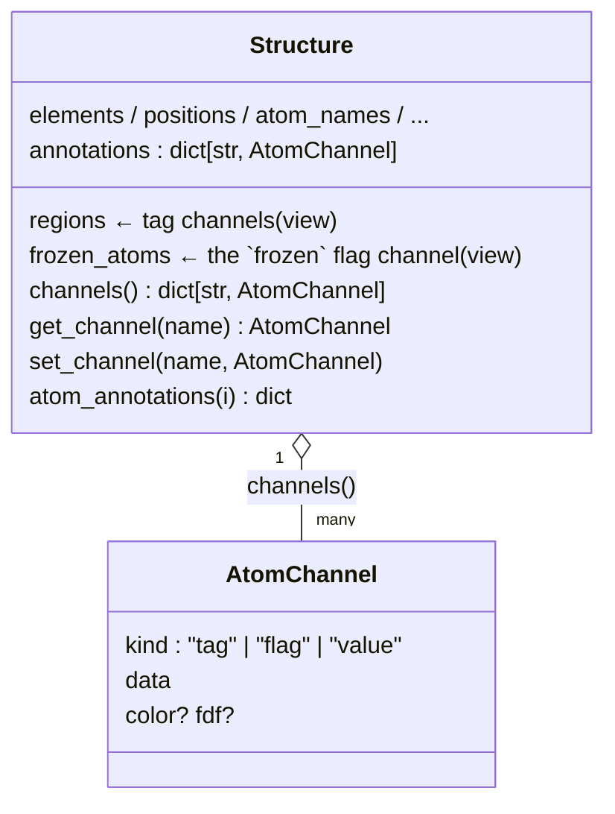
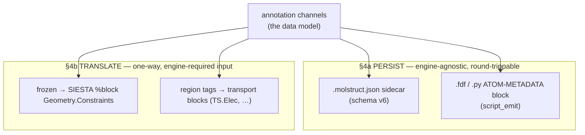

# Atom annotations — the per-atom channel model + region labels

**Role:** contract
**Domain:** model
**Sub-document of:** [`structure.md`](structure.md) (its master — `annotations`,
`regions`, `frozen_atoms` are `Structure` fields). **Companions:**
`structure-sidecars.md` (the `.molstruct.json` envelope these persist in),
`engines/siesta.md` + `engines/transport.md` (the engine input the channels
are *translated* into — see § 4; the transport electrode-partition physics +
references live in `engines/transport.md`).

Per-atom metadata (which atoms are a region, which are frozen, per-atom charge/
spin/…) is carried by **one extensible annotations layer** on top of the
`Structure` columns. This doc is the contract for that model — the channel
kinds, how they persist, how they become engine input, the region-label
vocabulary, and the JS mirror.

---

## 1. The problem it solves

Without one model, every new per-atom concept means touching four places
separately — `Structure`, the sidecar, the JS store, and the fdf emitter — each
with a hard-coded field. The annotations layer makes all four speak **one
extensible model**, so richer per-atom information flows to every consumer
(fdf, future setup scripts) without schema churn, and the selector can filter
on *any* of it.

---

## 2. The channel model

`Structure` keeps its typed columns (`elements`, `positions`, `atom_names`,
`residue_ids`, `residue_names`, `chain_ids`). On top sits a set of named
**channels**, each a per-atom metadata stream. Three **kinds** cover current
and foreseeable needs:

| Kind | Shape | Meaning | Examples |
|---|---|---|---|
| `tag` | name → set of atom indices (an atom may be in many) | named region membership | `L-electrode`, `device`, `bridge` |
| `flag` | name → boolean per atom (a subset) | a yes/no property | `frozen` |
| `value` | name → scalar per atom (sparse map idx→value) | a per-atom number/enum | `charge`, `spin`, `basis_override`, `constraint` |

Each channel carries light presentation + emit hints:
`{ kind, data, color?, fdf?: <emit-strategy id> }` (`fdf` drives engine
translation, § 4).

**Built-ins (backward-compatible):** each region label is a `tag` channel
(channel name = the label); `frozen_atoms` is a `flag` channel named `frozen`.
`Structure.regions` and `Structure.frozen_atoms` remain as **convenience
accessors backed by the annotations layer** — existing callers keep working,
they are just views over channels now.



### 2.1 Index stability — channels remap on structure edits (load-bearing)

Channels are **keyed by atom index**, so any structure mutation (add/delete
atom) MUST remap every channel or metadata silently corrupts. Every
atom-count-changing modify op carries the remap in lockstep: the built-ins via
`modify.py::remap_frozen_and_regions(old_to_new)`, and the extensible channels
via `remap_annotations` (`structure.py:204`) — drop indices that vanished,
translate the rest through `old_to_new`; `value` channels remap their key set.
This is a correctness requirement, not an add-on.

---

## 3. Backend surface (Python)

**The channel API** (`structure.py`, shipped):

```python
struct.annotations                       # {name: AtomChannel} — extensible extras
struct.channels() -> {name: AtomChannel} # unified: regions(tag) + frozen(flag) + extras  (:745)
struct.get_channel(name) -> AtomChannel | None                                       # (:759)
struct.atom_annotations(i) -> dict       # everything on atom i (for the UI / filter)
struct.set_channel(name, AtomChannel(...))  # set an EXTENSIBLE channel; built-in names
                                            # rejected -> edit .regions / .frozen_atoms
```

Built-ins keep their existing storage (`.regions` / `.frozen_atoms`) and are
*surfaced* as channels by `channels()`; extensible channels live in
`.annotations`. Module helpers: `AtomChannel` (`:105`), `annotations_to_json` /
`annotations_from_json` (the JSON codec used by `metadata_to_dict` /
`apply_metadata_dict` — see `structure.md § 2.2`), `copy_annotations` (`:199`),
`remap_annotations` (`:204`).

---

## 4. Two concerns: persist the data vs. translate it into engine input

These are **different and must not be conflated**.



### 4a. Persistence (data — engine-agnostic, round-trips)

The channels persist **identically wherever a structure is saved**:

- **`.molstruct.json` sidecar.** `annotations` rides alongside
  `regions`/`frozen_atoms`/`cell`/… The annotations field was **added at schema
  v4**; the **current schema is v6** (`sidecars/molstruct.py:72`). Envelope +
  version details are in `structure-sidecars.md`.
- **The `.fdf` / `.py` ATOM-METADATA reserved comment block.** The *same* data
  embedded in the generated script's comment area — the script's
  engine-agnostic copy of the data model (a PySCF script carries the identical
  block). `script_emit.emit_atom_metadata` (`:212`) writes it;
  `apply_inbody_atom_metadata` (`:305`) reads it back.

This is **data**, not engine setup — it records what the user labelled, nothing
about how a simulation runs.

**Results-tab recovery bridge.** The trajectory inspector loads *coordinates*
from a run's output logs (geometry only — the labels aren't there, they're in
the input script's block). So `parse/scripts/atom_metadata.py::atom_metadata_json_for_run_dir(run_dir, n_atoms)`
(`:93`) finds the run's input script, extracts the block, guards it against the
trajectory's atom count (mismatch → `None`, never breaks the load), and
`/api/watch/load` surfaces it as `atom_metadata`. The inspector hands it to
`molview.data.installMolecule({text, atomMetadata})`; `/api/build/load` applies
it via `apply_to_structure` — the same seam a sidecar uses. **Trusted fragment
≠ sidecar file:** the block omits the sidecar envelope's `structure_hash`, so
it is a **distinct** `atom_metadata` body field applied through
`apply_to_structure` directly, NOT the strict `sidecar` field (which routes
through `molstruct.load_text`, the validator for untrusted standalone files,
and would reject the envelope-less block).

### 4b. Engine translation (one-way: data model → engine input)

The engine's physics *requires* certain metadata as input blocks. This reads
the data model and translates the relevant parts — one-way, not how the data is
stored.

| Metadatum | Engine block | Why the engine needs it |
|---|---|---|
| `frozen` | SIESTA `%block Geometry.Constraints` | tells the relaxer which atoms not to move (electrode atoms fixed so the lead coupling is right) |
| region tags | transport/electrode blocks (`TS.Elec`, …) | defines the device/lead partition the NEGF solver requires — see `engines/transport.md` |

So the same `frozen` datum plays two roles: *persisted* as data (§ 4a) **and**
*translated* into `Geometry.Constraints` (§ 4b) — same source, two outputs.

**Extension point (additive):** a channel may carry `fdf = "<strategy-id>"`; a
registered strategy `(channel, struct) → engine lines` is invoked during
assembly (e.g. a future `initspin` value channel → `%block DM.InitSpin`). A
channel with **no** strategy is not translated — it still persists (§ 4a), it
just isn't a simulation parameter. No emitter rewrite, no risk to the proven
`frozen`/region built-ins.

---

## 5. Region-label vocabulary (which tags mean electrodes)

Region labels are `tag` channels; a subset of the vocabulary drives the
transport emitter. Users assign labels in the Modify tab (charset
`^[A-Za-z][A-Za-z0-9_\-]*$`).

> **The convention, in one line:** any region whose label ends with
> `-electrode`, `_electrode`, or bare `electrode` (case-insensitive) is a
> transport **lead**. The Python helper is
> `config.transport.is_electrode_label(label)` (`:94`); its JS mirror is
> `region-label-definitions.js::isElectrodeLabel` (pinned to agree by
> `test_region_label_definitions_js.py`).

The canonical labels the Modify tab ships and the emitter interprets:

| Label | Role (data-model meaning) |
|---|---|
| `L-electrode` | left semi-infinite lead — the **bulk** slice SIESTA replicates as a lead |
| `R-electrode` | right lead (mirror of L for the canonical 2-terminal case) |
| `bridge` | scattering region — the molecule + any lead-side atoms that break periodicity; **implicit** ("not in any electrode region"), not an emitted block |
| `interface` *(optional)* | a sub-label flagging contact atoms still inside `bridge` (for projected-DOS / charge-transfer); does **not** change the partition |
| `<name>-electrode` | additional lead (multi-terminal / asymmetric); the stem before the suffix becomes the SIESTA block name |

**The emitter behaviour** — how `transiesta.py::_find_electrode_regions`
(`:195`) discovers leads, sorts by z-centroid, assigns chempot `Left`/`Right` +
`semi-inf-direction`, emits `%block TS.Elec.<stem>`, the atom-ordering
contiguity requirement, the bias-direction convention, and the NEGF literature
references (Brandbyge PRB 65 165401, Stokbro, Reed, Solomon) — belongs with the
transport engine: **`engines/transport.md`** (migrating in the engines wave;
preserved meanwhile in the kept `old_docs/_migrated_region-labels.md`).

---

## 6. Frontend surface (JS) — the channel model + always-on filter

The JS mirrors § 2: everything filterable is a **channel**. A pure
channel-model layer sits below the store, panel, and viewer-adapter.

| Layer | Module | Owns |
|---|---|---|
| **L1** low-level presentation API | `lib/molview/_atom-channels.js` + `_atom-index.js` | `atomChannels`/`channelKinds` (channel taxonomy + order) and `toDisplay`/`fromDisplay`/`shiftExpression` (index base) — pure, no DOM/store/HTTP |
| **L2** store | `_selection-store-impl.js` | atoms + filter drafts; `knownChannels()` (via L1); `_filterToRule` (draft → server rule) |
| **L3** UI | `selection-panel.js` (+ viewer-adapter) | renders the filter over `knownChannels()`; overlays colour by channel |
| server | `/api/selection/*` | supplies per-atom channels + evaluates rules |

> L1 moved from `lib/workspace/` to `lib/molview/` with the data-model
> relocation. It returns **values/model**, never finished presentation (no
> `"#5"` string, no widget); L2/L3 compose its primitives and must not
> re-derive them (no rogue `atom.index + 1`, no re-implementing the
> regions-vs-frozen split). Conformance is bound by tests, not trust — including
> the standalone embed (`mol-viewer-embed.js`), whose inline `+1` is pinned to
> L1's `toDisplay` by `test_atom_index_js`.

```js
atomChannels(atom) -> { element:{kind:"category",value:"C"},
                        residue:{kind:"category",value:"ALA"},
                        "L-electrode":{kind:"tag"}, frozen:{kind:"flag"},
                        charge:{kind:"value",value:-1.0}, ... }
channelKinds(atoms) -> [{name,kind}]   // every filterable channel present
```

**Filter contract:** filter drafts are a uniform channel filter — `tag`/`flag` →
membership, `category` → equals, `value` → a range predicate. `knownChannels()`
enumerates every filterable channel, so the UI no longer special-cases
regions-vs-frozen. Translation to server rules stays in `_filterToRule`
(`tag`/`flag` → `by_region`; the existing `by_element`/`by_index`/`by_label`
drafts still work, mapped onto the generalized model).

---

## 7. Status

**Shipped:** the channel model (`AtomChannel`, `channels()`, extensible
`annotations`) + the index-remap; sidecar persistence (annotations since v4,
current v6) + the ATOM-METADATA block emit/apply + the Results recovery bridge;
the two built-in engine translations (`frozen` → `Geometry.Constraints`, region
tags → transport blocks); the region-label vocabulary + `is_electrode_label`
(Python + JS); the JS L1/L2/L3 channel model + the generalized filter.

**Open work** (tracked in `roadmap.md`): **`value`-channel filtering
end-to-end** — the server must include `value` channels in
`/api/selection/atoms` and resolve a `by_value` rule, and there is no
`value`-channel *producer* yet (no feature writes per-atom charge/spin), so the
`value` kind is modelled but not yet exercised. The **generic `fdf`-strategy
registry** for translating *new* channels into engine blocks is the additive
extension point above; only the two built-ins are wired today.
