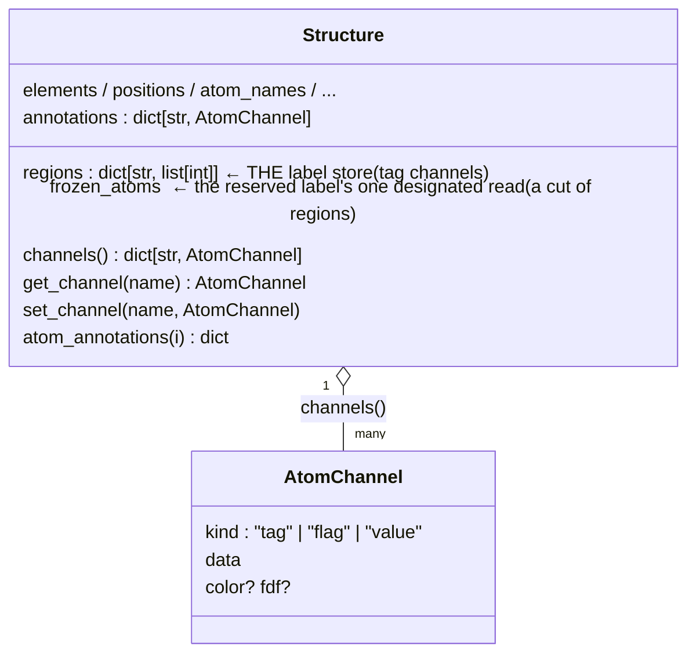
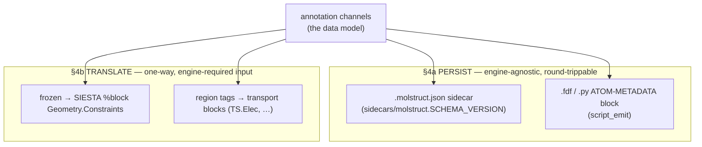

# Atom annotations — the per-atom channel model + region labels

**Role:** contract
**Domain:** model
**Sub-document of:** [`structure.md`](?doc=model/structure.md) (its master — `annotations`,
`regions` is the `Structure` field; `frozen_atoms` is its reserved-label read). **Companions:**
`structure-molstruct.md` (the `.molstruct.json` envelope these persist in),
`engines/siesta.md` + `engines/transport.md` (the engine input the channels
are *translated* into — see § 4; the transport electrode-partition physics +
references live in `engines/transport.md`).

Per-atom metadata (which atoms are a region, which are frozen, per-atom charge/
spin/…) is carried by **one extensible annotations layer** on top of the
`Structure` columns. This doc is the contract for that model — the channel
kinds, how they persist, how they become engine input, the region-label
vocabulary, and the JS mirror.

---

## 1. The problem it solves

Without one model, every new per-atom concept means touching four places
separately — `Structure`, the sidecar, the JS store, and the fdf emitter — each
with a hard-coded field. The annotations layer makes all four speak **one
extensible model**, so richer per-atom information flows to every consumer
(fdf, future setup scripts) without schema churn, and the selector can filter
on *any* of it.

---

## 2. The channel model

`Structure` keeps its typed columns (`elements`, `positions`, `atom_names`,
`residue_ids`, `residue_names`, `chain_ids`). On top sits a set of named
**channels**, each a per-atom metadata stream. Three **kinds** cover current
and foreseeable needs:

| Kind | Shape | Meaning | Examples |
|---|---|---|---|
| `tag` | name → set of atom indices (an atom may be in many) | named region membership | `L-electrode`, `device`, `bridge` |
| `flag` | name → boolean per atom (a subset) | a yes/no property | *(none — a label already expresses "this atom is X"; kept for a case a `tag` cannot serve)* |
| `value` | name → scalar per atom (sparse map idx→value) | a per-atom number/enum | `charge`, `spin`, `basis_override`, `constraint` |

Each channel carries light presentation + emit hints:
`{ kind, data, color?, fdf?: <emit-strategy id> }` (`fdf` drives engine
translation, § 4).

**Built-ins:** every label is a `tag` channel, channel name = the label.
`Structure.regions` IS the label store, and the **reserved** labels are in it
with everything else — `frozen_atoms` is a label, not a kind of its own.

`Structure.frozen_atoms` is the **one designated read** of that reserved label
(`web/molview.md` § 6.6: a reserved meaning costs a name and one accessor). It is
a cut of `regions`, so it cannot go stale, and it is the only place the name is
spelled — callers ask it rather than reaching into the store for the name, which
is how a second spelling gets into a second place. Assigning to it writes the
label; assigning an empty set removes it, so "carries no label" and "carries an
empty label" cannot both exist.

> **Until 2026-07-31 this was a second storage** — `frozen_atoms` was its own
> field, surfaced as a `flag` channel beside the labels. It cost two validators,
> two remaps on every atom-count change, two keys in the saved file, and a live
> inconsistency: the web layer sent the fact twice (a label AND an `is_frozen`
> flag), so to stop the selection panel double-rendering it, the label was
> supplied on `/api/selection/eval` and withheld on `/api/selection/atoms`. Two
> routes, two answers about one structure. Folding it into the label store
> removed all of it and added one accessor.


```mermaid
classDiagram
    class Structure {
        elements / positions / atom_names / ...
        regions : dict[str, list[int]]   ← THE label store (tag channels)
        frozen_atoms  ← the reserved label's one designated read (a cut of regions)
        annotations : dict[str, AtomChannel]
        channels() dict[str, AtomChannel]
        get_channel(name) AtomChannel
        set_channel(name, AtomChannel)
        atom_annotations(i) dict
    }
    class AtomChannel {
        kind : "tag" | "flag" | "value"
        data
        color?  fdf?
    }
    Structure "1" o-- "many" AtomChannel : channels()
```

### 2.1 Index stability — channels remap on structure edits (load-bearing)

Channels are **keyed by atom index**, so any structure mutation (add/delete
atom) MUST remap every channel or metadata silently corrupts. Every
atom-count-changing modify op carries the remap: the labels via
`modify.py::_reindex_transport_metadata(struct, keep)` (`:75`, ONE pass over the
label store against the survivor-index list — reserved labels remap by the same
rule because they are in it), and the extensible channels via `remap_annotations`
(`structure.py:204`) — drop indices
that vanished, translate the rest; `value` channels remap their key set.
This is a correctness requirement, not an add-on.

---

## 3. Backend surface (Python)

**The channel API** (`structure.py`, shipped):

```python
struct.annotations                       # {name: AtomChannel} — extensible extras
struct.channels() -> {name: AtomChannel} # unified: every label (tag) + extras  (:745)
struct.get_channel(name) -> AtomChannel | None                                       # (:759)
struct.atom_annotations(i) -> dict       # everything on atom i (for the UI / filter)
struct.set_channel(name, AtomChannel(...))  # set an EXTENSIBLE channel; a name a
                                            # label already has -> rejected
struct.frozen_atoms                         # THE read for the reserved label (a cut
                                            # of .regions); assigning writes the label
```

Labels live in `.regions` and are *surfaced* as `tag` channels by `channels()`;
extensible channels live in `.annotations`. There is no third place. Module helpers: `AtomChannel` (`:105`), `annotations_to_json` /
`annotations_from_json` (the JSON codec used by `metadata_to_dict` /
`apply_metadata_dict` — see `structure.md § 2.2`), `copy_annotations` (`:199`),
`remap_annotations` (`:204`).

---

## 4. Two concerns: persist the data vs. translate it into engine input

These are **different and must not be conflated**.


```mermaid
flowchart TB
    CH["annotation channels<br/>(the data model)"]
    subgraph PERSIST["§4a PERSIST — engine-agnostic, round-trippable"]
        SC[".molstruct.json sidecar<br/>(sidecars/molstruct.SCHEMA_VERSION)"]
        BLK[".fdf / .py ATOM-METADATA block<br/>(script_emit)"]
    end
    subgraph TRANSLATE["§4b TRANSLATE — one-way, engine-required input"]
        CON["frozen → SIESTA %block Geometry.Constraints"]
        TS["region tags → transport blocks (TS.Elec, …)"]
    end
    CH --> SC
    CH --> BLK
    CH --> CON
    CH --> TS
```

### 4a. Persistence (data — engine-agnostic, round-trips)

The channels persist **identically wherever a structure is saved**:

- **`.molstruct.json` sidecar.** `annotations` rides alongside `regions`/`cell`/…
  The annotations field was **added at schema v4**; the current schema is
  `sidecars/molstruct.SCHEMA_VERSION`, and the versions read are
  `sidecars/molstruct.READABLE_VERSIONS` — cite the constants, never re-spell
  them (this text said *v9* and *{7, 8, 9}* while the code had moved to 11).
  v7 moved the reserved `frozen_atoms` label into `regions` and stopped writing
  a top-level key for it — one store means one key. **Schema 3–6 do not load**:
  the reader accepts nothing before 7, and `apply_metadata_dict`
  raises on a top-level `frozen_atoms` because it is not a metadata field.
  (This said the opposite — that v3–v6 still load and are folded in — until
  2026-09-05. Nothing folded them: `METADATA_FIELDS` has never contained the
  key, and the translation that did exist elsewhere was deleted the same day.) Envelope + version details
  are in `structure-molstruct.md`.
- **The `.fdf` / `.py` ATOM-METADATA reserved comment block.** The *same* data
  embedded in the generated script's comment area — the script's
  engine-agnostic copy of the data model (a PySCF script carries the identical
  block). `script_emit.emit_atom_metadata` (`:212`) writes it;
  `apply_atom_metadata` reads it back.

This is **data**, not engine setup — it records what the user labelled, nothing
about how a simulation runs.

**Results-tab recovery bridge.** The trajectory inspector loads *coordinates*
from a run's output logs (geometry only — the labels aren't there, they're in
the input script's block). So `/api/watch/load` asks the run the opened file
belongs to what ITS OWN deck declared (`runs.declared(run).atom_metadata_for(n_atoms)`
— never the first deck a search of the folder meets), guards the block against
the trajectory's atom count (mismatch → `None`, never breaks the load), and
surfaces it as `atom_metadata`, and the same load applies it to the structure
it answers with, through the block's one reader (`script_emit.apply_atom_metadata`).
**Trusted fragment ≠ sidecar file:** the block omits the sidecar envelope's
`structure_hash`, so it is applied by that reader and never through
`molstruct.load_text`, the validator for untrusted standalone files, which
would reject the envelope-less block. *(The browser posted it back to
`/api/build/load` beside a text until 2026-09-25.)*

### 4b. Engine translation (one-way: data model → engine input)

The engine's physics *requires* certain metadata as input blocks. This reads
the data model and translates the relevant parts — one-way, not how the data is
stored.

| Metadatum | Engine block | Why the engine needs it |
|---|---|---|
| `frozen_atoms` | SIESTA `%block Geometry.Constraints` | tells the relaxer which atoms not to move (electrode atoms fixed so the lead coupling is right) |
| region tags | transport/electrode blocks (`TS.Elec`, …) | defines the device/lead partition the NEGF solver requires — see `engines/transport.md` |

So the same `frozen_atoms` label plays two roles: *persisted* as data (§ 4a)
**and** *translated* into `Geometry.Constraints` (§ 4b) — one source, two
outputs. The translation is the point of use § 6.6 of `web/molview.md` describes,
and it reads the label through `struct.frozen_atoms` rather than by name.

**Extension point (additive):** a channel may carry `fdf = "<strategy-id>"`; a
registered strategy `(channel, struct) → engine lines` is invoked during
assembly (e.g. a future `initspin` value channel → `%block DM.InitSpin`). A
channel with **no** strategy is not translated — it still persists (§ 4a), it
just isn't a simulation parameter. No emitter rewrite, no risk to the proven
`frozen_atoms`/region built-ins.

---

## 5. Region-label vocabulary (which tags mean electrodes)

Region labels are `tag` channels; a subset of the vocabulary drives the
transport emitter. Users assign labels in the Modify tab (the data model only requires a
non-empty string — `Structure._validate_regions`).

> **The convention, in one line:** the two transport **leads** are the regions
> named exactly `L-electrode` and `R-electrode`. Their one list is
> `transport.sort.ELECTRODE_LABELS`, and every reader asks it — the emitter,
> the lead extraction, the checks; the browser does not decide electrode-ness at
> all, it carries the labels and the server reads them. *(User, 2026-10-02:
> "these are just two matching names". Until that day any label ending
> `-electrode`, `_electrode` or bare `electrode` was a lead, by
> `is_electrode_label` — a pattern written 2026-06-18 for a multi-lead
> transport the ladder never built, so a third such label passed the sort and
> the device deck declared a lead no rung writes. The vocabulary sat in
> `config/transport.py` until the same day, when that module's config class
> retired and it moved to the module that owns the partition the labels make.)*
>
> *(This cited a JS mirror, `region-label-definitions.js::isElectrodeLabel`,
> "pinned to agree by `test_region_label_definitions_js.py`". Both files went in
> `6bf22242`, when the UI stopped hand-listing labels and began choosing from
> what a structure actually carries. Nothing replaced them, because nothing
> needed to: one implementation cannot disagree with itself.)*

The canonical labels the Modify tab ships and the emitter interprets:

| Label | Role (data-model meaning) |
|---|---|
| `L-electrode` | left semi-infinite lead — the **bulk** slice SIESTA replicates as a lead |
| `R-electrode` | right lead (mirror of L for the canonical 2-terminal case) |
| `bridge` | scattering region — the molecule + any lead-side atoms that break periodicity; not an emitted block, but **assigned, never implied**: the transport sort refuses an atom that carries no partition label, or two (`transport/sort.py`) |
| `buffer` *(optional)* | atoms excluded from the NEGF region (`TS.Atoms.Buffer`) — padding at the outer ends of the device, beyond the electrode blocks |
| `interface` *(optional)* | a sub-label flagging contact atoms still inside `bridge` (for projected-DOS / charge-transfer); does **not** change the partition |

**The emitter behaviour** — how `transiesta.py::_find_electrode_regions`
finds the two leads, sorts them by z-centroid, assigns chempot `Left`/`Right` +
`semi-inf-direction`, emits `%block TS.Elec.<stem>`, the atom-ordering
contiguity requirement, the bias-direction convention, and the NEGF literature
references (Brandbyge PRB 65 165401, Stokbro, Reed, Solomon) — belongs with
the transport engine and lives in
[`engines/transport.md`](?doc=engines/transport.md) (the engines wave closed
this split; the legacy source is archived at
`archive/old_docs/protocols/region-labels.md`).

### 5.1 The `#` suffix — a label molbuilder wrote itself

**The rule:** a region label ending in `#` was written by molbuilder, not by a
person. It is a convention, deliberately not enforced: a hand-typed `mylabel#`
is legal and harmless, because the one thing the marker protects against is a
label being read as an electrode, and a `#` label never is one of the two
lead names. Enforcing it would
buy nothing and cost either a silent refusal at the assign box or a
client-side message channel MolView does not have — its notices surface is
what the SERVER said about the structure (§ 6.8), not a place for the browser
to answer itself back.

One thing writes them today: `/api/build/molecule` signs a generated structure
with the text that produced it — `CCO#`, `AG#`, `ATCG#` — as one region over
every atom. So *select the thing I just built* is a click on a name the user
already recognises, and the provenance persists in the `.molstruct.json` beside
the geometry instead of in a status line the next load erases.

**Why a marker, and only here.** Region labels are one namespace, shared by a
person's own labels and by the ones molbuilder reads — `L-electrode` and
`R-electrode` among them, the semi-infinite leads (§ 5). The name generator takes
whatever a person types, and the label it writes is that text with `#` after
it, so whatever was typed, the label is never a lead name; and a
machine-written label stays told apart from a hand-written one, which is the
thing a shared namespace otherwise loses.

**It marks provenance, not reservation.** `frozen_atoms` is reserved — something
downstream acts on it — and deliberately does **not** take the suffix. Nothing
reads its name as a pattern: it is spelled once (`FROZEN_LABEL`), matched
whole, and a person assigns it on purpose in the Modify tab. The suffix is for
the one place a free-text input names a region, and it stays there.
*(User decision, 2026-09-07: "just for the electrodes … frozen_atoms is so
clear we don't want to touch that.")*

*(The marker was written 2026-09-07 against the `*-electrode` pattern, when any
label ending `-electrode` was a lead and a PubChem search for `gold-electrode`
would have labelled the whole molecule a TranSIESTA electrode — silently, at
HTTP 200. The pattern retired 2026-10-02 (§ 5); the marker stays as
molbuilder's signature.)*

Measured to survive both persistence paths: the `.molstruct.json` pair, and the
deck's ATOM-METADATA block — whose lines are already `#`-prefixed comments and
whose readers strip a prefix rather than splitting on the character.

---

## 6. Frontend surface (JS) — the channel model + always-on filter

The JS mirrors § 2: everything filterable is a **channel**. A pure
channel-model layer sits below the store and the panel, all three inside
MolView (`web/molview.md` § 9.5).

| Layer | Module | Owns |
|---|---|---|
| **L1** low-level presentation API | `lib/molview/_atom.js` | `toDisplay` / `fromDisplay` / `shiftExpression` / `expressionToCode` (the index base), and `KIND` / `atomChannels` / `channelKinds` (the channel taxonomy and its order: element, residue, then the labels by name) — pure, no DOM/store/HTTP |
| **L2** store | `lib/molview/stores.js` | the selection's filter rows; `buildRule` / `rowToRule` (row → server rule) |
| **L3** UI | `lib/molview/ui.js` (the Selection page's filter rows) | renders a row per filter — a kind menu and its value |
| server | `/api/selection/eval` | evaluates a rule over the atoms the viewer sends |

L1 returns **values/model**, never finished presentation (no `"#5"` string,
no widget); L2/L3 compose its primitives and must not re-derive them — every
atom number on screen goes through `toDisplay` (`ui.js`, `render-engine.js`),
and no caller writes the `+1` itself.

```js
atomChannels(element, facts) -> { element:{kind:"category",value:"C"},
                                  residue:{kind:"category",value:"ALA"},
                                  "L-electrode":{kind:"tag"},
                                  frozen_atoms:{kind:"tag"} }
channelKinds(elements, annotations) -> [{name,kind}]   // every filterable channel present
```

**Filter contract:** a filter row is a kind and a value — `by_element` and
`by_residue` match on equality, `by_label` on membership, `by_index` on an
index range — and a reserved label is an ordinary one, so the UI special-cases
nothing. Translation to server rules is `rowToRule` (`stores.js`):
`by_element` → `by_element`, `by_index` → `by_index_range` (with the
1-based→0-based shift), `by_residue` → `by_residue_name`, and `by_label` →
`by_region`. *(Not built in the browser: a `value` channel (`charge`, …) and
its range predicate — `KIND` holds `category` and `tag` — and the kind menu
read from `channelKinds` instead of a literal list in `ui.js`; plan § 8,
rows 11 and 14.)*

---

## 7. Status

**Shipped:** the channel model (`AtomChannel`, `channels()`, extensible
`annotations`) + the index-remap; ONE label store with the reserved `frozen_atoms`
label in it and `Structure.frozen_atoms` as its designated read (2026-07-31);
sidecar persistence (annotations since v4, current v11) + the ATOM-METADATA block
emit/apply + the Results recovery bridge;
the two built-in engine translations (`frozen_atoms` → `Geometry.Constraints`, region
tags → transport blocks); the region-label vocabulary + `ELECTRODE_LABELS`
(Python, § 5); the JS L1/L2/L3 channel model + the generalized filter.

**The first value channel molbuilder owns: `mass_amu`** *(2026-10-10)* —
each atom's mass, the one a mode's frame set's coordinate is weighted by,
defined with that set ([`model/structure.md`](?doc=model/structure.md)
§ 2.2f) and spelled once, `frameset.MASS_CHANNEL`. Every atom carries one, a
positive finite number in amu; molbuilder reads it there and nowhere else
reads a mass off a structure. Any other value channel is the writer's: carried,
remapped and shown, never read for a meaning.

**Open work** (`plans/plan.md` **W15**): **`value`-channel filtering and
display** — the server must resolve a `by_value` rule, and MolView must show a
value channel. The channels already reach the browser on the load door
(`/api/build/load`, `structure_to_dict`) and travel in MolView's model and back
(this said they must still be brought there). *(This named
`/api/selection/atoms` until 2026-09-07. That route is deleted — it read a file
the browser had already loaded, which is the opposite of where this feature
belongs: MolView holds the atoms, so a value channel travels with them.)* The
first producer is a mode's frame set (`mass_amu`, above); no feature writes
per-atom charge or spin yet. The **generic `fdf`-strategy
registry** for translating *new* channels into engine blocks is the additive
extension point above; only the two built-ins are wired today.
