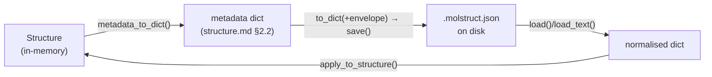

# The `.molstruct.json` file — a structure's saved metadata

**Role:** contract
**Domain:** model
**Sub-document of:** [`structure.md`](?doc=model/structure.md) (its master). **Companions:**
`structure-annotations.md` + `structure-periodicity.md` (the metadata this file
carries), `engines/` (the **boundary-condition contract** — how the `frozen`/
`regions` this file stores are delivered to an engine's input script, migrating
from `sidecar-contract.md`; see § 7).

When a structure is saved, its geometry goes in the `.xyz` and everything the
`.xyz` has no room for — region labels, frozen atoms, the cell, per-atom
annotations — goes in a companion JSON file next to it: `<stem>.molstruct.json`.
This doc is the contract for that file: its layout, how it is versioned, how it
is read and written, and how it stays paired with its `.xyz`.

> **One file, one authority.** The `.molstruct.json` schema lives in exactly one
> place — the server module `sidecars/molstruct.py`. The browser **never**
> authors it (a browser-written sidecar had no `schema_version` and the load
> door rejected it — the save→reload breaker). The metadata *fields* it carries
> are named only by `Structure`'s codec (see `structure.md § 2.2`); this file
> just wraps them in an envelope.

---

## 1. Layout — envelope + metadata

A `.molstruct.json` is a JSON object: a small **envelope** of bookkeeping keys,
plus the structure's **metadata fields** spread in alongside them.

```json
{
  "schema_version": 7,
  "n_atoms_total": 2,
  "structure_hash": "9f2c…(sha256 hex)",
  "created_by": "molbuilder",
  "created_at": "2026-07-26T12:00:00Z",

  "regions": {"L-electrode": [0], "frozen_atoms": [1]},
  "cell": [[10,0,0],[0,10,0],[0,0,10]],
  "cell_origin": null,
  "pbc": [true, true, false],
  "axis_kind": ["periodic", "periodic", "isolated"],
  "vacuum": [0.0, 0.0, 12.0],
  "annotations": {"charge": {"kind": "value", "data": {"0": 0.1}}},

  "selection_rules": {}
}
```

| Envelope key | Meaning |
|---|---|
| `schema_version` | the on-disk schema (§ 2) — the reader checks it first |
| `n_atoms_total` | atom count the metadata was computed against; a mismatch on load is refused, never mis-applied |
| `structure_hash` | sha256 content hash of the paired geometry (hex, ≥16 chars) — the integrity pin (§ 3) |
| `created_by` / `created_at` | provenance stamp (`created_at` is ISO-8601 UTC, `…Z`) |
| `selection_rules` | a sidecar-**only** pass-through, **not** a `Structure` field (§ 4) |

The **metadata fields** (`regions`, `cell`, `cell_origin`,
`pbc`, `axis_kind`, `vacuum`, `annotations`) are exactly the set `Structure`'s
codec owns — they are **spread in, not re-listed** by the sidecar
(`structure_fields_via_dataclass` round-trips them through a scratch `Structure`,
so the sidecar can never carry a field the codec doesn't know; this is what
closed the `cell_origin`-dropped-on-reload bug). Their meanings live in
`structure-periodicity.md` and `structure-annotations.md`; the codec authority
is `structure.md § 2.2`.

---

## 2. Schema versioning

Current schema: **v6** (`SCHEMA_VERSION`). The reader accepts
**v3–v6** (`_READABLE_SCHEMA_VERSIONS = (3, 4, 5, 6)`); an out-of-range version
is refused with a clear error.

| Version | Change |
|---|---|
| v1 / v2 | old `fixed_atoms` key — **not** readable; such a file must be re-opened + re-saved from the Molbuilder tab to upgrade |
| v3 | `regions` + `frozen_atoms` (no annotations) |
| v4 | **adds** the extensible annotation channels (`structure-annotations.md`) — additive, so v3 files still load (annotations absent → empty) |
| v5 | **drops** `kgrid` (it is a `SiestaConfig` sampling knob, not geometry — see `structure-periodicity.md`). A payload still carrying one is refused by the metadata gate, not ignored: a key nobody reads is metadata the writer thinks it saved |
| v6 | `frozen_atoms` still a top-level key of its own |
| v7 | **current** — the reserved `frozen_atoms` label moves into `regions` with every other label and the top-level key is no longer written. One store, one key. v3–v6 files still load: `apply_metadata_dict` folds the old key into the label store on read. Code holding a raw payload asks `molstruct.frozen_atoms(payload)`, the one read that knows which schema put it where (`structure-annotations.md` § 2) |

**The tolerance rules** make old files keep working: on read, an **unknown key
is ignored** and an **absent key falls back to its default** (`apply_metadata_dict`
is full-replace — see `structure.md § 2.2`). So a field added in a later
version never breaks an older reader, and an older file never breaks a newer
one. Adding a metadata field means bumping `SCHEMA_VERSION` and adding the new
number to `_READABLE_SCHEMA_VERSIONS`.

---

## 3. `structure_hash` — the integrity pin

`structure_hash` is the sha256 of the paired geometry file's bytes
(`sha256_of_file`, stable across platforms). It ties a sidecar to *the exact
structure it was computed on*: the metadata is indexed by atom position, so
applying it to a different geometry would mis-assign labels.

Two independent guards, deliberately kept separate:
- **On apply** (`apply_to_structure`), the sidecar's `n_atoms_total` must equal
  the structure's atom count, or the apply is **refused** (never partially
  applied). `structure_hash` is **not** verified here.
- **The caller** compares `structure_hash` against the geometry it loaded, to
  detect a sidecar paired with a *changed* structure — a stricter check the
  file-access layer owns.

---

## 4. `selection_rules` — a sidecar-only pass-through

`selection_rules` is **not** a `Structure` field and does not go through the
metadata codec. It is a sidecar-only map, keyed by region label, that records
*how* a region was selected (a rule, e.g. "all atoms within 3 Å of …") so the
selection can be re-evaluated. It is validated by `normalise_selection_rules`
(each target must name a real label — `frozen_atoms` is one, so it needs no
clause of its own; a v6 rule targeting it keeps working unchanged) and
**normalised** — each rule is re-parsed and re-serialised, so the stored form is
canonical, not byte-for-byte. It rides in the envelope, alongside the metadata,
not inside it.

---

## 5. The codec (server, one home)

All read/write of `.molstruct.json` goes through `sidecars/molstruct.py`:



| Function | Role |
|---|---|
| `sidecar_path_for(xyz)` (`:89`) | derive `<stem>.molstruct.json` from a geometry path — the one pairing rule |
| `to_dict(fields, n_atoms_total, structure_hash, …)` (`:195`) | build the envelope + spread the validated metadata fields |
| `save(path, …)` (`:315`) | atomic write (temp sibling + `os.replace`) |
| `load(path)` (`:406`) / `load_text(text)` (`:418`) | read + validate the version → a normalised metadata dict |
| `apply_to_structure(struct, dict)` (`:370`) | apply the metadata onto a `Structure` (via `apply_metadata_dict`); guards `n_atoms_total` |

Callers do not touch the field list — `Structure`'s two metadata methods are the
sole namers (`structure.md § 2.2`). The higher-level paired-file door
`StructureCodec` (`structure.md § 2.4`) wraps this codec together with the
`.xyz` read/write for atomic pair I/O.

---

## 6. Pairing — the sidecar follows its structure

The `.xyz` and its `.molstruct.json` are a unit; a file operation on one must
carry the other, or the labels are orphaned (renaming `water.xyz` →
`bridge.xyz` once left `water.molstruct.json` matching no structure, silently
losing the user's labels).

`POST /api/files/{rename,move,copy}` (`web/blueprints/files.py`, via
`_paired_sidecar_path` `:209` / `_existing_paired_sidecar` `:220`) move or copy
both files in lockstep:

| Concern | Behaviour |
|---|---|
| Detection | source must be `.xyz`/`.pdb`; pair the `<stem>.molstruct.json` if it exists (a bare `.molstruct.json` rename is single-file) |
| Atomicity | rename/move use `os.replace` on both legs; a failed sidecar leg **rolls back** the geometry leg. Copy uses `shutil.copy2`; a failed sidecar leg unlinks the half-copy |
| No-overwrite | the destination sidecar slot must be empty, else the whole op refuses with **409 before touching either file** |
| Directories | `move`/`copy` refuse directory sources (v1); directories have no sidecar |

Engine generators load the sidecar through `apply_to_structure`, not these
file-ops endpoints, so the sidecar-as-source-of-truth contract is unaffected by
a rename.

---

## 7. What this file's metadata drives (pointer)

Storing the labels is one thing; *delivering* them correctly to
an engine's input script — the **three-stage boundary-condition contract**
(the setup form pre-fills from the sidecar, the config is authoritative at
Generate, the script emits the user's set verbatim, and preflight **warns**
rather than silently absorbing a divergence or an unrecognized label) — is a
separate contract. It spans the setup form, the config, and each engine's
emitter + preflight, so it lives with the engines: **`engines/`** (migrating
from `sidecar-contract.md`; preserved in the kept source until the engines
wave). The per-engine table of *which* labels each engine consumes (SIESTA
`frozen_atoms`→`Geometry.Constraints`; TranSIESTA `regions`→electrode blocks; spectra
warns on both) is part of that contract.

**Sidecar consumers** (which code reads a `.molstruct.json`): the SIESTA and
PySCF/spectra and TranSIESTA generators (at emit), the selection endpoints
(`/api/selection/eval`, `/api/selection/atoms`), and the PySCF trajectory
parser (reads the `frozen_atoms` label to mask pinned atoms from the
max-force series).
The engines-wave contract carries the full, current consumer list.
