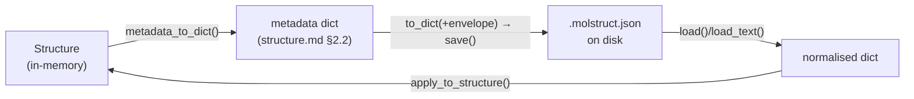

# The `.molstruct.json` file — a structure's saved metadata

**Role:** contract
**Domain:** model
**Sub-document of:** [`structure.md`](?doc=model/structure.md) (its master). **Companions:**
`structure-annotations.md` + `structure-periodicity.md` (the metadata this file
carries), `engines/` (the **boundary-condition contract** — how the `frozen`/
`regions` this file stores are delivered to an engine's input script, migrating
from `sidecar-contract.md`; see § 7).

When a structure is saved, its geometry goes in the `.xyz` and everything the
`.xyz` has no room for — region labels, frozen atoms, the cell, per-atom
annotations — goes in a companion JSON file next to it: `<stem>.molstruct.json`.
This doc is the contract for that file: its layout, how it is versioned, how it
is read and written, and how it stays paired with its `.xyz`.

> **One file, one authority.** The `.molstruct.json` schema lives in exactly one
> place — the server module `sidecars/molstruct.py`. The browser **never**
> authors it (a browser-written sidecar had no `schema_version` and the load
> door rejected it — the save→reload breaker). The metadata *fields* it carries
> are named only by `Structure`'s codec (see `structure.md § 2.2`); this file
> just wraps them in an envelope.

---

## 1. Layout — envelope + metadata

A `.molstruct.json` is a JSON object: a small **envelope** of bookkeeping keys,
plus the structure's **metadata fields** spread in alongside them.

```json
{
  "schema_version": 9,
  "n_atoms_total": 2,
  "structure_hash": "9f2c…(sha256 hex)",
  "created_by": "molbuilder",
  "created_at": "2026-07-26T12:00:00Z",

  "regions": {"L-electrode": [0], "frozen_atoms": [1]},
  "cell": [[10,0,0],[0,10,0],[0,0,10]],
  "cell_origin": null,
  "pbc": [true, true, false],
  "axis_kind": ["periodic", "periodic", "isolated"],
  "vacuum": [0.0, 0.0, 12.0],
  "annotations": {"charge": {"kind": "value", "data": {"0": 0.1}}},

  "title": "hemeC anchor",
  "atom_names": ["CA", "SG"],
  "residue_ids": [14, 14],
  "residue_names": ["CYS", "CYS"],
  "chain_ids": ["B", "B"],

  "selection_rules": {}
}
```

The identity block (schema 8, 2026-08-20) is **optional and real-only**: a
column appears only when it says something the server would not have
synthesized itself (names ≠ elements, residues ≠ `MOL`, chains ≠ `A`,
resids ≠ 1, a non-empty title — `Structure.identity_to_dict` owns that
judgment, beside the synthesis it mirrors).  An xyz-born pair carries none
of them and its sidecar is a v7 sidecar plus a version stamp.

| Envelope key | Meaning |
|---|---|
| `schema_version` | the on-disk schema (§ 2) — the reader checks it first |
| `n_atoms_total` | atom count the metadata was computed against; a mismatch on load is refused, never mis-applied |
| `structure_hash` | sha256 content hash of the paired geometry (hex, ≥16 chars) — the integrity pin (§ 3) |
| `created_by` / `created_at` | provenance stamp (`created_at` is ISO-8601 UTC, `…Z`) |
| `selection_rules` | a sidecar-**only** pass-through, **not** a `Structure` field (§ 4) |

**Two kinds of information, one contract** *(user, 2026-08-20)*: a fact is
**per-atom** — it rides the atom list, one entry per atom, and survives
atom edits because every edit layer carries it with its atom (`regions`
membership, the identity columns, each channel's atom-indexed half) — or it
is **system** — stored separately, whole (`cell`, `cell_origin`, `pbc`,
`axis_kind`, `vacuum`, `title`, each channel's kind/color/fdf).  Everything
in this file is one or the other, and every layer (the codec, the wire, the
viewer's two translation doors) folds and unfolds along exactly that line.

The **metadata fields** (`regions`, `cell`, `cell_origin`,
`pbc`, `axis_kind`, `vacuum`, `annotations`) are exactly the set `Structure`'s
codec owns — they are **spread in, not re-listed** by the sidecar
(`structure_fields_via_dataclass` round-trips them through a scratch `Structure`,
so the sidecar can never carry a field the codec doesn't know; this is what
closed the `cell_origin`-dropped-on-reload bug). Their meanings live in
`structure-periodicity.md` and `structure-annotations.md`; the codec authority
is `structure.md § 2.2`.

> **`vacuum` has three states, and all three are honoured.** `null` means
> *nobody chose one* — which is what earns an isolated axis the default 3 Å gap
> — while `[0, 0, 0]` means *no gap, deliberately*, and is used verbatim
> ([`structure-periodicity.md`](?doc=model/structure-periodicity.md) § 6.1).
>
> A legacy reading briefly folded the second into the first, so that sidecars
> written before the third state existed kept behaving as they had. It cost the
> ability to express a deliberate zero at all, for compatibility with files that
> are residue. Removed 2026-08-03 — a reader that cannot be told what it is
> looking at is worse than one that refuses.

---

## 2. Schema versioning — a readable SET, strict about shape

**Current schema: v9. The reader accepts {7, 8, 9} and nothing else.**

```python
SCHEMA_VERSION    = 9                  # sidecars/molstruct.py
READABLE_VERSIONS = frozenset({7, 8, 9})
```

*(Amended 2026-08-20 and again 2026-08-29, user rulings.)*  The
strictness rule is about **where facts live**, not about the number:
v8 only **added** the optional identity columns, and v9 only **added**
the optional `info` block (free-form, NON-structural metadata —
`archive/2026-09-01-structure-info-plan.md`; absent means "nothing recorded"), so a
v7 or v8 file reads whole under v9 rules.  Refusing them would have
invalidated every pair on disk for changes that lose nothing.  A
version whose facts moved homes (v3's top-level frozen atoms) stays
refused, with an error naming what changed and what to do — never
partially read.

**This is deliberate, and it is not a transitional state.** molbuilder is a new
product with no installed base to protect. Accepting several schemas costs more
than it saves:

- every reader, every test and every debugging session has to hold two shapes in
  mind, and the second one is always the one nobody remembers;
- a tolerant reader hands back a payload that **looks complete and quietly is
  not** — which is exactly what happened. v3–v6 were in the readable list while
  the reader had stopped looking at v3's top-level `frozen_atoms` key, so a real
  junction loaded with its fifty frozen electrode atoms silently gone, and the
  generated SIESTA input carried no `Geometry.Constraints` block. The run
  converged on a structure nobody asked for;
- the data is cheap to regenerate. The confusion is not.

**A version gate that admits a version the code cannot honour is worse than no
gate**, because it converts a loud failure into a quiet one.

### What "refused" means at each surface

| Surface | On a non-v7 payload |
|---|---|
| `molstruct.load` / `load_text` (the `.molstruct.json` sidecar) | raises `MolstructJsonError`; nothing is read |
| `parse.dirs.bundle` (the in-script `ATOM-METADATA` block) | the block is **not** read: `regions` and `frozen_atoms` come back `None`, with a note saying why |
| `/api/build/load`'s `atom_metadata` (that same block, over HTTP) | same answer, for the same reason: the structure loads **without** its labels and a `warn` notice says why. Refusing would make a finished run unopenable, and unopenable is unfixable — the one page that could show the person what is wrong would show them nothing |

Both messages name the specific difference (before v7 the frozen atoms sat in a
top-level key rather than in `regions`) and say what to do: re-save the structure,
or re-generate the script.

### Unknown keys are refused, not ignored

A key that is neither a structure metadata field nor an envelope key is an
**error**, at the point the payload is still whole. *A key nobody reads is
metadata the writer thinks it saved.*

That guard existed before and never fired, because the layer above it had already
dropped the key silently — the check has to happen where the payload arrives, not
downstream of a normaliser.

### Version history

Kept as a record of what the numbers meant. **None of v1–v6 is readable**; a file
at any of them is refused, not upgraded.

| Version | What it was |
|---|---|
| v1 / v2 | an older `fixed_atoms` key |
| v3 | `regions` + a top-level `frozen_atoms`, no annotations |
| v4 | adds the extensible annotation channels (`structure-annotations.md`) |
| v5 | drops `kgrid` — a `SiestaConfig` sampling knob, not geometry |
| v6 | `cell_origin` persisted |
| v7 | the reserved `frozen_atoms` label moves **into** `regions` with every other label, and the top-level key is no longer written. One store, one designated accessor (`molstruct.frozen_atoms(payload)`), interpreted where it means something. **Still readable** — v8 changed nothing it states |
| v8 | the optional **identity columns** (`title`, `atom_names`, `residue_ids`, `residue_names`, `chain_ids`), written only when real, applied **full-replace** on read (an absent column resets to the synthesized default, same as the metadata block) — so a PDB-born residue identity stops being erased by a save, and an xyz-born sidecar does not grow a byte. **Still readable** |
| **v9** | **current** *(2026-08-29)* — the optional **`info` block** (`structure-info`): a free key→value store of what the caller knows about these atoms that is not the atoms. Applied **full-replace** like every other block, so a stale store cannot survive a pair that no longer carries one |

### Changing the schema

Bump `SCHEMA_VERSION`, then decide which kind of change it was — the
decision the reader enforces:

- **Additive** (new optional fields; every old fact stays where it was):
  add the old version to `READABLE_VERSIONS` — old files read whole, and
  refusing them would invalidate data for no protection.
- **Shape-changing** (a fact moves or changes meaning): do **not** extend
  the set — the old version is refused with a message naming the move, and
  the data is regenerated (re-save structures, re-generate scripts).

---

## 3. `structure_hash` — the integrity pin

> **`info` never enters the hash** (2026-08-29): the store describes
> the structure — a recorded contract, a note — and recording MORE
> about the same atoms must not read as a different structure.  The
> hash stays what it always was: geometry + the structural metadata.


`structure_hash` is the sha256 of the paired geometry file's bytes
(`sha256_of_file`, stable across platforms). It ties a sidecar to *the exact
structure it was computed on*: the metadata is indexed by atom position, so
applying it to a different geometry would mis-assign labels.

Two independent guards, deliberately kept separate:
- **On apply** (`apply_to_structure`), the sidecar's `n_atoms_total` must equal
  the structure's atom count, or the apply is **refused** (never partially
  applied). `structure_hash` is **not** verified here.
- **The caller** compares `structure_hash` against the geometry it loaded, to
  detect a sidecar paired with a *changed* structure — a stricter check the
  file-access layer owns.

---

## 4. `selection_rules` — a sidecar-only pass-through

`selection_rules` is **not** a `Structure` field and does not go through the
metadata codec. It is a sidecar-only map, keyed by region label, that records
*how* a region was selected (a rule, e.g. "all atoms within 3 Å of …") so the
selection can be re-evaluated. It is validated by `normalise_selection_rules`
(each target must name a real label — `frozen_atoms` is one, so it needs no
clause of its own; a v6 rule targeting it keeps working unchanged) and
**normalised** — each rule is re-parsed and re-serialised, so the stored form is
canonical, not byte-for-byte. It rides in the envelope, alongside the metadata,
not inside it.

---

## 5. The codec (server, one home)

All read/write of `.molstruct.json` goes through `sidecars/molstruct.py`:



| Function | Role |
|---|---|
| `sidecar_path_for(xyz)` | derive `<stem>.molstruct.json` from a geometry path — the one pairing rule |
| `to_dict(fields, n_atoms_total, structure_hash, …)` | build the envelope + spread the validated metadata fields |
| `save(path, …)` | atomic write (temp sibling + `os.replace`) |
| `load(path)` / `load_text(text)` | read + validate the version → a normalised metadata dict |
| `apply_to_structure(struct, dict)` | apply the metadata onto a `Structure` (via `apply_metadata_dict`); guards `n_atoms_total` |
| `MolstructJsonError` / `MolstructPairingError` | the payload is unreadable / the payload is for a **different structure**. Separate types because § 3's two guards get different answers: a surface may forgive an unreadable *version*, none may forgive a wrong *pairing* |

Callers do not touch the field list — `Structure`'s two metadata methods are the
sole namers (`structure.md § 2.2`). The higher-level paired-file door
`StructureCodec` (`structure.md § 2.4`) wraps this codec together with the
`.xyz` read/write for atomic pair I/O.

---

## 6. Pairing — the sidecar follows its structure

The `.xyz` and its `.molstruct.json` are a unit; a file operation on one must
carry the other, or the labels are orphaned (renaming `water.xyz` →
`bridge.xyz` once left `water.molstruct.json` matching no structure, silently
losing the user's labels).

`POST /api/files/{rename,move,copy}` (`web/blueprints/files.py`, via
`_paired_sidecar_path` `:209` / `_existing_paired_sidecar` `:220`) move or copy
both files in lockstep:

| Concern | Behaviour |
|---|---|
| Detection | source must be `.xyz`/`.pdb`; pair the `<stem>.molstruct.json` if it exists (a bare `.molstruct.json` rename is single-file) |
| Atomicity | rename/move use `os.replace` on both legs; a failed sidecar leg **rolls back** the geometry leg. Copy uses `shutil.copy2`; a failed sidecar leg unlinks the half-copy |
| No-overwrite | the destination sidecar slot must be empty, else the whole op refuses with **409 before touching either file** |
| Directories | `move`/`copy` refuse directory sources (v1); directories have no sidecar |

Engine generators load the sidecar through `apply_to_structure`, not these
file-ops endpoints, so the sidecar-as-source-of-truth contract is unaffected by
a rename.

---

## 7. What this file's metadata drives (pointer)

Storing the labels is one thing; *delivering* them correctly to
an engine's input script — the **three-stage boundary-condition contract**
(the setup form pre-fills from the sidecar, the config is authoritative at
Generate, the script emits the user's set verbatim, and preflight **warns**
rather than silently absorbing a divergence or an unrecognized label) — is a
separate contract. It spans the setup form, the config, and each engine's
emitter + preflight, so it lives with the engines: **`engines/`** (migrating
from `sidecar-contract.md`; preserved in the kept source until the engines
wave). The per-engine table of *which* labels each engine consumes (SIESTA
`frozen_atoms`→`Geometry.Constraints`; TranSIESTA `regions`→electrode blocks; spectra
warns on both) is part of that contract.

**Sidecar consumers** (which code reads a `.molstruct.json`): the SIESTA and
PySCF/spectra and TranSIESTA generators (at emit), the selection endpoints
(`/api/selection/eval`, `/api/selection/atoms`), and the PySCF trajectory
parser (reads the `frozen_atoms` label to mask pinned atoms from the
max-force series).
The engines-wave contract carries the full, current consumer list.
