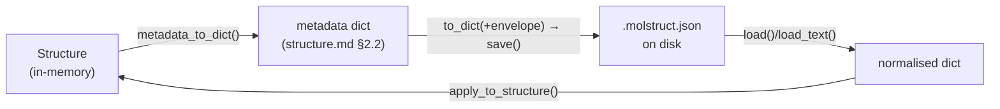

# The `.molstruct.json` file — a structure's saved metadata

**Role:** contract
**Domain:** model
**Sub-document of:** [`structure.md`](?doc=model/structure.md) (its master). **Companions:**
`structure-annotations.md` + `structure-periodicity.md` (the metadata this file
carries), [`engines/overview.md`](?doc=engines/overview.md) § 3 (the
**boundary-condition contract** — how the `frozen_atoms` / `regions` this file
stores are delivered to an engine's input script; see § 7).

When a structure is saved, its geometry goes in the `.xyz` and everything the
`.xyz` has no room for — region labels, frozen atoms, the cell, per-atom
annotations — goes in a companion JSON file next to it: `<stem>.molstruct.json`.
This doc is the contract for that file: its layout, how it is versioned, how it
is read and written, and how it stays paired with its `.xyz`.

> **One file, one authority.** The `.molstruct.json` schema lives in exactly one
> place — the server module `sidecars/molstruct.py`. The browser **never**
> authors it (a browser-written sidecar had no `schema_version` and the load
> door rejected it — the save→reload breaker). The metadata *fields* it carries
> are named only by `Structure`'s codec (see `structure.md § 2.2`); this file
> just wraps them in an envelope.

---

## 1. Layout — envelope + metadata

A `.molstruct.json` is a JSON object: a small **envelope** of bookkeeping keys,
plus the structure's **metadata fields** spread in alongside them.

```json
{
  "schema_version": 11,
  "n_atoms_total": 2,
  "n_frames_total": 2,
  "structure_hash": "9f2c…(sha256 hex)",
  "created_by": "molbuilder",
  "created_at": "2026-07-26T12:00:00Z",

  "regions": {"L-electrode": [0], "frozen_atoms": [1]},
  "cell": [[10,0,0],[0,10,0],[0,0,10]],
  "engine_offset": null,
  "axis_kind": ["periodic", "periodic", "isolated"],
  "vacuum": [0.0, 0.0, 12.0],
  "annotations": {"charge": {"kind": "value", "data": {"0": 0.1}}},
  "customized": {"rows":   [{"name": "temperature", "value": 300, "unit": "K"}],
                 "frames": [[], [{"name": "mode", "value": 31}]]},

  "atom_names": ["CA", "SG"],
  "residue_ids": [14, 14],
  "residue_names": ["CYS", "CYS"],
  "chain_ids": ["B", "B"],

  "selection_rules": {}
}
```

The identity block (schema 8, 2026-08-20) is **optional and real-only**: a
column appears only when it says something the server would not have
synthesized itself (names ≠ elements, residues ≠ `MOL`, chains ≠ `A`,
resids ≠ 1 — `Structure.identity_to_dict` owns that judgment, beside the
synthesis it mirrors). `title` is not among them: it is the geometry file's
own comment line, and the sidecar does not carry it (`model/structure.md`
§ 2.2c).  An xyz-born pair carries none
of them: its sidecar holds the envelope, the metadata fields and
`selection_rules`, and no identity column.

| Envelope key | Meaning |
|---|---|
| `schema_version` | the on-disk schema (§ 2) — the reader checks it first |
| `n_atoms_total` | atom count the metadata was computed against; a mismatch on load is refused, never mis-applied |
| `n_frames_total` | *(v11)* frame count of the paired document — what `customized.frames` is indexed against; a mismatch on load is refused like the atom count's (§ 3) |
| `structure_hash` | sha256 content hash of the paired geometry (hex, ≥16 chars) — the integrity pin (§ 3) |
| `created_by` / `created_at` | provenance stamp (`created_at` is ISO-8601 UTC, `…Z`) |
| `selection_rules` | a sidecar-**only** pass-through, **not** a `Structure` field (§ 4) |

**Three kinds of information, one contract** *(user, 2026-08-20; the third
2026-10-09)*: a fact is **per-atom** — it rides the atom list, one entry per
atom, and survives atom edits because every edit layer carries it with its atom
(`regions` membership, the identity columns, each channel's atom-indexed
half) — or it is **system** — stored separately, whole (`cell`,
`engine_offset`, `axis_kind`, `vacuum`, each channel's kind/color/fdf, the
structure's `customized` rows) — or it is **per-frame** — one entry per frame,
indexed like the frames, exactly `n_frames_total` of them (`customized.frames`;
`model/structure.md` § 2.2e).  Everything in this file is one of the three, and
every layer (the codec, the wire, the viewer's two translation doors) folds and
unfolds along exactly those lines.

The **metadata fields** (`regions`, `cell`, `engine_offset`,
`axis_kind`, `vacuum`, `annotations`, `customized`) are exactly the set
`Structure`'s codec owns (`METADATA_FIELDS`) — they are **spread in, not
re-listed**, by the writer and the reader alike
(`structure_fields_via_dataclass` round-trips them through a scratch `Structure`
of `n_atoms_total` atoms and `n_frames_total` frames, so the sidecar can never
carry a field the codec doesn't know, nor a frame row set for a frame the
document does not hold; this is what closed the `cell_origin`-dropped-on-reload
bug).

**`customized`** (`model/structure.md` § 2.2d) is `null` when it holds no row
at all — as every other metadata field states its unset value — and otherwise
written whole: `rows`, and `frames` with exactly `n_frames_total` entries, an
empty list for a frame with no rows. Their meanings live in
`structure-periodicity.md` and `structure-annotations.md`; the codec authority
is `structure.md § 2.2`.

> **`vacuum` has three states, and all three are honoured.** `null` means
> *nobody chose one* — which is what earns an isolated axis the default 3 Å gap
> — while `[0, 0, 0]` means *no gap, deliberately*, and is used verbatim
> ([`structure-periodicity.md`](?doc=model/structure-periodicity.md) § 6.1).
>
> A legacy reading briefly folded the second into the first, so that sidecars
> written before the third state existed kept behaving as they had. It cost the
> ability to express a deliberate zero at all, for compatibility with files that
> are residue. Removed 2026-08-03 — a reader that cannot be told what it is
> looking at is worse than one that refuses.

---

## 2. Schema versioning — a readable SET, strict about shape

**Current schema: v11. The reader accepts {7, 8, 9, 10, 11} and nothing else.**

```python
SCHEMA_VERSION    = 11                 # sidecars/molstruct.py
READABLE_VERSIONS = frozenset({7, 8, 9, 10, 11})
```

*(v11, 2026-10-09, plan § 5z.8 F.)* **Additive**: the optional `customized`
block (`model/structure.md` § 2.2d) and the envelope's `n_frames_total`,
written by every v11 writer. A v7–v10 file has neither and holds nothing
indexed by frame, so it reads whole: its labels, cell and `info` apply to every
frame of its document, as they always did.

*(v10, 2026-09-25.)* `cell_origin` is **retired** — a v7–v9 file that carries
it is read with it ignored, and no writer emits it again (user: *"your option
(a) is fine, and when files are saved, make sure no old retired key is written
again"*) — and the optional **`engine_offset`** is added: the offset the
structure STATES (an origin the person assigned, or an engine's `0`), `null`
meaning the rule places the atoms
([`structure-periodicity.md`](?doc=model/structure-periodicity.md) § 6.0). A
corner a person typed by hand is assigned again on the Cell page; it was not
migrated because v9 cannot tell a typed corner from the electrode builder's
flush one, the placement TranSIESTA refused.

*(Amended 2026-08-20 and again 2026-08-29, user rulings.)*  The
strictness rule is about **where facts live**, not about the number:
v8 only **added** the optional identity columns, and v9 only **added**
the optional `info` block (metadata that is not part of the structure
and not in the hash, and that travels unless explicitly stripped —
`model/structure.md` § 2.2a;
`archive/2026-09-01-structure-info-plan.md`; absent means "nothing recorded"), so a
v7 or v8 file reads whole under v9 rules.  Refusing them would have
invalidated every pair on disk for changes that lose nothing.  A
version whose facts moved homes (v3's top-level frozen atoms) stays
refused, with an error naming what changed and what to do — never
partially read.

**Retired keys.** A key the schema once wrote and no longer does — `pbc` and
`cell_origin` (metadata; the second by decision, v10) and `title` (identity) —
is listed in `RETIRED_METADATA_KEYS` /
`RETIRED_IDENTITY_KEYS` (`structure.py`) and passes **three gates**: tolerated
on read, so a file already on disk is not refused as carrying a stray key;
never applied; dropped on rewrite, so the pair heals on its next save. Every
gate has to know every retired key — a guard that disagrees with its
neighbours about what is retired is how a retirement reaches one gate of
three — and `tests/test_molstruct_json.py::TestARetiredKeyPassesEveryGate`
pins it for every key in those tuples, present and future.

**This is deliberate, and it is not a transitional state.** molbuilder is a new
product with no installed base to protect. Accepting several schemas costs more
than it saves:

- every reader, every test and every debugging session has to hold two shapes in
  mind, and the second one is always the one nobody remembers;
- a tolerant reader hands back a payload that **looks complete and quietly is
  not** — which is exactly what happened. v3–v6 were in the readable list while
  the reader had stopped looking at v3's top-level `frozen_atoms` key, so a real
  junction loaded with its fifty frozen electrode atoms silently gone, and the
  generated SIESTA input carried no `Geometry.Constraints` block. The run
  converged on a structure nobody asked for;
- the data is cheap to regenerate. The confusion is not.

**A version gate that admits a version the code cannot honour is worse than no
gate**, because it converts a loud failure into a quiet one.

### What "refused" means at each surface

| Surface | On a non-v7 payload |
|---|---|
| `molstruct.load` / `load_text` (the `.molstruct.json` sidecar) | raises `MolstructJsonError`; nothing is read |
| the in-script `ATOM-METADATA` block, wherever it arrives from — a run directory, the transport composite, or `/api/build/load` — | **one reader**, `script_emit.apply_atom_metadata`. The block is read as written today: a retired layout is not translated, so whatever it spells the current way applies and the rest simply is not there. The run still opens. The one refusal is a block whose `n_atoms_total` disagrees with the structure — `MolstructPairingError`, the same name the sidecar's identical guard uses |

The sidecar file's message names the specific difference and says what to do:
re-save the structure, or re-generate the script.

### Metadata is never required; only what is PRESENT can be wrong

The line, stated by the user 2026-09-05, and the reason the reader has exactly
one guard:

- **Structure has requirements.** The atom count must match, and the
  coordinates must be in a form we read. Break either and the labels land on
  the wrong atoms, so those refuse.
- **Metadata has none.** No file owes us any particular markings. A structure
  with no regions, no frozen set, no annotations is an ordinary structure, not
  a damaged one — so their absence is never a finding, and nothing warns about
  it. There is nothing to compare against: *metadata is metadata.*

What IS worth saying is the opposite case — a key that is present and that we
did not read, reported as copied-through or unused, so the person knows we saw
it and did nothing with it. That is a statement about something in the file,
not about something missing from it.

So: a run whose markings this build no longer reads opens quietly with
whatever it does read. It is not a degraded run; it is a run with less
metadata, which is a thing a run is allowed to be.

### Unknown keys in a SIDECAR FILE are refused, not ignored

A key that is neither a structure metadata field nor an envelope key is an
**error**, at the point the payload is still whole. *A key nobody reads is
metadata the writer thinks it saved.*

That guard existed before and never fired, because the layer above it had already
dropped the key silently — the check has to happen where the payload arrives, not
downstream of a normaliser.

### Version history

Kept as a record of what the numbers meant. **None of v1–v6 is readable**; a file
at any of them is refused, not upgraded.

| Version | What it was |
|---|---|
| v1 / v2 | an older `fixed_atoms` key |
| v3 | `regions` + a top-level `frozen_atoms`, no annotations |
| v4 | adds the extensible annotation channels (`structure-annotations.md`) |
| v5 | drops `kgrid` — a `SiestaConfig` sampling knob, not geometry |
| v6 | `cell_origin` persisted |
| v7 | the reserved `frozen_atoms` label moves **into** `regions` with every other label, and the top-level key is no longer written. One store, one designated accessor (`molstruct.frozen_atoms(payload)`), interpreted where it means something. **Still readable** — v8 changed nothing it states |
| v8 | the optional **identity columns** (`atom_names`, `residue_ids`, `residue_names`, `chain_ids` — `title` was a fifth until 2026-09-23 and is now a retired key, see *Retired keys* above), written only when real, applied **full-replace** on read (an absent column resets to the synthesized default, same as the metadata block) — so a PDB-born residue identity stops being erased by a save, and an xyz-born sidecar does not grow a byte. **Still readable** |
| v9 | *(2026-08-29)* the optional **`info` block** (`structure-info`): a free key→value store of what the caller knows about these atoms that is not the atoms. Applied **full-replace** like every other block, so a stale store cannot survive a pair that no longer carries one | **Still readable**
| v10 | *(2026-09-25)* — `cell_origin` **retired** (read and ignored, never written) and the optional stated **`engine_offset`** added (`null` = the rule). **Readable**: v7–v9 files open with their corner ignored
| **v11** | **current** *(2026-10-09)* — the optional **`customized`** block (the structure's rows and each frame's) and the envelope's **`n_frames_total`**. **Readable**: a v7–v10 file holds nothing indexed by frame

### Changing the schema

Bump `SCHEMA_VERSION`, then decide which kind of change it was — the
decision the reader enforces:

- **Additive** (new optional fields; every old fact stays where it was):
  add the old version to `READABLE_VERSIONS` — old files read whole, and
  refusing them would invalidate data for no protection.
- **Shape-changing** (a fact moves or changes meaning): do **not** extend
  the set — the old version is refused with a message naming the move, and
  the data is regenerated (re-save structures, re-generate scripts).

---

## 3. `structure_hash` — the integrity pin

> **`info` never enters the hash** (2026-08-29): the store describes
> the structure — a recorded contract, a note — and recording MORE
> about the same atoms must not read as a different structure.  Nor does
> any metadata field: the hash is the geometry document's bytes alone
> (below), every frame of it.  *(This said "geometry + the structural
> metadata" until 2026-10-09; `StructureCodec.pair` has always hashed the
> document only.)*  An identity over the geometry AND the structural
> metadata is W39's identity hash, which is not defined and waits on M2m's
> ruling (plan § 2, V1.9 / M2m); until then a frame-set citation is pinned by
> the two files' sha256, as a cited run's files are (plan § 5z, Q17-c).


`structure_hash` is the sha256 of the paired geometry file's bytes
(`sha256_of_file`, stable across platforms). It ties a sidecar to *the exact
structure it was computed on*: the metadata is indexed by atom position, so
applying it to a different geometry would mis-assign labels.

Two independent guards, deliberately kept separate:
- **On apply** (`apply_to_structure`), the sidecar's `n_atoms_total` must equal
  the structure's atom count, and its `n_frames_total` (v11) the structure's
  frame count, or the apply is **refused** (`MolstructPairingError`, never
  partially applied): labels are indexed by atom and `customized.frames` by
  frame, and a near-miss in either puts a fact on the wrong one. A v7–v10 file
  states no frame count and holds nothing indexed by frame. `structure_hash`
  is **not** verified here.
- **The caller** compares `structure_hash` against the geometry it loaded, to
  detect a sidecar paired with a *changed* structure — a stricter check the
  file-access layer owns. *(Not built — plan § 2, V1.9 / M2m: no reader
  compares it today; the reader checks only that it is a hex string of at
  least 16 characters, `parse/sidecars/molstruct.py:196-200`.)*

---

## 4. `selection_rules` — a sidecar-only pass-through

`selection_rules` is **not** a `Structure` field and does not go through the
metadata codec. It is a sidecar-only map, keyed by region label, that records
*how* a region was selected (a rule, e.g. "all atoms within 3 Å of …") so the
selection can be re-evaluated. It is validated by `normalise_selection_rules`
(each target must name a real label — `frozen_atoms` is one, so it needs no
clause of its own; a v6 rule targeting it keeps working unchanged) and
**normalised** — each rule is re-parsed and re-serialised, so the stored form is
canonical, not byte-for-byte. It rides in the envelope, alongside the metadata,
not inside it.

---

## 5. The codec (server, one home)

All read/write of `.molstruct.json` goes through `sidecars/molstruct.py`:


```mermaid
flowchart LR
    ST["Structure<br/>(in-memory)"]
    MD["metadata dict<br/>(structure.md §2.2)"]
    JSON[".molstruct.json<br/>on disk"]
    ST -- "metadata_to_dict()" --> MD
    MD -- "to_dict(+envelope) → save()" --> JSON
    JSON -- "load()/load_text()" --> MD2["normalised dict"]
    MD2 -- "apply_to_structure()" --> ST
```

| Function | Role |
|---|---|
| `sidecar_path_for(xyz)` | derive `<stem>.molstruct.json` from a geometry path — the one pairing rule |
| `to_dict(fields, n_atoms_total, n_frames_total, structure_hash, …)` | build the envelope + spread the validated metadata fields |
| `save(path, …)` | atomic write (temp sibling + `os.replace`) |
| `load(path)` / `load_text(text)` | read + validate the version → a normalised metadata dict |
| `apply_to_structure(struct, dict)` | apply the metadata onto a `Structure` (via `apply_metadata_dict`); guards `n_atoms_total` and `n_frames_total` |
| `MolstructJsonError` / `MolstructPairingError` | the payload is unreadable / the payload is for a **different structure**. Separate types because § 3's two guards get different answers: a surface may forgive an unreadable *version*, none may forgive a wrong *pairing* |

Callers do not touch the field list — `Structure`'s two metadata methods are the
sole namers (`structure.md § 2.2`). The higher-level paired-file door
`StructureCodec` (`structure.md § 2.4`) wraps this codec together with the
`.xyz` read/write for atomic pair I/O.

---

## 6. Pairing — the sidecar follows its structure

The `.xyz` and its `.molstruct.json` are a unit; a file operation on one must
carry the other, or the labels are orphaned (renaming `water.xyz` →
`bridge.xyz` once left `water.molstruct.json` matching no structure, silently
losing the user's labels).

`POST /api/files/{rename,move,copy}` (`web/blueprints/files.py`, via
`_paired_sidecar_path` `:246` / `_existing_paired_sidecar` `:258`) move or copy
both files in lockstep:

| Concern | Behaviour |
|---|---|
| Detection | source must be `.xyz`/`.pdb`; pair the `<stem>.molstruct.json` if it exists (a bare `.molstruct.json` rename is single-file) |
| Atomicity | rename/move use `os.replace` on both legs; a failed sidecar leg **rolls back** the geometry leg. Copy uses `shutil.copy2`; a failed sidecar leg unlinks the half-copy |
| No-overwrite | the destination sidecar slot must be empty, else the whole op refuses with **409 before touching either file** |
| Directories | `move`/`copy` refuse directory sources (v1); directories have no sidecar |

Engine generators load the sidecar through `apply_to_structure`, not these
file-ops endpoints, so the sidecar-as-source-of-truth contract is unaffected by
a rename.

### 6.1 One sidecar, many frames *(user, 2026-09-24)*

A coordinate document may hold **several frames** — a structure holding a
frame set is written as one XYZ document, a block per frame (`structure.md`
§ 2.2e, § 2.4), and `from_xyz` reads every frame of one back. **The pair stays one
sidecar**: the per-atom facts (labels, frozen set, identity columns), the
periodicity, the `info` store and the structure's `customized` rows apply to
**every** frame, because a frame is the same atoms, in the same order, moved.
A frame carries its coordinates and its own `customized` rows
(`customized.frames[f]`) and nothing else; a frame that restated a label or a
cell would be a second source for it.

| a reader that… | gets |
|---|---|
| asks for a structure (`load(path)`) | **frame 0**, with the sidecar applied and frame 0's rows as its own — today's behaviour, unchanged |
| asks for one frame (`load(path, frame=i)`) | frame `i` the same way |
| asks for the set (`load(path, frames=True)`) | every frame, in file order, in one structure — the shared facts once, each frame's rows at its index |

This is what makes a multi-frame pair a legal input everywhere a structure is
one, and a **frame set** where a door is frame-aware:
[`engines/transport.md`](?doc=engines/transport.md) § 2a.9 defines the
transport frame group as exactly this pair — frame 0 the base, frames 1…N the
displacements, cited as § 3.1's pair (built 2026-10-09, plan § 5z Q17-c). The cell and the axis kinds are the sidecar's alone — the
document's comment line is never metadata (`structure.md` § 2.3) — which is
one more reason the frames do not travel without it.

**What is particular to one frame** — its displacement, its weight in an
average — is the structure's `customized` section, one set of rows a frame
(the mode the whole set samples is among the structure's own rows) (`model/structure.md` § 2.2d; plan W39, ruled
2026-09-27/30, and § 5z.8 F), never `info`. The rows are written by what makes
the frame set — the frame generator, a person's script, through
`Structure.set_customized(…, frame=i)` — and never in the browser, which
shows a frame set's rows read-only at the displayed frame. On the Molbuilder
tab, which holds one frame, a person may add, change or remove a row of the
structure or of that frame, saved with the pair (`web/molview.md` § 8.4a).

---

## 7. What this file's metadata drives (pointer)

Storing the labels is one thing; *delivering* them correctly to
an engine's input script is the **boundary-condition contract**, which lives
with the engines: [`engines/overview.md`](?doc=engines/overview.md) § 3. Its
three stages: the labels are set where the structure is (the viewer writes
them into this file's one `regions` store); every deck delivers the held set
verbatim (SIESTA `frozen_atoms`→`Geometry.Constraints`, PySCF's geomeTRIC
`$freeze`, TranSIESTA's electrode labels→its electrode blocks); and **labels
are the user's** — molbuilder reads the labels it owns (the frozen label, a
transport calculation's partition) and no other, which ride along untouched
and are named by no preflight
([`science/validation.md`](?doc=science/validation.md) § 5).

**Sidecar consumers** (which code reads a `.molstruct.json`): the SIESTA and
PySCF/spectra and TranSIESTA generators (at emit), the selection endpoints
(`/api/selection/eval`, `/api/selection/atoms`), and the PySCF trajectory
parser (reads the `frozen_atoms` label to mask pinned atoms from the
max-force series).
The engines-wave contract carries the full, current consumer list.
