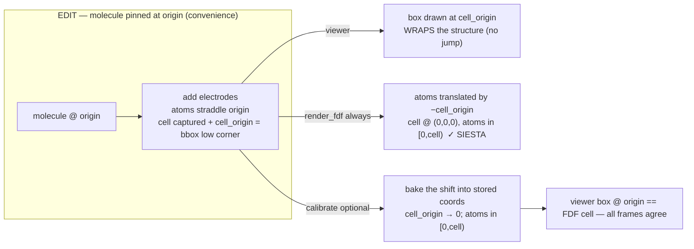
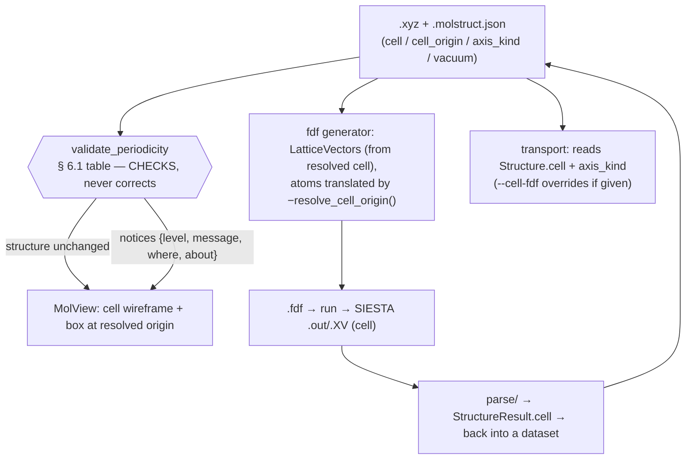
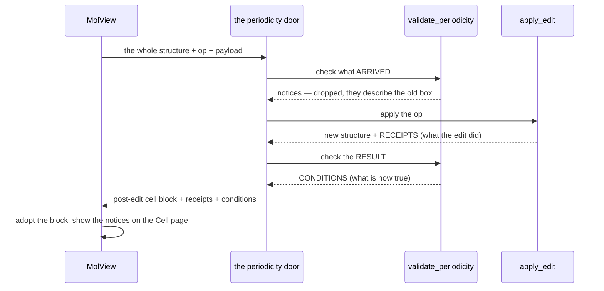

# Periodicity — cell, origin, axis kinds, and vacuum

**Role:** contract
**Domain:** model
**Sub-document of:** [`structure.md`](?doc=model/structure.md) (its master — these are
`Structure` fields). **Companions:** `structure-molstruct.md` (how they persist
in `.molstruct.json`), `engines/siesta.md` (the **k-grid** DFT sampling
parameter, which is a `SiestaConfig` knob — **not** a periodicity field; see
the note below).

Periodicity describes **how the box around a structure behaves per axis** —
the lattice `cell`, where that cell sits (`cell_origin`), whether each axis is
crystalline / isolated / a transport lead (`axis_kind`), and the isolation
padding (`vacuum`). These are fields on the `Structure` dataclass; this doc is
the source of truth for how the cell is **resolved, gated, persisted, and
edited**. The MolView viewer, the SIESTA emitter, and the transport flow all
**read** it; none of them re-derive it.

> **k-grid is NOT here (corrected 2026-07-26).** The Monkhorst–Pack **k-point
> grid** is a DFT *sampling* knob on `SiestaConfig` (`config/siesta.py`), not a
> structure property. `Structure` has no `kgrid` field (`structure.py:658`:
> "a sampling knob on the config, not geometry"), and the sidecar **schema v5
> dropped** the `kgrid` key (a pre-v5 file's `kgrid` is ignored on load). Its
> documentation lives in `engines/siesta.md`. What periodicity *does* own is
> **which axes are eligible** for k-sampling — an axis must be `periodic`
> (below) — but the sampling *count* is a calculation parameter.

**The rule of the whole doc:** periodicity is computed/captured **once, at the
source that knows it** (construction or import), stored in the dataset, and
read at every stage — never re-derived downstream, never hand-fed as a side
file.

---

## 1. The fields

| Field | Shape | Meaning | Default |
|---|---|---|---|
| `cell` | 3×3 (rows = lattice vectors, Å) or `null` | the lattice / box vectors | derived (§ 4) |
| `cell_origin` | 3 floats (Å) or `null` | world-space **low corner** an explicit `cell` emanates from; lets a cell wrap off-origin atoms without moving them (§ 6) | `null` = `(0,0,0)`; **dropped unless `cell` is explicit** |
| **`axis_kind`** | 3 × enum `{periodic, isolated, transport}` | **how axis *i* is treated — the authoritative periodicity field** (§ 2) | `(periodic,periodic,periodic)` if a cell is present, else all-`isolated` |
| `pbc` | 3 bools — **stored, kept in lockstep with `axis_kind`** | ASE-interop view: `periodic\|transport → True`, `isolated → False`; `__post_init__` reconciles the two so they never diverge | derived from `axis_kind` (the richer field: a boolean can't tell `transport` from `periodic`) |
| `vacuum` | 3 floats (Å) **or `null`** | isolation padding, **per side** — meaningful only on an `isolated` axis. `null` means *nobody chose one*, which is what earns that axis the default gap (§ 6.1); `[0,0,0]` means *no gap, deliberately*, and is used verbatim | `null` (unset) |

`cell` and `axis_kind`, `vacuum`, `cell_origin` all live on `Structure`
(`structure.py`) and serialize through the one metadata codec
(`metadata_to_dict`/`apply_metadata_dict`, see `structure.md § 2.2`). The
boolean `pbc` is a **derived property** of `axis_kind`, so ASE interop
(`normalise_cell_pbc`) is unchanged.

---

## 2. The three axis kinds — the whole model in one table

Every consumer branches on this one field.

| kind | cell vector on axis *i* | `vacuum[i]` | k-sampleable? | tileable (display) | derived ASE `pbc[i]` | fdf |
|---|---|---|---|---|---|---|
| **periodic** | commensurate lattice (construction / import) | 0 | **yes** (a `SiestaConfig` knob) | yes | `True` | k-sampled |
| **isolated** | `bbox[i] + 2·vacuum[i]` (§ 3) | **the only kind it applies to** — unset ⇒ 3 Å default, else exactly what you set | no (Γ) | no | `False` | Γ box |
| **transport** (semi-infinite) | **device length + one interlayer spacing** (captured at construction, § 5) | **0** | no (Γ) | no | `True` | Γ + electrode self-energy |

> **Two physics points the enum encodes** (that a boolean `pbc` could not):
> - **A `transport` axis is a periodic box that is Γ-sampled.** SIESTA emits a
>   `LatticeVectors` row for it (so its ASE `pbc` is `True`), yet it is never
>   tiled or k-sampled — the semi-infinite leads replace its periodic images.
>   A boolean cannot hold "periodic box **but** Γ-only, electrode-matched";
>   `axis_kind = transport` says it exactly.
> - **Only a `periodic` axis is tileable / k-sampleable.** `isolated` derives
>   `pbc = False`; `transport` is Γ-only. So `axis_kind` is what *gates*
>   whether a k-grid dimension may exceed 1 — but the dimension value itself is
>   a `SiestaConfig` parameter (see the k-grid note at the top).

**Which axis an image belongs to decides whether it is a defect.** The kind
answers one question that recurs all over the stack: *is what sits in the
neighbouring cell intended, or an artefact of the box?*

| kind | images across this axis are… | so a check must… |
|---|---|---|
| **periodic** | the crystal itself — bulk gold has 2.88 Å contacts across the boundary *by construction* | ignore this direction |
| **transport** | the device continuing into its leads — it tiles seamlessly by design | ignore this direction |
| **isolated** | copies of the molecule that only exist because the box is finite | measure this direction |

Two consumers follow from that one rule, and both were bugs before they did:

* **Containment** (§ 6.1 state table) is required along non-periodic axes only —
  requiring it everywhere made real crystals and junction files unopenable.
* **The atom-to-nearest-image distance check** (`cell.image_distance`,
  `validation/geometry.py`) steps only along **isolated** axes. It used to walk
  all 26 neighbour translations, so it reported every crystal's own nearest
  neighbours as image overlap — a warning that was guaranteed to be wrong
  exactly where the periodicity was deliberate. For a slab (periodic in-plane,
  isolated out-of-plane) it now measures precisely the vacuum gap, and it names
  the direction it measured. A fully periodic cell has no vacuum direction, so
  the check is *not applicable* there — which is different from a check that
  could not run, and stays quiet rather than reporting itself.

---

## 3. `bbox` is min/max only — used ONLY on an `isolated` axis

`bbox[i] = max_i(positions) − min_i(positions)` — the extent of the atoms. It
carries **no crystal information** and is **categorically not a lattice**:

- **Wrong size.** For a slab with in-plane spacing `d` and `m` repeats, the
  true period is `m·d`, but the atoms' bbox is `(m−1)·d`-ish — short by ~one
  spacing, non-commensurate; tiling it overlaps/gaps atoms at the seam. (`d` is
  the *surface* spacing, not the cubic constant `a`: for fcc, `d = a/√2` — Au
  `a≈4.08 Å` but in-plane `d≈2.88 Å`; using `a` is a √2 error.)
- **Wrong shape (worse).** bbox is axis-aligned → orthorhombic only. A
  hexagonal lattice (fcc(111)'s 120° in-plane cell) or any monoclinic/triclinic
  cell has non-orthogonal vectors an axis-aligned box cannot represent at all.
  Only construction (ASE gives fcc(111) its 120° cell) or import fills `cell`.

So **`bbox + 2·vacuum` is the derivation for `isolated` axes only** (vacuum on
*each* side of the atoms). `periodic` axes use the commensurate lattice
(construction/import — never detected from raw coordinates, which is
ill-posed); `transport` axes use the captured device length **plus one
interlayer spacing** (§ 5, and `science/junction-cell.md` for why the bare
extent collides with its own image), never bbox.

---

## 4. `resolve_cell` — branch on `axis_kind`

The one resolver (`Structure.resolve_cell()`, `structure.py:427`) computes the
effective cell. **An explicit cell always wins** — the customization escape
hatch (§ 8), and the path a `transport` axis always takes.

```
resolve_cell(structure) -> 3x3 | None
  1. EXPLICIT cell present -> use it verbatim
        (user-edited 3x3 override, imported .XV/.fdf/CIF, or captured
         from a builder -- all land in structure.cell)
  2. else, per axis i by axis_kind[i]:
        periodic  -> commensurate lattice vector (construction/import;
                     ERROR if unknown -- we do NOT bbox a periodic axis)
        isolated  -> bbox[i] + 2*vacuum[i]      (vacuum >= 0, each side)
        transport -> the captured device length + one interlayer
                     spacing (in practice branch 1;
                     never derived here, vacuum = 0)
```

> **Scope of the per-axis form.** Branch 2 assumes the cell is
> **block-orthogonal** — a periodic sub-block (e.g. a hexagonal in-plane pair)
> orthogonal to the non-periodic axis. That covers slabs and junctions. A
> fully general triclinic cell mixed with a non-periodic direction is not
> separable per-axis; it must arrive **explicit** (branch 1).

### 4.1 The default state — resolve through the API, never read raw

Every parameter has an explicit default (a fresh/generated structure starts in
it). A consumer must translate the default **through the resolver**, not read
the raw stored field and treat a missing value as "no box." This is what makes
the box render and the fdf work on a blank molecule.

| Parameter | Default | Resolver (default → concrete) | Explicit override |
|---|---|---|---|
| `cell` | `struct.cell is None` | `resolve_cell()` (§ 4) | `commitPeriodicityOp("cell", 3×3)` / import / capture → `struct.cell` wins verbatim |
| `vacuum` | `null` (unset) | `effective_vacuum()` — **3 Å per side on each `isolated` axis** (§ 6.1); 0 on periodic / transport, where vacuum does not apply | `commitPeriodicityOp("vacuum", [x,y,z])` — used verbatim, however small. `null` clears it back to the default |
| `axis_kind` (pbc) | `isolated` on every axis (a fresh molecule is a vacuum box) | `pbc[i] = axis_kind[i] != "isolated"` | `commitPeriodicityOp("axis_kind", [...])` |

**One door, four ops.** This column named `setUnitCell` / `setVacuum` /
`setAxisKind` — four separate writers that were deleted in the MolView rework
and replaced by a single `commitPeriodicityOp(op, payload)`, with `op` one of
`vacuum · axis_kind · cell · cell_origin` (`periodicity_gate.OPS`, and the
route validates against that same tuple). Four doors meant four things for the
gate to stand in front of; one door means the check cannot be bypassed by
picking a different setter. **For `cell` and `cell_origin` the payload is
required even when it is `null`** — a dropped key must not be
indistinguishable from an explicit "clear this".

**Load-bearing rule:** the cell the renderer uses is the **resolved** cell,
obtained only through the accessor `molview.data.getUnitCellInfo().value` —
never a hand-read of `getStructure().periodicity.cell` (a consumer that
short-circuits on `cell == null` is the "box has no effect on a new molecule"
bug). The raw `periodicity.cell` stays the explicit cell (`null` = default);
the accessor surfaces `periodicity.resolved_cell`.

**One resolver, no duplication:** `resolved_cell` is computed in exactly one
place — `struct.resolve_cell()` on the **server** (the same function the
fdf/save use) — and the client accessor only surfaces it (no re-implemented
bbox math on the client). `resolved_cell` is DERIVED: never saved (the save
writes the raw `cell`), never committed to `struct.cell` (which would
masquerade as a user-chosen lattice and defeat the override hatch).

---

## 5. Backend surface (Python)

| Concern | Home | Behavior |
|---|---|---|
| The fields + invariants | `structure.py` `__post_init__` | validate/reconcile `cell`/`axis_kind`/`vacuum`/`cell_origin`; derive `pbc` |
| `resolve_cell()` | `structure.py:427` | § 4 — explicit wins, else per-axis |
| `resolve_cell_origin()` | `structure.py:467` | § 6 — the box's low corner |
| **Capture at construction** | `modify.py` — `add_slab` through `_finish_slab`. That helper was extracted so **two** builders could share it; `add_electrode_slab` was the other and went on 2026-09-01, `add_symmetric_electrodes` before it | sets `Structure.cell` (in-plane lattice + the z length below) **and** `axis_kind=(periodic,periodic,transport)` (defined `:1043`, passed to the constructor `:1063`) — no more electrode discard |
| **The captured z length** | `cell.bulk_z_period:508` (applied at `modify.py:1019`) | **`z_span + one interlayer spacing`**, never the atoms' bare extent — the extent alone puts the bottom atom's image exactly on the top atom, at zero distance. The spacing is the *median* of the metal layers as built, so an `inter_layer_offset` override is honoured. `pad_interlayer_gap=False` opts out. Full rule + the layer-count condition: [`science/junction-cell.md`](?doc=science/junction-cell.md) |
| Emit | `siesta/input.py:render_fdf` | emits `LatticeVectors` from the resolved cell; translates atoms by `−resolve_cell_origin()` (`:413`) so SIESTA sees atoms in `[0,cell)` |
| Transport | `transport/_cli.py:_load_device` | reads `struct.cell` (from the sidecar); a `--cell-fdf` argument, when given, **overrides** that cell (`:36-43` — point at an existing relaxed `.fdf`'s lattice); if neither exists it warns and the emitter fabricates a vacuum box |

The electrode builder records which lattice constant it used
(`fcc_lattice.json` carries `a_experimental` / `a_pbe`, and a value measured
off the user's own relaxed bulk run can be typed in beside them),
so the captured cell matches the DFT setup.

---

## 6. Cell origin + calibration — an explicit cell that wraps off-origin atoms

**The problem.** Building a tunnelling junction, the natural workflow pins the
molecule at the world origin and grows structure around it (centre at
`(0,0,0)`, orient anchors along `z`, then flank with electrode slabs at
`z = ±gap/2`). The electrode op captures an explicit `cell` whose `z` length is
the total device extent — but the atoms now straddle the origin
(`z ∈ [−L/2, +L/2]`), while a bare 3×3 `cell` is anchored at `(0,0,0)` by SIESTA
convention. The box would sit at the origin with half the atoms outside it (the
2026-07 "right size, wrong corner" bug).

**The contract — separate editing convenience from SIESTA correctness:**

1. **`cell_origin`: the world-space LOW CORNER an explicit cell emanates from**
   (`null` = origin). An op that builds a cell *around* off-origin atoms sets
   `cell_origin` to the structure's low corner, so the cell wraps the atoms
   without moving them. It is *stored intent* (set by the op), never guessed
   from atom extents, so it never drifts; a genuine imported crystal (atoms
   already in `[0,cell)`) leaves it `null`. The dataclass **drops `cell_origin`
   unless `cell` is explicit** (`structure.py:414`).
2. **`resolve_cell_origin()` returns `cell_origin` for an explicit cell**, so
   the viewer draws the box at its true corner, wrapping the structure.
3. **SIESTA correctness is applied at generation, not while editing.**
   `render_fdf`'s default path (`cell=None`, the one the web build uses)
   translates atoms by `−resolve_cell_origin()`, so SIESTA always receives
   atoms inside `[0,cell)` with the cell at `(0,0,0)`. (An explicit `cell=`
   override argument instead fractional-wraps atoms into that cell — same end
   state, different mechanism.) **The viewer ≡ render_fdf invariant:** the viewer's box (cell at
   `cell_origin`, atoms where they are) and SIESTA's cell (at `(0,0,0)`, atoms
   translated by `−cell_origin`) are the SAME relative geometry.
4. **`calibrate_to_cell` — the optional unified last step** (`modify.py:1164`,
   `/api/modify/calibrate`). It *bakes* the generation-time shift into the
   stored coordinates: translate all atoms by `−resolve_cell_origin()`, then set
   `cell_origin → (0,0,0)`. Generation is correct with or without it; calibration
   just lets the user *see* and *save* the exact SIESTA coordinate frame.
5. **A rigid whole-structure transform moves the box WITH the atoms.**
   `Structure.affine` applies the same map to atoms AND box: translation moves
   the `cell_origin` corner; a whole-structure rotation rotates the lattice
   vectors (`cell @ Rᵀ`) *and* the corner. The Modify dispatch sends a transform
   through the whole-structure path only when the selection is empty or is all
   atoms (a partial selection = "transform only these atoms" → the box stays
   put); `orient` is always whole-structure.



**The resolve table, completed:**

| Cell state | `resolve_cell()` | `resolve_cell_origin()` | `render_fdf` translates atoms by |
|---|---|---|---|
| derived (no explicit cell) | per-axis `bbox + 2·vacuum` / bbox (§ 4) | `bbox_min − vacuum` (isolated) / `bbox_min` (transport) | `−origin` (centres in the box) |
| explicit, `cell_origin` set (junction) | the explicit cell | `cell_origin` | `−cell_origin` (into `[0,cell)`) |
| explicit, `cell_origin` null (imported crystal) | the explicit cell | `null` → `(0,0,0)` | `0` (already in `[0,cell)`) |

**"Use default" is invalid for a `periodic`/`transport` axis.** Clearing the
explicit cell falls back to `resolve_cell()`, which **raises** on a `periodic`
axis (you cannot derive a commensurate lattice from a bounding box). So the
Cell page's "Use default" is disabled whenever any axis is `periodic` or
`transport`. Likewise **vacuum is N/A for an explicit cell** (it only grows a
derived isolated axis), so the vacuum control reads "not applicable".

---

## 6.1 The frame contract (v2, decided 2026-07-29) — one gate, a state table, no silent frames

Six clauses, agreed with the project owner; every periodicity change conforms
to these or is a bug:

1. **The truth is the pair — and only the pair.** The `.xyz` (coordinates in
   the world frame) + `.molstruct.json` (`axis_kind`, `vacuum`, and *only
   user-explicit* `cell` / `cell_origin`) are the single source of truth.
   `resolved_cell` / `resolved_cell_origin` / wire fields / UI displays /
   engine inputs are **computed views** and are never written back into the
   truth. (A resolved cell materialised into `cell` with the origin dropped —
   the 2026-07 hemeC corruption — is the violation this clause forbids.)
2. **One gate — one implementation, not one location.** Default-resolution
   and validation live in exactly one function, `validate_periodicity`, and
   every seam that needs them calls it rather than reimplementing a rule:
   the loader/saver of the pair (`StructureCodec`), the periodicity mutation
   door (§ 6.2), the exit every structure-returning route leaves through, and
   the emit path. § 8.1 lists all seven and what each does with the answer.
   The UI edits truth and renders views; emitters translate. **Nothing
   corrects state** — not even the gate (clause 1); the correction step this
   clause used to describe was removed 2026-07-29.
3. **The world frame belongs to the structure.** Atoms are authored relative
   to the world origin (composition convenience); the **cell is constructed
   around the structure**, never the structure moved into the cell — except
   by the one sanctioned rewrite, *calibrate* (§ 6, user-invoked only).
4. **The state table** (right-handed cells enforced, `det(cell) > 0`;
   per-axis `expected_corner = bbox_min − vacuum` on isolated, `bbox_min` on
   transport, `0` on periodic). **Containment is required only along
   NON-PERIODIC axes** — along a periodic axis, atoms outside `[0, cell)`
   are legitimate periodic images (the engine wraps them), so the gate
   never constrains that direction (corrected 2026-07-29 after
   the first cut made real crystals/junctions unopenable):

   | Stored state | Atoms contained (non-periodic axes)? | Gate action |
   |---|---|---|
   | no `cell`, no `cell_origin` | — | fully derived (§ 4); **vacuum authoritative**; nothing stored to judge |
   | explicit `cell`, no origin | yes | legal (imported-crystal): the corner **is** the world origin; vacuum **reference-only**; nothing reported |
   | explicit `cell`, no origin | NO | legal: the corner is **derived** — the wrapping corner, or the structure centred in the box where the per-side vacuum does not fit — and reported as an `info` notice. **Nothing is written into the truth.** A cell the structure cannot fit for ANY origin (fractional extent > 1 on a non-periodic axis) is a hard error at the edit, so an unfittable cell is never stored |
   | explicit `cell` + origin | yes | legal, user-owned; **never rewritten**; vacuum reference-only |
   | explicit `cell` + origin | NO | **user-owned in both halves**: warned (actual per-side clearances reported), **never auto-fixed** — at the live edit *and* on load (a stored manual origin must round-trip verbatim; silently flipping it on reload was the corrected defect) |

   **The default vacuum gap** (decided 2026-08-03, replacing the
   minimum-thickness floor of 2026-07-29). Vacuum has **three** states, not two,
   and the third is what makes the rule sayable: `None` means *"I never chose
   one"*, distinct from a chosen zero.

   * **A vacuum is set** → it is used **verbatim**, on every axis, however
     small. You dictate what you want; a thin gap is *warned about*
     (`cell.vacuum_thin`) and **never overridden**.
   * **Nothing is set** → every **isolated** axis gets **3 Å per side**. It is a
     default **gap**, not a floor on the box length: 3 Å of empty space is 3 Å
     whether the molecule is 2 Å across or 200 Å, so a large molecule gets it
     too.

   Three properties make it safe:

   * It is a **resolved value**, never written back (clause 1):
     `Structure.effective_vacuum()` supplies it, `struct.vacuum` keeps exactly
     what the user typed — or `None` — and the wire carries both (`vacuum` +
     `resolved_vacuum`).
   * It is **never silent**: `validate_periodicity` emits an `info` notice on
     **every hand-over** naming the axes, the gap, and the resulting image
     distance. (Until 2026-08-03 this was announced only from the vacuum /
     axis-kind *edit* path, so loading a structure and generating from it said
     nothing.)
   * The **corner uses the same value** (`expected_cell_corner`), so the axis
     grows symmetrically and the molecule stays centred.

   It is a **starting** gap, not a claim of physical adequacy — see the
   thresholds in § 6.1a. Vacuum is meaningless on a periodic axis (the lattice
   sets the length) and on a transport axis (the device length is matched), so
   neither gets a default.

   *What this replaced, and why.* The old rule was a floor on the **box**:
   `extent + 2·vacuum < 3 Å → vacuum = max(yours, 3)`. It asked about the box
   rather than about what the user wanted, and got both ends wrong — it **raised
   a typed 1.0 Å to 3.0**, overriding a stated value, and it left a **large
   molecule with no gap at all**, because its box already exceeded 3 Å. Both are
   the same confusion: *a minimum box length is not a vacuum.*

## 6.1a The decision matrices — how the box is made, and what is said about it

Two questions, two tables. Everything on the Cell page is one or the other.

**A. What sets the box, per axis.** Read left to right; the first row that
matches wins. `extent` is the structure's bounding-box length along that axis.

| Explicit `cell`? | Axis kind | `vacuum` set? | Box length | Low corner | Regime |
|---|---|---|---|---|---|
| **yes** | any | *ignored* | **the row you typed** | see the corner rules below | **manual** |
| no | `isolated` | yes (`v`) | `extent + 2v` | `bbox_min − v` | derived |
| no | `isolated` | **no** | `extent + 2 × 3 Å` | `bbox_min − 3` | derived |
| no | `transport` | *never applies* | `extent` | `bbox_min` | derived |
| no | `periodic` | *never applies* | **refused** the moment the box is resolved — a periodic axis needs a real lattice, never a bounding box | `0` | — |

The one line to carry away: **an explicit cell demotes vacuum to
reference-only.** Editing vacuum or axis kinds therefore *resets to derived* —
it clears the cell you typed — which is why that edit warns before committing
(§ 6.2).

Two traps worth stating outright:

* **The periodic refusal is not at construction.** A `Structure` with a
  `periodic` axis and no `cell` builds fine; it raises when anything resolves
  the box. Every seam resolves the box, so it is never emitted — but a test that
  only constructs one will not see it.
* **An explicit `cell` with no stated `axis_kind` defaults to `periodic` on all
  three axes** — the imported-crystal reading. That silently changes two rules
  at once: vacuum stops applying (§ 2), and *containment stops being required*,
  because an atom outside a periodic box is a legitimate image. A molecule in a
  hand-typed box that should be checked for containment needs its axes marked
  `isolated`.

**Where the corner comes from, under an explicit cell** (`resolve_cell_origin`;
the low corner the viewer draws from and the shift `render_fdf` applies):

| State | Corner |
|---|---|
| You set a `cell_origin` | **yours**, verbatim, never rewritten — even if it does not contain the atoms (you are warned instead) |
| No origin, box already contains the atoms where they sit | the **world origin** (`None`, no shift) — the imported-crystal case |
| No origin, atoms outside | the **wrapping corner**, so the box encloses the structure instead of jumping to `(0,0,0)` |
| No origin, cell fits the structure but not structure + vacuum | the structure **centred** in the box |

**B. What is checked, and who hears it.** The verdict depends on **who is
asking** — generating a script refuses a box it cannot compute in; loading or
modifying one reports it, so you can investigate and fix it (§ 8.2).

**Every row has a `where`, and it is the stable id.** Nothing keys on the
wording — notices carry the id on the wire exactly as `Issue` does, so a
reworded message never breaks a consumer and a *deleted* check always does.

The first eight come from the one checker, `cell.check` (`molbuilder/cell.py`),
and reach **both** surfaces. The last three are engine-specific and live with
the engine that knows them.

| What is true | `where` | Load / modify | Generate |
|---|---|---|---|
| No vacuum set; the default gap is sizing the box | `cell.vacuum_defaulted` | `info` | `info` |
| A vacuum you set is inert, because you typed a cell | `cell.vacuum_ignored` | `info` | `info` |
| The cell stores no origin, so the corner was worked out | `cell.corner_derived` | `info` | `info` |
| Atoms outside the box (corner can still be moved) | `cell.atoms_outside` | `warn` | `warn` |
| Box has **no volume** (`det ≈ 0`) | `cell.no_volume` | `warn` | **error — no script** |
| Structure longer than the cell — no corner can fit it | `cell.unfittable` | `warn` | **error — no script** |
| Left-handed cell (`det < 0`) | `cell.left_handed` | `warn` | **error — no script** |
| A `periodic` axis with no lattice | `cell.unresolvable` | `warn` | **error — no script** |
| Vacuum below the advisory threshold (below) | `cell.vacuum_thin` | `warn` | `warn` |
| Measured image distance under 6 Å | `cell.image_distance` | `warn` | `warn` |
| A repeating axis into a **gas-phase** PySCF script | `cell.periodic_in_gas_phase` | `warn` | `warn` |

**One severity, two verdicts.** The rows above carry *one* severity, and the
door decides what it costs: `report()` raises on `error`, so a generating door
refuses; a loading or modifying door reports the same finding as a warning so
the structure still opens and can be fixed. Nothing is softened — it is the
same finding answered to a different question.

**And a value you have just typed is refused outright** (HTTP 400), on the four
error rows, because the Cell page's whole subject is that value and a good one
entered straight after is accepted (§ 8.2). So a `0` vacuum on a flat axis is
rejected at the keystroke, while a *file* holding that state opens and reports
`cell.no_volume`.

A `400` is for a state that **cannot be represented at all**, or for a value you
have *just typed* into the field whose whole subject is that value — immediate
feedback, and a good value entered straight after is accepted (§ 8.2). Everything
else is a finding that travels to the user and leaves the decision with them.

That is why the same zero-volume box appears twice above. Typing a `0` vacuum on
a flat axis is refused *at the keystroke*; a **file** that already holds that
state still opens, and is reported, because a load that refused would leave a
broken box unopenable and therefore unfixable.

**The two thin-gap checks, in one currency.** They look like duplicates and are
not — they measure a *setting* and a *result*, and the bridge is one line of
arithmetic:

> **Vacuum is per side. The gap between periodic images is twice it.**

`cell.image_distance` measures the real thing directly: the closest approach
between any atom and any atom in a neighbouring cell. Along `z` in an orthogonal
box that is `(top − max z) + (min z − bottom)` — the empty space below the
molecule plus the empty space above it, which is what an atom actually crosses
to meet its image. In a *derived* box the molecule is centred, so this comes out
at exactly `2 × vacuum`; in a *manual* box, or one with a hand-set origin, it
does not, and only the measurement is trustworthy.

| Check | Asks about | Warns below | Same thing in the other currency |
|---|---|---|---|
| `cell.vacuum_thin` | the vacuum you **set** (or defaulted to) | 8 Å per side, 25 Å charged | an image gap of 16 Å / 50 Å |
| `cell.image_distance` | the gap **achieved**, measured from the atoms | 6 Å image gap | 3 Å per side |

So they are **nested, not contradictory**: `vacuum_thin` is the *advice*
(converged isolated-molecule work wants a generous gap), `image_distance` is the
*alarm* (below this, images are demonstrably interacting). A 4 Å-per-side box
trips the advice and not the alarm — correctly. The **3 Å default trips only the
advice**, which is the honest reading of a starting value: well-formed, not yet
converged.

`cell.vacuum_thin` is skipped entirely in the **manual** regime. Vacuum is
reference-only there, so reporting it would be a number that never reaches the
calculation — a molecule in a hand-typed 30 Å box would be told its vacuum is
thin. On a typed box `cell.image_distance` is the check that means anything.

   **"No explicit origin" means "derive the corner"** (decided 2026-07-29, after
   the live pass on `projects/hemeC-dithiol`). The corner for row 3 used to be
   *materialised* into `cell_origin` by the load/save gate, while the
   reset-origin op (§ 6.2) left the same state alone and the viewer drew the box
   from `(0,0,0)` — one state, two answers, and a save-then-reload silently
   changed what the user had been shown. The rule now lives in exactly one
   place, `Structure.resolve_cell_origin` (with `expected_cell_corner` /
   `cell_contains_atoms` beside it), and `periodicity_gate` delegates to it: the
   gate **validates and reports**, it does not rewrite. `tests/
   test_periodicity_gate.py::TestTheStateTable::
   test_no_seam_materialises_a_resolved_corner` pins the agreement between the
   two seams.

   **Notices are part of the contract, not decoration.** Every notice is
   `{level, message, where, about}` — those **four** keys, and no others.
   `where` is the stable id (the same one `Issue` carries), because the
   conditions come from `cell.check` and a finding must be identifiable without
   reading its prose; `about` is the subject, which decides where it is shown.
   Both joined 2026-08-03; before that a consumer had only the wording, which is
   why several tests matched on message TEXT — passing when a check was deleted
   and failing when one was reworded.
   There was a third, `kind: "heal"`, described here and in `web-api.md` as
   marking a notice about state the gate had corrected, and as the flag the web
   load door keyed on to mark the session dirty. **No code ever wrote it and no
   code ever read it**, including the load door named as its consumer; it was
   documented into existence alongside a correction step that clause 1 forbids.
   Removed from both documents 2026-08-02. A future row that must genuinely
   rewrite stored state can add a key then, against a real reader.
   Callers surface notices; they never parse the message text.

   **Errors vs notices.** `ValueError` (HTTP 400 at the door) is raised only for
   states that cannot be represented: a left-handed cell (`det ≤ 0`), a cell no
   origin could make contain the structure, a degenerate derived box (zero
   extent and no vacuum), a periodic axis with no explicit cell, and malformed
   payloads. Everything else — including a box that does not contain its atoms
   under a user-owned origin — is a notice: the gate reports, the user decides.

5. **Engine frames are one-way with provenance.** Emission translates the
   truth into the engine's frame (SIESTA: cell at `(0,0,0)`, atoms shifted by
   `−resolved_cell_origin`) through one concealed door, and **stamps the
   applied shift** into the run artifacts (`frame_shift`). There is **no
   automatic inverse**: run artifacts (trajectories, forces, restarts) stay in
   the engine frame, and the Results-tab viewer displays that frame verbatim —
   it is a second, read-only truth (the record of what the engine computed),
   fed by the parser, never by the pair. Re-entry into the authoring workflow
   passes the gate with an explicit frame choice: adopt-as-is (default, legal
   row-2 state) or re-anchor via the stamped shift (opt-in).
6. **UI reads views, edits truth** — the § 7 split, plus: every gate notice
   surfaces in the editing page *and* through `molbuilder.notify`.

## 6.2 The unified periodicity door (v3 — the regime model)

**Python owns every metadata change; the JS only calls.** One endpoint —
`POST /api/structure/periodicity`, body `{data, op, payload}` — serves every
Cell-page button; one module (`molbuilder/periodicity_gate.py`) owns
`apply_edit(struct, op, payload) → (struct′, notices)` and the
`validate_periodicity` core shared with `StructureCodec`. Uniform response:
`{ok, blob, resolved_cell, resolved_cell_origin, notices[]}` — the client
adopts the returned truth blob and renders the views; it never computes.

**Two regimes, explicit transitions.** In the **derived** regime,
`{structure size, vacuum, axis_kind} ⇒ {cell, origin}` are computed views.
An explicit cell enters the **manual** regime: vacuum demotes to
reference-only, and an explicit origin overrides the vacuum-derived corner
(*origin first, then vacuum*). Editing an **upstream** parameter never
silently contradicts downstream state — it resets it, loudly:

| op | Contract behaviour (v3) |
|---|---|
| `vacuum` | **Resets to derived** (explicit cell + origin cleared; the boundary moves — the UI warns *before* committing). Refused while an axis is periodic (a bbox is not a lattice — make the axis isolated first or edit the cell). |
| `axis_kind` | Same reset-to-derived when the new kinds are non-periodic. Switching **to** periodic keeps an existing explicit cell (respected) or is refused when there is none. |
| `cell` | Explicit (`det > 0`): **respects an existing origin first** (kept; containment-warned), else **respects vacuum** — no origin is stored and the corner stays derived at the expected corner, reported in the notice. `null` = back to derived (refused on a periodic axis). |
| `cell_origin` | Accepted **as typed** + warning: *vacuum is not respected under a manual origin — only the unit-cell parameters are* (+ actual per-side clearances). `null` = the **Reset-origin-to-default** button: the override is cleared and the corner is **derived again**, so the box keeps wrapping the structure instead of jumping to `(0,0,0)`; the other parameters regain their freedom, and a vacuum / periodicity edit re-derives the whole box. |

**There is no calibrate button.** Coordinate rewrites are not a periodicity
edit: emission translates to the engine frame implicitly (and stamps the
shift as provenance), so nothing on the Cell page ever moves atoms. The
rewrite exists only as the Modify op (`/api/modify/calibrate`,
`molbuilder.modify.calibrate_to_cell`) for the explicit save-in-engine-frame
workflow, and the equivalence is test-pinned: *calibrated-then-emit ≡ emit*.

**Frame ownership by tab.** Only the **Molbuilder/Modify** tab operates on
the authoring truth (the pair, world frame). Every **calculation page**
(structure-optimization, spectra, transport) shows the **engine-calibrated
view** in its MolView mount — computed server-side from the pair, labeled,
never saved back — and the **Results** tab is engine-frame by construction
(parser-fed from run artifacts, § 6.1 clause 5).

## 7. Frontend surface (JS / user) — display vs edit

Two coupled views of one `(cell, cell_origin, axis_kind, vacuum)`, with a
strict split between showing and writing.

> **The one-onChange update contract (2026-07-29).** The canvas store's
> `onChange` is the SINGLE channel through which every downstream view
> updates — automatically, with no consumer-triggered redraws:
>
> - **Pull consumers** (DOM widgets: the Cell page, the panel) re-read the
>   store's accessors on every notify.
> - **Push consumers** (the render pipeline) are driven *from inside the
>   channel*: the data model's one subscription diffs the engine-facing
>   `{lattice, origin}` and hands changes to the geometry tier
>   (`engine.setCell` → embed `setCellBox`) — a box move with atoms,
>   animation, and selection untouched; full structure loads ride the
>   existing `setData` push.
> - **Private snapshots are caches, and this channel is their ONLY
>   invalidator.** The engine's `_data.cell` and the embed's
>   `state.current.cellBox` hold copies for rendering; any new derived
>   view MUST either re-read the store on notify or be updated by the
>   channel. Adding a snapshot without wiring its invalidation is exactly
>   the 2026-07-29 stale-box bug: the Cell page showed the healed origin
>   while the 3D box drew a copy nothing refreshed.

**Display (read-only) — the MolView "Cell" page.** The MolView panel has two
switchable pages `[ Selection | Cell ]`. The Cell page is **display-only**: it
shows vacuum, the unit cell as a 3×3 matrix (non-orthogonal-ready), the cell
origin (`getUnitCellOriginInfo().value` = `resolved_cell_origin`), and
`axis_kind`/`pbc` per axis. Each field is read through a `molview.data`
accessor (`getUnitCellInfo`, `getUnitCellOriginInfo`, `getVacuumInfo`,
`getAxisKindInfo`) returning `{ value, isDefault }`, so the page renders a
"(default)" tag while still handing out a usable number. **MolView never
writes** — no Update button; it only mirrors the in-memory data.

**Edit (write) — the Modify "Cell" op-tab** (`modify/periodicity.js`). Editing
lives in Modify, not MolView. Each parameter group — vacuum, `axis_kind`, unit
cell, cell origin — has its **own "Update" button**, so each group independently
stays at its default or is committed. Editing STAGES a change; it does not touch
the in-memory structure until that group's Update commits via
`molview.data.commitPeriodicityOp(op, payload)` — one POST to the unified door
(§ 6.2), whose returned truth blob the client adopts verbatim (Python owns the
change; the JS calls and renders). Reset-to-derived edits (vacuum /
periodicity under an explicit cell) are **confirm-gated** ("the cell boundary
will move"); cell-origin editing is enabled **only with an explicit cell**
(with a derived cell the corner is auto and shown read-only) and has its own
"Reset origin to default" button; editing the origin moves the box, not the
atoms. There is **no calibrate button** (§ 6.2 — emission translates
implicitly), and **only the Modify tab has this editor**: the other tabs
mount MolView read-only and carry no periodicity controls.

**Two gestures take a value off the structure instead of out of the keyboard**
*(user, 2026-08-30: "allow the 3dmol to select two atoms that defines the
selected axis ... the same for the cell origin")*. They are **stagers, not a
second door**: each writes into the same inputs a user could have typed, and the
group's own Update button remains the only thing that commits. No new route and
no new op — two atoms are a row of `cell`, one atom is a `cell_origin`, and the
arithmetic is vector subtraction on coordinates the browser already holds.

| Gesture | Needs | Writes into |
|---|---|---|
| **Use selection** beside the axis chooser | exactly **two** selected atoms | that row of the 3×3, as `second − first` |
| **Set length** beside it | a row with a direction | the same row, rescaled to the stated length — the spacing between periodic images, set without touching the direction |
| **Use selection** beside the origin boxes | exactly **one** selected atom | the three origin boxes, as that atom's position |

**The order of the two atoms is the answer, not a detail.** The axis runs from
the atom picked *first* to the atom picked *second*, so picking the same pair the
other way round **negates that axis** — which is the way out of the refusal
below, and the reason the pick order is read rather than the sorted selection.
Where there is no pick order at all (the selection came from *All*, a filter, a
restored session) the row runs in index order, which is stated on the control
rather than guessed at.

**They read the ordinary selection, and get no track of their own.** MolView's
measurement gains one (`molview.md` § 11.6) because measuring must not disturb
what an edit acts on; the cell page *is* an edit, so it wants exactly the
selection every other op resolves its group through. One picking mechanism, one
diversion switch, nothing new to keep apart.

**Handedness, said before the request.** The gate refuses a left-handed cell
outright — `det ≤ 0`, `cell.left_handed`, HTTP 400 — and typing nine numbers
rarely produces one by accident, while **picking three atom pairs will produce
one about half the time**. So the panel checks the sign of the staged matrix as
it is built and says so, with the gesture's own way out: *swap any two rows, or
pick one axis's two atoms in the other order.* The note is **advisory and the
gate still decides** — it predicts the refusal rather than replacing it, and it
stays silent when the determinant is near zero, because that is the *no-volume*
finding and giving one cause two names is what `cell.py` avoids by checking
volume first.

---

## 8. Persistence + the data-flow loop

`cell`, `cell_origin`, `axis_kind`, and `vacuum` persist in the
`.molstruct.json` sidecar (`pbc` stays derived; the envelope + schema are in
`structure-molstruct.md`). **Schema v5 dropped the `kgrid` key** — periodicity
carries no sampling parameter. Periodicity flows one way, read at each stage:



### 8.1 Where the gate runs, and in what order

Every structure MolView draws has already passed the gate; **MolView itself
checks nothing.** The gate is server-side only, and it runs at seven points:

| # | Seam | Trigger | What happens to its answer |
|---|---|---|---|
| 1 | `StructureCodec.load` | reading the pair from disk | **nothing is refused and nothing is reported — reading does not judge** (§ 8.2, 2026-08-03). The structure it produces is checked at seam 2, on the way out, where the answer can carry the verdict. It used to raise, which made a file with an unusable box unopenable and therefore unfixable |
| 2 | `_shared.ok_structure_response` | **every structure the server sends the browser**: `/api/build/load`, `/api/build/molecule`, and the eight `/api/modify/*` ops | notices ride out with the structure |
| 3 | `/api/structure/periodicity` — before | a Cell-page edit arrives | notices **dropped** — they describe what arrived, not the result |
| 4 | `/api/structure/periodicity` — after | the edit has been applied | notices **returned** — these describe the box the user now has |
| 5 | `apply_edit`, `cell_origin` branch | inside the edit | used only to DECIDE whether a caveat is needed; its notices are not reported |
| 6 | `/api/structure/export` | export | notices returned |
| 7 | `_shared.periodicity_checked_for_emit` | a tab emits a job | the checked structure is what the emitter uses; its notices are dropped, and nothing on that path carries them (`molview.md` § 6.8) |

**Seam 2 is why "always checked" is not a rule anyone has to remember.** It is
the single return path of every structure-returning route, so the check is in the
code's shape rather than in each author's care: an op that says nothing has been
checked and had nothing to say. Added 2026-08-01; until then the eight modify ops
ran no check at all, and an edit could strand the atoms outside an explicit box
with nobody told.

**The 3 → 5 → 4 order is the whole reason a corrected box reports as corrected.**
The check that reaches the user runs on the *result*, after the edit — not on the
request that asked for it. Reporting seam 2 instead told a user who had just
fixed their box that it was still broken.

### 8.2 One way in, and two verdicts — the contract (decided 2026-08-03)

**Every structure enters the same way, whatever door it knocks on.** Four things
can carry a box — the `.molstruct.json` sidecar on disk, the labels package
recovered from a run's input script, a `periodicity` field in the request, and
the metadata inside a structure envelope — and before this was written down,
which one you used decided whether the box was checked at all.

**The sequence, in this order, with no step optional:**

| # | Step | Rule |
|---|---|---|
| 1 | **Get the geometry** | from exactly ONE source: a file path, raw text, or a structure envelope. A request carrying two is a caller mistake and is refused — never silently resolved by precedence |
| 2 | **Apply the facts that travelled with it** | at most ONE metadata document — a sidecar *or* a trusted labels package, never both. Applying is whole-replace, so a second document does not merge with the first, it erases it |
| 3 | **Apply what the caller stated** | the request's own `periodicity` block, which beats the document, because stating it is a deliberate act |
| 4 | **Check once, at the end, on the structure** | never on the field the box arrived in. This is what makes the route irrelevant: whichever of the four carried it, the same check sees the same assembled structure |
| 5 | **Answer** | refuse or report — see below |

Step 4 is the load-bearing one. A check attached to a *field* only guards the
callers who use that field; a check attached to the *structure*, immediately
before the door answers, cannot be walked around. It is the same property that
makes seam 2 work for the eight edit ops.

#### The two verdicts, and what decides which

**What the request is FOR decides what a bad box costs**, not which door it came
through and not who stated it:

| The request is… | A bad box | Why |
|---|---|---|
| **generating something you would run** — a SIESTA `.fdf`, a PySCF script, a transport or spectra job, an exported document | **refused**, HTTP 400, with the reason | these parameters have to be right. There is nothing to gain from emitting a calculation whose box is impossible; it would only fail later, further from the cause |
| **loading or modifying a structure** — opening a file, restoring a tab, any of the eight edit ops | **reported**, with the structure, as a warning | the user needs to see the problem to fix it. A load that refused would leave a structure with a bad box unopenable, and so unfixable — you could not get it on screen to correct it. Fix it on the Cell page, and it is checked again |

The one sub-case worth naming: **the Cell page itself refuses the value you
type.** It is a modifying door, but its whole subject is that value, so the
refusal is immediate feedback on what was just typed rather than a block on
getting work done — and a good value entered right after is accepted. You are
never stuck.

In code the split is two named seams over one applier, so neither owns a copy of
the translation:

- `apply_periodicity_only(struct, body)` — applies, judges nothing. The loading
  doors use it, and `ok_structure_response` (seam 2) reports on the way out.
- `periodicity_checked_for_emit(struct)` — checks only; it applies nothing,
  because the box already rode in with the structure. Every
  emitting door uses it; the refusal becomes the door's 400 through one
  app-level handler.

#### Reading does not judge (and why that is safe)

**A file whose sidecar holds an unusable box opens.** The reader used to raise,
which put the user in a trap: the Cell page is the one place a box can be
corrected, and it cannot be reached without the structure on screen. The load
door answered *"could not load wire.xyz"* and the only ways out were to
hand-edit the `.molstruct.json` outside molbuilder, or delete it and lose the
labels with it.

**Nothing is left unguarded by that change**, and this was measured rather than
assumed. What must never happen is a *calculation* built on an impossible box,
and that is refused at every door that would act on one:

| Door | What it does with a left-handed cell |
|---|---|
| `StructureCodec.read` — opening a file | opens it; says nothing (the answer reports, at seam 2) |
| `render_fdf` / the PySCF renderer | **refuses** — `validate()` calls it an `error`, and both emitters run `report(validate(…))` before writing a byte |
| `/api/build/fdf` · `/pyscf` · `/preflight` · `/spectra/render` · transport · export | **refuses** — 400, at the request seam |

So the CLI is protected too, by the validator rather than by the reader: a
left-handed cell is an error-severity finding, and `report()` raises on any
error. That is the project's ordinary rule — *block only what is physically
impossible* — doing exactly the job it exists for, and it needed no change.

> **An earlier draft of this section claimed the CLI would generate from a bad
> box in silence.** That was wrong: it came from looking for callers of the
> periodicity gate and finding none in `cli.py`, without checking whether some
> *other* check already covered it. The emitters do, through `validate()`.

#### The report has to arrive

A reported problem the user never sees is the same as no check at all, so the
sentence the server wrote is carried to the screen **unchanged**: these messages
carry numbers — determinants, per-axis clearances — that only the server
computed, and rewording would put a second author on a sentence one of them can
write. MolView draws it in the viewer's own panel, marked as a warning
(`molview.md` § 6.8: a cell notice goes under the Cell rows, everything else
above the atom list). Pinned by
`tests/test_molview_mount.py::test_a_warning_from_a_load_is_put_in_front_of_the_user`.

**Loading a structure:**

```mermaid
sequenceDiagram
    participant U as user
    participant C as StructureCodec
    participant D as the load door
    participant G as validate_periodicity
    participant M as MolView
    U->>C: open a .xyz
    C->>C: read coordinates
    C->>C: apply the .molstruct.json sidecar<br/>(regions, frozen_atoms, cell, origin, axes, vacuum)
    C->>G: check the ASSEMBLED structure
    G-->>C: refuses an unusable cell (raises); says nothing otherwise
    C-->>D: the structure
    D->>G: check what is about to be sent (seam 2)
    G-->>D: the same structure, plus notices
    D-->>M: structure + notices, in one answer
    M->>M: draw, and show the notices (molview.md § 6.8)
```

**Editing the cell:**



**The metadata is checked by the same pass, not a separate one.** The sidecar's
`regions` — every label, `frozen_atoms` among them — and its periodicity fields
are applied to the structure *before* the gate sees it (step 3 above), so the
gate always checks an assembled structure rather than a half-built one. A
sidecar whose labels name atoms that do not exist is refused earlier, by the
sidecar reader (`structure-molstruct.md`); the gate's subject is the box.

**When does it take effect? It does not.** The gate changes nothing — clause 1 —
so "takes effect" is the wrong question for it. What takes effect is what the
user did. The gate only says whether the result is sound, and that answer
reaches the user as a notice or not at all. It was called `validate_and_heal`
until 2026-08-01; healing was removed on 2026-07-29 and the name outlived the
behaviour, which is how a reader comes to look for a correction step that
clause 1 forbids.

Downstream read points (host-side via `parse/`): a `.xyz` reads its
`.molstruct.json` sidecar; a SIESTA `.out`/`.XV` gets its cell from
`parse/` → `StructureResult.cell`; a `.fdf` from `parse/` (its `LatticeVectors`
block). The MolView module never parses — the host supplies the resolved cell.

---

## 9. Status

**Shipped:** the `Structure` fields + `resolve_cell`/`resolve_cell_origin`; the
electrode builder's capture-at-construction (`cell` + `axis_kind`); `render_fdf`
origin translation; `calibrate_to_cell` (op + `/api/modify/calibrate`); the
MolView Cell-page display + the Modify per-group editors; sidecar persistence
of `cell`/`cell_origin`/`axis_kind`/`vacuum` (schema v5, `kgrid` dropped);
transport reading `struct.cell` (a `--cell-fdf` argument overrides it).

**Not a periodicity concern (relocated):** the **k-grid** DFT sampling
parameter and its `axis_kind`-gated clamp (dims = 1 unless the axis is
`periodic`) live with `SiestaConfig` — see
[`engines/siesta.md`](?doc=engines/siesta.md) § 6, which owns the full k-grid
story (the Monkhorst-Pack mesh and its emission from `cfg.kgrid`). The
legacy deep-dive (reciprocal MP grid, the Born–von Kármán supercell view) is
archived verbatim at `archive/old_docs/protocols/structure-periodicity.md`.
