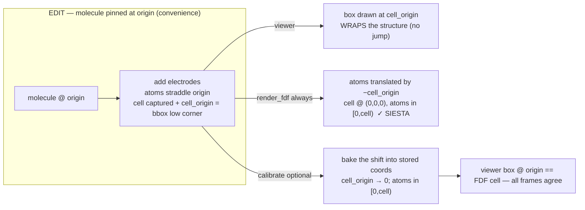
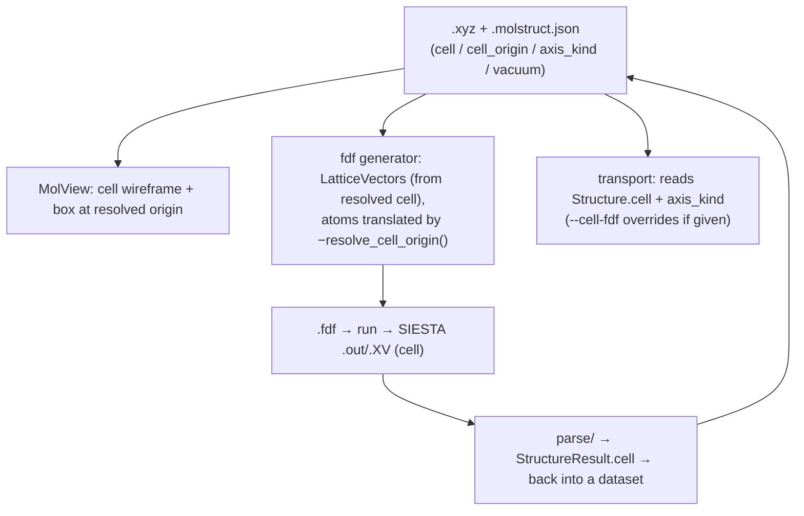

# Periodicity — cell, origin, axis kinds, and vacuum

**Role:** contract
**Domain:** model
**Sub-document of:** [`structure.md`](?doc=model/structure.md) (its master — these are
`Structure` fields). **Companions:** `structure-molstruct.md` (how they persist
in `.molstruct.json`), `engines/siesta.md` (the **k-grid** DFT sampling
parameter, which is a `SiestaConfig` knob — **not** a periodicity field; see
the note below).

Periodicity describes **how the box around a structure behaves per axis** —
the lattice `cell`, where that cell sits (`cell_origin`), whether each axis is
crystalline / isolated / a transport lead (`axis_kind`), and the isolation
padding (`vacuum`). These are fields on the `Structure` dataclass; this doc is
the source of truth for how the cell is **resolved, gated, persisted, and
edited**. The MolView viewer, the SIESTA emitter, and the transport flow all
**read** it; none of them re-derive it.

> **k-grid is NOT here (corrected 2026-07-26).** The Monkhorst–Pack **k-point
> grid** is a DFT *sampling* knob on `SiestaConfig` (`config/siesta.py`), not a
> structure property. `Structure` has no `kgrid` field (`structure.py:658`:
> "a sampling knob on the config, not geometry"), and the sidecar **schema v5
> dropped** the `kgrid` key (a pre-v5 file's `kgrid` is ignored on load). Its
> documentation lives in `engines/siesta.md`. What periodicity *does* own is
> **which axes are eligible** for k-sampling — an axis must be `periodic`
> (below) — but the sampling *count* is a calculation parameter.

**The rule of the whole doc:** periodicity is computed/captured **once, at the
source that knows it** (construction or import), stored in the dataset, and
read at every stage — never re-derived downstream, never hand-fed as a side
file.

---

## 1. The fields

| Field | Shape | Meaning | Default |
|---|---|---|---|
| `cell` | 3×3 (rows = lattice vectors, Å) or `null` | the lattice / box vectors | derived (§ 4) |
| `cell_origin` | 3 floats (Å) or `null` | world-space **low corner** an explicit `cell` emanates from; lets a cell wrap off-origin atoms without moving them (§ 6) | `null` = `(0,0,0)`; **dropped unless `cell` is explicit** |
| **`axis_kind`** | 3 × enum `{periodic, isolated, transport}` | **how axis *i* is treated — the authoritative periodicity field** (§ 2) | `(periodic,periodic,periodic)` if a cell is present, else all-`isolated` |
| `pbc` | 3 bools — **stored, kept in lockstep with `axis_kind`** | ASE-interop view: `periodic\|transport → True`, `isolated → False`; `__post_init__` reconciles the two so they never diverge | derived from `axis_kind` (the richer field: a boolean can't tell `transport` from `periodic`) |
| `vacuum` | 3 floats (Å) | isolation padding — **nonzero only on an `isolated` axis** | `(0, 0, 0)` |

`cell` and `axis_kind`, `vacuum`, `cell_origin` all live on `Structure`
(`structure.py`) and serialize through the one metadata codec
(`metadata_to_dict`/`apply_metadata_dict`, see `structure.md § 2.2`). The
boolean `pbc` is a **derived property** of `axis_kind`, so ASE interop
(`normalise_cell_pbc`) is unchanged.

---

## 2. The three axis kinds — the whole model in one table

Every consumer branches on this one field.

| kind | cell vector on axis *i* | `vacuum[i]` | k-sampleable? | tileable (display) | derived ASE `pbc[i]` | fdf |
|---|---|---|---|---|---|---|
| **periodic** | commensurate lattice (construction / import) | 0 | **yes** (a `SiestaConfig` knob) | yes | `True` | k-sampled |
| **isolated** | `bbox[i] + 2·vacuum[i]` (§ 3) | **> 0** | no (Γ) | no | `False` | Γ box |
| **transport** (semi-infinite) | matched **device length** (captured at construction, § 7) | **0** | no (Γ) | no | `True` | Γ + electrode self-energy |

> **Two physics points the enum encodes** (that a boolean `pbc` could not):
> - **A `transport` axis is a periodic box that is Γ-sampled.** SIESTA emits a
>   `LatticeVectors` row for it (so its ASE `pbc` is `True`), yet it is never
>   tiled or k-sampled — the semi-infinite leads replace its periodic images.
>   A boolean cannot hold "periodic box **but** Γ-only, electrode-matched";
>   `axis_kind = transport` says it exactly.
> - **Only a `periodic` axis is tileable / k-sampleable.** `isolated` derives
>   `pbc = False`; `transport` is Γ-only. So `axis_kind` is what *gates*
>   whether a k-grid dimension may exceed 1 — but the dimension value itself is
>   a `SiestaConfig` parameter (see the k-grid note at the top).

---

## 3. `bbox` is min/max only — used ONLY on an `isolated` axis

`bbox[i] = max_i(positions) − min_i(positions)` — the extent of the atoms. It
carries **no crystal information** and is **categorically not a lattice**:

- **Wrong size.** For a slab with in-plane spacing `d` and `m` repeats, the
  true period is `m·d`, but the atoms' bbox is `(m−1)·d`-ish — short by ~one
  spacing, non-commensurate; tiling it overlaps/gaps atoms at the seam. (`d` is
  the *surface* spacing, not the cubic constant `a`: for fcc, `d = a/√2` — Au
  `a≈4.08 Å` but in-plane `d≈2.88 Å`; using `a` is a √2 error.)
- **Wrong shape (worse).** bbox is axis-aligned → orthorhombic only. A
  hexagonal lattice (fcc(111)'s 120° in-plane cell) or any monoclinic/triclinic
  cell has non-orthogonal vectors an axis-aligned box cannot represent at all.
  Only construction (ASE gives fcc(111) its 120° cell) or import fills `cell`.

So **`bbox + 2·vacuum` is the derivation for `isolated` axes only** (vacuum on
*each* side of the atoms). `periodic` axes use the commensurate lattice
(construction/import — never detected from raw coordinates, which is
ill-posed); `transport` axes use the captured device length (§ 7), never bbox.

---

## 4. `resolve_cell` — branch on `axis_kind`

The one resolver (`Structure.resolve_cell()`, `structure.py:427`) computes the
effective cell. **An explicit cell always wins** — the customization escape
hatch (§ 8), and the path a `transport` axis always takes.

```
resolve_cell(structure) -> 3x3 | None
  1. EXPLICIT cell present -> use it verbatim
        (user-edited 3x3 override, imported .XV/.fdf/CIF, or captured
         from a builder -- all land in structure.cell)
  2. else, per axis i by axis_kind[i]:
        periodic  -> commensurate lattice vector (construction/import;
                     ERROR if unknown -- we do NOT bbox a periodic axis)
        isolated  -> bbox[i] + 2*vacuum[i]      (vacuum >= 0, each side)
        transport -> the captured device length (in practice branch 1;
                     never derived here, vacuum = 0)
```

> **Scope of the per-axis form.** Branch 2 assumes the cell is
> **block-orthogonal** — a periodic sub-block (e.g. a hexagonal in-plane pair)
> orthogonal to the non-periodic axis. That covers slabs and junctions. A
> fully general triclinic cell mixed with a non-periodic direction is not
> separable per-axis; it must arrive **explicit** (branch 1).

### 4.1 The default state — resolve through the API, never read raw

Every parameter has an explicit default (a fresh/generated structure starts in
it). A consumer must translate the default **through the resolver**, not read
the raw stored field and treat a missing value as "no box." This is what makes
the box render and the fdf work on a blank molecule.

| Parameter | Default | Resolver (default → concrete) | Explicit override |
|---|---|---|---|
| `cell` | `struct.cell is None` | `resolve_cell()` (§ 4) | `setUnitCell(3×3)` / import / capture → `struct.cell` wins verbatim |
| `vacuum` | `(0,0,0)` | literal `0` per axis (feeds `resolve_cell`) | `setVacuum([x,y,z])` — grows each isolated axis's box |
| `axis_kind` (pbc) | `isolated` on every axis (a fresh molecule is a vacuum box) | `pbc[i] = axis_kind[i] != "isolated"` | `setAxisKind([...])` |

**Load-bearing rule:** the cell the renderer uses is the **resolved** cell,
obtained only through the accessor `molview.data.getUnitCellInfo().value` —
never a hand-read of `getStructure().periodicity.cell` (a consumer that
short-circuits on `cell == null` is the "box has no effect on a new molecule"
bug). The raw `periodicity.cell` stays the explicit cell (`null` = default);
the accessor surfaces `periodicity.resolved_cell`.

**One resolver, no duplication:** `resolved_cell` is computed in exactly one
place — `struct.resolve_cell()` on the **server** (the same function the
fdf/save use) — and the client accessor only surfaces it (no re-implemented
bbox math on the client). `resolved_cell` is DERIVED: never saved (the save
writes the raw `cell`), never committed to `struct.cell` (which would
masquerade as a user-chosen lattice and defeat the override hatch).

---

## 5. Backend surface (Python)

| Concern | Home | Behavior |
|---|---|---|
| The fields + invariants | `structure.py` `__post_init__` | validate/reconcile `cell`/`axis_kind`/`vacuum`/`cell_origin`; derive `pbc` |
| `resolve_cell()` | `structure.py:427` | § 4 — explicit wins, else per-axis |
| `resolve_cell_origin()` | `structure.py:467` | § 6 — the box's low corner |
| **Capture at construction** | `modify.py` `add_electrode_slab:723` (`add_symmetric_electrodes:986` inherits it by calling `add_electrode_slab` twice) | sets `Structure.cell` (in-plane lattice + captured z device length) **and** `axis_kind=(periodic,periodic,transport)` (defined `:950`, passed to the constructor `:969`) — no more electrode discard |
| Emit | `siesta/input.py:render_fdf` | emits `LatticeVectors` from the resolved cell; translates atoms by `−resolve_cell_origin()` (`:413`) so SIESTA sees atoms in `[0,cell)` |
| Transport | `transport/_cli.py:_load_device` | reads `struct.cell` (from the sidecar); a `--cell-fdf` argument, when given, **overrides** that cell (`:36-43` — point at an existing relaxed `.fdf`'s lattice); if neither exists it warns and the emitter fabricates a vacuum box |

The electrode builder records which lattice constant it used
(`fcc_lattice.json` carries `a_experimental` / `a_pbe` / `a_pbe_siesta_psml`),
so the captured cell matches the DFT setup.

---

## 6. Cell origin + calibration — an explicit cell that wraps off-origin atoms

**The problem.** Building a tunnelling junction, the natural workflow pins the
molecule at the world origin and grows structure around it (centre at
`(0,0,0)`, orient anchors along `z`, then flank with electrode slabs at
`z = ±gap/2`). The electrode op captures an explicit `cell` whose `z` length is
the total device extent — but the atoms now straddle the origin
(`z ∈ [−L/2, +L/2]`), while a bare 3×3 `cell` is anchored at `(0,0,0)` by SIESTA
convention. The box would sit at the origin with half the atoms outside it (the
2026-07 "right size, wrong corner" bug).

**The contract — separate editing convenience from SIESTA correctness:**

1. **`cell_origin`: the world-space LOW CORNER an explicit cell emanates from**
   (`null` = origin). An op that builds a cell *around* off-origin atoms sets
   `cell_origin` to the structure's low corner, so the cell wraps the atoms
   without moving them. It is *stored intent* (set by the op), never guessed
   from atom extents, so it never drifts; a genuine imported crystal (atoms
   already in `[0,cell)`) leaves it `null`. The dataclass **drops `cell_origin`
   unless `cell` is explicit** (`structure.py:414`).
2. **`resolve_cell_origin()` returns `cell_origin` for an explicit cell**, so
   the viewer draws the box at its true corner, wrapping the structure.
3. **SIESTA correctness is applied at generation, not while editing.**
   `render_fdf`'s default path (`cell=None`, the one the web build uses)
   translates atoms by `−resolve_cell_origin()`, so SIESTA always receives
   atoms inside `[0,cell)` with the cell at `(0,0,0)`. (An explicit `cell=`
   override argument instead fractional-wraps atoms into that cell — same end
   state, different mechanism.) **The viewer ≡ render_fdf invariant:** the viewer's box (cell at
   `cell_origin`, atoms where they are) and SIESTA's cell (at `(0,0,0)`, atoms
   translated by `−cell_origin`) are the SAME relative geometry.
4. **`calibrate_to_cell` — the optional unified last step** (`modify.py:1068`,
   `/api/modify/calibrate`). It *bakes* the generation-time shift into the
   stored coordinates: translate all atoms by `−resolve_cell_origin()`, then set
   `cell_origin → (0,0,0)`. Generation is correct with or without it; calibration
   just lets the user *see* and *save* the exact SIESTA coordinate frame.
5. **A rigid whole-structure transform moves the box WITH the atoms.**
   `Structure.affine` applies the same map to atoms AND box: translation moves
   the `cell_origin` corner; a whole-structure rotation rotates the lattice
   vectors (`cell @ Rᵀ`) *and* the corner. The Modify dispatch sends a transform
   through the whole-structure path only when the selection is empty or is all
   atoms (a partial selection = "transform only these atoms" → the box stays
   put); `orient` is always whole-structure.



**The resolve table, completed:**

| Cell state | `resolve_cell()` | `resolve_cell_origin()` | `render_fdf` translates atoms by |
|---|---|---|---|
| derived (no explicit cell) | per-axis `bbox + 2·vacuum` / bbox (§ 4) | `bbox_min − vacuum` (isolated) / `bbox_min` (transport) | `−origin` (centres in the box) |
| explicit, `cell_origin` set (junction) | the explicit cell | `cell_origin` | `−cell_origin` (into `[0,cell)`) |
| explicit, `cell_origin` null (imported crystal) | the explicit cell | `null` → `(0,0,0)` | `0` (already in `[0,cell)`) |

**"Use default" is invalid for a `periodic`/`transport` axis.** Clearing the
explicit cell falls back to `resolve_cell()`, which **raises** on a `periodic`
axis (you cannot derive a commensurate lattice from a bounding box). So the
Cell page's "Use default" is disabled whenever any axis is `periodic` or
`transport`. Likewise **vacuum is N/A for an explicit cell** (it only grows a
derived isolated axis), so the vacuum control reads "not applicable".

---

## 6.1 The frame contract (v2, decided 2026-07-29) — one gate, a heal table, no silent frames

Six clauses, agreed with the project owner; every periodicity change conforms
to these or is a bug:

1. **The truth is the pair — and only the pair.** The `.xyz` (coordinates in
   the world frame) + `.molstruct.json` (`axis_kind`, `vacuum`, and *only
   user-explicit* `cell` / `cell_origin`) are the single source of truth.
   `resolved_cell` / `resolved_cell_origin` / wire fields / UI displays /
   engine inputs are **computed views** and are never written back into the
   truth. (A resolved cell materialised into `cell` with the origin dropped —
   the 2026-07 hemeC corruption — is the violation this clause forbids.)
2. **One gate.** All default-resolution, validation, and healing happen at
   exactly one seam: the **loader/saver of the pair** (`StructureCodec`),
   whose logic is shared verbatim by the periodicity mutation door (§ 6.2).
   The UI edits truth and renders views; emitters translate; only the gate
   corrects state.
3. **The world frame belongs to the structure.** Atoms are authored relative
   to the world origin (composition convenience); the **cell is constructed
   around the structure**, never the structure moved into the cell — except
   by the one sanctioned rewrite, *calibrate* (§ 6, user-invoked only).
4. **The heal table** (right-handed cells enforced, `det(cell) > 0`;
   per-axis `expected_corner = bbox_min − vacuum` on isolated, `bbox_min` on
   transport, `0` on periodic):

   | Stored state | Atoms contained? | Gate action |
   |---|---|---|
   | no `cell`, no `cell_origin` | — | fully derived (§ 4); **vacuum authoritative**; nothing to heal |
   | explicit `cell`, no origin | in `[0, cell)` | legal (imported-crystal); vacuum **reference-only**; no heal |
   | explicit `cell`, no origin | NO | **heal**: `cell_origin = expected_corner` + user notice (far-side slack noted); cell smaller than bbox → hard error |
   | explicit `cell` + origin | in `[origin, origin+cell)` | legal, user-owned; **never healed**; vacuum reference-only |
   | explicit `cell` + origin | NO | stored pair at load → heal + notice; **live manual edit → accept as typed + immediate warning** (actual per-side clearances reported), never auto-fixed |

5. **Engine frames are one-way with provenance.** Emission translates the
   truth into the engine's frame (SIESTA: cell at `(0,0,0)`, atoms shifted by
   `−resolved_cell_origin`) through one concealed door, and **stamps the
   applied shift** into the run artifacts (`frame_shift`). There is **no
   automatic inverse**: run artifacts (trajectories, forces, restarts) stay in
   the engine frame, and the Results-tab viewer displays that frame verbatim —
   it is a second, read-only truth (the record of what the engine computed),
   fed by the parser, never by the pair. Re-entry into the authoring workflow
   passes the gate with an explicit frame choice: adopt-as-is (default, legal
   row-2 state) or re-anchor via the stamped shift (opt-in).
6. **UI reads views, edits truth** — the § 7 split, plus: every gate notice
   surfaces in the editing page *and* through `molbuilder.notify`.

## 6.2 The unified periodicity door (v3 — the regime model)

**Python owns every metadata change; the JS only calls.** One endpoint —
`POST /api/structure/periodicity`, body `{data, op, payload}` — serves every
Cell-page button; one module (`molbuilder/periodicity_gate.py`) owns
`apply_edit(struct, op, payload) → (struct′, notices)` and the
`validate_and_heal` core shared with `StructureCodec`. Uniform response:
`{ok, blob, resolved_cell, resolved_cell_origin, notices[]}` — the client
adopts the returned truth blob and renders the views; it never computes.

**Two regimes, explicit transitions.** In the **derived** regime,
`{structure size, vacuum, axis_kind} ⇒ {cell, origin}` are computed views.
An explicit cell enters the **manual** regime: vacuum demotes to
reference-only, and an explicit origin overrides the vacuum-derived corner
(*origin first, then vacuum*). Editing an **upstream** parameter never
silently contradicts downstream state — it resets it, loudly:

| op | Contract behaviour (v3) |
|---|---|
| `vacuum` | **Resets to derived** (explicit cell + origin cleared; the boundary moves — the UI warns *before* committing). Refused while an axis is periodic (a bbox is not a lattice — make the axis isolated first or edit the cell). |
| `axis_kind` | Same reset-to-derived when the new kinds are non-periodic. Switching **to** periodic keeps an existing explicit cell (respected) or is refused when there is none. |
| `cell` | Explicit (`det > 0`): **respects an existing origin first** (kept; containment-warned), else **respects vacuum** — origin anchored at the expected corner, with notice. `null` = back to derived (refused on a periodic axis). |
| `cell_origin` | Accepted **as typed** + warning: *vacuum is not respected under a manual origin — only the unit-cell parameters are* (+ actual per-side clearances). `null` = the **Reset-origin-to-default** button: origin cleared, other parameters regain their freedom (world-origin view until a vacuum/periodicity edit re-derives). |

**There is no calibrate button.** Coordinate rewrites are not a periodicity
edit: emission translates to the engine frame implicitly (and stamps the
shift as provenance), so nothing on the Cell page ever moves atoms. The
rewrite exists only as the Modify op (`/api/modify/calibrate`,
`molbuilder.modify.calibrate_to_cell`) for the explicit save-in-engine-frame
workflow, and the equivalence is test-pinned: *calibrated-then-emit ≡ emit*.

**Frame ownership by tab.** Only the **Molbuilder/Modify** tab operates on
the authoring truth (the pair, world frame). Every **calculation page**
(structure-optimization, spectra, transport) shows the **engine-calibrated
view** in its MolView mount — computed server-side from the pair, labeled,
never saved back — and the **Results** tab is engine-frame by construction
(parser-fed from run artifacts, § 6.1 clause 5).

## 7. Frontend surface (JS / user) — display vs edit

Two coupled views of one `(cell, cell_origin, axis_kind, vacuum)`, with a
strict split between showing and writing.

**Display (read-only) — the MolView "Cell" page.** The MolView panel has two
switchable pages `[ Selection | Cell ]`. The Cell page is **display-only**: it
shows vacuum, the unit cell as a 3×3 matrix (non-orthogonal-ready), the cell
origin (`getUnitCellOriginInfo().value` = `resolved_cell_origin`), and
`axis_kind`/`pbc` per axis. Each field is read through a `molview.data`
accessor (`getUnitCellInfo`, `getUnitCellOriginInfo`, `getVacuumInfo`,
`getAxisKindInfo`) returning `{ value, isDefault }`, so the page renders a
"(default)" tag while still handing out a usable number. **MolView never
writes** — no Update button; it only mirrors the in-memory data.

**Edit (write) — the Modify "Cell" op-tab** (`modify/periodicity.js`). Editing
lives in Modify, not MolView. Each parameter group — vacuum, `axis_kind`, unit
cell, cell origin — has its **own "Update" button**, so each group independently
stays at its default or is committed. Editing STAGES a change; it does not touch
the in-memory structure until that group's Update commits via
`molview.data.commitPeriodicity` (vacuum / axis_kind / cell / cell_origin —
re-resolving through the ONE server resolver). Cell-origin editing is enabled
**only with an explicit cell** (with a derived cell the corner is auto and shown
read-only); editing the origin moves the box, not the atoms, and "Calibrate
coordinates to cell" bakes the shift in (§ 6). The fdf / structure-optimization
tabs expose the same groups against the same accessors.

---

## 8. Persistence + the data-flow loop

`cell`, `cell_origin`, `axis_kind`, and `vacuum` persist in the
`.molstruct.json` sidecar (`pbc` stays derived; the envelope + schema are in
`structure-molstruct.md`). **Schema v5 dropped the `kgrid` key** — periodicity
carries no sampling parameter. Periodicity flows one way, read at each stage:



Downstream read points (host-side via `parse/`): a `.xyz` reads its
`.molstruct.json` sidecar; a SIESTA `.out`/`.XV` gets its cell from
`parse/` → `StructureResult.cell`; a `.fdf` from `parse/` (its `LatticeVectors`
block). The MolView module never parses — the host supplies the resolved cell.

---

## 9. Status

**Shipped:** the `Structure` fields + `resolve_cell`/`resolve_cell_origin`; the
electrode builder's capture-at-construction (`cell` + `axis_kind`); `render_fdf`
origin translation; `calibrate_to_cell` (op + `/api/modify/calibrate`); the
MolView Cell-page display + the Modify per-group editors; sidecar persistence
of `cell`/`cell_origin`/`axis_kind`/`vacuum` (schema v5, `kgrid` dropped);
transport reading `struct.cell` (a `--cell-fdf` argument overrides it).

**Not a periodicity concern (relocated):** the **k-grid** DFT sampling
parameter and its `axis_kind`-gated clamp (dims = 1 unless the axis is
`periodic`) live with `SiestaConfig` — see
[`engines/siesta.md`](?doc=engines/siesta.md) § 6, which owns the full k-grid
story (the Monkhorst-Pack mesh and its emission from `cfg.kgrid`). The
legacy deep-dive (reciprocal MP grid, the Born–von Kármán supercell view) is
archived verbatim at `archive/old_docs/protocols/structure-periodicity.md`.
