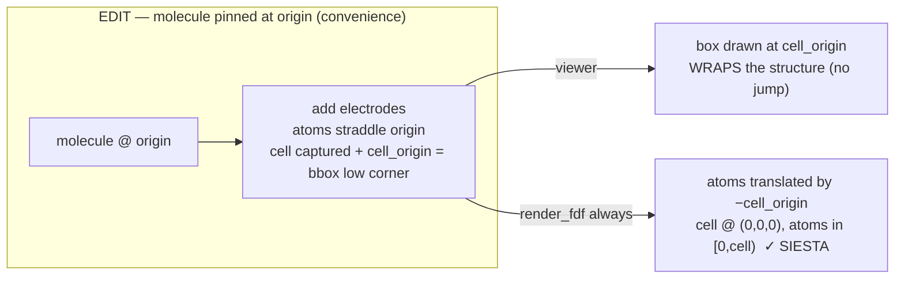
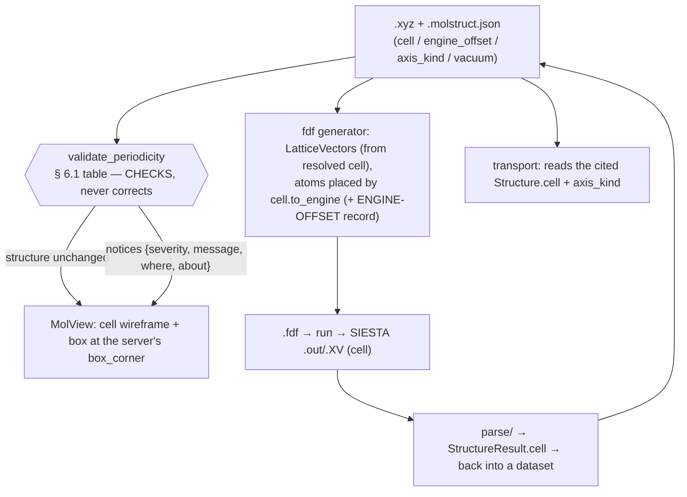
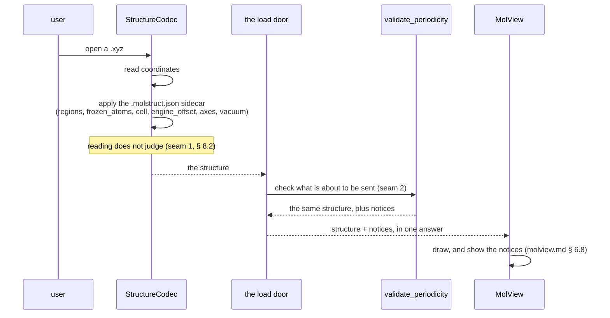
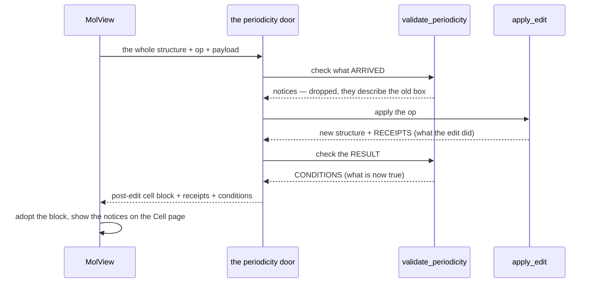

# Periodicity — cell, origin, axis kinds, and vacuum

**Role:** contract
**Domain:** model
**Sub-document of:** [`structure.md`](?doc=model/structure.md) (its master — these are
`Structure` fields). **Companions:** `structure-molstruct.md` (how they persist
in `.molstruct.json`), `engines/siesta.md` (the **k-grid** DFT sampling
parameter, which is a `SiestaConfig` knob — **not** a periodicity field; see
the note below).

Periodicity describes **how the box around a structure behaves per axis** —
the lattice `cell`, where the atoms sit in it (`engine_offset`, § 6.0), whether each axis is
crystalline / isolated / a transport lead (`axis_kind`), and the isolation
padding (`vacuum`). These are fields on the `Structure` dataclass; this doc is
the source of truth for how the cell is **resolved, gated, persisted, and
edited**. The MolView viewer, the SIESTA emitter, and the transport flow all
**read** it; none of them re-derive it.

> **k-grid is NOT here (corrected 2026-07-26).** The Monkhorst–Pack **k-point
> grid** is a DFT *sampling* knob on `SiestaConfig` (`config/siesta.py`), not a
> structure property. `Structure` has no `kgrid` field (`structure.py`:
> "a sampling knob on the config, not geometry"), and the sidecar **schema v5
> dropped** the `kgrid` key (a pre-v5 file is refused on load,
> `structure-molstruct.md`'s version history). Its documentation lives in
> `engines/siesta.md` § 6.1. What periodicity *does* own is **each axis's
> kind**, which decides that axis's role in a rung's k-point mesh — sampled,
> Γ, open or a lead's own — but the sampling *count* is a calculation
> parameter.

**The rule of the whole doc:** periodicity is computed/captured **once, at the
source that knows it** (construction or import), stored in the dataset, and
read at every stage — never re-derived downstream, never hand-fed as a side
file.

---

## 1. The fields

| Field | Shape | Meaning | Default |
|---|---|---|---|
| `cell` | 3×3 (rows = lattice vectors, Å) or `null` | the lattice / box vectors | derived (§ 4) |
| `engine_offset` | 3 floats (Å) or `null` | the offset the structure **states** (§ 6.0): an origin the person assigned at P, stored as `−P`, on a typed `cell` only; or an engine's own output, `[0, 0, 0]`. The box is drawn at `−engine_offset` of the coordinates beside it, and the engine gets those coordinates plus it | `null` = **the rule places the atoms**, centred in the cell (§ 6.0) |
| **`axis_kind`** | 3 × enum `{periodic, isolated, transport}` | **how axis *i* is treated — the authoritative periodicity field** (§ 2) | `(periodic,periodic,periodic)` if a cell is present, else all-`isolated` |
| ~~`pbc`~~ | — | **NOT A FIELD** since 2026-09-22. The boolean view is the accessor `Structure.pbc()`, computed from `axis_kind` on demand (§ 2.0a) | — |
| `vacuum` | 3 floats (Å) **or `null`** | isolation padding, **per side** — meaningful only on an `isolated` axis. `null` means *nobody chose one*, which is what earns that axis the default gap (§ 6.1); `[0,0,0]` means *no gap, deliberately*, and is used verbatim | `null` (unset) |

`cell`, `engine_offset`, `axis_kind` and `vacuum` all live on `Structure`
(`structure.py`) and serialize through the one metadata codec
(`metadata_to_dict`/`apply_metadata_dict`, see `structure.md § 2.2`).

> **`cell_origin` was retired on 2026-09-25** (sidecar v10; plan § 5q, D2):
> a v7–v9 file that carries it is read with it ignored, and no writer emits it
> again. Placement is `engine_offset`'s (§ 6.0). Opening such a file on the
> load door says so, naming the corner it did not apply
> (`cell.origin_retired`, `info`; D14), because a person who typed it assigns
> it again on the Cell page.

### 2.0a One periodicity field, and a boolean accessor *(user, 2026-09-22)*

**`axis_kind` is the only periodicity state a `Structure` holds.** There was
a second, `pbc`, storing the boolean view beside it — and it could not hold a
fact `axis_kind` does not, because the mapping is onto, not one-to-one:
`periodic` and `transport` both give `True`. `__post_init__` recomputed it
from `axis_kind` on every construction, so the two could never legally
disagree; what the second field bought was a duplicate to keep in step.

It cost more than the redundancy. `Structure.replace()` carried both, and
the kind won, so a caller who stated only the boolean had it silently
discarded — patched by comparing the two inside `replace()`, which put one
precedence rule in two places. And `transport/transiesta.py` branched on the
boolean to label each axis in the deck it writes, so **every `transport` axis
was written out as `periodic`**, and its "the transport axis has vacuum / is
not periodic" warning could never fire on a transport axis at all. Both
because a boolean cannot express the distinction it was branching on.

**The boolean survives as `Structure.pbc()`** — a method, not a property, so
the parens say it is computed and a stale reader fails on subscript rather
than silently taking a truthy bound method. It exists for the two formats
outside this project that require booleans and have nothing richer:

  * ASE — `Atoms(pbc=…)` (`to_ase`);
  * extended XYZ — the `pbc="T T F"` header (`to_extxyz`).

**Nothing inside molbuilder calls it.** Code that needs to know how an axis
is treated asks `axis_kind`, which says which of the three it is. Reading the
boolean instead is how the transport mislabel above happened.

**On disk:** `pbc` left `METADATA_FIELDS`, so a sidecar written from here
carries `axis_kind` and not the duplicate, and the fingerprint no longer
includes it. A `pbc` key in an older sidecar is **accepted and ignored**, not
refused (`apply_metadata_dict`'s `RETIRED_METADATA_KEYS`) — `apply_metadata_dict` rejects
unknown keys, and these are files people already have. Nothing is lost by
ignoring it: every sidecar at a readable schema version carries a real
`axis_kind`, because `__post_init__` has always set one.

---

## 2. The three axis kinds — the whole model in one table

Every consumer branches on this one field.

| kind | cell vector on axis *i* | `vacuum[i]` | k-sampleable? | tileable (display) | `pbc()[i]` (ASE/extxyz only) | fdf |
|---|---|---|---|---|---|---|
| **periodic** | commensurate lattice (construction / import) | 0 | **yes** (a `SiestaConfig` knob) | yes | `True` | k-sampled |
| **isolated** | `bbox[i] + 2·vacuum[i]` (§ 3) | **the only kind it applies to** — unset ⇒ 3 Å default, else exactly what you set | Γ — above 1 is warned, never refused | no | `False` | Γ box |
| **transport** (semi-infinite) | **the captured device extent**; the person sets `c` = span + one interlayer spacing on the Cell page (`science/junction-cell.md` § 6) | **0** | on a transport calculation, one point on the seed, the device and the transmission and a lead's own count on a lead; in any other calculation sampled like `periodic` | no | `True` | Γ + electrode self-energy |

> **Two physics points the enum encodes** (that a boolean `pbc` could not):
> - **A `transport` axis is a periodic box that is Γ-sampled where the leads
>   stand in for it.** SIESTA emits a `LatticeVectors` row for it (so its ASE
>   `pbc` is `True`), yet on a transport calculation's open rungs it is never
>   tiled or k-sampled — the semi-infinite leads replace its periodic images.
>   A boolean cannot hold "periodic box **but** Γ-only, electrode-matched";
>   `axis_kind = transport` says it exactly. *(Relaxing a junction is an
>   ordinary periodic run, and samples it like a periodic axis.)*
> - **Only a `periodic` axis is tileable.** `isolated` derives `pbc = False`.
>   Each axis's kind decides its role in a rung's k-point mesh
>   ([`engines/siesta.md`](?doc=engines/siesta.md) § 6.1, `kmesh.py`) — the
>   count itself is a calculation parameter (see the k-grid note at the top).

**Which axis an image belongs to decides whether it is a defect.** The kind
answers one question that recurs all over the stack: *is what sits in the
neighbouring cell intended, or an artefact of the box?*

| kind | images across this axis are… | so a check must… |
|---|---|---|
| **periodic** | the crystal itself — bulk gold has 2.88 Å contacts across the boundary *by construction* | ignore this direction |
| **transport** | the device continuing into its leads — it tiles seamlessly by design | ignore this direction |
| **isolated** | copies of the molecule that only exist because the box is finite | measure this direction |

Three consumers follow from that one rule, and all three were bugs before they did:

* **Containment** (§ 6.1 state table) is required along non-periodic axes only —
  requiring it everywhere made real crystals and junction files unopenable.
* **The atom-to-nearest-image distance check** (`cell.image_distance`,
  `validation/geometry.py`) steps only along **isolated** axes. It used to walk
  all 26 neighbour translations, so it reported every crystal's own nearest
  neighbours as image overlap — a warning that was guaranteed to be wrong
  exactly where the periodicity was deliberate. For a slab (periodic in-plane,
  isolated out-of-plane) it now measures precisely the vacuum gap, and it names
  the direction it measured. A fully periodic cell has no vacuum direction, so
  the check is *not applicable* there — which is different from a check that
  could not run, and stays quiet rather than reporting itself.
* **The cell-volume check** (`cell.volume`, `validation/geometry.py`) compares
  the box's volume with the atoms' bounding volume — a question about all three
  axes at once, so it is asked only of a box that is vacuum on all three. It was
  asked of every box, and it called every crystal and every junction
  *"suspiciously tight"*: a bulk lead fills its cell by construction (1.45 on
  the 2026-09-25 gold lead, 1.03 on its junction). A slab's or a wire's vacuum
  is measured per axis, by the image-distance check above and
  `cell.vacuum_thin`.

### 2.1 What the engine computes with — the structure's kinds, or a cluster's *(plan § 5w K8, 2026-10-01)*

The axis kinds are the STRUCTURE's; the axes a calculation is computed on are
the ENGINE's to say. An engine that computes in a cell — SIESTA, TranSIESTA —
takes the structure's kinds. An engine that builds the atoms as one molecule in
free space — PySCF's `gto.M`, named in `cell.MOLECULAR` — computes a cluster:
isolated on all three axes whatever the structure's, and no cell. **One door
answers it, `cell.engine_axis_kinds(engine, struct)`, and every question about
the calculation that two engines would answer differently asks it** rather than
the structure's own field (an engine's own readers — SIESTA's k-point mesh and
its vacuum advice — read the structure's kinds, which are the axes SIESTA
computes on):

| the question | asked by |
|---|---|
| is the system finite — does the electron count's parity bind, may a moment float ([`science/chemistry-correctness.md`](?doc=science/chemistry-correctness.md) § 2a) | the electronic state |
| which whole-body motions a vibration removes, so how many modes it reports ([`engines/vibration.md`](?doc=engines/vibration.md) R7) | the deck, the Methods count and the settings check's note — one count: on PySCF, the vibration deck's view (`axis_kind`) |
| does a polar molecule sit in a box of vacuum whose images shift its energy | SIESTA's dipole advisory — asked of the axes, never of the k-point count: a crystal or a junction sampled at Γ alone carries its images by design |
| does the box's advice apply — its vacuum, its images, its faces (§ 6.1a, table B) | the settings gate, for an engine that computes in a cell (`cell.box_findings_for`) |

**The structure keeps its own kinds and its own box.** A periodic structure
handed to PySCF is computed as a cluster and noted so
(`cell.periodic_in_gas_phase`), never changed. **An impossible box is a broken
structure, refused on every engine and every road** — table B's refusals, which
the request seam gives whatever the engine (§ 8.2) and the settings gate gives
alike, so the browser and the CLI cannot disagree; what a free-space engine does
not hear is the box's advice about a calculation in it. **And the placement rule
still places every engine's atoms in the structure's box** (§ 6.0) — the same
coordinates on every engine — so a box nothing can be placed in is refused at
the hand-off too (`to_engine`, `require_placed`), and every engine hears its
forecast: an atom a stated origin leaves outside (`cell.atoms_outside`).

*(Until 2026-10-01 the Methods count and the settings check's note counted the
motions on the structure's kinds while the deck removed a cluster's: water in a
periodic box with its oxygen held was told six modes, and none removed, and
computed three after removing three — the M11 review's PS-C4. A PySCF deck
was given the box's advice — its vacuum, its images — about a box the
gas-phase script never uses (PO-C13). The dipole advisory asked whether the
mesh had one point — the K3 review.)*

---

## 3. `bbox` is min/max only — used ONLY on an `isolated` axis

`bbox[i] = max_i(positions) − min_i(positions)` — the extent of the atoms. It
carries **no crystal information** and is **categorically not a lattice**:

- **Wrong size.** For a slab with in-plane spacing `d` and `m` repeats, the
  true period is `m·d`, but the atoms' bbox is `(m−1)·d`-ish — short by ~one
  spacing, non-commensurate; tiling it overlaps/gaps atoms at the seam. (`d` is
  the *surface* spacing, not the cubic constant `a`: for fcc, `d = a/√2` — Au
  `a≈4.08 Å` but in-plane `d≈2.88 Å`; using `a` is a √2 error.)
- **Wrong shape (worse).** bbox is axis-aligned → orthorhombic only. A
  hexagonal lattice (fcc(111)'s 120° in-plane cell) or any monoclinic/triclinic
  cell has non-orthogonal vectors an axis-aligned box cannot represent at all.
  Only construction (ASE gives fcc(111) its 120° cell) or import fills `cell`.

So **`bbox + 2·vacuum` is the derivation for `isolated` axes only** (vacuum on
*each* side of the atoms). `periodic` axes use the commensurate lattice
(construction/import — never detected from raw coordinates, which is
ill-posed); `transport` axes use the captured device extent, and the person
sets `c` = span **plus one interlayer spacing** on the Cell page
(`science/junction-cell.md` § 6: the bare extent collides with its own image),
never bbox.

---

## 4. `resolve_cell` — branch on `axis_kind`

The one resolver (`Structure.resolve_cell()`) computes the
effective cell. **An explicit cell always wins** — the customization escape
hatch (§ 8), and the path a `transport` axis always takes.

```
resolve_cell(structure) -> 3x3 | None
  1. EXPLICIT cell present -> use it verbatim
        (user-edited 3x3 override, imported .XV/.fdf/CIF, or captured
         from a builder -- all land in structure.cell)
  2. else, per axis i by axis_kind[i]:
        periodic  -> commensurate lattice vector (construction/import;
                     ERROR if unknown -- we do NOT bbox a periodic axis)
        isolated  -> bbox[i] + 2*vacuum[i]      (vacuum >= 0, each side)
        transport -> the captured device extent; the person sets
                     c = span + one interlayer spacing (in practice
                     branch 1; never derived here, vacuum = 0)
```

> **Scope of the per-axis form.** Branch 2 assumes the cell is
> **block-orthogonal** — a periodic sub-block (e.g. a hexagonal in-plane pair)
> orthogonal to the non-periodic axis. That covers slabs and junctions. A
> fully general triclinic cell mixed with a non-periodic direction is not
> separable per-axis; it must arrive **explicit** (branch 1).

### 4.1 The default state — resolve through the API, never read raw

Every parameter has an explicit default (a fresh/generated structure starts in
it). A consumer must translate the default **through the resolver**, not read
the raw stored field and treat a missing value as "no box." This is what makes
the box render and the fdf work on a blank molecule.

| Parameter | Default | Resolver (default → concrete) | Explicit override |
|---|---|---|---|
| `cell` | `struct.cell is None` | `resolve_cell()` (§ 4) | `commitPeriodicityOp("cell", 3×3)` / import / capture → `struct.cell` wins verbatim |
| `vacuum` | `null` (unset) | `effective_vacuum()` — **3 Å per side on each `isolated` axis** (§ 6.1); 0 on periodic / transport, where vacuum does not apply | `commitPeriodicityOp("vacuum", [x,y,z])` — used verbatim, however small. `null` clears it back to the default |
| `axis_kind` | `isolated` on every axis (a fresh molecule is a vacuum box) | the one periodicity field; `pbc()` derives the booleans for ASE/extxyz only | `commitPeriodicityOp("axis_kind", [...])` |
| `block` | — (not a field: it sets all four) | — | `commitPeriodicityOp("block", {cell, box_corner, axis_kind, vacuum})` — the whole cell, checked once |

**One door, five ops.** This column named `setUnitCell` / `setVacuum` /
`setAxisKind` — three separate writers that were deleted in the MolView rework
and replaced by a single `commitPeriodicityOp(op, payload)`, with `op` one of
`vacuum · axis_kind · cell · box_corner · block` (`periodicity_gate.OPS`, and
the route validates against that same tuple). Four doors meant four things for
the gate to stand in front of; one door means the check cannot be bypassed by
picking a different setter. **For `cell` and `box_corner` the payload is
required even when it is `null`** — a dropped key must not be
indistinguishable from an explicit "clear this".

**`block` sets the whole cell and checks once,** and it exists because the
field-at-a-time ops could not express a change to two of them. The cell is one
fact that travels together (`?doc=web/molview.md` § 6.2); sending two requests
is not atomic, and the second can be refused after the first has landed —
leaving a box nobody asked for. Worse, two of the transitions are unreachable
in *either* order: an axis cannot become `periodic` until an explicit `cell` is
stored, and that cell cannot be cleared while an axis is `periodic`. So
"become a periodic crystal" and "go back to a derived box" were journeys
through a state the gate refuses.

`block` takes all four keys, builds the result, and runs the one checker on
*that* — so the intermediate states never exist and the same rules are enforced
on what the user actually described. It rejects an unknown key rather than
ignoring it: a partial block is exactly what it replaced. It is what the Modify
tab's Cell panel sends, from its **Derived / Explicit** switch (2026-09-07) —
`cell: null` **is** the derived regime, so the switch is a reading of the
structure and not a fifth field to keep in step with it.

**Load-bearing rule:** the cell the renderer uses is the **resolved** cell,
obtained only through the accessor `molview.data.getUnitCellInfo().cell` —
never a hand-read of `getStructure().periodicity.cell` (a consumer that
short-circuits on `cell == null` is the "box has no effect on a new molecule"
bug). The raw `periodicity.cell` stays the explicit cell (`null` = default);
the accessor surfaces `periodicity.resolved_cell`.

**One resolver, no duplication:** `resolved_cell` is computed in exactly one
place — `struct.resolve_cell()` on the **server** (the same function the
fdf/save use) — and the client accessor only surfaces it (no re-implemented
bbox math on the client). `resolved_cell` is DERIVED: never saved (the save
writes the raw `cell`), never committed to `struct.cell` (which would
masquerade as a user-chosen lattice and defeat the override hatch).

---

## 5. Backend surface (Python)

| Concern | Home | Behavior |
|---|---|---|
| The fields + invariants | `structure.py` `__post_init__` | validate `cell`/`engine_offset`/`axis_kind`/`vacuum` (there is nothing to reconcile since `pbc` stopped being a second field — § 2.0a) |
| `resolve_cell()` | `structure.py` | § 4 — explicit wins, else per-axis |
| `engine_offset()` / `to_engine()` | `cell.py` | § 6.0 — where the atoms sit: the offset the structure states, else the rule's centring; the coordinates every engine gets |
| **Capture at construction** | `modify.py` — `add_slab` through `_finish_slab`. That helper was extracted so **two** builders could share it; `add_electrode_slab` was the other and went on 2026-09-01, `add_symmetric_electrodes` before it | sets `Structure.cell` (in-plane lattice + the z length below) **and** `axis_kind=(periodic,periodic,transport)` (defined `:1043`, passed to the constructor `:1063`) — no more electrode discard |
| **The captured z length** | `modify.py` (inside `_finish_slab`) | **the atoms' z extent, verbatim**: `c` is measured and set on the Cell page — span plus one layer spacing — never invented by the builder ([`science/junction-cell.md`](?doc=science/junction-cell.md) § 6) |
| Emit | `siesta/input.py:render_fdf` (and every other deck) | emits `LatticeVectors` from the resolved cell and the coordinates `cell.to_engine` places — the design plus `engine_offset`; `script_emit.render_deck` refuses a frame with an atom outside along a non-periodic axis and writes the ENGINE-OFFSET record (§ 6.0) |
| Transport | `transport/compose.py` | the cited relaxation's cell — the `.XV`'s (form A) or the pair's sidecar (form B); a citation whose cell is missing or unusable is refused at the citation door, naming the cited file |

> **Rewritten for § 6.0** *(2026-09-25)*: the `resolve_cell_origin()` row and
> the Emit row's hand translation went with the code — every emitter asks
> `cell.to_engine`, and the electrode builder states no origin.

The electrode builder is *told* which lattice constant to use — `fcc_lattice.json`
carries `a_experimental` / `a_pbe`, and a value measured off the user's own
relaxed bulk run can be typed in beside them — and the captured cell is built
from it.

It does **not record** which one it used, and deliberately does not *(user,
2026-09-21)*. This sentence used to claim it did, which is worth stating
plainly because the claim invites a check nobody wants: a second slab can be
built at a different reference, and enforcing agreement between them is not
this tool's business. A bad contact shows up in the calculation as a bad
contact. The author chooses; molbuilder builds what it is told.

(Recording alone would also buy nothing: a structure has one `info`, so a
second build overwrites the first, and knowing *which atoms* came from which
build would take per-region provenance — a large mechanism producing a label
no one is allowed to act on.)

---

## 6.0 The engine offset — ONE placement rule, for every engine *(user, 2026-09-25)*

*Decided in conversation on 2026-09-25, and **built** the same day: the rule,
the hand-off gate with its containment (`cell.py`), every emitter (SIESTA, the
five transport rungs, PySCF, the molwatch preview), each deck's record, the
stated offset (`Structure.engine_offset`, sidecar v10), the retirement of
`cell_origin`, the readers of engine output, the wire and MolView, and the Cell
page's origin (plan § 5q.6, P1–P3). Not yet built: the transport face-gap
warning (check 2), one offset for a frame set (below, with W32's frame sets),
the design-frame exports plan § 5q.5 still marks open, and the transport
citation viewer (§ 5q.3). The scope and the order of work are
[`plans/plan.md`](?doc=plans/plan.md) § 5q (row W33). The clauses this section
supersedes say so at their own site; they no longer describe the running code,
and the phase-4 doc sweep deletes them.*

> **The rule.** Every engine receives the design coordinates plus
> **`engine_offset`**, with the cell's corner at `(0,0,0)`. `engine_offset` is
> the rigid translation that **centres the atoms' span — as authored, never
> re-wrapped — inside the cell along each lattice vector**, measured in
> fractional coordinates. It is **computed** from the resolved cell and the
> position of every atom, and from nothing else — **unless the person assigns
> the box's origin**, and then it is that origin's negative, stored with the
> structure (*A stated offset*, below). Nothing else chooses it.

> **The invariant is coordinates + offset** *(user, 2026-09-25)*. A file's
> coordinates plus its offset ARE the coordinates the engine gets — *"the only
> invariable is that the cell origin and the coordinate are consistently set
> together"*. **At the hand-off the cell origin is `(0,0,0)` and every atom is
> inside the cell** — the correction applied — and the deck renderer refuses
> coordinates for which that is not so (`cell.require_placed`, check 3): *"the
> siesta receives a cell origin at 0,0,0 always as it expects with all
> coordinates corrected. that's it. nothing about forcing how a structure file
> should always has about its origin."* Nothing else is claimed of a file:
> whatever reframes its coordinates restates its origin with them (§ 6
> clause 2b).

*(User: "always adjust it before sending to siesta or other engines that the
coordinates of all atoms are centered inside the cell … the original xyz would
not need to be changed by their coordinate — because they contain the design
intention"; "in this way, we don't have to have special logic to treat
isolated, periodic, transport axis_info differently"; "engine neutral too, so
that this can be translated between different engines, explicitly".)*

**What it replaces, and why one rule is enough.** Placement used to be a stored
corner (`cell_origin`, § 6) or, when none was stored, a corner each reader
*derived* (clause 2a) by a rule that depends on the axis kind — `bbox_min −
vacuum` on an isolated axis, `bbox_min` on a transport one, `0` on a periodic
one. On 2026-09-25 that gave one structure two boxes. The deck placed a junction
flush against its bottom face — the electrode builder anchors there by design
(`modify.py`: *"the padding opens at the TOP"*) — and TranSIESTA refused it
(*"Electrode: L lies outside the unit-cell"*; the lowest atom sat 1.6e-5 Å below
the face, the stored corner being `−17.355` against an atom at `−17.355016`).
The Results tab, sent no corner and no axis kinds — it searched the run
directory for a `.source` pair that a ladder keeps at its root — derived an
isolated-axis corner and drew the atoms centred, which the engine never had.
With the offset computed by one rule and recorded where it was applied, no
reader derives anything, and **placement no longer depends on the axis kind**.
The kinds keep their other jobs — how big a box nobody typed is (§ 4), and what
the physics treats as periodic, isolated or transport — and lose this one.

**Why centring — robustness, not an engine's requirement** *(user, 2026-09-25:
"it is more for robustness, not really a requirement by the engines")*. What
the engines require is CONTAINMENT: every atom inside the cell. TranSIESTA says
so in its own words — *"Device atomic coordinates are not inside unit-cell.
This is a requirement for bias calculations as the Poisson equation cannot be
correctly handled due to inconsistencies with the grid and atomic coordinates"*,
and *"Electrode: L lies outside the unit-cell"*, which stopped the 2026-09-25
device before its SCF. Where inside the atoms sit is not physics: along a
periodic axis a rigid shift changes nothing but SIESTA's meV-level egg-box
ripple (plan § 5q.7, R3), and a junction's physics is its cell length `c` — span plus one
layer spacing, so the two electrodes' outer layers meet across the boundary as
bulk does (`science/junction-cell.md` § 6.1) — not how that one gap is split
between the two faces. Centring is chosen because it puts every atom as far
from every face as the cell allows, so no rounding error can carry one out: the
2026-09-25 refusal was a flush electrode, zero margin, pushed 1.6e-5 Å outside by
a corner stored to three decimals. And it is the placement TranSIESTA's own
recipe gives (`AtomicCoordinatesOrigin 0 0 1.1773`: half its 2.3545 Å
*"Electrode inter-layer distance"*).

| | |
|---|---|
| **design coordinates** | the `.xyz`: the author's intent. No engine step rewrites them |
| **engine coordinates** | design + `engine_offset`, the cell at `(0,0,0)` — what SIESTA, TranSIESTA and PySCF are all handed |
| **where a viewer draws the box** | at `−engine_offset` **of the coordinates on screen**: for design coordinates, the structure's offset negated — the computed one, or the origin the person assigned; for engine coordinates, `(0,0,0)`. The viewer draws the coordinates it is given and moves no atom *(user, 2026-09-25: "the 3d viewer should just follow what coordinate is in the structure, and draw the cell box with the offset in mind (start from -offset). i don't believe the 3d viewer should do the job of translation")* |
| **coordinates that came from an engine** | `engine_offset = 0`, **stated, not recomputed**: they are the engine's own frame, drawn verbatim (§ 6.1 clause 5) and handed to the next engine unchanged. Recomputing would redraw an older flush run centred, which is the misleading picture itself — and would move a relaxed geometry against SIESTA's real-space mesh, where it is no longer stationary (`engines/vibration.md` § 5.2a) |
| **a structure saved from an engine's output** | carries the engine's coordinates **with the engine's origin**, `(0,0,0)` — the two set together, as a stated offset of `0` — so its next treatment applies nothing and the box stays where the engine had it. One saved from a run made before this rule carries that run's frame, flush corner included; check 3 refuses an atom it leaves outside, a gap under `d/2` will be warned (check 2, not yet built), and *Automatic* on the Cell page re-centres it |

**Why fractional, and why never re-wrapped** — both measured on the junction
that surfaced this, `projects/claude-vib-ui/structure/au333x6_bdt`:

* **Fractional.** Its in-plane cell is hexagonal (`b = (4.326, 7.492, 0)`), so
  the slab's Cartesian x-extent is **10.093 Å against |a| = 8.651 Å**. A
  Cartesian bounding box cannot say what "centred" means on a skewed axis; the
  fractional span along each lattice vector can, for any cell.
* **Never re-wrapped.** The tempting rule for a periodic axis — put the cell
  edge in the widest gap — cuts this junction: its Au–S contact gaps
  (**2.399 Å**) are wider than the seam (**2.355 Å**), so the edge would land
  between the gold and the sulfur. Translating the atoms as authored keeps the
  device whole.

* **Frozen atoms move with the rest** *(user, 2026-09-25)*. Frozen is a
  constraint on the CALCULATION: the engine holds a frozen atom where it sits
  in the unit cell while the others move (the deck names it by index). It says
  nothing about where a structure sits while it is built, so the offset places
  a frozen atom exactly as it places every other.

On that junction the rule gives `engine_offset = [6.3684, 3.746, 18.5325]` Å.
The engine then sees z = 1.1775 … 35.8875 in `c = 37.065`, with equal fractional
margins on every axis (a 0.0555 / 0.0555, b 0.0555 / 0.0555, c 0.0318 / 0.0318)
— the z half-gap TranSIESTA's own recipe gives (1.1773) — and the offset
recomputed on those engine coordinates is `[0, 0, 0]`.

**A stated offset — an origin the person assigns, and an engine's own.** The
rule is the default, not a cage. A structure may STATE its offset instead, and
two things state one:

* **An origin the person assigns** *(user, 2026-09-25: "we should add one that
  can allow user to explicitly assign the origin of the cell box as the user
  desire (for further modificaiton convenience etc). this could be handled by
  just write the -origin to the frame_offset such that the next treatment of
  the file will force the 0,0,0 to be the user specified position")*.
  Assigning origin `P` stores `engine_offset = −P` with the structure. The
  Cell page sets it — three numbers, or one picked atom — and *Automatic*
  clears it; on a typed cell only, because a box sized from the vacuum has a
  per-side gap (§ 4) that an off-centre box would make false, and when the box
  returns to a derived one (§ 6.2: the single-field `vacuum` / `axis_kind`
  ops, or the Cell page's switch to *Derived*)
  the assignment goes with the typed cell. It is the person's, so edits keep
  it: an atom it then leaves outside the box along a non-periodic lattice
  vector is named on the Cell page, the edit stands, and the deck is refused
  until it is fixed (check 3).
* **Coordinates that came from an engine** state `0`: their origin is the
  engine's, `(0,0,0)`, set together with them — the table above. Every door
  that makes a structure from an engine's output states it: the next rung of
  a ladder (the vibration `freq` stage from `relax`'s output, a transport
  rung from the cited relaxation's `.XV`), every save of a run's output, and
  every read of an engine's own structure file — SIESTA's `<label>.xyz`,
  written with no sidecar, takes its run's frame in the codec
  (`StructureCodec.read`), from the composer the Results tab's trajectory
  door also asks (`parse/dirs/atom_metadata.engine_frame_for_run_dir`).
  The transport citation states it only when the cited deck recorded its
  placement — its `engine-offset` record *(user, 2026-09-25, plan § 5q D7)*:
  a relaxation run before the record left its atoms flush against a face, so
  the rule places it instead. The shift is rigid, which changes nothing
  TranSIESTA reads but SIESTA's meV egg-box ripple, and it keeps such a
  relaxation citable without relaxing it again.

The engine gets the coordinates plus the stated offset, the cell at
`(0,0,0)`, and the deck's record says the offset was stated. An operation that
reframes the coordinates restates the offset with them. **Moving atoms only
moves atoms** *(user, 2026-09-25: "leave the cell alone, moving atoms only
moves atoms")*: a translation, rotation or orientation — of some atoms or all —
changes coordinates and nothing else, so the cell's vectors and a stated
offset stay where they were, and an atom the move leaves outside the box is
named on the Cell page and at the deck. A builder that types a new cell drops
a stated offset, and one that joins structures takes it from the one whose
cell it keeps (§ 2.2b) — except that an append which first centres the
incoming structure drops that structure's stated offset (plan § 5q D9): the
centring reframed its coordinates, so the box centres on the joined atoms, and
the append says so.

`cell_origin` (§ 6) stored the person's choice as a corner, and where none was
stored every reader derived one by its own per-axis rule. The stated offset is
that choice with no deriving behind it: when it is absent, the rule answers.

**The name.** `engine_offset` — *how far these coordinates are from the ones the
engine gets*, so `0` reads as *these are engine coordinates* — a
*displacement of the atoms*, where a corner names a position of the box.
**Two quantities, two names**, so the invariant can
be written without ambiguity: `engine_offset(struct)` is a structure's OWN
offset — computed by the rule, or stated; nonzero for design coordinates,
zero at the hand-off — and
`applied_offset` is the correction a frame or a deck's record states was added.
`design + applied_offset == deck coordinates`, and `engine_offset` of those is
zero. One name for both invited a reader to add a deck's recorded correction to
coordinates that already include it.

**The operations — one module, and nothing else translates.**
`molbuilder/cell.py` is *"the ONE place a box is worked out, and the ONE place
it is judged"*, and the one place atoms are placed: every emitter takes
`to_engine`.

| operation | answers | its only callers |
|---|---|---|
| `engine_offset(struct)` | the rule: the offset the structure states when it states one, else the centring | `to_engine`, `resolve`, `Structure.to_wire` |
| `to_engine(struct) → EngineFrame` | the cell, the engine coordinates, the offset, and whether it was stated | every emitter — the SIESTA deck, the TranSIESTA rungs, the PySCF script, the molwatch log's step 0, the validators' subject |
| every door that builds a structure from an engine's output | states `engine_offset = 0` on it, set together with the coordinates — one keyword, no API of its own (plan § 5q D10) | the `.XV` reader, the transport citation (with a record, D7), the vibration `freq` stage, the Results door, `xv2xyz`, the SIESTA validators' subject |
| `Structure.to_wire` | `box_corner = −engine_offset`, the one place a viewer's corner is worked out | every payload that tells a viewer where to draw |
| `require_placed(frame, axis_kind)` | refuses coordinates that were not placed: a computed frame whose atoms are not centred, and any frame with an atom outside the cell along a non-periodic lattice vector, to 1e-6 Å | the deck renderer, before it writes a line |
| the periodicity door's `box_corner` op | assigns the box's origin on a typed cell, or clears it back to the rule | the Cell page |
| `resolve(struct) → ResolvedCell` | the box and its judgement | the periodicity gate, the validators |

**The record — engine-neutral, beside the coordinates it labels.** Every deck
molbuilder writes (SIESTA `.fdf`, PySCF `.py`) carries a `molbuilder
engine-offset` block: the cell, the correction applied (`applied_offset`),
whether it was stated or computed, and the axis kinds, in neutral terms, to 8
decimals (PySCF and the transport rungs write their coordinates to 8, SIESTA
to 10: the record is inside every tolerance either way). It is the provenance clause 5 promised, and it is what a reader
of a run asks, so the Results tab reads the axis kinds from it, and falls back
to the `.source` pair only for a run made before the record. **The Results tab shows those axis kinds** — the
structure's, as the deck was written — rather than the engine's own treatment
*(user, 2026-09-25: "we should show the axis_info as in structure. siesta is
always periodic, true, but the isolate axis get our additional gate of vacuum
surrounding them and that shows in the cell box too")*. It is a **sibling** of the `atom-metadata` block, not a
key inside it: that block is the sidecar's shape and is written only when there
are labels (`script_emit.emit_atom_metadata`), while this one is a fact about
the emission and is written for every deck. One writer and one reader, beside
that block's.

**The checks.**

1. **The atoms fit** — their fractional span is `< 1` along every
   NON-periodic lattice vector. When it is not, no offset can put them inside,
   and the Cell page refuses the edit naming the axis (a Modify op reports the
   same state as a warning, § 8.2). Along a periodic vector a wider
   span is legal: the atoms beyond the cell are images the engine wraps — and
   requiring containment there is what made real crystals unopenable until
   2026-07-29. Since the correction is applied everywhere, an atom left beyond
   a periodic face is **warned, never refused** *(user, 2026-09-25: "we should
   now give warning/error when atoms are outside boundary for all cases, now
   that the correction of origin is applied universally at the output of the
   engine")*: a molecular crystal written with whole molecules is the legal
   case, and the warning says the engine will wrap it. The placement rule itself stays blind to the axis kind; only
   this check reads it. This replaces the containment regimes of § 6.1
   clause 4. With an assigned origin the question is where the atoms are,
   not their span: an atom outside the box along a non-periodic lattice
   vector is named on the Cell page, and the edit stands (*A stated
   offset*); check 3 refuses the deck.
2. **A transport rung's gaps along its transport axis** — an atom OUTSIDE the
   cell is refused (check 3): that is TranSIESTA's requirement, above, and the
   refusal that should have come from molbuilder before the 2026-09-25 device
   deck reached TranSIESTA. A gap at a face below the lead's `d/2` — half the
   electrode's interlayer spacing — is WARNED, not refused: it is legal, the
   placement TranSIESTA's recipe recommends is `d/2`, and a smaller margin is
   the fragile state that failed. The leads TranSIESTA had just run sat flush in
   their own cells, so a different rigid shift between lead and device is not
   what it checks. The spacing is the electrode model's, known where the rung is
   composed.

3. **Placed at the hand-off** — the deck renderer (`script_emit.render_deck`)
   runs `cell.require_placed` on the frame every spec carries, and a spec that
   carries none is refused rather than logged. It refuses a computed frame
   whose atoms are not centred — every emitter places through `cell.to_engine`,
   so that can only fire on one that did not — and any frame with an atom
   outside the cell along a non-periodic lattice vector, to 1e-6 Å (TranSIESTA
   refused an atom 1.6e-5 Å outside; a fractional tolerance of 1e-6 is 3.7e-5 Å
   on a 37 Å cell, and would have let it through). The atoms beyond a periodic face go into the deck's report as
   warnings (check 1). The tests hold every engine to it through prep *(user,
   2026-09-25: "test should validate the invariables, and then gate that the
   output of the script generator for all engines to correctly also have the
   origin to be 0,0,0 and all atoms are within cell boundary after that
   correction/check")*.

**A frame set gets one offset** *(the contract W32's frame sets are built to;
not yet built)*. The frames of a multi-frame pair share one cell
and identical electrode atoms (`engines/transport.md` § 2a.9). The offset is
computed from frame 0 and applied to every frame — frames 1…N state frame 0's
offset — so no electrode atom moves between frames in the engine's coordinates
either.

---

## 6. Cell origin + calibration — an explicit cell that wraps off-origin atoms

> **SUPERSEDED by § 6.0** *(2026-09-25; the code it describes is retired)*. The problem
> stated below is real, and § 6.0 solves it without a derived corner: the box
> is drawn at `−engine_offset` of the design coordinates, so it still wraps
> atoms that straddle the origin without moving them. An origin the person
> chooses is kept, stored as the offset (§ 6.0, *An origin the person
> assigns*); **calibrate (clause 4) is retired** *(user, 2026-09-25: "we can
> retire the calibrate button")*. Clause 2b's principle —
> an origin is a label on the coordinates beside it — stands, and is why an
> engine's output has its offset stated as 0 rather than carried over. This
> section no longer describes the running code; the phase-4 doc sweep deletes
> it.

**The problem.** Building a tunnelling junction, the natural workflow pins the
molecule at the world origin and grows structure around it (centre at
`(0,0,0)`, orient anchors along `z`, then flank with electrode slabs at
`z = ±gap/2`). The electrode op captures an explicit `cell` whose `z` length is
the total device extent — but the atoms now straddle the origin
(`z ∈ [−L/2, +L/2]`), while a bare 3×3 `cell` is anchored at `(0,0,0)` by SIESTA
convention. The box would sit at the origin with half the atoms outside it (the
2026-07 "right size, wrong corner" bug).

**The contract — separate editing convenience from SIESTA correctness:**

1. **`cell_origin`: the world-space LOW CORNER an explicit cell emanates from**
   (`null` = **derive the corner**, not "the corner is zero" — see clause 2a).
   An op that builds a cell *around* off-origin atoms sets
   `cell_origin` to the structure's low corner, so the cell wraps the atoms
   without moving them. It is *stored intent* (set by the op), never guessed
   from atom extents, so it never drifts; a genuine imported crystal (atoms
   already in `[0,cell)`) leaves it `null`. The dataclass **drops `cell_origin`
   unless `cell` is explicit** (`structure.py:414`).
2. **`resolve_cell_origin()` returns `cell_origin` for an explicit cell**, so
   the viewer draws the box at its true corner, wrapping the structure.
2a. **What `null` resolves to, exactly.** With an explicit cell and no stored
   origin the corner is *derived*, never assumed to be the world origin: it is
   `bbox_min − effective_vacuum` on an **isolated** axis, `bbox_min` on a
   **transport** axis, `0` on a **periodic** one — and `None` (no shift at all)
   only when the box already at `(0,0,0)` contains every atom along the
   non-periodic axes, which is the imported-crystal and engine-frame case.
   So `null` and `(0,0,0)` coincide in that case and **differ everywhere
   else** — for three isolated axes with 8 Å of vacuum they are 8–11 Å apart.
   Read `null` as "work the corner out", never as "the corner is zero".
2b. **THE ORIGIN IS A LABEL ON THE COORDINATES BESIDE IT** *(user, 2026-09-21)*.
   It is not metadata that travels on its own: it measures one specific set of
   coordinates. **Any operation that reframes the coordinates restates the
   origin in the same breath** — coordinates from frame X carrying an origin
   measured in frame Y is always a defect, because the emitter then shifts by
   `−cell_origin` and displaces the structure by the whole corner. Three sites
   got this wrong
   independently before the rule was written down: the SIESTA deck's
   `validation_struct` (shifted atoms, stored corner → a phantom
   `atoms_outside` warning), the Results tab (a run's engine-frame frames given
   the authoring pair's corner → an off-corner box, and an export that
   double-shifted the next deck), and transport form A (`.XV` coordinates given
   the authoring sidecar's corner → the junction emitted translated, far-face
   atoms wrapping into the leads). A cell is a **shape** and survives a change
   of frame; an origin is a **position** and does not.
3. **SIESTA correctness is applied at generation, not while editing.**
   `render_fdf`'s default path (`cell=None`, the one the web build uses)
   translates atoms by `−resolve_cell_origin()`, so SIESTA always receives
   atoms inside `[0,cell)` with the cell at `(0,0,0)`. (An explicit `cell=`
   override argument instead fractional-wraps atoms into that cell — same end
   state, different mechanism.) **The viewer ≡ render_fdf invariant:** the viewer's box (cell at
   `cell_origin`, atoms where they are) and SIESTA's cell (at `(0,0,0)`, atoms
   translated by `−cell_origin`) are the SAME relative geometry.
4. *(Retired 2026-09-25 with its code: `calibrate_to_cell`, the optional last
   step that baked the generation-time shift into the stored coordinates.
   § 6.0's assigned origin is what it was for.)*
5. *(Retired 2026-09-25: a rigid whole-structure transform moved the box with
   the atoms — the lattice vectors and the corner. The user: "leave the cell
   alone, moving atoms only moves atoms" — § 6.0, *A stated offset*.)*


```mermaid
flowchart LR
    subgraph EDIT["EDIT — molecule pinned at origin (convenience)"]
        M["molecule @ origin"] --> E["add electrodes<br/>atoms straddle origin<br/>cell captured + cell_origin = bbox low corner"]
    end
    E -->|viewer| V["box drawn at cell_origin<br/>WRAPS the structure (no jump)"]
    E -->|render_fdf always| S["atoms translated by −cell_origin<br/>cell @ (0,0,0), atoms in [0,cell)  ✓ SIESTA"]
```

**The resolve table, completed:**

| Cell state | `resolve_cell()` | `resolve_cell_origin()` | `render_fdf` translates atoms by |
|---|---|---|---|
| derived (no explicit cell) | per-axis `bbox + 2·vacuum` / bbox (§ 4) | `bbox_min − vacuum` (isolated) / `bbox_min` (transport) | `−origin` (centres in the box) |
| explicit, `cell_origin` set (junction) | the explicit cell | `cell_origin` | `−cell_origin` (into `[0,cell)`) |
| explicit, `cell_origin` null (imported crystal) | the explicit cell | `null` → `(0,0,0)` | `0` (already in `[0,cell)`) |

**"Use default" is invalid for a `periodic`/`transport` axis.** Clearing the
explicit cell falls back to `resolve_cell()`, which **raises** on a `periodic`
axis (you cannot derive a commensurate lattice from a bounding box). So the
Cell page's "Use default" is disabled whenever any axis is `periodic` or
`transport`. Likewise **vacuum is N/A for an explicit cell** (it only grows a
derived isolated axis), so the vacuum control reads "not applicable".

---

## 6.1 The frame contract (v2, decided 2026-07-29) — one gate, a state table, no silent frames

> **Partly superseded by § 6.0** *(2026-09-25, built)*: clause 4's
> origin rows and containment regimes go — placement is computed, so there is
> no user-owned or derived corner left to judge, and "the atoms fit" is one
> check. Clause 5 is built by § 6.0, and says so below. Clauses 1–3 stand.

Six clauses, agreed with the project owner; every periodicity change conforms
to these or is a bug:

1. **The truth is the pair — and only the pair.** The `.xyz` (coordinates in
   the world frame) + `.molstruct.json` (`axis_kind`, `vacuum`, and *only
   user-explicit* `cell` / `engine_offset`) are the single source of truth.
   `resolved_cell` / `box_corner` / wire fields / UI displays /
   engine inputs are **computed views** and are never written back into the
   truth. (A resolved cell materialised into `cell` with the origin dropped —
   the 2026-07 hemeC corruption — is the violation this clause forbids.)
2. **One gate — one implementation, not one location.** Default-resolution
   and validation live in exactly one function, `validate_periodicity`, and
   every seam that needs them calls it rather than reimplementing a rule:
   the loader/saver of the pair (`StructureCodec`), the periodicity mutation
   door (§ 6.2), the exit every structure-returning route leaves through, and
   the emit path. § 8.1 lists all seven and what each does with the answer.
   The UI edits truth and renders views; emitters translate. **Nothing
   corrects state** — not even the gate (clause 1); the correction step this
   clause used to describe was removed 2026-07-29.
3. **The world frame belongs to the structure.** Atoms are authored relative
   to the world origin (composition convenience); the **cell is constructed
   around the structure**, never the structure moved into the cell.
4. **The state table** (right-handed cells enforced, `det(cell) > 0`;
   per-axis `expected_corner = bbox_min − vacuum` on isolated, `bbox_min` on
   transport, `0` on periodic). **Containment is required only along
   NON-PERIODIC axes** — along a periodic axis, atoms outside `[0, cell)`
   are legitimate periodic images (the engine wraps them), so the gate
   never constrains that direction (corrected 2026-07-29 after
   the first cut made real crystals/junctions unopenable):

   | Stored state | Atoms contained (non-periodic axes)? | Gate action |
   |---|---|---|
   | no `cell`, no `cell_origin` | — | fully derived (§ 4); **vacuum authoritative**; nothing stored to judge |
   | explicit `cell`, no origin | yes | legal (imported-crystal): the corner **is** the world origin; vacuum **reference-only**; nothing reported |
   | explicit `cell`, no origin | NO | legal: the corner is **derived** — the wrapping corner, or the structure centred in the box where the per-side vacuum does not fit — and reported as an `info` notice. **Nothing is written into the truth.** A cell the structure cannot fit for ANY origin (fractional extent > 1 on a non-periodic axis) is a hard error at the edit, so an unfittable cell is never stored |
   | explicit `cell` + origin | yes | legal, user-owned; **never rewritten**; vacuum reference-only |
   | explicit `cell` + origin | NO | **user-owned in both halves**: warned (actual per-side clearances reported), **never auto-fixed** — at the live edit *and* on load (a stored manual origin must round-trip verbatim; silently flipping it on reload was the corrected defect) |

   **The default vacuum gap** (decided 2026-08-03, replacing the
   minimum-thickness floor of 2026-07-29). Vacuum has **three** states, not two,
   and the third is what makes the rule sayable: `None` means *"I never chose
   one"*, distinct from a chosen zero.

   * **A vacuum is set** → it is used **verbatim**, on every axis, however
     small. You dictate what you want; a thin gap is *warned about*
     (`cell.vacuum_thin`) and **never overridden**.
   * **Nothing is set** → every **isolated** axis gets **3 Å per side**. It is a
     default **gap**, not a floor on the box length: 3 Å of empty space is 3 Å
     whether the molecule is 2 Å across or 200 Å, so a large molecule gets it
     too.

   Three properties make it safe:

   * It is a **resolved value**, never written back (clause 1):
     `Structure.effective_vacuum()` supplies it, `struct.vacuum` keeps exactly
     what the user typed — or `None` — and the wire carries both (`vacuum` +
     `resolved_vacuum`).
   * It is **never silent**: `validate_periodicity` emits an `info` notice on
     **every hand-over** naming the axes, the gap, and the resulting image
     distance. (Until 2026-08-03 this was announced only from the vacuum /
     axis-kind *edit* path, so loading a structure and generating from it said
     nothing.)
   * The rule centres the atoms in the box this sizes (§ 6.0), so the axis
     grows symmetrically and the molecule stays centred.

   It is a **starting** gap, not a claim of physical adequacy — see the
   thresholds in § 6.1a. Vacuum is meaningless on a periodic axis (the lattice
   sets the length) and on a transport axis (the device length is matched), so
   neither gets a default.

   *What this replaced, and why.* The old rule was a floor on the **box**:
   `extent + 2·vacuum < 3 Å → vacuum = max(yours, 3)`. It asked about the box
   rather than about what the user wanted, and got both ends wrong — it **raised
   a typed 1.0 Å to 3.0**, overriding a stated value, and it left a **large
   molecule with no gap at all**, because its box already exceeded 3 Å. Both are
   the same confusion: *a minimum box length is not a vacuum.*

## 6.1a The decision matrices — how the box is made, and what is said about it

> **Table A's "Low corner" column and the corner rules are superseded by § 6.0**
> *(2026-09-25, built)*. Its box-length column stands.

Two questions, two tables. Everything on the Cell page is one or the other.

**A. What sets the box, per axis.** Read left to right; the first row that
matches wins. `extent` is the structure's bounding-box length along that axis.

| Explicit `cell`? | Axis kind | `vacuum` set? | Box length | Low corner | Regime |
|---|---|---|---|---|---|
| **yes** | any | *ignored* | **the row you typed** | see the corner rules below | **manual** |
| no | `isolated` | yes (`v`) | `extent + 2v` | `bbox_min − v` | derived |
| no | `isolated` | **no** | `extent + 2 × 3 Å` | `bbox_min − 3` | derived |
| no | `transport` | *never applies* | `extent` | `bbox_min` | derived |
| no | `periodic` | *never applies* | **refused** the moment the box is resolved — a periodic axis needs a real lattice, never a bounding box | `0` | — |

The one line to carry away: **an explicit cell demotes vacuum to
reference-only.** The single-field `vacuum` and `axis_kind` ops therefore
*reset to derived* — they clear the cell you typed, and their receipt says so
(§ 6.2). The Cell page sends neither: its switch to *Derived* is that choice,
made on screen before the one Apply.

Two traps worth stating outright:

* **The periodic refusal is not at construction.** A `Structure` with a
  `periodic` axis and no `cell` builds fine; it raises when anything resolves
  the box. Every seam resolves the box, so it is never emitted — but a test that
  only constructs one will not see it.
* **An explicit `cell` with no stated `axis_kind` defaults to `periodic` on all
  three axes** — the imported-crystal reading. That silently changes two rules
  at once: vacuum stops applying (§ 2), and *containment stops being required*,
  because an atom outside a periodic box is a legitimate image. A molecule in a
  hand-typed box that should be checked for containment needs its axes marked
  `isolated`.

**Where the box sits, under any cell**, is § 6.0's: the atoms centred by the
rule, unless the structure states an offset — an origin the person assigned,
kept verbatim and warned about if it leaves atoms outside (`cell.atoms_outside`),
or an engine's own 0. The per-state corner table that stood here went with
`resolve_cell_origin` (2026-09-25).

**B. What is checked, and who hears it.** The verdict depends on **who is
asking** — generating a script refuses a box it cannot compute in; loading or
modifying one reports it, so you can investigate and fix it (§ 8.2).

**Every row has a `where`, and it is the stable id.** Nothing keys on the
wording — notices carry the id on the wire exactly as `Issue` does, so a
reworded message never breaks a consumer and a *deleted* check always does.

The first eight come from the one checker, `cell.check` (`molbuilder/cell.py`),
and reach **both** surfaces. The ninth is the hand-off's own refusal
(`cell.require_placed`, plan § 5q D11). The last three are engine-specific and
live with the engine that knows them.

| What is true | `where` | Load / modify | Generate |
|---|---|---|---|
| No vacuum set; the default gap is sizing the box | `cell.vacuum_defaulted` | `info` | `info` |
| A vacuum you set is inert, because you typed a cell | `cell.vacuum_ignored` | `info` | `info` |
| Atoms outside the box along a non-periodic axis, under a stated origin — one the person assigned, or an engine's own (§ 6.0 — the rule's own placement cannot leave one; that is `cell.unfittable`). The message names them, per axis (D12) | `cell.atoms_outside` | `warn` | `warn` |
| Atoms past a face along a PERIODIC axis — images the engine wraps (§ 6.0, check 1) | `cell.beyond_periodic_face` | `warn` | `warn` |
| Box has **no volume** (`det ≈ 0`) | `cell.no_volume` | `warn` | **error — no script** |
| Structure longer than the cell — no corner can fit it | `cell.unfittable` | `warn` | **error — no script** |
| Left-handed cell (`det < 0`) | `cell.left_handed` | `warn` | **error — no script** |
| A `periodic` axis with no lattice | `cell.unresolvable` | `warn` | **error — no script** |
| An atom the deck would hand the engine outside its cell along a non-periodic lattice vector (§ 6.0, check 3), named | `deck.atoms_outside` | — | **error — no script** |
| Vacuum below the advisory threshold (below) | `cell.vacuum_thin` | `warn` | `warn` |
| Measured image distance under 6 Å | `cell.image_distance` | `warn` | `warn` |
| A repeating axis into a **gas-phase** PySCF script | `cell.periodic_in_gas_phase` | `warn` | `warn` |

**The advice rows are asked of an engine that computes in a cell** (§ 2.1,
`cell.box_findings_for`) *(plan § 5w K8, 2026-10-01)*. PySCF computes a cluster
in free space and its box only places the atoms (§ 6.0), so of the `warn` and
`info` rows it hears two: `cell.atoms_outside`, the forecast of the hand-off's
refusal, which places every engine's atoms (§ 6.0, check 3), and
`cell.periodic_in_gas_phase`. The **error rows are every engine's**: an
impossible box is a broken structure, refused on every road (§ 8.2).

**One severity, two verdicts.** The rows above carry *one* severity, and the
door decides what it costs: `report()` raises on `error`, so a generating door
refuses; a loading or modifying door reports the same finding as a warning so
the structure still opens and can be fixed. Nothing is softened — it is the
same finding answered to a different question.

**And a value you have just typed is refused outright** (HTTP 400), on the four
error rows, because the Cell page's whole subject is that value and a good one
entered straight after is accepted (§ 8.2). So a `0` vacuum on a flat axis is
rejected at the keystroke, while a *file* holding that state opens and reports
`cell.no_volume`.

A `400` is for a state that **cannot be represented at all**, or for a value you
have *just typed* into the field whose whole subject is that value — immediate
feedback, and a good value entered straight after is accepted (§ 8.2). Everything
else is a finding that travels to the user and leaves the decision with them.

That is why the same zero-volume box appears twice above. Typing a `0` vacuum on
a flat axis is refused *at the keystroke*; a **file** that already holds that
state still opens, and is reported, because a load that refused would leave a
broken box unopenable and therefore unfixable.

**The two thin-gap checks, in one currency.** They look like duplicates and are
not — they measure a *setting* and a *result*, and the bridge is one line of
arithmetic:

> **Vacuum is per side. The gap between periodic images is twice it.**

`cell.image_distance` measures the real thing directly: the closest approach
between any atom and any atom in a neighbouring cell. Along `z` in an orthogonal
box that is `(top − max z) + (min z − bottom)` — the empty space below the
molecule plus the empty space above it, which is what an atom actually crosses
to meet its image. In a *derived* box the molecule is centred, so this comes out
at exactly `2 × vacuum`; in a *manual* box, or one with a hand-set origin, it
does not, and only the measurement is trustworthy.

| Check | Asks about | Warns below | Same thing in the other currency |
|---|---|---|---|
| `cell.vacuum_thin` | the vacuum you **set** (or defaulted to) | 8 Å per side, 25 Å charged | an image gap of 16 Å / 50 Å |
| `cell.image_distance` | the gap **achieved**, measured from the atoms | 6 Å image gap | 3 Å per side |

So they are **nested, not contradictory**: `vacuum_thin` is the *advice*
(converged isolated-molecule work wants a generous gap), `image_distance` is the
*alarm* (below this, images are demonstrably interacting). A 4 Å-per-side box
trips the advice and not the alarm — correctly. The **3 Å default trips only the
advice**, which is the honest reading of a starting value: well-formed, not yet
converged.

`cell.vacuum_thin` is skipped entirely in the **manual** regime. Vacuum is
reference-only there, so reporting it would be a number that never reaches the
calculation — a molecule in a hand-typed 30 Å box would be told its vacuum is
thin. On a typed box `cell.image_distance` is the check that means anything.

   **No stated offset means the rule places the box** (§ 6.0). On 2026-07-29,
   after the live pass on `projects/hemeC-dithiol`, the corner for this state
   was *materialised* into `cell_origin` by the load/save gate, while the
   reset-origin op (§ 6.2) left the same state alone and the viewer drew the box
   from `(0,0,0)` — one state, two answers, and a save-then-reload silently
   changed what the user had been shown. The placement lives in one place,
   `cell.engine_offset`, and the gate **validates and reports**; it writes
   nothing. `tests/test_periodicity_gate.py::TestTheStateTable::
   test_a_typed_cell_with_no_assigned_origin_stores_nothing_and_wraps_the_atoms`
   pins it.

   **Notices are part of the contract, not decoration.** Every notice is
   `{severity, message, where, about}` — those **four** keys, and no others.
   `where` is the stable id (the same one `Issue` carries), because the
   conditions come from `cell.check` and a finding must be identifiable without
   reading its prose; `about` is the subject, which decides where it is shown.
   Both joined 2026-08-03; before that a consumer had only the wording, which is
   why several tests matched on message TEXT — passing when a check was deleted
   and failing when one was reworded.
   There was a third, `kind: "heal"`, described here and in `web-api.md` as
   marking a notice about state the gate had corrected, and as the flag the web
   load door keyed on to mark the session dirty. **No code ever wrote it and no
   code ever read it**, including the load door named as its consumer; it was
   documented into existence alongside a correction step that clause 1 forbids.
   Removed from both documents 2026-08-02. A future row that must genuinely
   rewrite stored state can add a key then, against a real reader.
   Callers surface notices; they never parse the message text.

   **Errors vs notices.** `ValueError` (HTTP 400 at the door) is raised only for
   states that cannot be represented: a left-handed cell (`det ≤ 0`), a cell no
   origin could make contain the structure, a degenerate derived box (zero
   extent and no vacuum), a periodic axis with no explicit cell, and malformed
   payloads. Everything else — including a box that does not contain its atoms
   under a user-owned origin — is a notice: the gate reports, the user decides.

5. **Engine frames are one-way with provenance.** Emission places the
   truth in the engine's frame (§ 6.0: the cell at `(0,0,0)`, the atoms moved
   by `engine_offset`) through one door, and each deck's `engine-offset` record
   states the offset applied. There is **no automatic inverse**: run artifacts
   (trajectories, forces, restarts) stay in the engine frame, and the
   Results-tab viewer displays that frame verbatim, stating the engine's origin
   (offset 0) — a second, read-only truth (the record of what the engine
   computed), fed by the parser, never by the pair. A structure made from them
   carries that stated 0 back into the authoring workflow, and *Automatic* on
   the Cell page returns it to the rule.
6. **UI reads views, edits truth** — the § 7 split, plus: every gate notice
   surfaces in the editing page *and* through `molbuilder.notify`.

## 6.2 The unified periodicity door (v3 — the regime model)

> **Rewritten for § 6.0** *(2026-09-25)*: the `cell_origin` op became
> `box_corner`, the manual-origin regime the assigned offset, and the response
> carries `engine_offset` and `box_corner` in place of `resolved_cell_origin`.
> *"Python owns every metadata change; the JS only calls"* stands, and is what
> keeps the offset in one place.

**Python owns every metadata change; the JS only calls.** One endpoint —
`POST /api/structure/periodicity`, body `{structure, op, payload}` — serves every
Cell-page button; one module (`molbuilder/periodicity_gate.py`) owns
`apply_edit(struct, op, payload) → (struct′, notices)` and the
`validate_periodicity` core shared with `StructureCodec`. Uniform response:
`{ok, periodicity, info, notices[]}`, the periodicity block exactly as
`/api/build/load` sends it — the client adopts it and renders the views; it
never computes.

**Two regimes, explicit transitions.** In the **derived** regime,
`{structure size, vacuum, axis_kind} ⇒ {cell, origin}` are computed views.
An explicit cell enters the **manual** regime: vacuum demotes to
reference-only, and the atoms are centred in it unless the person assigns the
box's origin (§ 6.0). Editing an **upstream** parameter never
silently contradicts downstream state — it resets it, loudly:

| op | Contract behaviour (v3) |
|---|---|
| `vacuum` | **Resets to derived** (explicit cell + assigned origin cleared; the boundary moves, and the receipt says so — the Cell page reaches this only through its *Derived* switch and the `block` op). Refused while an axis is periodic (a bbox is not a lattice — make the axis isolated first or edit the cell). |
| `axis_kind` | Same reset-to-derived when the new kinds are non-periodic. Switching **to** periodic keeps an existing explicit cell (respected) or is refused when there is none. |
| `cell` | Explicit (`det > 0`): **keeps an assigned origin** (containment-warned); with none, the rule centres the atoms and nothing is stored. `null` = back to derived, and an assigned origin goes with the cell (refused on a periodic axis). |
| `box_corner` | Assigns the box's origin at the corner typed or picked — stored as `engine_offset = −corner` — **on a typed cell only**. Kept as typed; an atom it leaves outside is warned (`cell.atoms_outside`) and refused at the deck (§ 6.0, check 3). `null` = **Automatic**: the offset is cleared and the rule centres the atoms again. |

**There is no calibrate button.** Coordinate rewrites are not a periodicity
edit: emission places the atoms where the engine gets them and records the
offset (§ 6.0), so nothing on the Cell page ever moves atoms. The Modify op
that once baked the shift into the stored coordinates was retired
2026-09-25.

**Frame ownership by tab.** Only the **Molbuilder/Modify** tab operates on
the authoring truth (the pair, world frame). Every **calculation page**
(structure-optimization, spectra, transport) shows the **engine-calibrated
view** in its MolView mount — computed server-side from the pair, labeled,
never saved back — and the **Results** tab is engine-frame by construction
(parser-fed from run artifacts, § 6.1 clause 5). *(Superseded 2026-09-25 by
§ 6.0: every viewer draws the coordinates of the structure it shows — the
design coordinates on a calculation page — with the box at `−engine_offset`;
none computes or shows an engine-shifted copy.)*

## 7. Frontend surface (JS / user) — display vs edit

> **The Cell page's origin is § 6.0's** *(decided 2026-09-25, D1)*: the origin
> group sets the offset the structure STATES — three numbers, or one picked
> atom, on a typed cell only — and blank, or *Automatic*, is the rule. The page
> shows where the box is drawn, the server's `box_corner`; nothing in the
> browser works a corner out.

Two coupled views of one `(cell, engine_offset, axis_kind, vacuum)`, with a
strict split between showing and writing.

> **The one-onChange update contract (2026-07-29).** The canvas store's
> `onChange` is the SINGLE channel through which every downstream view
> updates — automatically, with no consumer-triggered redraws:
>
> - **Pull consumers** (DOM widgets: the Cell page, the panel) re-read the
>   store's accessors on every notify.
> - **Push consumers** (the render pipeline) are driven *from inside the
>   channel*: the data model's one subscription diffs the engine-facing
>   `{lattice, origin}` and hands changes to the geometry tier
>   (`engine.setCell` → embed `setCellBox`) — a box move with atoms,
>   animation, and selection untouched; full structure loads ride the
>   existing `setData` push.
> - **Private snapshots are caches, and this channel is their ONLY
>   invalidator.** The engine's `_data.cell` and the embed's
>   `state.current.cellBox` hold copies for rendering; any new derived
>   view MUST either re-read the store on notify or be updated by the
>   channel. Adding a snapshot without wiring its invalidation is exactly
>   the 2026-07-29 stale-box bug: the Cell page showed the healed origin
>   while the 3D box drew a copy nothing refreshed.

**Display (read-only) — the MolView "Cell" page.** The MolView panel has two
switchable pages `[ Selection | Cell ]`. The Cell page is **display-only**: it
shows the regime (a typed cell, or a box derived from the atoms), vacuum, the
unit cell as a 3×3 matrix (non-orthogonal-ready), where the box is drawn — the
server's `box_corner` — and `axis_kind` per axis. Each field pairs what the
structure itself says (`getUnitCell`, `getUnitCellOrigin`, `getAxisKind`,
`getVacuum`: null where it says nothing) with the box as it will be used
(`getUnitCellInfo`), so the page tags a value "(default)" exactly when the raw
read is null. **MolView never writes**; it mirrors the in-memory data, and the
findings the gate returns are drawn under its Cell rows (`molview.md` § 6.8).

**Edit (write) — the Modify "Cell" op-tab** (`modify/periodicity.js`). Editing
lives in Modify, not MolView. A switch at the top chooses the regime —
*Derived from the atoms* or *An explicit cell I set* — and the panel shows only
the fields that regime uses: the vacuum under a derived box, the unit cell and
the origin under a typed one. Editing STAGES; nothing reaches the structure
until **one Apply** sends the whole cell as the gate's `block` op (§ 4.1)
through `molview.data.commitPeriodicityOp` — one POST to the unified door
(§ 6.2), whose returned truth the client adopts verbatim (Python owns the
change; the JS calls and renders). A refusal comes back as the gate's own
sentence in the message bar. The origin group sets the offset the structure
states (§ 6.0): three numbers or one atom, and blank is *Automatic*, the atoms
centred; a half-typed origin is refused before it is sent. Every value shown
or re-sent is rounded once, at the 6th decimal — half the hand-off's 1e-6 Å
tolerance, so a re-sent box never moves an atom the deck would refuse.
**Only the Modify tab has this editor**: the other tabs mount MolView
read-only and carry no periodicity controls.

**Two gestures take a value off the structure instead of out of the keyboard**
*(user, 2026-08-30: "allow the 3dmol to select two atoms that defines the
selected axis ... the same for the cell origin")*. They are **stagers, not a
second door**: each writes into the same inputs a user could have typed, and
Apply remains the only thing that commits. No new route and no new op — two
atoms are a row of `cell`, one atom is the origin, and the arithmetic is vector
subtraction on coordinates the browser already holds.

| Gesture | Needs | Writes into |
|---|---|---|
| **Use picked atoms** beside the axis chooser | the first **two** atoms picked with the ruler | that row of the 3×3, as `second − first` |
| **Set length** beside it | a row with a direction | the same row, rescaled to the stated length — the spacing between periodic images, set without touching the direction |
| **Use picked atom** beside the origin boxes | the first atom picked with the ruler | the three origin boxes, as that atom's position |

**The order of the two atoms is the answer, not a detail.** The axis runs from
the atom picked *first* to the atom picked *second*, so picking the same pair the
other way round **negates that axis** — which is the way out of the refusal
below, and the reason the pick order is read rather than the sorted selection.

**They read the ruler's picks, in order** *(user, 2026-08-31: "having
selection and this function overlapping seems functionally wrong")*. The
ruler's track is ordered by construction, where a selection is a set, so the
order that decides an axis's sign is there to read; the ruler holds up to three
picks and the gestures take what they need from the front. Opening the Cell
page turns measuring on (`molview.md` § 11.6), so a click there picks. The
buttons say so, *Use picked atoms* and *Use picked atom* (plan § 5q D16).

**Handedness, said before the request.** The gate refuses a left-handed cell
outright — `det ≤ 0`, `cell.left_handed`, HTTP 400 — and typing nine numbers
rarely produces one by accident, while **picking three atom pairs will produce
one about half the time**. So the panel checks the sign of the staged matrix as
it is built and says so, with the gesture's own way out: *swap any two rows, or
pick one axis's two atoms in the other order.* The note is **advisory and the
gate still decides** — it predicts the refusal rather than replacing it, and it
stays silent when the determinant is near zero, because that is the *no-volume*
finding and giving one cause two names is what `cell.py` avoids by checking
volume first.

---

## 8. Persistence + the data-flow loop

`cell`, `engine_offset`, `axis_kind`, and `vacuum` persist in the
`.molstruct.json` sidecar (`pbc` is not written at all — § 2.0a; the envelope + schema are in
`structure-molstruct.md`). **Schema v5 dropped the `kgrid` key** — periodicity
carries no sampling parameter. Periodicity flows one way, read at each stage:


```mermaid
flowchart TB
    DS[".xyz + .molstruct.json<br/>(cell / engine_offset / axis_kind / vacuum)"]
    GATE{{"validate_periodicity<br/>§ 6.1 table — CHECKS, never corrects"}}
    MV["MolView: cell wireframe + box at the server's box_corner"]
    FDF["fdf generator: LatticeVectors (from resolved cell),<br/>atoms placed by cell.to_engine (+ ENGINE-OFFSET record)"]
    TR["transport: reads the cited Structure.cell + axis_kind"]
    OUT[".fdf → run → SIESTA .out/.XV (cell)"]
    PARSE["parse/ → StructureResult.cell → back into a dataset"]
    DS --> GATE
    GATE -->|"structure unchanged"| MV
    GATE -->|"notices {severity, message, where, about}"| MV
    DS --> FDF
    DS --> TR
    FDF --> OUT --> PARSE --> DS
```

### 8.1 Where the gate runs, and in what order

Every structure MolView draws has already passed the gate; **MolView itself
checks nothing.** The gate is server-side only, and it runs at seven points:

| # | Seam | Trigger | What happens to its answer |
|---|---|---|---|
| 1 | `StructureCodec.load` | reading the pair from disk | **nothing is refused and nothing is reported — reading does not judge** (§ 8.2, 2026-08-03). The structure it produces is checked at seam 2, on the way out, where the answer can carry the verdict. It used to raise, which made a file with an unusable box unopenable and therefore unfixable |
| 2 | `_shared.ok_structure_response` | **every structure the server sends the browser**: `/api/build/load`, `/api/build/molecule`, and the seven `/api/modify/*` ops | notices ride out with the structure |
| 3 | `/api/structure/periodicity` — before | a Cell-page edit arrives | notices **dropped** — they describe what arrived, not the result |
| 4 | `/api/structure/periodicity` — after | the edit has been applied | notices **returned** — these describe the box the user now has |
| 5 | `apply_edit`, `box_corner` branch | inside the edit | used only to DECIDE whether a caveat is needed; its notices are not reported |
| 6 | `/api/structure/export` | export | notices returned |
| 7 | `_shared.periodicity_checked_for_emit` | a tab emits a job | the checked structure is what the emitter uses; its notices are dropped, and nothing on that path carries them (`molview.md` § 6.8) |

**Seam 2 is why "always checked" is not a rule anyone has to remember.** It is
the single return path of every structure-returning route, so the check is in the
code's shape rather than in each author's care: an op that says nothing has been
checked and had nothing to say. Added 2026-08-01; until then the modify ops
ran no check at all, and an edit could strand the atoms outside an explicit box
with nobody told.

**The 3 → 5 → 4 order is the whole reason a corrected box reports as corrected.**
The check that reaches the user runs on the *result*, after the edit — not on the
request that asked for it. Reporting seam 2 instead told a user who had just
fixed their box that it was still broken.

### 8.2 One way in, and two verdicts — the contract (decided 2026-08-03)

**Every structure enters the same way, whatever door it knocks on.** Four things
can carry a box — the `.molstruct.json` sidecar on disk, the labels package
recovered from a run's input script, a `periodicity` field in the request, and
the metadata inside a structure envelope — and before this was written down,
which one you used decided whether the box was checked at all.

**The sequence, in this order, with no step optional:**

| # | Step | Rule |
|---|---|---|
| 1 | **Get the geometry** | from exactly ONE source: a file path, raw text, or a structure envelope. A request carrying two is a caller mistake and is refused — never silently resolved by precedence |
| 2 | **Apply the facts that travelled with it** | at most ONE metadata document — a sidecar *or* a trusted labels package, never both. Applying is whole-replace, so a second document does not merge with the first, it erases it |
| 3 | **Apply what the caller stated** | the request's own `periodicity` block, which beats the document, because stating it is a deliberate act |
| 4 | **Check once, at the end, on the structure** | never on the field the box arrived in. This is what makes the route irrelevant: whichever of the four carried it, the same check sees the same assembled structure |
| 5 | **Answer** | refuse or report — see below |

Step 4 is the load-bearing one. A check attached to a *field* only guards the
callers who use that field; a check attached to the *structure*, immediately
before the door answers, cannot be walked around. It is the same property that
makes seam 2 work for the seven edit ops.

#### The two verdicts, and what decides which

**What the request is FOR decides what a bad box costs**, not which door it came
through and not who stated it:

| The request is… | A bad box | Why |
|---|---|---|
| **generating something you would run** — a SIESTA `.fdf`, a PySCF script, a transport or spectra job, an exported document | **refused**, HTTP 400, with the reason | these parameters have to be right. There is nothing to gain from emitting a calculation whose box is impossible; it would only fail later, further from the cause |
| **loading or modifying a structure** — opening a file, restoring a tab, any of the seven edit ops | **reported**, with the structure, as a warning | the user needs to see the problem to fix it. A load that refused would leave a structure with a bad box unopenable, and so unfixable — you could not get it on screen to correct it. Fix it on the Cell page, and it is checked again |

The one sub-case worth naming: **the Cell page itself refuses the value you
type.** It is a modifying door, but its whole subject is that value, so the
refusal is immediate feedback on what was just typed rather than a block on
getting work done — and a good value entered right after is accepted. You are
never stuck.

In code the split is two seams, and neither applies anything — the box rides
in with the structure, in the envelope or the pair:

- `ok_structure_response` (seam 2) — the loading and modifying doors: it
  reports what `cell.check` finds, on the way out.
- `periodicity_checked_for_emit(struct)` — checks only. Every emitting door
  uses it; the refusal becomes the door's 400 through one app-level handler.

#### Reading does not judge (and why that is safe)

**A file whose sidecar holds an unusable box opens.** The reader used to raise,
which put the user in a trap: the Cell page is the one place a box can be
corrected, and it cannot be reached without the structure on screen. The load
door answered *"could not load wire.xyz"* and the only ways out were to
hand-edit the `.molstruct.json` outside molbuilder, or delete it and lose the
labels with it.

**Nothing is left unguarded by that change**, and this was measured rather than
assumed. What must never happen is a *calculation* built on an impossible box,
and that is refused at every door that would act on one:

| Door | What it does with a left-handed cell |
|---|---|
| `StructureCodec.read` — opening a file | opens it; says nothing (the answer reports, at seam 2) |
| `render_fdf` / the PySCF renderer | **refuses** — `validate()` calls it an `error`, and both emitters run `report(validate(…))` before writing a byte |
| `/api/build/preflight` · the hand-over to Task setup · transport · export | **refuses** — 400, at the request seam |

So the CLI is protected too, by the validator rather than by the reader: a
left-handed cell is an error-severity finding, and `report()` raises on any
error. That is the project's ordinary rule — *block only what is physically
impossible* — doing exactly the job it exists for, and it needed no change.

> **An earlier draft of this section claimed the CLI would generate from a bad
> box in silence.** That was wrong: it came from looking for callers of the
> periodicity gate and finding none in `cli.py`, without checking whether some
> *other* check already covered it. The emitters do, through `validate()`.

#### The report has to arrive

A reported problem the user never sees is the same as no check at all, so the
sentence the server wrote is carried to the screen **unchanged**: these messages
carry numbers — determinants, per-axis clearances — that only the server
computed, and rewording would put a second author on a sentence one of them can
write. MolView draws it in the viewer's own panel, marked as a warning
(`molview.md` § 6.8: a cell notice goes under the Cell rows, everything else
above the atom list).

**Loading a structure:**


```mermaid
sequenceDiagram
    participant U as user
    participant C as StructureCodec
    participant D as the load door
    participant G as validate_periodicity
    participant M as MolView
    U->>C: open a .xyz
    C->>C: read coordinates
    C->>C: apply the .molstruct.json sidecar<br/>(regions, frozen_atoms, cell, engine_offset, axes, vacuum)
    Note over C: reading does not judge (seam 1, § 8.2)
    C-->>D: the structure
    D->>G: check what is about to be sent (seam 2)
    G-->>D: the same structure, plus notices
    D-->>M: structure + notices, in one answer
    M->>M: draw, and show the notices (molview.md § 6.8)
```

**Editing the cell:**


```mermaid
sequenceDiagram
    participant M as MolView
    participant D as the periodicity door
    participant G as validate_periodicity
    participant E as apply_edit
    M->>D: the whole structure + op + payload
    D->>G: check what ARRIVED
    G-->>D: notices — dropped, they describe the old box
    D->>E: apply the op
    E-->>D: new structure + RECEIPTS (what the edit did)
    D->>G: check the RESULT
    G-->>D: CONDITIONS (what is now true)
    D-->>M: post-edit cell block + receipts + conditions
    M->>M: adopt the block, show the notices on the Cell page
```

**The metadata is checked by the same pass, not a separate one.** The sidecar's
`regions` — every label, `frozen_atoms` among them — and its periodicity fields
are applied to the structure *before* the gate sees it (step 3 above), so the
gate always checks an assembled structure rather than a half-built one. A
sidecar whose labels name atoms that do not exist is refused earlier, by the
sidecar reader (`structure-molstruct.md`); the gate's subject is the box.

**When does it take effect? It does not.** The gate changes nothing — clause 1 —
so "takes effect" is the wrong question for it. What takes effect is what the
user did. The gate only says whether the result is sound, and that answer
reaches the user as a notice or not at all. It was called `validate_and_heal`
until 2026-08-01; healing was removed on 2026-07-29 and the name outlived the
behaviour, which is how a reader comes to look for a correction step that
clause 1 forbids.

Downstream read points (host-side via `parse/`): a `.xyz` reads its
`.molstruct.json` sidecar; a SIESTA `.out`/`.XV` gets its cell from
`parse/` → `StructureResult.cell`; a `.fdf` from `parse/` (its `LatticeVectors`
block). The MolView module never parses — the host supplies the resolved cell.

---

## 9. Status

**Built 2026-09-25:** § 6.0 — the engine offset, one placement rule for every
engine, recorded in every deck, and the offset a structure states; the scope
and what is left are [`plans/plan.md`](?doc=plans/plan.md) § 5q (row W33).

**Shipped:** the `Structure` fields + `resolve_cell`; the
electrode builder's capture-at-construction (`cell` + `axis_kind`); every
deck's placement through `cell.to_engine`; the
MolView Cell-page display + the Modify Cell editor; sidecar persistence
of `cell`/`engine_offset`/`axis_kind`/`vacuum` (schema v10; v5 dropped `kgrid`);
transport reading the cited structure's cell.

**Not a periodicity concern (relocated):** the **k-point mesh** — the
sampling parameters and how each axis's kind decides its role on a rung —
lives in [`engines/siesta.md`](?doc=engines/siesta.md) § 6.1 (`kmesh.py`), which
owns the full k story: the roles, the one writer, the checks and their
severities. *(This said an `axis_kind`-gated clamp held every non-periodic axis
at 1; no clamp was ever built, and the ruling of 2026-08-20 made `k > 1` on an
isolated axis a warning.)* The
legacy deep-dive (reciprocal MP grid, the Born–von Kármán supercell view) is
archived verbatim at `archive/old_docs/protocols/structure-periodicity.md`.
