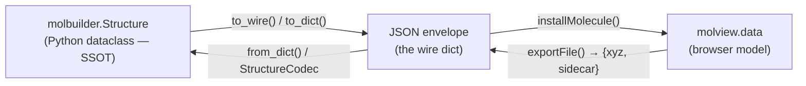
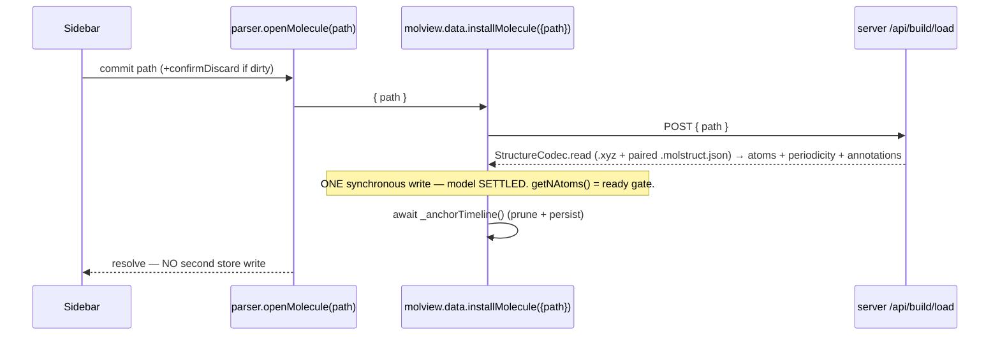
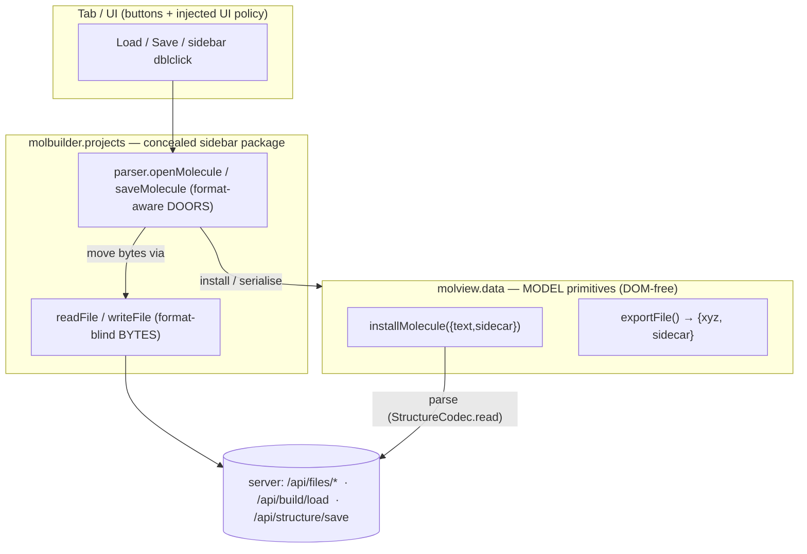

# Structure — the core object, its codec, and its file doors

**Role:** contract
**Domain:** model
**This is the master doc for the Structure aspect.** Its large facets live as
sub-documents sharing the `structure-` filename prefix (so the hierarchy is
visible in the name itself):
- [`structure-periodicity.md`](structure-periodicity.md) — cell · cell_origin ·
  axis_kind · derived pbc · vacuum (the per-axis box behaviour).
- `structure-annotations.md` — per-atom channels + region labels *(pending)*.
- `structure-sidecars.md` — the `.molstruct.json` on-disk envelope *(pending)*.

**Companions** (separate model modules): `model/parse.md` (the read stack that
produces a Structure from engine output), `model/data-vocabulary.md` (the model
overview — shared JSON names). **Frontend** (migrating to `web/`): the
projects-sidebar module (the Load/Save UI over the doors) and the MolView
module (`molview.data`, the JS model primitives).

`Structure` is molbuilder's **lingua franca**: the one dataclass every builder
yields and every emitter consumes. This doc is the contract for the object
itself, its serialization codec, and the one door that reads/writes it as a
paired file on disk — across **both** the Python/CLI backend and the JS/user
frontend.

> **The one-object rule.** A structure's identity lives in three models that
> must stay byte-identical as data crosses the wire. Exactly one component per
> language may **name a field** or index a structure dict by key: the Python
> `Structure` codec, and the JS `data-model.js` accessors. Everyone else
> carries the dict verbatim as an opaque envelope. This is what stops the
> recurring "a field silently drops to its default on reload" bug (the
> `cell_origin → 0` regression); the field set appears in source **once per
> language**.



---

## 1. The object (L1 data model)

**Module:** `molbuilder/structure.py`. **Tests:** `tests/test_structure.py`,
`tests/test_load.py`, `tests/test_pdb_ter.py`.

Adding a new format means a new method on `Structure`, not changes to the
builders.

```python
@dataclass
class Structure:
    elements:      List[str]                  # chemical symbols, length N
    positions:     np.ndarray                 # shape (N, 3), Angstrom
    atom_names:    Optional[List[str]] = None # PDB-style name; default = elements
    residue_ids:   Optional[List[int]] = None # 1-based; default = all 1
    residue_names: Optional[List[str]] = None # 3-letter; default = all "MOL"
    chain_ids:     Optional[List[str]] = None # single char; default = all "A"
    title:         str = ""                   # XYZ comment / PDB TITLE
    # ── metadata (each detailed in a sub-doc; serialized as one block) ──
    # cell, cell_origin, pbc, axis_kind, vacuum → structure-periodicity.md
    #     (NB: kgrid is NOT a structure field — it is a SiestaConfig DFT
    #      sampling knob; see engines/siesta.md)
    # regions, frozen_atoms, annotations        → structure-annotations.md
```

**Invariants enforced by `__post_init__`** (the single validation site):

- `positions` must reshape to `(N, 3)`, else `ValueError`.
- Every optional list, if provided, has length N; `None` gets the per-field
  default above.
- The metadata fields are validated/reconciled here too (see
  `model/periodicity.md` for the cell/axis_kind reconciliation). Because
  `apply_metadata_dict` re-runs `__post_init__`, **all field validation lives
  in one place** — there is no second validator to drift from.

Atom **order is identity**: the 0-based index into `elements`/`positions`,
fixed by the atom order in the source file, is the canonical atom identity
carried everywhere (see `model/data-vocabulary.md` § atom-index for the full
provenance + the 0-based/1-based boundary).

---

## 2. Backend surface (Python / CLI)

### 2.1 The whole-structure codec — `to_dict` / `from_dict` / `to_wire`

Three methods on `Structure` (`structure.py`), all shipped:

| Method | Purpose | Round-trips? |
|---|---|---|
| `to_dict()` → `dict` (`:574`) | The ONE canonical serializer: coordinates + per-atom columns + the full metadata block (via `metadata_to_dict()`). | **Yes** — `from_dict(s.to_dict())` reproduces `s` exactly. |
| `from_dict(d)` → `Structure` (`:593`) | The ONE canonical deserializer: builds the object, then `apply_metadata_dict` (the same validator a fresh Structure runs). | inverse of `to_dict` |
| `to_wire()` → `dict` (`:615`) | The read-only shape an endpoint returns to the browser: `to_dict()` **plus** server-resolved derivations the client must not recompute (`resolve_cell` / `resolve_cell_origin`), the flat `atoms` render list, and legacy aliases. | No — a superset view |

```python
# to_dict() — the loss-free round-trip unit; NOBODY else assembles this dict
{
    "title": ..., "elements": [...], "positions": [[x,y,z], ...],
    "atom_names": [...], "residue_ids": [...],
    "residue_names": [...], "chain_ids": [...],
    "metadata": self.metadata_to_dict(),   # the ONE metadata codec, nested verbatim
}
```

**Why two methods, not one flag.** `to_dict()` is the loss-free round-trip
unit (persistence, sidecar, CLI). `to_wire()` is a browser-only superset
(derived fields + render list + back-compat aliases) that `from_dict` never
has to invert. The resolved cell/origin is computed **once**, inside
`to_wire()`, so it can never drift or drop.

> **Verified against code (2026-07-26):** `_shared.structure_to_dict`
> (`web/blueprints/_shared.py:346`) was **not** deleted (as an earlier draft
> of this contract claimed) — it is retained as a thin back-compat wrapper
> that calls `struct.to_wire()` and re-exposes a few top-level legacy keys.
> `ok_structure_response` (`:423`) wraps it. New code calls `to_wire()`
> directly.

### 2.2 The metadata authority — `metadata_to_dict` / `apply_metadata_dict`

The structure metadata (periodicity + region tags + per-atom annotations) has
exactly **one** serialization authority: `Structure` itself.

```python
Structure.metadata_to_dict()      -> dict   # struct → JSON metadata dict (THE writer, :514)
Structure.apply_metadata_dict(d)  -> None   # JSON metadata dict → struct (THE reader, :533)
```

- **Scope** = the dataclass's own metadata fields: `regions`, `frozen_atoms`,
  `cell`, `cell_origin`, `pbc`, `axis_kind`, `vacuum`, `annotations`.
- **Strict JSON** — the dict is lists/dicts/bools/floats. `annotations` are
  JSON channel dicts (via `annotations_to_json`), **never** live `AtomChannel`
  objects (those live only in-memory; see `model/annotations.md`).
- `apply_metadata_dict` is **full-replace**: an absent key resets that field
  to its default (absent `cell` → non-periodic; absent `regions` → none). It
  re-runs `__post_init__`, so validation is single-sourced.
- **NOT in scope** (they sit *around* the contract): `selection_rules` (a
  sidecar-only pass-through) and the sidecar **envelope** (`schema_version` /
  `n_atoms_total` / `structure_hash` / `created_by` / `created_at`) — see
  `model/sidecars.md`.

**To add a metadata key:** (1) add the field to the dataclass with its
`__post_init__` validation; (2) add it to `metadata_to_dict()` +
`apply_metadata_dict()` — nowhere else; (3) if it must survive the sidecar,
bump `SCHEMA_VERSION` and register the new version in the read module (see
`model/sidecars.md`); (4) if MolView must show/edit it, surface it in the web
`to_wire` periodicity block and read it in `molview.data`; (5) add a
save→load→apply round-trip test. You do **not** touch `to_dict`, the sidecar
`to_dict`, or `apply_to_structure` — they read the field set from the two
methods above, so they pick it up for free.

**To remove one:** delete it from the dataclass + both methods. Old sidecars
that still carry it load fine (`apply_metadata_dict` ignores unknown keys).
Never leave a "read-but-never-write" half-migration — that is the drift this
contract exists to prevent.

### 2.3 Geometry I/O

| Method | Format | Guarantees |
|---|---|---|
| `to_xyz(path=None, *, comment="")` (`:1074`) | xmol XYZ | line 1 = `N`; line 2 = comment-or-title; then `El x y z` per atom |
| `to_pdb(path=None)` (`:1101`) | PDB ATOM records | TITLE if set; serial capped `99999` (overflow → `*****`); residue id capped `9999`; chain id truncated to 1 char |
| `to_pyscf(*, as_string=False)` (`:1140`) | PySCF `gto.M` atom kwarg | `(symbol,(x,y,z))` tuples; multi-line string if `as_string=True` |
| `to_ase()` (`:1167`) | `ase.Atoms` | raises `ImportError` with install hint if ASE absent |
| `from_xyz(source, *, title=None)` (`:820`) | XYZ path **or** raw text | see requirements below |
| `from_pdb(source, *, title=None)` (`:879`) | PDB path **or** raw text | reads `ATOM`/`HETATM`; first MODEL only; TER handling below |

`from_*` accept a filesystem path or raw text (`_resolve_source` tries
`os.path.isfile` first, falls back to text).

**Round-trip guarantees.** XYZ: elements + positions exact; metadata drops to
defaults (XYZ has no slots). PDB: elements + positions + atom_names +
residue_ids + residue_names + chain_ids exact.

**`from_xyz` requirements:** line 1 = non-negative integer N; lines 2..N+2
read; trailing blank/short lines tolerated; bad header or short atom line →
`ValueError` with the offending line.

**`from_pdb` / TER handling** (pinned by `test_pdb_ter.py`): a segment counter
increments on every `TER`; each atom records `(chain_letter_or_"_",
segment_index)`; a chain letter unique to one segment passes through unchanged;
one spanning multiple segments is disambiguated by appending the segment index
(`A` → `A0`, `A1`); a blank chain-id column maps to `"A"` when unambiguous,
`"_<seg>"` when it spans segments. **Forbidden:** silently truncating serial
`> 99999` (must write `*****`), coercing a multi-char `chain_id` to `?` (must
truncate to first char), or crashing on a TER between ATOM blocks.

**Top-level dispatcher.** `molbuilder.load(path, *, format="auto")`
(`molbuilder/__init__.py:56`) reads `.xyz` or `.pdb` by extension; unknown
extension → `ValueError` with explicit instruction.

### 2.4 The paired-file door — `StructureCodec` (L2)

The `.xyz` and its optional `.molstruct.json` are **always** read/written
together. That pairing + atomicity is owned by one L2 object,
`StructureCodec` (`molbuilder/workingcopy_structure.py`):

```python
class StructureCodec:                       # L2 (may use the L2 sidecar codec)
    def read(self, source_path) -> Structure:        # :134
        """Parse geometry (.pdb by extension, else .xyz) AND its paired
        sidecar (sidecar_path_for), applying metadata via
        molstruct.apply_to_structure. Missing sidecar = empty metadata
        (NOT an error). Owns the pairing rule + read order."""
    def write(self, struct, target, *, atomic=True) -> Path:   # :91
        """Write the pair as one unit: geometry to `target`, and (when there
        is non-default metadata) the sidecar to sidecar_path_for(target).
        Atomic: each half staged to a temp sibling + os.replace'd; geometry
        swapped FIRST, then sidecar, so a reader never sees new geometry with
        a stale sidecar's atom indices. No-metadata + stale sidecar => sidecar
        removed (no .json == empty metadata). Owns both-or-neither."""
    def from_scratch(self, blob) -> Structure:       # :146 — rebuild from {xyz, sidecar}
```

> **Why the file door is L2, not a method on L1 `Structure`.** The layering
> invariant (`tests/test_layering.py`) forbids an L1 module importing an L2
> one. Reading/writing the pair needs the **L2** sidecar codec
> (`sidecars/molstruct.py` — path derivation, atomic JSON, the envelope).
> Putting it on L1 would force a second L1 copy of the sidecar format — the
> exact drift this contract kills. So the pure data codec
> (`to_dict`/`from_dict`/`to_wire`/`metadata_to_dict`) is L1; the paired-file
> door is L2 `StructureCodec`, which routes the sidecar through the one
> metadata authority.

### 2.5 CLI

```bash
molbuilder dna ATGC | molbuilder fdf - out.fdf     # Structure over stdin/stdout
molbuilder peptide ASEQ                            # → XYZ on stdout
```

The CLI currently reads/writes geometry directly (`struct.to_xyz()` /
`from_xyz`), **not** through `StructureCodec` — so a CLI save does not yet
emit the sidecar pair. Routing CLI load/save through `StructureCodec` is open
work (`roadmap.md` → front-end/model finalization; task #73), not shipped.

---

## 3. Frontend surface (JS / user)

The tab-facing surface is **two doors** plus the model primitives they call.
A tab calls a door and nothing below it; reaching around a door (a second
file stack, a browser-written sidecar, poking the store) is wrong by
definition.

### 3.1 The doors — `projects.parser.openMolecule` / `saveMolecule`

Both are **FILE-ONLY**: the door hands a `path` (and, on save, the model's
`{xyz, sidecar}` blob) to the **server**, which owns file access, the
`.xyz`↔`.molstruct.json` pairing, and the sidecar schema. The browser reads
no bytes, derives no sidecar path, and **never authors the sidecar schema**
(a browser-written sidecar had no `schema_version`, so the load door rejected
the pair — the save→reload breaker, task #75).

| Door | Does | Server seam |
|---|---|---|
| `openMolecule(path, {confirmDiscard?})` | dirty-gate → `molview.data.installMolecule({path})` | `POST /api/build/load` (`build.py:677`) → `StructureCodec.read` |
| `saveMolecule(path, {overwrite?})` | `exportFile()` → `{xyz,sidecar}` (refuses a geometry↔labels desync) → POST | `POST /api/structure/save` (`build.py:634`) → `StructureCodec.from_scratch` + `.write` (stamps `schema_version` + real `structure_hash`) |

`openMolecule` is **only** for a project-file path. Generated text
(smiles/dna/…) has no file, so generators call
`molview.data.installMolecule({text})` directly — the model primitive, not the
door. **`saveMolecule` writes only `.xyz`** (`exportFile` produces `{xyz,
sidecar}`; there is no PDB serializer); a save to a `.pdb` path would receive
XYZ bytes (the shipped caller forces `.xyz`). Asymmetry: `openMolecule` *loads*
a `.pdb` (the parse seam sniffs PDB), but `saveMolecule` can only *save* `.xyz`.
A 409 "exists" envelope → `{ok:false, needsOverwrite:true}` so the tab confirms
and retries with `{overwrite:true}` (the dialog is UI policy, injected — the
door + model layers stay DOM-free).

### 3.2 The model primitives + the JS key-namer

`molview.data` (`lib/molview/data-model.js`) is the browser model:
`installMolecule({path} | {text[,sidecar,…]})`, `exportFile() → {xyz,
sidecar}`, `markSaved(path)`. Named-key reads of the wire dict happen in
**one** place — the `data-model.js` accessors (`getUnitCell`,
`getUnitCellOrigin`, `getVacuum`, `getAxisKind`, …), the JS analogue of
Structure's codec. Everywhere else the browser carries `periodicity` /
`annotations` / `atoms` as **opaque blobs** (verbatim deep-clone, no field
whitelist), so a server-added field survives persistence untouched. The one
deliberate write accessor, `setPeriodicity`, names only the lattice keys it
*manages* (it is an editor, not a carry) and is spread-based, so it cannot
drop an unlisted field.

### 3.3 SETTLE-BEFORE-READY — one store write per load

`installMolecule` installs the FINAL model — sidecar-enriched atoms, source,
periodicity, AND the cleared selection — in **one** synchronous write; the
"ready" signals fire at that write, and **no second store write may follow**
(it would land after "ready" and clobber whatever a consumer already did).



> The 2026-07 regression that defined this: load used to install atoms (open
> the ready gate), then `await adoptSession({selection:[]})` ~300 ms later,
> wiping a click made in the gap. Fix: sidecar atoms ride in on the single
> install; the trailing write is gone.

### 3.4 Consumer map (shipped)

| Consumer | `file:function` | Call |
|---|---|---|
| Modify — Load / dblclick | `modify/selection-bootstrap.js:_commitFile` | `openMolecule(path, {confirmDiscard})` |
| Modify — Save panel | `modify/structure/save.js:_saveDataset` | `saveMolecule(path, {overwrite})` + dialog |
| Transport commit | `lib/transport/core.js:_showInMolview` | `openMolecule(path)` + `molview.mount` |
| Spectra commit | `spectra/viewer.js:_commitStructure` | `openMolecule(path)` + `molview.mount` |
| Results structure inspector | `lib/inspectors/structure.js` | `openMolecule(path)` + `molview.mount` |
| Structure-optimization | `structure-optimization/viewer.js:_commitStructure` | `openMolecule(path)`; reads state off the model |
| Generators (smiles/dna/…) | `modify/structure/*.js` → `page.js` | `molview.data.installMolecule({text})` (not a door) |
| Trajectory inspector | `lib/trajectory/core.js` | `installMolecule({text})` + `reloadFrames(...)` |

"Load + mount is ONE shared path": Transport, Spectra, and the Results
inspector each open the picked file via `openMolecule(path)`, then
`molview.mount(host, ws, {mode, owner})`. When each hand-rolled its own copy
they drifted (the inspector read raw XYZ and dropped the sidecar — the label
bug). One path = the sidecar-correct load, for every tab.

---

## 4. The wire contract (backend ⇄ frontend)

The doors sit over the projects byte-layer + the parse seam; the model
primitives sit over the same server. The dependency points one way
(`projects.parser → molview.data`, resolved by a call-time lookup, so there is
no cycle):



| Layer | Owns | Never |
|---|---|---|
| `projects` byte layer | locating a file + moving its **bytes** | parses a molecule; knows the model |
| `projects.parser` doors | read→parse→install (load); serialise→write (save); the pairing | owns a parser (calls the seam) |
| `molview.data` primitives | text(+sidecar) ⇄ live molecule; the atomic install | fetches a file; owns a file endpoint |
| tab / UI | wiring buttons; UI policy (dirty/overwrite — injected) | reaches past a door |

**Where the sidecar schema lives** (server, one home):
`sidecars/molstruct.py` — `apply_to_structure(struct, dict)` (`:467`),
`load_text(text)`, `save(...)` (`:412`), `sidecar_path_for(xyz)` (`:90`). The
byte layer knows the pair only as "which bytes travel together"; interpreting
it (parse + apply the schema) happens only inside the server seam. Clicking a
`.molstruct.json` in the sidebar shows its JSON via the `source` inspector —
open the paired `.xyz` to view the structure.

---

## 5. The round-trip invariant + enforcement

A single Python test constructs a Structure with **every** metadata field set
to a non-default value and asserts it survives each hop unchanged — the test
that would have caught `cell_origin → 0` at the source
(`tests/test_structure_authority_roundtrip.py`):

```python
def _fully_populated_structure():
    s = Structure(elements=["C", "O"], positions=[[1.,2.,3.], [4.,5.,6.]])
    s.apply_metadata_dict({
        "cell": [[10,0,0],[0,10,0],[0,0,10]], "cell_origin": [1.5,2.5,3.5],
        "pbc": [True,True,False], "axis_kind": ["a","b","vacuum"],
        "vacuum": [0.,0.,12.], "regions": {"electrode":[0], "channel":[1]},
        "frozen_atoms": [0],
        "annotations": {"charge": {"kind":"float","values":[0.1,-0.1]}},
    })
    return s

# to_dict → from_dict preserves every field; to_wire carries resolved_cell_origin;
# StructureCodec.write → read preserves metadata and writes the .molstruct.json pair.
```

The end-to-end E2E fixture (`test_structure_inspector_measurement_e2e.py`)
sets a non-zero `cell_origin` and asserts `molview.data` reports that origin
after load → serialise → restore — pinning the field through the JS mirror,
not just the Python codec.

**Anti-patterns (rejected by reference to this doc):** hand-rolled structure
repacks; raw-dict metadata access (`d["cell_origin"]`, `d.get("pbc")`) outside
the two codecs; a JS field whitelist for periodicity; a second file stack or a
browser-authored sidecar. Named-key access lives in exactly one place per
language.

---

## 6. Status

**Shipped (2026-07):** the L1 codec (`to_dict`/`from_dict`/`to_wire`) + the L2
`StructureCodec` (read/write/from_scratch); the server seams
(`/api/build/load`, `/api/structure/save`); the JS doors (`parser.js`) with
every consumer above repointed; the JS periodicity field-whitelist replaced by
verbatim deep-clone; the old `molview.data` file stack + `/api/workingcopy/*`
door path removed. `_shared.structure_to_dict` retained as a thin back-compat
wrapper over `to_wire()`.

**Open work** (tracked in `roadmap.md`): route the **CLI** load/save through
`StructureCodec` so a CLI save emits the `.xyz` + `.molstruct.json` pair like
the web save does (task #73) — today the CLI writes geometry only.
